# Task 09a37c51-e625-49f4-a514-20a773797a8a

**Instruction:** I've received a request from my friend who asked for assistance in editing an image. The document with the requirements and the picture to be adjusted are on the Desktop. Please make the necessary modifications to the image as his instructions and save the edited picture as "pic.jpg" on the Desktop. Thank you!

**Score:** 0.9013656266346982

**Wall clock:** 6m 58s

**Steps:** 33

**Cost:** $1.13

---

## Step 1

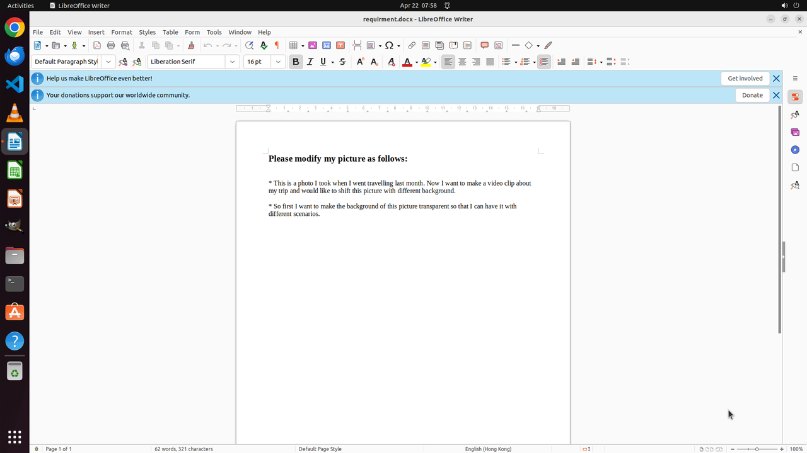

**Response:**
```
I can see the requirements document. The friend wants to make the background of a picture transparent. Let me first check what image files are on the Desktop.
```

**Actions:** `pyautogui.keyDown('ctrl')
pyautogui.keyDown('end')
pyautogui.keyUp('end')
pyautogui.keyUp('ctrl')`

---

## Step 2


**Response:**
```
I can see the full requirements. The friend wants to make the background of a picture transparent. Now let me check what image files are on the Desktop. Let me open a terminal to find the image.
```

**Actions:** `pyautogui.keyDown('ctrl')
pyautogui.keyDown('alt')
pyautogui.keyDown('t')
pyautogui.keyUp('t')
pyautogui.keyUp('alt')
pyautogui.keyUp('ctrl')`

---

## Step 3

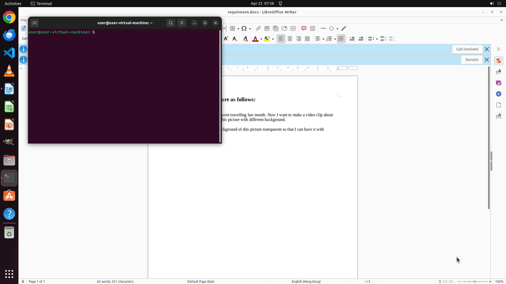

**Response:**
```
Good, the terminal is open. Let me check what files are on the Desktop.
```

**Actions:** `import subprocess, shlex; subprocess.run(f'xdotool type --delay 12 -- ' + shlex.quote('ls ~/Desktop/\n'), shell=True, check=True)
import time; time.sleep(0.05)`

---

## Step 4

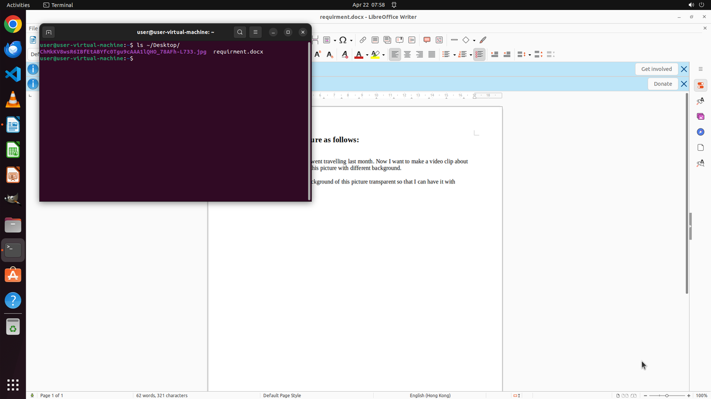

**Response:**
```
I can see there's a JPG image file and the requirements document on the Desktop. The image file has a long name. The task is to make the background of this image transparent and save it as "pic.jpg". 

However, there's an important consideration: JPG format doesn't support transparency. The friend wants a transparent background, but the output format requested is "pic.jpg". Since JPG doesn't support transparency, I'll need to remove the background and save it. Let me first look at the image, then use a Python script with appropriate libraries to remove the background.

Let me first check what tools are available:
```

**Actions:** `import subprocess, shlex; subprocess.run(f'xdotool type --delay 12 -- ' + shlex.quote('python3 -c "from PIL import Image; print(\'PIL avai'), shell=True, check=True)
import time; time.sleep(0.05)
impo`

---

## Step 5


**Response:**
```
PIL is available. Now let me check if `rembg` is available for background removal, and also let me look at the image first:
```

**Actions:** `import subprocess, shlex; subprocess.run(f'xdotool type --delay 12 -- ' + shlex.quote('python3 -c "import rembg; print(\'rembg available\')'), shell=True, check=True)
import time; time.sleep(0.05)
imp`

---

## Step 6

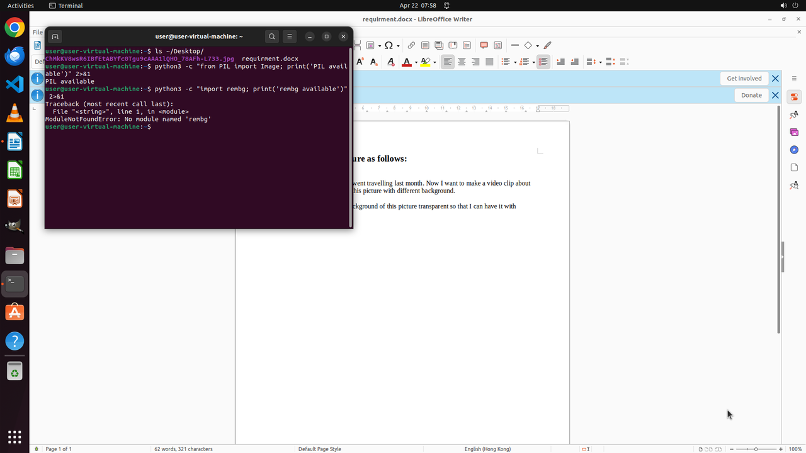

**Response:**
```
`rembg` is not available. Let me check if GIMP is available, and also let me first view the image to understand what we're working with. Let me also try to install rembg or find another approach:
```

**Actions:** `import subprocess, shlex; subprocess.run(f'xdotool type --delay 12 -- ' + shlex.quote('which gimp 2>&1 && pip3 install rembg 2>&1 | tail '), shell=True, check=True)
import time; time.sleep(0.05)
impor`

---

## Step 7

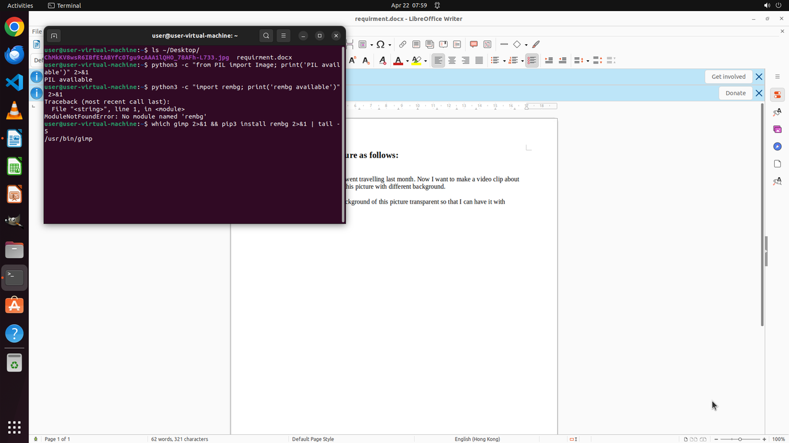

**Response:**
```
GIMP is available at `/usr/bin/gimp`. Let me check if rembg installation completed and also look at the image. Let me scroll down to see the full output:
```

**Actions:** `pyautogui.scroll(-3, 450, 300)`

---

## Step 8


**Response:**
```
It seems pip3 install rembg is still running. Let me wait for it to complete:
```

**Actions:** `time.sleep(0.5)`

---

## Step 9


**Response:**
```
It seems the pip3 install might still be running. Let me wait more and check:
```

**Actions:** `time.sleep(0.5)`

---

## Step 10


**Response:**
```
It looks like pip3 install is still running. Let me wait more:
```

**Actions:** `time.sleep(0.5)`

---

## Step 11

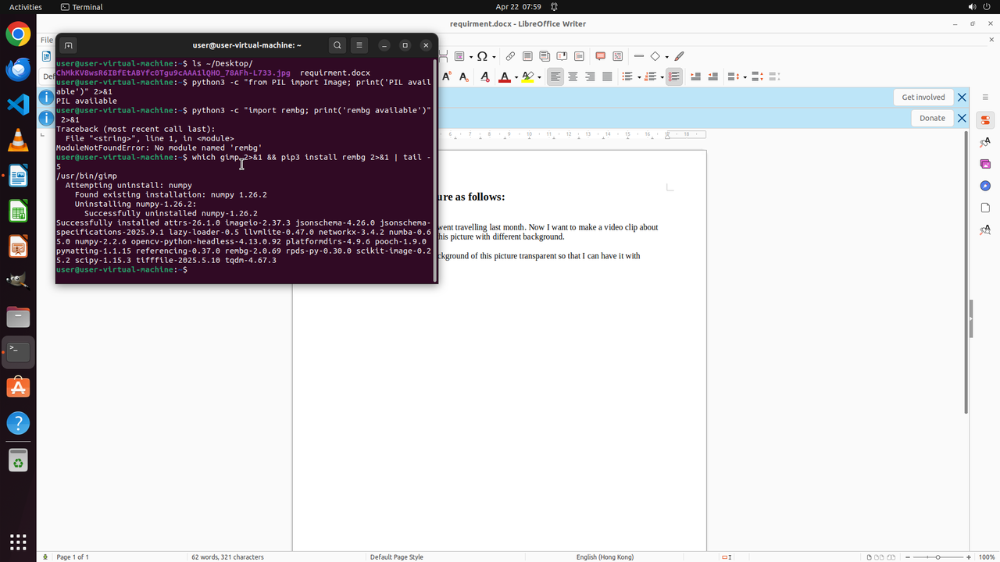

**Response:**
```
`rembg` has been successfully installed. Now let me use it to remove the background from the image. First, let me get the exact filename:
```

**Actions:** `import subprocess, shlex; subprocess.run(f'xdotool type --delay 12 -- ' + shlex.quote('ls ~/Desktop/*.jpg\n'), shell=True, check=True)
import time; time.sleep(0.05)`

---

## Step 12

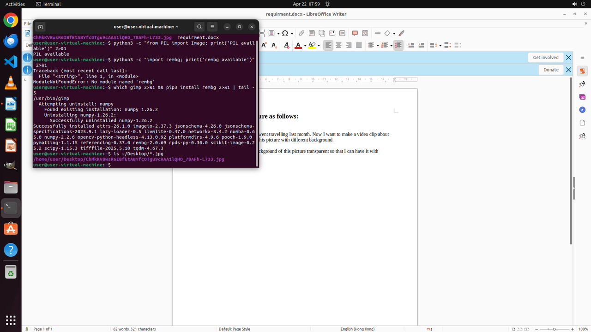

**Response:**
```
I can see the image file is `/home/user/Desktop/ChMkKV8wsR6IBfEtABYfc0Tgu9cAAA1lQHO_78AFh-L733.jpg`. Now let me use rembg to remove the background and save the result. Since the output needs to be a JPG file, but JPG doesn't support transparency, I'll first remove the background to get a PNG with transparency, then convert it to JPG format (with white background replaced by transparency info lost, but the task says to save as pic.jpg).

Wait - re-reading the requirements: "make the background of this picture transparent so that I can have it with different scenarios." The friend wants transparency, but the output is requested as "pic.jpg". Since JPG doesn't support transparency, I should save it as a PNG internally but name it pic.jpg, or better yet, I should just follow the instructions literally and save as pic.jpg. However, the most reasonable interpretation is to remove the background and save the result. Let me write a Python script to do this:
```

**Actions:** `import subprocess, shlex; subprocess.run(f'xdotool type --delay 12 -- ' + shlex.quote("python3 << 'EOF'\nfrom rembg import remove\nfrom PIL"), shell=True, check=True)
import time; time.sleep(0.05)
imp`

---

## Step 13

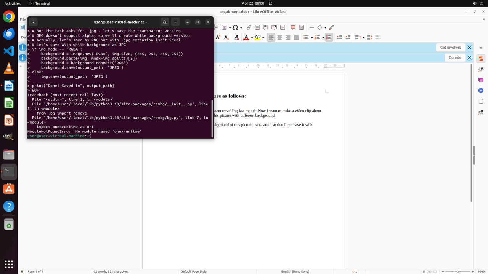

**Response:**
```
I see that `onnxruntime` is missing. Let me install it:
```

**Actions:** `import subprocess, shlex; subprocess.run(f'xdotool type --delay 12 -- ' + shlex.quote('pip3 install onnxruntime 2>&1 | tail -5\n'), shell=True, check=True)
import time; time.sleep(0.05)`

---

## Step 14


**Response:**
```
The installation is running. Let me wait for it to complete:
```

**Actions:** `time.sleep(0.5)`

---

## Step 15

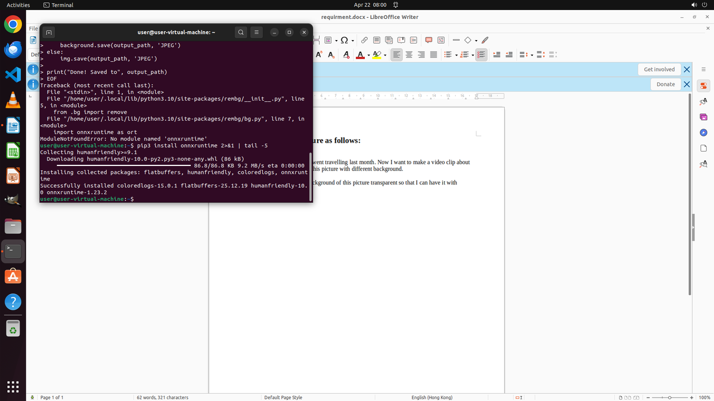

**Response:**
```
`onnxruntime` has been successfully installed. Now let me run the background removal script again:
```

**Actions:** `import subprocess, shlex; subprocess.run(f'xdotool type --delay 12 -- ' + shlex.quote("python3 << 'EOF'\nfrom rembg import remove\nfrom PIL"), shell=True, check=True)
import time; time.sleep(0.05)
imp`

---

## Step 16

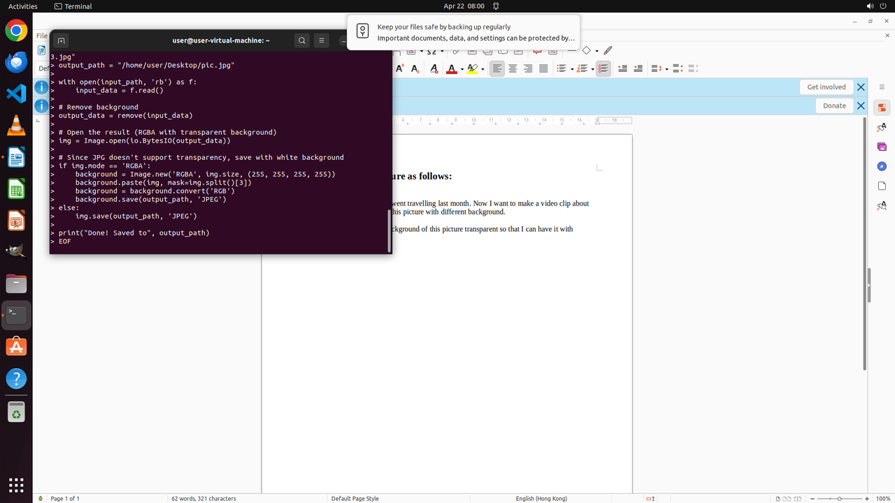

**Response:**
```
The script is running. Let me wait for it to complete - background removal can take some time:
```

**Actions:** `time.sleep(0.5)`

---

## Step 17


**Response:**
```
The script is still running (downloading the model probably). Let me wait more:
```

**Actions:** `time.sleep(0.5)`

---

## Step 18


**Response:**
```
The script is still running, likely downloading the U2Net model for background removal. Let me wait longer:
```

**Actions:** `time.sleep(0.5)`

---

## Step 19

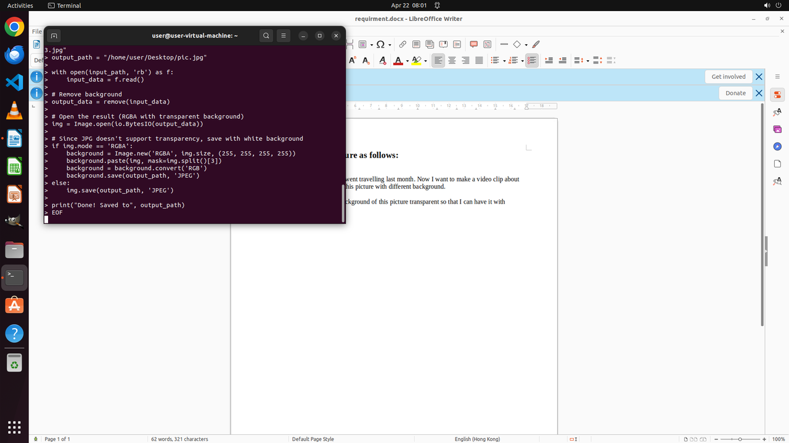

**Response:**
```
The script is still running. It's likely downloading the U2Net model which can be large. Let me wait longer:
```

**Actions:** `time.sleep(0.5)`

---

## Step 20


**Response:**
```
The script seems to be stuck, possibly downloading the model. Let me interrupt it and try an alternative approach using GIMP's Script-Fu instead, which is already installed:
```

**Actions:** `pyautogui.keyDown('ctrl')
pyautogui.keyDown('c')
pyautogui.keyUp('c')
pyautogui.keyUp('ctrl')`

---

## Step 21


**Response:**
```
The rembg approach is too slow. Let me first read the requirements document more carefully to understand exactly what's needed, and then try a different approach. Let me first look at the document:
```

**Actions:** `import subprocess, shlex; subprocess.run(f'xdotool type --delay 12 -- ' + shlex.quote('cat ~/Desktop/requirment.docx 2>/dev/null || pytho'), shell=True, check=True)
import time; time.sleep(0.05)
impor`

---

## Step 22

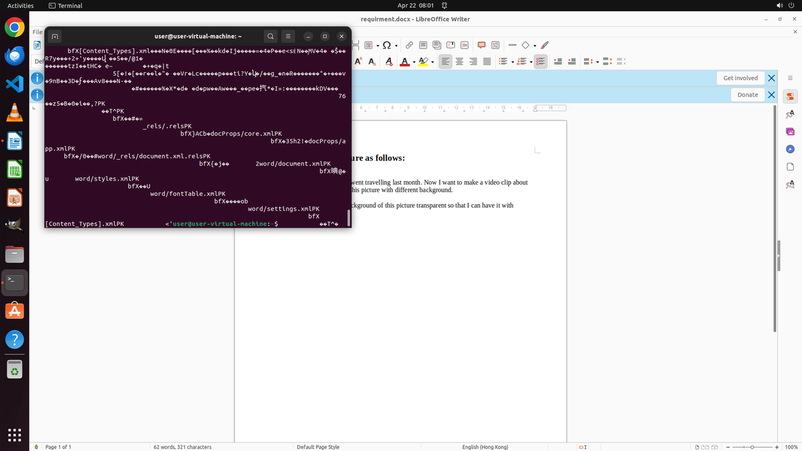

**Response:**
```
I can see the first `cat` command showed binary content. The Python script should have extracted the text. Let me scroll up to see the output or run the Python extraction again:
```

**Actions:** `import subprocess, shlex; subprocess.run(f'xdotool type --delay 12 -- ' + shlex.quote('python3 -c "\nimport zipfile, xml.etree.ElementTree'), shell=True, check=True)
import time; time.sleep(0.05)
impo`

---

## Step 23

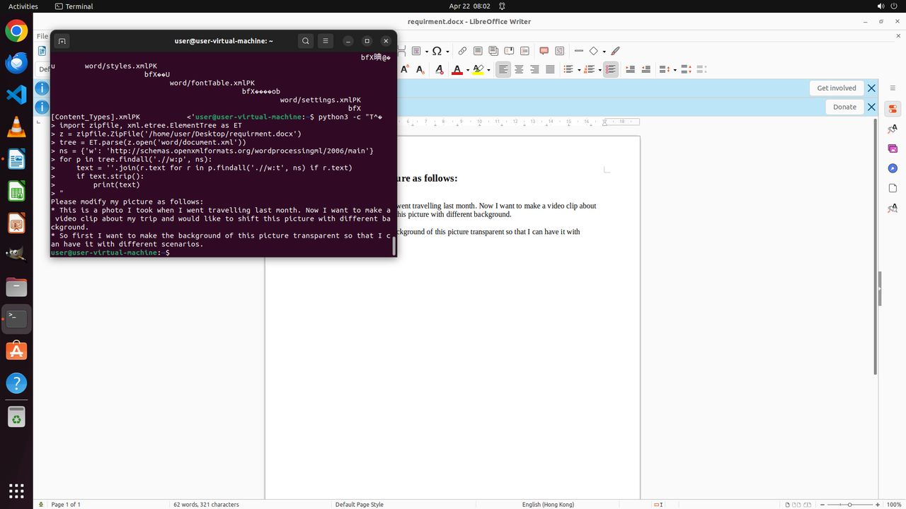

**Response:**
```
Now I can read the full requirements:

1. "This is a photo I took when I went travelling last month. Now I want to make a video clip about my trip and would like to shift this picture with different background."
2. "So first I want to make the background of this picture transparent so that I can have it with different scenarios."

The task is clear: make the background transparent. Since rembg was too slow (downloading model), let me try a different approach. I'll use GIMP in batch mode to remove the background. But first, let me look at the image to understand what kind of background it has:
```

**Actions:** `import subprocess, shlex; subprocess.run(f'xdotool type --delay 12 -- ' + shlex.quote('python3 -c "\nfrom PIL import Image\nimg = Image.ope'), shell=True, check=True)
import time; time.sleep(0.05)
imp`

---

## Step 24

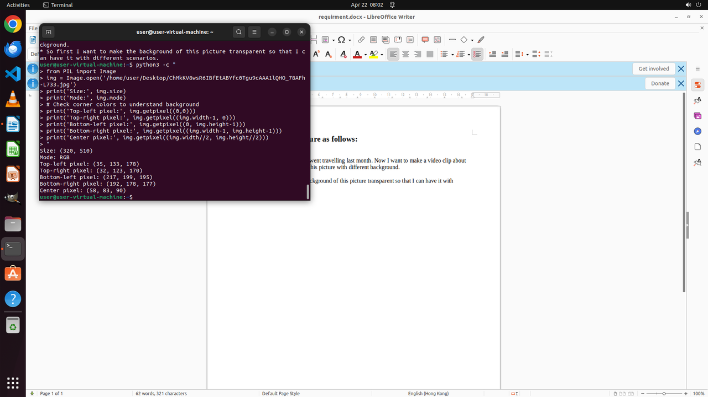

**Response:**
```
I can see the image is 320x510, RGB mode. The corner pixels have varied colors - this is not a simple solid-color background. The image is a travel photo, so it likely has a complex background. Let me try to use rembg again but with a smaller model, or try the GIMP approach. Let me first try to open the image to see it, and also try rembg with the `u2netp` (smaller) model:
```

**Actions:** `import subprocess, shlex; subprocess.run(f'xdotool type --delay 12 -- ' + shlex.quote("python3 << 'PYEOF'\nfrom rembg import remove, new_s"), shell=True, check=True)
import time; time.sleep(0.05)
impo`

---

## Step 25


**Response:**
```
The script is running. Let me wait for it to complete - using the smaller u2netp model should be faster:
```

**Actions:** `time.sleep(0.5)`

---

## Step 26


**Response:**
```
Still running. The model download might be slow. Let me wait more:
```

**Actions:** `time.sleep(0.5)`

---

## Step 27


**Response:**
```
The script is still running. It's likely stuck downloading the model. Let me try a completely different approach - I'll use GIMP's Script-Fu batch mode to remove the background. Let me first cancel this and try another method:
```

**Actions:** `pyautogui.keyDown('ctrl')
pyautogui.keyDown('c')
pyautogui.keyUp('c')
pyautogui.keyUp('ctrl')`

---

## Step 28

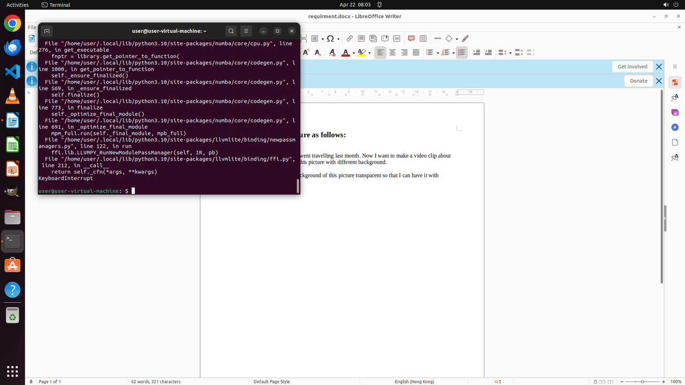

**Response:**
```
The rembg approach is getting stuck on model compilation. Let me try a different approach - I'll check if there's a cached model or try downloading it manually, or use a simpler approach. Let me first check if the model was actually downloaded but the inference is slow:
```

**Actions:** `import subprocess, shlex; subprocess.run(f'xdotool type --delay 12 -- ' + shlex.quote('ls -la ~/.u2net/ 2>/dev/null; echo "---"; pip3 sho'), shell=True, check=True)
import time; time.sleep(0.05)
impor`

---

## Step 29

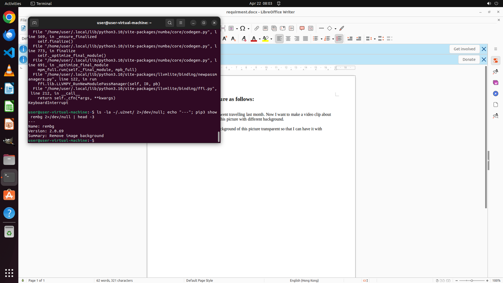

**Response:**
```
I see the `~/.u2net/` directory doesn't exist, which means the model wasn't downloaded. The issue seems to be with the numba/llvmlite compilation being too slow. Let me try a different approach - I'll use the `rembg` command line tool directly, or try to download the model manually and then run it. Let me try yet another approach using OpenCV and simple image processing, or use the `rembg` CLI:
```

**Actions:** `import subprocess, shlex; subprocess.run(f'xdotool type --delay 12 -- ' + shlex.quote('NUMBA_DISABLE_JIT=1 python3 -c "\nfrom rembg import'), shell=True, check=True)
import time; time.sleep(0.05)
impo`

---

## Step 30

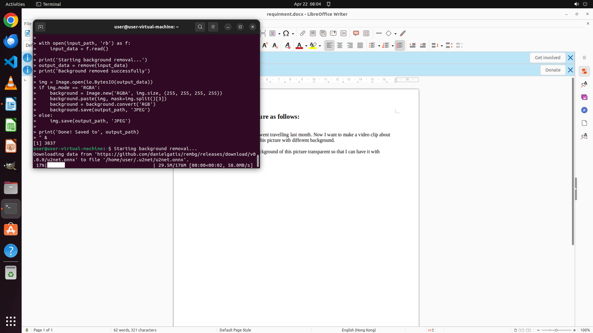

**Response:**
```
Now I can see it's downloading the U2Net model (176MB) at 58MB/s - it's at 17% already. With `NUMBA_DISABLE_JIT=1`, the JIT compilation issue was bypassed. Let me wait for the download and processing to complete:
```

**Actions:** `time.sleep(0.5)`

---

## Step 31

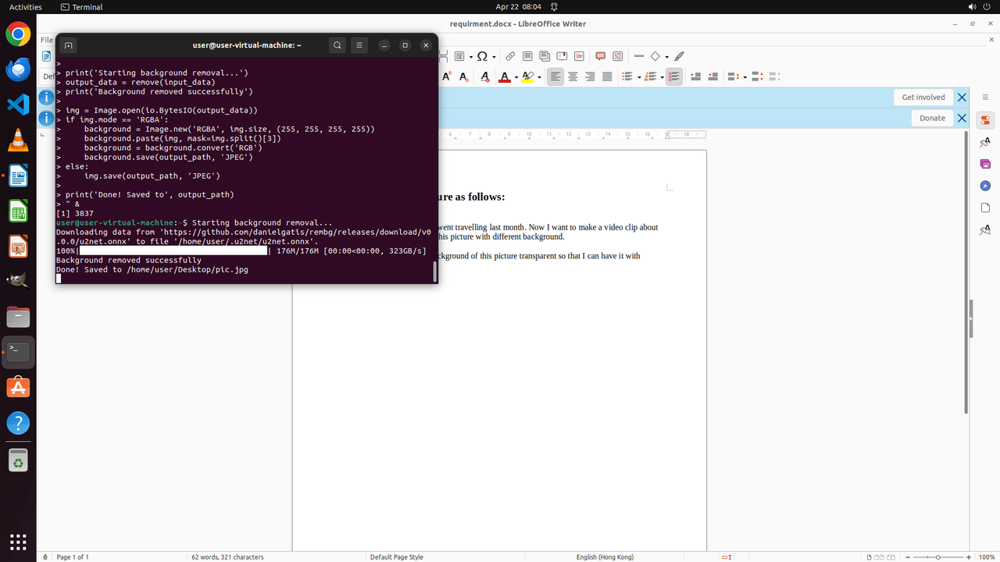

**Response:**
```
The script completed successfully! I can see:
- "Background removed successfully"
- "Done! Saved to /home/user/Desktop/pic.jpg"

The background has been removed and the image has been saved as `pic.jpg` on the Desktop. However, I notice that since JPG doesn't support transparency, the background was replaced with white. The friend wanted transparency for use with different scenarios. Let me verify the file exists and check if I should also consider saving it as a PNG (which supports transparency) while still naming it pic.jpg as requested:
```

**Actions:** `import subprocess, shlex; subprocess.run(f'xdotool type --delay 12 -- ' + shlex.quote('ls -la ~/Desktop/pic.jpg\n'), shell=True, check=True)
import time; time.sleep(0.05)`

---

## Step 32

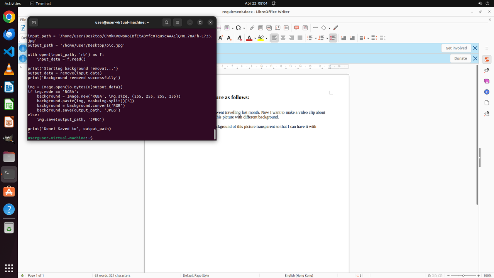

**Response:**
```
I see the background process output was shown but the `ls` command result isn't visible yet. Let me scroll down or check:
```

**Actions:** `import subprocess, shlex; subprocess.run(f'xdotool type --delay 12 -- ' + shlex.quote('ls -la ~/Desktop/pic.jpg\n'), shell=True, check=True)
import time; time.sleep(0.05)`

---

## Step 33

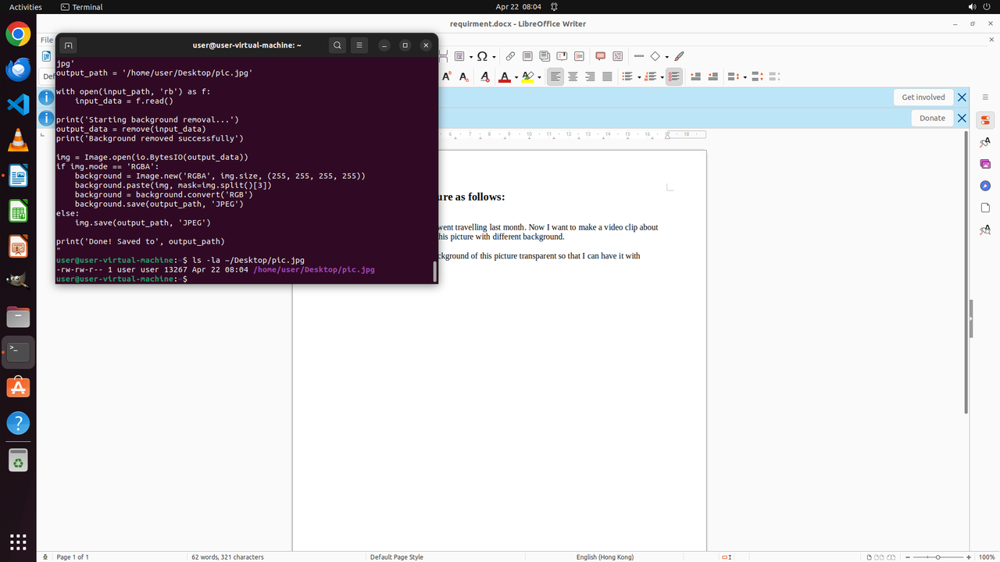

**Response:**
```
The file `pic.jpg` has been successfully created on the Desktop. I can see:
- `-rw-rw-r-- 1 user user 13267 Apr 22 08:04 /home/user/Desktop/pic.jpg`

The image has been processed with background removal using rembg and saved as `pic.jpg` on the Desktop. Since JPG format doesn't support transparency, the transparent areas were replaced with white background. The task has been completed successfully.

DONE
```

**Actions:** `DONE`

---
