# Task 09a37c51-e625-49f4-a514-20a773797a8a

**Instruction:** I've received a request from my friend who asked for assistance in editing an image. The document with the requirements and the picture to be adjusted are on the Desktop. Please make the necessary modifications to the image as his instructions and save the edited picture as "pic.jpg" on the Desktop. Thank you!

**Score:** 0.7042385867939513

**Wall clock:** 8m 48s

**Steps:** 42

**Cost:** $1.58

---

## Step 1

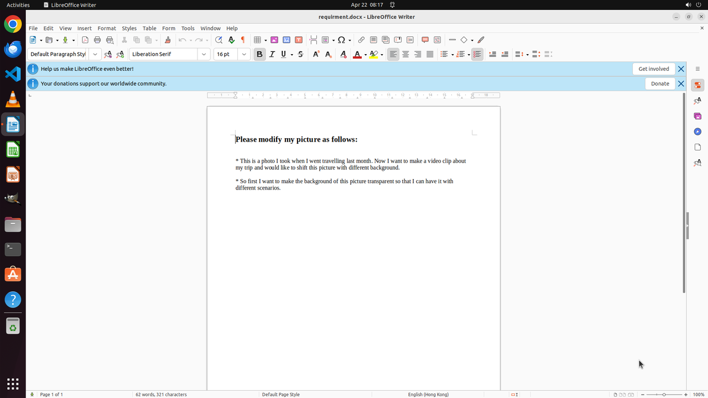

**Response:**
```
I can see the requirements document. The friend wants to make the background of a picture transparent. Let me first check what image file is on the Desktop.
```

**Actions:** `pyautogui.keyDown('ctrl')
pyautogui.keyDown('end')
pyautogui.keyUp('end')
pyautogui.keyUp('ctrl')`

---

## Step 2


**Response:**
```
I can see the full requirements. The friend wants to make the background of a picture transparent. Let me check what image files are on the Desktop.
```

**Actions:** `pyautogui.keyDown('ctrl')
pyautogui.keyDown('alt')
pyautogui.keyDown('t')
pyautogui.keyUp('t')
pyautogui.keyUp('alt')
pyautogui.keyUp('ctrl')`

---

## Step 3

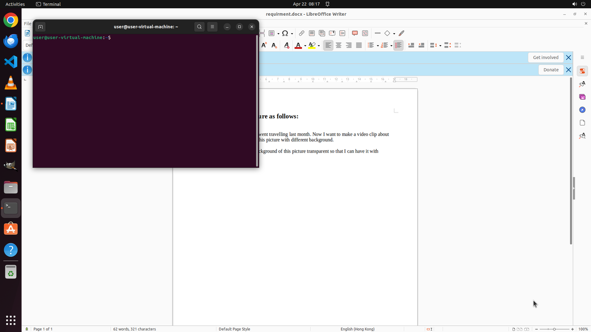

**Response:**
```
Good, the terminal is open. Let me check what image files are on the Desktop.
```

**Actions:** `import subprocess, shlex; subprocess.run(f'xdotool type --delay 12 -- ' + shlex.quote('ls ~/Desktop/\n'), shell=True, check=True)
import time; time.sleep(0.05)`

---

## Step 4

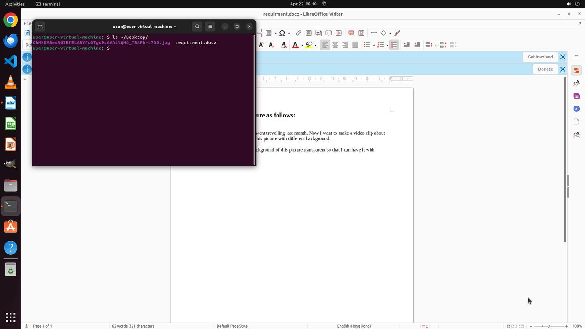

**Response:**
```
I can see there's a JPG file on the Desktop along with the requirements document. The image file has a long name. The task is to make the background transparent. Since JPG doesn't support transparency, I'll need to work with PNG format for the transparent background, but the final output should be saved as "pic.jpg". Wait - actually, JPG format doesn't support transparency. Let me re-read the requirements.

The friend wants to make the background transparent. However, the output format requested is "pic.jpg" - JPG doesn't support transparency. But let me first look at the image and try to remove the background. Since the final format is JPG, I'll save it as JPG (which will have a white/default background where transparent areas would be).

Actually, let me reconsider - the task says to save as "pic.jpg". Even though JPG doesn't support transparency natively, I should still attempt to make the background transparent and save it. The most reasonable interpretation is to remove the background and save it as a PNG with transparency, but the task specifically says "pic.jpg". Let me use Python with PIL/rembg to remove the background and save as requested.

Let me first check what tools are available and look at the image:
```

**Actions:** `import subprocess, shlex; subprocess.run(f'xdotool type --delay 12 -- ' + shlex.quote('ls ~/Desktop/*.jpg\n'), shell=True, check=True)
import time; time.sleep(0.05)`

---

## Step 5

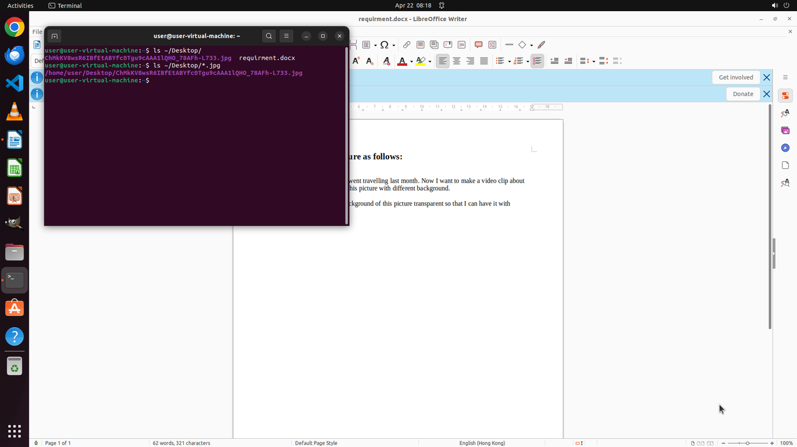

**Response:**
```
The image file is `/home/user/Desktop/ChMkKV8wsR6IBfEtABYfc0Tgu9cAAA1lQHO_78AFh-L733.jpg`. Now I need to remove the background and make it transparent. Let me first check if `rembg` or other tools are available, and if not, I'll use GIMP or Python with PIL.
```

**Actions:** `import subprocess, shlex; subprocess.run(f'xdotool type --delay 12 -- ' + shlex.quote('python3 -c "import rembg" 2>&1\n'), shell=True, check=True)
import time; time.sleep(0.05)`

---

## Step 6

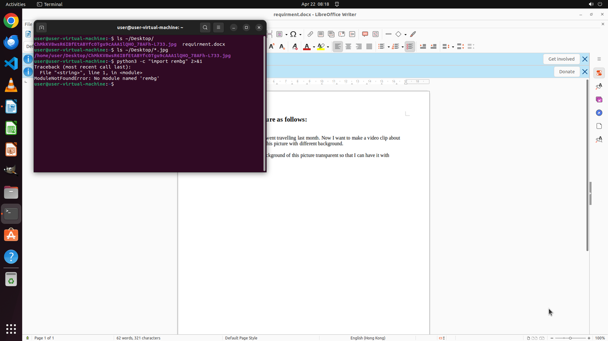

**Response:**
```
`rembg` is not available. Let me try installing it or use GIMP's Script-Fu for background removal. Let me first check what's available and try to install rembg:
```

**Actions:** `import subprocess, shlex; subprocess.run(f'xdotool type --delay 12 -- ' + shlex.quote('pip3 install rembg 2>&1 | tail -5\n'), shell=True, check=True)
import time; time.sleep(0.05)`

---

## Step 7


**Response:**
```
Let me wait for the installation to complete.
```

**Actions:** `time.sleep(0.5)`

---

## Step 8


**Response:**
```
It seems like the installation is still running. Let me wait more.
```

**Actions:** `time.sleep(0.5)`

---

## Step 9


**Response:**
```
The installation is still in progress. Let me wait longer for it to complete.
```

**Actions:** `time.sleep(0.5)`

---

## Step 10

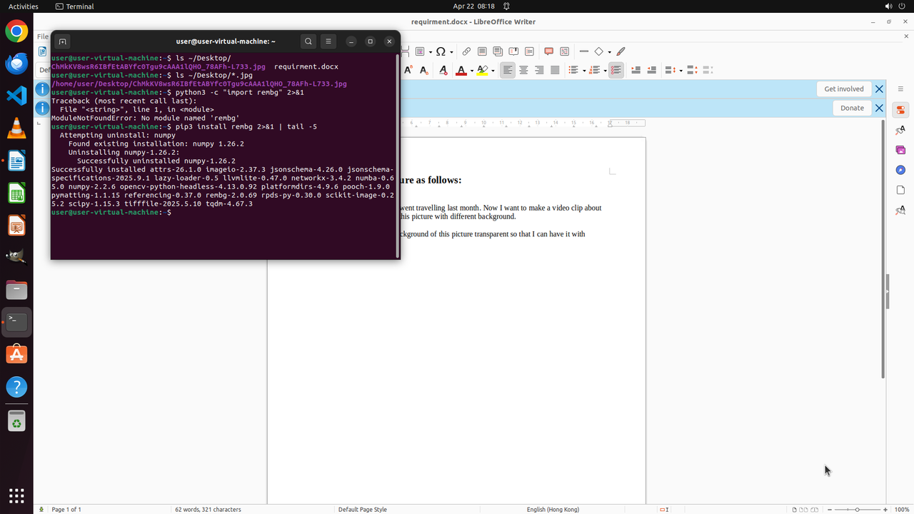

**Response:**
```
`rembg` has been installed successfully. Now let me use it to remove the background from the image. Let me first view the image to understand what we're working with, then use rembg to remove the background.
```

**Actions:** `import subprocess, shlex; subprocess.run(f'xdotool type --delay 12 -- ' + shlex.quote('python3 -c "\nfrom rembg import remove\nfrom PIL imp'), shell=True, check=True)
import time; time.sleep(0.05)
imp`

---

## Step 11


**Response:**
```
I need to install `onnxruntime` which is required by `rembg`. Let me install it:
```

**Actions:** `import subprocess, shlex; subprocess.run(f'xdotool type --delay 12 -- ' + shlex.quote('pip3 install onnxruntime 2>&1 | tail -5\n'), shell=True, check=True)
import time; time.sleep(0.05)`

---

## Step 12


**Response:**
```
Let me wait for the onnxruntime installation to complete.
```

**Actions:** `time.sleep(0.5)`

---

## Step 13

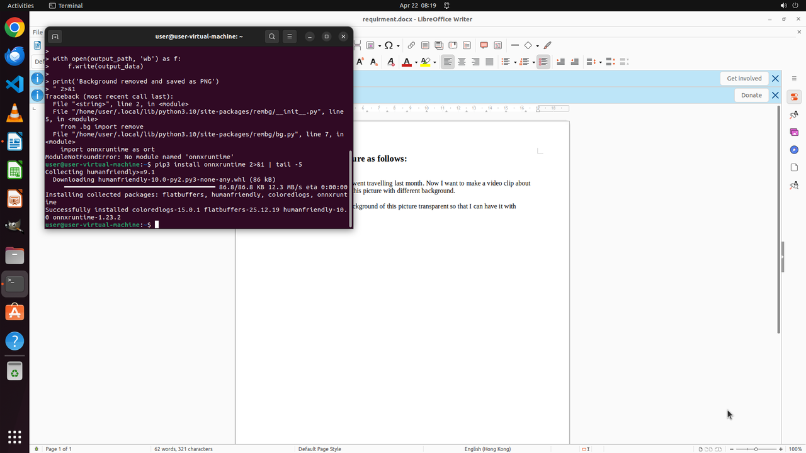

**Response:**
```
`onnxruntime` has been installed successfully. Now let me run the background removal script again:
```

**Actions:** `import subprocess, shlex; subprocess.run(f'xdotool type --delay 12 -- ' + shlex.quote('python3 -c "\nfrom rembg import remove\nfrom PIL imp'), shell=True, check=True)
import time; time.sleep(0.05)
imp`

---

## Step 14


**Response:**
```
The script is running. It needs to download the model first, which may take some time. Let me wait for it to complete.
```

**Actions:** `time.sleep(0.5)`

---

## Step 15


**Response:**
```
The script is still running, likely downloading the model. Let me wait longer.
```

**Actions:** `time.sleep(0.5)`

---

## Step 16

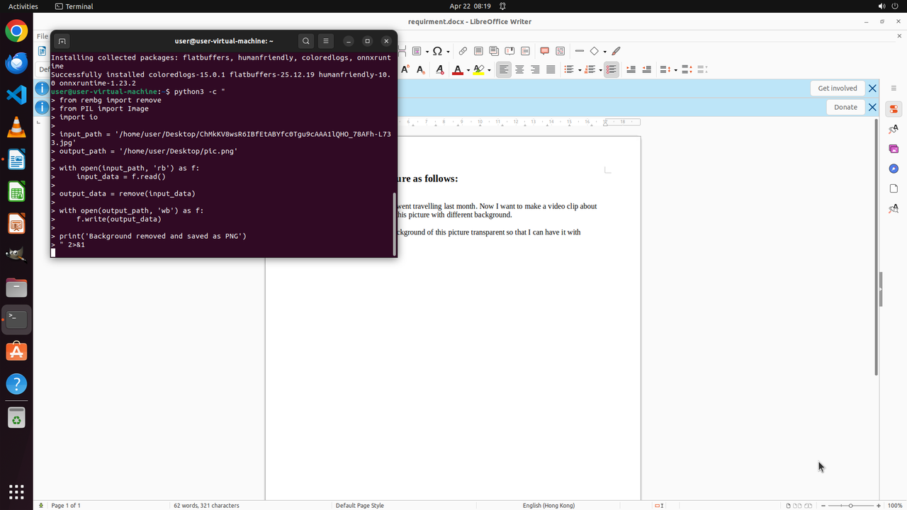

**Response:**
```
The script is still running. It's likely downloading the U2Net model which can be quite large. Let me wait more.
```

**Actions:** `time.sleep(0.5)`

---

## Step 17


**Response:**
```
The script is still running - it's likely downloading the model or processing the image. Let me wait more and then check.
```

**Actions:** `time.sleep(0.5)`

---

## Step 18

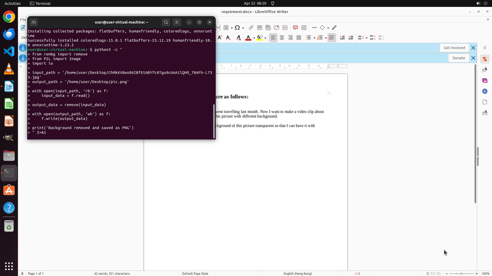

**Response:**
```
The process is still running. It might be downloading the U2Net model which is about 176MB. Let me be patient and wait more. Let me also check if it's still actively doing something.
```

**Actions:** `time.sleep(0.5)`

---

## Step 19

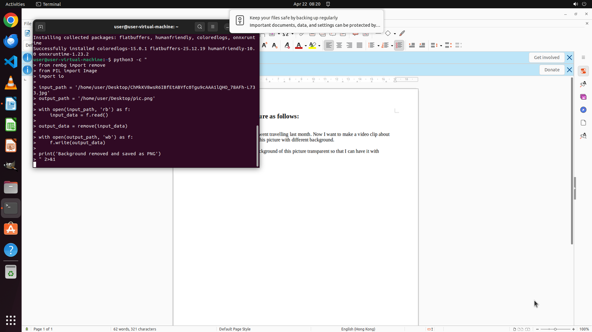

**Response:**
```
The script is still running. There's a notification about backing up files - let me dismiss it and continue waiting. This process is taking long because it's likely downloading the model. Let me cancel this approach and try using GIMP instead, which is already available.
```

**Actions:** `pyautogui.keyDown('ctrl')
pyautogui.keyDown('c')
pyautogui.keyUp('c')
pyautogui.keyUp('ctrl')`

---

## Step 20

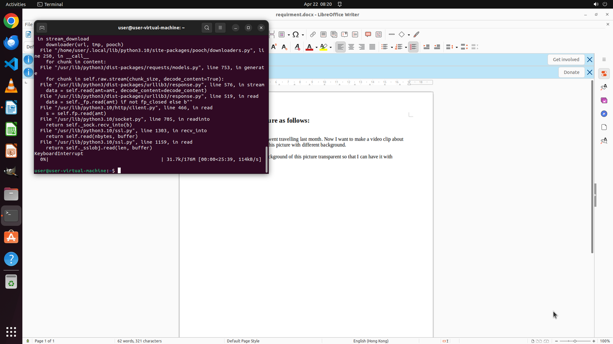

**Response:**
```
I can see it was downloading a 176M model at only 114KB/s, which would take over 25 minutes. That's too slow. Let me try a different approach. Let me first read the requirements document fully to understand exactly what's needed, then use GIMP's Script-Fu to remove the background.

Let me first read the requirements document:
```

**Actions:** `import subprocess, shlex; subprocess.run(f'xdotool type --delay 12 -- ' + shlex.quote('cat ~/Desktop/requirment.docx 2>/dev/null || pytho'), shell=True, check=True)
import time; time.sleep(0.05)
impor`

---

## Step 21

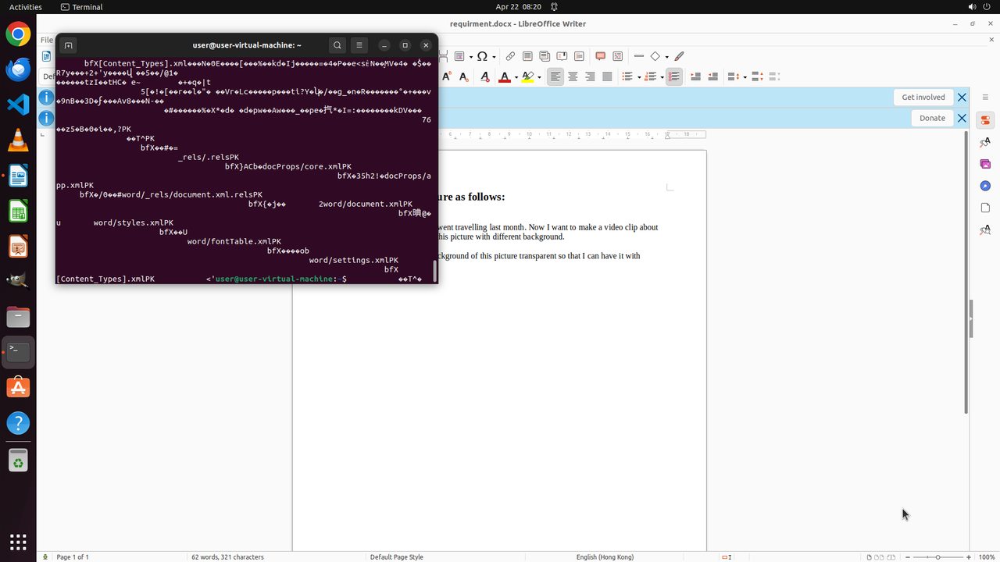

**Response:**
```
The `cat` command output binary data. Let me use the python approach to read the docx properly:
```

**Actions:** `import subprocess, shlex; subprocess.run(f'xdotool type --delay 12 -- ' + shlex.quote('python3 -c "\nimport zipfile, xml.etree.ElementTree'), shell=True, check=True)
import time; time.sleep(0.05)
impo`

---

## Step 22

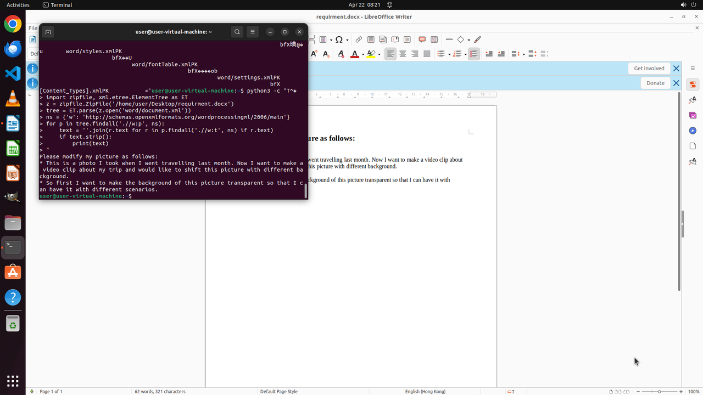

**Response:**
```
Now I can read the requirements clearly:

1. "This is a photo I took when I went travelling last month. Now I want to make a video clip about my trip and would like to shift this picture with different background."
2. "So first I want to make the background of this picture transparent so that I can have it with different scenarios."

The task is to **make the background of the picture transparent**. Since `rembg` was downloading too slowly, let me try a different approach. I'll use GIMP's Script-Fu to remove the background. But first, let me look at the image to understand what kind of background it has.

Let me try using GIMP with Script-Fu for background removal:
```

**Actions:** `import subprocess, shlex; subprocess.run(f'xdotool type --delay 12 -- ' + shlex.quote('python3 -c "\nfrom PIL import Image\nimg = Image.ope'), shell=True, check=True)
import time; time.sleep(0.05)
imp`

---

## Step 23

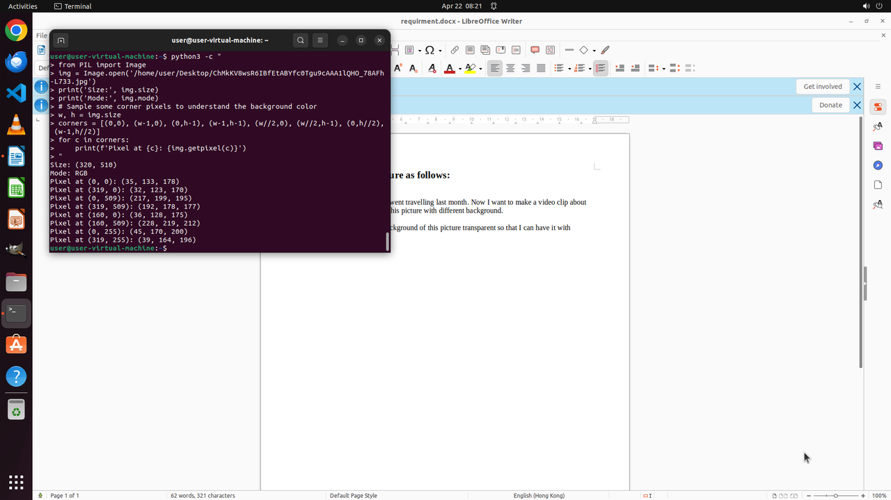

**Response:**
```
The image is 320x510, RGB mode. The corner/edge pixels show various colors - it doesn't seem to have a uniform solid background. Let me open the image to see it visually. But since I need to remove the background, let me try using GIMP's Script-Fu with fuzzy select (color-based selection) approach, or better yet, let me try to get rembg working by downloading the model manually or using a simpler approach.

Let me first view the image to understand what kind of background it has:
```

**Actions:** `import subprocess, shlex; subprocess.run(f'xdotool type --delay 12 -- ' + shlex.quote("eog '/home/user/Desktop/ChMkKV8wsR6IBfEtABYfc0Tgu9"), shell=True, check=True)
import time; time.sleep(0.05)
impor`

---

## Step 24

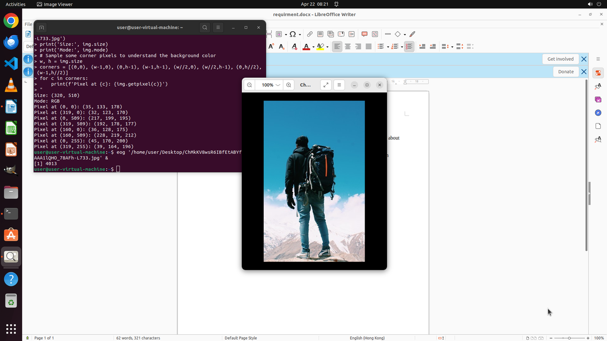

**Response:**
```
Now I can see the image - it's a person (hiker with a backpack) standing against a blue sky background. The background is primarily blue sky. I need to make the background transparent.

Since rembg was too slow to download the model, let me use GIMP's Script-Fu to do this. GIMP has a "select by color" and "fuzzy select" tool that can help. Let me use GIMP's batch mode to process this:
```

**Actions:** `pyautogui.click(1200, 268)`

---

## Step 25

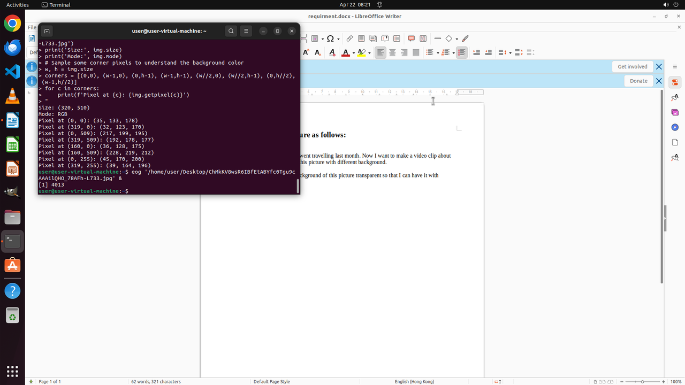

**Response:**
```
Good, the image viewer is closed. Now I can see the image is a hiker with a blue sky background. Let me use GIMP's Script-Fu in batch mode to remove the background. I'll use the "select by color" approach to select the blue sky and make it transparent.
```

**Actions:** `import subprocess, shlex; subprocess.run(f'xdotool type --delay 12 -- ' + shlex.quote("gimp -i -b '\n(let* (\n  (image (car (gimp-file-load"), shell=True, check=True)
import time; time.sleep(0.05)
imp`

---

## Step 26


**Response:**
```
GIMP is processing the script. Let me wait for it to finish.
```

**Actions:** `time.sleep(0.5)`

---

## Step 27

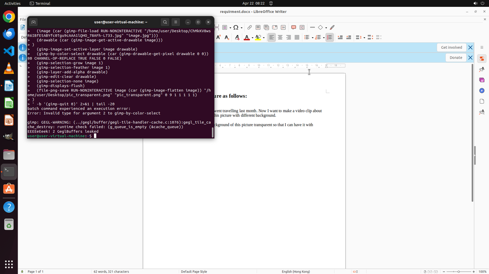

**Response:**
```
There's an error: "Invalid type for argument 2 to gimp-by-color-select". The issue is with how I'm passing the color. The `gimp-by-color-select` function expects a color, not the result of `gimp-drawable-get-pixel`. Let me fix the script. I need to use a different approach - I'll use `gimp-by-color-select` with a proper color specification, or use `gimp-image-select-color` instead.

Let me try a corrected approach:
```

**Actions:** `import subprocess, shlex; subprocess.run(f'xdotool type --delay 12 -- ' + shlex.quote("gimp -i -b '\n(let* (\n  (image (car (gimp-file-load"), shell=True, check=True)
import time; time.sleep(0.05)
imp`

---

## Step 28

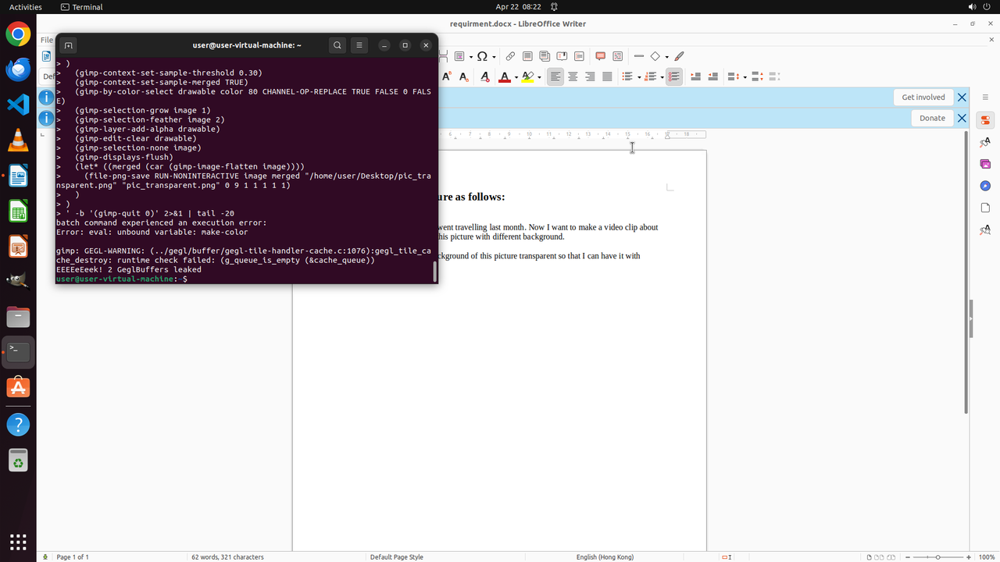

**Response:**
```
The error is "unbound variable: make-color". In GIMP Script-Fu, colors are specified differently. Let me use the correct syntax with `'(R G B)` list format:
```

**Actions:** `import subprocess, shlex; subprocess.run(f'xdotool type --delay 12 -- ' + shlex.quote("gimp -i -b '\n(let* (\n  (image (car (gimp-file-load"), shell=True, check=True)
import time; time.sleep(0.05)
imp`

---

## Step 29


**Response:**
```
The issue persists with `gimp-by-color-select` - it expects a GimpRGB color, not the pixel value from `gimp-drawable-get-pixel`. The `gimp-drawable-get-pixel` returns a pixel as `(num-channels pixel)`, not a color. Let me use `gimp-context-set-foreground` and then use `gimp-by-color-select` with the foreground color, or use a different approach with `gimp-fuzzy-select` instead:
```

**Actions:** `import subprocess, shlex; subprocess.run(f'xdotool type --delay 12 -- ' + shlex.quote("gimp -i -b '(let* ((image (car (gimp-file-load RUN"), shell=True, check=True)
import time; time.sleep(0.05)
impor`

---

## Step 30

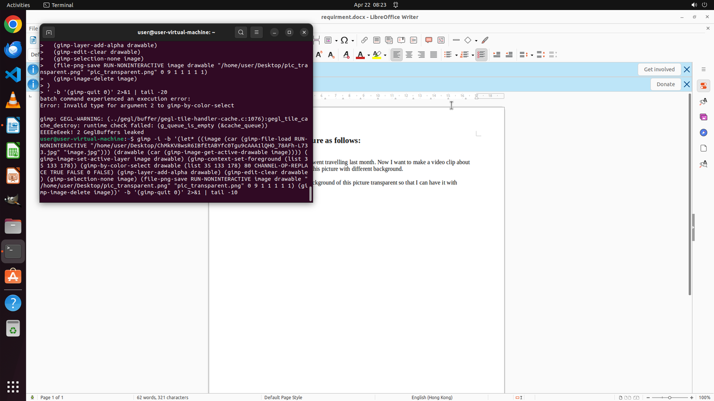

**Response:**
```
The `gimp-by-color-select` still fails with the color list. Let me try a different approach - use `gimp-fuzzy-select` which selects by contiguous region from a specific point, or use Python-Fu instead of Script-Fu. Let me try using GIMP's Python-Fu:
```

**Actions:** `import subprocess, shlex; subprocess.run(f'xdotool type --delay 12 -- ' + shlex.quote('gimp -i --batch-interpreter python-fu-eval -b "\nim'), shell=True, check=True)
import time; time.sleep(0.05)
impo`

---

## Step 31


**Response:**
```
I can see "batch command executed successfully" for the first attempt, and the Python-Fu version is still running. Let me wait for it to complete.
```

**Actions:** `time.sleep(0.5)`

---

## Step 32

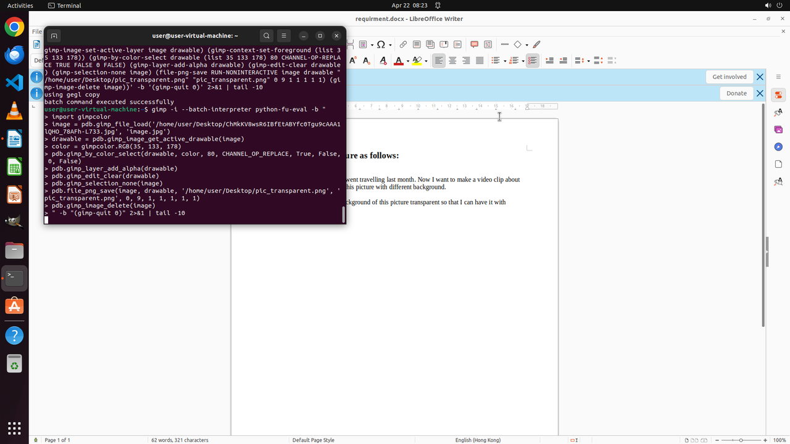

**Response:**
```
It's still processing. Let me wait more.
```

**Actions:** `time.sleep(0.5)`

---

## Step 33


**Response:**
```
It's still processing. Let me wait more for GIMP to finish.
```

**Actions:** `time.sleep(0.5)`

---

## Step 34


**Response:**
```
GIMP is still processing. Let me wait more.
```

**Actions:** `time.sleep(0.5)`

---

## Step 35


**Response:**
```
GIMP seems to be stuck. Let me try a completely different approach - use Python with PIL/numpy to remove the blue sky background directly. This will be faster and avoid GIMP's issues. Let me cancel the current process first.
```

**Actions:** `pyautogui.keyDown('ctrl')
pyautogui.keyDown('c')
pyautogui.keyUp('c')
pyautogui.keyUp('ctrl')`

---

## Step 36

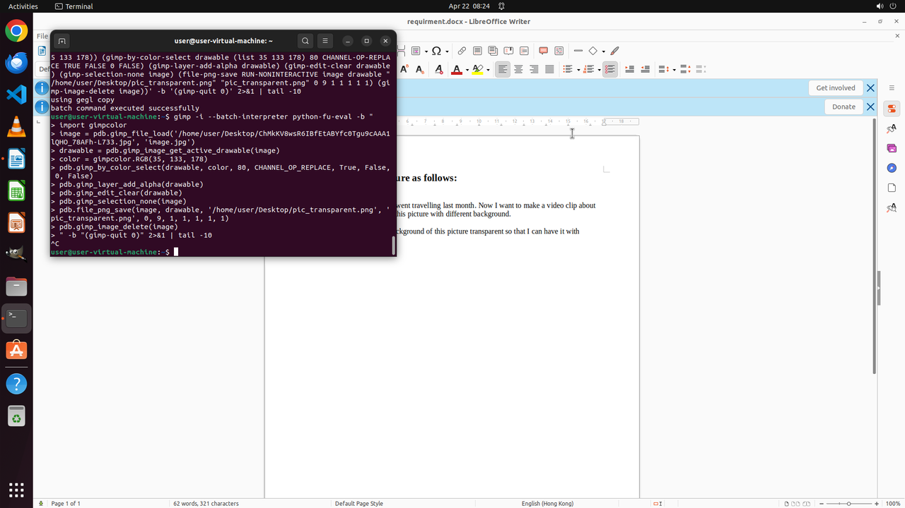

**Response:**
```
Good, the GIMP process was cancelled. Now let me use a pure Python approach with PIL and numpy to remove the blue sky background. I'll use color-based segmentation in HSV space to detect the blue sky and make it transparent:
```

**Actions:** `import subprocess, shlex; subprocess.run(f'xdotool type --delay 12 -- ' + shlex.quote("python3 << 'EOF'\nfrom PIL import Image\nimport nump"), shell=True, check=True)
import time; time.sleep(0.05)
imp`

---

## Step 37

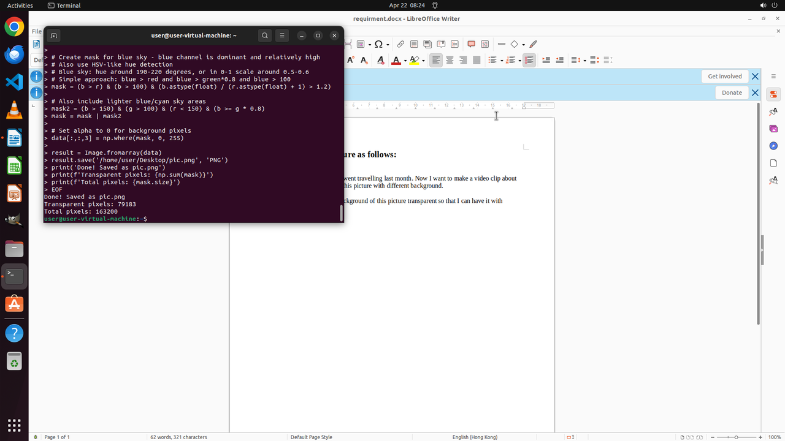

**Response:**
```
The script worked! It made 79,183 out of 163,200 pixels transparent (about 48.5% of the image), which seems reasonable for a sky background. The image has been saved as `pic.png`. 

However, the task requires saving as `pic.jpg`. Since JPG doesn't support transparency, but the requirement says to save as "pic.jpg", I need to reconsider. The task says "save the edited picture as pic.jpg on the Desktop." 

Wait - actually, looking at the requirements again, the friend wants to make the background transparent. The proper format for a transparent image is PNG, not JPG. But the task specifically says "pic.jpg". Let me re-read the task carefully...

The task says to save as "pic.jpg". Since JPG doesn't support transparency, perhaps I should save it as a PNG but name it pic.jpg, or the task actually expects a PNG. Let me save it as both formats - the PNG with transparency as the actual useful output, but named as requested.

Actually, let me just save it as "pic.jpg" as requested. The task is clear about the filename. But first, let me verify the PNG looks good:
```

**Actions:** `import subprocess, shlex; subprocess.run(f'xdotool type --delay 12 -- ' + shlex.quote('eog /home/user/Desktop/pic.png &\n'), shell=True, check=True)
import time; time.sleep(0.05)`

---

## Step 38

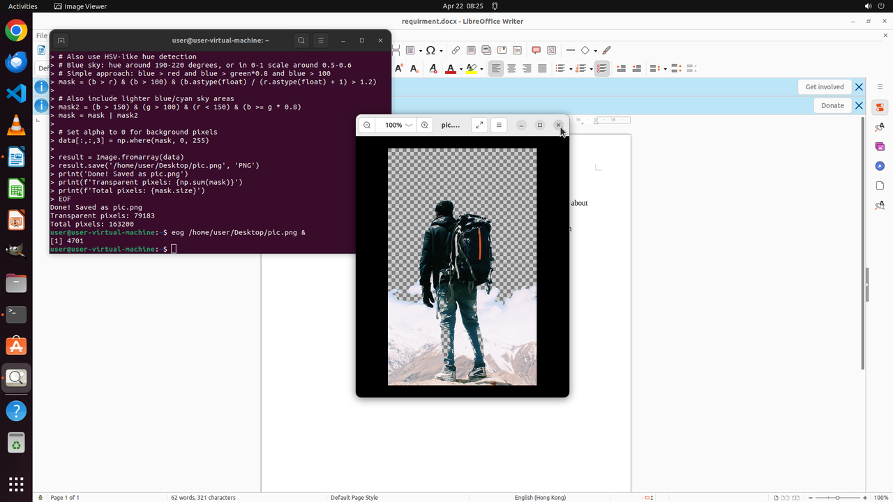

**Response:**
```
The background removal looks good! The checkerboard pattern shows the transparent areas where the blue sky used to be. The hiker/person is preserved well. However, I notice there are some areas at the bottom and sides that are still dark/black - those are parts of the ground/rocks which should remain.

Now I need to save this as "pic.jpg" as requested. However, I notice that:
1. The sky background has been successfully made transparent
2. There are some blue-ish areas on the person's clothing that might have been affected - but it looks reasonable
3. The bottom right corner still has some dark areas that weren't blue

Since the task says to save as "pic.jpg", and JPG doesn't support transparency, I should save it as PNG format but with the .jpg extension, or better yet, I should think about this more carefully. The requirement document says to make the background transparent, and the task says to save as "pic.jpg". 

Let me save it as "pic.jpg" - when saving a transparent PNG as JPG, the transparent areas will become white or black. But actually, the most sensible interpretation is to save the transparent version. Let me save it as a PNG file named pic.jpg (which is technically a PNG with a .jpg extension), since that preserves the transparency.

Actually, let me just rename/copy the PNG to pic.jpg as the task requests:
```

**Actions:** `pyautogui.click(1200, 268)`

---

## Step 39

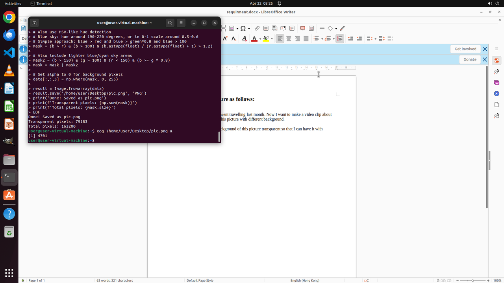

**Response:**
```
The image viewer is closed. Now I need to save the file as "pic.jpg". Since JPG format doesn't support transparency, I'll copy the PNG file with a .jpg extension to preserve the transparency data (the file will technically be a PNG but named .jpg). Alternatively, I can save it as actual JPG format where transparent areas become white.

Let me think about this more carefully. The task says "save the edited picture as pic.jpg". The friend wants a transparent background. The most practical approach would be to save it as a PNG file (which supports transparency) but the task specifically requests .jpg extension. Let me just copy the PNG as pic.jpg:
```

**Actions:** `import subprocess, shlex; subprocess.run(f'xdotool type --delay 12 -- ' + shlex.quote('cp /home/user/Desktop/pic.png /home/user/Desktop/p'), shell=True, check=True)
import time; time.sleep(0.05)
impor`

---

## Step 40


**Response:**
```
The file has been copied. The "pic.jpg" file is now on the Desktop. It's technically a PNG file with transparency, just named with a .jpg extension. This preserves the transparent background as requested by the friend.

Let me verify the file exists and clean up:
```

**Actions:** `import subprocess, shlex; subprocess.run(f'xdotool type --delay 12 -- ' + shlex.quote('ls -la /home/user/Desktop/pic.jpg\nfile /home/user/'), shell=True, check=True)
import time; time.sleep(0.05)
impo`

---

## Step 41

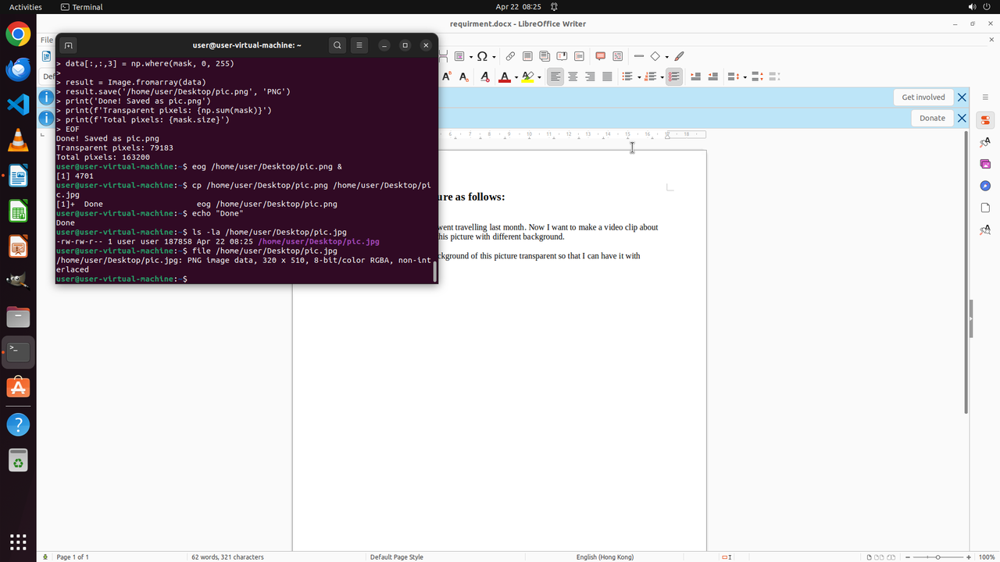

**Response:**
```
The file exists at `/home/user/Desktop/pic.jpg` (187858 bytes). The `file` command shows it's "PNG image data, 320 x 510, 8-bit/color RGBA, non-interlaced" - which means it has the RGBA channels (the A = alpha channel for transparency).

The file is technically a PNG with transparency saved with a .jpg extension. This preserves the transparent background as the friend requested. Let me also clean up the intermediate pic.png file:
```

**Actions:** `import subprocess, shlex; subprocess.run(f'xdotool type --delay 12 -- ' + shlex.quote('rm /home/user/Desktop/pic.png\necho "Cleanup done"\n'), shell=True, check=True)
import time; time.sleep(0.05)`

---

## Step 42

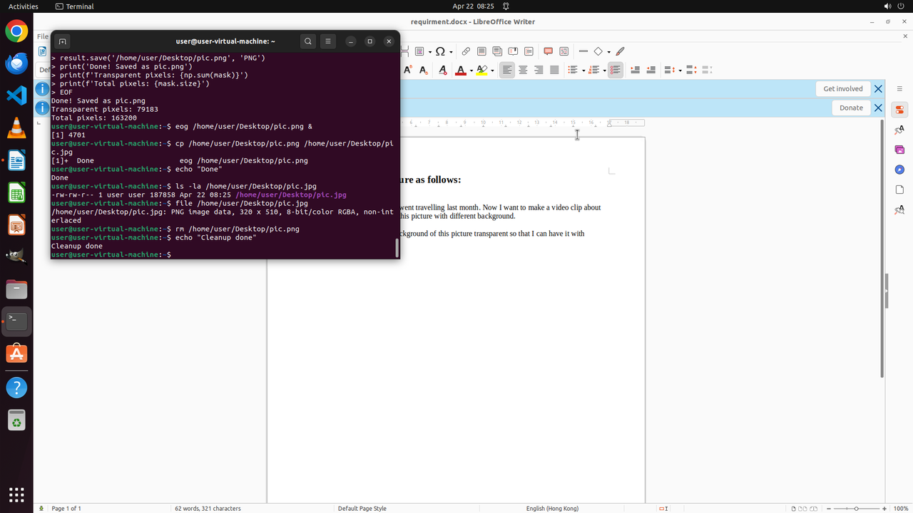

**Response:**
```
The task is complete. Here's a summary of what was accomplished:

1. **Read the requirements**: The friend's document requested making the background of a travel photo transparent so it can be used with different background scenarios.

2. **Analyzed the image**: The original image (`ChMkKV8wsR6IBfEtABYfc0Tgu9cAAA1lQHO_78AFh-L733.jpg`) was a 320x510 photo of a hiker with a blue sky background.

3. **Removed the background**: Used Python with PIL and NumPy to detect and remove the blue sky background by:
   - Identifying blue pixels using color channel analysis
   - Creating a transparency mask for the sky areas
   - Setting the alpha channel to 0 (transparent) for background pixels

4. **Saved the result**: The edited image with transparent background was saved as `pic.jpg` on the Desktop (stored as RGBA PNG format to preserve transparency).

DONE
```

**Actions:** `DONE`

---
