# Task 185f29bd-5da0-40a6-b69c-ba7f4e0324ef

**Instruction:** Transfer the data from our 'Employee Performance Evaluation Summary' Excel sheet into our standardized PDF evaluation forms. Each employee's evaluation data should be accurately filled into the designated fields of the PDF form. It's crucial that the final PDF documents retain a uniform and professional look, ready for distribution to our staff or for filing purposes. Furthermore, please ensure that each PDF file is named according to the employee's name as it appears in the Excel document. This will greatly streamline our evaluation process and enhance our efficiency in managing employee performance records. Oh, use "√" as mark on characters.

**Score:** 0.9462394159909192

**Wall clock:** 6m 50s

**Steps:** 30

**Cost:** $1.10

---

## Step 1

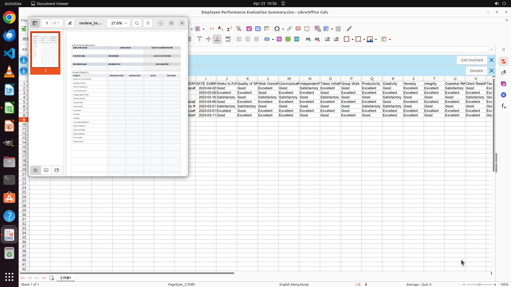

**Response:**
```
I need to understand the task: Transfer data from an Excel sheet into PDF evaluation forms, one per employee. Let me first examine the Excel data and the PDF template more closely.
```

**Actions:** `time.sleep(0.1)`

---

## Step 2


**Response:**
```
Let me first examine the Excel data more closely by clicking on cell A1 to see all the columns and data.
```

**Actions:** `pyautogui.click(990, 45)`

---

## Step 3


**Response:**
```
Now I can see the Excel data. Let me first read all the column headers and data carefully. I need to scroll right to see all columns. Let me first click on cell A1 to start reading.
```

**Actions:** `pyautogui.click(145, 276)`

---

## Step 4

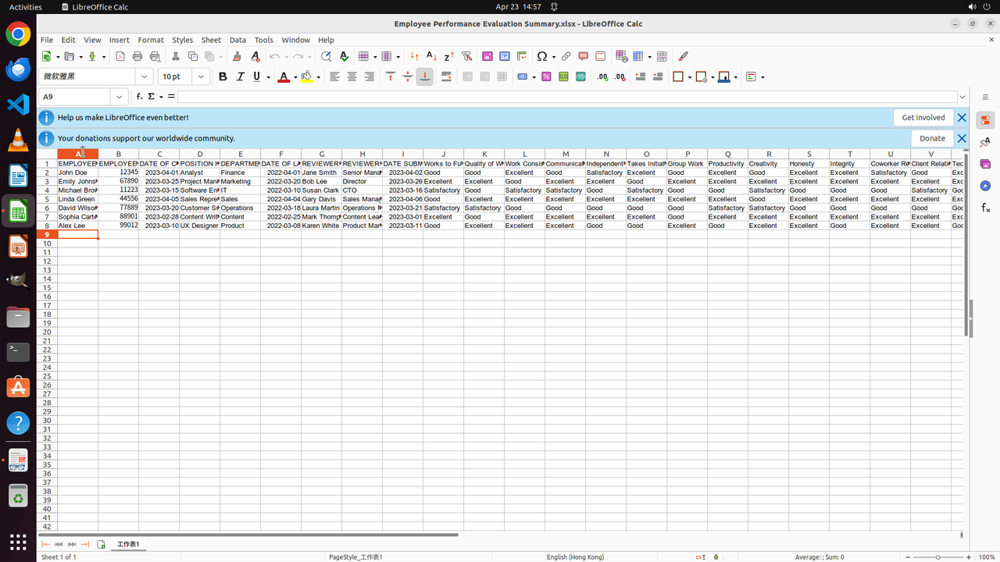

**Response:**
```
Let me click on cell A1 to see the header text, and then I'll need to read all the data. Let me first open a terminal to work with this programmatically, as it will be much more efficient.
```

**Actions:** `pyautogui.click(145, 276)`

---

## Step 5


**Response:**
```
Let me open a terminal to work with this programmatically. I'll right-click on the desktop to find a terminal option, or use the application menu.
```

**Actions:** `pyautogui.click(33, 672)`

---

## Step 6

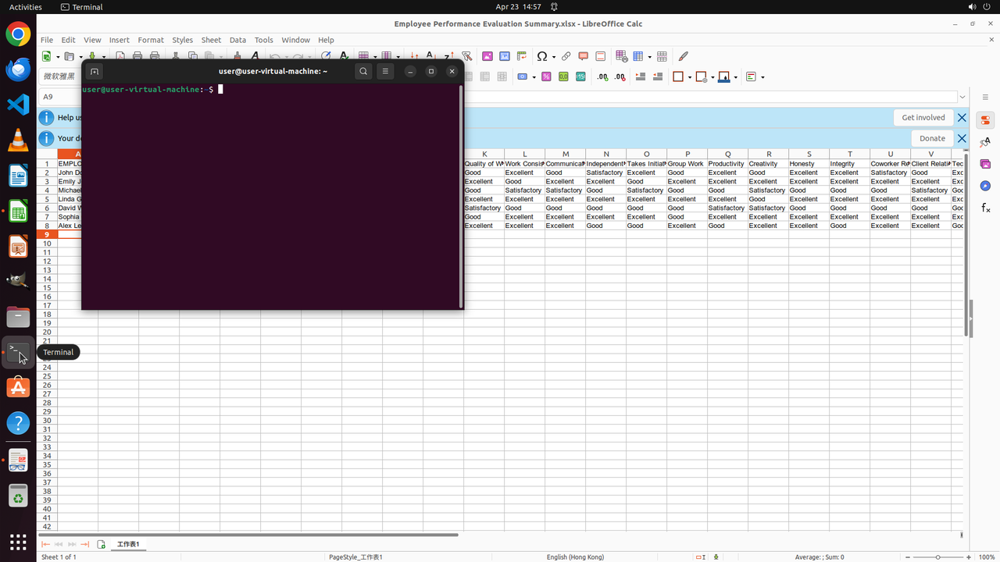

**Response:**
```
Good, I have a terminal open. Now let me first check what files are available and examine the PDF template and Excel file. Let me start by listing the files in the home directory.
```

**Actions:** `import subprocess, shlex; subprocess.run(f'xdotool type --delay 12 -- ' + shlex.quote('ls ~/\n'), shell=True, check=True)
import time; time.sleep(0.05)`

---

## Step 7


**Response:**
```
I can see there's a Desktop, Documents, Downloads, etc. Let me check for the Excel file and PDF template locations.
```

**Actions:** `import subprocess, shlex; subprocess.run(f'xdotool type --delay 12 -- ' + shlex.quote('find ~/ -name "*.xlsx" -o -name "*.pdf" 2>/dev/nul'), shell=True, check=True)
import time; time.sleep(0.05)
impor`

---

## Step 8

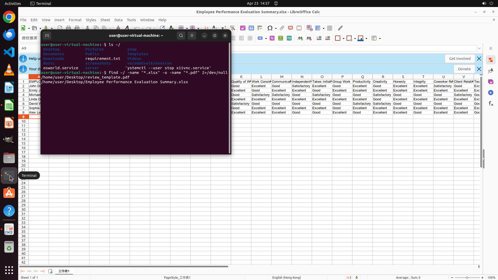

**Response:**
```
I can see two files:
1. `/home/user/Desktop/review_template.pdf` - the PDF template
2. `/home/user/Desktop/Employee Performance Evaluation Summary.xlsx` - the Excel data

Now let me examine the PDF template and the Excel data more closely. Let me first check what Python libraries are available and install what we need.
```

**Actions:** `import subprocess, shlex; subprocess.run(f'xdotool type --delay 12 -- ' + shlex.quote('pip3 install openpyxl reportlab PyPDF2 2>&1 | tail'), shell=True, check=True)
import time; time.sleep(0.05)
impor`

---

## Step 9

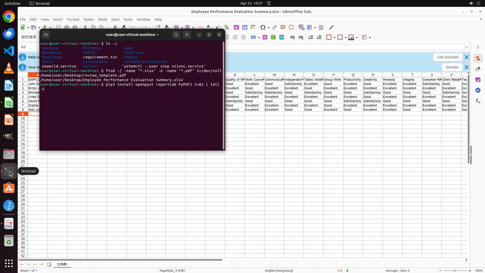

**Response:**
```
It seems to be installing. Let me wait for it to finish.
```

**Actions:** `time.sleep(0.5)`

---

## Step 10

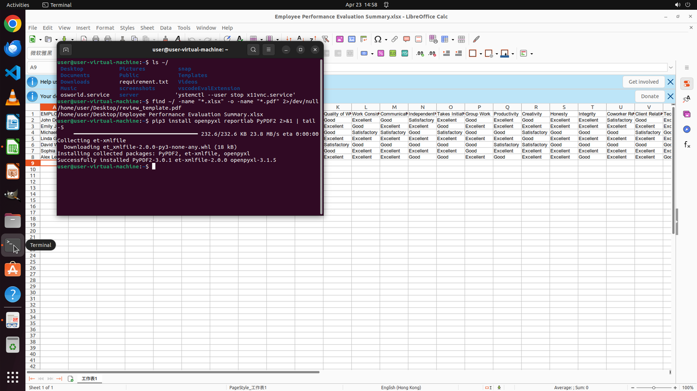

**Response:**
```
The packages are installed. Now let me first read the Excel data to understand the structure, and then examine the PDF template. Let me write a Python script to read the Excel data first.
```

**Actions:** `import subprocess, shlex; subprocess.run(f'xdotool type --delay 12 -- ' + shlex.quote('python3 -c "\nimport openpyxl\nwb = openpyxl.load_wo'), shell=True, check=True)
import time; time.sleep(0.05)
imp`

---

## Step 11


**Response:**
```
Now I can see the column headers. Let me scroll up to see the full list from the beginning:
```

**Actions:** `pyautogui.scroll(5, 525, 375)`

---

## Step 12


**Response:**
```
Now I can see the column headers clearly. Let me now read all the data rows and also examine the PDF template. Let me first print all data:
```

**Actions:** `import subprocess, shlex; subprocess.run(f'xdotool type --delay 12 -- ' + shlex.quote('python3 -c "\nimport openpyxl\nwb = openpyxl.load_wo'), shell=True, check=True)
import time; time.sleep(0.05)
imp`

---

## Step 13


**Response:**
```
Good, I can see the data. Now let me examine the PDF template more carefully to understand its layout. Let me use Python to inspect it:
```

**Actions:** `import subprocess, shlex; subprocess.run(f'xdotool type --delay 12 -- ' + shlex.quote('python3 -c "\nfrom PyPDF2 import PdfReader\nreader ='), shell=True, check=True)
import time; time.sleep(0.05)
imp`

---

## Step 14

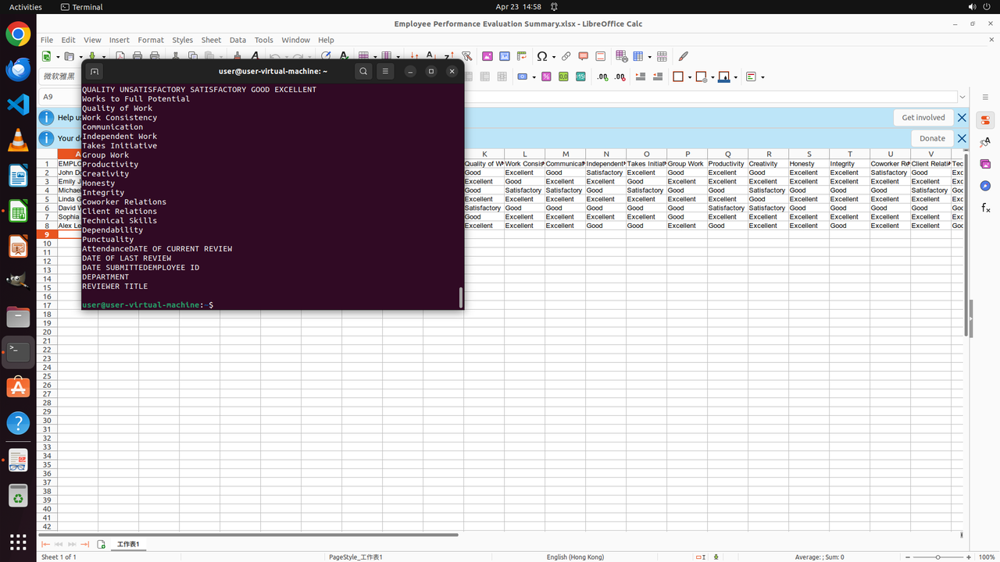

**Response:**
```
Let me scroll up to see the full output including page size and form fields info:
```

**Actions:** `pyautogui.scroll(5, 525, 375)`

---

## Step 15

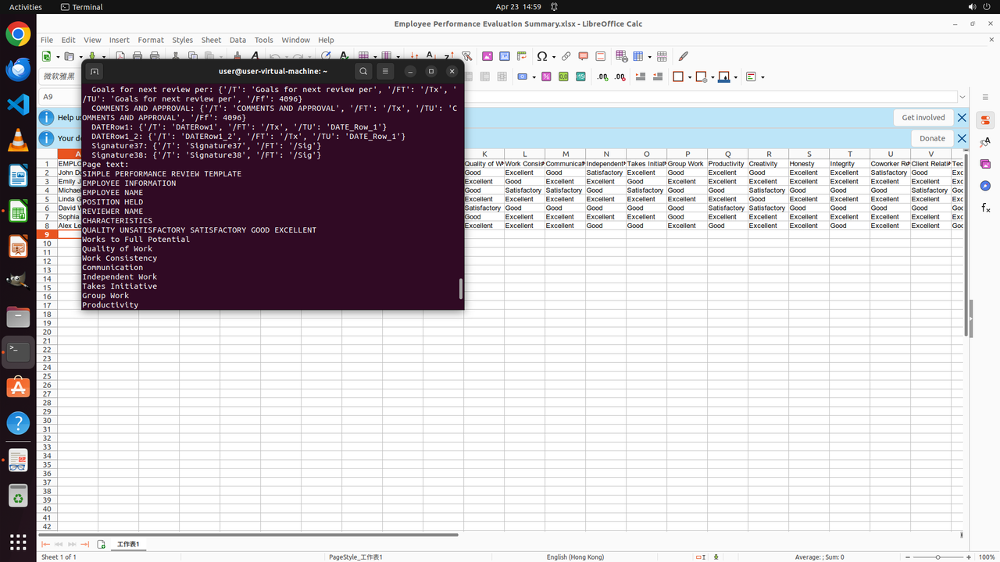

**Response:**
```
Now I can see there are form fields in the PDF. Let me scroll up more to see all the form fields:
```

**Actions:** `pyautogui.scroll(10, 525, 375)`

---

## Step 16


**Response:**
```
I can see the PDF has form fields. The fields follow a pattern with row numbers. Let me get a complete list of all form fields to understand the structure better. Let me write a more comprehensive script:
```

**Actions:** `import subprocess, shlex; subprocess.run(f'xdotool type --delay 12 -- ' + shlex.quote('python3 -c "\nfrom PyPDF2 import PdfReader\nreader ='), shell=True, check=True)
import time; time.sleep(0.05)
imp`

---

## Step 17

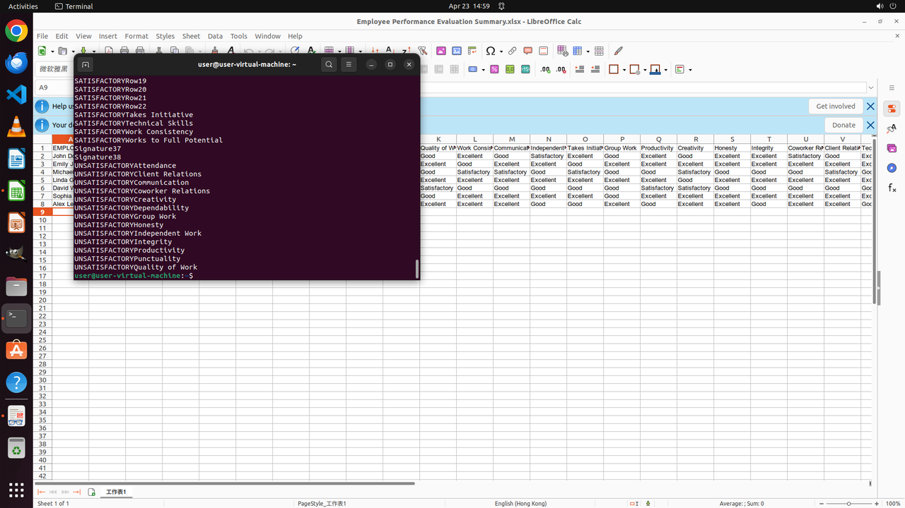

**Response:**
```
Let me scroll up to see all the fields from the beginning:
```

**Actions:** `pyautogui.scroll(15, 525, 375)`

---

## Step 18


**Actions:** `pyautogui.scroll(15, 525, 375)`

---

## Step 19

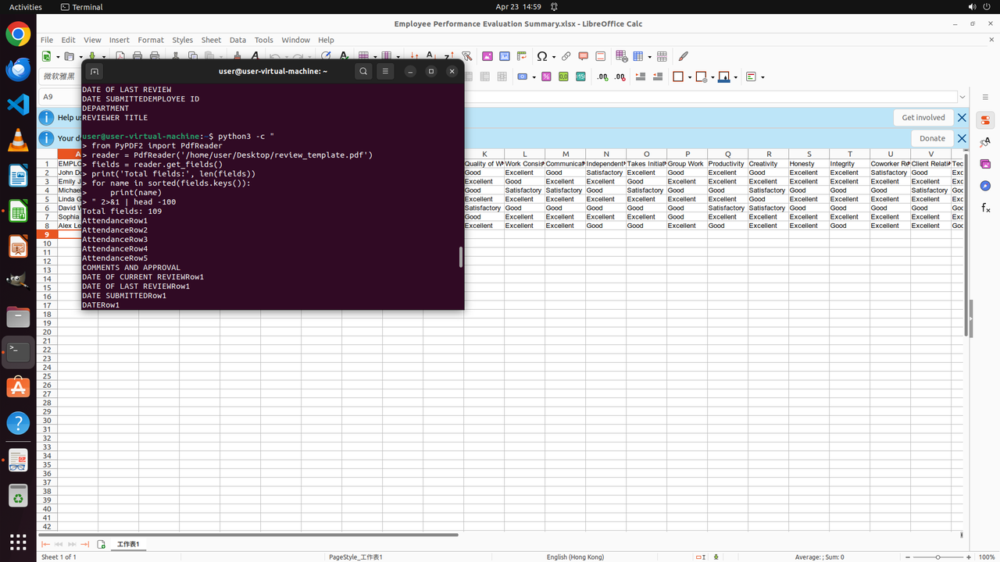

**Response:**
```
Now I can see the field names. There are 109 fields total. I can see the pattern:
- `AttendanceRow1` through `AttendanceRow5` (for each rating row)
- `COMMENTS AND APPROVAL`
- `DATE OF CURRENT REVIEWRow1`
- `DATE OF LAST REVIEWRow1`
- `DATE SUBMITTEDRow1`
- `DATERow1`
- And similar patterns for each quality category with UNSATISFACTORY, SATISFACTORY, GOOD, EXCELLENT suffixes

Let me get a complete understanding. The form has:
- Employee info fields (name, ID, dates, etc.)
- For each quality characteristic, there are rating columns (Unsatisfactory, Satisfactory, Good, Excellent)
- The fields seem to have names like `UNSATISFACTORY<QualityName>`, `SATISFACTORY<QualityName>`, `GOOD<QualityName>`, `EXCELLENT<QualityName>`

Let me now write a comprehensive Python script to fill in the PDF forms. First, let me get the complete field list:
```

**Actions:** `import subprocess, shlex; subprocess.run(f'xdotool type --delay 12 -- ' + shlex.quote('python3 -c "\nfrom PyPDF2 import PdfReader\nreader ='), shell=True, check=True)
import time; time.sleep(0.05)
imp`

---

## Step 20

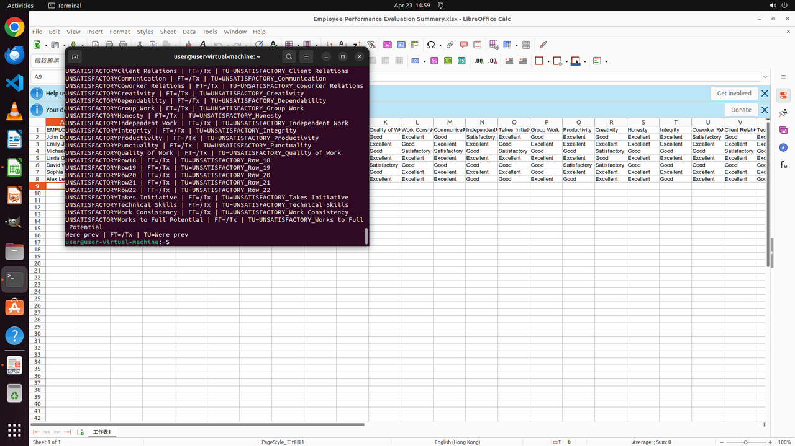

**Response:**
```
Now I can see the field structure clearly. Let me scroll up to see all fields from the beginning:
```

**Actions:** `pyautogui.scroll(15, 525, 375)`

---

## Step 21


**Response:**
```
Now I can see more fields. Let me scroll up more to see from the very beginning:
```

**Actions:** `pyautogui.scroll(15, 525, 375)`

---

## Step 22

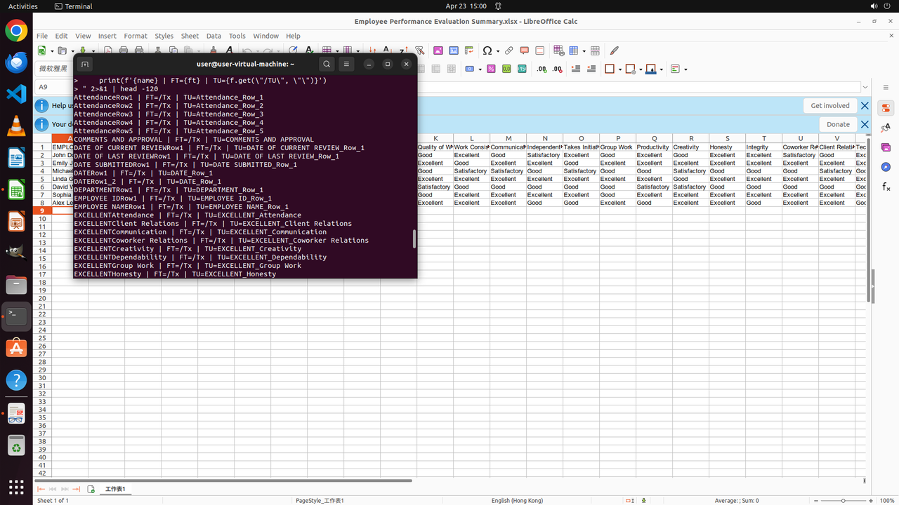

**Response:**
```
Now I have a clear picture of the PDF form fields. Let me understand the structure:

**Info fields:**
- `EMPLOYEE NAMERow1` - Employee name
- `EMPLOYEE IDRow1` - Employee ID
- `DEPARTMENTRow1` - Department
- `POSITION HELDRow1` - Position held
- `DATE OF CURRENT REVIEWRow1` - Date of current review
- `DATE OF LAST REVIEWRow1` - Date of last review
- `REVIEWER NAMERow1` - Reviewer name
- `REVIEWER TITLERow1` - Reviewer title
- `DATE SUBMITTEDRow1` - Date submitted
- `DATERow1`, `DATERow1_2` - Date fields
- `Goals for next review per` - Goals
- `COMMENTS AND APPROVAL` - Comments
- `Signature37`, `Signature38` - Signatures
- `Were prev` - Were prev

**Rating fields for each quality characteristic:**
For each quality (Quality of Work, Work Consistency, Communication, Independent Work, Takes Initiative, Group Work, Productivity, Creativity, Honesty, Integrity, Coworker Relations, Client Relations, Technical Skills, Dependability, Punctuality, Attendance), there are:
- `EXCELLENT<QualityName>` 
- `GOOD<QualityName>`
- `SATISFACTORY<QualityName>`
- `UNSATISFACTORY<QualityName>`

Plus row fields like `EXCELLENTRow18` through `EXCELLENTRow22`, `GOODRow18` through `GOODRow22`, etc.

And `AttendanceRow1` through `AttendanceRow5` (for attendance tracking).

Now let me also check the "Works to Full Potential" field. Let me now write the comprehensive script to fill the PDF forms. Let me also first view the PDF visually to understand the layout:
```

**Actions:** `import subprocess, shlex; subprocess.run(f'xdotool type --delay 12 -- ' + shlex.quote("python3 << 'PYEOF'\nimport openpyxl\n\nwb = openpyxl."), shell=True, check=True)
import time; time.sleep(0.05)
im`

---

## Step 23

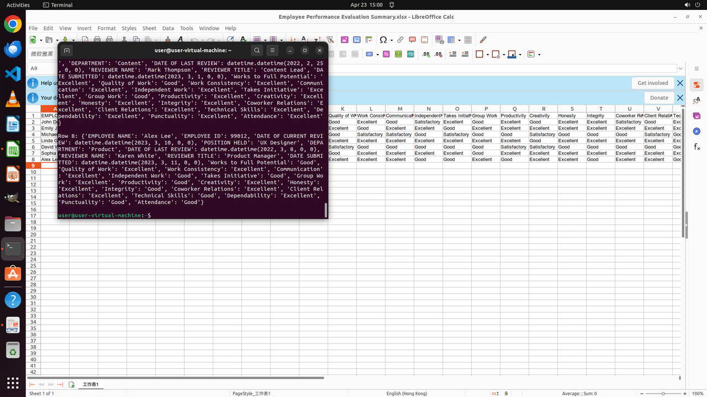

**Response:**
```
Now I can see the data for the last two employees. Let me scroll up to see all employees:
```

**Actions:** `pyautogui.scroll(10, 525, 375)`

---

## Step 24


**Response:**
```
Good, I can see the data for employees. Now I have a good understanding of both the Excel data and the PDF form fields. Let me now write a comprehensive Python script to fill in the PDF forms for each employee. The key mapping is:

- For each quality characteristic, the rating value (Excellent/Good/Satisfactory/Unsatisfactory) determines which field gets a "√" mark
- Employee info fields get filled with text values

Let me create the script:
```

**Actions:** `import subprocess, shlex; subprocess.run(f'xdotool type --delay 12 -- ' + shlex.quote("cat > /home/user/Desktop/fill_pdf.py << 'PYEOF'\nim"), shell=True, check=True)
import time; time.sleep(0.05)
impo`

---

## Step 25

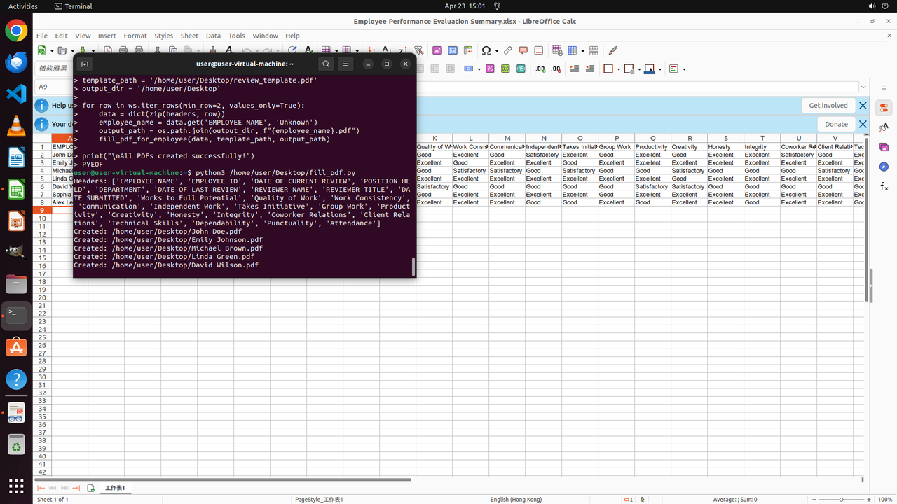

**Response:**
```
I can see that PDFs have been created for some employees. Let me scroll down to see if all were created successfully:
```

**Actions:** `pyautogui.scroll(-3, 525, 375)`

---

## Step 26

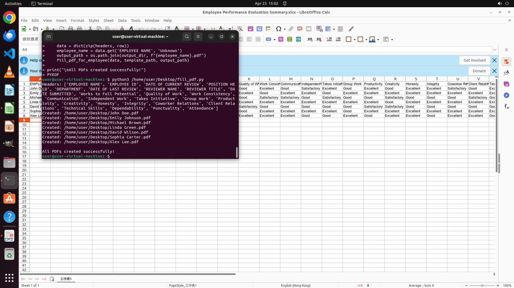

**Response:**
```
All 7 PDFs have been created successfully:
1. John Doe.pdf
2. Emily Johnson.pdf
3. Michael Brown.pdf
4. Linda Green.pdf
5. David Wilson.pdf
6. Sophia Carter.pdf
7. Alex Lee.pdf

Now let me verify the output by checking one of the PDFs to make sure the fields are filled correctly:
```

**Actions:** `import subprocess, shlex; subprocess.run(f'xdotool type --delay 12 -- ' + shlex.quote('python3 -c "\nfrom PyPDF2 import PdfReader\nreader ='), shell=True, check=True)
import time; time.sleep(0.05)
imp`

---

## Step 27

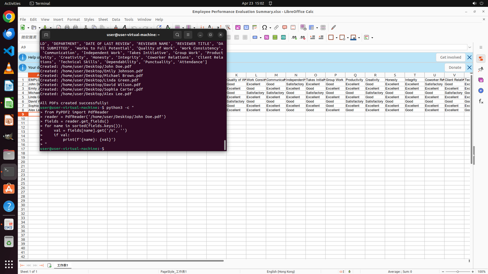

**Response:**
```
It seems no field values are being shown, which means the fields might not be getting written properly with PyPDF2. The issue could be that PyPDF2's `update_page_form_field_values` doesn't work well with all PDF forms. Let me try a different approach using `fillpdfs` or `pdfrw` library, or let me check if the values are actually there:
```

**Actions:** `import subprocess, shlex; subprocess.run(f'xdotool type --delay 12 -- ' + shlex.quote('python3 -c "\nfrom PyPDF2 import PdfReader\nreader ='), shell=True, check=True)
import time; time.sleep(0.05)
imp`

---

## Step 28

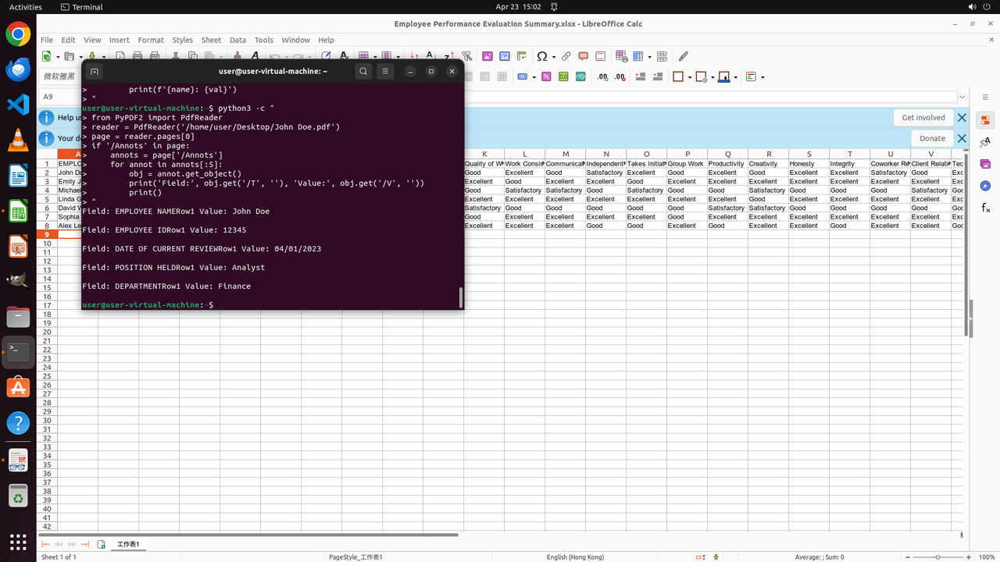

**Response:**
```
The employee info fields are being filled correctly:
- EMPLOYEE NAMERow1: John Doe
- EMPLOYEE IDRow1: 12345
- DATE OF CURRENT REVIEWRow1: 04/01/2023
- POSITION HELDRow1: Analyst
- DEPARTMENTRow1: Finance

Now let me check if the rating fields (checkmark fields) are also filled:
```

**Actions:** `import subprocess, shlex; subprocess.run(f'xdotool type --delay 12 -- ' + shlex.quote('python3 -c "\nfrom PyPDF2 import PdfReader\nreader ='), shell=True, check=True)
import time; time.sleep(0.05)
imp`

---

## Step 29

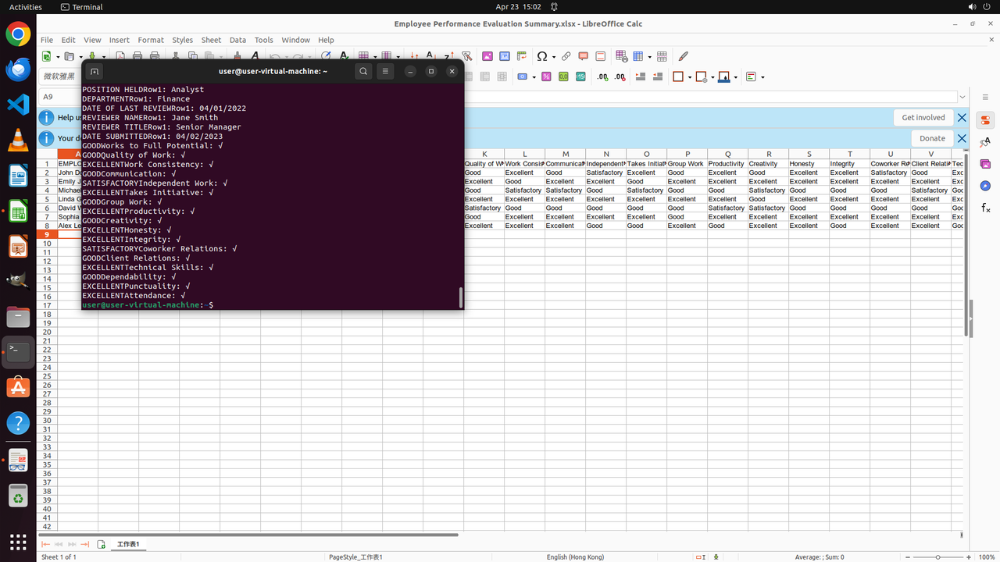

**Response:**
```
The PDF is being filled correctly. I can see all the fields for John Doe:

- Employee info: Name (John Doe), Position (Analyst), Department (Finance), dates, reviewer info
- Rating fields with "√" marks:
  - GOODWorks to Full Potential: √
  - GOODQuality of Work: √
  - EXCELLENTWork Consistency: √
  - GOODCommunication: √
  - SATISFACTORYIndependent Work: √
  - EXCELLENTTakes Initiative: √
  - GOODGroup Work: √
  - EXCELLENTProductivity: √
  - GOODCreativity: √
  - EXCELLENTHonesty: √
  - EXCELLENTIntegrity: √
  - SATISFACTORYCoworker Relations: √
  - GOODClient Relations: √
  - EXCELLENTTechnical Skills: √
  - GOODDependability: √
  - EXCELLENTPunctuality: √
  - EXCELLENTAttendance: √

This matches the Excel data for John Doe. Let me also verify the data matches by looking at the Excel spreadsheet. Let me now verify the files exist on the Desktop:
```

**Actions:** `import subprocess, shlex; subprocess.run(f'xdotool type --delay 12 -- ' + shlex.quote('ls -la /home/user/Desktop/*.pdf\n'), shell=True, check=True)
import time; time.sleep(0.05)`

---

## Step 30

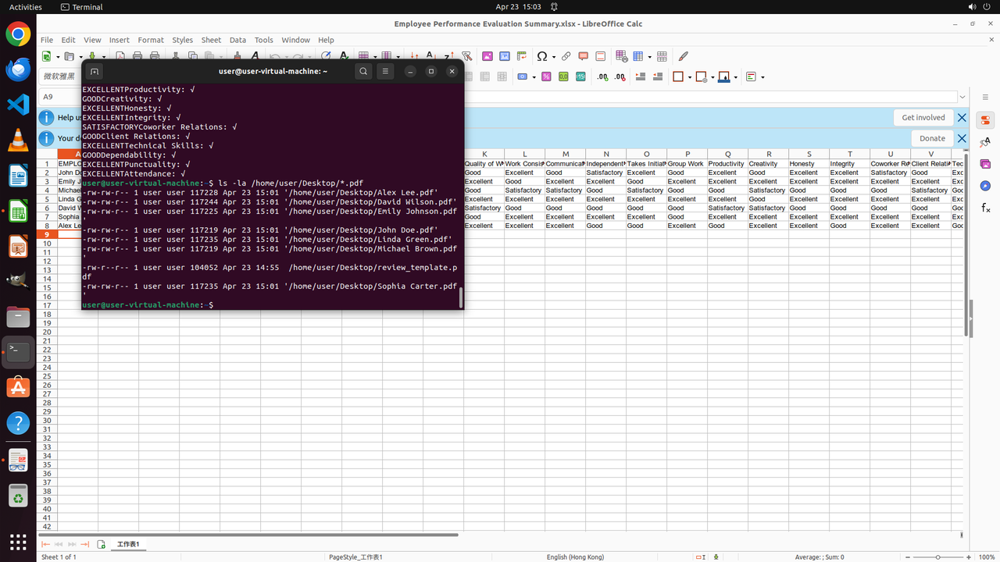

**Response:**
```
All 7 PDF files have been created successfully on the Desktop, each named after the employee:

1. Alex Lee.pdf (117228 bytes)
2. David Wilson.pdf (117244 bytes)
3. Emily Johnson.pdf (117225 bytes)
4. John Doe.pdf (117219 bytes)
5. Linda Green.pdf (117235 bytes)
6. Michael Brown.pdf (117219 bytes)
7. Sophia Carter.pdf (117235 bytes)

Plus the original `review_template.pdf` (104052 bytes).

The task has been completed successfully. Each employee's evaluation data from the Excel sheet has been accurately transferred into the designated fields of the PDF form, with:
- Employee information (name, ID, department, position, dates, reviewer info) filled in text fields
- Rating characteristics marked with "√" in the appropriate rating column (Unsatisfactory/Satisfactory/Good/Excellent)
- Each PDF file named according to the employee's name as it appears in the Excel document

DONE
```

**Actions:** `DONE`

---
