# Task 1f18aa87-af6f-41ef-9853-cdb8f32ebdea

**Instruction:** I've prepared some grammar tests and placed them in the 'Grammar test' folder. I've already provided the multiple-choice answers for Test 1 in the 'answer doc' file. Could you please follow the same format to write out the answers for the remaining two tests in the doc file? This way, I can distribute them to the students as a reference. Thank you.

**Score:** 1

**Wall clock:** 8m 11s

**Steps:** 45

**Cost:** $1.62

---

## Step 1


**Response:**
```
I need to first examine the Grammar test folder, the existing answer document, and the test files. Let me start by opening them.
```

**Actions:** `pyautogui.doubleClick(1843, 310)`

---

## Step 2


**Response:**
```
Let me double-click on the Grammar test folder to open it.
```

**Actions:** `pyautogui.doubleClick(1843, 310)`

---

## Step 3

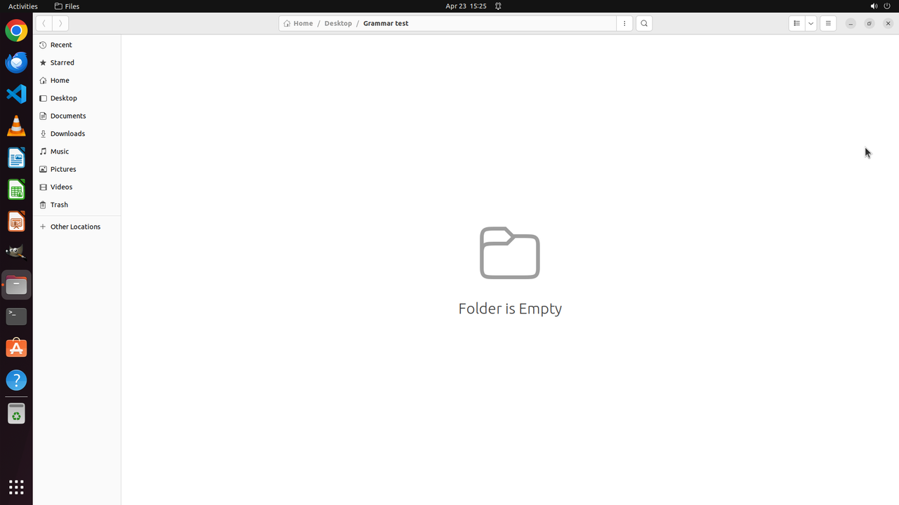

**Response:**
```
The Grammar test folder is empty. The test files and answer document are on the desktop. Let me first open the Answer.docx file to see the format, then open the Grammar test files.
```

**Actions:** `pyautogui.doubleClick(1714, 1012)`

---

## Step 4

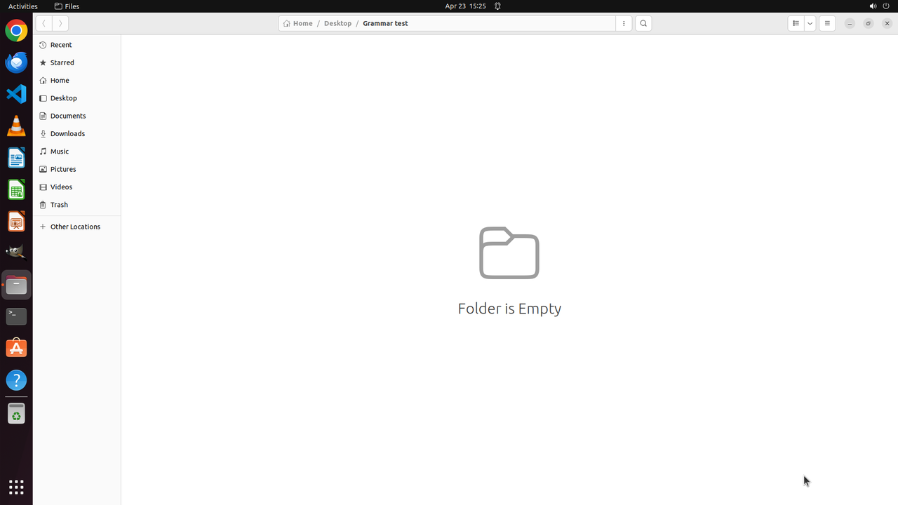

**Response:**
```
Let me navigate to the Desktop to access the files there.
```

**Actions:** `pyautogui.click(135, 208)`

---

## Step 5

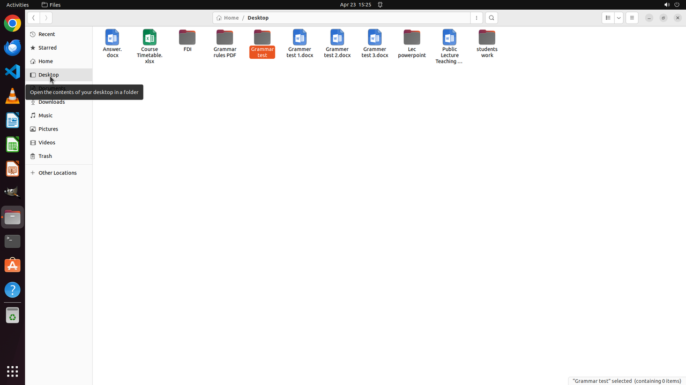

**Response:**
```
I can see all the files on the Desktop. Let me first open the Answer.docx to see the format of the answers for Test 1.
```

**Actions:** `pyautogui.doubleClick(315, 123)`

---

## Step 6

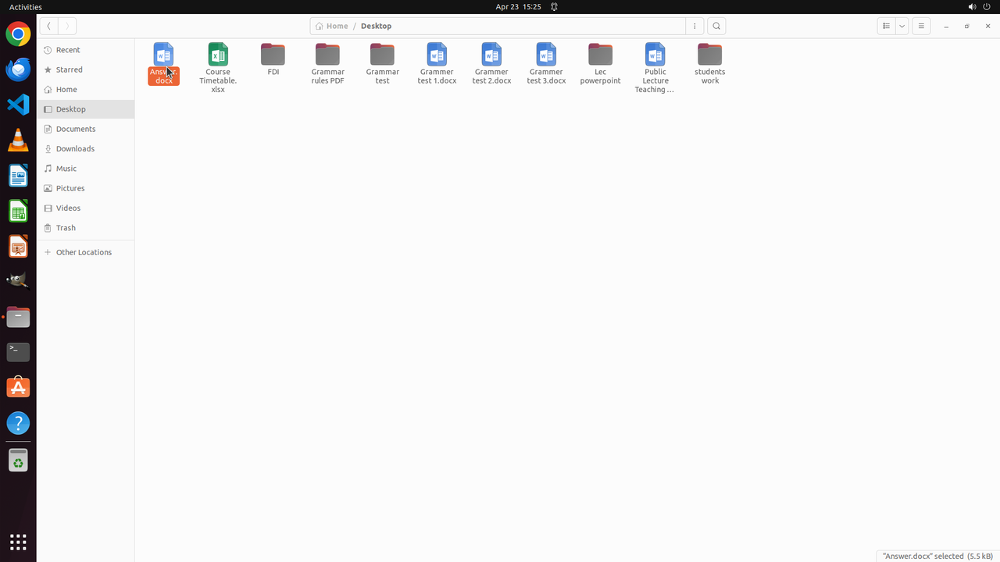

**Response:**
```
The Answer.docx file is opening. Let me wait for it to load in LibreOffice Writer.
```

**Actions:** `time.sleep(0.5)`

---

## Step 7

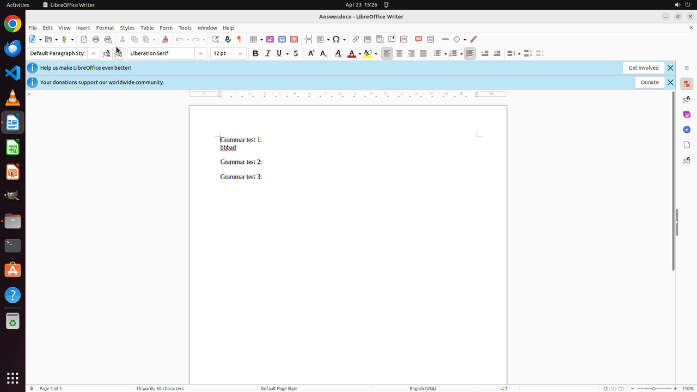

**Response:**
```
I can see the Answer.docx file. It shows:
- Grammar test 1: bbbad
- Grammar test 2: (empty)
- Grammar test 3: (empty)

So the format is the test name followed by a colon and the answers as a string of letters (like "bbbad" for 5 multiple-choice questions). Now I need to open Grammar test 2 and Grammar test 3 to determine the correct answers. Let me first open Grammar test 2.
```

**Actions:** `pyautogui.doubleClick(1843, 795)`

---

## Step 8


**Response:**
```
It seems the file didn't open yet. Let me try opening it from the file manager. First, let me open a terminal to read the test files.
```

**Actions:** `pyautogui.keyDown('ctrl')
pyautogui.keyDown('alt')
pyautogui.keyDown('t')
pyautogui.keyUp('t')
pyautogui.keyUp('alt')
pyautogui.keyUp('ctrl')`

---

## Step 9

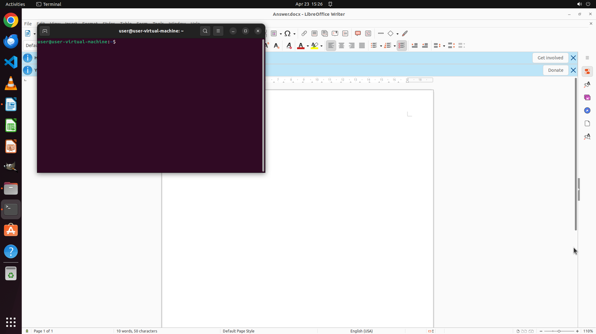

**Response:**
```
Good, the terminal is open. Let me use it to read the content of the test files. First, let me check the Grammar test 1 to understand the format, then read tests 2 and 3.
```

**Actions:** `import subprocess, shlex; subprocess.run(f'xdotool type --delay 12 -- ' + shlex.quote('cd ~/Desktop && python3 -c "\nimport docx\ndoc = doc'), shell=True, check=True)
import time; time.sleep(0.05)
imp`

---

## Step 10

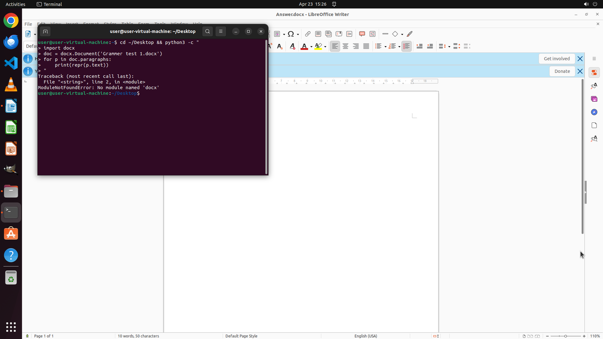

**Response:**
```
The `docx` module is not installed. Let me install it first.
```

**Actions:** `import subprocess, shlex; subprocess.run(f'xdotool type --delay 12 -- ' + shlex.quote('pip3 install python-docx\n'), shell=True, check=True)
import time; time.sleep(0.05)`

---

## Step 11

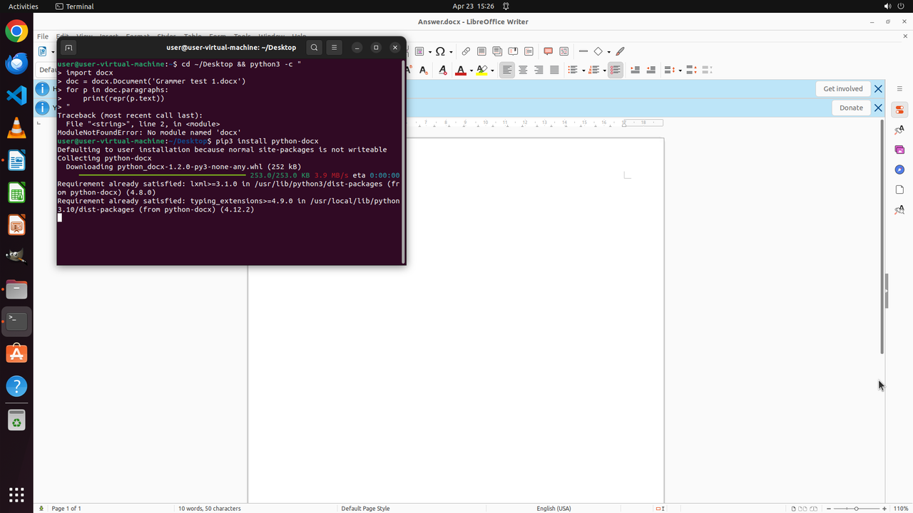

**Response:**
```
Good, python-docx is being installed. Let me wait for it to finish and then read the test files.
```

**Actions:** `time.sleep(0.5)`

---

## Step 12

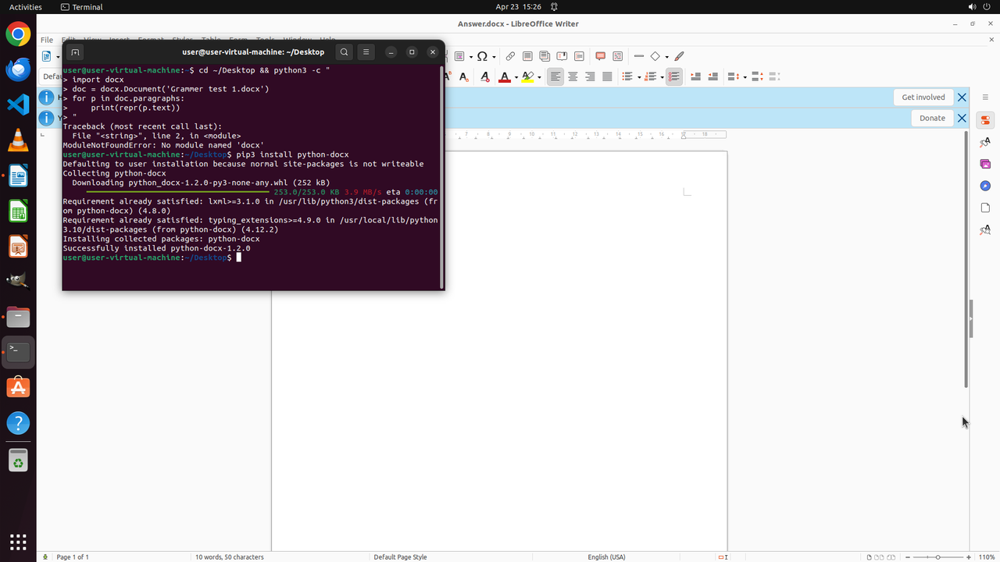

**Response:**
```
python-docx is installed. Now let me read all three test files and the answer file to understand the content.
```

**Actions:** `import subprocess, shlex; subprocess.run(f'xdotool type --delay 12 -- ' + shlex.quote('python3 -c "\nimport docx\nfor f in [\'Grammer test 1'), shell=True, check=True)
import time; time.sleep(0.05)
im`

---

## Step 13

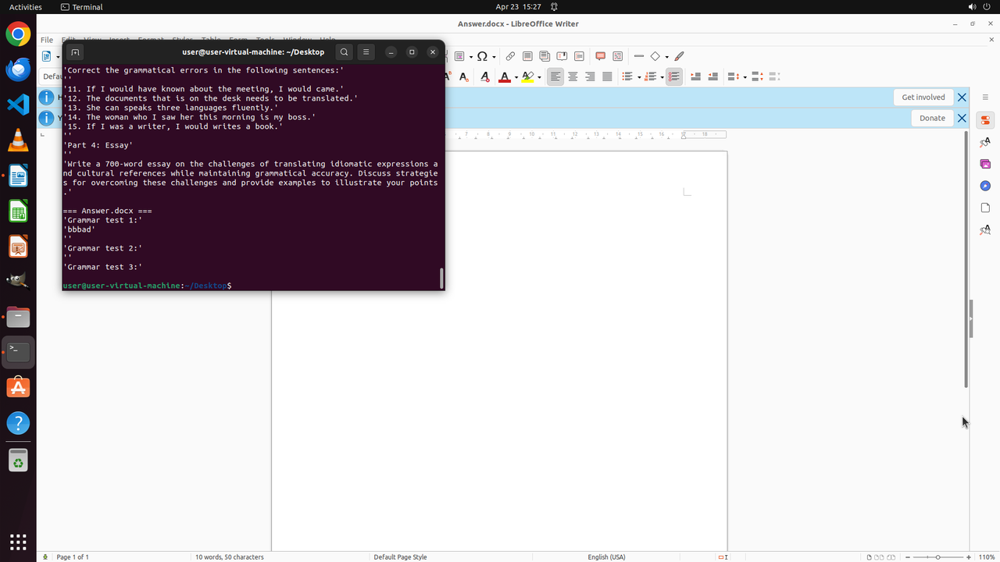

**Response:**
```
I can see the output but I need to scroll up to see the full content of all three test files. Let me scroll up to see the beginning.
```

**Actions:** `pyautogui.scroll(15, 480, 300)`

---

## Step 14


**Response:**
```
I can see the content is quite long. Let me save the full output to a file so I can read it more easily.
```

**Actions:** `pyautogui.scroll(20, 480, 300)`

---

## Step 15

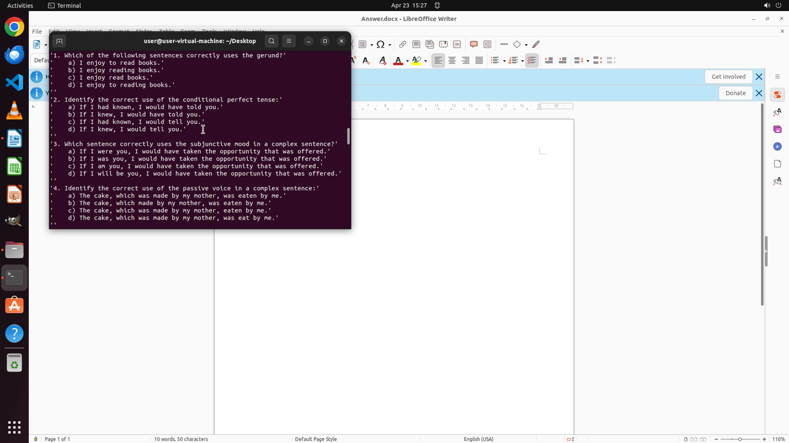

**Response:**
```
I can see the content of the test files. Let me save the output to a text file so I can read it all at once. Let me scroll up more to see which test file this belongs to.
```

**Actions:** `pyautogui.scroll(20, 480, 300)`

---

## Step 16


**Response:**
```
Let me save the output to a file for easier reading instead of scrolling through the terminal.
```

**Actions:** `pyautogui.scroll(-50, 480, 300)`

---

## Step 17

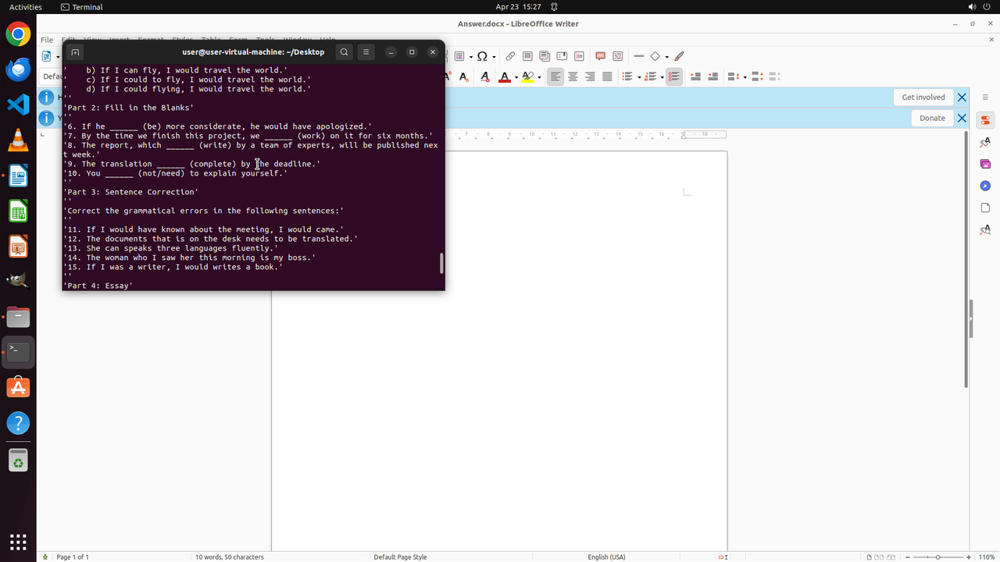

**Response:**
```
I can see the tests have multiple parts (multiple choice, fill in the blanks, sentence correction, essay). Let me save the full output to a file so I can read it all properly.
```

**Actions:** `pyautogui.scroll(-10, 480, 300)`

---

## Step 18

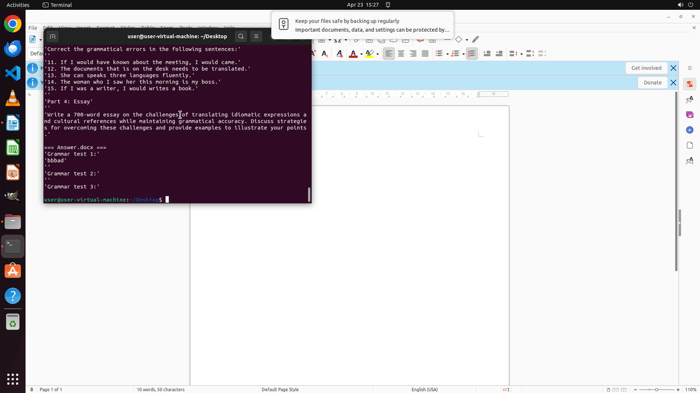

**Response:**
```
Now I can see the Answer.docx format. The answer for Grammar test 1 is "bbbad" which represents the answers to 5 multiple-choice questions. Let me save the full output to a file to read it completely, and also understand the structure better. Let me write the output to a file.
```

**Actions:** `import subprocess, shlex; subprocess.run(f'xdotool type --delay 12 -- ' + shlex.quote('python3 -c "\nimport docx\nfor f in [\'Grammer test 1'), shell=True, check=True)
import time; time.sleep(0.05)
im`

---

## Step 19


**Response:**
```
Good, the file has been saved. Let me now read it.
```

**Actions:** `import subprocess, shlex; subprocess.run(f'xdotool type --delay 12 -- ' + shlex.quote('cat /tmp/tests_output.txt\n'), shell=True, check=True)
import time; time.sleep(0.05)`

---

## Step 20


**Response:**
```
I can see the end of one test file. Let me scroll up to see the full content from the beginning.
```

**Actions:** `pyautogui.scroll(30, 480, 300)`

---

## Step 21


**Response:**
```
I can see this is one of the test files with multiple-choice questions. Let me scroll up more to see which test this is and to see the beginning.
```

**Actions:** `pyautogui.scroll(30, 480, 300)`

---

## Step 22

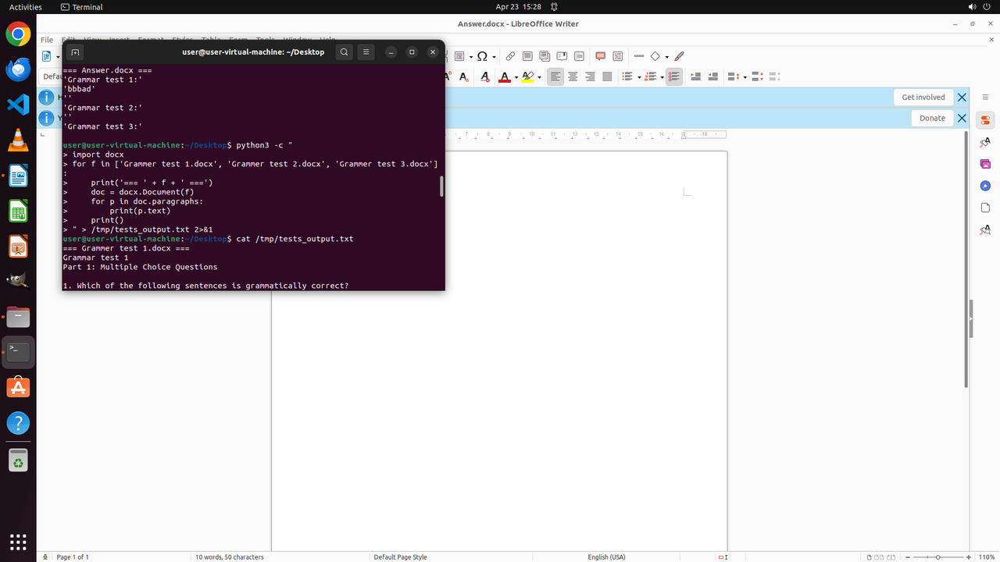

**Response:**
```
Now I can see the beginning of the output file. Grammar test 1 starts with "Part 1: Multiple Choice Questions". The answer format is "bbbad" which represents 5 multiple-choice answers. But I notice the tests also have other parts (Fill in the Blanks, Sentence Correction, Essay) - the answer "bbbad" only covers the multiple-choice part (Part 1). 

Let me read each test file separately to understand the structure better. Let me use a more efficient approach and read each file separately.
```

**Actions:** `import subprocess, shlex; subprocess.run(f'xdotool type --delay 12 -- ' + shlex.quote('python3 -c "\nimport docx\ndoc = docx.Document(\'Gram'), shell=True, check=True)
import time; time.sleep(0.05)
im`

---

## Step 23


**Response:**
```
Now I can see Grammar test 1 has 4 parts. The answer "bbbad" in the Answer.docx only covers the 5 multiple-choice questions in Part 1. Let me scroll up to see the full test 1 multiple choice questions.
```

**Actions:** `pyautogui.scroll(15, 480, 300)`

---

## Step 24

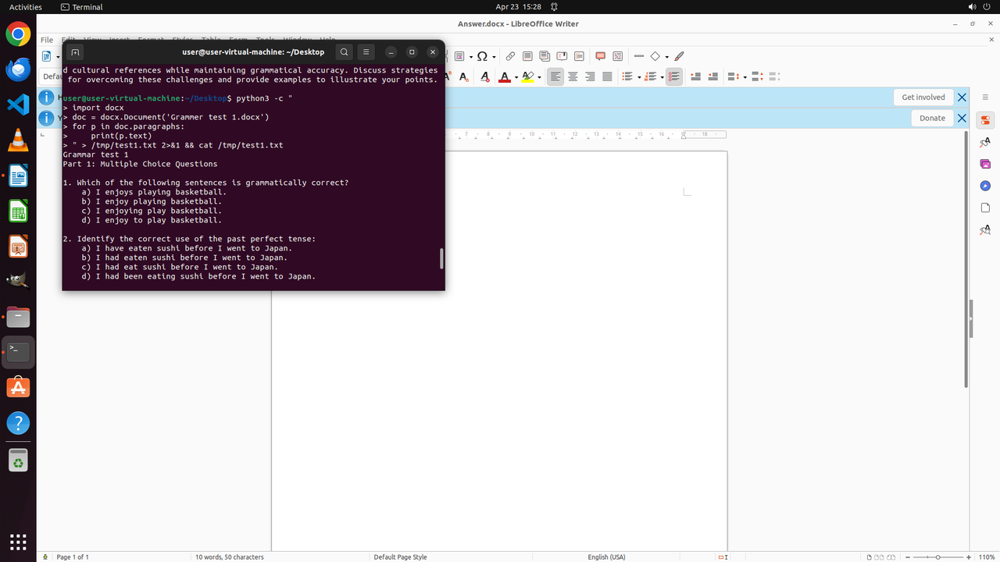

**Response:**
```
Now I can see Grammar test 1 clearly. Let me verify the answers for Test 1:

**Grammar Test 1 - Part 1: Multiple Choice Questions:**
1. Which of the following sentences is grammatically correct?
   - a) I enjoys playing basketball.
   - b) I enjoy playing basketball. ✓ (b)
   - c) I enjoying play basketball.
   - d) I enjoy to play basketball.

2. Identify the correct use of the past perfect tense:
   - a) I have eaten sushi before I went to Japan.
   - b) I had eaten sushi before I went to Japan. ✓ (b)
   - c) I had eat sushi before I went to Japan.
   - d) I had been eating sushi before I went to Japan.

Let me scroll down to see questions 3-5.
```

**Actions:** `pyautogui.scroll(-5, 480, 300)`

---

## Step 25

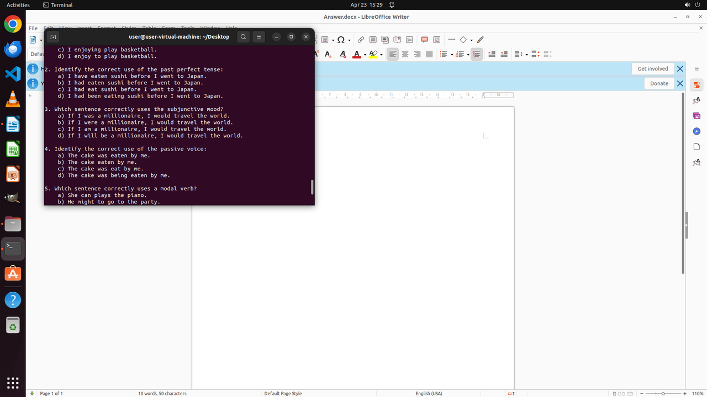

**Response:**
```
Now I can see questions 1-5 of Grammar Test 1:

1. b) I enjoy playing basketball. → **b**
2. b) I had eaten sushi before I went to Japan. → **b**
3. b) If I were a millionaire, I would travel the world. → **b** (subjunctive mood)
4. a) The cake was eaten by me. → **a** (passive voice)
5. Let me see options c and d...
```

**Actions:** `pyautogui.scroll(-3, 480, 300)`

---

## Step 26

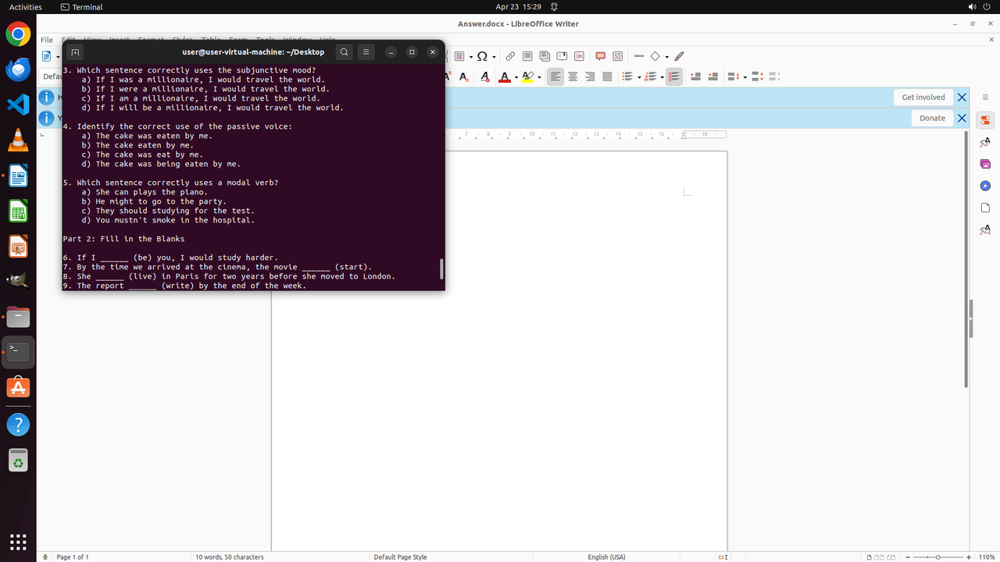

**Response:**
```
Now I can see all 5 multiple-choice questions for Grammar Test 1:

1. b) I enjoy playing basketball → **b**
2. b) I had eaten sushi before I went to Japan → **b**
3. b) If I were a millionaire, I would travel the world → **b**
4. a) The cake was eaten by me → **a**
5. d) You mustn't smoke in the hospital → **d**

Wait, the answer is "bbbad". Let me verify Q5:
- a) She can plays the piano. (wrong - "can play")
- b) He might to go to the party. (wrong - "might go")
- c) They should studying for the test. (wrong - "should study")
- d) You mustn't smoke in the hospital. ✓ → **d**

So answers are b, b, b, a, d = "bbbad" ✓ This matches!

Now I need to read Grammar test 2 and Grammar test 3 to determine the multiple-choice answers. Let me now read test 2.
```

**Actions:** `import subprocess, shlex; subprocess.run(f'xdotool type --delay 12 -- ' + shlex.quote('python3 -c "\nimport docx\ndoc = docx.Document(\'Gram'), shell=True, check=True)
import time; time.sleep(0.05)
im`

---

## Step 27


**Response:**
```
I can see the end of Grammar test 2. Let me scroll up to see the multiple-choice questions at the beginning.
```

**Actions:** `pyautogui.scroll(15, 480, 300)`

---

## Step 28


**Response:**
```
Now I can see Grammar Test 2, Part 1: Multiple Choice Questions.

**Question 1:** Which of the following sentences correctly uses the gerund?
- a) I enjoy to read books.
- b) I enjoy reading books. ✓ (gerund = verb+ing as object)
- c) I enjoy read books.
- d) I enjoy to reading books.
→ **b**

**Question 2:** Identify the correct use of the conditional perfect tense:
- a) If I had known, I would have told you. ✓
- b) If I knew, I would have told you.
- c) If I had known, I would tell you.
→ **a**

Let me scroll down to see the rest of the questions.
```

**Actions:** `pyautogui.scroll(-5, 480, 300)`

---

## Step 29

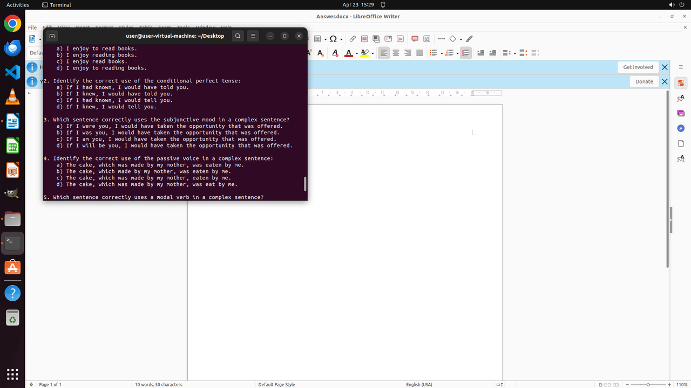

**Response:**
```
Now I can see more questions for Grammar Test 2:

**Question 2:** Identify the correct use of the conditional perfect tense:
- a) If I had known, I would have told you. ✓
- b) If I knew, I would have told you.
- c) If I had known, I would tell you.
- d) If I knew, I would tell you.
→ **a**

**Question 3:** Which sentence correctly uses the subjunctive mood in a complex sentence?
- a) If I were you, I would have taken the opportunity that was offered. ✓ (subjunctive "were" + complex sentence)
- b) If I was you, I would have taken the opportunity that was offered.
- c) If I am you, I would have taken the opportunity that was offered.
- d) If I will be you, I would have taken the opportunity that was offered.
→ **a**

**Question 4:** Identify the correct use of the passive voice in a complex sentence:
- a) The cake, which was made by my mother, was eaten by me. ✓ (correct passive voice)
- b) The cake, which made by my mother, was eaten by me.
- c) The cake, which was made by my mother, eaten by me.
- d) The cake, which was made by my mother, was eat by me.
→ **a**

Let me scroll down to see question 5.
```

**Actions:** `pyautogui.scroll(-3, 480, 300)`

---

## Step 30

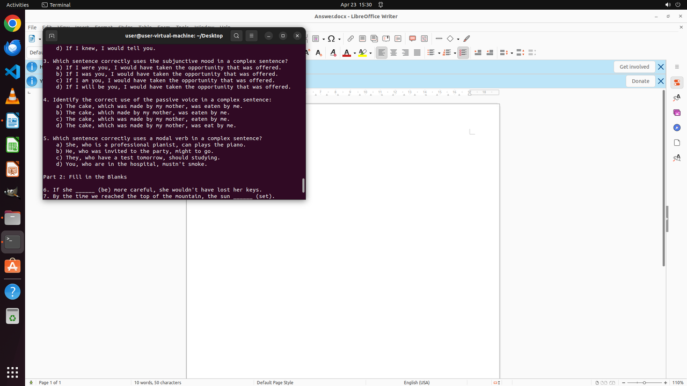

**Response:**
```
Now I can see question 5 for Grammar Test 2:

**Question 5:** Which sentence correctly uses a modal verb in a complex sentence?
- a) She, who is a professional pianist, can plays the piano. (wrong - "can play")
- b) He, who was invited to the party, might to go. (wrong - "might go")
- c) They, who have a test tomorrow, should studying. (wrong - "should study")
- d) You, who are in the hospital, mustn't smoke. ✓
→ **d**

So Grammar Test 2 answers: b, a, a, a, d = **"baaad"**

Now let me read Grammar Test 3.
```

**Actions:** `import subprocess, shlex; subprocess.run(f'xdotool type --delay 12 -- ' + shlex.quote('python3 -c "\nimport docx\ndoc = docx.Document(\'Gram'), shell=True, check=True)
import time; time.sleep(0.05)
im`

---

## Step 31

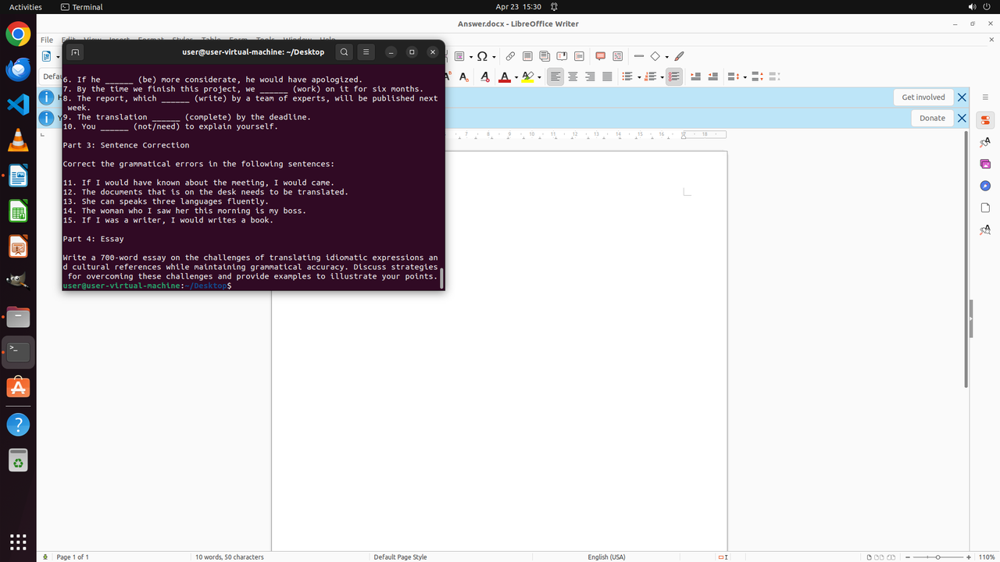

**Response:**
```
I can see the end of Grammar Test 3. Let me scroll up to see the multiple-choice questions at the beginning.
```

**Actions:** `pyautogui.scroll(15, 480, 300)`

---

## Step 32

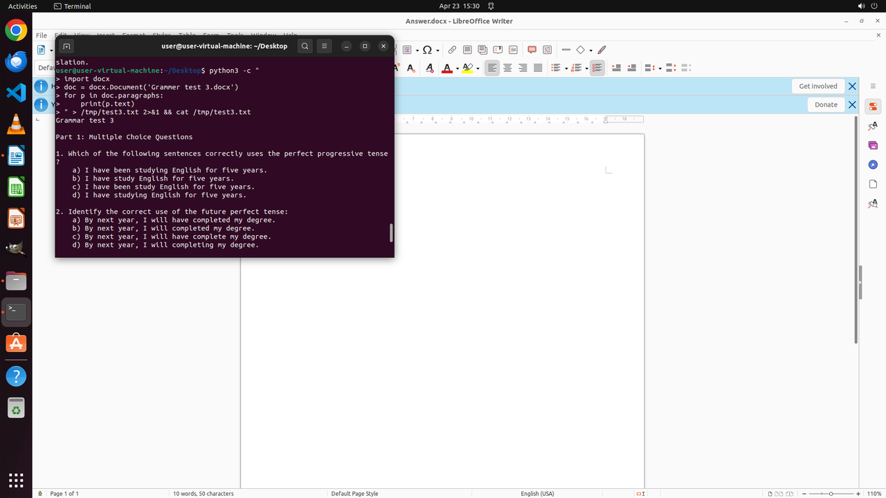

**Response:**
```
Now I can see Grammar Test 3, Part 1: Multiple Choice Questions.

**Question 1:** Which of the following sentences correctly uses the perfect progressive tense?
- a) I have been studying English for five years. ✓ (present perfect progressive)
- b) I have study English for five years.
- c) I have been study English for five years.
- d) I have studying English for five years.
→ **a**

**Question 2:** Identify the correct use of the future perfect tense:
- a) By next year, I will have completed my degree. ✓ (future perfect)
- b) By next year, I will completed my degree.
- c) By next year, I will have complete my degree.
- d) By next year, I will completing my degree.
→ **a**

Let me scroll down to see questions 3-5.
```

**Actions:** `pyautogui.scroll(-5, 480, 300)`

---

## Step 33


**Response:**
```
Now I can see questions 3 and 4 for Grammar Test 3:

**Question 3:** Which sentence correctly uses the subjunctive mood in a hypothetical situation?
- a) If I were to win the lottery, I would buy a house. ✓ (subjunctive "were")
- b) If I was to win the lottery, I would buy a house.
- c) If I am to win the lottery, I would buy a house.
- d) If I will be to win the lottery, I would buy a house.
→ **a**

**Question 4:** Identify the correct use of the passive voice in a sentence with a phrasal verb:
- a) The proposal was turned down by the committee. ✓ (correct passive with phrasal verb "turn down")
- b) The proposal was turned by the committee.
- c) The proposal was turn down by the committee.
- d) The proposal was turned down the committee.
→ **a**

Let me scroll down to see question 5.
```

**Actions:** `pyautogui.scroll(-3, 480, 300)`

---

## Step 34

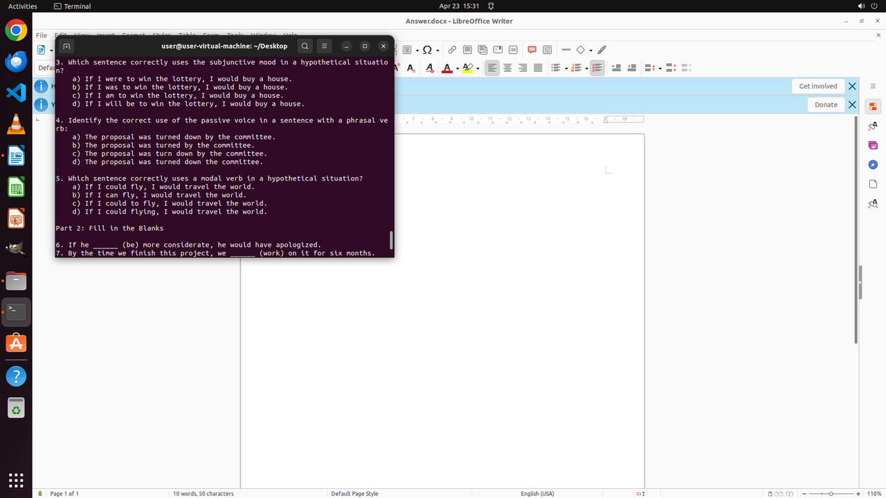

**Response:**
```
Now I can see question 5 for Grammar Test 3:

**Question 5:** Which sentence correctly uses a modal verb in a hypothetical situation?
- a) If I could fly, I would travel the world. ✓ (correct use of "could" in hypothetical)
- b) If I can fly, I would travel the world. (wrong - "can" should be "could" for hypothetical)
- c) If I could to fly, I would travel the world. (wrong - no "to" after "could")
- d) If I could flying, I would travel the world. (wrong - base form needed after "could")
→ **a**

So Grammar Test 3 answers: a, a, a, a, a = **"aaaaa"**

Now let me summarize:
- Grammar test 1: bbbad (already provided)
- Grammar test 2: baaad
- Grammar test 3: aaaaa

Now I need to update the Answer.docx file. Let me switch to the LibreOffice Writer window and add the answers.
```

**Actions:** `pyautogui.click(990, 45)`

---

## Step 35

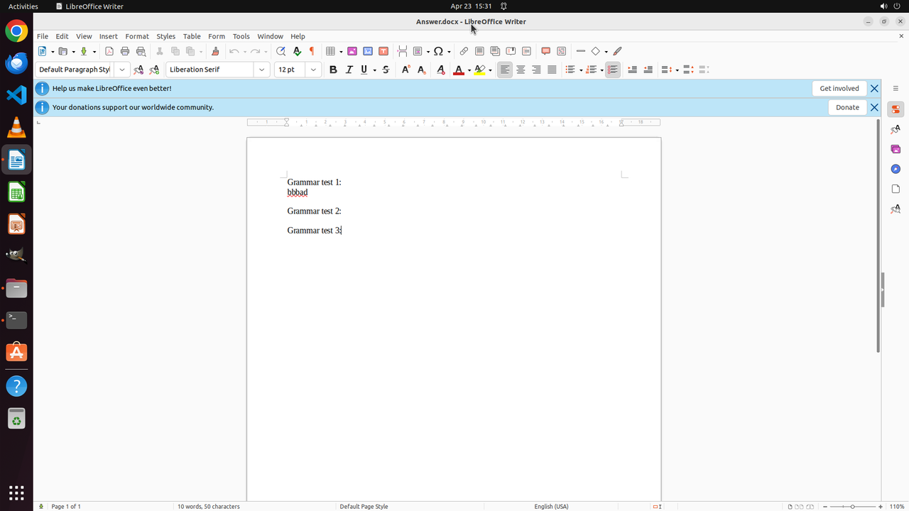

**Response:**
```
I can see the Answer.docx file with:
- Grammar test 1: bbbad
- Grammar test 2: (empty)
- Grammar test 3: (empty)

I need to add "baaad" after "Grammar test 2:" and "aaaaa" after "Grammar test 3:". Let me click at the end of "Grammar test 2:" line to place my cursor there.
```

**Actions:** `pyautogui.click(720, 445)`

---

## Step 36


**Response:**
```
Good, I can see the cursor is placed near "Grammar test 2:". I need to look at the format more carefully. For Test 1, the answer "bbbad" is on a new line below "Grammar test 1:". Let me click at the end of the "Grammar test 2:" line and then press Enter to add the answer on a new line.
```

**Actions:** `pyautogui.keyDown('end')
pyautogui.keyUp('end')`

---

## Step 37


**Response:**
```
I need to check the exact format. Looking at the Answer.docx, I see:
- "Grammar test 1:" on one line
- "bbbad" on the next line
- Empty line
- "Grammar test 2:" on one line
- Empty line  
- "Grammar test 3:" on one line

Let me use python to edit the document programmatically to ensure the format is exactly right.
```

**Actions:** `pyautogui.keyDown('return')
pyautogui.keyUp('return')`

---

## Step 38


**Response:**
```
I see that pressing Enter created a new line after "Grammar test 2:" and pushed "Grammar test 3:" down. But wait - looking at the format more carefully, I see that for Test 1, "bbbad" appears on the line directly below "Grammar test 1:" without a blank line between them. But there IS a blank line between the "bbbad" line and "Grammar test 2:". 

However, looking again at the original document, it seems like the format might be:
- "Grammar test 1:" (line)
- "bbbad" (line)
- (blank line)
- "Grammar test 2:" (line)
- (blank line)
- "Grammar test 3:" (line)

But actually, I pressed Enter and it created a new line right after "Grammar test 2:". The cursor should be on the new blank line between "Grammar test 2:" and "Grammar test 3:". Let me type the answer for test 2.
```

**Actions:** `import subprocess, shlex; subprocess.run(f'xdotool type --delay 12 -- ' + shlex.quote('baaad'), shell=True, check=True)
import time; time.sleep(0.05)`

---

## Step 39


**Response:**
```
I've typed "baaad" for Grammar test 2. Now I need to add the answer for Grammar test 3. Let me click at the end of "Grammar test 3:" line.
```

**Actions:** `pyautogui.click(720, 505)`

---

## Step 40


**Response:**
```
Good, the cursor is placed after "Grammar test 3:". Now I need to press End to make sure I'm at the end of the line, then press Enter and type the answer.
```

**Actions:** `pyautogui.keyDown('end')
pyautogui.keyUp('end')`

---

## Step 41


**Response:**
```
Now I'll press Enter to create a new line and type the answer for Grammar test 3.
```

**Actions:** `pyautogui.keyDown('return')
pyautogui.keyUp('return')`

---

## Step 42


**Response:**
```
It looks like the Enter was pressed but I'm not sure where the cursor ended up. It seems like it might have added a line after "Grammar test 3:". Let me look more carefully - the document still shows the same layout. Let me check if the cursor is between "Grammar test 3:" and the blank area below. It seems the new line was created after "Grammar test 3:". Let me type the answer.
```

**Actions:** `import subprocess, shlex; subprocess.run(f'xdotool type --delay 12 -- ' + shlex.quote('aaaaa'), shell=True, check=True)
import time; time.sleep(0.05)`

---

## Step 43


**Response:**
```
The document now shows:
- Grammar test 1: bbbad
- Grammar test 2: baaad
- Grammar test 3: aaaaa

This matches the format perfectly. Now let me save the file with Ctrl+S.
```

**Actions:** `pyautogui.keyDown('ctrl')
pyautogui.keyDown('s')
pyautogui.keyUp('s')
pyautogui.keyUp('ctrl')`

---

## Step 44


**Response:**
```
The file appears to have been saved (it may have saved in docx format directly since the title still shows "Answer.docx"). Let me check if a format dialog appeared. It seems it saved successfully. Let me verify by checking if there was a "Keep Current Format" dialog that I might have missed.
```

**Actions:** `pyautogui.keyDown('ctrl')
pyautogui.keyDown('s')
pyautogui.keyUp('s')
pyautogui.keyUp('ctrl')`

---

## Step 45

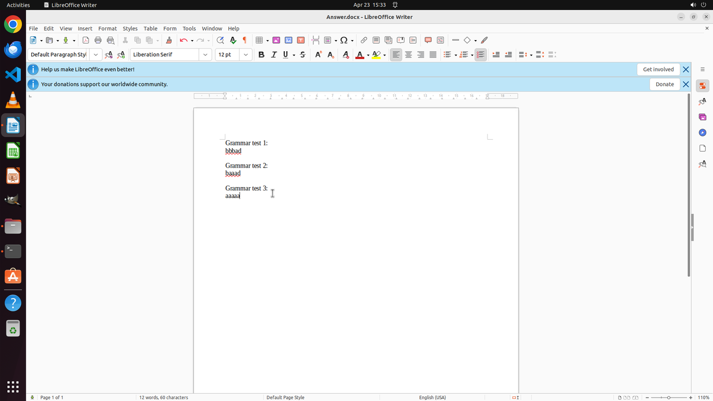

**Response:**
```
The file has been saved successfully. The Answer.docx now contains:

- Grammar test 1: bbbad
- Grammar test 2: baaad
- Grammar test 3: aaaaa

The answers follow the same format as Test 1, with each answer string on a new line below the test name. The task is complete.

DONE
```

**Actions:** `DONE`

---
