# Task 1f18aa87-af6f-41ef-9853-cdb8f32ebdea

**Instruction:** I've prepared some grammar tests and placed them in the 'Grammar test' folder. I've already provided the multiple-choice answers for Test 1 in the 'answer doc' file. Could you please follow the same format to write out the answers for the remaining two tests in the doc file? This way, I can distribute them to the students as a reference. Thank you.

**Score:** 1

**Wall clock:** 6m 39s

**Steps:** 36

**Cost:** $1.20

---

## Step 1


**Response:**
```
I need to first look at the existing answer document and the grammar tests to understand the format and content. Let me start by opening the files.
```

**Actions:** `pyautogui.doubleClick(1842, 547)`

---

## Step 2


**Response:**
```
The Answer.docx file is opening. Let me wait for it to load.
```

**Actions:** `time.sleep(0.5)`

---

## Step 3

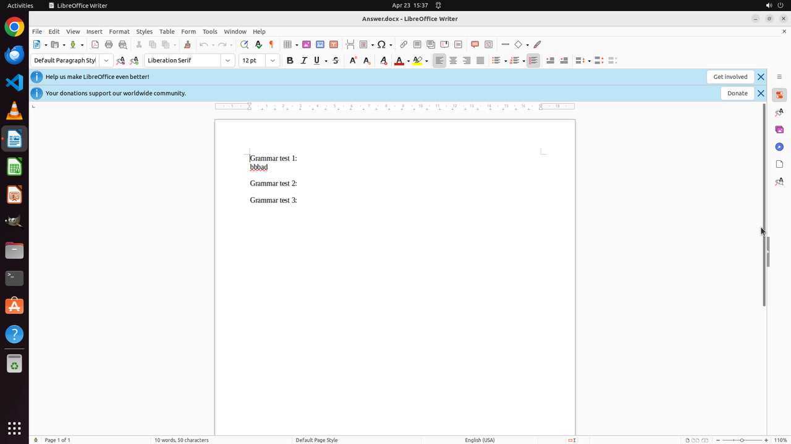

**Response:**
```
I can see the Answer.docx file is open. It shows:
- Grammar test 1: bbbad
- Grammar test 2: (empty)
- Grammar test 3: (empty)

Now I need to open the Grammar test 2 and Grammar test 3 files to find the correct answers. Let me first open Grammar test 2.
```

**Actions:** `pyautogui.doubleClick(1842, 795)`

---

## Step 4


**Response:**
```
It seems the Grammar test 2 file hasn't opened yet. Let me wait a moment and try again.
```

**Actions:** `time.sleep(0.5)`

---

## Step 5


**Response:**
```
The Grammar test 2 file didn't open in a new window. Let me try opening it through the File menu or by using the terminal. First, let me try to open the test files. Let me use the terminal to read the test files.
```

**Actions:** `pyautogui.keyDown('ctrl')
pyautogui.keyDown('alt')
pyautogui.keyDown('t')
pyautogui.keyUp('t')
pyautogui.keyUp('alt')
pyautogui.keyUp('ctrl')`

---

## Step 6

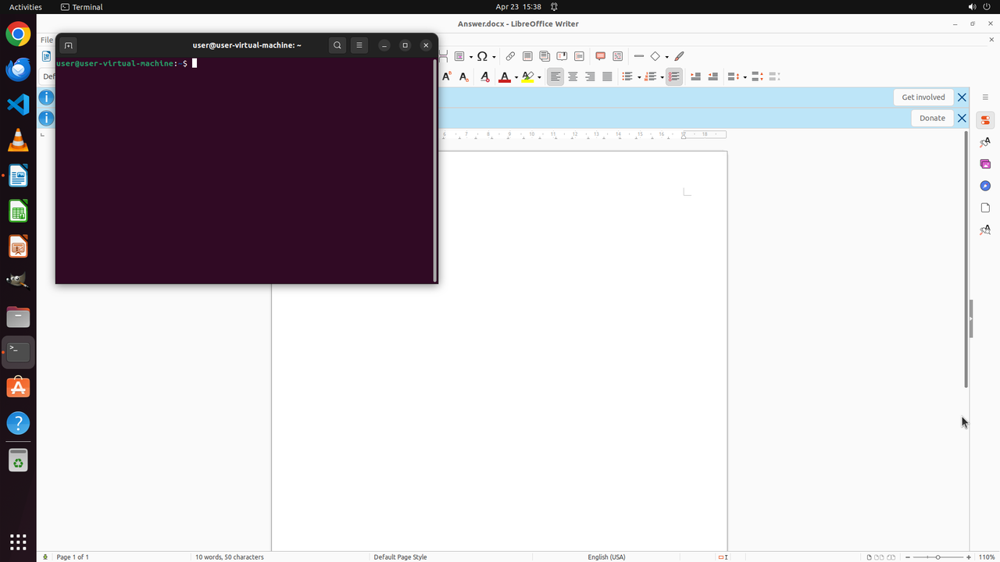

**Response:**
```
Good, the terminal is open. Let me first find and read the grammar test files. Let me look at the files on the desktop.
```

**Actions:** `import subprocess, shlex; subprocess.run(f'xdotool type --delay 12 -- ' + shlex.quote('ls ~/Desktop/\n'), shell=True, check=True)
import time; time.sleep(0.05)`

---

## Step 7

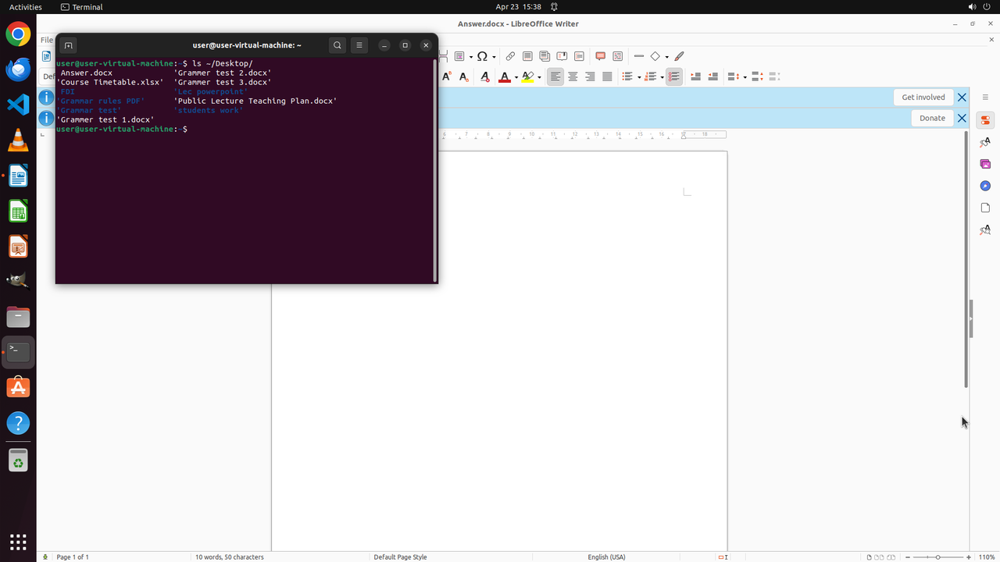

**Response:**
```
I can see the files on the desktop. Now let me use `python3` with `python-docx` to read the content of Grammar test 2 and Grammar test 3 files. Let me first check if python-docx is available.
```

**Actions:** `import subprocess, shlex; subprocess.run(f'xdotool type --delay 12 -- ' + shlex.quote('python3 -c "from docx import Document; doc = Docum'), shell=True, check=True)
import time; time.sleep(0.05)
impor`

---

## Step 8

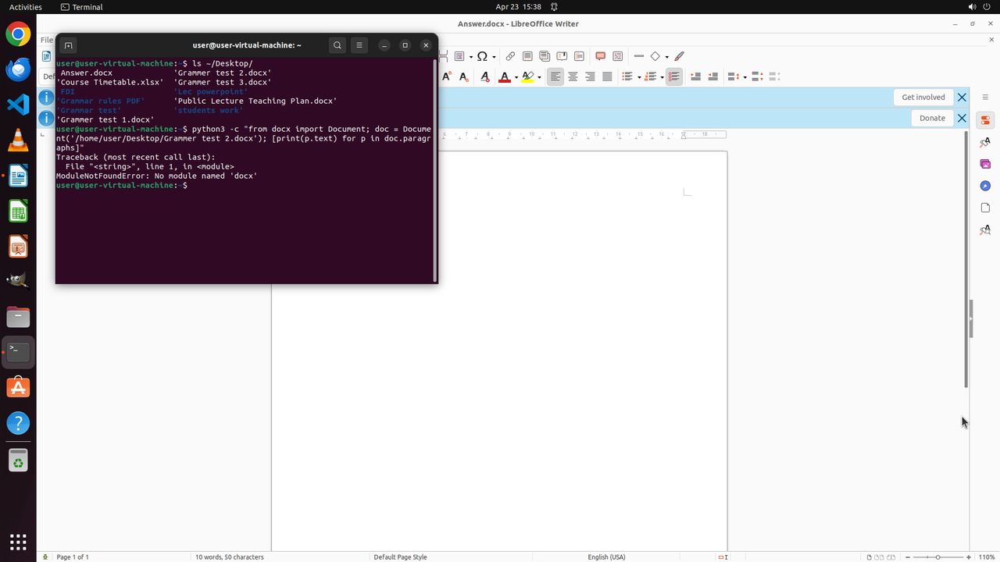

**Response:**
```
The `python-docx` module is not installed. Let me install it first.
```

**Actions:** `import subprocess, shlex; subprocess.run(f'xdotool type --delay 12 -- ' + shlex.quote('pip3 install python-docx\n'), shell=True, check=True)
import time; time.sleep(0.05)`

---

## Step 9

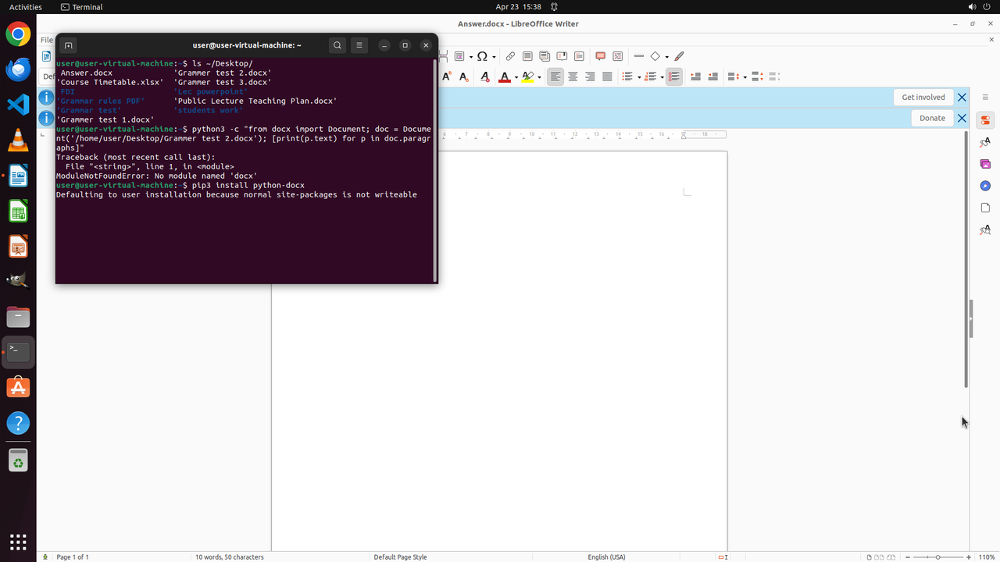

**Response:**
```
It's installing. Let me wait for it to complete.
```

**Actions:** `time.sleep(0.5)`

---

## Step 10

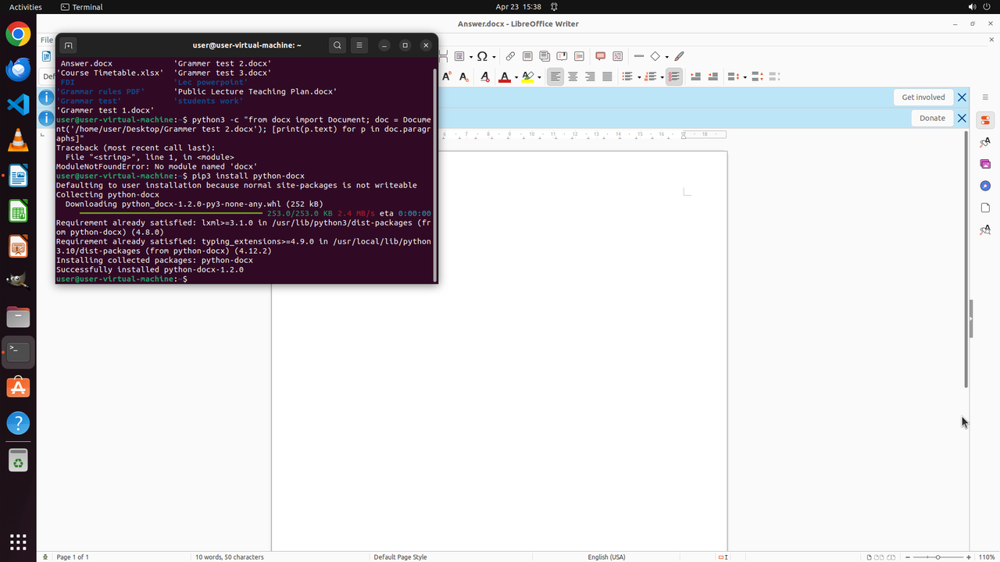

**Response:**
```
`python-docx` is now installed. Let me first read Grammar test 1 to understand the format, then read Grammar test 2 and Grammar test 3.
```

**Actions:** `import subprocess, shlex; subprocess.run(f'xdotool type --delay 12 -- ' + shlex.quote('python3 -c "from docx import Document; doc = Docum'), shell=True, check=True)
import time; time.sleep(0.05)
impor`

---

## Step 11

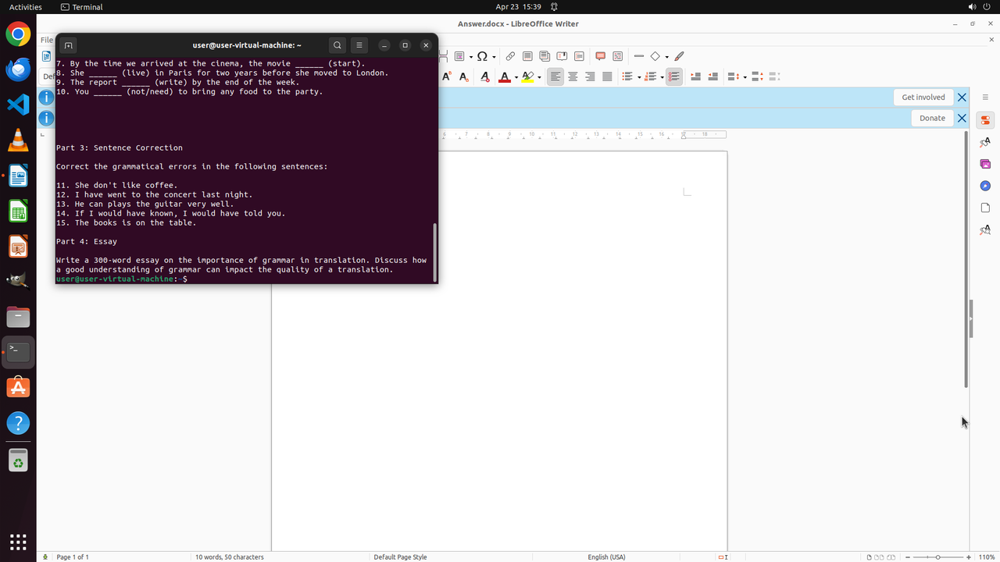

**Response:**
```
I can see part of Grammar test 1. Let me scroll up to see the full content.
```

**Actions:** `pyautogui.scroll(5, 450, 300)`

---

## Step 12

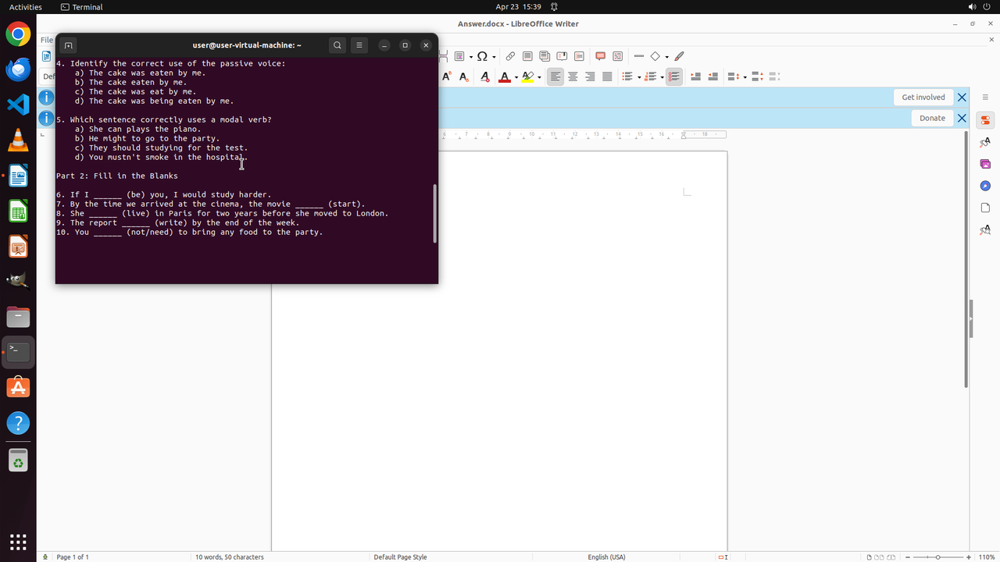

**Response:**
```
Let me scroll up more to see the beginning of Grammar test 1.
```

**Actions:** `pyautogui.scroll(10, 450, 300)`

---

## Step 13

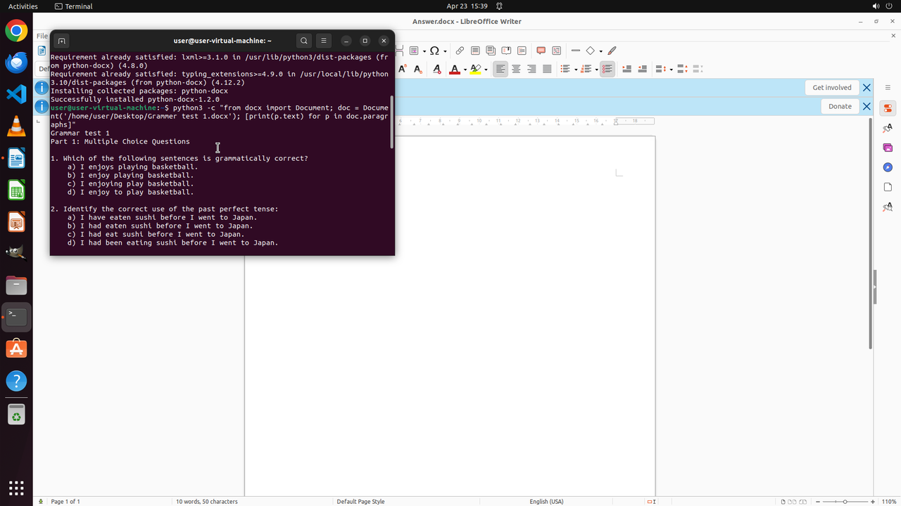

**Response:**
```
Now I can see Grammar test 1. It has:
- Part 1: Multiple Choice Questions (questions 1-5)
- Part 2: Fill in the Blanks (questions 6-10)
- Part 3: Sentence Correction (questions 11-15)
- Part 4: Essay

The answer for test 1 is "bbbad" which corresponds to the 5 multiple choice questions only. So the format is just the letter answers for the multiple choice questions concatenated together.

Let me now understand: for test 1, the answers are b, b, b, a, d → "bbbad"

Let me verify:
1. b) I enjoy playing basketball. ✓
2. b) I had eaten sushi before I went to Japan. ✓
3. Need to see question 3...

Let me now read Grammar test 2 and 3. Let me first read test 2.
```

**Actions:** `import subprocess, shlex; subprocess.run(f'xdotool type --delay 12 -- ' + shlex.quote('python3 -c "from docx import Document; doc = Docum'), shell=True, check=True)
import time; time.sleep(0.05)
impor`

---

## Step 14

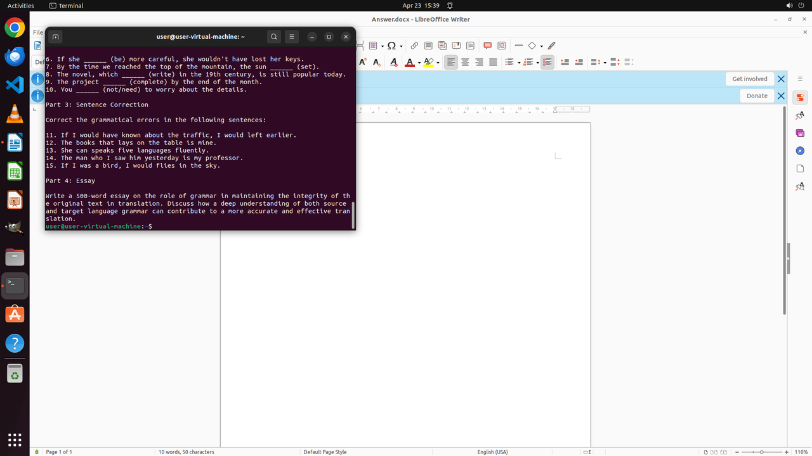

**Response:**
```
I can see the bottom part of Grammar test 2. Let me scroll up to see the multiple choice questions.
```

**Actions:** `pyautogui.scroll(10, 450, 300)`

---

## Step 15

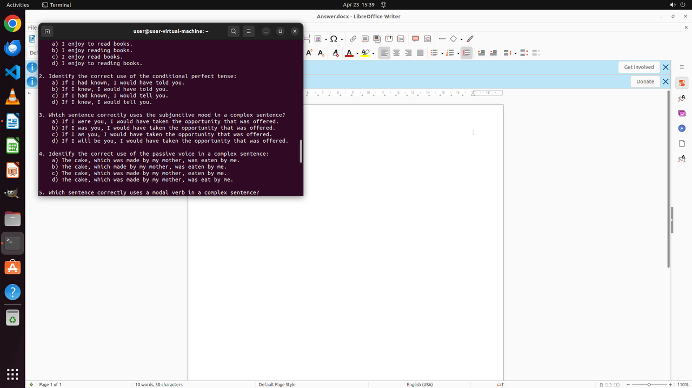

**Response:**
```
Now I can see the multiple choice questions for Grammar test 2. Let me scroll up a bit more to see question 1 completely.
```

**Actions:** `pyautogui.scroll(3, 450, 300)`

---

## Step 16

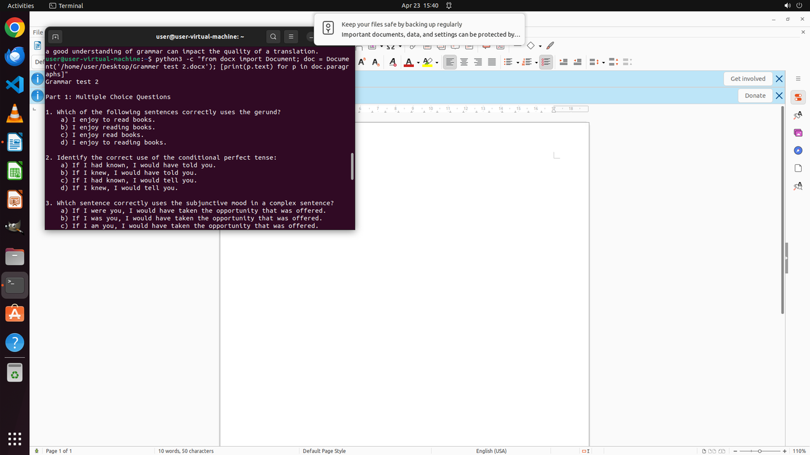

**Response:**
```
Now I can see Grammar test 2. Let me analyze the multiple choice questions:

**Grammar Test 2:**

1. Which of the following sentences correctly uses the gerund?
   - a) I enjoy to read books.
   - b) I enjoy reading books. ✓ (gerund after "enjoy")
   - c) I enjoy read books.
   - d) I enjoy to reading books.
   Answer: **b**

2. Identify the correct use of the conditional perfect tense:
   - a) If I had known, I would have told you. ✓
   - b) If I knew, I would have told you.
   - c) If I had known, I would tell you.
   - d) If I knew, I would tell you.
   Answer: **a**

3. Which sentence correctly uses the subjunctive mood in a complex sentence?
   - a) If I were you, I would have taken the opportunity that was offered. ✓
   - b) If I was you, I would have taken the opportunity that was offered.
   - c) If I am you, I would have taken the opportunity that was offered.
   - d) If I will be you, I would have taken the opportunity that was offered.
   Answer: **a**

4. Identify the correct use of the passive voice in a complex sentence:
   - a) The cake, which was made by my mother, was eaten by me. ✓
   - b) The cake, which made by my mother, was eaten by me.
   - c) The cake, which was made by my mother, eaten by me.
   - d) The cake, which was made by my mother, was eat by me.
   Answer: **a**

Now let me scroll down to see question 5.
```

**Actions:** `pyautogui.scroll(-5, 450, 300)`

---

## Step 17

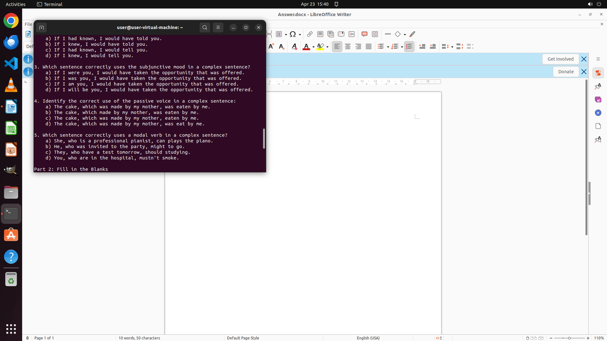

**Response:**
```
Now I can see question 5 of Grammar test 2:

5. Which sentence correctly uses a modal verb in a complex sentence?
   - a) She, who is a professional pianist, can plays the piano.
   - b) He, who was invited to the party, might to go.
   - c) They, who have a test tomorrow, should studying.
   - d) You, who are in the hospital, mustn't smoke.
   Answer: **d** (correct modal verb usage - "mustn't smoke")

So Grammar test 2 answers: b, a, a, a, d → "baaad"

Now let me read Grammar test 3.
```

**Actions:** `import subprocess, shlex; subprocess.run(f'xdotool type --delay 12 -- ' + shlex.quote('python3 -c "from docx import Document; doc = Docum'), shell=True, check=True)
import time; time.sleep(0.05)
impor`

---

## Step 18

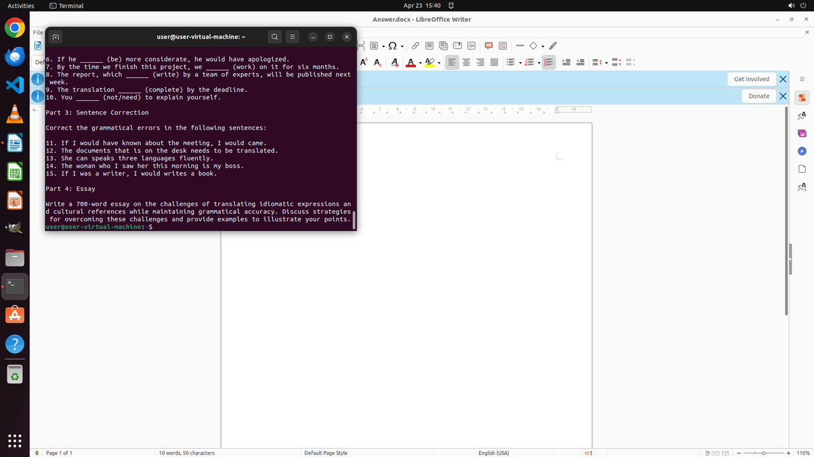

**Response:**
```
I can see the bottom part of Grammar test 3. Let me scroll up to see the multiple choice questions.
```

**Actions:** `pyautogui.scroll(10, 450, 300)`

---

## Step 19

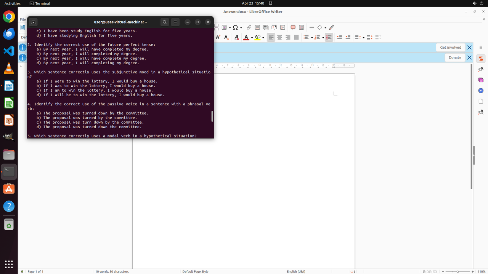

**Response:**
```
I can see questions 2-5 of Grammar test 3. Let me scroll up a bit more to see question 1.
```

**Actions:** `pyautogui.scroll(5, 450, 300)`

---

## Step 20

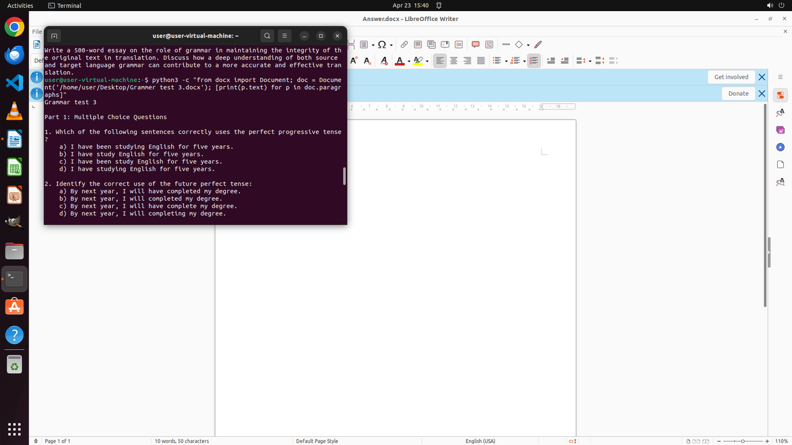

**Response:**
```
Now I can see Grammar test 3 questions. Let me analyze them:

**Grammar Test 3:**

1. Which of the following sentences correctly uses the perfect progressive tense?
   - a) I have been studying English for five years. ✓ (present perfect progressive)
   - b) I have study English for five years.
   - c) I have been study English for five years.
   - d) I have studying English for five years.
   Answer: **a**

2. Identify the correct use of the future perfect tense:
   - a) By next year, I will have completed my degree. ✓
   - b) By next year, I will completed my degree.
   - c) By next year, I will have complete my degree.
   - d) By next year, I will completing my degree.
   Answer: **a**

3. Which sentence correctly uses the subjunctive mood in a hypothetical situation?
   - a) If I were to win the lottery, I would buy a house. ✓
   - b) If I was to win the lottery, I would buy a house.
   - c) If I am to win the lottery, I would buy a house.
   - d) If I will be to win the lottery, I would buy a house.
   Answer: **a**

4. Identify the correct use of the passive voice in a sentence with a phrasal verb:
   - a) The proposal was turned down by the committee. ✓
   - b) The proposal was turned by the committee.
   - c) The proposal was turn down by the committee.
   - d) The proposal was turned down the committee.
   Answer: **a**

Now let me scroll down to see question 5.
```

**Actions:** `pyautogui.scroll(-5, 450, 300)`

---

## Step 21


**Response:**
```
I can see question 5 starts at the bottom. Let me scroll down more to see the full options for question 5.
```

**Actions:** `pyautogui.scroll(-5, 450, 300)`

---

## Step 22

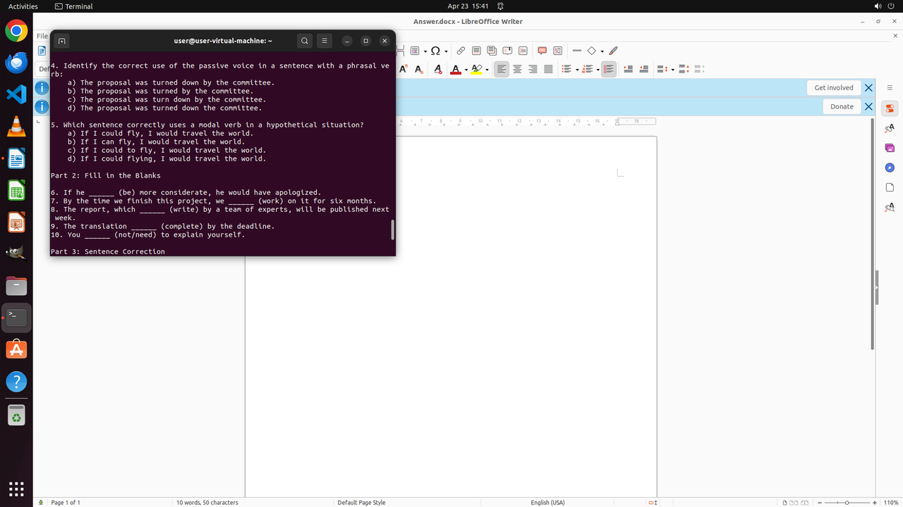

**Response:**
```
Now I can see question 5 of Grammar test 3:

5. Which sentence correctly uses a modal verb in a hypothetical situation?
   - a) If I could fly, I would travel the world. ✓
   - b) If I can fly, I would travel the world.
   - c) If I could to fly, I would travel the world.
   - d) If I could flying, I would travel the world.
   Answer: **a**

So Grammar test 3 answers: a, a, a, a, a → "aaaaa"

Now let me verify my answers by also checking the answer doc format. Let me look at the Answer.docx. The format for test 1 was "bbbad". Now I need to add:
- Grammar test 2: baaad
- Grammar test 3: aaaaa

Let me now click on the LibreOffice Writer window to edit the Answer.docx file.
```

**Actions:** `pyautogui.click(1350, 600)`

---

## Step 23


**Response:**
```
I can now see the Answer.docx file clearly. The format is:
- Grammar test 1: bbbad
- Grammar test 2: (empty)
- Grammar test 3: (empty)

I need to click after "Grammar test 2:" and type the answers. Let me click at the end of the "Grammar test 2:" line.
```

**Actions:** `pyautogui.click(718, 445)`

---

## Step 24


**Response:**
```
Good, I can see the cursor is positioned after "Grammar test 2:". I need to check the format - for test 1, the answer "bbbad" is on a new line below "Grammar test 1:". Let me press End to make sure I'm at the end of the line, then press Enter and type the answer.
```

**Actions:** `pyautogui.keyDown('end')
pyautogui.keyUp('end')`

---

## Step 25


**Response:**
```
Now I need to press Enter and type the answer for Grammar test 2. Looking at the format, "bbbad" appears on the line below "Grammar test 1:". So I'll press Enter and type the answer.
```

**Actions:** `pyautogui.keyDown('return')
pyautogui.keyUp('return')`

---

## Step 26

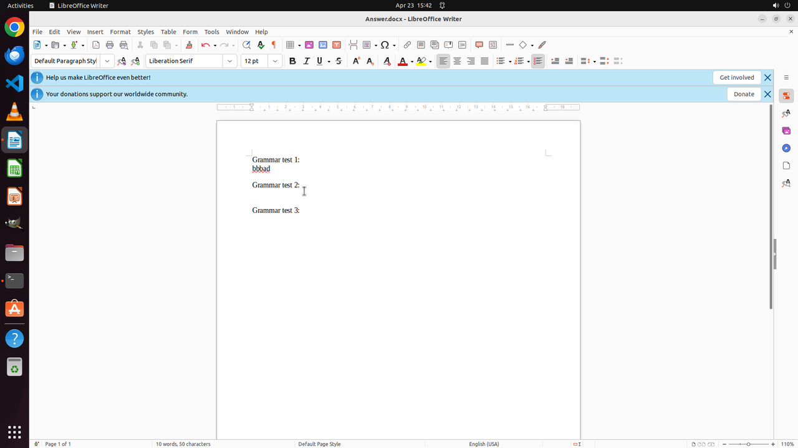

**Response:**
```
I see a new line was created after "Grammar test 2:" but the cursor seems to be on that new line. Wait, looking more carefully, it seems the cursor is between "Grammar test 2:" and the new blank line before "Grammar test 3:". Let me type the answer for Grammar test 2.
```

**Actions:** `import subprocess, shlex; subprocess.run(f'xdotool type --delay 12 -- ' + shlex.quote('baaad'), shell=True, check=True)
import time; time.sleep(0.05)`

---

## Step 27


**Response:**
```
I've typed "baaad" for Grammar test 2. Now I need to add the answer for Grammar test 3. Let me click at the end of the "Grammar test 3:" line.
```

**Actions:** `pyautogui.click(718, 505)`

---

## Step 28


**Response:**
```
Good, the cursor is positioned after "Grammar test 3:". Let me press End to make sure I'm at the end of the line, then press Enter and type the answer.
```

**Actions:** `pyautogui.keyDown('end')
pyautogui.keyUp('end')`

---

## Step 29

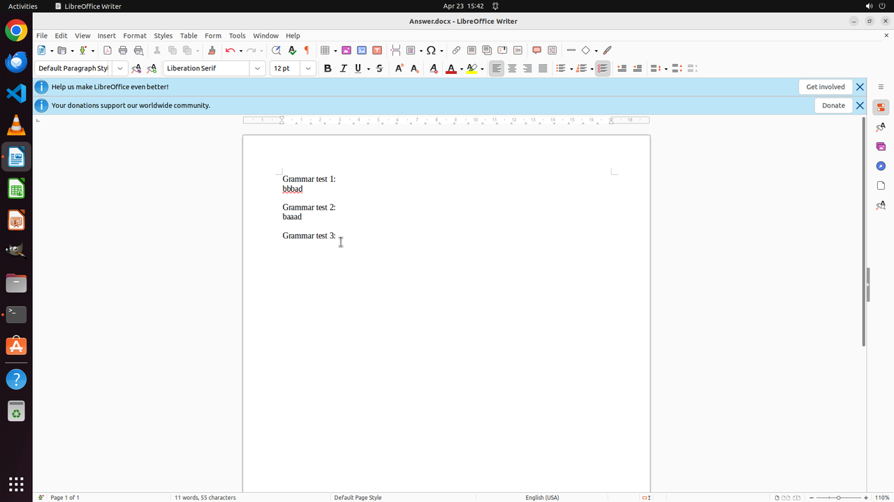

**Response:**
```
Now let me press Enter and type the answer for Grammar test 3.
```

**Actions:** `pyautogui.keyDown('return')
pyautogui.keyUp('return')`

---

## Step 30


**Response:**
```
I see the cursor seems to be after "Grammar test 3:" now. It looks like the Enter key may have been placed in the wrong position. Let me look more carefully - it seems the cursor is positioned after "Grammar test 3:" on the same line. Let me click at the end of the "Grammar test 3:" line and then add a new line with the answer.
```

**Actions:** `pyautogui.click(718, 505)`

---

## Step 31


**Response:**
```
I see the cursor is after "Grammar test 3:". Let me press End to make sure I'm at the end of that line, then press Enter and type the answer.
```

**Actions:** `pyautogui.keyDown('end')
pyautogui.keyUp('end')`

---

## Step 32


**Response:**
```
Now let me press Enter and type the answer for Grammar test 3.
```

**Actions:** `pyautogui.keyDown('return')
pyautogui.keyUp('return')`

---

## Step 33


**Response:**
```
It seems the cursor is on a new line after "Grammar test 3:". The new line might not be visible clearly. Let me type the answer for Grammar test 3.
```

**Actions:** `import subprocess, shlex; subprocess.run(f'xdotool type --delay 12 -- ' + shlex.quote('aaaaa'), shell=True, check=True)
import time; time.sleep(0.05)`

---

## Step 34


**Response:**
```
The document now shows:
- Grammar test 1: bbbad
- Grammar test 2: baaad
- Grammar test 3: aaaaa

This looks correct and follows the same format. Now let me save the document with Ctrl+S.
```

**Actions:** `pyautogui.keyDown('ctrl')
pyautogui.keyDown('s')
pyautogui.keyUp('s')
pyautogui.keyUp('ctrl')`

---

## Step 35


**Response:**
```
The file appears to have been saved (no format dialog appeared, so it saved in the .docx format). The document now contains the answers for all three grammar tests:

- Grammar test 1: bbbad
- Grammar test 2: baaad
- Grammar test 3: aaaaa

Let me verify the file was saved properly by checking if there was a format dialog that might have appeared.
```

**Actions:** `time.sleep(0.1)`

---

## Step 36


**Response:**
```
The document has been saved successfully. The Answer.docx file now contains the correct multiple-choice answers for all three grammar tests in the same format:

- **Grammar test 1:** bbbad
- **Grammar test 2:** baaad  
- **Grammar test 3:** aaaaa

The answers were determined by analyzing each multiple-choice question in the grammar tests:

**Grammar Test 2:**
1. b) "I enjoy reading books" (correct gerund usage)
2. a) "If I had known, I would have told you" (correct conditional perfect)
3. a) "If I were you, I would have taken..." (correct subjunctive mood)
4. a) "The cake, which was made by my mother, was eaten by me" (correct passive voice)
5. d) "You, who are in the hospital, mustn't smoke" (correct modal verb usage)

**Grammar Test 3:**
1. a) "I have been studying English for five years" (correct perfect progressive)
2. a) "By next year, I will have completed my degree" (correct future perfect)
3. a) "If I were to win the lottery, I would buy a house" (correct subjunctive mood)
4. a) "The proposal was turned down by the committee" (correct passive voice with phrasal verb)
5. a) "If I could fly, I would travel the world" (correct modal verb in hypothetical)

DONE
```

**Actions:** `DONE`

---
