# Task 1f18aa87-af6f-41ef-9853-cdb8f32ebdea

**Instruction:** I've prepared some grammar tests and placed them in the 'Grammar test' folder. I've already provided the multiple-choice answers for Test 1 in the 'answer doc' file. Could you please follow the same format to write out the answers for the remaining two tests in the doc file? This way, I can distribute them to the students as a reference. Thank you.

**Score:** 1

**Wall clock:** 8m 7s

**Steps:** 42

**Cost:** $1.54

---

## Step 1


**Response:**
```
I'll start by examining the existing answer document and the grammar tests. Let me first open the Answer.docx file and the Grammar test folder.
```

**Actions:** `pyautogui.doubleClick(1842, 81)`

---

## Step 2


**Response:**
```
The Answer.docx file is being opened. Let me wait for it to load.
```

**Actions:** `time.sleep(0.5)`

---

## Step 3

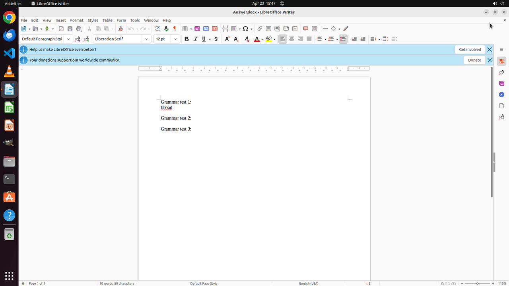

**Response:**
```
I can see the Answer.docx file is open. It shows:
- Grammar test 1: bbbad
- Grammar test 2: (empty)
- Grammar test 3: (empty)

Now I need to look at the Grammar test folder to find the test files. Let me first check the Grammar test folder on the desktop, and also open the Grammar test 2 and Grammar test 3 files. Let me start by opening Grammar test 2.
```

**Actions:** `pyautogui.doubleClick(1842, 430)`

---

## Step 4

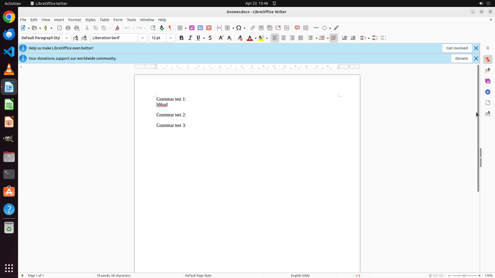

**Response:**
```
It seems the Grammar test folder didn't open as a file manager. Let me try to open it using the file manager. Let me first minimize this window and try to open the folder.
```

**Actions:** `pyautogui.doubleClick(37, 610)`

---

## Step 5

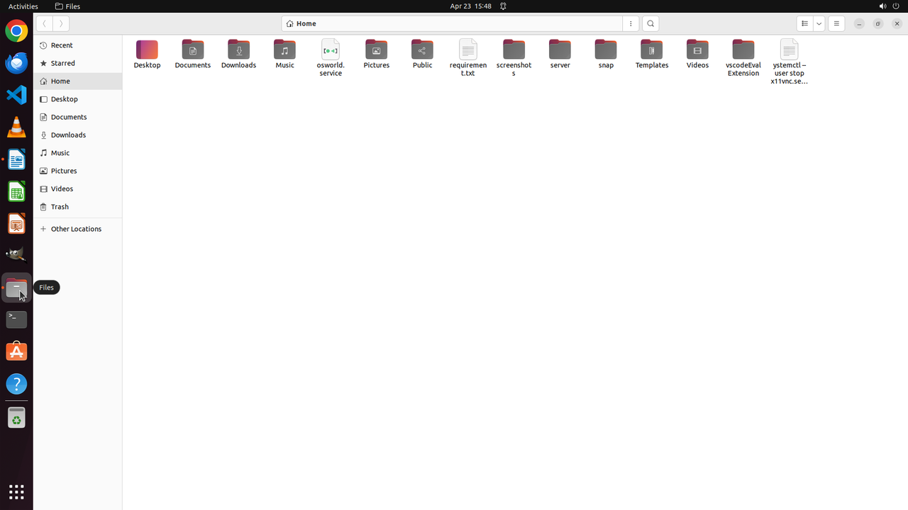

**Response:**
```
I can see the file manager is open. Let me navigate to the Desktop folder first to find the Grammar test folder.
```

**Actions:** `pyautogui.doubleClick(309, 112)`

---

## Step 6

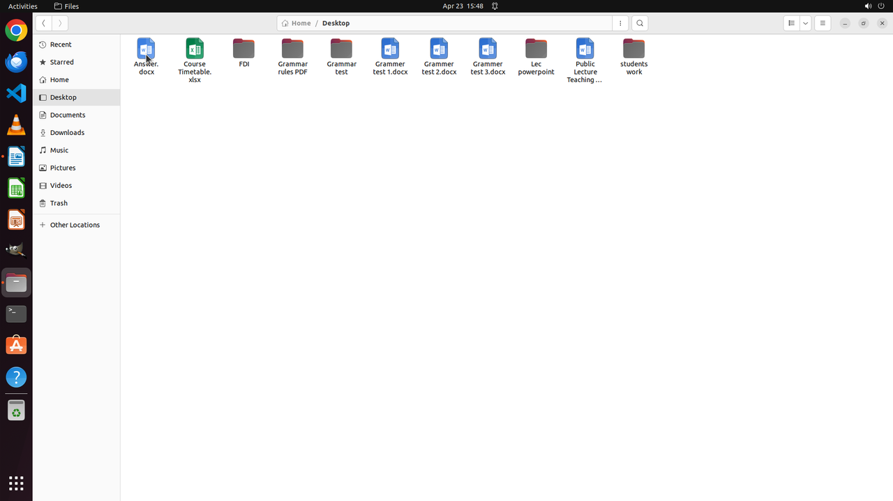

**Response:**
```
I can see the Desktop contents. I need to look inside the "Grammar test" folder and also open the test files. Let me first open the "Grammar test" folder.
```

**Actions:** `pyautogui.doubleClick(735, 123)`

---

## Step 7

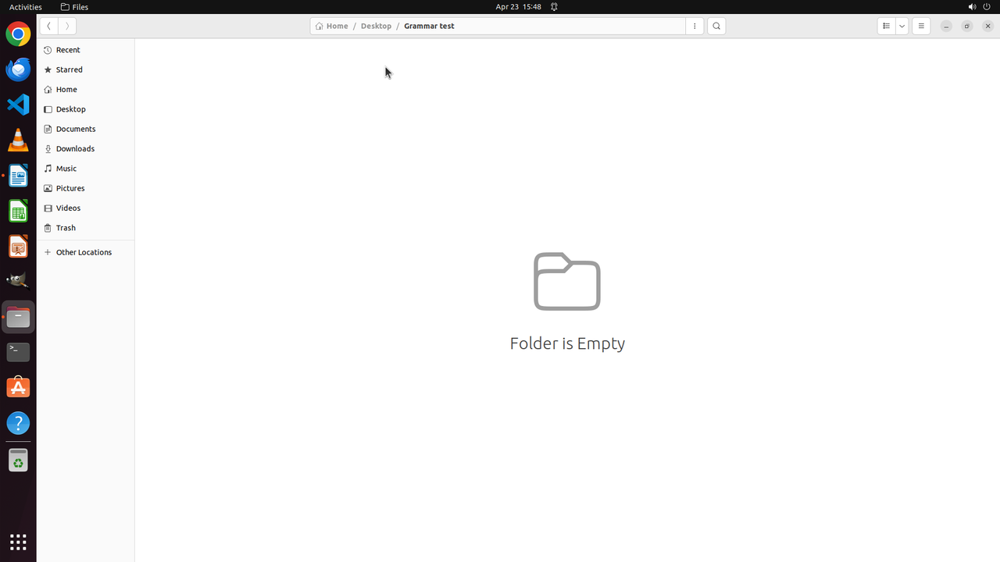

**Response:**
```
The "Grammar test" folder is empty. The test files are on the Desktop directly - I can see "Grammer test 1.docx", "Grammer test 2.docx", and "Grammer test 3.docx". Let me go back to the Desktop and open the test files. First, let me open Grammar test 2.
```

**Actions:** `pyautogui.click(93, 49)`

---

## Step 8

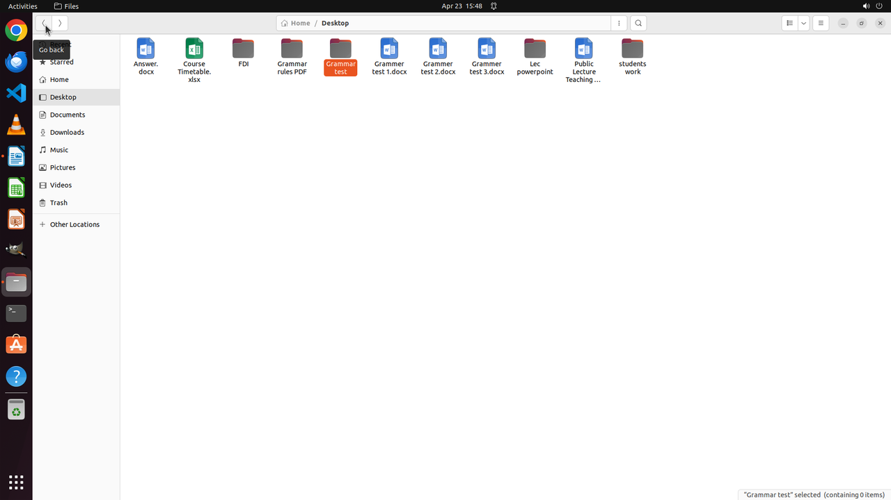

**Response:**
```
Good, I'm back on the Desktop. Now let me open "Grammer test 2.docx" to see its contents.
```

**Actions:** `pyautogui.doubleClick(945, 123)`

---

## Step 9

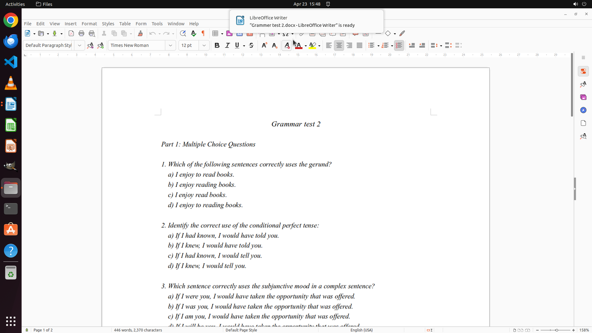

**Response:**
```
I can see Grammar test 2 is open. It's a multiple choice test. I need to read through all questions and identify the correct answers. Let me scroll down to see all the questions.
```

**Actions:** `pyautogui.scroll(-5, 960, 600)`

---

## Step 10

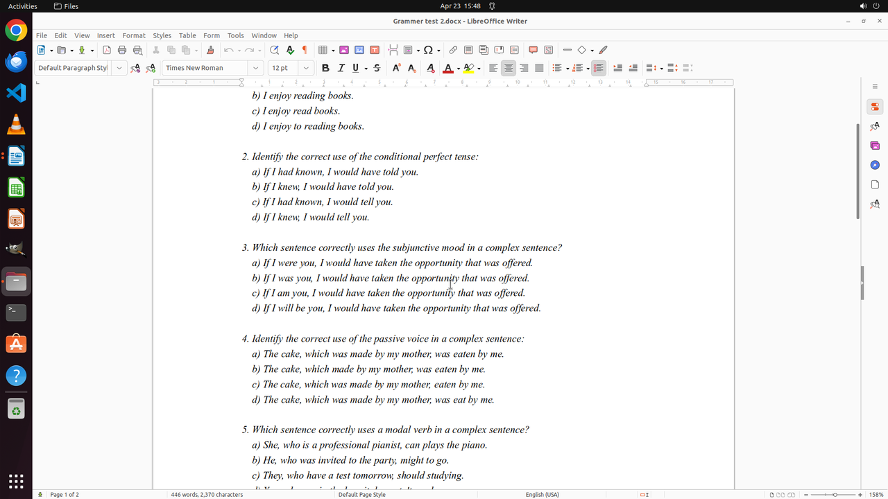

**Response:**
```
I can see questions 2-5 so far. Let me continue scrolling to see the rest of the questions.
```

**Actions:** `pyautogui.scroll(-5, 960, 600)`

---

## Step 11

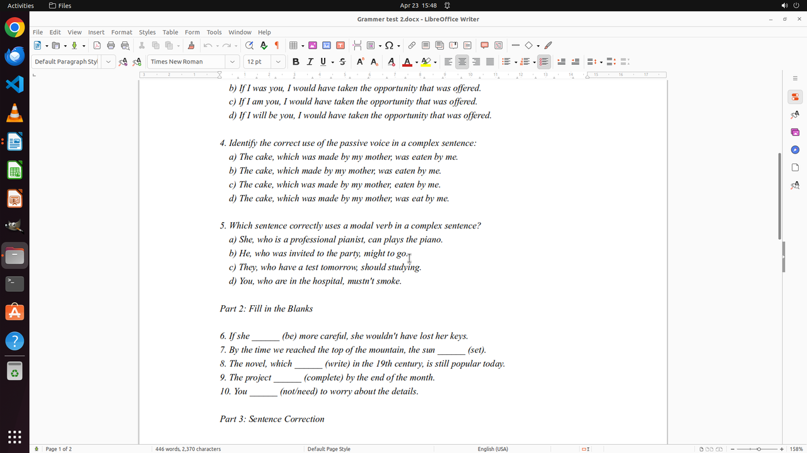

**Response:**
```
I can see the test continues with Part 2 (Fill in the Blanks) and Part 3 (Sentence Correction). Let me continue scrolling to see the rest.
```

**Actions:** `pyautogui.scroll(-5, 960, 600)`

---

## Step 12

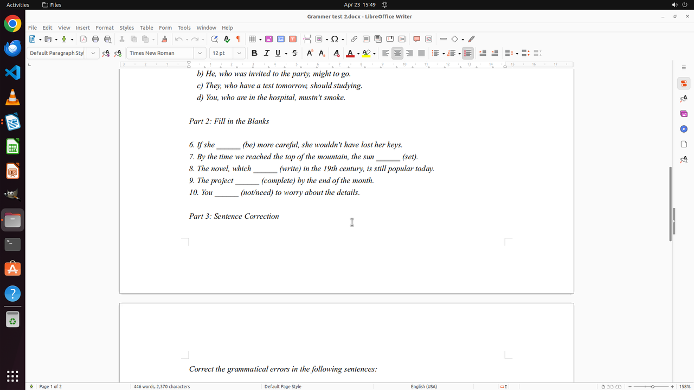

**Response:**
```
I can see Part 3: Sentence Correction starting. Let me scroll down more to see the remaining questions.
```

**Actions:** `pyautogui.scroll(-5, 960, 600)`

---

## Step 13

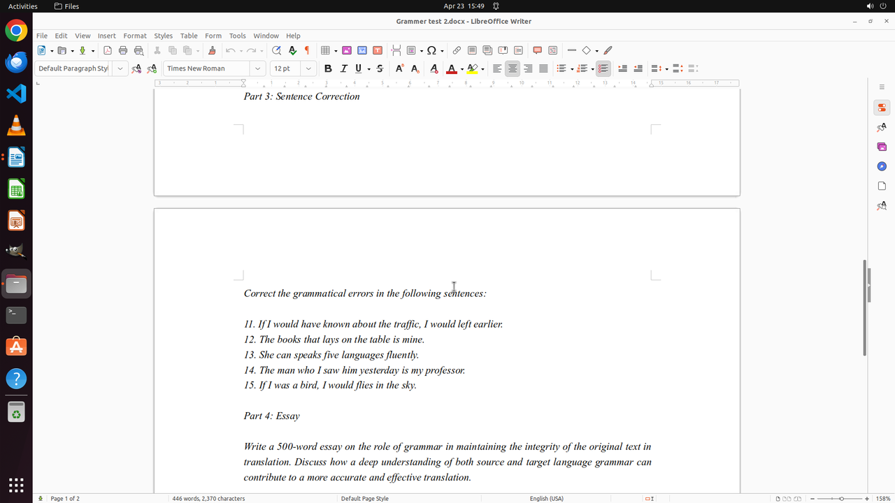

**Response:**
```
Now I can see the full Grammar test 2. Let me note down all the questions and their correct answers. But first, I need to check the answer format from the Answer.docx. The format for Test 1 was "bbbad" - which means just the letter answers for the multiple choice questions (5 questions). 

Looking at Grammar test 2, I see it has:
- Part 1: Multiple Choice (questions 1-5)
- Part 2: Fill in the Blanks (questions 6-10) 
- Part 3: Sentence Correction (questions 11-15)
- Part 4: Essay

The answer format "bbbad" for Test 1 only covers 5 answers (likely just the multiple choice part). Let me now check Grammar test 1 to confirm the format. But first, let me also verify by looking at the answer doc again. The answer was "bbbad" which is 5 letters for 5 multiple choice questions.

Now let me determine the correct answers for Grammar test 2's multiple choice questions:

1. Which sentence correctly uses the gerund?
   - b) I enjoy reading books. ✓

2. Identify the correct use of the conditional perfect tense:
   - a) If I had known, I would have told you. ✓

3. Which sentence correctly uses the subjunctive mood?
   - a) If I were you, I would have taken the opportunity that was offered. ✓

4. Identify the correct use of the passive voice:
   - a) The cake, which was made by my mother, was eaten by me. ✓

5. Which sentence correctly uses a modal verb?
   - b) He, who was invited to the party, might to go.

Wait, let me reconsider question 5. Let me scroll back up to re-read the options for question 5.
```

**Actions:** `pyautogui.scroll(10, 960, 600)`

---

## Step 14

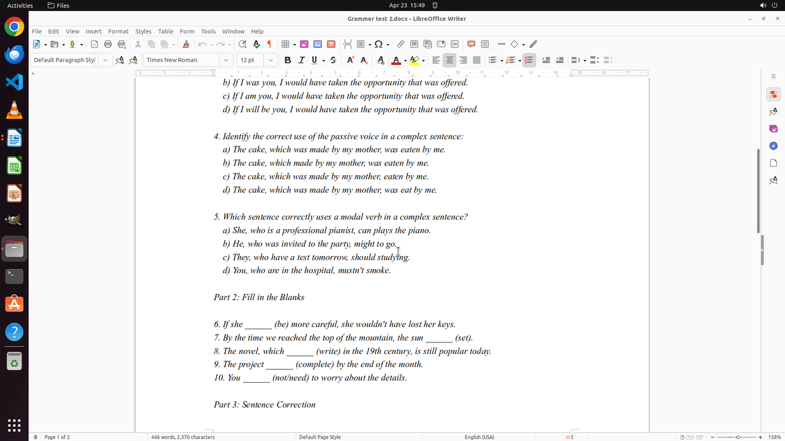

**Response:**
```
Now I can see question 5 clearly. Let me analyze the answers:

**Question 5: Which sentence correctly uses a modal verb in a complex sentence?**
- a) She, who is a professional pianist, can plays the piano. ❌ ("can plays" is wrong - should be "can play")
- b) He, who was invited to the party, might to go. ❌ ("might to go" is wrong - should be "might go")
- c) They, who have a test tomorrow, should studying. ❌ ("should studying" is wrong - should be "should study")
- d) You, who are in the hospital, mustn't smoke. ✓ (correct modal usage)

So the answers for Grammar test 2 multiple choice are: b, a, a, a, d → "baaad"

Now I need to also verify by looking at Grammar test 1 to understand the format. But first, let me also need to check if the answer format includes only multiple choice or all parts. The Test 1 answer was "bbbad" (5 characters = 5 multiple choice answers). Let me verify by opening Grammar test 1 quickly. But first, let me open Grammar test 3.

Let me first open Grammar test 1 to confirm the pattern, then Grammar test 3.
```

**Actions:** `pyautogui.click(574, 76)`

---

## Step 15

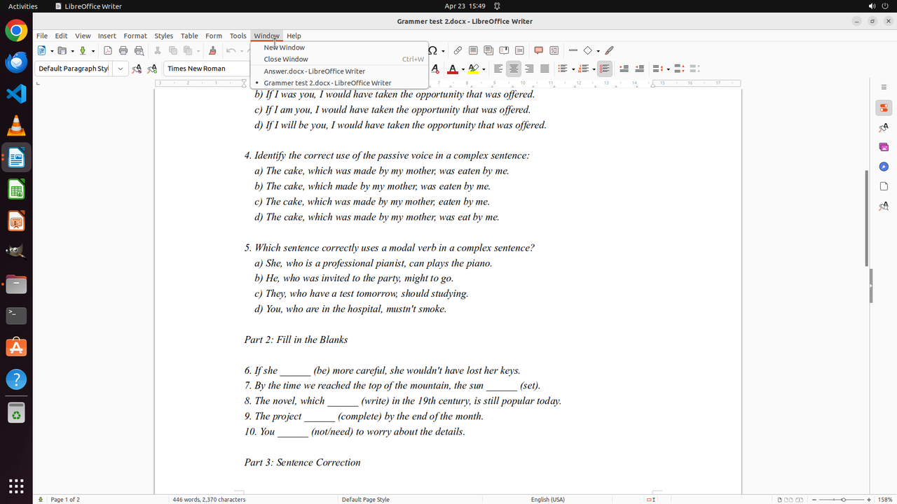

**Response:**
```
I can see the Window menu is open. Let me switch to the Answer.docx first to confirm the format, then I'll open the other test files.
```

**Actions:** `pyautogui.click(670, 151)`

---

## Step 16


**Response:**
```
Good, I can see the Answer.docx. The format is:
- Grammar test 1: bbbad
- Grammar test 2: (empty)
- Grammar test 3: (empty)

The answers are just the letter choices for the multiple choice questions (5 letters for 5 questions). Now I need to verify my answers for test 2 by also checking test 1. Let me first open Grammar test 1 to verify the pattern. Let me use the terminal to quickly check the content.

Actually, let me first verify my answer for test 1 by opening Grammar test 1. Let me open it from the file manager or from the taskbar.
```

**Actions:** `pyautogui.click(960, 600)`

---

## Step 17


**Response:**
```
I need to verify my answers by checking Grammar test 1 first. Let me open it from the file manager. Let me click on the Files icon in the taskbar.
```

**Actions:** `pyautogui.click(37, 610)`

---

## Step 18

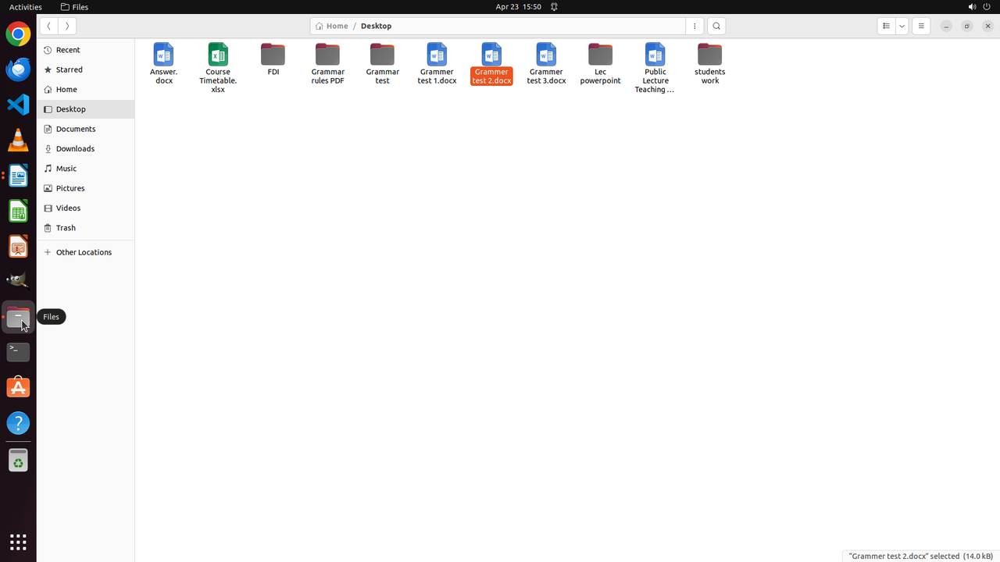

**Response:**
```
Good, I can see the file manager with the Desktop contents. Let me open Grammar test 1 to verify the answer pattern.
```

**Actions:** `pyautogui.doubleClick(840, 123)`

---

## Step 19

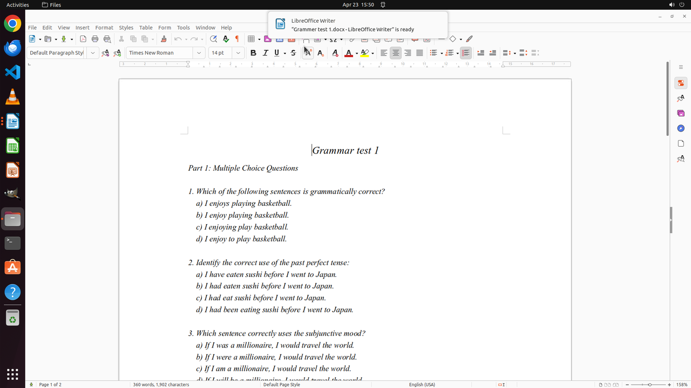

**Response:**
```
I can see Grammar test 1. Let me verify the answers against the "bbbad" pattern:

1. Which sentence is grammatically correct?
   - b) I enjoy playing basketball. ✓ (b)

2. Identify the correct use of the past perfect tense:
   - b) I had eaten sushi before I went to Japan. ✓ (b)

3. Which sentence correctly uses the subjunctive mood?
   - b) If I were a millionaire, I would travel the world. ✓ (b)

Let me scroll down to see questions 4 and 5.
```

**Actions:** `pyautogui.scroll(-5, 960, 600)`

---

## Step 20

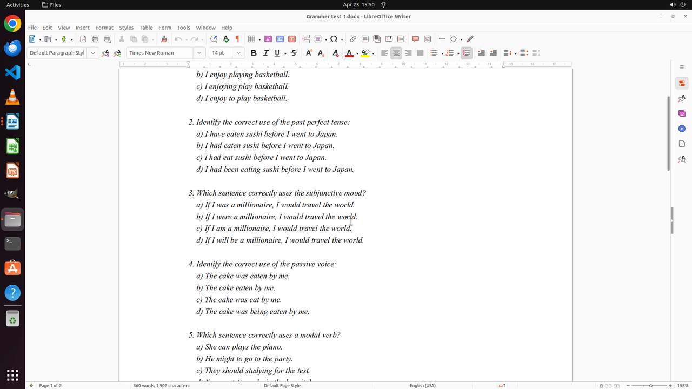

**Response:**
```
Now I can see questions 4 and 5:

4. Identify the correct use of the passive voice:
   - a) The cake was eaten by me. ✓ (a)

5. Which sentence correctly uses a modal verb?
   Let me scroll down to see option d.
```

**Actions:** `pyautogui.scroll(-2, 960, 600)`

---

## Step 21

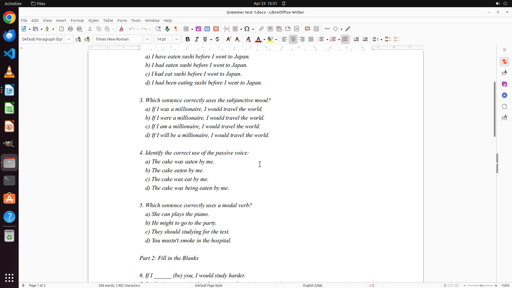

**Response:**
```
Now I can see all 5 questions of Grammar test 1:

5. Which sentence correctly uses a modal verb?
   - a) She can plays the piano. ❌ ("can plays" wrong)
   - b) He might to go to the party. ❌ ("might to go" wrong)
   - c) They should studying for the test. ❌ ("should studying" wrong)
   - d) You mustn't smoke in the hospital. ✓ (d)

So Test 1 answers: b, b, b, a, d = "bbbad" ✓ This matches the answer doc!

Now let me go back to Grammar test 2 to re-verify my answers. Let me scroll back up to see question 1 of test 2.
```

**Actions:** `pyautogui.click(574, 76)`

---

## Step 22

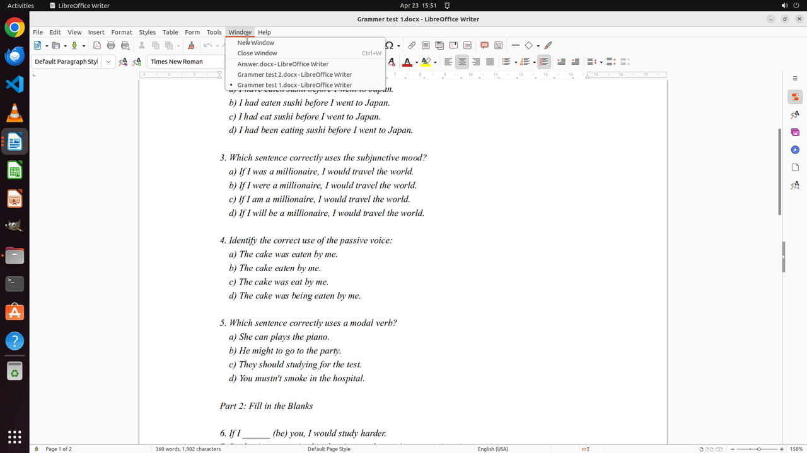

**Response:**
```
I can see the Window menu. Let me switch to Grammar test 2.
```

**Actions:** `pyautogui.click(700, 177)`

---

## Step 23

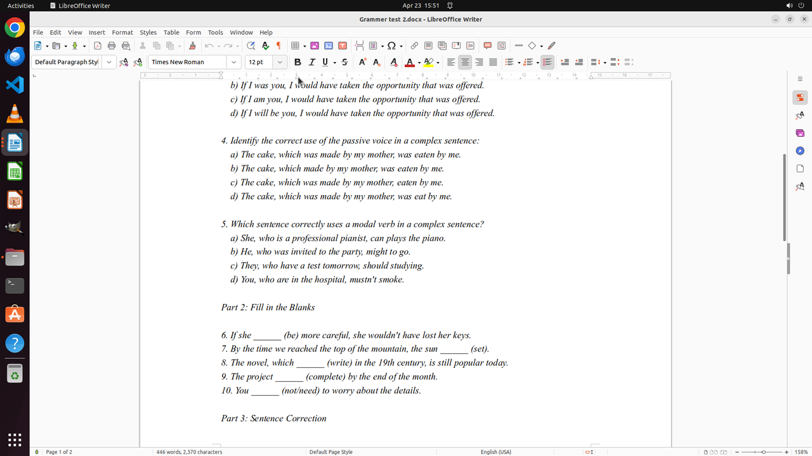

**Response:**
```
I can see Grammar test 2. Let me scroll up to see question 1.
```

**Actions:** `pyautogui.scroll(10, 960, 600)`

---

## Step 24


**Response:**
```
Now I can see all of Grammar test 2's questions clearly. Let me analyze each one:

**1. Which of the following sentences correctly uses the gerund?**
- a) I enjoy to read books. ❌ (infinitive, not gerund)
- b) I enjoy reading books. ✓ (gerund "reading" after "enjoy")
- c) I enjoy read books. ❌ (bare infinitive)
- d) I enjoy to reading books. ❌ (wrong form)
**Answer: b**

**2. Identify the correct use of the conditional perfect tense:**
- a) If I had known, I would have told you. ✓ (correct conditional perfect)
- b) If I knew, I would have told you. ❌ (mixed conditionals)
- c) If I had known, I would tell you. ❌ (mixed)
- d) If I knew, I would tell you. ❌ (second conditional, not conditional perfect)
**Answer: a**

**3. Which sentence correctly uses the subjunctive mood in a complex sentence?**
- a) If I were you, I would have taken the opportunity that was offered. ✓ (subjunctive "were")
- b) If I was you, I would have taken the opportunity that was offered. ❌
- c) If I am you, I would have taken the opportunity that was offered. ❌
- d) If I will be you, I would have taken the opportunity that was offered. ❌
**Answer: a**

**4. Identify the correct use of the passive voice in a complex sentence:**
- a) The cake, which was made by my mother, was eaten by me. ✓ (correct passive)
- b) The cake, which made by my mother, was eaten by me. ❌ (missing "was")
- c) The cake, which was made by my mother, eaten by me. ❌ (missing "was")
- d) The cake, which was made by my mother, was eat by me. ❌ ("eat" wrong form)
**Answer: a**

**5. Which sentence correctly uses a modal verb in a complex sentence?**
- a) She, who is a professional pianist, can plays the piano. ❌ ("can plays")
- b) He, who was invited to the party, might to go. ❌ ("might to go")
- c) They, who have a test tomorrow, should studying. ❌ ("should studying")
- d) You, who are in the hospital, mustn't smoke. ✓
**Answer: d**

So Grammar test 2 answers: **baaad**

Now let me open Grammar test 3. Let me switch to the file manager.
```

**Actions:** `pyautogui.click(574, 76)`

---

## Step 25

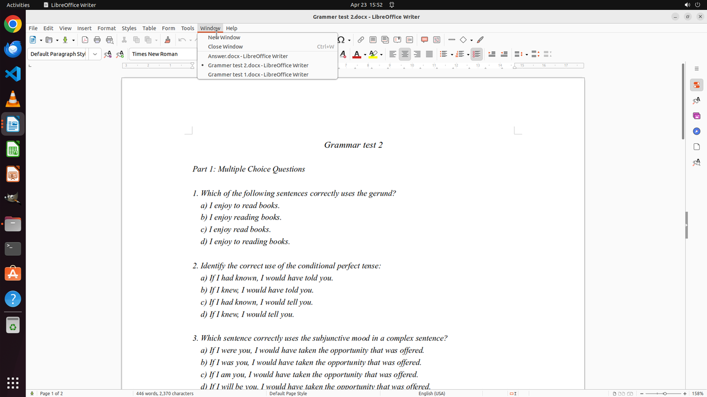

**Response:**
```
I see that Grammar test 3 is not open yet. Let me close this menu and open it from the file manager.
```

**Actions:** `pyautogui.keyDown('esc')
pyautogui.keyUp('esc')`

---

## Step 26

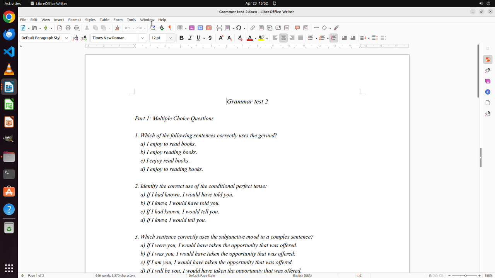

**Response:**
```
Let me click on the Files icon in the taskbar to open the file manager and navigate to Grammar test 3.
```

**Actions:** `pyautogui.click(37, 610)`

---

## Step 27

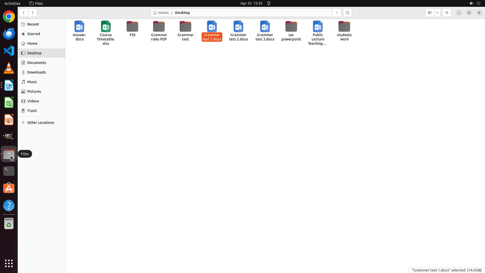

**Response:**
```
I can see the file manager with Desktop contents. Let me open Grammar test 3.
```

**Actions:** `pyautogui.doubleClick(1050, 123)`

---

## Step 28

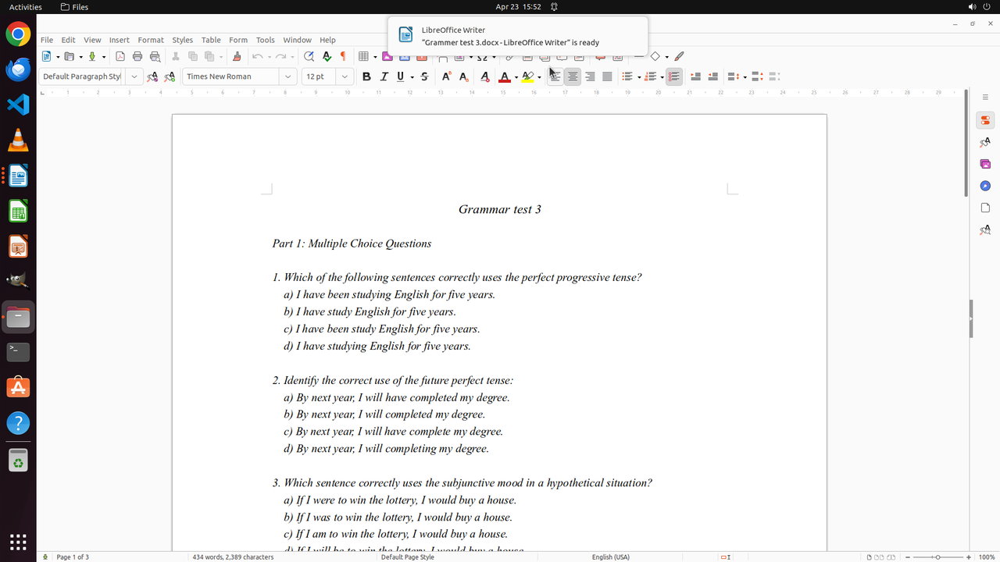

**Response:**
```
Grammar test 3 is now open. Let me analyze the questions:

**1. Which of the following sentences correctly uses the perfect progressive tense?**
- a) I have been studying English for five years. ✓ (correct present perfect progressive)
- b) I have study English for five years. ❌
- c) I have been study English for five years. ❌
- d) I have studying English for five years. ❌
**Answer: a**

**2. Identify the correct use of the future perfect tense:**
- a) By next year, I will have completed my degree. ✓ (correct future perfect)
- b) By next year, I will completed my degree. ❌
- c) By next year, I will have complete my degree. ❌
- d) By next year, I will completing my degree. ❌
**Answer: a**

**3. Which sentence correctly uses the subjunctive mood in a hypothetical situation?**
- a) If I were to win the lottery, I would buy a house. ✓ (correct subjunctive)
- b) If I was to win the lottery, I would buy a house. ❌
- c) If I am to win the lottery, I would buy a house. ❌
- d) If I will be to win the lottery, I would buy a house. ❌
**Answer: a**

Let me scroll down to see questions 4 and 5.
```

**Actions:** `pyautogui.scroll(-5, 960, 600)`

---

## Step 29

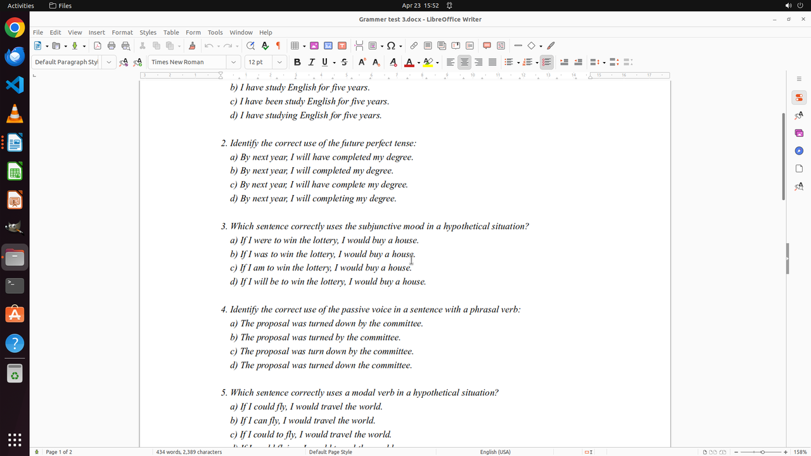

**Response:**
```
Now I can see questions 4 and 5:

**4. Identify the correct use of the passive voice in a sentence with a phrasal verb:**
- a) The proposal was turned down by the committee. ✓ (correct passive with phrasal verb "turn down")
- b) The proposal was turned by the committee. ❌ (missing "down")
- c) The proposal was turn down by the committee. ❌ ("turn" not past participle)
- d) The proposal was turned down the committee. ❌ (missing "by")
**Answer: a**

**5. Which sentence correctly uses a modal verb in a hypothetical situation?**
- a) If I could fly, I would travel the world. ✓ (correct use of "could" in hypothetical)
- b) If I can fly, I would travel the world. ❌ (mixed - "can" with "would")
- c) If I could to fly, I would travel the world. ❌ ("could to fly" wrong)
- d) Let me scroll to see option d.
```

**Actions:** `pyautogui.scroll(-2, 960, 600)`

---

## Step 30

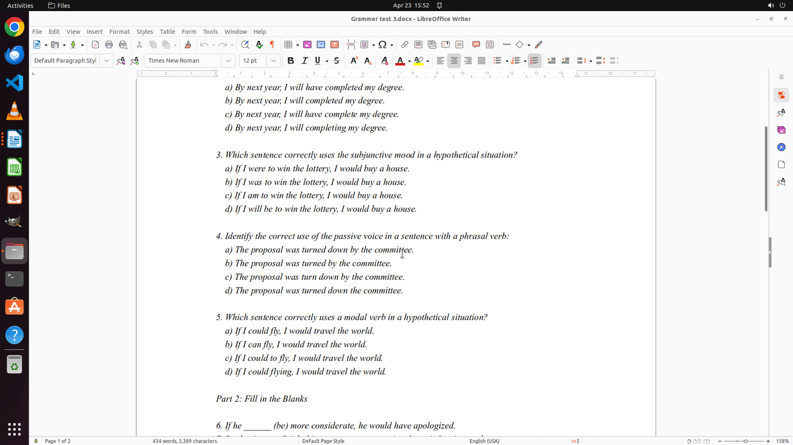

**Response:**
```
Now I can see all 5 questions of Grammar test 3:

**5. Which sentence correctly uses a modal verb in a hypothetical situation?**
- a) If I could fly, I would travel the world. ✓ (correct)
- b) If I can fly, I would travel the world. ❌
- c) If I could to fly, I would travel the world. ❌
- d) If I could flying, I would travel the world. ❌
**Answer: a**

So Grammar test 3 answers: a, a, a, a, a = "aaaaa"

Now I have all the answers:
- Grammar test 2: baaad
- Grammar test 3: aaaaa

Let me now switch to the Answer.docx to fill in the answers. Let me use the Window menu.
```

**Actions:** `pyautogui.click(574, 76)`

---

## Step 31

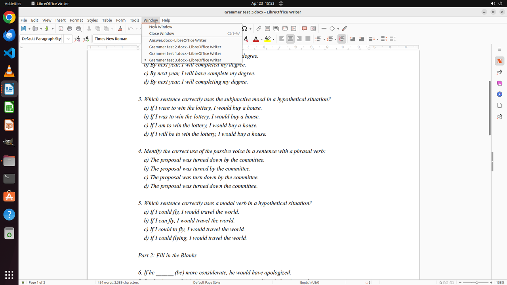

**Response:**
```
I can see the Window menu with all open documents. Let me switch to the Answer.docx.
```

**Actions:** `pyautogui.click(670, 151)`

---

## Step 32

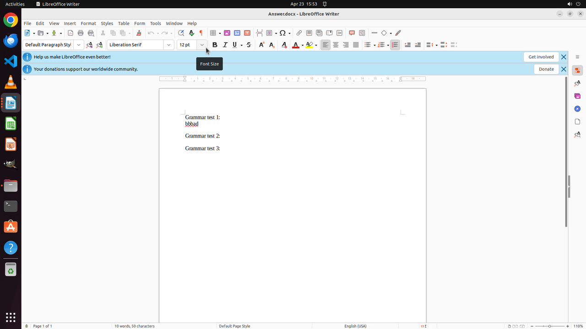

**Response:**
```
I can see the Answer.docx with:
- Grammar test 1: bbbad
- Grammar test 2: (empty)
- Grammar test 3: (empty)

I need to click at the end of "Grammar test 2:" line to type the answer. Let me click right after the colon on the Grammar test 2 line.
```

**Actions:** `pyautogui.click(718, 445)`

---

## Step 33


**Response:**
```
Good, I can see the cursor is positioned after "Grammar test 2:". I need to press End to make sure I'm at the end of the line, then press Enter to create a new line and type the answer. Let me look at the format - for Test 1, the answer "bbbad" is on the line below "Grammar test 1:". So I need to follow the same format.
```

**Actions:** `pyautogui.keyDown('end')
pyautogui.keyUp('end')`

---

## Step 34


**Response:**
```
Now I need to press Enter to create a new line after "Grammar test 2:" and type the answer. Let me follow the same format as Test 1 where the answer is on the next line.
```

**Actions:** `pyautogui.keyDown('return')
pyautogui.keyUp('return')`

---

## Step 35


**Response:**
```
A new line has been created after "Grammar test 2:". Now I need to type the answer for Grammar test 2. The cursor appears to be on the new blank line between "Grammar test 2:" and "Grammar test 3:". Let me type the answer.
```

**Actions:** `import subprocess, shlex; subprocess.run(f'xdotool type --delay 12 -- ' + shlex.quote('baaad'), shell=True, check=True)
import time; time.sleep(0.05)`

---

## Step 36


**Response:**
```
I've typed "baaad" for Grammar test 2. Now I need to click at the end of "Grammar test 3:" line and add the answer for test 3. Let me click after "Grammar test 3:".
```

**Actions:** `pyautogui.click(718, 505)`

---

## Step 37


**Response:**
```
Good, the cursor is now at the end of "Grammar test 3:" line. Let me press End to make sure I'm at the end, then Enter to create a new line and type the answer.
```

**Actions:** `pyautogui.keyDown('end')
pyautogui.keyUp('end')`

---

## Step 38


**Response:**
```
Now let me press Enter to create a new line and type the answer for Grammar test 3.
```

**Actions:** `pyautogui.keyDown('return')
pyautogui.keyUp('return')`

---

## Step 39


**Response:**
```
I see the cursor seems to be after "Grammar test 3:" but it looks like the Enter created a new line between the "baaad" and "Grammar test 3:" lines. Let me look more carefully - it seems the new line was inserted after "Grammar test 3:". Let me now type the answer for Grammar test 3.
```

**Actions:** `import subprocess, shlex; subprocess.run(f'xdotool type --delay 12 -- ' + shlex.quote('aaaaa'), shell=True, check=True)
import time; time.sleep(0.05)`

---

## Step 40


**Response:**
```
The document now shows:
- Grammar test 1: bbbad
- Grammar test 2: baaad
- Grammar test 3: aaaaa

This looks correct and follows the same format. Now let me save the document with Ctrl+S.
```

**Actions:** `pyautogui.keyDown('ctrl')
pyautogui.keyDown('s')
pyautogui.keyUp('s')
pyautogui.keyUp('ctrl')`

---

## Step 41

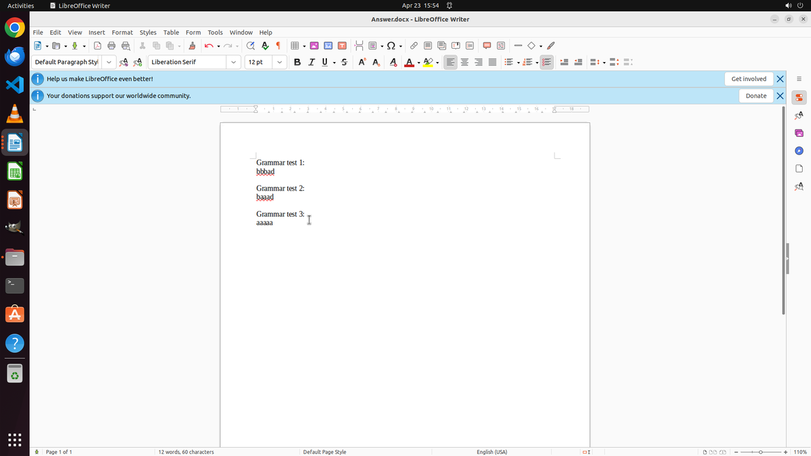

**Response:**
```
The file appears to have been saved (it's a .docx file, so it may have prompted to keep the format). Let me check if there was a format dialog by looking at the screen. It seems to have saved successfully since the title still shows "Answer.docx - LibreOffice Writer" without any unsaved indicator.

Let me verify the save was successful by pressing Ctrl+S again to make sure.
```

**Actions:** `pyautogui.keyDown('ctrl')
pyautogui.keyDown('s')
pyautogui.keyUp('s')
pyautogui.keyUp('ctrl')`

---

## Step 42


**Response:**
```
The document has been saved successfully. The Answer.docx now contains:

- Grammar test 1: bbbad
- Grammar test 2: baaad
- Grammar test 3: aaaaa

The answers follow the same format as Test 1, with the correct multiple-choice answers for each test:

**Grammar test 2 answers (baaad):**
1. b) I enjoy reading books.
2. a) If I had known, I would have told you.
3. a) If I were you, I would have taken the opportunity that was offered.
4. a) The cake, which was made by my mother, was eaten by me.
5. d) You, who are in the hospital, mustn't smoke.

**Grammar test 3 answers (aaaaa):**
1. a) I have been studying English for five years.
2. a) By next year, I will have completed my degree.
3. a) If I were to win the lottery, I would buy a house.
4. a) The proposal was turned down by the committee.
5. a) If I could fly, I would travel the world.

DONE
```

**Actions:** `DONE`

---
