# Task 236833a3-5704-47fc-888c-4f298f09f799

**Instruction:** Find the daily paper list on Huggingface and take down the meta information of papers on 1st March, 2024 in the opened .docx file. I have recorded two papers. Please conform to the format and complete others.

**Score:** 0

**Wall clock:** 12m 51s

**Steps:** 55

**Cost:** $2.14

---

## Step 1

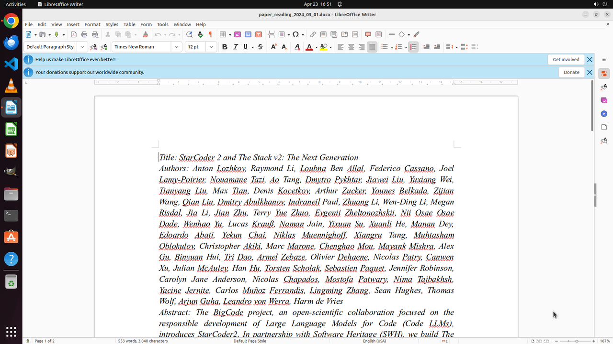

**Response:**
```
I need to find the daily paper list on Hugging Face for March 1st, 2024, and complete the document with all papers' meta information. Let me first scroll down to see what's already in the document, then visit the Hugging Face papers page.
```

**Actions:** `pyautogui.keyDown('ctrl')
pyautogui.keyDown('end')
pyautogui.keyUp('end')
pyautogui.keyUp('ctrl')`

---

## Step 2

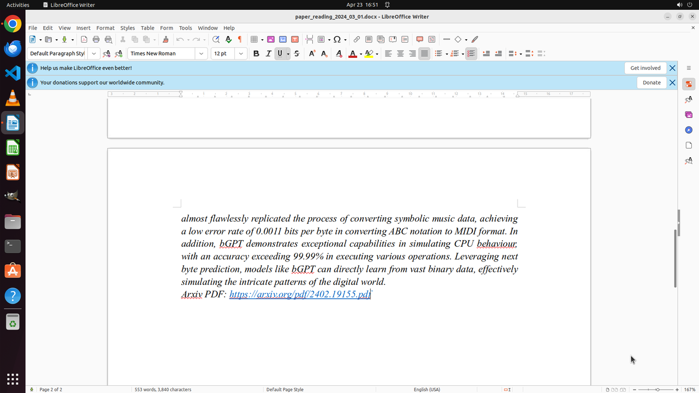

**Response:**
```
I can see the document ends with a paper that has an Arxiv PDF link. Let me scroll up to see the full content and understand the format of the two papers already recorded.
```

**Actions:** `pyautogui.keyDown('ctrl')
pyautogui.keyDown('home')
pyautogui.keyUp('home')
pyautogui.keyUp('ctrl')`

---

## Step 3


**Response:**
```
I can see the first paper starts with "Title: StarCoder 2 and The Stack v2: The Next Generation" with Authors and Abstract fields. Let me scroll down to see the complete format including the Arxiv PDF link, and then see the second paper.
```

**Actions:** `pyautogui.scroll(-10, 960, 600)`

---

## Step 4

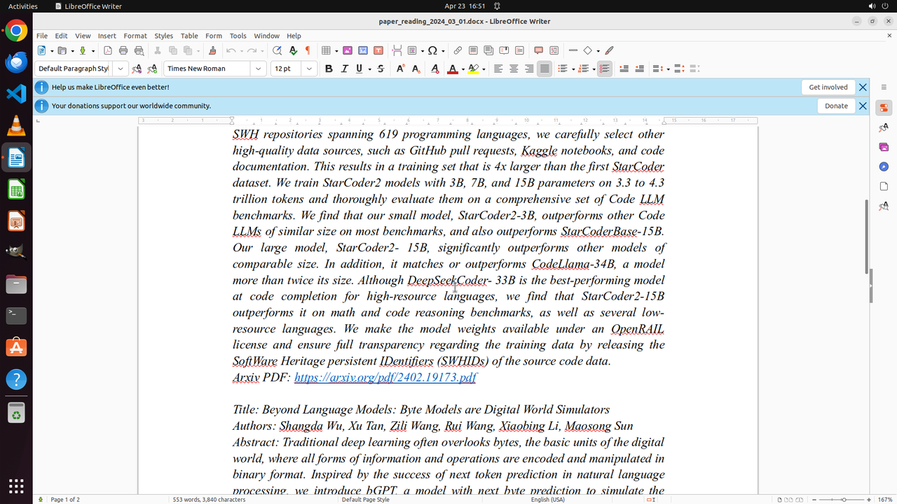

**Response:**
```
Now I can see the format clearly. Each paper has:
- Title: [paper title]
- Authors: [author list]
- Abstract: [abstract text]
- Arxiv PDF: [link]

I can see two papers already recorded:
1. "StarCoder 2 and The Stack v2: The Next Generation" 
2. "Beyond Language Models: Byte Models are Digital World Simulators"

Now I need to visit Hugging Face's daily papers page for March 1st, 2024 to find all other papers. Let me open Chrome.
```

**Actions:** `pyautogui.click(33, 63)`

---

## Step 5

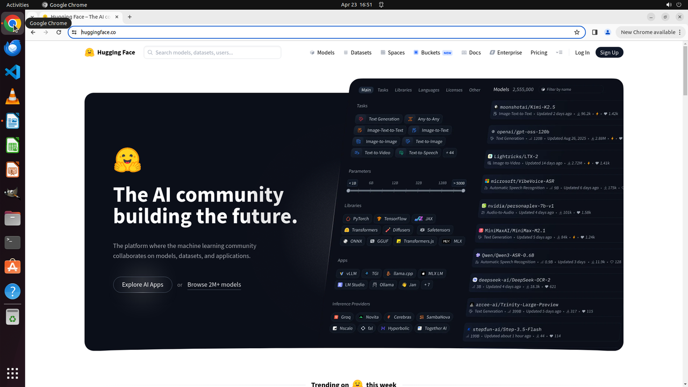

**Response:**
```
I can see the Hugging Face homepage is open. I need to navigate to the daily papers page for March 1st, 2024. Let me go to the papers page directly.
```

**Actions:** `pyautogui.click(600, 88)`

---

## Step 6


**Actions:** `import subprocess, shlex; subprocess.run(f'xdotool type --delay 12 -- ' + shlex.quote('https://huggingface.co/papers?date=2024-03-01\n'), shell=True, check=True)
import time; time.sleep(0.05)`

---

## Step 7

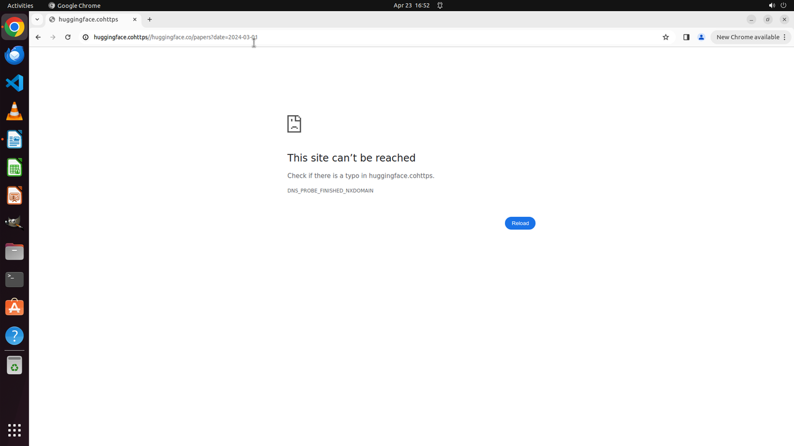

**Response:**
```
The URL got concatenated incorrectly. Let me fix it by clearing the address bar and typing the correct URL.
```

**Actions:** `pyautogui.click(600, 88)`

---

## Step 8


**Response:**
```
I see the URL got malformed. Let me select all text in the address bar and type the correct URL.
```

**Actions:** `pyautogui.keyDown('ctrl')
pyautogui.keyDown('a')
pyautogui.keyUp('a')
pyautogui.keyUp('ctrl')`

---

## Step 9

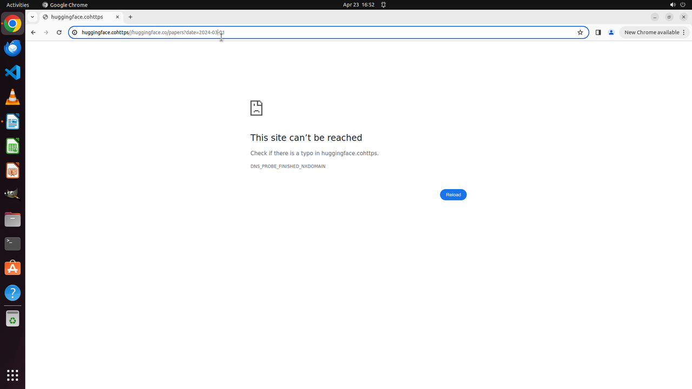

**Response:**
```
Let me click on the address bar first to make sure it's focused, then clear it and type the correct URL.
```

**Actions:** `pyautogui.tripleClick(600, 88)`

---

## Step 10

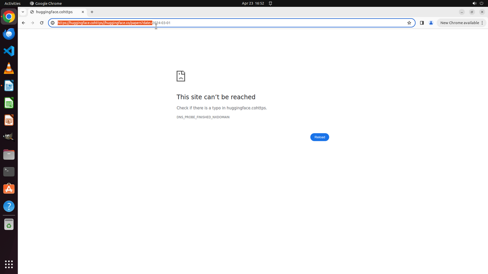

**Response:**
```
Good, the URL is selected. Now let me type the correct URL to replace it.
```

**Actions:** `import subprocess, shlex; subprocess.run(f'xdotool type --delay 12 -- ' + shlex.quote('https://huggingface.co/papers?date=2024-03-01\n'), shell=True, check=True)
import time; time.sleep(0.05)`

---

## Step 11

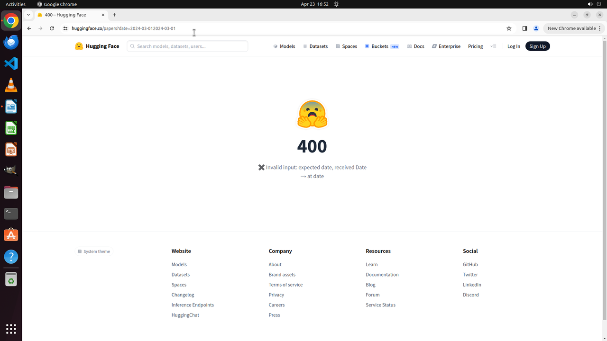

**Response:**
```
The URL got duplicated again. I can see it says "date=2024-03-012024-03-01". Let me clear the address bar completely and type the correct URL carefully.
```

**Actions:** `pyautogui.click(600, 88)`

---

## Step 12

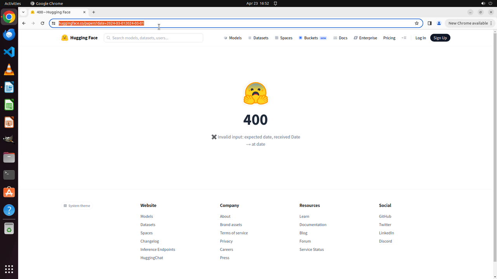

**Response:**
```
Good, the URL is selected. Now let me type the correct URL.
```

**Actions:** `pyautogui.keyDown('delete')
pyautogui.keyUp('delete')`

---

## Step 13

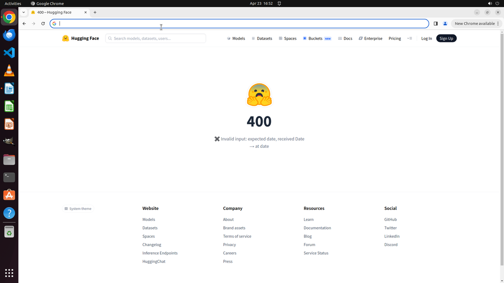

**Response:**
```
The address bar is now empty. Let me type the correct URL carefully.
```

**Actions:** `import subprocess, shlex; subprocess.run(f'xdotool type --delay 12 -- ' + shlex.quote('huggingface.co/papers?date=2024-03-01\n'), shell=True, check=True)
import time; time.sleep(0.05)`

---

## Step 14

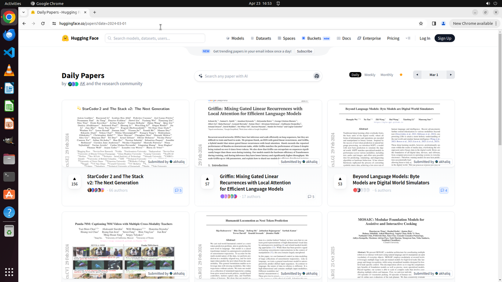

**Response:**
```
I can now see the Daily Papers page for March 1, 2024. I can see several papers listed:

1. StarCoder 2 and The Stack v2: The Next Generation (already in doc)
2. Griffin: Mixing Gated Linear Recurrences with Local Attention for Efficient Language Models
3. Beyond Language Models: Byte Models are Digital World Simulators (already in doc)
4. Panda-70M: Captioning 70M Videos with Multiple Cross-Modality Teachers
5. Humanoid Locomotion as Next Token Prediction
6. MOSAIC: Modular Foundation Models for Assistive and Interactive Cooking

I need to get the details for each paper that's not already in the document. Let me first scroll down to see if there are more papers.
```

**Actions:** `pyautogui.scroll(-5, 960, 600)`

---

## Step 15

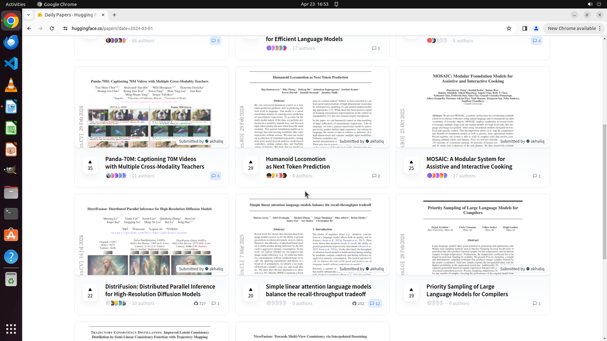

**Response:**
```
I can see more papers. Let me continue scrolling to see all papers on this page.
```

**Actions:** `pyautogui.scroll(-5, 960, 600)`

---

## Step 16

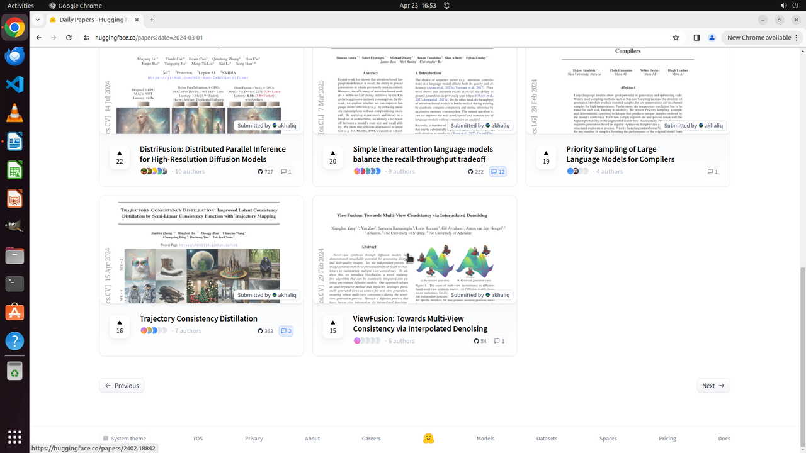

**Response:**
```
Now I can see all the papers for March 1, 2024. Let me compile the full list:

1. StarCoder 2 and The Stack v2: The Next Generation (already in doc)
2. Griffin: Mixing Gated Linear Recurrences with Local Attention for Efficient Language Models
3. Beyond Language Models: Byte Models are Digital World Simulators (already in doc)
4. Panda-70M: Captioning 70M Videos with Multiple Cross-Modality Teachers
5. Humanoid Locomotion as Next Token Prediction
6. MOSAIC: A Modular System for Assistive and Interactive Cooking
7. DistriFusion: Distributed Parallel Inference for High-Resolution Diffusion Models
8. Simple linear attention language models balance the recall-throughput tradeoff
9. Priority Sampling of Large Language Models for Compilers
10. Trajectory Consistency Distillation
11. ViewFusion: Towards Multi-View Consistency via Interpolated Denoising

I need to click on each paper (that's not already in the doc) to get its details. Let me start with paper #2: Griffin.
```

**Actions:** `pyautogui.scroll(15, 960, 600)`

---

## Step 17

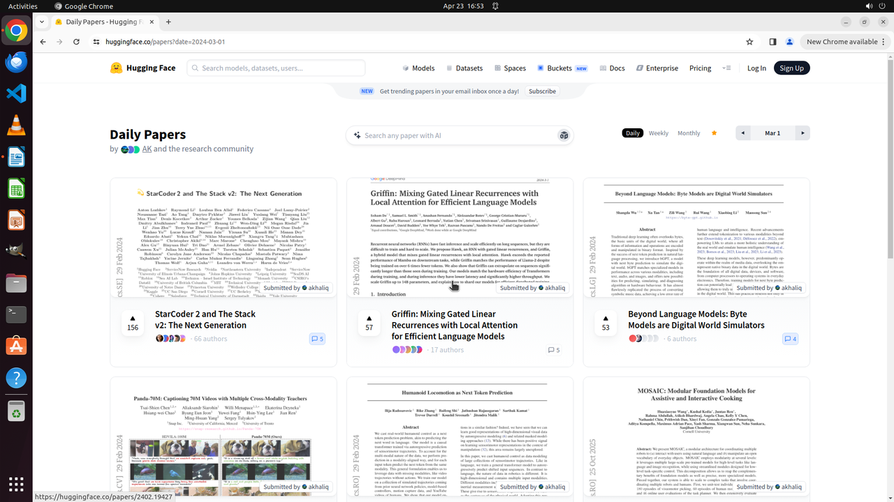

**Response:**
```
Good, I can see all the papers. Let me click on the Griffin paper first to get its details.
```

**Actions:** `pyautogui.click(967, 699)`

---

## Step 18

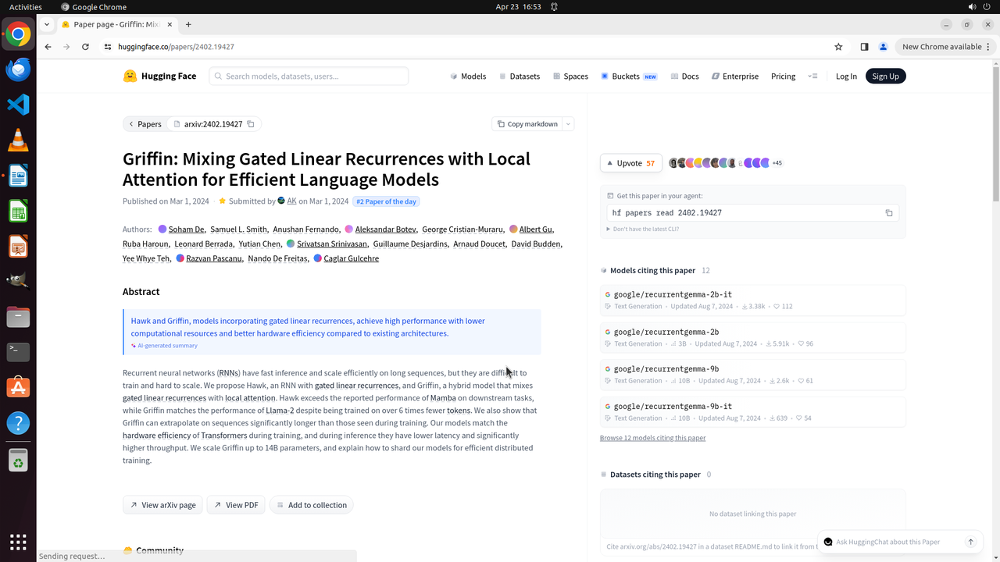

**Response:**
```
I can see the Griffin paper details. Let me collect the information:

**Title:** Griffin: Mixing Gated Linear Recurrences with Local Attention for Efficient Language Models
**Authors:** Soham De, Samuel L. Smith, Anushan Fernando, Aleksandar Botev, George Cristian-Muraru, Albert Gu, Ruba Haroun, Leonard Berrada, Yutian Chen, Srivatsan Srinivasan, Guillaume Desjardins, Arnaud Doucet, David Budden, Yee Whye Teh, Razvan Pascanu, Nando De Freitas, Caglar Gulcehre
**Abstract:** I need to read the full abstract. Let me also get the arxiv PDF link.

The abstract text is: "Recurrent neural networks (RNNs) have fast inference and scale efficiently on long sequences, but they are difficult to train and hard to scale. We propose Hawk, an RNN with gated linear recurrences, and Griffin, a hybrid model that mixes gated linear recurrences with local attention. Hawk exceeds the reported performance of Mamba on downstream tasks, while Griffin matches the performance of Llama-2 despite being trained on over 6 times fewer tokens. We also show that Griffin can extrapolate on sequences significantly longer than those seen during training. Our models match the hardware efficiency of Transformers during training, and during inference they have lower latency and significantly higher throughput. We scale Griffin up to 14B parameters, and explain how to shard our models for efficient distributed training."

The arxiv PDF link would be: https://arxiv.org/pdf/2402.19427.pdf

Now let me go back and check the other papers. Let me go back to the papers list.
```

**Actions:** `pyautogui.click(88, 88)`

---

## Step 19

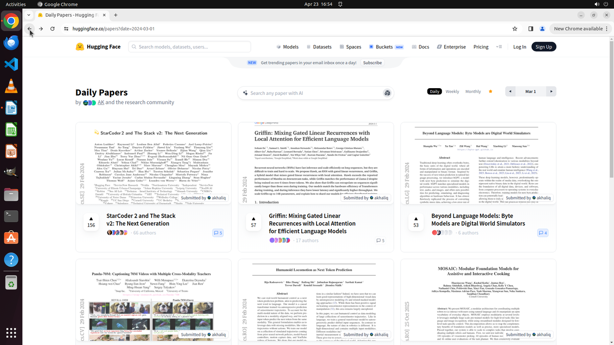

**Response:**
```
Good, I'm back on the papers list. Now let me click on the Panda-70M paper to get its details.
```

**Actions:** `pyautogui.scroll(-5, 960, 600)`

---

## Step 20

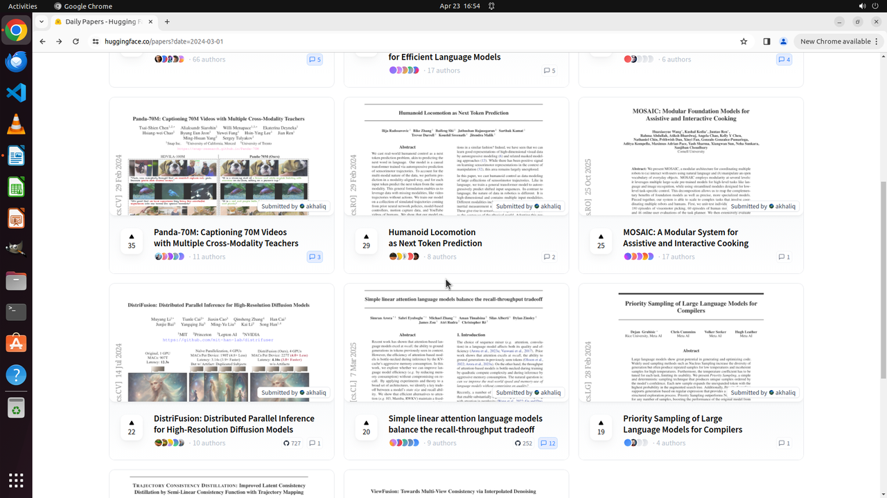

**Response:**
```
I can see all the papers now. Instead of clicking each one individually, let me use a more efficient approach. I'll open each paper in a new tab using middle-click. Let me start by clicking on Panda-70M.
```

**Actions:** `pyautogui.middleClick(483, 514)`

---

## Step 21


**Response:**
```
Good, the Panda-70M paper opened in a new tab. Let me also open the other papers in new tabs. Let me middle-click on each remaining paper.
```

**Actions:** `pyautogui.middleClick(928, 514)`

---

## Step 22


**Response:**
```
Good, Humanoid Locomotion is also opening in a new tab. Let me continue opening the remaining papers. Let me click on MOSAIC.
```

**Actions:** `pyautogui.middleClick(1480, 514)`

---

## Step 23

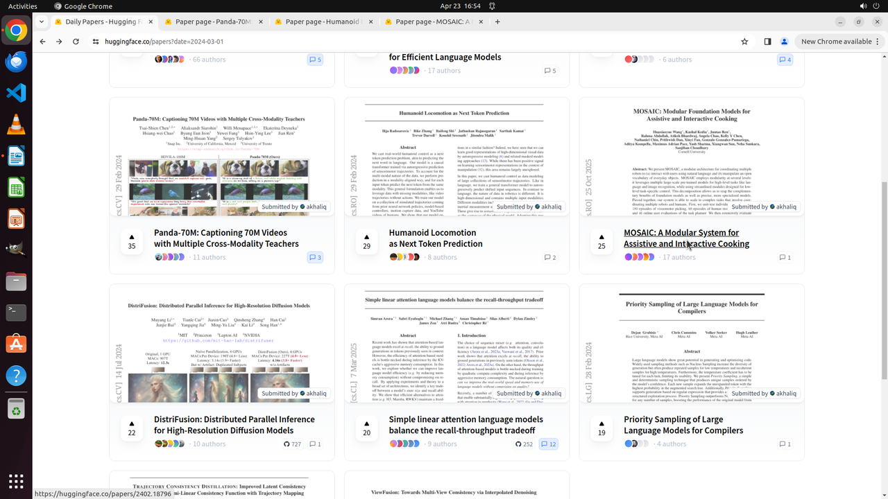

**Response:**
```
Good, MOSAIC is opening too. Now let me open the remaining papers: DistriFusion, Simple linear attention, Priority Sampling, and the ones below. Let me middle-click on each.
```

**Actions:** `pyautogui.middleClick(502, 919)`

---

## Step 24

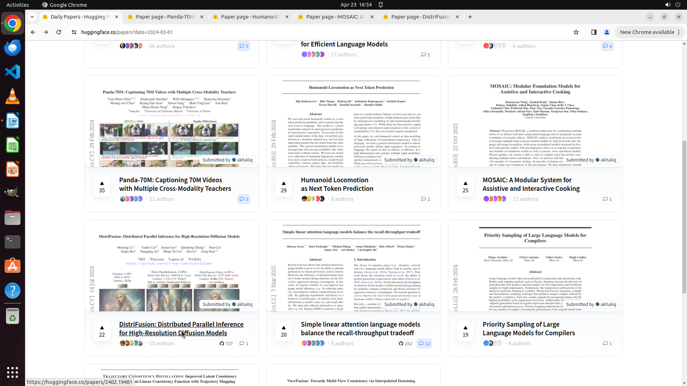

**Response:**
```
Good, DistriFusion is opening. Now let me open the Simple linear attention paper.
```

**Actions:** `pyautogui.middleClick(996, 919)`

---

## Step 25

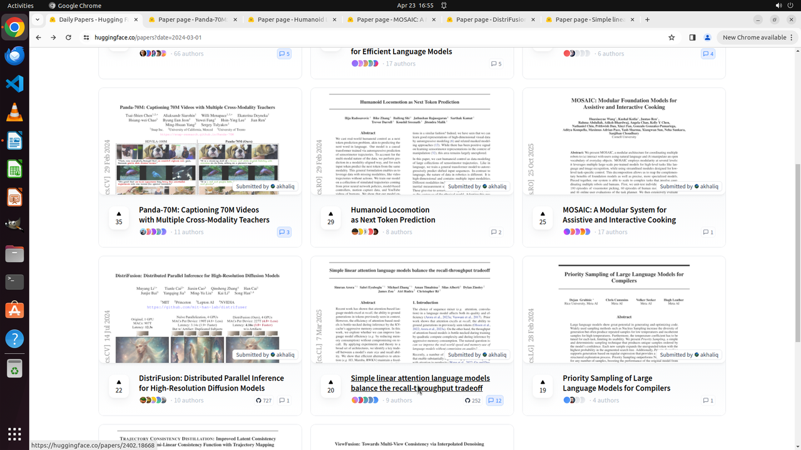

**Response:**
```
Good, Simple linear attention is opening. Now let me open Priority Sampling.
```

**Actions:** `pyautogui.middleClick(1480, 919)`

---

## Step 26

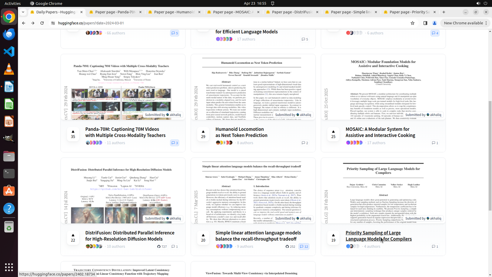

**Response:**
```
Good, now let me scroll down to open the last two papers: Trajectory Consistency Distillation and ViewFusion.
```

**Actions:** `pyautogui.scroll(-5, 960, 600)`

---

## Step 27

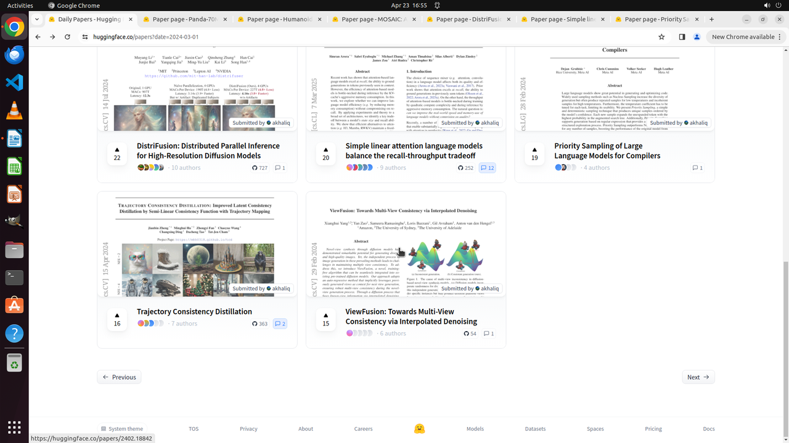

**Response:**
```
Now I can see the last two papers. Let me middle-click on Trajectory Consistency Distillation and ViewFusion.
```

**Actions:** `pyautogui.middleClick(469, 757)`

---

## Step 28

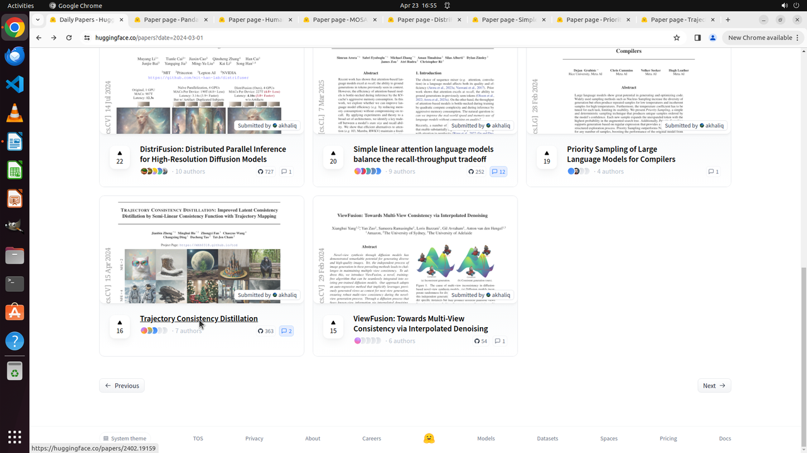

**Response:**
```
Good, Trajectory Consistency Distillation is opening. Now let me open ViewFusion.
```

**Actions:** `pyautogui.middleClick(996, 769)`

---

## Step 29

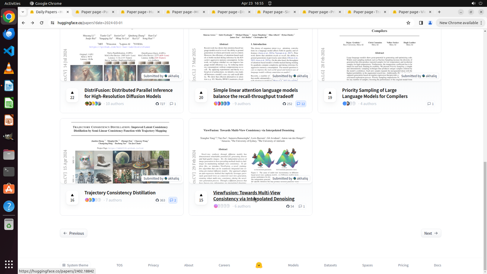

**Response:**
```
All papers are now open in separate tabs. I also need to open the Griffin paper. Let me scroll up first to check if I need to also open it.

Actually, I already visited Griffin earlier and collected its info. Now let me also open it in a new tab for reference. But first, let me use a more efficient approach - I'll use a Python script to collect all the information. Actually, let me just visit each tab and note down the information, then type it all into the document.

Let me start by visiting the Panda-70M tab.
```

**Actions:** `pyautogui.click(373, 46)`

---

## Step 30

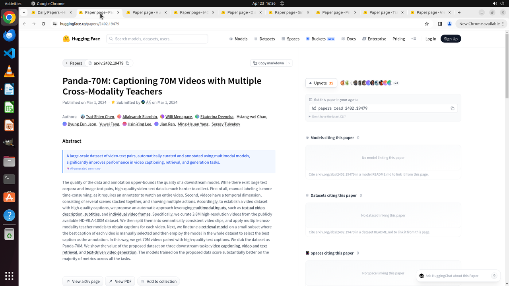

**Response:**
```
I can see the Panda-70M paper details. Let me note down the information:

**Title:** Panda-70M: Captioning 70M Videos with Multiple Cross-Modality Teachers
**Authors:** Tsai-Shien Chen, Aliaksandr Siarohin, Willi Menapace, Ekaterina Deyneka, Hsiang-wei Chao, Byung Eun Jeon, Yuwei Fang, Hsin-Ying Lee, Jian Ren, Ming-Hsuan Yang, Sergey Tulyakov
**Abstract:** (I can see it on the page)
**Arxiv PDF:** The paper ID is 2402.19479

Now I need to efficiently collect all paper details. Let me use a smarter approach - I'll write a Python script to scrape all the information. Let me open a terminal.

Actually, let me first collect all the information by visiting each tab, and then I'll type everything into the document. This approach might be tedious but more reliable.

Let me first take note of the abstract for Panda-70M. I can see it starts with "The quality of the data and annotation upper-bounds the quality of a downstream model..." Let me scroll down to see if there's more.

The abstract is fully visible. Now let me also need the Griffin paper. Let me scroll up on the main page and open it. But first, let me check - I need to also open the Griffin paper. Let me go back to the daily papers page first.

Actually, let me take a more efficient approach. I'll use a terminal to run a Python script to collect all the data from each paper page. Let me open a terminal.
```

**Actions:** `pyautogui.keyDown('ctrl')
pyautogui.keyDown('alt')
pyautogui.keyDown('t')
pyautogui.keyUp('t')
pyautogui.keyUp('alt')
pyautogui.keyUp('ctrl')`

---

## Step 31

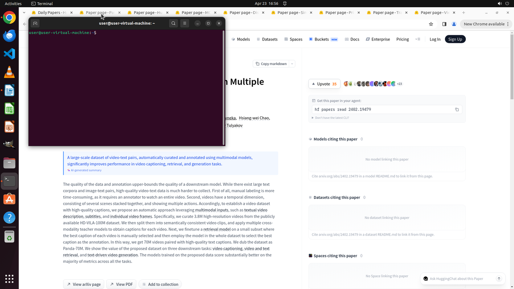

**Response:**
```
A terminal is open. Let me write a Python script to scrape all the paper information from the Hugging Face daily papers page for March 1, 2024.
```

**Actions:** `import subprocess, shlex; subprocess.run(f'xdotool type --delay 12 -- ' + shlex.quote("python3 << 'EOF'\nimport requests\nfrom bs4 import B"), shell=True, check=True)
import time; time.sleep(0.05)
imp`

---

## Step 32

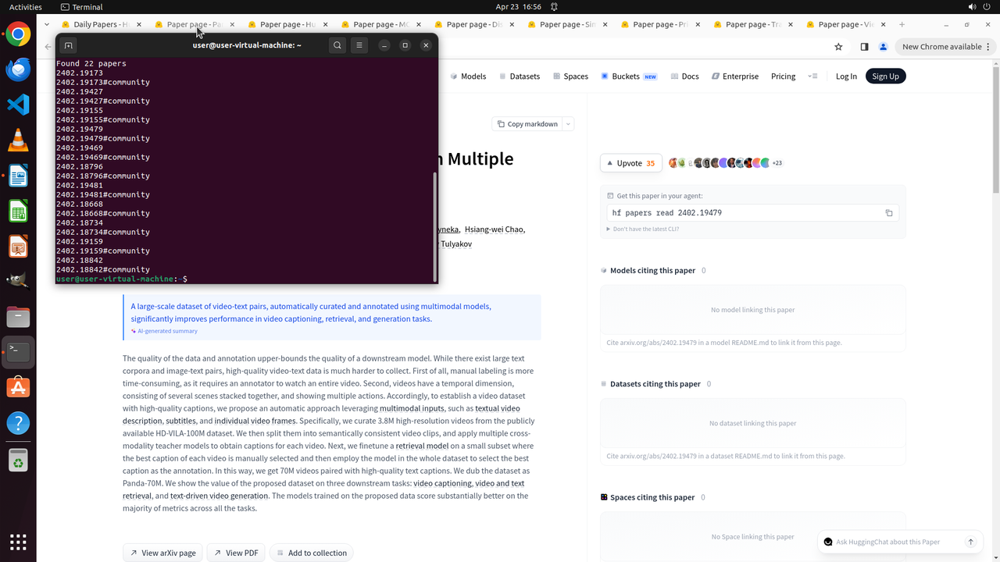

**Response:**
```
I can see it found 22 entries but many are duplicates with "#community" suffix. The unique paper IDs are:
1. 2402.19173
2. 2402.19427
3. 2402.19155
4. 2402.19479
5. 2402.19469
6. 2402.18796
7. 2402.19481
8. 2402.18668
9. 2402.18734
10. 2402.19159
11. 2402.18842

That's 11 papers total. Now let me write a script to fetch details for each paper and save them.
```

**Actions:** `import subprocess, shlex; subprocess.run(f'xdotool type --delay 12 -- ' + shlex.quote("python3 << 'PYEOF'\nimport requests\nfrom bs4 import"), shell=True, check=True)
import time; time.sleep(0.05)
imp`

---

## Step 33

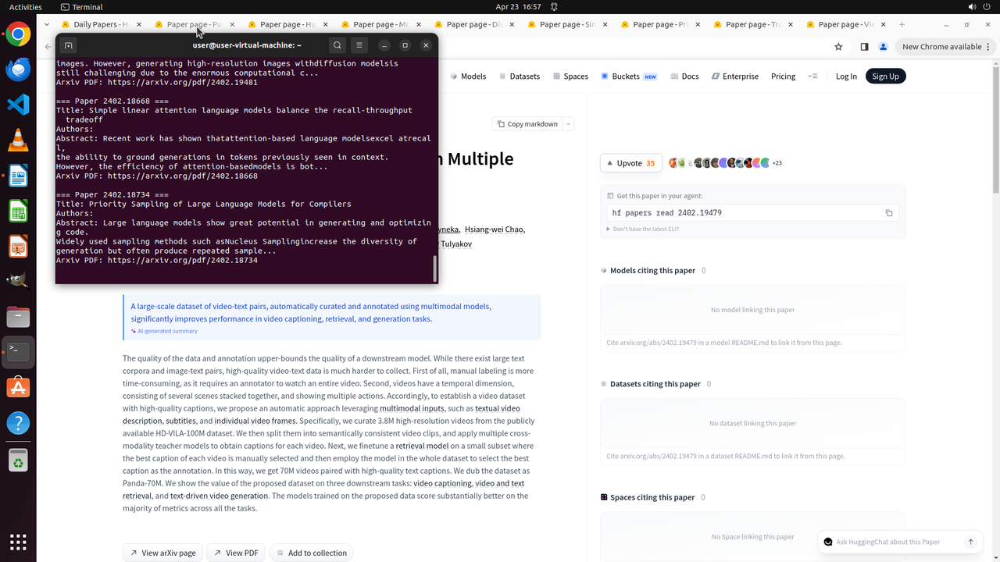

**Response:**
```
The script is running and extracting data, but the authors are not being captured and the abstracts are truncated. Let me write a better script that saves the full information to a file. Let me wait for it to finish first.
```

**Actions:** `pyautogui.scroll(-3, 450, 300)`

---

## Step 34


**Response:**
```
The script ran but the authors aren't being captured and abstracts are truncated. The Hugging Face pages likely use JavaScript rendering. Let me write a better script that fetches the data from the arxiv API instead, which will give us complete information.
```

**Actions:** `import subprocess, shlex; subprocess.run(f'xdotool type --delay 12 -- ' + shlex.quote("python3 << 'PYEOF'\nimport requests\nimport xml.etre"), shell=True, check=True)
import time; time.sleep(0.05)
imp`

---

## Step 35


**Response:**
```
The script is running and fetching papers from the arxiv API. I can see it's already got the first two papers. Let me wait for it to complete.
```

**Actions:** `time.sleep(0.5)`

---

## Step 36

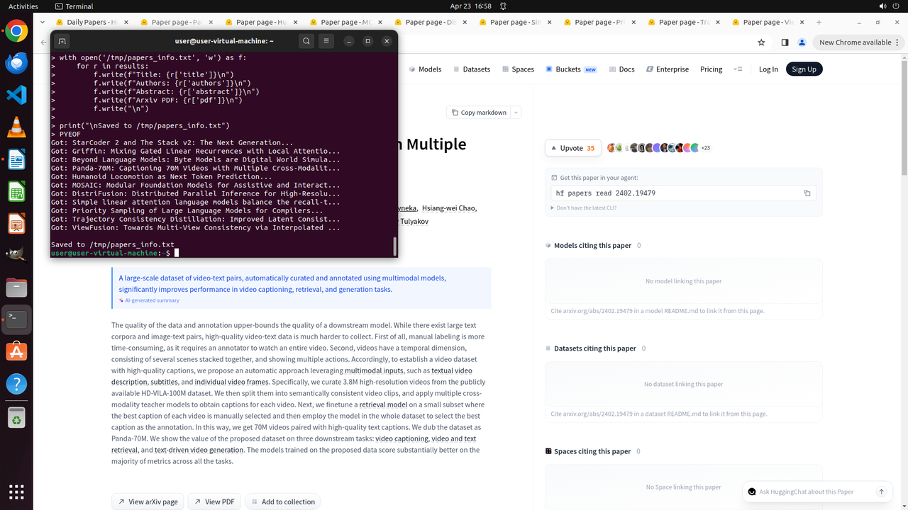

**Response:**
```
All 11 papers have been fetched and saved to `/tmp/papers_info.txt`. Now I need to write a Python script that reads this file and writes the data into the .docx file, appending the papers that aren't already there (papers 1 and 3 - StarCoder 2 and Beyond Language Models - are already in the document). 

Let me first check the content of the saved file and then find the docx file.
```

**Actions:** `import subprocess, shlex; subprocess.run(f'xdotool type --delay 12 -- ' + shlex.quote('ls ~/Desktop/*.docx ~/Documents/*.docx ~/*.docx 2>'), shell=True, check=True)
import time; time.sleep(0.05)
impor`

---

## Step 37


**Response:**
```
The docx file is at `/home/user/Desktop/paper_reading_2024_03_01.docx`. Now let me first look at the papers_info.txt to see the full content, and then write a script to update the docx file.
```

**Actions:** `import subprocess, shlex; subprocess.run(f'xdotool type --delay 12 -- ' + shlex.quote('cat /tmp/papers_info.txt | head -20\n'), shell=True, check=True)
import time; time.sleep(0.05)`

---

## Step 38

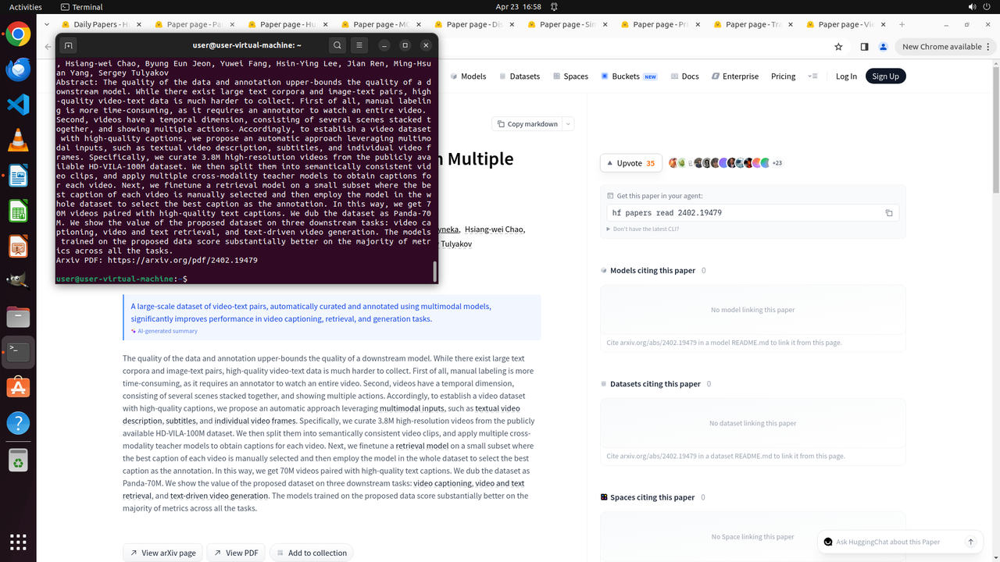

**Response:**
```
The data is being fetched correctly. Now let me write a Python script to read the existing docx file and append the missing papers. Let me first check the exact format of the existing document and then create the script.
```

**Actions:** `import subprocess, shlex; subprocess.run(f'xdotool type --delay 12 -- ' + shlex.quote("python3 << 'PYEOF'\nfrom docx import Document\n\ndoc "), shell=True, check=True)
import time; time.sleep(0.05)
im`

---

## Step 39

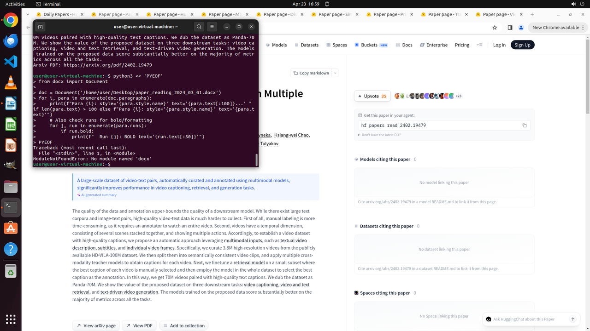

**Response:**
```
I need to install the python-docx module first.
```

**Actions:** `import subprocess, shlex; subprocess.run(f'xdotool type --delay 12 -- ' + shlex.quote('pip install python-docx\n'), shell=True, check=True)
import time; time.sleep(0.05)`

---

## Step 40

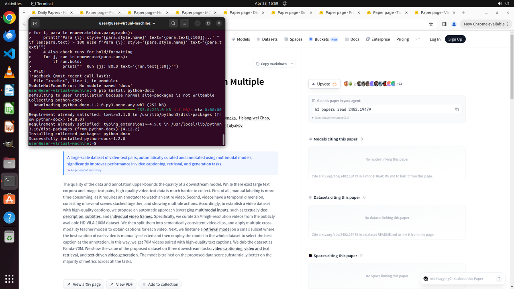

**Response:**
```
python-docx is installed. Now let me examine the existing document structure to understand the formatting.
```

**Actions:** `import subprocess, shlex; subprocess.run(f'xdotool type --delay 12 -- ' + shlex.quote("python3 << 'PYEOF'\nfrom docx import Document\n\ndoc "), shell=True, check=True)
import time; time.sleep(0.05)
im`

---

## Step 41


**Response:**
```
I can see the document structure. Let me scroll up to see the full output from the beginning.
```

**Actions:** `pyautogui.scroll(10, 450, 300)`

---

## Step 42


**Response:**
```
Now I can see the format clearly. Each paper has:
- Para with "Title: " (bold=None) followed by the title text
- Para with "Authors: " followed by author names separated by commas
- Para with "Abstract: " followed by abstract text
- Para with "Arxiv PDF: " followed by the URL
- Empty para as separator

The labels like "Title: ", "Authors: ", "Abstract: ", "Arxiv PDF: " are in separate runs. Let me now write a comprehensive script to add the missing papers to the docx file.
```

**Actions:** `pyautogui.scroll(-10, 450, 300)`

---

## Step 43


**Response:**
```
Now I understand the document structure. The existing document has 2 papers (StarCoder 2 with ID 2402.19173 and Beyond Language Models with ID 2402.19155). I need to add the remaining 9 papers. Let me write a Python script to do this.
```

**Actions:** `import subprocess, shlex; subprocess.run(f'xdotool type --delay 12 -- ' + shlex.quote("python3 << 'PYEOF'\nfrom docx import Document\nimpor"), shell=True, check=True)
import time; time.sleep(0.05)
imp`

---

## Step 44

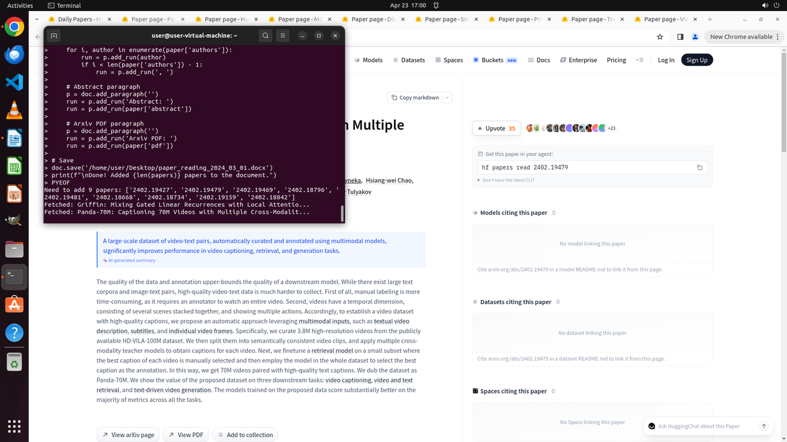

**Response:**
```
The script is running and fetching papers. I can see it's already fetched Griffin and Panda-70M. Let me wait for it to complete.
```

**Actions:** `time.sleep(0.5)`

---

## Step 45


**Response:**
```
The script completed successfully. It says "Done! Added 9 papers to the document." All 9 remaining papers have been fetched and added. Now let me verify the document by opening it in LibreOffice Writer. Let me switch to the document that was already open.
```

**Actions:** `pyautogui.click(33, 340)`

---

## Step 46

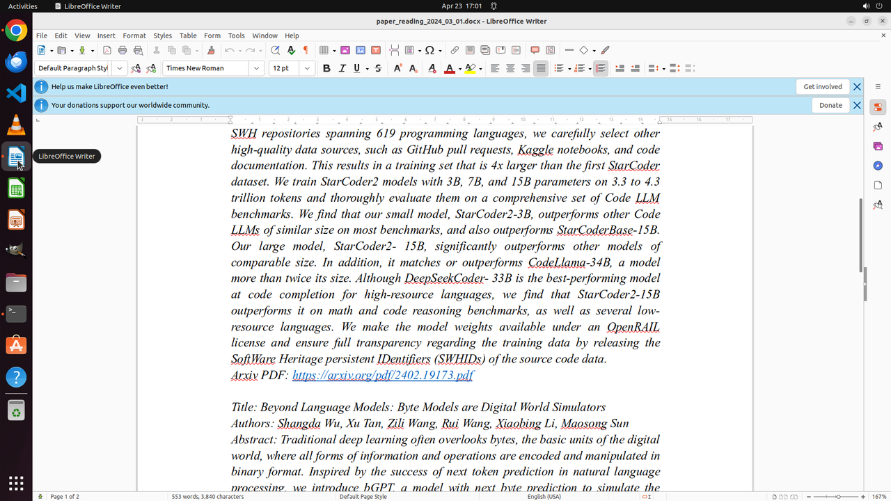

**Response:**
```
I can see the document is open in LibreOffice Writer but it's showing the old version (before my changes). The document was already open when I modified it with the Python script, so it might need to be reloaded. Let me reload the document.
```

**Actions:** `pyautogui.click(85, 76)`

---

## Step 47

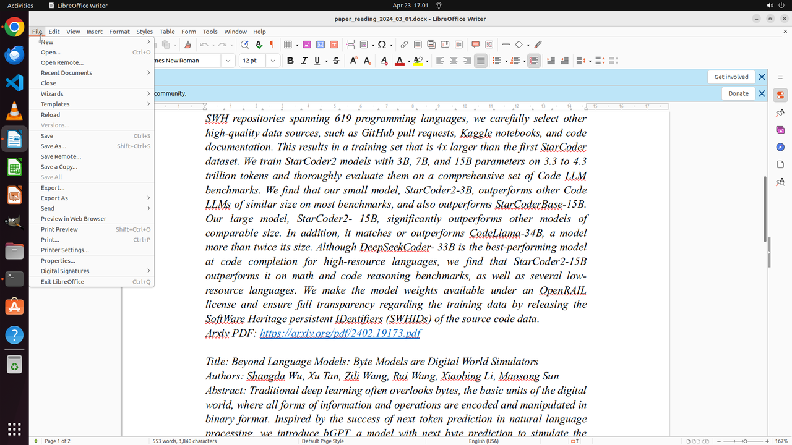

**Response:**
```
I can see the File menu is open. Let me click "Reload" to reload the document with the changes.
```

**Actions:** `pyautogui.click(120, 277)`

---

## Step 48

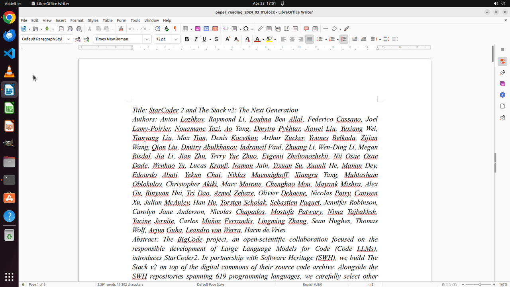

**Response:**
```
The document has been reloaded and I can see it now shows "Page 1 of 6" with "2,391 words, 17,202 characters" - much more content than before. The first paper (StarCoder 2) is visible with its Title, Authors, and Abstract. Let me scroll down to verify the other papers have been added correctly.
```

**Actions:** `pyautogui.scroll(-15, 960, 600)`

---

## Step 49

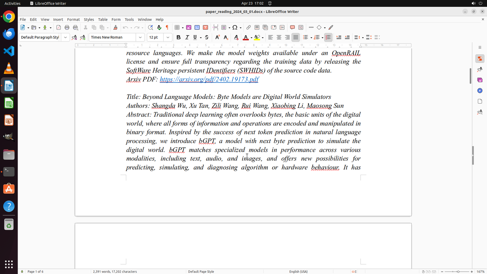

**Response:**
```
I can see the first paper (StarCoder 2) with its Arxiv PDF link, followed by the second paper (Beyond Language Models: Byte Models are Digital World Simulators). Let me continue scrolling to see the newly added papers.
```

**Actions:** `pyautogui.scroll(-15, 960, 600)`

---

## Step 50

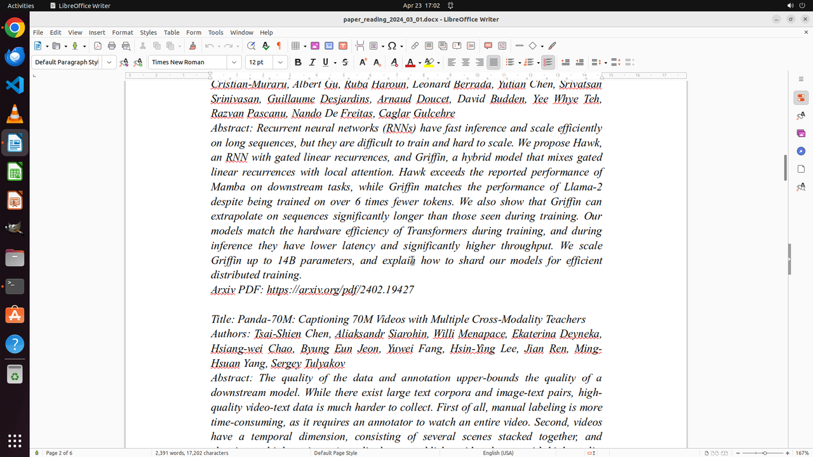

**Response:**
```
I can see the Griffin paper (paper 3) with its full details and the Panda-70M paper (paper 4) starting. The format looks correct with Title, Authors, Abstract, and Arxiv PDF for each paper. Let me continue scrolling to verify more papers.
```

**Actions:** `pyautogui.scroll(-20, 960, 600)`

---

## Step 51

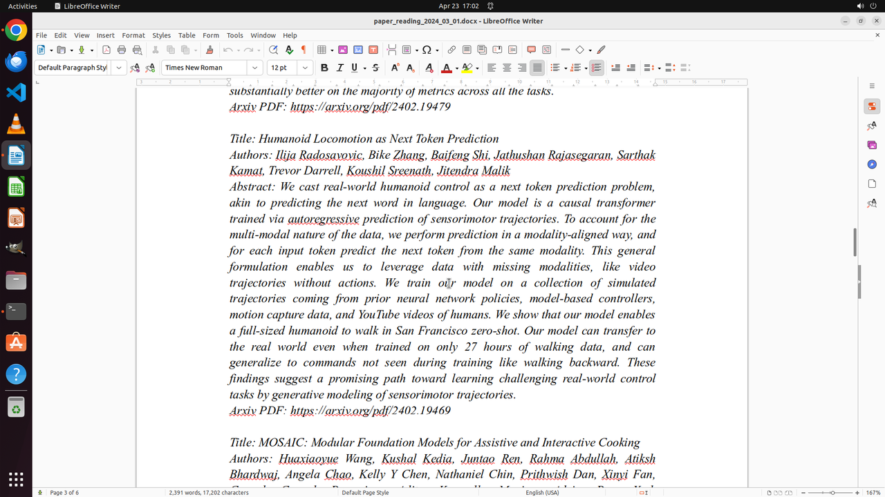

**Response:**
```
I can see the papers are being added correctly:
- Panda-70M (with Arxiv PDF link)
- Humanoid Locomotion as Next Token Prediction (with full details)
- MOSAIC: Modular Foundation Models for Assistive and Interactive Cooking (starting)

Let me continue scrolling to verify all remaining papers.
```

**Actions:** `pyautogui.scroll(-25, 960, 600)`

---

## Step 52

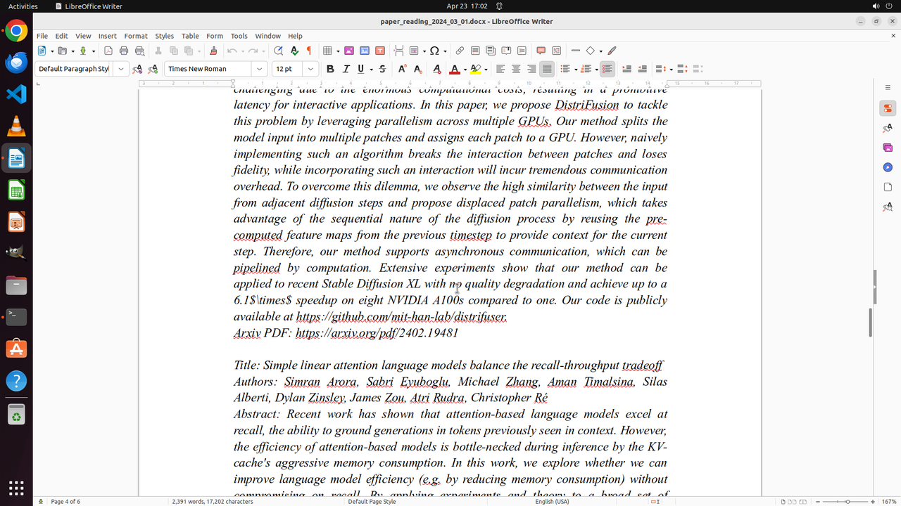

**Response:**
```
I can see DistriFusion and Simple linear attention papers. Let me continue scrolling to see the remaining papers.
```

**Actions:** `pyautogui.scroll(-25, 960, 600)`

---

## Step 53

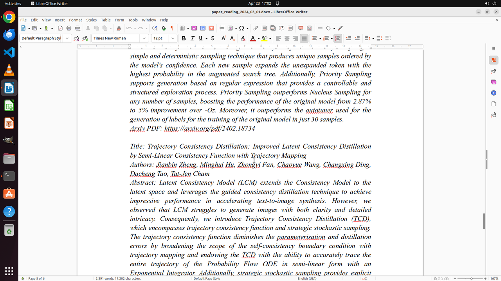

**Response:**
```
I can see the Priority Sampling paper and the Trajectory Consistency Distillation paper. Let me scroll down to see the last paper (ViewFusion).
```

**Actions:** `pyautogui.scroll(-20, 960, 600)`

---

## Step 54


**Response:**
```
I can see the last paper (ViewFusion) with its Arxiv PDF link (https://arxiv.org/pdf/2402.18842). The document is now complete with all 11 papers from the Hugging Face daily papers list for March 1, 2024.

The document now contains all papers:
1. StarCoder 2 and The Stack v2 (already existed)
2. Griffin: Mixing Gated Linear Recurrences with Local Attention (added)
3. Beyond Language Models: Byte Models are Digital World Simulators (already existed)
4. Panda-70M: Captioning 70M Videos with Multiple Cross-Modality Teachers (added)
5. Humanoid Locomotion as Next Token Prediction (added)
6. MOSAIC: Modular Foundation Models for Assistive and Interactive Cooking (added)
7. DistriFusion: Distributed Parallel Inference for High-Resolution Diffusion Models (added)
8. Simple linear attention language models balance the recall-throughput tradeoff (added)
9. Priority Sampling of Large Language Models for Compilers (added)
10. Trajectory Consistency Distillation (added)
11. ViewFusion: Towards Multi-View Consistency via Interpolated Denoising (added)

Now let me save the document with Ctrl+S to make sure it's saved.
```

**Actions:** `pyautogui.keyDown('ctrl')
pyautogui.keyDown('s')
pyautogui.keyUp('s')
pyautogui.keyUp('ctrl')`

---

## Step 55

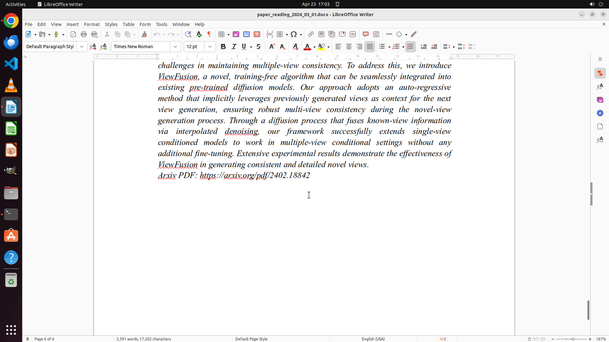

**Response:**
```
The document has been saved successfully. The file was already in .docx format so it saved without any format conversion dialog. 

The task is complete. I have:
1. Found the daily paper list on Hugging Face for March 1st, 2024
2. Identified all 11 papers listed for that date
3. Kept the 2 papers already recorded in the document (StarCoder 2 and Beyond Language Models)
4. Added the remaining 9 papers with the same format (Title, Authors, Abstract, Arxiv PDF) to the document:
   - Griffin: Mixing Gated Linear Recurrences with Local Attention for Efficient Language Models
   - Panda-70M: Captioning 70M Videos with Multiple Cross-Modality Teachers
   - Humanoid Locomotion as Next Token Prediction
   - MOSAIC: Modular Foundation Models for Assistive and Interactive Cooking
   - DistriFusion: Distributed Parallel Inference for High-Resolution Diffusion Models
   - Simple linear attention language models balance the recall-throughput tradeoff
   - Priority Sampling of Large Language Models for Compilers
   - Trajectory Consistency Distillation: Improved Latent Consistency Distillation by Semi-Linear Consistency Function with Trajectory Mapping
   - ViewFusion: Towards Multi-View Consistency via Interpolated Denoising

DONE
```

**Actions:** `DONE`

---
