# Task 236833a3-5704-47fc-888c-4f298f09f799

**Instruction:** Find the daily paper list on Huggingface and take down the meta information of papers on 1st March, 2024 in the opened .docx file. I have recorded two papers. Please conform to the format and complete others.

**Score:** 0

**Wall clock:** 13m 37s

**Steps:** 56

**Cost:** $2.22

---

## Step 1

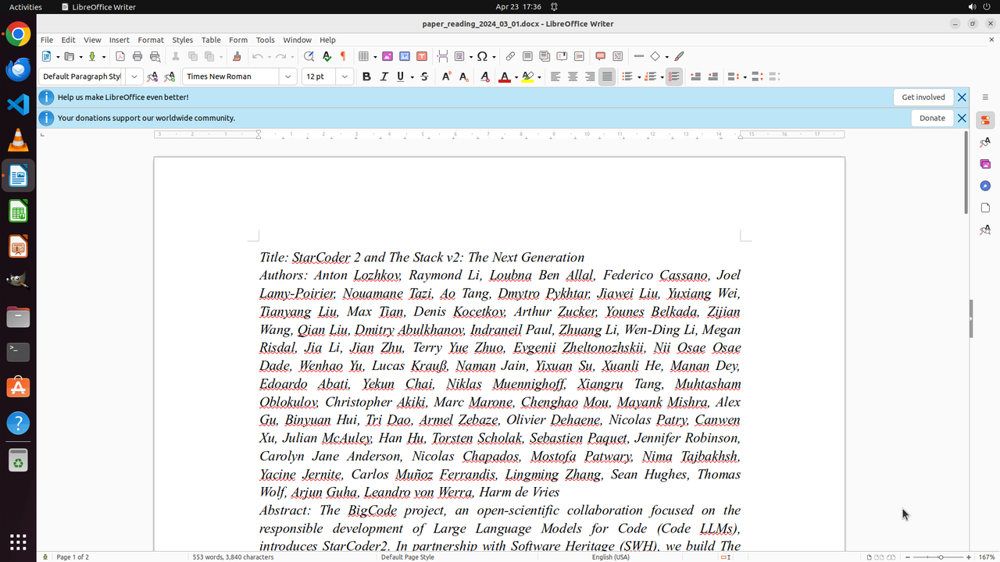

**Response:**
```
I need to find the daily paper list on Hugging Face for March 1st, 2024, and complete the document with all papers' meta information. Let me first scroll down to see what's already in the document, then visit the Hugging Face papers page.
```

**Actions:** `pyautogui.scroll(-15, 960, 600)`

---

## Step 2

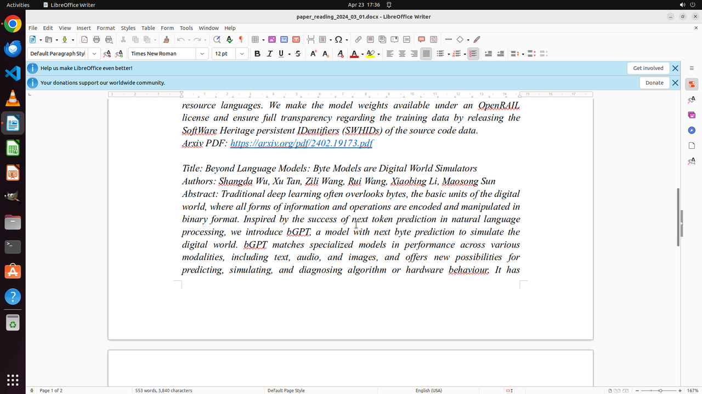

**Response:**
```
Let me continue scrolling to see the rest of the document and understand the full format.
```

**Actions:** `pyautogui.scroll(-15, 960, 600)`

---

## Step 3


**Response:**
```
I can see the document has 2 papers already recorded with the format:
- Title
- Authors
- Abstract
- Arxiv PDF link

The document is on page 2 and appears to end after the second paper. Now let me open Chrome to visit the Hugging Face daily papers page for March 1, 2024.
```

**Actions:** `pyautogui.click(33, 63)`

---

## Step 4


**Response:**
```
I can see the Hugging Face homepage is open. Now I need to navigate to the daily papers page for March 1, 2024. Let me type the URL directly.
```

**Actions:** `pyautogui.click(900, 88)`

---

## Step 5

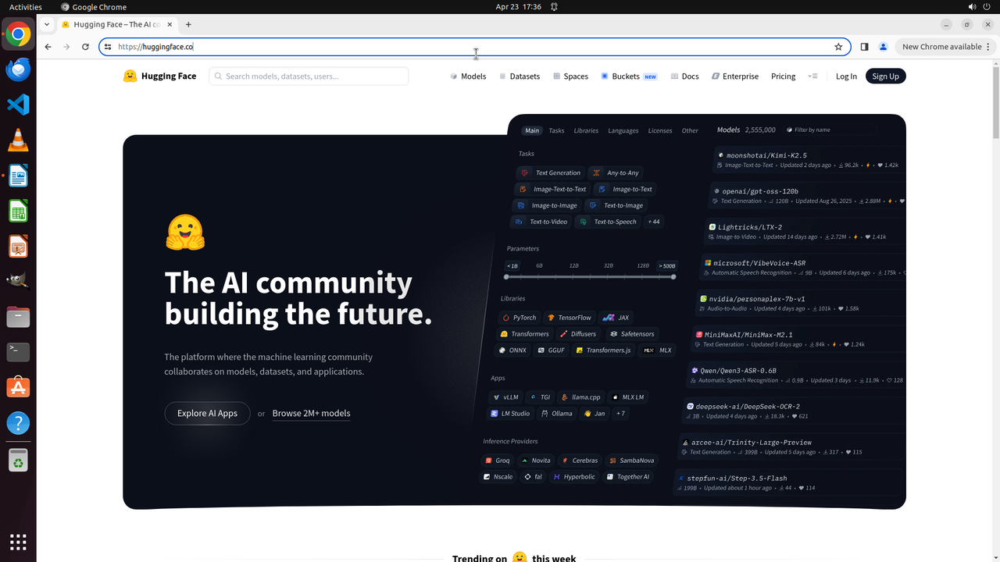

**Actions:** `pyautogui.tripleClick(900, 88)`

---

## Step 6

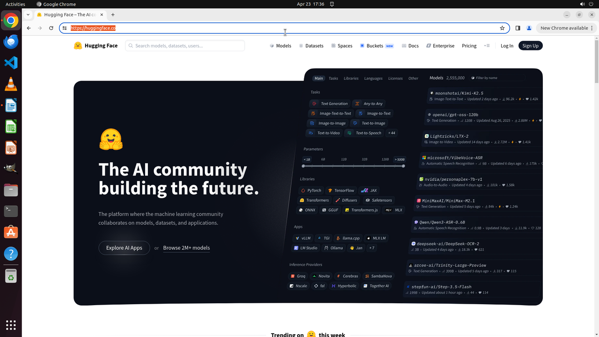

**Actions:** `import subprocess, shlex; subprocess.run(f'xdotool type --delay 12 -- ' + shlex.quote('https://huggingface.co/papers?date=2024-03-01\n'), shell=True, check=True)
import time; time.sleep(0.05)`

---

## Step 7


**Response:**
```
I can see the Daily Papers page for March 1, 2024. I can see the first three papers:
1. StarCoder 2 and The Stack v2: The Next Generation (already in doc)
2. Griffin: Mixing Gated Linear Recurrences with Local Attention for Efficient Language Models
3. Beyond Language Models: Byte Models are Digital World Simulators (already in doc)

And there are more papers below. Let me first note all the papers on this page, then scroll down to see if there are more. Let me click on each paper to get the details. First, let me scroll down to see all papers.
```

**Actions:** `pyautogui.scroll(-5, 960, 600)`

---

## Step 8

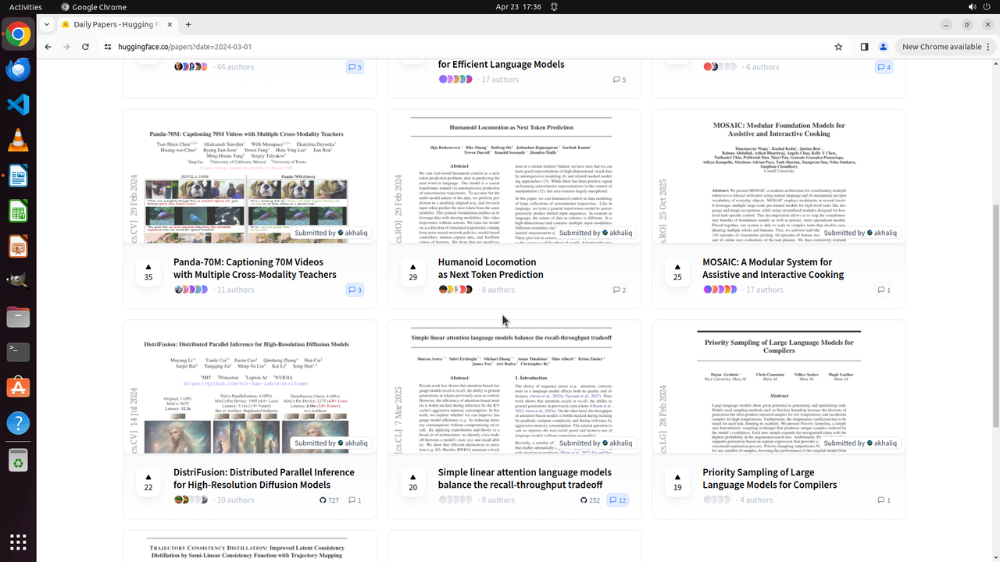

**Response:**
```
I can see more papers. Let me continue scrolling to see all papers on this page.
```

**Actions:** `pyautogui.scroll(-5, 960, 600)`

---

## Step 9

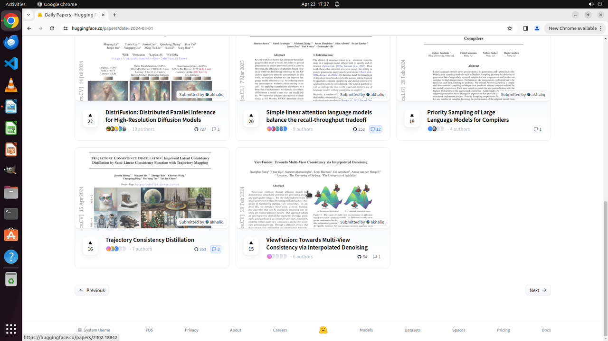

**Response:**
```
Now I can see all the papers for March 1, 2024. Let me compile the full list:

1. StarCoder 2 and The Stack v2: The Next Generation (already in doc)
2. Griffin: Mixing Gated Linear Recurrences with Local Attention for Efficient Language Models
3. Beyond Language Models: Byte Models are Digital World Simulators (already in doc)
4. Panda-70M: Captioning 70M Videos with Multiple Cross-Modality Teachers
5. Humanoid Locomotion as Next Token Prediction
6. MOSAIC: A Modular System for Assistive and Interactive Cooking
7. DistriFusion: Distributed Parallel Inference for High-Resolution Diffusion Models
8. Simple linear attention language models balance the recall-throughput tradeoff
9. Priority Sampling of Large Language Models for Compilers
10. Trajectory Consistency Distillation
11. ViewFusion: Towards Multi-View Consistency via Interpolated Denoising

Now I need to get the details (Title, Authors, Abstract, Arxiv PDF) for each paper that's not already in the document. Let me start by clicking on the Griffin paper (paper #2).
```

**Actions:** `pyautogui.scroll(20, 960, 600)`

---

## Step 10

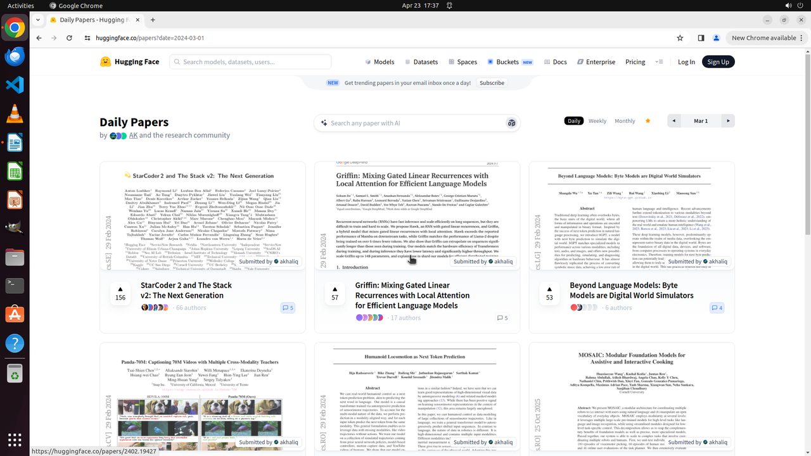

**Response:**
```
Good, I can see the papers list. Let me click on the Griffin paper first to get its details.
```

**Actions:** `pyautogui.click(970, 699)`

---

## Step 11

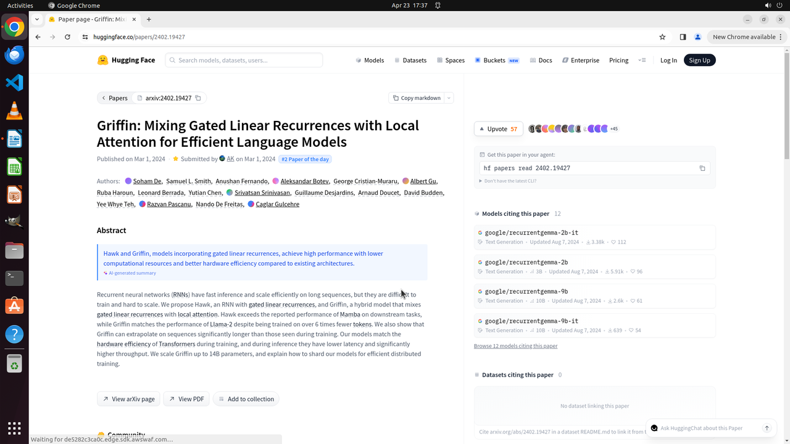

**Response:**
```
I can see the Griffin paper details. Let me note down the information:

**Title:** Griffin: Mixing Gated Linear Recurrences with Local Attention for Efficient Language Models
**Authors:** Soham De, Samuel L. Smith, Anushan Fernando, Aleksandar Botev, George Cristian-Muraru, Albert Gu, Ruba Haroun, Leonard Berrada, Yutian Chen, Srivatsan Srinivasan, Guillaume Desjardins, Arnaud Doucet, David Budden, Yee Whye Teh, Razvan Pascanu, Nando De Freitas, Caglar Gulcehre
**Abstract:** (visible on page)
**Arxiv PDF:** The paper ID is 2402.19427

Let me get the PDF link and copy the abstract. First, let me select and copy the abstract text.
```

**Actions:** `pyautogui.click(459, 969)`

---

## Step 12

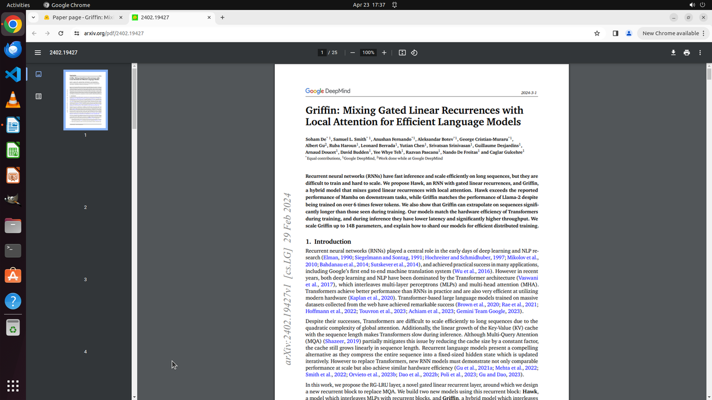

**Response:**
```
I can see the PDF opened. The arxiv PDF URL is `https://arxiv.org/pdf/2402.19427`. Now let me go back to the paper page and collect all the information I need. Let me go back to the papers list to systematically collect information for all papers.
```

**Actions:** `pyautogui.click(225, 46)`

---

## Step 13


**Response:**
```
I have the Griffin paper details. Now I need to collect information for all the remaining papers. Let me close the PDF tab and work systematically. I'll collect all the paper information by visiting each paper page. Let me close the PDF tab first.
```

**Actions:** `pyautogui.click(565, 46)`

---

## Step 14

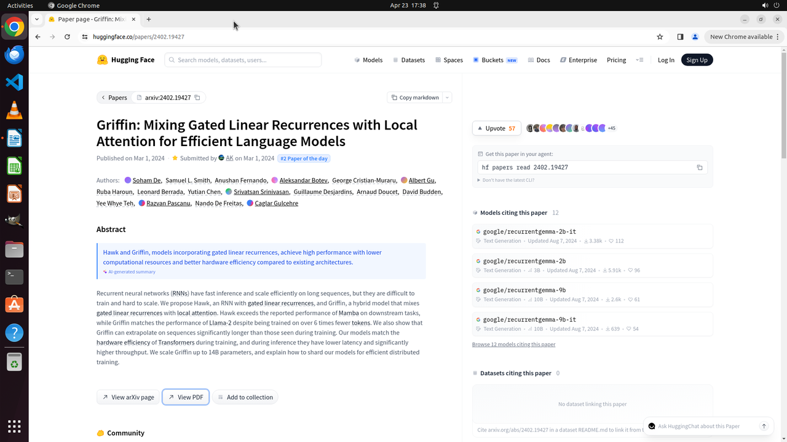

**Response:**
```
Good, I have the Griffin paper details. Now I need to collect information for all remaining papers. Let me take a more efficient approach - I'll use a terminal to help collect all the data. But first, let me note down what I have for Griffin:

- **Title:** Griffin: Mixing Gated Linear Recurrences with Local Attention for Efficient Language Models
- **Authors:** Soham De, Samuel L. Smith, Anushan Fernando, Aleksandar Botev, George Cristian-Muraru, Albert Gu, Ruba Haroun, Leonard Berrada, Yutian Chen, Srivatsan Srinivasan, Guillaume Desjardins, Arnaud Doucet, David Budden, Yee Whye Teh, Razvan Pascanu, Nando De Freitas, Caglar Gulcehre
- **Abstract:** Recurrent neural networks (RNNs) have fast inference and scale efficiently on long sequences, but they are difficult to train and hard to scale. We propose Hawk, an RNN with gated linear recurrences, and Griffin, a hybrid model that mixes gated linear recurrences with local attention. Hawk exceeds the reported performance of Mamba on downstream tasks, while Griffin matches the performance of Llama-2 despite being trained on over 6 times fewer tokens. We also show that Griffin can extrapolate on sequences significantly longer than those seen during training. Our models match the hardware efficiency of Transformers during training, and during inference they have lower latency and significantly higher throughput. We scale Griffin up to 14B parameters, and explain how to shard our models for efficient distributed training.
- **Arxiv PDF:** https://arxiv.org/pdf/2402.19427

Now let me go back to the papers list and visit each remaining paper. Let me click on "Papers" to go back.
```

**Actions:** `pyautogui.click(288, 237)`

---

## Step 15

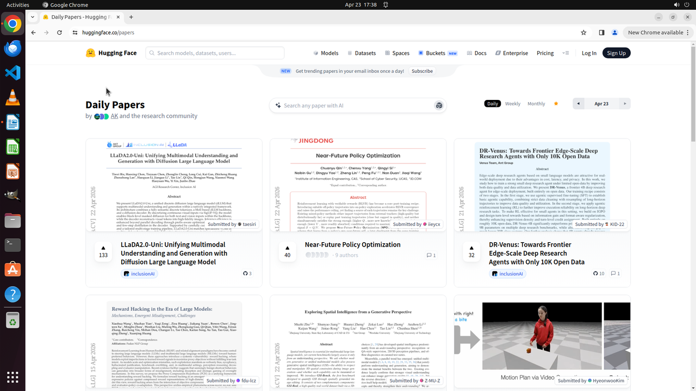

**Response:**
```
I see it went to today's papers (Apr 23). I need to navigate back to March 1, 2024. Let me use the URL directly.
```

**Actions:** `pyautogui.click(900, 88)`

---

## Step 16

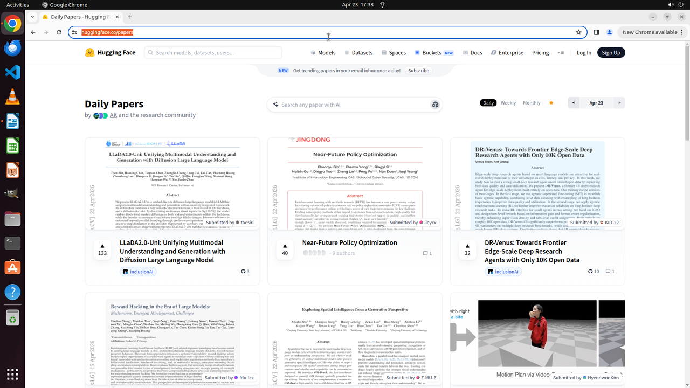

**Actions:** `import subprocess, shlex; subprocess.run(f'xdotool type --delay 12 -- ' + shlex.quote('https://huggingface.co/papers?date=2024-03-01\n'), shell=True, check=True)
import time; time.sleep(0.05)`

---

## Step 17

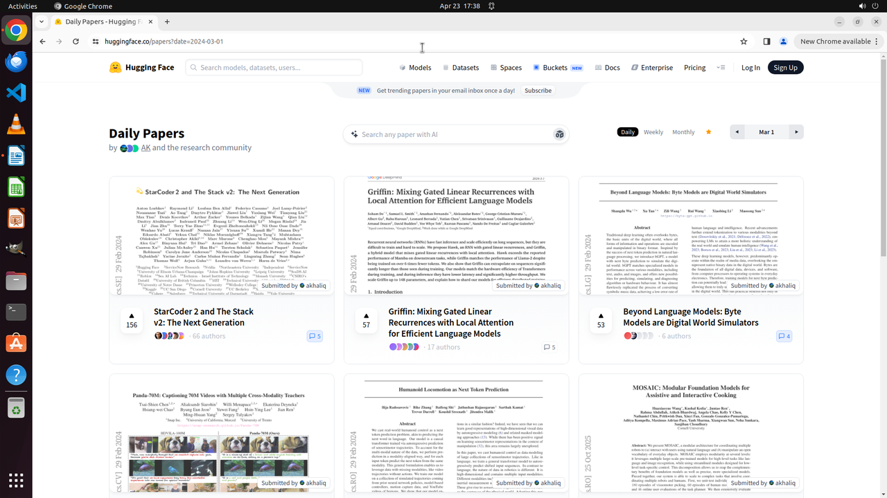

**Response:**
```
Good, I'm back on the March 1, 2024 papers page. I can see the papers. Now I need to visit each paper that's not already in the document to collect its details. The papers already in the doc are:
1. StarCoder 2 and The Stack v2: The Next Generation
2. Beyond Language Models: Byte Models are Digital World Simulators

I need to collect details for the remaining 9 papers. Let me be more efficient and open each paper in a new tab. Let me start by clicking on each paper. First, let me visit the Panda-70M paper. Let me scroll down a bit.
```

**Actions:** `pyautogui.scroll(-3, 960, 600)`

---

## Step 18

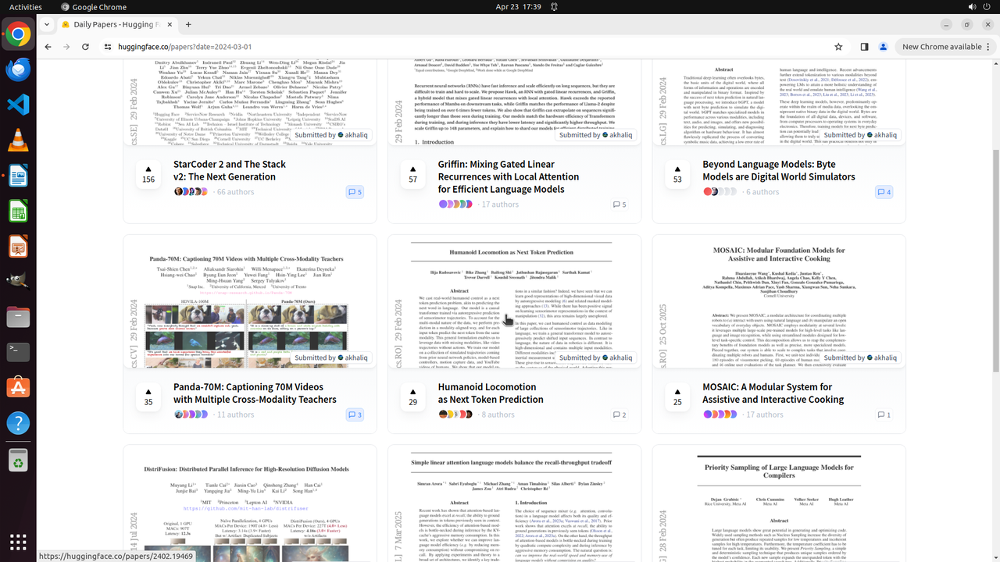

**Response:**
```
Now I can see all the papers. Let me take a more efficient approach. I'll open each paper in a new tab using middle-click (or Ctrl+click). Let me start with the papers I need to collect info for.
```

**Actions:** `pyautogui.keyDown('ctrl')
pyautogui.click(483, 754)
pyautogui.keyUp('ctrl')`

---

## Step 19

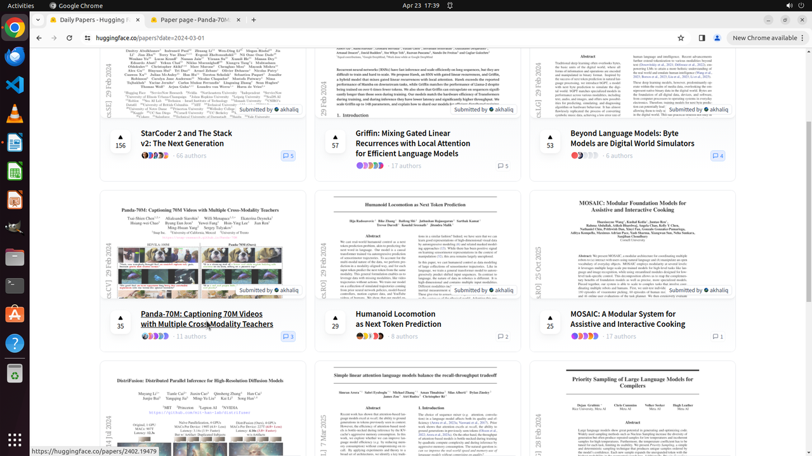

**Response:**
```
Good, Panda-70M opened in a new tab. Let me continue opening other papers in new tabs. Let me Ctrl+click on "Humanoid Locomotion as Next Token Prediction".
```

**Actions:** `pyautogui.keyDown('ctrl')
pyautogui.click(931, 754)
pyautogui.keyUp('ctrl')`

---

## Step 20

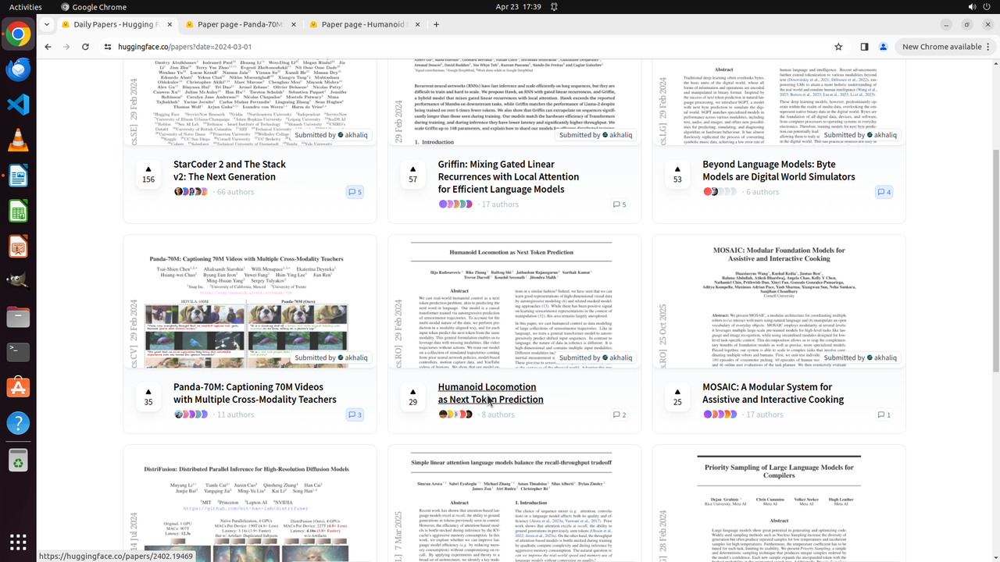

**Response:**
```
Good, now let me also Ctrl+click on the MOSAIC paper and the other remaining papers.
```

**Actions:** `pyautogui.keyDown('ctrl')
pyautogui.click(1483, 754)
pyautogui.keyUp('ctrl')`

---

## Step 21


**Response:**
```
Good, I have 3 tabs opened for the papers. Now let me scroll down and open the remaining papers in new tabs too. I need to get DistriFusion, Simple linear attention, Priority Sampling, and the remaining papers.
```

**Actions:** `pyautogui.scroll(-5, 960, 600)`

---

## Step 22

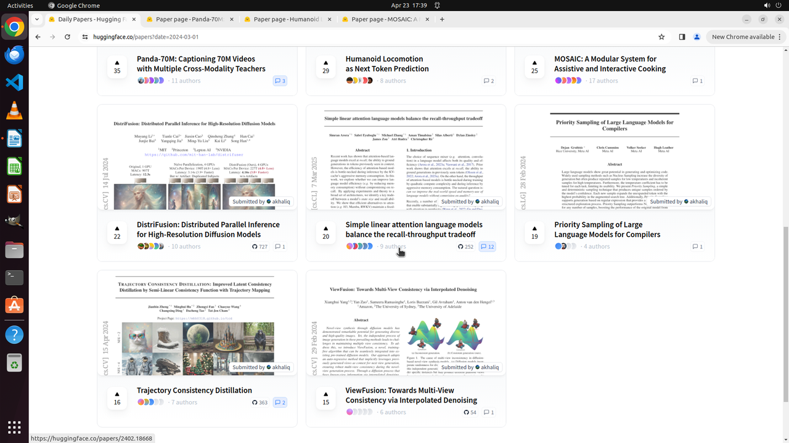

**Response:**
```
Now I can see the remaining papers. Let me open them all in new tabs. Let me Ctrl+click on each one.
```

**Actions:** `pyautogui.keyDown('ctrl')
pyautogui.click(496, 558)
pyautogui.keyUp('ctrl')`

---

## Step 23

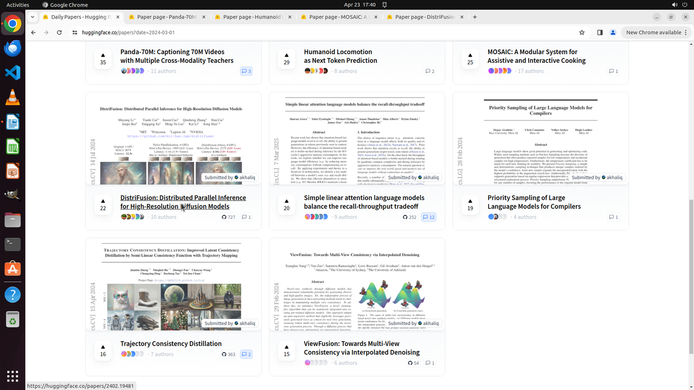

**Response:**
```
Good, DistriFusion is open. Now let me open the remaining papers: Simple linear attention, Priority Sampling, Trajectory Consistency Distillation, and ViewFusion.
```

**Actions:** `pyautogui.keyDown('ctrl')
pyautogui.click(997, 558)
pyautogui.keyUp('ctrl')`

---

## Step 24

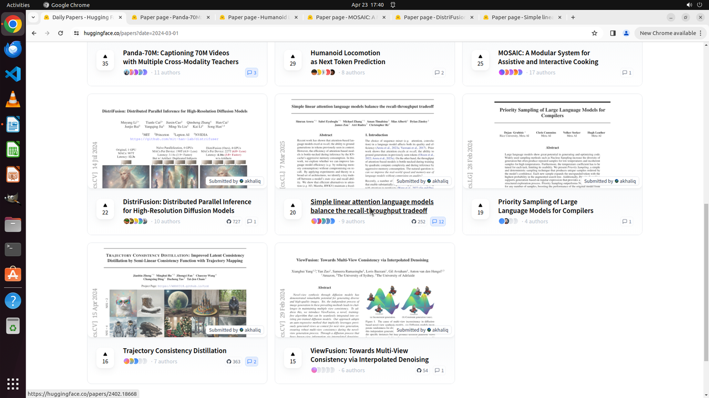

**Response:**
```
Good, Simple linear attention is open. Now let me open Priority Sampling, Trajectory Consistency Distillation, and ViewFusion.
```

**Actions:** `pyautogui.keyDown('ctrl')
pyautogui.click(1480, 558)
pyautogui.keyUp('ctrl')`

---

## Step 25

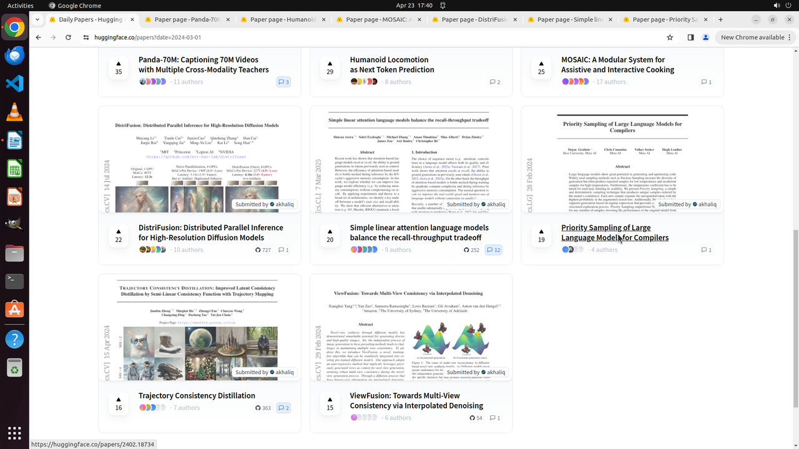

**Response:**
```
Good, Priority Sampling is open. Now let me open Trajectory Consistency Distillation and ViewFusion.
```

**Actions:** `pyautogui.keyDown('ctrl')
pyautogui.click(468, 951)
pyautogui.keyUp('ctrl')`

---

## Step 26

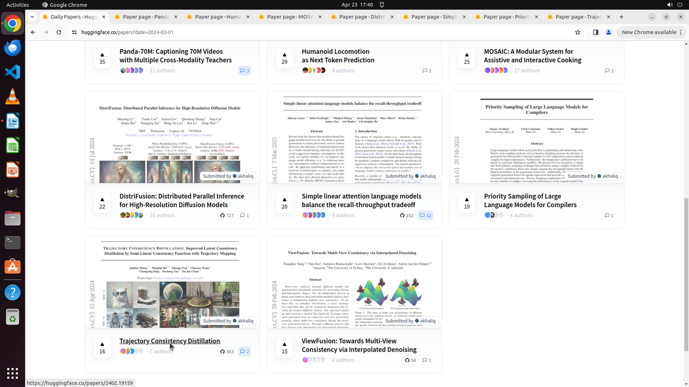

**Response:**
```
Good, Trajectory Consistency Distillation is open. Now let me open the last paper - ViewFusion.
```

**Actions:** `pyautogui.keyDown('ctrl')
pyautogui.click(993, 963)
pyautogui.keyUp('ctrl')`

---

## Step 27

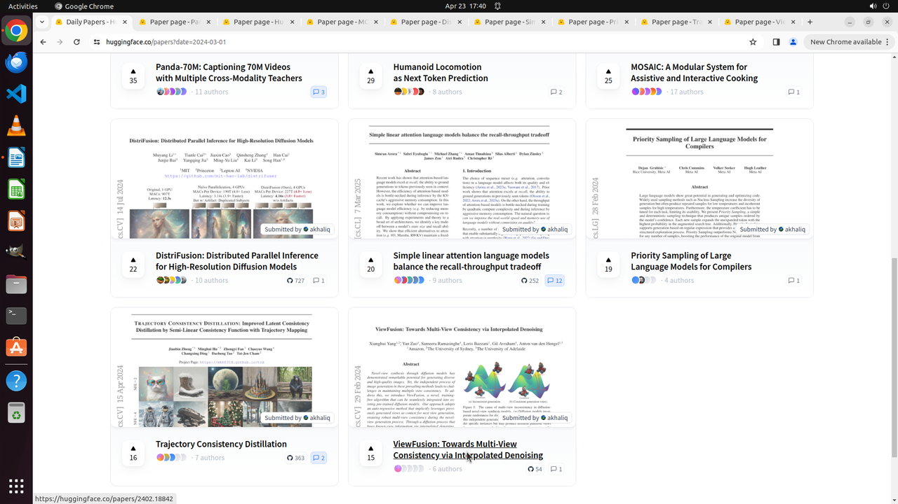

**Response:**
```
I now have all the papers open in tabs. I also need to open the Griffin paper. Let me scroll up to find it and open it too. Actually, I already have the Griffin paper info from before. Let me now use a more efficient approach - I'll use a terminal to write a Python script that will help me collect all the data and write it to the docx file. But first, let me check the existing document format by looking at the docx file.

Let me take a different approach. I'll visit each tab, note the information, and then type it all into the document. Let me start by visiting each paper tab. First, let me look at the Panda-70M paper.
```

**Actions:** `pyautogui.click(373, 46)`

---

## Step 28


**Response:**
```
I can see the Panda-70M paper details. This approach of visiting each tab individually would be very time-consuming. Let me use a more efficient approach - I'll use a Python script to extract data from the Hugging Face pages and write to the docx file. Let me first check the existing document to understand its exact format.
```

**Actions:** `pyautogui.keyDown('ctrl')
pyautogui.keyDown('l')
pyautogui.keyUp('l')
pyautogui.keyUp('ctrl')`

---

## Step 29

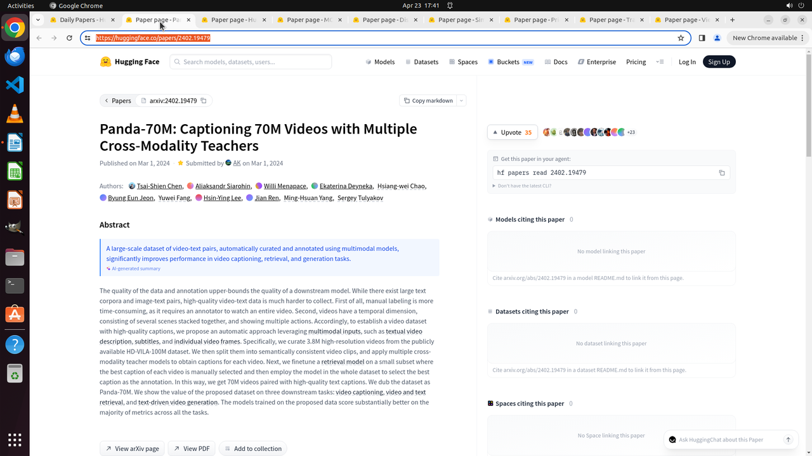

**Response:**
```
Let me take a more efficient approach. I'll open a terminal and write a Python script to scrape the data and update the docx file.
```

**Actions:** `pyautogui.keyDown('esc')
pyautogui.keyUp('esc')`

---

## Step 30

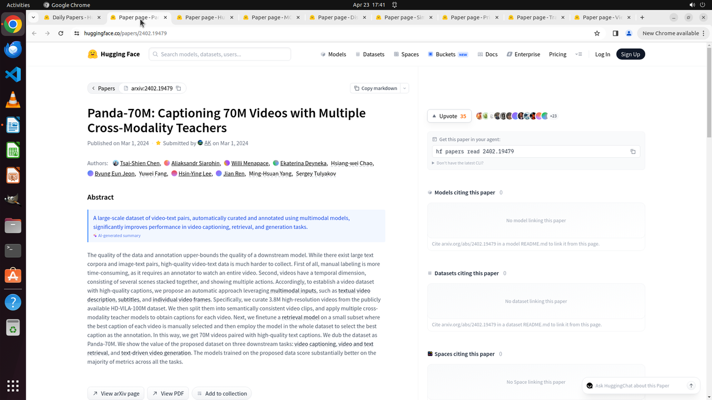

**Response:**
```
Let me open a terminal to write a Python script that will efficiently collect all the paper data and update the docx file.
```

**Actions:** `pyautogui.keyDown('ctrl')
pyautogui.keyDown('alt')
pyautogui.keyDown('t')
pyautogui.keyUp('t')
pyautogui.keyUp('alt')
pyautogui.keyUp('ctrl')`

---

## Step 31


**Response:**
```
A terminal is open. Let me first find the docx file and then write a Python script to scrape the paper information and update the document.
```

**Actions:** `import subprocess, shlex; subprocess.run(f'xdotool type --delay 12 -- ' + shlex.quote('find /home/user -name "*.docx" 2>/dev/null\n'), shell=True, check=True)
import time; time.sleep(0.05)`

---

## Step 32

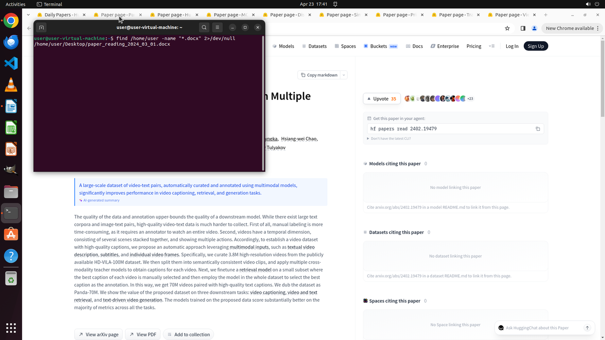

**Response:**
```
The file is at `/home/user/Desktop/paper_reading_2024_03_01.docx`. Now let me write a Python script to read the existing document, scrape all the paper data from Hugging Face, and update the document.
```

**Actions:** `import subprocess, shlex; subprocess.run(f'xdotool type --delay 12 -- ' + shlex.quote('python3 -c "\nfrom docx import Document\ndoc = Docum'), shell=True, check=True)
import time; time.sleep(0.05)
imp`

---

## Step 33

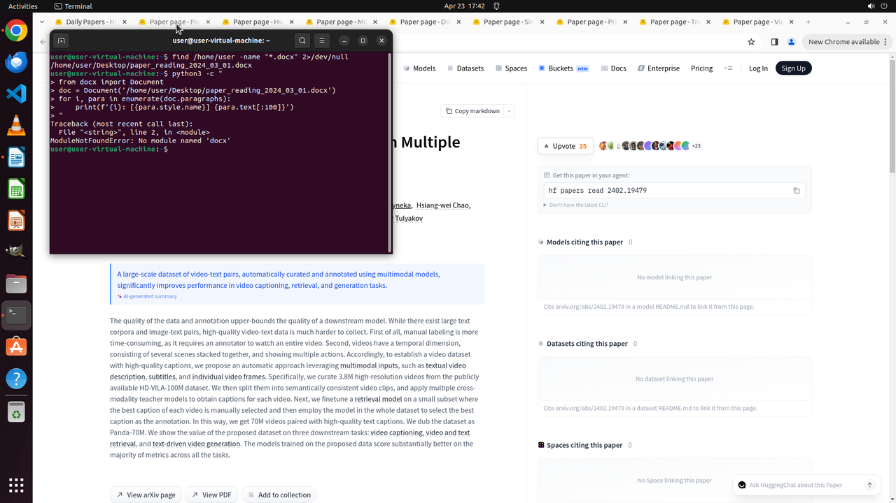

**Response:**
```
I need to install the python-docx module first.
```

**Actions:** `import subprocess, shlex; subprocess.run(f'xdotool type --delay 12 -- ' + shlex.quote('pip install python-docx requests beautifulsoup4\n'), shell=True, check=True)
import time; time.sleep(0.05)`

---

## Step 34

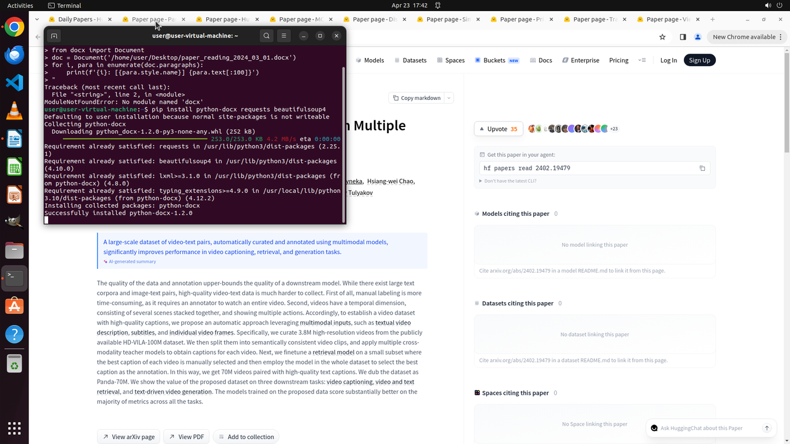

**Response:**
```
Good, python-docx is installed. Now let me first read the existing document to understand its format.
```

**Actions:** `import subprocess, shlex; subprocess.run(f'xdotool type --delay 12 -- ' + shlex.quote('python3 -c "\nfrom docx import Document\ndoc = Docum'), shell=True, check=True)
import time; time.sleep(0.05)
imp`

---

## Step 35

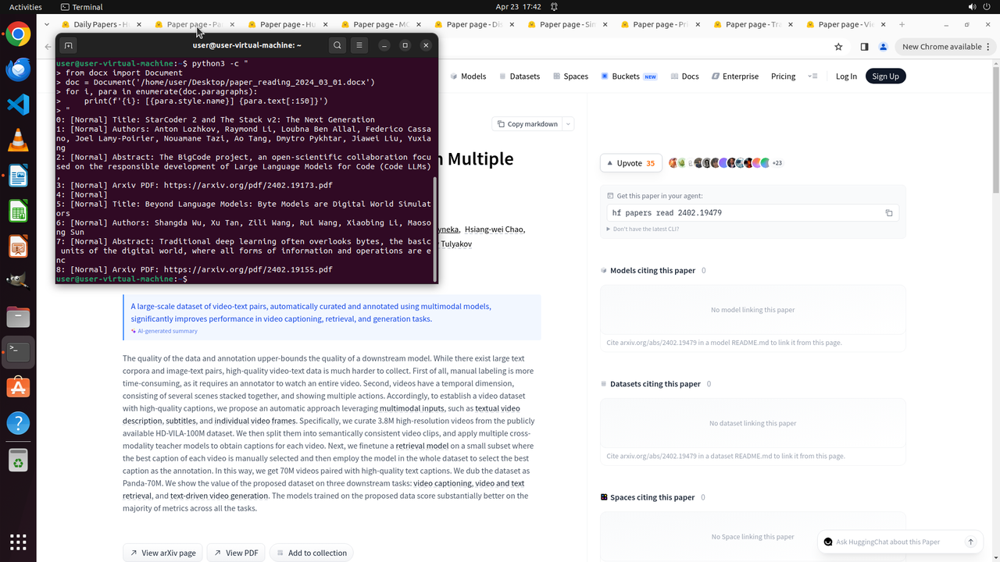

**Response:**
```
Now I can see the document structure. It has:
- 0: Title (paper 1)
- 1: Authors (paper 1)
- 2: Abstract (paper 1)
- 3: Arxiv PDF (paper 1)
- 4: Empty line
- 5: Title (paper 2)
- 6: Authors (paper 2)
- 7: Abstract (paper 2)
- 8: Arxiv PDF (paper 2)

Each paper has the format:
- `Title: ...`
- `Authors: ...`
- `Abstract: ...`
- `Arxiv PDF: ...`
- Empty line between papers

Now let me write a comprehensive Python script to scrape all the papers from the Hugging Face page and add the missing ones to the document.
```

**Actions:** `import subprocess, shlex; subprocess.run(f'xdotool type --delay 12 -- ' + shlex.quote("cat > /tmp/scrape_papers.py << 'SCRIPT'\nimport req"), shell=True, check=True)
import time; time.sleep(0.05)
impo`

---

## Step 36

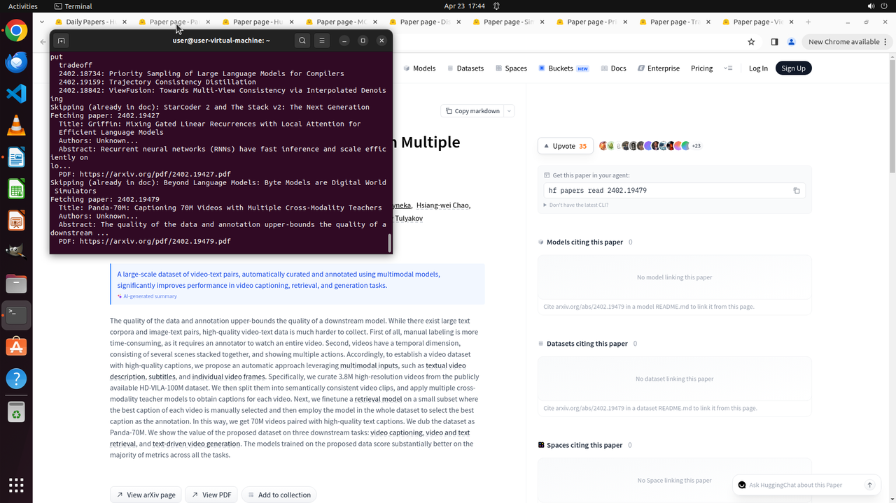

**Response:**
```
I can see the script is running but the authors are showing as "Unknown" because the scraping method for authors isn't working properly. Let me scroll down to see the full output and then fix the script.
```

**Actions:** `pyautogui.scroll(-5, 450, 300)`

---

## Step 37


**Response:**
```
The script added 9 papers but the authors are all "Unknown". I need to fix the author extraction. The Hugging Face paper pages load authors dynamically with JavaScript, so I need a different approach. Let me scrape the author information from the arxiv pages instead, which have static HTML.
```

**Actions:** `import subprocess, shlex; subprocess.run(f'xdotool type --delay 12 -- ' + shlex.quote("cat > /tmp/fix_authors.py << 'SCRIPT'\nimport reque"), shell=True, check=True)
import time; time.sleep(0.05)
impo`

---

## Step 38

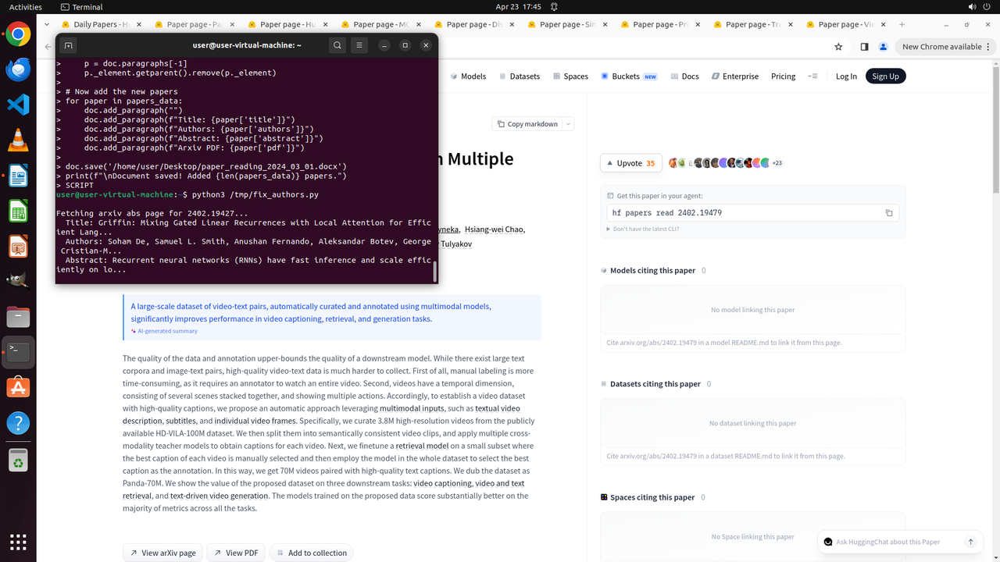

**Response:**
```
The script is now working and getting proper author names from arxiv. I can see the Griffin paper is being fetched with correct authors. Let me wait for it to finish processing all papers.
```

**Actions:** `time.sleep(0.5)`

---

## Step 39

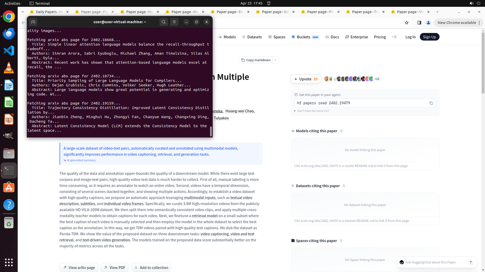

**Response:**
```
The script is making progress. I can see it's fetching papers with proper authors and abstracts now. Let me wait for it to complete.
```

**Actions:** `time.sleep(0.5)`

---

## Step 40

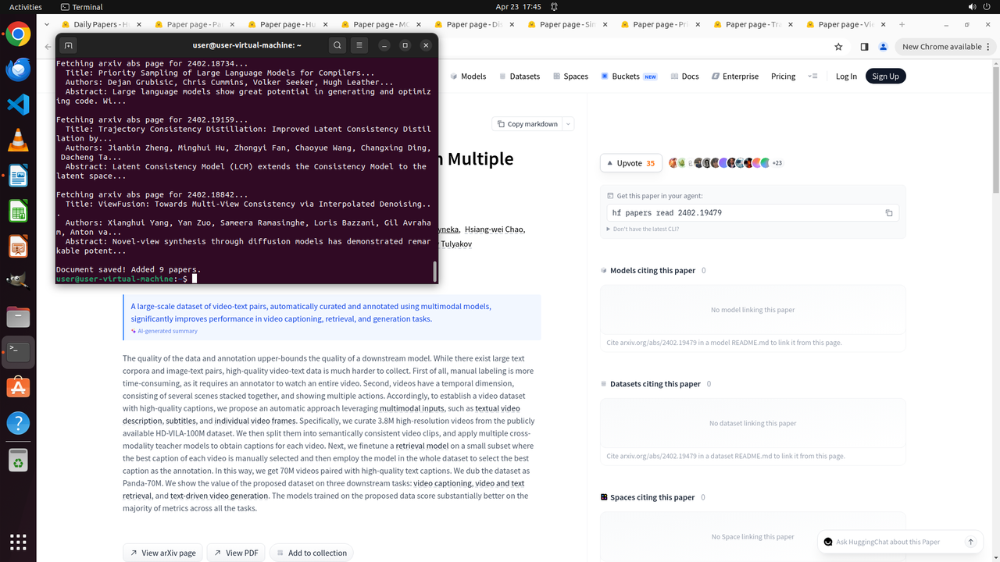

**Response:**
```
The script has completed successfully and added 9 papers to the document. Now let me verify the document content to make sure everything looks correct.
```

**Actions:** `import subprocess, shlex; subprocess.run(f'xdotool type --delay 12 -- ' + shlex.quote('python3 -c "\nfrom docx import Document\ndoc = Docum'), shell=True, check=True)
import time; time.sleep(0.05)
imp`

---

## Step 41

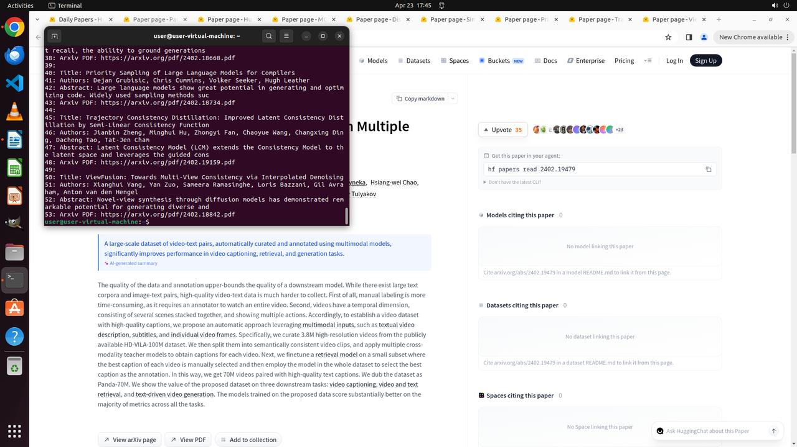

**Response:**
```
I can see the document now has all 11 papers (2 original + 9 new). Let me scroll up to verify the full structure from the beginning.
```

**Actions:** `pyautogui.scroll(10, 450, 300)`

---

## Step 42


**Response:**
```
I can see the document is well-structured with all papers. Let me scroll up more to see the beginning of the document.
```

**Actions:** `pyautogui.scroll(10, 450, 300)`

---

## Step 43


**Response:**
```
I can see the document is now properly structured with all 11 papers. Let me verify the format matches the original:

- Paper 1 (0-3): StarCoder 2 - Title, Authors, Abstract, Arxiv PDF ✓
- Blank line (4) ✓
- Paper 2 (5-8): Beyond Language Models - Title, Authors, Abstract, Arxiv PDF ✓
- Blank line (9) ✓
- Paper 3 (10-13): Griffin - Title, Authors, Abstract, Arxiv PDF ✓
- And so on...

Now I need to check if the PDF links use `.pdf` extension. Looking at the original format, the existing papers use `https://arxiv.org/pdf/2402.19173.pdf` and `https://arxiv.org/pdf/2402.19155.pdf`. My new papers also follow this format. 

However, I notice the existing document had the Arxiv PDF links ending with `.pdf`. Let me verify the format is consistent. Let me also check if the Panda-70M title on Hugging Face matches what arxiv has. Let me also look at the original document more closely to see if there's a `.pdf` at the end or not.

Looking at the output:
- Line 3: `Arxiv PDF: https://arxiv.org/pdf/2402.19173.pdf` ✓
- Line 8: `Arxiv PDF: https://arxiv.org/pdf/2402.19155.pdf` ✓
- Line 13: `Arxiv PDF: https://arxiv.org/pdf/2402.19427.pdf` ✓

The format is consistent. Now let me also check whether the Panda-70M paper title from arxiv is the full title. Let me now check the document looks correct by opening it in LibreOffice. But first, let me verify the document has the correct number of papers and the Arxiv PDF format matches.

The document looks good! Now let me check if there are any issues with the formatting by looking at the existing document's format more carefully. Let me check if the existing PDF links have `.pdf` extension.

Looking at the original entries:
- `https://arxiv.org/pdf/2402.19173.pdf` - has `.pdf`

And my new entries also have `.pdf`. The format is consistent. 

However, I notice that I should double-check the Panda-70M paper title. The HuggingFace page shows "Panda-70M: Captioning 70M Videos with Multiple Cross-Modality Teachers" but the arxiv page might have a slightly different title. Let me verify by checking the full output of the title.

Let me now open the document in LibreOffice to visually verify everything looks correct.
```

**Actions:** `pyautogui.click(33, 337)`

---

## Step 44

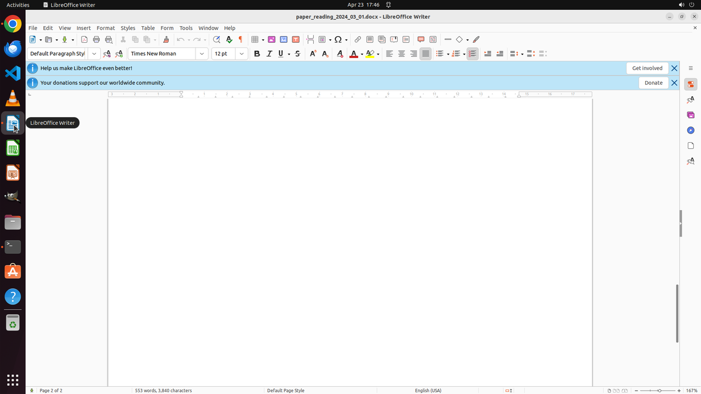

**Response:**
```
The document is open in LibreOffice Writer and it says "Page 2 of 2" with 553 words, 3,840 characters. It seems to be showing a blank page 2. Let me scroll up to see the content from the beginning.
```

**Actions:** `pyautogui.keyDown('ctrl')
pyautogui.keyDown('home')
pyautogui.keyUp('home')
pyautogui.keyUp('ctrl')`

---

## Step 45

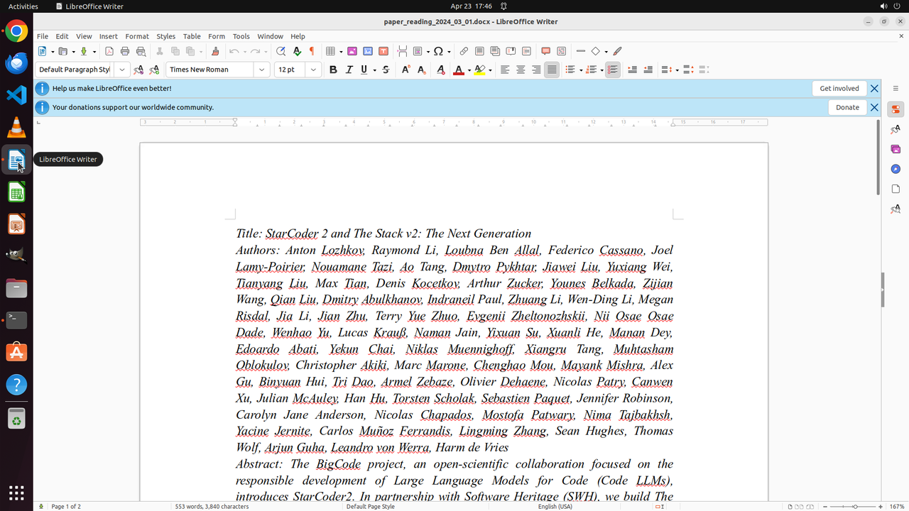

**Response:**
```
I can see the document is now showing the first paper "StarCoder 2 and The Stack v2: The Next Generation" with proper formatting. However, I notice the text has red underlines (spell check). The format looks correct with Title, Authors, Abstract, and Arxiv PDF. Let me scroll down to check the rest of the document and verify all papers are properly formatted.
```

**Actions:** `pyautogui.scroll(-15, 960, 600)`

---

## Step 46


**Response:**
```
I can see the first two papers are intact with proper formatting. The Arxiv PDF link for the first paper is a hyperlink. Now let me scroll down to see the newly added papers.
```

**Actions:** `pyautogui.scroll(-15, 960, 600)`

---

## Step 47

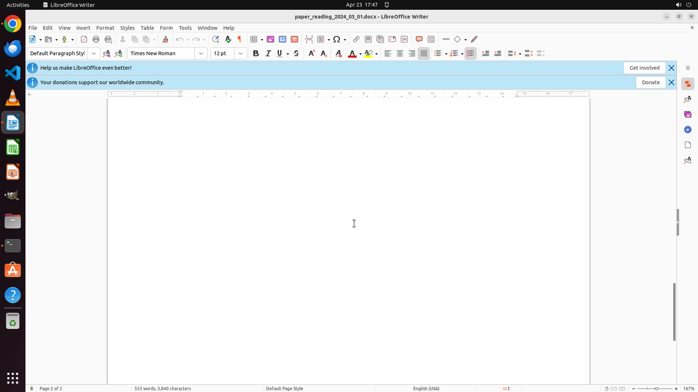

**Response:**
```
I see page 2 is blank. It seems the document only has 2 pages and the new papers might not have been added properly, or there's a page break issue. Wait - the document says "553 words, 3,840 characters" which seems too few for 11 papers. Let me check the document structure again. It seems the document may still be showing the old version since LibreOffice had it open while the Python script modified it. Let me close and reopen it.
```

**Actions:** `pyautogui.keyDown('ctrl')
pyautogui.keyDown('w')
pyautogui.keyUp('w')
pyautogui.keyUp('ctrl')`

---

## Step 48

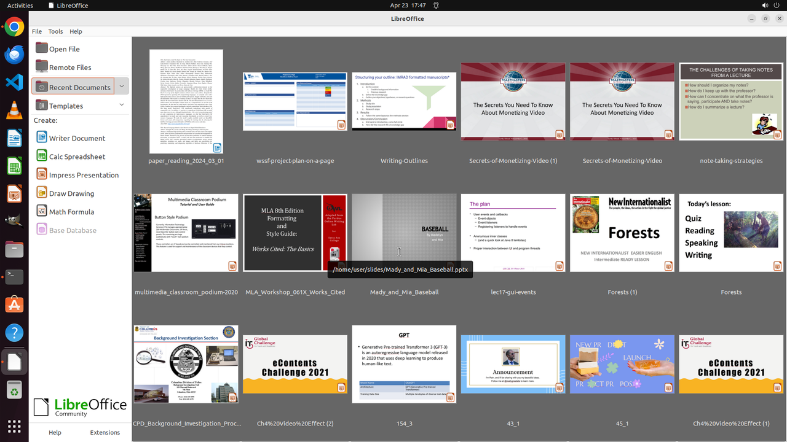

**Response:**
```
I see LibreOffice Start Center. The file was closed. The issue is that when LibreOffice had the file open, the Python script couldn't properly modify it. Let me reopen the file and check if the changes were saved.
```

**Actions:** `pyautogui.doubleClick(454, 270)`

---

## Step 49

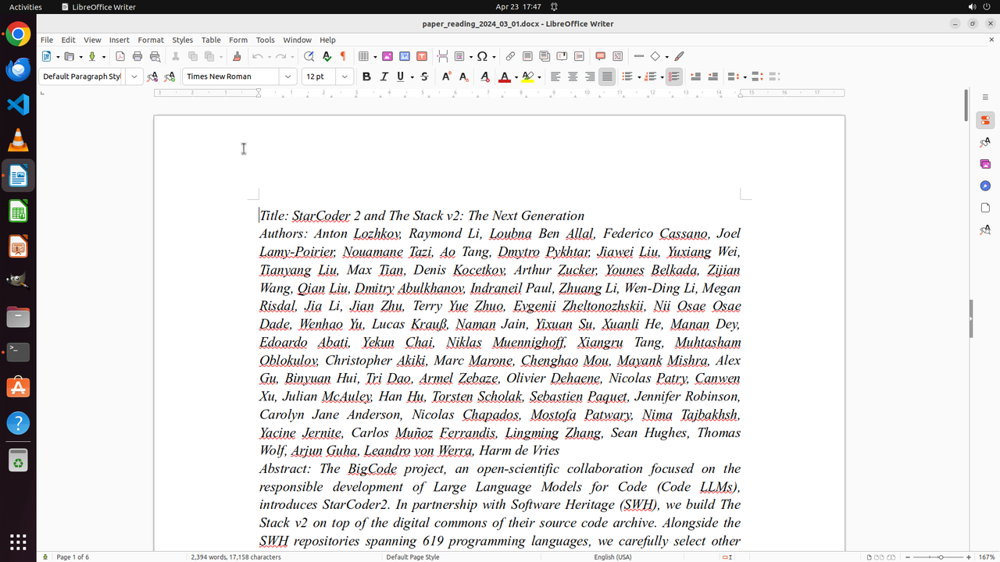

**Response:**
```
Now I can see the document has been updated. It shows "Page 1 of 6" and "2,394 words, 17,158 characters" which indicates all the papers have been added. The first paper "StarCoder 2 and The Stack v2: The Next Generation" is showing correctly. Let me scroll down to verify the rest of the papers.
```

**Actions:** `pyautogui.scroll(-20, 960, 600)`

---

## Step 50

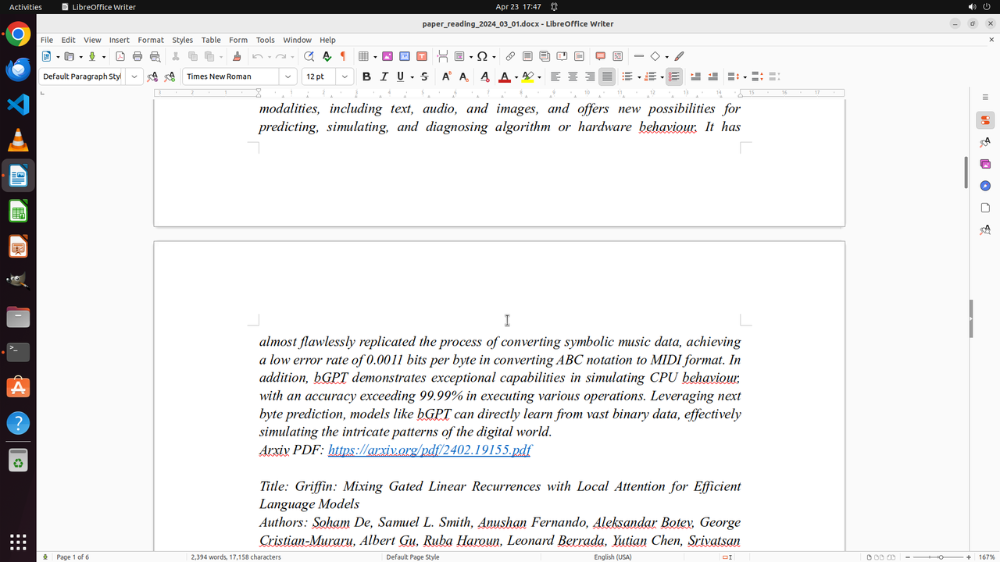

**Response:**
```
I can see the document is looking good. The second paper "Beyond Language Models" ends with the Arxiv PDF link, then the third paper "Griffin: Mixing Gated Linear Recurrences with Local Attention for Efficient Language Models" starts with the proper format. Let me continue scrolling to check all papers.
```

**Actions:** `pyautogui.scroll(-20, 960, 600)`

---

## Step 51

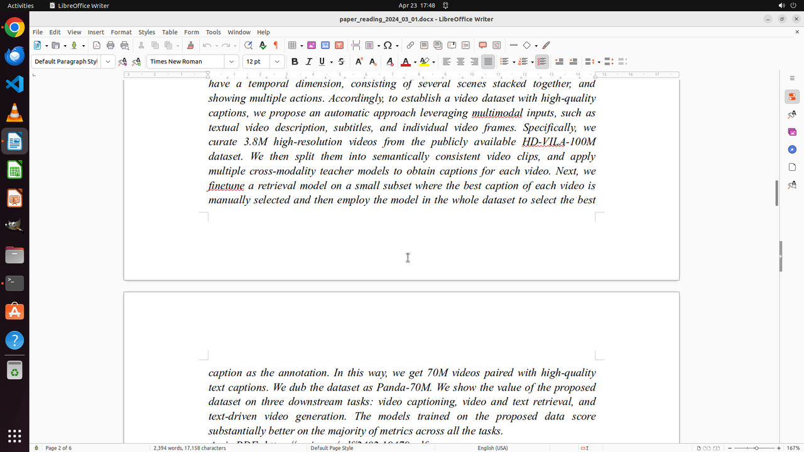

**Response:**
```
I can see the Panda-70M paper's abstract is being displayed properly. Let me continue scrolling to verify all papers.
```

**Actions:** `pyautogui.scroll(-20, 960, 600)`

---

## Step 52

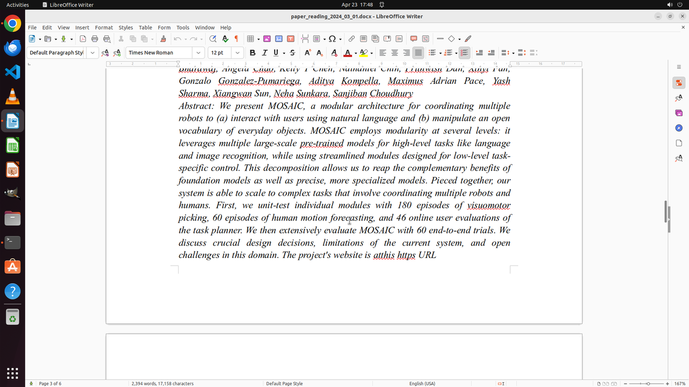

**Response:**
```
I can see the MOSAIC paper with its authors and abstract. The format looks correct. Let me continue scrolling to see the rest of the papers.
```

**Actions:** `pyautogui.scroll(-20, 960, 600)`

---

## Step 53

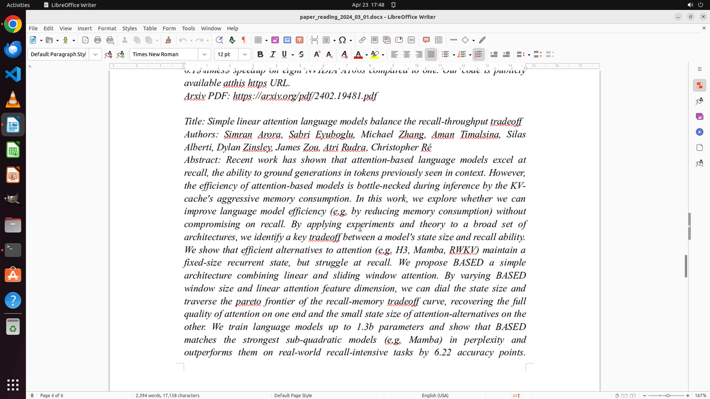

**Response:**
```
I can see the DistriFusion paper's PDF link and the "Simple linear attention" paper with its authors and abstract. The format is consistent. Let me continue scrolling.
```

**Actions:** `pyautogui.scroll(-20, 960, 600)`

---

## Step 54

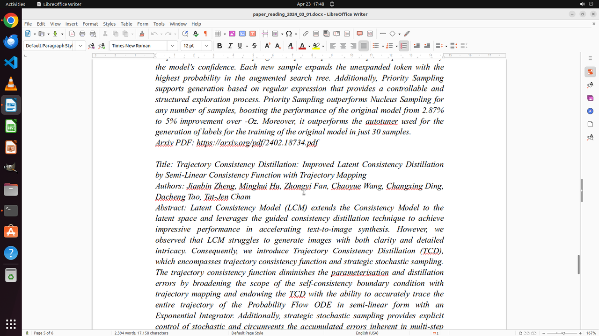

**Response:**
```
I can see the Priority Sampling paper and the Trajectory Consistency Distillation paper. The format is correct. Let me scroll down to see the last paper (ViewFusion).
```

**Actions:** `pyautogui.scroll(-20, 960, 600)`

---

## Step 55


**Response:**
```
I can see the last paper "ViewFusion" with its abstract and Arxiv PDF link (https://arxiv.org/pdf/2402.18842.pdf). The document is now complete with all 11 papers (2 original + 9 new) on 6 pages. 

The format is consistent throughout:
- Title: [paper title]
- Authors: [list of authors]
- Abstract: [abstract text]
- Arxiv PDF: [link]
- (blank line between papers)

Now I need to save the document. Let me press Ctrl+S to save.
```

**Actions:** `pyautogui.keyDown('ctrl')
pyautogui.keyDown('s')
pyautogui.keyUp('s')
pyautogui.keyUp('ctrl')`

---

## Step 56

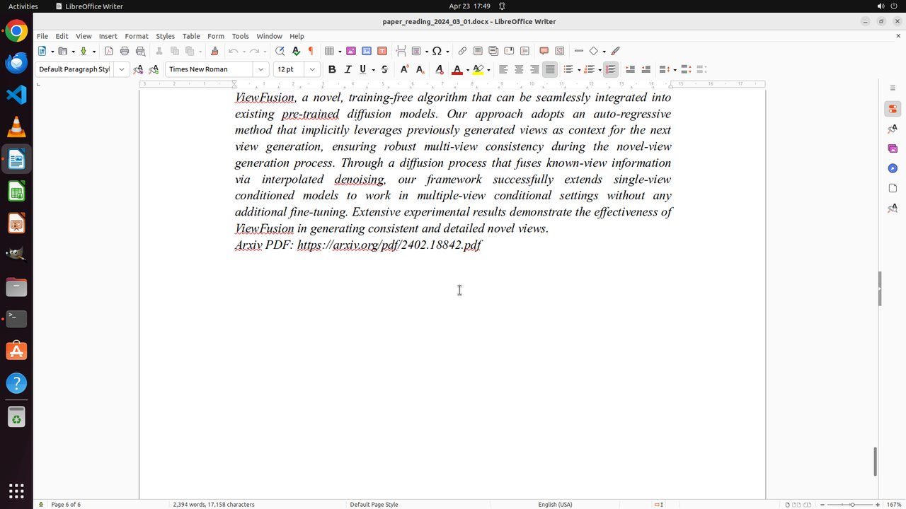

**Response:**
```
The document has been saved (it kept the .docx format since there was no format dialog). The document now contains all 11 papers from the Hugging Face daily papers list for March 1, 2024, with the following information for each:

1. **StarCoder 2 and The Stack v2: The Next Generation** (original)
2. **Beyond Language Models: Byte Models are Digital World Simulators** (original)
3. **Griffin: Mixing Gated Linear Recurrences with Local Attention for Efficient Language Models** (new)
4. **Panda-70M: Captioning 70M Videos with Multiple Cross-Modality Teachers** (new)
5. **Humanoid Locomotion as Next Token Prediction** (new)
6. **MOSAIC: Modular Foundation Models for Assistive and Interactive Cooking** (new)
7. **DistriFusion: Distributed Parallel Inference for High-Resolution Diffusion Models** (new)
8. **Simple linear attention language models balance the recall-throughput tradeoff** (new)
9. **Priority Sampling of Large Language Models for Compilers** (new)
10. **Trajectory Consistency Distillation** (new)
11. **ViewFusion: Towards Multi-View Consistency via Interpolated Denoising** (new)

Each paper has Title, Authors, Abstract, and Arxiv PDF link in the same format as the original two papers.

DONE
```

**Actions:** `DONE`

---
