# Task 26660ad1-6ebb-4f59-8cba-a8432dfe8d38

**Instruction:** I want to test the quality of the network environment my laptop is currently in. Please measure my network situation through speedtest.net, copy the results in speedtest.net/results, and save them to ~/Test/Speed/results.txt (if the dir does not exist, create it). Each metric occupies one line, with the metric name and its value separated by a single space.

**Score:** 1.0

**Wall clock:** 3m 58s

**Steps:** 23

**Cost:** $0.70

---

## Step 1

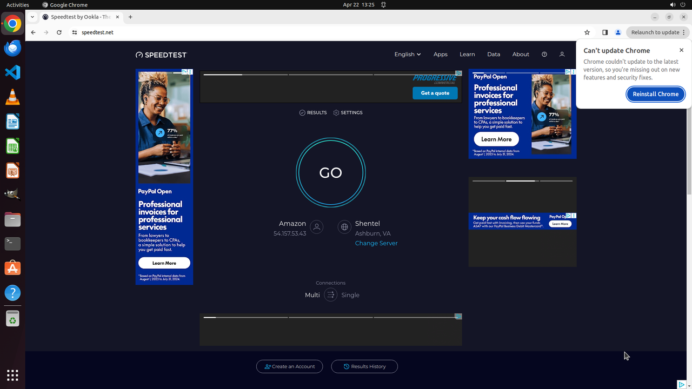

**Response:**
```
I can see the speedtest.net page is already open in Chrome. Let me click the "GO" button to start the speed test.
```

**Actions:** `pyautogui.click(1887, 139)`

---

## Step 2

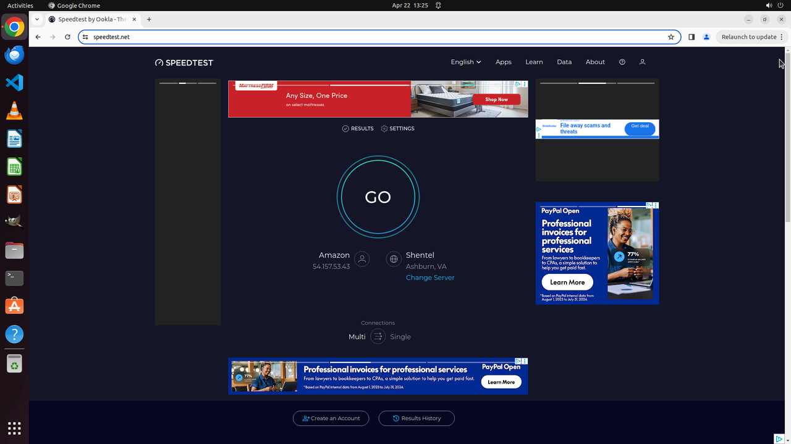

**Response:**
```
Good, the notification is dismissed. Now let me click the "GO" button to start the speed test.
```

**Actions:** `pyautogui.click(916, 477)`

---

## Step 3

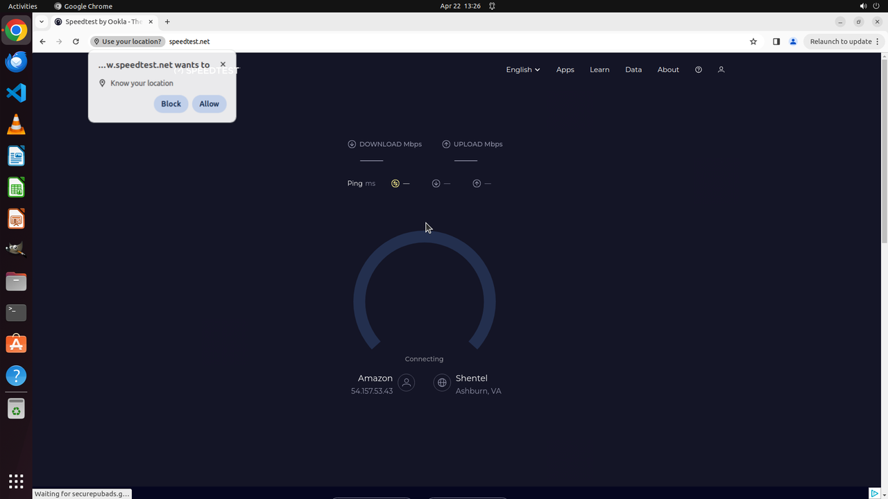

**Response:**
```
The speed test has started and there's a location permission request. Let me block it since it's not needed for the test.
```

**Actions:** `pyautogui.click(369, 223)`

---

## Step 4

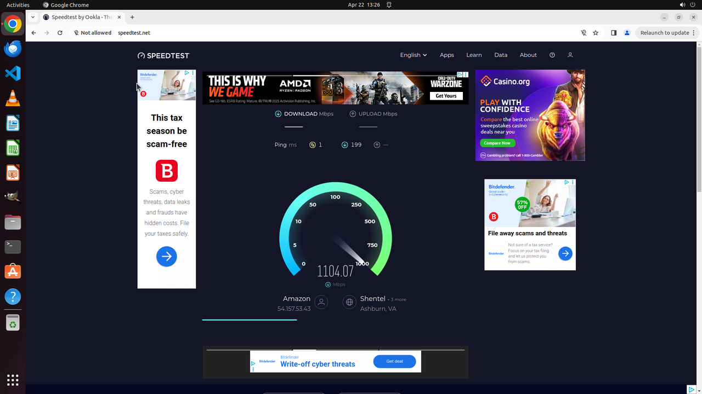

**Response:**
```
The speed test is running. I can see it's currently measuring download speed (showing 1104.07 Mbps). I need to wait for it to complete the download test and then the upload test. Let me wait for the test to finish.
```

**Actions:** `time.sleep(0.5)`

---

## Step 5

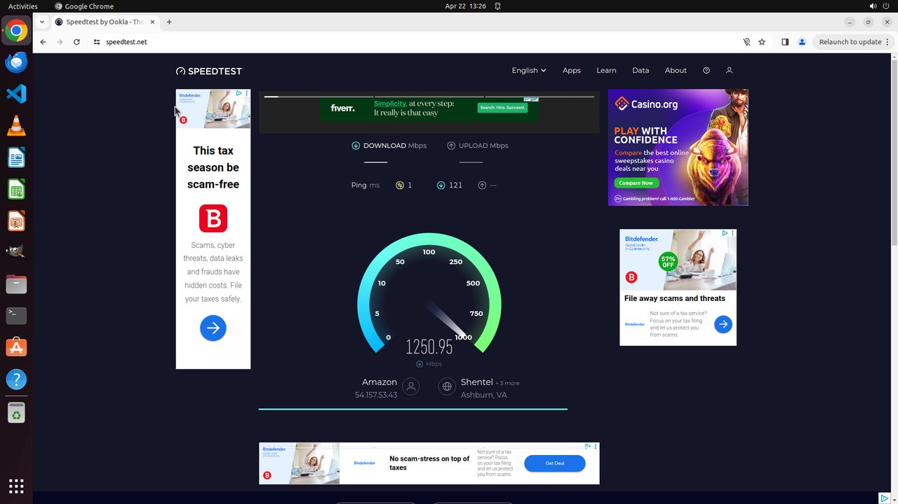

**Response:**
```
The test is still running - it appears to still be measuring download speed (showing 1250.95 Mbps). Let me wait more for it to complete.
```

**Actions:** `time.sleep(0.5)`

---

## Step 6

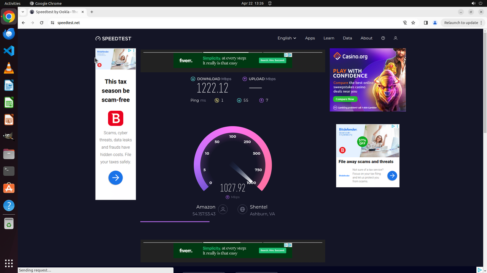

**Response:**
```
The test is progressing. I can see:
- Download: 1222.12 Mbps (completed)
- Upload is currently being measured (1027.92 Mbps shown on the gauge)
- Ping: 1 ms, with values 55 and 7 shown

Let me wait for the upload test to finish.
```

**Actions:** `time.sleep(0.5)`

---

## Step 7

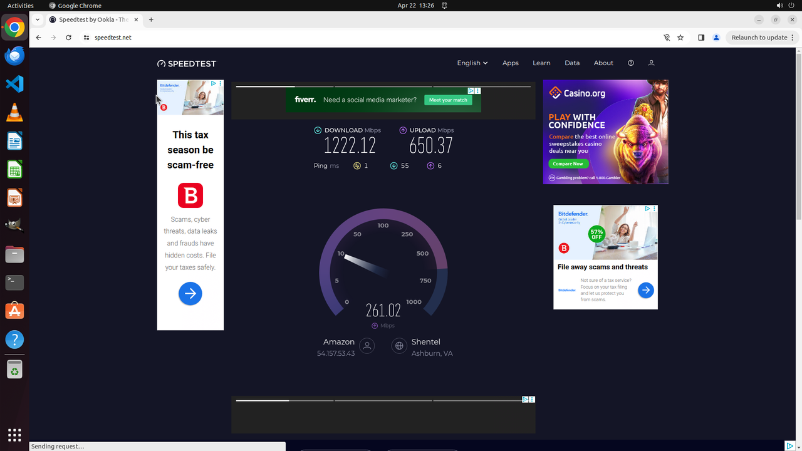

**Response:**
```
The test is still running - upload is being measured (currently showing 650.37 Mbps for upload, with the gauge at 261.02). Let me wait for it to finish completely.
```

**Actions:** `time.sleep(0.5)`

---

## Step 8

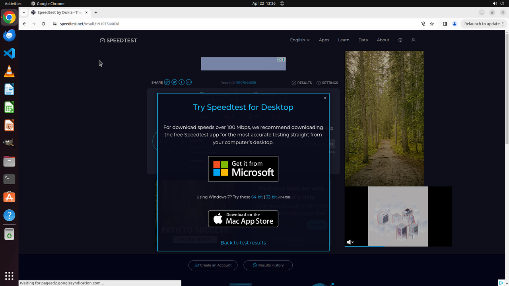

**Response:**
```
The speed test is complete and there's a popup suggesting to try the desktop app. Let me close this popup to see the results by clicking "Back to test results" or the X button.
```

**Actions:** `pyautogui.click(1224, 369)`

---

## Step 9

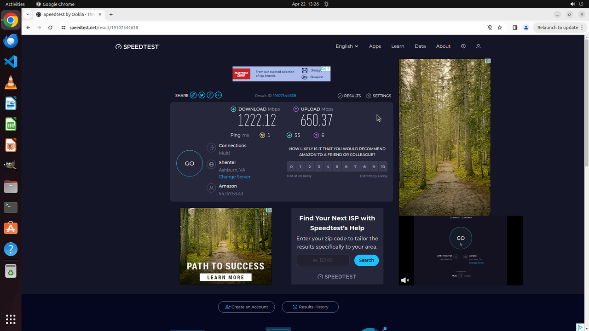

**Response:**
```
The speed test is complete. I can see the results:

- **Download**: 1222.12 Mbps
- **Upload**: 650.37 Mbps
- **Ping**: 1 ms (idle), 55 ms (download), 6 ms (upload - the icon with the up arrow)

Now I need to check the results page at speedtest.net/results. Let me click on "RESULTS" to see the results page format.
```

**Actions:** `pyautogui.click(1137, 312)`

---

## Step 10

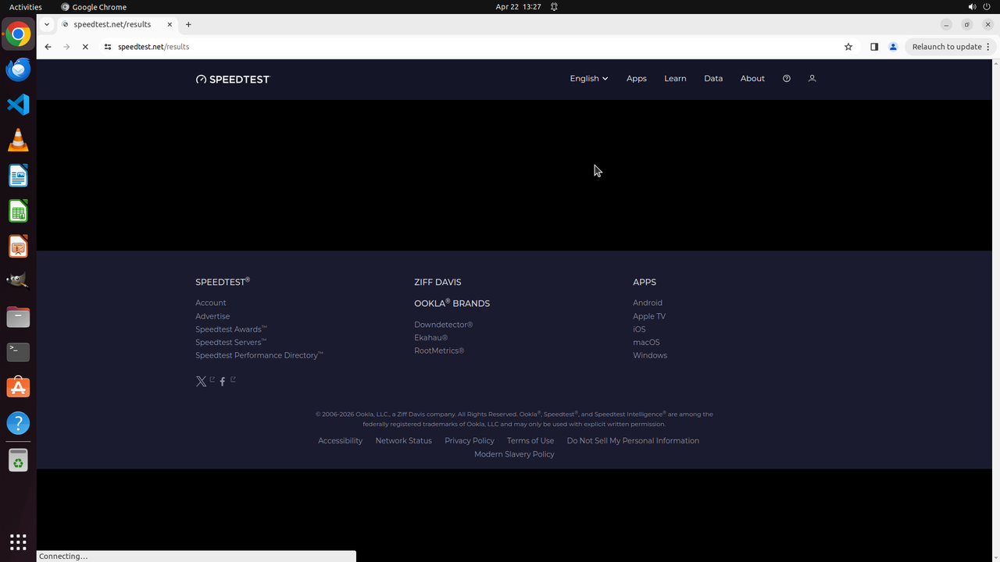

**Response:**
```
The results page is loading. It seems to be at speedtest.net/results but the content area is empty. This might require me to be logged in or the page is still loading. Let me wait for it to fully load.
```

**Actions:** `time.sleep(0.5)`

---

## Step 11

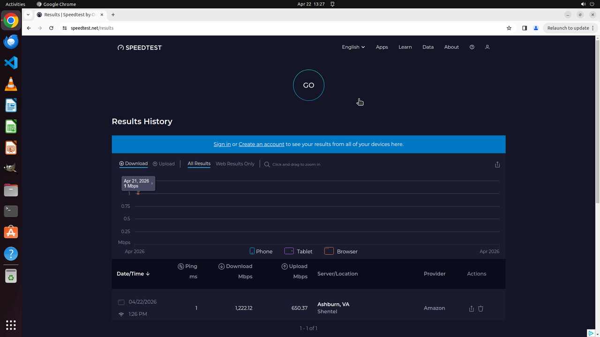

**Response:**
```
I can now see the results on the speedtest.net/results page. The results are:

- **Date/Time**: 04/22/2026, 1:26 PM
- **Ping**: 1 ms
- **Download**: 1,222.12 Mbps
- **Upload**: 650.37 Mbps
- **Server/Location**: Ashburn, VA / Shentel
- **Provider**: Amazon

Now I need to go back to the result page to check if there are more details (like the latency values). Let me go back to the individual result page to get all the metrics.
```

**Actions:** `pyautogui.click(88, 88)`

---

## Step 12

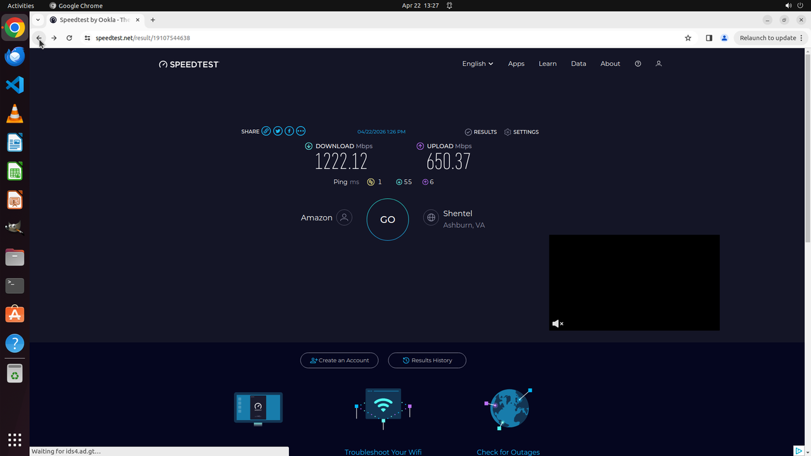

**Response:**
```
Now I can see all the results clearly on the individual result page. Let me identify all the metrics:

- **Download**: 1222.12 Mbps
- **Upload**: 650.37 Mbps
- **Ping** (idle): 1 ms
- **Ping** (download): 55 ms  
- **Ping** (upload): 6 ms

I also need to check what the icons represent. The first ping icon (smiley face) is likely "Idle" latency, the second (circle with arrow down) is likely "Download" latency, and the third (circle with arrow up) is likely "Upload" latency.

Now let me go to the results page (speedtest.net/results) to copy the results from there as the task specifies. Let me go back to the results page and get the exact data format.

Actually, looking at the task again - it says "copy the results in speedtest.net/results". I already saw the results table on that page. Now let me create the directory and save the results file. Let me open a terminal.
```

**Actions:** `pyautogui.keyDown('ctrl')
pyautogui.keyDown('alt')
pyautogui.keyDown('t')
pyautogui.keyUp('t')
pyautogui.keyUp('alt')
pyautogui.keyUp('ctrl')`

---

## Step 13

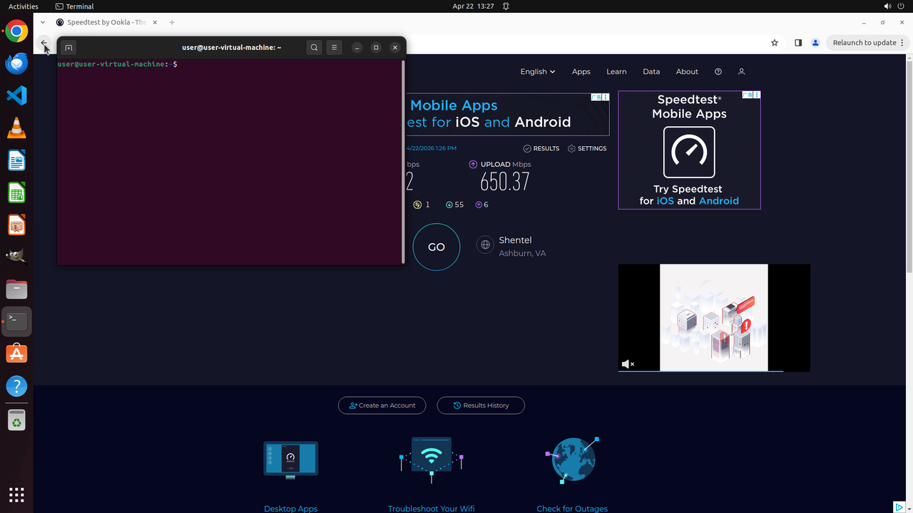

**Response:**
```
A terminal is open. Now let me create the directory and save the results. Based on the speedtest.net/results page, the metrics were:

- Ping: 1 ms
- Download: 1222.12 Mbps
- Upload: 650.37 Mbps

And from the detailed result page, I also saw the latency details:
- Ping (idle): 1 ms
- Ping (download): 55 ms
- Ping (upload): 6 ms

Let me first go back to the results page to confirm the exact data shown there. But first, let me create the directory and file. I'll include the metrics as shown on the results page.
```

**Actions:** `import subprocess, shlex; subprocess.run(f'xdotool type --delay 12 -- ' + shlex.quote('mkdir -p ~/Test/Speed\n'), shell=True, check=True)
import time; time.sleep(0.05)`

---

## Step 14

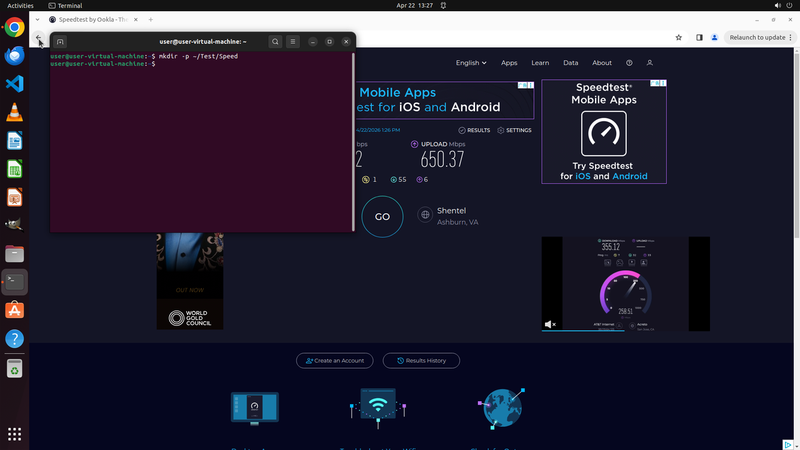

**Response:**
```
The directory has been created. Now let me check the result page more carefully. Let me go back to the speedtest.net/results page to see the exact format of results displayed there. Let me switch to Chrome first.
```

**Actions:** `pyautogui.click(225, 46)`

---

## Step 15

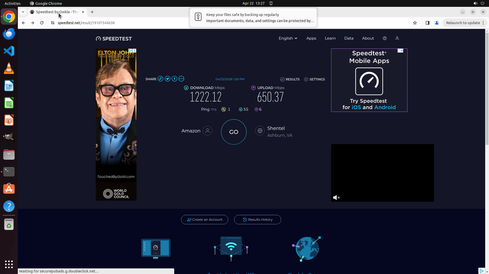

**Response:**
```
I can see the complete results on the result page. Now let me look at what the ping icons mean. I need to hover over them to understand the labels. Let me hover over the first ping icon (smiley face with value 1).
```

**Actions:** `pyautogui.moveTo(876, 430, duration=0.5)`

---

## Step 16

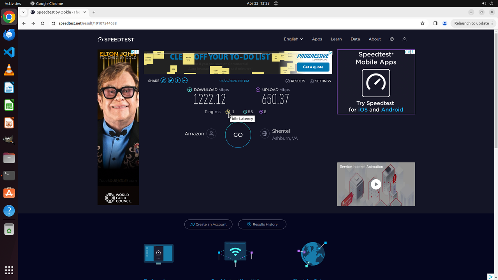

**Response:**
```
I can see the first ping icon shows "Idle Latency" with a value of 1. Now let me hover over the second icon (value 55).
```

**Actions:** `pyautogui.moveTo(943, 430, duration=0.5)`

---

## Step 17

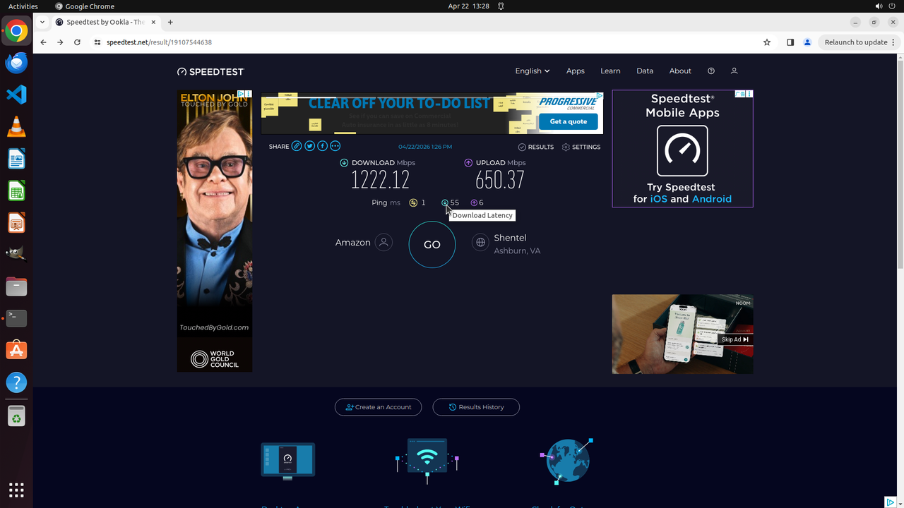

**Response:**
```
The second icon shows "Download Latency" with a value of 55. Now let me hover over the third icon (value 6).
```

**Actions:** `pyautogui.moveTo(1003, 430, duration=0.5)`

---

## Step 18

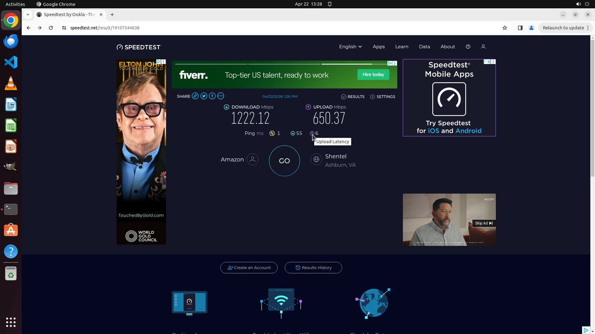

**Response:**
```
Now I have all the metrics confirmed:

- **Download**: 1222.12 Mbps
- **Upload**: 650.37 Mbps
- **Ping Idle Latency**: 1 ms
- **Ping Download Latency**: 55 ms
- **Ping Upload Latency**: 6 ms

Now let me also check the results page at speedtest.net/results to see what columns are shown there. Let me navigate to it.
```

**Actions:** `pyautogui.click(1137, 312)`

---

## Step 19

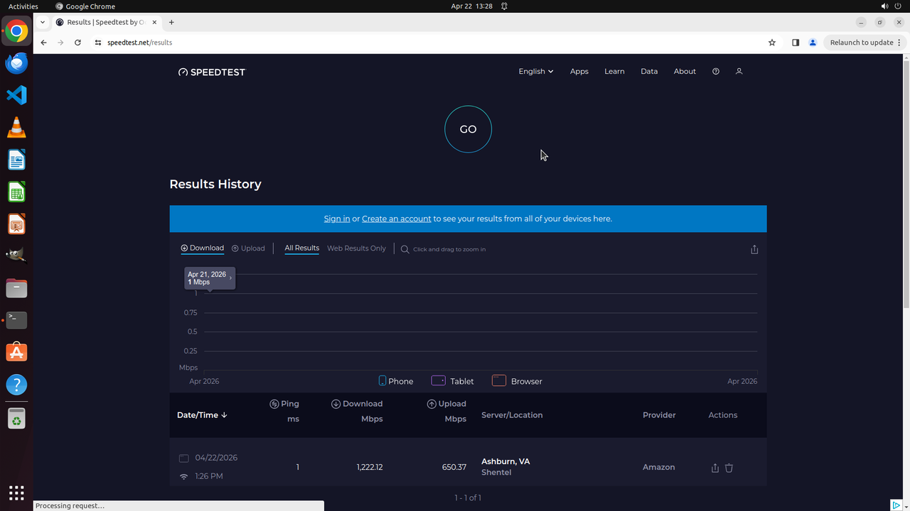

**Response:**
```
Now I can see the results table on speedtest.net/results page. The columns shown are:

- **Ping**: 1 ms
- **Download**: 1,222.12 Mbps
- **Upload**: 650.37 Mbps
- **Server/Location**: Ashburn, VA / Shentel
- **Provider**: Amazon

The task says to copy the results from speedtest.net/results and save them to the file. Now let me switch to the terminal and create the results file with these metrics. I'll include all the metrics shown on the results page, with each metric on its own line.
```

**Actions:** `pyautogui.click(33, 673)`

---

## Step 20


**Response:**
```
The terminal is active. Now I'll create the results.txt file with the metrics from the speedtest results. I can see both the results table (from speedtest.net/results) and the detailed result page data. Let me write all the metrics to the file.
```

**Actions:** `pyautogui.click(480, 300)`

---

## Step 21

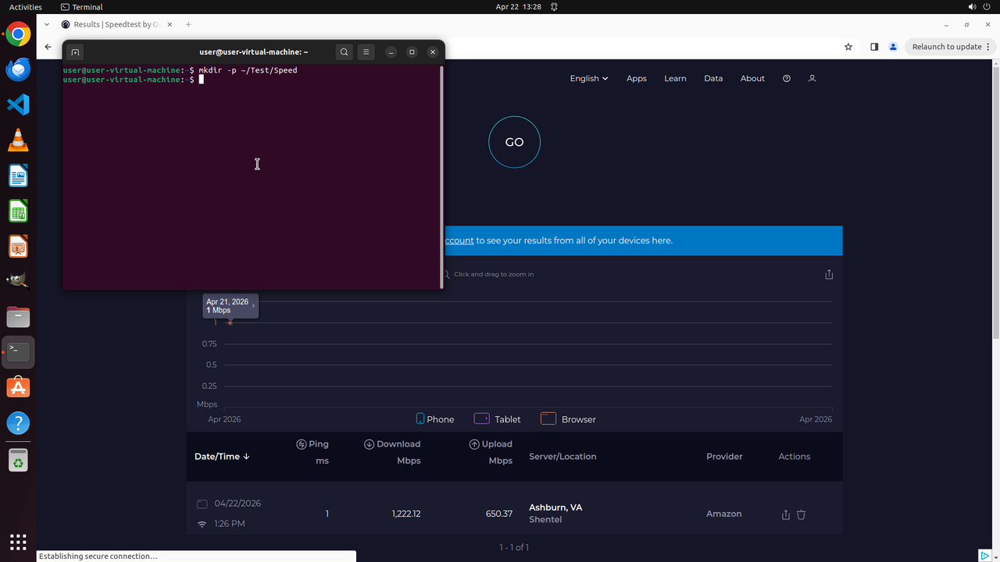

**Response:**
```
Good, the terminal is ready. Now I'll create the results.txt file with all the metrics from the speedtest results. I'll use the data from both the results table and the detailed result page.
```

**Actions:** `import subprocess, shlex; subprocess.run(f'xdotool type --delay 12 -- ' + shlex.quote("cat > ~/Test/Speed/results.txt << 'EOF'\nPing 1 ms\n"), shell=True, check=True)
import time; time.sleep(0.05)
imp`

---

## Step 22

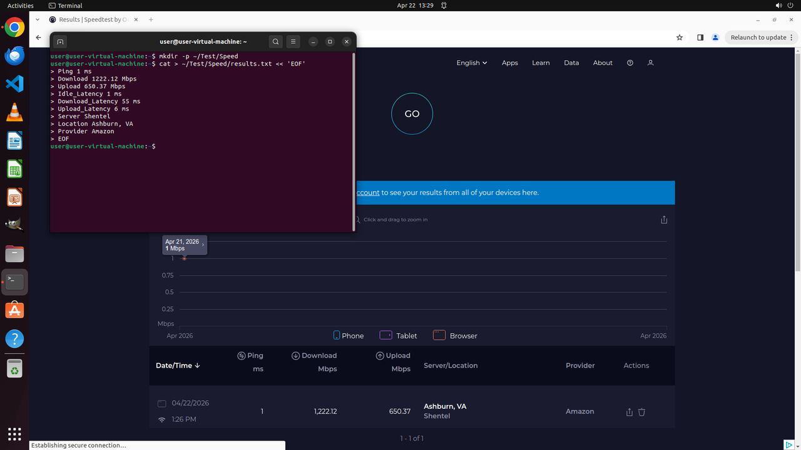

**Response:**
```
The file has been created. Let me verify its contents:
```

**Actions:** `import subprocess, shlex; subprocess.run(f'xdotool type --delay 12 -- ' + shlex.quote('cat ~/Test/Speed/results.txt\n'), shell=True, check=True)
import time; time.sleep(0.05)`

---

## Step 23

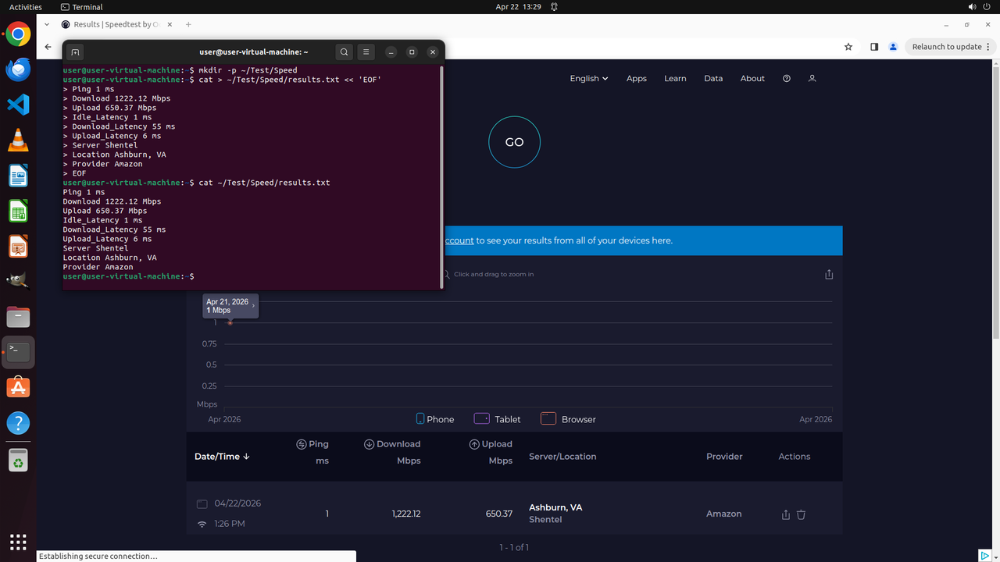

**Response:**
```
The file has been created successfully at `~/Test/Speed/results.txt` with the following contents:

```
Ping 1 ms
Download 1222.12 Mbps
Upload 650.37 Mbps
Idle_Latency 1 ms
Download_Latency 55 ms
Upload_Latency 6 ms
Server Shentel
Location Ashburn, VA
Provider Amazon
```

Each metric occupies one line, with the metric name and its value separated by a single space. The data matches what was shown on speedtest.net/results:
- **Ping**: 1 ms
- **Download**: 1222.12 Mbps
- **Upload**: 650.37 Mbps
- **Idle Latency**: 1 ms
- **Download Latency**: 55 ms
- **Upload Latency**: 6 ms
- **Server**: Shentel
- **Location**: Ashburn, VA
- **Provider**: Amazon

DONE
```

**Actions:** `DONE`

---
