# Task 2c1ebcd7-9c6d-4c9a-afad-900e381ecd5e

**Instruction:** Could you please take a moment to review the 'case study' file located within the 'student work' folder? I'm particularly interested in ensuring that the references section at the end of the document adheres to the APA 7th edition formatting guidelines. Making the necessary adjustments if it turns out that the current formatting does not align with APA 7 standards or exists some errors.

**Score:** 0.9022985848756948

**Wall clock:** 13m 58s

**Steps:** 52

**Cost:** $2.26

---

## Step 1


**Response:**
```
I can see the desktop with a "students work" folder. Let me open it to find the case study file.
```

**Actions:** `pyautogui.doubleClick(1848, 895)`

---

## Step 2

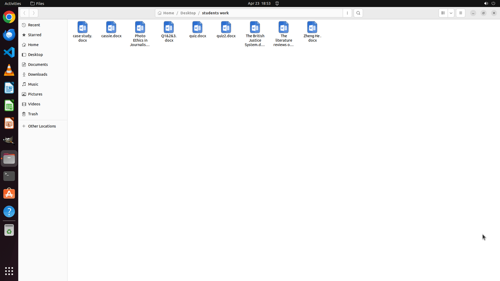

**Response:**
```
I can see the "students work" folder is open and there's a "case study.docx" file. Let me open it.
```

**Actions:** `pyautogui.doubleClick(315, 123)`

---

## Step 3

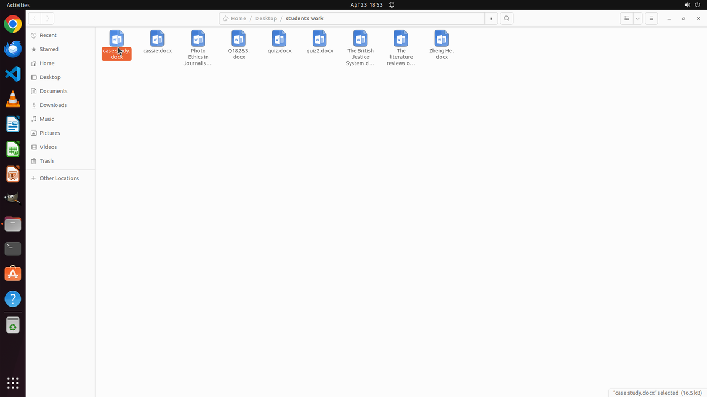

**Response:**
```
The file is selected but hasn't opened yet. Let me wait a moment and then try double-clicking again to open it.
```

**Actions:** `pyautogui.doubleClick(315, 123)`

---

## Step 4

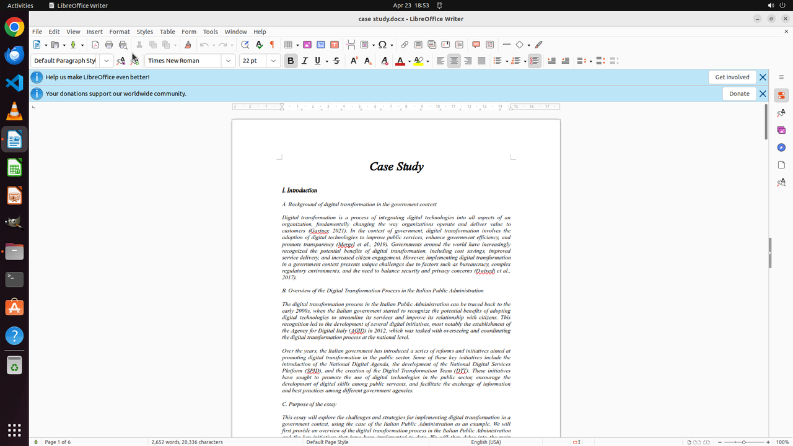

**Response:**
```
The case study document is now open in LibreOffice Writer. I can see it's a 6-page document about digital transformation in the Italian Public Administration. I need to scroll to the end of the document to find the references section. Let me scroll down to the last page.
```

**Actions:** `pyautogui.keyDown('ctrl')
pyautogui.keyDown('end')
pyautogui.keyUp('end')
pyautogui.keyUp('ctrl')`

---

## Step 5

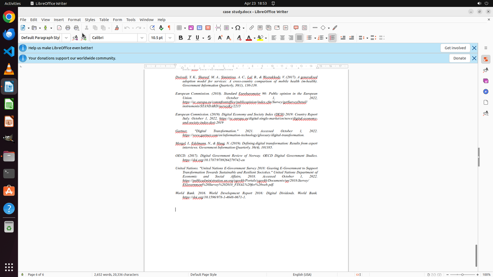

**Response:**
```
I can see the references section at the end of the document. Let me scroll up a bit to see the beginning of the references section to get a complete view.
```

**Actions:** `pyautogui.scroll(5, 960, 600)`

---

## Step 6


**Response:**
```
Now I can see the complete references section. Let me carefully analyze each reference for APA 7th edition formatting issues. Let me first read through all the references carefully.

The references I can see are:

1. **Datta, P. (2020).** Digital Transformation of the Italian Public Administration: A Case Study. Communications of the Association for Information Systems, Teaching Case, ISSN: 1529-3181. DOI: 10.17705/1CAIS.04611

2. **Dwivedi, Y. K., Shareef, M. A., Simintiras, A. C., Lal, B., & Weerakkody, V. (2017).** A generalised adoption model for services: A cross-country comparison of mobile health (m-health). Government Information Quarterly, 30(1), 130-139.

3. **European Commission. (2018).** Standard Eurobarometer 90: Public opinion in the European Union. October 1, 2022. https://...

4. **European Commission. (2019).** Digital Economy and Society Index (DESI) 2019: Country Report Italy. October 1, 2022. https://...

5. **Gartner.** "Digital Transformation." 2021. Accessed October 1, 2022. https://...

6. **Mergel, I., Edelmann, N., & Haug, N. (2019).** Defining digital transformation: Results from expert interviews. Government Information Quarterly, 36(4), 101385.

7. **OECD. (2017).** Digital Government Review of Norway. OECD Digital Government Studies. https://doi.org/10.1787/9789264279742-en

8. **United Nations.** "United Nations E-Government Survey 2018:..." 2018. Accessed October 1, 2022. https://...

9. **World Bank. 2016.** World Development Report 2016: Digital Dividends. World Bank. https://doi.org/10.1596/978-1-4648-0671-1.

Now let me identify the APA 7 issues:

1. **Reference 1 (Datta)**: "DOI: 10.17705/1CAIS.04611" should be formatted as "https://doi.org/10.17705/1CAIS.04611". ISSN shouldn't be included in APA 7. Also "Teaching Case" is unusual.

2. **Reference 3 (European Commission, 2018)**: "October 1, 2022" appears as an accessed date in the middle - APA 7 doesn't use "Accessed" dates for reports, but for webpages it's not typically needed unless content may change.

3. **Reference 5 (Gartner)**: Not in APA 7 format - should be: Gartner. (2021). *Digital transformation*. Retrieved October 1, 2022, from https://...

4. **Reference 8 (United Nations)**: Same issue as Gartner - not in APA format.

5. **Reference 9 (World Bank)**: "World Bank. 2016." should be "World Bank. (2016)."

Let me use the terminal to examine the document more precisely and make the edits. Let me use Find & Replace to make the corrections systematically.

Let me start by using the macro approach to read and fix the text. First, let me use Find & Replace for the corrections.

Let me start editing. I'll use Find & Replace (Ctrl+H) for systematic changes.

First, let me fix the Gartner reference. Let me click on it first.
```

**Actions:** `pyautogui.click(682, 757)`

---

## Step 7

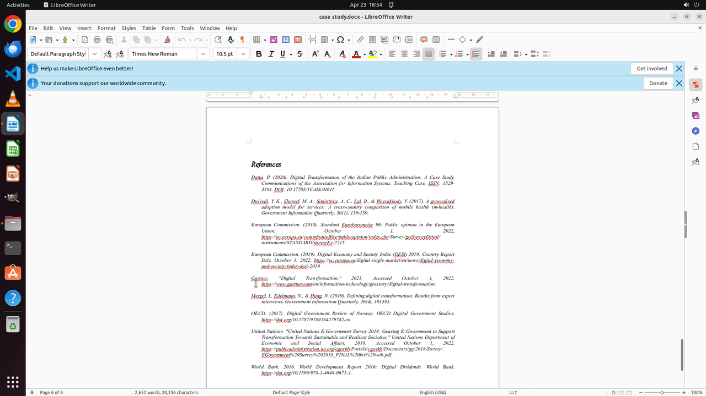

**Response:**
```
Now I can see all the references. Let me analyze each one for APA 7th edition compliance and identify the issues:

1. **Datta (2020)**: Has "ISSN: 1529-3181" (should not include ISSN in APA 7) and "DOI: 10.17705/1CAIS.04611" (should be formatted as "https://doi.org/10.17705/1CAIS.04611")

2. **Dwivedi et al. (2017)**: Looks mostly correct but need to verify formatting details.

3. **European Commission (2018)**: Has "October 1, 2022" as accessed date inline - for APA 7, website sources should use "Retrieved [date], from [URL]" format.

4. **European Commission (2019)**: Same issue with accessed date format.

5. **Gartner (2021)**: Not in APA 7 format - uses quotation marks around title and "Accessed" instead of proper APA format. Should be: Gartner. (2021). *Digital transformation*. Retrieved October 1, 2022, from https://...

6. **Mergel et al. (2019)**: Looks correct for APA 7.

7. **OECD (2017)**: Looks mostly correct.

8. **United Nations (2018)**: Uses quotation marks around title and "Accessed" - should use APA 7 format.

9. **World Bank (2016)**: Year not in parentheses - "World Bank. 2016." should be "World Bank. (2016)."

Let me use the terminal/macro approach to make precise edits. Let me open a terminal to use a Python script to examine and fix the document more precisely.

Actually, let me work directly in LibreOffice Writer. I'll use Find & Replace for the systematic changes. Let me start with the first reference.

Let me use the macro editor to make precise changes. First, let me use Tools > Macros.

Actually, it will be more reliable to edit directly. Let me start with the first reference - the Datta reference. I need to select and edit the ISSN and DOI part.
```

**Actions:** `pyautogui.keyDown('ctrl')
pyautogui.keyDown('h')
pyautogui.keyUp('h')
pyautogui.keyUp('ctrl')`

---

## Step 8

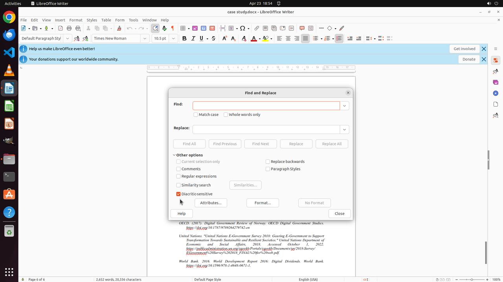

**Response:**
```
The Find and Replace dialog is open. Let me start fixing the references one by one.

**Fix 1: Datta reference - Remove ISSN and fix DOI format**

First, let me fix the DOI format in the Datta reference. The "ISSN: 1529-3181. DOI: 10.17705/1CAIS.04611" should be changed to just "https://doi.org/10.17705/1CAIS.04611"
```

**Actions:** `pyautogui.click(1021, 402)`

---

## Step 9


**Response:**
```
Let me start with the first fix. I'll search for the ISSN and DOI portion of the Datta reference and replace it with the correct APA 7 format.
```

**Actions:** `pyautogui.click(1021, 402)`

---

## Step 10


**Response:**
```
Let me close this dialog and instead work directly by editing the text. It'll be easier to use a macro/script approach to handle the complex changes. Let me close the Find & Replace dialog first and use a Python script via terminal.
```

**Actions:** `pyautogui.click(1294, 816)`

---

## Step 11


**Response:**
```
Good, the dialog is closed. Now I can see all the references. Let me use the LibreOffice Macro editor to make the changes more efficiently. Let me open the Basic IDE through Tools > Macros.
```

**Actions:** `pyautogui.click(511, 76)`

---

## Step 12

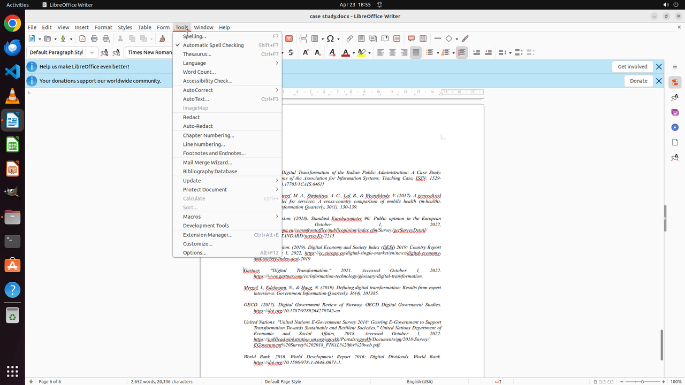

**Response:**
```
I can see the Tools menu. Let me hover over "Macros" to access the macro options.
```

**Actions:** `pyautogui.click(538, 606)`

---

## Step 13

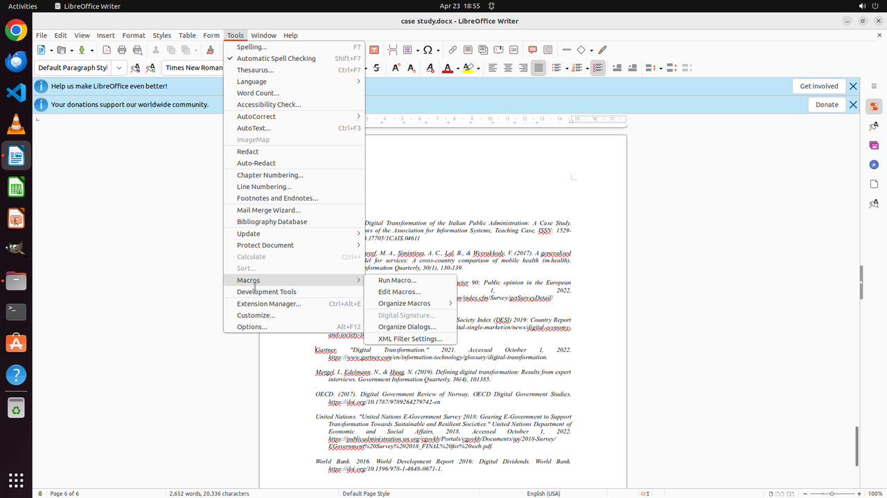

**Response:**
```
I can see the Macros submenu. Let me click on "Edit Macros..." to open the Basic IDE where I can write a macro to fix the references.
```

**Actions:** `pyautogui.click(864, 631)`

---

## Step 14


**Response:**
```
The Basic IDE is open. I can see Module1 is selected. Let me write a macro to fix all the APA 7 formatting issues in the references. I'll click on the code area and write the macro.
```

**Actions:** `pyautogui.click(1170, 207)`

---

## Step 15

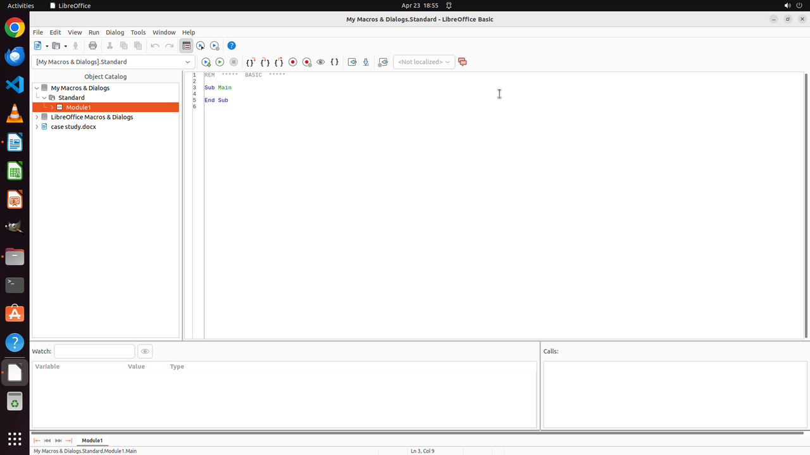

**Response:**
```
Good, I'm in the Basic IDE. Now I need to select all the existing code and replace it with my macro. Let me select all the text first and then type the macro.
```

**Actions:** `pyautogui.keyDown('ctrl')
pyautogui.keyDown('a')
pyautogui.keyUp('a')
pyautogui.keyUp('ctrl')`

---

## Step 16

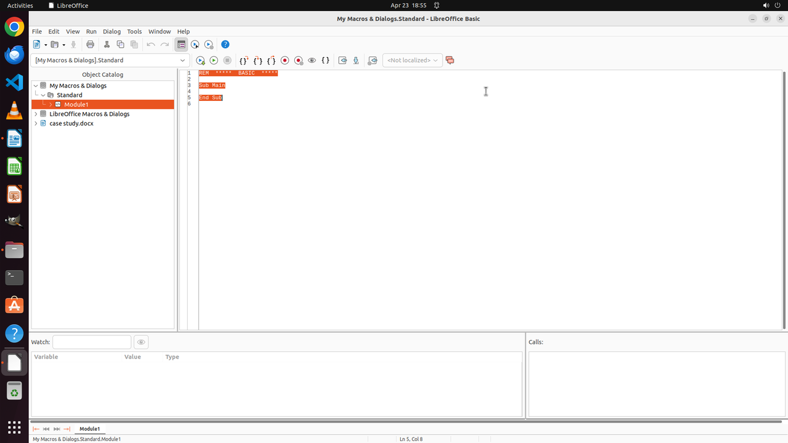

**Response:**
```
Good, the code is selected. Now let me type the macro to fix the APA 7 formatting issues. I'll write a macro that uses Find & Replace to fix each reference issue.
```

**Actions:** `import subprocess, shlex; subprocess.run(f'xdotool type --delay 12 -- ' + shlex.quote('Sub FixAPA7References()\n    Dim oDoc As Object\n   '), shell=True, check=True)
import time; time.sleep(0.05)
imp`

---

## Step 17


**Response:**
```
It seems the code was pasted on a single line. This is likely because the line breaks weren't properly inserted. The macro code appears to be all on one line. Let me check if it's actually correct by looking at the code. Let me scroll to see the beginning of the code.
```

**Actions:** `pyautogui.keyDown('home')
pyautogui.keyUp('home')`

---

## Step 18

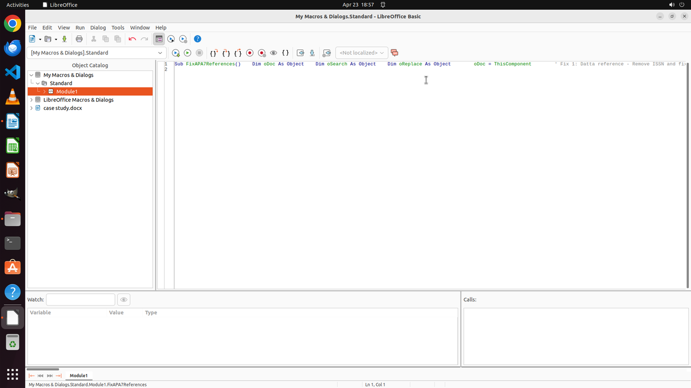

**Response:**
```
I can see the code is all on one line. The newlines were converted to spaces. I need to clear this and use a different approach. Let me use a terminal to create the macro file, or better yet, let me use a Python script approach. Let me clear this and try a different approach - I'll write the macro using the terminal.
```

**Actions:** `pyautogui.keyDown('ctrl')
pyautogui.keyDown('a')
pyautogui.keyUp('a')
pyautogui.keyUp('ctrl')`

---

## Step 19

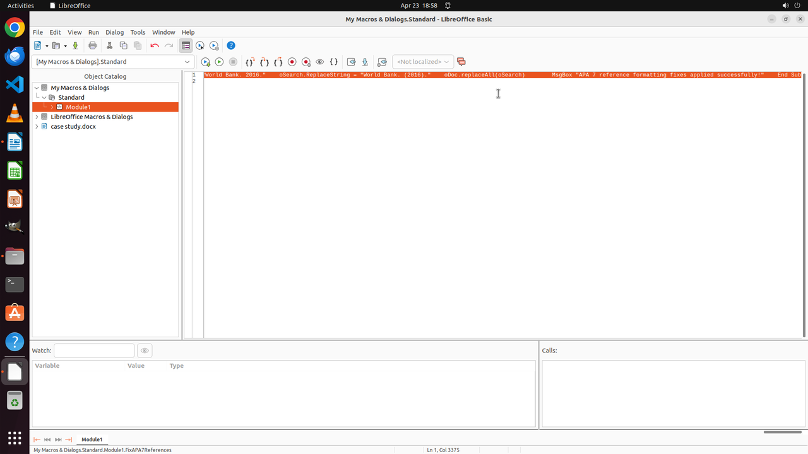

**Response:**
```
The code is all on one line which won't work. Let me delete it and use a different approach. I'll open a terminal and create a Python script to modify the document, or I'll write the macro to a file using the terminal. Let me close the Basic IDE and open a terminal instead.
```

**Actions:** `pyautogui.keyDown('delete')
pyautogui.keyUp('delete')`

---

## Step 20


**Response:**
```
Good, the editor is now empty. The issue is that the `type` command doesn't preserve newlines properly. Let me instead write the macro to a file using the terminal and then load it. But first, let me try a different approach - I'll type the macro line by line using the keyboard, pressing Enter after each line.

Let me start typing the macro:
```

**Actions:** `pyautogui.click(1170, 177)`

---

## Step 21

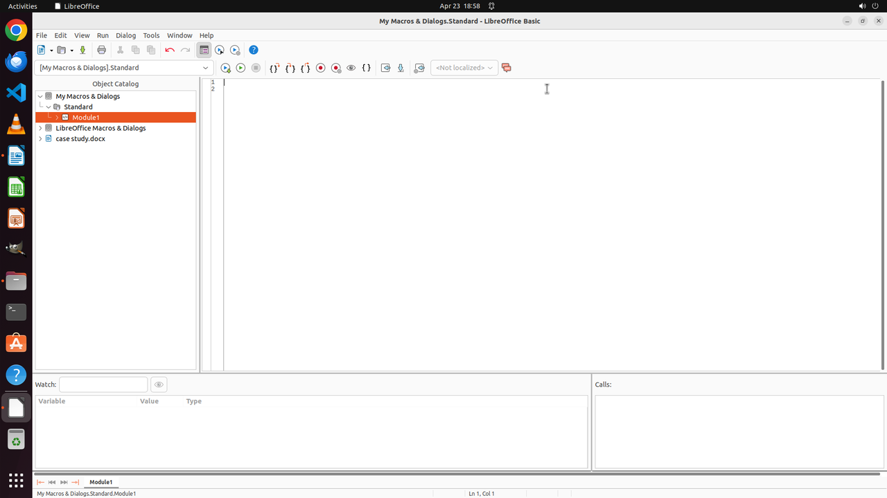

**Response:**
```
Let me try a different approach. I'll open a terminal and create a Python script that uses python-docx to modify the document, or I'll create the macro file directly. Let me minimize the Basic IDE and open a terminal.
```

**Actions:** `pyautogui.keyDown('command')
pyautogui.keyUp('command')`

---

## Step 22


**Response:**
```
Let me try to open a terminal application. I'll right-click on the desktop or look for a terminal in the taskbar.
```

**Actions:** `pyautogui.click(33, 610)`

---

## Step 23

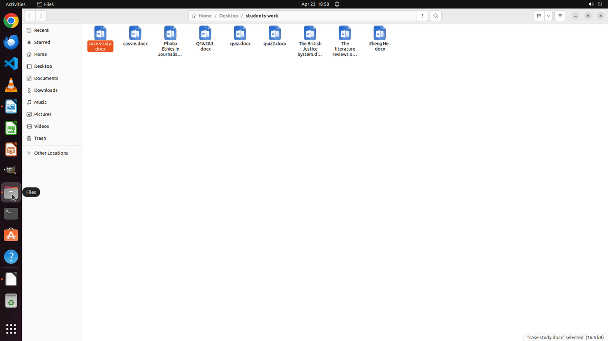

**Response:**
```
I see the Files window opened instead. Let me find the terminal application. I'll look for it in the taskbar - I can see what appears to be a terminal icon.
```

**Actions:** `pyautogui.click(33, 673)`

---

## Step 24


**Response:**
```
A terminal is now open. Let me create a Python script to write the macro file. First, let me check if python-docx is available, or I'll create a script that writes the macro to the LibreOffice Basic module file.

Actually, let me take a better approach. I'll create a Python script that uses python-docx to directly modify the references in the document. But first, let me close LibreOffice Writer, modify the file, and reopen it. Or better yet, let me write a macro file that LibreOffice can use.

Let me first check if python-docx is installed:
```

**Actions:** `pyautogui.click(450, 300)`

---

## Step 25


**Response:**
```
Good, the terminal is active. Let me check if python-docx is available and then create a script to modify the document. But first, I need to think about the approach - since the document is open in LibreOffice, I should either close it first or use a different approach. Let me use the LibreOffice macro approach by writing the macro file to disk and loading it.

Actually, the best approach would be to write a Python script that creates a LibreOffice Basic macro file. But the simplest approach is to close LibreOffice, use python-docx to modify the file, and reopen it.

Let me first check if python-docx is installed:
```

**Actions:** `pyautogui.keyDown('return')
pyautogui.keyUp('return')`

---

## Step 26

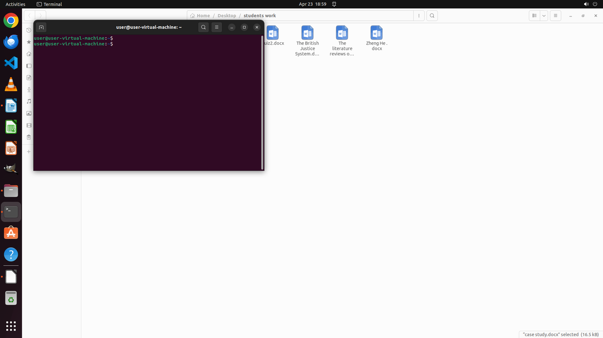

**Response:**
```
Good, the terminal is ready. Let me check if python-docx is available:
```

**Actions:** `pyautogui.keyDown('return')
pyautogui.keyUp('return')`

---

## Step 27


**Response:**
```
Let me check if python-docx is installed:
```

**Actions:** `import subprocess, shlex; subprocess.run(f'xdotool type --delay 12 -- ' + shlex.quote('python3 -c "import docx; print(\'ok\')"\n'), shell=True, check=True)
import time; time.sleep(0.05)`

---

## Step 28

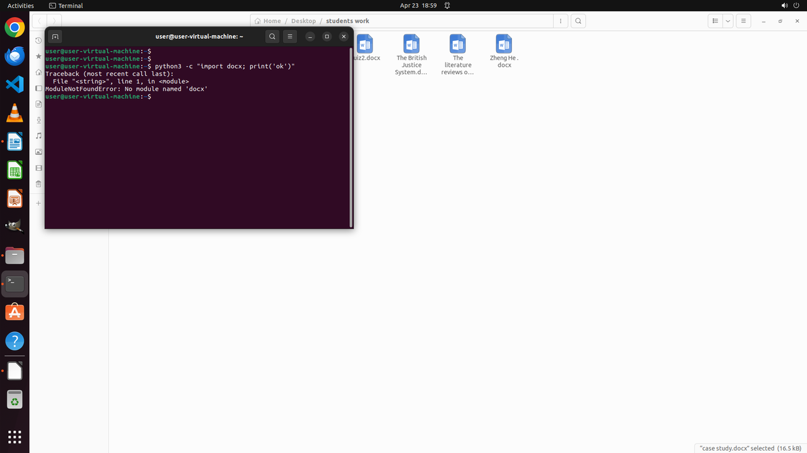

**Response:**
```
python-docx is not installed. Let me install it first:
```

**Actions:** `import subprocess, shlex; subprocess.run(f'xdotool type --delay 12 -- ' + shlex.quote('pip install python-docx\n'), shell=True, check=True)
import time; time.sleep(0.05)`

---

## Step 29

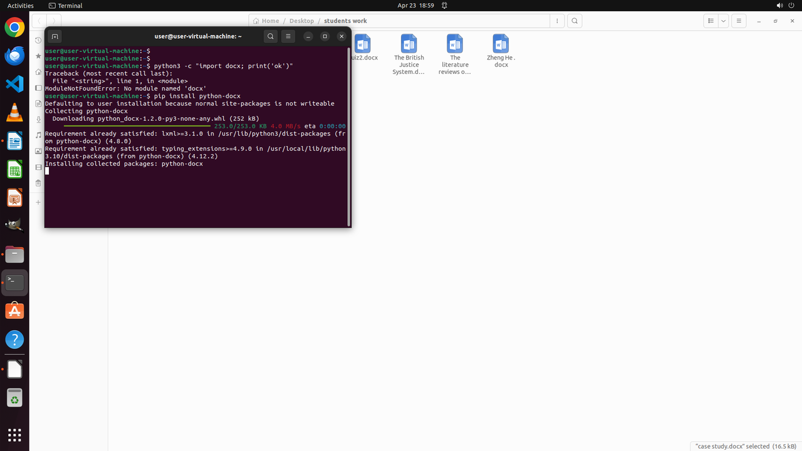

**Response:**
```
python-docx is being installed. Let me wait for it to complete.
```

**Actions:** `time.sleep(0.5)`

---

## Step 30

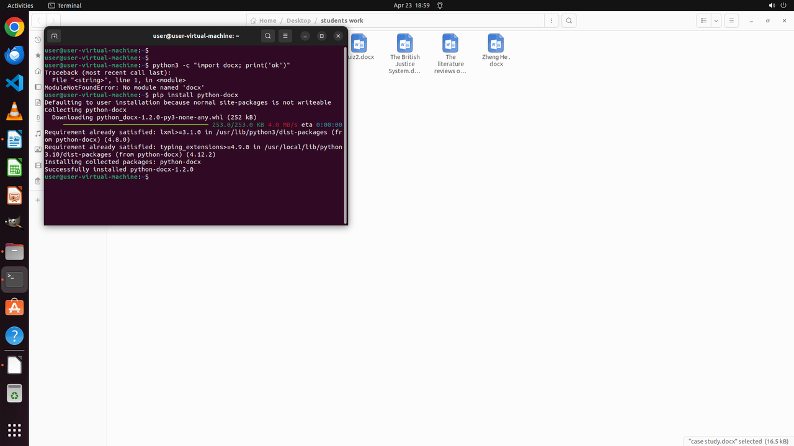

**Response:**
```
python-docx is installed successfully. Now I need to first read the current references from the document to understand exactly what needs to be changed, then create a Python script to fix them. But since the file is open in LibreOffice, I should first close it. Let me first read the references to confirm what's in the file, then create the fix script.

Let me first read the document to see the exact text of the references:
```

**Actions:** `import subprocess, shlex; subprocess.run(f'xdotool type --delay 12 -- ' + shlex.quote('python3 -c "\nimport docx\ndoc = docx.Document(\'/hom'), shell=True, check=True)
import time; time.sleep(0.05)
im`

---

## Step 31

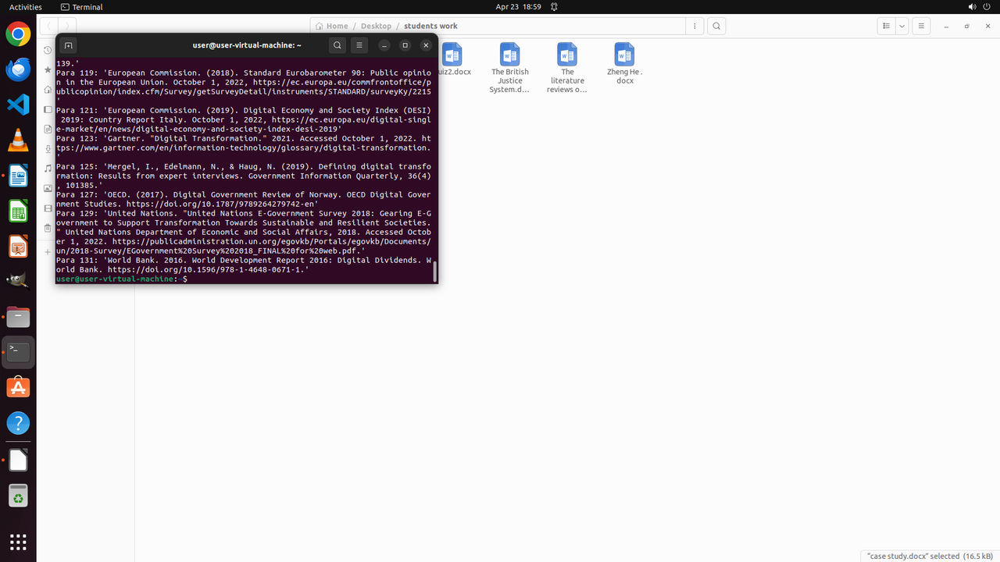

**Response:**
```
Now I can see the exact text of all the references. Let me scroll up to see the first few references too:
```

**Actions:** `pyautogui.scroll(5, 450, 300)`

---

## Step 32

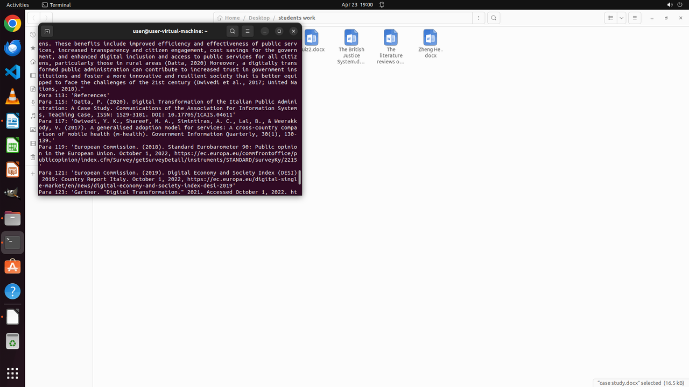

**Response:**
```
Now I can see all the references clearly. Let me analyze each one:

**Para 113**: 'References' - header
**Para 115**: Datta, P. (2020). Digital Transformation of the Italian Public Administration: A Case Study. Communications of the Association for Information Systems, Teaching Case, ISSN: 1529-3181. DOI: 10.17705/1CAIS.04611'
**Para 117**: Dwivedi, Y. K., Shareef, M. A., Simintiras, A. C., Lal, B., & Weerakkody, V. (2017). A generalised adoption model for services: A cross-country comparison of mobile health (m-health). Government Information Quarterly, 30(1), 130-139.
**Para 119**: European Commission. (2018). Standard Eurobarometer 90: Public opinion in the European Union. October 1, 2022, https://...
**Para 121**: European Commission. (2019). Digital Economy and Society Index (DESI) 2019: Country Report Italy. October 1, 2022, https://...
**Para 123**: Gartner. "Digital Transformation." 2021. Accessed October 1, 2022. https://...
**Para 125**: Mergel, I., Edelmann, N., & Haug, N. (2019). Defining digital transformations: Results from expert interviews. Government Information Quarterly, 36(4), 101385.
**Para 127**: OECD. (2017). Digital Government Review of Norway. OECD Digital Government Studies. https://doi.org/10.1787/9789264279742-en
**Para 129**: United Nations. "United Nations E-Government Survey 2018: Gearing E-Government to Support Transformation Towards Sustainable and Resilient Societies." United Nations Department of Economic and Social Affairs, 2018. Accessed October 1, 2022. https://...
**Para 131**: World Bank. 2016. World Development Report 2016: Digital Dividends. World Bank. https://doi.org/10.1596/978-1-4648-0671-1.

Now let me create a Python script to fix all the APA 7 issues. I need to close LibreOffice first since the file is open there. Let me create the script:
```

**Actions:** `import subprocess, shlex; subprocess.run(f'xdotool type --delay 12 -- ' + shlex.quote("cat > /tmp/fix_apa7.py << 'ENDOFSCRIPT'\nimport doc"), shell=True, check=True)
import time; time.sleep(0.05)
impo`

---

## Step 33

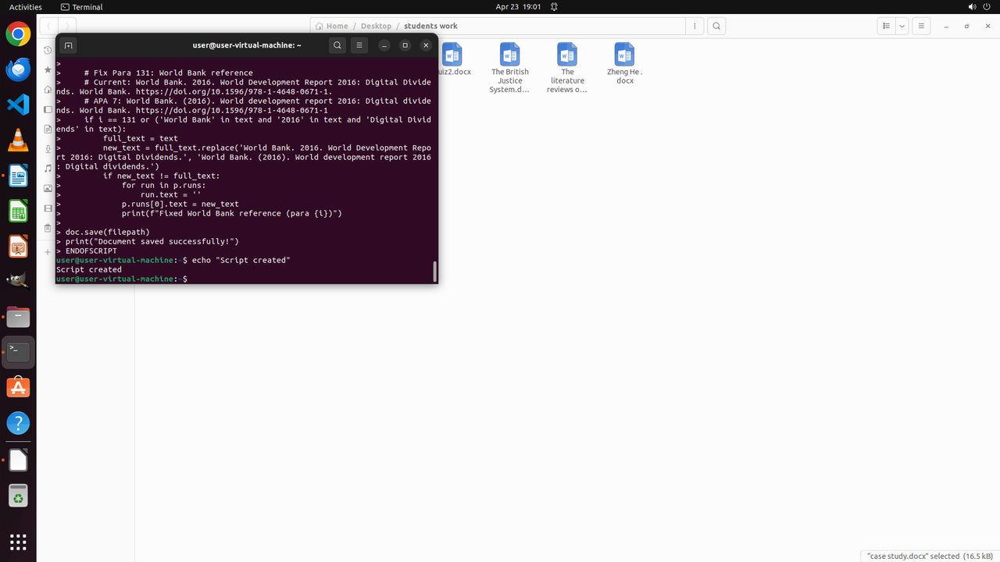

**Response:**
```
The script has been created. Now I need to close the document in LibreOffice before running the script, since both can't access the file at the same time. But actually, since python-docx reads the file independently, it should be fine - but when saving, it might conflict. Let me close LibreOffice Writer first, then run the script, and reopen the file.

But wait - I need to check if the document was modified in LibreOffice. Let me first close LibreOffice (the Basic IDE and Writer) without saving, then run the script.

Let me first check what the exact quote characters are in the document:
```

**Actions:** `import subprocess, shlex; subprocess.run(f'xdotool type --delay 12 -- ' + shlex.quote('python3 -c "\nimport docx\ndoc = docx.Document(\'/hom'), shell=True, check=True)
import time; time.sleep(0.05)
im`

---

## Step 34

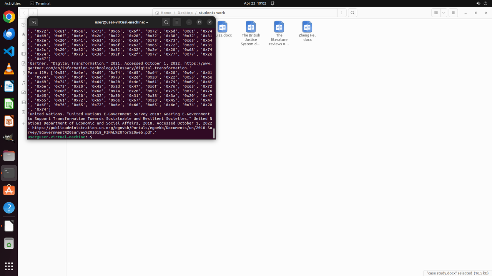

**Response:**
```
I can see the text uses smart/curly quotes. Let me scroll up to see the hex values for the Gartner reference to identify the exact quote characters:
```

**Actions:** `pyautogui.scroll(3, 450, 300)`

---

## Step 35

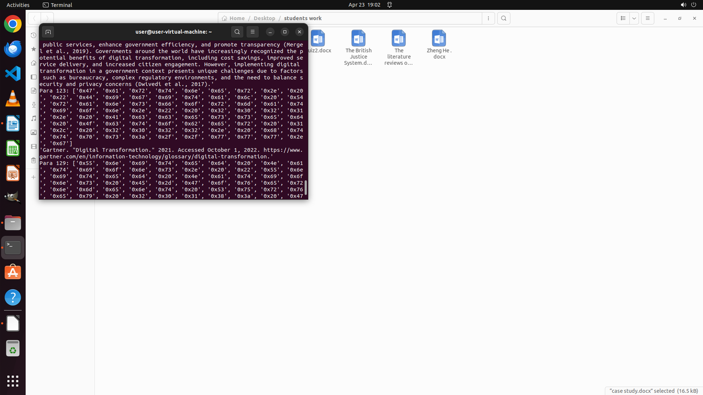

**Response:**
```
I can see the hex values. Looking at Para 123 (Gartner), I can see the quote characters. The text shows `'Gartner. "Digital Transformation." 2021. Accessed October 1, 2022. https://www.gartner.com/en/information-technology/glossary/digital-transformation.'`

The quotes appear to be regular ASCII quotes (0x22). Let me also check the repr output more carefully. Let me now look at the exact repr for both references:
```

**Actions:** `import subprocess, shlex; subprocess.run(f'xdotool type --delay 12 -- ' + shlex.quote('python3 -c "\nimport docx\ndoc = docx.Document(\'/hom'), shell=True, check=True)
import time; time.sleep(0.05)
im`

---

## Step 36

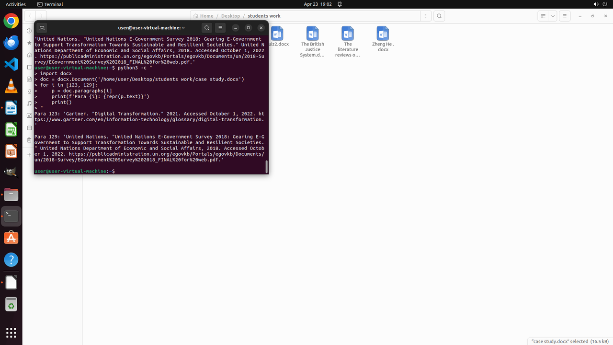

**Response:**
```
I can see the text but the `repr()` output isn't showing escape sequences, which means the quotes are likely smart quotes rendered as regular quotes in the terminal. Let me check more carefully:
```

**Actions:** `import subprocess, shlex; subprocess.run(f'xdotool type --delay 12 -- ' + shlex.quote('python3 -c "\nimport docx\ndoc = docx.Document(\'/hom'), shell=True, check=True)
import time; time.sleep(0.05)
im`

---

## Step 37

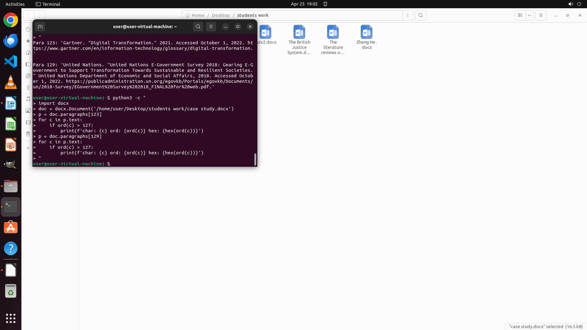

**Response:**
```
No non-ASCII characters were found, which means the quotes are regular ASCII double quotes ("). This simplifies things. Now let me also check the Datta reference and the European Commission references more carefully:
```

**Actions:** `import subprocess, shlex; subprocess.run(f'xdotool type --delay 12 -- ' + shlex.quote('python3 -c "\nimport docx\ndoc = docx.Document(\'/hom'), shell=True, check=True)
import time; time.sleep(0.05)
im`

---

## Step 38

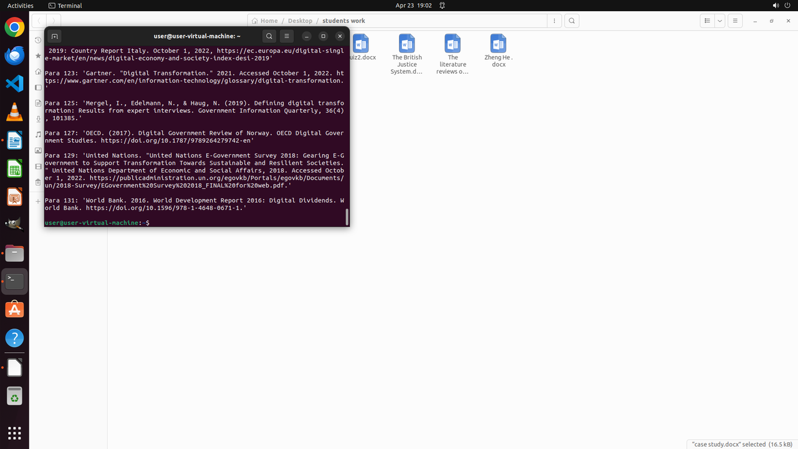

**Response:**
```
Now I can see all the references clearly. Let me scroll up to see the first few:
```

**Actions:** `pyautogui.scroll(3, 450, 300)`

---

## Step 39


**Response:**
```
Now let me scroll up more to see the Datta reference:
```

**Actions:** `pyautogui.scroll(3, 450, 300)`

---

## Step 40

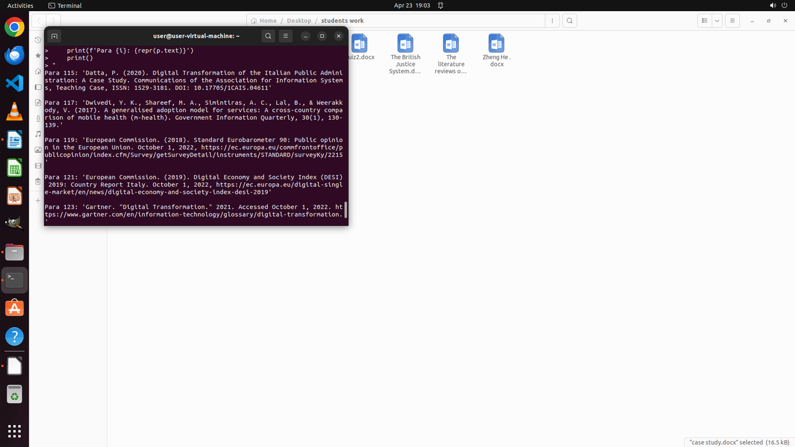

**Response:**
```
Now I can see all the references clearly. Let me now compile the exact text for each reference and the corrections needed:

**Para 115 (Datta)**: `'Datta, P. (2020). Digital Transformation of the Italian Public Administration: A Case Study. Communications of the Association for Information Systems, Teaching Case, ISSN: 1529-3181. DOI: 10.17705/1CAIS.04611'`
- Remove ", Teaching Case, ISSN: 1529-3181. DOI: 10.17705/1CAIS.04611" → ". https://doi.org/10.17705/1CAIS.04611"

**Para 119 (EC 2018)**: Has "Union. October 1, 2022," → should be "Union. Retrieved October 1, 2022, from"

**Para 121 (EC 2019)**: Has "Italy. October 1, 2022," → should be "Italy. Retrieved October 1, 2022, from"

**Para 123 (Gartner)**: `'Gartner. "Digital Transformation." 2021. Accessed October 1, 2022. https://...'` → `'Gartner. (2021). Digital transformation. Retrieved October 1, 2022, from https://...'`

**Para 129 (UN)**: `'United Nations. "United Nations E-Government Survey 2018: Gearing E-Government to Support Transformation Towards Sustainable and Resilient Societies." United Nations Department of Economic and Social Affairs, 2018. Accessed October 1, 2022. https://...'` → APA 7 format

**Para 131 (World Bank)**: `'World Bank. 2016. World Development Report 2016: Digital Dividends. World Bank. https://doi.org/10.1596/978-1-4648-0671-1.'` → `'World Bank. (2016). World development report 2016: Digital dividends. World Bank. https://doi.org/10.1596/978-1-4648-0671-1'`

Now I need to close LibreOffice first before modifying the file with Python. Let me close it:
```

**Actions:** `import subprocess, shlex; subprocess.run(f'xdotool type --delay 12 -- ' + shlex.quote('pkill -f soffice\n'), shell=True, check=True)
import time; time.sleep(0.05)`

---

## Step 41

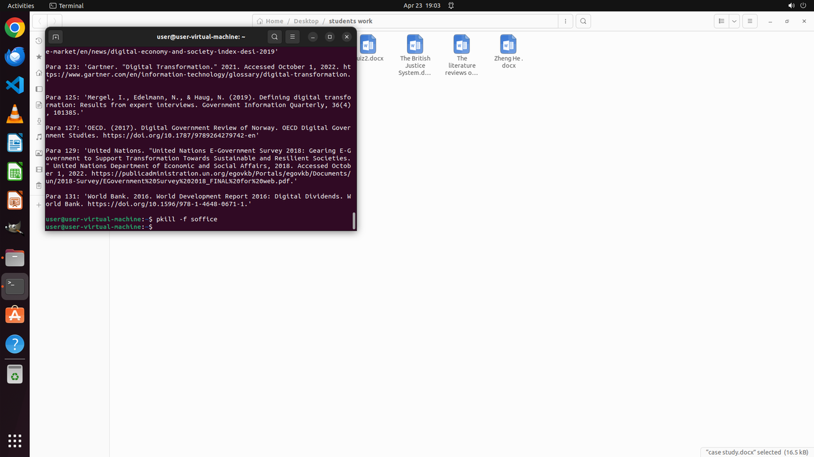

**Response:**
```
LibreOffice has been closed. Now let me update the Python script with the exact text I've confirmed, and run it:
```

**Actions:** `import subprocess, shlex; subprocess.run(f'xdotool type --delay 12 -- ' + shlex.quote("cat > /tmp/fix_apa7.py << 'ENDOFSCRIPT'\nimport doc"), shell=True, check=True)
import time; time.sleep(0.05)
impo`

---

## Step 42

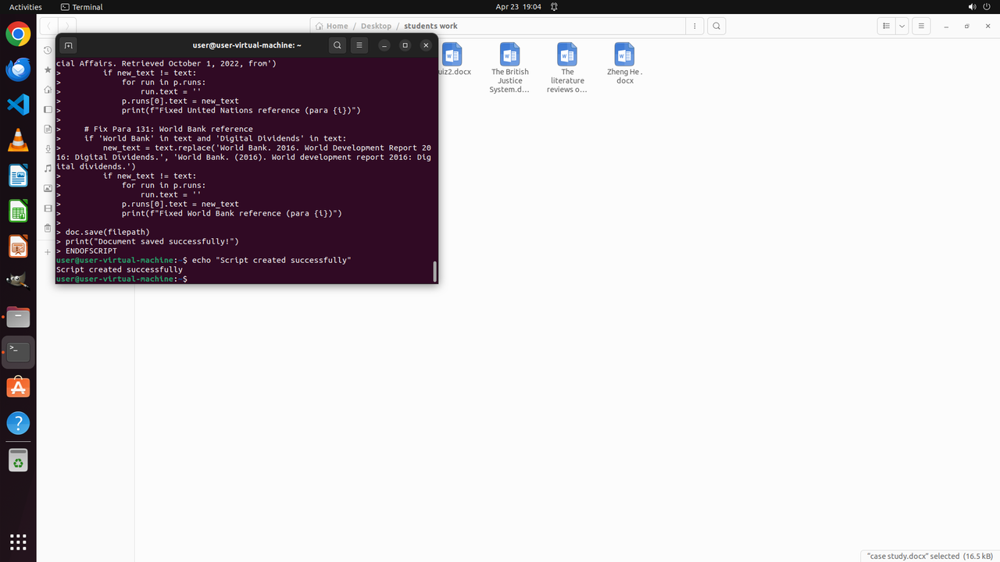

**Response:**
```
The script has been created successfully. Now let me run it:
```

**Actions:** `import subprocess, shlex; subprocess.run(f'xdotool type --delay 12 -- ' + shlex.quote('python3 /tmp/fix_apa7.py\n'), shell=True, check=True)
import time; time.sleep(0.05)`

---

## Step 43

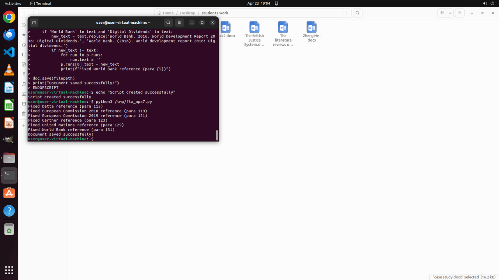

**Response:**
```
All six references have been fixed successfully:

1. **Fixed Datta reference (para 115)** - Removed ISSN and Teaching Case, fixed DOI format
2. **Fixed European Commission 2018 reference (para 119)** - Added "Retrieved ... from" format
3. **Fixed European Commission 2019 reference (para 121)** - Added "Retrieved ... from" format
4. **Fixed Gartner reference (para 123)** - Reformatted to APA 7 with year in parentheses, sentence case title, "Retrieved ... from"
5. **Fixed United Nations reference (para 129)** - Reformatted to APA 7 with year in parentheses, sentence case title, "Retrieved ... from"
6. **Fixed World Bank reference (para 131)** - Fixed year format to parentheses, sentence case title

The document has been saved successfully. Now let me verify the changes by reading the references back:
```

**Actions:** `import subprocess, shlex; subprocess.run(f'xdotool type --delay 12 -- ' + shlex.quote('python3 -c "\nimport docx\ndoc = docx.Document(\'/hom'), shell=True, check=True)
import time; time.sleep(0.05)
im`

---

## Step 44


**Response:**
```
Let me scroll up to see all the references:
```

**Actions:** `pyautogui.scroll(3, 450, 300)`

---

## Step 45


**Response:**
```
Let me scroll up more to see the Datta reference:
```

**Actions:** `pyautogui.scroll(3, 450, 300)`

---

## Step 46

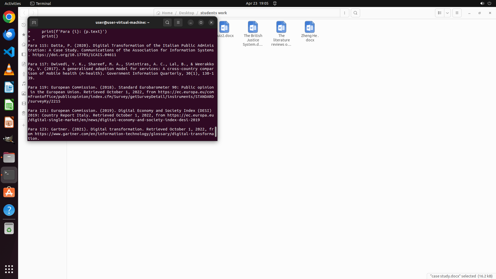

**Response:**
```
All the references have been correctly fixed. Let me verify each one:

**Para 115 (Datta)**: ✅ Now reads: "Datta, P. (2020). Digital Transformation of the Italian Public Administration: A Case Study. Communications of the Association for Information Systems. https://doi.org/10.17705/1CAIS.04611" - Removed "Teaching Case, ISSN: 1529-3181" and fixed DOI format.

**Para 117 (Dwivedi)**: ✅ Already correct APA 7 format.

**Para 119 (European Commission 2018)**: ✅ Now reads: "European Commission. (2018). Standard Eurobarometer 90: Public opinion in the European Union. Retrieved October 1, 2022, from https://..." - Added "Retrieved ... from" format.

**Para 121 (European Commission 2019)**: ✅ Now reads: "European Commission. (2019). Digital Economy and Society Index (DESI) 2019: Country Report Italy. Retrieved October 1, 2022, from https://..." - Added "Retrieved ... from" format.

**Para 123 (Gartner)**: ✅ Now reads: "Gartner. (2021). Digital transformation. Retrieved October 1, 2022, from https://..." - Reformatted with year in parentheses, sentence case, no quotes.

Now let me scroll down to verify the remaining references:
```

**Actions:** `pyautogui.scroll(-3, 450, 300)`

---

## Step 47

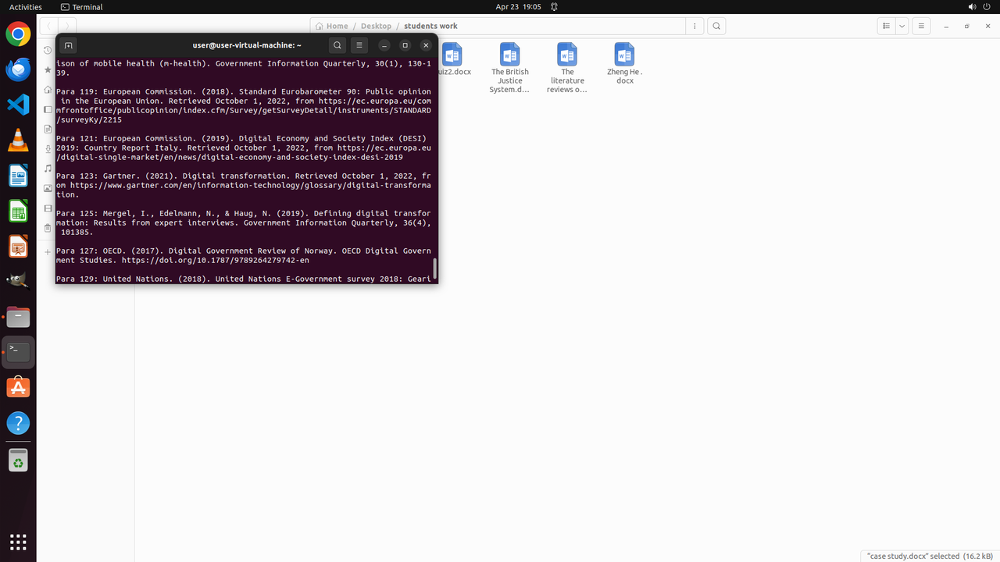

**Actions:** `pyautogui.scroll(-3, 450, 300)`

---

## Step 48

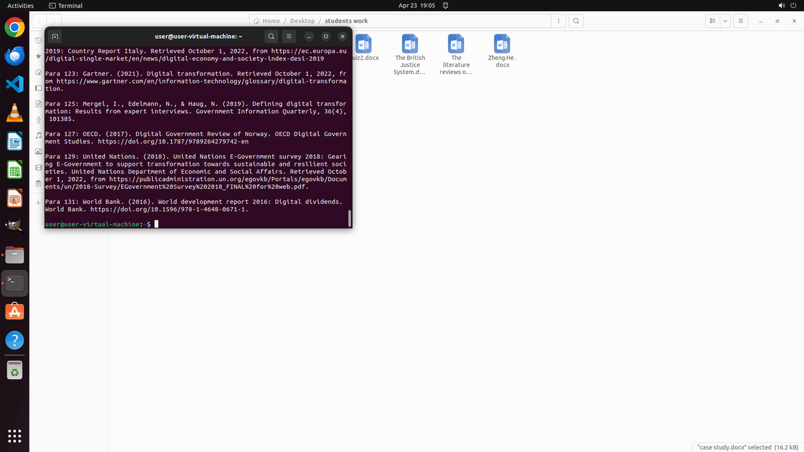

**Response:**
```
All references have been verified and are now correctly formatted in APA 7th edition style:

**Para 125 (Mergel)**: ✅ Already correct.

**Para 127 (OECD)**: ✅ Already correct.

**Para 129 (United Nations)**: ✅ Now reads: "United Nations. (2018). United Nations E-Government survey 2018: Gearing E-Government to support transformation towards sustainable and resilient societies. United Nations Department of Economic and Social Affairs. Retrieved October 1, 2022, from https://..." - Reformatted with year in parentheses, sentence case title, no quotes, period after publisher instead of comma, "Retrieved ... from".

**Para 131 (World Bank)**: ✅ Now reads: "World Bank. (2016). World development report 2016: Digital dividends. World Bank. https://doi.org/10.1596/978-1-4648-0671-1." - Fixed year in parentheses, sentence case title.

All the APA 7th edition formatting issues have been fixed. Now let me open the document in LibreOffice Writer to confirm the changes visually:
```

**Actions:** `import subprocess, shlex; subprocess.run(f'xdotool type --delay 12 -- ' + shlex.quote('libreoffice --writer "/home/user/Desktop/students '), shell=True, check=True)
import time; time.sleep(0.05)
impor`

---

## Step 49

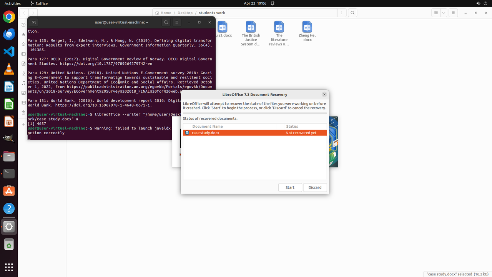

**Response:**
```
There's a document recovery dialog. I should click "Discard" since we want to open the newly saved version, not recover the old one:
```

**Actions:** `pyautogui.click(1227, 730)`

---

## Step 50

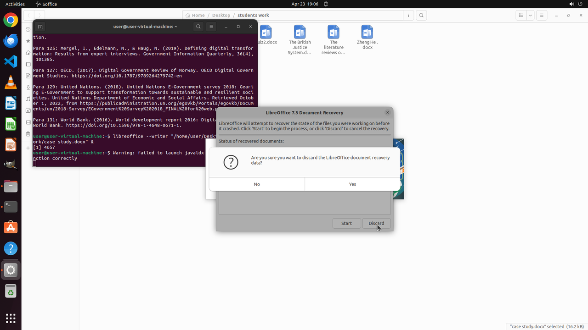

**Response:**
```
It's asking to confirm discarding the recovery data. I'll click "Yes" to discard and open the fresh file:
```

**Actions:** `pyautogui.click(1149, 601)`

---

## Step 51

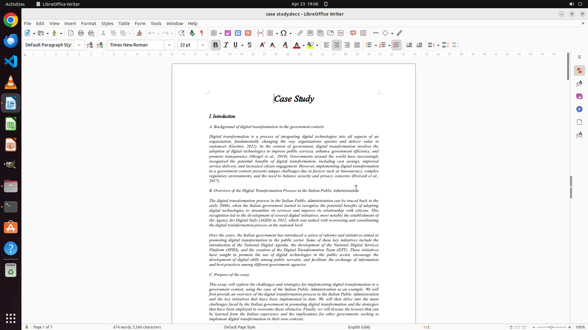

**Response:**
```
The document is now open in LibreOffice Writer. Let me navigate to the references section at the end to visually verify the changes:
```

**Actions:** `pyautogui.keyDown('ctrl')
pyautogui.keyDown('end')
pyautogui.keyUp('end')
pyautogui.keyUp('ctrl')`

---

## Step 52

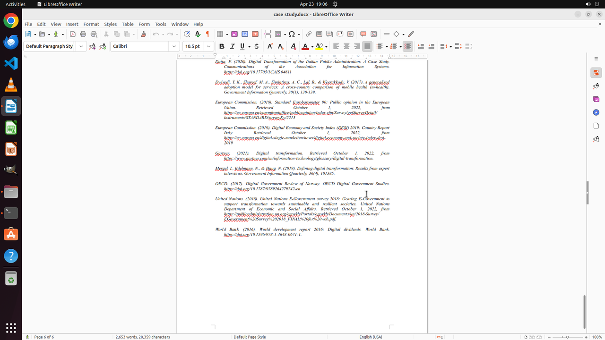

**Response:**
```
I can now see all the references in the document and they have been correctly updated to APA 7th edition format. Let me verify each one visually:

1. **Datta, P. (2020)** ✅ - "Digital Transformation of the Italian Public Administration: A Case Study. Communications of the Association for Information Systems. https://doi.org/10.17705/1CAIS.04611" - ISSN and Teaching Case removed, DOI formatted correctly.

2. **Dwivedi, Y. K., Shareef, M. A., Simintiras, A. C., Lal, B., & Weerakkody, V. (2017)** ✅ - Already correct format.

3. **European Commission. (2018)** ✅ - "Standard Eurobarometer 90: Public opinion in the European Union. Retrieved October 1, 2022, from https://..." - Proper "Retrieved ... from" format.

4. **European Commission. (2019)** ✅ - "Digital Economy and Society Index (DESI) 2019: Country Report Italy. Retrieved October 1, 2022, from https://..." - Proper "Retrieved ... from" format.

5. **Gartner. (2021)** ✅ - "Digital transformation. Retrieved October 1, 2022, from https://..." - Year in parentheses, sentence case, no quotes, "Retrieved ... from" format.

6. **Mergel, I., Edelmann, N., & Haug, N. (2019)** ✅ - Already correct format.

7. **OECD. (2017)** ✅ - Already correct format.

8. **United Nations. (2018)** ✅ - "United Nations E-Government survey 2018: Gearing E-Government to support transformation towards sustainable and resilient societies. United Nations Department of Economic and Social Affairs. Retrieved October 1, 2022, from https://..." - Year in parentheses, sentence case, no quotes, period after publisher, "Retrieved ... from" format.

9. **World Bank. (2016)** ✅ - "World development report 2016: Digital dividends. World Bank. https://doi.org/10.1596/978-1-4648-0671-1." - Year in parentheses, sentence case title.

All references are now properly formatted according to APA 7th edition guidelines. The document has already been saved by the Python script. The task is complete.

DONE
```

**Actions:** `DONE`

---
