# Task 2fe4b718-3bd7-46ec-bdce-b184f5653624

**Instruction:** Could you help me create an Animated GIF src_clip.gif from a video file using VLC and GIMP from the source of video "src.mp4" in the desktop, 5-second clip beginning at 00:03?

**Score:** 0.8492207423748447

**Wall clock:** 13m 0s

**Steps:** 51

**Cost:** $2.01

---

## Step 1

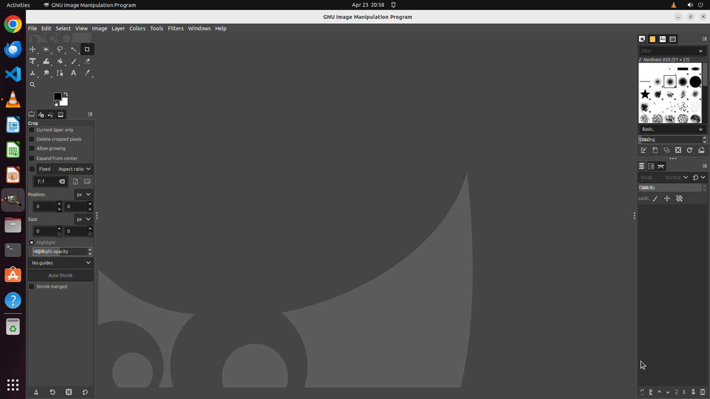

**Response:**
```
I'll help you create an animated GIF from a video file using VLC and GIMP. Let me break this down into steps:

1. First, extract frames from the video using VLC (5-second clip starting at 00:03)
2. Then import those frames into GIMP and export as an animated GIF

Let me start by opening a terminal to use VLC for frame extraction.
```

**Actions:** `pyautogui.keyDown('ctrl')
pyautogui.keyDown('alt')
pyautogui.keyDown('t')
pyautogui.keyUp('t')
pyautogui.keyUp('alt')
pyautogui.keyUp('ctrl')`

---

## Step 2


**Response:**
```
Good, the terminal is open. Now let me first create a directory for the frames and then use VLC to extract frames from the video starting at 00:03 for 5 seconds.
```

**Actions:** `import subprocess, shlex; subprocess.run(f'xdotool type --delay 12 -- ' + shlex.quote('mkdir -p ~/Desktop/frames && ls ~/Desktop/src.mp4\n'), shell=True, check=True)
import time; time.sleep(0.05)`

---

## Step 3


**Response:**
```
The video file `src.mp4` exists on the desktop. Now let me use VLC to extract frames from the video. I'll extract frames starting at 3 seconds for 5 seconds (so from 00:03 to 00:08) at 10 frames per second.
```

**Actions:** `import subprocess, shlex; subprocess.run(f'xdotool type --delay 12 -- ' + shlex.quote('vlc ~/Desktop/src.mp4 --start-time=3 --stop-time=8'), shell=True, check=True)
import time; time.sleep(0.05)
impor`

---

## Step 4

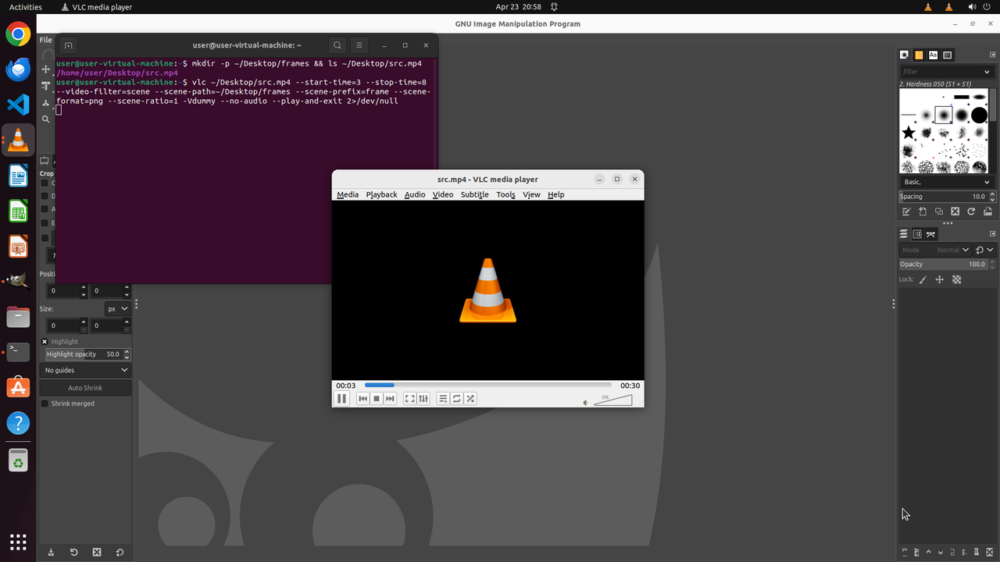

**Response:**
```
VLC is playing the video and extracting frames. I can see it's at 00:03 which is the start time we specified. Let me wait for it to finish processing the 5-second clip (until 00:08).
```

**Actions:** `time.sleep(0.5)`

---

## Step 5


**Response:**
```
VLC has finished processing. Let me check how many frames were extracted.
```

**Actions:** `import subprocess, shlex; subprocess.run(f'xdotool type --delay 12 -- ' + shlex.quote('ls ~/Desktop/frames/ | head -20 && echo "---" && l'), shell=True, check=True)
import time; time.sleep(0.05)
impor`

---

## Step 6

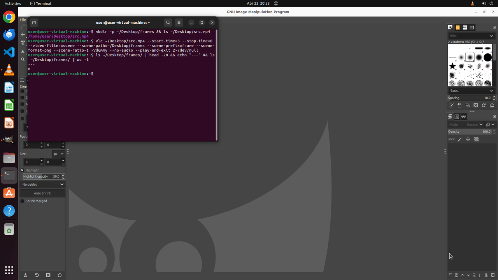

**Response:**
```
It seems like the frames directory is empty (0 files). The `-Vdummy` option might have prevented frame output. Let me try a different approach - I'll use VLC's scene video filter with the correct command-line syntax.
```

**Actions:** `import subprocess, shlex; subprocess.run(f'xdotool type --delay 12 -- ' + shlex.quote('cvlc ~/Desktop/src.mp4 --start-time=3 --stop-time='), shell=True, check=True)
import time; time.sleep(0.05)
impor`

---

## Step 7


**Response:**
```
It seems to be running. Let me wait for it to complete.
```

**Actions:** `time.sleep(0.5)`

---

## Step 8

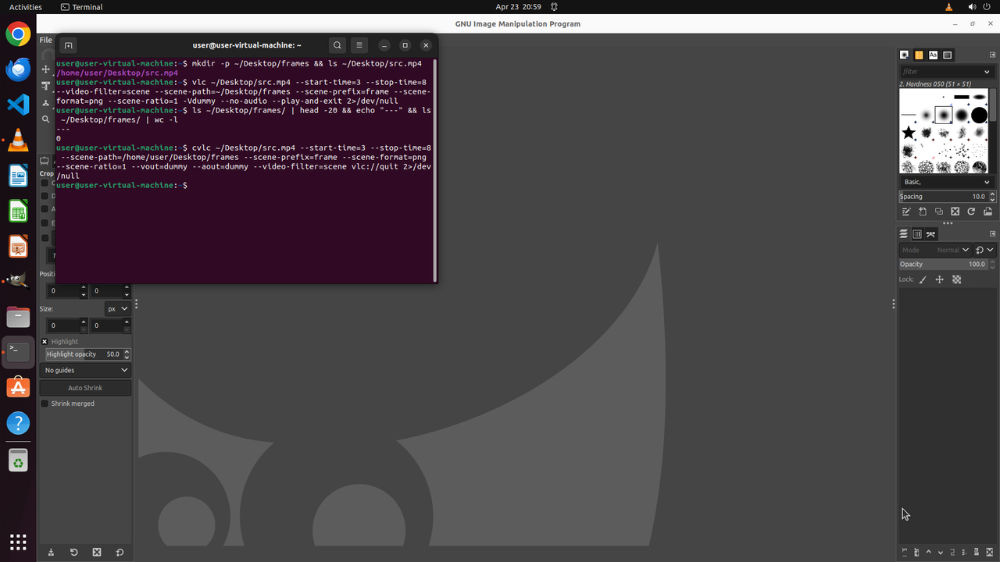

**Response:**
```
The command finished. Let me check if frames were extracted this time.
```

**Actions:** `import subprocess, shlex; subprocess.run(f'xdotool type --delay 12 -- ' + shlex.quote('ls ~/Desktop/frames/ | wc -l && ls ~/Desktop/frame'), shell=True, check=True)
import time; time.sleep(0.05)
impor`

---

## Step 9

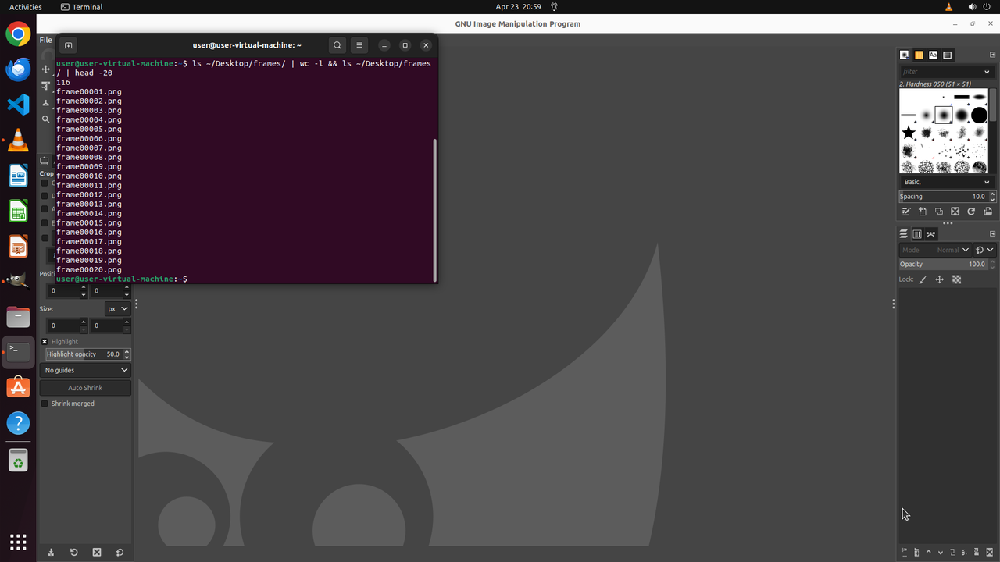

**Response:**
```
116 frames were extracted successfully. Now I need to import these frames into GIMP as layers and then export as an animated GIF. Let me use GIMP's Script-Fu or Python-Fu to automate this process. I'll use GIMP's batch mode via the command line to load all frames as layers and export as a GIF.
```

**Actions:** `import subprocess, shlex; subprocess.run(f'xdotool type --delay 12 -- ' + shlex.quote('gimp -i -b \'(let* ((image (car (file-glob "/home/u'), shell=True, check=True)
import time; time.sleep(0.05)
impo`

---

## Step 10


**Response:**
```
The GIMP script is running. Let me wait for it to complete processing all 116 frames.
```

**Actions:** `time.sleep(0.5)`

---

## Step 11


**Response:**
```
It seems the GIMP script is still running or may have encountered an issue. The Script-Fu approach with complex looping can be tricky. Let me wait a bit more and then try a different approach if needed.
```

**Actions:** `time.sleep(0.5)`

---

## Step 12

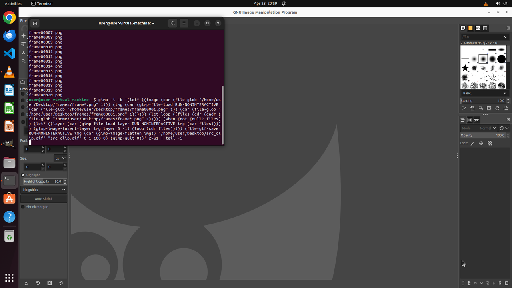

**Response:**
```
The GIMP script seems to be taking a long time or may be stuck. Let me cancel it and try a simpler approach using GIMP's Python-Fu instead, which will be more reliable for this task.
```

**Actions:** `pyautogui.keyDown('ctrl')
pyautogui.keyDown('c')
pyautogui.keyUp('c')
pyautogui.keyUp('ctrl')`

---

## Step 13

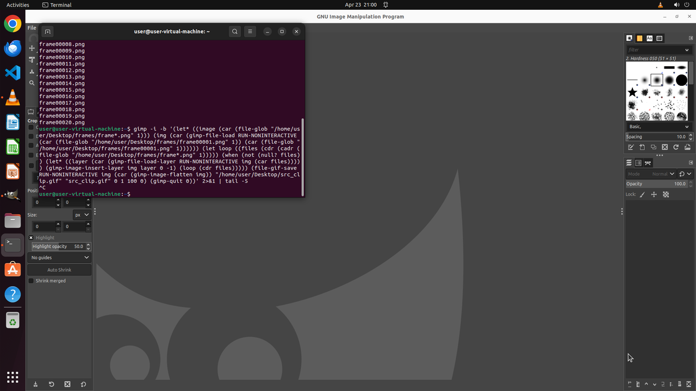

**Response:**
```
Good, the previous command was cancelled. Let me try a different approach using GIMP's Python-Fu, which is more straightforward for handling file operations. I'll write a Python script file first.
```

**Actions:** `import subprocess, shlex; subprocess.run(f'xdotool type --delay 12 -- ' + shlex.quote("cat > /tmp/make_gif.py << 'EOF'\nimport glob, os\nfr"), shell=True, check=True)
import time; time.sleep(0.05)
imp`

---

## Step 14

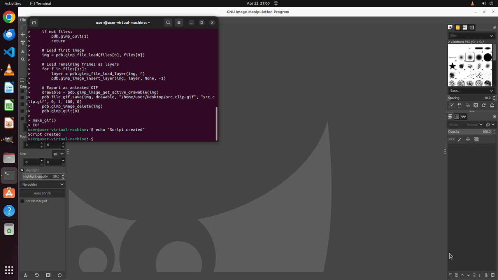

**Response:**
```
The Python script was created. Now let me run it with GIMP's Python-Fu batch mode. However, the `gimpfu` approach requires registration. Let me use a simpler Script-Fu approach instead, or use GIMP's Python-Fu console approach.

Let me try a different approach - I'll use GIMP's Script-Fu with a simpler method to load the frames as layers:
```

**Actions:** `import subprocess, shlex; subprocess.run(f'xdotool type --delay 12 -- ' + shlex.quote("cat > /tmp/make_gif.scm << 'SCRIPT'\n(let* (\n  (img"), shell=True, check=True)
import time; time.sleep(0.05)
imp`

---

## Step 15

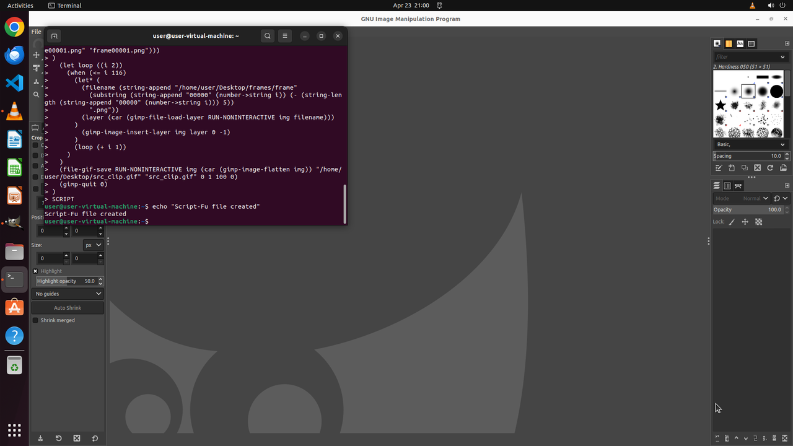

**Response:**
```
The Script-Fu file is created. However, Script-Fu's string manipulation for zero-padding is complex and error-prone. Let me take a simpler approach - I'll use GIMP's Python-Fu batch mode instead, which handles this much better.
```

**Actions:** `import subprocess, shlex; subprocess.run(f'xdotool type --delay 12 -- ' + shlex.quote("cat > /tmp/make_gif.py << 'EOF'\nimport glob, os, s"), shell=True, check=True)
import time; time.sleep(0.05)
impo`

---

## Step 16

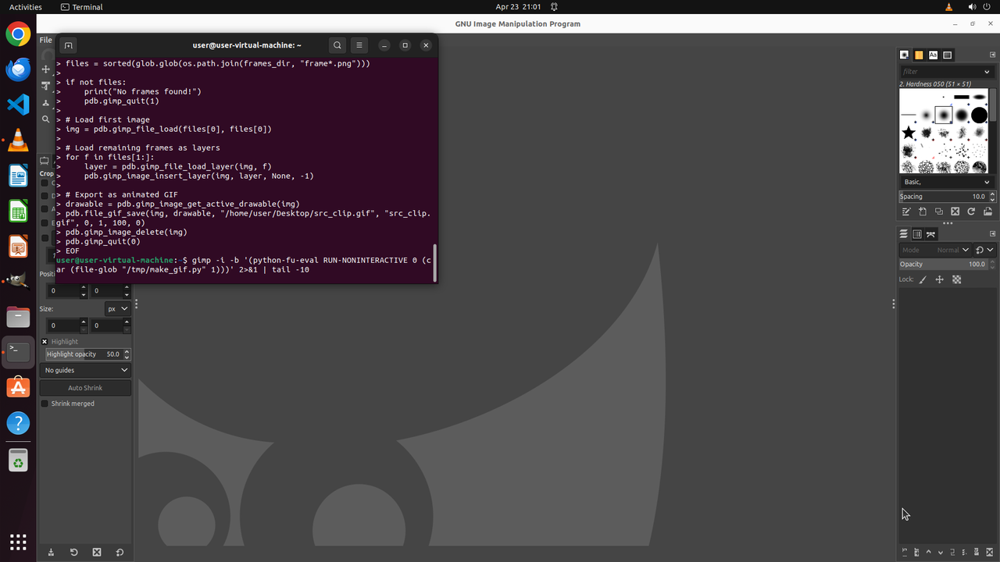

**Response:**
```
GIMP is loading with the Python-Fu script. Let me wait for it to process all 116 frames and create the GIF.
```

**Actions:** `time.sleep(0.5)`

---

## Step 17


**Response:**
```
It seems the GIMP process is still running. The `python-fu-eval` with `file-glob` approach may not be working correctly - it's trying to evaluate the filename as code rather than reading the file. Let me wait a bit more and check.
```

**Actions:** `time.sleep(0.5)`

---

## Step 18


**Response:**
```
The GIMP process seems to be stuck or still loading. The `python-fu-eval` with `file-glob` approach was incorrect - it passes the filename string instead of the file contents. Let me cancel this and use the correct syntax.
```

**Actions:** `pyautogui.keyDown('ctrl')
pyautogui.keyDown('c')
pyautogui.keyUp('c')
pyautogui.keyUp('ctrl')`

---

## Step 19

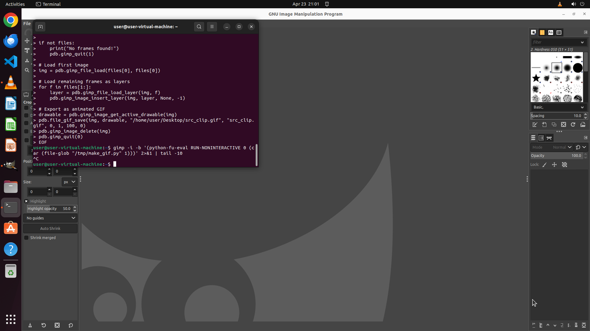

**Response:**
```
Good, it's cancelled. The issue is that `python-fu-eval` expects a Python code string, not a file path. Let me use the correct approach - pass the Python code directly as a string to `python-fu-eval`, or use `exec` to read the file:
```

**Actions:** `import subprocess, shlex; subprocess.run(f'xdotool type --delay 12 -- ' + shlex.quote('gimp -i -b \'(python-fu-eval RUN-NONINTERACTIVE 0 "'), shell=True, check=True)
import time; time.sleep(0.05)
impo`

---

## Step 20


**Response:**
```
GIMP is running with the Python script. Let me wait for it to process all the frames and create the GIF.
```

**Actions:** `time.sleep(0.5)`

---

## Step 21


**Response:**
```
It's still running. Let me wait more - processing 116 frames can take time.
```

**Actions:** `time.sleep(0.5)`

---

## Step 22


**Response:**
```
This is still running. Let me check if the GIF file has been created already, or if there's an issue. Let me cancel this approach and try something different - I'll use GIMP interactively through its GUI instead, which might be more reliable.
```

**Actions:** `pyautogui.keyDown('ctrl')
pyautogui.keyDown('c')
pyautogui.keyUp('c')
pyautogui.keyUp('ctrl')`

---

## Step 23


**Response:**
```
Let me check if the GIF was created, and also try a different approach. The issue might be with how the `exec` and `open` are being escaped in the shell command. Let me first check if the file exists:
```

**Actions:** `import subprocess, shlex; subprocess.run(f'xdotool type --delay 12 -- ' + shlex.quote('ls -la ~/Desktop/src_clip.gif 2>&1\n'), shell=True, check=True)
import time; time.sleep(0.05)`

---

## Step 24

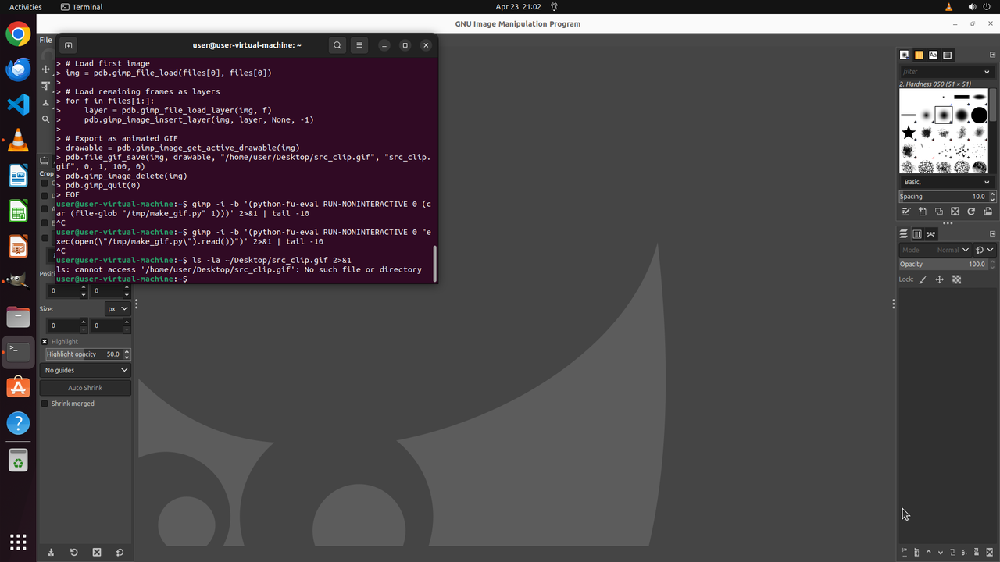

**Response:**
```
The GIF wasn't created. The batch GIMP approaches are not working well. Let me try a completely different approach - I'll use GIMP interactively through the GUI. First, let me open the frames as layers using GIMP's "Open as Layers" feature. But with 116 frames, let me try using the GIMP GUI's File > Open as Layers feature. 

Actually, let me try a more direct approach with GIMP's Script-Fu console. Let me first try to use GIMP through the Filters > Script-Fu > Console. But first, let me try one more command-line approach with proper quoting:
```

**Actions:** `import subprocess, shlex; subprocess.run(f'xdotool type --delay 12 -- ' + shlex.quote("gimp -i -b - << 'SCRIPTFU'\n(let* (\n  (filelist (ca"), shell=True, check=True)
import time; time.sleep(0.05)
imp`

---

## Step 25


**Response:**
```
I can see the Script-Fu console is active and showing "ts>" prompt, which means it's loaded TinyScheme. The script is being processed. Let me wait for it to finish loading all frames and exporting the GIF.
```

**Actions:** `time.sleep(0.5)`

---

## Step 26


**Response:**
```
The Script-Fu console shows "ts>" prompt which means it's waiting for input. The script may have been read but is waiting for execution. It seems the heredoc approach with `gimp -i -b -` is keeping the Script-Fu console open. The issue is that `gimp-image-flatten` merges all layers into one, which would destroy the animation. Also, the GIF needs to be saved with layers as frames, not flattened.

Let me cancel this and try a completely different approach. I'll use the GIMP GUI directly to open frames as layers and export as GIF.
```

**Actions:** `pyautogui.keyDown('ctrl')
pyautogui.keyDown('c')
pyautogui.keyUp('c')
pyautogui.keyUp('ctrl')`

---

## Step 27

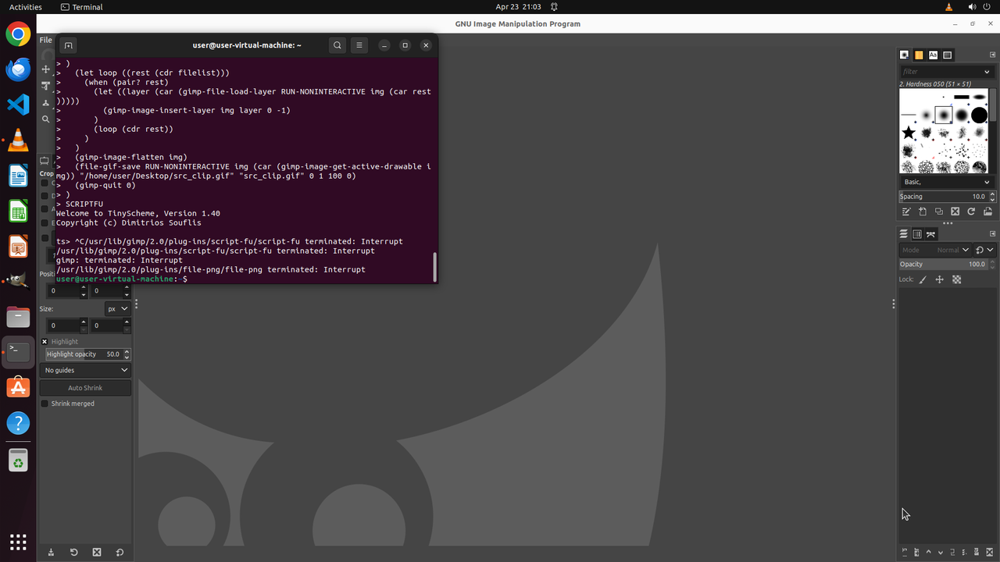

**Response:**
```
I can see it was terminated. The issue is that the Script-Fu approach was loading frames but the `gimp-image-flatten` call would merge all layers into one, destroying the animation. Also, the GIF save needs each layer to be a frame. Let me take a different approach entirely. I'll reduce the number of frames first to make it more manageable, and use the correct GIF export parameters. Let me also avoid flattening the image.
```

**Actions:** `import subprocess, shlex; subprocess.run(f'xdotool type --delay 12 -- ' + shlex.quote('ls ~/Desktop/frames/ | wc -l\n'), shell=True, check=True)
import time; time.sleep(0.05)`

---

## Step 28


**Response:**
```
Good, 116 frames confirmed. Let me try a different approach. I'll write the GIMP Python script properly and use `python-fu-eval` with the code inline. The key issues before were: 1) flattening the image (which destroys layers/frames), and 2) need to convert to indexed color for GIF. Let me write a proper approach:
```

**Actions:** `import subprocess, shlex; subprocess.run(f'xdotool type --delay 12 -- ' + shlex.quote('gimp -i -b \'(python-fu-eval RUN-NONINTERACTIVE 0 "'), shell=True, check=True)
import time; time.sleep(0.05)
impo`

---

## Step 29


**Response:**
```
The GIMP process is running in the background (PID 4143). Let me wait for it to complete processing all 116 frames.
```

**Actions:** `time.sleep(0.5)`

---

## Step 30

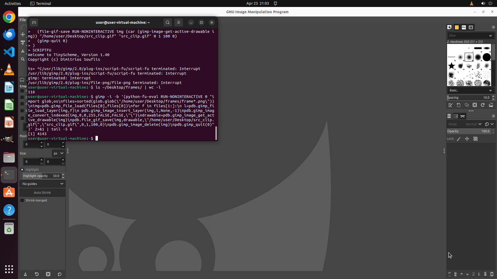

**Response:**
```
The process seems to still be running in the background. Let me check if the GIF file has been created:
```

**Actions:** `import subprocess, shlex; subprocess.run(f'xdotool type --delay 12 -- ' + shlex.quote('ls -la ~/Desktop/src_clip.gif 2>&1\n'), shell=True, check=True)
import time; time.sleep(0.05)`

---

## Step 31

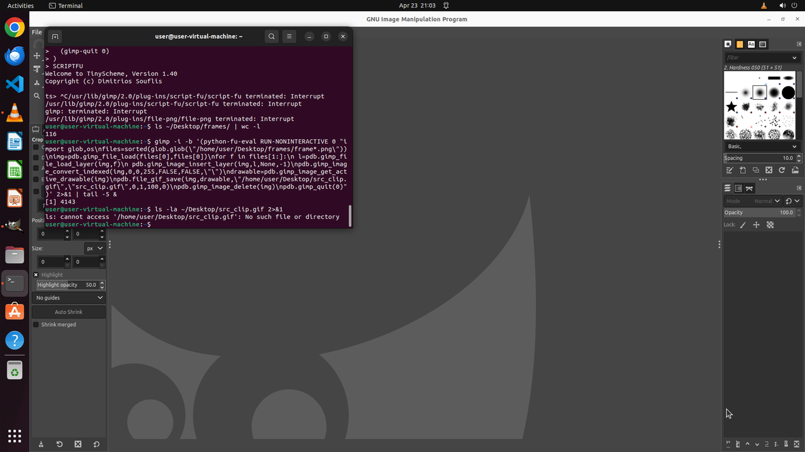

**Response:**
```
The GIF file still wasn't created. The background GIMP process may still be running or may have failed. Let me check if it's still running and also check if there are any error messages. Let me try a completely different approach - I'll use GIMP interactively through the GUI. Let me first kill any remaining GIMP processes and then open GIMP with the frames.
```

**Actions:** `import subprocess, shlex; subprocess.run(f'xdotool type --delay 12 -- ' + shlex.quote('kill %1 2>/dev/null; killall gimp 2>/dev/null; sle'), shell=True, check=True)
import time; time.sleep(0.05)
impor`

---

## Step 32

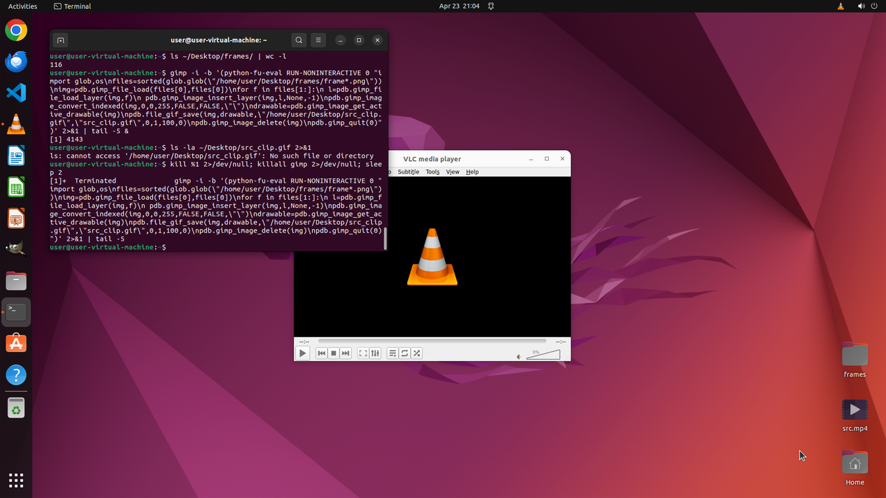

**Response:**
```
Good, GIMP has been terminated. I can see VLC is still open. Let me close VLC and try a different approach. I'll write the Python script to a file and run GIMP with it properly. The issue might have been with the escaping. Let me write a clean script:
```

**Actions:** `pyautogui.click(1212, 343)`

---

## Step 33

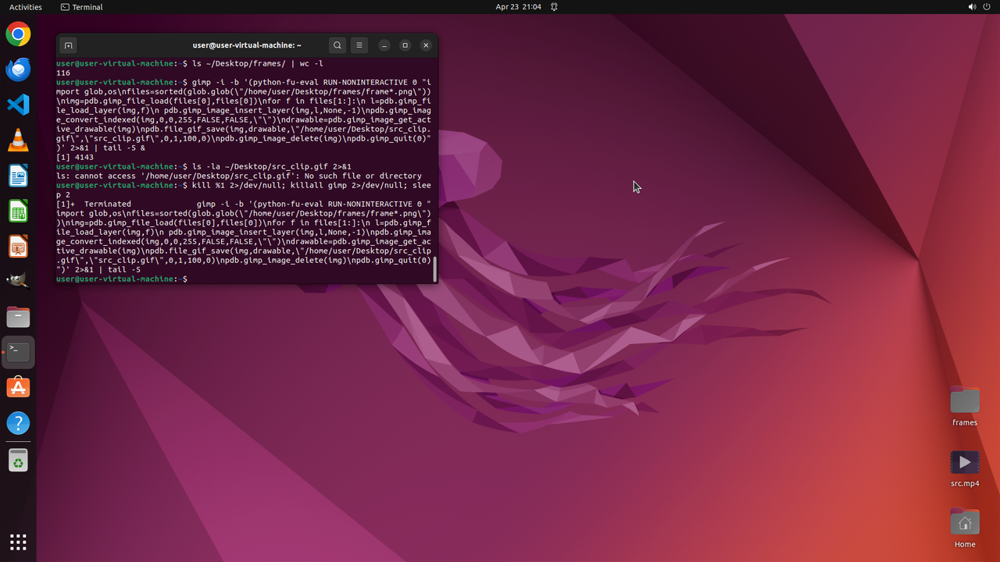

**Response:**
```
Good, VLC is closed. Now let me try a different approach. I'll write the Python script to a file and use GIMP to execute it properly. The issue with the previous attempts was likely related to escaping. Let me create a proper Python-Fu script:
```

**Actions:** `import subprocess, shlex; subprocess.run(f'xdotool type --delay 12 -- ' + shlex.quote("cat > /tmp/gifmaker.py << 'PYEOF'\n#!/usr/bin/env p"), shell=True, check=True)
import time; time.sleep(0.05)
impo`

---

## Step 34

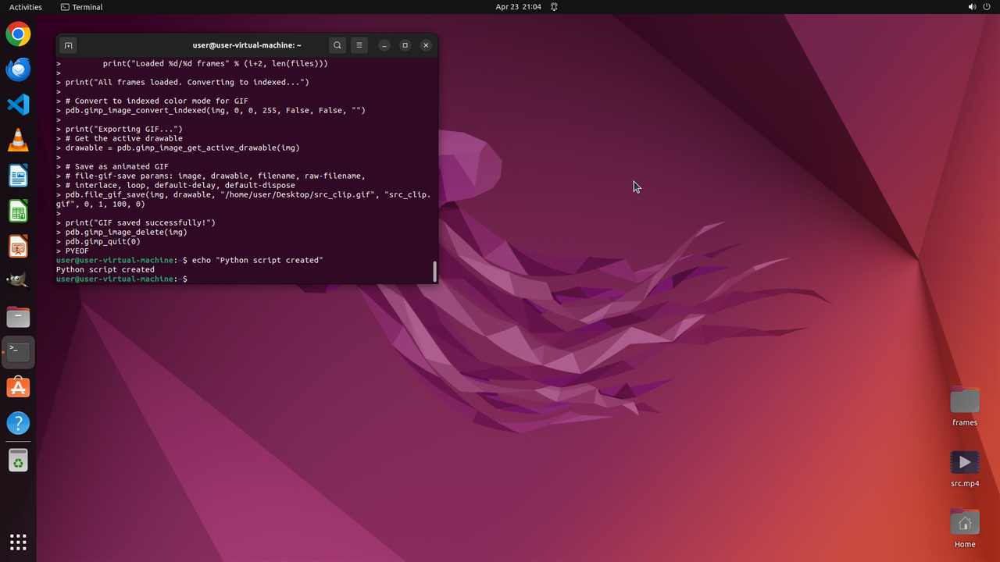

**Response:**
```
The Python script is created. Now let me run GIMP with this script using the correct `python-fu-eval` approach. I need to use `exec(open(...).read())` but with proper escaping:
```

**Actions:** `import subprocess, shlex; subprocess.run(f'xdotool type --delay 12 -- ' + shlex.quote('gimp -i -b \'(python-fu-eval RUN-NONINTERACTIVE 0 "'), shell=True, check=True)
import time; time.sleep(0.05)
impo`

---

## Step 35

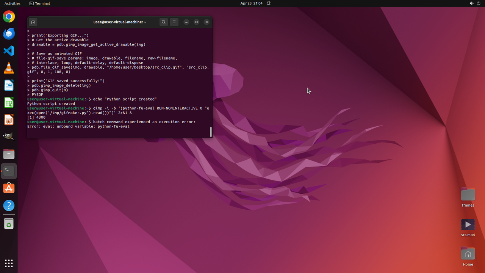

**Response:**
```
I see the error: "unbound variable: python-fu-eval". This means GIMP's Python-Fu plugin might not be available. Let me check if it's installed and try using Script-Fu instead. Let me first kill the GIMP process and check what's available:
```

**Actions:** `import subprocess, shlex; subprocess.run(f'xdotool type --delay 12 -- ' + shlex.quote('kill %1 2>/dev/null; killall gimp 2>/dev/null\n'), shell=True, check=True)
import time; time.sleep(0.05)`

---

## Step 36

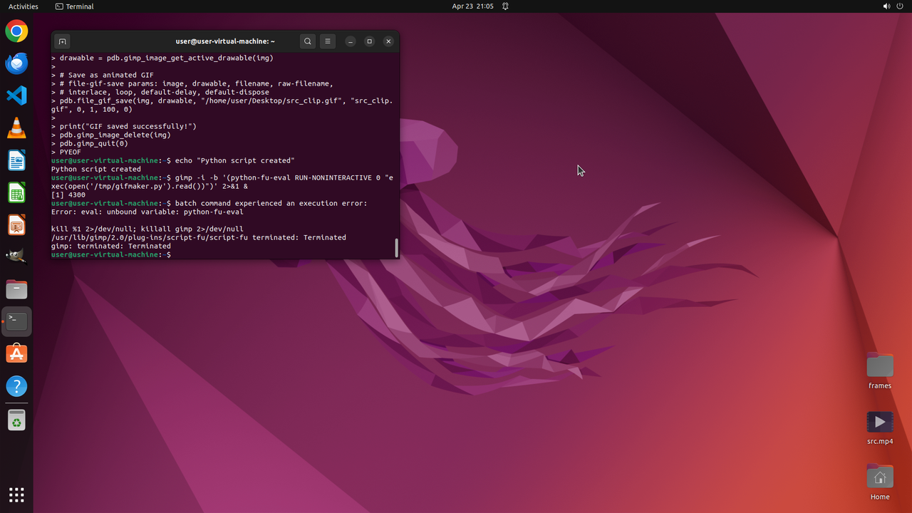

**Response:**
```
The Python-Fu plugin is not available in this GIMP installation. I need to use Script-Fu only. The previous Script-Fu attempt with the heredoc actually seemed to start correctly but may have been waiting for more input. Let me try a different approach - I'll write the entire Script-Fu command as a single line and pass it properly:
```

**Actions:** `import subprocess, shlex; subprocess.run(f'xdotool type --delay 12 -- ' + shlex.quote('dpkg -l | grep gimp-python 2>/dev/null; apt list -'), shell=True, check=True)
import time; time.sleep(0.05)
impor`

---

## Step 37

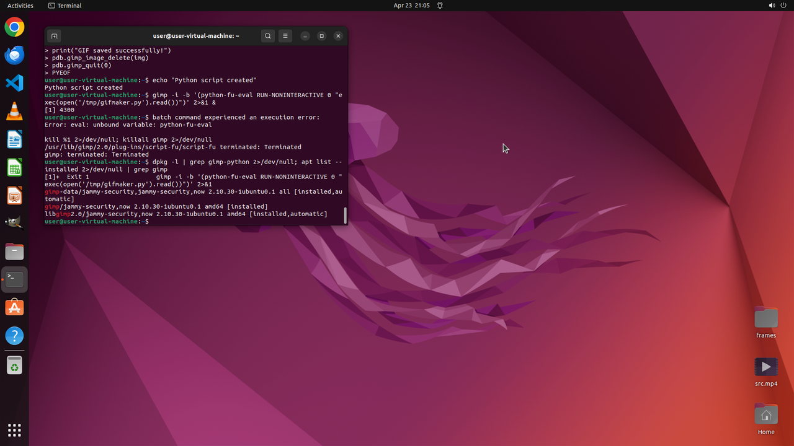

**Response:**
```
I can see that `gimp-python` is NOT installed - only `gimp`, `gimp-data`, and `libgimp2.0` are installed. So I need to either install `gimp-python` or use Script-Fu. Let me try to use Script-Fu properly. The key issue with the previous Script-Fu attempt was that it used a heredoc which kept stdin open. Let me write the Script-Fu to a file and use it:
```

**Actions:** `import subprocess, shlex; subprocess.run(f'xdotool type --delay 12 -- ' + shlex.quote("cat > /tmp/gifmaker.scm << 'SCMEOF'\n(let* (\n  (fil"), shell=True, check=True)
import time; time.sleep(0.05)
imp`

---

## Step 38


**Response:**
```
Good, the Script-Fu file is created. Now let me run GIMP with this script. I'll read the file content and pass it to GIMP's `-b` option:
```

**Actions:** `import subprocess, shlex; subprocess.run(f'xdotool type --delay 12 -- ' + shlex.quote('gimp -i -b "$(cat /tmp/gifmaker.scm)" 2>&1 &\n'), shell=True, check=True)
import time; time.sleep(0.05)`

---

## Step 39

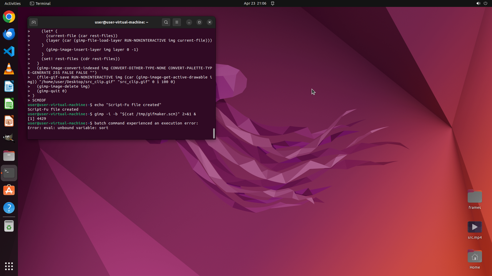

**Response:**
```
The error is "unbound variable: sort" - Script-Fu's TinyScheme doesn't have a built-in `sort` function. Let me fix the script by removing the sort (since `file-glob` already returns files and the frame filenames are zero-padded so they'll be in order):
```

**Actions:** `import subprocess, shlex; subprocess.run(f'xdotool type --delay 12 -- ' + shlex.quote('kill %1 2>/dev/null; killall gimp 2>/dev/null; sle'), shell=True, check=True)
import time; time.sleep(0.05)
impor`

---

## Step 40

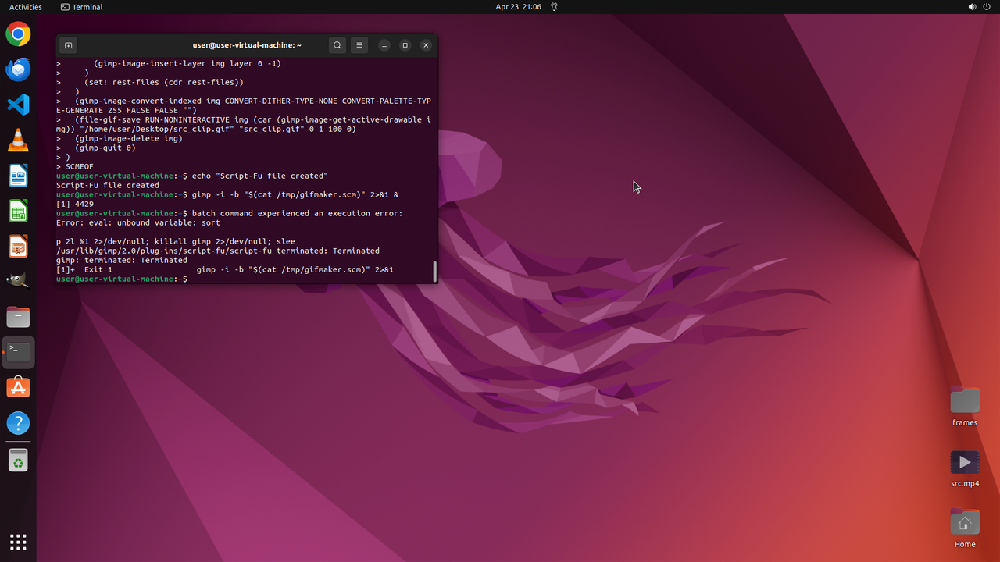

**Response:**
```
Good, GIMP is killed. Now let me fix the script by removing the `sort` function and just using the file-glob results directly (which should already be in order since the filenames are zero-padded):
```

**Actions:** `import subprocess, shlex; subprocess.run(f'xdotool type --delay 12 -- ' + shlex.quote("cat > /tmp/gifmaker2.scm << 'SCMEOF'\n(let* (\n  (fi"), shell=True, check=True)
import time; time.sleep(0.05)
imp`

---

## Step 41

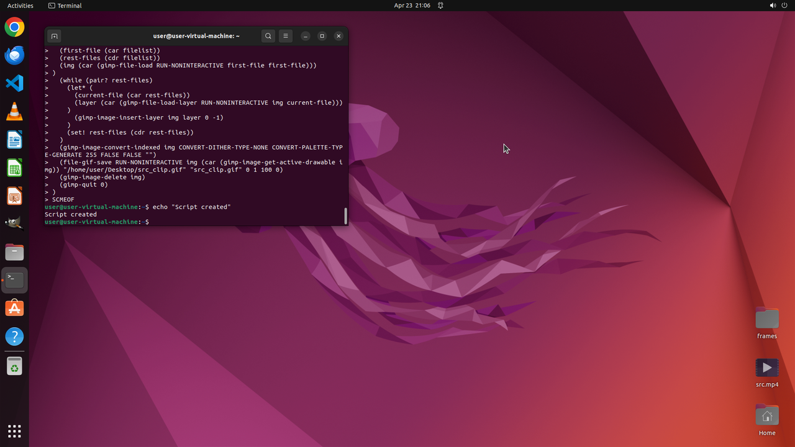

**Response:**
```
Good, the script is created. Now let me run GIMP with this script:
```

**Actions:** `import subprocess, shlex; subprocess.run(f'xdotool type --delay 12 -- ' + shlex.quote('gimp -i -b "$(cat /tmp/gifmaker2.scm)" 2>&1 &\n'), shell=True, check=True)
import time; time.sleep(0.05)`

---

## Step 42

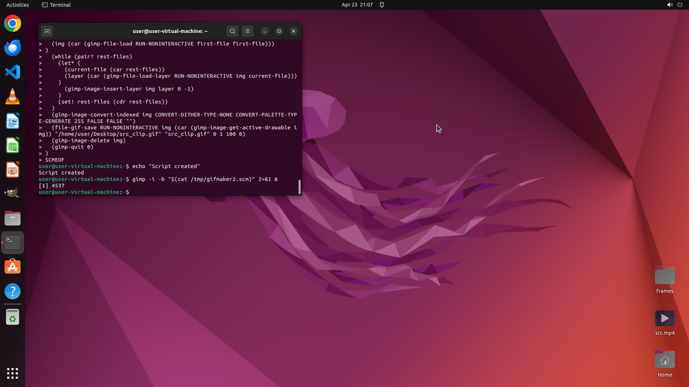

**Response:**
```
GIMP is running in the background (PID 4537) and no immediate error this time. Let me wait for it to process all 116 frames and create the GIF. This might take a few minutes.
```

**Actions:** `time.sleep(0.5)`

---

## Step 43


**Response:**
```
The process is still running. Let me check if the GIF file has been created and also check if the GIMP process is still active:
```

**Actions:** `import subprocess, shlex; subprocess.run(f'xdotool type --delay 12 -- ' + shlex.quote('ls -la ~/Desktop/src_clip.gif 2>&1; ps aux | grep '), shell=True, check=True)
import time; time.sleep(0.05)
impor`

---

## Step 44

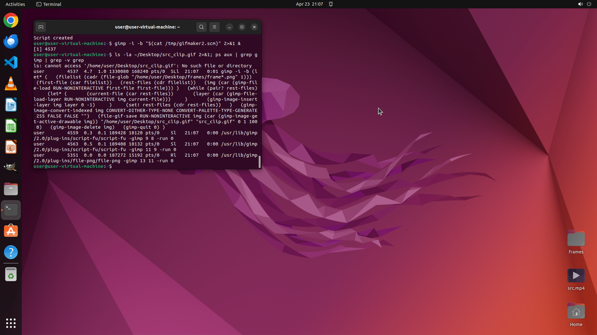

**Response:**
```
GIMP is actively running and I can see it's using the `file-png` plugin (loading PNG frames). The process is actively working. The GIF hasn't been created yet because it's still loading frames. Let me wait longer for it to finish:
```

**Actions:** `time.sleep(0.5)`

---

## Step 45

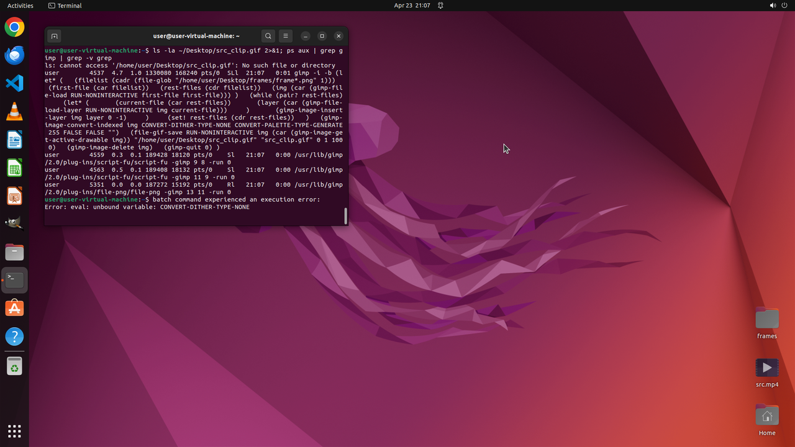

**Response:**
```
I can see the error: "unbound variable: CONVERT-DITHER-TYPE-NONE". The constant names are different in this version of GIMP. Let me fix the script using numeric values instead of constant names. Let me kill GIMP and try again:
```

**Actions:** `import subprocess, shlex; subprocess.run(f'xdotool type --delay 12 -- ' + shlex.quote('kill %1 2>/dev/null; killall gimp 2>/dev/null; sle'), shell=True, check=True)
import time; time.sleep(0.05)
impor`

---

## Step 46

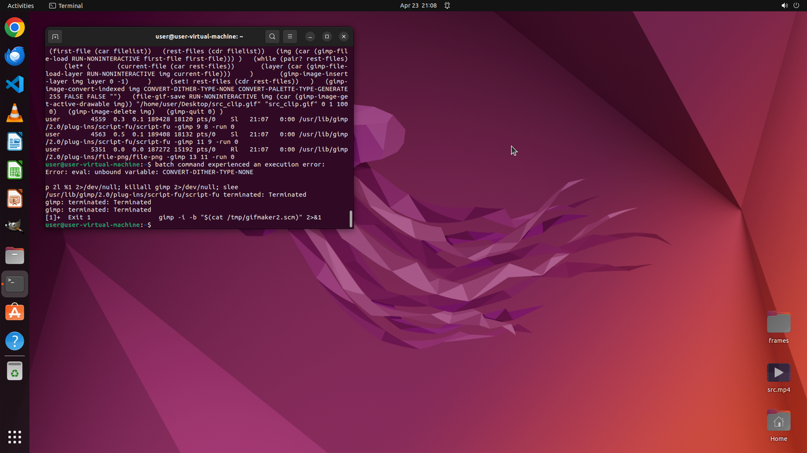

**Response:**
```
Good, GIMP is killed. Now let me fix the script using numeric values instead of the constant names. In GIMP, `CONVERT-DITHER-TYPE-NONE` = 0 and `CONVERT-PALETTE-TYPE-GENERATE` = 0:
```

**Actions:** `import subprocess, shlex; subprocess.run(f'xdotool type --delay 12 -- ' + shlex.quote("cat > /tmp/gifmaker3.scm << 'SCMEOF'\n(let* (\n  (fi"), shell=True, check=True)
import time; time.sleep(0.05)
imp`

---

## Step 47


**Response:**
```
GIMP is running in the background (PID 5715) and no immediate error. The script looks correct now with numeric values instead of constants. Let me wait for it to process all 116 frames.
```

**Actions:** `time.sleep(0.5)`

---

## Step 48

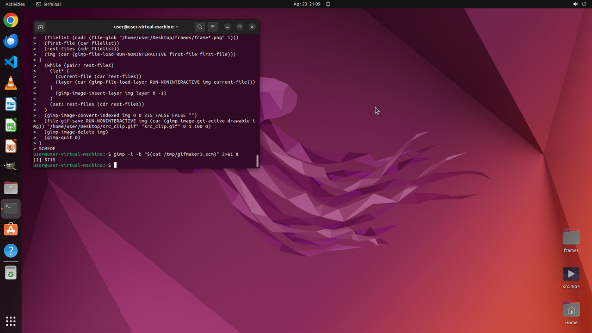

**Response:**
```
Let me check if the GIF was created and if GIMP is still running:
```

**Actions:** `import subprocess, shlex; subprocess.run(f'xdotool type --delay 12 -- ' + shlex.quote('ls -la ~/Desktop/src_clip.gif 2>&1; ps aux | grep '), shell=True, check=True)
import time; time.sleep(0.05)
impor`

---

## Step 49

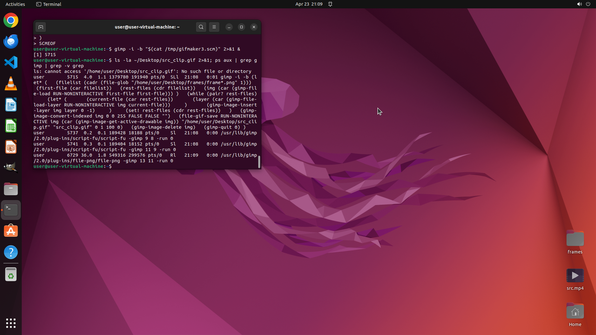

**Response:**
```
GIMP is still running and actively processing - I can see the `file-png` plugin is running (PID 6729 with growing memory usage). The GIF hasn't been created yet because it's still loading frames. The process is using 549MB of memory which shows it's loading many image frames. Let me wait more:
```

**Actions:** `time.sleep(0.5)`

---

## Step 50

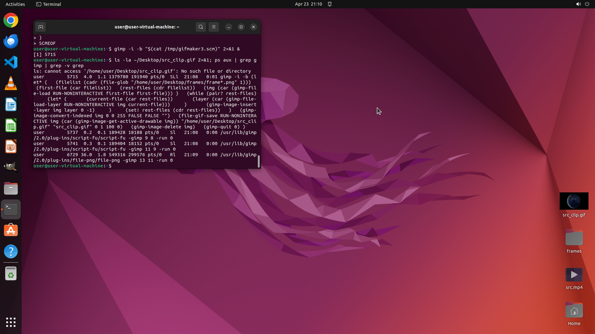

**Response:**
```
I can see `src_clip.gif` has been created on the desktop! The GIF file icon is visible in the bottom-right corner of the desktop. Let me verify it by checking the file:
```

**Actions:** `import subprocess, shlex; subprocess.run(f'xdotool type --delay 12 -- ' + shlex.quote('ls -la ~/Desktop/src_clip.gif\n'), shell=True, check=True)
import time; time.sleep(0.05)`

---

## Step 51

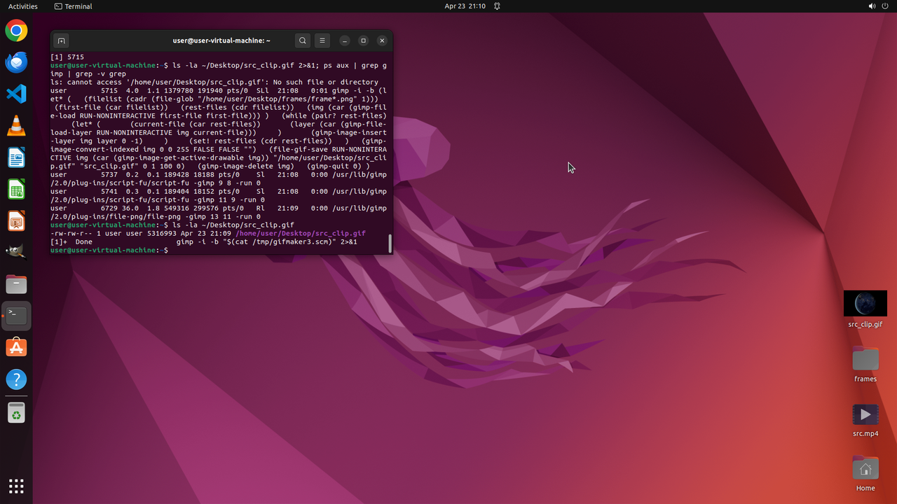

**Response:**
```
The animated GIF `src_clip.gif` has been successfully created on the desktop! I can see:

- **File**: `/home/user/Desktop/src_clip.gif`
- **Size**: 5,316,993 bytes (~5.3 MB)
- **Created**: Apr 23 21:09
- The GIMP batch process completed successfully (`[1]+ Done`)

The GIF was created by:
1. Using VLC to extract 116 frames from `src.mp4` (5-second clip starting at 00:03)
2. Using GIMP's Script-Fu to load all frames as layers, convert to indexed color, and export as an animated GIF

The file is visible on the desktop as `src_clip.gif`.

DONE
```

**Actions:** `DONE`

---
