# Task 337d318b-aa07-4f4f-b763-89d9a2dd013f

**Instruction:** Cross-check the invoices with the bank statements and identify any discrepancies. Then pull out the invoices that don't match the statements and put them in the "problematic" folder.

**Score:** 1.0

**Wall clock:** 5m 35s

**Steps:** 26

**Cost:** $0.80

---

## Step 1

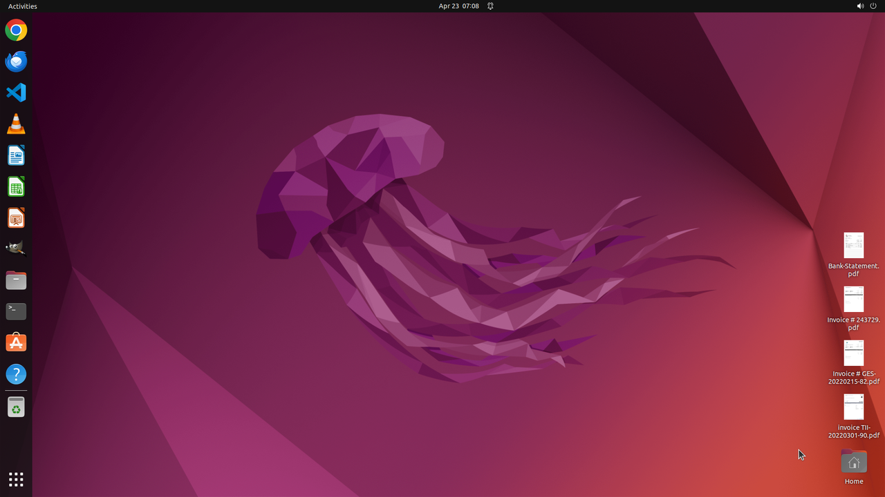

**Response:**
```
I need to examine the bank statement and all invoices on the desktop, then identify discrepancies and move problematic invoices to a "problematic" folder. Let me start by opening each file.

First, let me open the Bank Statement PDF.
```

**Actions:** `pyautogui.doubleClick(1836, 547)`

---

## Step 2

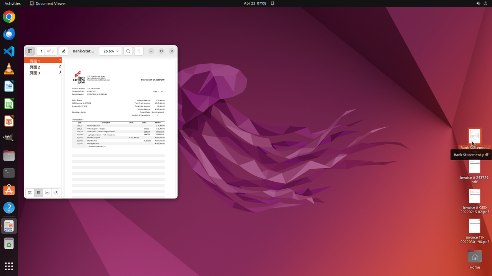

**Response:**
```
I can see the bank statement is open. Let me zoom in to read the transaction details more clearly.
```

**Actions:** `pyautogui.scroll(3, 450, 525)`

---

## Step 3


**Response:**
```
I need to zoom in more to read the bank statement details clearly. Let me increase the zoom level.
```

**Actions:** `pyautogui.click(435, 199)`

---

## Step 4

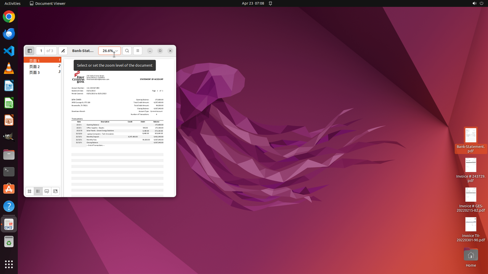

**Response:**
```
Let me zoom in by changing the zoom level. I'll click on the zoom dropdown and select a higher zoom.
```

**Actions:** `pyautogui.tripleClick(435, 199)`

---

## Step 5


**Response:**
```
Good, the zoom field is selected. Let me type a higher zoom percentage.
```

**Actions:** `import subprocess, shlex; subprocess.run(f'xdotool type --delay 12 -- ' + shlex.quote('80\n'), shell=True, check=True)
import time; time.sleep(0.05)`

---

## Step 6

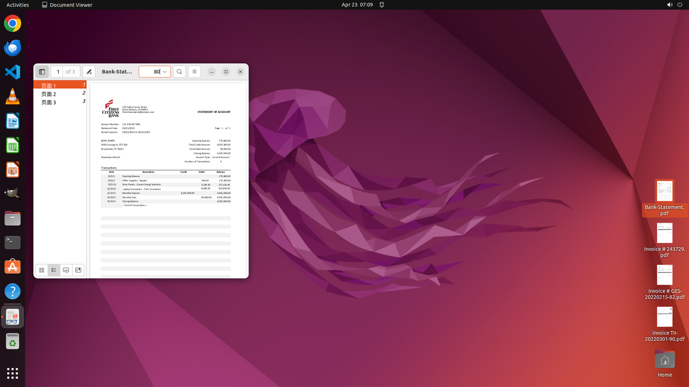

**Response:**
```
The zoom doesn't seem to have changed the view much. Let me try a higher zoom level and maximize the window first for better viewing.
```

**Actions:** `pyautogui.click(631, 199)`

---

## Step 7

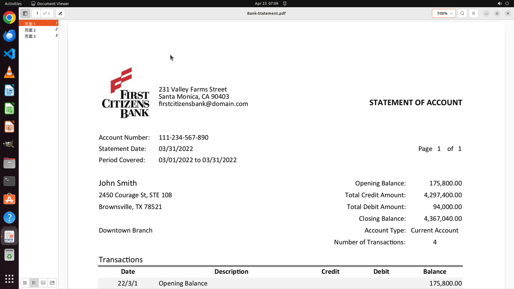

**Response:**
```
Now I can see the bank statement clearly. It's from First Citizens Bank for John Smith, account 111-234-567-890, period 03/01/2022 to 03/31/2022. I can see:
- Opening Balance: 175,800.00
- Total Credit Amount: 4,297,400.00
- Total Debit Amount: 94,000.00
- Closing Balance: 4,367,040.00
- Number of Transactions: 4

Let me scroll down to see the transaction details.
```

**Actions:** `pyautogui.scroll(-5, 960, 600)`

---

## Step 8

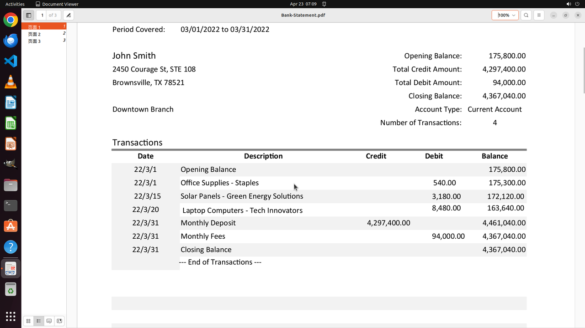

**Response:**
```
Now I can clearly see the bank statement transactions. Let me record them:

**Bank Statement Transactions:**
1. 22/3/1 - Opening Balance: 175,800.00
2. 22/3/1 - Office Supplies - Staples: Debit 540.00, Balance 175,300.00 (Wait, 175,800 - 540 = 175,260, but it shows 175,300.00)
3. 22/3/15 - Solar Panels - Green Energy Solutions: Debit 3,180.00, Balance 172,120.00
4. 22/3/20 - Laptop Computers - Tech Innovators: Debit 8,480.00, Balance 163,640.00
5. 22/3/31 - Monthly Deposit: Credit 4,297,400.00, Balance 4,461,040.00
6. 22/3/31 - Monthly Fees: Debit 94,000.00, Balance 4,367,040.00
7. 22/3/31 - Closing Balance: 4,367,040.00

Now let me check page 2 and 3 for more details, then open the invoices. Let me first check the other pages.
```

**Actions:** `pyautogui.click(112, 111)`

---

## Step 9

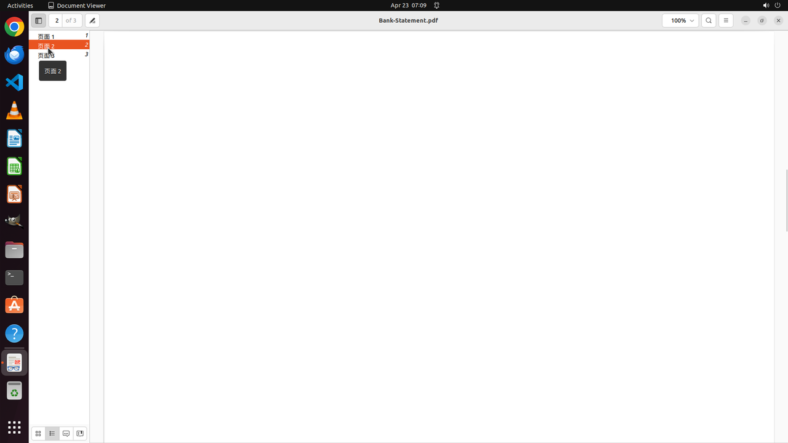

**Response:**
```
Pages 2 and 3 appear to be blank. The bank statement has all the transaction information on page 1. Now let me open the first invoice. Let me open Invoice # 243729.pdf.
```

**Actions:** `pyautogui.click(1888, 49)`

---

## Step 10

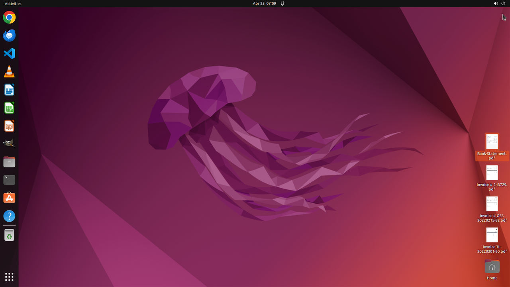

**Response:**
```
Good, the bank statement is closed. Now let me open the first invoice - Invoice # 243729.pdf.
```

**Actions:** `pyautogui.doubleClick(1836, 670)`

---

## Step 11

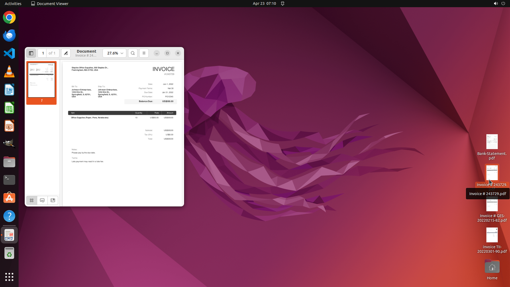

**Response:**
```
I can see Invoice #243729. Let me maximize it to read the details better.
```

**Actions:** `pyautogui.click(631, 199)`

---

## Step 12

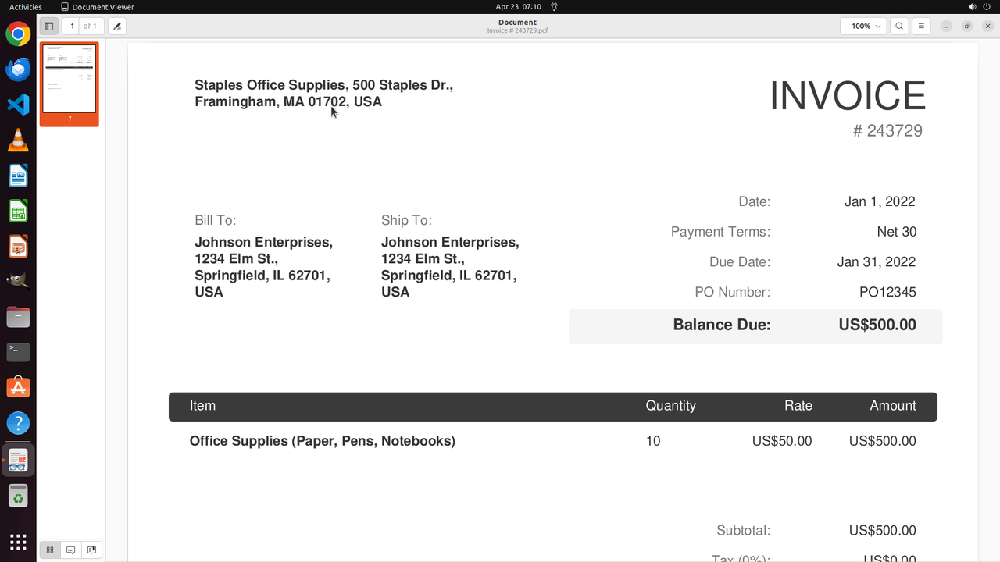

**Response:**
```
Now I can clearly see Invoice #243729. Let me note the details:

**Invoice #243729:**
- From: Staples Office Supplies, 500 Staples Dr., Framingham, MA 01702, USA
- Bill To: Johnson Enterprises, 1234 Elm St., Springfield, IL 62701, USA
- Date: Jan 1, 2022
- Due Date: Jan 31, 2022
- PO Number: PO12345
- Balance Due: US$500.00
- Item: Office Supplies (Paper, Pens, Notebooks) - Qty 10 × US$50.00 = US$500.00

Let me scroll down to see the total.
```

**Actions:** `pyautogui.scroll(-3, 960, 600)`

---

## Step 13

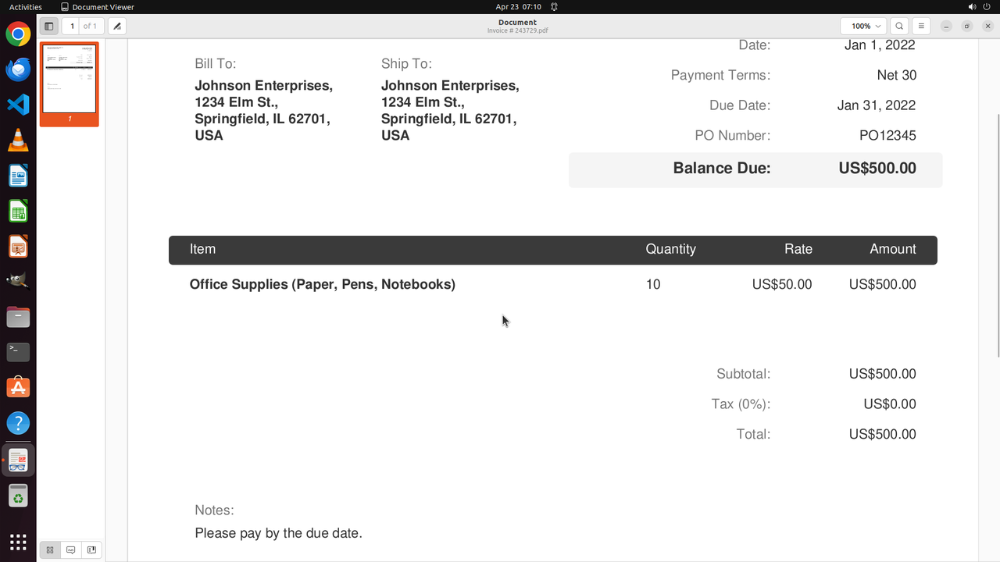

**Response:**
```
I can see the full invoice details:

**Invoice #243729 (Staples Office Supplies):**
- Total: US$500.00
- Item: Office Supplies (Paper, Pens, Notebooks) - 10 × $50.00
- Tax: $0.00

Now comparing with the bank statement:
- Bank statement shows: "Office Supplies - Staples" with Debit of $540.00
- Invoice shows: Total of $500.00
- **Discrepancy: $540 vs $500 - a $40 difference!**

Now let me close this and open the next invoice. Let me close this document.
```

**Actions:** `pyautogui.click(1888, 49)`

---

## Step 14

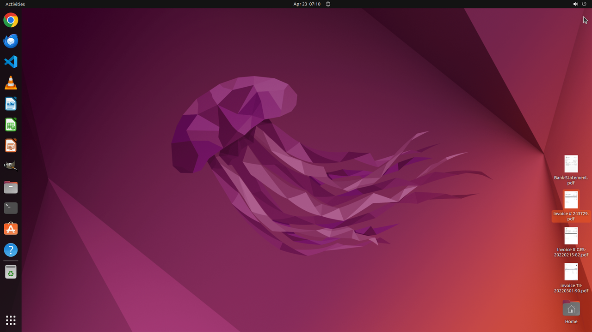

**Response:**
```
Now let me open the second invoice - Invoice # GES-20220215-82.pdf.
```

**Actions:** `pyautogui.doubleClick(1836, 787)`

---

## Step 15

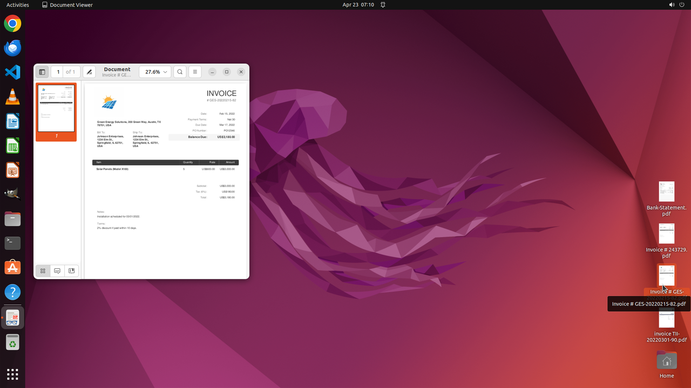

**Response:**
```
I can see Invoice # GES-20220215-82. Let me maximize it to read the details clearly.
```

**Actions:** `pyautogui.click(631, 199)`

---

## Step 16

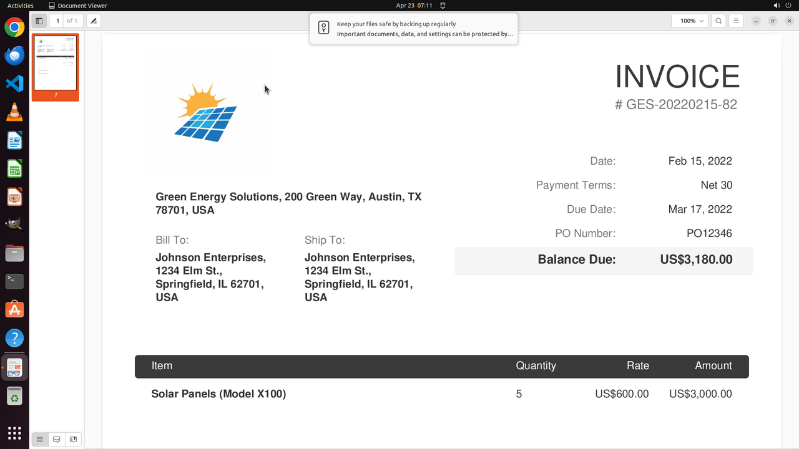

**Response:**
```
Now I can clearly see Invoice # GES-20220215-82:

**Invoice # GES-20220215-82 (Green Energy Solutions):**
- From: Green Energy Solutions, 200 Green Way, Austin, TX 78701, USA
- Bill To: Johnson Enterprises, 1234 Elm St., Springfield, IL 62701, USA
- Date: Feb 15, 2022
- Due Date: Mar 17, 2022
- PO Number: PO12346
- Balance Due: US$3,180.00
- Item: Solar Panels (Model X100) - Qty 5 × US$600.00 = US$3,000.00

Let me scroll down to see the totals.
```

**Actions:** `pyautogui.scroll(-3, 960, 600)`

---

## Step 17

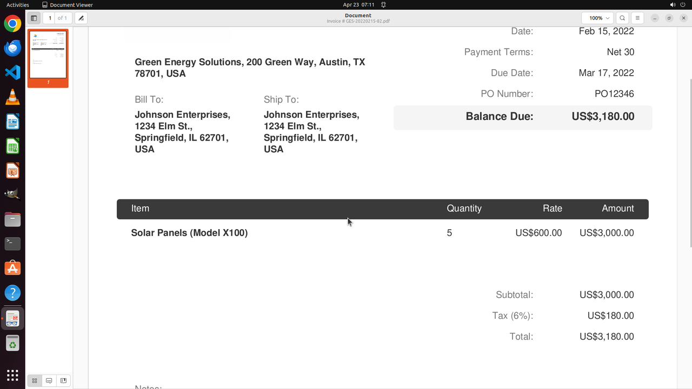

**Response:**
```
Now I can see the full details of Invoice # GES-20220215-82:

**Invoice # GES-20220215-82 (Green Energy Solutions):**
- Subtotal: US$3,000.00
- Tax (6%): US$180.00
- Total: US$3,180.00

Comparing with bank statement:
- Bank statement shows: "Solar Panels - Green Energy Solutions" with Debit of $3,180.00
- Invoice shows: Total of $3,180.00
- **This matches! No discrepancy.**

Now let me close this and open the third invoice.
```

**Actions:** `pyautogui.click(1888, 49)`

---

## Step 18


**Response:**
```
Now let me open the third invoice - Invoice TII-20220301-90.pdf.
```

**Actions:** `pyautogui.doubleClick(1836, 900)`

---

## Step 19

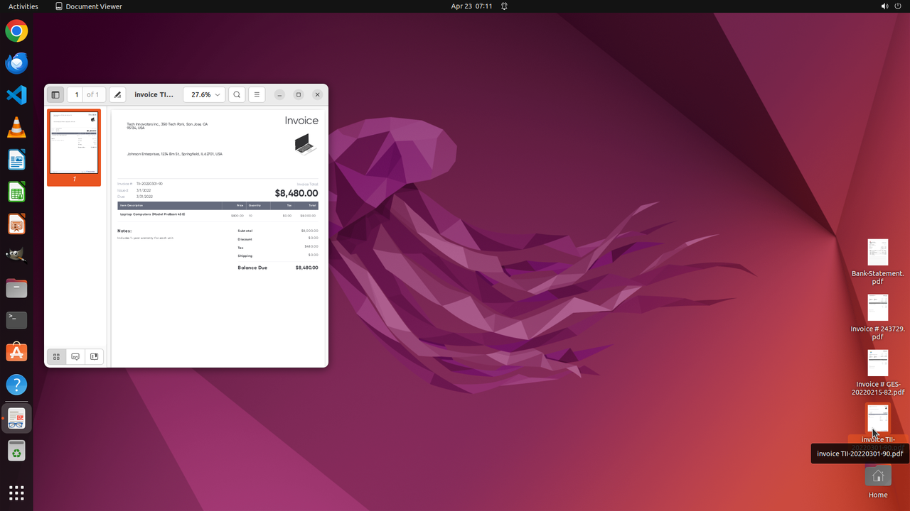

**Response:**
```
I can see Invoice TII-20220301-90. Let me maximize it to read the details clearly.
```

**Actions:** `pyautogui.click(631, 199)`

---

## Step 20

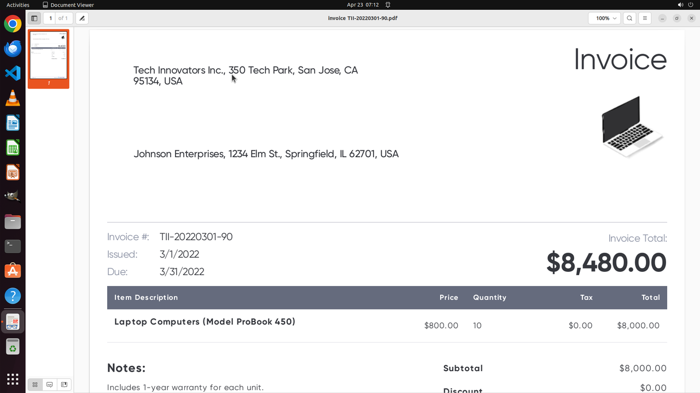

**Response:**
```
Excellent! Now I can clearly see Invoice TII-20220301-90:

**Invoice TII-20220301-90 (Tech Innovators Inc.):**
- From: Tech Innovators Inc., 350 Tech Park, San Jose, CA 95134, USA
- Bill To: Johnson Enterprises, 1234 Elm St., Springfield, IL 62701, USA
- Invoice #: TII-20220301-90
- Issued: 3/1/2022
- Due: 3/31/2022
- Invoice Total: $8,480.00
- Item: Laptop Computers (Model ProBook 450) - Price $800.00, Qty 10, Tax $0.00, Total $8,000.00
- Subtotal: $8,000.00
- Discount: $0.00

Let me scroll down to see the full totals.
```

**Actions:** `pyautogui.scroll(-3, 960, 600)`

---

## Step 21

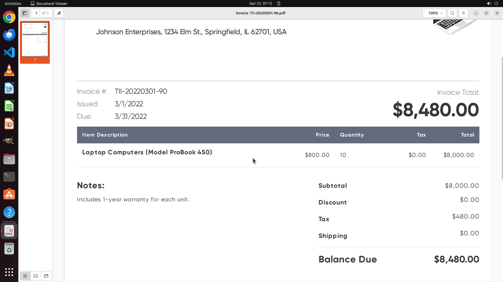

**Response:**
```
Now I can see all the details of Invoice TII-20220301-90:

**Invoice TII-20220301-90 (Tech Innovators Inc.):**
- Subtotal: $8,000.00
- Discount: $0.00
- Tax: $480.00
- Shipping: $0.00
- Balance Due: $8,480.00

Comparing with bank statement:
- Bank statement shows: "Laptop Computers - Tech Innovators" with Debit of $8,480.00
- Invoice shows: Total of $8,480.00
- **This matches! No discrepancy.**

Now let me summarize my findings:

| Invoice | Invoice Amount | Bank Statement Amount | Match? |
|---------|---------------|----------------------|--------|
| #243729 (Staples - Office Supplies) | $500.00 | $540.00 | **NO - $40 discrepancy** |
| #GES-20220215-82 (Green Energy - Solar Panels) | $3,180.00 | $3,180.00 | YES |
| #TII-20220301-90 (Tech Innovators - Laptops) | $8,480.00 | $8,480.00 | YES |

So Invoice #243729 is the problematic one. I need to:
1. Create a "problematic" folder on the desktop
2. Move Invoice #243729.pdf into it

Let me close this document and proceed.
```

**Actions:** `pyautogui.click(1888, 49)`

---

## Step 22

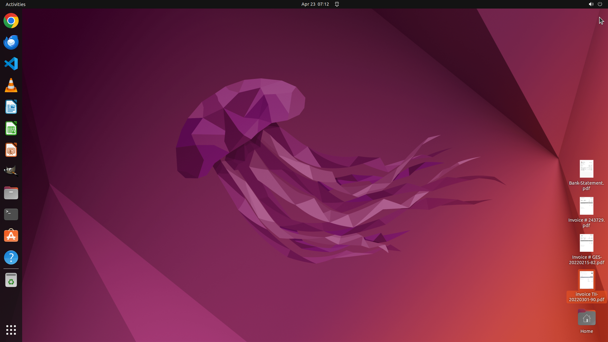

**Response:**
```
Now I need to create a "problematic" folder on the desktop and move Invoice #243729.pdf into it. Let me open a terminal to do this.
```

**Actions:** `pyautogui.click(33, 673)`

---

## Step 23


**Response:**
```
The terminal is open. Now I'll create a "problematic" folder on the desktop and move the discrepant invoice into it.
```

**Actions:** `import subprocess, shlex; subprocess.run(f'xdotool type --delay 12 -- ' + shlex.quote('mkdir ~/Desktop/problematic\n'), shell=True, check=True)
import time; time.sleep(0.05)`

---

## Step 24

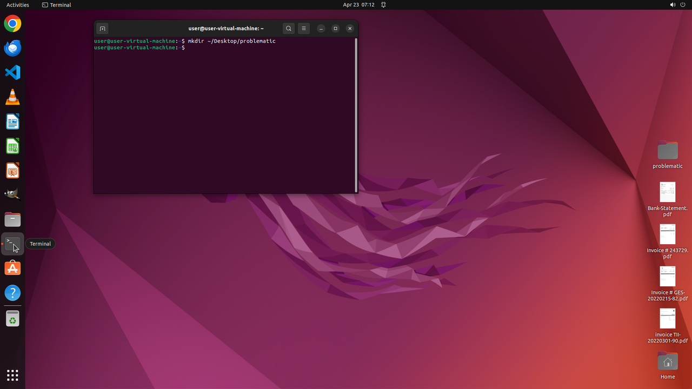

**Response:**
```
The "problematic" folder has been created on the desktop. Now I need to move Invoice # 243729.pdf into it. This is the invoice that has a discrepancy ($500 on the invoice vs $540 on the bank statement).
```

**Actions:** `import subprocess, shlex; subprocess.run(f'xdotool type --delay 12 -- ' + shlex.quote('mv ~/Desktop/"Invoice # 243729.pdf" ~/Desktop/prob'), shell=True, check=True)
import time; time.sleep(0.05)
impor`

---

## Step 25

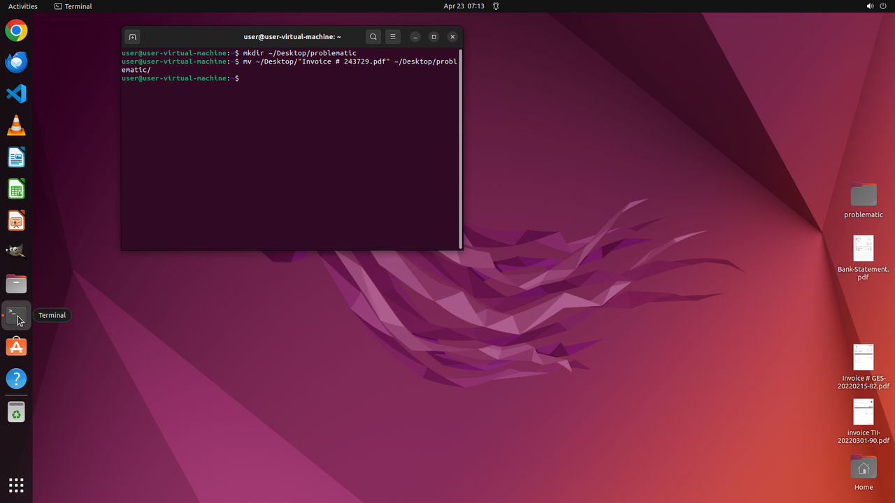

**Response:**
```
The invoice has been moved successfully. I can see that:

1. The "problematic" folder is on the desktop
2. Invoice # 243729.pdf is no longer visible on the desktop (it was moved to the problematic folder)
3. The remaining invoices (Invoice # GES-20220215-82.pdf and Invoice TII-20220301-90.pdf) are still on the desktop as they matched the bank statement

Let me verify the file was moved correctly by listing the contents of the problematic folder.
```

**Actions:** `import subprocess, shlex; subprocess.run(f'xdotool type --delay 12 -- ' + shlex.quote('ls ~/Desktop/problematic/\n'), shell=True, check=True)
import time; time.sleep(0.05)`

---

## Step 26

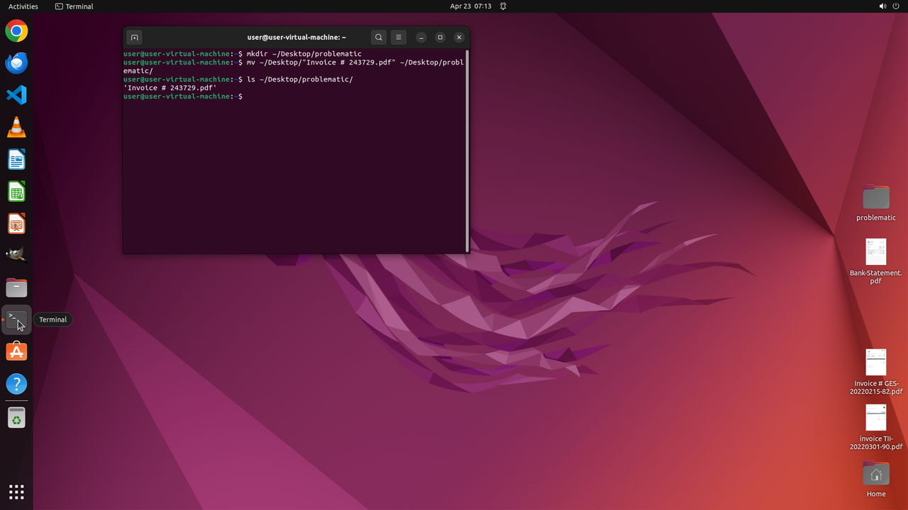

**Response:**
```
The task is complete. The terminal confirms that "Invoice # 243729.pdf" is now in the "problematic" folder.

Here's a summary of the cross-check findings:

**Discrepancies Found:**
1. **Invoice # 243729 (Staples Office Supplies)** - The invoice total is **$500.00** but the bank statement shows a debit of **$540.00** — a **$40 discrepancy**. This invoice was moved to the "problematic" folder.

**Matching Invoices (no issues):**
2. **Invoice # GES-20220215-82 (Green Energy Solutions)** - Invoice total: $3,180.00, Bank statement: $3,180.00 ✓
3. **Invoice TII-20220301-90 (Tech Innovators Inc.)** - Invoice total: $8,480.00, Bank statement: $8,480.00 ✓

DONE
```

**Actions:** `DONE`

---
