# Task 3680a5ee-6870-426a-a997-eba929a0d25c

**Instruction:** I have file1.xlsx and file2.ods on my Desktop, each containing a single column. Using only the command line, help me merge these two columns into a single column by concatenating the strings from both rows, save the result as ~/Desktop/output.csv, and open it in LibreOffice Calc from the terminal

**Score:** N/A

**Steps:** 77

---

## Step 1

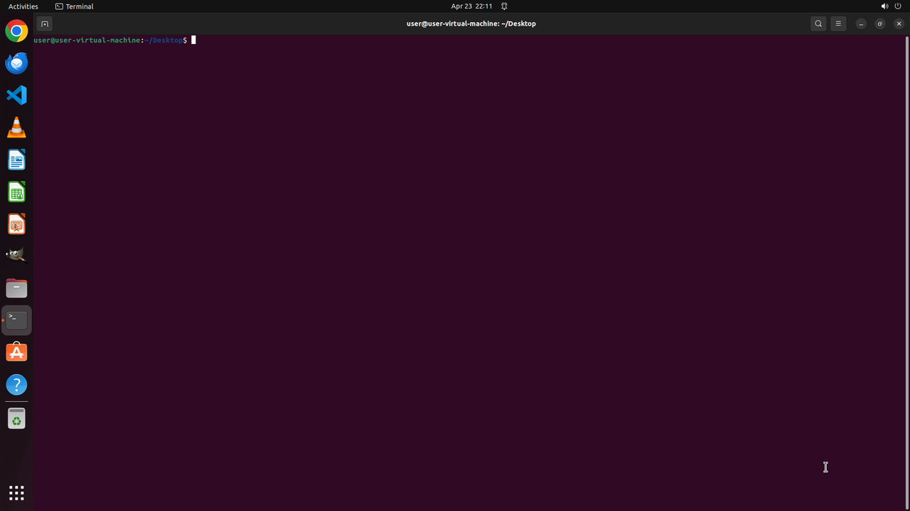

**Response:**
```
Let me first check the contents of the files to understand what we're working with.
```

**Actions:** `import subprocess, shlex; subprocess.run(f'xdotool type --delay 12 -- ' + shlex.quote('ls ~/Desktop/\n'), shell=True, check=True)
import time; time.sleep(0.05)`

---

## Step 2

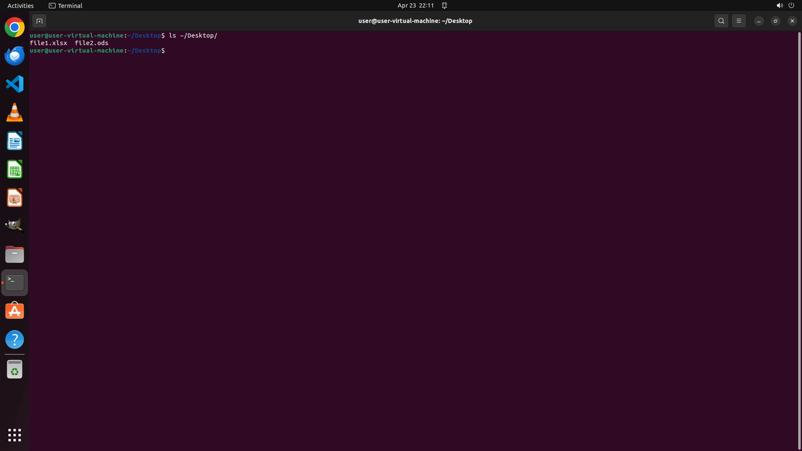

**Response:**
```
Good, I can see both files. Let me first convert them to CSV using LibreOffice command line, then examine their contents.
```

**Actions:** `import subprocess, shlex; subprocess.run(f'xdotool type --delay 12 -- ' + shlex.quote('cd ~/Desktop && libreoffice --headless --convert-t'), shell=True, check=True)
import time; time.sleep(0.05)
impor`

---

## Step 3

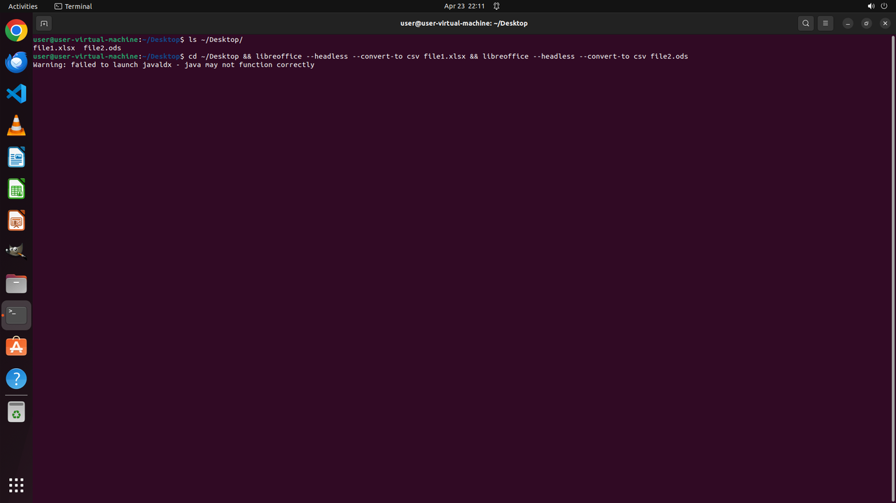

**Response:**
```
It seems to be processing. Let me wait a moment for the conversion to complete.
```

**Actions:** `time.sleep(0.5)`

---

## Step 4

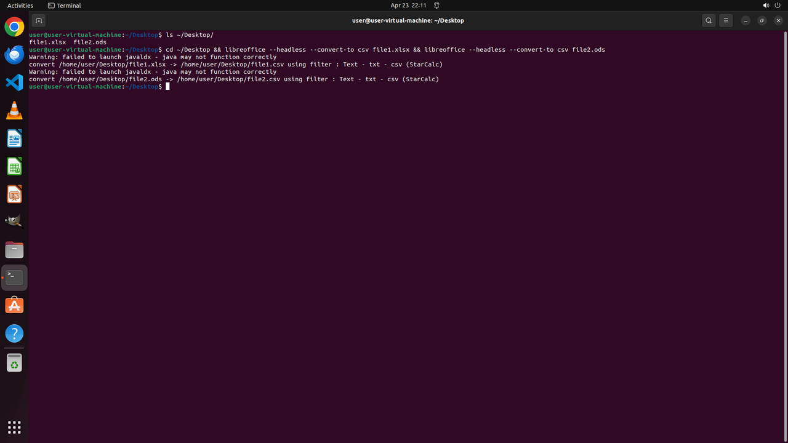

**Response:**
```
Both files have been converted to CSV. Now let me examine their contents.
```

**Actions:** `import subprocess, shlex; subprocess.run(f'xdotool type --delay 12 -- ' + shlex.quote('cat file1.csv && echo "---" && cat file2.csv\n'), shell=True, check=True)
import time; time.sleep(0.05)`

---

## Step 5

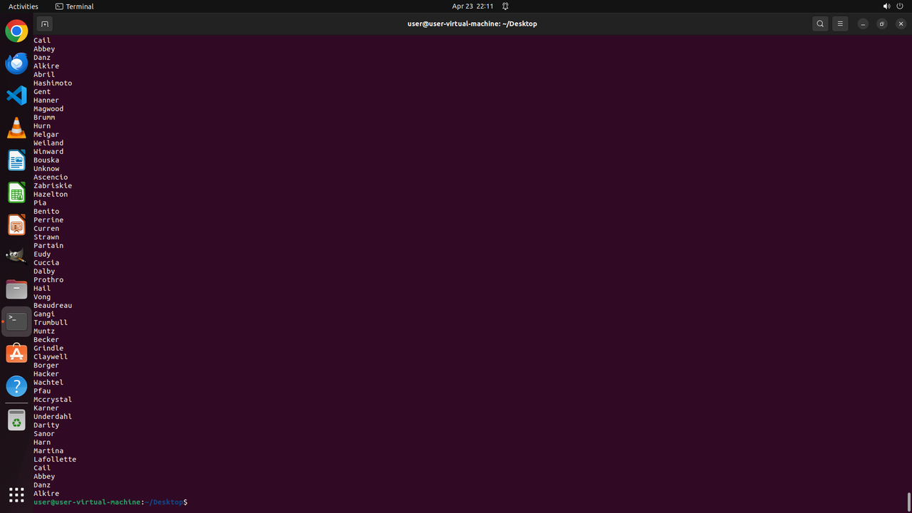

**Response:**
```
I can see the data. Let me scroll up to see the full content and the separator between the two files.
```

**Actions:** `pyautogui.scroll(10, 960, 600)`

---

## Step 6

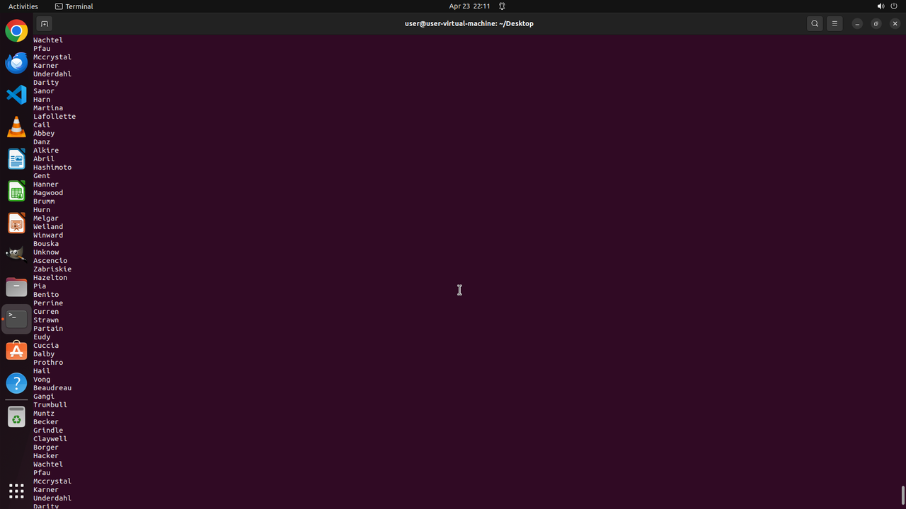

**Response:**
```
I can see the data is a list of names (last names). It looks like file1.csv and file2.csv each have a single column of names. The task is to merge them by concatenating strings from both rows (row by row). Let me check the number of lines in each file and understand the structure better.
```

**Actions:** `import subprocess, shlex; subprocess.run(f'xdotool type --delay 12 -- ' + shlex.quote('wc -l file1.csv file2.csv\n'), shell=True, check=True)
import time; time.sleep(0.05)`

---

## Step 7

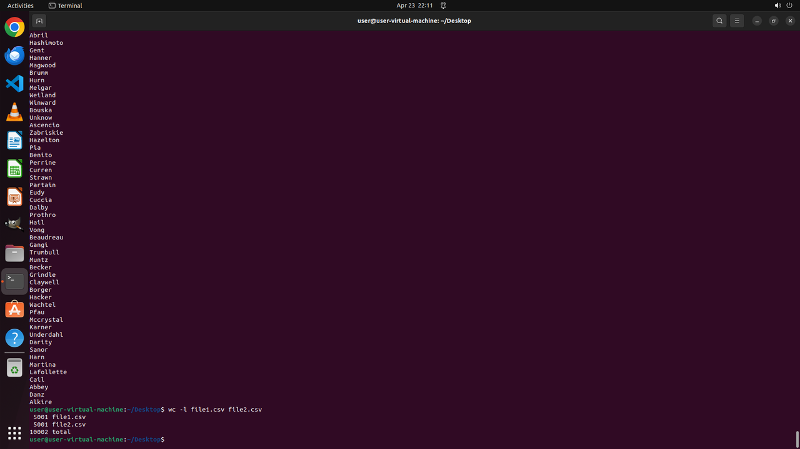

**Response:**
```
Both files have 5001 lines each. Let me check the first few lines of each file to understand the structure (whether there's a header row).
```

**Actions:** `import subprocess, shlex; subprocess.run(f'xdotool type --delay 12 -- ' + shlex.quote('head -5 file1.csv && echo "---" && head -5 file2.c'), shell=True, check=True)
import time; time.sleep(0.05)
impor`

---

## Step 8

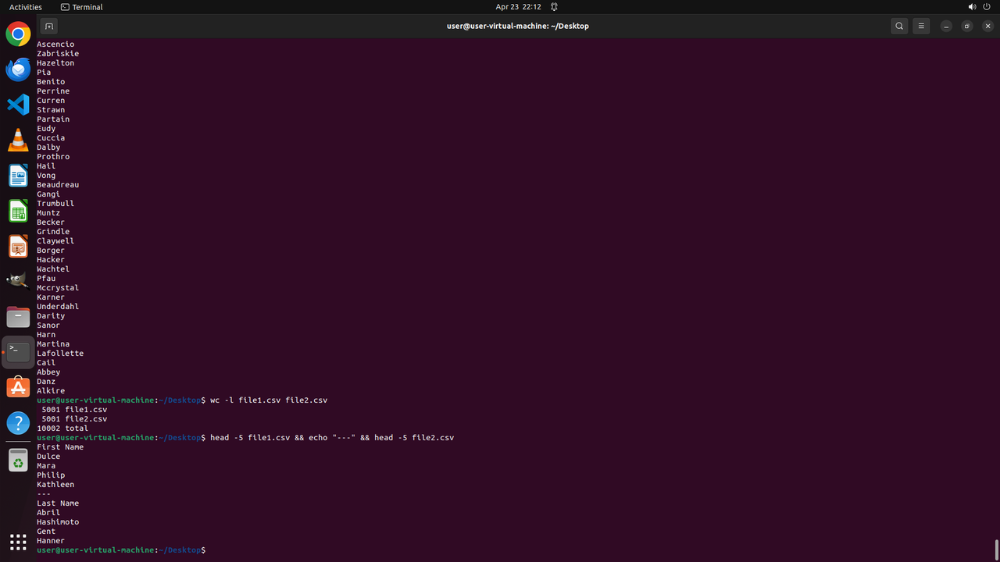

**Response:**
```
Now I can see the structure clearly:
- **file1.csv** has a header "First Name" and contains first names (Dulce, Mara, Philip, Kathleen, ...)
- **file2.csv** has a header "Last Name" and contains last names (Abril, Hashimoto, Gent, Hanner, ...)

I need to merge them row by row, concatenating the first name and last name. I'll use `paste` to combine them side by side, then use `awk` to concatenate the strings. Let me create the output.csv file.
```

**Actions:** `import subprocess, shlex; subprocess.run(f'xdotool type --delay 12 -- ' + shlex.quote("paste -d',' file1.csv file2.csv | awk -F',' 'NR==1"), shell=True, check=True)
import time; time.sleep(0.05)
impor`

---

## Step 9

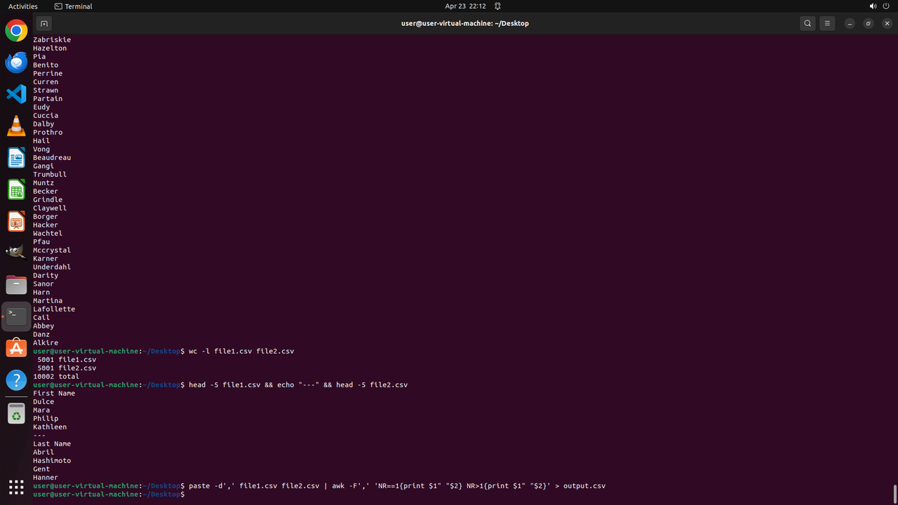

**Response:**
```
The command executed successfully. Let me verify the output file to make sure it looks correct.
```

**Actions:** `import subprocess, shlex; subprocess.run(f'xdotool type --delay 12 -- ' + shlex.quote('head -10 output.csv\n'), shell=True, check=True)
import time; time.sleep(0.05)`

---

## Step 10

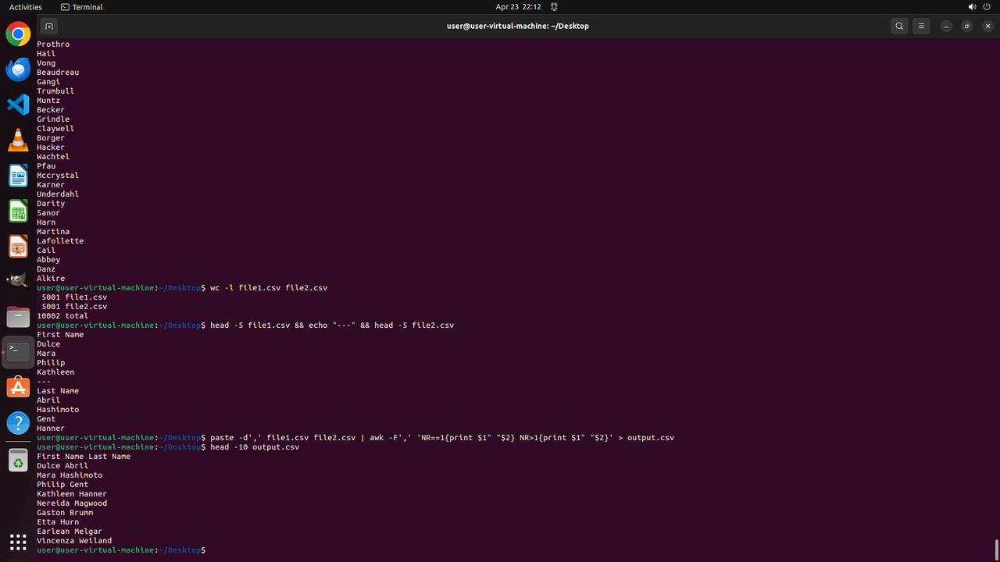

**Response:**
```
The output looks correct. The first row is "First Name Last Name" (the merged headers), and subsequent rows have the concatenated first and last names like "Dulce Abril", "Mara Hashimoto", "Philip Gent", etc.

Now let me also check the line count and clean up the temporary CSV files, then open the output in LibreOffice Calc.
```

**Actions:** `import subprocess, shlex; subprocess.run(f'xdotool type --delay 12 -- ' + shlex.quote('wc -l output.csv\n'), shell=True, check=True)
import time; time.sleep(0.05)`

---

## Step 11

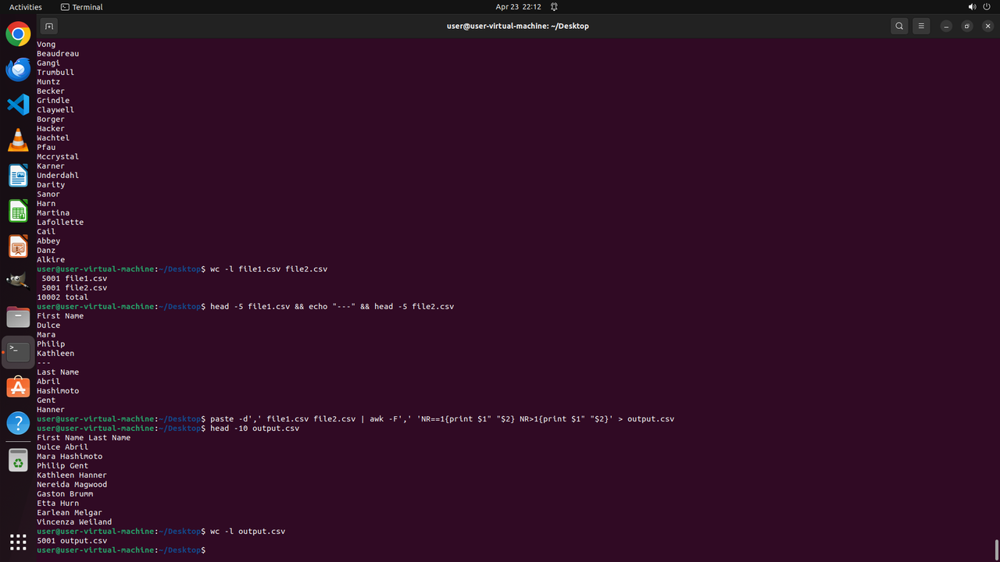

**Response:**
```
The output.csv has 5001 lines (1 header + 5000 data rows), which matches the input files. Now let me clean up the temporary CSV files and open the output.csv in LibreOffice Calc.
```

**Actions:** `import subprocess, shlex; subprocess.run(f'xdotool type --delay 12 -- ' + shlex.quote('rm file1.csv file2.csv && libreoffice --calc ~/Des'), shell=True, check=True)
import time; time.sleep(0.05)
impor`

---

## Step 12

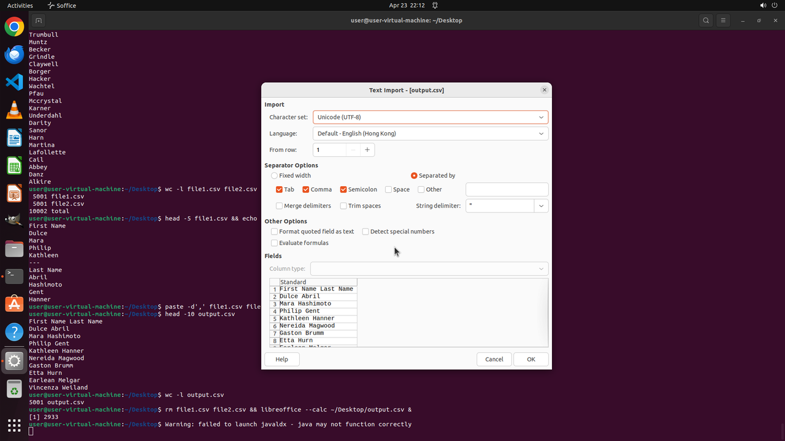

**Response:**
```
LibreOffice Calc has opened with the Text Import dialog showing the output.csv file. I can see the data is correctly merged - "First Name Last Name" as header, "Dulce Abril", "Mara Hashimoto", "Philip Gent", etc. Let me click OK to open the file.
```

**Actions:** `pyautogui.click(1291, 879)`

---

## Step 13


**Response:**
```
LibreOffice Calc is opening. Let me click on the LibreOffice Calc in the taskbar to bring it to the foreground.
```

**Actions:** `pyautogui.click(190, 13)`

---

## Step 14

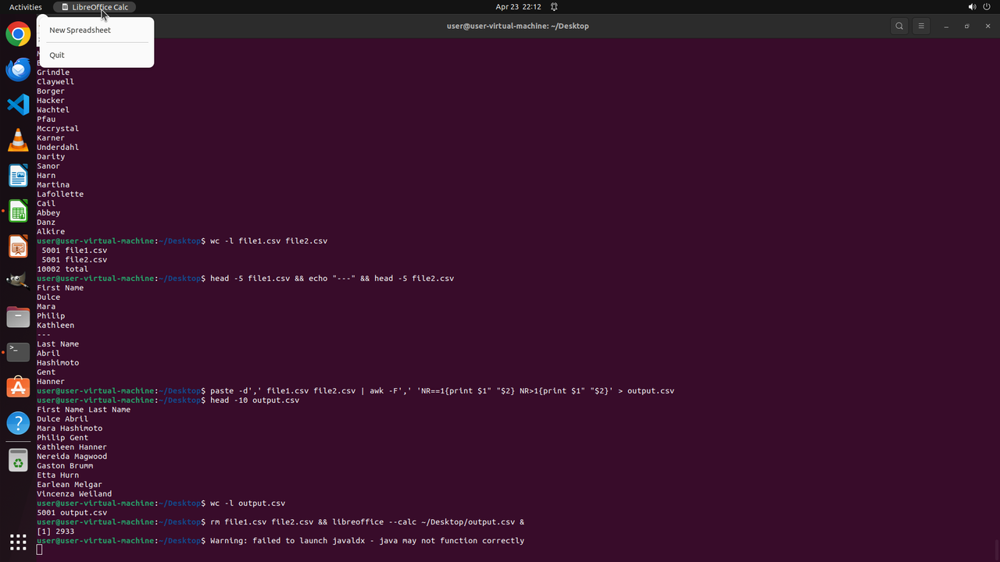

**Response:**
```
I see a menu appeared. Let me close this menu and click on the LibreOffice Calc window in the taskbar instead.
```

**Actions:** `pyautogui.keyDown('esc')
pyautogui.keyUp('esc')`

---

## Step 15


**Response:**
```
It looks like LibreOffice Calc is loading but the window might be behind the terminal. Let me wait a moment and then try to bring it to the front.
```

**Actions:** `time.sleep(0.5)`

---

## Step 16


**Response:**
```
I can see "LibreOffice Calc" in the top bar. Let me click on it to bring the window to the foreground.
```

**Actions:** `pyautogui.click(82, 49)`

---

## Step 17

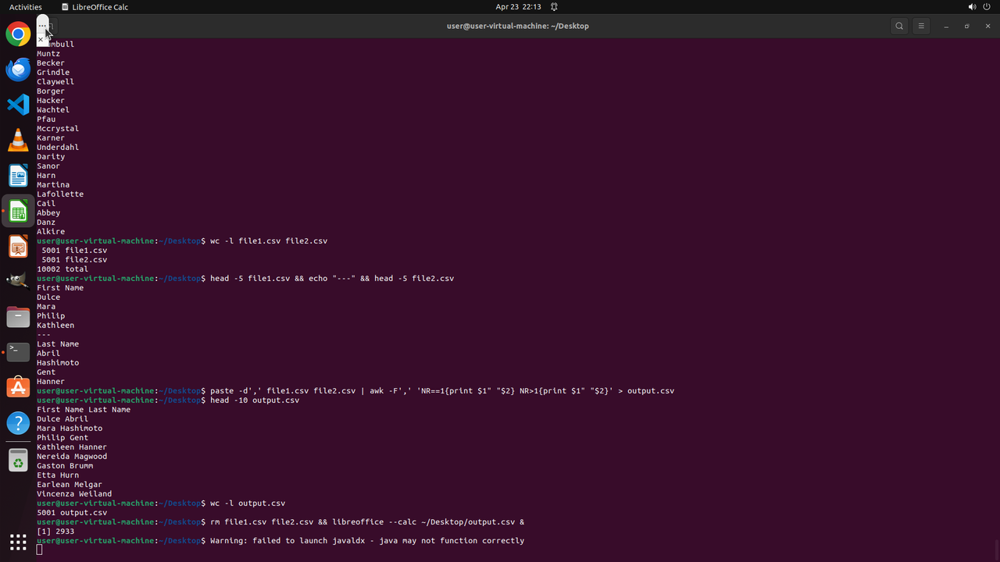

**Response:**
```
It seems the LibreOffice Calc window might still be loading or is behind the terminal. Let me try using Alt+Tab to switch to it.
```

**Actions:** `pyautogui.keyDown('alt')
pyautogui.keyDown('tab')
pyautogui.keyUp('tab')
pyautogui.keyUp('alt')`

---

## Step 18


**Response:**
```
It seems LibreOffice Calc might still be loading with the large file. Let me wait a bit more and then try again.
```

**Actions:** `time.sleep(0.5)`

---

## Step 19

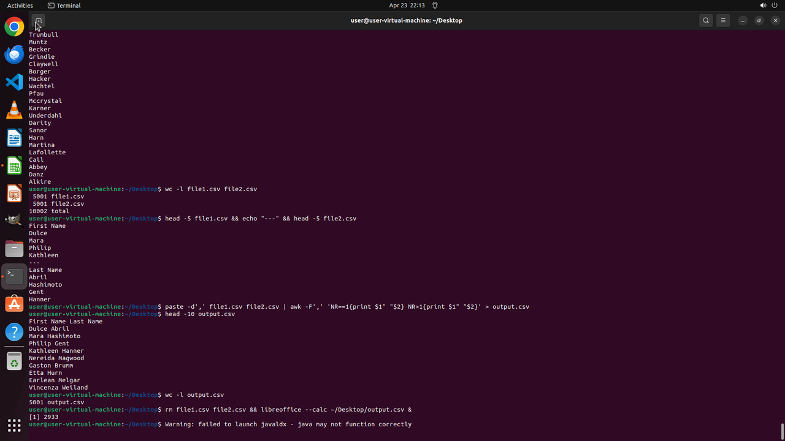

**Response:**
```
It seems LibreOffice Calc might have had an issue loading. The taskbar now shows "Terminal" instead of "LibreOffice Calc". Let me check if the process is running and try to wait a bit more.
```

**Actions:** `time.sleep(0.5)`

---

## Step 20

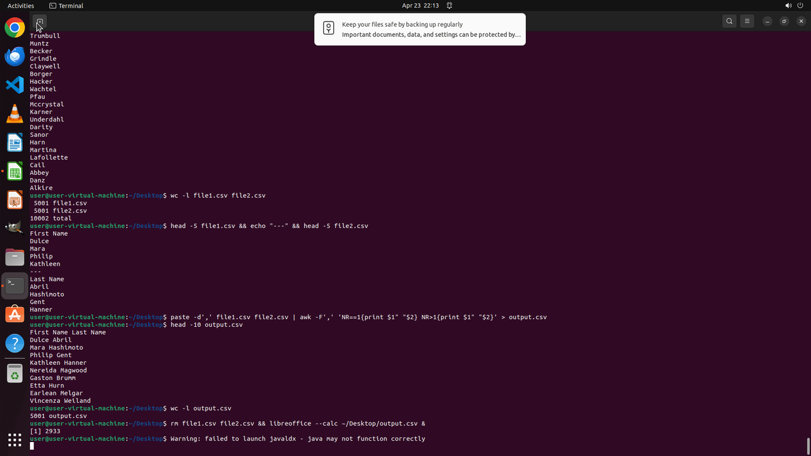

**Response:**
```
I see a notification about backing up files. Let me dismiss it and check if LibreOffice Calc is running. It seems the previous instance might have had issues. Let me try launching it again.
```

**Actions:** `pyautogui.click(990, 67)`

---

## Step 21

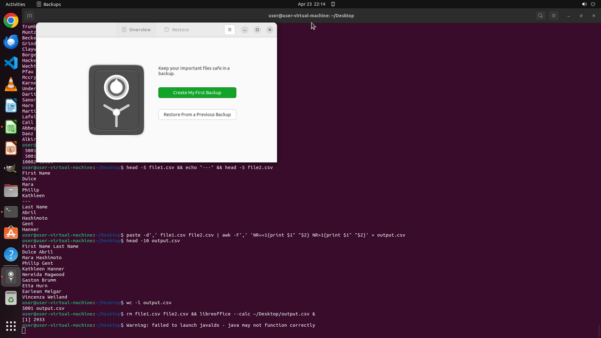

**Response:**
```
This is a Backups application that opened from the notification. Let me close it and focus on getting LibreOffice Calc to open.
```

**Actions:** `pyautogui.click(861, 94)`

---

## Step 22


**Response:**
```
It seems LibreOffice Calc may have not opened properly. Let me check if the soffice process is running and try to launch it again.
```

**Actions:** `pyautogui.click(960, 1050)`

---

## Step 23


**Response:**
```
Let me check if there's a LibreOffice lock file or process issue, and try launching it again.
```

**Actions:** `import subprocess, shlex; subprocess.run(f'xdotool type --delay 12 -- ' + shlex.quote('pgrep -a soffice\n'), shell=True, check=True)
import time; time.sleep(0.05)`

---

## Step 24

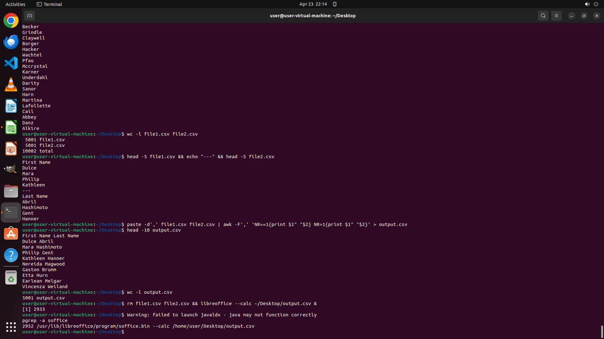

**Response:**
```
I can see that LibreOffice is running (PID 2952) with the command `soffice.bin --calc /home/user/Desktop/output.csv`. The process is running but the window might not be visible. Let me try to bring it to the foreground using `wmctrl` or `xdotool`.
```

**Actions:** `import subprocess, shlex; subprocess.run(f'xdotool type --delay 12 -- ' + shlex.quote('xdotool search --name "output" windowactivate\n'), shell=True, check=True)
import time; time.sleep(0.05)`

---

## Step 25


**Response:**
```
I can see "LibreOffice Calc" in the top bar now. The window is running but might be minimized or behind the terminal. Let me click on the LibreOffice Calc icon in the taskbar area at the top left.
```

**Actions:** `pyautogui.click(82, 49)`

---

## Step 26


**Response:**
```
I can see "LibreOffice Calc" is shown in the top panel. The window seems to be behind the terminal. Let me try using xdotool to raise and focus the LibreOffice Calc window.
```

**Actions:** `import subprocess, shlex; subprocess.run(f'xdotool type --delay 12 -- ' + shlex.quote('xdotool search --name "output.csv" windowactivate '), shell=True, check=True)
import time; time.sleep(0.05)
impor`

---

## Step 27


**Response:**
```
It seems the LibreOffice Calc window might be minimized. Let me try to use xdotool to find and raise it by searching for "Calc" in the window name.
```

**Actions:** `import subprocess, shlex; subprocess.run(f'xdotool type --delay 12 -- ' + shlex.quote('xdotool search --name "Calc" windowactivate window'), shell=True, check=True)
import time; time.sleep(0.05)
impor`

---

## Step 28


**Response:**
```
The LibreOffice Calc window seems to be behind the terminal but not coming to the front. Let me try minimizing the terminal first and then see if the LibreOffice Calc window becomes visible.
```

**Actions:** `import subprocess, shlex; subprocess.run(f'xdotool type --delay 12 -- ' + shlex.quote('wmctrl -l\n'), shell=True, check=True)
import time; time.sleep(0.05)`

---

## Step 29

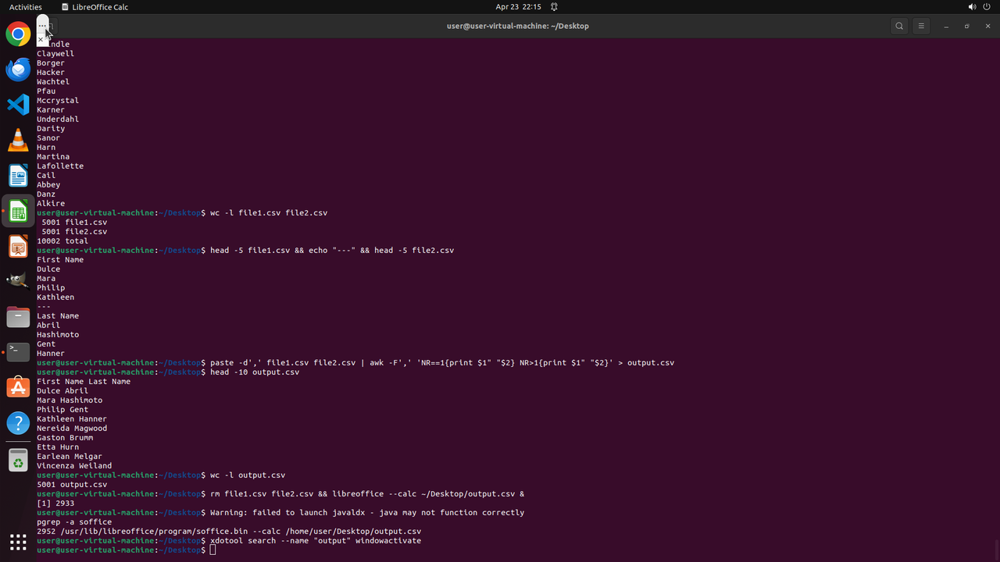

**Response:**
```
Let me scroll down to see the wmctrl output.
```

**Actions:** `pyautogui.scroll(-5, 960, 600)`

---

## Step 30


**Response:**
```
It seems the wmctrl output didn't appear, perhaps it's not installed. Let me try a different approach - I'll click on "LibreOffice Calc" text in the top panel, which indicates the application is running.
```

**Actions:** `pyautogui.click(190, 13)`

---

## Step 31

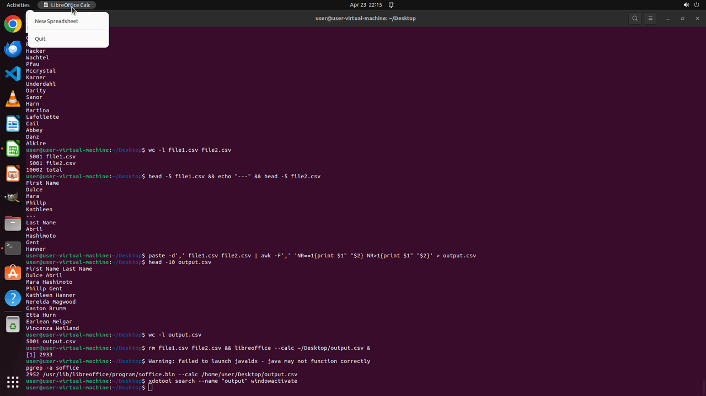

**Response:**
```
I can see the LibreOffice Calc menu with "New Spreadsheet" and "Quit" options. This means LibreOffice Calc is running but its window might not have fully loaded the file yet, or the window might be on a different workspace. Let me close this menu and try clicking on the LibreOffice Calc icon in the taskbar on the left side.
```

**Actions:** `pyautogui.keyDown('esc')
pyautogui.keyUp('esc')`

---

## Step 32

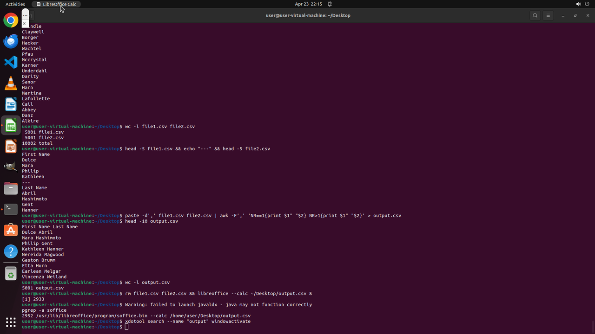

**Response:**
```
I notice the LibreOffice Calc process might have started loading but the CSV import dialog might have appeared and been dismissed too quickly, or the window is loading behind the terminal. Let me try killing the existing process and relaunching it.
```

**Actions:** `pyautogui.click(960, 1056)`

---

## Step 33

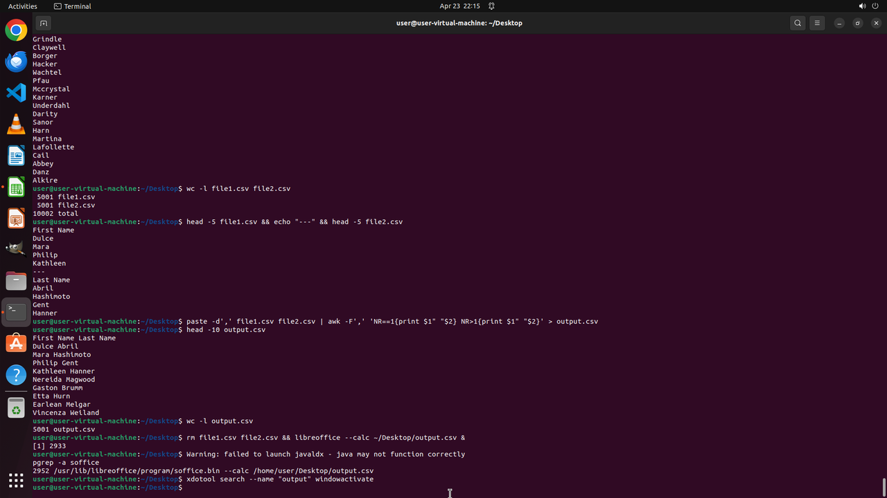

**Response:**
```
I see the terminal is now active. It seems the LibreOffice Calc process may have been waiting for the CSV import dialog that we already dismissed earlier. Let me kill the existing process and relaunch it properly.
```

**Actions:** `import subprocess, shlex; subprocess.run(f'xdotool type --delay 12 -- ' + shlex.quote('killall soffice.bin; sleep 2; soffice --calc ~/Des'), shell=True, check=True)
import time; time.sleep(0.05)
impor`

---

## Step 34


**Response:**
```
I can see the previous soffice process was killed and a new one started (PID 3567). Let me wait a few seconds for LibreOffice Calc to load, then try to bring it to the foreground.
```

**Actions:** `time.sleep(0.5)`

---

## Step 35

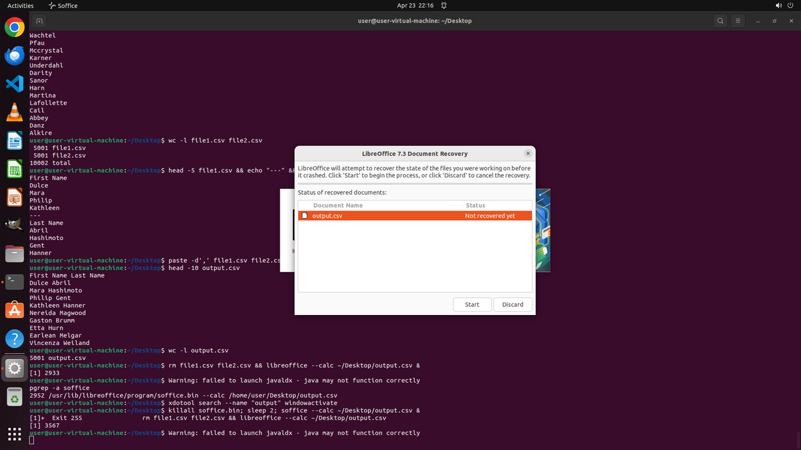

**Response:**
```
LibreOffice has opened with a Document Recovery dialog showing "output.csv" with status "Not recovered yet". I'll click "Discard" to skip the recovery and just open the file fresh.
```

**Actions:** `pyautogui.click(1227, 730)`

---

## Step 36

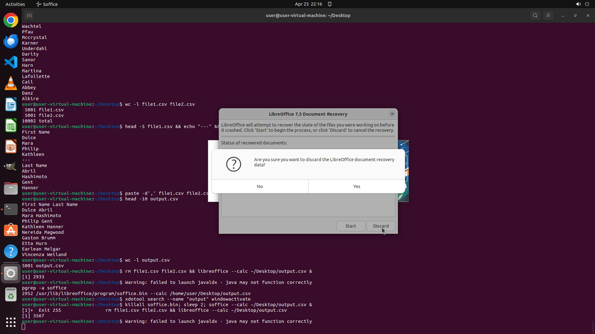

**Response:**
```
It's asking to confirm discarding the recovery data. I'll click "Yes" to discard it.
```

**Actions:** `pyautogui.click(1147, 601)`

---

## Step 37

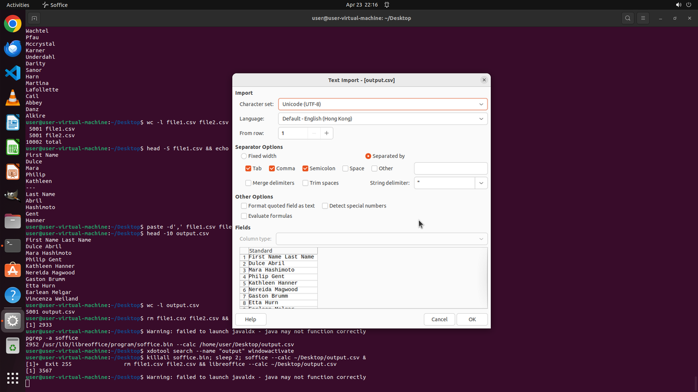

**Response:**
```
The Text Import dialog has appeared for output.csv. I can see the data preview looks correct with "First Name Last Name", "Dulce Abril", "Mara Hashimoto", etc. The data is in a single column which is what we want. Let me click OK to open the file.
```

**Actions:** `pyautogui.click(1291, 879)`

---

## Step 38


**Response:**
```
I can see "LibreOffice Calc" in the top panel, which means the file has been opened. The terminal is still in the foreground. Let me click on the LibreOffice Calc window to bring it to the front. Let me try clicking on the LibreOffice Calc icon in the left sidebar.
```

**Actions:** `pyautogui.click(30, 472)`

---

## Step 39

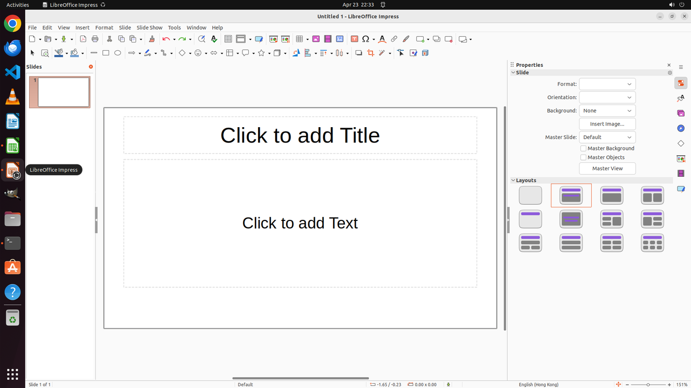

**Response:**
```
That opened LibreOffice Impress instead of the Calc window. Let me close this and find the LibreOffice Calc window. Let me close Impress first.
```

**Actions:** `pyautogui.click(1902, 43)`

---

## Step 40

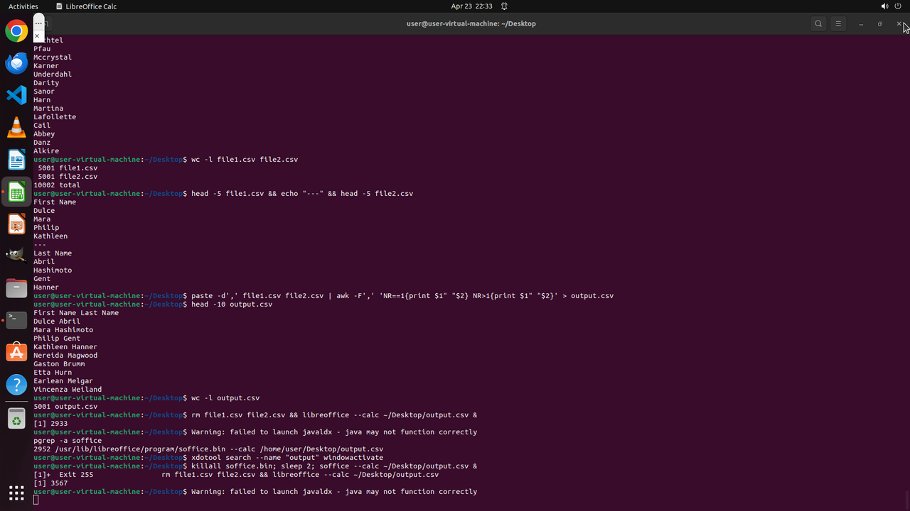

**Response:**
```
I can see "LibreOffice Calc" in the top panel. The terminal is in the foreground. Let me try clicking on the small LibreOffice Calc icon in the top-left corner area to bring the Calc window to the front.
```

**Actions:** `pyautogui.click(75, 49)`

---

## Step 41


**Response:**
```
The terminal is still in the foreground. I can see "LibreOffice Calc" in the top bar, meaning it's running. Let me try minimizing the terminal window to see the LibreOffice Calc window behind it.
```

**Actions:** `pyautogui.click(1807, 49)`

---

## Step 42

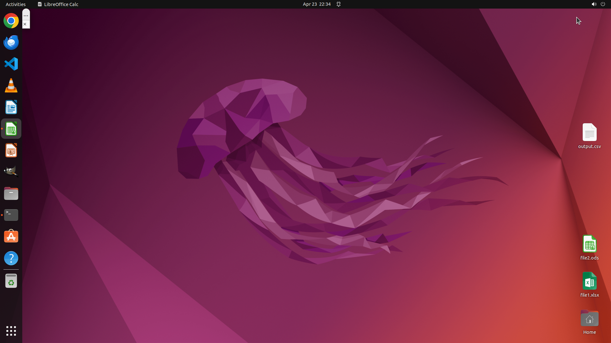

**Response:**
```
I can see the desktop with the output.csv file, file1.xlsx, and file2.ods. The terminal is minimized. I can see "LibreOffice Calc" in the top panel, but the Calc window seems to be behind or minimized too. Let me click on the "LibreOffice Calc" text in the top panel to bring it to the front.
```

**Actions:** `pyautogui.click(190, 13)`

---

## Step 43

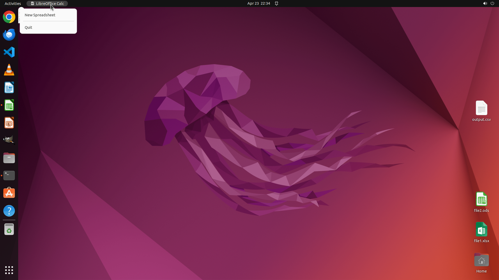

**Response:**
```
I see the LibreOffice Calc menu showing "New Spreadsheet" and "Quit". It seems the Calc application is running but the output.csv window might not have loaded properly - it's showing only the application menu without a document window. The Calc process loaded the file but the window might have been lost. Let me close this menu and try double-clicking the output.csv file on the desktop to open it directly.
```

**Actions:** `pyautogui.keyDown('esc')
pyautogui.keyUp('esc')`

---

## Step 44

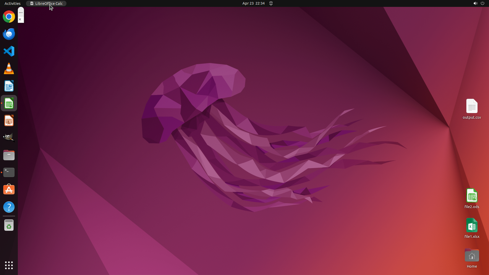

**Response:**
```
I see the desktop with the output.csv file visible. LibreOffice Calc is running (shown in the top panel) but the document window seems to not have a visible window. The task said to open it from the terminal, which we already did. The issue is that the Calc window might be in a weird state. Let me try double-clicking on the output.csv file on the desktop to open it in LibreOffice Calc.
```

**Actions:** `pyautogui.doubleClick(1843, 427)`

---

## Step 45

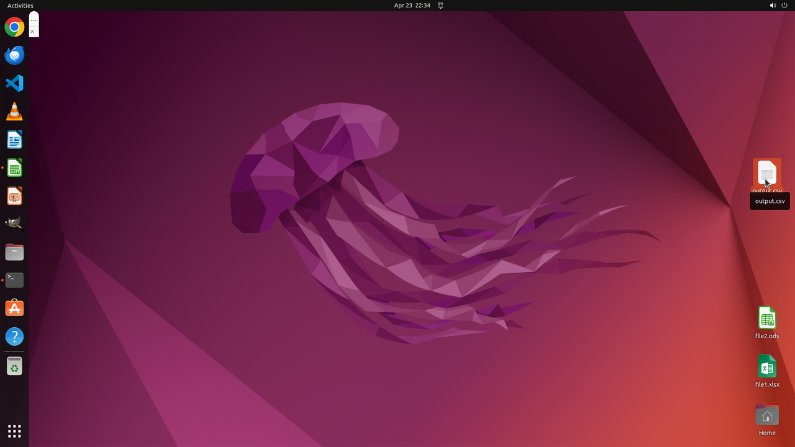

**Response:**
```
It seems the file was selected but not opened yet. The "LibreOffice Calc" text is no longer in the top panel. Let me wait a moment for it to open.
```

**Actions:** `time.sleep(0.5)`

---

## Step 46


**Response:**
```
It seems LibreOffice might have closed or the window didn't open. The previous process might have had issues. Let me open the terminal and try again - kill any existing LibreOffice processes and relaunch.
```

**Actions:** `pyautogui.click(33, 672)`

---

## Step 47

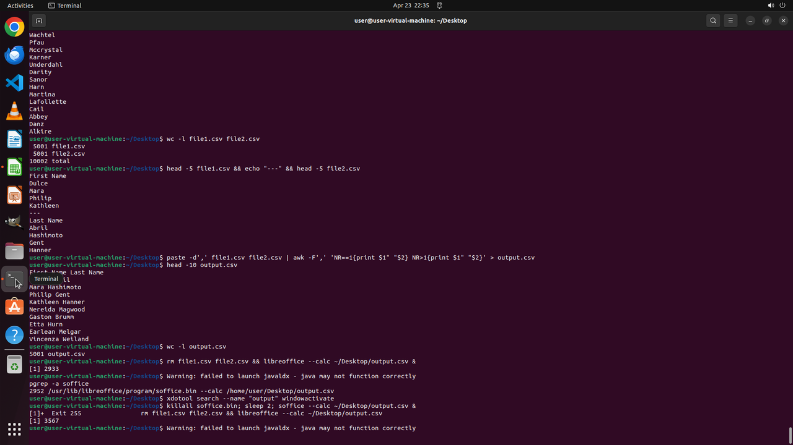

**Response:**
```
The terminal is back. I can see the previous LibreOffice process might have exited. Let me scroll down to see the current prompt and kill any remaining soffice processes, then relaunch.
```

**Actions:** `pyautogui.scroll(-5, 960, 600)`

---

## Step 48

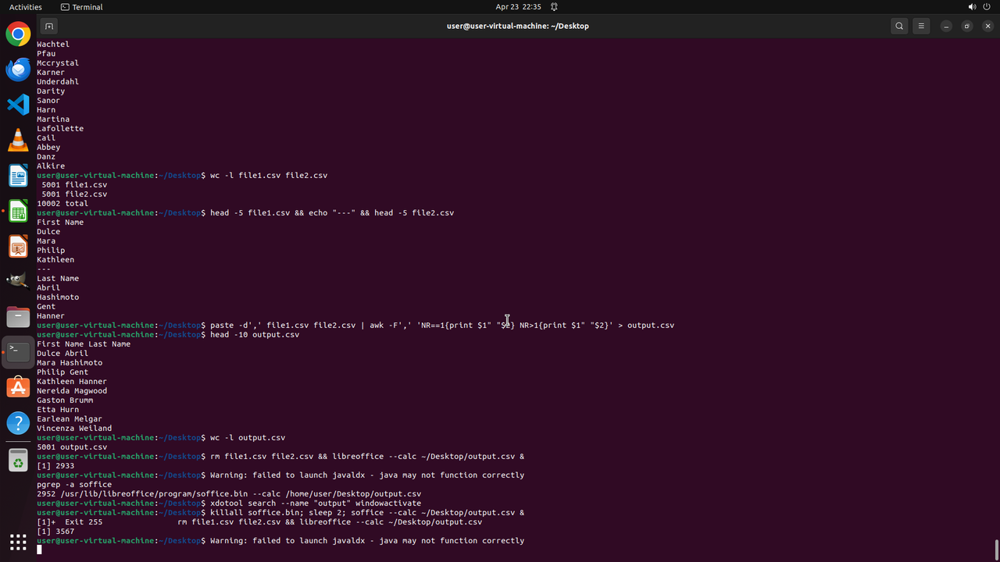

**Response:**
```
I can see the terminal with a prompt at the bottom. Let me kill any existing LibreOffice processes and relaunch it properly.
```

**Actions:** `pyautogui.click(960, 1056)`

---

## Step 49


**Response:**
```
Let me kill all LibreOffice processes, remove any lock files, and relaunch it cleanly.
```

**Actions:** `import subprocess, shlex; subprocess.run(f'xdotool type --delay 12 -- ' + shlex.quote('killall -9 soffice.bin 2>/dev/null; rm -f ~/Deskto'), shell=True, check=True)
import time; time.sleep(0.05)
impor`

---

## Step 50

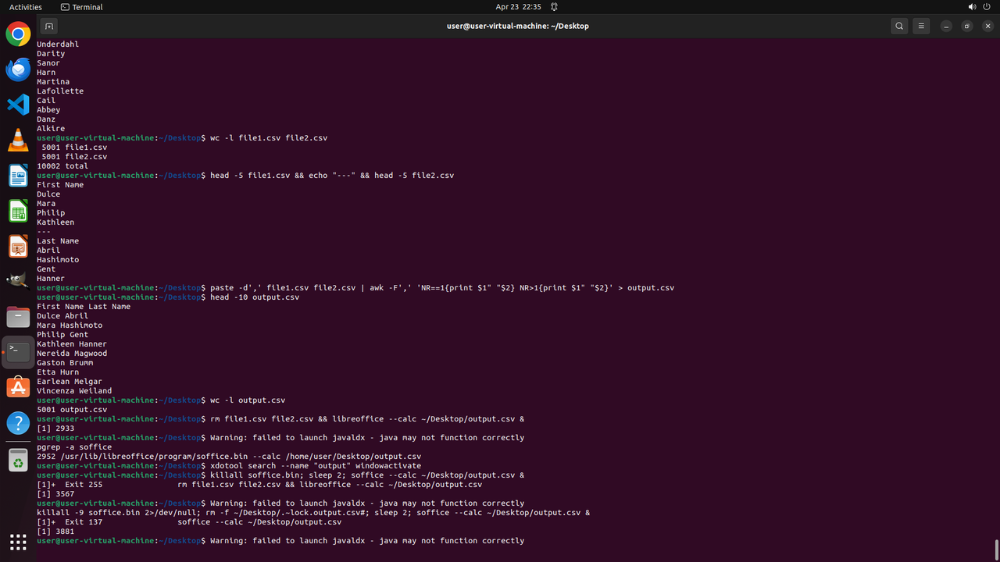

**Response:**
```
I can see a new LibreOffice process started (PID 3881). Let me wait for it to load and then bring it to the foreground.
```

**Actions:** `time.sleep(0.5)`

---

## Step 51

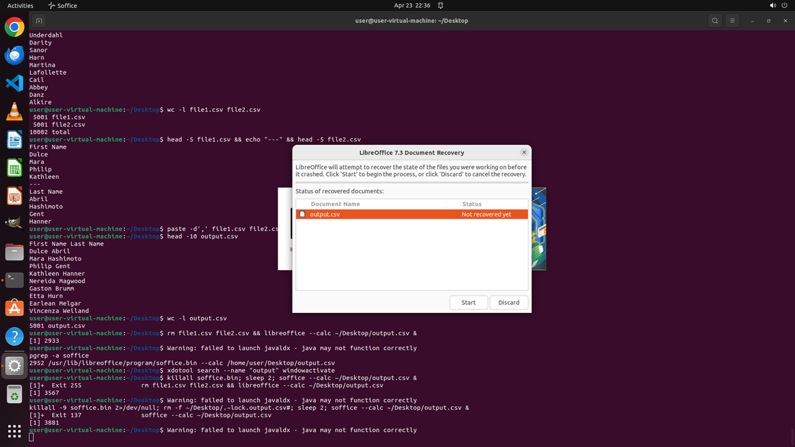

**Response:**
```
The Document Recovery dialog appeared again. Let me click "Discard" to skip recovery and just open the file fresh.
```

**Actions:** `pyautogui.click(1227, 730)`

---

## Step 52

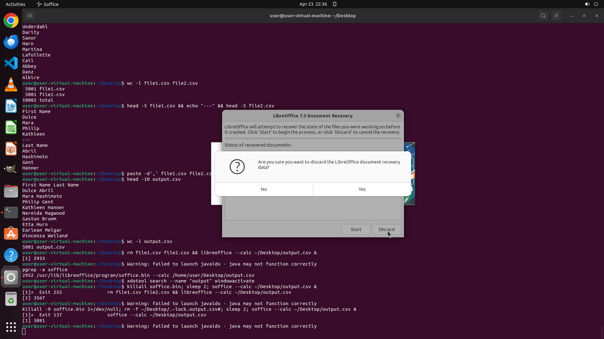

**Response:**
```
It's asking to confirm discarding the recovery data. I'll click "Yes" to discard it.
```

**Actions:** `pyautogui.click(1147, 601)`

---

## Step 53

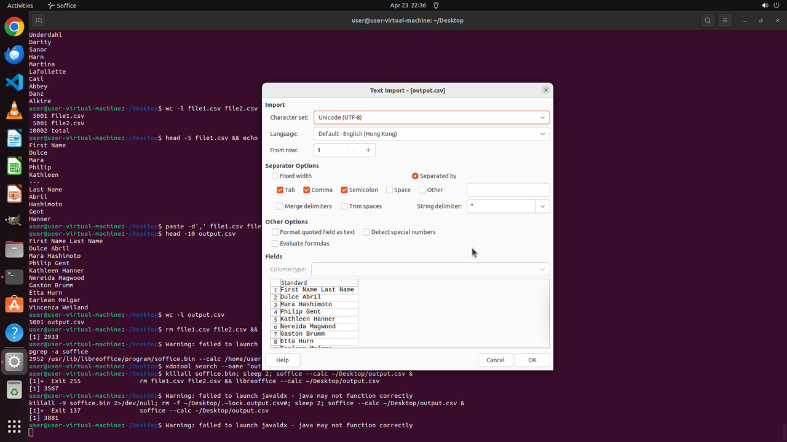

**Response:**
```
The Text Import dialog is showing for output.csv. I can see the data preview looks correct with "First Name Last Name" as header, and the merged names like "Dulce Abril", "Mara Hashimoto", "Philip Gent", etc. all in a single column. The data looks good. Let me click OK to open the file.
```

**Actions:** `pyautogui.click(1291, 879)`

---

## Step 54

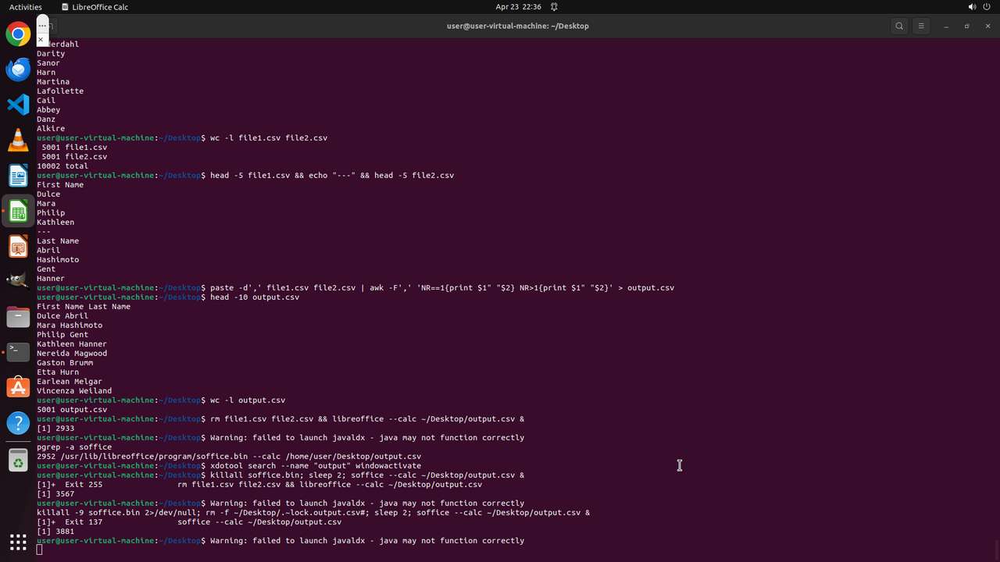

**Response:**
```
I can see "LibreOffice Calc" in the top panel, which means the file has been opened. The terminal is still in the foreground. The LibreOffice Calc window is likely behind the terminal. Let me try clicking on the Activities button and then selecting the LibreOffice Calc window.
```

**Actions:** `pyautogui.click(48, 13)`

---

## Step 55

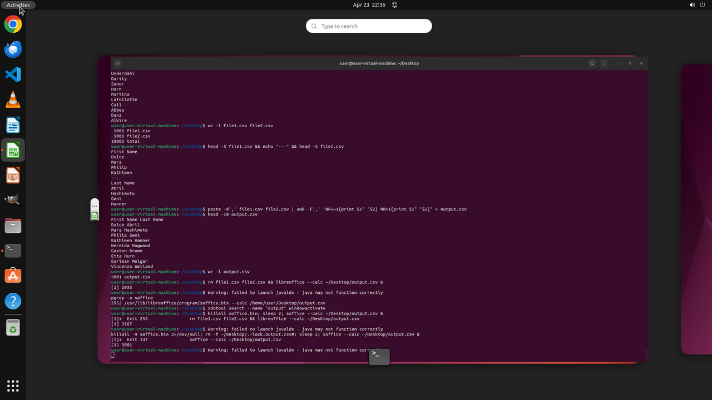

**Response:**
```
I can see the Activities overview showing the Terminal window, but I don't see a LibreOffice Calc window. It seems the Calc window might not have rendered properly. Let me check if there's another window by looking more carefully. I only see the terminal window. Let me click on the terminal to go back and try a different approach.
```

**Actions:** `pyautogui.click(1020, 600)`

---

## Step 56

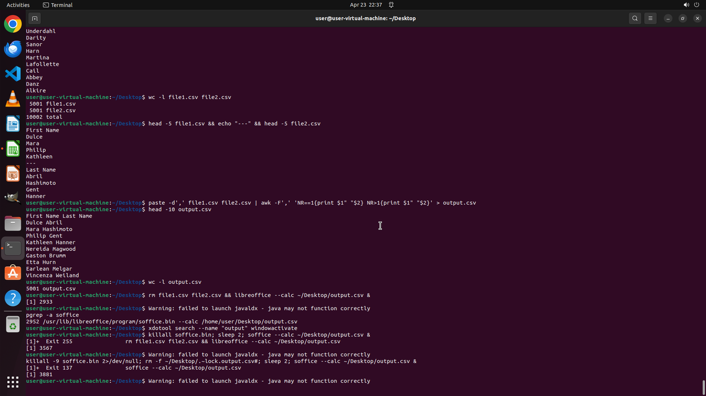

**Response:**
```
It seems LibreOffice Calc might be running but without a visible window, or the window didn't properly open. Let me try a completely fresh approach - kill all LibreOffice processes, remove recovery files, and launch it in a way that ensures the window appears.
```

**Actions:** `pyautogui.click(960, 1056)`

---

## Step 57


**Response:**
```
Let me kill all LibreOffice processes, clear recovery data, and relaunch cleanly.
```

**Actions:** `import subprocess, shlex; subprocess.run(f'xdotool type --delay 12 -- ' + shlex.quote('killall -9 soffice.bin 2>/dev/null; rm -rf ~/.conf'), shell=True, check=True)
import time; time.sleep(0.05)
impor`

---

## Step 58

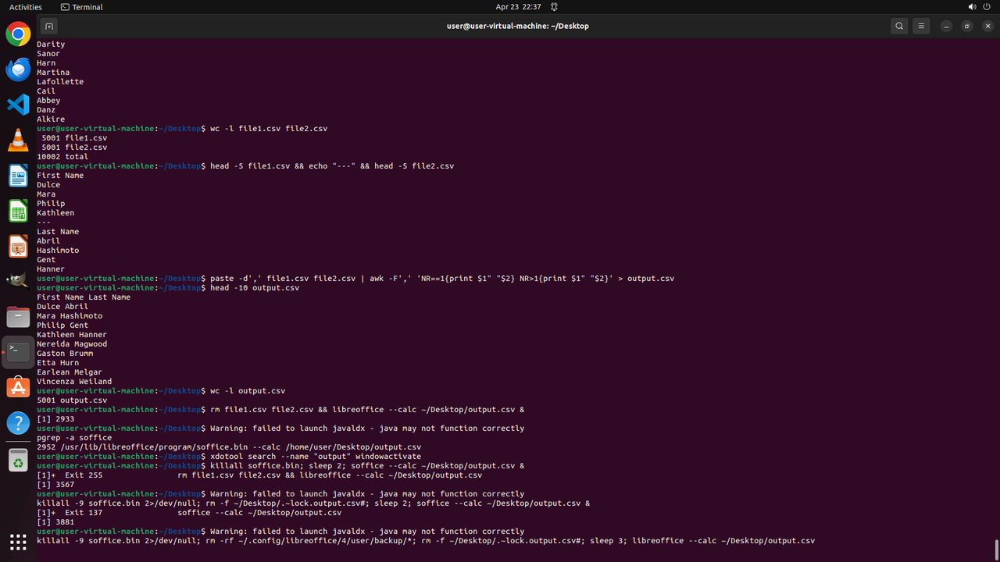

**Response:**
```
I can see the command is running at the bottom. This time I launched LibreOffice in the foreground (without `&`), so the terminal will be blocked until LibreOffice closes. Let me wait for it to load.
```

**Actions:** `time.sleep(0.5)`

---

## Step 59

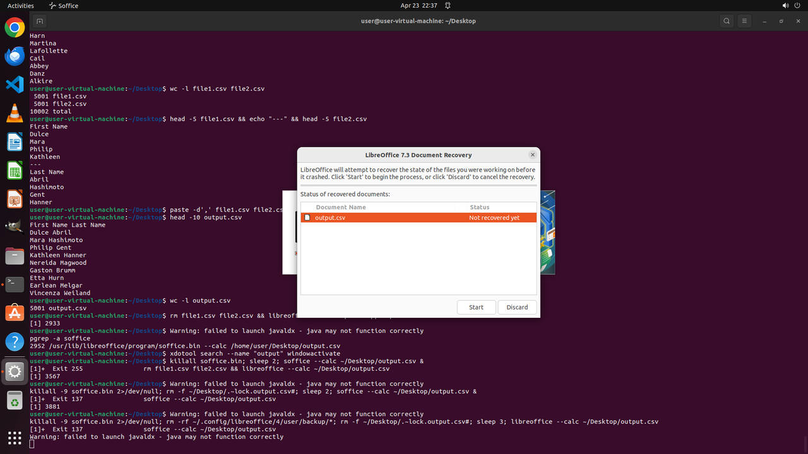

**Response:**
```
The Document Recovery dialog appeared again. Let me click "Discard" to skip recovery.
```

**Actions:** `pyautogui.click(1227, 730)`

---

## Step 60

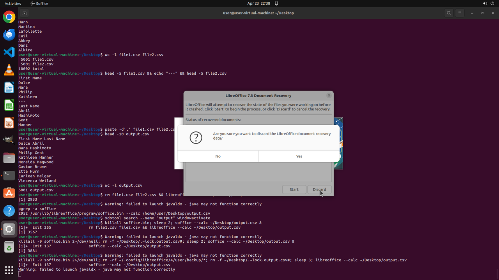

**Response:**
```
Click "Yes" to confirm discarding the recovery data.
```

**Actions:** `pyautogui.click(1147, 601)`

---

## Step 61

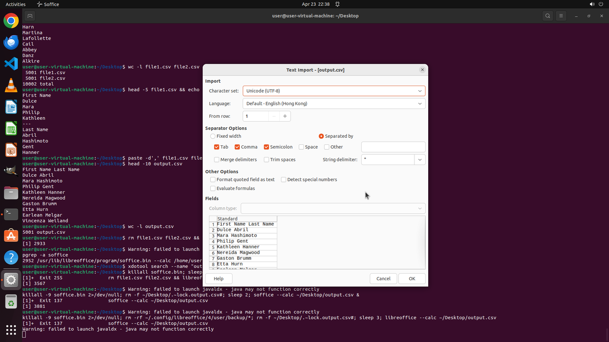

**Response:**
```
The Text Import dialog is showing the output.csv file. The data preview looks correct - "First Name Last Name" as header, followed by "Dulce Abril", "Mara Hashimoto", "Philip Gent", "Kathleen Hanner", "Nereida Magwood", "Gaston Brumm", "Etta Hurn" - all properly concatenated full names in a single column. Let me click OK to open the file.
```

**Actions:** `pyautogui.click(1291, 879)`

---

## Step 62

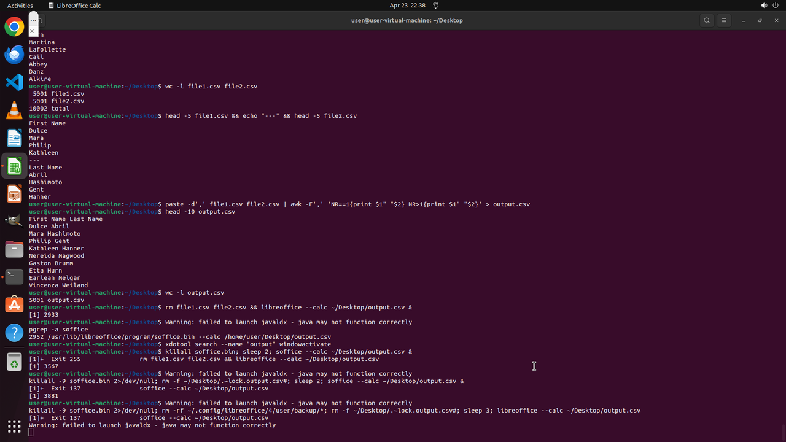

**Response:**
```
I can see "LibreOffice Calc" in the top panel, which means the file has been opened. The terminal is still in the foreground. Let me try clicking on the Activities button and look for the LibreOffice Calc window.
```

**Actions:** `pyautogui.click(48, 13)`

---

## Step 63

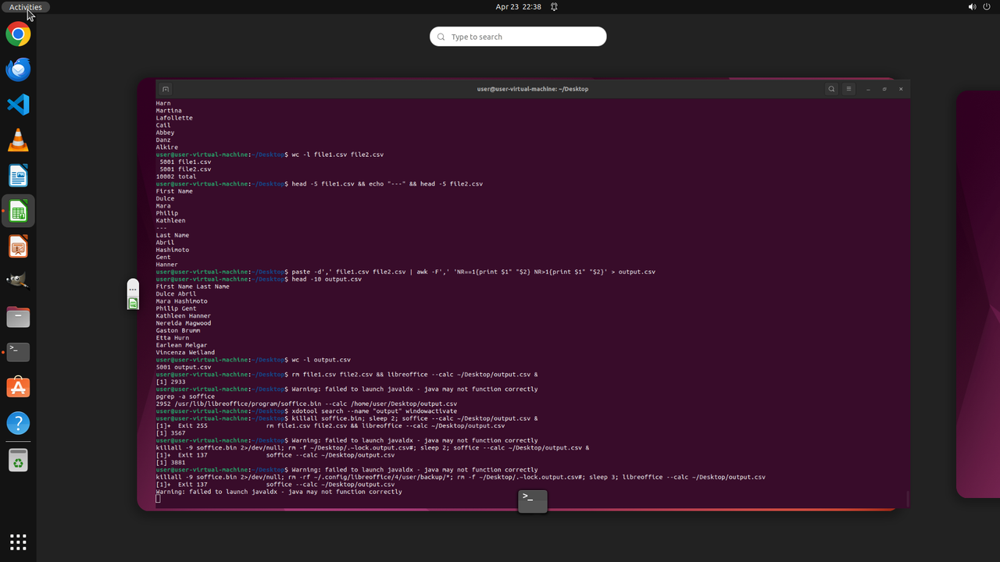

**Response:**
```
I can see the Activities overview but only the terminal window is visible. LibreOffice Calc doesn't seem to have a visible window despite showing in the top panel. The issue might be that LibreOffice Calc is running but the window is not being displayed properly. Let me click on the LibreOffice Calc icon in the left sidebar (the green spreadsheet icon).
```

**Actions:** `pyautogui.click(33, 337)`

---

## Step 64

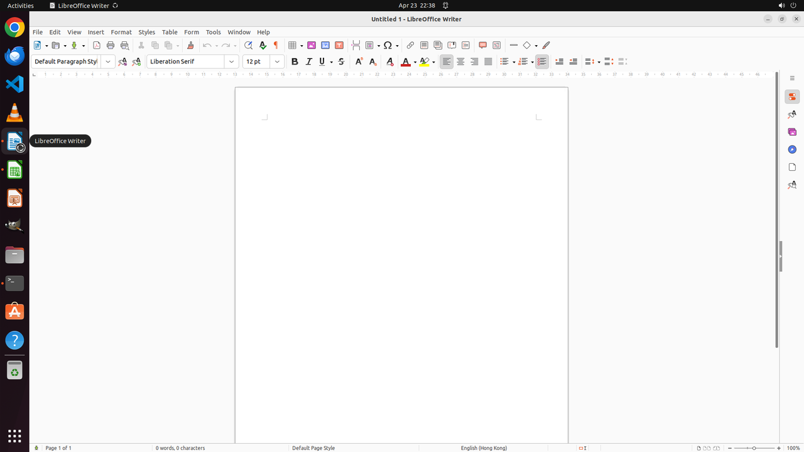

**Response:**
```
That opened LibreOffice Writer instead of Calc. The issue is that clicking the sidebar icon opened a new Writer document. Let me close this and try to find the LibreOffice Calc window. Let me close Writer first.
```

**Actions:** `pyautogui.click(1896, 43)`

---

## Step 65

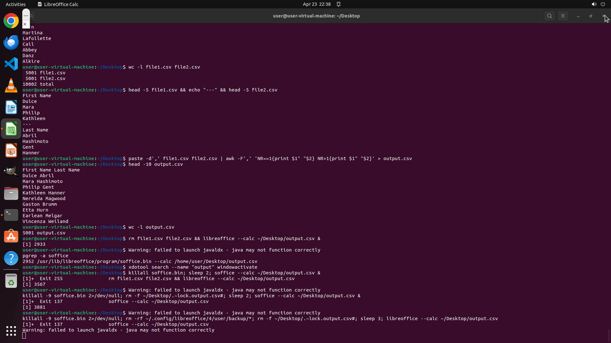

**Response:**
```
I can see "LibreOffice Calc" in the top panel. The terminal is in the foreground. It seems like LibreOffice Calc is running but its window might be behind the terminal or not rendering properly. Let me try minimizing the terminal window by clicking the minimize button.
```

**Actions:** `pyautogui.click(1807, 49)`

---

## Step 66


**Response:**
```
I can see the desktop with "LibreOffice Calc" in the top panel, and the output.csv file on the desktop. The terminal has been minimized. I can see the desktop but the LibreOffice Calc window is not visible - it seems to be running but without a visible window. Let me click on "LibreOffice Calc" in the top panel to try to bring it to focus.
```

**Actions:** `pyautogui.click(190, 13)`

---

## Step 67

**Response:**
```
I can see the LibreOffice Calc menu with "New Spreadsheet" and "Quit" options. It seems the Calc application is running but without a document window. This is likely because the CSV import dialog was processed but the window ended up with no visible surface. Let me close this menu and try a different approach - quit the current instance and relaunch.
```

**Actions:** `pyautogui.keyDown('esc')
pyautogui.keyUp('esc')`

---

## Step 68

**Response:**
```
Let me try clicking on the "LibreOffice Calc" text in the top panel and then select "Quit" to close it, then relaunch from the terminal.
```

**Actions:** `pyautogui.click(190, 13)`

---

## Step 69

**Response:**
```
I can see the LibreOffice Calc menu. Let me click "Quit" to close it.
```

**Actions:** `pyautogui.click(144, 82)`

---

## Step 70

**Response:**
```
Good, LibreOffice Calc has been closed. Now I can see the desktop with the output.csv, file2.ods, and file1.xlsx files. Let me open the terminal and try launching LibreOffice Calc again with the output.csv file. Let me click on the terminal icon in the taskbar.
```

**Actions:** `pyautogui.click(33, 672)`

---

## Step 71

**Response:**
```
Good, the terminal is back. I can see the previous command completed. Let me try a clean launch of LibreOffice Calc with the output.csv file, this time removing any lock files and recovery data first.
```

**Actions:** `pyautogui.click(960, 1056)`

---

## Step 72

**Actions:** `import subprocess, shlex; subprocess.run(f'xdotool type --delay 12 -- ' + shlex.quote('rm -rf ~/.config/libreoffice/4/user/backup/* 2>/de'), shell=True, check=True)
import time; time.sleep(0.05)
impor`

---

## Step 73

**Response:**
```
LibreOffice is starting. Let me wait for it to load.
```

**Actions:** `time.sleep(0.5)`

---

## Step 74

**Response:**
```
The Text Import dialog appeared again for output.csv. The data preview looks correct. This time, let me make sure I don't have Tab, Comma, or Semicolon checked since the data is just a single column of concatenated names with no delimiters. Let me uncheck the unnecessary separators and just click OK.

Actually, looking at the preview, the data looks correct in a single column. Let me just click OK to proceed.
```

**Actions:** `pyautogui.click(1291, 879)`

---

## Step 75

**Response:**
```
I can see "LibreOffice Calc" in the top panel. The terminal is still in the foreground. Let me wait a moment for the file to fully load, then try to switch to it.
```

**Actions:** `time.sleep(0.5)`

---

## Step 76

**Response:**
```
I can see "LibreOffice Calc" in the top panel. Let me try using Alt+Tab to switch to the LibreOffice Calc window.
```

**Actions:** `pyautogui.keyDown('alt')
pyautogui.keyDown('tab')
pyautogui.keyUp('tab')
pyautogui.keyUp('alt')`

---

## Step 77

**Response:**
```
LibreOffice Calc is now visible and in the foreground! I can see the output.csv file is open with the merged data:
- Row 1: "First Name Last Name" (header)
- Row 2: "Dulce Abril"
- Row 3: "Mara Hashimoto"
- Row 4: "Philip Gent"
- Row 5: "Kathleen Hanner"
- Row 6: "Nereida Magwood"
- Row 7: "Gaston Brumm"
- Row 8: "Etta Hurn"
- Row 9: "Earlean Melgar"
- Row 10: "Vincenza Weiland"

The task has been completed successfully:
1. ✅ Converted file1.xlsx and file2.ods to CSV using the command line
2. ✅ Merged the two columns by concatenating the strings from both rows using `paste` and `awk`
3. ✅ Saved the result as ~/Desktop/output.csv
4. ✅ Opened it in LibreOffice Calc from the terminal

DONE
```

**Actions:** `DONE`

---
