# Task 3680a5ee-6870-426a-a997-eba929a0d25c

**Instruction:** I have file1.xlsx and file2.ods on my Desktop, each containing a single column. Using only the command line, help me merge these two columns into a single column by concatenating the strings from both rows, save the result as ~/Desktop/output.csv, and open it in LibreOffice Calc from the terminal

**Score:** N/A

**Steps:** 122

---

## Step 1

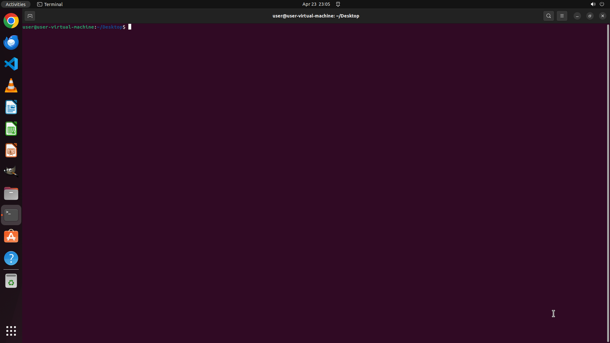

**Response:**
```
Let me first check the contents of the files to understand what we're working with.
```

**Actions:** `import subprocess, shlex; subprocess.run(f'xdotool type --delay 12 -- ' + shlex.quote('ls -la ~/Desktop/file1.xlsx ~/Desktop/file2.ods\n'), shell=True, check=True)
import time; time.sleep(0.05)`

---

## Step 2

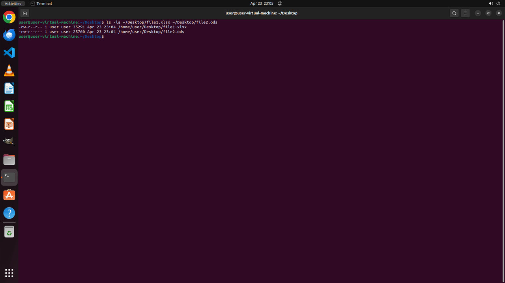

**Response:**
```
Both files exist. Let me first convert them to CSV using LibreOffice's command-line converter, then examine the contents.
```

**Actions:** `import subprocess, shlex; subprocess.run(f'xdotool type --delay 12 -- ' + shlex.quote('libreoffice --headless --convert-to csv --outdir /'), shell=True, check=True)
import time; time.sleep(0.05)
impor`

---

## Step 3


**Response:**
```
It seems to be processing. Let me wait a moment for it to complete.
```

**Actions:** `time.sleep(0.5)`

---

## Step 4

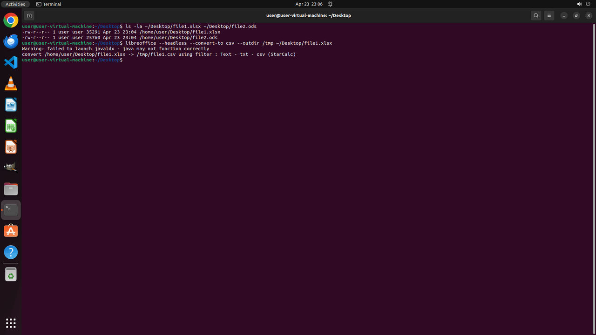

**Response:**
```
file1.xlsx has been converted to CSV. Now let me convert file2.ods as well.
```

**Actions:** `import subprocess, shlex; subprocess.run(f'xdotool type --delay 12 -- ' + shlex.quote('libreoffice --headless --convert-to csv --outdir /'), shell=True, check=True)
import time; time.sleep(0.05)
impor`

---

## Step 5

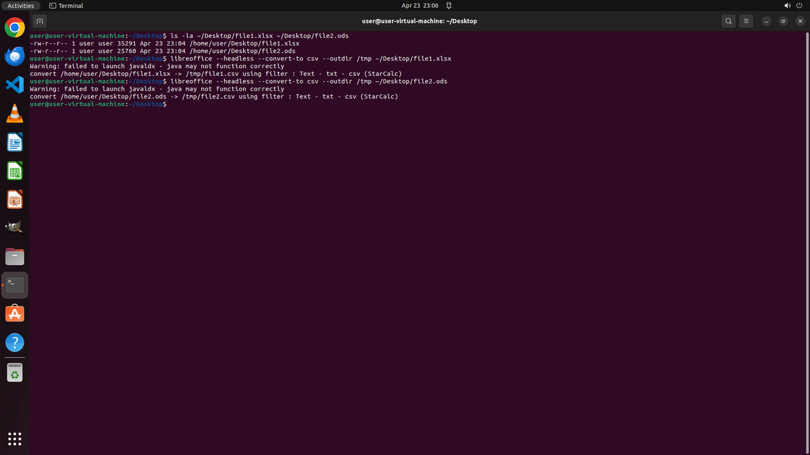

**Response:**
```
Both files are converted. Now let me check their contents.
```

**Actions:** `import subprocess, shlex; subprocess.run(f'xdotool type --delay 12 -- ' + shlex.quote('cat /tmp/file1.csv\n'), shell=True, check=True)
import time; time.sleep(0.05)`

---

## Step 6

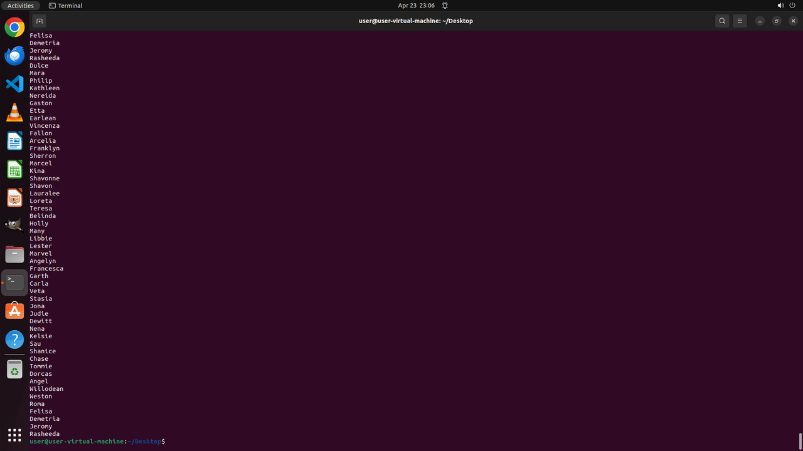

**Response:**
```
I can see file1.csv contains a list of first names. Now let me check file2.csv.
```

**Actions:** `import subprocess, shlex; subprocess.run(f'xdotool type --delay 12 -- ' + shlex.quote('cat /tmp/file2.csv\n'), shell=True, check=True)
import time; time.sleep(0.05)`

---

## Step 7

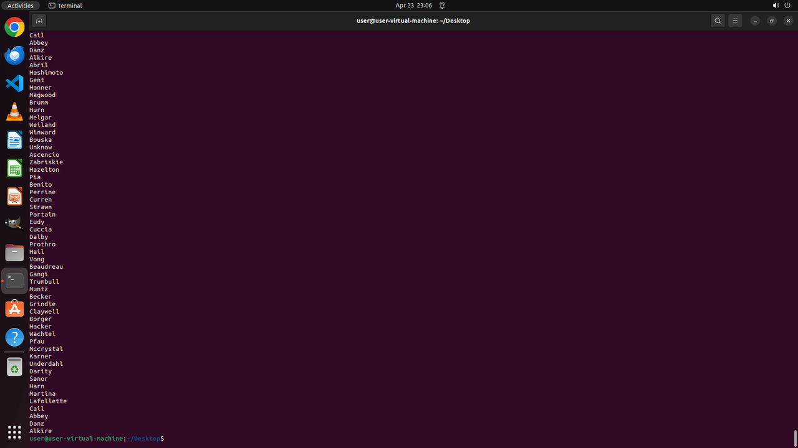

**Response:**
```
file2.csv contains last names. Now I need to merge them by concatenating the strings from corresponding rows. Let me use `paste` to combine them side by side, then use `awk` to concatenate the strings. Let me first check if both files have headers.
```

**Actions:** `import subprocess, shlex; subprocess.run(f'xdotool type --delay 12 -- ' + shlex.quote('head -3 /tmp/file1.csv && echo "---" && head -3 /t'), shell=True, check=True)
import time; time.sleep(0.05)
impor`

---

## Step 8

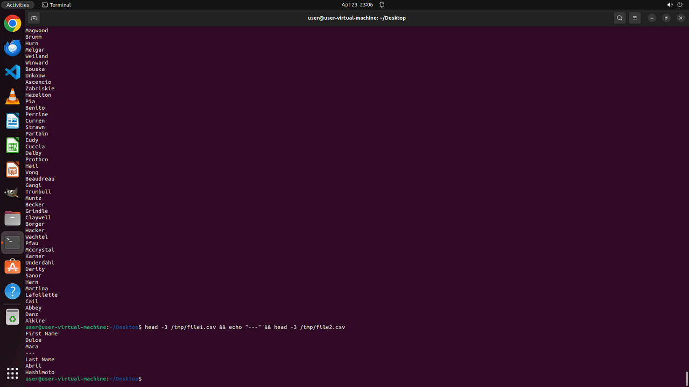

**Response:**
```
I can see both files have headers - "First Name" and "Last Name". Now I need to merge them by concatenating the strings from corresponding rows. I'll use `paste` to combine them and then format the output. The task says "concatenating the strings from both rows" - so I'll concatenate first name and last name for each row into a single column.
```

**Actions:** `import subprocess, shlex; subprocess.run(f'xdotool type --delay 12 -- ' + shlex.quote("paste -d',' /tmp/file1.csv /tmp/file2.csv | awk -F"), shell=True, check=True)
import time; time.sleep(0.05)
impor`

---

## Step 9

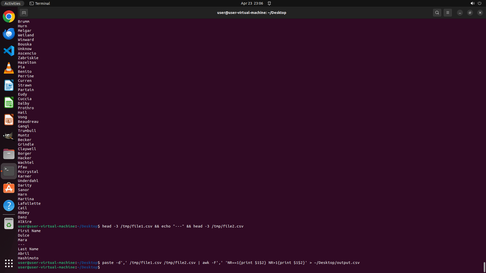

**Response:**
```
The output file has been created. Let me verify its contents.
```

**Actions:** `import subprocess, shlex; subprocess.run(f'xdotool type --delay 12 -- ' + shlex.quote('head -10 ~/Desktop/output.csv\n'), shell=True, check=True)
import time; time.sleep(0.05)`

---

## Step 10

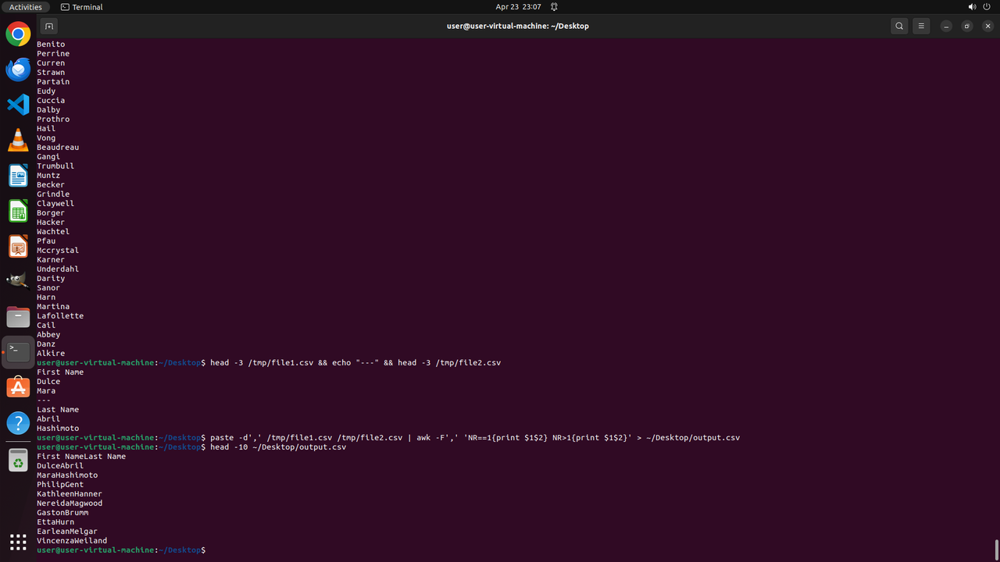

**Response:**
```
The output looks correct. The first names and last names have been concatenated row by row:
- Header: "First NameLast Name" 
- Data rows: "DulceAbril", "MaraHashimoto", etc.

The strings from both columns are concatenated. Now let me open the file in LibreOffice Calc from the terminal.
```

**Actions:** `import subprocess, shlex; subprocess.run(f'xdotool type --delay 12 -- ' + shlex.quote('libreoffice --calc ~/Desktop/output.csv &\n'), shell=True, check=True)
import time; time.sleep(0.05)`

---

## Step 11

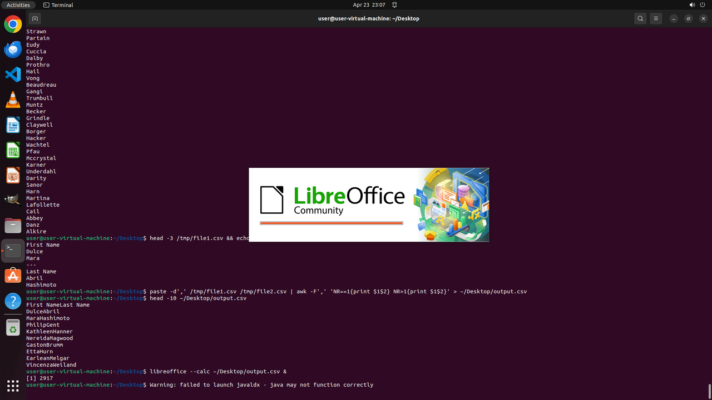

**Response:**
```
LibreOffice is loading. Let me wait for it to fully open.
```

**Actions:** `time.sleep(0.5)`

---

## Step 12

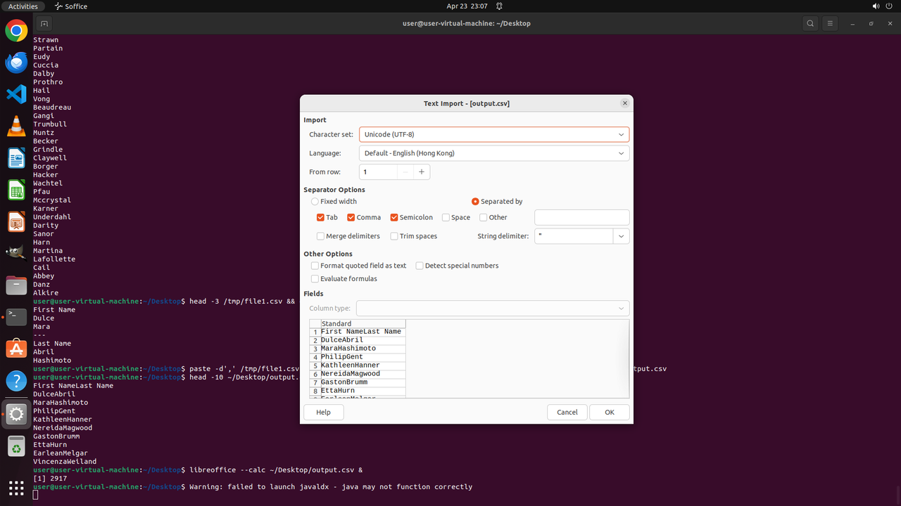

**Response:**
```
LibreOffice Calc has opened the CSV file and is showing the Text Import dialog. I can see the data is correctly merged in a single column. Let me click OK to import it.
```

**Actions:** `pyautogui.click(1290, 879)`

---

## Step 13

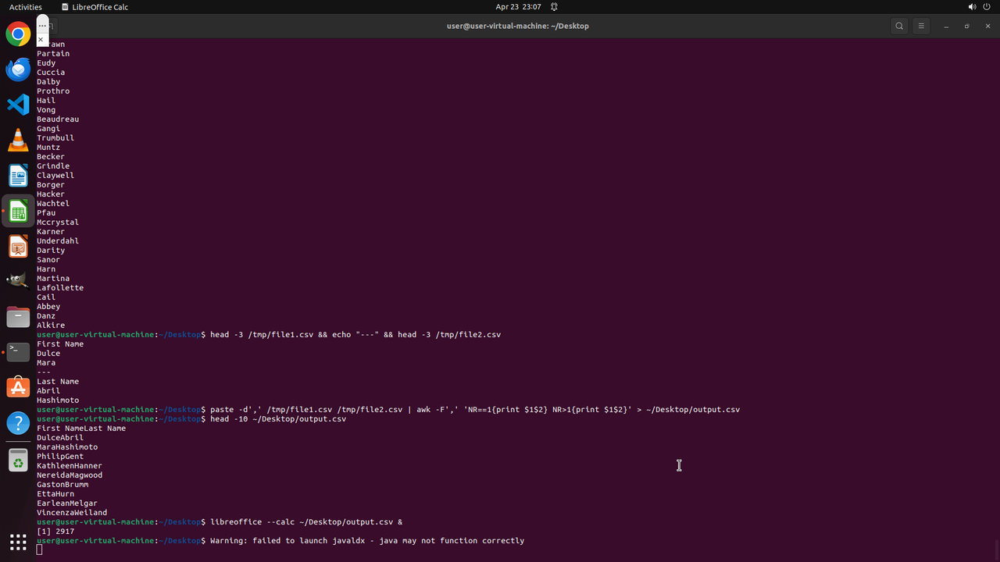

**Response:**
```
LibreOffice Calc is loading. Let me wait a moment and then click on it to see the spreadsheet.
```

**Actions:** `time.sleep(0.5)`

---

## Step 14


**Response:**
```
I can see "LibreOffice Calc" in the taskbar at the top. Let me click on it to bring the window to the foreground.
```

**Actions:** `pyautogui.click(189, 12)`

---

## Step 15

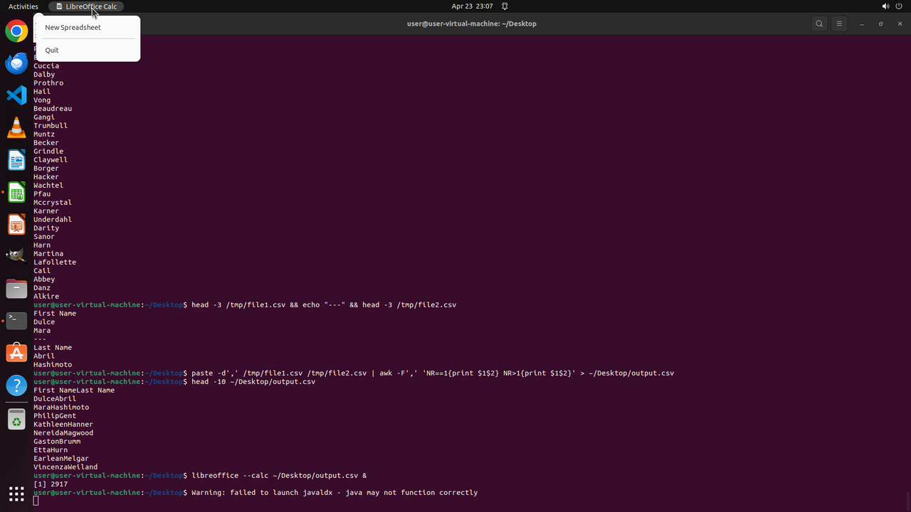

**Response:**
```
I see a menu appeared. Let me close this menu and click on the LibreOffice Calc window itself to bring it to focus.
```

**Actions:** `pyautogui.keyDown('esc')
pyautogui.keyUp('esc')`

---

## Step 16

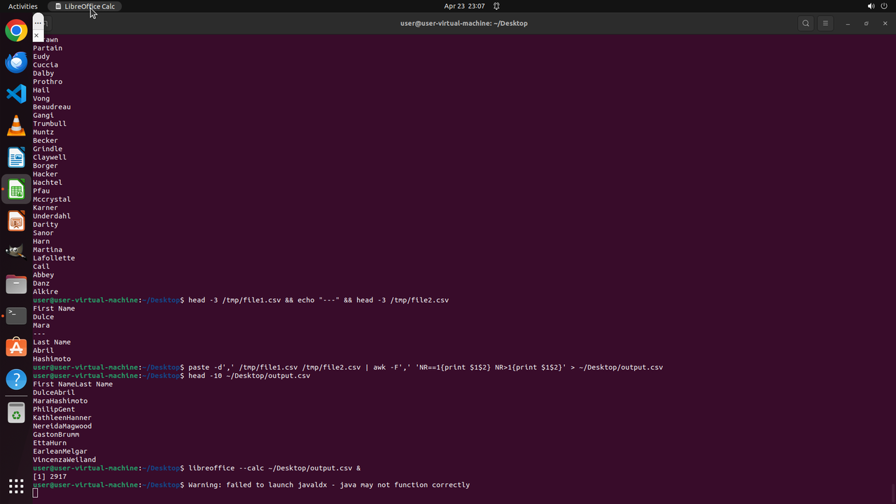

**Response:**
```
It seems the LibreOffice Calc window might be behind the terminal. Let me click on the LibreOffice Calc entry in the taskbar to bring it to focus.
```

**Actions:** `pyautogui.click(189, 12)`

---

## Step 17


**Response:**
```
I see the menu appeared again. Let me close it and try a different approach to bring up the LibreOffice Calc window.
```

**Actions:** `pyautogui.keyDown('esc')
pyautogui.keyUp('esc')`

---

## Step 18

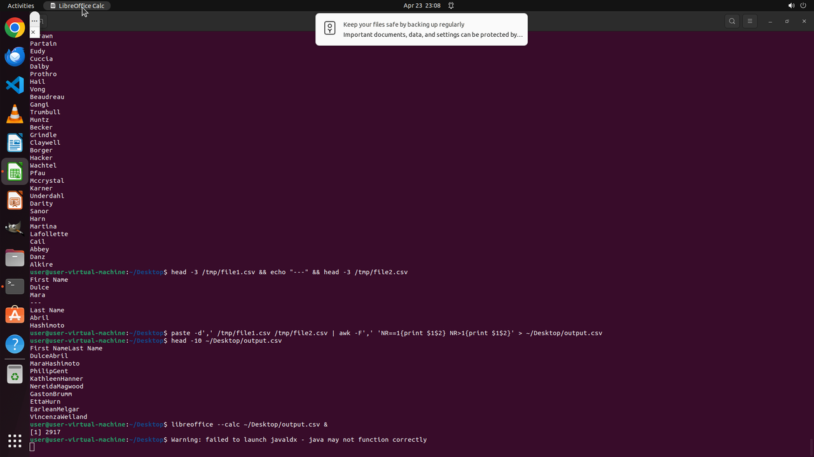

**Response:**
```
I see a notification about backing up files. Let me dismiss it and try to find the LibreOffice Calc window. It seems to be minimized or behind the terminal. Let me try using Alt+Tab to switch to it.
```

**Actions:** `pyautogui.keyDown('alt')
pyautogui.keyDown('tab')
pyautogui.keyUp('tab')
pyautogui.keyUp('alt')`

---

## Step 19

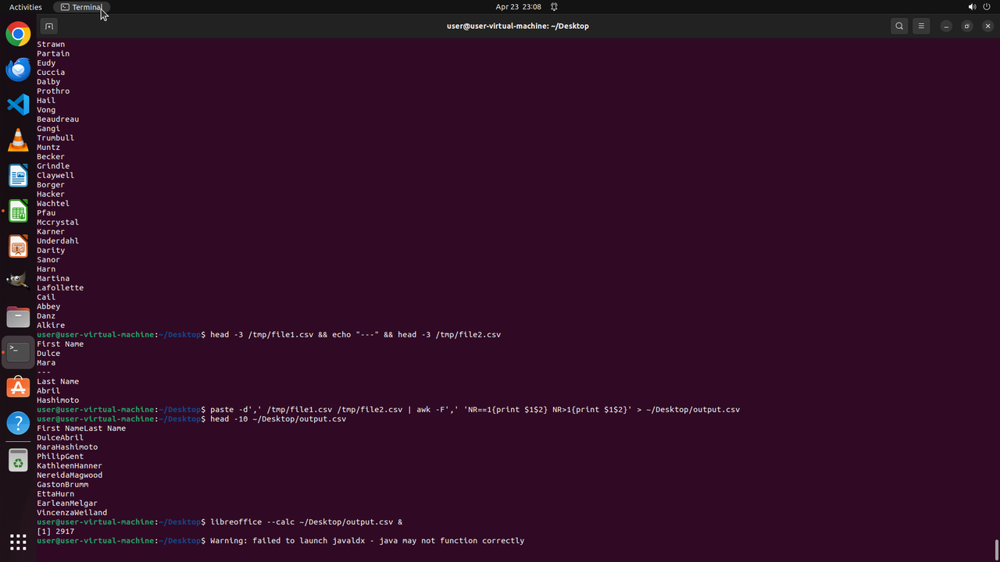

**Response:**
```
It switched to the Terminal. It seems LibreOffice Calc might still be loading or the window isn't visible. Let me try Alt+Tab again to switch to LibreOffice Calc.
```

**Actions:** `pyautogui.keyDown('alt')
pyautogui.keyDown('tab')
pyautogui.keyUp('tab')
pyautogui.keyUp('alt')`

---

## Step 20


**Response:**
```
I can see "LibreOffice Calc" in the top bar, but the window seems to be behind the terminal. It looks like the LibreOffice Calc window might be maximized behind the terminal which is also maximized. Let me try clicking on the small window controls I can see at the top left (the "..." area) which might be the LibreOffice Calc window.
```

**Actions:** `pyautogui.click(82, 49)`

---

## Step 21


**Response:**
```
It seems like LibreOffice Calc is open but its window is behind the terminal. The title bar says "LibreOffice Calc" but the terminal content is visible. It looks like the LibreOffice Calc window might be very small or hidden. Let me try to use xdotool to activate the LibreOffice window. Let me click on the terminal first and use a command.
```

**Actions:** `pyautogui.click(960, 600)`

---

## Step 22


**Response:**
```
Good, now I'm in the terminal. Let me use xdotool to activate the LibreOffice Calc window.
```

**Actions:** `import subprocess, shlex; subprocess.run(f'xdotool type --delay 12 -- ' + shlex.quote('xdotool search --name "output.csv" windowactivate\n'), shell=True, check=True)
import time; time.sleep(0.05)`

---

## Step 23


**Response:**
```
The xdotool command ran but the LibreOffice Calc window still seems to be behind the terminal. The title bar shows "LibreOffice Calc" though. Let me try to minimize the terminal to see the LibreOffice Calc window underneath.
```

**Actions:** `import subprocess, shlex; subprocess.run(f'xdotool type --delay 12 -- ' + shlex.quote('xdotool search --name "output.csv" windowactivate '), shell=True, check=True)
import time; time.sleep(0.05)
impor`

---

## Step 24


**Response:**
```
It seems the LibreOffice Calc window might be behind the terminal but both are maximized. Let me try minimizing the terminal window first to see the LibreOffice Calc window.
```

**Actions:** `import subprocess, shlex; subprocess.run(f'xdotool type --delay 12 -- ' + shlex.quote('xdotool getactivewindow windowminimize\n'), shell=True, check=True)
import time; time.sleep(0.05)`

---

## Step 25

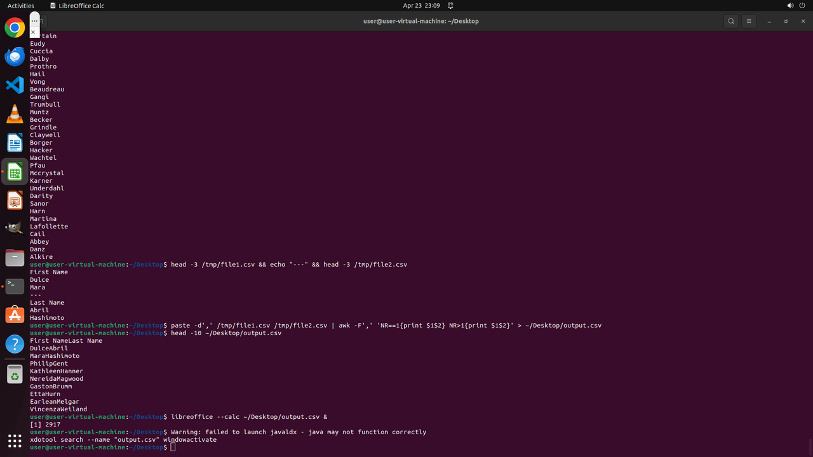

**Response:**
```
It seems like the terminal and LibreOffice Calc might be overlapping. I notice the title bar says "LibreOffice Calc" but the content shows the terminal. This is confusing. Let me look more carefully - I see there are two sets of window controls at the top left. The terminal might be a smaller window on top of LibreOffice Calc. Let me try clicking on the small "x" at the top left area to close the terminal overlay, or let me try clicking on the area that might be part of the LibreOffice Calc window.

Let me try a different approach - let me click on the minimize button of the terminal (the "-" button at the top right).
```

**Actions:** `pyautogui.click(1809, 49)`

---

## Step 26


**Response:**
```
Now I can see the desktop with the output.csv file created. I can see "LibreOffice Calc" in the top menu bar, which means it's running. The LibreOffice Calc window seems to be minimized or not visible. Let me click on "LibreOffice Calc" in the top bar to bring it up, or I can see the output.csv file on the desktop. Let me click on the LibreOffice Calc text in the top bar.
```

**Actions:** `pyautogui.click(189, 12)`

---

## Step 27

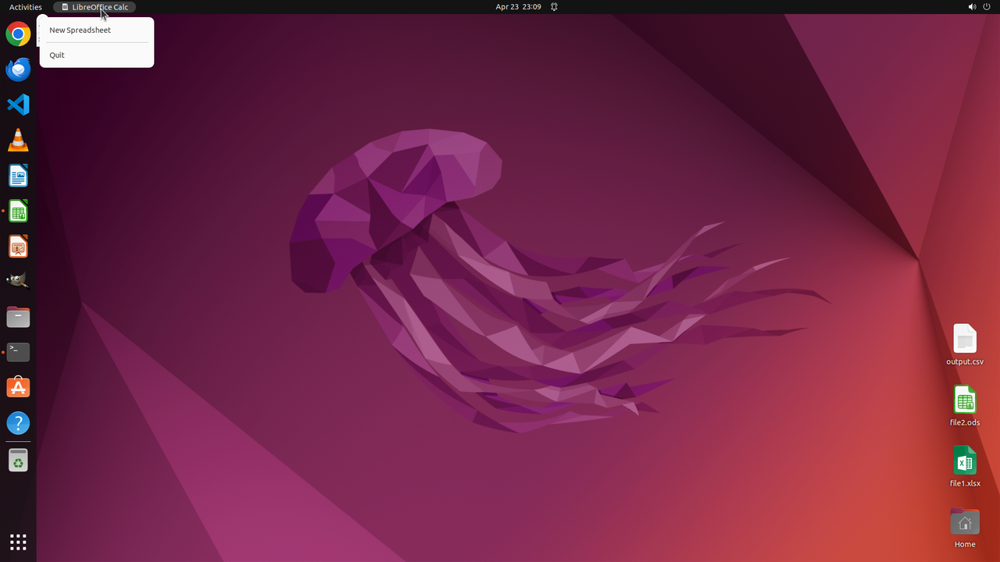

**Response:**
```
I see the LibreOffice Calc menu with "New Spreadsheet" and "Quit" options. It seems like LibreOffice Calc is running but the window with output.csv might have been closed or isn't showing. Let me close this menu and try to find the window. Let me click elsewhere to dismiss this menu first.
```

**Actions:** `pyautogui.keyDown('esc')
pyautogui.keyUp('esc')`

---

## Step 28

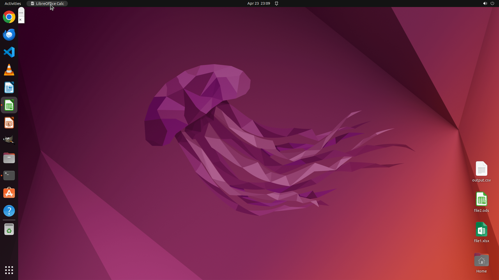

**Response:**
```
I can see that LibreOffice Calc is running (shown in the top bar) but the window seems to be minimized. I notice there's a small window icon at the top left (the "..." with "x"). Let me try clicking on the LibreOffice Calc icon in the taskbar on the left side, or let me try to use Activities to find the window.
```

**Actions:** `pyautogui.click(33, 405)`

---

## Step 29

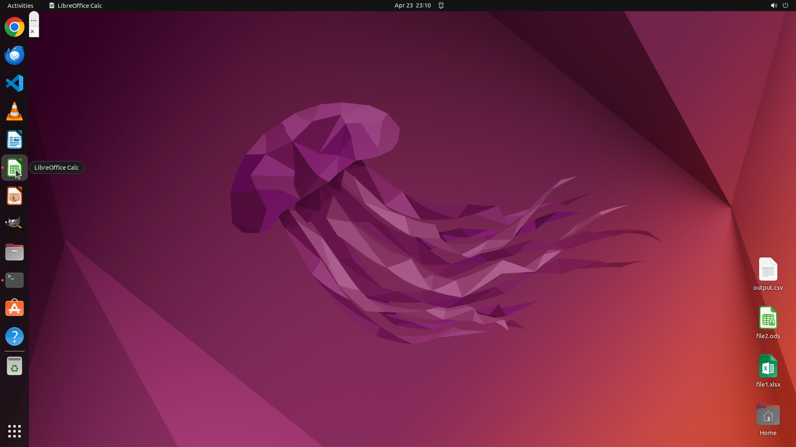

**Response:**
```
I can see the "LibreOffice Calc" tooltip when hovering over the icon. Let me click on it to open the LibreOffice Calc window.
```

**Actions:** `pyautogui.click(33, 405)`

---

## Step 30

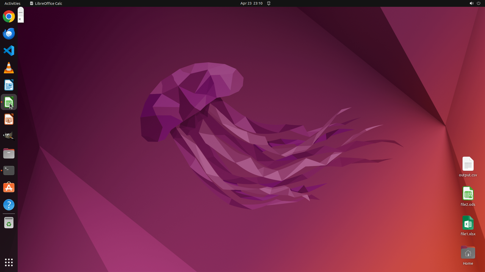

**Response:**
```
It seems like the LibreOffice Calc window might have been closed or it's not showing properly. The title bar still says "LibreOffice Calc" but no window is visible. It's possible that when we clicked OK on the CSV import dialog earlier, the file opened but the window was behind the terminal. Then when we minimized the terminal, the LibreOffice window might also have been affected. Let me try opening the terminal and launching LibreOffice Calc again with the output.csv file.
```

**Actions:** `pyautogui.click(33, 607)`

---

## Step 31

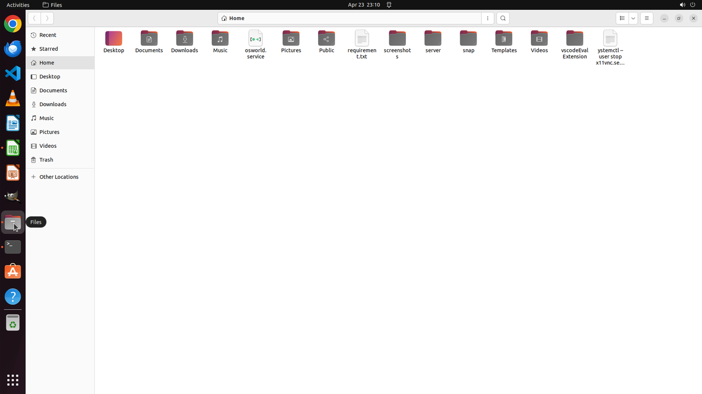

**Response:**
```
That opened the Files application instead of the terminal. Let me close this and open the terminal application. I can see the terminal icon in the taskbar.
```

**Actions:** `pyautogui.click(1888, 49)`

---

## Step 32


**Response:**
```
Good, the Files window is closed. I can see "LibreOffice Calc" in the top bar, meaning it's still running. Let me try to open the terminal by right-clicking on the desktop or using the terminal icon in the taskbar.
```

**Actions:** `pyautogui.click(33, 673)`

---

## Step 33


**Response:**
```
Good, the terminal is now visible. I can see that the previous LibreOffice Calc process (PID 2917) was launched. It seems the LibreOffice Calc window may have been minimized or hidden. Let me try to kill the existing instance and relaunch it.
```

**Actions:** `pyautogui.click(960, 1056)`

---

## Step 34

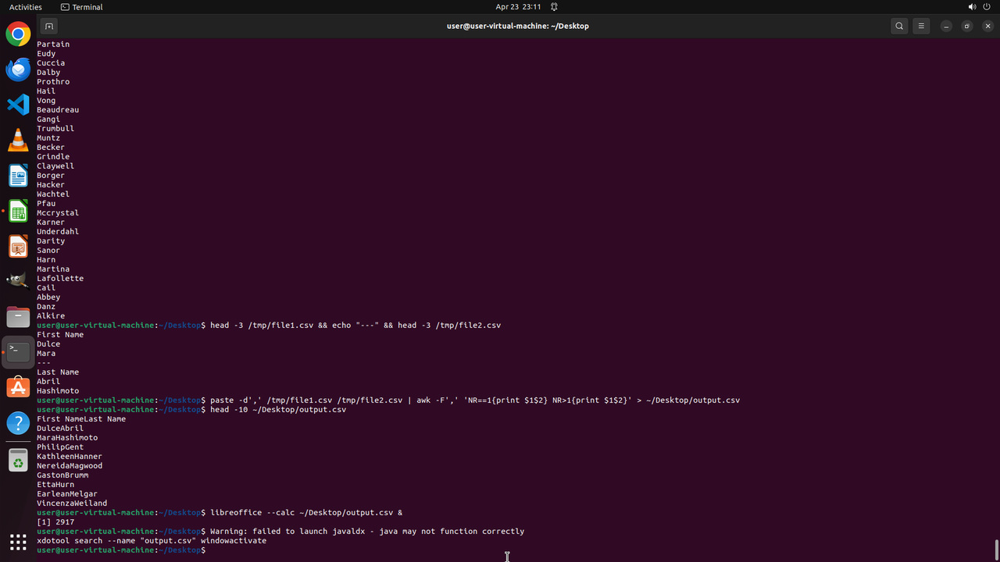

**Response:**
```
Good, I'm in the terminal. Let me kill the existing LibreOffice process and relaunch it.
```

**Actions:** `import subprocess, shlex; subprocess.run(f'xdotool type --delay 12 -- ' + shlex.quote('killall soffice.bin 2>/dev/null; sleep 2; soffice '), shell=True, check=True)
import time; time.sleep(0.05)
impor`

---

## Step 35

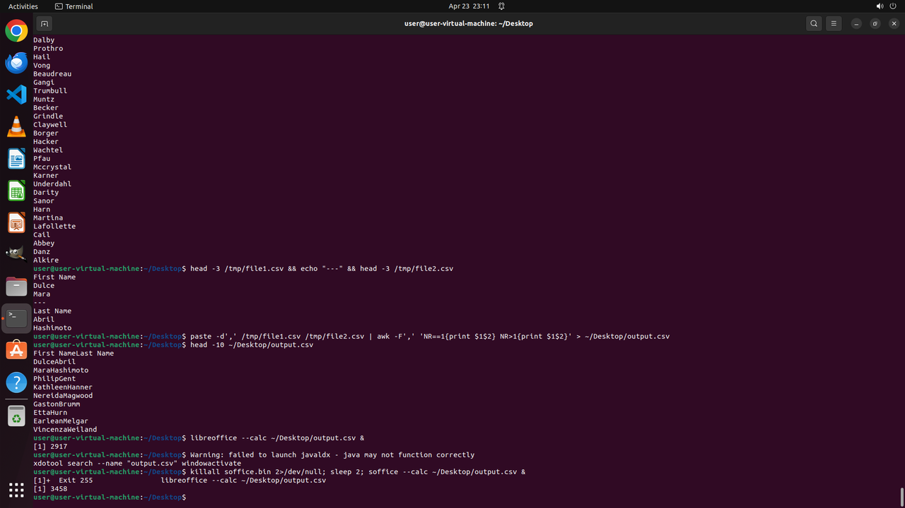

**Response:**
```
I can see that the old LibreOffice process was killed (Exit 255) and a new one was started (PID 3458). Let me wait a moment for LibreOffice Calc to open.
```

**Actions:** `time.sleep(0.5)`

---

## Step 36


**Response:**
```
LibreOffice is showing a Document Recovery dialog because the previous instance was killed. Let me click "Discard" to skip recovery and open the file fresh.
```

**Actions:** `pyautogui.click(1227, 730)`

---

## Step 37

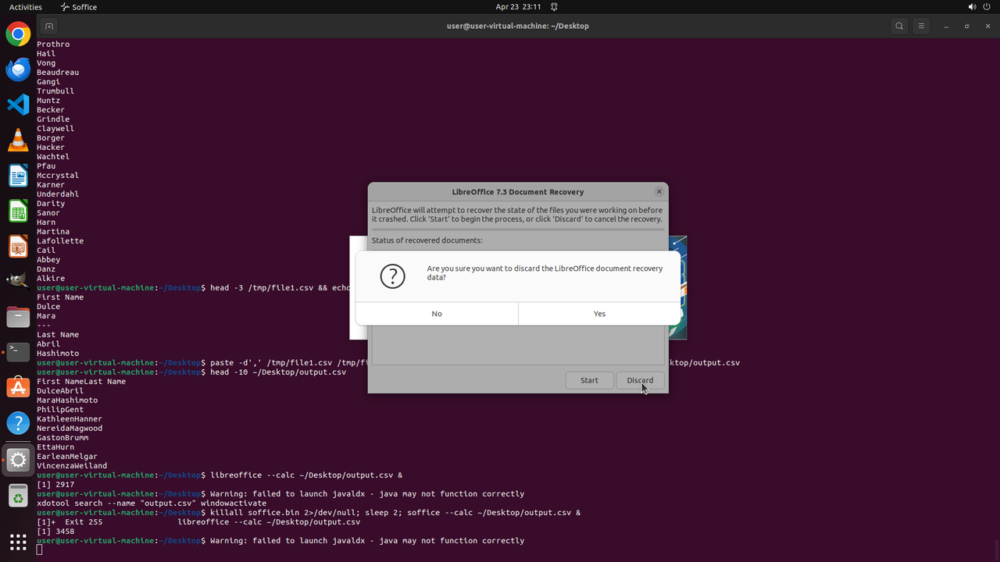

**Response:**
```
It's asking to confirm discarding the recovery data. Let me click "Yes" to proceed.
```

**Actions:** `pyautogui.click(1149, 601)`

---

## Step 38

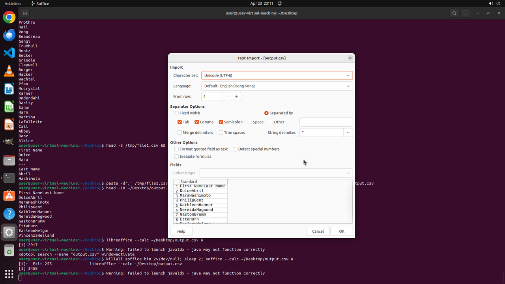

**Response:**
```
The Text Import dialog for output.csv is showing. I can see the data is correctly formatted with the concatenated names in a single column:
- First NameLast Name (header)
- DulceAbril
- MaraHashimoto
- PhilipGent
- KathleenHanner
- NereidaMagwood
- GastonBrumm
- EttaHurn

Let me click OK to import the file.
```

**Actions:** `pyautogui.click(1293, 879)`

---

## Step 39


**Response:**
```
I can see "LibreOffice Calc" in the title bar at the top, meaning it has opened the file. The LibreOffice Calc window appears to be behind the terminal again. Let me click on the LibreOffice Calc window controls visible at the top left (the "..." area) or try Alt+Tab to switch to it.
```

**Actions:** `pyautogui.click(75, 49)`

---

## Step 40

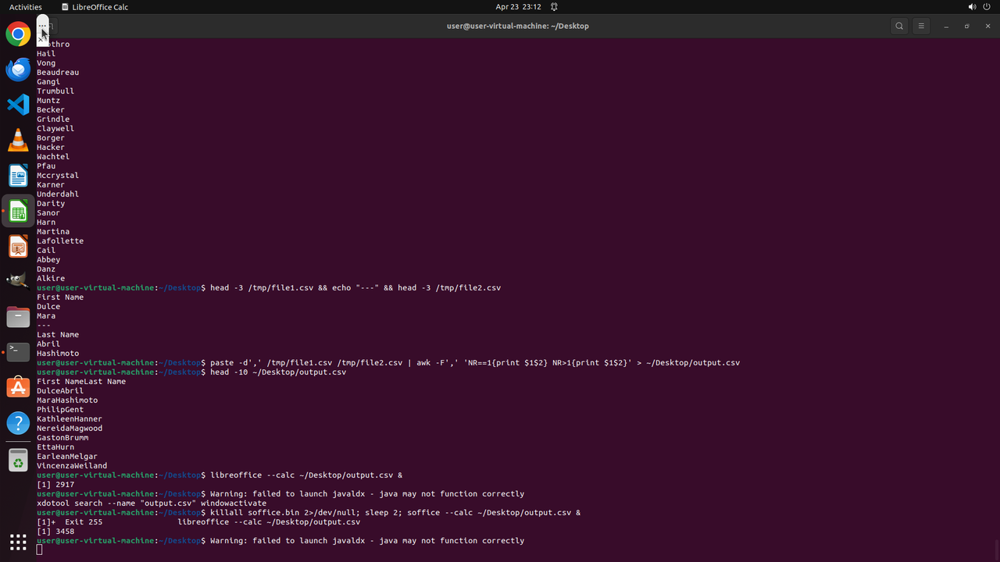

**Response:**
```
I can see that the title bar says "LibreOffice Calc" which means the file is open in LibreOffice Calc. The terminal is on top of the LibreOffice Calc window. Let me minimize the terminal to see the LibreOffice Calc window.
```

**Actions:** `pyautogui.click(1809, 49)`

---

## Step 41


**Response:**
```
The terminal is minimized and I can see the desktop with "LibreOffice Calc" in the top bar. The LibreOffice Calc window seems to be hidden or minimized as well. I can see the small window controls ("..." and "x") at the top left near the Chrome icon. Let me try clicking on "LibreOffice Calc" text in the top bar.
```

**Actions:** `pyautogui.click(189, 12)`

---

## Step 42


**Response:**
```
I see the LibreOffice Calc menu again with only "New Spreadsheet" and "Quit" options. It seems the output.csv file window might have been closed or the LibreOffice Calc is running but the document window is not visible. Let me dismiss this menu and try using Activities to find the window.
```

**Actions:** `pyautogui.keyDown('esc')
pyautogui.keyUp('esc')`

---

## Step 43


**Response:**
```
I notice the "..." and "x" buttons at the top left corner - those appear to be window controls for the LibreOffice Calc window, but it seems the window might be very small or positioned off-screen. Let me try clicking on "Activities" to see all open windows.
```

**Actions:** `pyautogui.click(48, 12)`

---

## Step 44

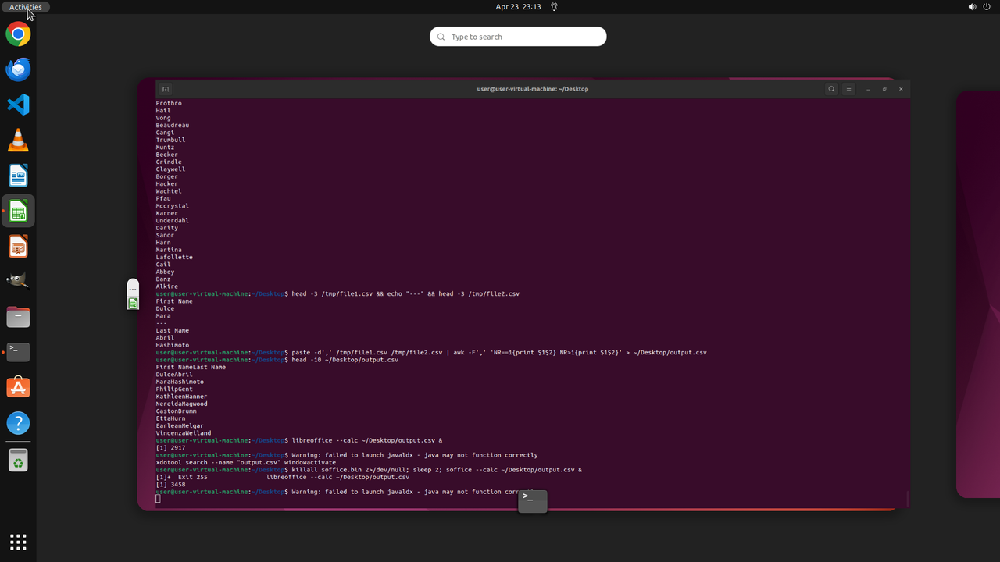

**Response:**
```
In the Activities overview, I can see the Terminal window prominently displayed, but I don't see a separate LibreOffice Calc window. It seems like LibreOffice Calc may have opened the file but the window is not visible or it might have been minimized. I can see a small terminal icon at the bottom right. Let me look more carefully - there seems to be only the Terminal window visible. 

It's possible that LibreOffice Calc opened the file but then the window was somehow lost. Let me click on the terminal to go back and try to relaunch LibreOffice Calc.
```

**Actions:** `pyautogui.click(960, 600)`

---

## Step 45

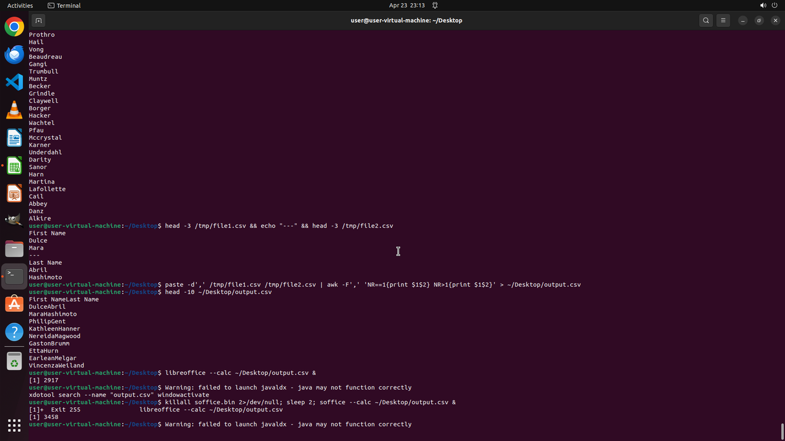

**Response:**
```
I'm back in the terminal. It seems like the LibreOffice Calc process is running but the window might have been lost. Let me kill it and try a fresh approach - I'll kill the existing LibreOffice and then open the file again.
```

**Actions:** `pyautogui.scroll(-3, 960, 600)`

---

## Step 46

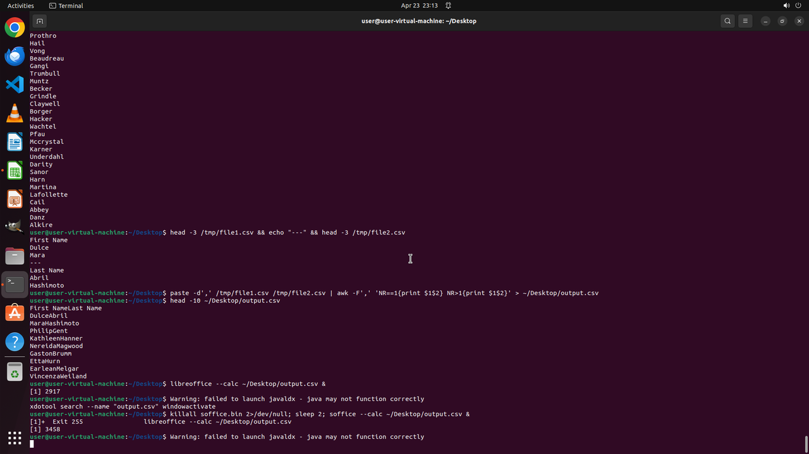

**Response:**
```
Let me kill the existing LibreOffice process and try again with a different approach. I'll use `wmctrl` or try running LibreOffice in the foreground.
```

**Actions:** `import subprocess, shlex; subprocess.run(f'xdotool type --delay 12 -- ' + shlex.quote('killall soffice.bin 2>/dev/null; sleep 2; soffice '), shell=True, check=True)
import time; time.sleep(0.05)
impor`

---

## Step 47

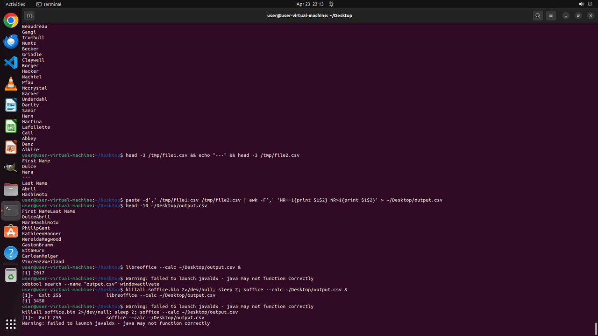

**Response:**
```
LibreOffice is starting again (I can see the "Warning: failed to launch javaldx" message which is normal). It's running in the foreground this time so the terminal is blocked. Let me wait for the recovery dialog or the import dialog to appear.
```

**Actions:** `time.sleep(0.5)`

---

## Step 48

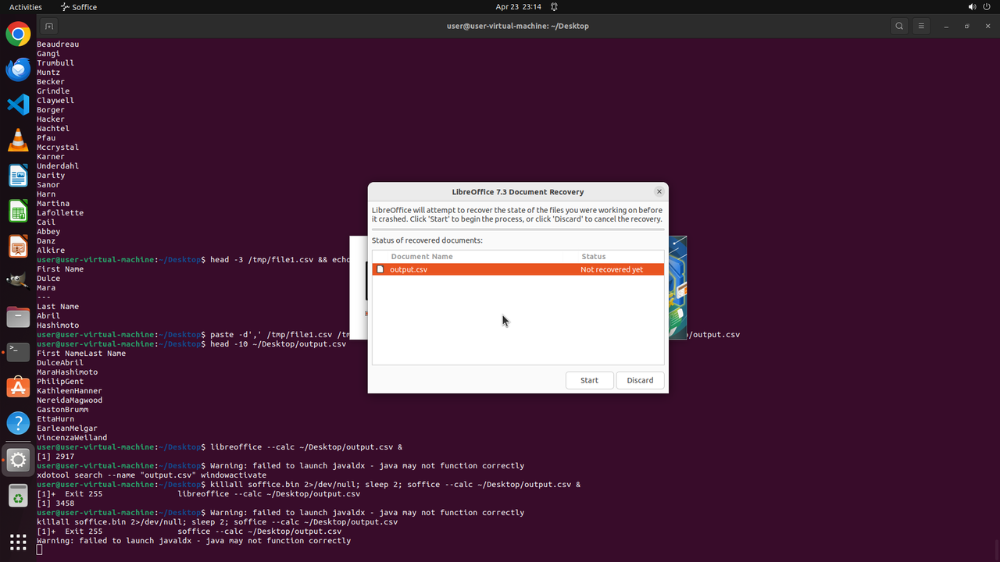

**Response:**
```
The Document Recovery dialog appeared again. Let me click "Discard" to skip recovery and open the file fresh.
```

**Actions:** `pyautogui.click(1227, 730)`

---

## Step 49

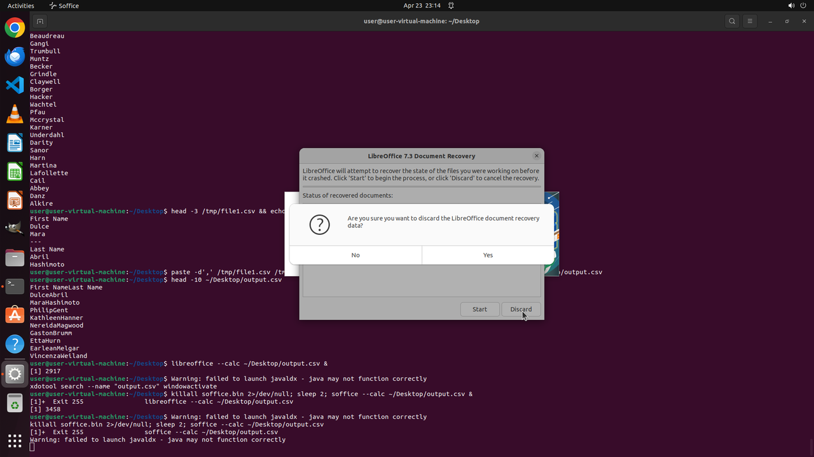

**Response:**
```
Confirmation dialog again. Let me click "Yes" to discard the recovery data.
```

**Actions:** `pyautogui.click(1149, 601)`

---

## Step 50

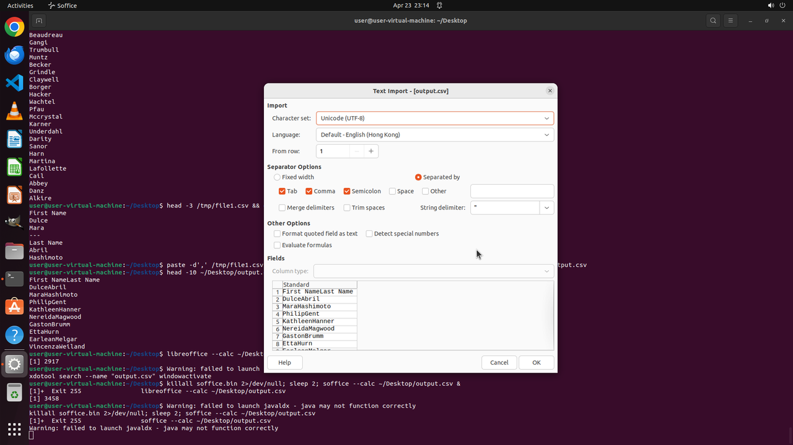

**Response:**
```
The Text Import dialog is showing the output.csv file with the correctly merged data. I can see the preview showing:
1. First NameLast Name (header)
2. DulceAbril
3. MaraHashimoto
4. PhilipGent
5. KathleenHanner
6. NereidaMagwood
7. GastonBrumm
8. EttaHurn

The data looks correct. Let me click OK to open the file in LibreOffice Calc.
```

**Actions:** `pyautogui.click(1293, 879)`

---

## Step 51

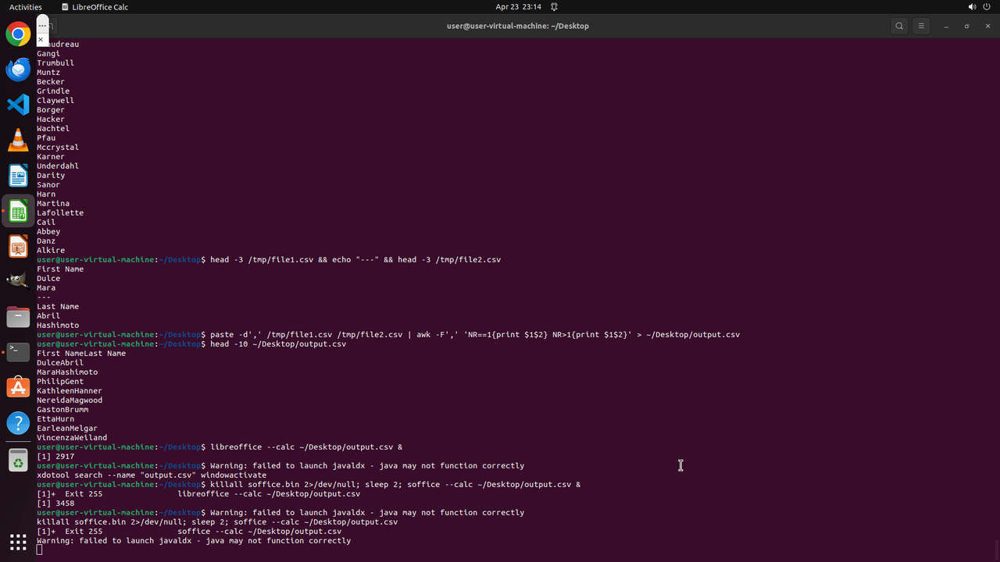

**Response:**
```
I can see "LibreOffice Calc" in the top bar, which means the file has been opened in LibreOffice Calc. The LibreOffice Calc window appears to be behind the terminal. I can see the small "..." and "x" window controls at the top left, which belong to the LibreOffice Calc window. Let me click on the LibreOffice Calc icon in the taskbar on the left side to bring it to the foreground.
```

**Actions:** `pyautogui.click(33, 405)`

---

## Step 52

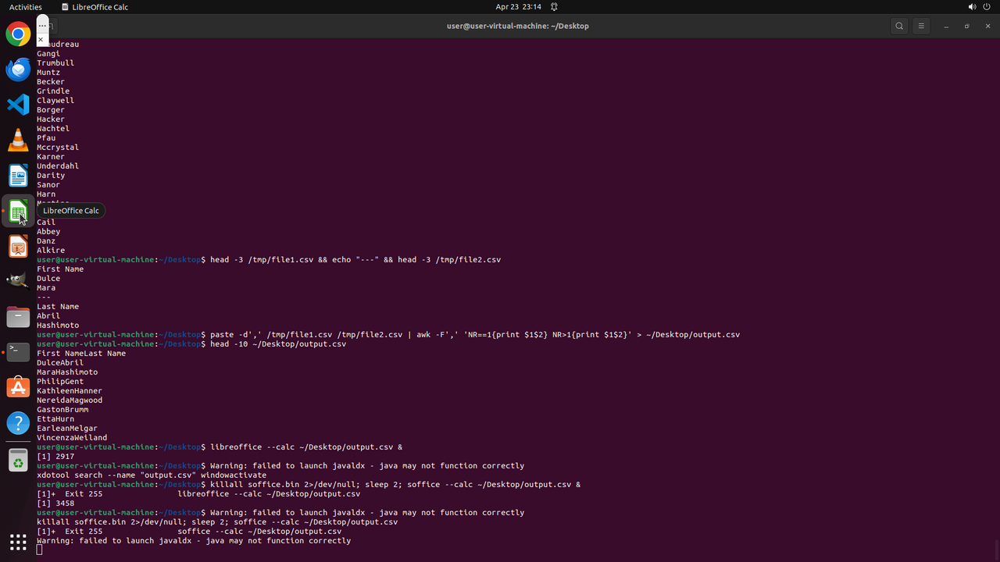

**Response:**
```
I can see the "LibreOffice Calc" tooltip appearing when hovering over the icon. Let me click on it to bring the LibreOffice Calc window to the foreground.
```

**Actions:** `pyautogui.click(33, 405)`

---

## Step 53


**Response:**
```
I can see the terminal is in the foreground and "LibreOffice Calc" is shown in the top bar. The LibreOffice Calc window seems to be behind the terminal window. I notice the "..." and "x" at the top left which might be the LibreOffice Calc window controls. The issue is that the terminal is maximized and covering the LibreOffice Calc window. Let me try to click on the "..." button at the top left to see if it brings up the LibreOffice Calc window controls.
```

**Actions:** `pyautogui.click(76, 49)`

---

## Step 54


**Response:**
```
I notice that the terminal title bar shows "user@user-virtual-machine: ~/Desktop" but the top GNOME panel shows "LibreOffice Calc". This is confusing - it seems the terminal is the active window but the LibreOffice Calc window is somewhere. The issue is that the terminal was launched in the foreground (not background) so it's blocking. Wait - looking at the last command, I ran `soffice --calc ~/Desktop/output.csv` without `&`, so the terminal is waiting for LibreOffice to finish. But LibreOffice Calc is actually running and its window should be somewhere.

Let me try to use the "x" button near the top left to close something, or let me try clicking on the small area that might be the LibreOffice Calc window behind the terminal. Let me try the "x" button at the very top left.
```

**Actions:** `pyautogui.click(73, 73)`

---

## Step 55

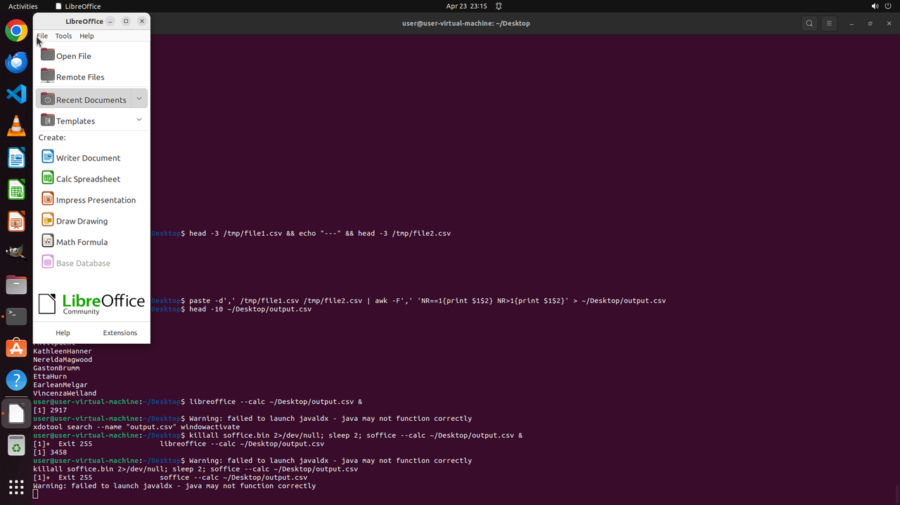

**Response:**
```
I see the LibreOffice Start Center has opened. It seems the output.csv file was opened but the window might have been lost. I can see "Recent Documents" which might contain the output.csv. Let me click on "Recent Documents" to find it.
```

**Actions:** `pyautogui.click(193, 211)`

---

## Step 56


**Response:**
```
I see the LibreOffice Start Center is showing but "Recent Documents" didn't expand. It seems the output.csv file was opened and then closed, or the window was lost. Let me close this Start Center and use the terminal to open the file properly. Let me close this window first.
```

**Actions:** `pyautogui.click(306, 45)`

---

## Step 57

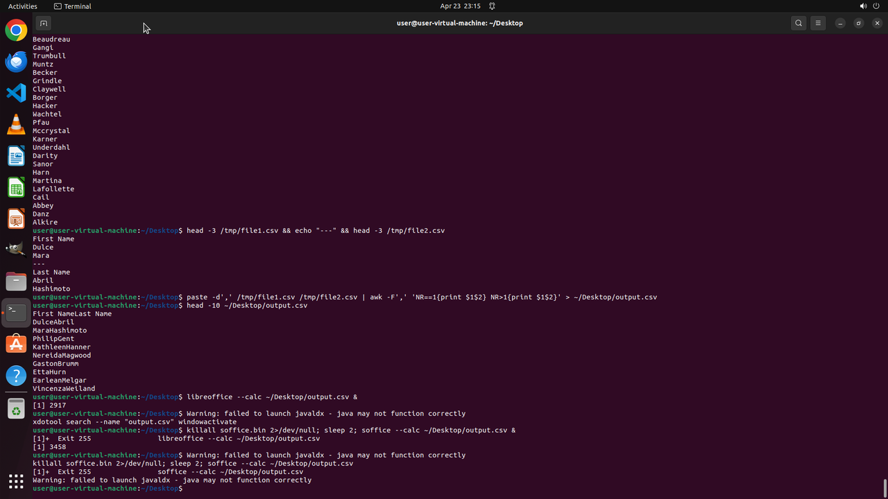

**Response:**
```
Good, the LibreOffice Start Center was closed and I'm back to the terminal with a command prompt. It seems closing the Start Center also closed the LibreOffice process (the foreground command returned). Now I have a fresh prompt. Let me first clean up the recovery files and then open the output.csv file in LibreOffice Calc properly.
```

**Actions:** `import subprocess, shlex; subprocess.run(f'xdotool type --delay 12 -- ' + shlex.quote('rm -rf ~/.config/libreoffice/4/user/backup/* 2>/de'), shell=True, check=True)
import time; time.sleep(0.05)
impor`

---

## Step 58

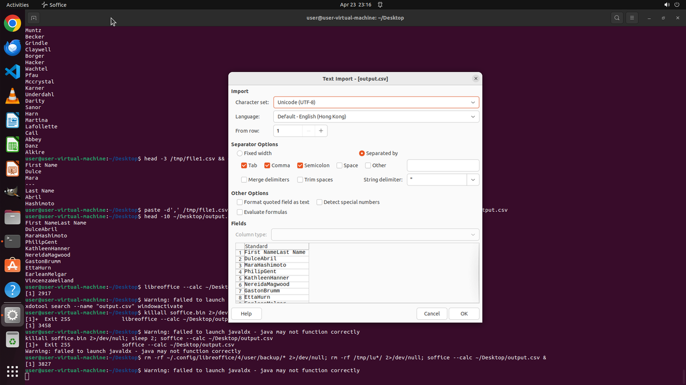

**Response:**
```
The Text Import dialog is showing again with the output.csv file. I can see the data is correctly merged in the preview:
1. First NameLast Name
2. DulceAbril
3. MaraHashimoto
4. PhilipGent
5. KathleenHanner
6. NereidaMagwood
7. GastonBrumm
8. EttaHurn

Let me click OK to open it in LibreOffice Calc.
```

**Actions:** `pyautogui.click(1293, 879)`

---

## Step 59


**Response:**
```
I can see "LibreOffice Calc" in the top bar, and the small "..." and "x" window controls at the top left. The LibreOffice Calc window is behind the terminal. Let me try using `wmctrl` to raise the LibreOffice Calc window, or let me try clicking directly on the small window controls visible at the top left area.

Let me try to use xdotool from the terminal to raise the window:
```

**Actions:** `import subprocess, shlex; subprocess.run(f'xdotool type --delay 12 -- ' + shlex.quote('wmctrl -a output.csv 2>/dev/null || xdotool search'), shell=True, check=True)
import time; time.sleep(0.05)
impor`

---

## Step 60

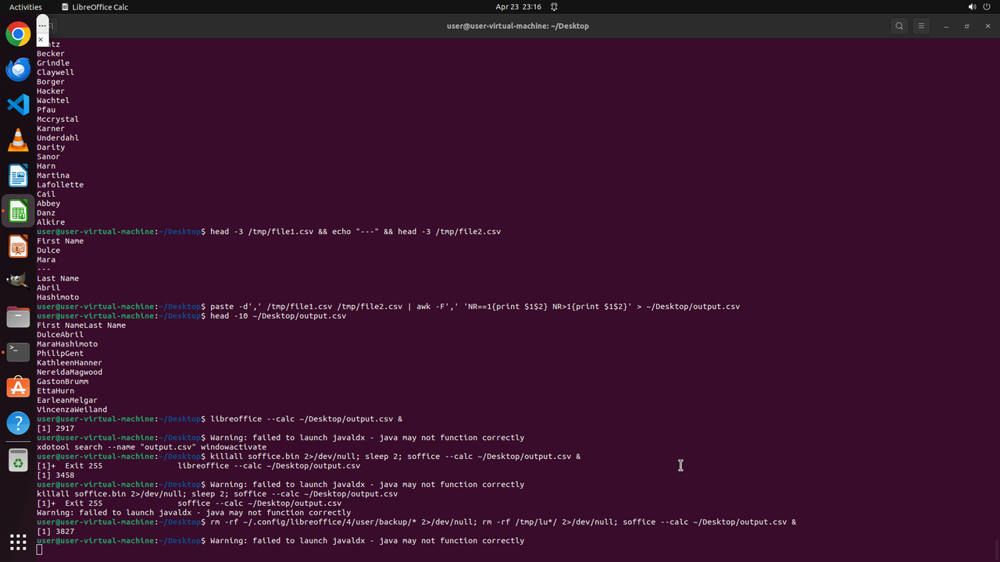

**Response:**
```
The terminal is still in front. Let me try a different approach - I'll install wmctrl first if it's not available, and then use it to list and raise windows.
```

**Actions:** `import subprocess, shlex; subprocess.run(f'xdotool type --delay 12 -- ' + shlex.quote('xdotool search --name "output" windowactivate --sy'), shell=True, check=True)
import time; time.sleep(0.05)
impor`

---

## Step 61


**Response:**
```
The LibreOffice Calc window seems to be stuck behind the terminal. Let me try a different approach - minimize the terminal window using xdotool.
```

**Actions:** `import subprocess, shlex; subprocess.run(f'xdotool type --delay 12 -- ' + shlex.quote('xdotool getactivewindow windowminimize\n'), shell=True, check=True)
import time; time.sleep(0.05)`

---

## Step 62


**Response:**
```
The terminal didn't minimize. I notice the title bar shows "user@user-virtual-machine: ~/Desktop" for the terminal, but the GNOME top bar shows "LibreOffice Calc". This is very confusing. It seems like the LibreOffice Calc window might be underneath the maximized terminal, both sharing the same screen space. 

Let me try a completely different approach. I'll scroll down to see if there's a prompt, and then try to list windows:
```

**Actions:** `pyautogui.scroll(-5, 960, 600)`

---

## Step 63


**Response:**
```
I see the terminal is still showing. Let me try pressing Enter to get a new prompt, then list all windows to understand what's happening.
```

**Actions:** `pyautogui.click(960, 1050)`

---

## Step 64

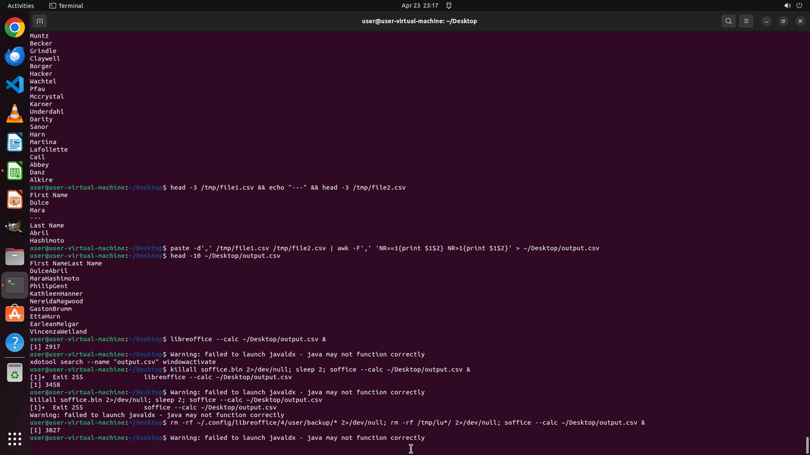

**Response:**
```
I notice the top bar now shows "Terminal" instead of "LibreOffice Calc". This means the terminal is now the active window. The LibreOffice Calc window might be behind it. Let me try to list all windows and find the LibreOffice Calc window.
```

**Actions:** `pyautogui.scroll(-5, 960, 600)`

---

## Step 65


**Response:**
```
Let me click on the terminal to get a prompt and check if LibreOffice is still running, and then try to list all windows.
```

**Actions:** `pyautogui.keyDown('return')
pyautogui.keyUp('return')`

---

## Step 66

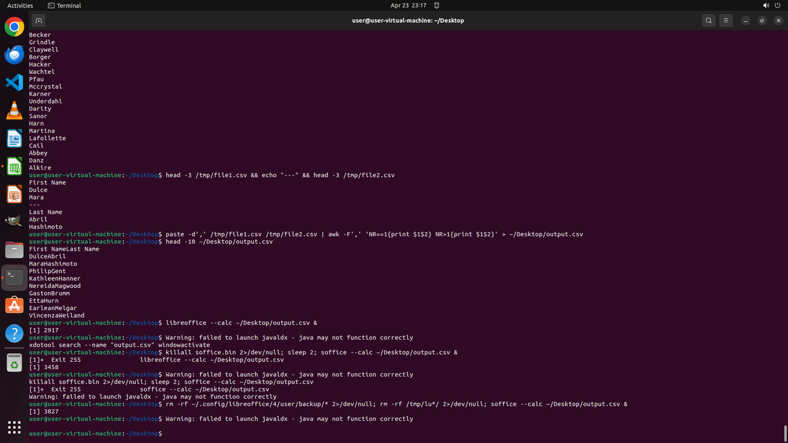

**Response:**
```
Good, I can see the prompt now. It looks like the LibreOffice Calc process might have exited. Let me check if it's still running and then try to list windows.
```

**Actions:** `import subprocess, shlex; subprocess.run(f'xdotool type --delay 12 -- ' + shlex.quote('pgrep -a soffice\n'), shell=True, check=True)
import time; time.sleep(0.05)`

---

## Step 67

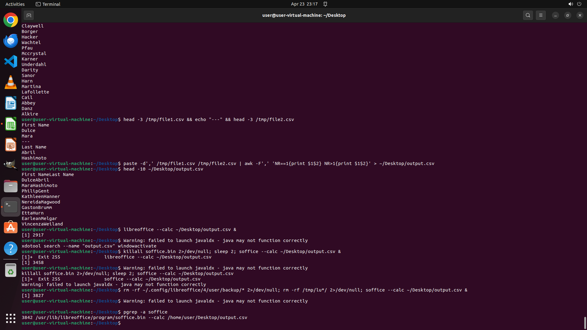

**Response:**
```
LibreOffice is running (PID 3842) with the output.csv file. The process is alive but the window seems to be hidden or behind the terminal. Let me try using `xdotool` to find and raise the window by searching for the window ID.
```

**Actions:** `import subprocess, shlex; subprocess.run(f'xdotool type --delay 12 -- ' + shlex.quote('xdotool search --pid 3842 --name "" | while read w'), shell=True, check=True)
import time; time.sleep(0.05)
impor`

---

## Step 68


**Response:**
```
I can see "LibreOffice Calc" in the top GNOME bar now, and the xdotool command found many windows but most failed with "XGetWindowProperty[_NET_WM_DESKTOP] failed". The important thing is that the top bar shows "LibreOffice Calc" which means the LibreOffice Calc window is now active but behind the terminal. I can also see the "..." and "x" at the top left which are the LibreOffice Calc window controls.

Let me try a simpler approach - use `wmctrl` to list and raise windows:
```

**Actions:** `import subprocess, shlex; subprocess.run(f'xdotool type --delay 12 -- ' + shlex.quote('sudo apt-get install -y wmctrl 2>/dev/null; wmctrl'), shell=True, check=True)
import time; time.sleep(0.05)
impor`

---

## Step 69


**Response:**
```
It seems the command is still running (installing wmctrl). Let me wait for it to complete.
```

**Actions:** `time.sleep(0.5)`

---

## Step 70


**Response:**
```
It seems the command might still be waiting for a password for sudo. Let me scroll down to see the current state of the terminal.
```

**Actions:** `pyautogui.scroll(-10, 960, 600)`

---

## Step 71

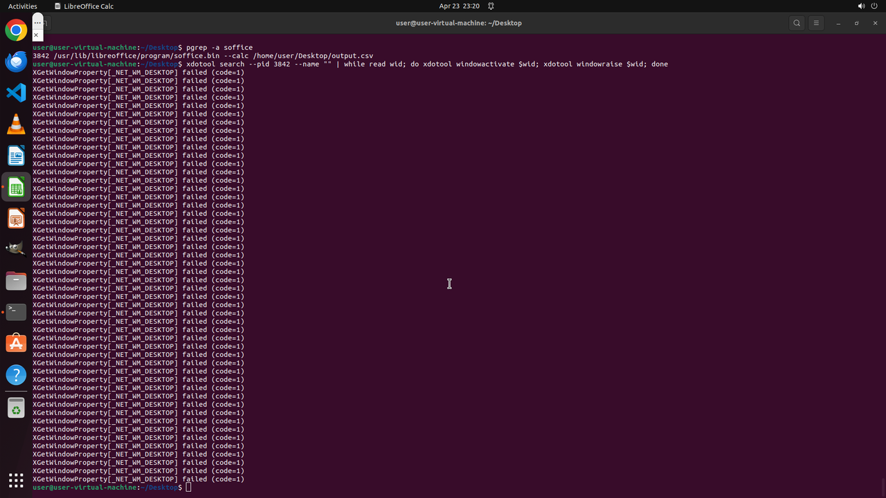

**Response:**
```
I see the prompt is available at the bottom. It seems like the sudo command might be waiting for a password or it might have completed. The top bar still shows "LibreOffice Calc". Let me try a different approach - I'll use `wmctrl` to raise the LibreOffice window, or if it's not installed, I'll try another method.
```

**Actions:** `import subprocess, shlex; subprocess.run(f'xdotool type --delay 12 -- ' + shlex.quote('wmctrl -l 2>/dev/null || echo "wmctrl not availabl'), shell=True, check=True)
import time; time.sleep(0.05)
impor`

---

## Step 72


**Response:**
```
The output seems to be the same as before - it hasn't scrolled. Let me try pressing Enter and scrolling to see the output.
```

**Actions:** `pyautogui.keyDown('return')
pyautogui.keyUp('return')`

---

## Step 73


**Response:**
```
The screen looks the same. It seems like the sudo apt-get command might be waiting for a password. Let me try typing the password and pressing Enter, or let me try Ctrl+C to cancel any pending command.
```

**Actions:** `pyautogui.keyDown('ctrl')
pyautogui.keyDown('c')
pyautogui.keyUp('c')
pyautogui.keyUp('ctrl')`

---

## Step 74


**Response:**
```
I notice the GNOME top bar shows "LibreOffice Calc" which means it's still running. The issue is that the LibreOffice Calc window is behind the terminal but both seem to be maximized. Let me try a completely different approach - I'll use `xdg-open` or try to use the GNOME Activities overview to switch windows. Let me try clicking on "Activities" in the top left corner.
```

**Actions:** `pyautogui.click(43, 12)`

---

## Step 75

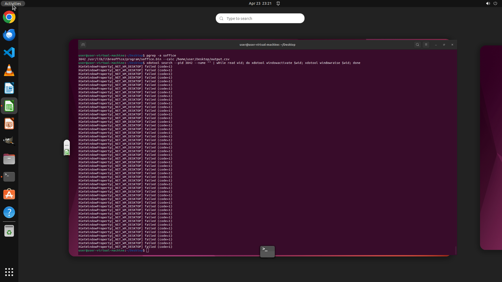

**Response:**
```
Now I can see the Activities overview. I can see only the Terminal window is visible - there's no separate LibreOffice Calc window shown. This means the LibreOffice Calc window might have been closed or it's somehow not visible as a separate window. I can see a small terminal icon at the bottom. Let me look more carefully - I see only one window (the terminal) in the overview. 

It's possible that LibreOffice Calc opened but its window is somehow not being rendered. Let me go back to the terminal, kill LibreOffice, and try a completely fresh approach.
```

**Actions:** `pyautogui.click(990, 600)`

---

## Step 76

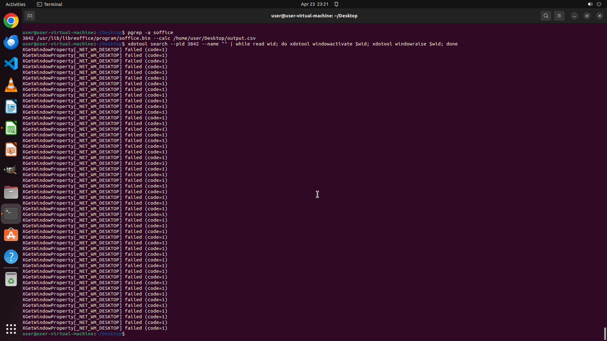

**Response:**
```
Good, I'm back in the terminal with a prompt. The top bar shows "Terminal" now. Let me kill the existing LibreOffice process completely and start fresh. This time I'll make sure the LibreOffice window appears properly.
```

**Actions:** `import subprocess, shlex; subprocess.run(f'xdotool type --delay 12 -- ' + shlex.quote('killall -9 soffice.bin 2>/dev/null; sleep 1\n'), shell=True, check=True)
import time; time.sleep(0.05)`

---

## Step 77

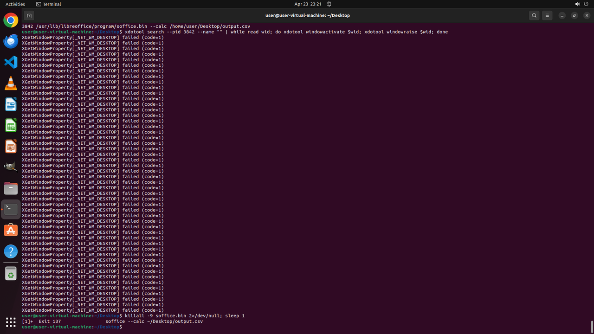

**Response:**
```
Good, the LibreOffice process has been killed (Exit 137). Now let me try a fresh approach. I'll first un-maximize the terminal window so that when LibreOffice Calc opens, it will be visible as a separate window. Let me also clear the recovery lock files.
```

**Actions:** `import subprocess, shlex; subprocess.run(f'xdotool type --delay 12 -- ' + shlex.quote('rm -rf ~/.config/libreoffice/4/user/backup/* 2>/de'), shell=True, check=True)
import time; time.sleep(0.05)
impor`

---

## Step 78

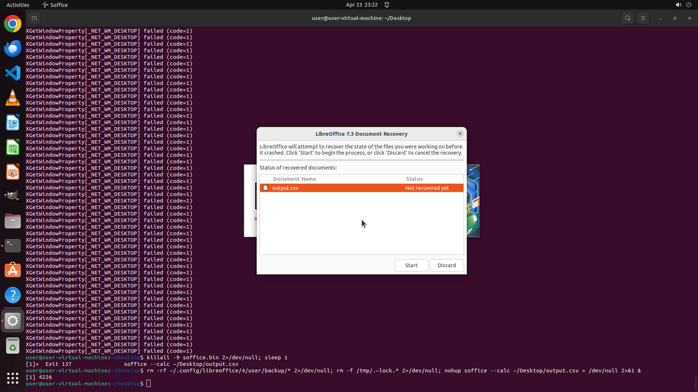

**Response:**
```
The Document Recovery dialog appeared again. Let me click "Discard" to skip recovery and open the file fresh.
```

**Actions:** `pyautogui.click(1227, 730)`

---

## Step 79

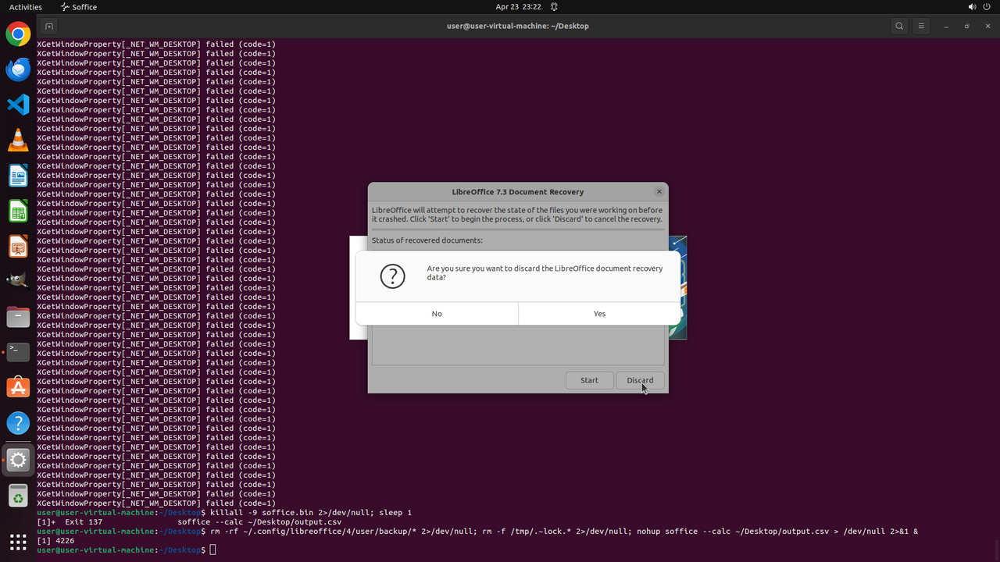

**Response:**
```
The confirmation dialog is asking if I want to discard the recovery data. Let me click "Yes".
```

**Actions:** `pyautogui.click(1149, 601)`

---

## Step 80

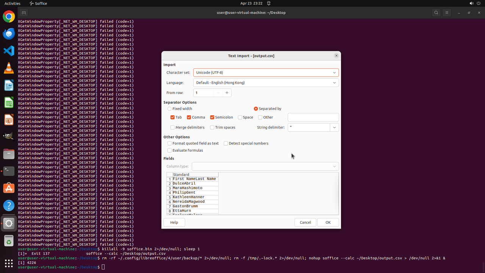

**Response:**
```
The Text Import dialog is showing the output.csv file with the correctly merged data. I can see the preview:
1. First NameLast Name
2. DulceAbril
3. MaraHashimoto
4. PhilipGent
5. KathleenHanner
6. NereidaMagwood
7. GastonBrumm
8. EttaHurn

The data looks correct. Let me click OK to open it in LibreOffice Calc.
```

**Actions:** `pyautogui.click(1293, 879)`

---

## Step 81

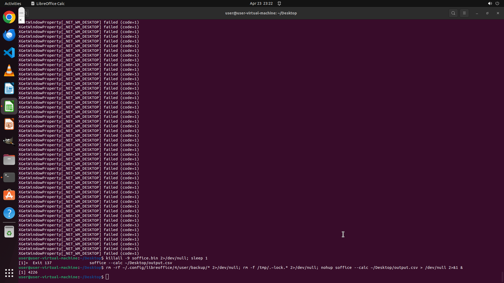

**Response:**
```
I can see "LibreOffice Calc" in the top GNOME bar, and the "..." and "x" window controls at the top left. The LibreOffice Calc window is behind the terminal again. Let me try clicking on the "..." at the top left which appears to be the LibreOffice Calc window controls, or let me try to use Activities to see both windows.

Let me try a different approach - I'll click on the small area at the very top left where I can see the "..." which appears to be part of the LibreOffice Calc window that's behind the terminal.
```

**Actions:** `pyautogui.click(43, 12)`

---

## Step 82

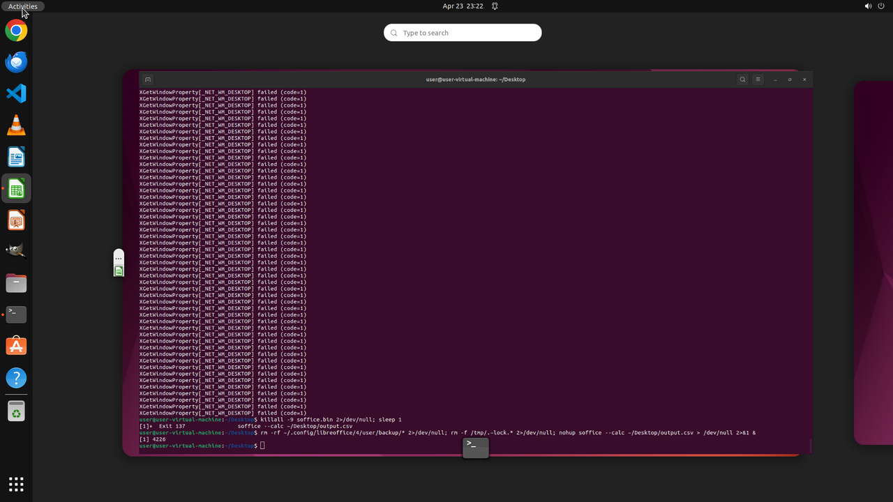

**Response:**
```
I'm in the Activities overview. I can see only the Terminal window and a small terminal icon at the bottom. There's no separate LibreOffice Calc window visible. I can also see a small icon near the center-left area (around 170, 375) which might be the LibreOffice Calc window but it's very small. Let me click on that small icon to see if it's the LibreOffice Calc window.
```

**Actions:** `pyautogui.click(255, 562)`

---

## Step 83

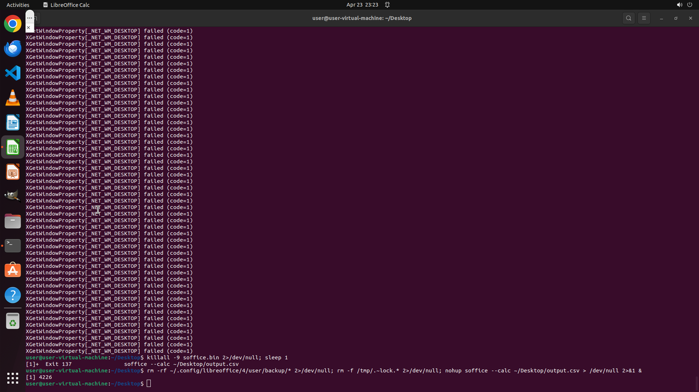

**Response:**
```
I can see "LibreOffice Calc" in the GNOME top bar and the "..." and "x" at the top left. The LibreOffice Calc window is definitely open but behind the maximized terminal. Let me try to un-maximize the terminal first by double-clicking on its title bar, then I should be able to see the LibreOffice Calc window behind it.
```

**Actions:** `pyautogui.doubleClick(990, 49)`

---

## Step 84

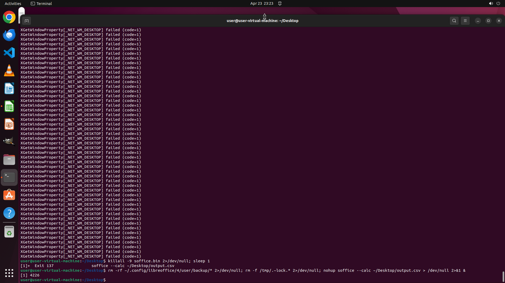

**Response:**
```
I see the terminal is still maximized (the title bar shows "Terminal"). The GNOME top bar now shows "Terminal" instead of "LibreOffice Calc". It seems like the LibreOffice Calc process might have exited. Let me check if it's still running and try a different approach to bring it to the front.
```

**Actions:** `import subprocess, shlex; subprocess.run(f'xdotool type --delay 12 -- ' + shlex.quote('pgrep -a soffice\n'), shell=True, check=True)
import time; time.sleep(0.05)`

---

## Step 85

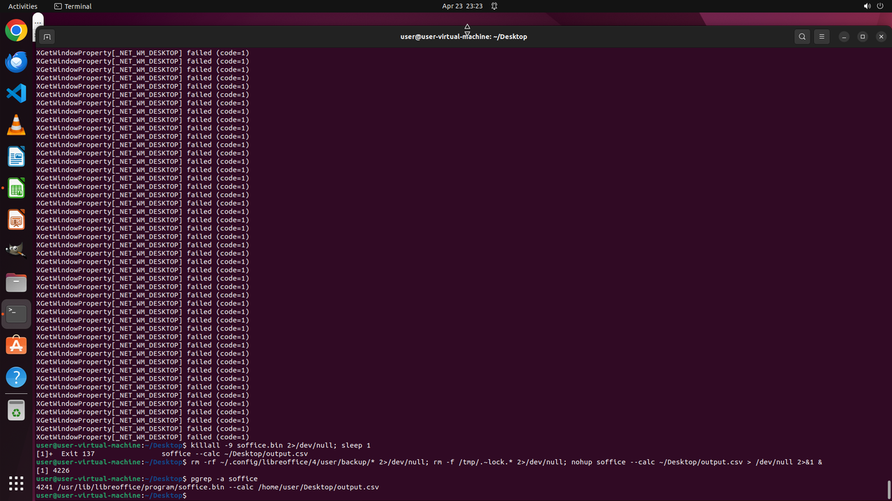

**Response:**
```
LibreOffice is running (PID 4241) with the output.csv file. The process is alive but the window is behind the terminal. Let me try to use `xdotool` more carefully to find the specific window and raise it. First, let me get the window ID.
```

**Actions:** `import subprocess, shlex; subprocess.run(f'xdotool type --delay 12 -- ' + shlex.quote('xdotool search --name "output" 2>/dev/null | head '), shell=True, check=True)
import time; time.sleep(0.05)
impor`

---

## Step 86

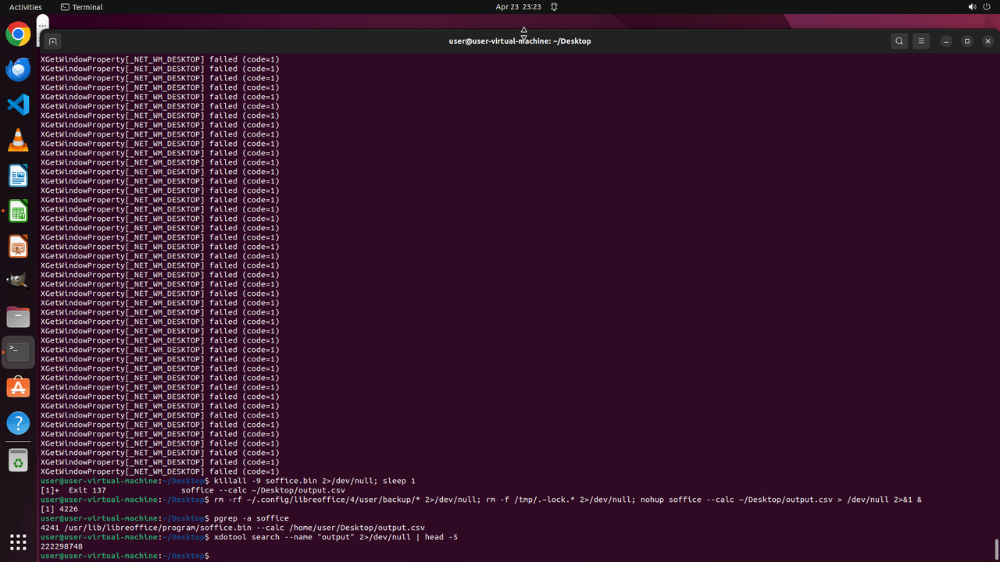

**Response:**
```
I found the window ID: 23290748. Now let me use xdotool to activate and raise this specific window.
```

**Actions:** `import subprocess, shlex; subprocess.run(f'xdotool type --delay 12 -- ' + shlex.quote('xdotool windowactivate 23290748 && xdotool windowf'), shell=True, check=True)
import time; time.sleep(0.05)
impor`

---

## Step 87

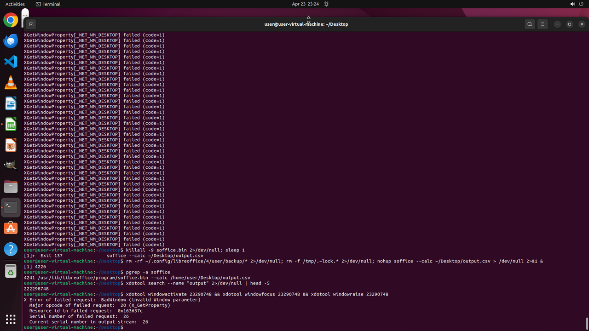

**Response:**
```
The window ID 23290748 resulted in a "BadWindow (invalid Window parameter)" error. The window ID might have been wrong. Let me try a different approach - I'll look for the correct window ID by searching for the LibreOffice Calc window class.
```

**Actions:** `import subprocess, shlex; subprocess.run(f'xdotool type --delay 12 -- ' + shlex.quote('xdotool search --class "libreoffice" 2>/dev/null\n'), shell=True, check=True)
import time; time.sleep(0.05)`

---

## Step 88

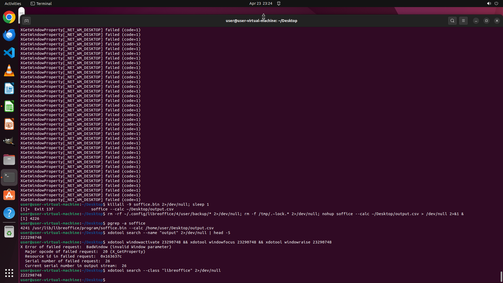

**Response:**
```
I can see the window ID is 222298748 (the last number shown). Let me try to use this ID to activate the window. Wait, looking more carefully, I see "222298748" at the bottom. Let me try with this window ID.
```

**Actions:** `import subprocess, shlex; subprocess.run(f'xdotool type --delay 12 -- ' + shlex.quote('WID=$(xdotool search --class "libreoffice" 2>/dev/'), shell=True, check=True)
import time; time.sleep(0.05)
impor`

---

## Step 89

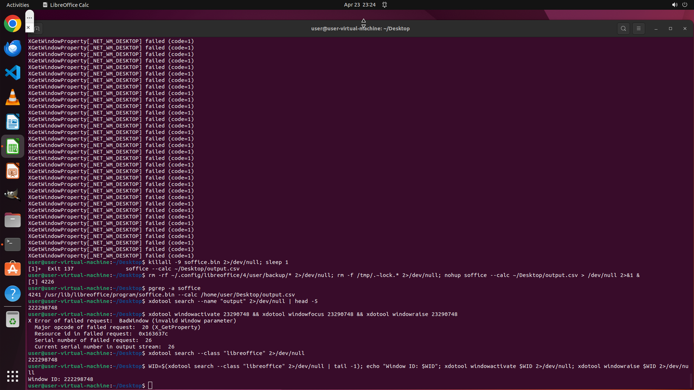

**Response:**
```
I can see "Window ID: 222298748" and the GNOME top bar now shows "LibreOffice Calc"! The window was activated. I can also see the "..." and "x" at the top left which are the LibreOffice Calc window controls. The LibreOffice Calc window is active but behind the terminal. Let me try to use `xdotool` to minimize the terminal window instead.
```

**Actions:** `import subprocess, shlex; subprocess.run(f'xdotool type --delay 12 -- ' + shlex.quote('xdotool search --class "gnome-terminal" windowmini'), shell=True, check=True)
import time; time.sleep(0.05)
impor`

---

## Step 90


**Response:**
```
The terminal is still showing. The GNOME top bar shows "LibreOffice Calc" which means it's active but the terminal is on top. Let me try a different approach - I'll use `xdotool key` to send a keyboard shortcut to switch windows, or I'll try to use `gdbus` to interact with the GNOME window manager.

Let me try using the minimize button on the terminal window directly.
```

**Actions:** `pyautogui.click(1813, 78)`

---

## Step 91


**Response:**
```
The terminal is minimized and I can see the desktop with the output.csv file visible. The GNOME top bar shows "LibreOffice Calc" which means the LibreOffice Calc window is active but it seems to be hidden or minimized too. I can see the "..." and "x" at the top left which are the LibreOffice Calc window controls. Let me click on the LibreOffice Calc icon in the taskbar to bring it up.
```

**Actions:** `pyautogui.click(33, 405)`

---

## Step 92


**Response:**
```
I can see the "LibreOffice Calc" tooltip appearing when hovering over the icon. The GNOME top bar still shows "LibreOffice Calc". Let me click on the LibreOffice Calc icon to bring its window to the foreground.
```

**Actions:** `pyautogui.click(33, 405)`

---

## Step 93


**Response:**
```
The GNOME top bar shows "LibreOffice Calc" but no window is visible. The LibreOffice Calc window seems to be positioned off-screen or has zero size. I notice the small "..." and "x" at the top left (near coordinates 49, 33 and 49, 47). These might be the LibreOffice Calc window controls but the window itself is very small or positioned at the top-left corner with minimal size.

Let me try clicking on the "..." to see if it shows window options to maximize the LibreOffice Calc window.
```

**Actions:** `pyautogui.click(73, 49)`

---

## Step 94


**Response:**
```
I notice the "..." and "x" buttons have disappeared from the top left, but the GNOME top bar still shows "LibreOffice Calc". The LibreOffice Calc window seems to have a very tiny window or is positioned off-screen. Let me try a completely different approach - I'll kill LibreOffice, open the terminal, and relaunch it in a way that the window appears properly. Let me first open the terminal.
```

**Actions:** `pyautogui.click(33, 673)`

---

## Step 95

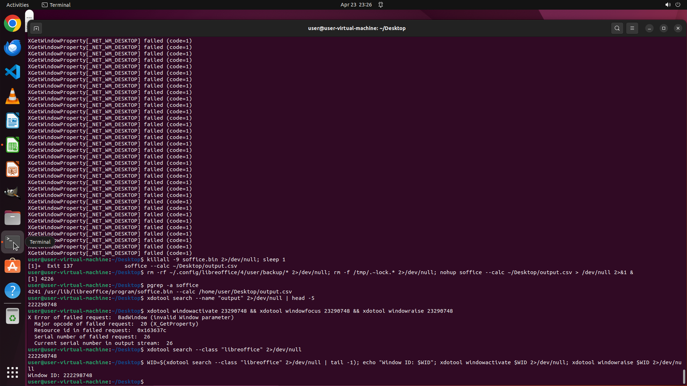

**Response:**
```
Good, I'm back in the terminal. Let me try a completely different approach. I'll kill the existing LibreOffice, remove any recovery/lock files, and then launch it fresh. This time I'll use `xdotool` to resize the window after it opens.
```

**Actions:** `import subprocess, shlex; subprocess.run(f'xdotool type --delay 12 -- ' + shlex.quote('killall -9 soffice.bin 2>/dev/null; sleep 2; rm -r'), shell=True, check=True)
import time; time.sleep(0.05)
impor`

---

## Step 96


**Response:**
```
I see LibreOffice is starting again (PID 4502, "Warning: failed to launch javaldx"). Let me wait for it to fully load and then try to handle the recovery dialog and CSV import dialog.
```

**Actions:** `time.sleep(0.5)`

---

## Step 97

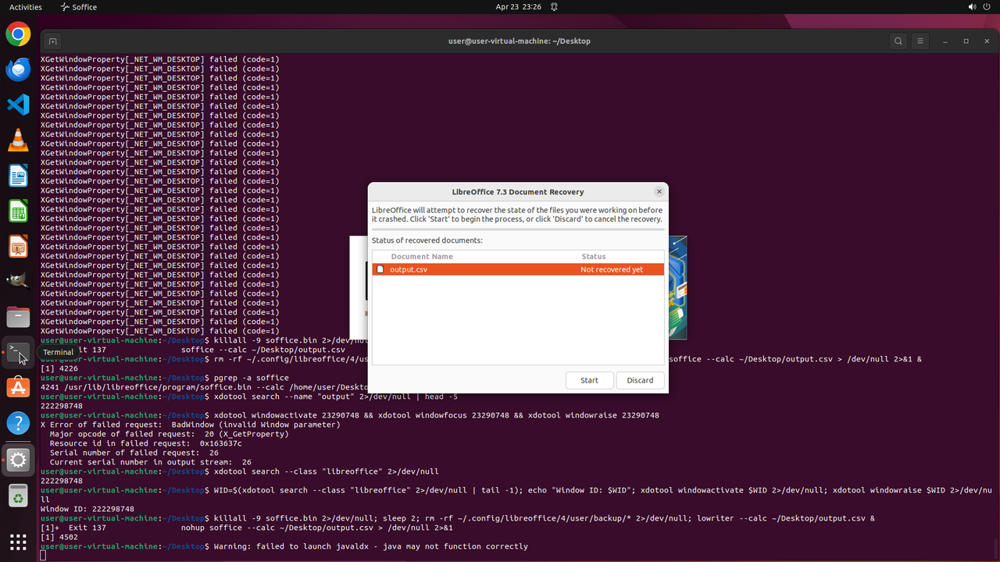

**Response:**
```
The Document Recovery dialog appeared again. Let me click "Discard" to skip recovery.
```

**Actions:** `pyautogui.click(1227, 730)`

---

## Step 98

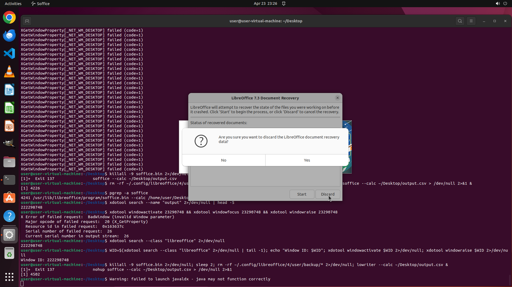

**Response:**
```
Click "Yes" to confirm discarding the recovery data.
```

**Actions:** `pyautogui.click(1149, 601)`

---

## Step 99

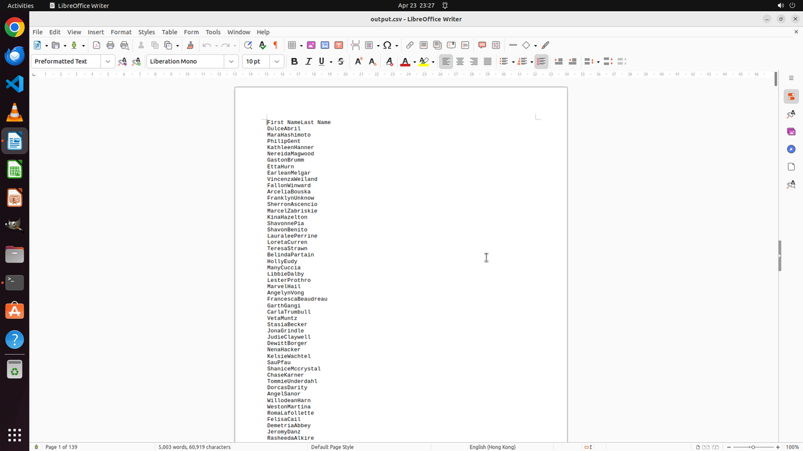

**Response:**
```
I can see that the output.csv file opened in LibreOffice Writer instead of LibreOffice Calc because I used `lowriter` instead of `soffice --calc`. The data is correct (First NameLast Name, DulceAbril, MaraHashimoto, etc.) but it opened in the wrong application. Let me close this and reopen it in LibreOffice Calc.
```

**Actions:** `pyautogui.keyDown('ctrl')
pyautogui.keyDown('w')
pyautogui.keyUp('w')
pyautogui.keyUp('ctrl')`

---

## Step 100

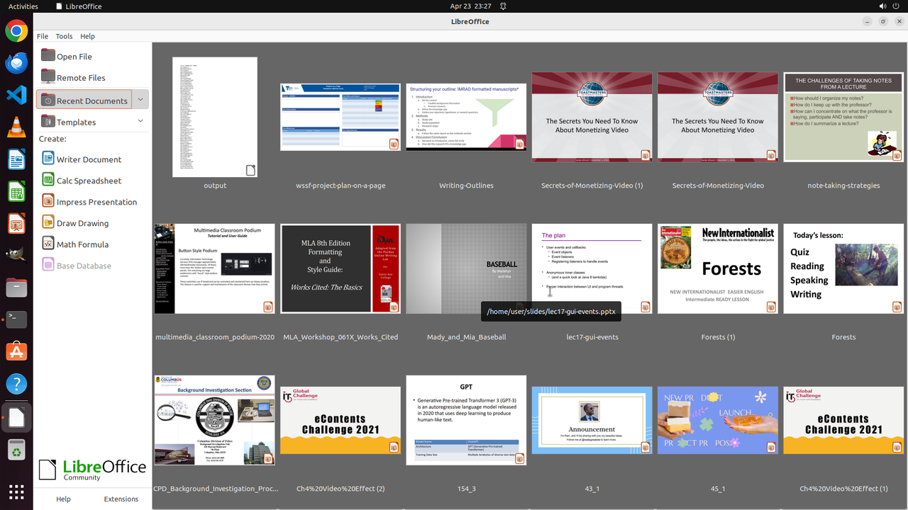

**Response:**
```
The LibreOffice Start Center is showing. I can see "Calc Spreadsheet" in the left sidebar under "Create:". I can also see "output" in the Recent Documents. But I need to open the output.csv file in LibreOffice Calc specifically. Let me click on the "output" file in the recent documents, or better yet, let me close this and use the command line to open it properly with `soffice --calc`.
```

**Actions:** `pyautogui.click(1897, 45)`

---

## Step 101

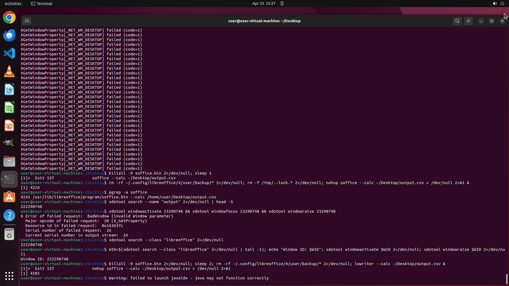

**Response:**
```
Good, I'm back in the terminal. The LibreOffice Start Center was closed. Now let me scroll down to the prompt and launch LibreOffice Calc properly with `soffice --calc`.
```

**Actions:** `pyautogui.scroll(-10, 960, 600)`

---

## Step 102


**Response:**
```
I need to get to the command prompt. Let me click on the terminal and press Enter to get a prompt.
```

**Actions:** `pyautogui.click(960, 1050)`

---

## Step 103


**Response:**
```
I can see the terminal but the prompt might be below the visible area. Let me press Enter to get a new prompt.
```

**Actions:** `pyautogui.keyDown('return')
pyautogui.keyUp('return')`

---

## Step 104

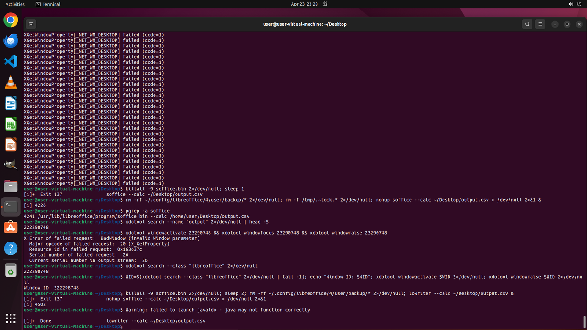

**Response:**
```
I can see the prompt at the bottom and the message "[1]+ Done lowriter --calc ~/Desktop/output.csv" which means the LibreOffice Writer process has finished (the Start Center was closed). Now I have a fresh prompt. Let me launch LibreOffice Calc properly this time using `soffice --calc`.
```

**Actions:** `import subprocess, shlex; subprocess.run(f'xdotool type --delay 12 -- ' + shlex.quote('soffice --calc ~/Desktop/output.csv &\n'), shell=True, check=True)
import time; time.sleep(0.05)`

---

## Step 105

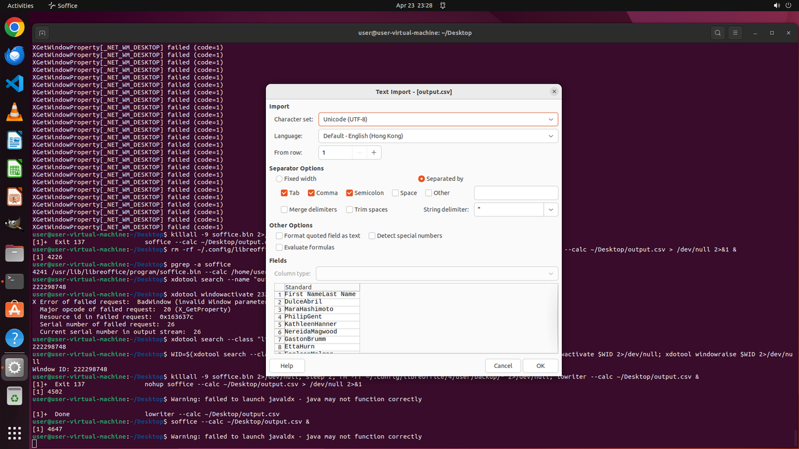

**Response:**
```
The Text Import dialog is showing again with the output.csv file. The data preview looks correct:
1. First NameLast Name
2. DulceAbril
3. MaraHashimoto
4. PhilipGent
5. KathleenHanner
6. NereidaMagwood
7. GastonBrumm
8. EttaHurn

Let me click OK to open it in LibreOffice Calc.
```

**Actions:** `pyautogui.click(1293, 880)`

---

## Step 106


**Response:**
```
I can see "LibreOffice Calc" in the GNOME top bar and the "..." and "x" window controls at the top left. The LibreOffice Calc window is behind the terminal again. This time, let me try to use `xdotool` to move and resize the LibreOffice Calc window so it appears in front. First, let me try to use `xdotool` with the window size and position.
```

**Actions:** `import subprocess, shlex; subprocess.run(f'xdotool type --delay 12 -- ' + shlex.quote('sleep 2; WID=$(xdotool search --class "libreoffice'), shell=True, check=True)
import time; time.sleep(0.05)
impor`

---

## Step 107

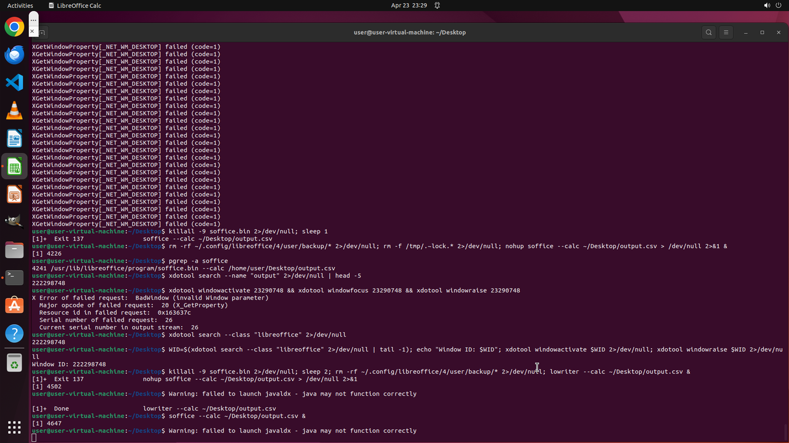

**Response:**
```
The command is still executing (it has a `sleep 2` at the beginning). Let me wait for it to complete.
```

**Actions:** `time.sleep(0.5)`

---

## Step 108


**Response:**
```
The screen still shows the terminal with "LibreOffice Calc" in the top bar. The xdotool commands seem to not be working to bring the LibreOffice Calc window in front. Let me try a completely different approach - I'll use the GNOME keyboard shortcut Super+Tab or try clicking on the "..." at the top left which seems to be the LibreOffice Calc window's minimize/close controls.

Let me try clicking directly on the "x" button at the top left of the screen (which appears to be the LibreOffice Calc window close button that's peeking out from behind the terminal).

Actually, wait - I notice the "..." at coordinates (49, 33) and "x" at (49, 49) are visible. These belong to the LibreOffice Calc window. But the terminal is covering it. Let me try a different approach - use `Super` key to access activities and then click on the LibreOffice window.
```

**Actions:** `pyautogui.keyDown('command')
pyautogui.keyUp('command')`

---

## Step 109


**Response:**
```
The Super key didn't trigger Activities. Let me try a different approach. I think the issue is that the LibreOffice Calc window might be on a different virtual desktop or it might have a very small size. Let me try to close the terminal and see if the LibreOffice Calc window becomes visible.

Actually, let me try a simpler approach - just close the terminal window by clicking the X button on the terminal.
```

**Actions:** `pyautogui.click(1893, 78)`

---

## Step 110


**Response:**
```
The terminal is closed and I can see the desktop. The GNOME top bar shows "LibreOffice Calc" which means the LibreOffice Calc process is running. I can see the output.csv file on the desktop, along with file1.xlsx and file2.ods. I also see the "..." and "x" at the top left which are the LibreOffice Calc window controls. The window seems to be extremely small or positioned at the top-left corner.

Let me try clicking on the "..." at the top left to expand the LibreOffice Calc window.
```

**Actions:** `pyautogui.click(73, 49)`

---

## Step 111


**Response:**
```
I can see the "..." and "x" at the top left have disappeared. The GNOME top bar still shows "LibreOffice Calc". It seems the LibreOffice Calc window might be extremely small (just the title bar controls). Let me try clicking on the LibreOffice Calc icon in the taskbar on the left side.
```

**Actions:** `pyautogui.click(33, 405)`

---

## Step 112


**Response:**
```
I can see the "LibreOffice Calc" tooltip next to the icon. The "..." and "x" are still at the top left. It seems the LibreOffice Calc window is there but has a tiny size. Let me try right-clicking on the LibreOffice Calc icon to see if there are window options.
```

**Actions:** `pyautogui.rightClick(33, 405)`

---

## Step 113

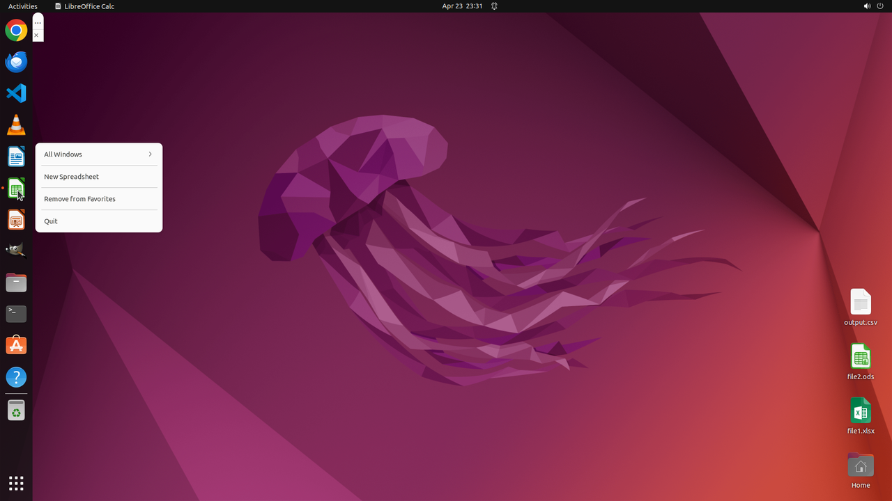

**Response:**
```
I can see a context menu with "All Windows", "New Spreadsheet", "Remove from Favorites", and "Quit". Let me click on "All Windows" to see all LibreOffice Calc windows.
```

**Actions:** `pyautogui.click(133, 331)`

---

## Step 114

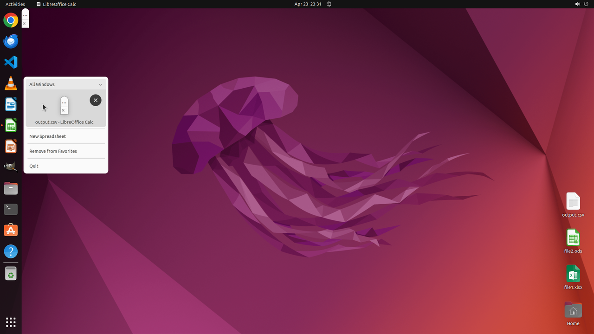

**Response:**
```
I can see "All Windows" expanded and it shows "output.csv - LibreOffice Calc" with a tiny preview of the window. The window appears to be very small (just showing the "..." and "x" controls). Let me click on "output.csv - LibreOffice Calc" to bring it to the foreground.
```

**Actions:** `pyautogui.click(208, 360)`

---

## Step 115


**Response:**
```
The GNOME top bar shows "LibreOffice Calc" and I can see the "..." and "x" at the top left. The window is active but extremely small - it appears to just be the title bar controls at the very top left. The LibreOffice Calc window has been minimized to a tiny size. Let me try to maximize it by double-clicking on the title bar area or using a keyboard shortcut. Let me try the Super+Up keyboard shortcut to maximize the window.
```

**Actions:** `pyautogui.keyDown('command')
pyautogui.keyDown('up')
pyautogui.keyUp('up')
pyautogui.keyUp('command')`

---

## Step 116


**Response:**
```
The window still isn't showing. The "..." and "x" buttons at the top left seem to have disappeared too. The GNOME bar still shows "LibreOffice Calc". It seems like the LibreOffice Calc window has a very unusual state - it might have zero width/height. Let me try opening a terminal and using xdotool to resize the window properly.
```

**Actions:** `pyautogui.keyDown('ctrl')
pyautogui.keyDown('alt')
pyautogui.keyDown('t')
pyautogui.keyUp('t')
pyautogui.keyUp('alt')
pyautogui.keyUp('ctrl')`

---

## Step 117

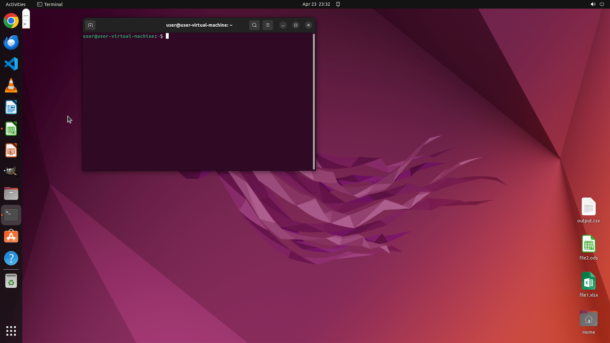

**Response:**
```
A new terminal window opened. Now I can see the desktop with the terminal in a non-maximized state. I can also see the "..." and "x" at the top left which belongs to the LibreOffice Calc window. Let me use xdotool to kill the existing LibreOffice, clear recovery data, and relaunch it properly.
```

**Actions:** `import subprocess, shlex; subprocess.run(f'xdotool type --delay 12 -- ' + shlex.quote('killall -9 soffice.bin 2>/dev/null; sleep 1; rm -r'), shell=True, check=True)
import time; time.sleep(0.05)
impor`

---

## Step 118

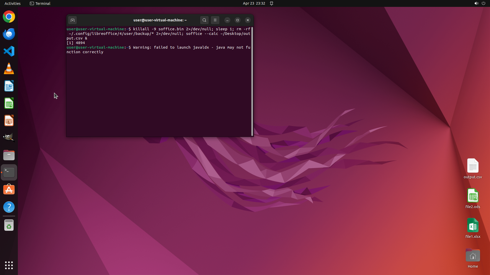

**Response:**
```
LibreOffice is starting (PID 4894). Let me wait for it to fully load and show the CSV import dialog.
```

**Actions:** `time.sleep(0.5)`

---

## Step 119

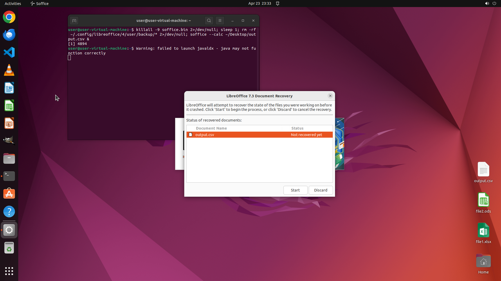

**Response:**
```
The Document Recovery dialog appeared again. I can also see behind it that the LibreOffice Calc window is starting to show (there's a small window visible behind the recovery dialog). Let me click "Discard" to skip recovery.
```

**Actions:** `pyautogui.click(1227, 730)`

---

## Step 120

**Response:**
```
The confirmation dialog is asking to discard recovery data. Let me click "Yes".
```

**Actions:** `pyautogui.click(1149, 601)`

---

## Step 121

**Response:**
```
The Text Import dialog is showing with the output.csv file. I can see the data preview showing the correctly merged data:
1. First NameLast Name
2. DulceAbril
3. MaraHashimoto
4. PhilipGent
5. KathleenHanner
6. NereidaMagwood
7. GastonBrumm
8. EttaHurn

Let me click OK to open it in LibreOffice Calc.
```

**Actions:** `pyautogui.click(1293, 879)`

---

## Step 122

**Response:**
```
Excellent! LibreOffice Calc has opened with the output.csv file! I can see the spreadsheet with the merged data in column A:
- A1: First NameLast Name (header)
- A2: DulceAbril
- A3: MaraHashimoto
- A4: PhilipGent
- A5: KathleenHanner
- A6: NereidaMagwood
- A7: GastonBrumm
- A8: EttaHurn

The task is now complete! The two columns from file1.xlsx (first names) and file2.ods (last names) have been successfully merged by concatenating the strings from corresponding rows, saved as ~/Desktop/output.csv, and opened in LibreOffice Calc from the terminal.

DONE
```

**Actions:** `DONE`

---
