# Task 3a93cae4-ad3e-403e-8c12-65303b271818

**Instruction:** Could you please add a two-hour lecture slot to my weekly course timetable, scheduled for every Wednesday at 12 PM? It seems I accidentally omitted that when setting up my schedule. I'd appreciate you taking care of that for me. Thanks!

**Score:** 0.0

**Wall clock:** 6m 49s

**Steps:** 38

**Cost:** $1.28

---

## Step 1

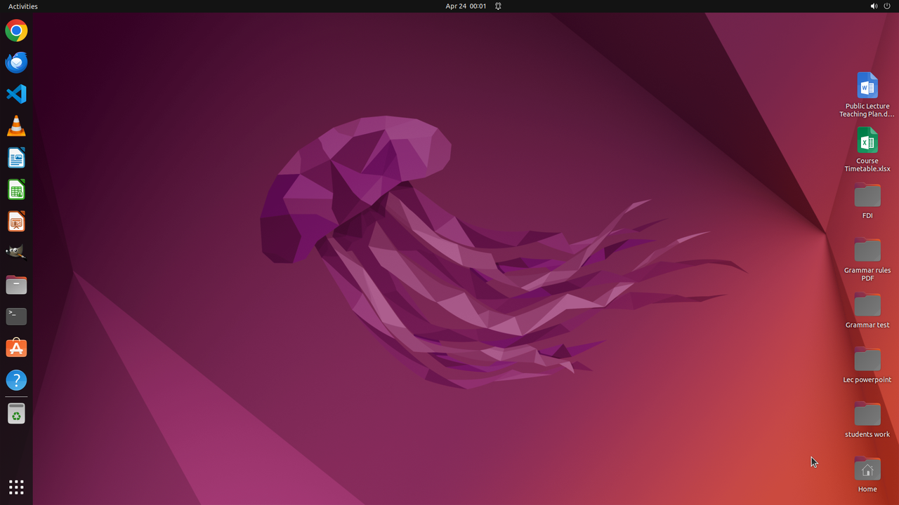

**Response:**
```
I can see a "Course Timetable.xlsx" file on the desktop. Let me open it first to see the current timetable structure.
```

**Actions:** `pyautogui.doubleClick(1842, 319)`

---

## Step 2

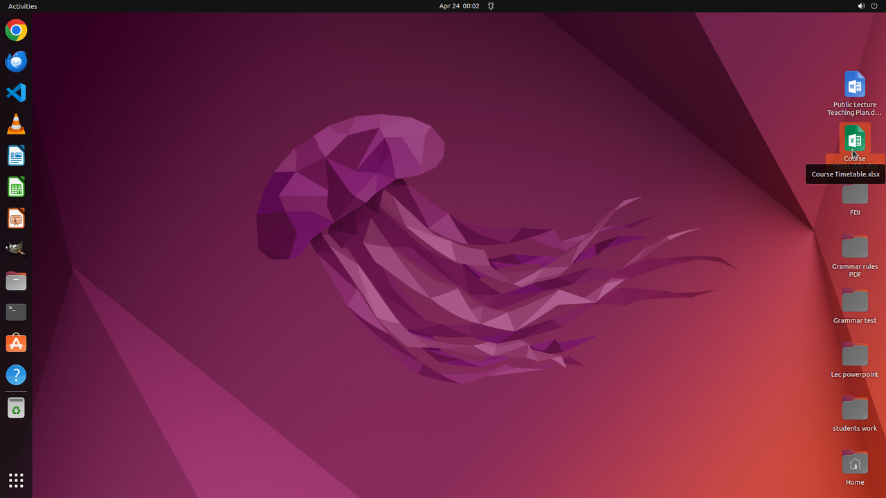

**Response:**
```
The file is loading. Let me wait a moment for it to open.
```

**Actions:** `time.sleep(0.5)`

---

## Step 3

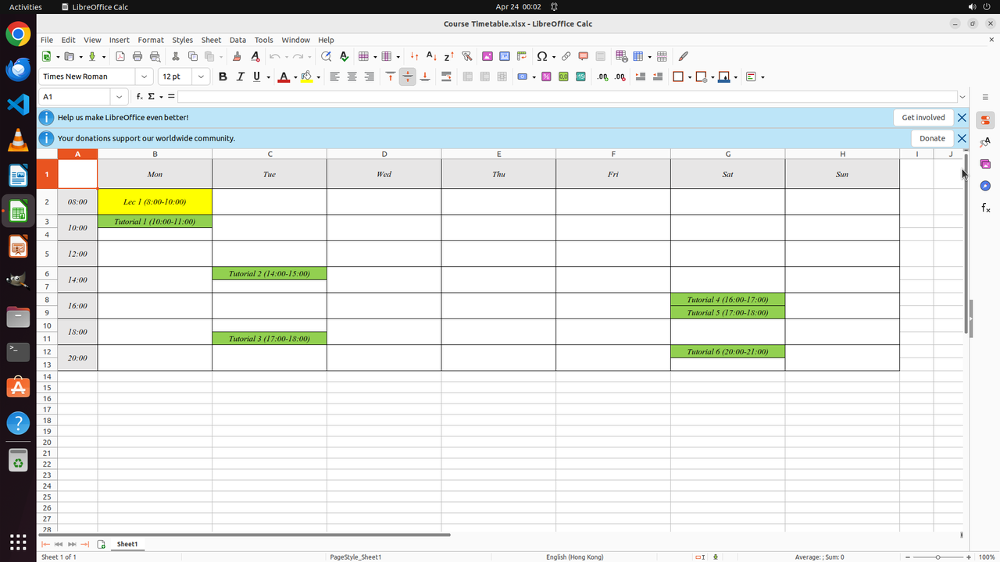

**Response:**
```
Now I can see the Course Timetable. The structure is:
- Column A: Time slots
- Column B: Monday
- Column C: Tuesday
- Column D: Wednesday
- Column E: Thursday
- Column F: Friday
- Column G: Saturday
- Column H: Sunday

I need to add a "Lecture" slot on Wednesday (Column D) at 12:00 PM for 2 hours (12:00-14:00). Looking at the timetable:
- Row 5: 12:00
- Row 6: 14:00 (but row 6 has a merged cell area)

Let me check what's in the 12:00 row for Wednesday. I'll click on cell D5 first.
```

**Actions:** `pyautogui.click(739, 487)`

---

## Step 4


**Response:**
```
I can see cell D5 is selected (Wednesday, 12:00 row). It's empty. Now I need to understand the pattern. Looking at existing entries:

- "Lec 1 (8:00-10:00)" spans rows 2-3 (2 hours) in Monday column
- "Tutorial 1 (10:00-11:00)" spans rows 3-4 (1 hour) in Monday column
- "Tutorial 2 (14:00-15:00)" spans rows 6-7 in Tuesday column

For a 2-hour lecture at 12:00-14:00, I need to check if I should merge cells D5 and D6 (12:00 to 14:00). But first, let me look at the row structure more carefully. Let me check what rows correspond to what times.

Looking at the layout:
- Row 2: 08:00 (rows 2-3 for "Lec 1 (8:00-10:00)" which is 2 hours)
- Row 3: 10:00 (rows 3-4 for "Tutorial 1 (10:00-11:00)")
- Row 5: 12:00
- Row 6: 14:00

It seems like each major time slot has 2 rows. For a 2-hour lecture from 12:00-14:00, I need to use rows 5 and 6 in column D. But row 6 already has "Tutorial 2 (14:00-15:00)" in column C. Let me check if D5 and D6 need to be merged.

Let me first check what's in D6:
```

**Actions:** `pyautogui.click(739, 525)`

---

## Step 5

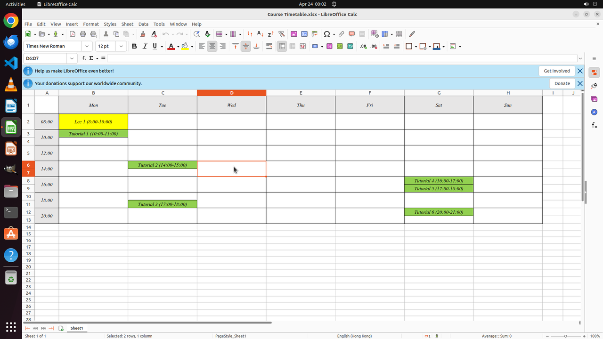

**Response:**
```
I can see that D6:D7 is already a merged cell (it shows "D6:D7" in the cell reference and "Selected: 2 rows, 1 column" at the bottom). This is the 14:00 slot for Wednesday which is empty.

Now let me understand the pattern better. Looking at the existing entries:
- "Lec 1 (8:00-10:00)" is in B2 (which appears to be merged B2:B3, covering 08:00-10:00, 2 hours)
- The 12:00 slot is row 5, and 14:00 slot starts at row 6

For a 2-hour lecture from 12:00 to 14:00, I need to put it in the Wednesday column covering the 12:00-14:00 time range. Let me check if the cells in the 12:00 row are also merged. Let me click on D5:
```

**Actions:** `pyautogui.click(739, 487)`

---

## Step 6


**Response:**
```
I can see D5 is a single cell (not merged). The 12:00 row is just row 5, and the 14:00 slot is D6:D7 (merged). 

Looking at the pattern more carefully:
- Row 2 (08:00): B2 has "Lec 1 (8:00-10:00)" - let me check if B2 is merged with rows below
- Row 3 (10:00): B3 has "Tutorial 1 (10:00-11:00)" 

Let me check B2 to see the merge pattern:
```

**Actions:** `pyautogui.click(298, 387)`

---

## Step 7

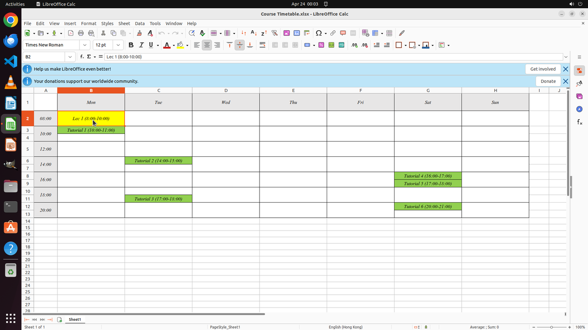

**Response:**
```
I can see B2 contains "Lec 1 (8:00-10:00)" and it's just cell B2 (not merged). The cell visually spans a larger area because of row height. 

Now I need to understand the row structure better. Let me look at the time slots:
- Row 2: 08:00 (single row)
- Row 3-4: 10:00 (rows 3-4, with A3:A4 likely merged)
- Row 5: 12:00 (single row)
- Row 6-7: 14:00 (rows 6-7, merged)
- Row 8-9: 16:00 (rows 8-9)
- Row 10-11: 18:00 (rows 10-11)
- Row 12-13: 20:00 (rows 12-13)

For a 2-hour lecture from 12:00-14:00 on Wednesday, I need to merge D5 with D6:D7 (which is already merged). Let me first select D5 through D7 to merge them. I'll need to first unmerge D6:D7, then merge D5:D7.

Actually, let me think about this differently. The "Lec 1 (8:00-10:00)" is in B2 only (not merged), but it represents a 2-hour slot. The existing entries seem to use the text itself to indicate the time range. So perhaps I should follow the same pattern - just put the lecture text in D5 and optionally merge cells to make it visually span the 2-hour period.

Let me look at how the existing "Lec 1" entry is structured. It's in B2 and seems to be just one cell. Let me check if the 12:00 row (row 5) has enough space or if I need to merge D5 with D6:D7.

Looking at the pattern, the lecture entries seem to be in single cells. But to be consistent with how the timetable visually represents 2-hour blocks, I should merge D5:D7 (12:00 to 14:00). First, I need to unmerge D6:D7, then merge D5:D7.

Let me first select D5:D7. I'll click on D5 and drag to D7:
```

**Actions:** `pyautogui.click(739, 487)`

---

## Step 8

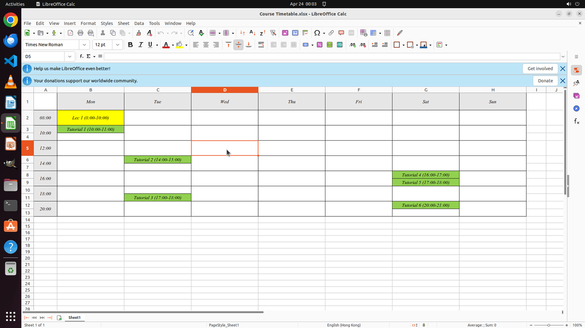

**Response:**
```
I'm at D5. Now I need to select D5 through D7 to merge them for the 2-hour lecture slot. Let me use the Name Box to select the range D5:D7:
```

**Actions:** `pyautogui.click(150, 186)`

---

## Step 9

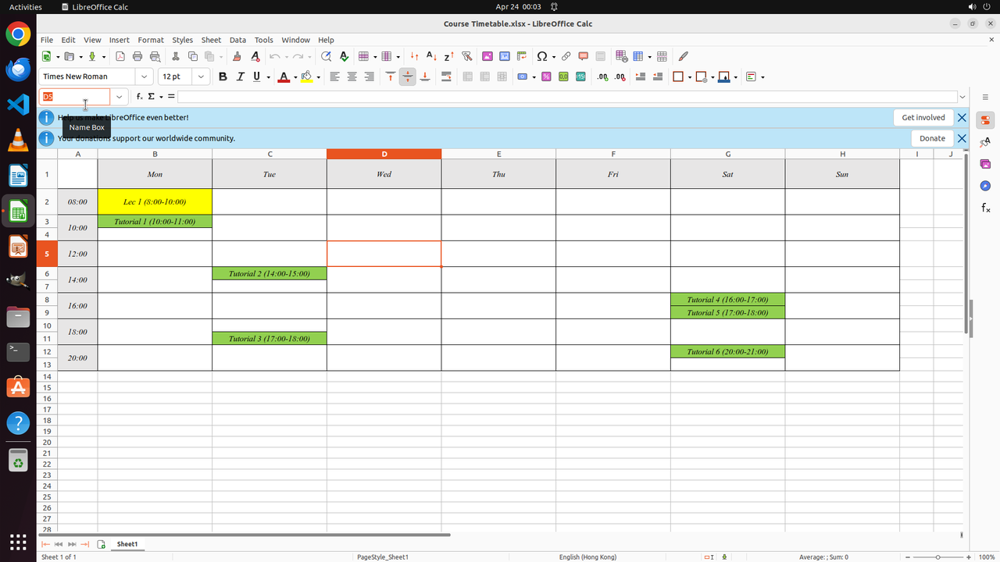

**Response:**
```
The Name Box is selected. Let me type the range D5:D7 to select those cells:
```

**Actions:** `import subprocess, shlex; subprocess.run(f'xdotool type --delay 12 -- ' + shlex.quote('D5:D7\n'), shell=True, check=True)
import time; time.sleep(0.05)`

---

## Step 10

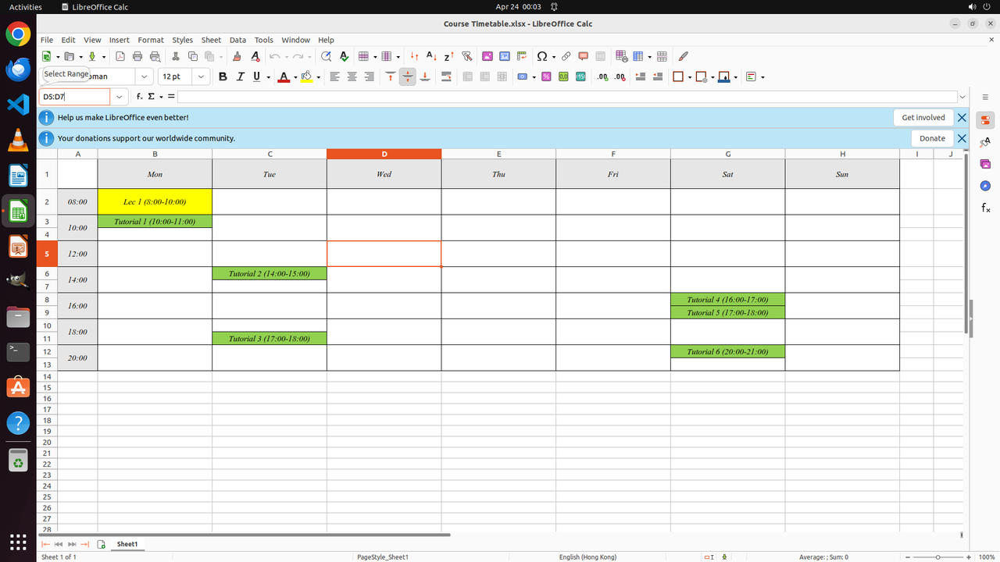

**Response:**
```
I see the Name Box shows "D5:D7" but the selection doesn't seem to have been applied yet. Let me press Enter to confirm the selection:
```

**Actions:** `pyautogui.keyDown('return')
pyautogui.keyUp('return')`

---

## Step 11

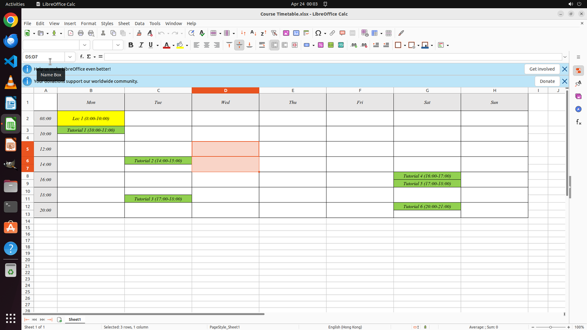

**Response:**
```
I can see that D5:D7 is now selected (3 rows, 1 column as shown in the status bar). The cells D5, D6, and D7 are highlighted. Now I need to merge these cells first. But D6:D7 is already merged, so I need to handle this. Let me use the Format menu to merge cells:
```

**Actions:** `pyautogui.click(291, 76)`

---

## Step 12

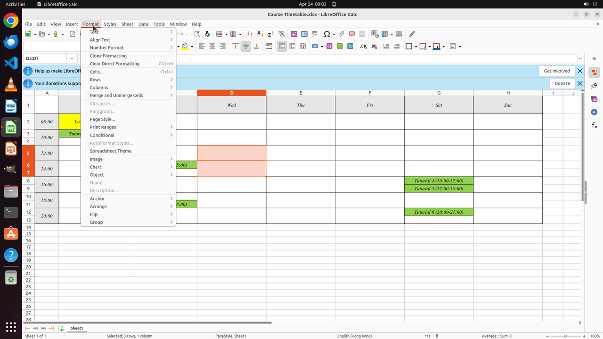

**Response:**
```
I can see the Format menu is open. I need to click on "Merge and Unmerge Cells" to merge D5:D7:
```

**Actions:** `pyautogui.click(370, 303)`

---

## Step 13

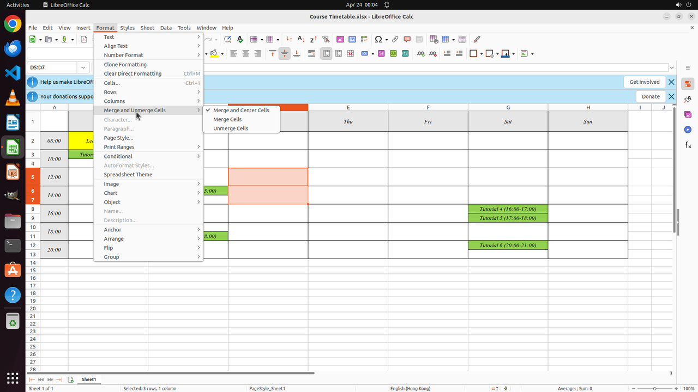

**Response:**
```
I can see the merge options. I'll click "Merge and Center Cells" to merge D5:D7 and center the content:
```

**Actions:** `pyautogui.click(669, 303)`

---

## Step 14

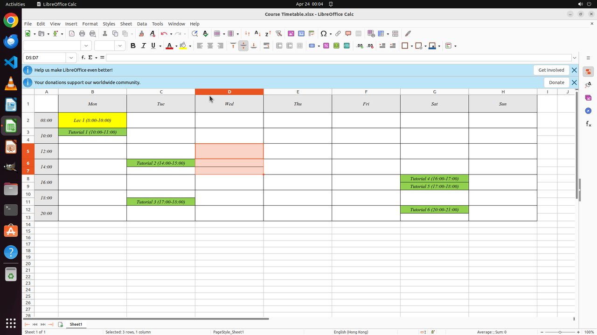

**Response:**
```
The cells D5:D7 are now merged (I can see the merged area spans from row 5 to row 7 in the Wednesday column). The Name Box shows "D5:D7" and the status bar shows "Selected: 3 rows, 1 column". Now I need to type the lecture text. Following the naming pattern of "Lec 1 (8:00-10:00)", this should be "Lec 2 (12:00-14:00)" since there's already a "Lec 1". Let me type the lecture entry:
```

**Actions:** `import subprocess, shlex; subprocess.run(f'xdotool type --delay 12 -- ' + shlex.quote('Lecture (12:00-14:00)'), shell=True, check=True)
import time; time.sleep(0.05)`

---

## Step 15

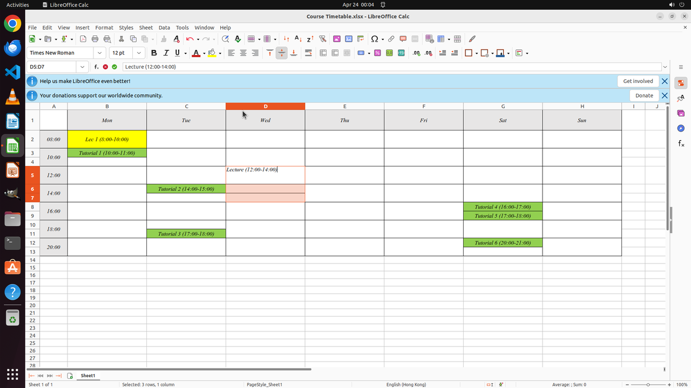

**Response:**
```
I can see "Lecture (12:00-14:00)" has been typed in the merged cell D5:D7. The text is visible in both the cell and the formula bar. Now I need to press Enter to confirm the entry, and then I should format it to match the style of other entries (like adding a background color). Let me press Enter first:
```

**Actions:** `pyautogui.keyDown('return')
pyautogui.keyUp('return')`

---

## Step 16


**Response:**
```
The text "Lecture (12:00-14:00)" is now in the merged cell D5:D7 (Wednesday, 12:00-14:00). I notice the cell has a light pink/salmon background from the selection. Now I should format it to match the style of the other lecture entry "Lec 1 (8:00-10:00)" which has a yellow background. Let me click on the cell to select it and apply formatting:
```

**Actions:** `pyautogui.click(739, 487)`

---

## Step 17


**Response:**
```
I can see the cell D5 is selected and shows "Lecture (12:00-14:00)" in the formula bar. The cell appears to have been merged successfully. Now I need to format it to match the style of the existing lecture entry "Lec 1 (8:00-10:00)" which has a yellow background. Let me apply a yellow background color. I'll use the highlighting/background color button. Let me click on the dropdown arrow next to the highlighting button:
```

**Actions:** `pyautogui.click(612, 147)`

---

## Step 18

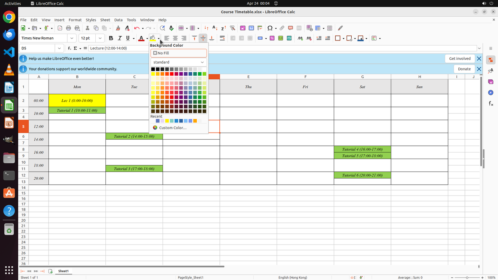

**Response:**
```
I can see the background color picker. I need to match the yellow color used in "Lec 1 (8:00-10:00)". Let me first check the exact yellow color by using "Custom Color..." to be precise. But looking at the color palette, the yellow color that matches the existing lecture entries appears to be a bright yellow. Let me select the yellow color that looks like it matches:
```

**Actions:** `pyautogui.click(664, 463)`

---

## Step 19


**Response:**
```
I see the background color applied is a light teal/cyan color, but it doesn't match the yellow of "Lec 1 (8:00-10:00)". Let me check the exact color of the existing lecture cell. First, let me click on B2 to check its color:
```

**Actions:** `pyautogui.click(298, 387)`

---

## Step 20

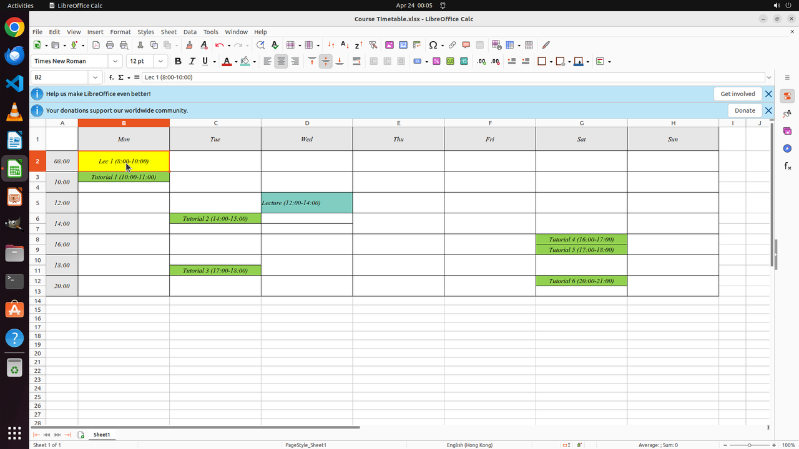

**Response:**
```
I can see B2 is selected with "Lec 1 (8:00-10:00)" and it has a yellow background. The color I applied to the lecture cell is teal/cyan which doesn't match. Let me check the exact yellow color by looking at the background color. Let me check the background color of B2 by opening the background color dropdown:
```

**Actions:** `pyautogui.click(612, 147)`

---

## Step 21

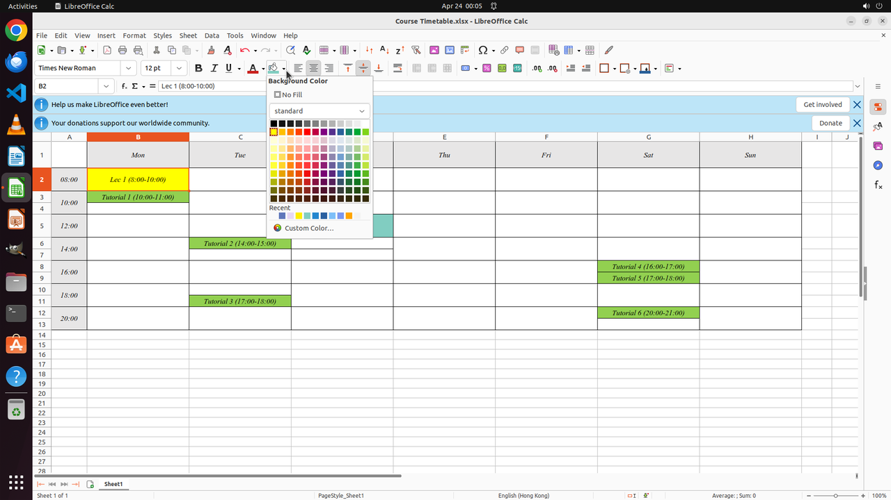

**Response:**
```
I can see the background color picker is open for cell B2. I need to use "Custom Color..." to check the exact yellow color of B2. Let me click on it:
```

**Actions:** `pyautogui.click(664, 492)`

---

## Step 22

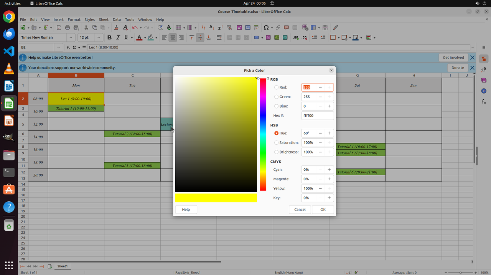

**Response:**
```
I can see the exact color of the "Lec 1" cell. The hex color is "ffff00" (pure yellow - R:255, G:255, B:0). Now I'll cancel this dialog and apply the same yellow color to my lecture cell. Let me cancel first:
```

**Actions:** `pyautogui.click(1168, 822)`

---

## Step 23


**Response:**
```
Good, I cancelled the dialog. Now I need to select cell D5 (the lecture cell) and change its background color to yellow (#ffff00). Let me click on D5:
```

**Actions:** `pyautogui.click(739, 487)`

---

## Step 24

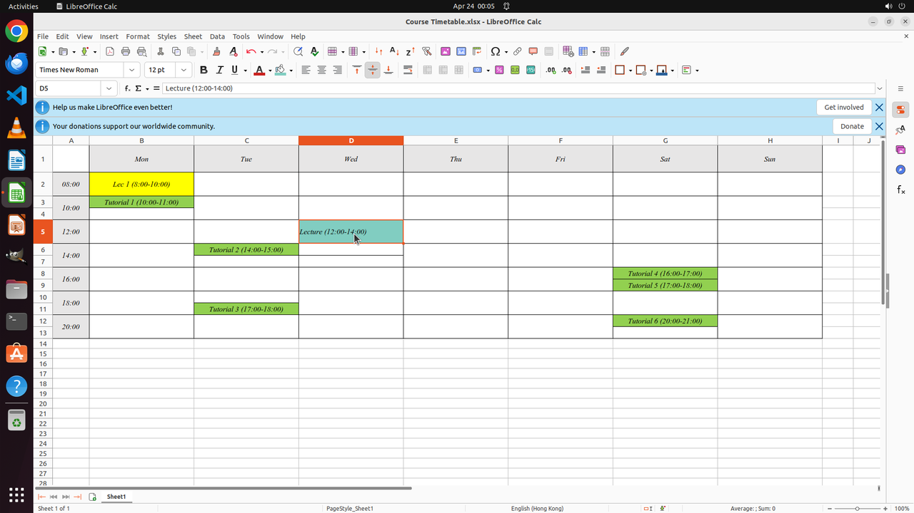

**Response:**
```
Cell D5 is selected with "Lecture (12:00-14:00)". Now I need to change the background color to yellow (#ffff00). Let me open the background color dropdown and select the correct yellow:
```

**Actions:** `pyautogui.click(612, 147)`

---

## Step 25

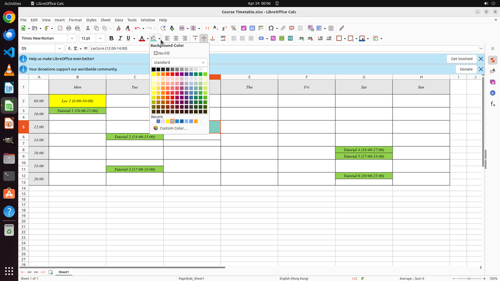

**Response:**
```
I can see the color picker. I need to use "Custom Color..." to enter the exact hex value #ffff00 for yellow:
```

**Actions:** `pyautogui.click(664, 492)`

---

## Step 26


**Response:**
```
I can see the custom color picker showing the current teal color (hex: 81cdc1). I need to change it to yellow (#ffff00). Let me clear the hex field and type the correct value:
```

**Actions:** `pyautogui.tripleClick(1230, 453)`

---

## Step 27

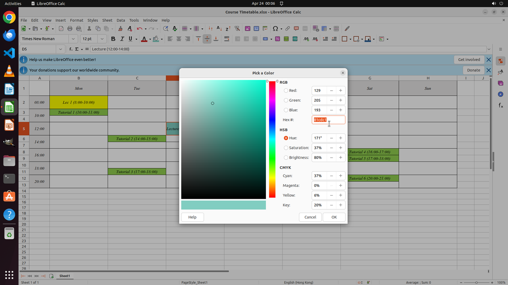

**Response:**
```
The hex field is selected (showing "81cdc1" highlighted). Now I'll type the yellow hex color:
```

**Actions:** `import subprocess, shlex; subprocess.run(f'xdotool type --delay 12 -- ' + shlex.quote('ffff00'), shell=True, check=True)
import time; time.sleep(0.05)`

---

## Step 28

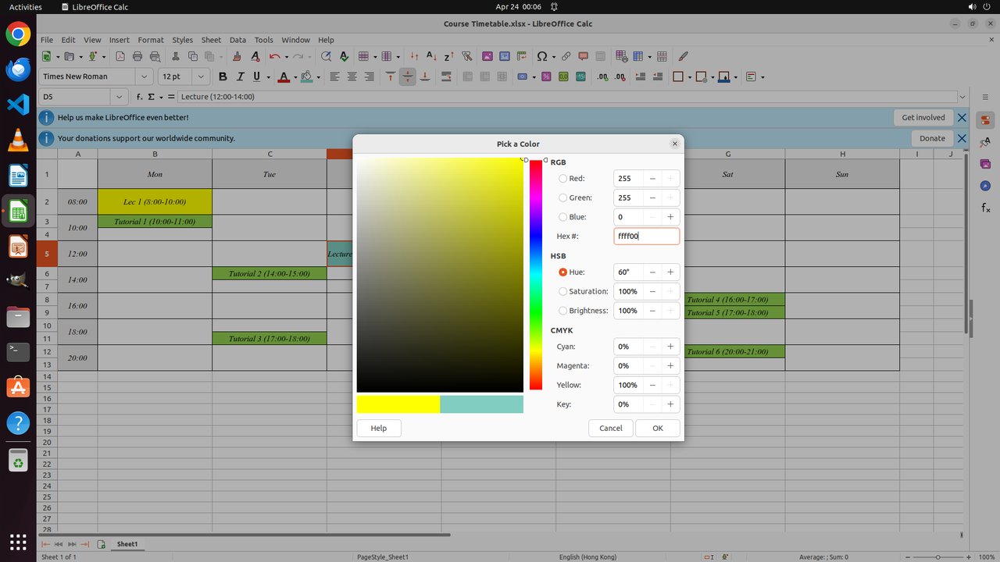

**Response:**
```
I can see the hex value is now "ffff00" (R:255, G:255, B:0) which is the exact yellow color matching the "Lec 1" cell. The color preview at the bottom shows yellow on the left and the previous teal color on the right. Now let me click OK to apply:
```

**Actions:** `pyautogui.click(1260, 822)`

---

## Step 29

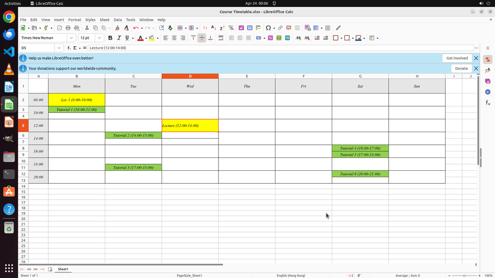

**Response:**
```
The cell D5 now has a yellow background matching the "Lec 1 (8:00-10:00)" entry. The "Lecture (12:00-14:00)" entry is now visible in the Wednesday column at 12:00 with a yellow background. 

However, I notice the cell only covers the 12:00 row area but the text should span to 14:00. Let me check if the merge was successful. Looking at the cell, it seems like D5 has the yellow background but D6-D7 area below it (the 14:00 slot) doesn't have the yellow background. Let me check if the merge was properly done. Let me click on D5 to verify:
```

**Actions:** `pyautogui.click(739, 526)`

---

## Step 30

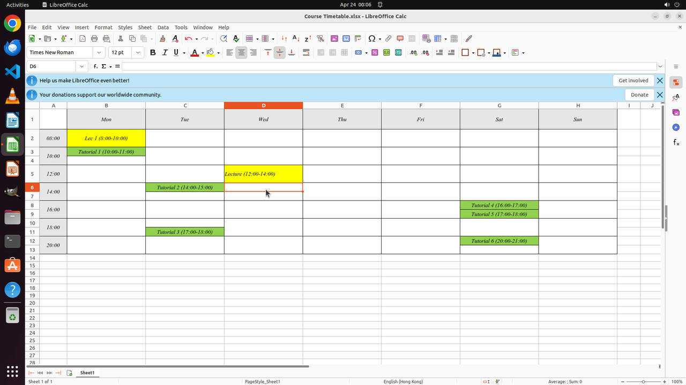

**Response:**
```
I can see that D6 is a separate cell (not merged with D5). The merge didn't work as expected - D5 has the "Lecture (12:00-14:00)" text with yellow background, but D6 and D7 are separate empty cells. It seems the merge only applied to D5 and the previous D6:D7 merge was undone, creating separate cells D6 and D7.

I need to merge D5:D7 properly. Let me select D5 first and then extend the selection to D7. Let me use the Name Box approach:
```

**Actions:** `pyautogui.click(150, 186)`

---

## Step 31

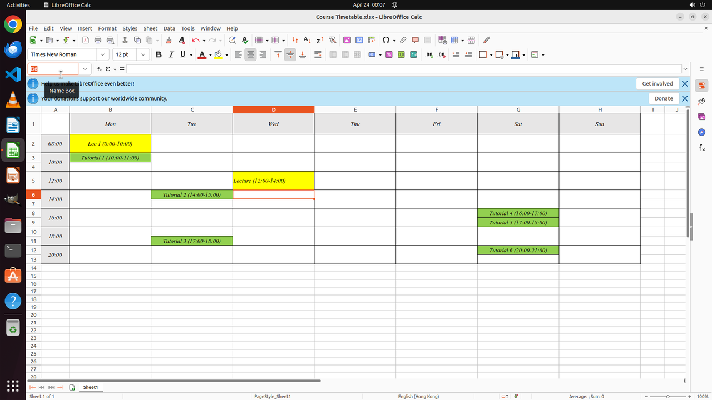

**Response:**
```
The Name Box is selected. Let me type the range D5:D7 to select those cells:
```

**Actions:** `import subprocess, shlex; subprocess.run(f'xdotool type --delay 12 -- ' + shlex.quote('D5:D7\n'), shell=True, check=True)
import time; time.sleep(0.05)`

---

## Step 32

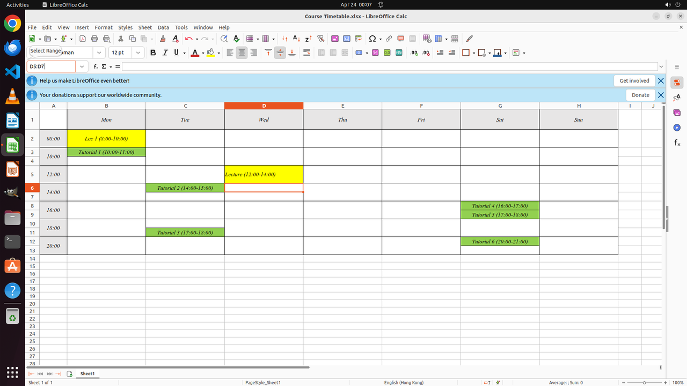

**Response:**
```
I see the Name Box shows "D5:D7" but it seems the selection hasn't been applied yet. Let me press Enter to confirm:
```

**Actions:** `pyautogui.keyDown('return')
pyautogui.keyUp('return')`

---

## Step 33

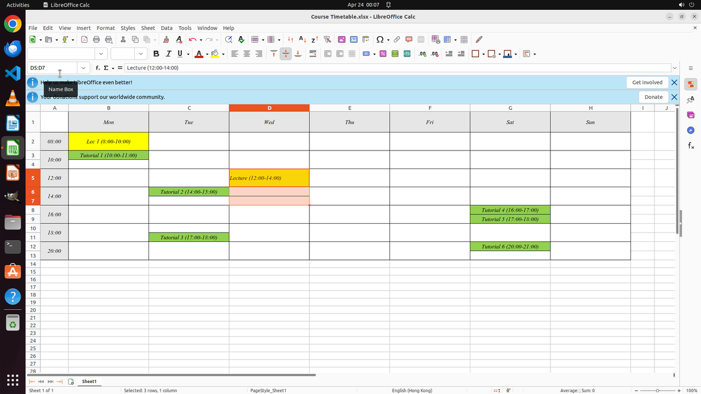

**Response:**
```
I can see D5:D7 is selected (3 rows, 1 column as shown in the status bar), and the formula bar shows "Lecture (12:00-14:00)". The cells D5, D6, and D7 are highlighted. Now I need to merge these cells. Let me use Format > Merge and Unmerge Cells:
```

**Actions:** `pyautogui.click(291, 76)`

---

## Step 34

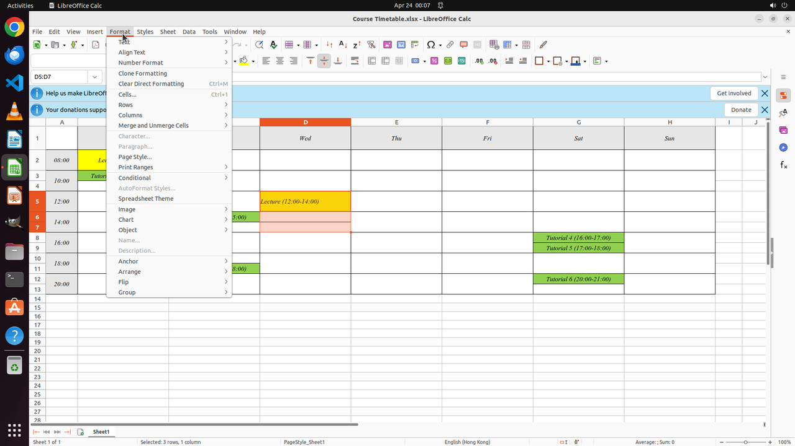

**Response:**
```
I can see the Format menu is open. I'll hover over "Merge and Unmerge Cells" to see the submenu:
```

**Actions:** `pyautogui.click(370, 303)`

---

## Step 35

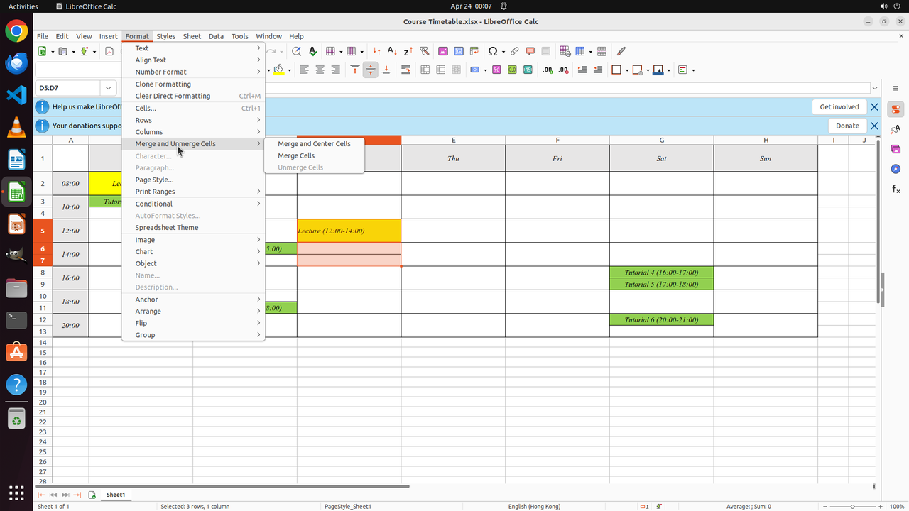

**Response:**
```
I can see the merge submenu. Let me click "Merge and Center Cells":
```

**Actions:** `pyautogui.click(669, 303)`

---

## Step 36


**Response:**
```
The cells D5:D7 are now properly merged and the "Lecture (12:00-14:00)" text is centered in the merged cell with a yellow background. The cell spans from 12:00 to the 14:00 row, representing a 2-hour lecture slot on Wednesday.

Now I need to save the file. Let me press Ctrl+S:
```

**Actions:** `pyautogui.keyDown('ctrl')
pyautogui.keyDown('s')
pyautogui.keyUp('s')
pyautogui.keyUp('ctrl')`

---

## Step 37


**Response:**
```
The file appears to have been saved (since it's an .xlsx file, it may have saved silently in the Keep Current Format). Let me check if a dialog appeared by waiting a moment:
```

**Actions:** `time.sleep(0.1)`

---

## Step 38

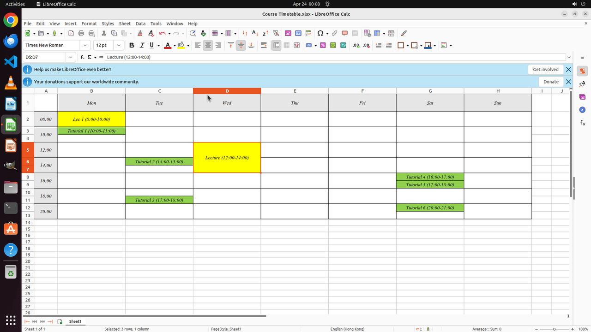

**Response:**
```
The file has been saved successfully. The timetable now has the "Lecture (12:00-14:00)" entry added in the Wednesday column, spanning from 12:00 to 14:00 (a 2-hour slot), with a yellow background matching the existing lecture style.

Let me verify the final result:
- **Cell**: D5:D7 (merged)
- **Day**: Wednesday
- **Time**: 12:00 - 14:00 (2 hours)
- **Content**: "Lecture (12:00-14:00)"
- **Background**: Yellow (#ffff00), matching the existing "Lec 1 (8:00-10:00)" style

The task is complete!

DONE
```

**Actions:** `DONE`

---
