# Task 3a93cae4-ad3e-403e-8c12-65303b271818

**Instruction:** Could you please add a two-hour lecture slot to my weekly course timetable, scheduled for every Wednesday at 12 PM? It seems I accidentally omitted that when setting up my schedule. I'd appreciate you taking care of that for me. Thanks!

**Score:** 1

**Wall clock:** 5m 59s

**Steps:** 34

**Cost:** $1.18

---

## Step 1


**Response:**
```
I can see a "Course Timetable.xlsx" file on the desktop. Let me open it first to see the current timetable structure.
```

**Actions:** `pyautogui.doubleClick(1842, 202)`

---

## Step 2

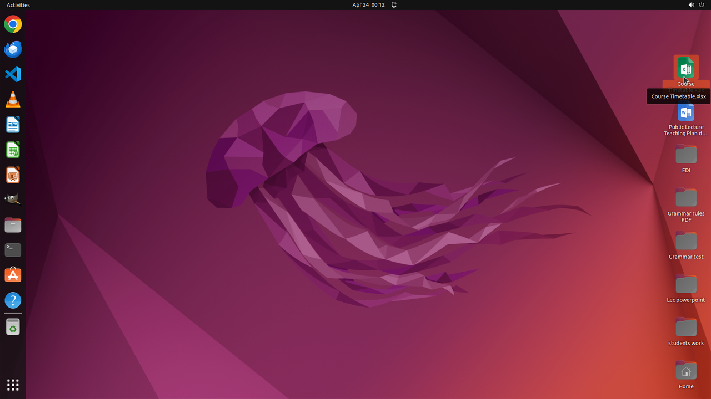

**Response:**
```
The file is opening. Let me wait for it to load.
```

**Actions:** `time.sleep(0.5)`

---

## Step 3

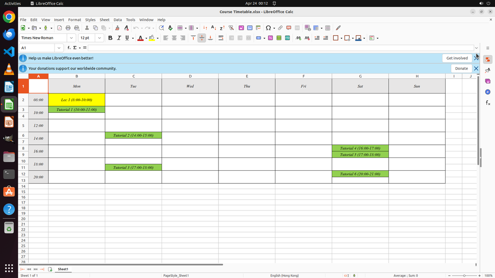

**Response:**
```
Now I can see the course timetable. I need to add a two-hour lecture slot on Wednesday at 12 PM (12:00-14:00). Looking at the timetable structure:

- Row 1 is the header with days
- Row 5 has 12:00 in column A
- Column D is Wednesday (Wed)

I need to add "Lecture" in the Wednesday column at the 12:00 row. Let me first check the exact cell. The 12:00 time is in row 5, and Wednesday is column D. I also notice that two-hour slots span 2 rows (like Lec 1 spans rows 2-3 area, but actually looking more carefully, the rows seem to be organized with merged cells).

Let me click on the cell at Wednesday/12:00 to add the lecture.
```

**Actions:** `pyautogui.click(738, 487)`

---

## Step 4


**Response:**
```
I can see that cell D5 is selected, which is the Wednesday column at the 12:00 row. Now I need to understand the structure better. Looking at the timetable:

- The lecture "Lec 1 (8:00-10:00)" is in cell B2 and appears to span rows for a 2-hour block
- Each time slot seems to have 2 rows (e.g., 08:00 has rows 2-3 area, 10:00 has rows 3-4, etc.)

I need to add a 2-hour lecture from 12:00 to 14:00 on Wednesday. Looking at the pattern, the 12:00 slot is row 5 and 14:00 starts at row 6. So I need to merge cells D5 and D6 (or the appropriate rows) and add the lecture text.

Let me first check what rows correspond to 12:00-14:00. Looking at the layout:
- Row 2: 08:00
- Row 3: 10:00 (with row 4 below it)
- Row 5: 12:00
- Row 6: 14:00 (with row 7 below it)

So the 2-hour block from 12:00 to 14:00 would need to cover rows 5 and 6 (and possibly the sub-rows). Let me look more carefully at the cell references. I see that some entries span merged cells. Let me first select the range D5:D6 to merge them for the 2-hour slot.

Actually, looking more carefully at the rows, I see there are sub-rows. For example, row 6 starts at 14:00 and row 7 is a sub-row. The "Tutorial 2 (14:00-15:00)" is in C6:C7 area. So the 12:00 time slot seems to only have row 5 without a sub-row visible.

Let me check if the cells in the 12:00 area need merging. Let me first select D5 and see if I need to merge D5 with adjacent rows for a 2-hour block. Since 12:00 is row 5 and 14:00 starts at row 6, I should merge D5 with the rows up to (but not including) row 6.

Wait, let me look at this more carefully. The "Lec 1 (8:00-10:00)" entry covers 08:00 to 10:00 (2 hours) and appears to be in cell B2. The 10:00 row is row 3. So B2 seems to span just one visible row for a 2-hour slot. But looking at the pattern of other entries like "Tutorial 2 (14:00-15:00)" which is 1 hour and spans rows 6-7...

Let me just type the lecture information in D5 first, following the naming pattern used for "Lec 1". I'll need to merge cells D5 and D6 for a 2-hour block (12:00-14:00).

First, let me select D5:D7 to see if that matches the 2-hour pattern (since 14:00 starts at row 6 with a sub-row at 7). Actually, let me look at this differently. Let me select D5 and D6 first.
```

**Actions:** `pyautogui.click(150, 387)`

---

## Step 5


**Response:**
```
I can see that A2 contains "08:00:00" (displayed as "08:00"). Now let me check the structure more carefully. I need to understand which rows correspond to the time slots. Let me click on cell A5 to check the 12:00 time.
```

**Actions:** `pyautogui.click(150, 487)`

---

## Step 6


**Response:**
```
A5 contains "12:00:00" (displayed as 12:00). Now let me understand the row structure better. I notice:

- Row 2: 08:00 - "Lec 1 (8:00-10:00)" is in B2 (2-hour lecture, seems to be just in one row)
- Row 3: 10:00 - "Tutorial 1 (10:00-11:00)" is in B3 (with row 4 as sub-row)
- Row 5: 12:00
- Row 6: 14:00 - "Tutorial 2 (14:00-15:00)" is in C6 (with row 7 as sub-row)

Let me check if B2 is a merged cell. Let me click on the "Lec 1" cell to see its reference.
```

**Actions:** `pyautogui.click(298, 387)`

---

## Step 7


**Response:**
```
I can see that "Lec 1 (8:00-10:00)" is in cell B2 and it's just a single cell (not merged). The cell content is "Lec 1 (8:00-10:00)". Now let me check the row structure more carefully. I notice that "Lec 1" is a 2-hour slot but only occupies one row (row 2), while "Tutorial 1 (10:00-11:00)" is a 1-hour slot in row 3 with an empty row 4 below.

Let me check if the 08:00 time slot has a sub-row. Let me look at cell A3 to understand the structure.
```

**Actions:** `pyautogui.click(150, 426)`

---

## Step 8

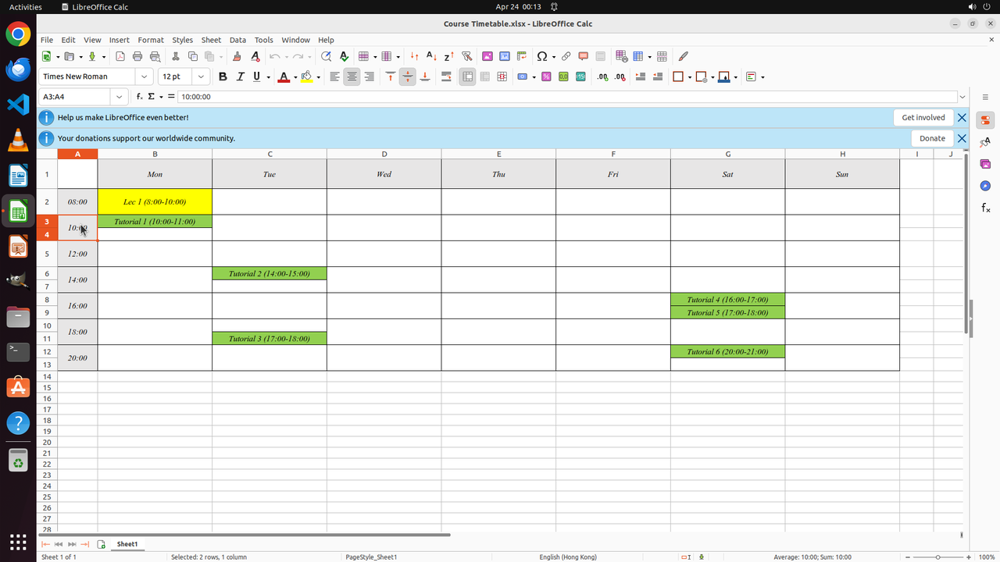

**Response:**
```
Now I can see that A3:A4 is a merged cell containing "10:00:00". The cell reference shows "A3:A4" and it says "Selected: 2 rows, 1 column". So each time slot uses 2 rows (merged). Let me check if A2 is also merged. Let me click on A2.
```

**Actions:** `pyautogui.click(150, 387)`

---

## Step 9

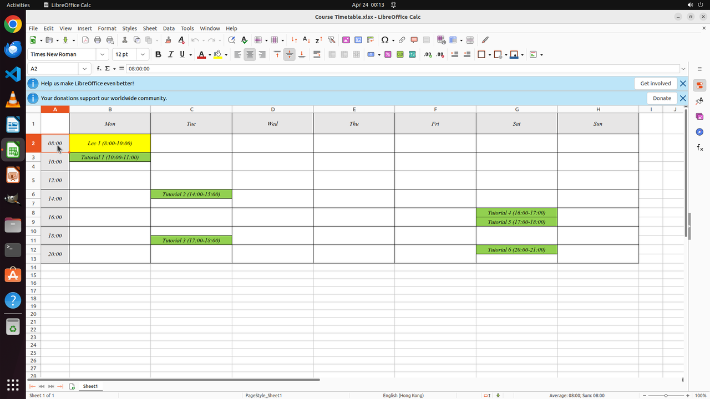

**Response:**
```
I see that A2 is just "A2" (not merged), while A3:A4 was merged. Let me check A5 to see if 12:00 is merged.
```

**Actions:** `pyautogui.click(150, 487)`

---

## Step 10

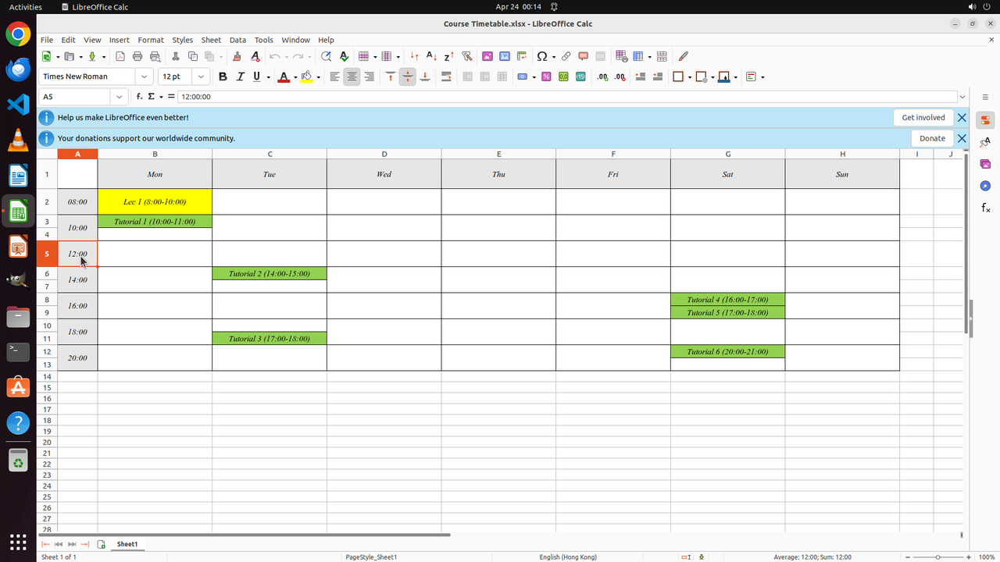

**Response:**
```
A5 is just "A5" (not merged), containing 12:00. Now let me check A6 to see the 14:00 time slot structure.
```

**Actions:** `pyautogui.click(150, 526)`

---

## Step 11

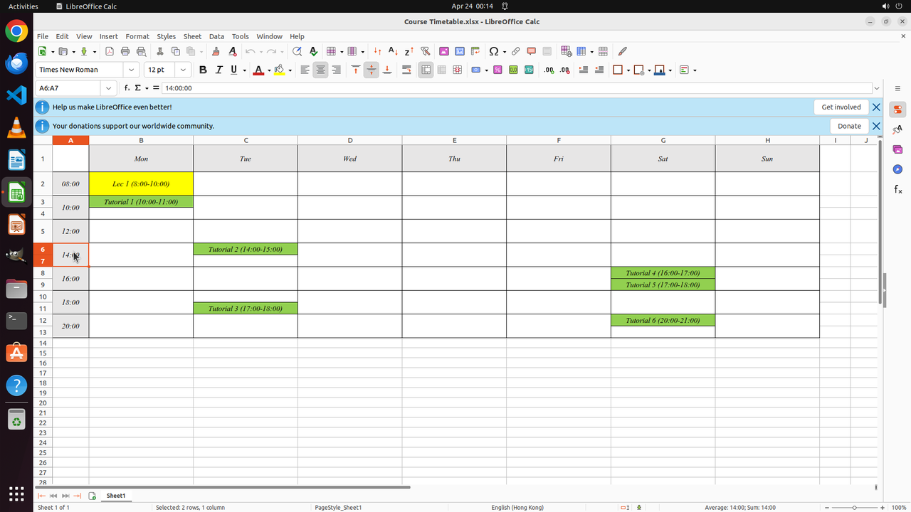

**Response:**
```
Now I understand the structure better:
- A2: 08:00 (single row)
- A3:A4: 10:00 (merged, 2 rows)
- A5: 12:00 (single row)
- A6:A7: 14:00 (merged, 2 rows)

So it seems like the time slots alternate between single rows and merged rows. The 2-hour lecture from 12:00 to 14:00 would span from row 5 to the row before 14:00 starts (row 6). But row 5 is just a single row for 12:00.

Looking at the existing "Lec 1 (8:00-10:00)" - it's a 2-hour lecture in cell B2 (single row at 08:00). The lecture spans from 08:00 to 10:00, covering the 08:00 time slot. Similarly, a 2-hour lecture at 12:00 would go from 12:00 to 14:00.

Let me check how "Lec 1" is structured - it's in B2 (just one cell, not merged). So I should follow the same pattern and put the lecture in D5 (the Wednesday column at 12:00 row). But since it's a 2-hour slot, I need to check if I should merge D5 with cells below it.

Let me check the B2 cell to see if it's merged with anything.
```

**Actions:** `pyautogui.click(298, 387)`

---

## Step 12

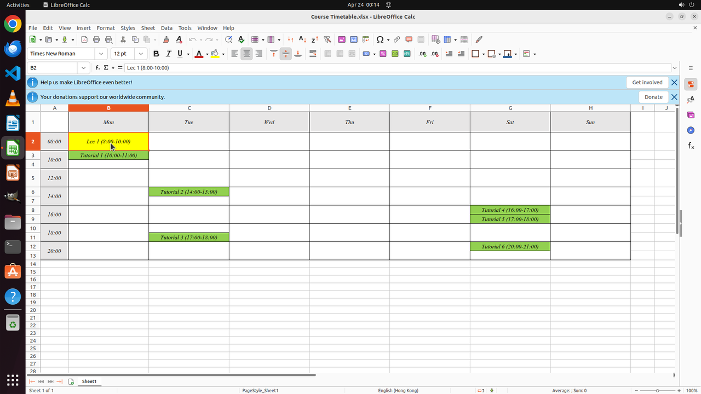

**Response:**
```
B2 is a single cell (not merged), containing "Lec 1 (8:00-10:00)". It's a 2-hour lecture that occupies just one row. The 08:00 time slot is a single row (row 2).

Now, looking at the structure:
- Row 2 (08:00): Single row - has "Lec 1 (8:00-10:00)" in B2
- Row 3-4 (10:00): Merged rows - has "Tutorial 1 (10:00-11:00)" in B3
- Row 5 (12:00): Single row - empty
- Row 6-7 (14:00): Merged rows - has "Tutorial 2 (14:00-15:00)" in C6

For a 2-hour lecture at 12:00-14:00 on Wednesday, I should place it in cell D5, following the same pattern as "Lec 1 (8:00-10:00)". Since the existing lecture is named "Lec 1", I'll name this one "Lec 2" and follow the same format.

Let me click on D5 and enter the lecture information.
```

**Actions:** `pyautogui.click(738, 487)`

---

## Step 13

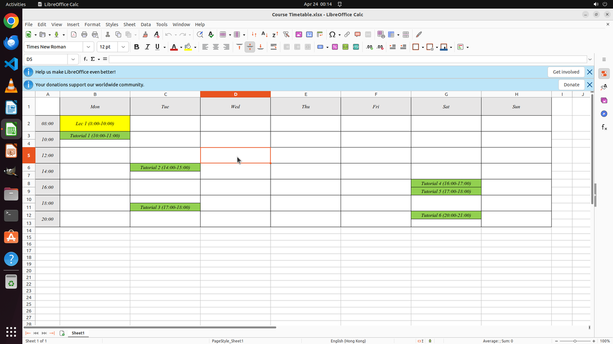

**Response:**
```
Cell D5 is selected (Wednesday at 12:00). Now I'll type the lecture information following the same format as "Lec 1 (8:00-10:00)". Since this is a new lecture, I'll call it "Lec 2 (12:00-14:00)".
```

**Actions:** `import subprocess, shlex; subprocess.run(f'xdotool type --delay 12 -- ' + shlex.quote('Lec 2 (12:00-14:00)'), shell=True, check=True)
import time; time.sleep(0.05)`

---

## Step 14


**Response:**
```
I can see the text "Lec 2 (12:00-14:00)" has been entered in cell D5. Now I need to press Enter to confirm the entry, and then I should format it to match the style of the existing lecture entry (yellow background, centered text, etc.).
```

**Actions:** `pyautogui.keyDown('return')
pyautogui.keyUp('return')`

---

## Step 15

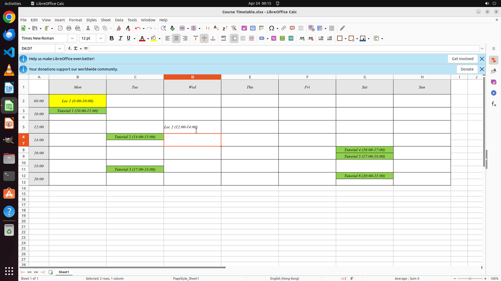

**Response:**
```
The text "Lec 2 (12:00-14:00)" has been entered in cell D5. Now I need to format it to match the style of "Lec 1 (8:00-10:00)" in cell B2, which has a yellow background and centered text. Let me first click on B2 to check its formatting.
```

**Actions:** `pyautogui.click(298, 387)`

---

## Step 16

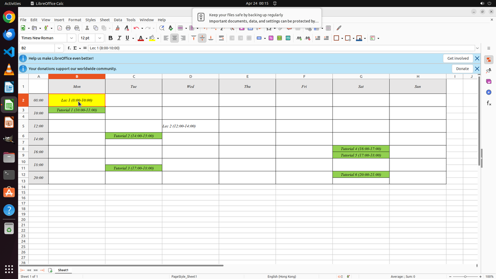

**Response:**
```
I can see B2 is selected with "Lec 1 (8:00-10:00)". It has a yellow background with centered text and bold formatting. Let me dismiss the notification first, then copy the formatting from B2 and apply it to D5.

Let me close the notification popup first.
```

**Actions:** `pyautogui.click(960, 600)`

---

## Step 17

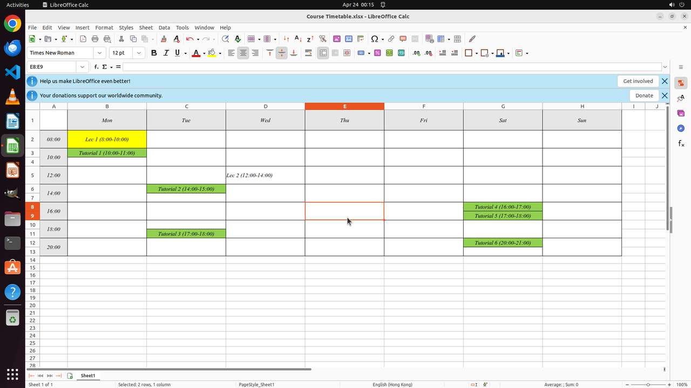

**Response:**
```
I see I accidentally clicked on E8:E9. Let me go back and use the Clone Formatting tool to copy the formatting from B2 to D5. First, let me click on B2 to select it.
```

**Actions:** `pyautogui.click(298, 387)`

---

## Step 18


**Response:**
```
Good, B2 is selected. Now I'll use the Clone Formatting (paint brush) tool to copy the formatting from B2 to D5. Let me click the Clone Formatting button in the toolbar.
```

**Actions:** `pyautogui.click(85, 108)`

---

## Step 19

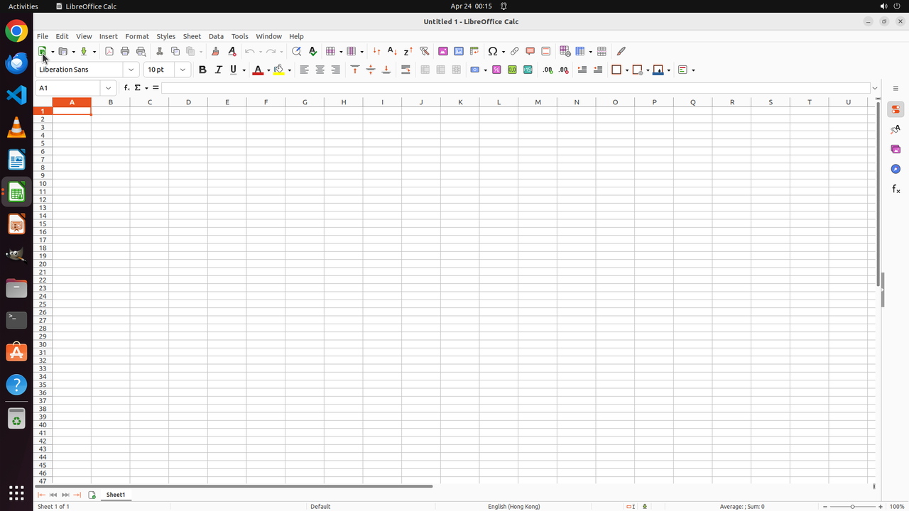

**Response:**
```
It seems I accidentally opened a new blank spreadsheet instead of using the Clone Formatting tool. Let me go back to the Course Timetable file. I'll close this blank file and switch back.
```

**Actions:** `pyautogui.keyDown('ctrl')
pyautogui.keyDown('w')
pyautogui.keyUp('w')
pyautogui.keyUp('ctrl')`

---

## Step 20

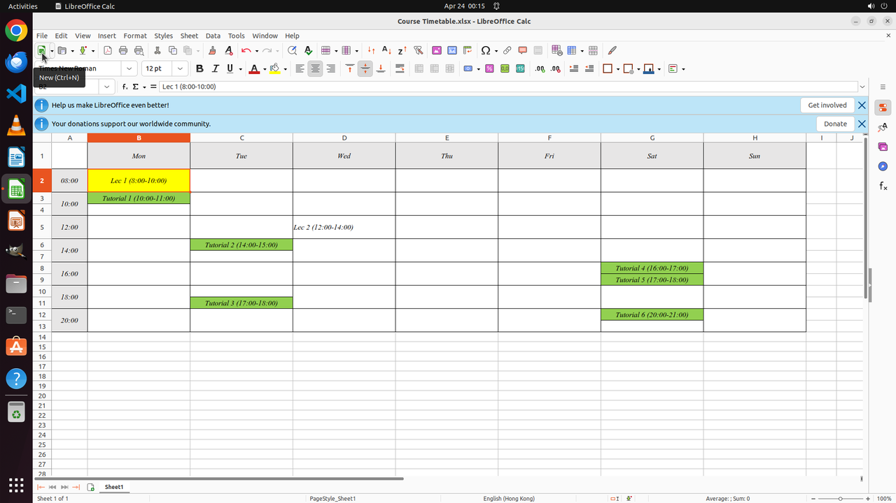

**Response:**
```
Good, I'm back to the Course Timetable. I can see B2 is selected. Now I need to use the Clone Formatting (paint brush) tool. I see the "New (Ctrl+N)" tooltip was showing, which means I clicked on the wrong button earlier. Let me find the Clone Formatting button - it looks like a paint bucket/brush icon. Let me click somewhere else first to dismiss the tooltip, then use the proper approach.

Let me use a different approach - I'll manually format D5 to match B2. First, let me click on D5.
```

**Actions:** `pyautogui.click(738, 487)`

---

## Step 21


**Response:**
```
Good, D5 is selected with "Lec 2 (12:00-14:00)". Now I need to format it to match the style of B2 (Lec 1). I need to:
1. Set the background color to yellow
2. Center the text
3. Make the text bold

Let me first set the background color to yellow. I'll use the Highlighting/Background Color button. I can see the highlighting dropdown in the toolbar. Let me click on the dropdown arrow next to the background color button.
```

**Actions:** `pyautogui.click(613, 147)`

---

## Step 22

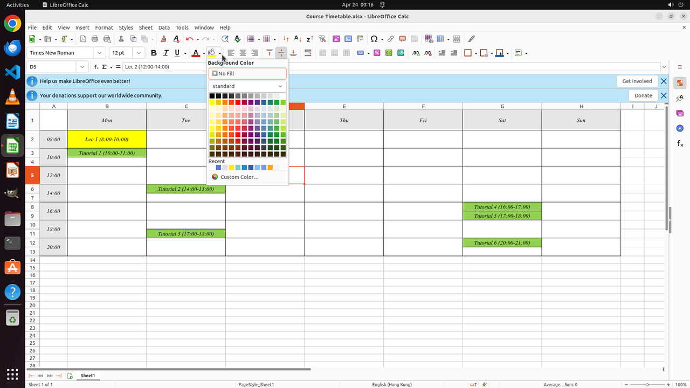

**Response:**
```
I can see the Background Color picker. I need to select the same yellow color as used in "Lec 1". Looking at the yellow colors, I need to pick the right shade. The "Lec 1" cell appears to be a bright yellow. Let me check if there's a yellow in the recent colors section. I can see yellow in the recent colors at the bottom. Let me click on the yellow color that matches.
```

**Actions:** `pyautogui.click(658, 463)`

---

## Step 23

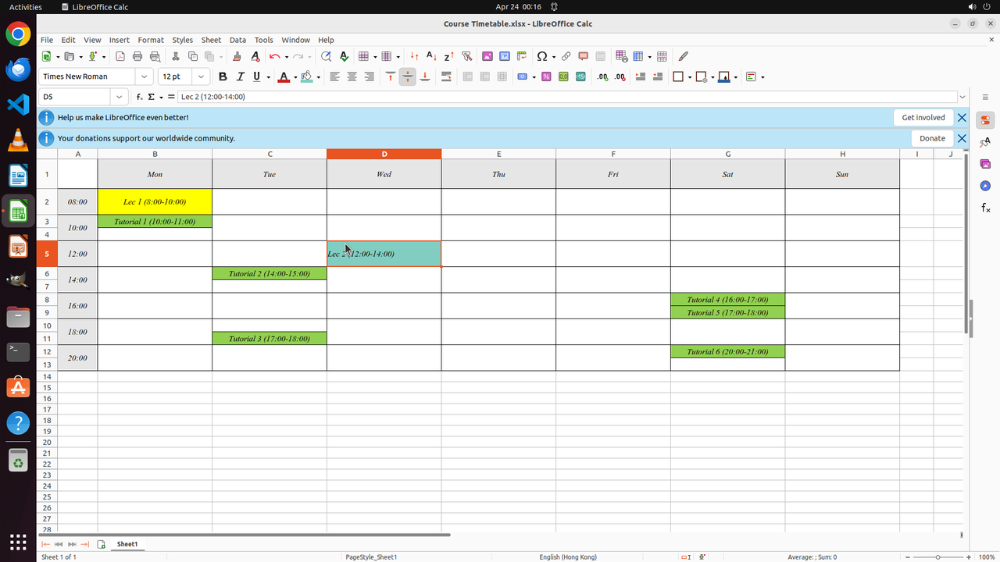

**Response:**
```
I see the background color is now a light teal/cyan, but it doesn't match the yellow of "Lec 1". I need to change it to the correct yellow. Let me undo this and pick the right yellow color. Let me first undo.
```

**Actions:** `pyautogui.keyDown('ctrl')
pyautogui.keyDown('z')
pyautogui.keyUp('z')
pyautogui.keyUp('ctrl')`

---

## Step 24

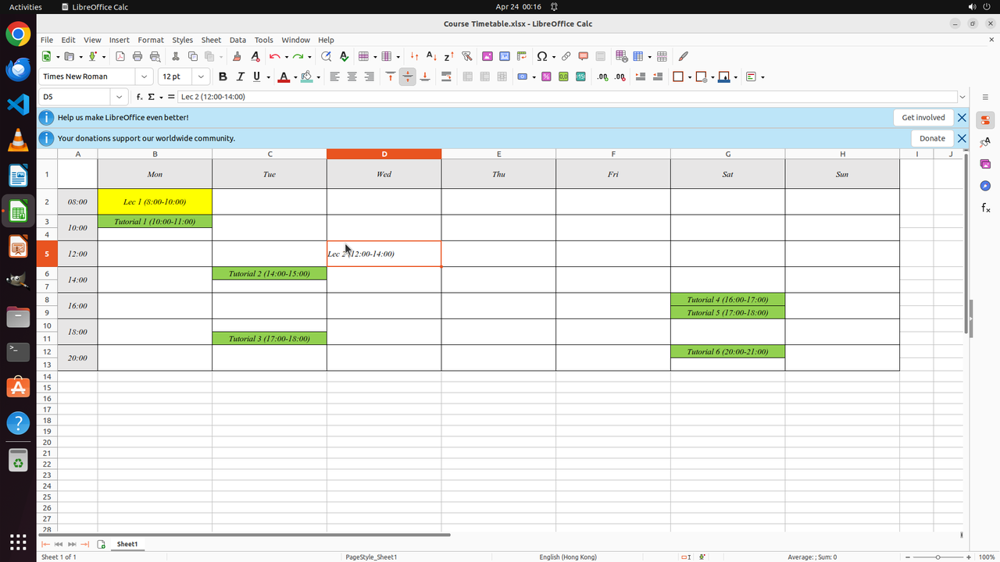

**Response:**
```
Good, the background color has been undone. Now let me check the exact color of B2 by right-clicking on it and checking its cell properties. But first, let me try a more efficient approach - I'll use the Clone Formatting tool properly. Let me first click on B2.
```

**Actions:** `pyautogui.click(298, 387)`

---

## Step 25


**Response:**
```
Good, B2 is selected. Now I need to find the Clone Formatting tool (paint brush icon) in the toolbar. Looking at the toolbar, I can see various icons. The Clone Formatting tool should be a paint brush icon. Let me look more carefully at the toolbar icons. I'll try clicking on the paint brush icon which should be in the standard toolbar area.
```

**Actions:** `time.sleep(0.1)`

---

## Step 26


**Response:**
```
Let me take a different approach. Instead of using Clone Formatting, I'll manually check the exact yellow color by right-clicking on B2 to see its formatting properties.
```

**Actions:** `pyautogui.rightClick(298, 387)`

---

## Step 27


**Response:**
```
I can see the context menu. I'll click "Format Cells..." to check the exact formatting of B2.
```

**Actions:** `pyautogui.click(375, 684)`

---

## Step 28

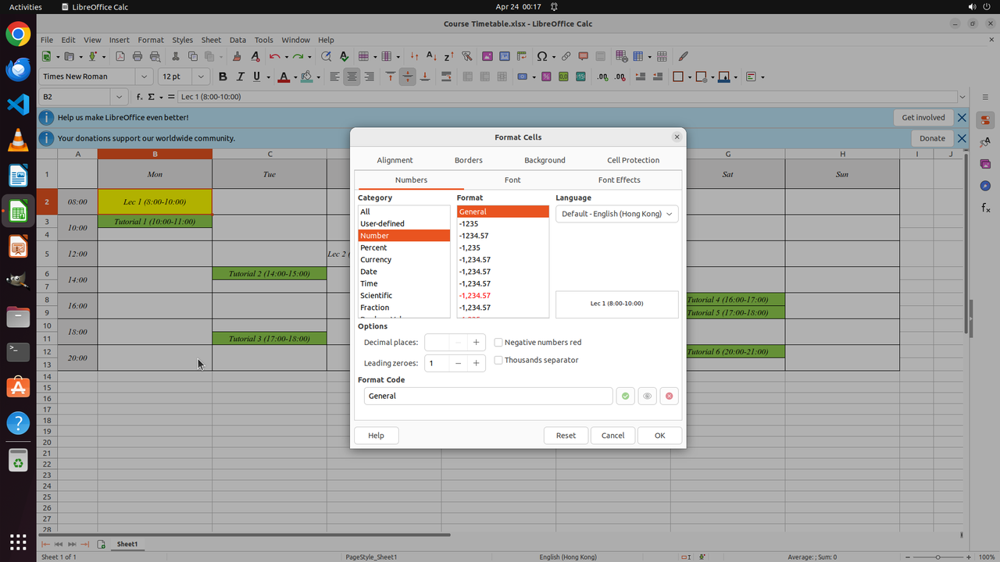

**Response:**
```
The Format Cells dialog is open. I can see tabs for Numbers, Alignment, Borders, Background, Cell Protection, Font, and Font Effects. Let me click on the "Background" tab to see the exact background color.
```

**Actions:** `pyautogui.click(1050, 307)`

---

## Step 29

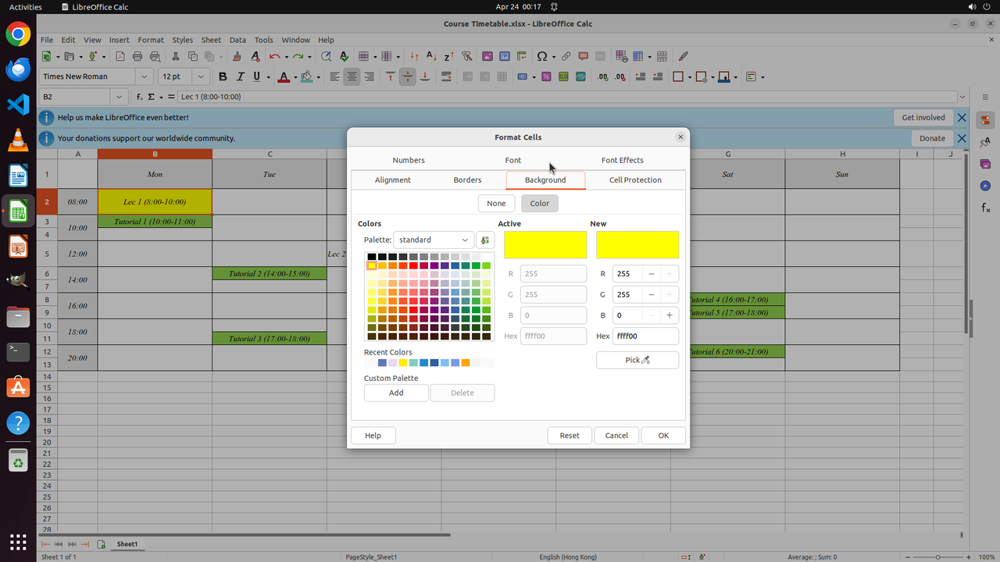

**Response:**
```
Now I can see the background color of B2. The hex color is "ffff00" (R:255, G:255, B:0), which is pure yellow. Now I know the exact color. Let me close this dialog and apply the same formatting to D5.
```

**Actions:** `pyautogui.click(1180, 835)`

---

## Step 30


**Response:**
```
Good, the dialog is closed. Now I'll use the Clone Formatting approach. With B2 selected, I'll click the "Clone Formatting" button from the context menu. Let me right-click on B2 first.

Actually, let me try a simpler approach. I'll use the Clone Formatting from the right-click context menu. Let me right-click on B2.
```

**Actions:** `pyautogui.rightClick(298, 387)`

---

## Step 31

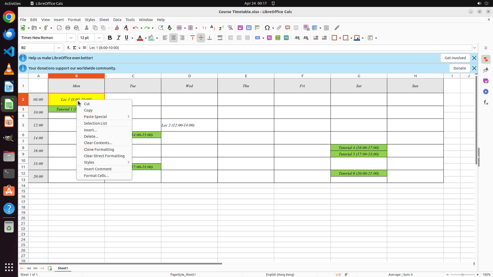

**Response:**
```
I can see "Clone Formatting" in the context menu. Let me click on it.
```

**Actions:** `pyautogui.click(385, 582)`

---

## Step 32


**Response:**
```
The Clone Formatting mode is now active (I can see the cursor has changed). Now I need to click on cell D5 to apply the formatting from B2 to D5.
```

**Actions:** `pyautogui.click(738, 487)`

---

## Step 33

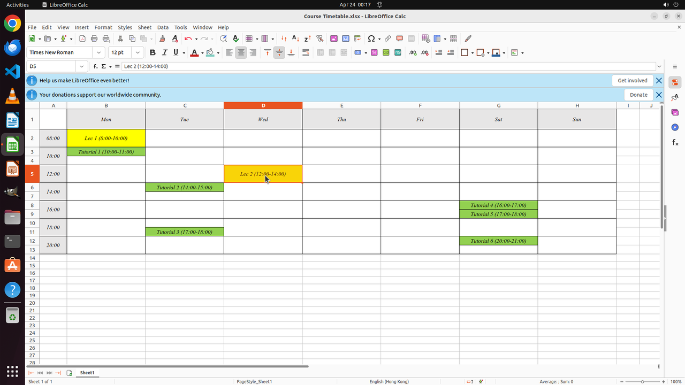

**Response:**
```
The formatting has been successfully applied to D5. The cell now has:
- Yellow background (matching "Lec 1")
- Bold text
- Centered text
- The content "Lec 2 (12:00-14:00)"

The lecture slot looks great and matches the style of the existing entries. Now I need to save the file. Let me press Ctrl+S.
```

**Actions:** `pyautogui.keyDown('ctrl')
pyautogui.keyDown('s')
pyautogui.keyUp('s')
pyautogui.keyUp('ctrl')`

---

## Step 34


**Response:**
```
The file has been saved (since it's an .xlsx file, it was saved directly without prompting for format). The task is complete. I have successfully added a two-hour lecture slot "Lec 2 (12:00-14:00)" to the Wednesday column at the 12:00 time slot in the Course Timetable, with matching yellow background and bold centered text formatting consistent with the existing lecture entry.

DONE
```

**Actions:** `DONE`

---
