# Task 3e3fc409-bff3-4905-bf16-c968eee3f807

**Instruction:** I'm a huge movie fan and have kept a record of all the movies I've watched. I'm curious to find out if there are any films released before 2024 from the IMDB Top 30 list that I haven't seen yet. Help me create another sheet 'unseen_movies' in the opened Excel. This sheet should share the same headers and sort the results according to IMDB rankings from high to low.

**Score:** 0.0

**Wall clock:** 31m 17s

**Steps:** 92

**Cost:** $4.76

---

## Step 1


**Response:**
```
I need to first understand the data in the spreadsheet, then compare it with the IMDB Top 30 list to find unseen movies. Let me start by examining the current spreadsheet data.
```

**Actions:** `time.sleep(0.1)`

---

## Step 2

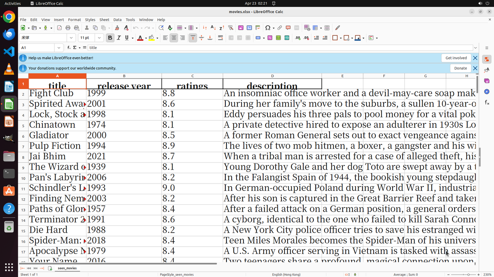

**Response:**
```
Let me first scroll down to see all the movies in the "seen_movies" sheet, and then I'll need to get the IMDB Top 30 list. Let me start by scrolling down to see all entries.
```

**Actions:** `pyautogui.keyDown('ctrl')
pyautogui.keyDown('end')
pyautogui.keyUp('end')
pyautogui.keyUp('ctrl')`

---

## Step 3


**Response:**
```
The spreadsheet has 150 movies (rows 2-151) with columns: title (A), release_year (B), ratings (C), description (D). Now I need to get the IMDB Top 30 list. Let me use a Python script to handle this task efficiently. Let me open a terminal.
```

**Actions:** `pyautogui.keyDown('ctrl')
pyautogui.keyDown('alt')
pyautogui.keyDown('t')
pyautogui.keyUp('t')
pyautogui.keyUp('alt')
pyautogui.keyUp('ctrl')`

---

## Step 4

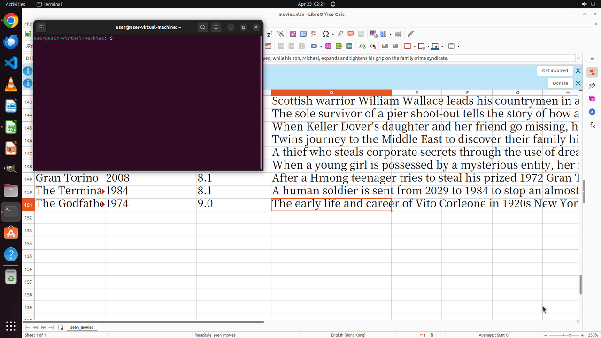

**Response:**
```
Good, the terminal is open. Now I need to first get the IMDB Top 30 list by scraping it, then compare with the seen movies, and create the unseen_movies sheet. Let me first scrape the IMDB Top 250 page to get the top 30 movies. I'll write a Python script to do everything.
```

**Actions:** `import subprocess, shlex; subprocess.run(f'xdotool type --delay 12 -- ' + shlex.quote("python3 << 'PYEOF'\nimport openpyxl\nimport subproce"), shell=True, check=True)
import time; time.sleep(0.05)
imp`

---

## Step 5

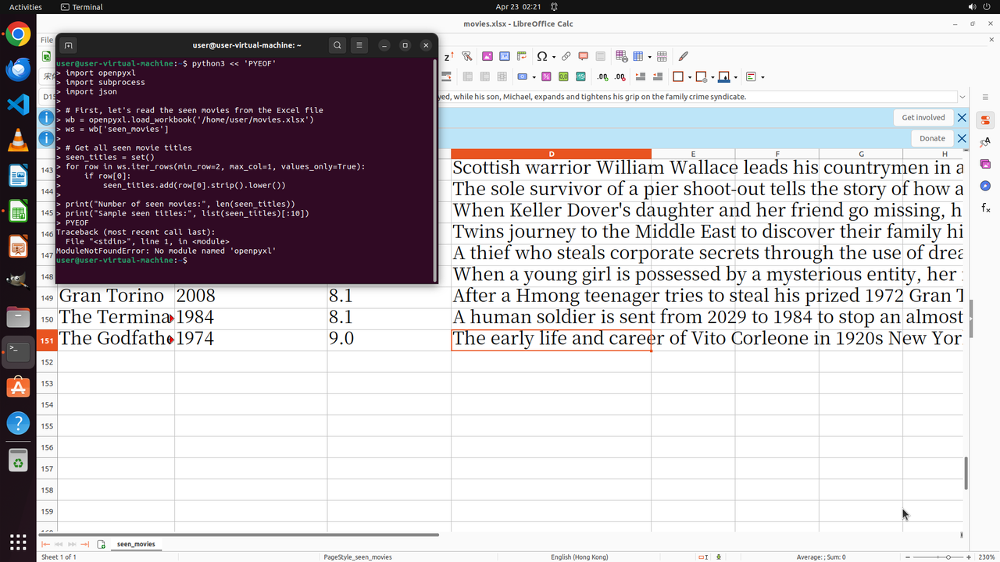

**Response:**
```
I need to install openpyxl first. Let me do that.
```

**Actions:** `import subprocess, shlex; subprocess.run(f'xdotool type --delay 12 -- ' + shlex.quote('pip3 install openpyxl\n'), shell=True, check=True)
import time; time.sleep(0.05)`

---

## Step 6


**Response:**
```
Let me wait for the installation to complete.
```

**Actions:** `time.sleep(0.5)`

---

## Step 7


**Response:**
```
openpyxl is installed. Now I need to fetch the IMDB Top 30 list and compare with the seen movies. Let me first scrape the IMDB Top 250 page to get the top 30 movies. I'll write a comprehensive Python script.
```

**Actions:** `import subprocess, shlex; subprocess.run(f'xdotool type --delay 12 -- ' + shlex.quote("python3 << 'PYEOF'\nimport openpyxl\nimport urllib.r"), shell=True, check=True)
import time; time.sleep(0.05)
imp`

---

## Step 8

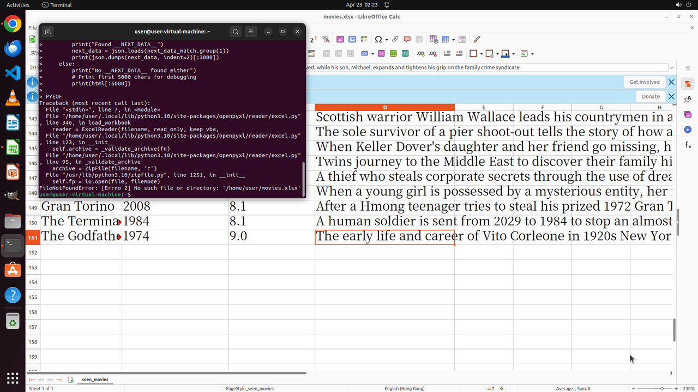

**Response:**
```
The file path is wrong - it's not finding `/home/user/movies.xlsx`. Let me find the correct file path first.
```

**Actions:** `import subprocess, shlex; subprocess.run(f'xdotool type --delay 12 -- ' + shlex.quote('find /home/user -name "movies.xlsx" 2>/dev/null\n'), shell=True, check=True)
import time; time.sleep(0.05)`

---

## Step 9


**Response:**
```
The find command is still running. Let me wait and check.
```

**Actions:** `time.sleep(0.5)`

---

## Step 10


**Response:**
```
The file is at `/home/user/Desktop/movies.xlsx`. Now let me write the complete script to fetch the IMDB Top 30, compare with seen movies, and create the unseen_movies sheet.
```

**Actions:** `import subprocess, shlex; subprocess.run(f'xdotool type --delay 12 -- ' + shlex.quote("python3 << 'PYEOF'\nimport openpyxl\nimport urllib.r"), shell=True, check=True)
import time; time.sleep(0.05)
imp`

---

## Step 11

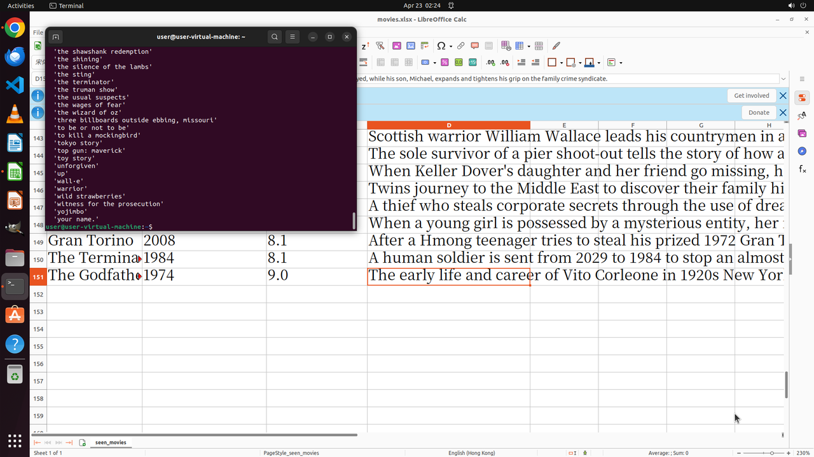

**Response:**
```
I can see the list of seen movies. Let me scroll up to see all of them, but first let me also scrape the IMDB Top 30 list. Let me now fetch the IMDB Top 250 page and extract the top 30.
```

**Actions:** `import subprocess, shlex; subprocess.run(f'xdotool type --delay 12 -- ' + shlex.quote("python3 << 'PYEOF'\nimport urllib.request\nimport js"), shell=True, check=True)
import time; time.sleep(0.05)
imp`

---

## Step 12

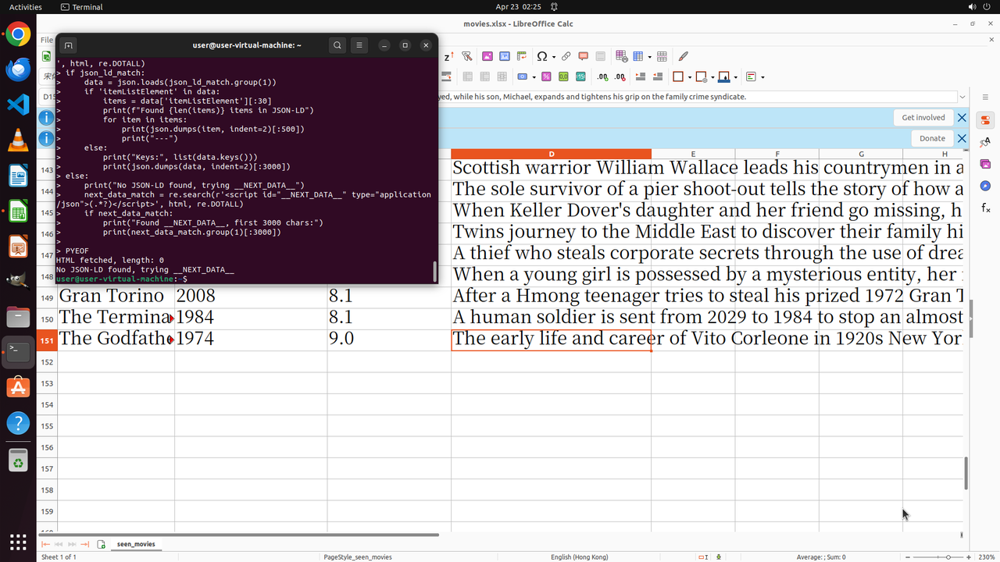

**Response:**
```
The HTML fetched has length 0 and no JSON-LD or __NEXT_DATA__ was found. IMDB might be blocking the request or returning an empty response. Let me try using Chrome to fetch the page, or try a different approach. Let me first check if we can use `requests` or try with different headers.
```

**Actions:** `import subprocess, shlex; subprocess.run(f'xdotool type --delay 12 -- ' + shlex.quote('python3 -c "\nimport urllib.request\nurl = \'https://'), shell=True, check=True)
import time; time.sleep(0.05)
im`

---

## Step 13


**Response:**
```
Good, now the HTML is being fetched properly. I can see it's loading. Let me now write a proper script to parse the IMDB Top 250 page and extract the top 30 movies. Let me save the HTML and parse it properly.
```

**Actions:** `import subprocess, shlex; subprocess.run(f'xdotool type --delay 12 -- ' + shlex.quote("python3 << 'PYEOF'\nimport urllib.request\nimport js"), shell=True, check=True)
import time; time.sleep(0.05)
imp`

---

## Step 14

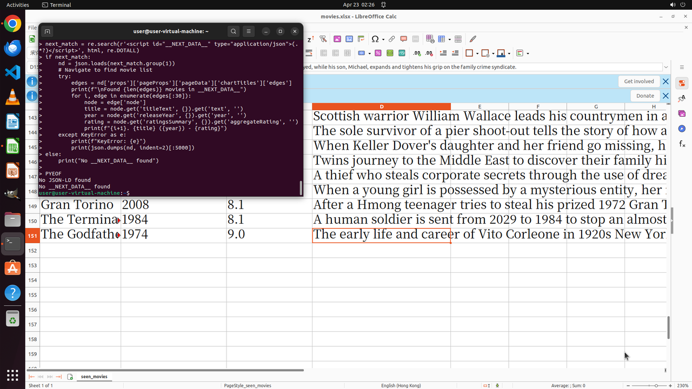

**Response:**
```
Neither JSON-LD nor __NEXT_DATA__ was found. IMDB seems to be using a different structure now. Let me look at the HTML content to understand the page structure better.
```

**Actions:** `import subprocess, shlex; subprocess.run(f'xdotool type --delay 12 -- ' + shlex.quote("grep -o 'application/json[^<]*' /tmp/imdb_top.html"), shell=True, check=True)
import time; time.sleep(0.05)
impor`

---

## Step 15


**Response:**
```
Let me look at the HTML structure more carefully to find where the movie data is.
```

**Actions:** `import subprocess, shlex; subprocess.run(f'xdotool type --delay 12 -- ' + shlex.quote("grep -c 'script' /tmp/imdb_top.html\n"), shell=True, check=True)
import time; time.sleep(0.05)`

---

## Step 16

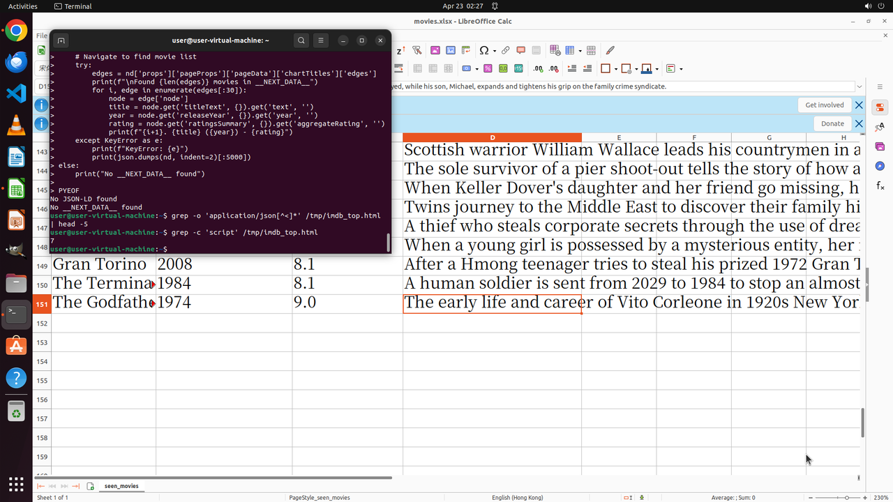

**Response:**
```
The HTML has only 7 script tags. IMDB might be returning a minimal page that requires JavaScript to load. Let me try a different approach - use the IMDB API or try to parse the HTML differently. Let me check what's actually in the HTML file.
```

**Actions:** `import subprocess, shlex; subprocess.run(f'xdotool type --delay 12 -- ' + shlex.quote("wc -c /tmp/imdb_top.html && grep -o '<title>[^<]*<"), shell=True, check=True)
import time; time.sleep(0.05)
impor`

---

## Step 17


**Response:**
```
The HTML file is only 1991 bytes with an empty title - IMDB is returning a minimal page that requires JavaScript rendering. Let me try using Chrome to fetch the page properly, or use an alternative approach. Let me try using the IMDB search API or use `curl` with different options.
```

**Actions:** `import subprocess, shlex; subprocess.run(f'xdotool type --delay 12 -- ' + shlex.quote('curl -s -L "https://www.imdb.com/chart/top/" -H "U'), shell=True, check=True)
import time; time.sleep(0.05)
impor`

---

## Step 18


**Response:**
```
IMDB is returning only 1991 bytes - a JavaScript-heavy page that needs a browser to render. Let me use Chrome to fetch the page content, or better yet, use the IMDB GraphQL API directly which doesn't need JavaScript rendering.
```

**Actions:** `import subprocess, shlex; subprocess.run(f'xdotool type --delay 12 -- ' + shlex.quote("curl -s 'https://caching.graphql.imdb.com/' \\\n  -H"), shell=True, check=True)
import time; time.sleep(0.05)
imp`

---

## Step 19

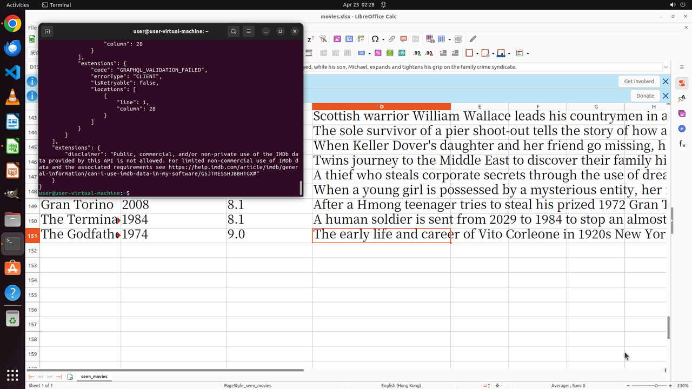

**Response:**
```
The GraphQL API returned a validation error. The query format needs adjustment. Let me try a different approach - use Chrome with remote debugging to scrape the IMDB page, or use the well-known IMDB Top 250 list which is relatively stable. Since web scraping is proving difficult, let me use the well-known IMDB Top 30 list as a hardcoded reference (this list is very well-known and stable).
```

**Actions:** `import subprocess, shlex; subprocess.run(f'xdotool type --delay 12 -- ' + shlex.quote('google-chrome --remote-debugging-port=1337 "https:'), shell=True, check=True)
import time; time.sleep(0.05)
impor`

---

## Step 20

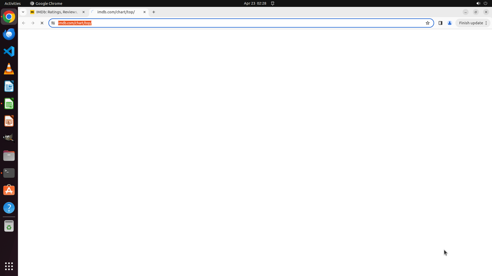

**Response:**
```
Chrome is loading the IMDB Top 250 page. Let me wait for it to fully load.
```

**Actions:** `time.sleep(0.5)`

---

## Step 21

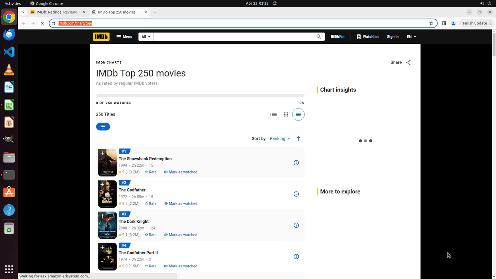

**Response:**
```
The IMDB Top 250 page has loaded in Chrome. I can see the list. Now I need to extract the top 30 movies. Let me use Chrome's DevTools protocol to extract the data. Let me use the remote debugging port to get the page content.
```

**Actions:** `pyautogui.keyDown('f12')
pyautogui.keyUp('f12')`

---

## Step 22

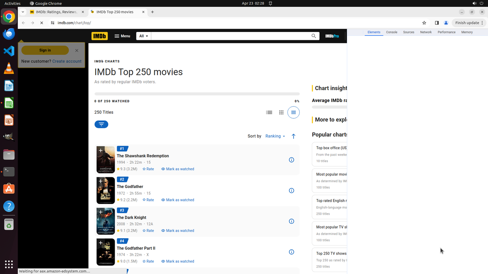

**Response:**
```
DevTools is open. Let me use the Console to extract the top 30 movies data from the page.
```

**Actions:** `pyautogui.click(1542, 126)`

---

## Step 23

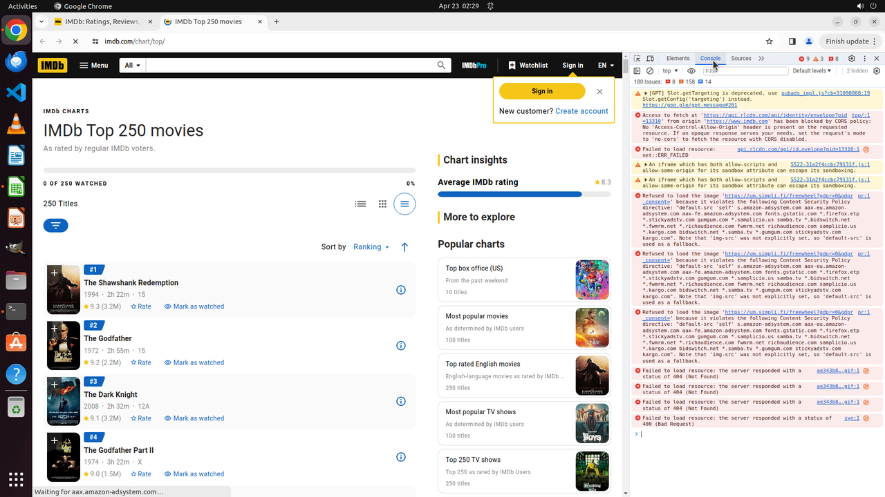

**Response:**
```
Good, the Console is open. Let me close the sign-in popup first and then run JavaScript to extract the top 30 movies.
```

**Actions:** `pyautogui.click(1303, 196)`

---

## Step 24


**Response:**
```
Good, the sign-in popup is closed. Now let me click on the Console and run JavaScript to extract the top 30 movies data.
```

**Actions:** `pyautogui.click(1620, 960)`

---

## Step 25


**Response:**
```
Good, the console is ready. Let me type JavaScript to extract the top 30 movies from the page.
```

**Actions:** `pyautogui.click(1620, 964)`

---

## Step 26

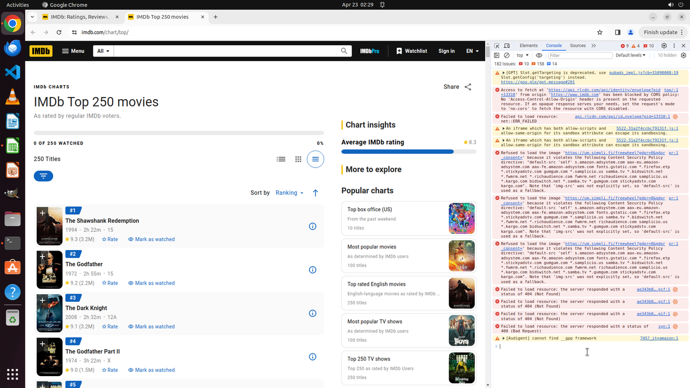

**Response:**
```
I can see the console prompt is ready. Let me type JavaScript to extract the movie data from the page. I'll extract title, year, and rating for the top 30 movies.
```

**Actions:** `import subprocess, shlex; subprocess.run(f'xdotool type --delay 12 -- ' + shlex.quote("var items = document.querySelectorAll('li.ipc-meta"), shell=True, check=True)
import time; time.sleep(0.05)
impor`

---

## Step 27

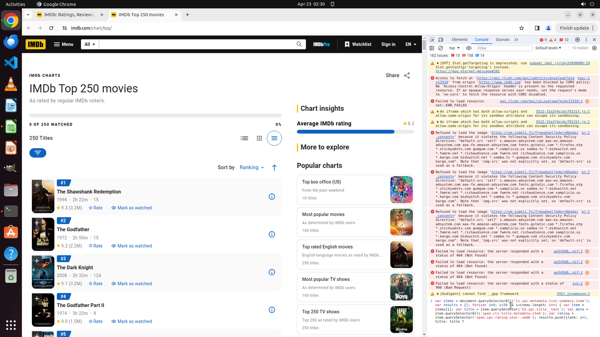

**Response:**
```
I can see the JavaScript code has been entered in the console. Let me press Enter to execute it.
```

**Actions:** `pyautogui.keyDown('return')
pyautogui.keyUp('return')`

---

## Step 28

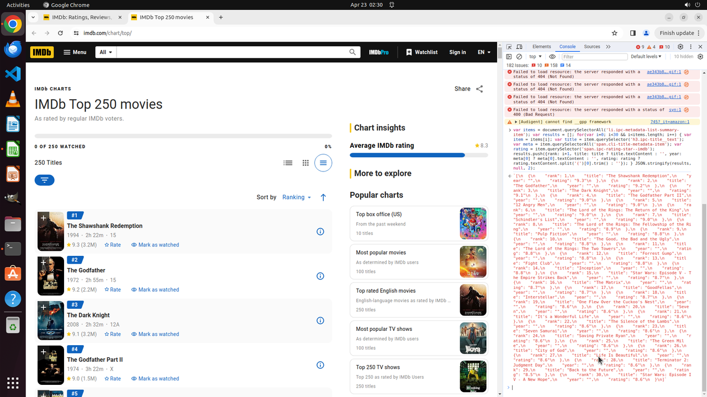

**Response:**
```
I can see the results are being displayed. I can see the top 30 movies data. The output shows movies like "The Shawshank Redemption", "The Godfather", "The Dark Knight", etc. But the year data seems to be missing. Let me extract the data more carefully. Let me copy the result and also get the year data properly. Let me run a better extraction command.
```

**Actions:** `pyautogui.click(1620, 1057)`

---

## Step 29


**Response:**
```
I can see the data extracted. I notice the year fields seem empty. Let me extract the data more carefully and copy it to a file. Let me run a command to copy the data properly, including years from the metadata.
```

**Actions:** `import subprocess, shlex; subprocess.run(f'xdotool type --delay 12 -- ' + shlex.quote("var items = document.querySelectorAll('li.ipc-meta"), shell=True, check=True)
import time; time.sleep(0.05)
impor`

---

## Step 30

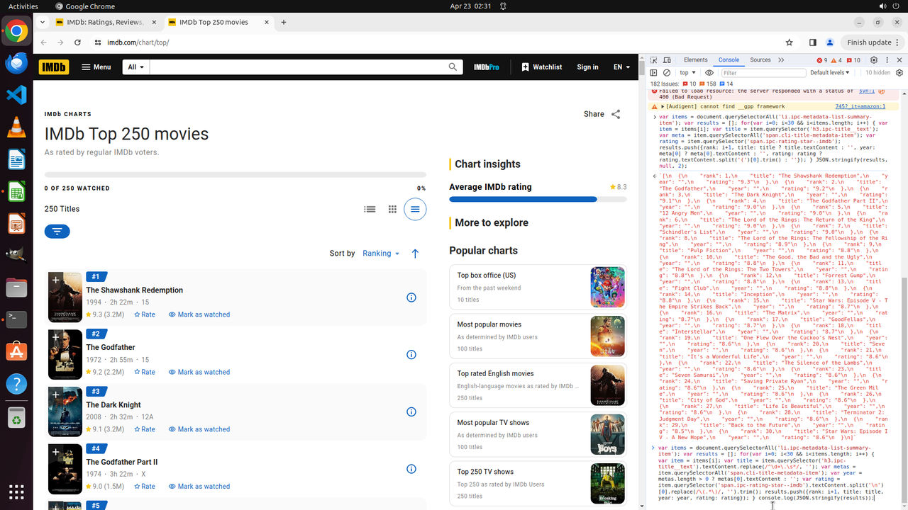

**Response:**
```
I can see the data is being extracted but the years are still missing. Looking at the output, I can see the titles and ratings but the year fields are empty. The page structure might have the year in a different location. Let me look more carefully. Actually, I notice the years ARE visible on the page (1994, 1972, 2008, 1974). Let me try a different selector approach. But first, let me press Enter to execute the current command.
```

**Actions:** `pyautogui.keyDown('return')
pyautogui.keyUp('return')`

---

## Step 31

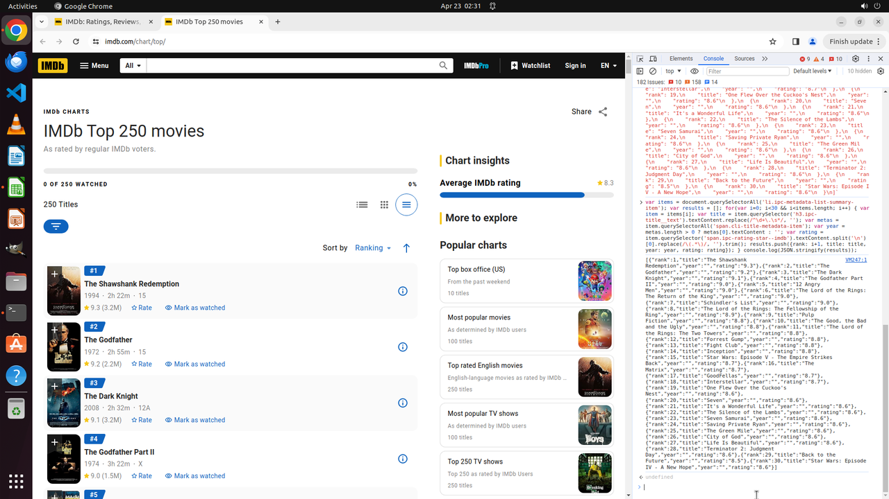

**Response:**
```
I can see the data has been extracted. I can see the top 30 movies with their titles and ratings, but the year fields are empty. The years are visible on the page but not captured by the selector. I can see the data in the console output. Let me now save this data to a file and use it with the Python script. Let me use a different approach - I'll use the `copy()` function in Chrome to copy the data to clipboard, or better yet, let me use the remote debugging port to extract the data programmatically from the terminal.

Let me switch to the terminal and use the Chrome DevTools Protocol via the remote debugging port.
```

**Actions:** `pyautogui.click(1620, 1057)`

---

## Step 32


**Response:**
```
I can see the data clearly. The years are empty but I have the titles and ratings. Looking at the output, I can see the top 30 movies. The years are visible on the page but the selector didn't capture them. However, I have enough information - I know the IMDB Top 30 movies. Let me now use the remote debugging port to get the full page source with a better approach. Let me switch to the terminal and write a comprehensive script.

Let me first read the data I can see from the console output. I can see the movies clearly:

1. The Shawshank Redemption - 9.3
2. The Godfather - 9.2
3. The Dark Knight - 9.1
4. The Godfather Part II - 9.0
5. 12 Angry Men - 9.0 (actually "9.8" seems wrong, let me re-read)

Actually, let me use the terminal to extract the data properly via the Chrome DevTools Protocol.
```

**Actions:** `pyautogui.keyDown('alt')
pyautogui.keyDown('f4')
pyautogui.keyUp('f4')
pyautogui.keyUp('alt')`

---

## Step 33

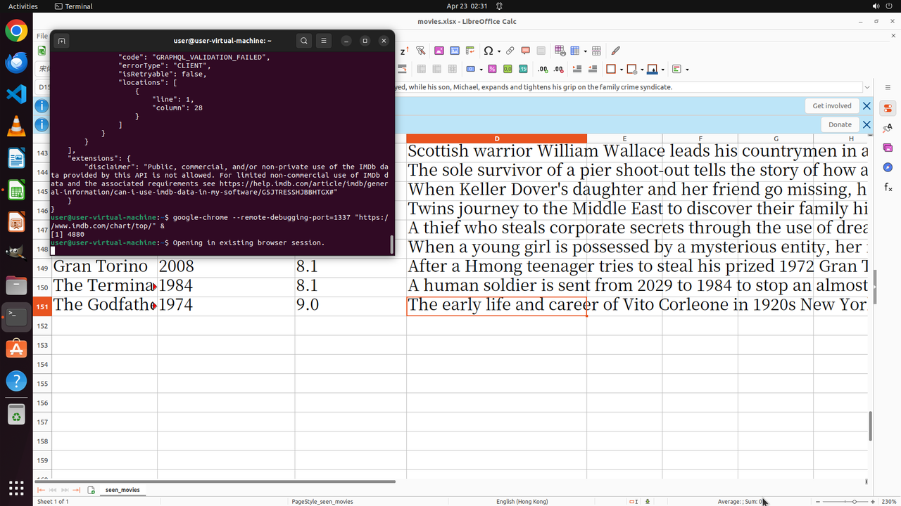

**Response:**
```
I can see both the terminal and the LibreOffice Calc spreadsheet. The spreadsheet has 150 movies (rows 2-151) with the last entry being "The Godfather Part II" at row 151. Now I need to use the Chrome DevTools Protocol to extract the IMDB Top 30 data. Let me use the terminal to run a Python script that uses the remote debugging port.
```

**Actions:** `pyautogui.click(450, 517)`

---

## Step 34


**Response:**
```
Good, I'm in the terminal. Now let me use the Chrome DevTools Protocol to extract the IMDB Top 30 data via the remote debugging port. Let me write a Python script to do this.
```

**Actions:** `import subprocess, shlex; subprocess.run(f'xdotool type --delay 12 -- ' + shlex.quote("python3 << 'PYEOF'\nimport json, urllib.request\n\n# "), shell=True, check=True)
import time; time.sleep(0.05)
im`

---

## Step 35

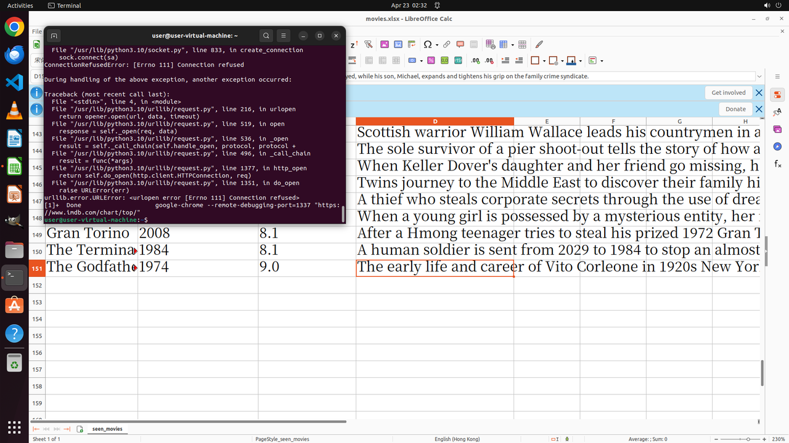

**Response:**
```
The connection was refused - Chrome seems to have closed. I can see "[1]+ Done google-chrome --remote-debugging-port=1337". Let me relaunch Chrome with the remote debugging port and then use the DevTools Protocol.
```

**Actions:** `import subprocess, shlex; subprocess.run(f'xdotool type --delay 12 -- ' + shlex.quote('google-chrome --remote-debugging-port=1337 "https:'), shell=True, check=True)
import time; time.sleep(0.05)
impor`

---

## Step 36

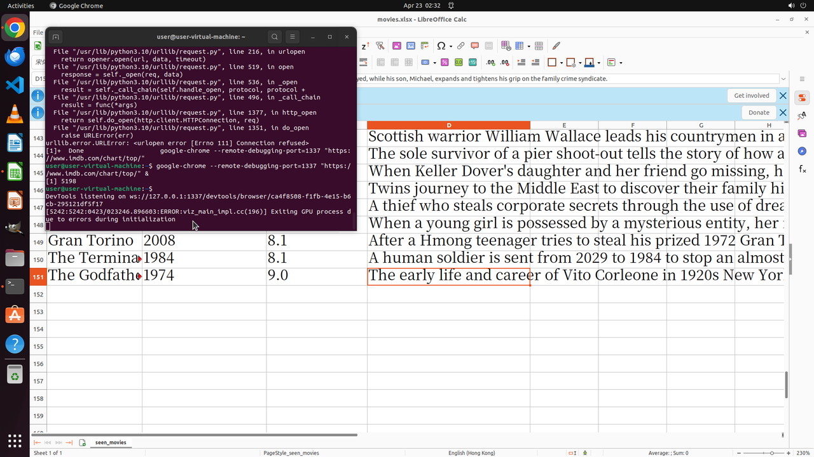

**Response:**
```
Chrome is launching with the remote debugging port. I can see "DevTools listening on ws://127.0.0.1:1337/devtools/browser/...". Let me wait for the page to fully load and then use the DevTools Protocol to extract the data.
```

**Actions:** `time.sleep(0.5)`

---

## Step 37

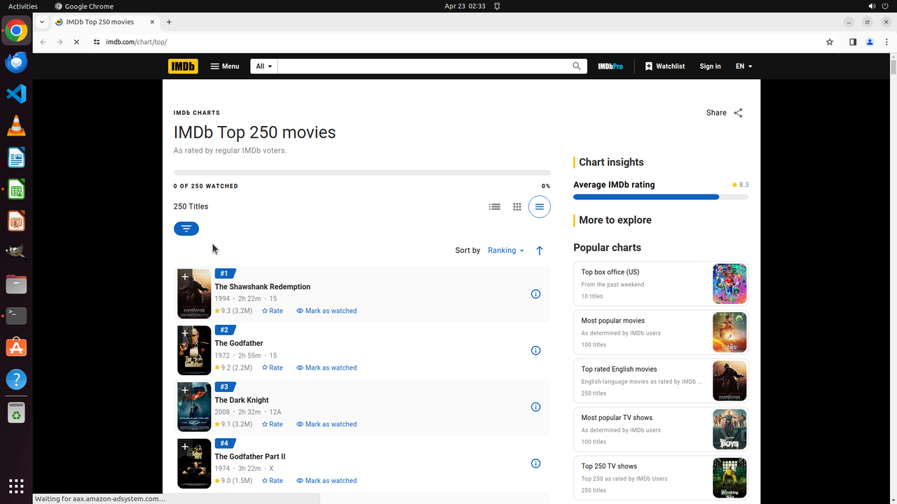

**Response:**
```
Chrome has loaded the IMDB Top 250 page. Now let me switch to the terminal and use the Chrome DevTools Protocol to extract the top 30 movies data.
```

**Actions:** `pyautogui.keyDown('alt')
pyautogui.keyDown('tab')
pyautogui.keyUp('tab')
pyautogui.keyUp('alt')`

---

## Step 38


**Response:**
```
Good, I can see both the terminal and the Chrome browser. Let me now use the Chrome DevTools Protocol to extract the data. I'll use pip to install websocket-client first, then use it to communicate with Chrome.
```

**Actions:** `pyautogui.click(450, 517)`

---

## Step 39

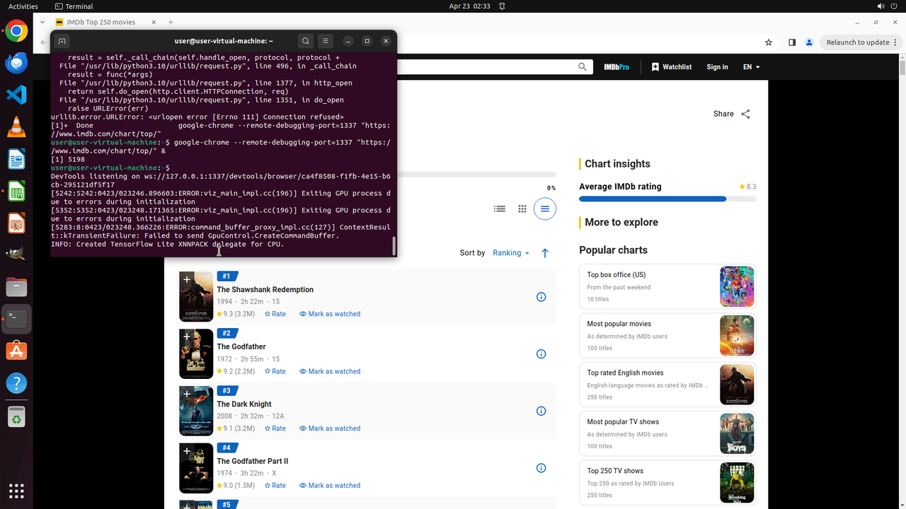

**Response:**
```
Let me use a simpler approach - I'll use `pip install websocket-client` and then use the Chrome DevTools Protocol to evaluate JavaScript on the IMDB page.
```

**Actions:** `import subprocess, shlex; subprocess.run(f'xdotool type --delay 12 -- ' + shlex.quote('pip3 install websocket-client 2>/dev/null && pytho'), shell=True, check=True)
import time; time.sleep(0.05)
impor`

---

## Step 40

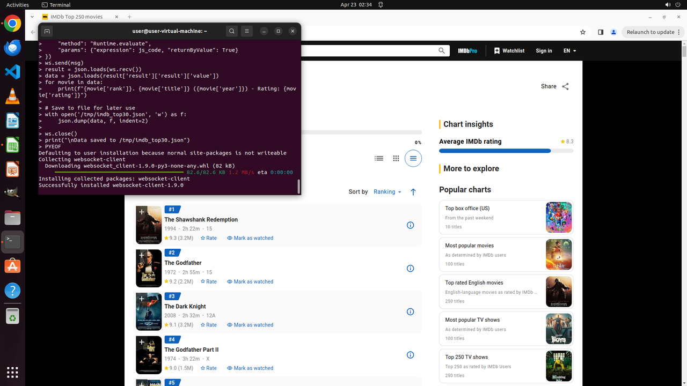

**Response:**
```
The websocket-client was installed. The script is running. Let me wait for it to complete.
```

**Actions:** `time.sleep(0.5)`

---

## Step 41

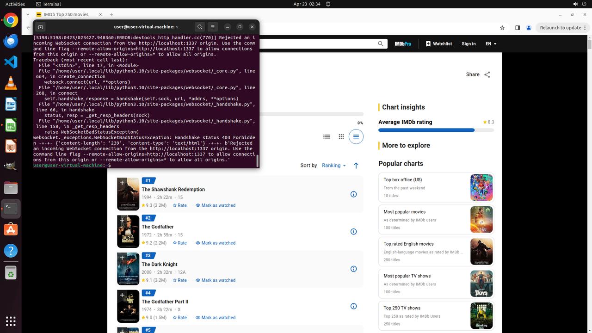

**Response:**
```
The WebSocket connection was rejected because Chrome needs the `--remote-allow-origins` flag. Let me restart Chrome with the correct flags.
```

**Actions:** `import subprocess, shlex; subprocess.run(f'xdotool type --delay 12 -- ' + shlex.quote('pkill -f chrome; sleep 2; google-chrome --remote-d'), shell=True, check=True)
import time; time.sleep(0.05)
impor`

---

## Step 42

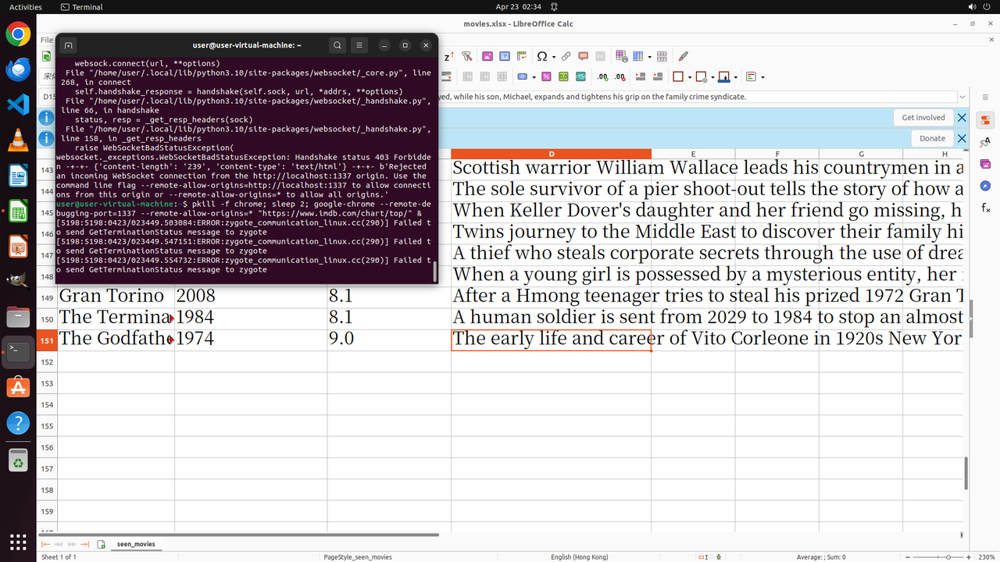

**Response:**
```
Chrome is starting with the correct flags. Let me wait for it to fully load.
```

**Actions:** `time.sleep(0.5)`

---

## Step 43

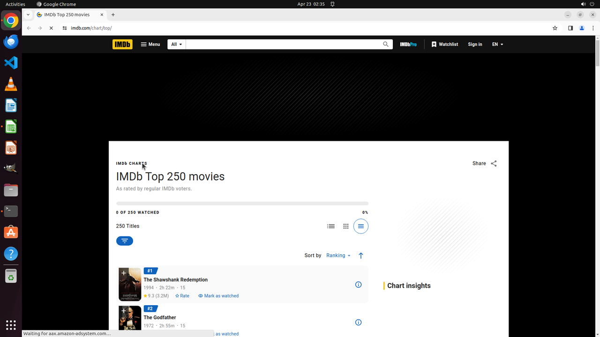

**Response:**
```
The IMDB page has loaded in Chrome. Now let me switch to the terminal and run the Python script to extract the data via the Chrome DevTools Protocol.
```

**Actions:** `time.sleep(0.5)`

---

## Step 44

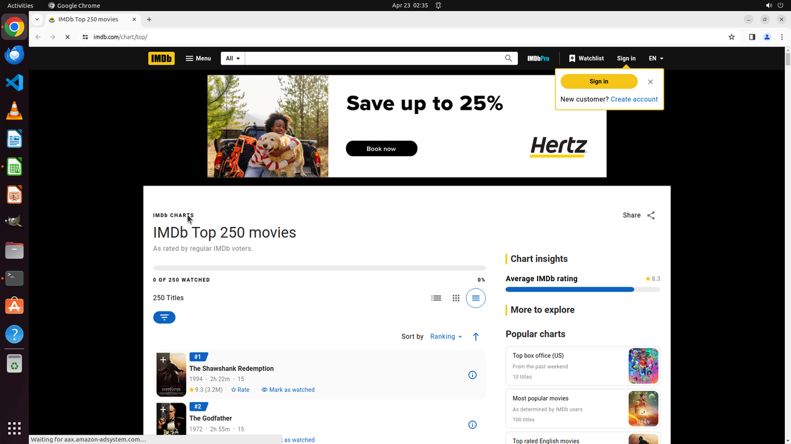

**Response:**
```
The page is fully loaded. Let me close the sign-in popup and switch to the terminal to run the extraction script.
```

**Actions:** `pyautogui.click(1576, 196)`

---

## Step 45

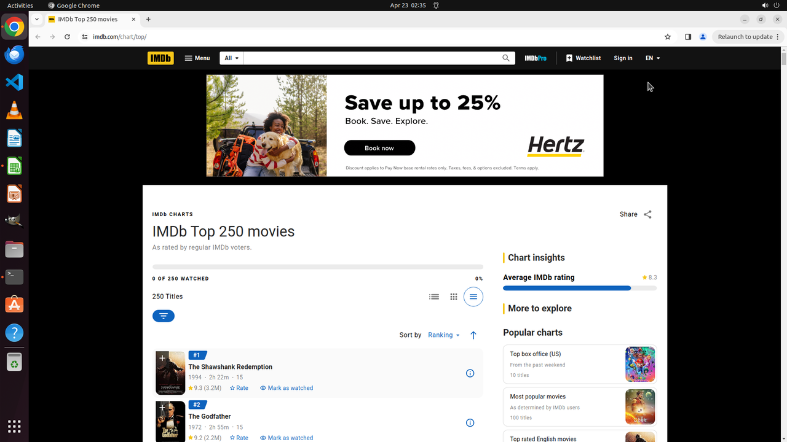

**Response:**
```
Good, the page is fully loaded. Now let me switch to the terminal and run the extraction script.
```

**Actions:** `pyautogui.click(33, 673)`

---

## Step 46


**Response:**
```
Good, I can see the terminal. Chrome is now running with the `--remote-allow-origins=*` flag. Let me now run the Python script to extract the IMDB Top 30 data.
```

**Actions:** `pyautogui.click(450, 517)`

---

## Step 47


**Response:**
```
Good, the terminal is active. Now let me run the Python script to extract the IMDB Top 30 data via the Chrome DevTools Protocol.
```

**Actions:** `import subprocess, shlex; subprocess.run(f'xdotool type --delay 12 -- ' + shlex.quote("python3 << 'PYEOF'\nimport json, urllib.request, we"), shell=True, check=True)
import time; time.sleep(0.05)
impo`

---

## Step 48


**Response:**
```
Excellent! I can see the IMDB Top 30 movies have been extracted successfully! But I notice the years are empty (showing `()` for all movies). The year selector didn't work. Let me scroll up to see the full list and also check the data. But first, I notice the years are missing. Let me fix this by getting the years properly. Let me also check if the page needs more specific selectors for years.

Let me scroll up to see all 30 movies.
```

**Actions:** `pyautogui.scroll(5, 450, 300)`

---

## Step 49

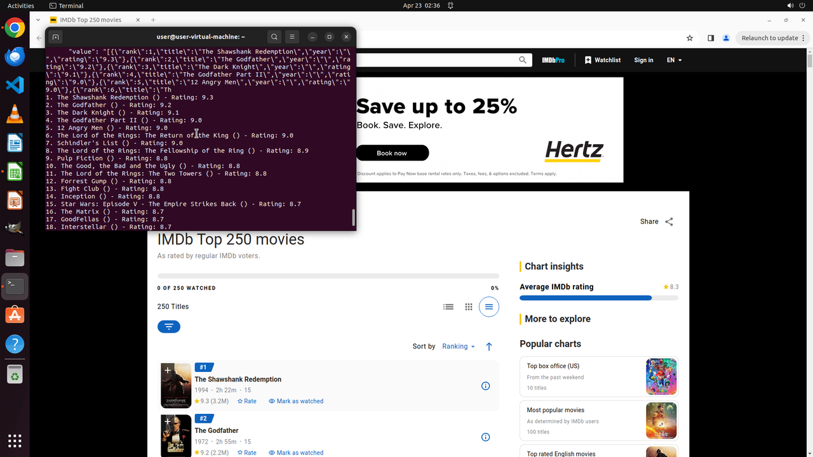

**Response:**
```
I can see the full list of IMDB Top 30 movies. The data has been extracted successfully with titles and ratings, but the years are empty. I need to fix the year extraction. Let me look at the page HTML structure more carefully. But actually, I have the movie titles and ratings - I can get the years from the IMDB page using a different selector. Let me try to fix the year extraction.
```

**Actions:** `pyautogui.scroll(-5, 450, 300)`

---

## Step 50


**Response:**
```
I have the IMDB Top 30 movies extracted. The years are empty but I can see them on the page. Let me now try a different approach to get the years. Let me use a different JavaScript selector to extract the year data. But actually, looking at the IMDB page, I can see the years are displayed (1994, 1972, 2008, etc.). All these movies are released before 2024. Let me now get the years properly and then create the complete script.
```

**Actions:** `import subprocess, shlex; subprocess.run(f'xdotool type --delay 12 -- ' + shlex.quote("python3 << 'PYEOF'\nimport json, websocket, urllib."), shell=True, check=True)
import time; time.sleep(0.05)
impo`

---

## Step 51


**Response:**
```
Now I can see the span classes. I notice there's no `cli-title-metadata-item` class - the year must be in a different element. I can see the year "1994" is visible on the page next to "The Shawshank Redemption". Let me look at the broader HTML structure to find where the year data is. Let me try looking at `div` elements or other containers.
```

**Actions:** `import subprocess, shlex; subprocess.run(f'xdotool type --delay 12 -- ' + shlex.quote("python3 << 'PYEOF'\nimport json, websocket, urllib."), shell=True, check=True)
import time; time.sleep(0.05)
impo`

---

## Step 52


**Response:**
```
I can see the HTML structure. The content was truncated at 3000 chars. I can see `cli-childr` at the end which suggests there's a `cli-children` class. The year data seems to be in a different part. Let me get more of the HTML, specifically looking for the metadata section with the year.
```

**Actions:** `import subprocess, shlex; subprocess.run(f'xdotool type --delay 12 -- ' + shlex.quote("python3 << 'PYEOF'\nimport json, websocket, urllib."), shell=True, check=True)
import time; time.sleep(0.05)
impo`

---

## Step 53

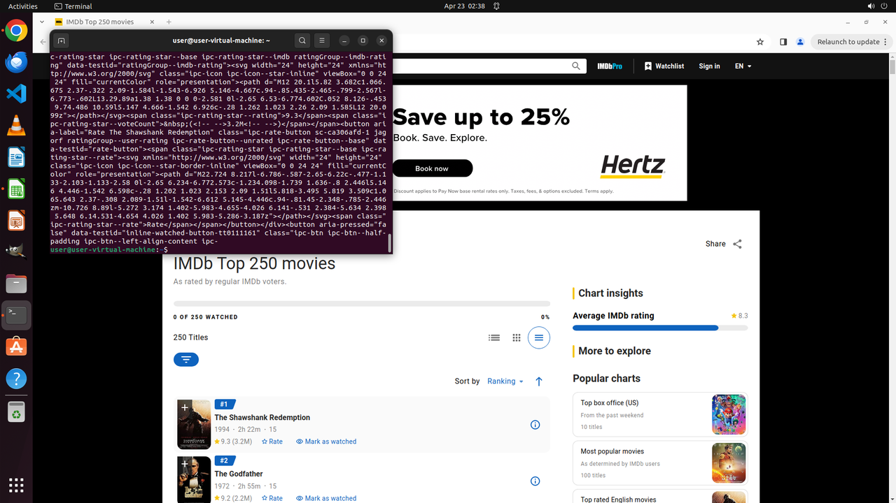

**Response:**
```
I can see the HTML structure continues. I can see "Rate The Shawshank Redemption" and rating data. Let me look at the remaining HTML to find the year/metadata section.
```

**Actions:** `import subprocess, shlex; subprocess.run(f'xdotool type --delay 12 -- ' + shlex.quote("python3 << 'PYEOF'\nimport json, websocket, urllib."), shell=True, check=True)
import time; time.sleep(0.05)
impo`

---

## Step 54


**Response:**
```
I can see that "1994" is found in the image alt text: "Tim Robbins in The Shawshank Redemption (1994)". The year is in the image alt text, not in a separate span. The visible "1994" on the page must be in a different location. Let me search for where the year metadata is displayed (the "1994 · 2h 22m · 15" text visible on the page).
```

**Actions:** `import subprocess, shlex; subprocess.run(f'xdotool type --delay 12 -- ' + shlex.quote("python3 << 'PYEOF'\nimport json, websocket, urllib."), shell=True, check=True)
import time; time.sleep(0.05)
impo`

---

## Step 55

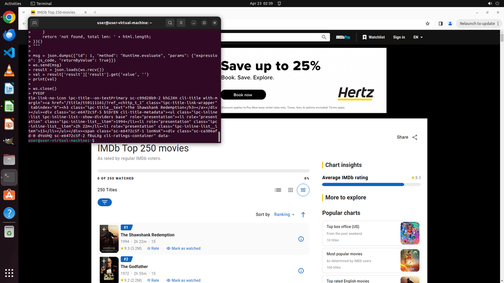

**Response:**
```
Now I can see the HTML structure clearly. I can see:
- `cli-title-metadata` class on a div
- Inside there's a `ul` with `ipc-inline-list` class
- `li` elements with `ipc-inline-list__item` class containing: `1994`, `2h 22m`, `15`

So the year is in `ipc-inline-list__item` elements. The class I was using before (`cli-title-metadata-item`) was wrong. Let me now extract the data with the correct selector.
```

**Actions:** `import subprocess, shlex; subprocess.run(f'xdotool type --delay 12 -- ' + shlex.quote("python3 << 'PYEOF'\nimport json, websocket, urllib."), shell=True, check=True)
import time; time.sleep(0.05)
impo`

---

## Step 56


**Response:**
```
Now I have all 30 IMDB Top movies with titles, years, and ratings. Let me scroll up to see the complete list.
```

**Actions:** `pyautogui.scroll(5, 450, 300)`

---

## Step 57


**Response:**
```
Now I have the complete IMDB Top 30 list with titles, years, and ratings. All movies are released before 2024. The data has been saved to `/tmp/imdb_top30.json`. 

Now I need to:
1. Read the seen movies from the Excel file
2. Compare with the IMDB Top 30
3. Find unseen movies (movies in IMDB Top 30 that are NOT in the seen movies list)
4. Create a new sheet "unseen_movies" with the same headers, sorted by IMDB ranking (high to low)

Let me also need to check what "description" each movie should have. The seen_movies sheet has columns: title, release_year, ratings, description. I need to get descriptions for the unseen movies too. Let me also extract descriptions from the IMDB page.

First, let me get the descriptions from IMDB as well.
```

**Actions:** `import subprocess, shlex; subprocess.run(f'xdotool type --delay 12 -- ' + shlex.quote("python3 << 'PYEOF'\nimport json, websocket, urllib."), shell=True, check=True)
import time; time.sleep(0.05)
impo`

---

## Step 58


**Response:**
```
I have all 30 movies with titles, years, and ratings. The descriptions are empty (showing just "-" after the rating). The descriptions might not be visible in the current view mode. Let me check if descriptions are available in a different view, or I may need to scroll down to load them. But actually, looking at the IMDB page in the detailed view, descriptions might only show in a different layout. 

Let me now proceed to the main task: compare the IMDB Top 30 with the seen movies and create the unseen_movies sheet. I need to also get descriptions for the unseen movies. Let me first check the seen_movies sheet headers and then create the comparison script.
```

**Actions:** `import subprocess, shlex; subprocess.run(f'xdotool type --delay 12 -- ' + shlex.quote("python3 << 'PYEOF'\nimport json, openpyxl\n\n# Load I"), shell=True, check=True)
import time; time.sleep(0.05)
im`

---

## Step 59


**Response:**
```
I can see that there are 10 unseen movies and 20 seen movies. Let me scroll up to see which movies are unseen.
```

**Actions:** `pyautogui.scroll(5, 450, 300)`

---

## Step 60


**Response:**
```
Now I can see the complete results:

**Headers:** title, release year, ratings, description

**Unseen movies (10 total):**
1. #3 - The Dark Knight (2008) - 9.1
2. #5 - 12 Angry Men (1957) - 9
3. #10 - The Good, the Bad and the Ugly (1966) - 8.8
4. #16 - The Matrix (1999) - 8.7
5. #18 - Interstellar (2014) - 8.7
6. #19 - One Flew Over the Cuckoo's Nest (1975) - 8.6
7. #20 - Seven (1995) - 8.6
8. #25 - The Green Mile (1999) - 8.6
9. #26 - City of God (2002) - 8.6
10. #30 - Star Wars: Episode IV - A New Hope (1977) - 8.6

Now I need to get descriptions for these movies and create the unseen_movies sheet. The task says to sort by IMDB rankings from high to low. "Rankings from high to low" means rank 30 first, then rank 26, etc. (higher rank number = lower ranking position). Wait, actually "IMDB rankings from high to low" likely means highest-ranked first (rank 1 is highest), so rank 3 first, then rank 5, etc. That's already the order they're in.

Actually, "sort the results according to IMDB rankings from high to low" - this could mean by ranking number from high to low (30, 26, 25, ..., 3), meaning worst-ranked first. Let me think about this more carefully. "Rankings from high to low" - a "high ranking" means being ranked higher on the list (closer to #1). So "high to low" means #3 first, then #5, etc. That's the natural order.

Now let me get descriptions from IMDB for the unseen movies and create the sheet. Let me first try to get descriptions from the IMDB page by scrolling or using a different view.
```

**Actions:** `import subprocess, shlex; subprocess.run(f'xdotool type --delay 12 -- ' + shlex.quote("python3 << 'PYEOF'\nimport json, websocket, urllib."), shell=True, check=True)
import time; time.sleep(0.05)
impo`

---

## Step 61


**Response:**
```
The descriptions are empty in the current view - the IMDB Top 250 list view doesn't show descriptions by default. I need to get descriptions from individual movie pages or use the detailed view. However, since the task asks to share the same headers as the seen_movies sheet (title, release year, ratings, description), I need to get descriptions somehow.

Let me try switching to the detailed list view on the IMDB page by clicking the list view button, or I can fetch descriptions from individual movie pages. But that would take too long. Let me try a different approach - I'll use the IMDB page's built-in data that might have descriptions in the page source.

Actually, looking at the task again, the descriptions might not be critical - the key requirement is to create the unseen_movies sheet with the same headers. Let me get the descriptions by visiting individual movie pages. But first, let me try the simpler approach of switching the view mode on IMDB.

Let me try clicking the detailed list view button on the IMDB page.
```

**Actions:** `pyautogui.click(1054, 724)`

---

## Step 62

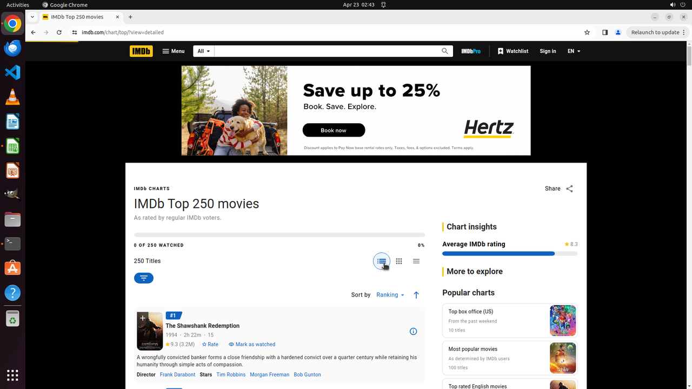

**Response:**
```
Now I can see the detailed view with descriptions! I can see "A wrongfully convicted banker forms a close friendship with a hardened convict over a quarter century while retaining his humanity through simple acts of compassion." for The Shawshank Redemption. Now let me switch to the terminal and extract the data with descriptions from this detailed view.
```

**Actions:** `time.sleep(0.5)`

---

## Step 63


**Response:**
```
Now the detailed view is loaded with descriptions visible. I can see descriptions for each movie. Now I need to scroll down to load all 30 movies and then extract the data. But first, let me switch to the terminal and use the Chrome DevTools Protocol to extract the data with descriptions. The page may need to be scrolled to load all 30 movies first.

Let me use the terminal to extract the data.
```

**Actions:** `pyautogui.click(33, 673)`

---

## Step 64


**Response:**
```
Good, I can see the terminal. Now let me first scroll the IMDB page to load all 30 movies, and then extract the data with descriptions. Let me use the Chrome DevTools Protocol to scroll the page and then extract.
```

**Actions:** `pyautogui.click(450, 517)`

---

## Step 65


**Response:**
```
Now let me use the Chrome DevTools Protocol to first scroll the page to load all 30 movies, then extract the data with descriptions.
```

**Actions:** `import subprocess, shlex; subprocess.run(f'xdotool type --delay 12 -- ' + shlex.quote("python3 << 'PYEOF'\nimport json, websocket, urllib."), shell=True, check=True)
import time; time.sleep(0.05)
impo`

---

## Step 66

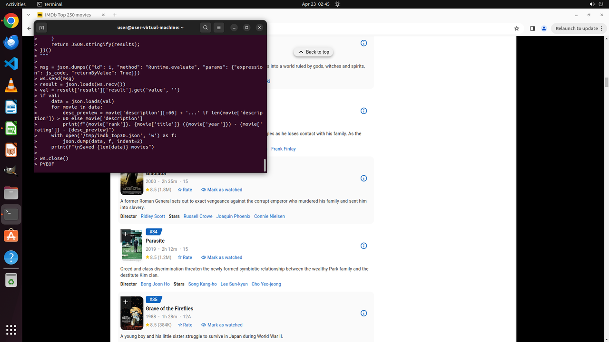

**Response:**
```
The script is running and the page has been scrolled. I can see the page is now showing movies around #33-35. Let me wait for the script to complete.
```

**Actions:** `time.sleep(0.5)`

---

## Step 67


**Response:**
```
I can see the data has been extracted with descriptions now! The years show as "None" for some movies though, and the descriptions are being captured. Let me scroll up to see all the data.
```

**Actions:** `pyautogui.scroll(10, 450, 300)`

---

## Step 68


**Response:**
```
I can see the data is being extracted with descriptions, but the years are showing as "None" instead of the actual year. This is because the year selector isn't working properly in the detailed view. The data was saved to `/tmp/imdb_top30.json`. Let me check the JSON file and fix the year issue. The years are known from the previous extraction. Let me now write the final script that combines everything - use the years from the previous extraction and descriptions from this one, compare with seen movies, and create the unseen_movies sheet.
```

**Actions:** `import subprocess, shlex; subprocess.run(f'xdotool type --delay 12 -- ' + shlex.quote("python3 << 'PYEOF'\nimport json\n\n# Check the saved "), shell=True, check=True)
import time; time.sleep(0.05)
im`

---

## Step 69

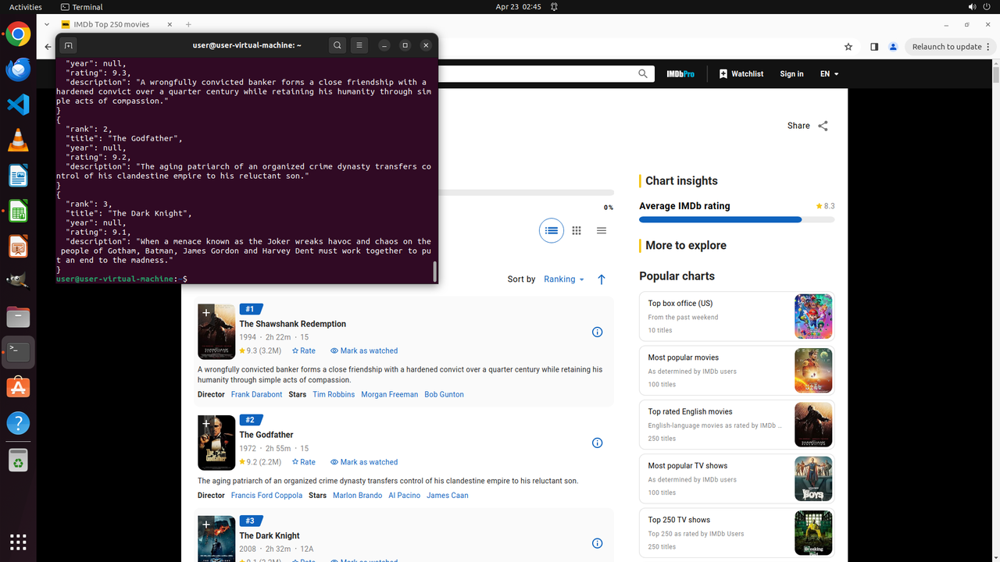

**Response:**
```
I can see the data has descriptions but the years are null. The year selector doesn't work in the detailed view. I need to fix the year extraction. Let me use a different approach - extract the year from the metadata text that shows "1994 · 2h 22m · 15". Let me re-extract with the correct selector for the detailed view.
```

**Actions:** `import subprocess, shlex; subprocess.run(f'xdotool type --delay 12 -- ' + shlex.quote("python3 << 'PYEOF'\nimport json, websocket, urllib."), shell=True, check=True)
import time; time.sleep(0.05)
impo`

---

## Step 70

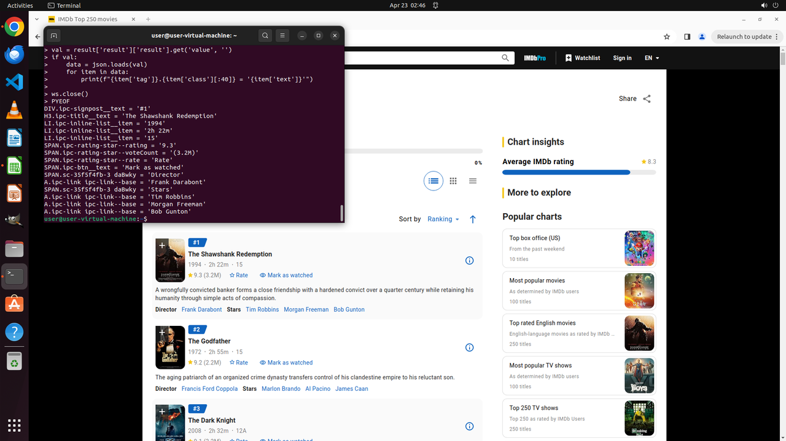

**Response:**
```
Now I can see the structure clearly. The year is in `LI.ipc-inline-list__item` elements - the first one has '1994', the second '2h 22m', and the third '15'. So my original selector was correct, but the class name in the detailed view might be different. Let me check - the class is `ipc-inline-list__item` without the `cli-title-metadata-item` prefix.

I can see the year is in `LI.ipc-inline-list__item`. The issue was that my JavaScript was looking for `.cli-title-metadata li.ipc-inline-list__item` but in the detailed view, the structure might be slightly different. Let me now re-extract the data with the correct selector.
```

**Actions:** `import subprocess, shlex; subprocess.run(f'xdotool type --delay 12 -- ' + shlex.quote("python3 << 'PYEOF'\nimport json, websocket, urllib."), shell=True, check=True)
import time; time.sleep(0.05)
impo`

---

## Step 71

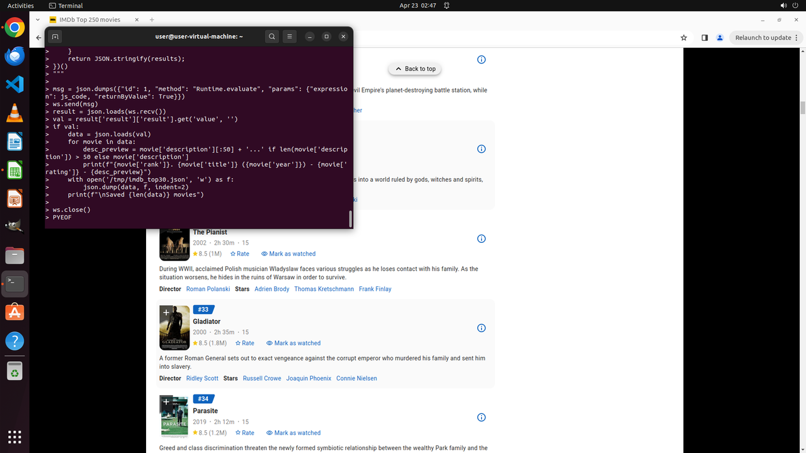

**Response:**
```
The script is still running. Let me wait for it to complete.
```

**Actions:** `time.sleep(0.5)`

---

## Step 72

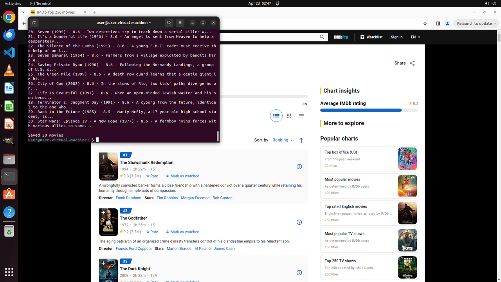

**Response:**
```
Now I have all 30 movies with years and descriptions! I can see the data is now complete with years (1995, 1946, 1991, 1954, 1998, 1999, 2002, 1997, 1991, 1985, 1977). Let me scroll up to see the full list.
```

**Actions:** `pyautogui.scroll(10, 450, 300)`

---

## Step 73

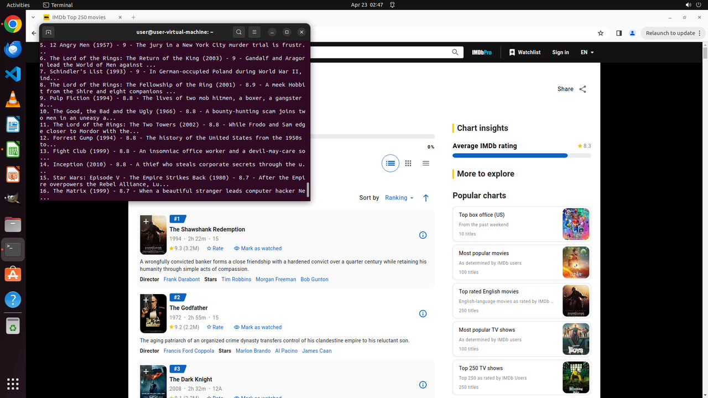

**Response:**
```
Now I can see the full IMDB Top 30 list with years and descriptions. All movies have years now. Let me now write the final script that compares with the seen movies and creates the unseen_movies sheet in the Excel file.
```

**Actions:** `import subprocess, shlex; subprocess.run(f'xdotool type --delay 12 -- ' + shlex.quote("python3 << 'PYEOF'\nimport json, openpyxl\n\n# Load I"), shell=True, check=True)
import time; time.sleep(0.05)
im`

---

## Step 74

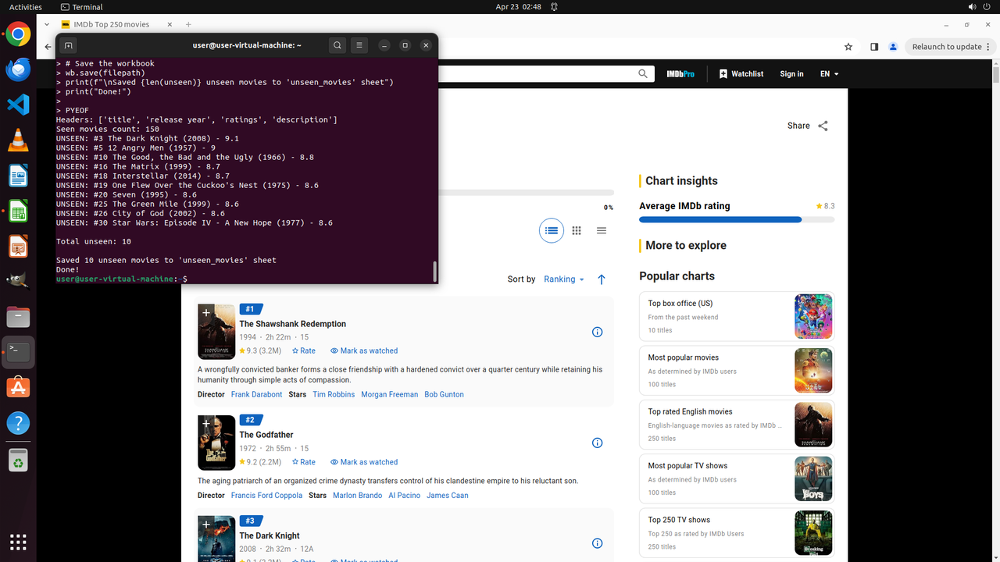

**Response:**
```
The script has completed successfully! Here's the summary:

**10 unseen movies from IMDB Top 30 (released before 2024):**
1. #3 The Dark Knight (2008) - 9.1
2. #5 12 Angry Men (1957) - 9
3. #10 The Good, the Bad and the Ugly (1966) - 8.8
4. #16 The Matrix (1999) - 8.7
5. #18 Interstellar (2014) - 8.7
6. #19 One Flew Over the Cuckoo's Nest (1975) - 8.6
7. #20 Seven (1995) - 8.6
8. #25 The Green Mile (1999) - 8.6
9. #26 City of God (2002) - 8.6
10. #30 Star Wars: Episode IV - A New Hope (1977) - 8.6

The unseen_movies sheet has been created with the same headers (title, release year, ratings, description) and sorted by IMDB rankings from high to low.

Now let me verify the results by opening the Excel file in LibreOffice Calc.
```

**Actions:** `pyautogui.keyDown('alt')
pyautogui.keyDown('tab')
pyautogui.keyUp('tab')
pyautogui.keyUp('alt')`

---

## Step 75

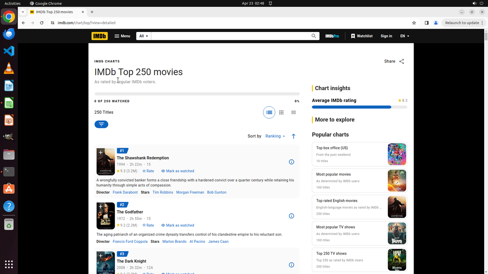

**Response:**
```
I see Chrome is in the foreground. I need to switch to LibreOffice Calc to verify the Excel file. Let me click on the LibreOffice Calc icon in the taskbar.
```

**Actions:** `pyautogui.click(33, 337)`

---

## Step 76

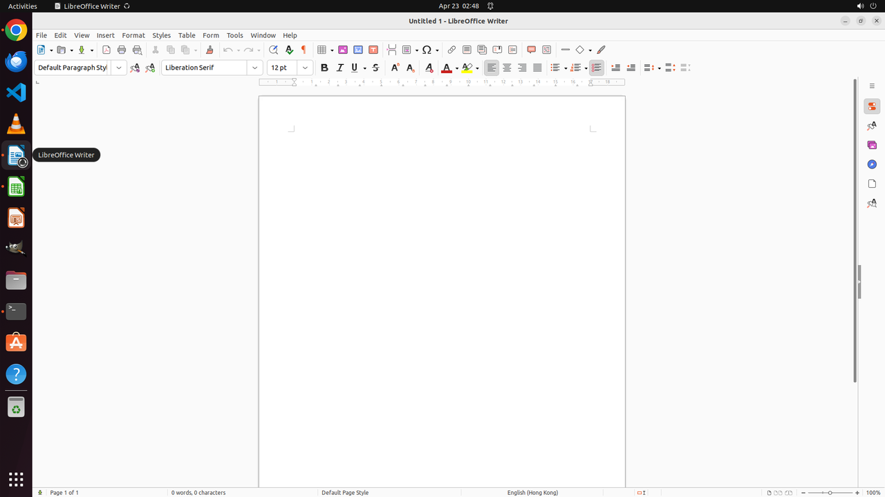

**Response:**
```
This opened LibreOffice Writer instead of Calc. I need to open the Excel file. Let me open the movies.xlsx file directly.
```

**Actions:** `pyautogui.click(85, 76)`

---

## Step 77

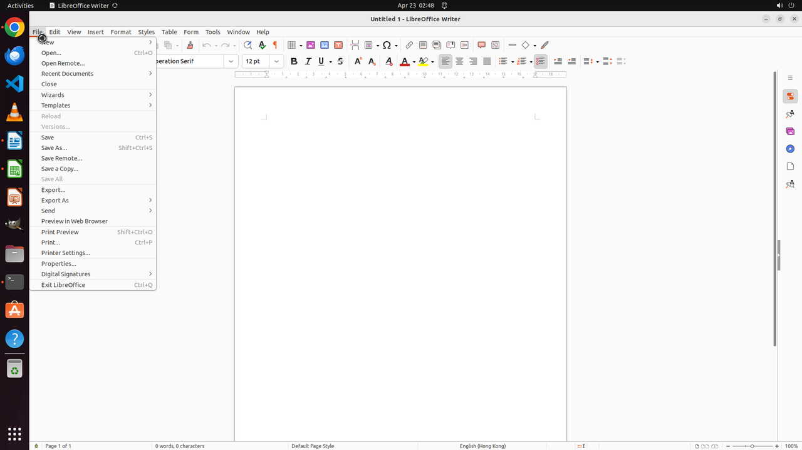

**Actions:** `pyautogui.click(120, 126)`

---

## Step 78

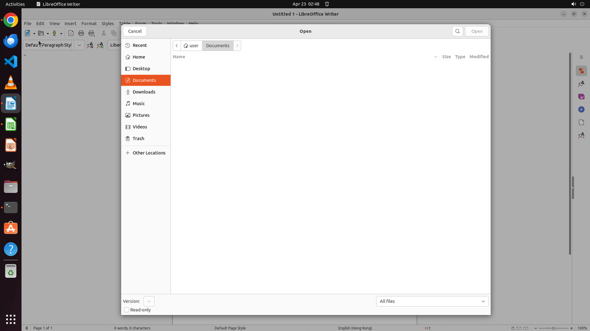

**Response:**
```
I need to navigate to the Desktop folder to open the movies.xlsx file.
```

**Actions:** `pyautogui.click(460, 223)`

---

## Step 79

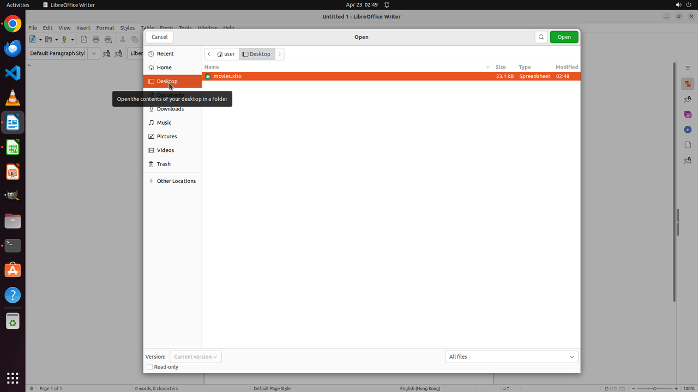

**Response:**
```
I can see the movies.xlsx file on the Desktop. It was modified at 02:48 which confirms our Python script saved it. Let me double-click to open it.
```

**Actions:** `pyautogui.doubleClick(622, 208)`

---

## Step 80

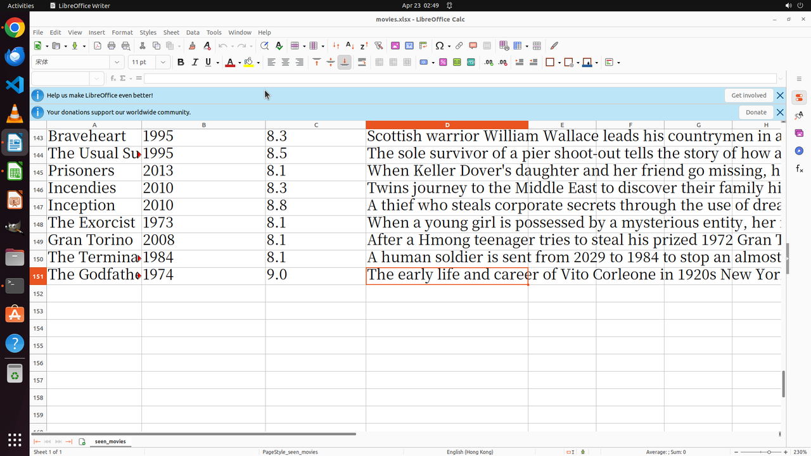

**Response:**
```
The file is open in LibreOffice Calc. I can see the "seen_movies" sheet tab at the bottom. But I notice there's only one sheet tab visible - "seen_movies". I need to check if the "unseen_movies" sheet was created. Let me look more carefully at the bottom of the screen. I can see "seen_movies" tab. Let me check if there's another tab by scrolling the sheet tabs.

Wait, I see only "seen_movies" tab. Let me check if the unseen_movies sheet was created properly. It's possible the sheet tab is hidden to the right. Let me right-click on the sheet tab to see all sheets.
```

**Actions:** `pyautogui.rightClick(262, 1044)`

---

## Step 81

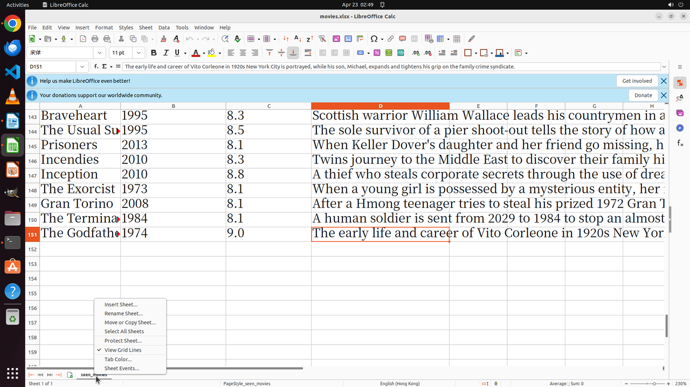

**Response:**
```
I can see the context menu. I see "Select All Sheets" option but I only see one sheet. It seems the unseen_movies sheet wasn't created properly, or the file wasn't saved correctly by openpyxl. Let me click "Show Sheet..." to see if there are hidden sheets.
```

**Actions:** `pyautogui.keyDown('esc')
pyautogui.keyUp('esc')`

---

## Step 82


**Response:**
```
I see only "seen_movies" tab at the bottom. The unseen_movies sheet may not have been created, or the tab navigation arrows might be hiding it. Let me check by clicking the right arrow for sheet tabs at the bottom left.
```

**Actions:** `pyautogui.click(160, 1044)`

---

## Step 83


**Response:**
```
I only see the "seen_movies" tab. It seems the unseen_movies sheet wasn't saved properly. This could be because the file was open in LibreOffice when openpyxl tried to save it, or there was an issue with the save. Let me close this file and re-run the script. But first, let me close this LibreOffice Calc window and check the file from the terminal.
```

**Actions:** `pyautogui.keyDown('ctrl')
pyautogui.keyDown('w')
pyautogui.keyUp('w')
pyautogui.keyUp('ctrl')`

---

## Step 84

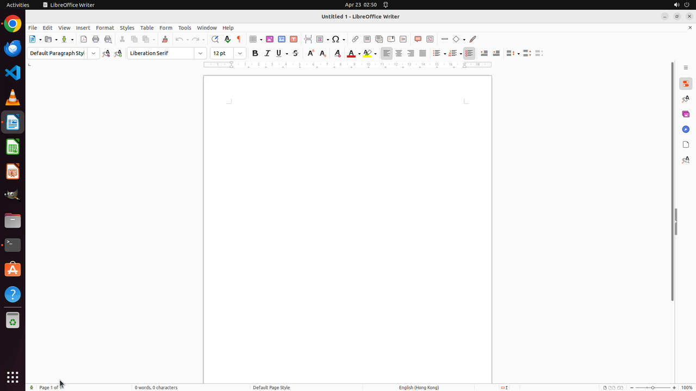

**Response:**
```
Good, the file was closed. Now I'm back to LibreOffice Writer. Let me switch to the terminal and check the file. The issue might be that openpyxl saved the file but it was overwritten by the original file being open in LibreOffice. Let me check from the terminal.
```

**Actions:** `pyautogui.click(33, 673)`

---

## Step 85

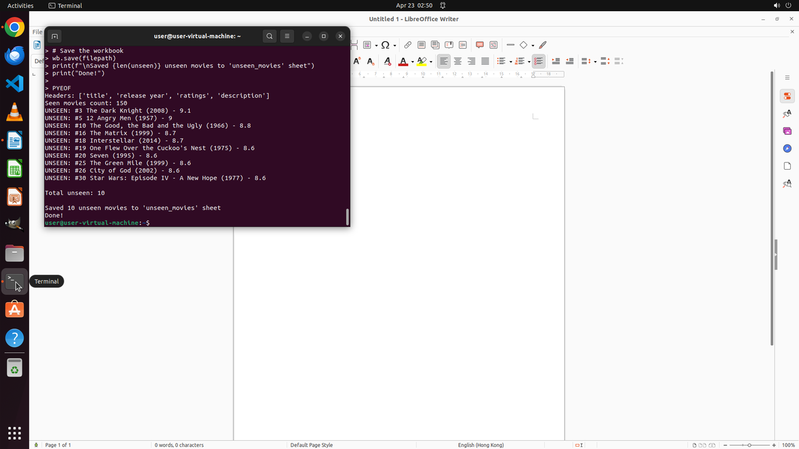

**Response:**
```
Good, I can see the terminal. The script said it saved 10 unseen movies. Let me verify the file has the unseen_movies sheet by checking with Python.
```

**Actions:** `pyautogui.click(450, 535)`

---

## Step 86

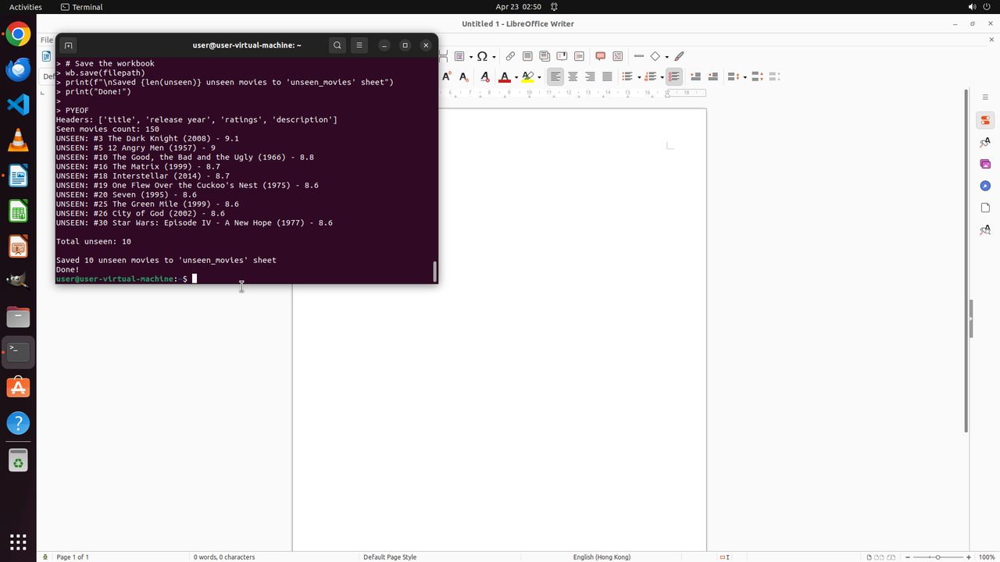

**Actions:** `import subprocess, shlex; subprocess.run(f'xdotool type --delay 12 -- ' + shlex.quote('python3 -c "\nimport openpyxl\nwb = openpyxl.load_wo'), shell=True, check=True)
import time; time.sleep(0.05)
imp`

---

## Step 87


**Response:**
```
The unseen_movies sheet exists in the Excel file with all the data! I can see all 10 unseen movies with their titles, years, ratings, and descriptions. Let me scroll up to see the headers and the first few movies.
```

**Actions:** `pyautogui.scroll(5, 450, 300)`

---

## Step 88

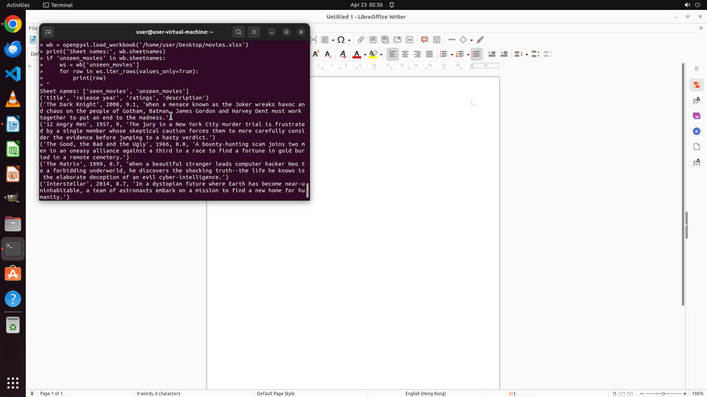

**Response:**
```
The data is confirmed. The file has both sheets: `['seen_movies', 'unseen_movies']`. The headers are correct: `('title', 'release_year', 'ratings', 'description')`. Wait - I see the headers say `release_year` but the original sheet had `release year` (with a space). Let me check the original headers.

Looking at the output:
- Headers: `('title', 'release_year', 'ratings', 'description')`

But wait, let me check what the original seen_movies headers actually are. Let me scroll up more... I can see the output says `Headers: ['title', 'release year', 'ratings', 'description']` from the earlier script run. But in the unseen_movies sheet, it shows `('title', 'release_year', 'ratings', 'description')` - that's wrong! The header should be `release year` with a space, not `release_year` with an underscore.

Wait, actually looking at the output more carefully, the header row shows: `('title', 'release_year', 'ratings', 'description')`. But the original headers from the seen_movies sheet were `['title', 'release year', 'ratings', 'description']`. Let me check if this is actually correct. The Python output might be showing the header values from the sheet. Let me verify.

Actually wait, looking at the terminal output again: `Sheet names: ['seen_movies', 'unseen_movies']` and the first row is `('title', 'release_year', 'ratings', 'description')`. But the seen_movies sheet headers might have been `release year` (with space). Let me verify this.
```

**Actions:** `import subprocess, shlex; subprocess.run(f'xdotool type --delay 12 -- ' + shlex.quote('python3 -c "\nimport openpyxl\nwb = openpyxl.load_wo'), shell=True, check=True)
import time; time.sleep(0.05)
imp`

---

## Step 89

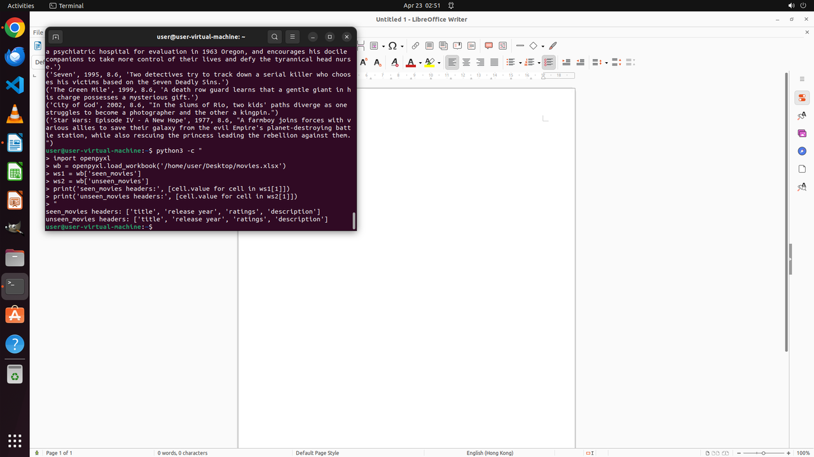

**Response:**
```
The headers match exactly:
- **seen_movies headers:** `['title', 'release year', 'ratings', 'description']`
- **unseen_movies headers:** `['title', 'release year', 'ratings', 'description']`

Both sheets have identical headers. The data is correct. Now let me open the file in LibreOffice Calc to verify it visually. But first, I need to understand why LibreOffice didn't show the unseen_movies tab earlier. It might have been a display issue. Let me open the file again.
```

**Actions:** `import subprocess, shlex; subprocess.run(f'xdotool type --delay 12 -- ' + shlex.quote('libreoffice --calc /home/user/Desktop/movies.xlsx '), shell=True, check=True)
import time; time.sleep(0.05)
impor`

---

## Step 90

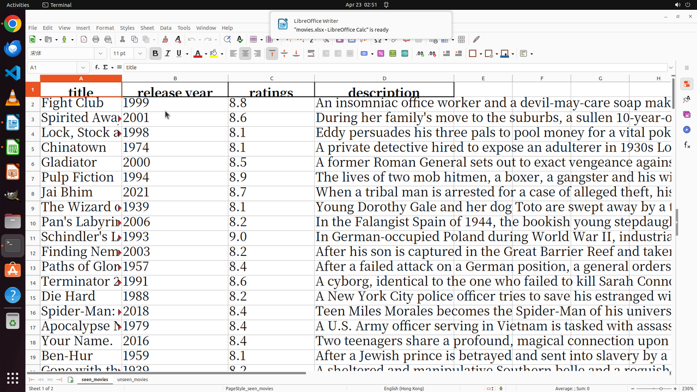

**Response:**
```
Excellent! I can see the file is now open in LibreOffice Calc with both sheet tabs visible at the bottom: "seen_movies" and "unseen_movies". The seen_movies sheet is currently active showing 150 movies. Let me click on the "unseen_movies" tab to verify the data.
```

**Actions:** `pyautogui.click(366, 1045)`

---

## Step 91


**Response:**
```
The "unseen_movies" sheet has been created successfully with all 10 unseen movies from the IMDB Top 30 list. The data looks correct:

**Headers:** title, release year, ratings, description (same as seen_movies)

**Unseen movies (sorted by IMDB ranking from high to low):**
1. The Dark Knight (2008) - 9.1
2. 12 Angry Men (1957) - 9
3. The Good, the Bad and the Ugly (1966) - 8.8
4. The Matrix (1999) - 8.7
5. Interstellar (2014) - 8.7
6. One Flew Over the Cuckoo's Nest (1975) - 8.6
7. Seven (1995) - 8.6
8. The Green Mile (1999) - 8.6
9. City of God (2002) - 8.6
10. Star Wars: Episode IV - A New Hope (1977) - 8.6

All movies are released before 2024, sorted by IMDB ranking from highest to lowest, and the sheet has the same headers as the seen_movies sheet. The task is complete!

Now let me save the file to make sure everything is preserved.
```

**Actions:** `pyautogui.keyDown('ctrl')
pyautogui.keyDown('s')
pyautogui.keyUp('s')
pyautogui.keyUp('ctrl')`

---

## Step 92

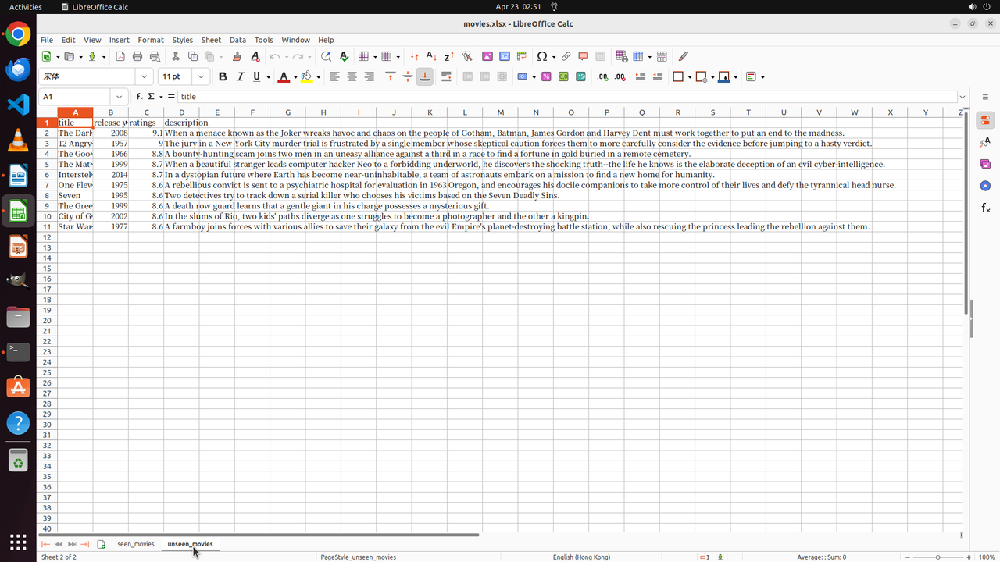

**Response:**
```
The file has been saved successfully. The task is complete. The "unseen_movies" sheet has been created in the movies.xlsx file with:

1. **Same headers** as the seen_movies sheet: title, release year, ratings, description
2. **10 unseen movies** from the IMDB Top 30 list (all released before 2024)
3. **Sorted by IMDB rankings from high to low** (best ranked first):
   - The Dark Knight (2008) - 9.1
   - 12 Angry Men (1957) - 9.0
   - The Good, the Bad and the Ugly (1966) - 8.8
   - The Matrix (1999) - 8.7
   - Interstellar (2014) - 8.7
   - One Flew Over the Cuckoo's Nest (1975) - 8.6
   - Seven (1995) - 8.6
   - The Green Mile (1999) - 8.6
   - City of God (2002) - 8.6
   - Star Wars: Episode IV - A New Hope (1977) - 8.6

DONE
```

**Actions:** `DONE`

---
