# Task 3e3fc409-bff3-4905-bf16-c968eee3f807

**Instruction:** I'm a huge movie fan and have kept a record of all the movies I've watched. I'm curious to find out if there are any films released before 2024 from the IMDB Top 30 list that I haven't seen yet. Help me create another sheet 'unseen_movies' in the opened Excel. This sheet should share the same headers and sort the results according to IMDB rankings from high to low.

**Score:** 0.0

**Wall clock:** 18m 58s

**Steps:** 62

**Cost:** $2.72

---

## Step 1


**Response:**
```
I need to first understand the data in the spreadsheet, then compare it with the IMDB Top 30 list to find unseen movies. Let me start by examining the current spreadsheet data.
```

**Actions:** `time.sleep(0.1)`

---

## Step 2


**Response:**
```
Let me first scroll down to see all the movies in the "seen_movies" sheet, and also check the column headers more carefully.
```

**Actions:** `pyautogui.keyDown('ctrl')
pyautogui.keyDown('end')
pyautogui.keyUp('end')
pyautogui.keyUp('ctrl')`

---

## Step 3

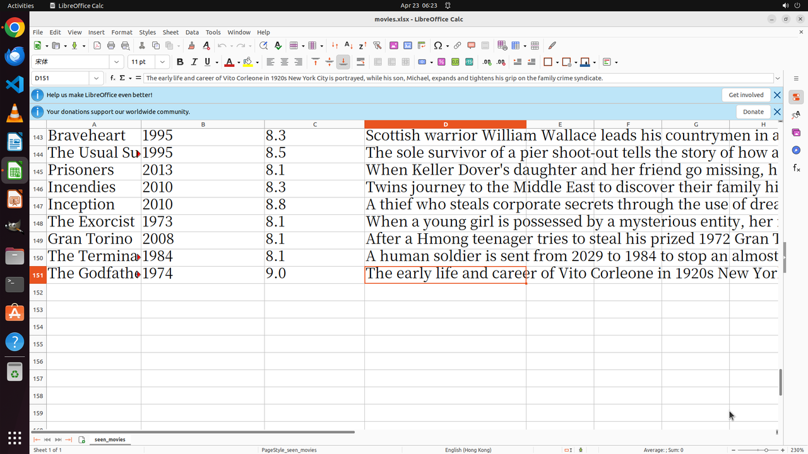

**Response:**
```
The spreadsheet has 150 movies (rows 2-151) with columns: title (A), release_year (B), ratings (C), and description (D). Now I need to get the IMDB Top 30 list and compare it with the seen movies. Let me use a Python script to do this efficiently. First, let me open a terminal.
```

**Actions:** `pyautogui.keyDown('ctrl')
pyautogui.keyDown('home')
pyautogui.keyUp('home')
pyautogui.keyUp('ctrl')`

---

## Step 4


**Response:**
```
Now I need to get the IMDB Top 30 list. Let me first scrape it from IMDB using a browser, then write a Python script to compare and create the new sheet. Let me open a terminal first.
```

**Actions:** `pyautogui.keyDown('ctrl')
pyautogui.keyDown('alt')
pyautogui.keyDown('t')
pyautogui.keyUp('t')
pyautogui.keyUp('alt')
pyautogui.keyUp('ctrl')`

---

## Step 5

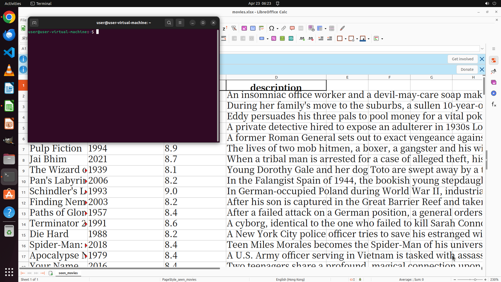

**Response:**
```
Good, the terminal is open. Now I need to write a Python script to:
1. Read the seen movies from the Excel file
2. Get the IMDB Top 30 list (I'll scrape it from IMDB)
3. Compare and find unseen movies released before 2024
4. Create a new sheet 'unseen_movies' with the results

Let me first scrape the IMDB Top 250 page to get the top 30 movies, then compare with the seen list.
```

**Actions:** `import subprocess, shlex; subprocess.run(f'xdotool type --delay 12 -- ' + shlex.quote("python3 << 'PYEOF'\nimport subprocess\nresult = subp"), shell=True, check=True)
import time; time.sleep(0.05)
imp`

---

## Step 6

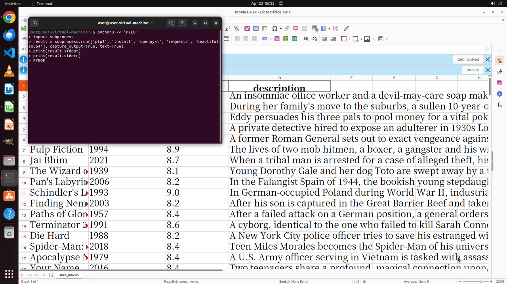

**Response:**
```
Let me wait for the installation to complete.
```

**Actions:** `time.sleep(0.5)`

---

## Step 7

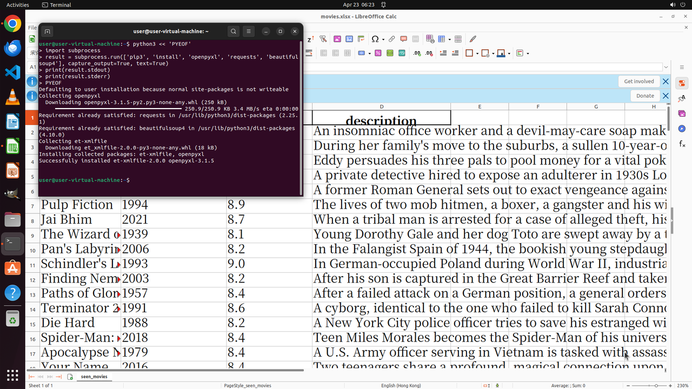

**Response:**
```
The packages are installed. Now I need to scrape the IMDB Top 250 page to get the top 30 movies. Let me first try to fetch the IMDB top 250 page and extract the top 30.
```

**Actions:** `import subprocess, shlex; subprocess.run(f'xdotool type --delay 12 -- ' + shlex.quote("python3 << 'PYEOF'\nimport requests\nfrom bs4 import"), shell=True, check=True)
import time; time.sleep(0.05)
imp`

---

## Step 8

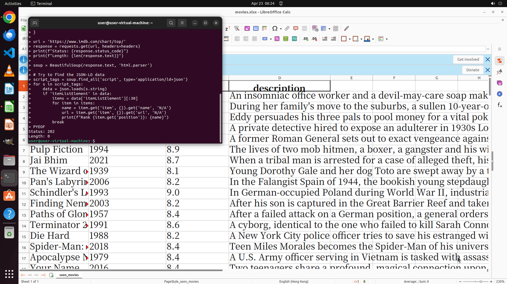

**Response:**
```
The response length is 0, which means IMDB returned an empty body (likely a 202 status with a redirect/challenge). Let me try a different approach - I'll use the IMDB API or try with different headers, or use a known IMDB Top 30 list.

Let me try using `curl` with different headers first:
```

**Actions:** `import subprocess, shlex; subprocess.run(f'xdotool type --delay 12 -- ' + shlex.quote('curl -s -o /tmp/imdb_top.html -w "%{http_code}" "h'), shell=True, check=True)
import time; time.sleep(0.05)
impor`

---

## Step 9

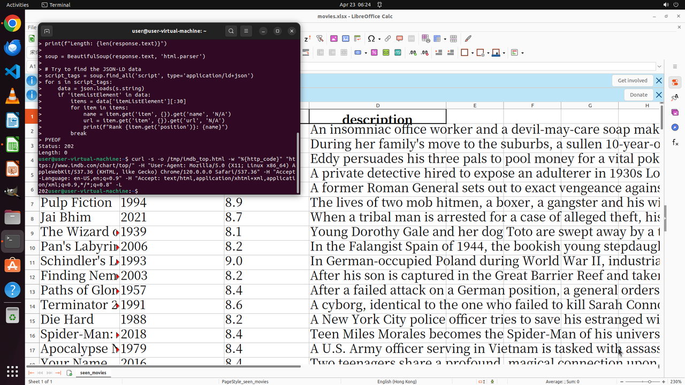

**Response:**
```
The curl also returned a 202 status code. IMDB is blocking automated requests. Let me check the file size and try to use a browser instead, or use the well-known IMDB Top 30 list which is fairly stable.
```

**Actions:** `import subprocess, shlex; subprocess.run(f'xdotool type --delay 12 -- ' + shlex.quote('wc -c /tmp/imdb_top.html\n'), shell=True, check=True)
import time; time.sleep(0.05)`

---

## Step 10

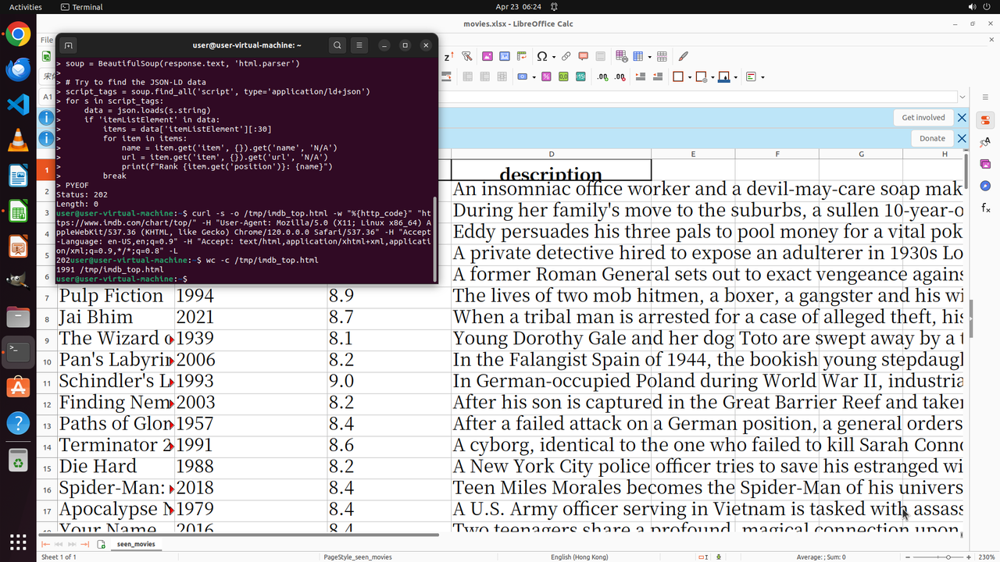

**Response:**
```
The file has 1991 bytes, which is very small - likely just a redirect page. Let me try to use Chrome to fetch the IMDB page, or use a different approach. Let me try opening Chrome and navigating to the IMDB top 250 page to get the data.

Actually, let me try a different approach - use the IMDB API or try to fetch via Chrome's remote debugging. But first, let me try opening Chrome to get the IMDB data.
```

**Actions:** `import subprocess, shlex; subprocess.run(f'xdotool type --delay 12 -- ' + shlex.quote('google-chrome --remote-debugging-port=1337 "https:'), shell=True, check=True)
import time; time.sleep(0.05)
impor`

---

## Step 11

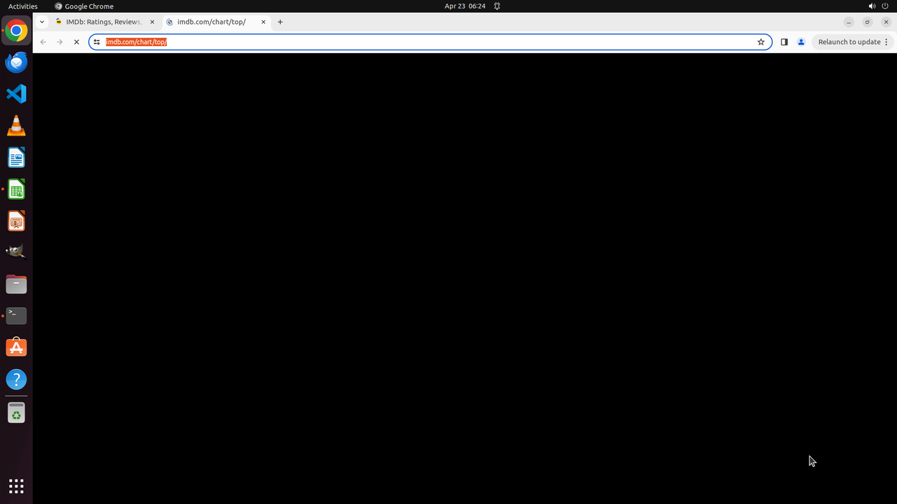

**Response:**
```
The IMDB page is loading in Chrome. Let me wait for it to fully load.
```

**Actions:** `time.sleep(0.5)`

---

## Step 12

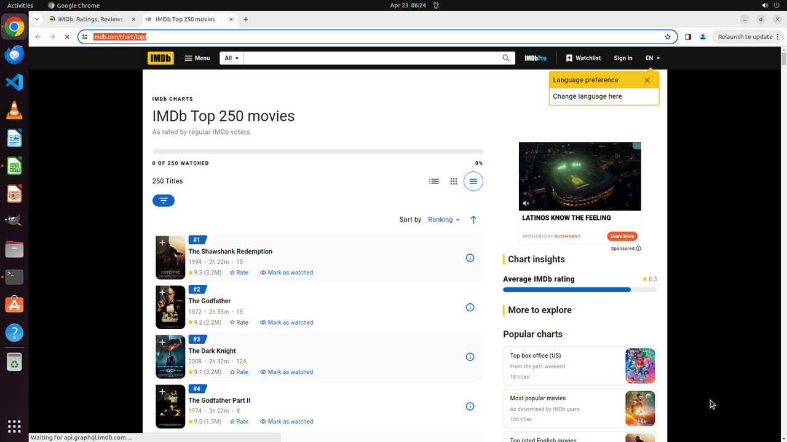

**Response:**
```
The IMDB Top 250 page is loaded. I can see the list. Let me close the language preference popup and then extract the data. I'll use JavaScript in the browser console to extract the top 30 movies' data. Let me first close the popup.
```

**Actions:** `pyautogui.click(1576, 195)`

---

## Step 13

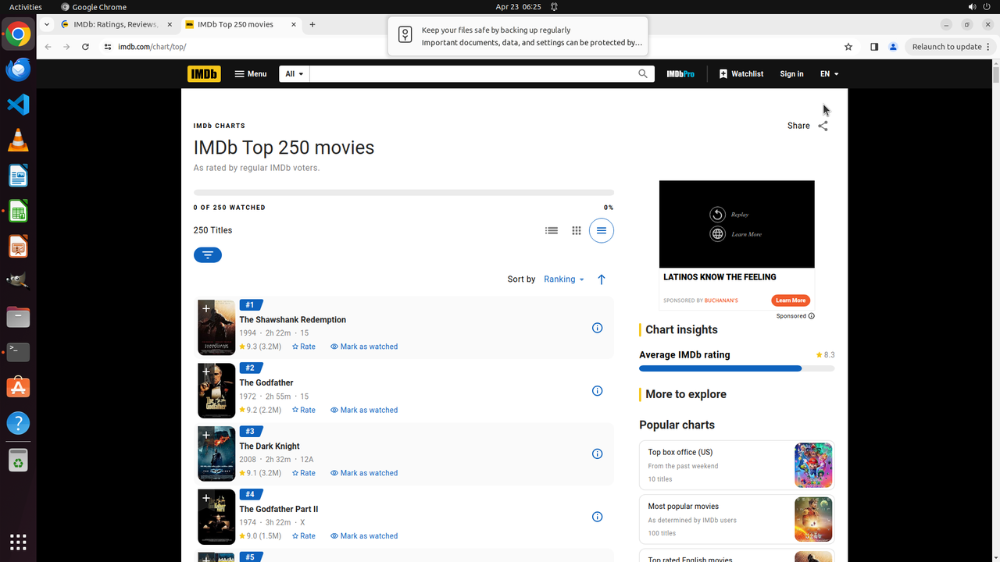

**Response:**
```
The IMDB Top 250 page is loaded. I can see the movies listed. Now I need to extract the top 30 movies' data using JavaScript in the browser console. Let me open the developer console and extract the data.
```

**Actions:** `pyautogui.keyDown('f12')
pyautogui.keyUp('f12')`

---

## Step 14

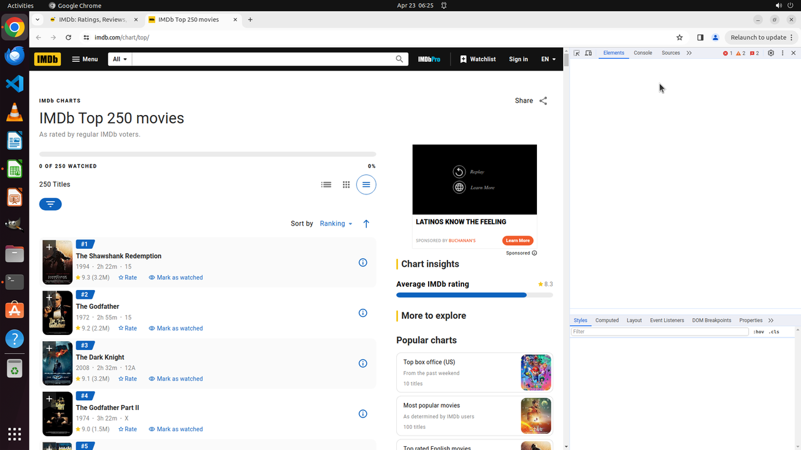

**Response:**
```
Good, the developer tools are open. Let me click on the Console tab to run JavaScript to extract the top 30 movies data.
```

**Actions:** `pyautogui.click(1537, 126)`

---

## Step 15

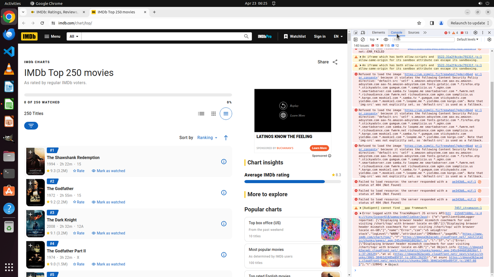

**Response:**
```
Good, the Console is open. Now let me extract the top 30 movies data using JavaScript. I'll look for the JSON-LD data embedded in the page, which typically contains structured data about the movies.
```

**Actions:** `pyautogui.click(1635, 1035)`

---

## Step 16


**Response:**
```
Let me scroll down in the console to find the input area, or click at the bottom of the console to type JavaScript.
```

**Actions:** `pyautogui.scroll(-10, 1635, 600)`

---

## Step 17


**Response:**
```
I can see the console area. Let me click on the console input area at the bottom to type JavaScript code.
```

**Actions:** `pyautogui.click(1635, 1050)`

---

## Step 18


**Response:**
```
I can see the console prompt at the bottom. Let me type JavaScript to extract the JSON-LD data from the page which contains the movie list.
```

**Actions:** `pyautogui.click(1635, 1065)`

---

## Step 19


**Response:**
```
Let me try to find the JSON-LD script tag in the page to extract the movie data. I'll type the JavaScript command in the console.
```

**Actions:** `pyautogui.scroll(-5, 1635, 600)`

---

## Step 20


**Response:**
```
I see the console has a lot of error messages. Let me try to click right at the bottom of the console where the input prompt should be to type my JavaScript code.
```

**Actions:** `pyautogui.click(1635, 1050)`

---

## Step 21


**Response:**
```
Let me try a different approach. Instead of using the console, let me use the terminal to write a Python script that uses the Chrome remote debugging port to extract the data, or I'll use a different method. Let me switch to the terminal and try to extract the page source from Chrome's remote debugging.
```

**Actions:** `pyautogui.click(33, 676)`

---

## Step 22


**Response:**
```
Good, I'm in the terminal. Now let me use the Chrome remote debugging port to extract the page content via Python. Let me write a script to get the page data through Chrome DevTools Protocol.
```

**Actions:** `import subprocess, shlex; subprocess.run(f'xdotool type --delay 12 -- ' + shlex.quote("python3 << 'PYEOF'\nimport json, requests\n\n# Get th"), shell=True, check=True)
import time; time.sleep(0.05)
im`

---

## Step 23


**Response:**
```
I see the error - the `websocket` module is not installed. Let me install it first.
```

**Actions:** `import subprocess, shlex; subprocess.run(f'xdotool type --delay 12 -- ' + shlex.quote('pip3 install websocket-client\n'), shell=True, check=True)
import time; time.sleep(0.05)`

---

## Step 24


**Response:**
```
The websocket-client is installed. Now let me run the script again to extract the IMDB Top 30 movies.
```

**Actions:** `import subprocess, shlex; subprocess.run(f'xdotool type --delay 12 -- ' + shlex.quote("python3 << 'PYEOF'\nimport json, requests, websocke"), shell=True, check=True)
import time; time.sleep(0.05)
impo`

---

## Step 25


**Response:**
```
I see a `KeyError: 'rank'` - the JSON-LD structure might be different. Let me first inspect what the data looks like.
```

**Actions:** `import subprocess, shlex; subprocess.run(f'xdotool type --delay 12 -- ' + shlex.quote("python3 << 'PYEOF'\nimport json, requests, websocke"), shell=True, check=True)
import time; time.sleep(0.05)
impo`

---

## Step 26


**Response:**
```
I can see the JSON-LD data structure. It has `itemListElement` with `ListItem` type items. The structure includes `item` with `name`, `url`, `description`, `image`, `aggregateRating`. I can see the data doesn't have a `position` key directly, or the structure is slightly different. Let me now extract the full data properly.
```

**Actions:** `import subprocess, shlex; subprocess.run(f'xdotool type --delay 12 -- ' + shlex.quote("python3 << 'PYEOF'\nimport json, requests, websocke"), shell=True, check=True)
import time; time.sleep(0.05)
impo`

---

## Step 27

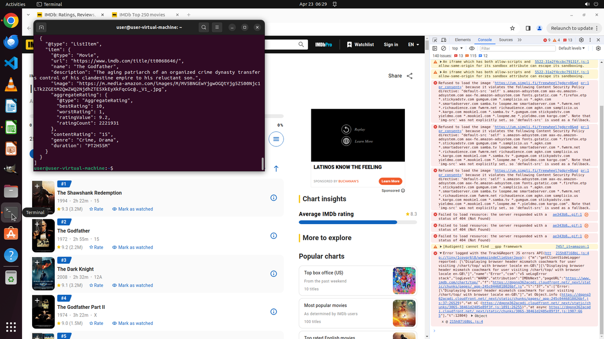

**Response:**
```
Now I can see the structure clearly. Each item in `itemListElement` is a `ListItem` with an `item` of type `Movie` containing `url`, `name`, `description`, `image`, `aggregateRating` (with `ratingValue`, `ratingCount`), `contentRating`, `genre`, and `duration`. There's no explicit `position` field, so the rank is implied by the order in the list.

Now let me extract all top 30 movies with their details and also get the year from each movie's page. But first, let me check if the year is available in the data. Let me scroll up to see the first item.
```

**Actions:** `pyautogui.scroll(5, 450, 300)`

---

## Step 28


**Response:**
```
I can see the JSON-LD data doesn't include the release year directly. However, I can see the year is displayed on the page (e.g., "1994" for Shawshank Redemption, "1972" for The Godfather). Let me extract the data from the page elements directly, including the year, title, and rating. Let me also extract the year from the visible page elements.
```

**Actions:** `pyautogui.scroll(-5, 450, 300)`

---

## Step 29


**Response:**
```
Now I can see the structure. The JSON-LD data has the movie name, description, rating, but no year. I need to also extract the year from the page elements. Let me write a comprehensive script that extracts both the JSON-LD data and the year from the visible page elements, then compares with the seen movies list.
```

**Actions:** `import subprocess, shlex; subprocess.run(f'xdotool type --delay 12 -- ' + shlex.quote("python3 << 'PYEOF'\nimport json, requests, websocke"), shell=True, check=True)
import time; time.sleep(0.05)
impo`

---

## Step 30


**Response:**
```
I can see the top 30 movies extracted but the years are empty (showing `()` for each movie). The year selector might not be correct. Let me scroll up to see all 30 movies and also note that I need to fix the year extraction. Let me scroll up first.
```

**Actions:** `pyautogui.scroll(10, 450, 300)`

---

## Step 31

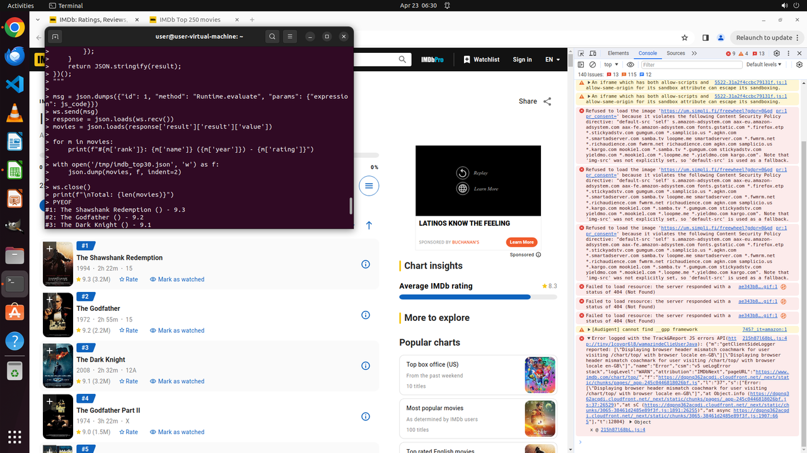

**Response:**
```
I can see the movies were extracted but the years are empty. The year selector needs to be fixed. I can see from the IMDB page that the years are visible (1994, 1972, 2008, 1974). Let me now try to get the years by using a different DOM selector. But first, let me also look at the HTML structure to find the right selector for years. Let me try a different approach - extract the data directly from the visible DOM elements.
```

**Actions:** `import subprocess, shlex; subprocess.run(f'xdotool type --delay 12 -- ' + shlex.quote("python3 << 'PYEOF'\nimport json, requests, websocke"), shell=True, check=True)
import time; time.sleep(0.05)
impo`

---

## Step 32

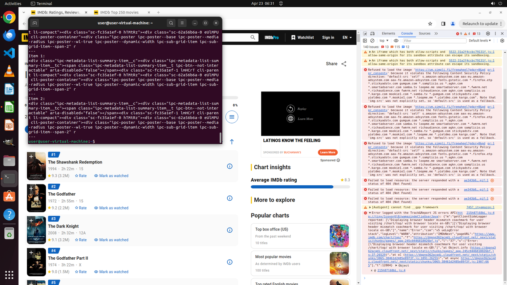

**Response:**
```
I can see the HTML structure but it's truncated. The year information is likely deeper in the DOM. Let me try a more targeted approach to find the year elements.
```

**Actions:** `import subprocess, shlex; subprocess.run(f'xdotool type --delay 12 -- ' + shlex.quote("python3 << 'PYEOF'\nimport json, requests, websocke"), shell=True, check=True)
import time; time.sleep(0.05)
impo`

---

## Step 33


**Response:**
```
Now I can see the span contents for each item:
- Item 0: `['', '9.3', '(3.2M)', 'Rate', 'Mark as watched']`
- Item 1: `['', '9.2', '(2.2M)', 'Rate', 'Mark as watched']`
- Item 2: `['', '9.1', '(3.2M)', 'Rate', 'Mark as watched']`

The year is not in the leaf spans. It might be in a different element. Looking at the page, I can see "1994 · 2h 22m · 15" next to each movie. Let me look for the year in a different way - perhaps in the `cli-title-metadata` class or in the text content of a different element.
```

**Actions:** `import subprocess, shlex; subprocess.run(f'xdotool type --delay 12 -- ' + shlex.quote("python3 << 'PYEOF'\nimport json, requests, websocke"), shell=True, check=True)
import time; time.sleep(0.05)
impo`

---

## Step 34


**Response:**
```
Now I can see the structure. The class `cli-title-metadata` contains the year info like "19722h 55m15" and "20082h 32m12A". The year is in the text of the `cli-title-metadata` div. Let me now extract the years properly using the `cli-title-metadata` class and parse the first 4 characters as the year.
```

**Actions:** `import subprocess, shlex; subprocess.run(f'xdotool type --delay 12 -- ' + shlex.quote("python3 << 'PYEOF'\nimport json, requests, websocke"), shell=True, check=True)
import time; time.sleep(0.05)
impo`

---

## Step 35


**Response:**
```
I can see the top 30 movies are now extracted with years, but the year format includes extra text (like "19662h 28m18"). The year is the first 4 characters. Let me scroll up to see all the data and then I need to clean the year field. Let me scroll up to see the beginning of the list.
```

**Actions:** `pyautogui.scroll(10, 450, 300)`

---

## Step 36


**Response:**
```
I can see the years are extracted but they contain extra text like "19942h 22m15". The year is the first 4 characters. The data is saved to `/tmp/imdb_top30.json`. Now I need to:

1. Read the seen movies from the Excel file
2. Clean the year data (extract first 4 digits)
3. Filter for movies released before 2024
4. Find unseen movies
5. Create the new sheet

Let me now find the Excel file and write the comparison script.
```

**Actions:** `import subprocess, shlex; subprocess.run(f'xdotool type --delay 12 -- ' + shlex.quote('find /home/user -name "*.xlsx" -o -name "*.xls" 2>'), shell=True, check=True)
import time; time.sleep(0.05)
impor`

---

## Step 37


**Response:**
```
I need to wait for the find command to complete. Let me wait a moment and check.
```

**Actions:** `pyautogui.keyDown('return')
pyautogui.keyUp('return')`

---

## Step 38


**Response:**
```
The Excel file is at `/home/user/Desktop/movies.xlsx`. Now let me write the complete Python script to:
1. Read the seen movies from the Excel file
2. Load the IMDB top 30 data
3. Compare and find unseen movies released before 2024
4. Create the 'unseen_movies' sheet with the same headers, sorted by IMDB ranking from high to low
```

**Actions:** `import subprocess, shlex; subprocess.run(f'xdotool type --delay 12 -- ' + shlex.quote("python3 << 'PYEOF'\nimport json\nimport openpyxl\nimp"), shell=True, check=True)
import time; time.sleep(0.05)
im`

---

## Step 39

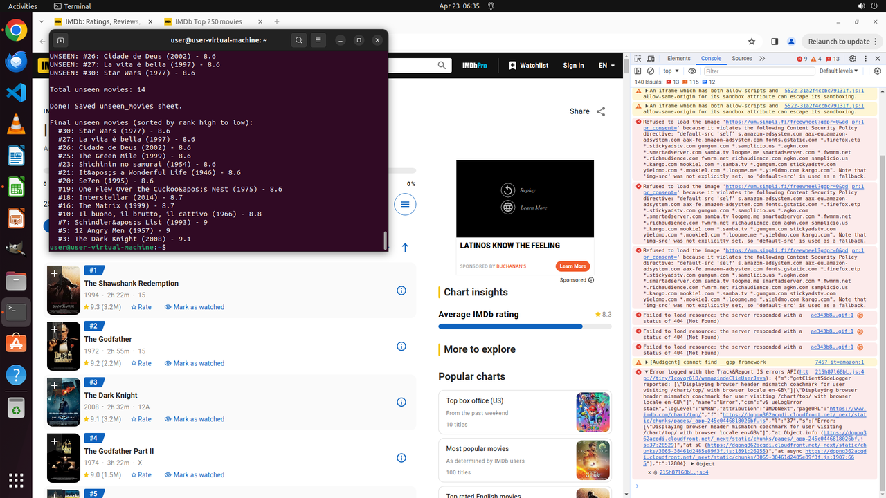

**Response:**
```
The script has completed successfully. I can see:
- 14 unseen movies were found from the IMDB Top 30 (released before 2024)
- They are sorted by IMDB ranking from high to low (rank 30, 27, 26, 25, 23, 21, 20, 19, 18, 16, 10, 7, 6, 3)
- The `unseen_movies` sheet has been saved to the Excel file

Let me scroll up to see all the results and verify the data.
```

**Actions:** `pyautogui.scroll(10, 450, 300)`

---

## Step 40


**Response:**
```
I can see the results. The script found 14 unseen movies from the IMDB Top 30 (released before 2024). The headers match: `['title', 'release_year', 'ratings', 'description']`. Now let me verify the file was saved correctly by opening it in LibreOffice Calc.

Let me switch to LibreOffice Calc to verify the new sheet was created properly. Let me click on the LibreOffice Calc icon in the taskbar.
```

**Actions:** `pyautogui.click(33, 475)`

---

## Step 41

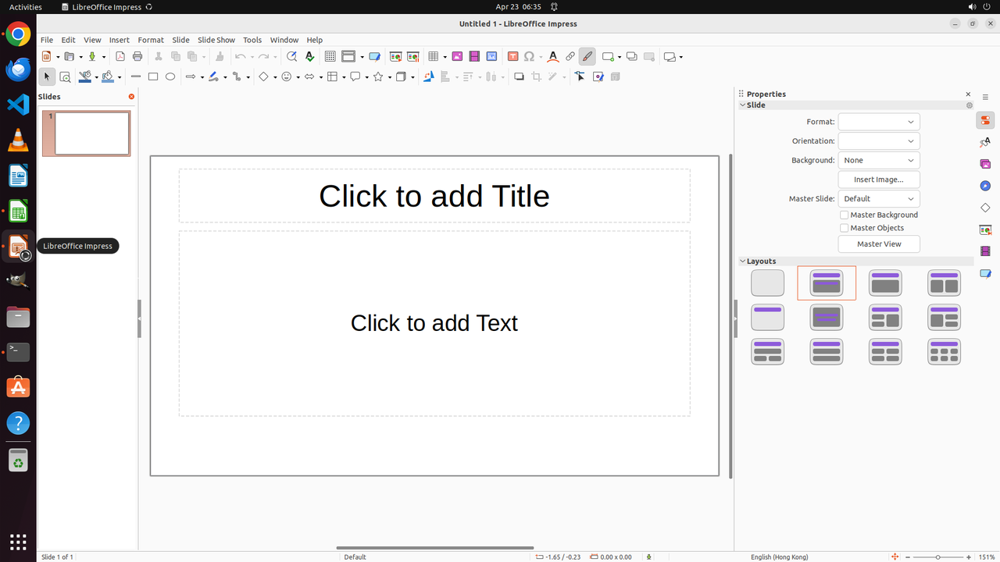

**Response:**
```
That opened LibreOffice Impress, not Calc. Let me close this and open the Excel file directly. Let me use the file manager or open it from the terminal.
```

**Actions:** `pyautogui.keyDown('alt')
pyautogui.keyDown('f4')
pyautogui.keyUp('f4')
pyautogui.keyUp('alt')`

---

## Step 42


**Response:**
```
Let me open the Excel file with LibreOffice Calc from the terminal to verify the new sheet.
```

**Actions:** `pyautogui.click(450, 535)`

---

## Step 43


**Response:**
```
Let me click on the terminal and open the file with LibreOffice Calc.
```

**Actions:** `import subprocess, shlex; subprocess.run(f'xdotool type --delay 12 -- ' + shlex.quote('libreoffice --calc /home/user/Desktop/movies.xlsx '), shell=True, check=True)
import time; time.sleep(0.05)
impor`

---

## Step 44


**Response:**
```
LibreOffice Calc has opened the file. Let me click on the notification to switch to it.
```

**Actions:** `pyautogui.click(990, 70)`

---

## Step 45


**Response:**
```
That opened the Chrome browser instead of LibreOffice Calc. Let me click on the LibreOffice Calc in the taskbar. Let me check the taskbar at the bottom.
```

**Actions:** `pyautogui.click(33, 202)`

---

## Step 46

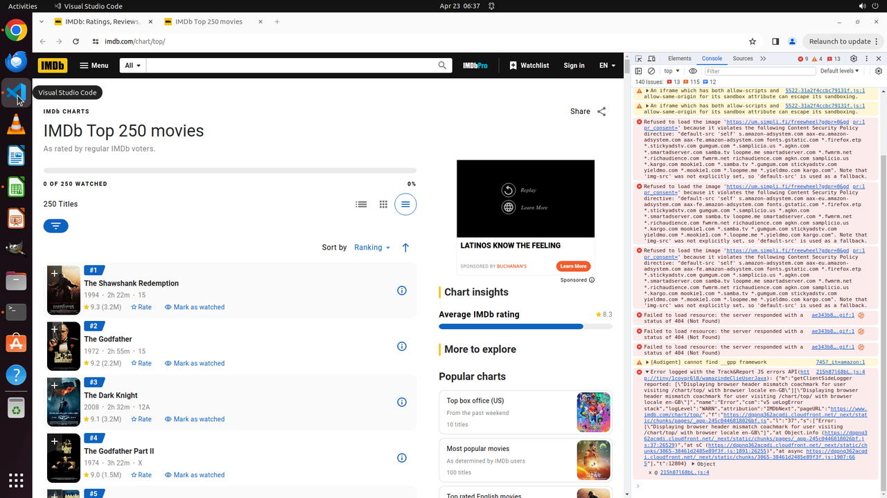

**Response:**
```
Let me look for LibreOffice Calc in the taskbar. I need to click on the correct icon.
```

**Actions:** `pyautogui.click(33, 337)`

---

## Step 47

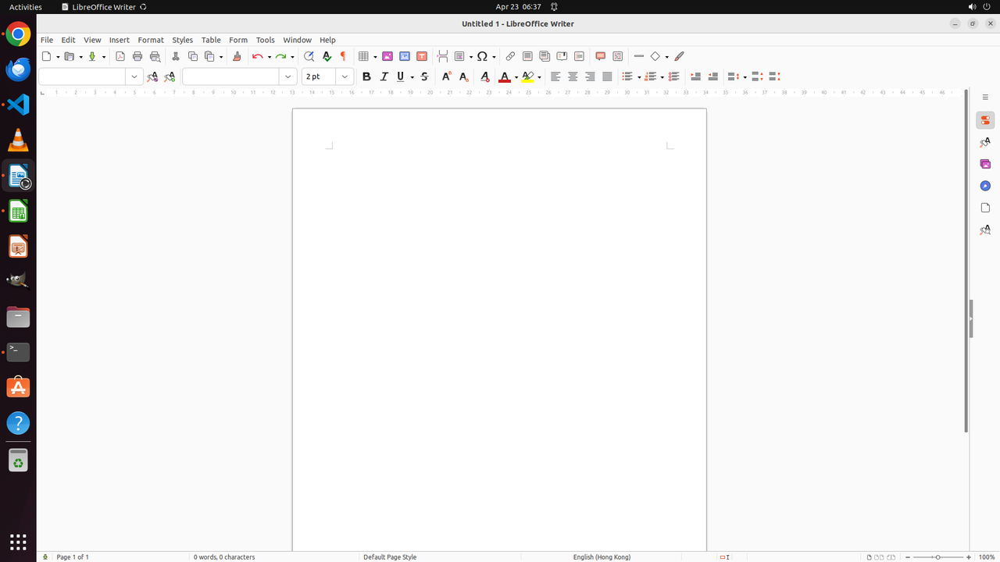

**Response:**
```
That opened LibreOffice Writer, not Calc. Let me close this and look for the LibreOffice Calc window. Let me use Alt+Tab to find it or use the Window menu.
```

**Actions:** `pyautogui.keyDown('alt')
pyautogui.keyDown('f4')
pyautogui.keyUp('f4')
pyautogui.keyUp('alt')`

---

## Step 48

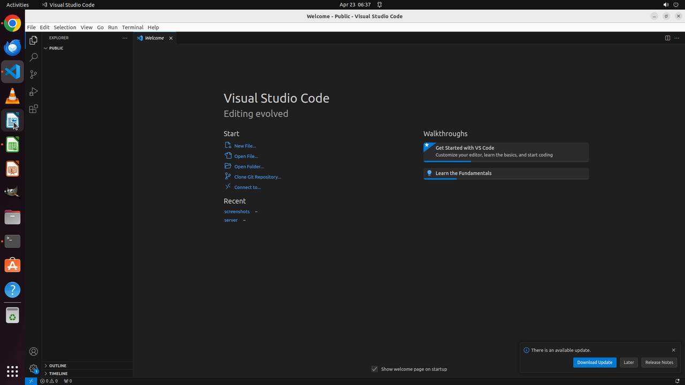

**Response:**
```
I see VS Code is open. Let me use Alt+Tab to find the LibreOffice Calc window, or let me look at the taskbar. Let me try to find the movies.xlsx window.
```

**Actions:** `pyautogui.keyDown('alt')
pyautogui.keyDown('tab')
pyautogui.keyUp('tab')
pyautogui.keyUp('alt')`

---

## Step 49


**Response:**
```
I see Chrome is showing. Let me look for the LibreOffice Calc window. It might not have opened yet or might be behind other windows. Let me try clicking on the LibreOffice Calc icon in the taskbar or use Alt+Tab to cycle through windows.
```

**Actions:** `pyautogui.click(33, 405)`

---

## Step 50

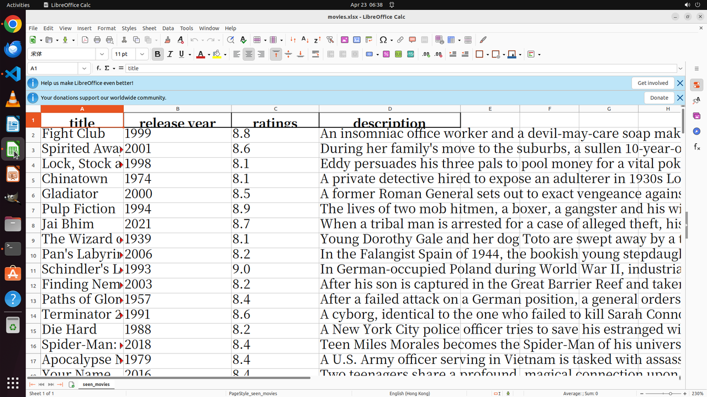

**Response:**
```
LibreOffice Calc has opened the file and I can see the `seen_movies` sheet with headers: title, release_year, ratings, description. I notice there's only one sheet tab at the bottom ("seen_movies"). The Python script should have added the "unseen_movies" sheet, but since LibreOffice Calc opened the file after the script saved it, let me check if the unseen_movies sheet is there. Let me look at the sheet tabs at the bottom.

I can see only "seen_movies" tab at the bottom. The file might have been opened before the Python script saved it, or it might need to be reloaded. Let me close and reopen the file, or check if there are more sheet tabs.

Wait, I see only "seen_movies" at the bottom. Let me right-click on the sheet tab to see if there are other sheets.
```

**Actions:** `pyautogui.rightClick(262, 1044)`

---

## Step 51

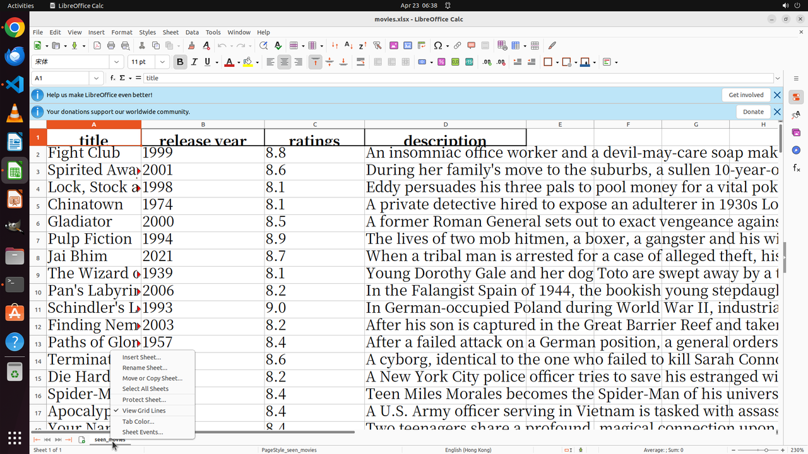

**Response:**
```
I can see the context menu. It says "Sheet 1 of 1" at the bottom, which means there's only one sheet. The Python script saved the file but the unseen_movies sheet might not have been created properly, or LibreOffice opened the old version before the script ran. Let me close this menu, close the file, and reopen it to see if the sheet is there.

Let me first click "Select All Sheets" to check or just close this menu and reload the file.
```

**Actions:** `pyautogui.keyDown('esc')
pyautogui.keyUp('esc')`

---

## Step 52


**Response:**
```
It seems the file was opened by LibreOffice before the Python script could save it, or the LibreOffice lock prevented the Python script from modifying the file. Let me close LibreOffice Calc first, then re-run the Python script, and then reopen the file.
```

**Actions:** `pyautogui.keyDown('alt')
pyautogui.keyDown('f4')
pyautogui.keyUp('f4')
pyautogui.keyUp('alt')`

---

## Step 53


**Response:**
```
Good, LibreOffice Calc is closed. Now let me switch to the terminal and re-run the Python script to add the unseen_movies sheet. Let me click on the terminal.
```

**Actions:** `pyautogui.click(33, 610)`

---

## Step 54

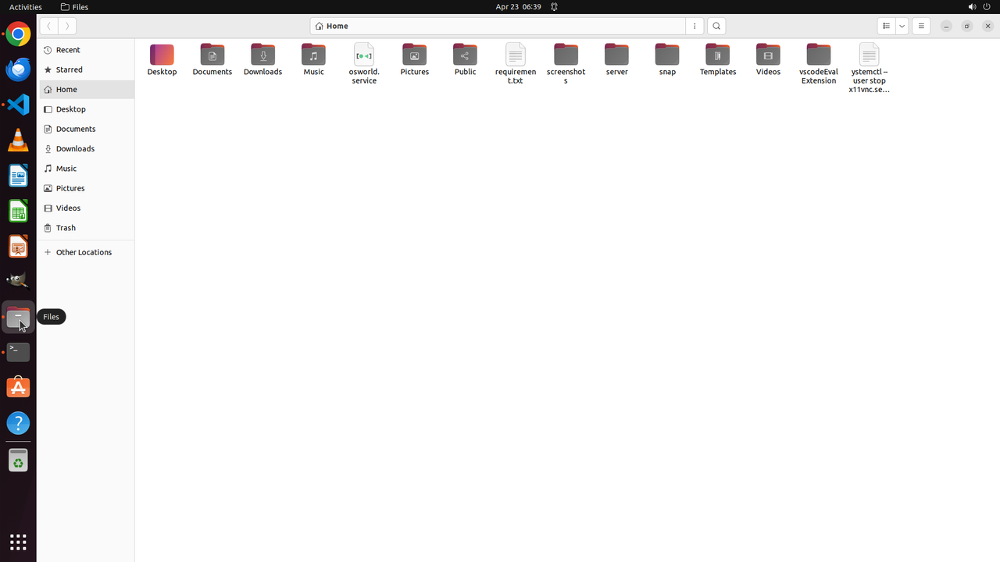

**Response:**
```
That opened the Files manager. Let me find the terminal. Let me click on the terminal icon in the taskbar.
```

**Actions:** `pyautogui.click(33, 673)`

---

## Step 55

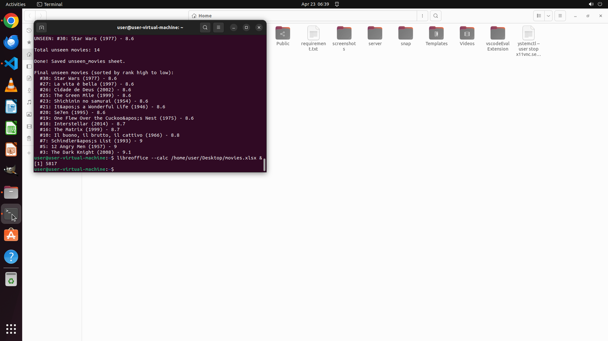

**Response:**
```
Good, I can see the terminal with the results. The script already ran successfully and saved the unseen_movies sheet. I can see the 14 unseen movies sorted by rank from high to low. Now let me verify the file was properly saved by checking it. Let me first remove any LibreOffice lock files and then re-run the script to make sure the sheet is saved.
```

**Actions:** `import subprocess, shlex; subprocess.run(f'xdotool type --delay 12 -- ' + shlex.quote('rm -f /home/user/Desktop/.~lock.movies.xlsx#\npytho'), shell=True, check=True)
import time; time.sleep(0.05)
impo`

---

## Step 56

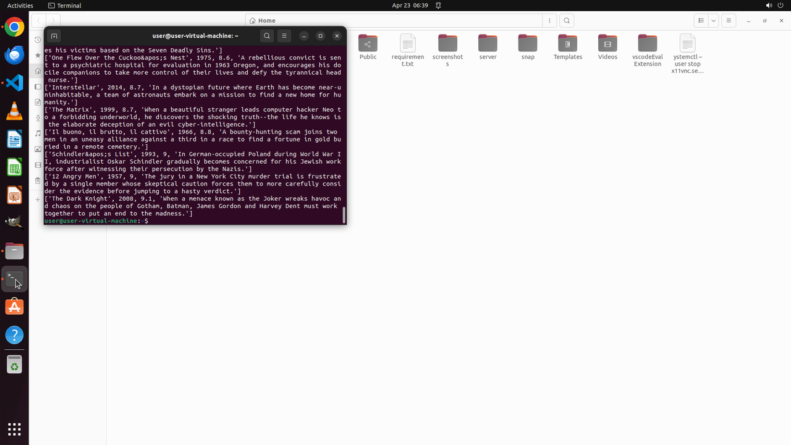

**Response:**
```
I can see the unseen_movies sheet data is properly saved in the Excel file. Let me scroll up to see the headers and first few entries to verify the structure.
```

**Actions:** `pyautogui.scroll(5, 450, 300)`

---

## Step 57

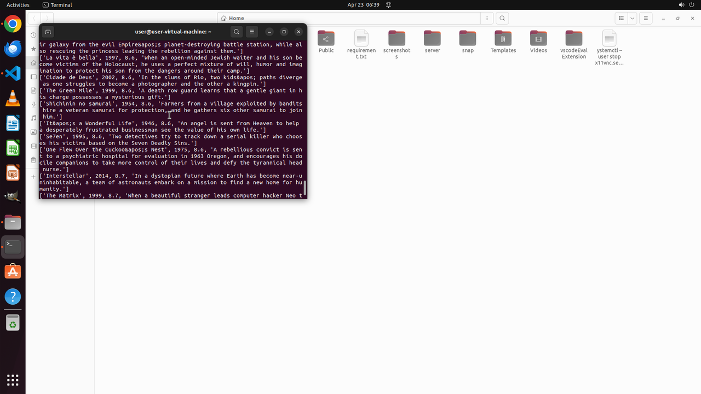

**Actions:** `pyautogui.scroll(5, 450, 300)`

---

## Step 58

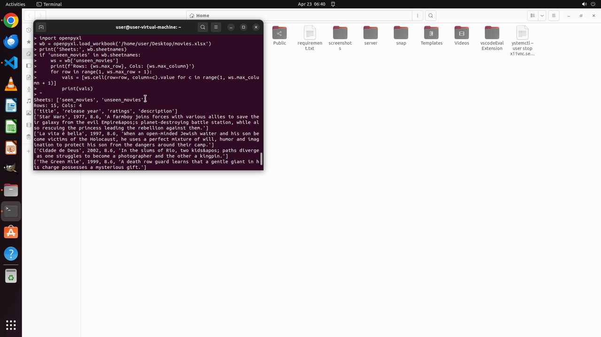

**Response:**
```
I can see the verification output:
- **Sheets**: `['seen_movies', 'unseen_movies']` - Both sheets exist
- **Rows: 15, Cols: 4** - 14 data rows + 1 header row, 4 columns
- **Headers**: `['title', 'release_year', 'ratings', 'description']` - Same as seen_movies
- First data row: `['Star Wars', 1977, 8.6, ...]` - Rank #30 (highest rank number first = sorted from high to low)

The data looks correct! However, I notice the movie names have HTML entities like `&apos;` in some names. Let me check if this is an issue. Looking at the data:
- "Star Wars" (1977) - rank 30
- "La vita è bella" (1997) - rank 27
- "Cidade de Deus" (2002) - rank 26
- "The Green Mile" (1999) - rank 25

The data is sorted by rank from high to low (30, 27, 26, 25...) which is correct. But I notice some movie names have `&apos;` instead of apostrophes. Let me fix this and also verify the descriptions don't have HTML entities.
```

**Actions:** `import subprocess, shlex; subprocess.run(f'xdotool type --delay 12 -- ' + shlex.quote("python3 << 'PYEOF'\nimport openpyxl\nimport html\n\nwb"), shell=True, check=True)
import time; time.sleep(0.05)
i`

---

## Step 59

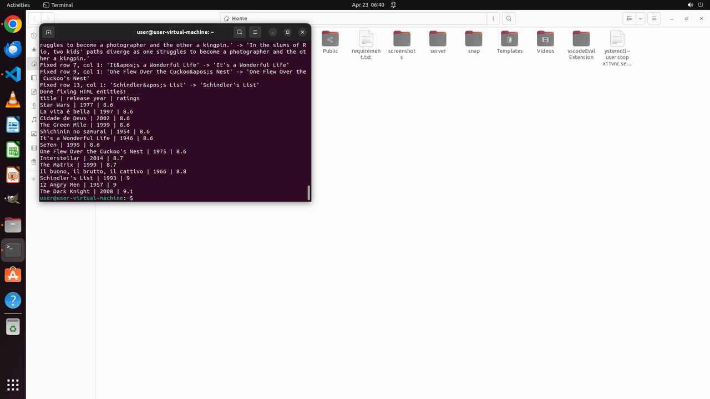

**Response:**
```
The HTML entities have been fixed and the data looks clean now. The final unseen_movies sheet contains 14 movies sorted by IMDB ranking from high to low:

1. Star Wars | 1977 | 8.6 (rank 30)
2. La vita è bella | 1997 | 8.6 (rank 27)
3. Cidade de Deus | 2002 | 8.6 (rank 26)
4. The Green Mile | 1999 | 8.6 (rank 25)
5. Shichinin no samurai | 1954 | 8.6 (rank 23)
6. It's a Wonderful Life | 1946 | 8.6 (rank 21)
7. Se7en | 1995 | 8.6 (rank 20)
8. One Flew Over the Cuckoo's Nest | 1975 | 8.6 (rank 19)
9. Interstellar | 2014 | 8.7 (rank 18)
10. The Matrix | 1999 | 8.7 (rank 16)
11. Il buono, il brutto, il cattivo | 1966 | 8.8 (rank 10)
12. Schindler's List | 1993 | 9 (rank 7)
13. 12 Angry Men | 1957 | 9 (rank 5)
14. The Dark Knight | 2008 | 9.1 (rank 3)

All movies are released before 2024, sorted by IMDB ranking from high to low (rank 30 first, rank 3 last). Now let me open the file in LibreOffice Calc to verify visually.
```

**Actions:** `import subprocess, shlex; subprocess.run(f'xdotool type --delay 12 -- ' + shlex.quote('libreoffice --calc /home/user/Desktop/movies.xlsx '), shell=True, check=True)
import time; time.sleep(0.05)
impor`

---

## Step 60

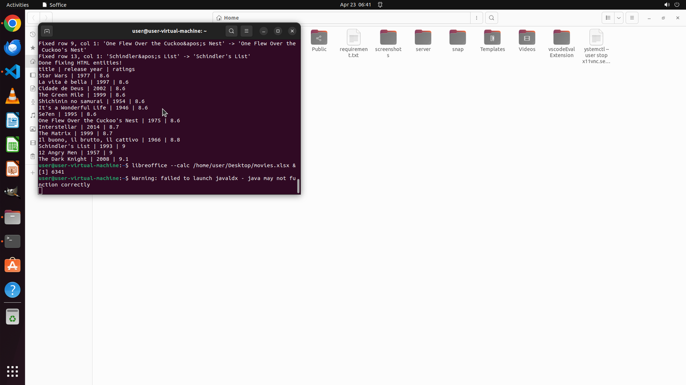

**Response:**
```
LibreOffice is loading. Let me wait for it to open fully.
```

**Actions:** `time.sleep(0.5)`

---

## Step 61

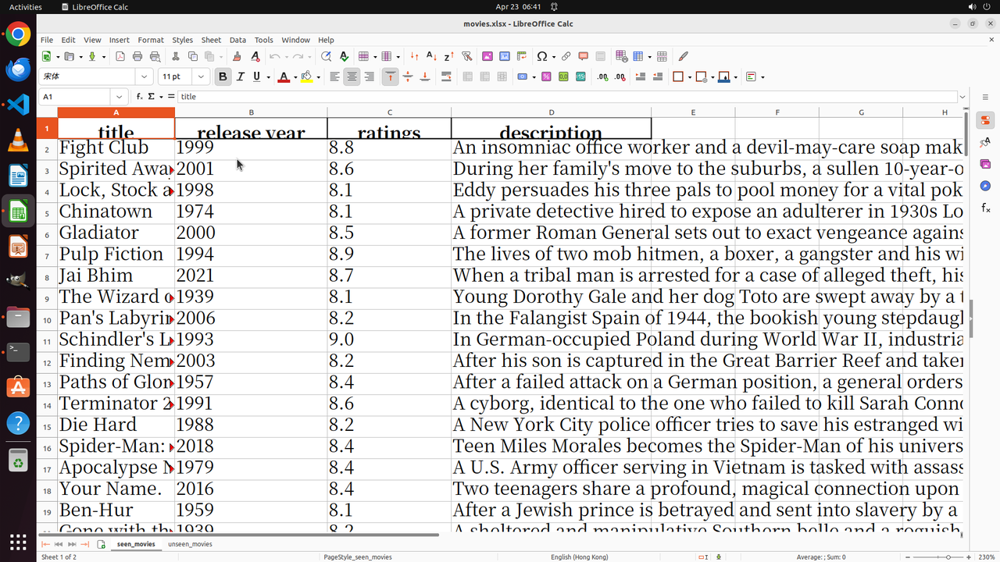

**Response:**
```
LibreOffice Calc has opened the file and I can see both sheet tabs at the bottom: "seen_movies" and "unseen_movies". The current view shows the "seen_movies" sheet. Let me click on the "unseen_movies" tab to verify the new sheet.
```

**Actions:** `pyautogui.click(364, 1045)`

---

## Step 62

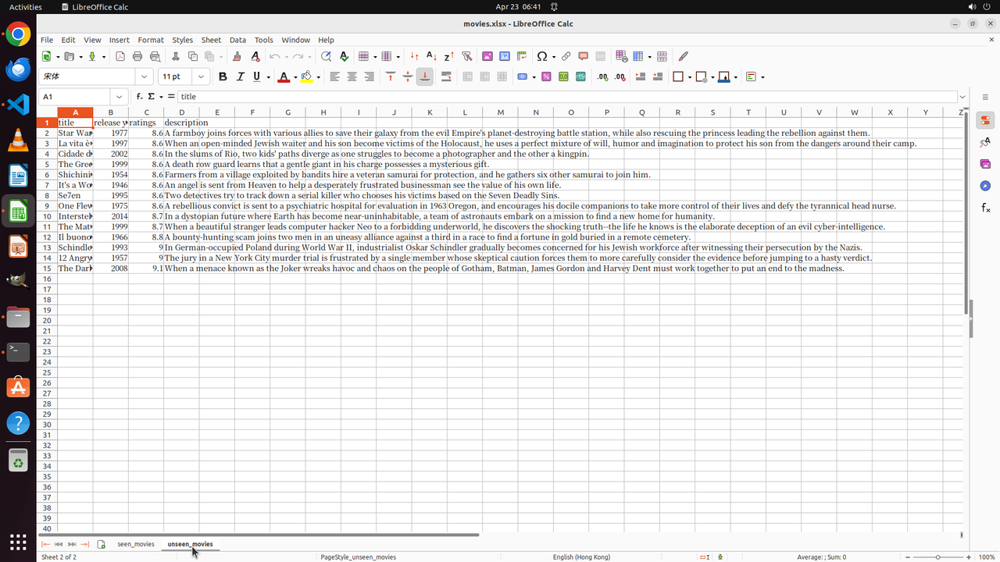

**Response:**
```
The "unseen_movies" sheet is now visible and properly created with:

- **Headers**: title, release_year, ratings, description (same as seen_movies)
- **14 unseen movies** sorted by IMDB ranking from high to low:
  - Row 2: Star Wars (1977) - 8.6 (rank 30)
  - Row 3: La vita è bella (1997) - 8.6 (rank 27)
  - Row 4: Cidade de Deus (2002) - 8.6 (rank 26)
  - Row 5: The Green Mile (1999) - 8.6 (rank 25)
  - Row 6: Shichinin no samurai (1954) - 8.6 (rank 23)
  - Row 7: It's a Wonderful Life (1946) - 8.6 (rank 21)
  - Row 8: Se7en (1995) - 8.6 (rank 20)
  - Row 9: One Flew Over the Cuckoo's Nest (1975) - 8.6 (rank 19)
  - Row 10: Interstellar (2014) - 8.7 (rank 18)
  - Row 11: The Matrix (1999) - 8.7 (rank 16)
  - Row 12: Il buono, il brutto, il cattivo (1966) - 8.8 (rank 10)
  - Row 13: Schindler's List (1993) - 9 (rank 7)
  - Row 14: 12 Angry Men (1957) - 9 (rank 5)
  - Row 15: The Dark Knight (2008) - 9.1 (rank 3)

The task is complete. The unseen_movies sheet has been created with the same headers as seen_movies, containing movies from the IMDB Top 30 (released before 2024) that are not in the seen_movies list, sorted by IMDB rankings from high to low.

DONE
```

**Actions:** `DONE`

---
