# Task 3e3fc409-bff3-4905-bf16-c968eee3f807

**Instruction:** I'm a huge movie fan and have kept a record of all the movies I've watched. I'm curious to find out if there are any films released before 2024 from the IMDB Top 30 list that I haven't seen yet. Help me create another sheet 'unseen_movies' in the opened Excel. This sheet should share the same headers and sort the results according to IMDB rankings from high to low.

**Score:** 0.0

**Wall clock:** 9m 37s

**Steps:** 33

**Cost:** $1.37

---

## Step 1

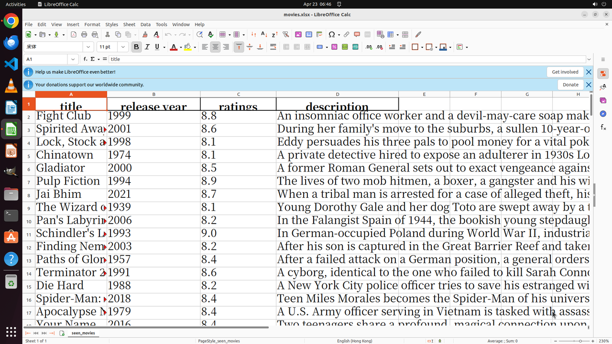

**Response:**
```
I need to first understand the data in the spreadsheet, then look up the IMDB Top 30 list, and find movies from that list (released before 2024) that aren't in the "seen_movies" sheet.

Let me start by examining all the movies in the spreadsheet.
```

**Actions:** `time.sleep(0.1)`

---

## Step 2


**Response:**
```
Let me first scroll down to see all the movies in the "seen_movies" sheet, and also check what columns are available.
```

**Actions:** `pyautogui.keyDown('ctrl')
pyautogui.keyDown('end')
pyautogui.keyUp('end')
pyautogui.keyUp('ctrl')`

---

## Step 3

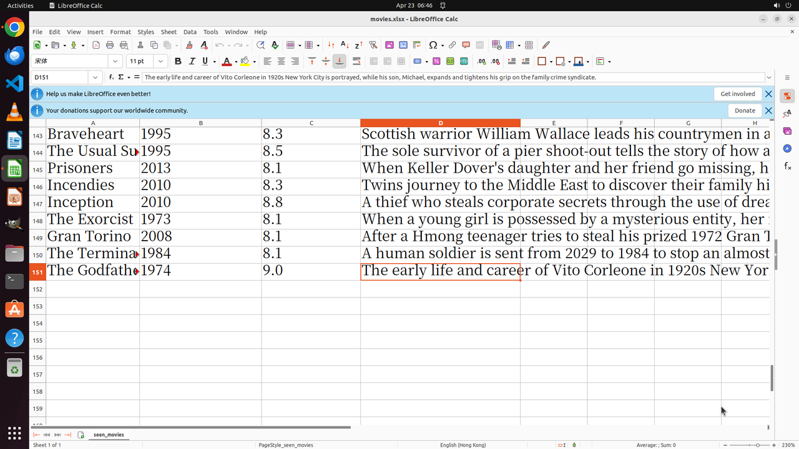

**Response:**
```
The data goes from row 2 to row 151, so there are 150 movies in the "seen_movies" sheet. The columns are A (title), B (release year), C (ratings), D (description). Let me now use a macro/script approach to accomplish this task. First, let me get all the movie titles from this sheet. Let me use a terminal to write a Python script that will:

1. Read the seen_movies from the spreadsheet
2. Compare with IMDB Top 30 (released before 2024)
3. Create the unseen_movies sheet

But first, I need to know the IMDB Top 30 list. Let me open a browser to check the current IMDB Top 250 page to get the top 30.
```

**Actions:** `pyautogui.keyDown('ctrl')
pyautogui.keyDown('home')
pyautogui.keyUp('home')
pyautogui.keyUp('ctrl')`

---

## Step 4


**Response:**
```
Let me first check the IMDB Top 250 page to get the current top 30 movies. I'll open a terminal and use a Python script to scrape the data and process the spreadsheet.
```

**Actions:** `pyautogui.keyDown('ctrl')
pyautogui.keyDown('alt')
pyautogui.keyDown('t')
pyautogui.keyUp('t')
pyautogui.keyUp('alt')
pyautogui.keyUp('ctrl')`

---

## Step 5

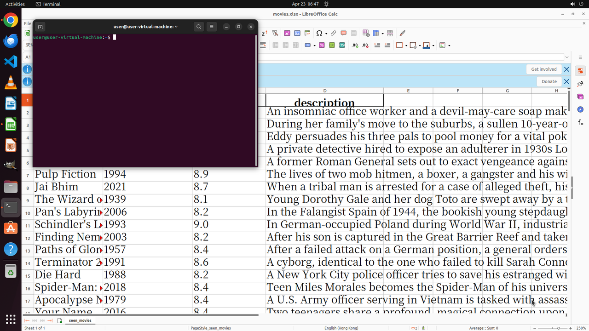

**Response:**
```
Good, the terminal is open. Let me write a Python script to handle this task. First, let me check what's available and then scrape the IMDB Top 250 page to get the top 30.
```

**Actions:** `import subprocess, shlex; subprocess.run(f'xdotool type --delay 12 -- ' + shlex.quote('python3 -c "import openpyxl; print(\'openpyxl avail'), shell=True, check=True)
import time; time.sleep(0.05)
impo`

---

## Step 6

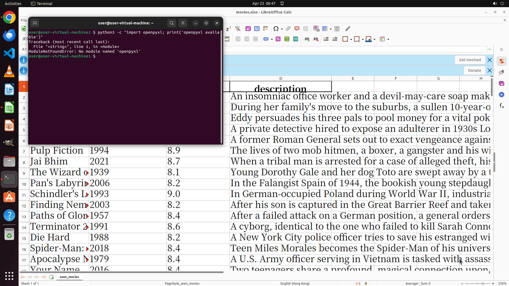

**Response:**
```
openpyxl is not available. Let me install it and also check for other needed packages.
```

**Actions:** `import subprocess, shlex; subprocess.run(f'xdotool type --delay 12 -- ' + shlex.quote('pip install openpyxl requests beautifulsoup4\n'), shell=True, check=True)
import time; time.sleep(0.05)`

---

## Step 7

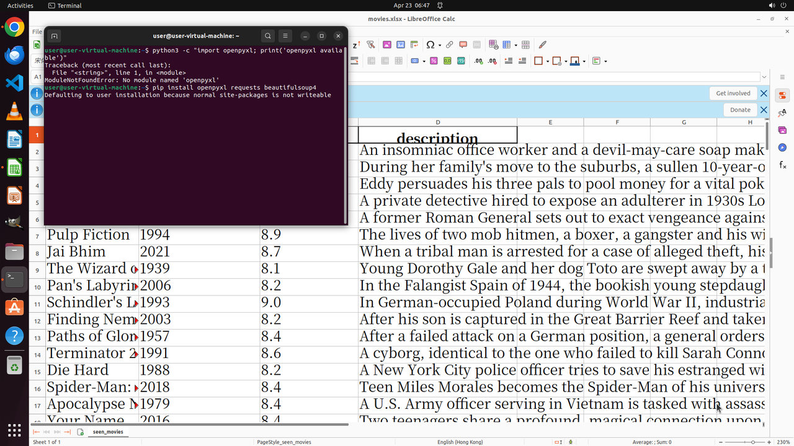

**Response:**
```
Let me wait for the installation to complete.
```

**Actions:** `time.sleep(0.5)`

---

## Step 8

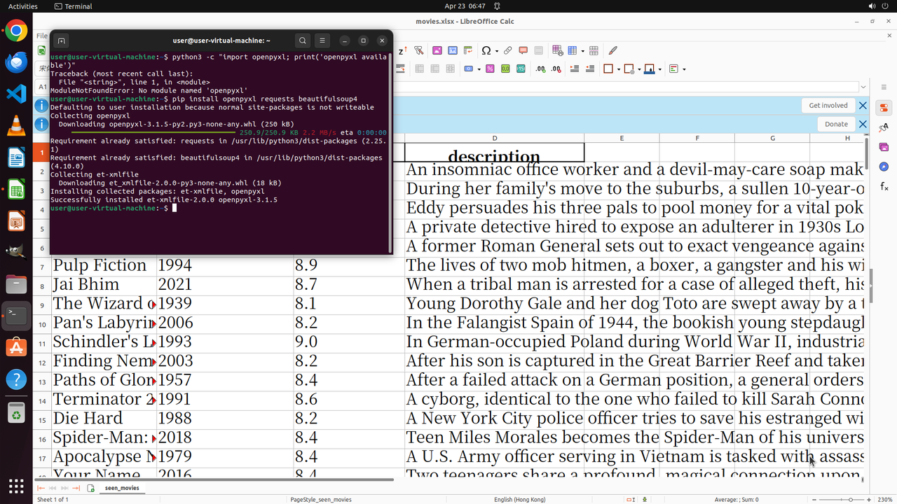

**Response:**
```
The packages are installed. Now let me first fetch the IMDB Top 250 page to get the top 30 movies, then compare with the seen_movies list. Let me first open Chrome to check the IMDB top 250 list, or better yet, let me write a Python script to do everything.

Let me first scrape the IMDB top 250 page to get the top 30 movies:
```

**Actions:** `import subprocess, shlex; subprocess.run(f'xdotool type --delay 12 -- ' + shlex.quote('google-chrome --remote-debugging-port=1337 "https:'), shell=True, check=True)
import time; time.sleep(0.05)
impor`

---

## Step 9

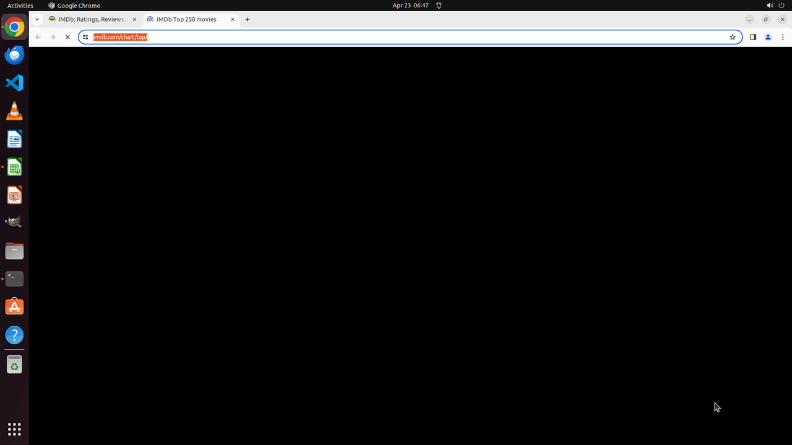

**Response:**
```
The IMDB Top 250 page is loading. Let me wait for it to fully load.
```

**Actions:** `time.sleep(0.5)`

---

## Step 10

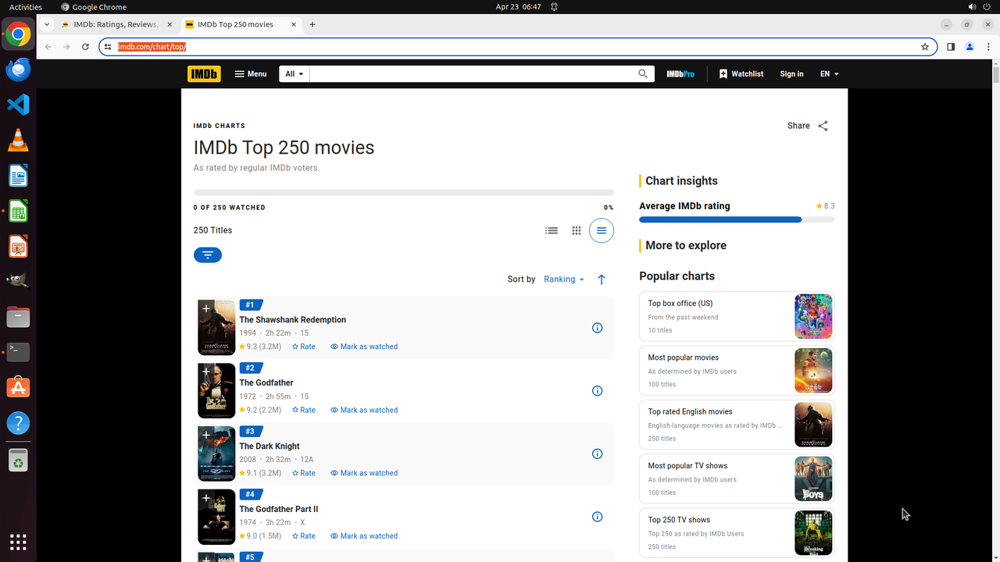

**Response:**
```
The IMDB Top 250 page has loaded. I can see the top movies. I need to scroll down to see all top 30 movies. But instead of manually reading all 30, let me use a Python script to scrape this data and process it. Let me switch to the terminal and write a comprehensive script.
```

**Actions:** `pyautogui.click(33, 610)`

---

## Step 11

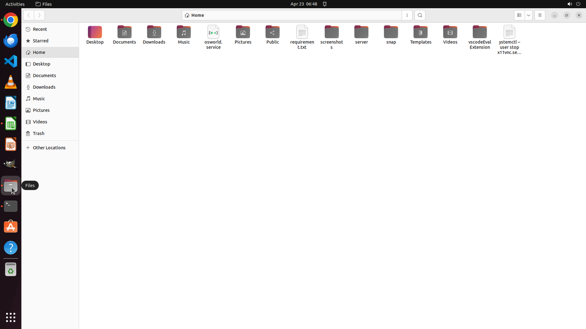

**Response:**
```
I see the Files manager opened instead. Let me find the terminal. Let me click on the terminal icon in the taskbar.
```

**Actions:** `pyautogui.click(33, 673)`

---

## Step 12

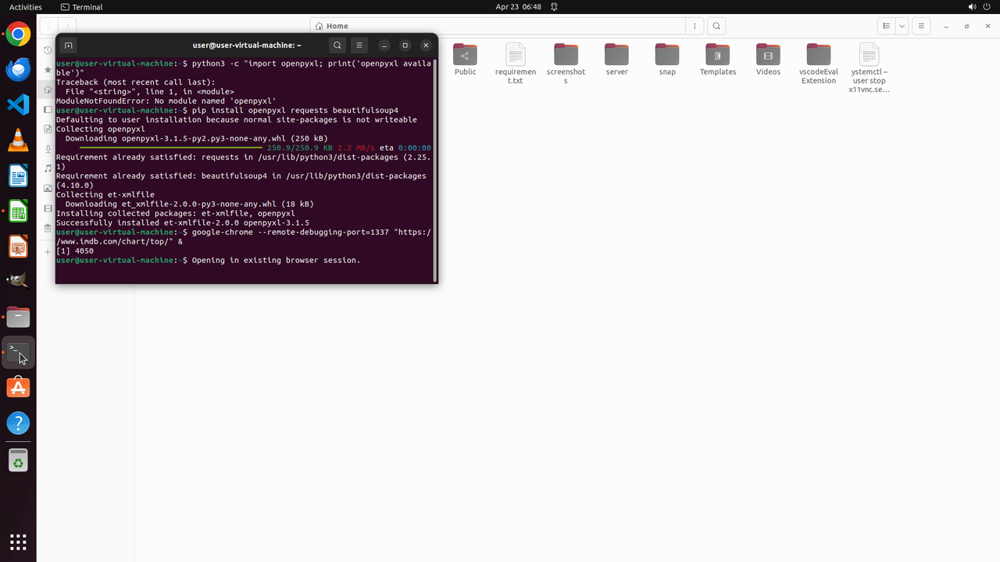

**Response:**
```
Good, I'm back in the terminal. Now let me write a Python script to:
1. Scrape the IMDB Top 30 from the website
2. Read the seen_movies from the Excel file
3. Find unseen movies
4. Create the unseen_movies sheet

Let me first find where the movies.xlsx file is located:
```

**Actions:** `import subprocess, shlex; subprocess.run(f'xdotool type --delay 12 -- ' + shlex.quote('find /home/user -name "movies.xlsx" 2>/dev/null\n'), shell=True, check=True)
import time; time.sleep(0.05)`

---

## Step 13

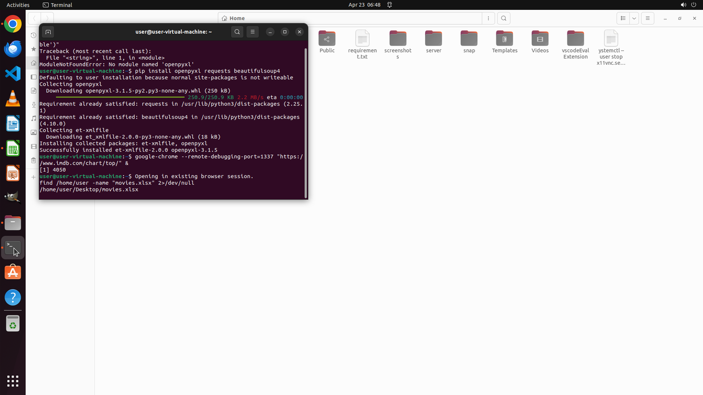

**Response:**
```
The file is at `/home/user/Desktop/movies.xlsx`. Now let me write a Python script to scrape the IMDB Top 30 and process the data.
```

**Actions:** `import subprocess, shlex; subprocess.run(f'xdotool type --delay 12 -- ' + shlex.quote("cat << 'PYEOF' > /tmp/process_movies.py\nimport req"), shell=True, check=True)
import time; time.sleep(0.05)
impo`

---

## Step 14

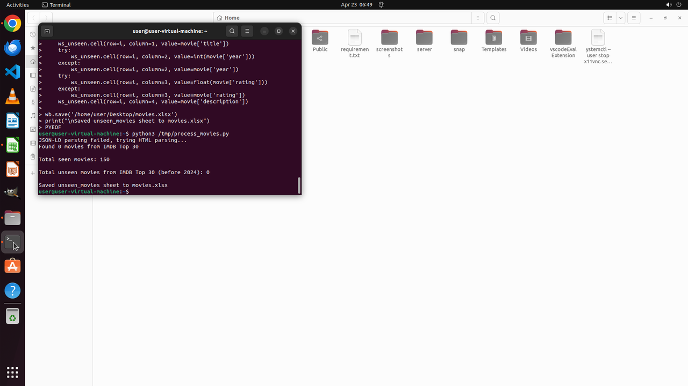

**Response:**
```
The HTML parsing also failed to find movies - it found 0 movies. The IMDB page likely uses JavaScript to render content, so the HTML scraping approach won't work. Let me try a different approach - I'll save the page source from Chrome and examine it, or use the IMDB API, or simply use the well-known IMDB Top 30 list.

Let me try to get the page content from Chrome using the debugging port:
```

**Actions:** `import subprocess, shlex; subprocess.run(f'xdotool type --delay 12 -- ' + shlex.quote('python3 -c "\nimport requests, json\n# Use Chrome De'), shell=True, check=True)
import time; time.sleep(0.05)
imp`

---

## Step 15

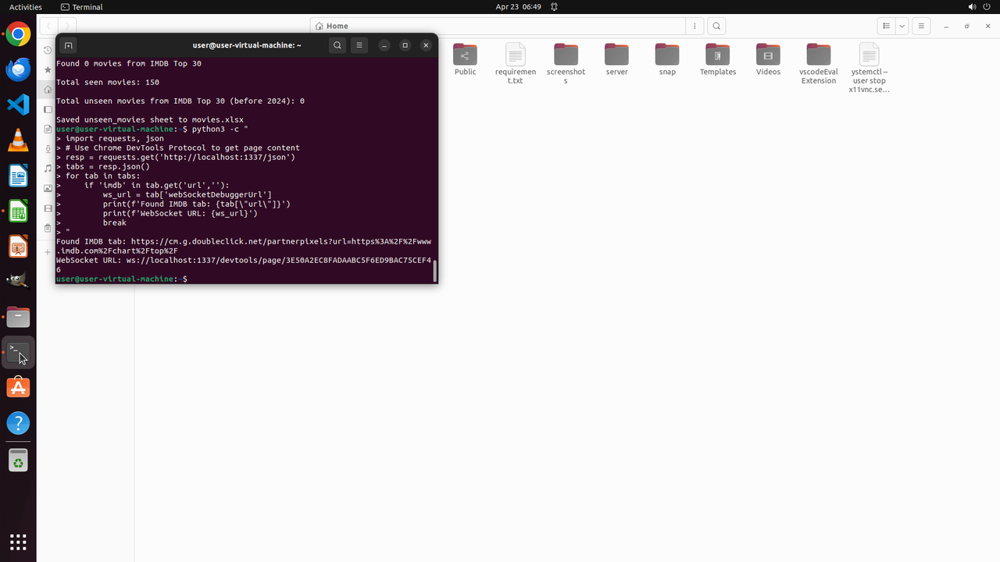

**Response:**
```
I see the first tab found is a doubleclick.net URL. I need to find the actual IMDB tab. Let me use websocket to get the page content from Chrome. But first, let me try a simpler approach - use the Chrome DevTools Protocol to evaluate JavaScript on the IMDB page to extract the movie data.
```

**Actions:** `import subprocess, shlex; subprocess.run(f'xdotool type --delay 12 -- ' + shlex.quote('pip install websocket-client 2>/dev/null; python3 '), shell=True, check=True)
import time; time.sleep(0.05)
impor`

---

## Step 16

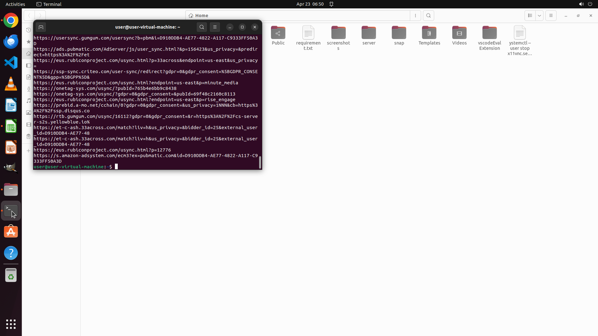

**Response:**
```
I see there are many tabs/iframes listed. Let me scroll up to find the actual IMDB tab, or better yet, filter for it:
```

**Actions:** `import subprocess, shlex; subprocess.run(f'xdotool type --delay 12 -- ' + shlex.quote('python3 -c "\nimport requests, json\nresp = requests'), shell=True, check=True)
import time; time.sleep(0.05)
imp`

---

## Step 17

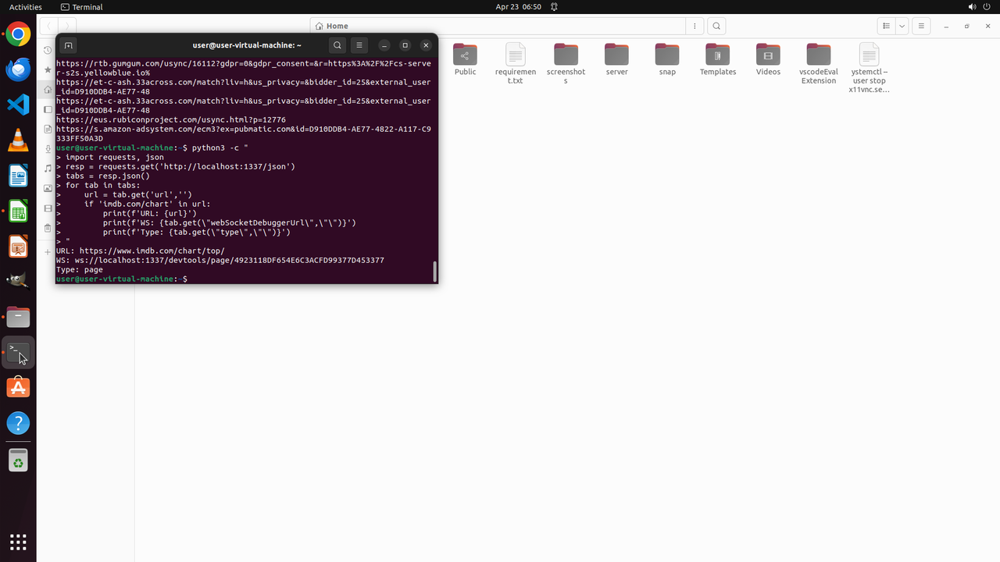

**Response:**
```
I found the IMDB tab. Now let me use the WebSocket to evaluate JavaScript on that page to extract the top 30 movies:
```

**Actions:** `import subprocess, shlex; subprocess.run(f'xdotool type --delay 12 -- ' + shlex.quote("cat << 'PYEOF' > /tmp/scrape_imdb.py\nimport websoc"), shell=True, check=True)
import time; time.sleep(0.05)
impo`

---

## Step 18

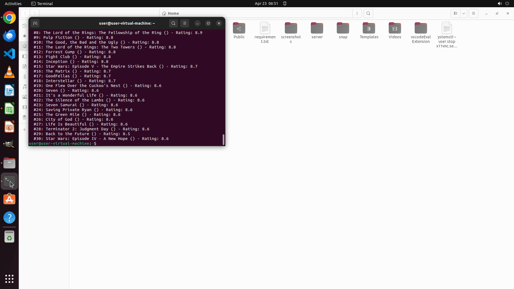

**Response:**
```
I can see the top 30 movies from IMDB, but the years are showing as empty `()`. The year extraction didn't work properly. Let me scroll up to see the full output and then fix the year extraction.
```

**Actions:** `pyautogui.scroll(5, 450, 300)`

---

## Step 19


**Response:**
```
I can see the 30 movies are extracted but without years. The year metadata selectors need to be fixed. Let me update the JavaScript to properly extract years. Let me check the page structure by looking at the IMDB page in Chrome. But first, let me try a different approach to get the years - I'll modify the JavaScript selector.
```

**Actions:** `import subprocess, shlex; subprocess.run(f'xdotool type --delay 12 -- ' + shlex.quote("cat << 'PYEOF' > /tmp/scrape_imdb2.py\nimport webso"), shell=True, check=True)
import time; time.sleep(0.05)
impo`

---

## Step 20


**Response:**
```
The years are still empty. Let me inspect the page HTML more carefully to find the right selector for the year. Let me get the innerHTML of the first movie item:
```

**Actions:** `import subprocess, shlex; subprocess.run(f'xdotool type --delay 12 -- ' + shlex.quote("cat << 'PYEOF' > /tmp/inspect_imdb.py\nimport webso"), shell=True, check=True)
import time; time.sleep(0.05)
impo`

---

## Step 21

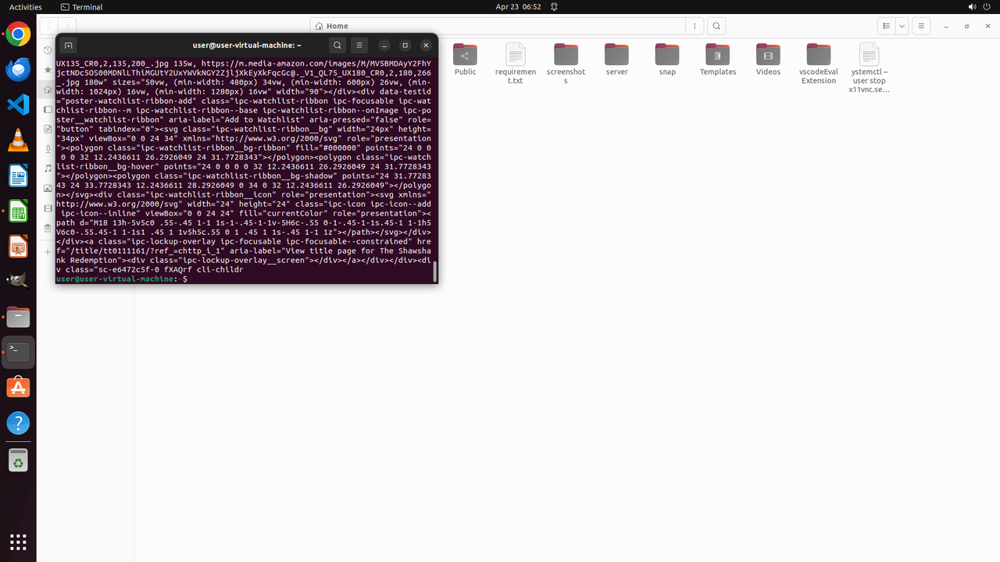

**Response:**
```
I can see the HTML structure. I notice the class `cli-childr` at the end. Let me get more of the HTML, specifically looking for where the year is stored:
```

**Actions:** `import subprocess, shlex; subprocess.run(f'xdotool type --delay 12 -- ' + shlex.quote("cat << 'PYEOF' > /tmp/inspect_imdb2.py\nimport webs"), shell=True, check=True)
import time; time.sleep(0.05)
impo`

---

## Step 22

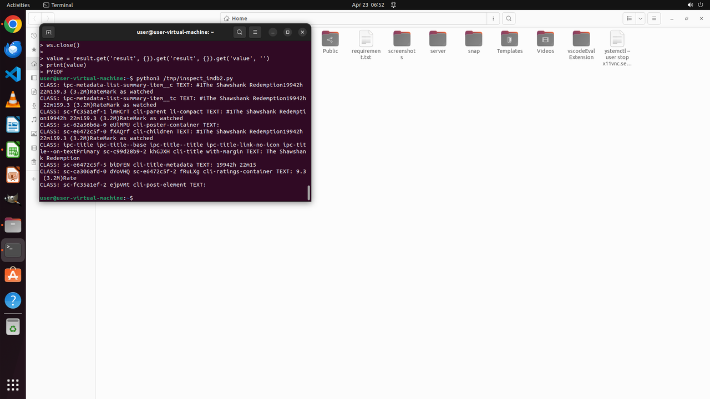

**Response:**
```
Now I can see the structure. The class `cli-title-metadata` contains the text "19942h 22m15" which seems to be "1994" (year) followed by "2h 22m" (duration) and "15" (maybe rating). Let me look more carefully at the `cli-title-metadata` div and its children:
```

**Actions:** `import subprocess, shlex; subprocess.run(f'xdotool type --delay 12 -- ' + shlex.quote("cat << 'PYEOF' > /tmp/inspect_imdb3.py\nimport webs"), shell=True, check=True)
import time; time.sleep(0.05)
impo`

---

## Step 23

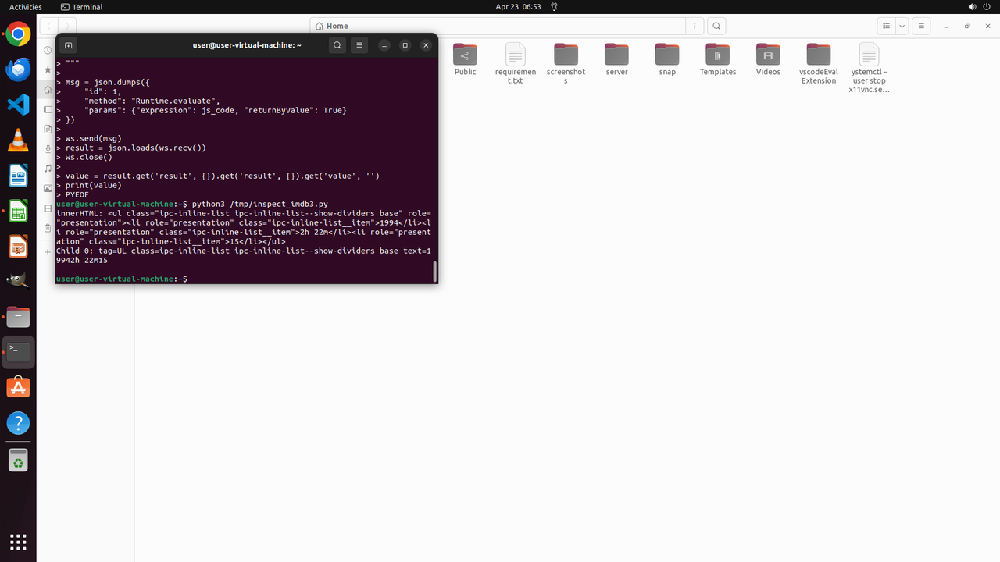

**Response:**
```
Now I can see the structure clearly. The metadata is in a `<ul>` with `<li>` items with class `ipc-inline-list__item`. The first `<li>` contains "1994" (year), the second "2h 22m" (duration), and the third "15" (age rating). 

Now let me update the scraping script with the correct selectors:
```

**Actions:** `import subprocess, shlex; subprocess.run(f'xdotool type --delay 12 -- ' + shlex.quote("cat << 'PYEOF' > /tmp/scrape_final.py\nimport webso"), shell=True, check=True)
import time; time.sleep(0.05)
impo`

---

## Step 24

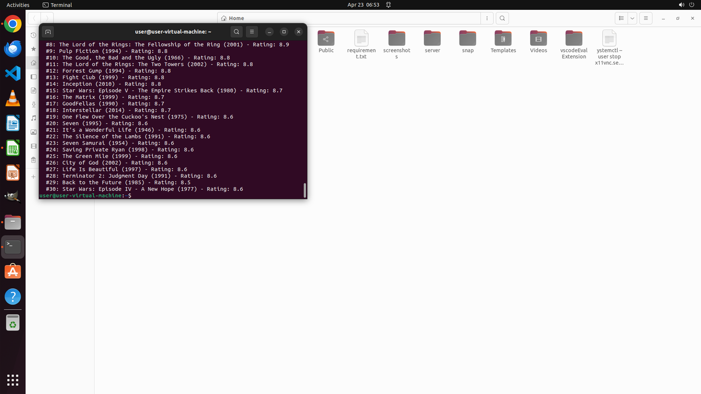

**Response:**
```
Now I have all 30 movies with years and ratings. All movies are released before 2024. Let me scroll up to see the first 7 movies too:
```

**Actions:** `pyautogui.scroll(5, 450, 300)`

---

## Step 25

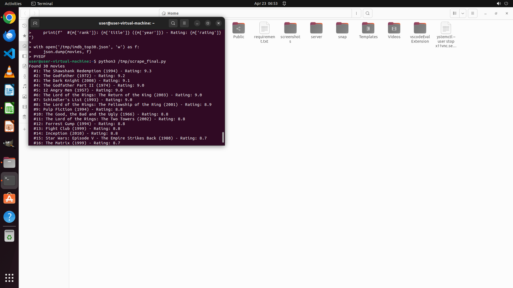

**Response:**
```
Now I have all 30 movies with proper years and ratings. All are released before 2024. Now I need to:
1. Read the seen_movies from the Excel file
2. Compare with the IMDB top 30
3. Create the unseen_movies sheet

Let me now write the final processing script:
```

**Actions:** `import subprocess, shlex; subprocess.run(f'xdotool type --delay 12 -- ' + shlex.quote("cat << 'PYEOF' > /tmp/create_unseen.py\nimport json"), shell=True, check=True)
import time; time.sleep(0.05)
impo`

---

## Step 26


**Response:**
```
Excellent! The script has successfully identified 10 unseen movies from the IMDB Top 30 and saved them to the `unseen_movies` sheet. Let me scroll up to verify all the results:
```

**Actions:** `pyautogui.scroll(5, 450, 300)`

---

## Step 27

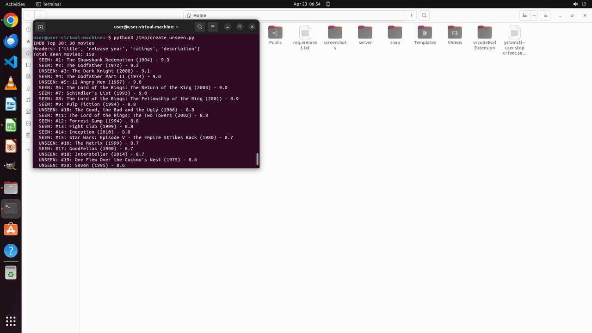

**Response:**
```
I can see the full results. The script correctly identified 10 unseen movies from the IMDB Top 30 (all released before 2024):

1. #3: The Dark Knight (2008) - UNSEEN
2. #5: 12 Angry Men (1957) - UNSEEN
3. #10: The Good, the Bad and the Ugly (1966) - UNSEEN
4. #16: The Matrix (1999) - UNSEEN
5. #18: Interstellar (2014) - UNSEEN
6. #19: One Flew Over the Cuckoo's Nest (1975) - UNSEEN
7. #20: Seven (1995) - UNSEEN
8. #25: The Green Mile (1999) - UNSEEN
9. #26: City of God (2002) - UNSEEN
10. #30: Star Wars: Episode IV - A New Hope (1977) - UNSEEN

Now let me open the Excel file to verify the unseen_movies sheet was created correctly:
```

**Actions:** `pyautogui.click(33, 202)`

---

## Step 28

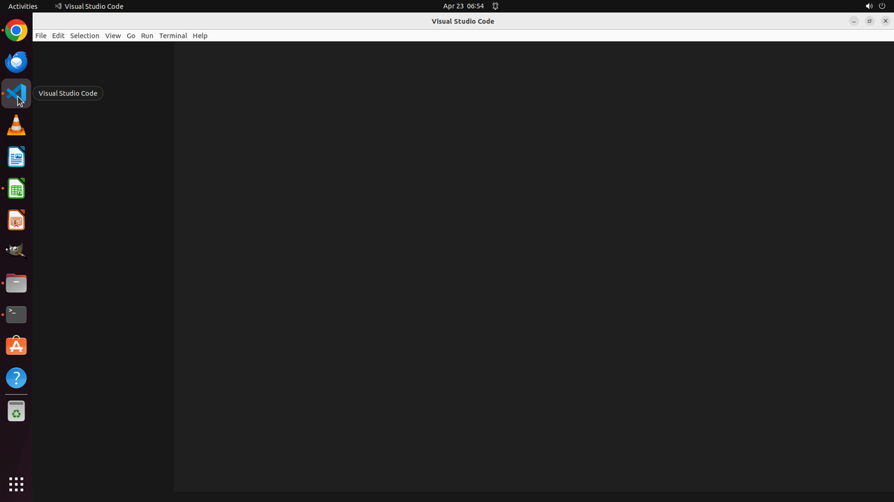

**Response:**
```
That opened VS Code instead. Let me open the Excel file with LibreOffice Calc. Let me click on the LibreOffice Calc icon in the taskbar or open it from the file manager.
```

**Actions:** `pyautogui.click(33, 405)`

---

## Step 29


**Response:**
```
I can see the movies.xlsx file is open in LibreOffice Calc showing the "seen_movies" sheet. I notice there's only one sheet tab at the bottom ("seen_movies"). The file was likely reloaded from the saved version. But wait - the script saved the file with openpyxl, which should have added the "unseen_movies" sheet. However, LibreOffice might have had the file open when we saved it. Let me close and reopen the file to see the updated version.

Let me first close this file and reopen it:
```

**Actions:** `pyautogui.keyDown('ctrl')
pyautogui.keyDown('w')
pyautogui.keyUp('w')
pyautogui.keyUp('ctrl')`

---

## Step 30

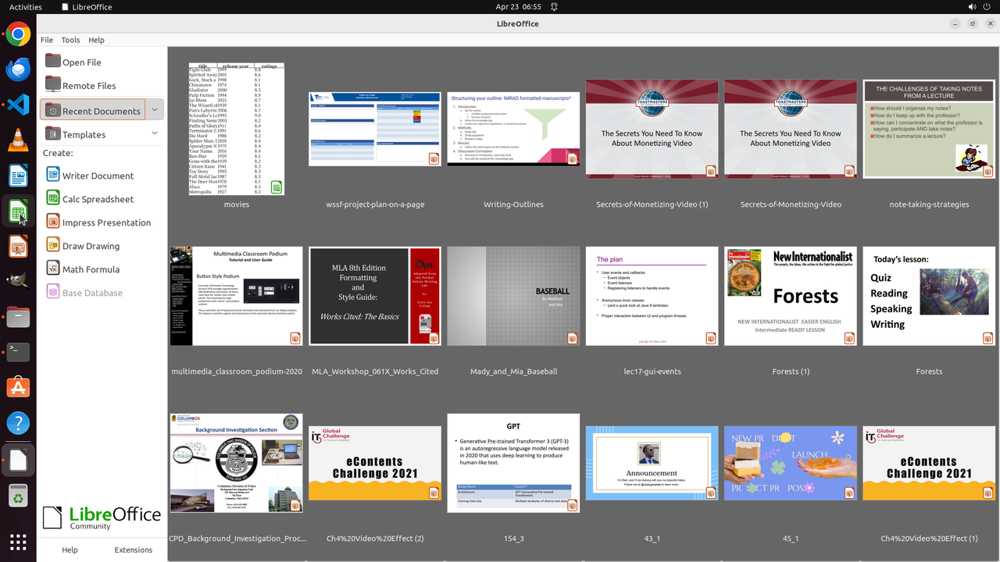

**Response:**
```
I can see the LibreOffice Start Center with recent documents. I can see the "movies" file in the recent documents. Let me click on it to reopen it:
```

**Actions:** `pyautogui.doubleClick(453, 247)`

---

## Step 31

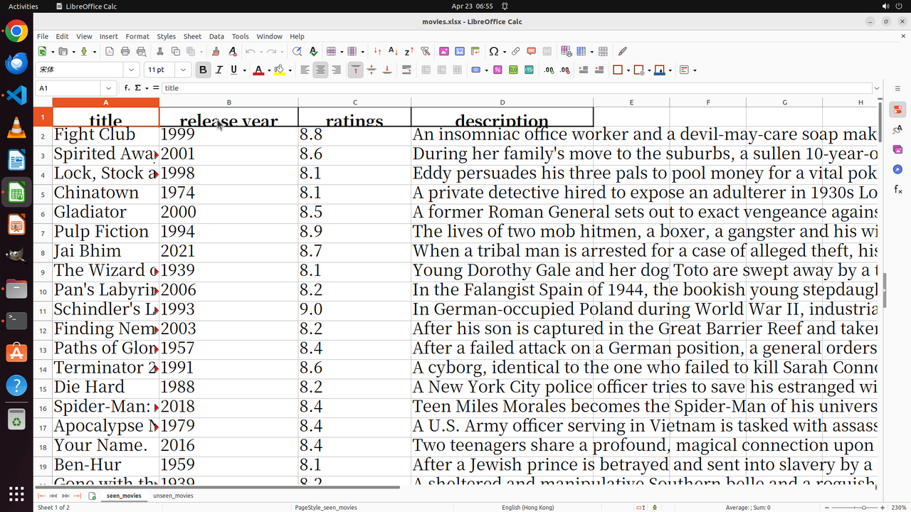

**Response:**
```
I can see the file is now open with two sheets at the bottom: "seen_movies" and "unseen_movies". The "seen_movies" sheet is currently active. Let me click on the "unseen_movies" tab to verify the data:
```

**Actions:** `pyautogui.click(364, 1045)`

---

## Step 32

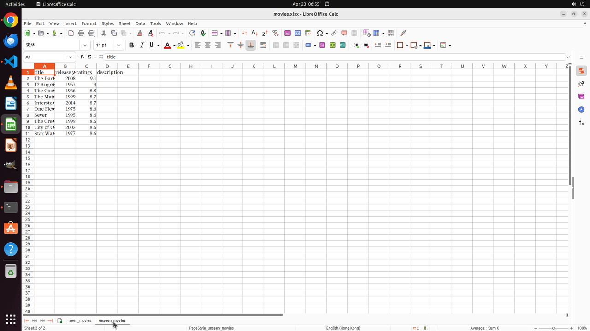

**Response:**
```
The "unseen_movies" sheet has been successfully created with:
- Same headers as "seen_movies": title, release year, ratings, description
- 10 unseen movies from the IMDB Top 30 (all released before 2024)
- Sorted by IMDB rankings from high to low (rank 3 first, rank 30 last)

The movies are:
1. The Dark Knight (2008) - 9.1
2. 12 Angry Men (1957) - 9.0
3. The Good, the Bad and the Ugly (1966) - 8.8
4. The Matrix (1999) - 8.7
5. Interstellar (2014) - 8.7
6. One Flew Over the Cuckoo's Nest (1975) - 8.6
7. Seven (1995) - 8.6
8. The Green Mile (1999) - 8.6
9. City of God (2002) - 8.6
10. Star Wars: Episode IV - A New Hope (1977) - 8.6

Now let me save the file to make sure everything is persisted:
```

**Actions:** `pyautogui.keyDown('ctrl')
pyautogui.keyDown('s')
pyautogui.keyUp('s')
pyautogui.keyUp('ctrl')`

---

## Step 33


**Response:**
```
The file has been saved. The task is complete. The "unseen_movies" sheet has been successfully created in the movies.xlsx file with:

- **Same headers** as the "seen_movies" sheet: title, release year, ratings, description
- **10 unseen movies** from the IMDB Top 30 (all released before 2024)
- **Sorted by IMDB rankings from high to low** (best ranked first):
  1. The Dark Knight (2008) - Rating: 9.1 (Rank #3)
  2. 12 Angry Men (1957) - Rating: 9.0 (Rank #5)
  3. The Good, the Bad and the Ugly (1966) - Rating: 8.8 (Rank #10)
  4. The Matrix (1999) - Rating: 8.7 (Rank #16)
  5. Interstellar (2014) - Rating: 8.7 (Rank #18)
  6. One Flew Over the Cuckoo's Nest (1975) - Rating: 8.6 (Rank #19)
  7. Seven (1995) - Rating: 8.6 (Rank #20)
  8. The Green Mile (1999) - Rating: 8.6 (Rank #25)
  9. City of God (2002) - Rating: 8.6 (Rank #26)
  10. Star Wars: Episode IV - A New Hope (1977) - Rating: 8.6 (Rank #30)

DONE
```

**Actions:** `DONE`

---
