# Task 415ef462-bed3-493a-ac36-ca8c6d23bf1b

**Instruction:** There's an e-mail containing the AWS invoice for December saved in local "Bills" folder. Extract the invoice PDF to the my receipts folder. Follow the file name pattern of the old files and append a record at the end of my tally book.

**Score:** N/A

**Steps:** 39

---

## Step 1

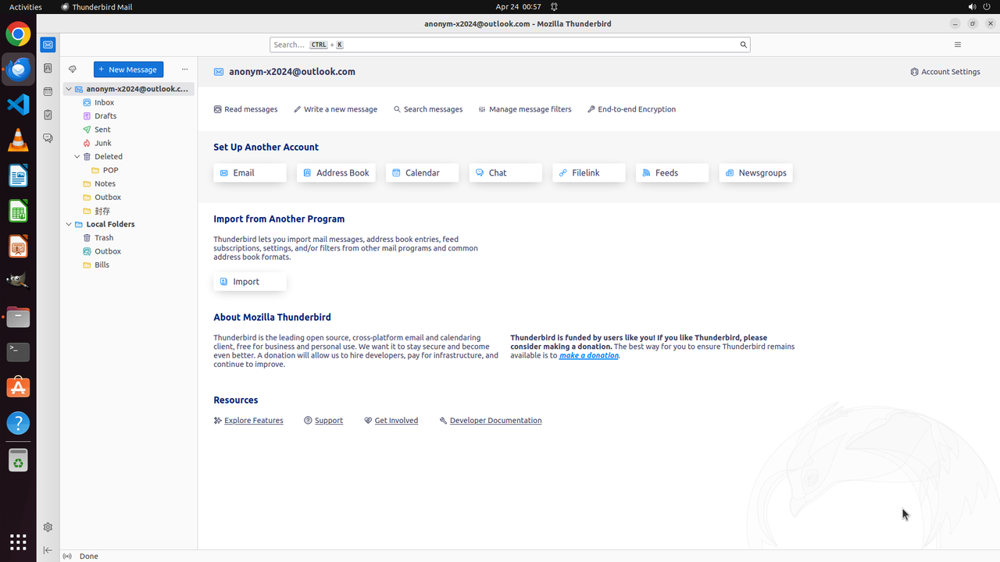

**Response:**
```
I can see Thunderbird Mail is open with a "Bills" folder under Local Folders. Let me first click on the Bills folder to find the AWS invoice email.
```

**Actions:** `pyautogui.click(196, 507)`

---

## Step 2

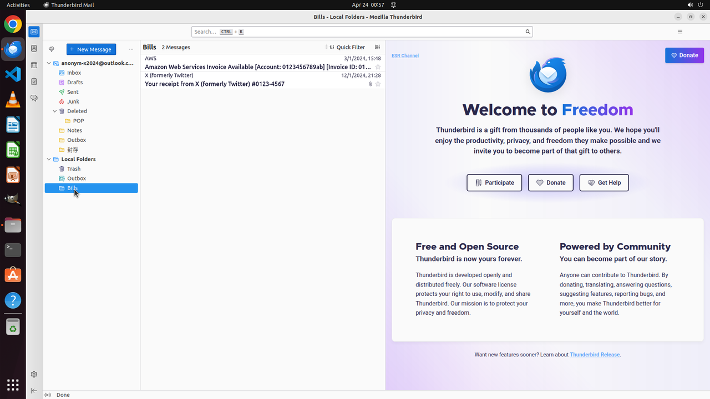

**Response:**
```
I can see the Bills folder has 2 messages. I need to click on the AWS invoice email to see its contents and attachment.
```

**Actions:** `pyautogui.click(694, 168)`

---

## Step 3

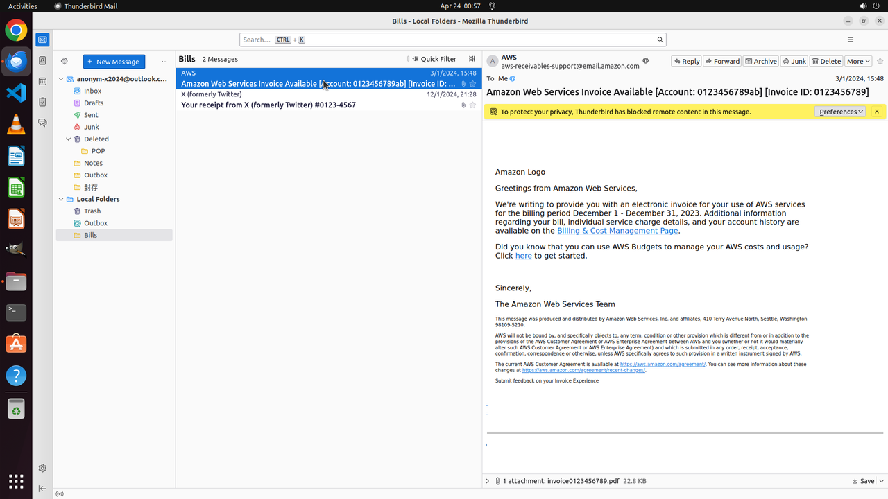

**Response:**
```
I can see the AWS invoice email for December 2023. There's an attachment "invoice0123456789.pdf" (22.8 KB) at the bottom. I need to:

1. First, check the "receipts" folder to understand the file naming pattern
2. Save the PDF attachment to the receipts folder
3. Update the tally book

Let me first open the file manager to find the receipts folder and understand the naming convention.
```

**Actions:** `pyautogui.click(33, 610)`

---

## Step 4

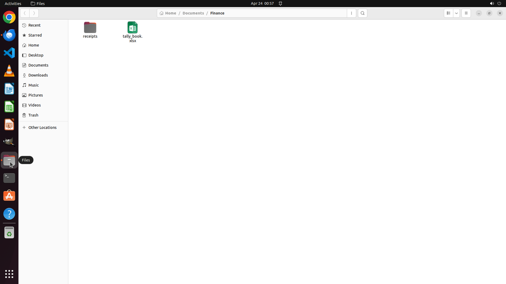

**Response:**
```
I can see the Finance folder with a "receipts" folder and a "tally_book.xlsx" file. Let me first check the receipts folder to understand the file naming pattern.
```

**Actions:** `pyautogui.doubleClick(340, 117)`

---

## Step 5

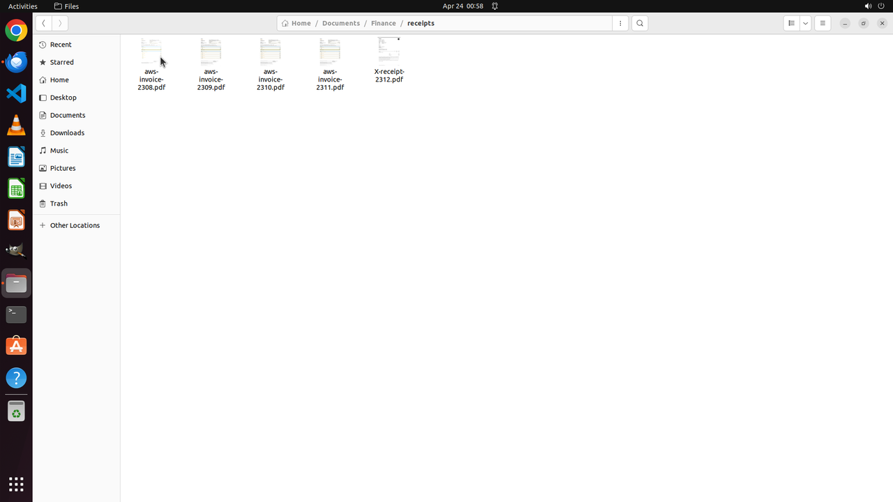

**Response:**
```
Now I can see the naming pattern in the receipts folder:
- `aws-invoice-2308.pdf` (August 2023)
- `aws-invoice-2309.pdf` (September 2023)
- `aws-invoice-2310.pdf` (October 2023)
- `aws-invoice-2311.pdf` (November 2023)
- `X-receipt-2312.pdf` (December 2023, X/Twitter receipt)

The AWS invoice naming pattern is `aws-invoice-YYMM.pdf`. Since the email is for December 2023, the file should be named `aws-invoice-2312.pdf`.

Now let me go back to Thunderbird and save the attachment. First, let me switch to Thunderbird.
```

**Actions:** `pyautogui.click(33, 337)`

---

## Step 6

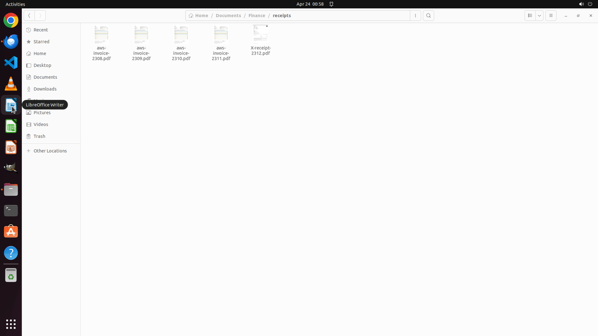

**Response:**
```
I see the tooltip shows "LibreOffice Writer" - I need to find the Thunderbird icon in the taskbar. Let me click on the Thunderbird icon instead.
```

**Actions:** `pyautogui.click(33, 133)`

---

## Step 7

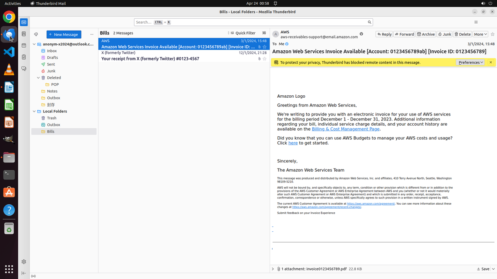

**Response:**
```
I'm back in Thunderbird with the AWS invoice email open. I can see the attachment "invoice0123456789.pdf" at the bottom. I need to save it with the name "aws-invoice-2312.pdf" to the receipts folder. Let me click on "Save" to save the attachment.
```

**Actions:** `pyautogui.click(1873, 1039)`

---

## Step 8

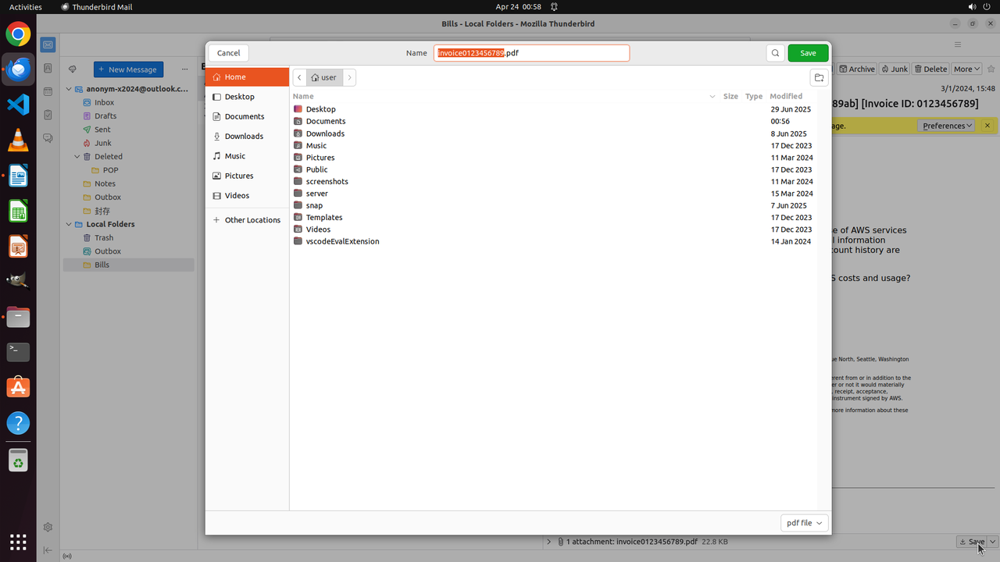

**Response:**
```
A save dialog has appeared. I need to:
1. Navigate to Documents > Finance > receipts
2. Rename the file to "aws-invoice-2312.pdf"

Let me first navigate to the Documents folder.
```

**Actions:** `pyautogui.click(469, 222)`

---

## Step 9

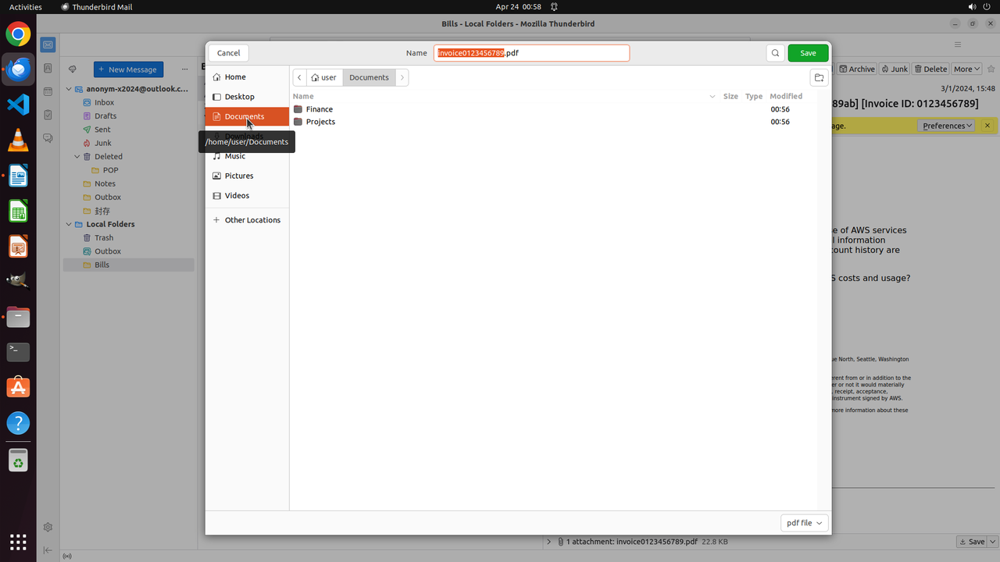

**Response:**
```
I can see the Documents folder with Finance and Projects subfolders. Let me navigate to Finance.
```

**Actions:** `pyautogui.doubleClick(615, 208)`

---

## Step 10

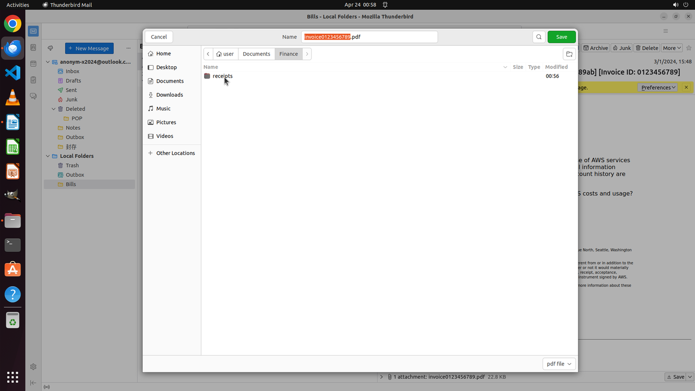

**Response:**
```
I can see the Finance folder with the "receipts" subfolder. Let me double-click on "receipts" to navigate into it.
```

**Actions:** `pyautogui.doubleClick(615, 208)`

---

## Step 11

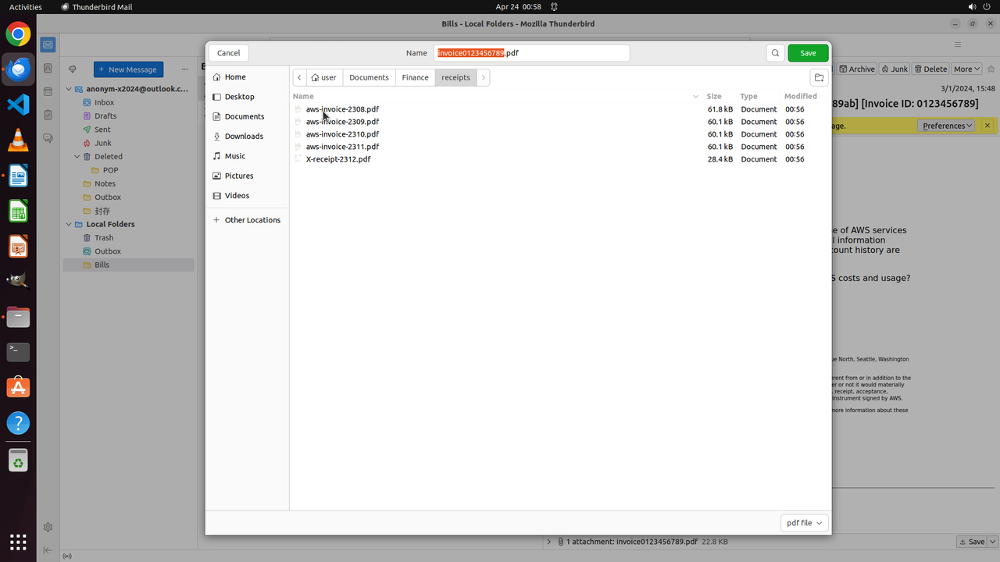

**Response:**
```
I'm now in the receipts folder and can see the existing files. I need to rename the file from "invoice0123456789.pdf" to "aws-invoice-2312.pdf" following the naming pattern. Let me clear the filename field and type the new name.
```

**Actions:** `pyautogui.tripleClick(1014, 100)`

---

## Step 12

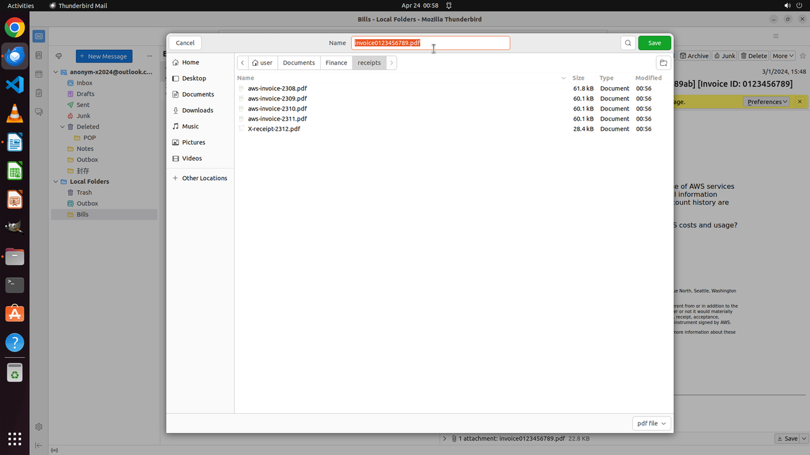

**Response:**
```
The filename is selected. Now I'll type the new filename following the pattern.
```

**Actions:** `import subprocess, shlex; subprocess.run(f'xdotool type --delay 12 -- ' + shlex.quote('aws-invoice-2312.pdf'), shell=True, check=True)
import time; time.sleep(0.05)`

---

## Step 13

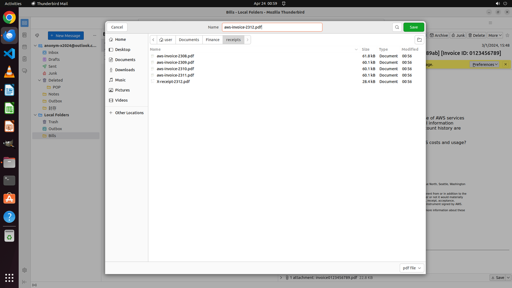

**Response:**
```
The filename is now "aws-invoice-2312.pdf" and I'm in the correct receipts folder. Let me click Save to save the file.
```

**Actions:** `pyautogui.click(1549, 100)`

---

## Step 14

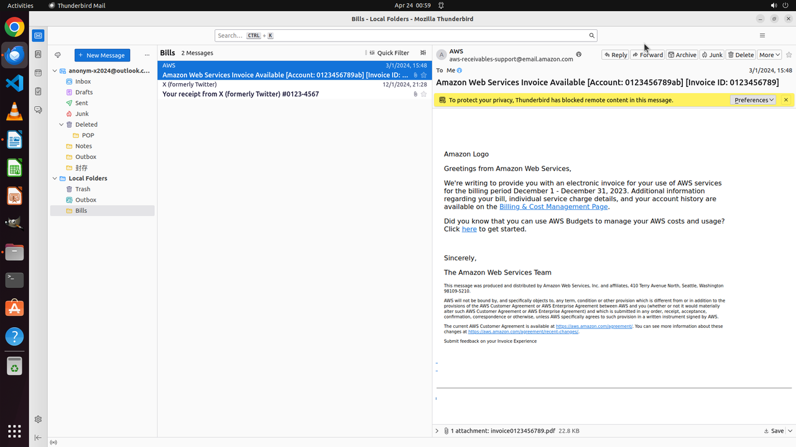

**Response:**
```
The PDF has been saved. Now I need to open the tally_book.xlsx file to see its contents and add a new record for the December AWS invoice. Let me first check the invoice PDF to get the amount, and then open the tally book. Let me first open the tally book to see the existing format.

Let me open a terminal to check the invoice and then open the tally book.
```

**Actions:** `pyautogui.click(33, 610)`

---

## Step 15

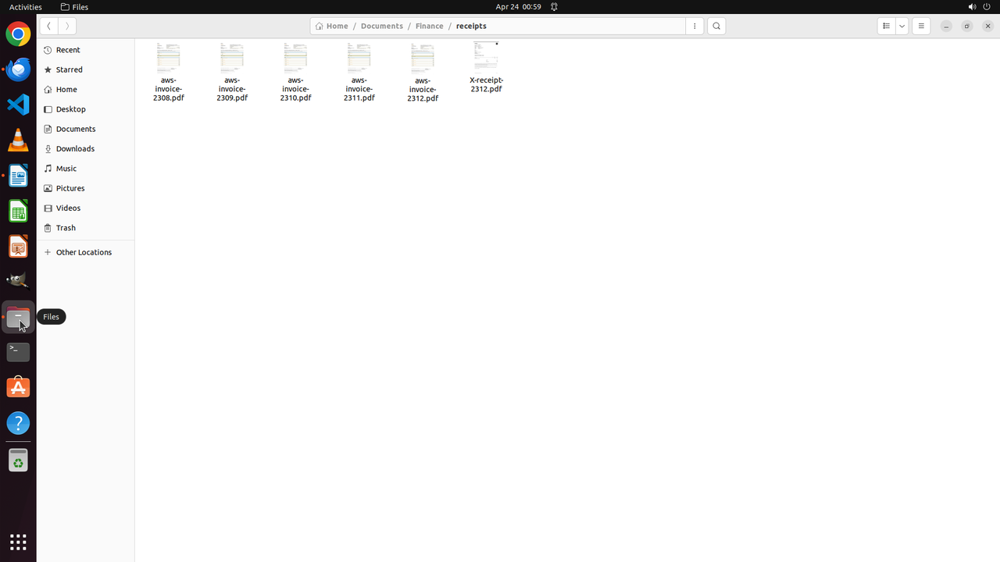

**Response:**
```
I can see the "aws-invoice-2312.pdf" file has been saved successfully in the receipts folder. Now I need to:

1. Open the AWS invoice PDF to get the invoice amount
2. Open the tally_book.xlsx to add a new record

Let me first open the invoice PDF to check the amount.
```

**Actions:** `pyautogui.doubleClick(811, 135)`

---

## Step 16

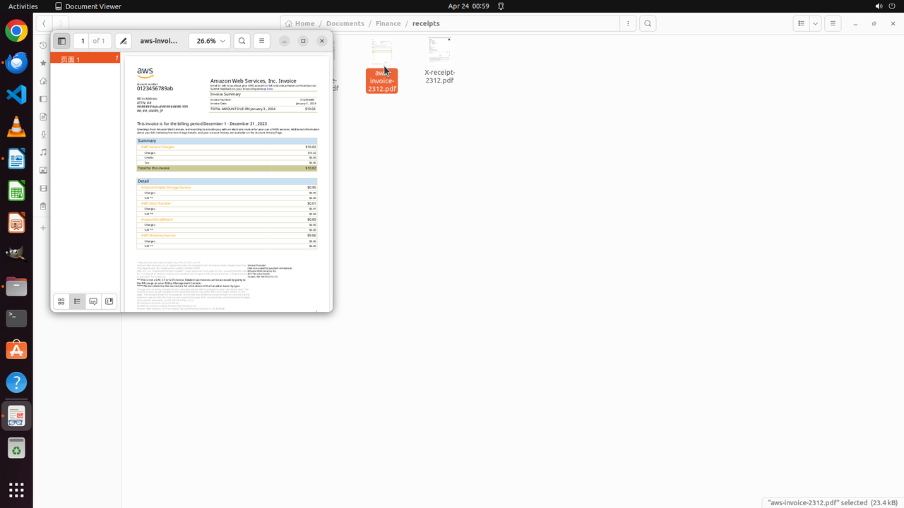

**Response:**
```
I can see the AWS invoice is open. I need to zoom in to read the details more clearly, especially the total amount. Let me zoom in to see the invoice details.
```

**Actions:** `pyautogui.click(450, 85)`

---

## Step 17

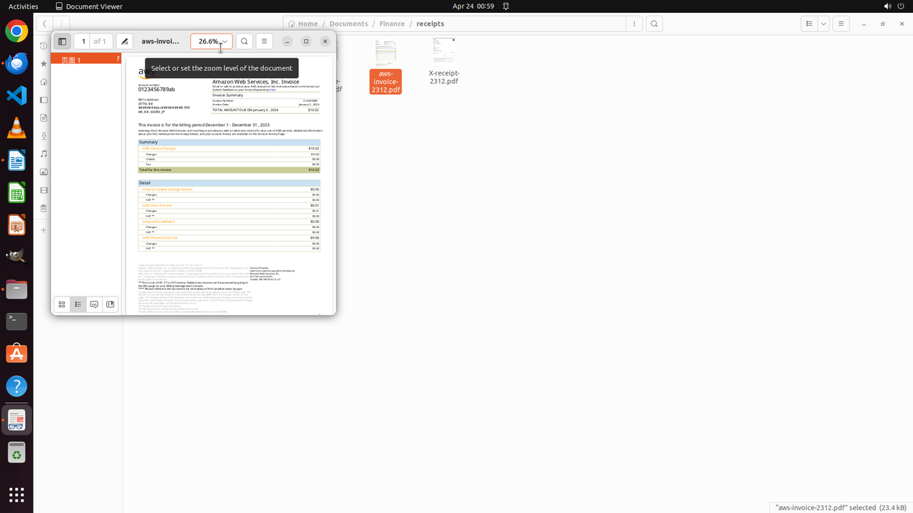

**Response:**
```
Let me zoom in more to read the invoice details clearly. I'll increase the zoom level.
```

**Actions:** `pyautogui.tripleClick(444, 85)`

---

## Step 18

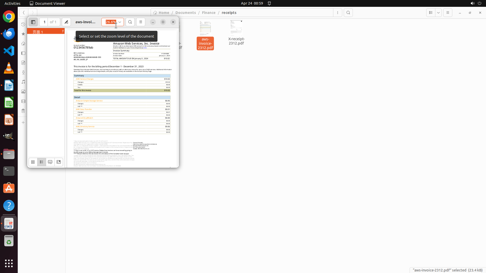

**Response:**
```
Let me type a higher zoom level to read the invoice details.
```

**Actions:** `import subprocess, shlex; subprocess.run(f'xdotool type --delay 12 -- ' + shlex.quote('100'), shell=True, check=True)
import time; time.sleep(0.05)`

---

## Step 19

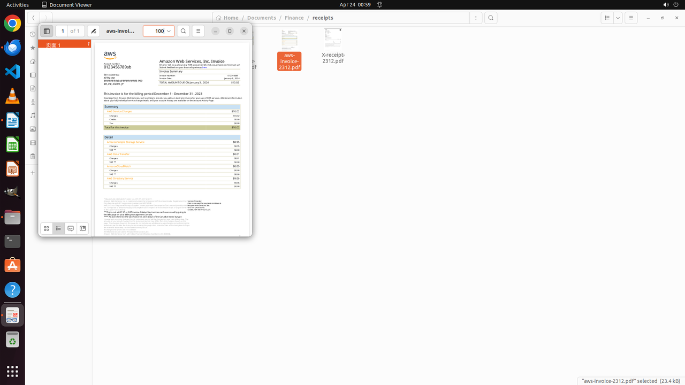

**Response:**
```
I need to press Enter to apply the zoom level.
```

**Actions:** `pyautogui.keyDown('return')
pyautogui.keyUp('return')`

---

## Step 20

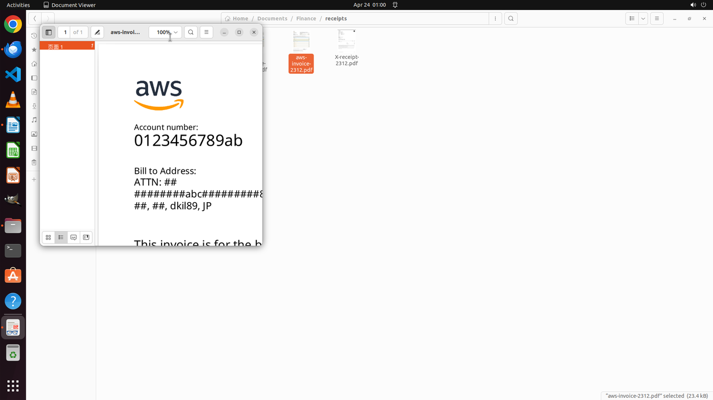

**Response:**
```
Now I can see the invoice at 100% zoom. I need to scroll down to see the invoice details including the total amount, invoice number, and date. Let me scroll down.
```

**Actions:** `pyautogui.scroll(-5, 450, 450)`

---

## Step 21

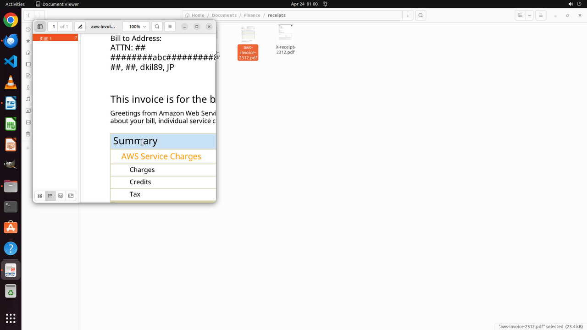

**Response:**
```
I can see the Summary section with AWS Service Charges, Charges, Credits, and Tax. I need to scroll right or make the window wider to see the amounts. But first, let me scroll down more to see the total and then I'll need to see the amounts on the right side.
```

**Actions:** `pyautogui.scroll(-3, 450, 450)`

---

## Step 22

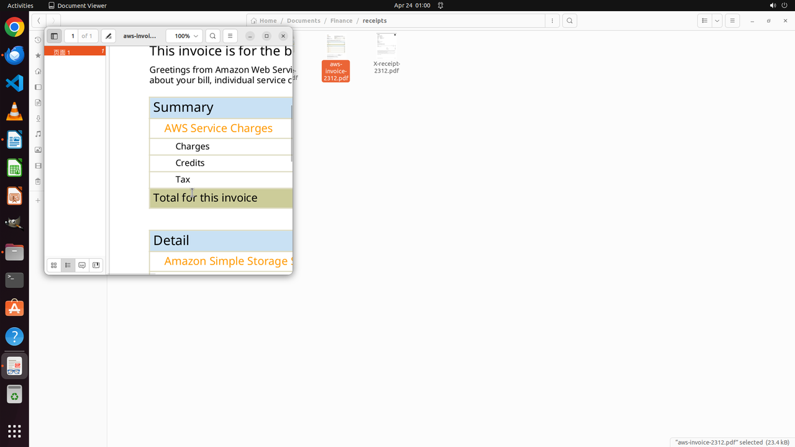

**Response:**
```
I can see the Summary section with "Total for this invoice" but I need to see the amounts on the right side. The amounts are cut off. Let me use a terminal to extract the text from the PDF to get the exact values. Let me open a terminal.
```

**Actions:** `pyautogui.click(33, 673)`

---

## Step 23


**Response:**
```
A terminal is open. Let me extract the text from the PDF to get the invoice details.
```

**Actions:** `import subprocess, shlex; subprocess.run(f'xdotool type --delay 12 -- ' + shlex.quote('pdftotext ~/Documents/Finance/receipts/aws-invoice'), shell=True, check=True)
import time; time.sleep(0.05)
impor`

---

## Step 24

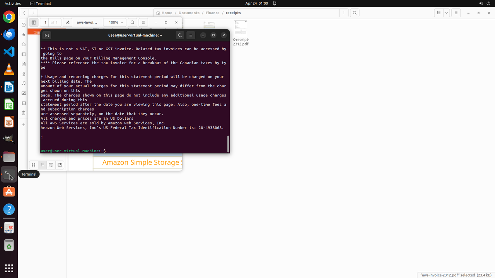

**Response:**
```
I can see the bottom part of the PDF text. I need to scroll up to see the invoice details including the total amount, invoice number, and date. Let me scroll up in the terminal.
```

**Actions:** `pyautogui.scroll(10, 525, 375)`

---

## Step 25


**Response:**
```
I can see some amounts. Let me scroll up more to see the full invoice details including the total amount and invoice number.
```

**Actions:** `pyautogui.scroll(15, 525, 375)`

---

## Step 26


**Response:**
```
I can see the key information:
- **Total for this invoice: $10.02**
- Charges: $10.02
- Credits: $0.00
- Tax: $0.00

Now I need to scroll up more to see the invoice number and date.
```

**Actions:** `pyautogui.scroll(10, 525, 375)`

---

## Step 27


**Response:**
```
Now I have all the invoice details:
- **Invoice Number:** 012345689
- **Invoice Date:** January 3, 2024
- **Total Amount Due:** $10.02
- **Billing Period:** December 1 - December 31, 2023

Now I need to open the tally_book.xlsx to see its format and add a new record. Let me first check the tally book contents.
```

**Actions:** `pyautogui.scroll(-20, 525, 375)`

---

## Step 28

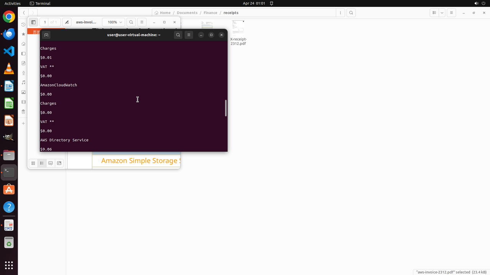

**Response:**
```
Now let me open the tally_book.xlsx to see its format. Let me scroll down to get to the terminal prompt first.
```

**Actions:** `pyautogui.scroll(-20, 525, 375)`

---

## Step 29


**Response:**
```
Good, I can see the terminal prompt. Now let me check the tally book contents using Python to read the xlsx file.
```

**Actions:** `pyautogui.click(525, 585)`

---

## Step 30


**Response:**
```
Now let me read the tally book to understand its format.
```

**Actions:** `import subprocess, shlex; subprocess.run(f'xdotool type --delay 12 -- ' + shlex.quote('python3 -c "\nimport openpyxl\nwb = openpyxl.load_wo'), shell=True, check=True)
import time; time.sleep(0.05)
imp`

---

## Step 31

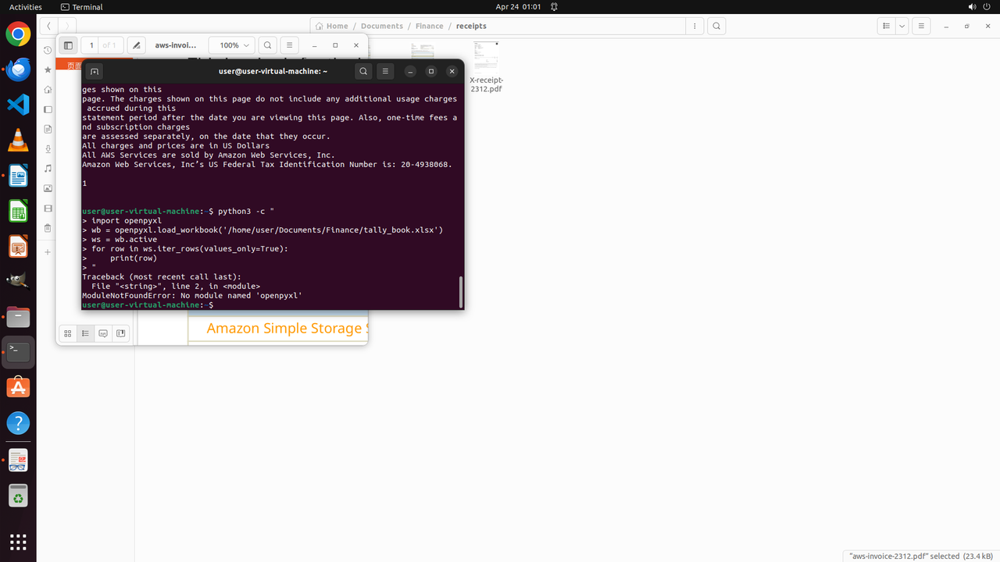

**Response:**
```
The `openpyxl` module is not installed. Let me install it first.
```

**Actions:** `import subprocess, shlex; subprocess.run(f'xdotool type --delay 12 -- ' + shlex.quote('pip3 install openpyxl\n'), shell=True, check=True)
import time; time.sleep(0.05)`

---

## Step 32

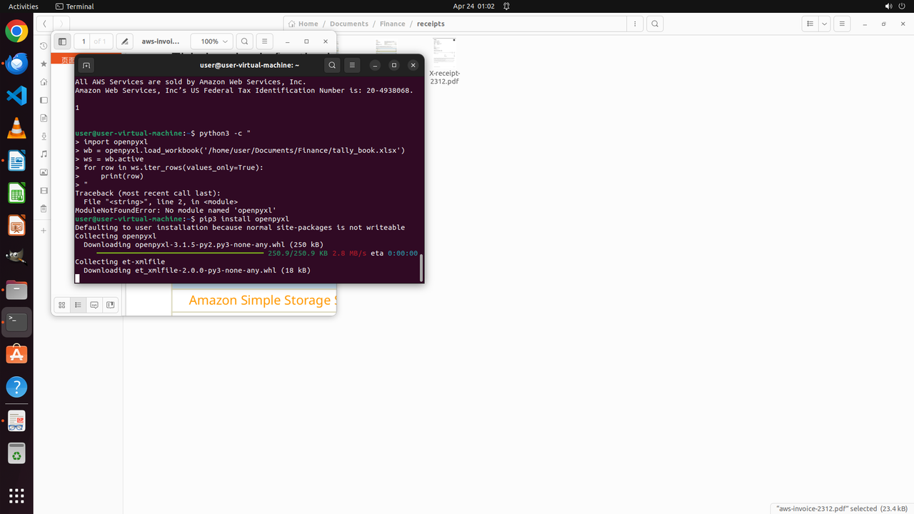

**Response:**
```
Good, openpyxl is being installed. Let me wait for it to finish.
```

**Actions:** `time.sleep(0.5)`

---

## Step 33

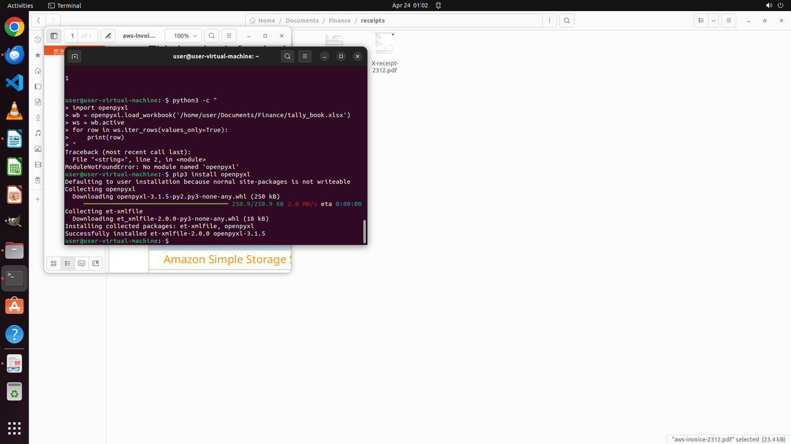

**Response:**
```
openpyxl is now installed. Let me now read the tally book to see its format.
```

**Actions:** `import subprocess, shlex; subprocess.run(f'xdotool type --delay 12 -- ' + shlex.quote('python3 -c "\nimport openpyxl\nwb = openpyxl.load_wo'), shell=True, check=True)
import time; time.sleep(0.05)
imp`

---

## Step 34


**Response:**
```
Now I can see the tally book format:
- Headers: `Service`, `Month`, `Amount`
- Existing records:
  - ('AWS', 2023.8, 1.14)
  - ('AWS', 2023.9, 1.01)
  - ('AWS', 2023.1, 1.02) - this seems to be 2023.10
  - ('AWS', 2023.11, 0.99)
  - ('X', 2023.12, 8)

Wait, let me look more carefully. The Month column values are: 2023.8, 2023.9, 2023.1, 2023.11, 2023.12. The 2023.1 seems odd - it might be 2023.10 stored as a number. Let me check the exact cell values and formatting more carefully.
```

**Actions:** `import subprocess, shlex; subprocess.run(f'xdotool type --delay 12 -- ' + shlex.quote('python3 -c "\nimport openpyxl\nwb = openpyxl.load_wo'), shell=True, check=True)
import time; time.sleep(0.05)
imp`

---

## Step 35


**Response:**
```
Now I can see the detailed structure. Let me scroll up to see the header row and first data row too.
```

**Actions:** `pyautogui.scroll(5, 525, 375)`

---

## Step 36


**Response:**
```
Now I have the full picture of the tally book:

**Headers (Row 1):** Service, Month, Amount
- Amount column has format: `'[$$-409]#,##0.00;[RED]\\-[$$-409]#,##0.00'`

**Data rows:**
- Row 2: AWS, 2023.8, 1.14
- Row 3: AWS, 2023.9, 1.01
- Row 4: AWS, 2023.1 (which is 2023.10), 1.02
- Row 5: AWS, 2023.11, 0.99
- Row 6: X, 2023.12, 8

The Month column uses format YYYY.M (year.month as float). For December 2023, the month value should be 2023.12. But wait, there's already an X entry for 2023.12. The AWS invoice is for December, so I need to add: AWS, 2023.12, 10.02.

Let me now add the new record to the tally book.
```

**Actions:** `pyautogui.scroll(-5, 525, 375)`

---

## Step 37


**Response:**
```
Now I have all the information I need. Let me add a new row to the tally book. The new record should be:
- Service: 'AWS'
- Month: 2023.12 (float)
- Amount: 10.02 (float, with the same currency format)
```

**Actions:** `import subprocess, shlex; subprocess.run(f'xdotool type --delay 12 -- ' + shlex.quote('python3 -c "\nimport openpyxl\nwb = openpyxl.load_wo'), shell=True, check=True)
import time; time.sleep(0.05)
imp`

---

## Step 38

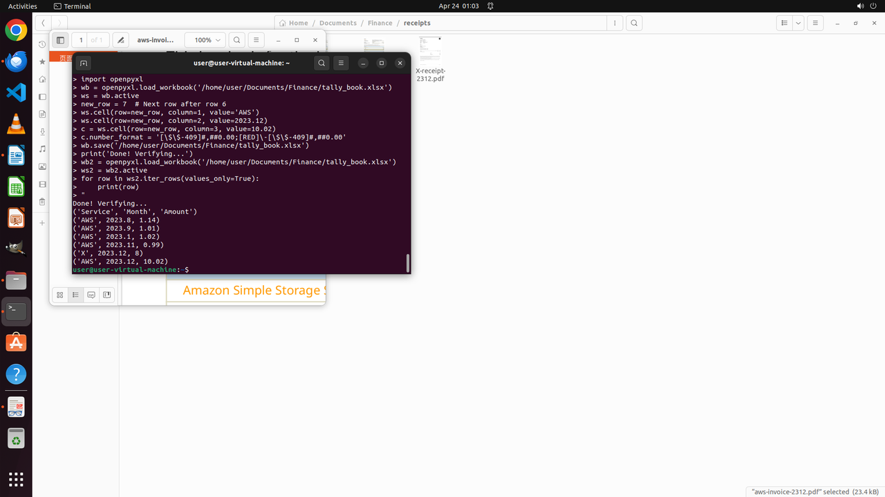

**Response:**
```
The tally book has been updated successfully. I can see the verification output shows the new row has been added:

```
('Service', 'Month', 'Amount')
('AWS', 2023.8, 1.14)
('AWS', 2023.9, 1.01)
('AWS', 2023.1, 1.02)
('AWS', 2023.11, 0.99)
('X', 2023.12, 8)
('AWS', 2023.12, 10.02)  <-- New record added
```

Let me now verify everything is complete by checking both the saved PDF and the tally book:

1. ✅ AWS invoice PDF saved as `aws-invoice-2312.pdf` in the receipts folder (following the naming pattern)
2. ✅ New record appended to tally_book.xlsx: AWS, 2023.12, $10.02

Both tasks are complete. Let me also verify the file exists in the receipts folder.
```

**Actions:** `import subprocess, shlex; subprocess.run(f'xdotool type --delay 12 -- ' + shlex.quote('ls -la ~/Documents/Finance/receipts/\n'), shell=True, check=True)
import time; time.sleep(0.05)`

---

## Step 39

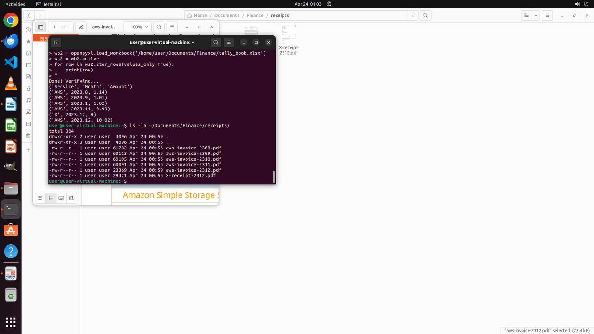

**Response:**
```
Everything is confirmed. The receipts folder now contains:

1. `aws-invoice-2308.pdf` - August 2023
2. `aws-invoice-2309.pdf` - September 2023
3. `aws-invoice-2310.pdf` - October 2023
4. `aws-invoice-2311.pdf` - November 2023
5. **`aws-invoice-2312.pdf`** - December 2023 (newly saved)
6. `X-receipt-2312.pdf` - December 2023 X/Twitter receipt

And the tally book has been updated with the new record:
- ('AWS', 2023.12, 10.02)

Both tasks are complete:
- ✅ Extracted the AWS invoice PDF from the email and saved it to the receipts folder with the correct naming pattern (`aws-invoice-2312.pdf`)
- ✅ Appended a new record to the tally book with Service=AWS, Month=2023.12, Amount=$10.02

DONE
```

**Actions:** `DONE`

---
