# Task 415ef462-bed3-493a-ac36-ca8c6d23bf1b

**Instruction:** There's an e-mail containing the AWS invoice for December saved in local "Bills" folder. Extract the invoice PDF to the my receipts folder. Follow the file name pattern of the old files and append a record at the end of my tally book.

**Score:** 1.0

**Wall clock:** 6m 23s

**Steps:** 40

**Cost:** $1.40

---

## Step 1

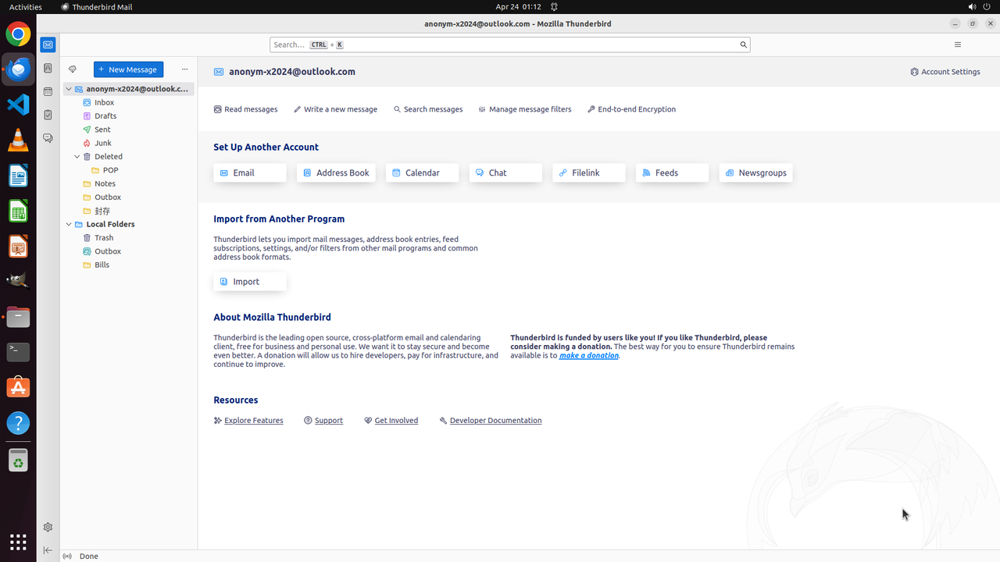

**Response:**
```
I'll start by examining the Bills folder in Thunderbird to find the AWS invoice email, and also check the receipts folder to understand the file naming pattern.
```

**Actions:** `pyautogui.click(196, 507)`

---

## Step 2

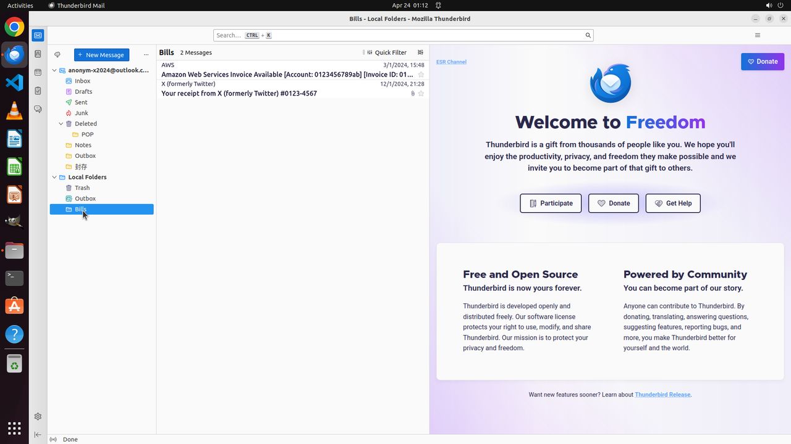

**Response:**
```
I can see the Bills folder has 2 messages. I need to find the AWS invoice for December. Let me click on the AWS email first to see its details.
```

**Actions:** `pyautogui.click(694, 168)`

---

## Step 3

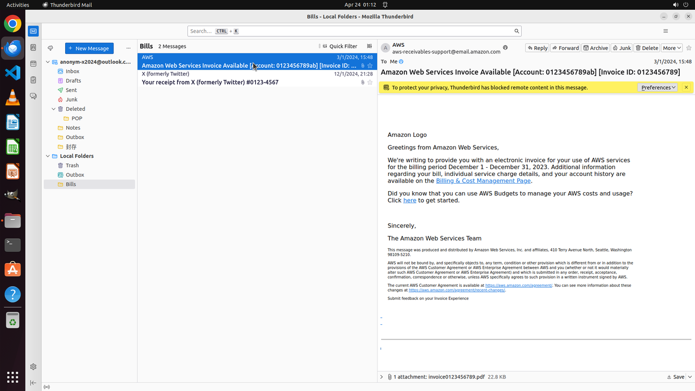

**Response:**
```
I can see the AWS invoice email for the billing period December 1 - December 31, 2023. It has an attachment "invoice0123456789.pdf" (22.8 KB). Now I need to:

1. First, check the receipts folder to understand the file naming pattern
2. Save the PDF attachment
3. Check the tally book

Let me first open the file manager to find the receipts folder and understand the naming pattern.
```

**Actions:** `pyautogui.click(33, 610)`

---

## Step 4

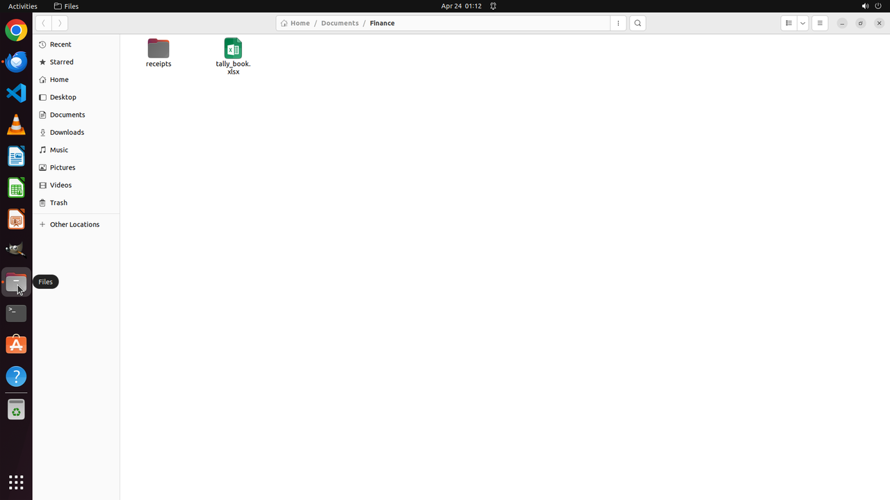

**Response:**
```
I can see the Finance folder with a "receipts" folder and a "tally_book.xlsx" file. Let me first check the receipts folder to see the existing file naming pattern.
```

**Actions:** `pyautogui.doubleClick(340, 112)`

---

## Step 5

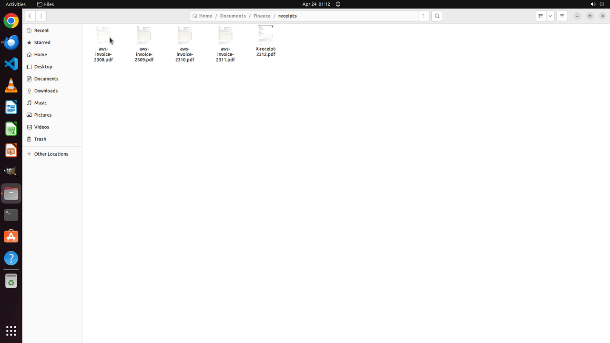

**Response:**
```
I can see the naming pattern in the receipts folder:
- `aws-invoice-2308.pdf` (August 2023)
- `aws-invoice-2309.pdf` (September 2023)
- `aws-invoice-2310.pdf` (October 2023)
- `aws-invoice-2311.pdf` (November 2023)
- `X-receipt-2312.pdf` (December 2023 - X/Twitter receipt)

The AWS invoice naming pattern is `aws-invoice-YYMM.pdf`. For December 2023, the file should be named `aws-invoice-2312.pdf`.

Now let me save the attachment from the email. Let me go back to Thunderbird and save the attachment.
```

**Actions:** `pyautogui.click(33, 337)`

---

## Step 6

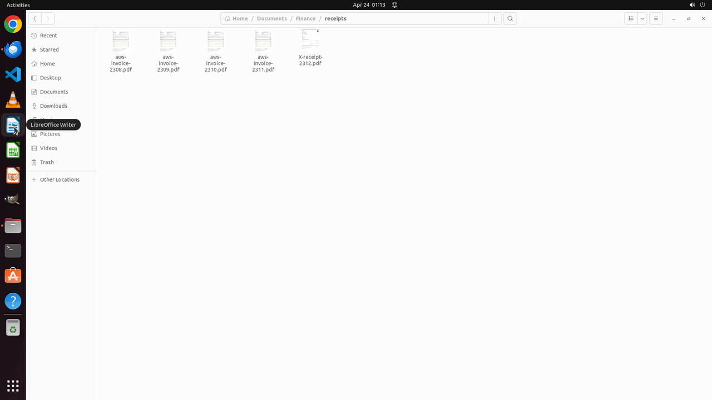

**Response:**
```
I need to go back to Thunderbird. Let me click on the Thunderbird icon in the taskbar.
```

**Actions:** `pyautogui.click(33, 133)`

---

## Step 7

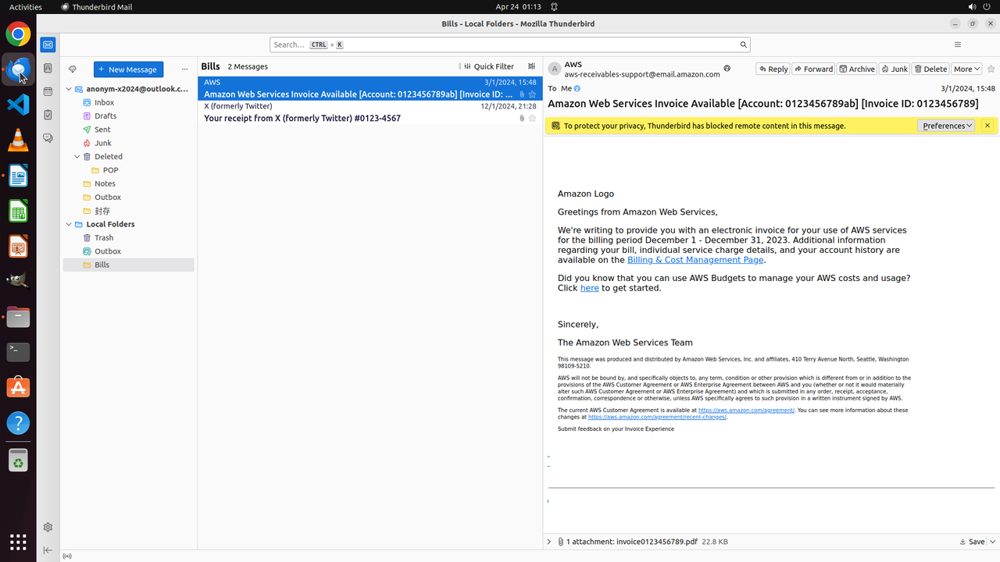

**Response:**
```
I can see the AWS invoice email with the attachment "invoice0123456789.pdf". I need to save this attachment. Let me click on the "Save" button at the bottom right to save the attachment.
```

**Actions:** `pyautogui.click(1906, 1039)`

---

## Step 8

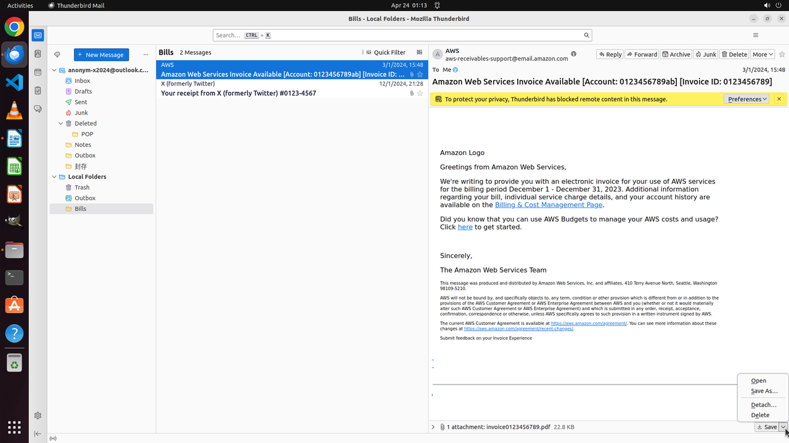

**Response:**
```
I can see a dropdown menu with options. Let me click "Save As..." to save the attachment to a specific location with a specific name.
```

**Actions:** `pyautogui.click(1855, 954)`

---

## Step 9

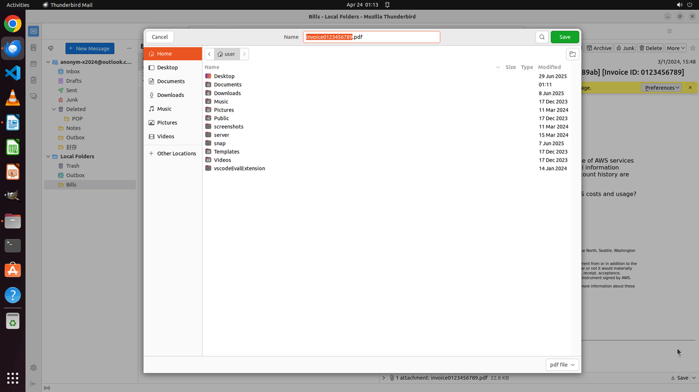

**Response:**
```
I can see the Save As dialog. I need to:
1. Navigate to Documents > Finance > receipts
2. Change the filename to `aws-invoice-2312.pdf`

Let me first navigate to the Documents folder.
```

**Actions:** `pyautogui.click(469, 222)`

---

## Step 10

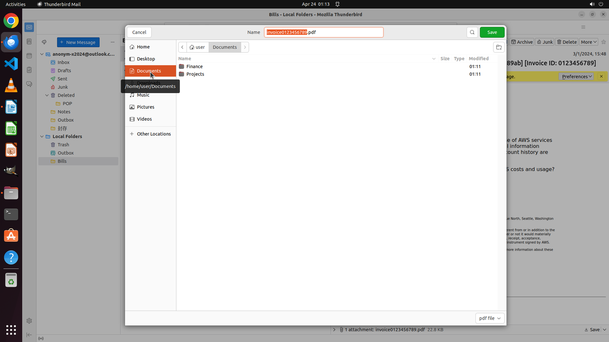

**Response:**
```
I can see the Documents folder with Finance and Projects subfolders. Let me navigate to Finance.
```

**Actions:** `pyautogui.doubleClick(613, 208)`

---

## Step 11

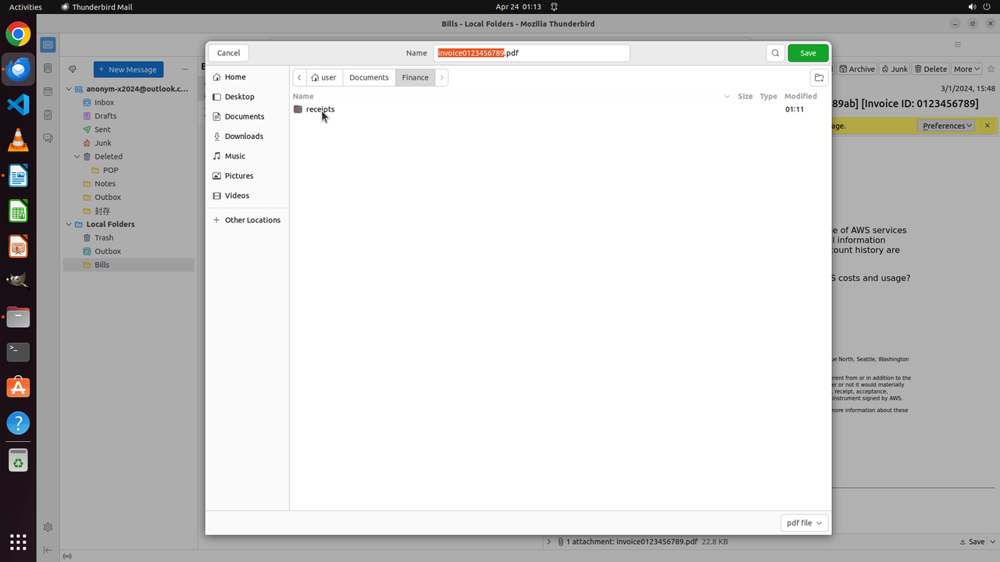

**Response:**
```
I can see the Finance folder with the receipts subfolder. Let me navigate into the receipts folder.
```

**Actions:** `pyautogui.doubleClick(613, 208)`

---

## Step 12

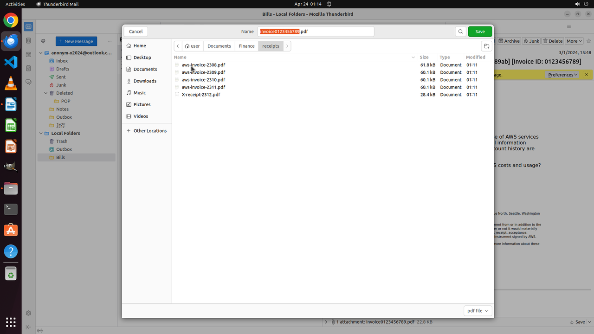

**Response:**
```
I'm now in the receipts folder. I can see the existing files:
- aws-invoice-2308.pdf
- aws-invoice-2309.pdf
- aws-invoice-2310.pdf
- aws-invoice-2311.pdf
- X-receipt-2312.pdf

The naming pattern for AWS invoices is `aws-invoice-YYMM.pdf`. For December 2023, I need to name the file `aws-invoice-2312.pdf`. Let me change the filename in the Name field.
```

**Actions:** `pyautogui.tripleClick(1014, 100)`

---

## Step 13

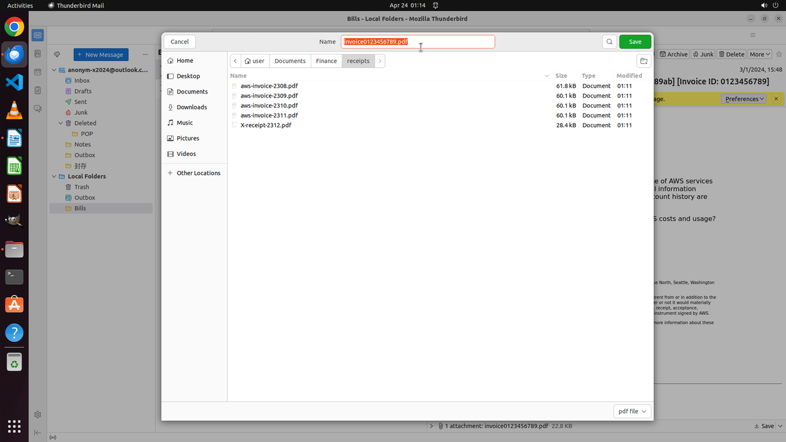

**Response:**
```
The filename is selected. Now let me type the new filename following the naming pattern.
```

**Actions:** `import subprocess, shlex; subprocess.run(f'xdotool type --delay 12 -- ' + shlex.quote('aws-invoice-2312.pdf'), shell=True, check=True)
import time; time.sleep(0.05)`

---

## Step 14

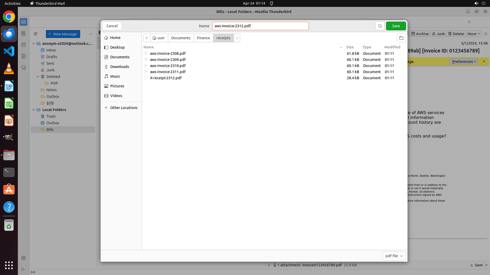

**Response:**
```
The filename is set to "aws-invoice-2312.pdf" and I'm in the correct directory (Documents/Finance/receipts). Now let me click Save.
```

**Actions:** `pyautogui.click(1549, 100)`

---

## Step 15

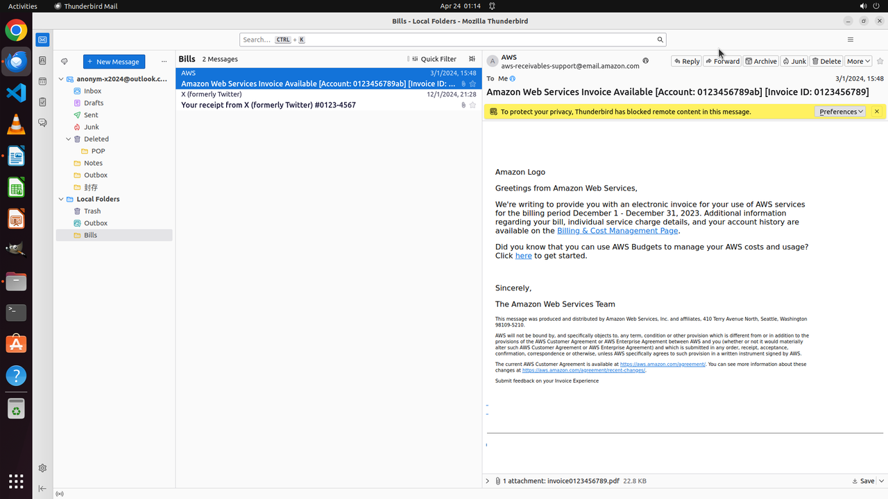

**Response:**
```
The PDF has been saved. Now I need to:
1. Open the PDF to check the invoice amount (I need this for the tally book)
2. Open the tally book to understand its format and add a new record

Let me first open the PDF to check the invoice details, and also open the tally book. Let me first check the PDF content by opening it. But first, let me open the tally book to understand its format. Let me open the terminal to check the PDF content, or I can open the tally book directly.

Let me open the tally book first to see its format.
```

**Actions:** `pyautogui.click(33, 610)`

---

## Step 16

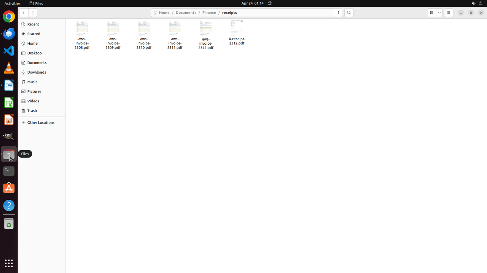

**Response:**
```
The file `aws-invoice-2312.pdf` has been saved successfully in the receipts folder. Now I need to:
1. Open the PDF to check the invoice amount
2. Open the tally book to understand its format and add a new record

Let me first open the PDF to see the invoice details.
```

**Actions:** `pyautogui.doubleClick(811, 135)`

---

## Step 17

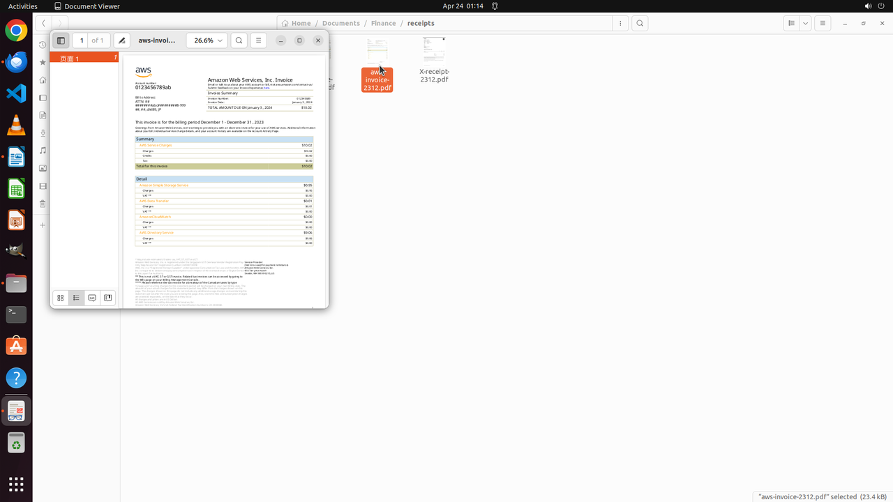

**Response:**
```
I can see the AWS invoice PDF. Let me zoom in to read the details more clearly, especially the total amount.
```

**Actions:** `pyautogui.click(450, 85)`

---

## Step 18

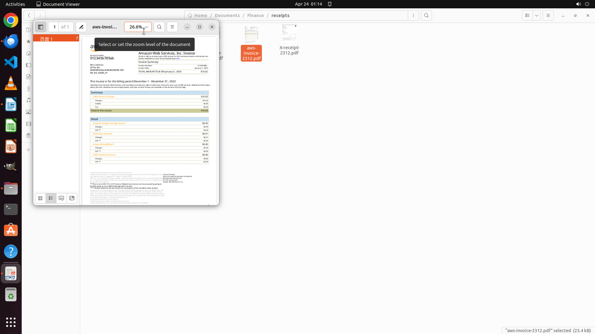

**Response:**
```
Let me zoom in more to read the invoice details clearly. I'll increase the zoom level.
```

**Actions:** `pyautogui.tripleClick(444, 85)`

---

## Step 19

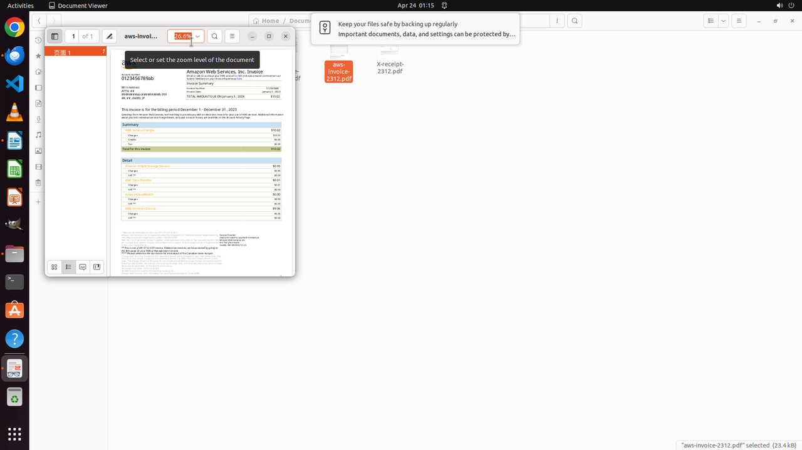

**Response:**
```
Let me type a higher zoom level to see the invoice details more clearly.
```

**Actions:** `import subprocess, shlex; subprocess.run(f'xdotool type --delay 12 -- ' + shlex.quote('100'), shell=True, check=True)
import time; time.sleep(0.05)`

---

## Step 20

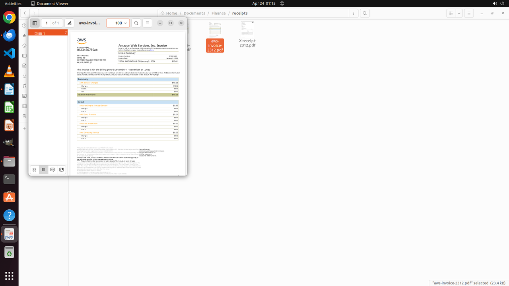

**Response:**
```
Let me press Enter to apply the zoom level.
```

**Actions:** `pyautogui.keyDown('return')
pyautogui.keyUp('return')`

---

## Step 21

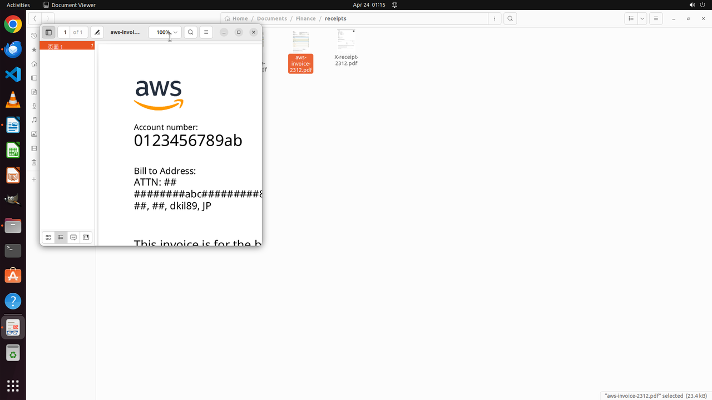

**Response:**
```
Now I can see the invoice at 100% zoom. I need to scroll down to see the summary section with the total amount. Let me scroll down.
```

**Actions:** `pyautogui.scroll(-5, 450, 450)`

---

## Step 22

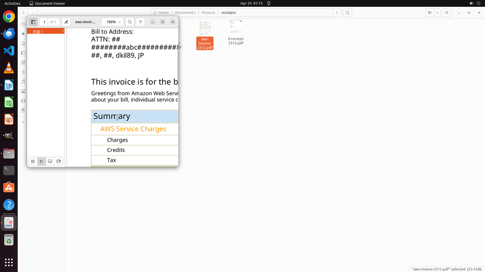

**Response:**
```
I can see the Summary section. I need to scroll right or down more to see the amounts. Let me scroll down more to see the full summary and total.
```

**Actions:** `pyautogui.scroll(-3, 450, 450)`

---

## Step 23

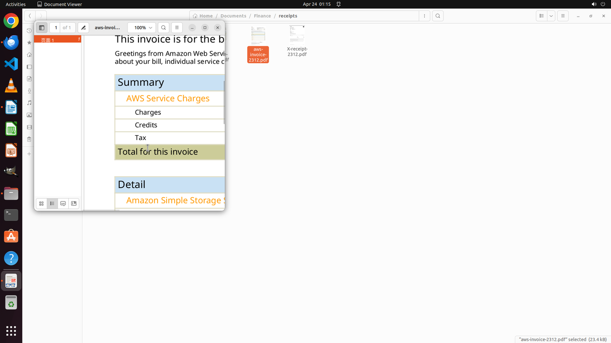

**Response:**
```
I can see the summary table but the amounts are cut off on the right side. I need to scroll right to see the dollar amounts. Let me use the terminal to extract the text from the PDF to get the exact amounts. Let me open a terminal.
```

**Actions:** `pyautogui.hscroll(5, 450, 450)`

---

## Step 24

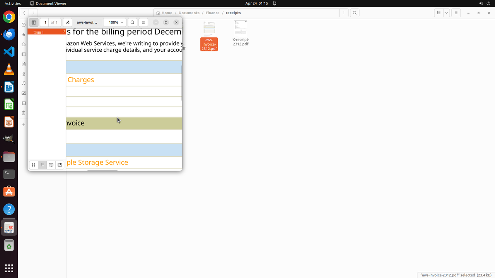

**Response:**
```
I still can't see the amounts clearly. Let me use a terminal to extract the text from the PDF to get the exact invoice details. Let me open a terminal.
```

**Actions:** `pyautogui.hscroll(10, 450, 450)`

---

## Step 25

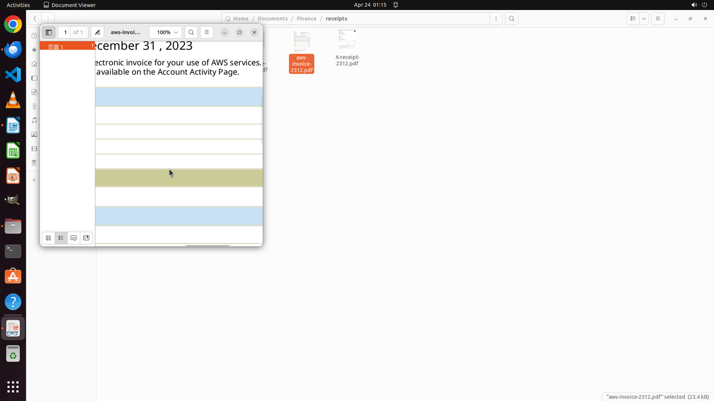

**Response:**
```
I still can't see the amounts. The table seems to extend beyond the visible area. Let me use the terminal to extract the text from the PDF. Let me open a terminal application.
```

**Actions:** `pyautogui.click(33, 673)`

---

## Step 26


**Response:**
```
A terminal is open. Let me extract the text from the PDF to see the invoice details.
```

**Actions:** `import subprocess, shlex; subprocess.run(f'xdotool type --delay 12 -- ' + shlex.quote('pdftotext ~/Documents/Finance/receipts/aws-invoice'), shell=True, check=True)
import time; time.sleep(0.05)
impor`

---

## Step 27

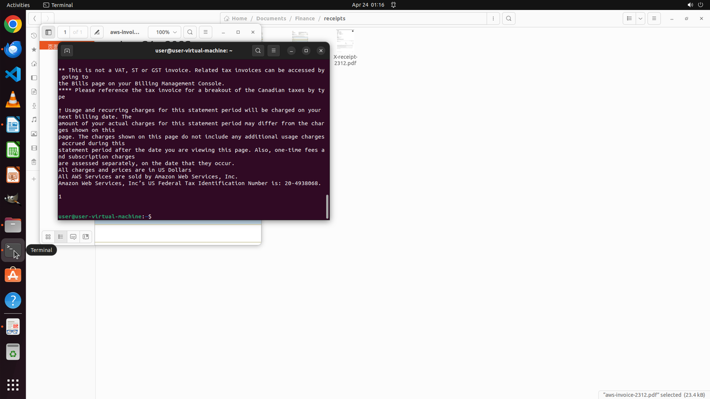

**Response:**
```
I can see the PDF text was extracted. Let me scroll up to see the full invoice details including the amounts.
```

**Actions:** `pyautogui.scroll(10, 525, 375)`

---

## Step 28

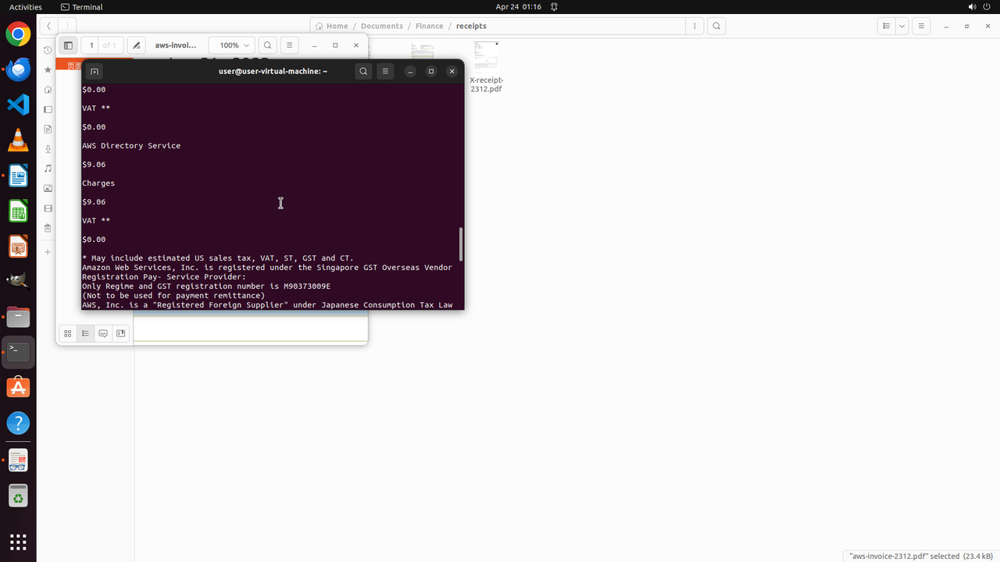

**Response:**
```
I can see some details. Let me scroll up more to see the full invoice summary including the total amount.
```

**Actions:** `pyautogui.scroll(15, 525, 375)`

---

## Step 29

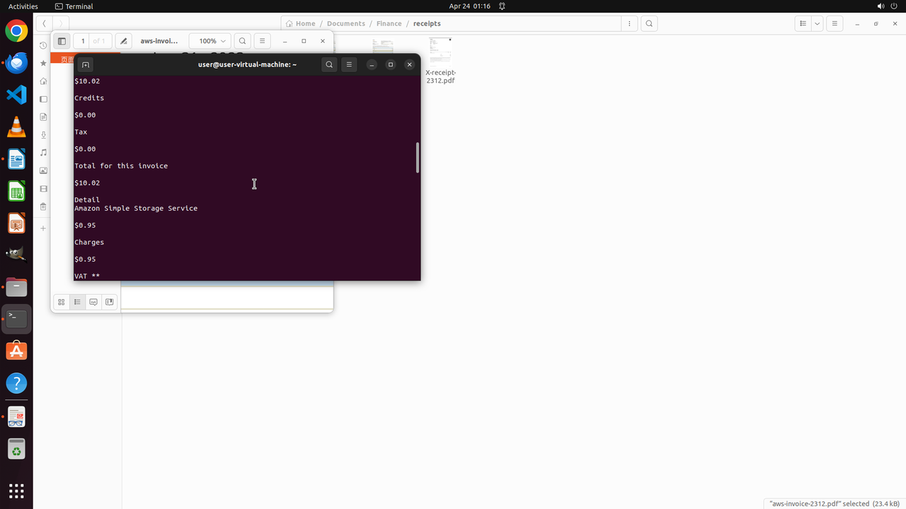

**Response:**
```
Now I can see the key information:
- **Total for this invoice: $10.02**
- Credits: $0.00
- Tax: $0.00

Let me scroll up more to see the invoice number and date.
```

**Actions:** `pyautogui.scroll(10, 525, 375)`

---

## Step 30


**Response:**
```
Now I have all the invoice details:
- **Invoice Number:** 012345689
- **Invoice Date:** January 3, 2024
- **Total Amount:** $10.02
- **Billing Period:** December 1 - December 31, 2023

Now I need to open the tally book (tally_book.xlsx) to see its format and add a new record. Let me open it.
```

**Actions:** `import subprocess, shlex; subprocess.run(f'xdotool type --delay 12 -- ' + shlex.quote('libreoffice --calc ~/Documents/Finance/tally_book.'), shell=True, check=True)
import time; time.sleep(0.05)
impor`

---

## Step 31

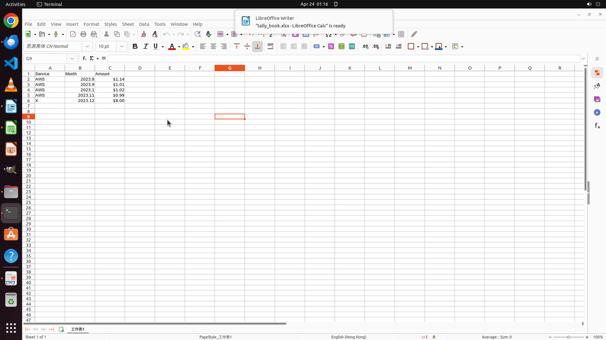

**Response:**
```
Excellent! Now I can see the tally book format. The columns are:
- **A: Service** (AWS, X)
- **B: Month** (2023.8, 2023.9, 2023.1, 2023.11, 2023.12)
- **C: Amount** ($1.14, $1.01, $1.02, $0.99, $8.00)

I notice row 4 shows "2023.1" which should probably be "2023.10" (October). The pattern is:
- Row 2: AWS, 2023.8, $1.14
- Row 3: AWS, 2023.9, $1.01
- Row 4: AWS, 2023.1, $1.02 (likely 2023.10)
- Row 5: AWS, 2023.11, $0.99
- Row 6: X, 2023.12, $8.00

I need to add a new row for the AWS December invoice. The total was $10.02. Let me click on cell A7 to start adding the new record.
```

**Actions:** `pyautogui.click(159, 336)`

---

## Step 32

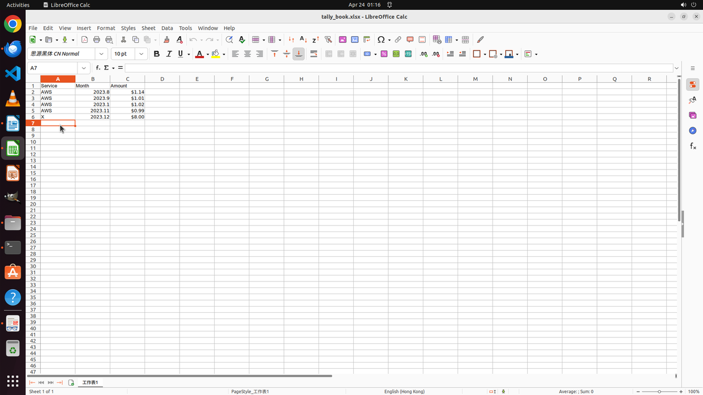

**Response:**
```
I'm now in cell A7. Let me first check the existing data more carefully. Let me click on cell B4 to see if it's "2023.1" or "2023.10".
```

**Actions:** `pyautogui.click(252, 285)`

---

## Step 33

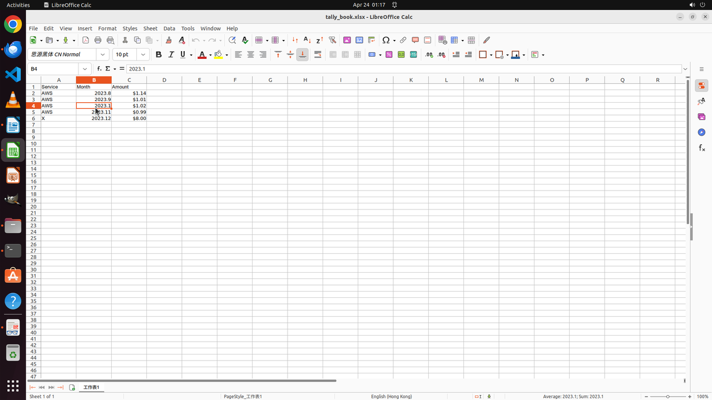

**Response:**
```
I can see that B4 contains "2023.1" (which represents October, but the column is just showing the number as-is). The formula bar shows "2023.1". Looking at the pattern:
- 2023.8 (August)
- 2023.9 (September)
- 2023.1 (October - this seems to be 2023.10 but displayed as 2023.1)
- 2023.11 (November)
- 2023.12 (December)

Wait, actually looking more carefully, "2023.1" could be 2023.10 that got truncated. The status bar shows "Average: 2023.1; Sum: 2023.1" which confirms it's stored as the number 2023.1. But given the sequence (Aug, Sep, then this, Nov, Dec), it should be October (2023.10). The value 2023.10 would display as 2023.1 since trailing zeros are dropped.

Now let me check the Amount column format. Let me click on C2.
```

**Actions:** `pyautogui.click(348, 250)`

---

## Step 34

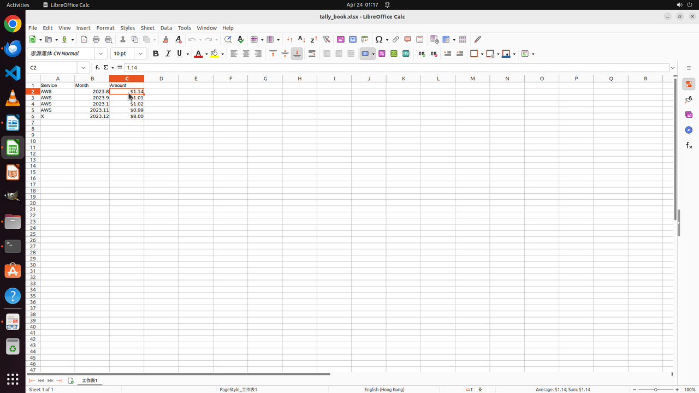

**Response:**
```
I can see that C2 contains the value 1.14 (displayed as $1.14 with currency formatting). Now I have all the information I need. Let me add the new record for the AWS December invoice.

The new row should be:
- A7: AWS
- B7: 2023.12
- C7: $10.02

Now let me click on cell A7 and start entering data.
```

**Actions:** `pyautogui.click(159, 336)`

---

## Step 35


**Response:**
```
I'm in cell A7. Now I need to type the data for the new record. The format follows the existing pattern. Type "AWS" and then Tab to move to the next cell.
```

**Actions:** `import subprocess, shlex; subprocess.run(f'xdotool type --delay 12 -- ' + shlex.quote('AWS\t2023.12\t10.02\n'), shell=True, check=True)
import time; time.sleep(0.05)`

---

## Step 36

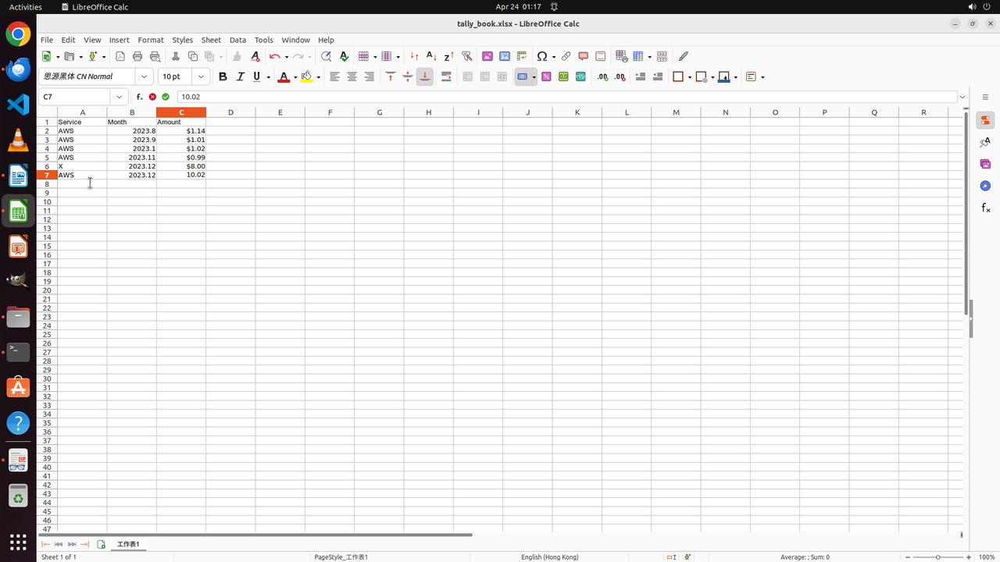

**Response:**
```
I can see the new record has been added in row 7:
- A7: AWS
- B7: 2023.12
- C7: 10.02

But I notice that C7 shows "10.02" without the dollar sign formatting. I need to format it to match the other cells. Also, I need to confirm the entry first. Let me click the green checkmark to confirm.
```

**Actions:** `pyautogui.click(319, 183)`

---

## Step 37


**Response:**
```
The new record has been added successfully in row 7:
- A7: AWS
- B7: 2023.12
- C7: $10.02

The currency formatting was automatically applied, and the status bar shows "Average: $10.02; Sum: $10.02". The data looks correct.

Now I need to save the file. Let me press Ctrl+S.
```

**Actions:** `pyautogui.keyDown('ctrl')
pyautogui.keyDown('s')
pyautogui.keyUp('s')
pyautogui.keyUp('ctrl')`

---

## Step 38


**Response:**
```
The file appears to have been saved (since it's an xlsx file, it may have saved directly without a dialog). The title still shows "tally_book.xlsx - LibreOffice Calc" without any modification indicator.

Let me verify everything is complete by checking:
1. ✅ The AWS invoice PDF has been saved as `aws-invoice-2312.pdf` in the receipts folder
2. ✅ The tally book has been updated with the new record (AWS, 2023.12, $10.02)

Wait - I should check if the file was saved in xlsx format. Sometimes LibreOffice might prompt for format. Let me try saving again to make sure.
```

**Actions:** `pyautogui.keyDown('ctrl')
pyautogui.keyDown('s')
pyautogui.keyUp('s')
pyautogui.keyUp('ctrl')`

---

## Step 39

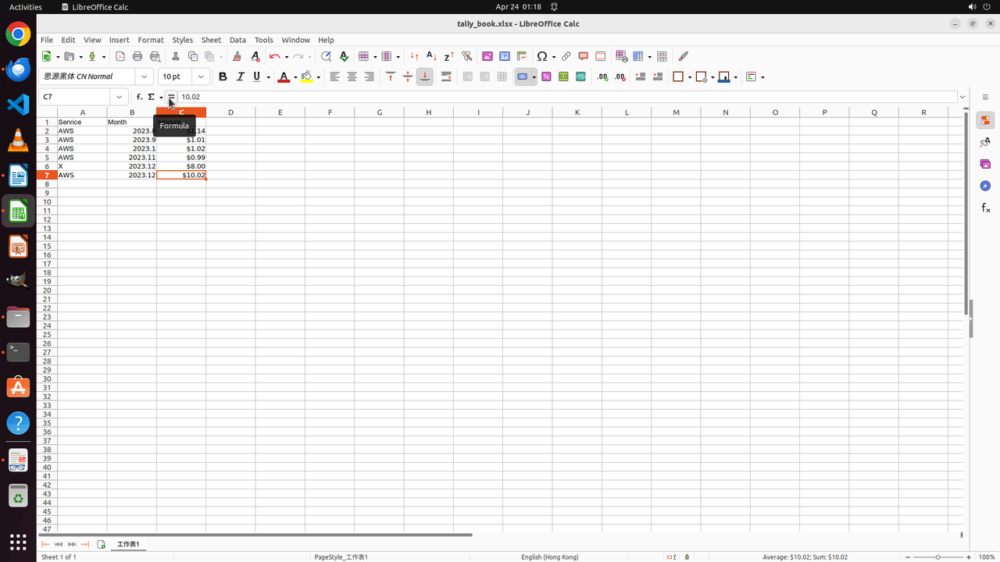

**Response:**
```
The file has been saved successfully. I can see a tooltip showing "Formula" which is just a hover tooltip on the column header. The file is saved as `tally_book.xlsx`.

Let me click somewhere else to dismiss the tooltip and verify the final state.
```

**Actions:** `pyautogui.click(600, 450)`

---

## Step 40

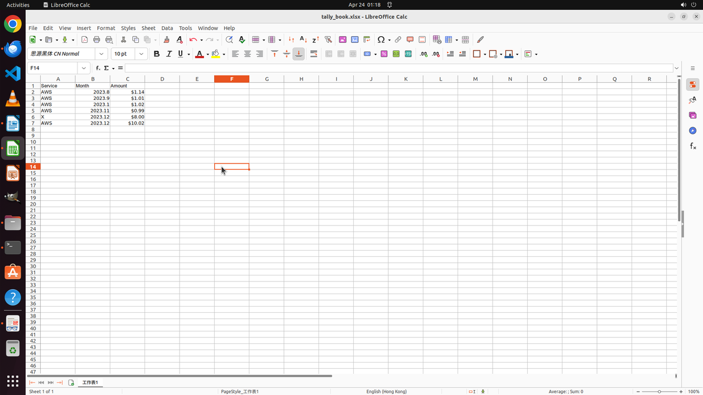

**Response:**
```
The task is now complete. Let me verify everything that was done:

1. ✅ **Found the AWS invoice email** in the Bills folder in Thunderbird - it was for December 2023 billing period
2. ✅ **Extracted the invoice PDF** (`invoice0123456789.pdf`) and saved it as `aws-invoice-2312.pdf` in `~/Documents/Finance/receipts/` following the naming pattern of existing files (e.g., `aws-invoice-2308.pdf`, `aws-invoice-2309.pdf`, etc.)
3. ✅ **Appended a record** to the tally book (`tally_book.xlsx`) with:
   - Service: AWS
   - Month: 2023.12
   - Amount: $10.02

DONE
```

**Actions:** `DONE`

---
