# Task 415ef462-bed3-493a-ac36-ca8c6d23bf1b

**Instruction:** There's an e-mail containing the AWS invoice for December saved in local "Bills" folder. Extract the invoice PDF to the my receipts folder. Follow the file name pattern of the old files and append a record at the end of my tally book.

**Score:** 1.0

**Wall clock:** 10m 13s

**Steps:** 33

**Cost:** $1.07

---

## Step 1

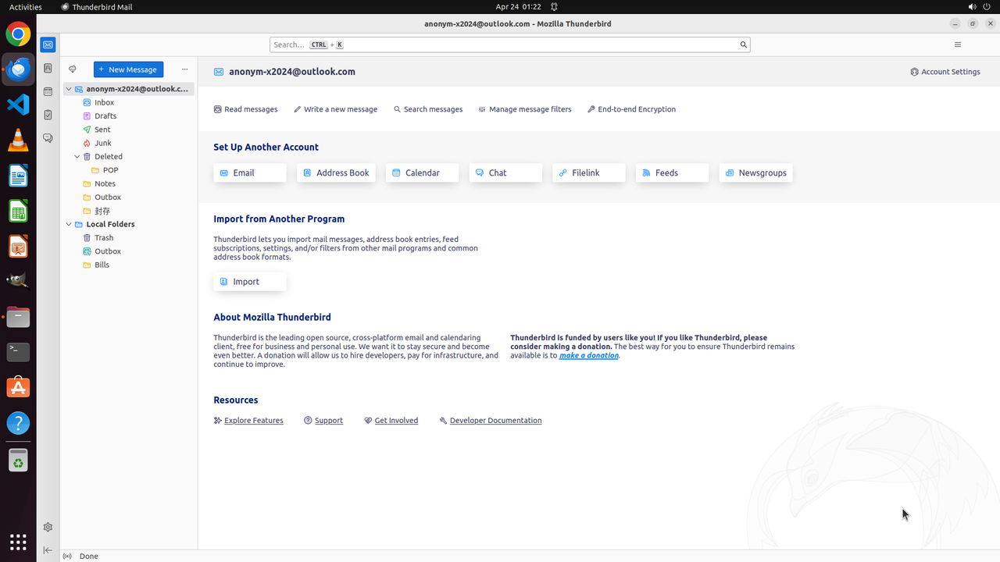

**Response:**
```
I can see Thunderbird Mail is open with a "Bills" folder under Local Folders. Let me first click on the Bills folder to see the AWS invoice email.
```

**Actions:** `pyautogui.click(196, 507)`

---

## Step 2

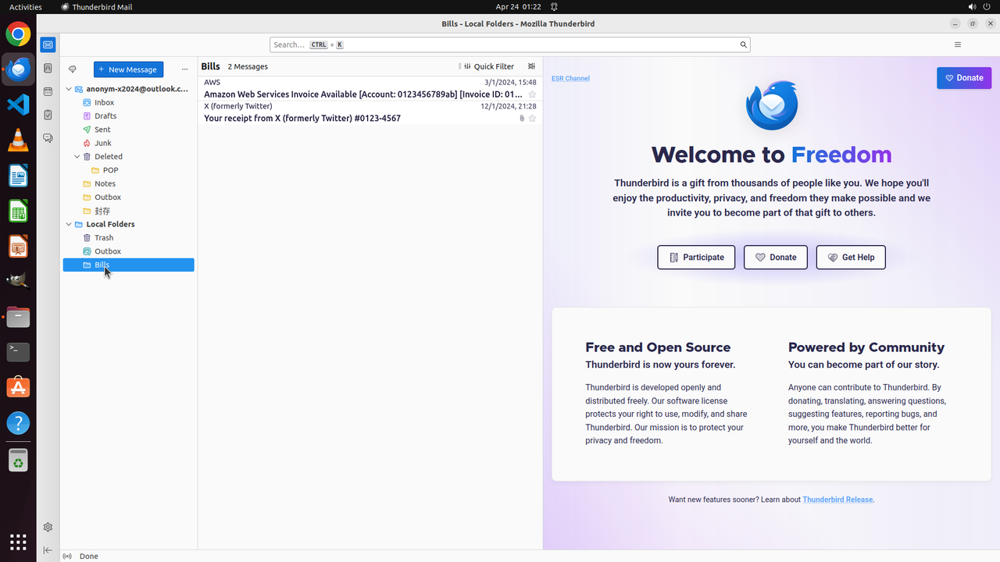

**Response:**
```
I can see the Bills folder contains 2 messages. I need to click on the AWS invoice email to see its contents and attachment.
```

**Actions:** `pyautogui.click(693, 168)`

---

## Step 3


**Response:**
```
I can see the AWS invoice email with an attachment "invoice0123456789.pdf" (22.8 KB). The email is about the billing period December 1 - December 31, 2023. Now I need to:

1. First, check the "receipts" folder to understand the file naming pattern
2. Save the PDF attachment
3. Update the tally book

Let me first open the file manager to find the receipts folder and understand the naming pattern.
```

**Actions:** `pyautogui.click(33, 609)`

---

## Step 4

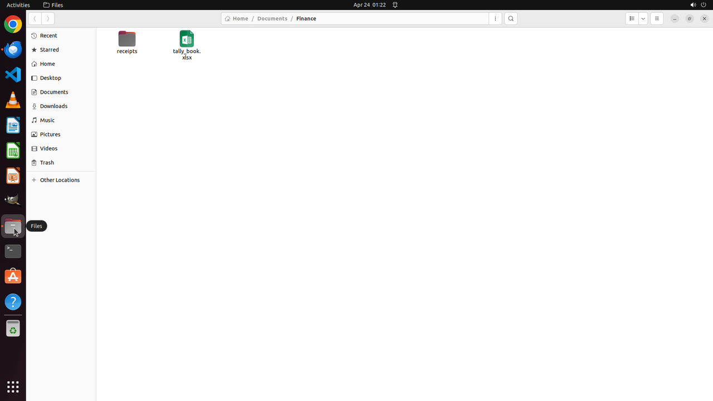

**Response:**
```
I can see the Finance folder with a "receipts" folder and a "tally_book.xlsx" file. Let me first open the receipts folder to see the existing file naming pattern.
```

**Actions:** `pyautogui.doubleClick(340, 117)`

---

## Step 5

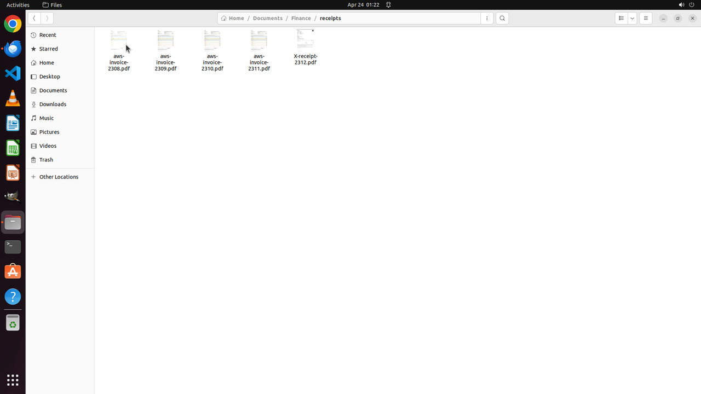

**Response:**
```
I can see the naming pattern in the receipts folder:
- `aws-invoice-2308.pdf` (August 2023)
- `aws-invoice-2309.pdf` (September 2023)
- `aws-invoice-2310.pdf` (October 2023)
- `aws-invoice-2311.pdf` (November 2023)
- `X-receipt-2312.pdf` (December 2023 - X/Twitter receipt)

So the AWS invoice naming pattern is `aws-invoice-YYMM.pdf`. For December 2023, the file should be named `aws-invoice-2312.pdf`.

Now let me go back to Thunderbird and save the attachment. Let me first check the tally book to understand its format. Let me open the tally_book.xlsx file.
```

**Actions:** `pyautogui.click(822, 48)`

---

## Step 6

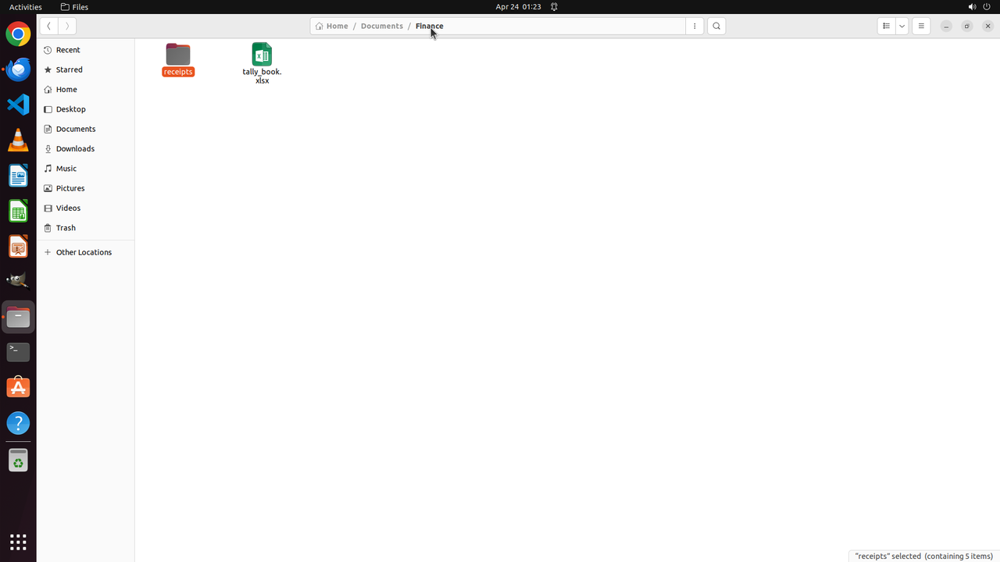

**Response:**
```
Good, I'm back in the Finance folder. Let me open the tally_book.xlsx to see its format.
```

**Actions:** `pyautogui.doubleClick(504, 123)`

---

## Step 7

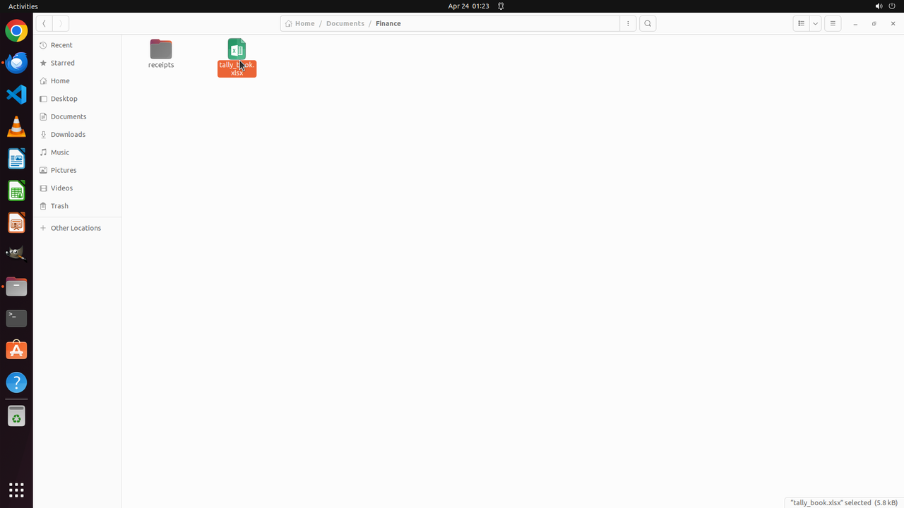

**Response:**
```
The file is opening. Let me wait for it to load in LibreOffice Calc.
```

**Actions:** `time.sleep(0.5)`

---

## Step 8

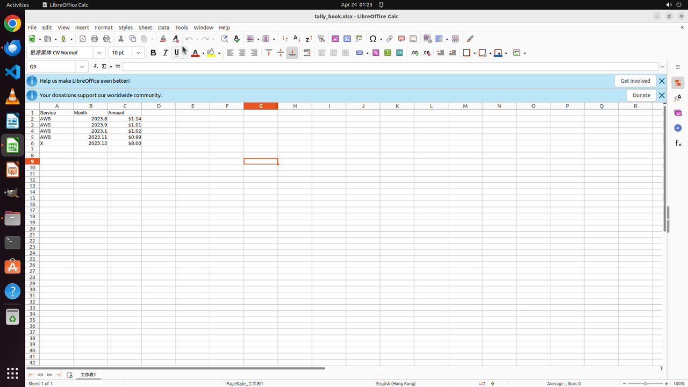

**Response:**
```
Now I can see the tally book format. It has columns:
- A: Service
- B: Month
- C: Amount

The existing entries are:
1. AWS, 2023.8, $1.14
2. AWS, 2023.9, $1.01
3. AWS, 2023.1, $1.02
4. AWS, 2023.11, $0.99
5. X, 2023.12, $8.00

I need to add a new row for the AWS December 2023 invoice. But first, I need to check the invoice PDF to find the amount. Let me first save the PDF from Thunderbird. Let me switch to Thunderbird.

But before that, let me look at row 4 more carefully - it says "2023.1" which seems odd. Let me click on cell B4 to check.
```

**Actions:** `pyautogui.click(249, 364)`

---

## Step 9

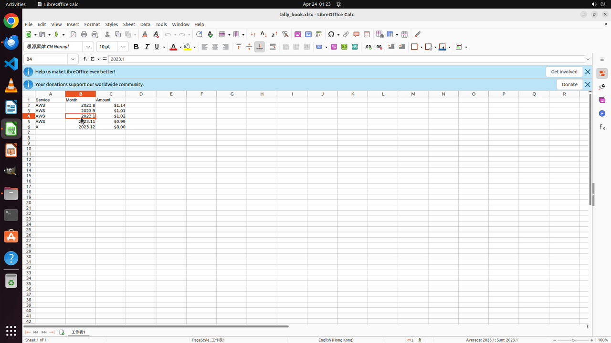

**Response:**
```
I see that B4 contains "2023.1" which likely represents 2023.10 (October). The cell is showing the value as 2023.1 because trailing zeros are dropped in numeric format. This is consistent with the receipts folder having files for months 08, 09, 10, 11.

Now I need to:
1. Save the AWS invoice PDF from Thunderbird to the receipts folder with the name `aws-invoice-2312.pdf`
2. Open the PDF to find the invoice amount
3. Add a new row to the tally book

Let me first save the PDF. Let me switch to Thunderbird.
```

**Actions:** `pyautogui.click(33, 133)`

---

## Step 10

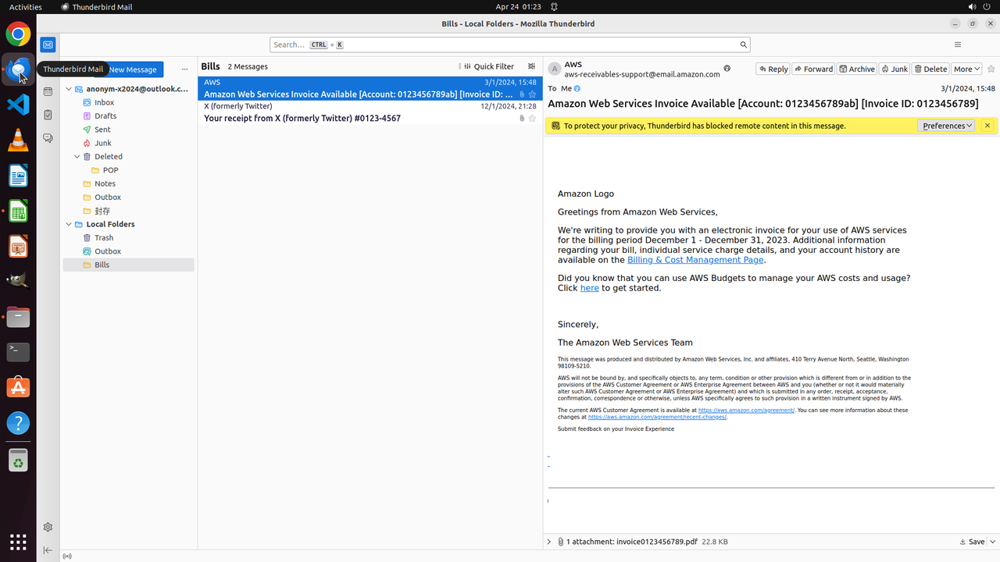

**Response:**
```
I can see the Thunderbird email with the attachment "invoice0123456789.pdf" at the bottom. I need to save this attachment. Let me click on the "Save" button next to the attachment to save it with a custom name.
```

**Actions:** `pyautogui.click(1906, 1039)`

---

## Step 11

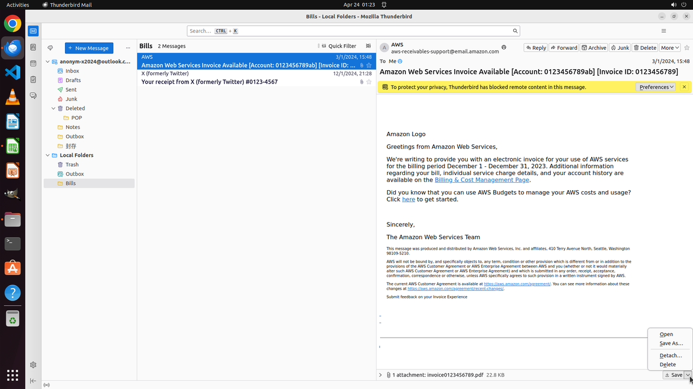

**Response:**
```
I can see a dropdown menu with options. Let me click "Save As..." to save the attachment with a custom name and location.
```

**Actions:** `pyautogui.click(1855, 954)`

---

## Step 12

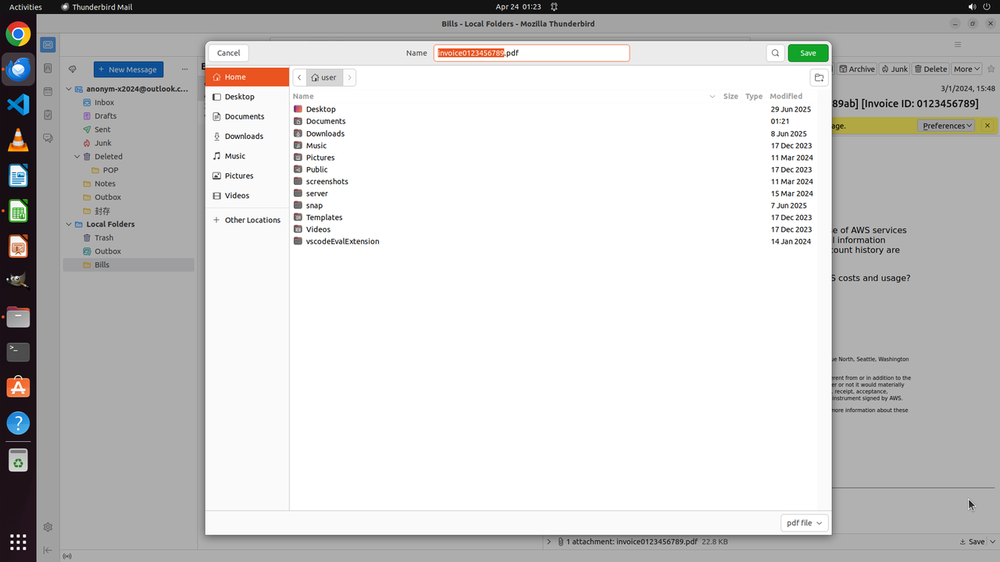

**Response:**
```
A save dialog has appeared. I need to:
1. Navigate to the Documents/Finance/receipts folder
2. Rename the file to `aws-invoice-2312.pdf`

Let me first navigate to Documents folder.
```

**Actions:** `pyautogui.click(469, 222)`

---

## Step 13

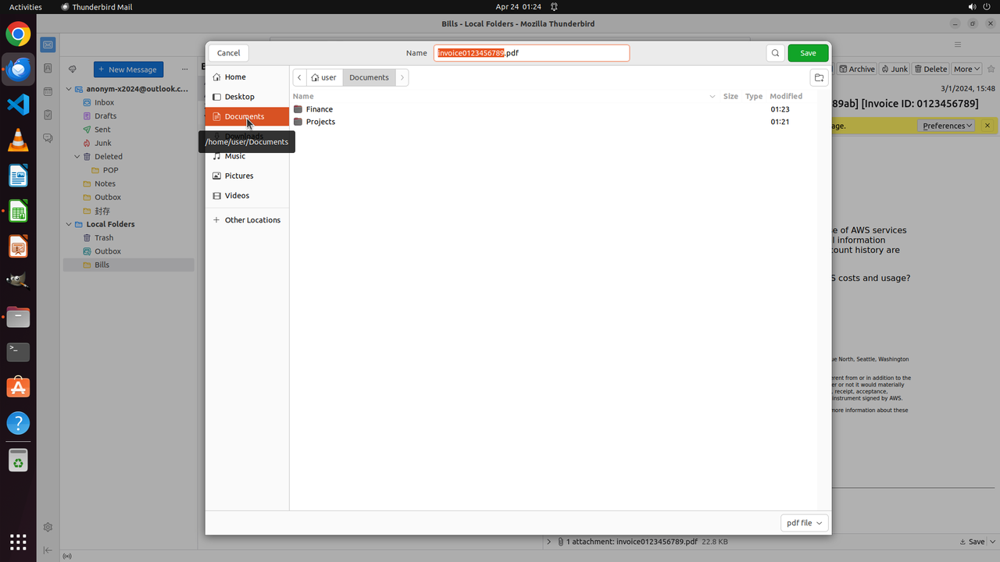

**Response:**
```
I can see the Documents folder with Finance and Projects subfolders. Let me navigate to Finance.
```

**Actions:** `pyautogui.doubleClick(613, 208)`

---

## Step 14

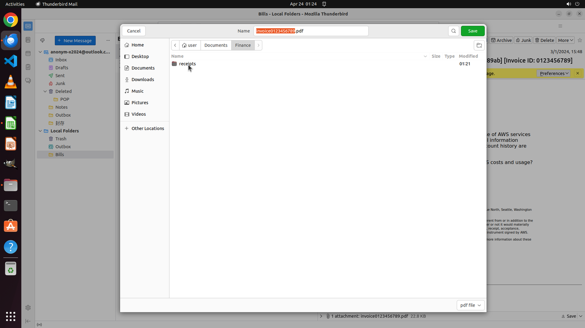

**Response:**
```
I can see the Finance folder with the receipts subfolder. Let me navigate into the receipts folder.
```

**Actions:** `pyautogui.doubleClick(613, 208)`

---

## Step 15

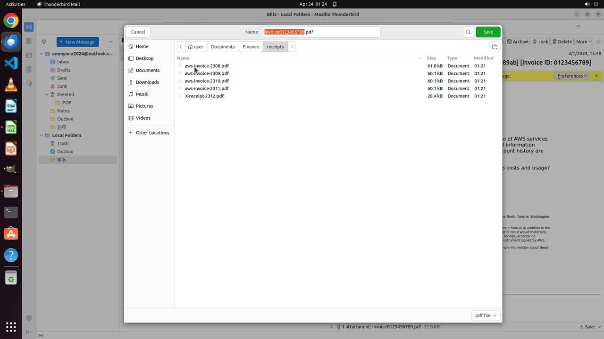

**Response:**
```
I'm now in the receipts folder and can see the existing files. The naming pattern for AWS invoices is `aws-invoice-YYMM.pdf`. For December 2023, I need to name it `aws-invoice-2312.pdf`. Let me change the filename in the Name field.
```

**Actions:** `pyautogui.tripleClick(1014, 100)`

---

## Step 16

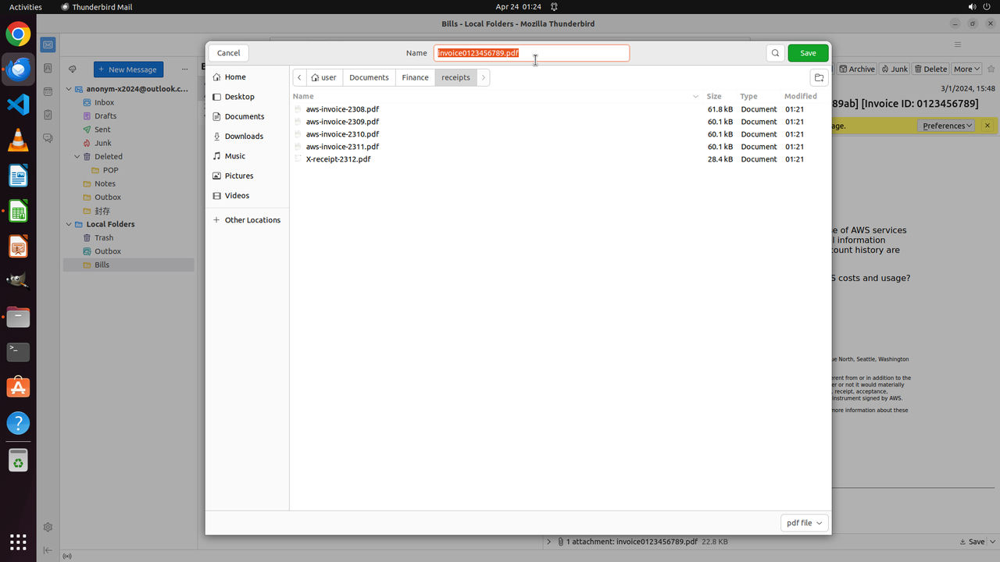

**Response:**
```
The filename is selected. Now let me type the new filename following the pattern.
```

**Actions:** `import subprocess, shlex; subprocess.run(f'xdotool type --delay 12 -- ' + shlex.quote('aws-invoice-2312.pdf'), shell=True, check=True)
import time; time.sleep(0.05)`

---

## Step 17

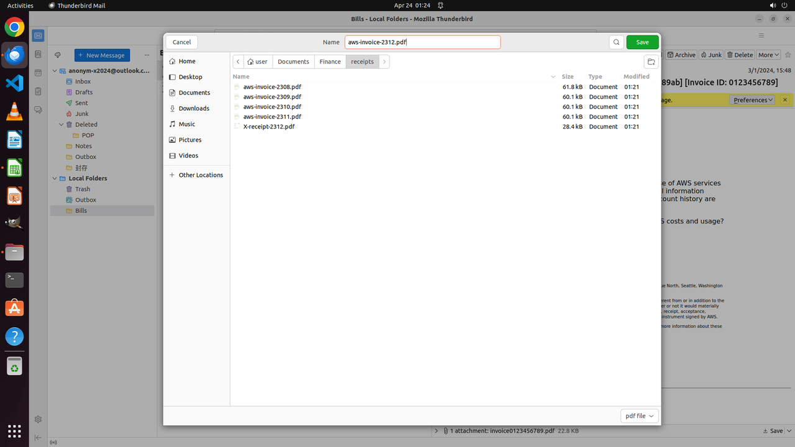

**Response:**
```
The filename is set to "aws-invoice-2312.pdf" and I'm in the correct receipts folder. Now let me click Save.
```

**Actions:** `pyautogui.click(1549, 100)`

---

## Step 18

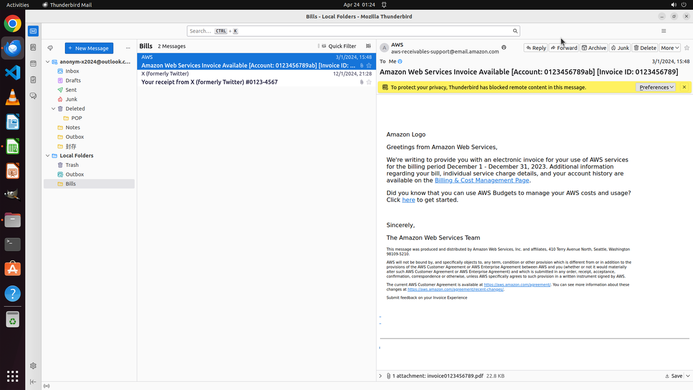

**Response:**
```
The file has been saved. Now I need to open the PDF to find the invoice amount so I can add it to the tally book. Let me open the saved PDF file. I'll first need to find the amount. Let me open the PDF by clicking on the attachment in the email.
```

**Actions:** `pyautogui.click(1200, 1039)`

---

## Step 19

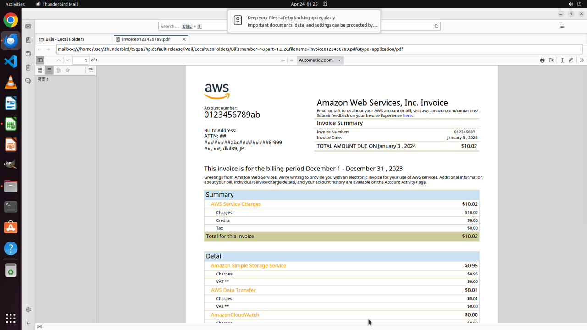

**Response:**
```
I can see the AWS invoice PDF. The key information is:
- **Total for this invoice: $10.02**
- Billing period: December 1 - December 31, 2023
- Invoice Date: January 3, 2024

Now I need to add a new row to the tally book. Let me switch to LibreOffice Calc.
```

**Actions:** `pyautogui.click(33, 202)`

---

## Step 20

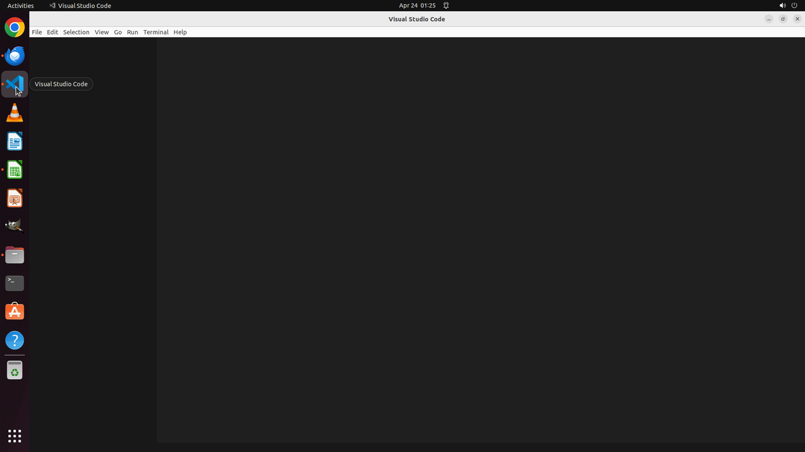

**Response:**
```
I accidentally opened Visual Studio Code instead of LibreOffice Calc. I need to find the LibreOffice Calc window. Let me check the taskbar or use Alt+Tab to find it.
```

**Actions:** `pyautogui.keyDown('alt')
pyautogui.keyDown('tab')
pyautogui.keyUp('tab')
pyautogui.keyUp('alt')`

---

## Step 21

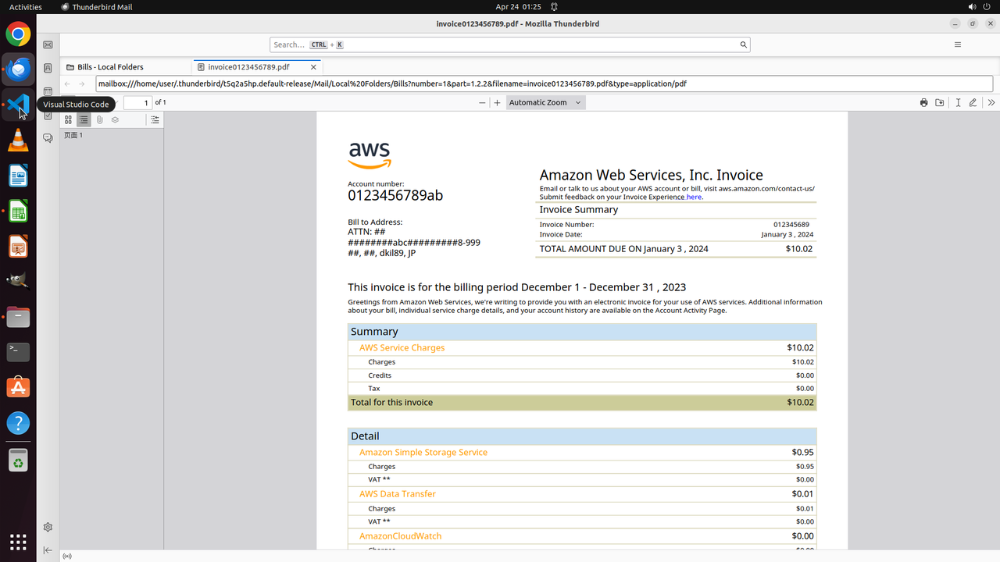

**Response:**
```
I can see the Thunderbird PDF viewer. I need to find the LibreOffice Calc window with the tally book. Let me click on the LibreOffice Calc icon in the taskbar, or use the taskbar to find it.
```

**Actions:** `pyautogui.click(33, 337)`

---

## Step 22

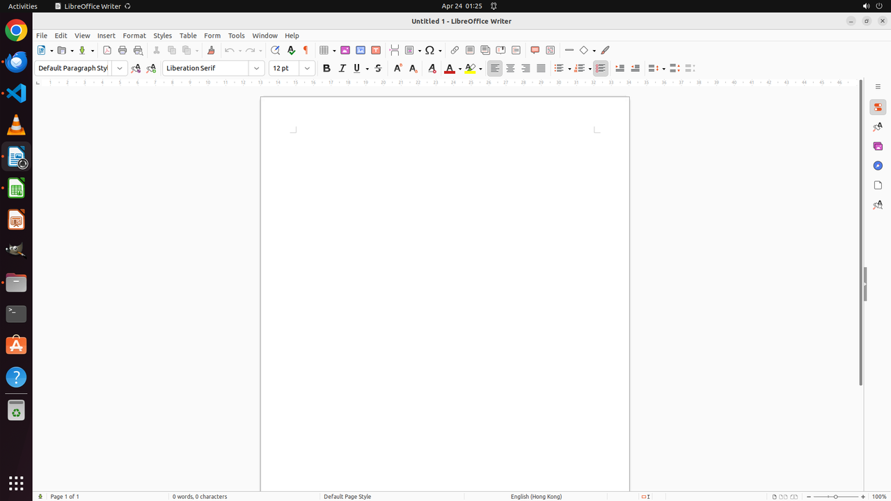

**Response:**
```
This opened LibreOffice Writer instead of Calc. I need to find the LibreOffice Calc window with the tally book. Let me check the Window menu or use the taskbar.
```

**Actions:** `pyautogui.click(571, 76)`

---

## Step 23

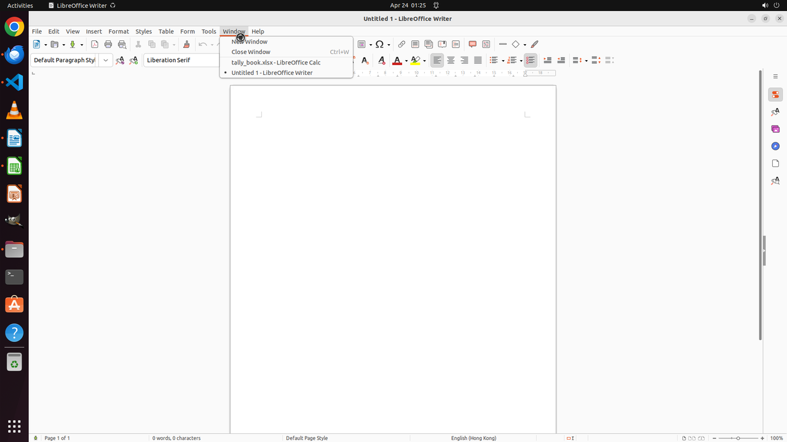

**Response:**
```
I can see the Window menu showing "tally_book.xlsx - LibreOffice Calc". Let me click on it to switch to the tally book.
```

**Actions:** `pyautogui.click(673, 151)`

---

## Step 24

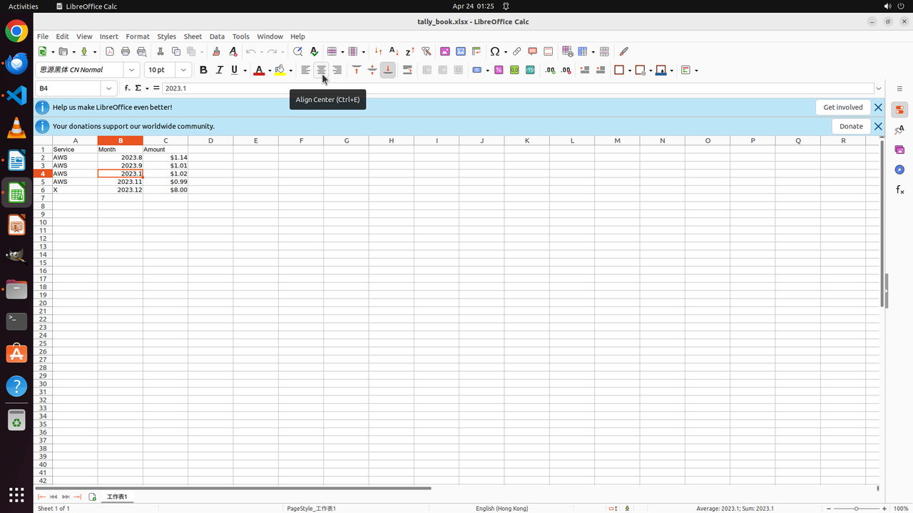

**Response:**
```
Now I can see the tally book in LibreOffice Calc. The current entries are:

| Row | Service | Month | Amount |
|-----|---------|-------|--------|
| 2 | AWS | 2023.8 | $1.14 |
| 3 | AWS | 2023.9 | $1.01 |
| 4 | AWS | 2023.1 | $1.02 |
| 5 | AWS | 2023.11 | $0.99 |
| 6 | X | 2023.12 | $8.00 |

I need to add a new row 7 with: AWS, 2023.12, $10.02

Let me click on cell A7 first.
```

**Actions:** `pyautogui.click(153, 417)`

---

## Step 25

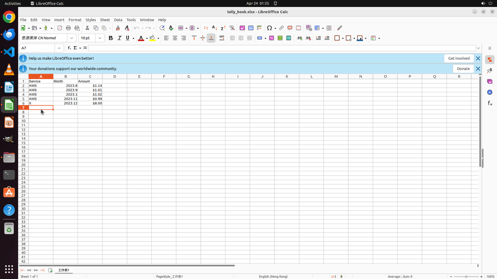

**Response:**
```
I'm now in cell A7. I need to type "AWS" and then move to the next cells. Let me type the data.
```

**Actions:** `import subprocess, shlex; subprocess.run(f'xdotool type --delay 12 -- ' + shlex.quote('AWS\t'), shell=True, check=True)
import time; time.sleep(0.05)`

---

## Step 26

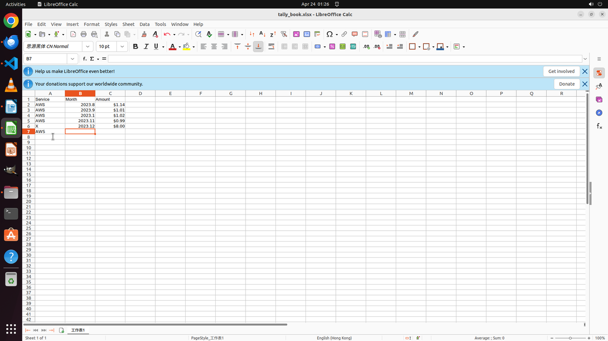

**Response:**
```
"AWS" has been entered in A7 and the cursor moved to B7. Now I need to enter the month value. Looking at the pattern, the months are stored as decimal numbers like 2023.8, 2023.9, 2023.1 (for October, which is 2023.10), 2023.11, 2023.12. For December 2023, I should enter 2023.12.
```

**Actions:** `import subprocess, shlex; subprocess.run(f'xdotool type --delay 12 -- ' + shlex.quote('2023.12\t'), shell=True, check=True)
import time; time.sleep(0.05)`

---

## Step 27

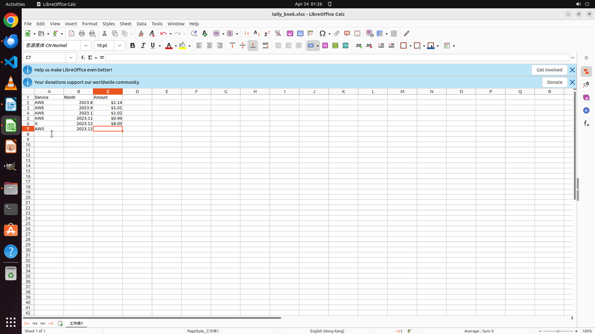

**Response:**
```
I can see "AWS" in A7 and "2023.12" in B7. Now I'm in C7 and need to enter the amount. The invoice total was $10.02. Looking at the existing format, amounts are entered with a dollar sign like $1.14, $1.01, etc. Let me type the amount.
```

**Actions:** `import subprocess, shlex; subprocess.run(f'xdotool type --delay 12 -- ' + shlex.quote('$10.02'), shell=True, check=True)
import time; time.sleep(0.05)`

---

## Step 28

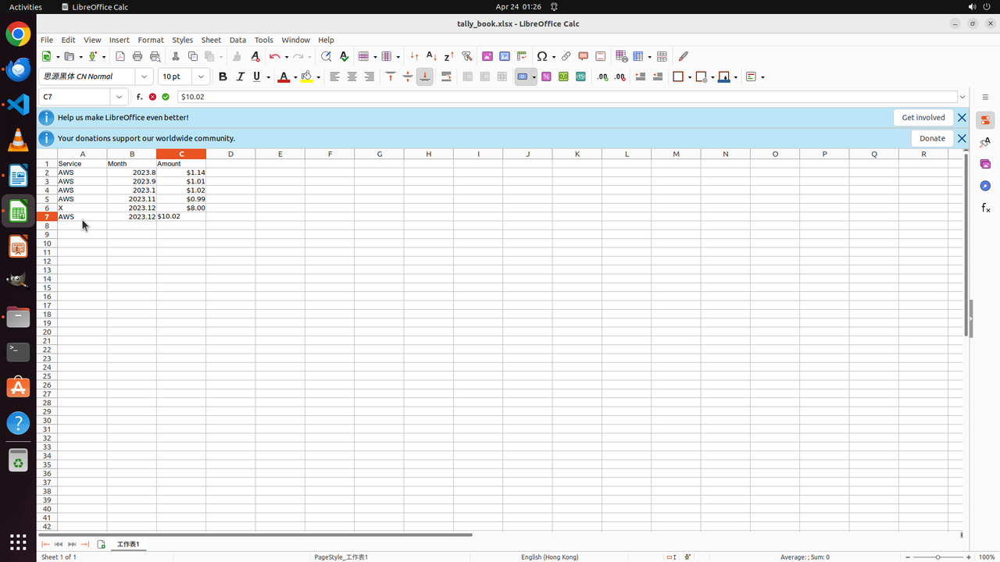

**Response:**
```
I can see "$10.02" has been entered in C7. The cell shows the value in the formula bar. Now I need to press Enter to confirm the entry and then save the file.
```

**Actions:** `pyautogui.keyDown('return')
pyautogui.keyUp('return')`

---

## Step 29

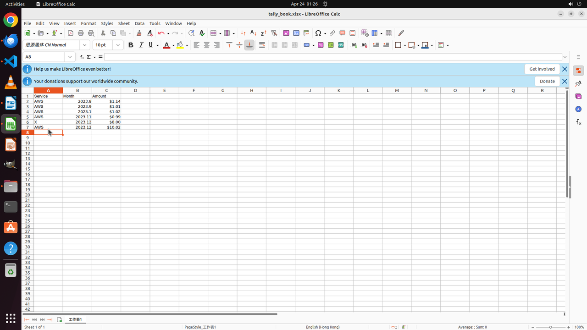

**Response:**
```
The data has been entered in row 7:
- A7: AWS
- B7: 2023.12
- C7: $10.02

Now I need to save the file. Let me press Ctrl+S to save.
```

**Actions:** `pyautogui.keyDown('ctrl')
pyautogui.keyDown('s')
pyautogui.keyUp('s')
pyautogui.keyUp('ctrl')`

---

## Step 30


**Response:**
```
The file appears to have been saved (since it's an xlsx file, it may have saved without a dialog prompt, or the dialog may have appeared and been handled). Let me verify by checking if there was a "Keep Current Format" dialog. Let me take a screenshot to confirm the current state.

Looking at the current state, the file seems saved. But since the file is .xlsx format, LibreOffice might have asked about keeping the format. Let me check if there's a dialog by waiting a moment.
```

**Actions:** `time.sleep(0.1)`

---

## Step 31


**Response:**
```
The file has been saved successfully. The tally book now has the new entry in row 7:
- A7: AWS
- B7: 2023.12
- C7: $10.02

Let me verify the saved PDF file exists in the receipts folder by opening the file manager. Let me also verify the data is correct by clicking on the cells to double-check.

Let me verify by opening a terminal to check the files.
```

**Actions:** `pyautogui.keyDown('ctrl')
pyautogui.keyDown('alt')
pyautogui.keyDown('t')
pyautogui.keyUp('t')
pyautogui.keyUp('alt')
pyautogui.keyUp('ctrl')`

---

## Step 32

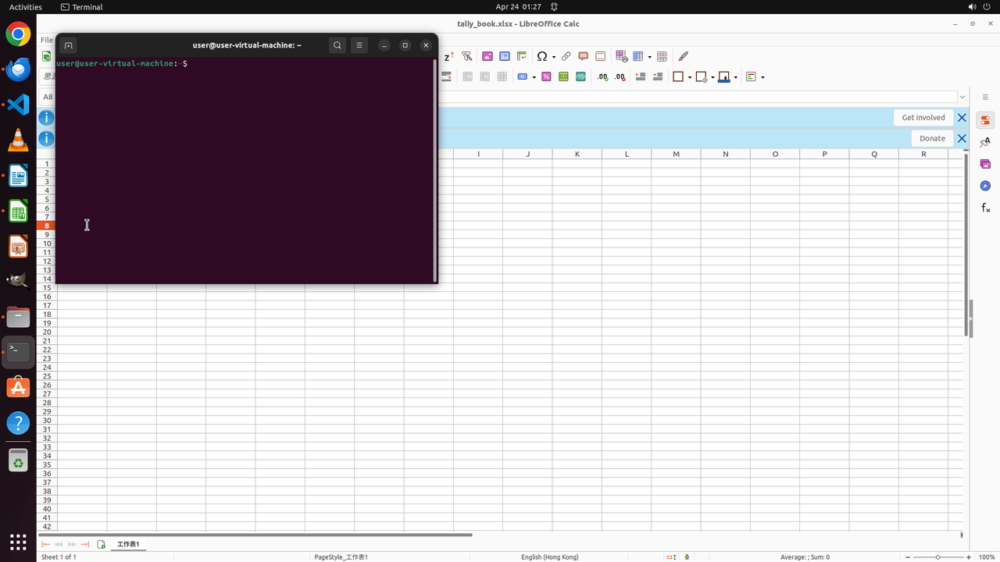

**Response:**
```
A terminal is open. Let me verify the PDF file was saved correctly in the receipts folder.
```

**Actions:** `import subprocess, shlex; subprocess.run(f'xdotool type --delay 12 -- ' + shlex.quote('ls -la ~/Documents/Finance/receipts/\n'), shell=True, check=True)
import time; time.sleep(0.05)`

---

## Step 33

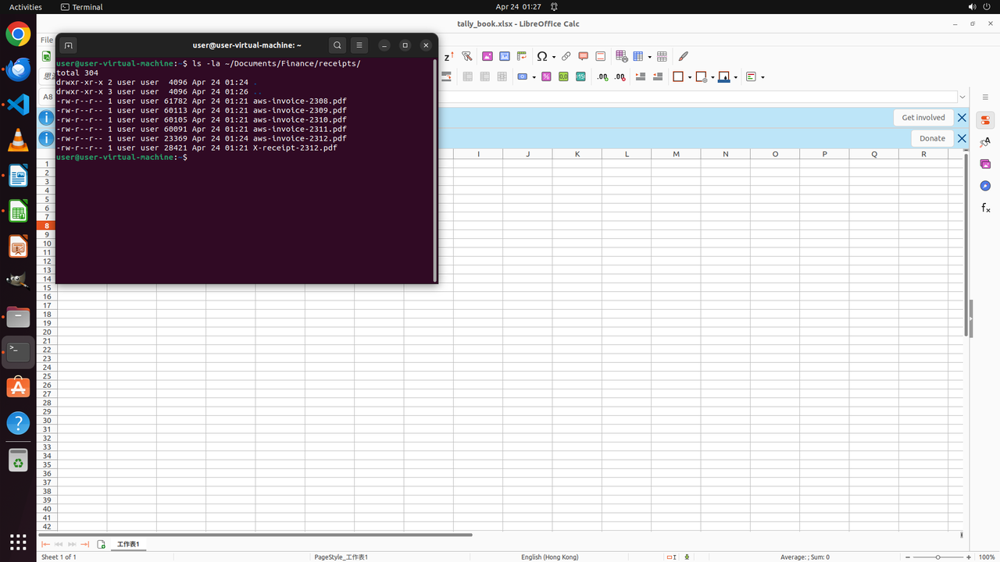

**Response:**
```
I can confirm that the PDF file `aws-invoice-2312.pdf` has been successfully saved in the receipts folder. The file listing shows:

- `aws-invoice-2308.pdf`
- `aws-invoice-2309.pdf`
- `aws-invoice-2310.pdf`
- `aws-invoice-2311.pdf`
- `aws-invoice-2312.pdf` (newly saved, 23369 bytes)
- `X-receipt-2312.pdf`

Both tasks have been completed successfully:
1. ✅ Extracted the AWS invoice PDF to the receipts folder with the correct naming pattern (`aws-invoice-2312.pdf`)
2. ✅ Added a new record to the tally book (AWS, 2023.12, $10.02)

DONE
```

**Actions:** `DONE`

---
