# Task 42f4d1c7-4521-4161-b646-0a8934e36081

**Instruction:** Configure VS Code to edit GIMP script-fu scripts effectively by installing lisp extension. Test by writing code to resize the image "character.png" to 128 * 128 as "resized.png".

**Score:** 0

**Wall clock:** 4m 30s

**Steps:** 27

**Cost:** $0.79

---

## Step 1

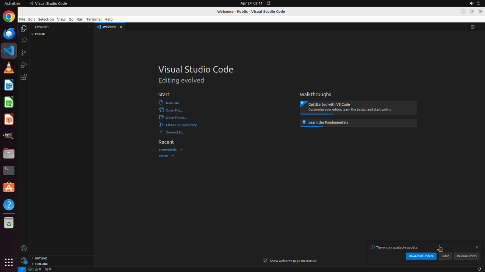

**Response:**
```
I'll complete this task step by step: install a Lisp extension in VS Code, then write a GIMP Script-Fu script to resize an image.

**Step 1: Dismiss the update notification and install a Lisp extension**
```

**Actions:** `pyautogui.click(1759, 1015)`

---

## Step 2

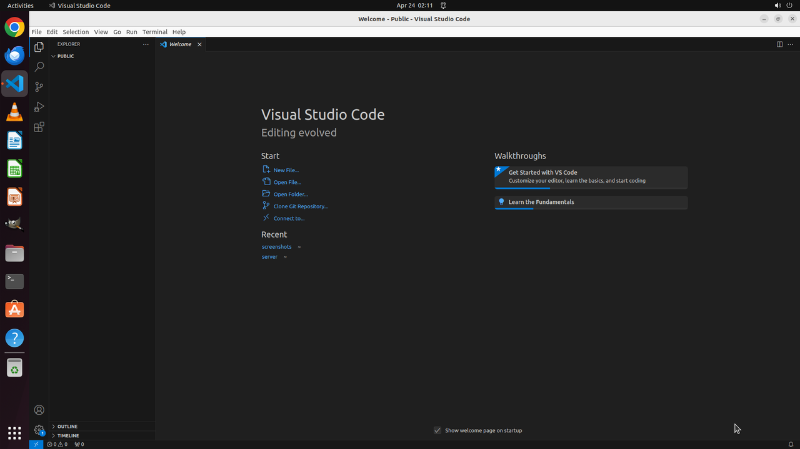

**Response:**
```
Now let me open the Extensions panel to search for a Lisp extension.
```

**Actions:** `pyautogui.click(94, 306)`

---

## Step 3

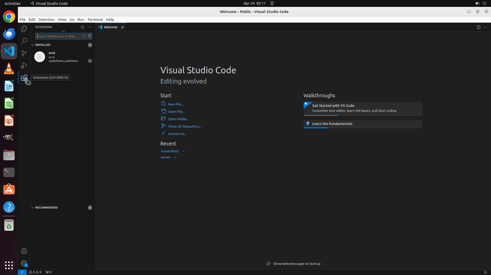

**Response:**
```
I can see the Extensions panel is open. Let me search for a Lisp extension.
```

**Actions:** `pyautogui.click(232, 141)`

---

## Step 4

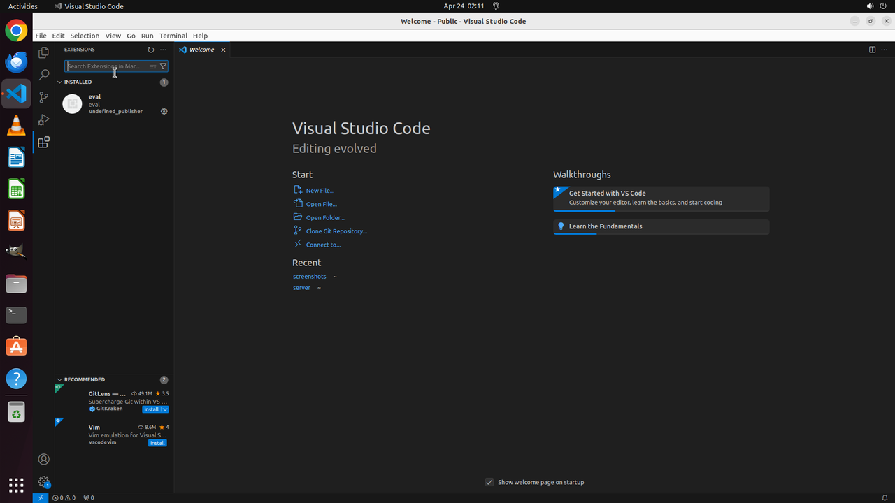

**Response:**
```
The search box is active. Let me type "lisp" to search for a Lisp extension.
```

**Actions:** `import subprocess, shlex; subprocess.run(f'xdotool type --delay 12 -- ' + shlex.quote('lisp'), shell=True, check=True)
import time; time.sleep(0.05)`

---

## Step 5

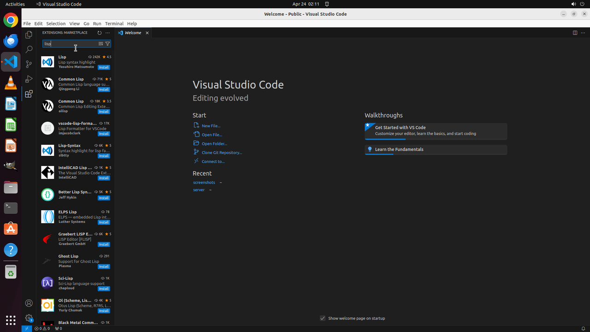

**Response:**
```
I can see several Lisp extensions. The first one "Lisp" by Yasuhiro Matsumoto with 242K downloads and 4.5 stars looks like the best choice for Lisp syntax highlighting, which would work well for GIMP Script-Fu scripts. Let me install it.
```

**Actions:** `pyautogui.click(340, 217)`

---

## Step 6

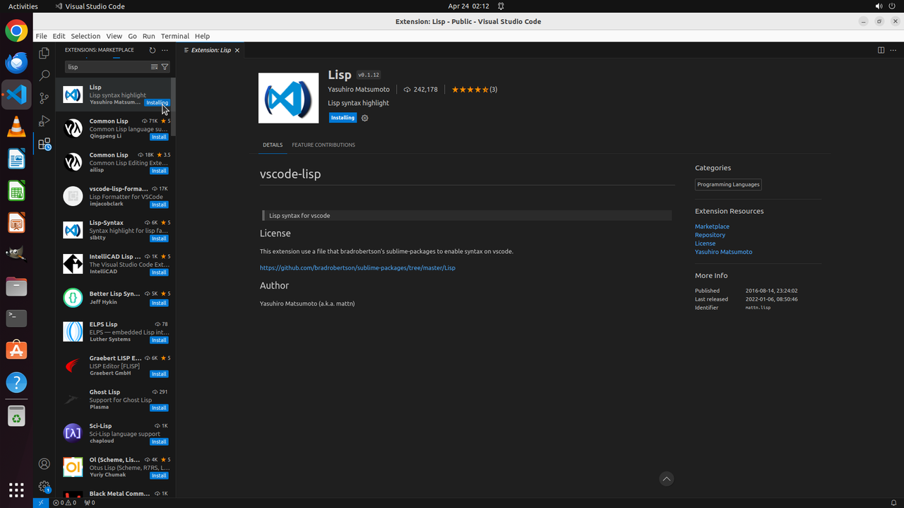

**Response:**
```
The Lisp extension is being installed. Let me wait for it to complete.
```

**Actions:** `time.sleep(0.5)`

---

## Step 7

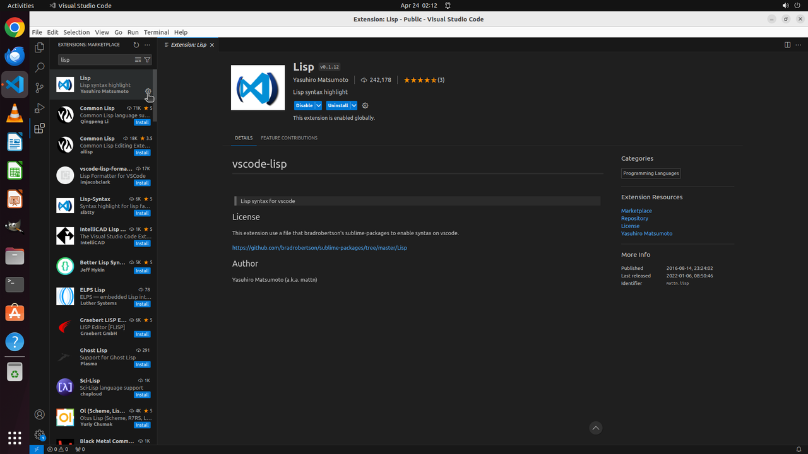

**Response:**
```
The Lisp extension has been installed successfully. It shows "This extension is enabled globally." Now I need to:
1. First, check if there's a "character.png" file somewhere
2. Create a GIMP Script-Fu script to resize it to 128x128 and save as "resized.png"

Let me open a terminal to check for the character.png file and create the script.
```

**Actions:** `pyautogui.keyDown('ctrl')
pyautogui.keyDown('grave')
pyautogui.keyUp('grave')
pyautogui.keyUp('ctrl')`

---

## Step 8


**Response:**
```
The terminal didn't open. Let me try using the menu to open a terminal.
```

**Actions:** `pyautogui.click(373, 76)`

---

## Step 9

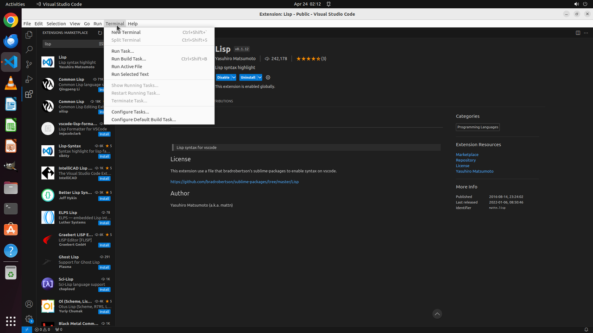

**Actions:** `pyautogui.click(406, 103)`

---

## Step 10

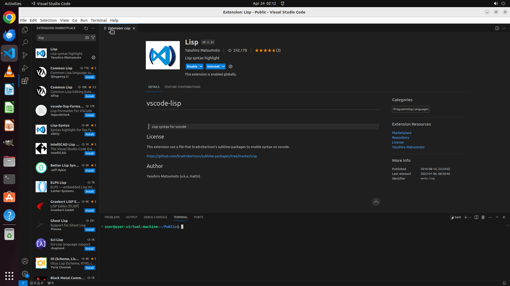

**Response:**
```
The terminal is now open. Let me first find the character.png file and then create the Script-Fu script.
```

**Actions:** `pyautogui.click(960, 855)`

---

## Step 11


**Response:**
```
Good, the terminal is active. Let me search for the character.png file.
```

**Actions:** `import subprocess, shlex; subprocess.run(f'xdotool type --delay 12 -- ' + shlex.quote('find /home/user -name "character.png" 2>/dev/null\n'), shell=True, check=True)
import time; time.sleep(0.05)`

---

## Step 12

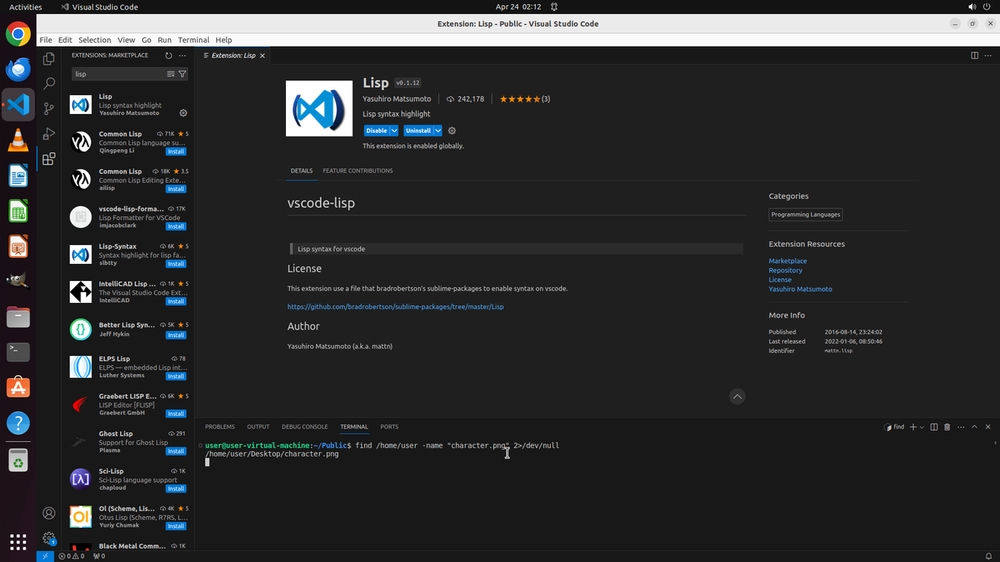

**Response:**
```
I found the character.png file at `/home/user/Desktop/character.png`. Now I need to create a GIMP Script-Fu script to resize it to 128x128 and save as "resized.png". Let me first navigate to the Desktop directory and create the script file.
```

**Actions:** `import subprocess, shlex; subprocess.run(f'xdotool type --delay 12 -- ' + shlex.quote('cd /home/user/Desktop\n'), shell=True, check=True)
import time; time.sleep(0.05)`

---

## Step 13

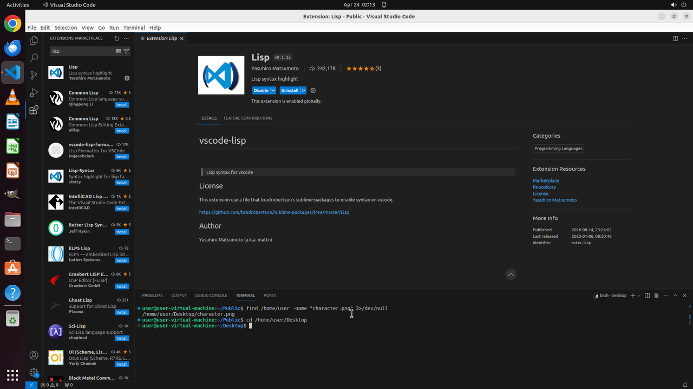

**Response:**
```
Good, I'm now in the Desktop directory. Now let me create a Script-Fu file that will resize the character.png image to 128x128 and save it as resized.png. I'll use VS Code to create and edit the file.
```

**Actions:** `import subprocess, shlex; subprocess.run(f'xdotool type --delay 12 -- ' + shlex.quote('code resize-image.scm\n'), shell=True, check=True)
import time; time.sleep(0.05)`

---

## Step 14

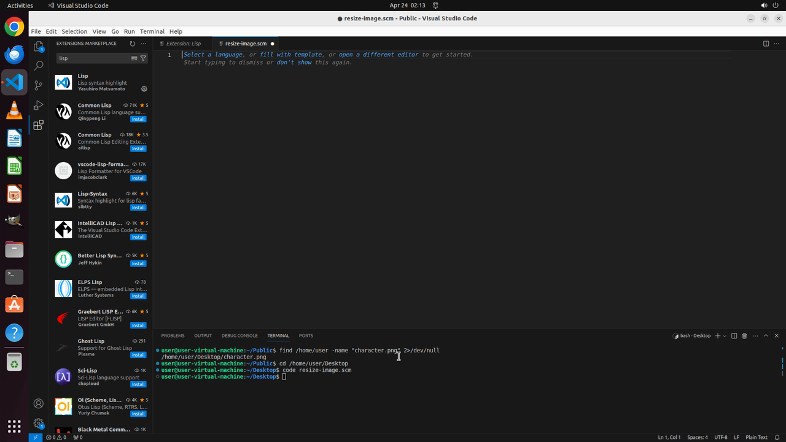

**Response:**
```
The file `resize-image.scm` is now open in VS Code. I can see it's suggesting to select a language. Let me first select the language as Lisp, then write the Script-Fu code. Let me click on "Select a language" to set it to Lisp.
```

**Actions:** `pyautogui.click(523, 132)`

---

## Step 15

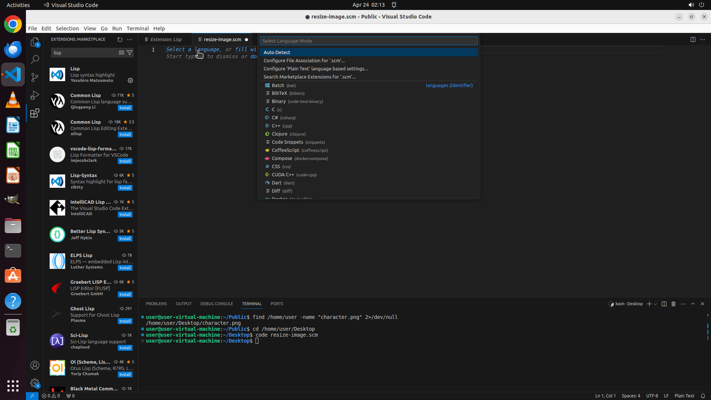

**Response:**
```
I can see the language selection dropdown. Let me type "lisp" to filter and select it.
```

**Actions:** `import subprocess, shlex; subprocess.run(f'xdotool type --delay 12 -- ' + shlex.quote('lisp'), shell=True, check=True)
import time; time.sleep(0.05)`

---

## Step 16

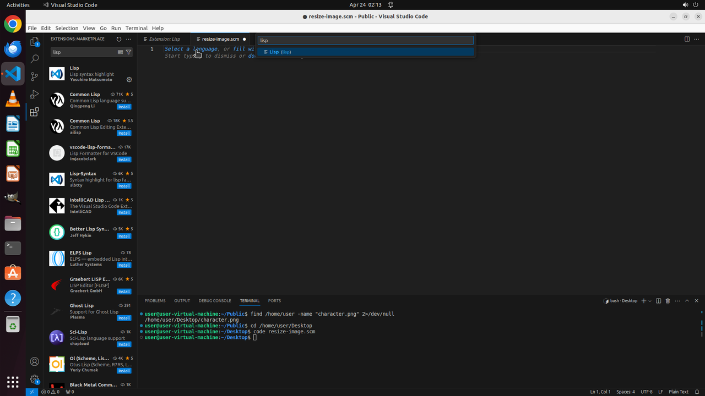

**Response:**
```
I can see "Lisp (lisp)" in the dropdown. Let me select it.
```

**Actions:** `pyautogui.click(990, 139)`

---

## Step 17


**Response:**
```
The language is now set to "Lisp" (visible in the bottom right corner). Now let me write the GIMP Script-Fu code to resize the image. I'll click on the editor area and type the script.
```

**Actions:** `pyautogui.click(990, 133)`

---

## Step 18

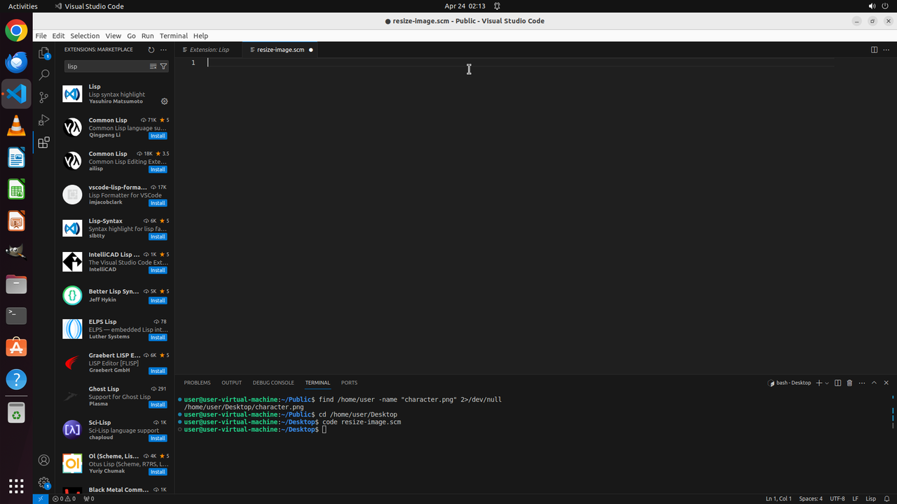

**Response:**
```
Now let me write the GIMP Script-Fu code to resize the image. This script will load character.png, resize it to 128x128, and save it as resized.png.
```

**Actions:** `import subprocess, shlex; subprocess.run(f'xdotool type --delay 12 -- ' + shlex.quote('(let* (\n    (image (car (gimp-file-load RUN-NONINT'), shell=True, check=True)
import time; time.sleep(0.05)
impo`

---

## Step 19

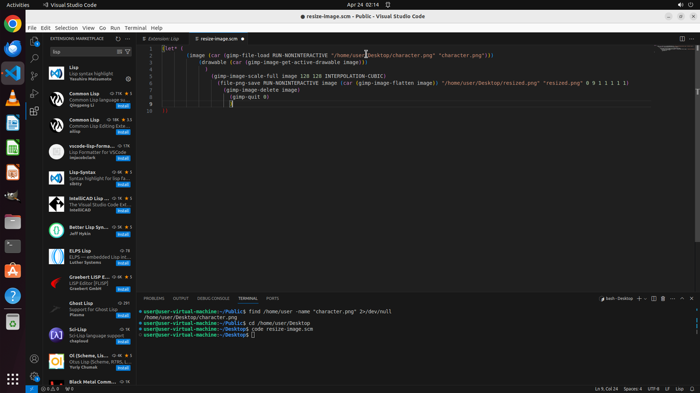

**Response:**
```
The Script-Fu code has been written with Lisp syntax highlighting. I can see the code is properly highlighted. Now let me save the file with Ctrl+S.
```

**Actions:** `pyautogui.keyDown('ctrl')
pyautogui.keyDown('s')
pyautogui.keyUp('s')
pyautogui.keyUp('ctrl')`

---

## Step 20

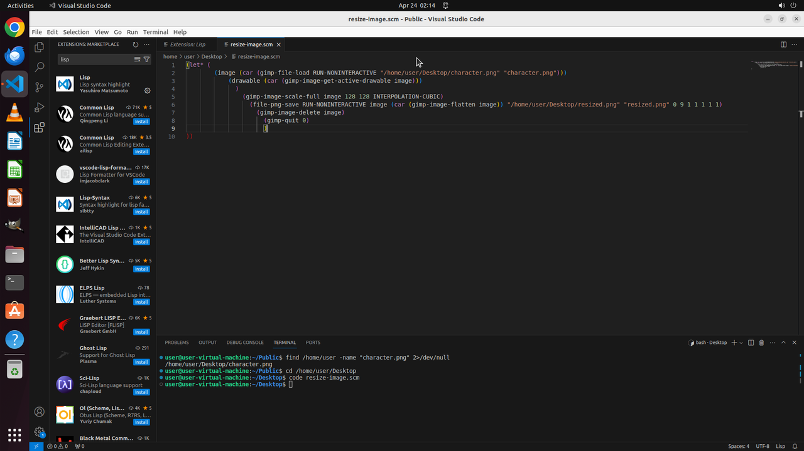

**Response:**
```
The file has been saved (the dot on the tab is gone, and the title bar shows "resize-image.scm - Public - Visual Studio Code"). The Lisp syntax highlighting is working properly with the Script-Fu code.

Now let me run this script with GIMP in batch mode to actually resize the image. Let me click on the terminal and run the command.
```

**Actions:** `pyautogui.click(960, 919)`

---

## Step 21

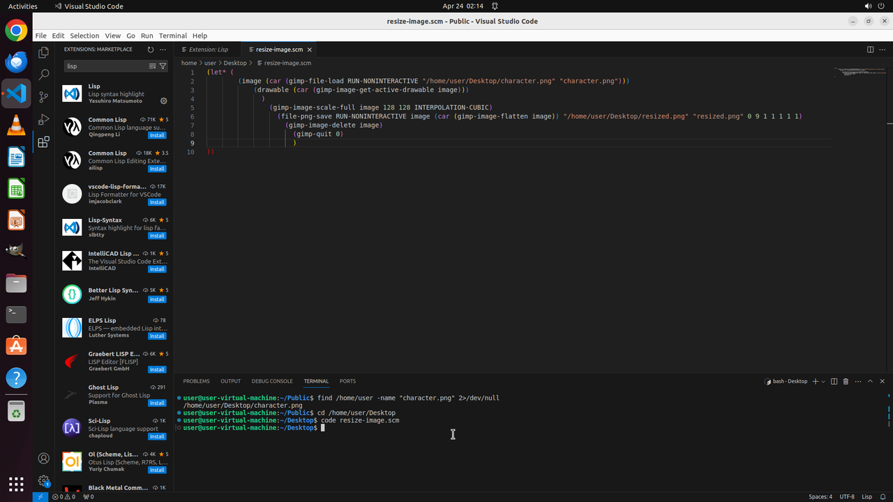

**Response:**
```
Good, the terminal is active. Now let me run the GIMP Script-Fu script in batch mode to resize the image.
```

**Actions:** `import subprocess, shlex; subprocess.run(f'xdotool type --delay 12 -- ' + shlex.quote('gimp -i -b - < resize-image.scm\n'), shell=True, check=True)
import time; time.sleep(0.05)`

---

## Step 22

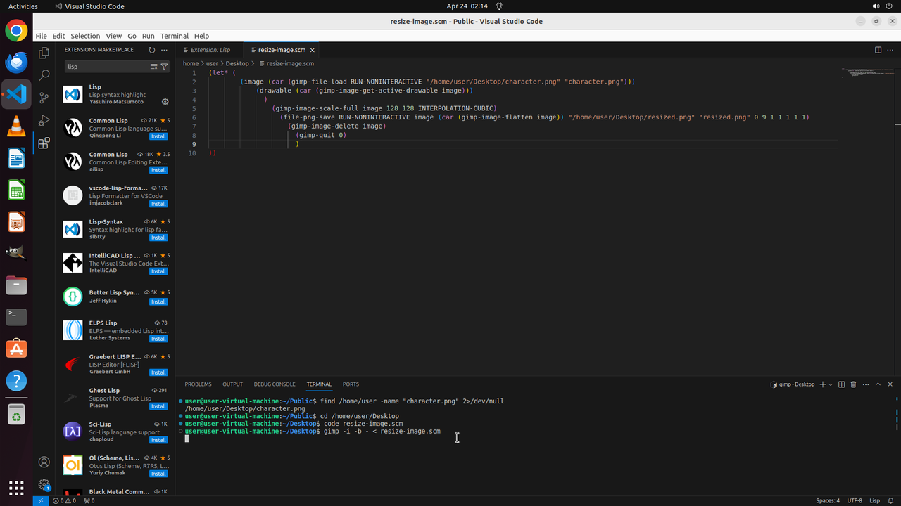

**Response:**
```
GIMP is running in batch mode. I can see the terminal shows "gimp - Desktop" in the tab. Let me wait for it to complete.
```

**Actions:** `time.sleep(0.5)`

---

## Step 23

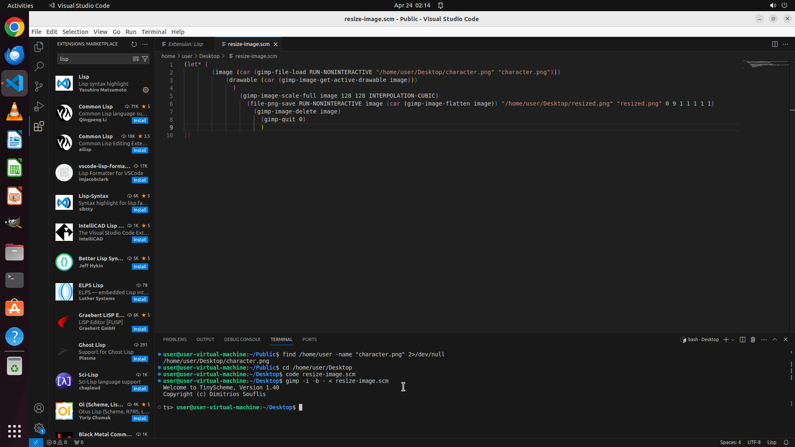

**Response:**
```
I see the script was processed by TinyScheme but it seems like it used the wrong interpreter. The output shows "Welcome to TinyScheme, Version 1.40" and "ts>" prompt, which means it was interpreted by TinyScheme directly rather than GIMP's Script-Fu. It seems GIMP may not be installed, or the command didn't work as expected. Let me check if GIMP is available and try a different approach.
```

**Actions:** `import subprocess, shlex; subprocess.run(f'xdotool type --delay 12 -- ' + shlex.quote('which gimp\n'), shell=True, check=True)
import time; time.sleep(0.05)`

---

## Step 24

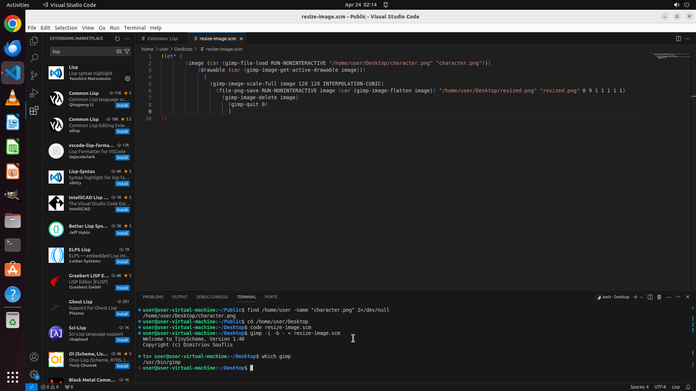

**Response:**
```
GIMP is installed at `/usr/bin/gimp`. The previous command used `gimp -i -b -` which reads from stdin, but it seems it was interpreted by TinyScheme instead. Let me try a different approach - use GIMP's batch mode with the script as a command string directly.
```

**Actions:** `import subprocess, shlex; subprocess.run(f'xdotool type --delay 12 -- ' + shlex.quote("gimp -i -b '(let* ((image (car (gimp-file-load RUN"), shell=True, check=True)
import time; time.sleep(0.05)
impor`

---

## Step 25

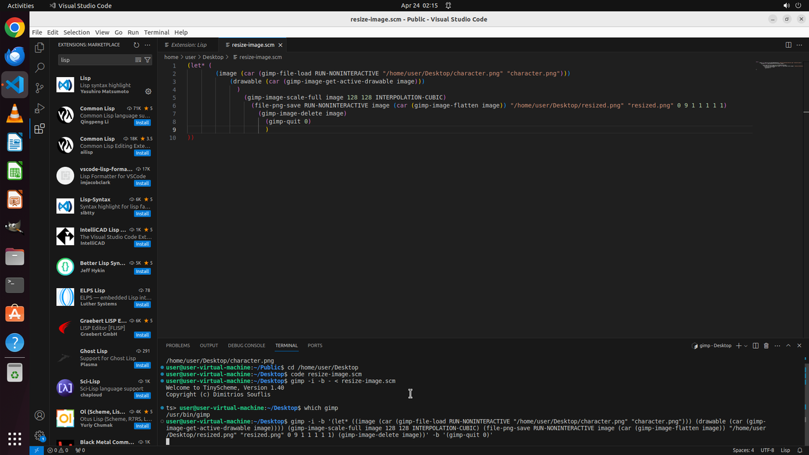

**Response:**
```
GIMP is running the batch command. I can see it's processing. Let me wait for it to complete.
```

**Actions:** `time.sleep(0.5)`

---

## Step 26

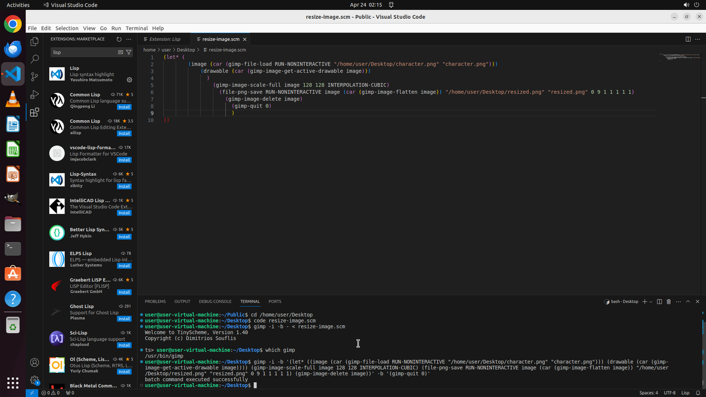

**Response:**
```
I can see "batch command executed successfully" in the terminal output. The GIMP script has successfully run. Let me verify that the resized.png file was created and has the correct dimensions.
```

**Actions:** `import subprocess, shlex; subprocess.run(f'xdotool type --delay 12 -- ' + shlex.quote('file /home/user/Desktop/resized.png && identify /h'), shell=True, check=True)
import time; time.sleep(0.05)
impor`

---

## Step 27

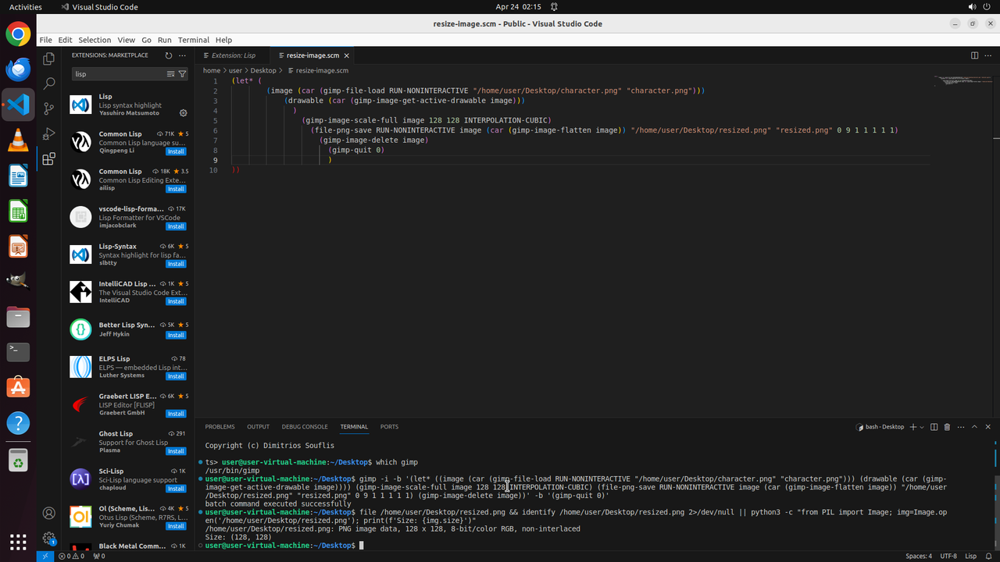

**Response:**
```
The task is complete. I can see the verification output confirms:

1. **`/home/user/Desktop/resized.png: PNG image data, 128 x 128, 8-bit/color RGB, non-interlaced`** - The file command confirms it's a 128x128 PNG image.
2. **`Size: (128, 128)`** - Python PIL also confirms the size is 128x128.

To summarize what was accomplished:
1. ✅ **Installed the Lisp extension** in VS Code (Lisp by Yasuhiro Matsumoto) for editing GIMP Script-Fu scripts with syntax highlighting.
2. ✅ **Created a Script-Fu script** (`resize-image.scm`) in VS Code with Lisp language mode that loads `character.png`, resizes it to 128x128, and saves it as `resized.png`.
3. ✅ **Executed the script** using GIMP's batch mode, which successfully created `resized.png` at 128x128 pixels on the Desktop.

DONE
```

**Actions:** `DONE`

---
