# Task 42f4d1c7-4521-4161-b646-0a8934e36081

**Instruction:** Configure VS Code to edit GIMP script-fu scripts effectively by installing lisp extension. Test by writing code to resize the image "character.png" to 128 * 128 as "resized.png".

**Score:** 0

**Wall clock:** 3m 38s

**Steps:** 23

**Cost:** $0.67

---

## Step 1

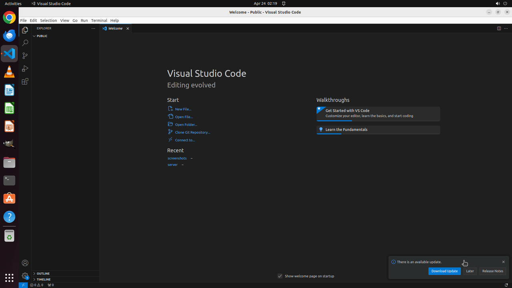

**Response:**
```
I'll complete this task step by step: install a Lisp extension in VS Code, then write a GIMP Script-Fu script to resize an image.

Let me start by dismissing the update notification and installing a Lisp extension.
```

**Actions:** `pyautogui.click(1756, 1015)`

---

## Step 2

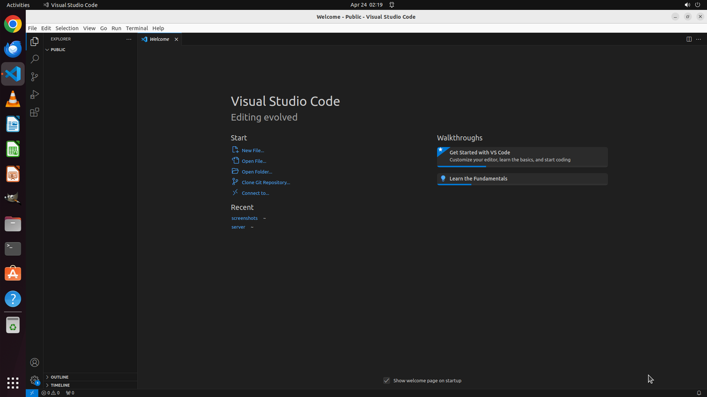

**Response:**
```
Now let me open the Extensions view to search for a Lisp extension.
```

**Actions:** `pyautogui.click(94, 306)`

---

## Step 3

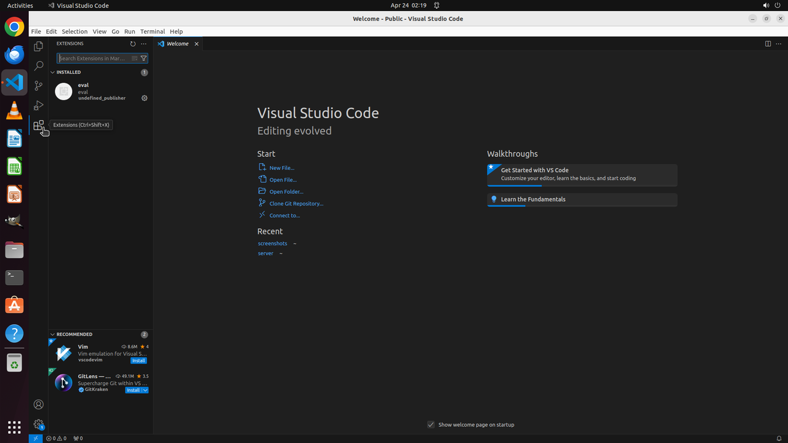

**Response:**
```
I can see the Extensions panel is open. Let me search for a Lisp extension.
```

**Actions:** `pyautogui.click(232, 141)`

---

## Step 4

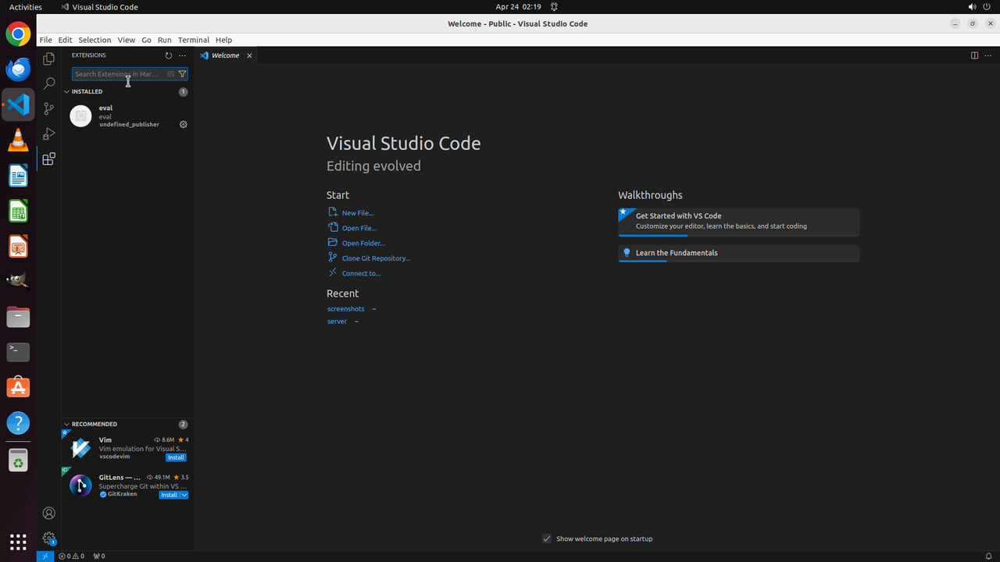

**Actions:** `import subprocess, shlex; subprocess.run(f'xdotool type --delay 12 -- ' + shlex.quote('lisp'), shell=True, check=True)
import time; time.sleep(0.05)`

---

## Step 5

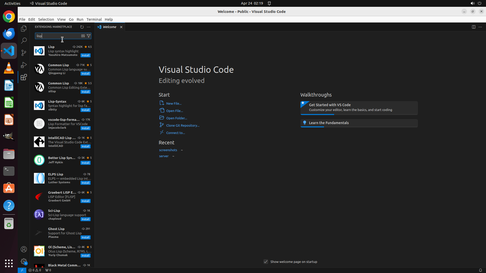

**Response:**
```
I can see several Lisp extensions. The first one "Lisp" by Yasuhiro Matsumoto with 242K downloads and 4.5 stars looks like a good choice for Lisp syntax highlighting which would work well for GIMP Script-Fu scripts. Let me install it.
```

**Actions:** `pyautogui.click(340, 217)`

---

## Step 6

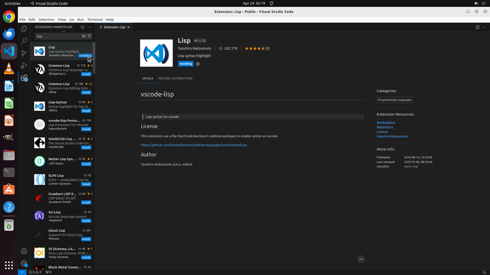

**Response:**
```
The Lisp extension is being installed. Let me wait for it to complete.
```

**Actions:** `time.sleep(0.5)`

---

## Step 7

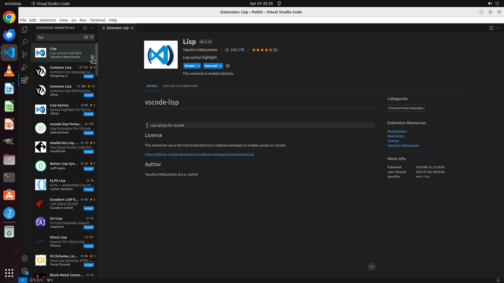

**Response:**
```
The Lisp extension has been installed successfully. It shows "This extension is enabled globally." Now I need to:

1. First, check if there's a `character.png` file, and create one if needed
2. Write a GIMP Script-Fu script to resize it to 128x128 and save as `resized.png`

Let me open a terminal first to check for the image and then create the script.
```

**Actions:** `pyautogui.keyDown('ctrl')
pyautogui.keyDown('grave')
pyautogui.keyUp('grave')
pyautogui.keyUp('ctrl')`

---

## Step 8


**Response:**
```
Let me try opening a terminal from the menu.
```

**Actions:** `pyautogui.click(373, 76)`

---

## Step 9

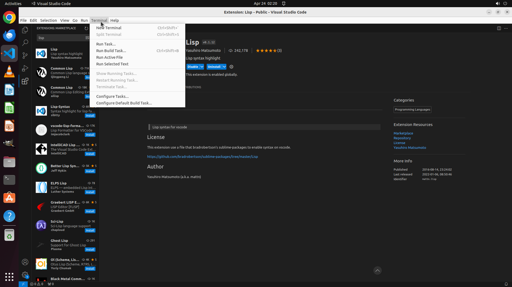

**Actions:** `pyautogui.click(406, 103)`

---

## Step 10


**Response:**
```
The terminal is open. Let me first check if `character.png` exists and find where it is, then create the Script-Fu script.
```

**Actions:** `pyautogui.click(960, 855)`

---

## Step 11

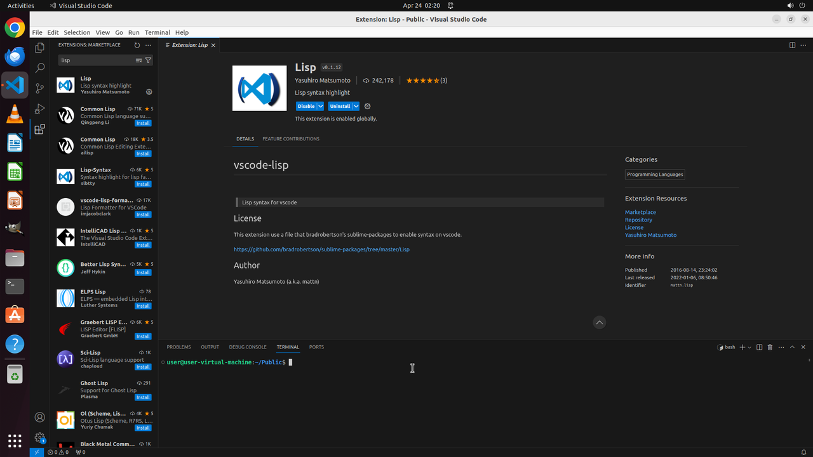

**Response:**
```
Good, the terminal is active. Let me first check if `character.png` exists somewhere.
```

**Actions:** `import subprocess, shlex; subprocess.run(f'xdotool type --delay 12 -- ' + shlex.quote('find /home/user -name "character.png" 2>/dev/null\n'), shell=True, check=True)
import time; time.sleep(0.05)`

---

## Step 12

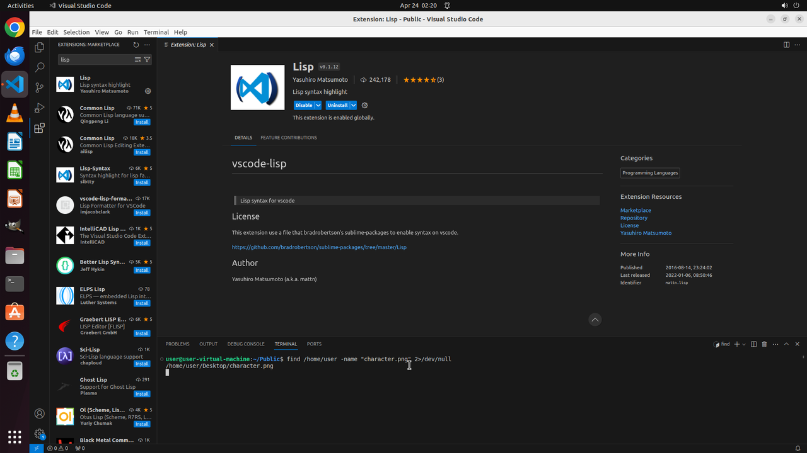

**Response:**
```
I found `character.png` at `/home/user/Desktop/character.png`. Now I need to create a Script-Fu script that resizes it to 128x128 and saves it as `resized.png`. Let me first navigate to the Desktop directory and create the script file.
```

**Actions:** `import subprocess, shlex; subprocess.run(f'xdotool type --delay 12 -- ' + shlex.quote('cd /home/user/Desktop\n'), shell=True, check=True)
import time; time.sleep(0.05)`

---

## Step 13

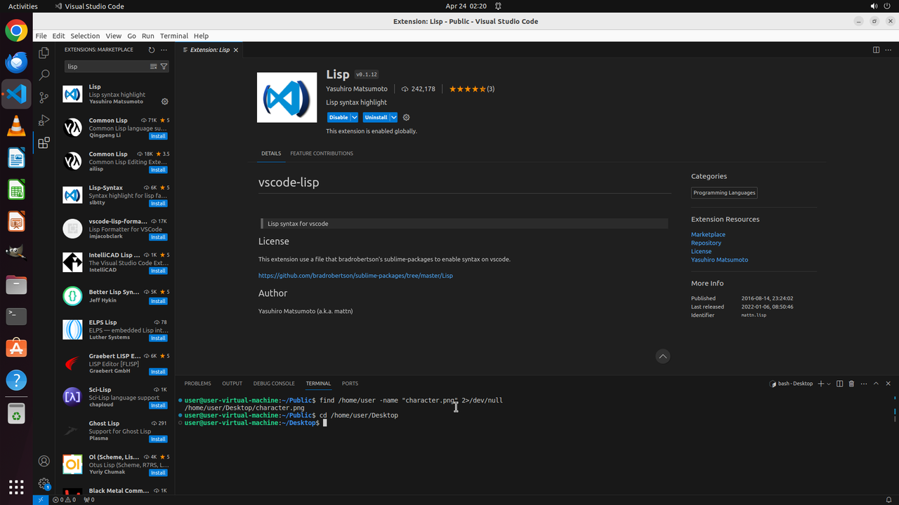

**Response:**
```
Good, I'm now in the Desktop directory. Now let me create the Script-Fu script file. I'll use VS Code to create and edit the file.
```

**Actions:** `import subprocess, shlex; subprocess.run(f'xdotool type --delay 12 -- ' + shlex.quote('code resize-image.scm\n'), shell=True, check=True)
import time; time.sleep(0.05)`

---

## Step 14

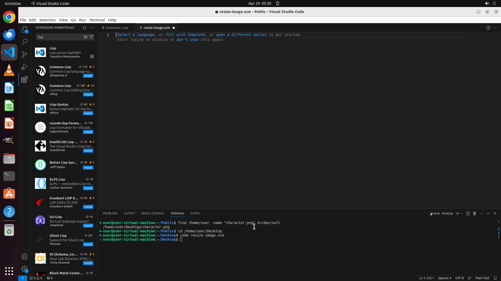

**Response:**
```
The file `resize-image.scm` is now open in VS Code. I can see it's suggesting to select a language. The `.scm` extension should be recognized by the Lisp extension. Let me now write the Script-Fu code to resize the image. Let me click on the editor area and start typing the script.
```

**Actions:** `pyautogui.click(960, 133)`

---

## Step 15

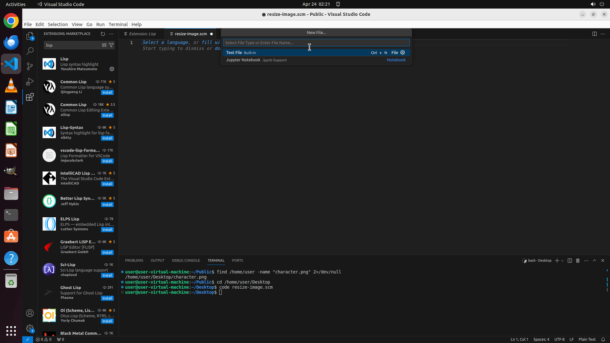

**Response:**
```
I see a file type selection dialog appeared. Let me dismiss it by pressing Escape and then type directly in the editor.
```

**Actions:** `pyautogui.keyDown('esc')
pyautogui.keyUp('esc')`

---

## Step 16


**Response:**
```
Good, the dialog is dismissed. Now let me click on the editor area to place the cursor and start typing the Script-Fu code.
```

**Actions:** `pyautogui.click(960, 300)`

---

## Step 17


**Response:**
```
Now let me type the Script-Fu code to resize the image. I'll write a GIMP Script-Fu batch script that loads `character.png`, resizes it to 128x128, and exports it as `resized.png`.
```

**Actions:** `import subprocess, shlex; subprocess.run(f'xdotool type --delay 12 -- ' + shlex.quote('(let* (\n    (image (car (gimp-file-load RUN-NONINT'), shell=True, check=True)
import time; time.sleep(0.05)
impo`

---

## Step 18

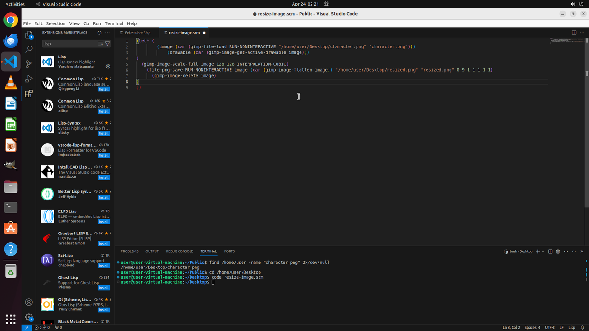

**Response:**
```
The Script-Fu code has been written in the editor and I can see it's being recognized as "Lisp" (shown in the bottom right corner). The syntax highlighting is working with the Lisp extension. Now let me save the file.
```

**Actions:** `pyautogui.keyDown('ctrl')
pyautogui.keyDown('s')
pyautogui.keyUp('s')
pyautogui.keyUp('ctrl')`

---

## Step 19

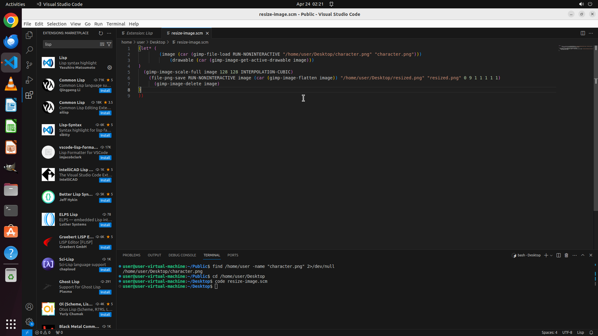

**Response:**
```
The file is saved (the title bar no longer shows the dot indicator). The Script-Fu code is properly saved with Lisp syntax highlighting. Now let me run this script using GIMP's batch mode from the terminal to test it.
```

**Actions:** `pyautogui.click(960, 919)`

---

## Step 20

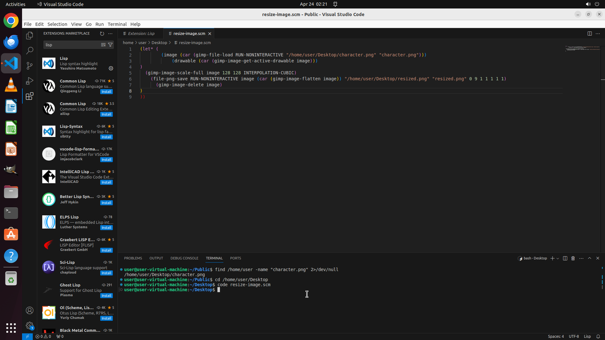

**Response:**
```
Good, the terminal is active. Now let me run the Script-Fu script using GIMP's batch mode to resize the image.
```

**Actions:** `import subprocess, shlex; subprocess.run(f'xdotool type --delay 12 -- ' + shlex.quote("gimp -i -b '(let* ((image (car (gimp-file-load RUN"), shell=True, check=True)
import time; time.sleep(0.05)
impor`

---

## Step 21

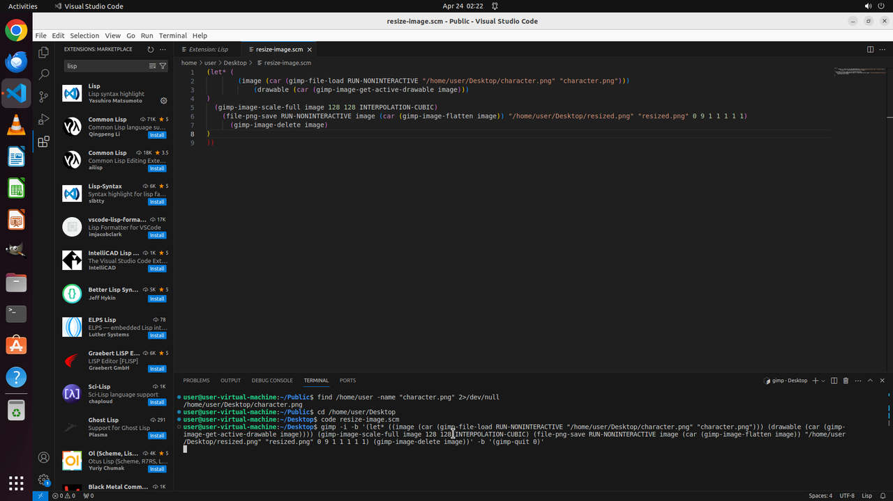

**Response:**
```
GIMP is running in batch mode. I can see the command is being executed. Let me wait for it to complete.
```

**Actions:** `time.sleep(0.5)`

---

## Step 22

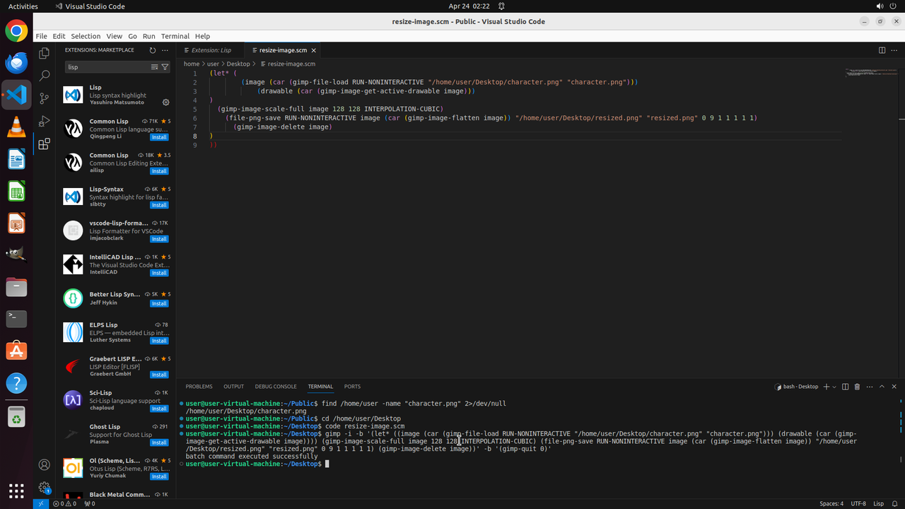

**Response:**
```
The script executed successfully! I can see "batch command executed successfully" in the terminal. Now let me verify that the `resized.png` file was created and check its dimensions.
```

**Actions:** `import subprocess, shlex; subprocess.run(f'xdotool type --delay 12 -- ' + shlex.quote('file /home/user/Desktop/resized.png && identify /h'), shell=True, check=True)
import time; time.sleep(0.05)
impor`

---

## Step 23

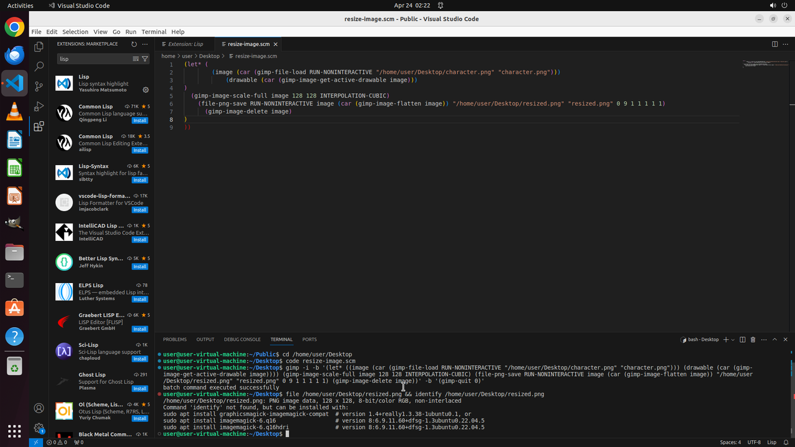

**Response:**
```
The output confirms that the `resized.png` file was successfully created:

- `/home/user/Desktop/resized.png: PNG image data, 128 x 128, 8-bit/color RGB, non-interlaced`

The image has been resized to exactly 128x128 pixels as required. Let me summarize what was accomplished:

1. **Installed the Lisp extension** in VS Code (by Yasuhiro Matsumoto) - This provides Lisp syntax highlighting which is perfect for editing GIMP Script-Fu scripts (`.scm` files).

2. **Created a Script-Fu script** (`resize-image.scm`) that:
   - Loads `character.png` from the Desktop
   - Scales the image to 128x128 using cubic interpolation
   - Flattens the image and saves it as `resized.png`
   - Cleans up by deleting the image from memory

3. **Tested the script** by running it through GIMP's batch mode, which successfully produced `resized.png` at 128x128 pixels.

DONE
```

**Actions:** `DONE`

---
