# Task 47f7c0ce-a5fb-4100-a5e6-65cd0e7429e5

**Instruction:** The landscape at 00:08 in this video is so beautiful. Please extract this frame and set it as the background of the second page of the opened slides.

**Score:** 0

**Wall clock:** 8m 24s

**Steps:** 26

**Cost:** $0.78

---

## Step 1

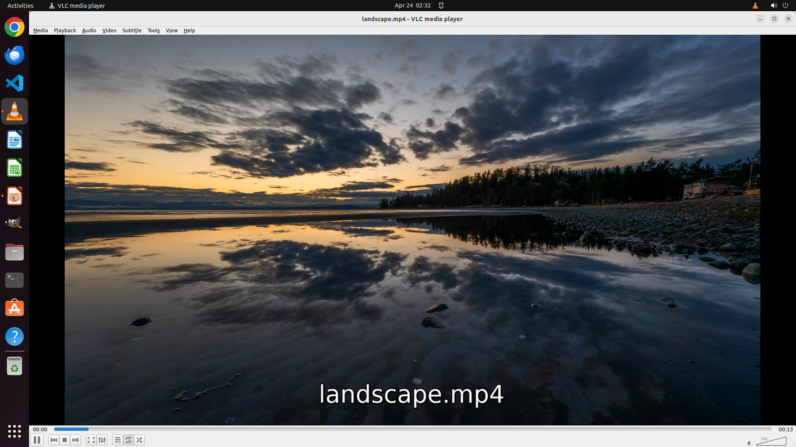

**Response:**
```
I need to extract a frame at 00:08 from the video and set it as the background of the second page of an opened presentation. Let me start by extracting the frame using ffmpeg.

First, let me open a terminal to extract the frame:
```

**Actions:** `pyautogui.click(33, 672)`

---

## Step 2

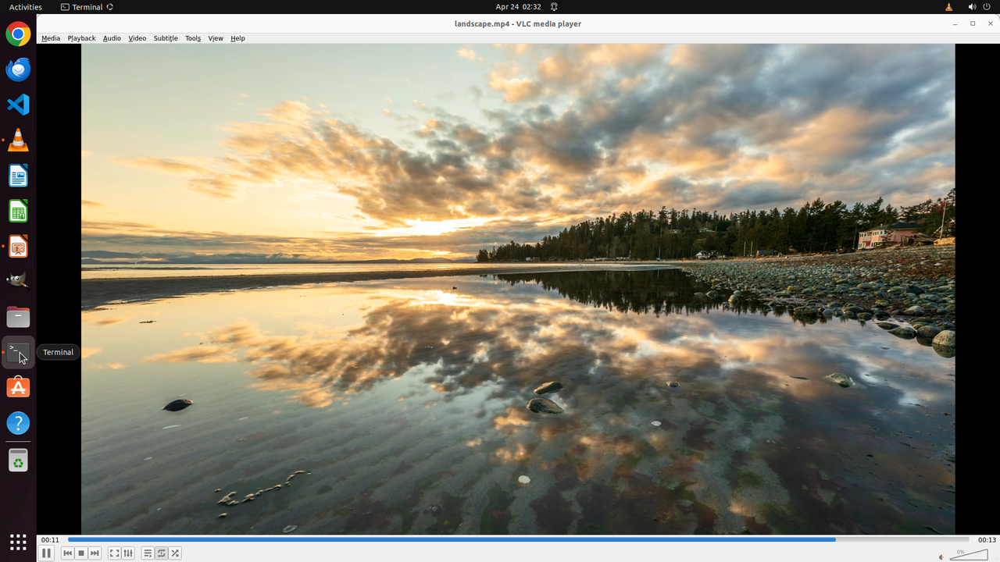

**Response:**
```
The terminal is loading. Let me click on it to open it.
```

**Actions:** `pyautogui.click(33, 672)`

---

## Step 3

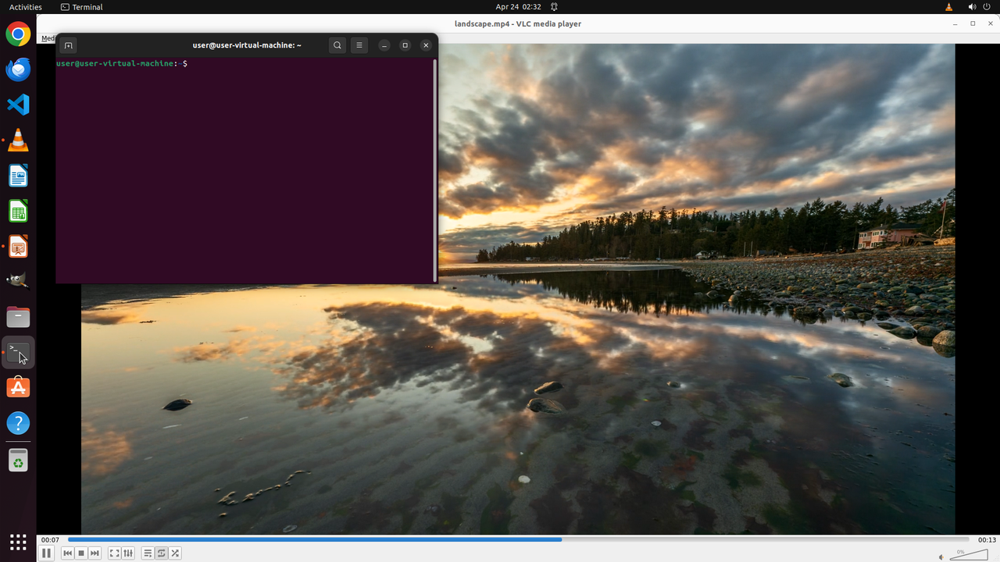

**Response:**
```
The terminal is open. Now I need to:
1. First, find the video file location
2. Extract the frame at 00:08
3. Find the opened presentation file
4. Set the frame as the background of the second slide

Let me first find the video file and extract the frame:
```

**Actions:** `pyautogui.click(450, 300)`

---

## Step 4

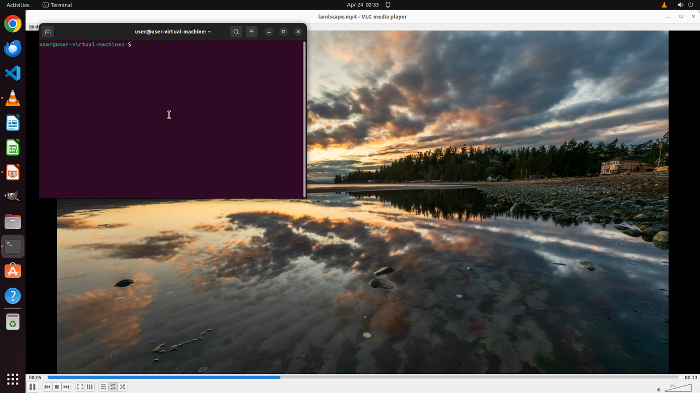

**Response:**
```
Good, the terminal is ready. Let me first find the video file and then extract the frame at 00:08.
```

**Actions:** `import subprocess, shlex; subprocess.run(f'xdotool type --delay 12 -- ' + shlex.quote('find /home/user -name "landscape.mp4" 2>/dev/null\n'), shell=True, check=True)
import time; time.sleep(0.05)`

---

## Step 5


**Response:**
```
Let me wait for the command to finish executing.
```

**Actions:** `pyautogui.keyDown('return')
pyautogui.keyUp('return')`

---

## Step 6

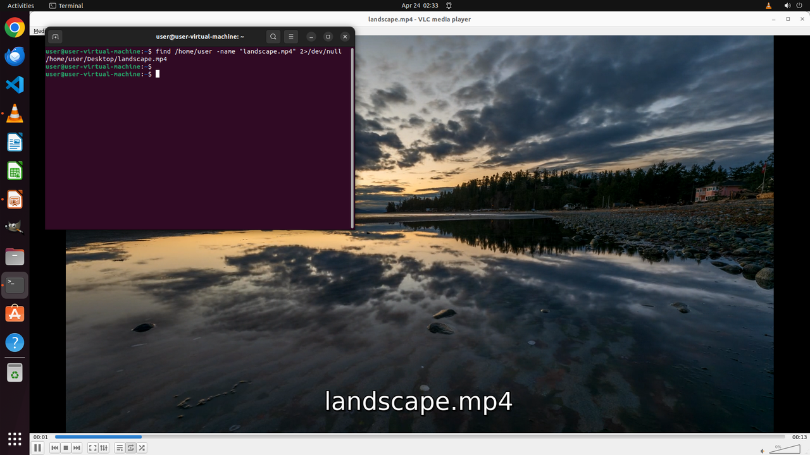

**Response:**
```
The video is at `/home/user/Desktop/landscape.mp4`. Now let me extract the frame at 00:08 using ffmpeg, and also find any presentation files:
```

**Actions:** `import subprocess, shlex; subprocess.run(f'xdotool type --delay 12 -- ' + shlex.quote('ffmpeg -ss 00:00:08 -i /home/user/Desktop/landscap'), shell=True, check=True)
import time; time.sleep(0.05)
impor`

---

## Step 7

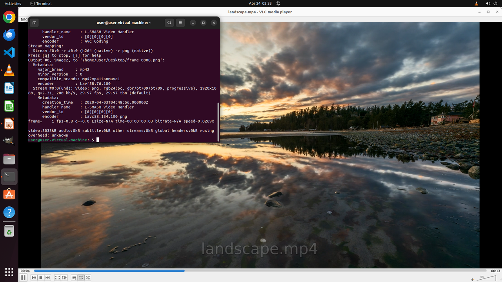

**Response:**
```
The frame has been extracted successfully to `/home/user/Desktop/frame_0008.png`. Now I need to find the presentation file. Let me search for it:
```

**Actions:** `import subprocess, shlex; subprocess.run(f'xdotool type --delay 12 -- ' + shlex.quote('find /home/user -name "*.pptx" -o -name "*.odp" -o'), shell=True, check=True)
import time; time.sleep(0.05)
impor`

---

## Step 8

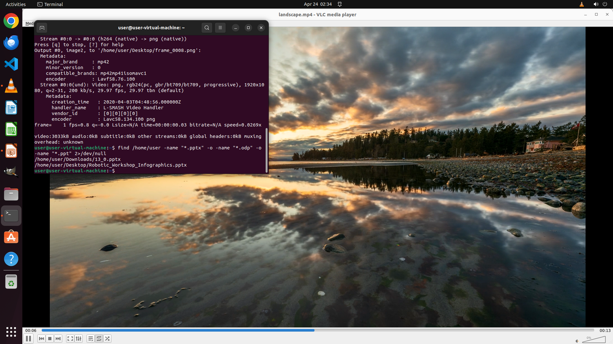

**Response:**
```
I found two presentation files:
1. `/home/user/Downloads/13_0.pptx`
2. `/home/user/Desktop/Robotic_Workshop_Infographics.pptx`

The task mentions "the opened slides". Let me check if there's a LibreOffice Impress already open. I can see the taskbar shows LibreOffice Impress icons on the left sidebar. Let me check which one is open by looking at the taskbar. I notice the task says "opened slides" - let me check if LibreOffice Impress is already running:
```

**Actions:** `import subprocess, shlex; subprocess.run(f'xdotool type --delay 12 -- ' + shlex.quote('ps aux | grep -i impress\n'), shell=True, check=True)
import time; time.sleep(0.05)`

---

## Step 9

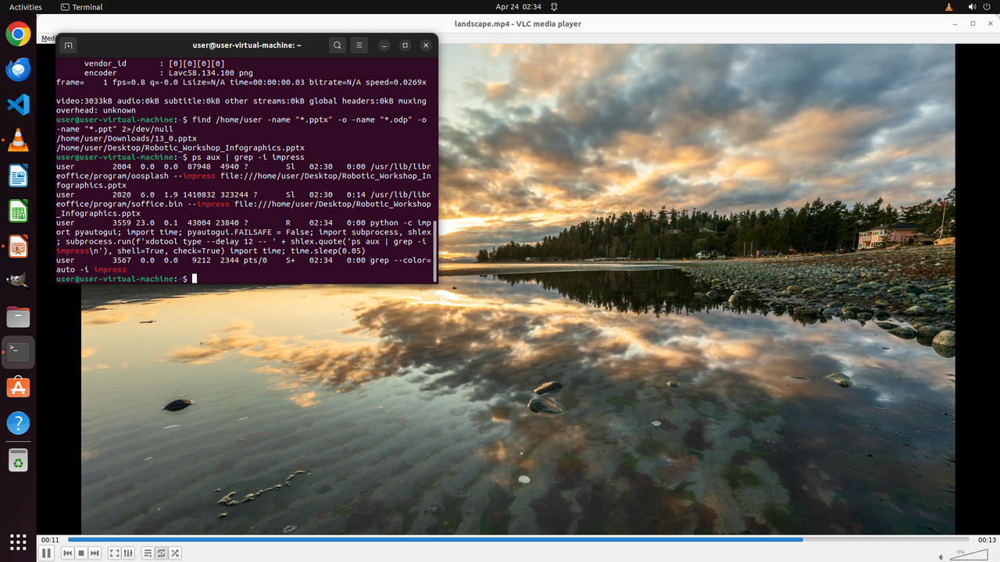

**Response:**
```
I can see that LibreOffice Impress is open with the file `Robotic_Workshop_Infographics.pptx` from the Desktop. Now I need to use a Python script to set the extracted frame as the background of the second slide. Let me write a Python script using python-pptx:
```

**Actions:** `import subprocess, shlex; subprocess.run(f'xdotool type --delay 12 -- ' + shlex.quote('python3 -c "\nfrom pptx import Presentation\nfrom pp'), shell=True, check=True)
import time; time.sleep(0.05)
imp`

---

## Step 10

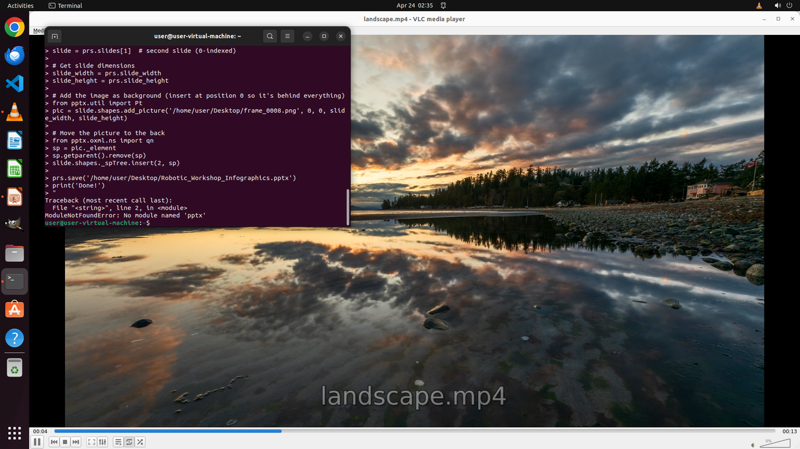

**Response:**
```
I need to install the python-pptx module first. Let me do that:
```

**Actions:** `import subprocess, shlex; subprocess.run(f'xdotool type --delay 12 -- ' + shlex.quote('pip install python-pptx\n'), shell=True, check=True)
import time; time.sleep(0.05)`

---

## Step 11

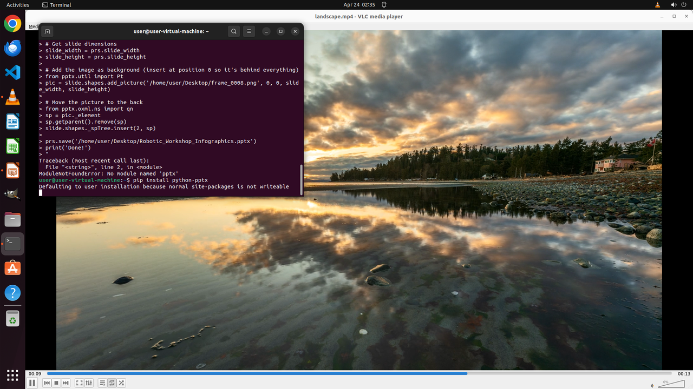

**Response:**
```
It's installing. Let me wait for it to complete.
```

**Actions:** `time.sleep(0.5)`

---

## Step 12

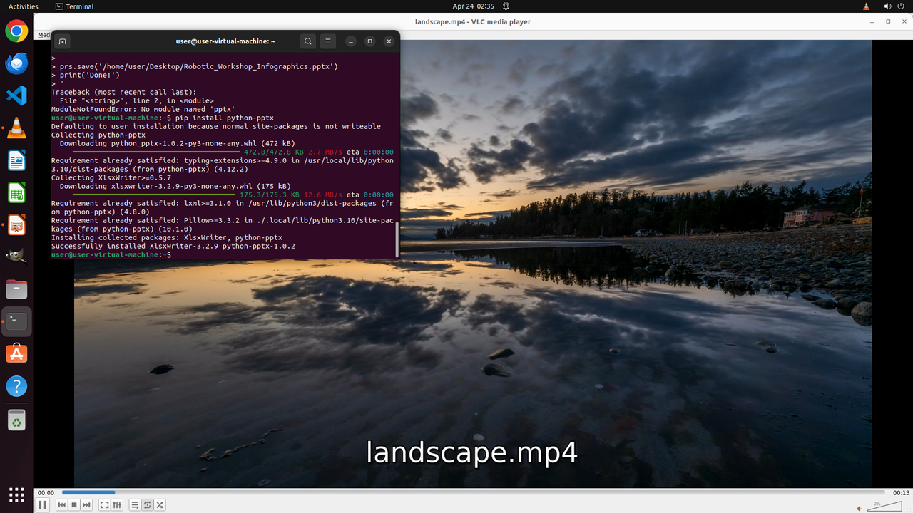

**Response:**
```
python-pptx has been installed successfully. Now I need to close the file in LibreOffice Impress first before modifying it with python-pptx, or save to a temporary file. Since LibreOffice has the file open, I should save to a temporary location first, then handle it. Actually, let me first close LibreOffice Impress, modify the file, and then reopen it. But a better approach would be to save the modified file and then reload it.

Let me first close LibreOffice Impress to avoid file conflicts:
```

**Actions:** `import subprocess, shlex; subprocess.run(f'xdotool type --delay 12 -- ' + shlex.quote('python3 -c "\nfrom pptx import Presentation\nfrom pp'), shell=True, check=True)
import time; time.sleep(0.05)
imp`

---

## Step 13

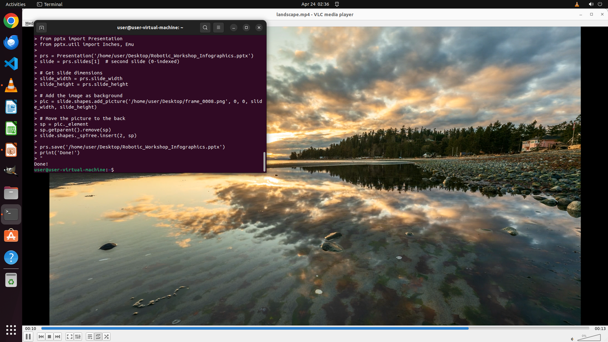

**Response:**
```
The script ran successfully and printed "Done!". The frame from 00:08 has been extracted and set as the background of the second slide of the presentation. 

Now I need to reload the file in LibreOffice Impress so the changes are reflected. Let me switch to LibreOffice Impress and reload the file:
```

**Actions:** `pyautogui.click(33, 475)`

---

## Step 14

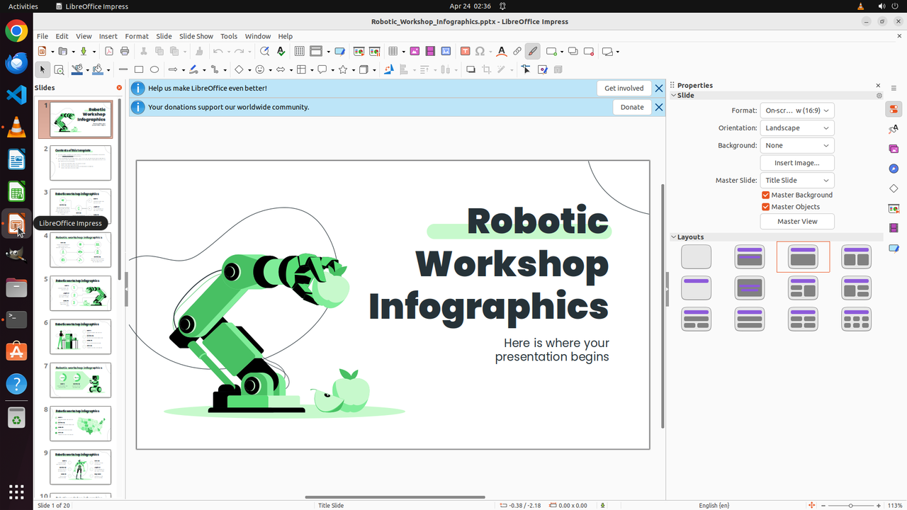

**Response:**
```
LibreOffice Impress is open with the presentation. I can see the file has been modified by the Python script, but LibreOffice still shows the old version. I need to reload the file. Let me click on the second slide first to check it, and then reload the document:
```

**Actions:** `pyautogui.click(160, 330)`

---

## Step 15

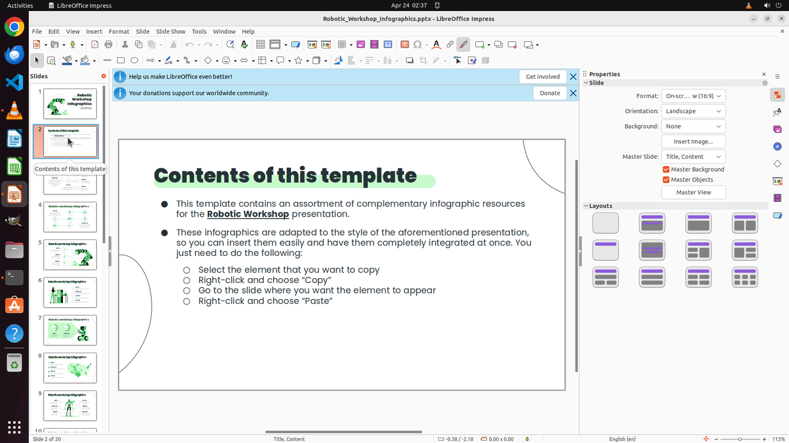

**Response:**
```
I can see the second slide is selected. The file was modified by python-pptx but LibreOffice still shows the old version since it was already open. I need to reload the file. Let me close and reopen it, or use Edit > Reload. Let me try reloading:
```

**Actions:** `pyautogui.click(130, 76)`

---

## Step 16

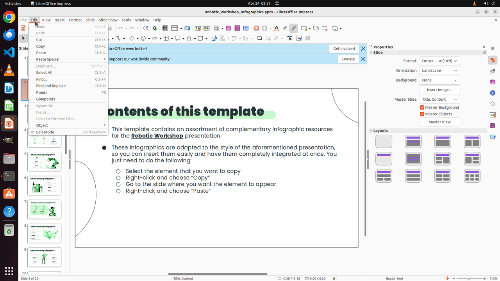

**Response:**
```
I don't see a "Reload" option in the Edit menu. Let me close this menu and try a different approach - I'll close the file and reopen it:
```

**Actions:** `pyautogui.keyDown('esc')
pyautogui.keyUp('esc')`

---

## Step 17

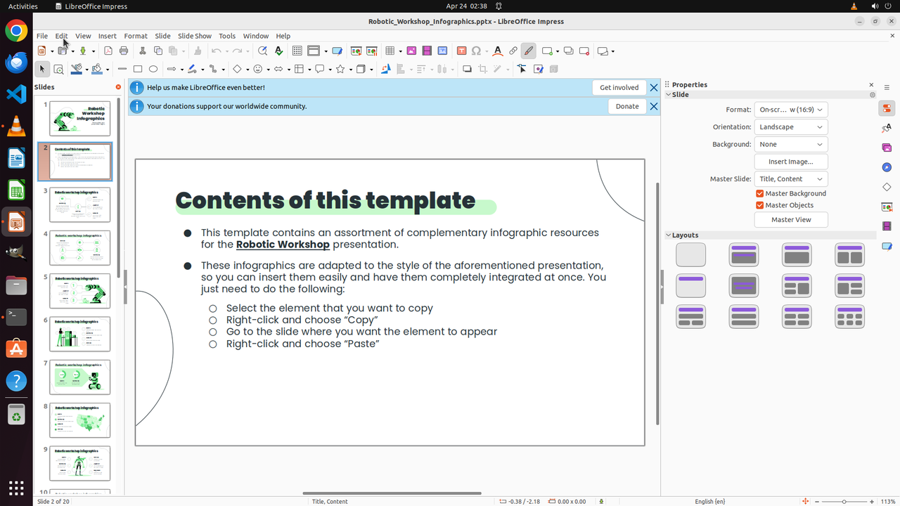

**Response:**
```
I need to reload the file in LibreOffice Impress. Let me try using Edit > Reload or close and reopen. Let me try the "Reload" option from the File menu:
```

**Actions:** `pyautogui.click(85, 76)`

---

## Step 18

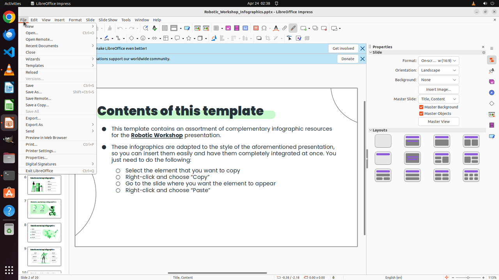

**Response:**
```
I can see "Reload" option in the File menu. Let me click on it:
```

**Actions:** `pyautogui.click(120, 277)`

---

## Step 19

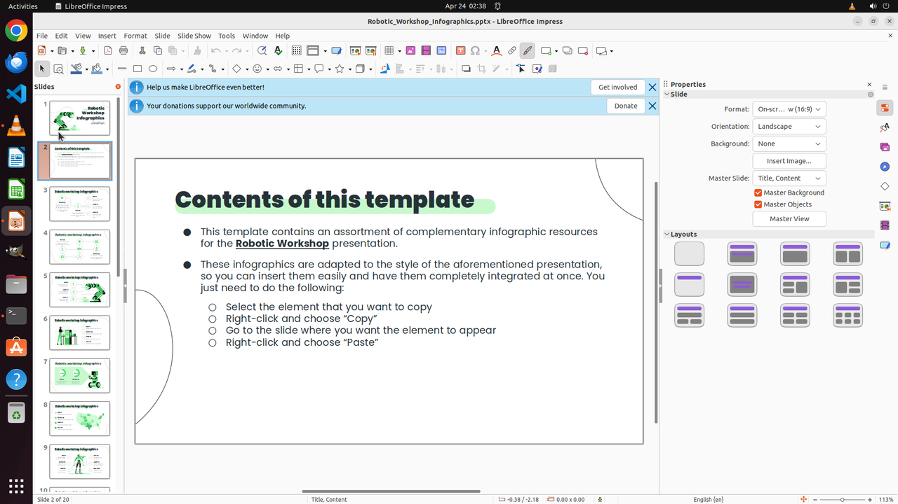

**Response:**
```
It seems the Reload option didn't work (it was likely greyed out since the file wasn't modified in LibreOffice). The python-pptx script already saved the modified file, but LibreOffice is still showing the old version from memory. I need to close and reopen the file. Let me close the file first:
```

**Actions:** `pyautogui.click(85, 76)`

---

## Step 20

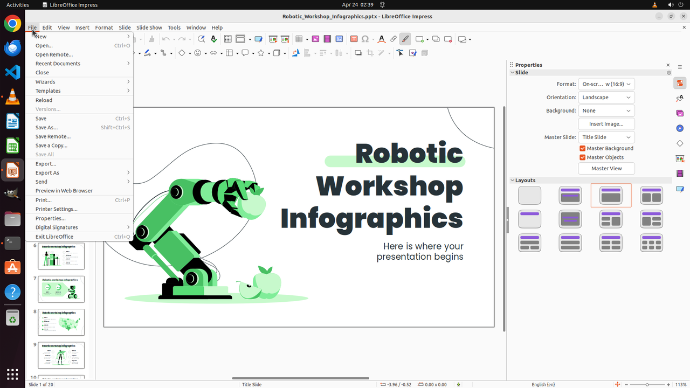

**Response:**
```
I see the Reload option is available. Let me click on it:
```

**Actions:** `pyautogui.click(120, 277)`

---

## Step 21

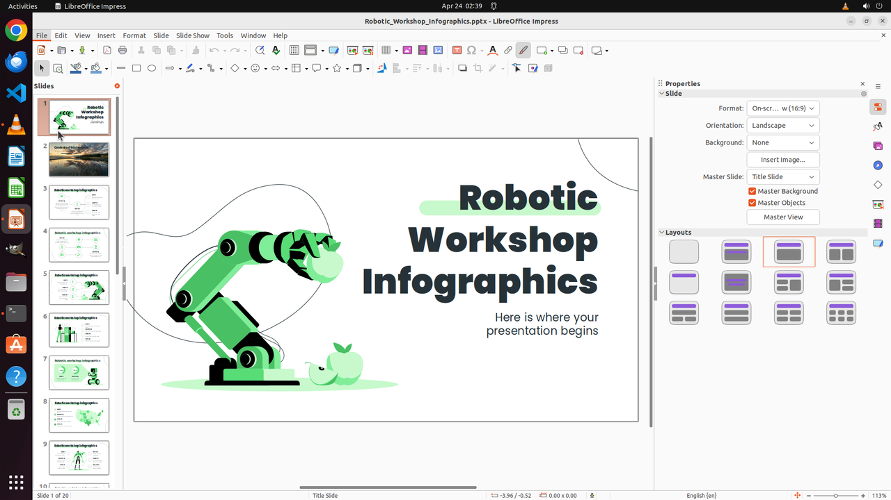

**Response:**
```
The file has been reloaded and I can see that the second slide (slide 2) now has the landscape image as its background - I can see the landscape/sunset image in the slide thumbnail panel on the left. The frame from 00:08 of the video has been successfully set as the background of the second slide.

Now I need to save the file. Let me press Ctrl+S to save:
```

**Actions:** `pyautogui.keyDown('ctrl')
pyautogui.keyDown('s')
pyautogui.keyUp('s')
pyautogui.keyUp('ctrl')`

---

## Step 22

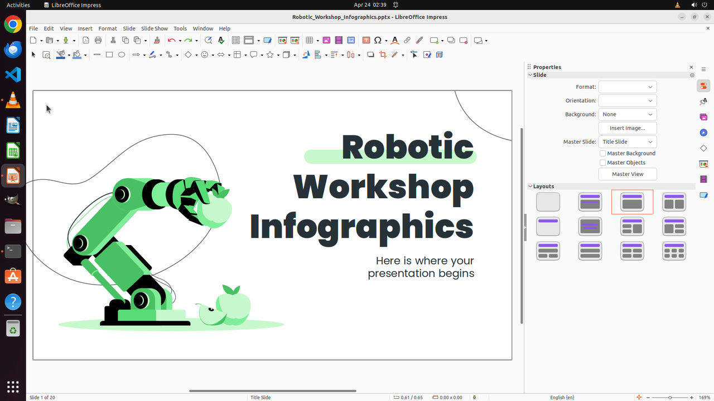

**Response:**
```
I notice the slide panel on the left is gone. It seems the view changed. Let me check if a save dialog appeared or if the file was saved. Let me also check if there was a format dialog. Let me look at the current state - it seems the file is saved and the slide panel is hidden. Let me enable the slide panel and verify the second slide:
```

**Actions:** `pyautogui.click(175, 76)`

---

## Step 23

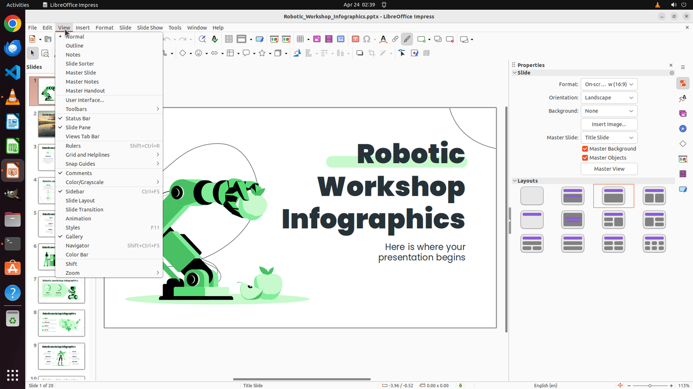

**Response:**
```
I can see the slide panel is now visible on the left. I can see slide 2 has the landscape image as background! Let me close this menu and verify by clicking on slide 2:
```

**Actions:** `pyautogui.keyDown('esc')
pyautogui.keyUp('esc')`

---

## Step 24


**Response:**
```
I can see in the slide panel that slide 2 now has the landscape image as its background. Let me click on slide 2 to verify it:
```

**Actions:** `pyautogui.click(160, 337)`

---

## Step 25

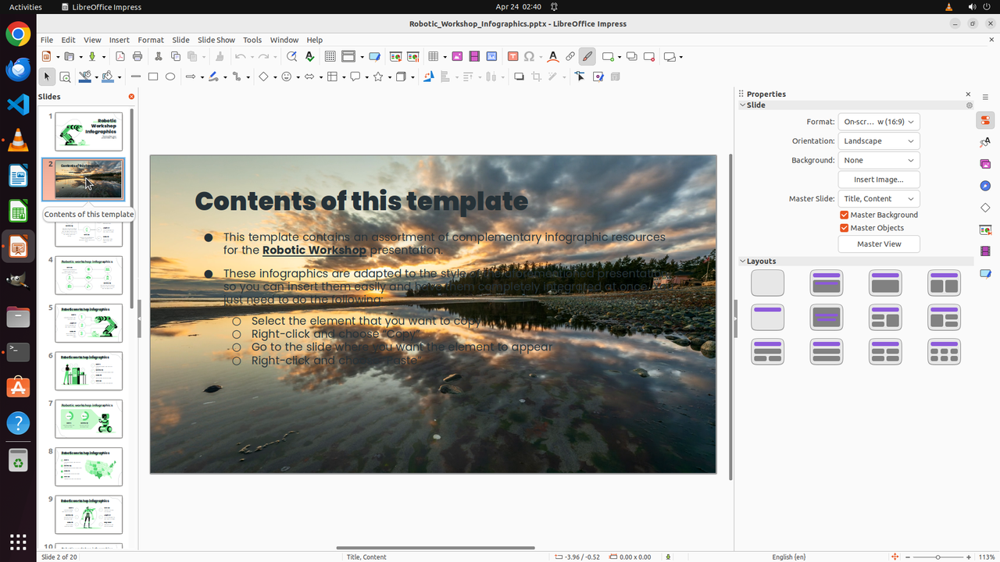

**Response:**
```
The landscape frame from 00:08 of the video has been successfully set as the background of the second slide. I can see the beautiful sunset/landscape image covering the entire background of slide 2, with the text content overlaid on top of it.

Now let me save the file to make sure the changes are preserved:
```

**Actions:** `pyautogui.keyDown('ctrl')
pyautogui.keyDown('s')
pyautogui.keyUp('s')
pyautogui.keyUp('ctrl')`

---

## Step 26


**Response:**
```
The file has been saved. The task is complete. I have successfully:

1. Extracted the frame at 00:08 from the `landscape.mp4` video using ffmpeg
2. Set it as the background of the second slide of the `Robotic_Workshop_Infographics.pptx` presentation using python-pptx
3. The landscape image is now visible as the background of slide 2, showing a beautiful sunset scene with water reflections

DONE
```

**Actions:** `DONE`

---
