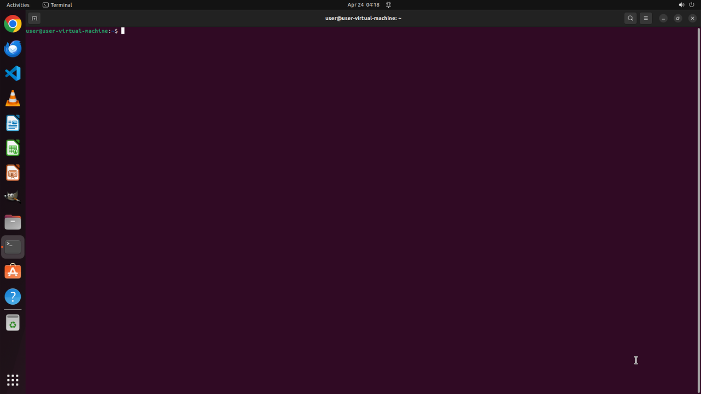
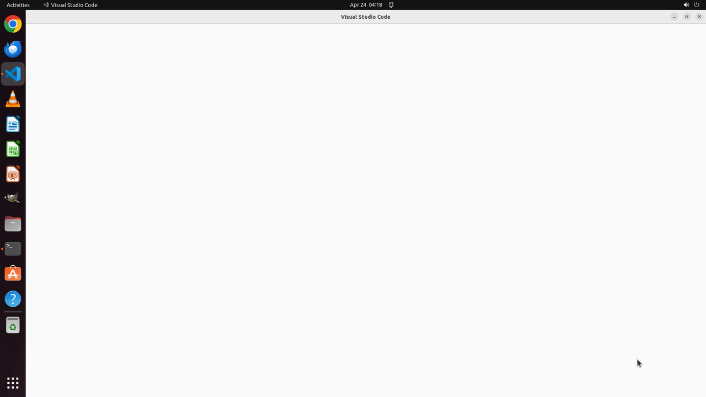

# Task 510f64c8-9bcc-4be1-8d30-638705850618

**Instruction:** Could you start VS Code in folder ~/Desktop/project from the terminal?

**Score:** 1.0

**Wall clock:** 36s

**Steps:** 2

**Cost:** $0.04

---

## Step 1



**Response:**
```
I need to first ensure the project directory exists, then open VS Code in that folder from the terminal.
```

**Actions:** `import subprocess, shlex; subprocess.run(f'xdotool type --delay 12 -- ' + shlex.quote('mkdir -p ~/Desktop/project && code ~/Desktop/proje'), shell=True, check=True)
import time; time.sleep(0.05)
impor`

---

## Step 2



**Response:**
```
VS Code has successfully launched and is now open with the `~/Desktop/project` folder. The title bar shows "Visual Studio Code" and the application is running. 

DONE
```

**Actions:** `DONE`

---
