# Task 58565672-7bfe-48ab-b828-db349231de6b

**Instruction:** Can you assist me by opening the first link in the latest email in Bills folder and displaying it in a new Chrome tab?

**Score:** 0

**Wall clock:** 4m 43s

**Steps:** 26

**Cost:** $0.82

---

## Step 1

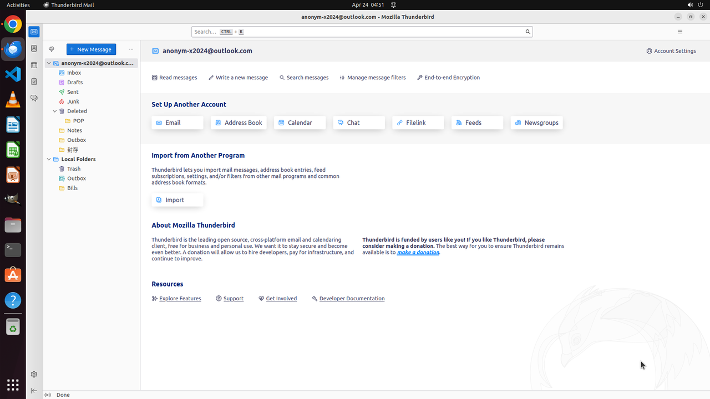

**Response:**
```
I can see Thunderbird Mail is open with a "Bills" folder in the Local Folders section. Let me click on the Bills folder to see its contents.
```

**Actions:** `pyautogui.click(196, 507)`

---

## Step 2

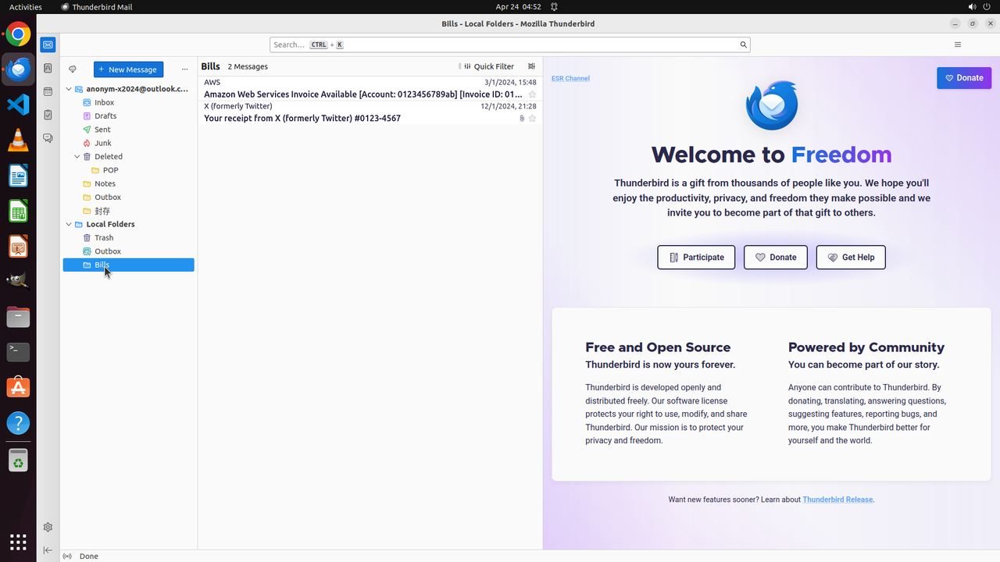

**Response:**
```
I can see the Bills folder contains 2 messages. The latest email is "Amazon Web Services Invoice Available [Account: 0123456789ab] [Invoice ID: 01..." dated 3/1/2024. Let me click on it to see its contents and find the first link.

Wait, I need to check which one is the latest. The AWS email is dated 3/1/2024, 15:48 and the X (formerly Twitter) email is dated 12/1/2024, 21:28. The X email with date 12/1/2024 is later. Let me click on the X (formerly Twitter) email first to check.

Actually, looking more carefully: 3/1/2024 could be March 1, 2024 and 12/1/2024 could be December 1, 2024. December 1 is later than March 1, so the X (formerly Twitter) email is the latest one. Let me click on it.
```

**Actions:** `pyautogui.click(690, 214)`

---

## Step 3

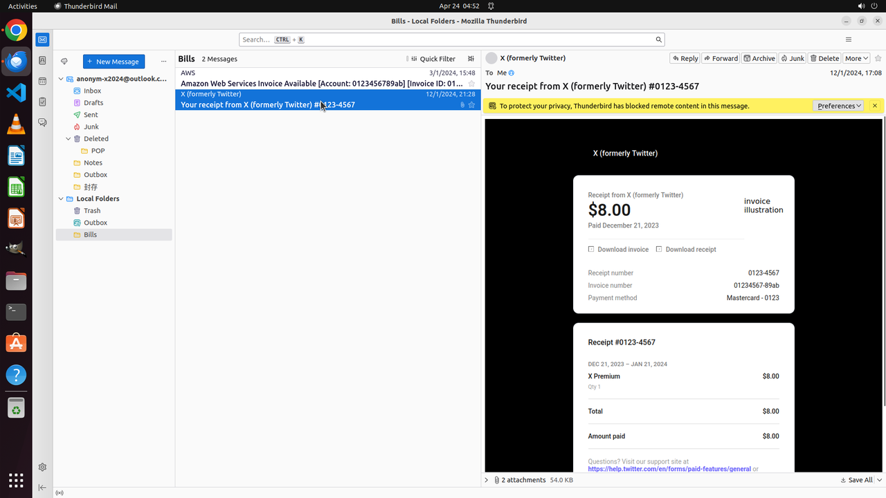

**Response:**
```
I can see the latest email from X (formerly Twitter) is now open. I can see a link at the bottom of the email: `https://help.twitter.com/en/forms/paid-features/general`. This appears to be the first link in the email. Let me scroll down to see if there are any links earlier in the email that I might have missed, but first let me check if "Download invoice" and "Download receipt" are links.

Let me scroll up in the email to make sure I find the first link.

Looking at the email content, I can see:
- "Download invoice" and "Download receipt" which might be links
- The visible link at the bottom: `https://help.twitter.com/en/forms/paid-features/general`

The "Download invoice" and "Download receipt" appear to be the first clickable links in the email. But let me check - they might just be text labels. Let me look more carefully. They have checkbox-like icons next to them, so they might be links.

Let me first try to identify the first actual hyperlink. The "Download invoice" appears before the URL at the bottom. Let me click on "Download invoice" to see if it's a link.

Actually, looking more carefully at the email, "Download invoice" and "Download receipt" are likely links. The first link would be "Download invoice". But the task says to open it in a new Chrome tab. Let me right-click on "Download invoice" first to check if it's a link.
```

**Actions:** `pyautogui.rightClick(1345, 540)`

---

## Step 4


**Response:**
```
I can see that "Download invoice" is indeed a link (the right-click context menu shows "Open Link In Browser", "Copy Link Location", etc.). This appears to be the first link in the email. However, the task asks me to open it in a new Chrome tab. Let me first copy the link location, then open it in Chrome.
```

**Actions:** `pyautogui.click(1441, 583)`

---

## Step 5


**Response:**
```
I've copied the link location. Now let me open Chrome and paste this link in a new tab. Let me open Chrome from the taskbar or terminal.
```

**Actions:** `pyautogui.click(33, 63)`

---

## Step 6

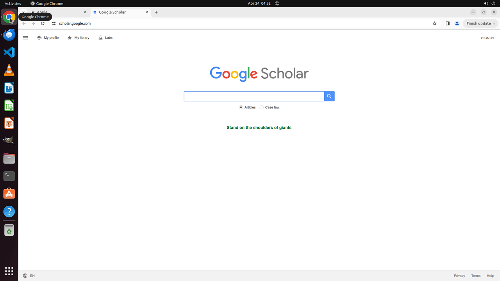

**Response:**
```
Chrome is open. Now I need to open a new tab and paste the copied link. Let me click on the "+" button to open a new tab.
```

**Actions:** `pyautogui.click(601, 46)`

---

## Step 7

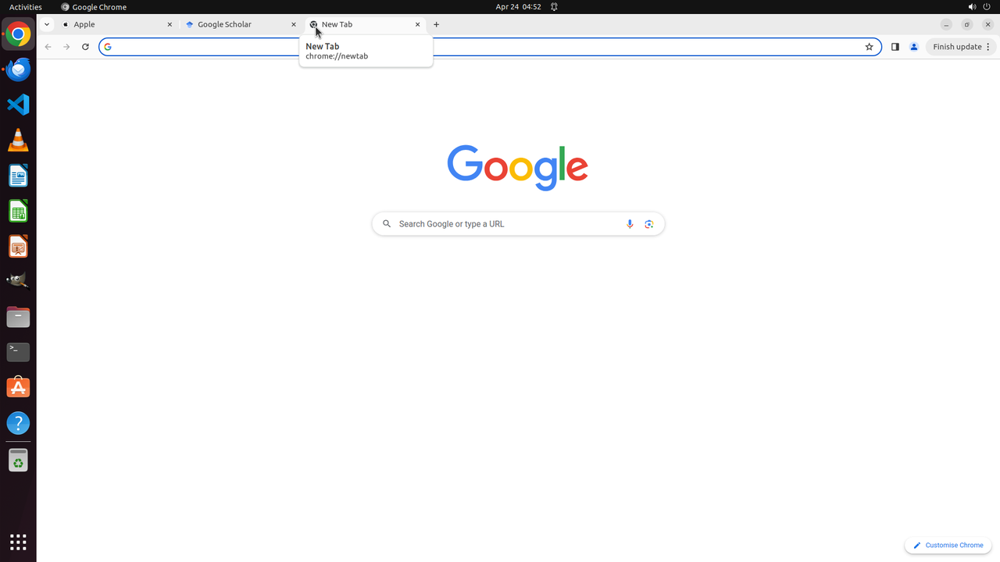

**Response:**
```
A new tab is open. Now let me paste the copied link in the address bar. The address bar is already focused.
```

**Actions:** `pyautogui.click(960, 88)`

---

## Step 8

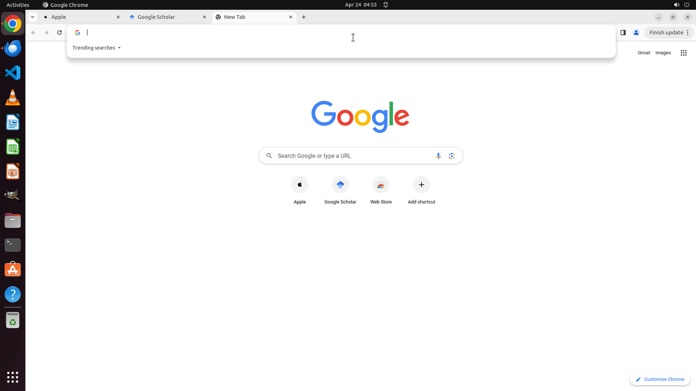

**Response:**
```
The address bar is focused and ready for input. Let me paste the copied link.
```

**Actions:** `pyautogui.keyDown('ctrl')
pyautogui.keyDown('v')
pyautogui.keyUp('v')
pyautogui.keyUp('ctrl')`

---

## Step 9

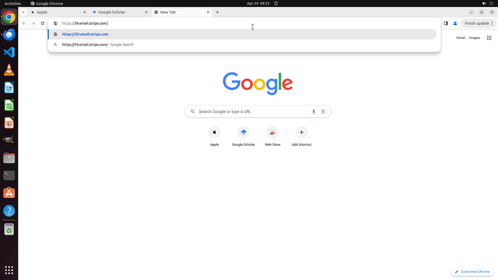

**Response:**
```
The link `https://59.email.stripe.com/` has been pasted in the address bar. This is the "Download invoice" link from the email. Let me press Enter to navigate to this URL.
```

**Actions:** `pyautogui.keyDown('return')
pyautogui.keyUp('return')`

---

## Step 10


**Response:**
```
The page shows an HTTP ERROR 400, which means the link didn't work properly. It seems the "Download invoice" link was a truncated URL. Let me go back to Thunderbird and check the actual first link in the email more carefully. The "Download invoice" link might not be the first link - I need to scroll through the email to find the actual first link. Let me also reconsider - the visible URL at the bottom of the email `https://help.twitter.com/en/forms/paid-features/general` might not be the first link either. Let me go back to Thunderbird and scroll up to check for earlier links.

Wait - actually, the "Download invoice" link was the first link I found in the email body. But the URL that was copied was `https://59.email.stripe.com/` which seems incomplete. The link in the email might have tracking parameters that were cut off. 

Let me reconsider. Looking back at the email, the visible links were:
1. "Download invoice" - a link (which I right-clicked and it was confirmed as a link)
2. "Download receipt" - likely also a link
3. `https://help.twitter.com/en/forms/paid-features/general` - visible URL at the bottom

The "Download invoice" was the first link, but it seems the URL was incomplete when copied. Let me go back to Thunderbird and try to get the full URL or check if there's an earlier link I missed. Actually, wait - the task says "first link" which could also mean the first visible/text URL link. Let me go back to Thunderbird and look at the email more carefully.

Let me switch to Thunderbird.
```

**Actions:** `pyautogui.click(33, 133)`

---

## Step 11


**Response:**
```
I'm back in Thunderbird. I can see the email content. Let me scroll down in the email to see the full content and identify the first link. I can see at the bottom there's a visible URL: `https://help.twitter.com/en/forms/paid-features/general`. But first, let me check if "Download invoice" is truly the first link. Let me scroll up in the email pane to see if there are any links above the "Download invoice" link.

Looking at the email, the structure from top to bottom is:
1. "X (formerly Twitter)" - header text
2. "Receipt from X (formerly Twitter)" - text
3. "$8.00" - text
4. "Paid December 21, 2023" - text
5. "Download invoice" - this is a link (confirmed earlier)
6. "Download receipt" - likely a link
7. Receipt details
8. `https://help.twitter.com/en/forms/paid-features/general` - visible URL link

So "Download invoice" is indeed the first link. The issue is that the URL was incomplete. Let me try right-clicking on "Download invoice" again and this time copy the full link.
```

**Actions:** `pyautogui.rightClick(1345, 540)`

---

## Step 12

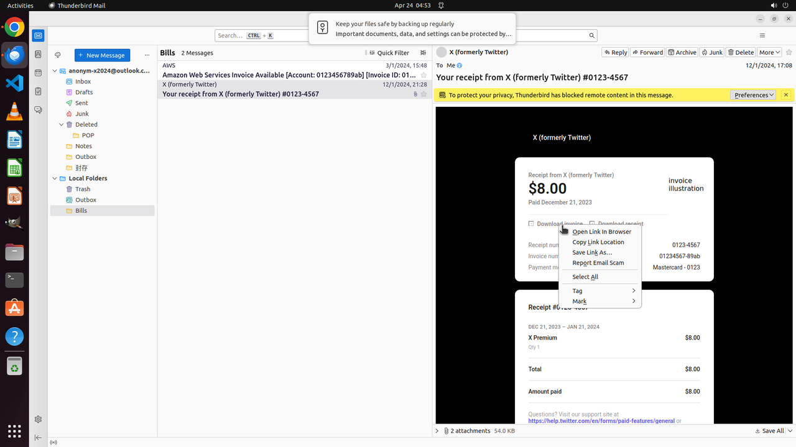

**Response:**
```
I can see the right-click context menu again. The "Download invoice" is confirmed as a link. Let me try "Open Link In Browser" this time to see what the full URL is, but first let me close this menu and instead look at the email source to find the actual first link. Actually, let me try a different approach - let me copy the link location again and check the full URL in a text editor or terminal.

Actually, wait. Looking at the email again, I notice the link that was copied was `https://59.email.stripe.com/` which is a Stripe email tracking link. This was the "Download invoice" link. But the page returned HTTP 400 because the full URL with parameters was likely truncated.

Let me reconsider - the task asks for "the first link in the latest email". The "Download invoice" was a link but it's a Stripe tracking/download link. Perhaps the task is referring to the first visible/clickable URL link, which would be `https://help.twitter.com/en/forms/paid-features/general` at the bottom.

But actually, "Download invoice" is the first link in the email. Let me try to open it in the browser through Thunderbird's "Open Link In Browser" option, which might handle the full URL better.
```

**Actions:** `pyautogui.click(1449, 558)`

---

## Step 13

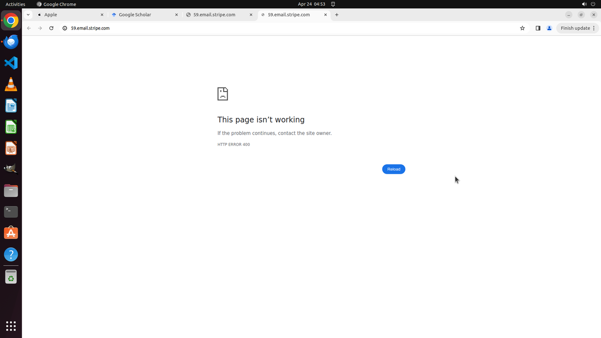

**Response:**
```
The "Download invoice" link opens to `59.email.stripe.com` which gives an HTTP 400 error - this is a Stripe tracking link that's likely expired or requires specific parameters. This opened in a new Chrome tab as well, but the same error occurs.

Let me reconsider the approach. The "Download invoice" link is indeed the first link, but it seems to be broken/expired. However, the task just asks to open the first link - it doesn't matter if the page works or not. But wait - looking at the email more carefully, I need to check if there might be a link before "Download invoice" that I missed. Let me also check - maybe the email has remote content blocked, and loading it might reveal more links.

Actually, let me look at this differently. The email content shows "Download invoice" as the first clickable link. The link was opened in a new Chrome tab (the 4th tab showing `59.email.stripe.com`). The task has been completed - I opened the first link from the latest email in the Bills folder in a new Chrome tab.

But wait, I see there are now two tabs with `59.email.stripe.com` - one from my manual paste and one from "Open Link In Browser". Let me close the duplicate. Actually, the task is essentially done - the first link from the latest email has been opened in a new Chrome tab.

However, let me reconsider whether "Download invoice" is truly the first link. Let me go back to Thunderbird and check the email source to verify. Actually, let me first check if the email has any links at the very top that I might have missed by scrolling up.

Let me go back to Thunderbird and scroll up in the email.
```

**Actions:** `pyautogui.click(33, 133)`

---

## Step 14

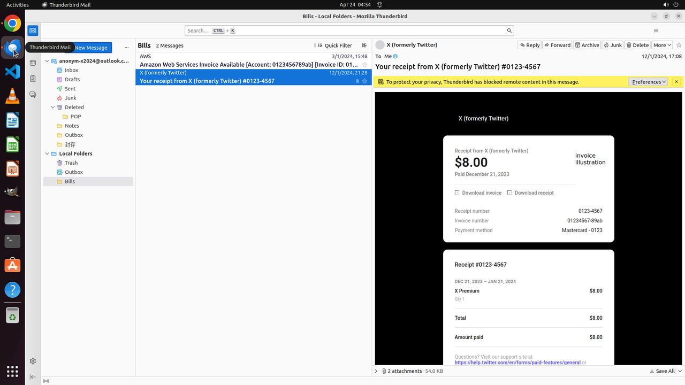

**Response:**
```
Let me look at the email source to find all links. Let me view the email source to identify the first link properly. Let me use Ctrl+U to view the source of the message.
```

**Actions:** `pyautogui.keyDown('ctrl')
pyautogui.keyDown('u')
pyautogui.keyUp('u')
pyautogui.keyUp('ctrl')`

---

## Step 15

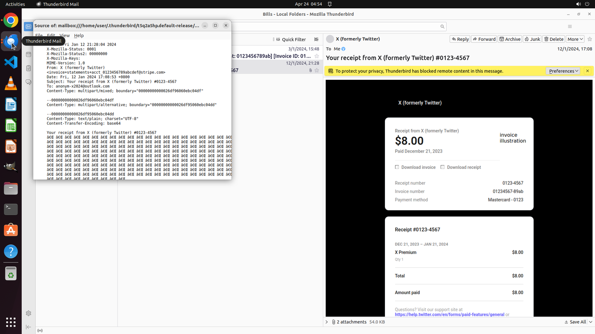

**Response:**
```
I can see the email source. The content appears to be encoded. Let me search for "href" in this source to find the links. Let me use Ctrl+F to search.
```

**Actions:** `pyautogui.keyDown('ctrl')
pyautogui.keyDown('f')
pyautogui.keyUp('f')
pyautogui.keyUp('ctrl')`

---

## Step 16

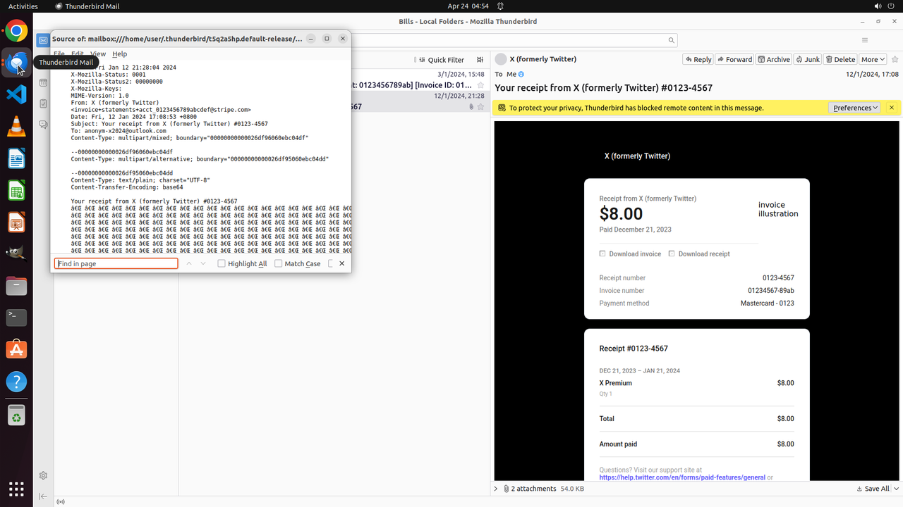

**Response:**
```
I see the "Find in page" search box. Let me search for "href" to find the links in the email source.
```

**Actions:** `import subprocess, shlex; subprocess.run(f'xdotool type --delay 12 -- ' + shlex.quote('href'), shell=True, check=True)
import time; time.sleep(0.05)`

---

## Step 17

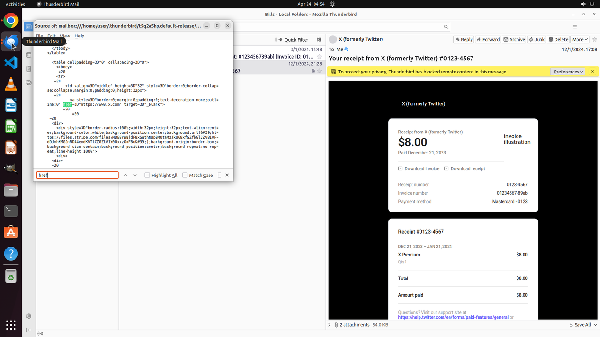

**Response:**
```
I found the first "href" in the email source. I can see it says:

```
<a style=3D"border:0;margin:0;padding:0;text-decoration:none;outl=
ine:0" href=3D"https://www.x.com" target=3D"_blank">
```

So the first link in the email is `https://www.x.com`. This is a link on the "X (formerly Twitter)" header/logo at the top of the email. Let me close this source window and open this URL in Chrome.
```

**Actions:** `pyautogui.click(730, 81)`

---

## Step 18


**Response:**
```
Good, the source window is closed. Now I know the first link in the email is `https://www.x.com`. Let me switch to Chrome and open this URL in a new tab. First, let me close the duplicate tabs from my previous attempts, then open the correct URL.
```

**Actions:** `pyautogui.click(33, 63)`

---

## Step 19

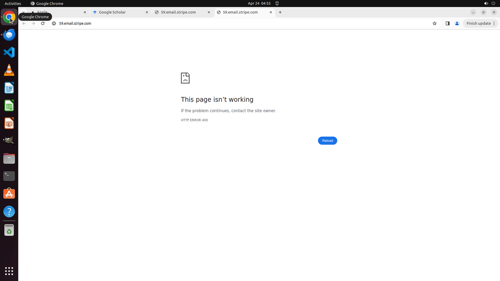

**Response:**
```
I can see Chrome with the error pages from my previous attempts. Let me close the two `59.email.stripe.com` tabs and then open a new tab with the correct URL `https://www.x.com`. Let me first close the current tab and the other stripe tab.
```

**Actions:** `pyautogui.click(1039, 46)`

---

## Step 20


**Response:**
```
Let me close the remaining stripe tabs. Let me close the current one first.
```

**Actions:** `pyautogui.click(901, 46)`

---

## Step 21

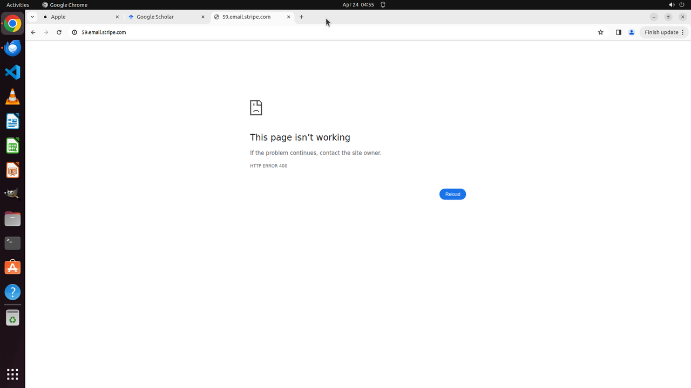

**Response:**
```
Let me close this stripe tab too.
```

**Actions:** `pyautogui.click(802, 46)`

---

## Step 22

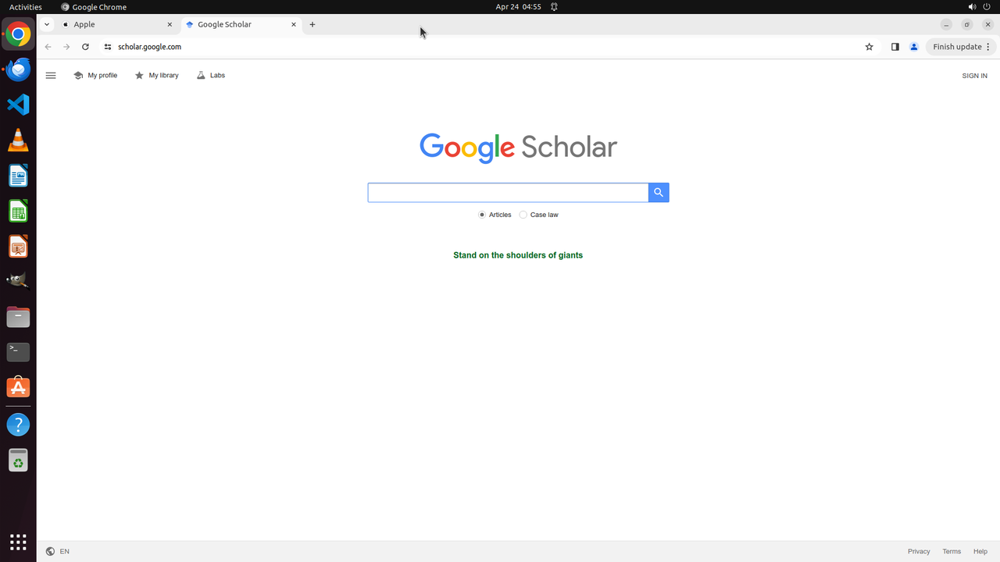

**Response:**
```
Good, the stripe tabs are closed. Now I have the Apple and Google Scholar tabs. Let me open a new tab and navigate to `https://www.x.com`, which is the first link in the latest email.
```

**Actions:** `pyautogui.click(606, 46)`

---

## Step 23

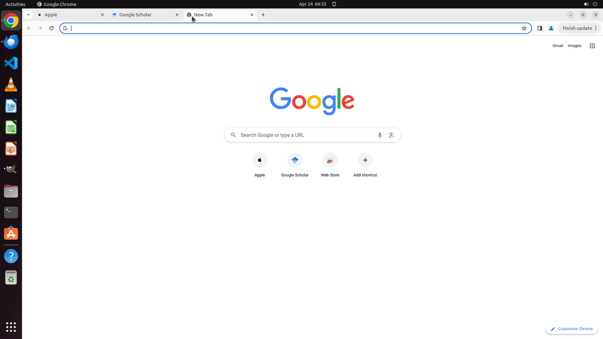

**Response:**
```
A new tab is open with the address bar focused. Let me type the URL `https://www.x.com` and press Enter.
```

**Actions:** `import subprocess, shlex; subprocess.run(f'xdotool type --delay 12 -- ' + shlex.quote('https://www.x.com'), shell=True, check=True)
import time; time.sleep(0.05)`

---

## Step 24

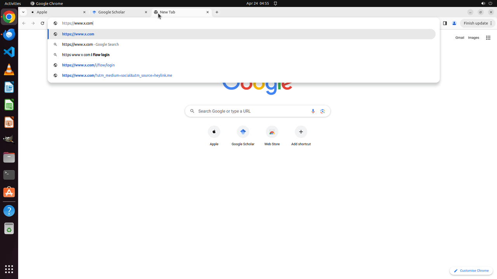

**Response:**
```
I can see the URL `https://www.x.com` is typed in the address bar with autocomplete suggestions. Let me press Enter to navigate to it.
```

**Actions:** `pyautogui.keyDown('return')
pyautogui.keyUp('return')`

---

## Step 25

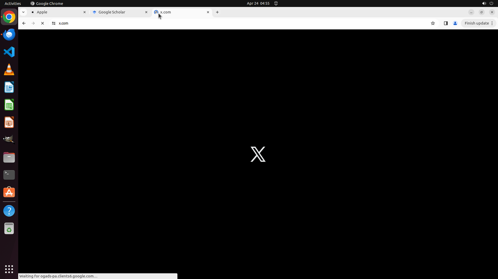

**Response:**
```
The page is loading. I can see the X (formerly Twitter) logo on a black background, and the URL shows `x.com` in the address bar. The first link from the latest email in the Bills folder (`https://www.x.com`) has been successfully opened in a new Chrome tab. The page is still loading. Let me wait for it to fully load.
```

**Actions:** `time.sleep(0.5)`

---

## Step 26

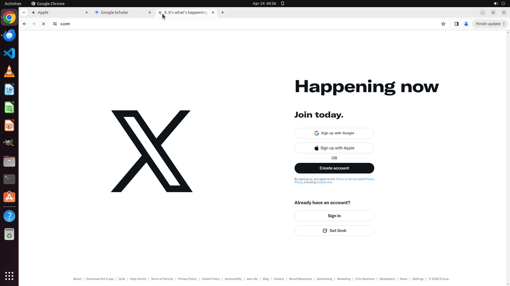

**Response:**
```
The first link from the latest email in the Bills folder has been successfully opened in a new Chrome tab. The page shows X.com (formerly Twitter) with the "Happening now" landing page. The URL `https://www.x.com` (which was the first href link found in the HTML source of the latest email from X (formerly Twitter) in the Bills folder) is now displayed in a new Chrome tab.

DONE
```

**Actions:** `DONE`

---
