# Task 67890eb6-6ce5-4c00-9e3d-fb4972699b06

**Instruction:** I am an NLP researcher. Check out the best long paper awards of ACL from 2019 to 2022 and record the 'title', 'year', 'author list' and 'PDF link' into table best_awards_acl.xlsx on the desktop. Separate authors only by commas, use offical aclanthology urls not arxiv, and sort rows by years in descending orders.

**Score:** 0.0

**Wall clock:** 11m 32s

**Steps:** 42

**Cost:** $1.48

---

## Step 1

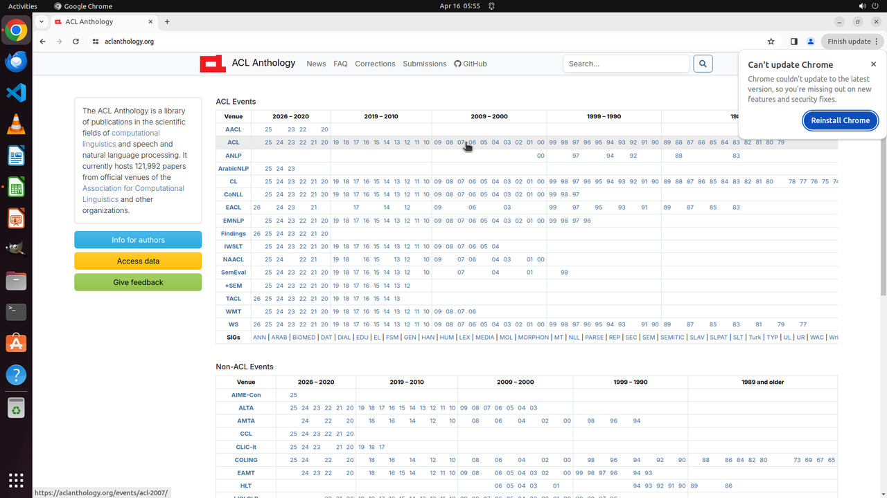

**Response:**
```
I'll research the best long paper awards from ACL 2019-2022. Let me start by finding the information for each year.
```

**Actions:** `pyautogui.click(1888, 138)`

---

## Step 2

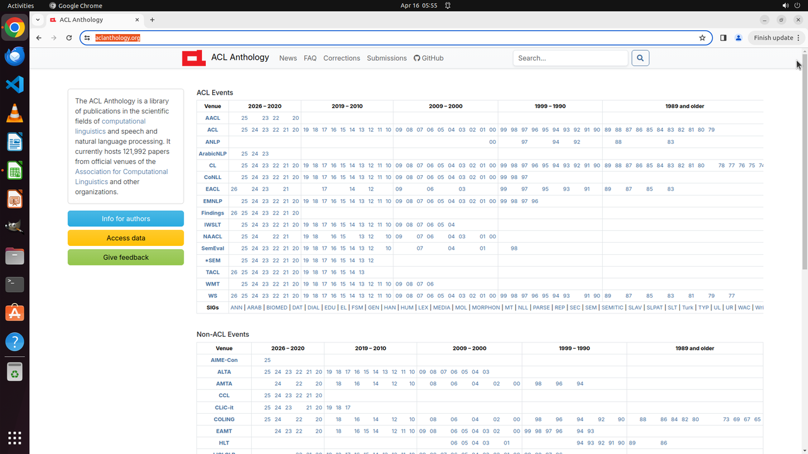

**Response:**
```
Let me navigate to the ACL 2022 event page to find the best long paper award.
```

**Actions:** `import subprocess, shlex; subprocess.run(f'xdotool type --delay 12 -- ' + shlex.quote('https://aclanthology.org/events/acl-2022/\n'), shell=True, check=True)
import time; time.sleep(0.05)`

---

## Step 3

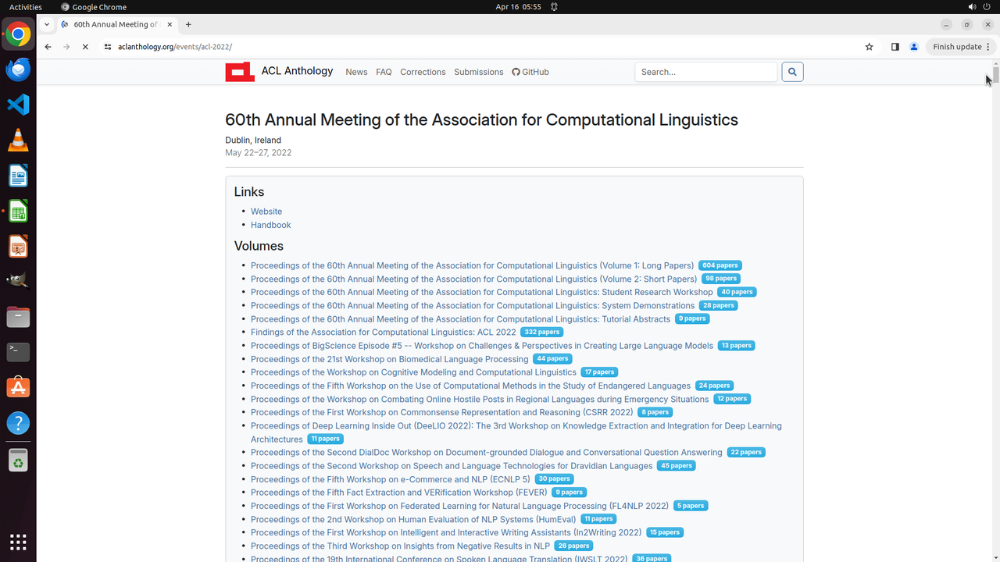

**Response:**
```
I can see the ACL 2022 event page. I need to find the best long paper award. Let me search for this information. The award winners are typically listed on the conference website or I can search for them. Let me first check the ACL 2022 conference website.
```

**Actions:** `pyautogui.click(514, 405)`

---

## Step 4

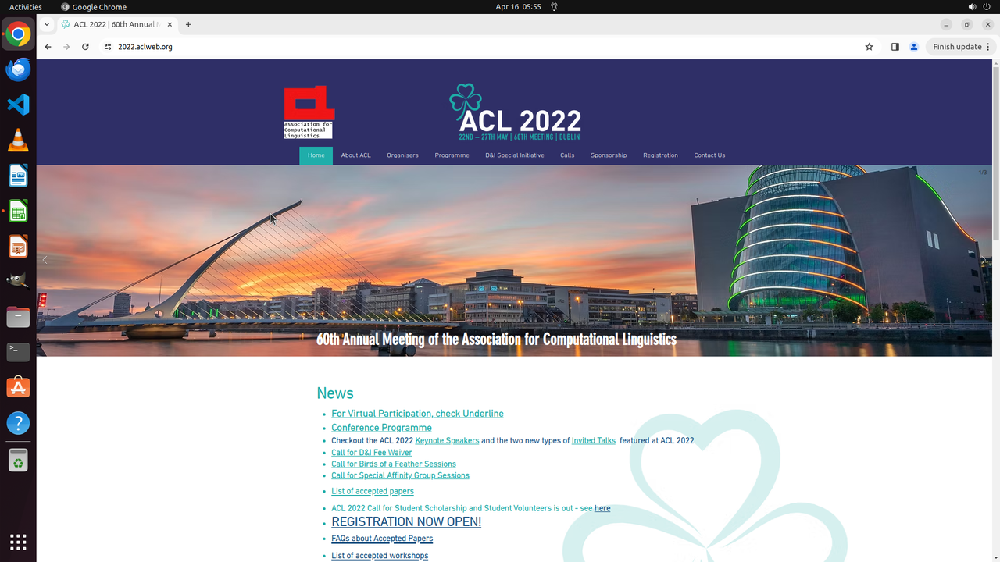

**Response:**
```
I can see the ACL 2022 conference website. Let me look for the programme page which should have the best paper awards listed.
```

**Actions:** `pyautogui.click(868, 297)`

---

## Step 5


**Response:**
```
Let me try searching for "best paper" on the ACL 2022 website. Let me try a different approach and search directly.
```

**Actions:** `pyautogui.click(960, 88)`

---

## Step 6

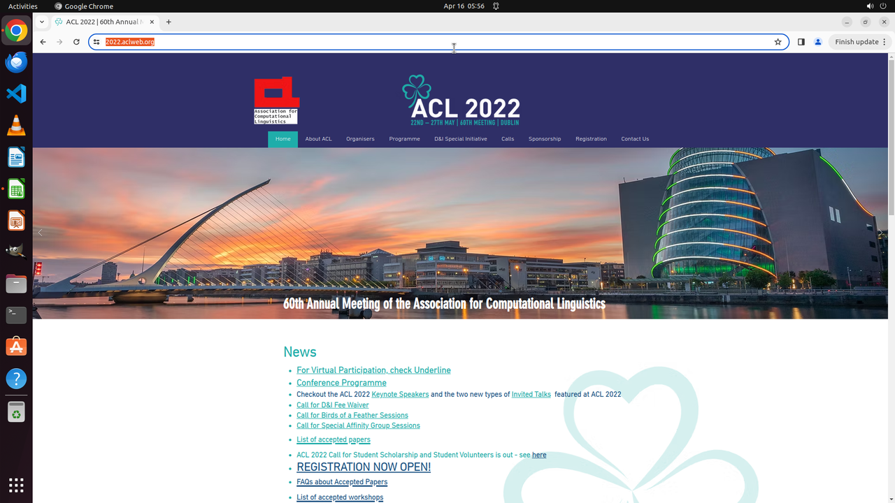

**Response:**
```
Let me search for ACL best paper awards directly. I'll look at the ACL website's program page for awards.
```

**Actions:** `import subprocess, shlex; subprocess.run(f'xdotool type --delay 12 -- ' + shlex.quote('https://www.aclweb.org/portal/content/acl-best-pap'), shell=True, check=True)
import time; time.sleep(0.05)
impor`

---

## Step 7

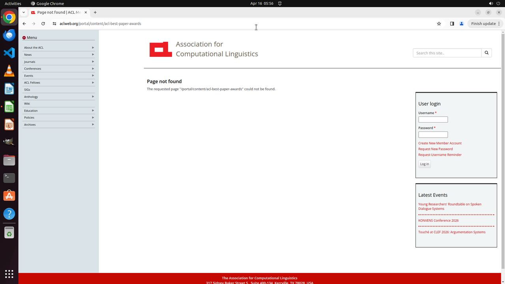

**Response:**
```
The page wasn't found. Let me try searching for ACL best paper awards through Google.
```

**Actions:** `pyautogui.click(960, 88)`

---

## Step 8

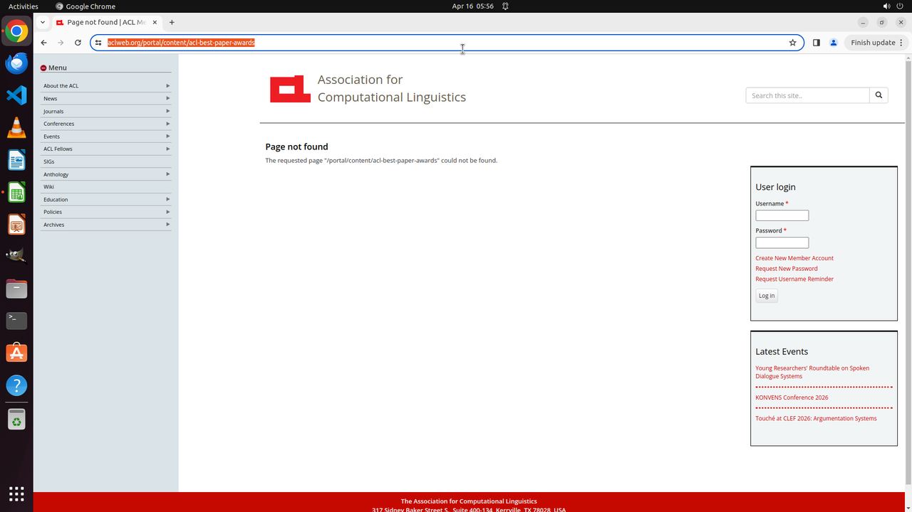

**Response:**
```
Let me search for ACL best paper awards on Google.
```

**Actions:** `import subprocess, shlex; subprocess.run(f'xdotool type --delay 12 -- ' + shlex.quote('https://www.google.com/search?q=ACL+best+long+pape'), shell=True, check=True)
import time; time.sleep(0.05)
impor`

---

## Step 9

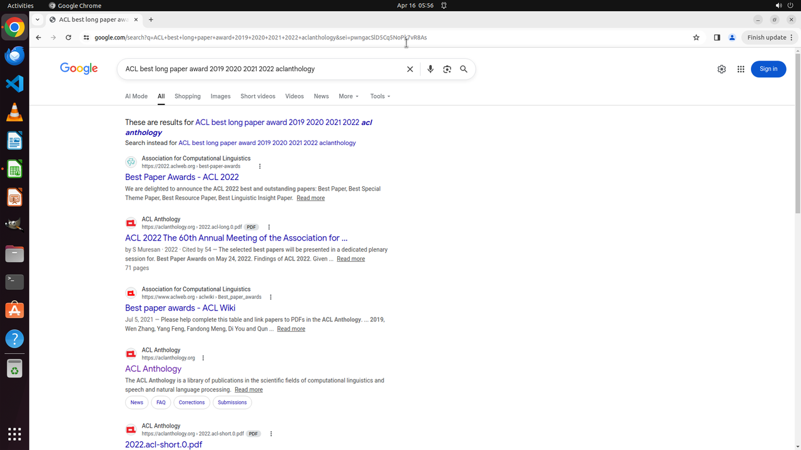

**Response:**
```
I can see some useful results. Let me first check the ACL Wiki page for best paper awards, which should have a comprehensive list.
```

**Actions:** `pyautogui.click(432, 738)`

---

## Step 10

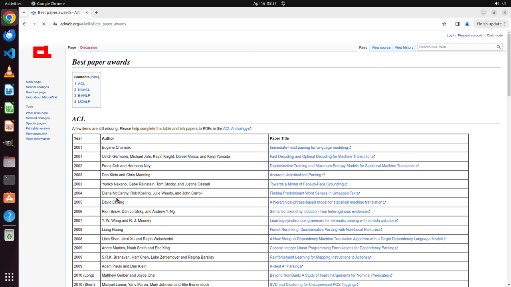

**Response:**
```
I found the ACL Wiki page with best paper awards. Let me scroll down to find the entries for 2019-2022.
```

**Actions:** `pyautogui.scroll(-10, 960, 600)`

---

## Step 11

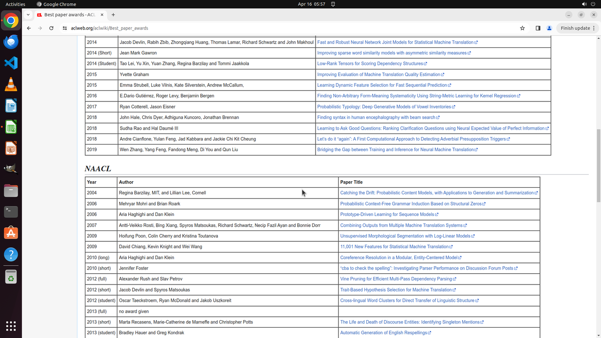

**Response:**
```
I can see the ACL best paper awards list. I can see 2019 has an entry, but the list seems to end at 2019. The wiki might not be complete for 2020-2022. Let me note the 2019 entry and then check the individual conference pages for 2020-2022. 

For 2019, I can see:
- Year: 2019
- Authors: Wen Zhang, Yang Feng, Fandong Meng, Di You and Qun Liu
- Title: Bridging the Gap between Training and Inference for Neural Machine Translation

Now let me check the ACL 2022 best paper awards page that appeared in the Google search results.
```

**Actions:** `pyautogui.click(960, 88)`

---

## Step 12

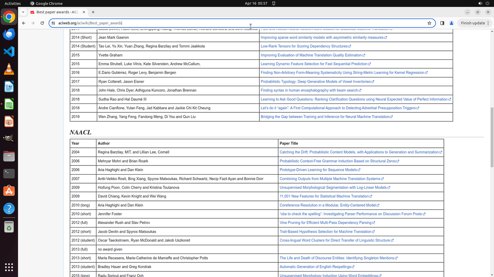

**Response:**
```
I can see the ACL wiki only goes up to 2019. Let me now check the ACL 2022 best paper awards page from the Google search results.
```

**Actions:** `import subprocess, shlex; subprocess.run(f'xdotool type --delay 12 -- ' + shlex.quote('https://2022.aclweb.org/best-paper-awards\n'), shell=True, check=True)
import time; time.sleep(0.05)`

---

## Step 13

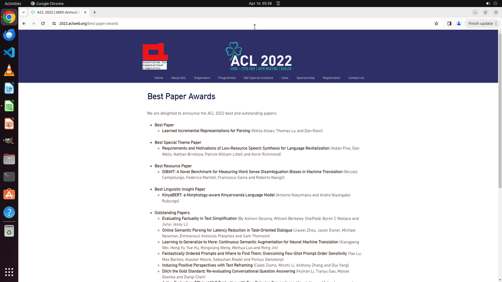

**Response:**
```
I found the ACL 2022 best paper awards page. I can see:

**ACL 2022 - Best Paper:**
- Title: "Learned Incremental Representations for Parsing"
- Authors: Nikita Kitaev, Thomas Lu and Dan Klein

Note: This is listed as "Best Paper" not specifically "Best Long Paper". Let me check if there's a distinction. The page shows "Best Paper" which is typically the best long paper. Let me now check ACL 2021.
```

**Actions:** `pyautogui.click(960, 88)`

---

## Step 14

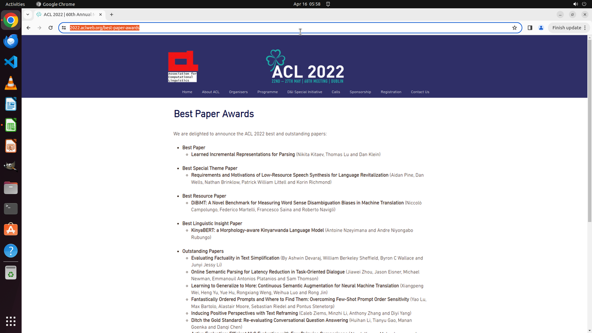

**Response:**
```
Now let me check ACL 2021 best paper awards.
```

**Actions:** `import subprocess, shlex; subprocess.run(f'xdotool type --delay 12 -- ' + shlex.quote('https://2021.aclweb.org/program/best-papers/\n'), shell=True, check=True)
import time; time.sleep(0.05)`

---

## Step 15

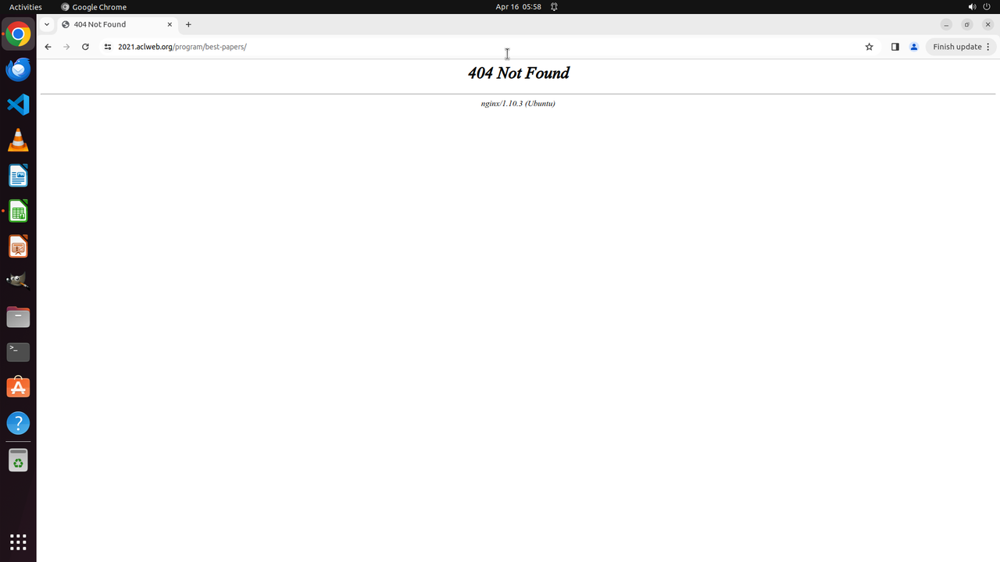

**Response:**
```
The ACL 2021 page wasn't found. Let me search Google for ACL 2021 best paper award.
```

**Actions:** `pyautogui.click(960, 88)`

---

## Step 16

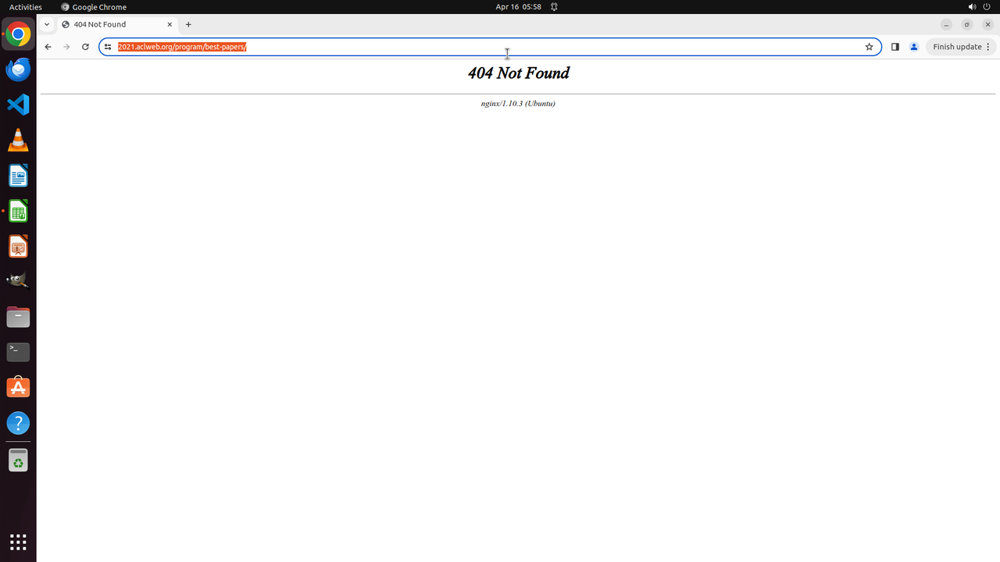

**Actions:** `import subprocess, shlex; subprocess.run(f'xdotool type --delay 12 -- ' + shlex.quote('https://www.google.com/search?q=ACL+2021+best+long'), shell=True, check=True)
import time; time.sleep(0.05)
impor`

---

## Step 17

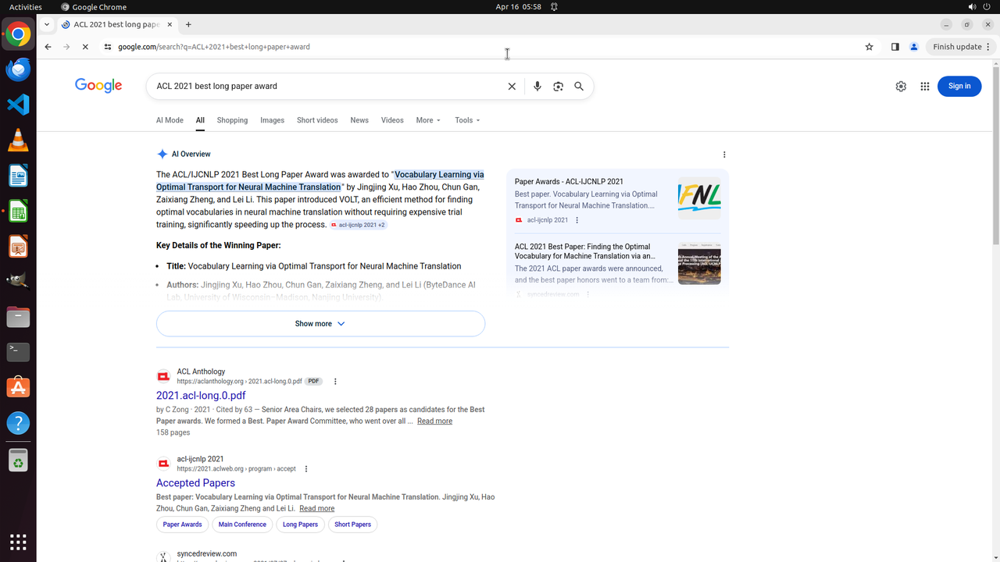

**Response:**
```
I found the ACL 2021 best long paper award information. Let me note:

**ACL 2021 (ACL-IJCNLP 2021) - Best Long Paper:**
- Title: "Vocabulary Learning via Optimal Transport for Neural Machine Translation"
- Authors: Jingjing Xu, Hao Zhou, Chun Gan, Zaixiang Zheng, and Lei Li

Let me click on the accepted papers link to verify this and get more details.
```

**Actions:** `pyautogui.click(375, 927)`

---

## Step 18

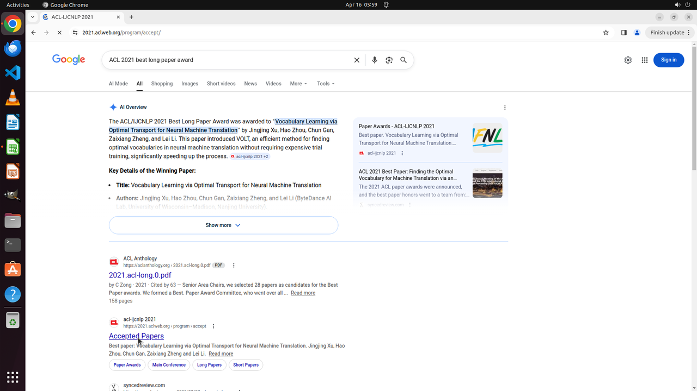

**Response:**
```
Let me wait for the page to load.
```

**Actions:** `time.sleep(0.5)`

---

## Step 19

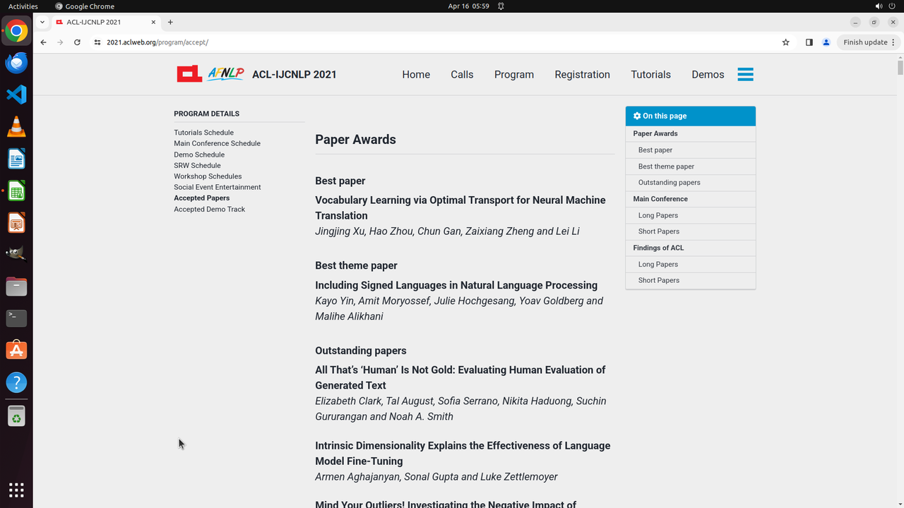

**Response:**
```
I can see the ACL-IJCNLP 2021 best paper award. Let me note:

**ACL 2021 - Best Paper:**
- Title: "Vocabulary Learning via Optimal Transport for Neural Machine Translation"
- Authors: Jingjing Xu, Hao Zhou, Chun Gan, Zaixiang Zheng and Lei Li

Now let me search for the ACL 2020 best paper award. Let me also check ACL 2020 and ACL 2019.
```

**Actions:** `pyautogui.click(960, 88)`

---

## Step 20

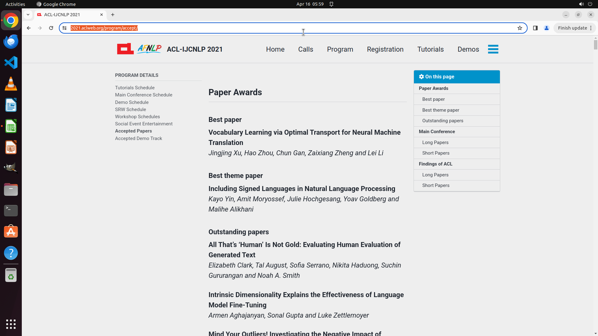

**Response:**
```
Now let me search for ACL 2020 best paper award.
```

**Actions:** `import subprocess, shlex; subprocess.run(f'xdotool type --delay 12 -- ' + shlex.quote('https://www.google.com/search?q=ACL+2020+best+long'), shell=True, check=True)
import time; time.sleep(0.05)
impor`

---

## Step 21

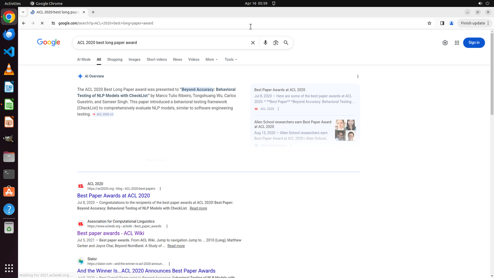

**Response:**
```
I found the ACL 2020 best long paper award:

**ACL 2020 - Best Long Paper:**
- Title: "Beyond Accuracy: Behavioral Testing of NLP Models with CheckList"
- Authors: Marco Tulio Ribeiro, Tongshuang Wu, Carlos Guestrin, and Sameer Singh

Let me click on the ACL 2020 best paper awards page to confirm the details.
```

**Actions:** `pyautogui.click(441, 759)`

---

## Step 22

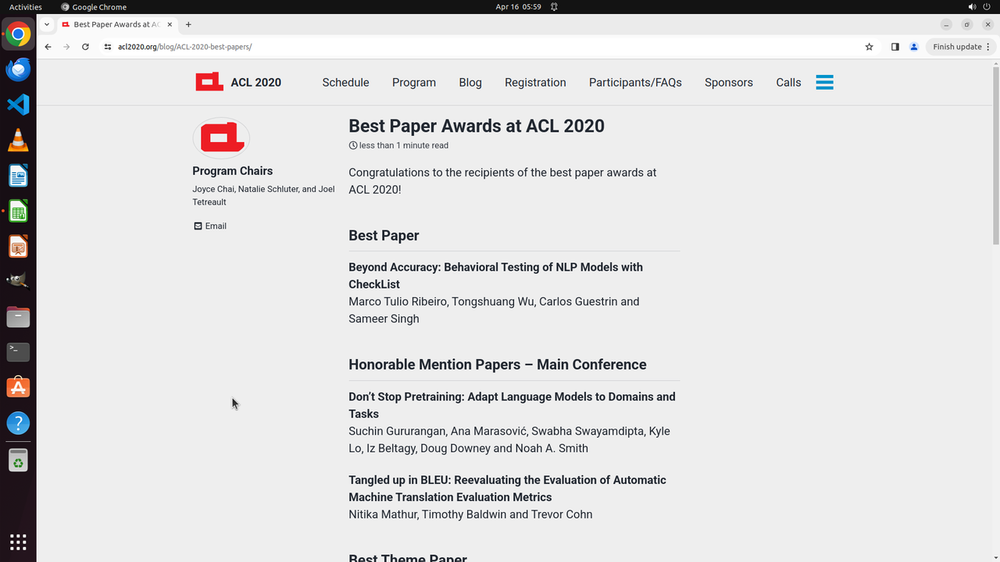

**Response:**
```
I confirmed the ACL 2020 best paper:

**ACL 2020 - Best Paper:**
- Title: "Beyond Accuracy: Behavioral Testing of NLP Models with CheckList"
- Authors: Marco Tulio Ribeiro, Tongshuang Wu, Carlos Guestrin and Sameer Singh

Now let me search for the ACL 2019 best paper award to confirm the information from the wiki.
```

**Actions:** `pyautogui.click(960, 88)`

---

## Step 23

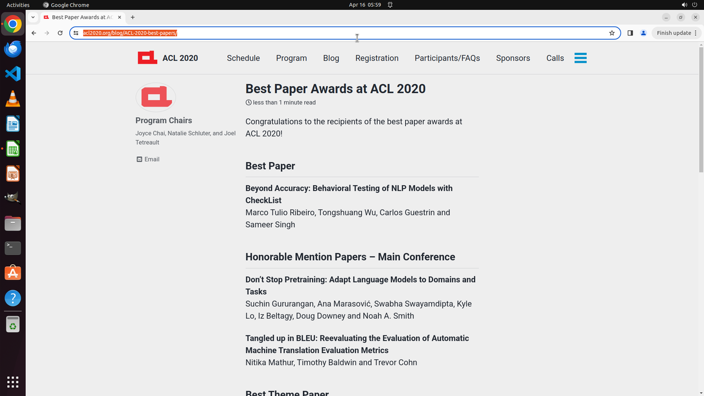

**Response:**
```
Let me search for the ACL 2019 best paper award.
```

**Actions:** `import subprocess, shlex; subprocess.run(f'xdotool type --delay 12 -- ' + shlex.quote('https://www.google.com/search?q=ACL+2019+best+long'), shell=True, check=True)
import time; time.sleep(0.05)
impor`

---

## Step 24

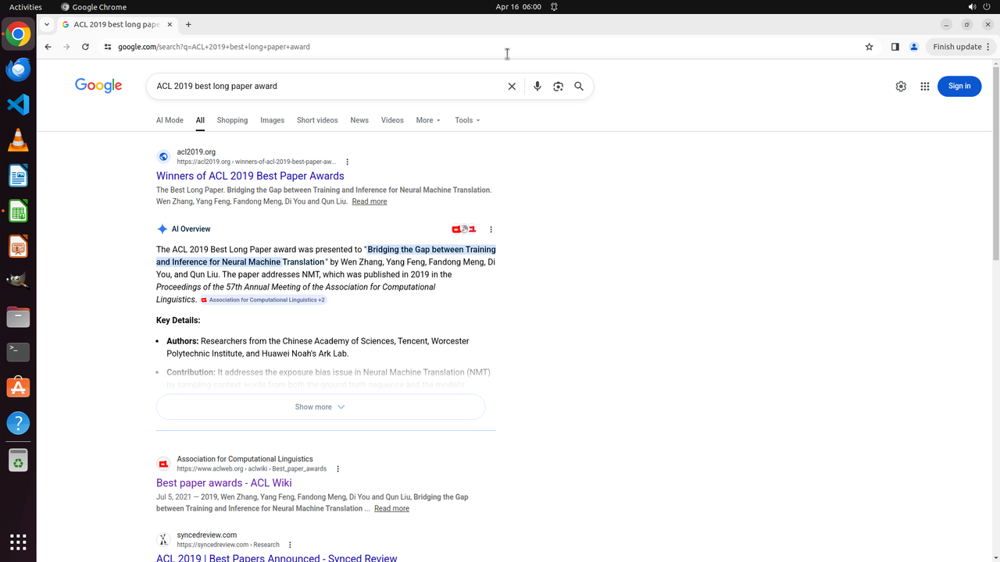

**Response:**
```
I confirmed the ACL 2019 best long paper:

**ACL 2019 - Best Long Paper:**
- Title: "Bridging the Gap between Training and Inference for Neural Machine Translation"
- Authors: Wen Zhang, Yang Feng, Fandong Meng, Di You and Qun Liu

Now I have all the information for 2019, 2020, and 2021. I need to verify the 2022 info as well. Now I need to find the ACL Anthology PDF links for each paper. Let me search for each paper on ACL Anthology. Let me start with the 2022 paper.
```

**Actions:** `pyautogui.click(960, 88)`

---

## Step 25

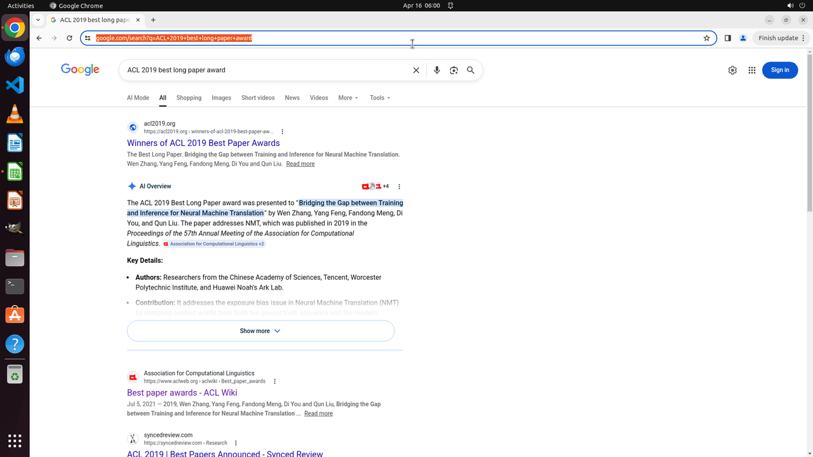

**Response:**
```
Now let me search for each paper on ACL Anthology to get the official PDF links. Let me start with the 2022 paper.
```

**Actions:** `import subprocess, shlex; subprocess.run(f'xdotool type --delay 12 -- ' + shlex.quote('https://aclanthology.org/search/?q=Learned+Increme'), shell=True, check=True)
import time; time.sleep(0.05)
impor`

---

## Step 26

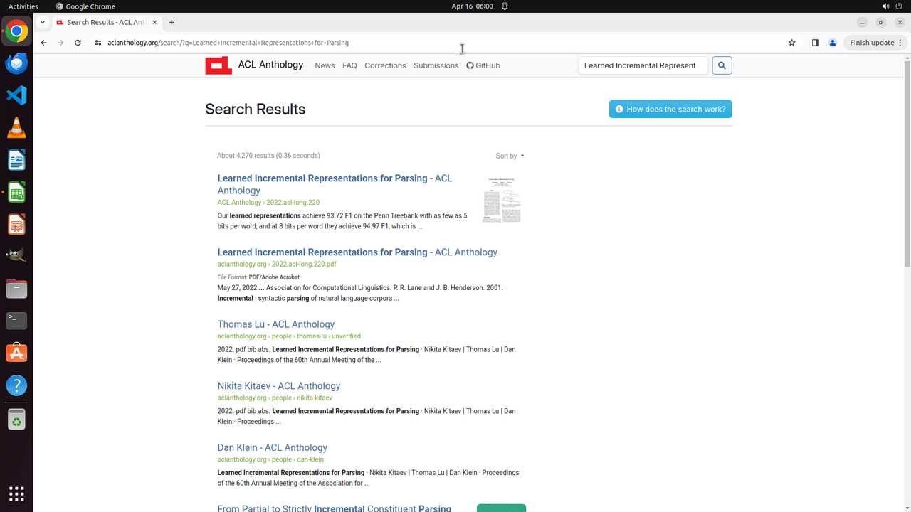

**Response:**
```
I found the paper on ACL Anthology. Let me click on the first result to get the PDF link.
```

**Actions:** `pyautogui.click(703, 387)`

---

## Step 27

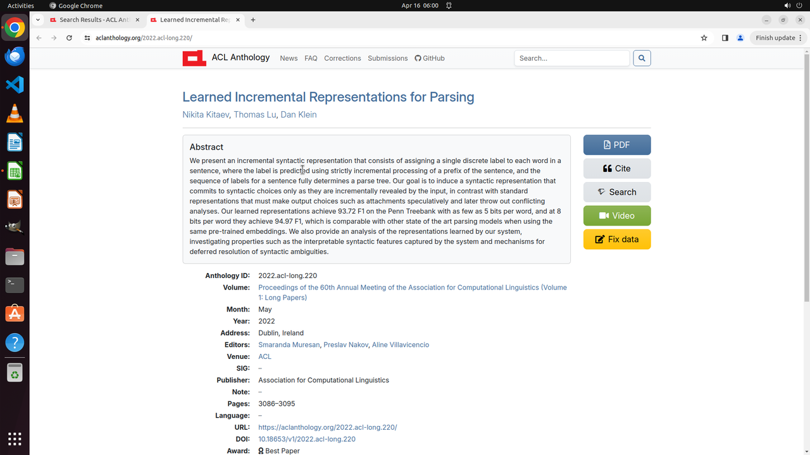

**Response:**
```
I found the ACL 2022 paper details on ACL Anthology:

**ACL 2022:**
- Title: "Learned Incremental Representations for Parsing"
- Authors: Nikita Kitaev, Thomas Lu, Dan Klein
- PDF link: https://aclanthology.org/2022.acl-long.220.pdf
- Award: Best Paper (confirmed)

Now let me find the ACL 2021 paper on ACL Anthology.
```

**Actions:** `pyautogui.click(960, 88)`

---

## Step 28

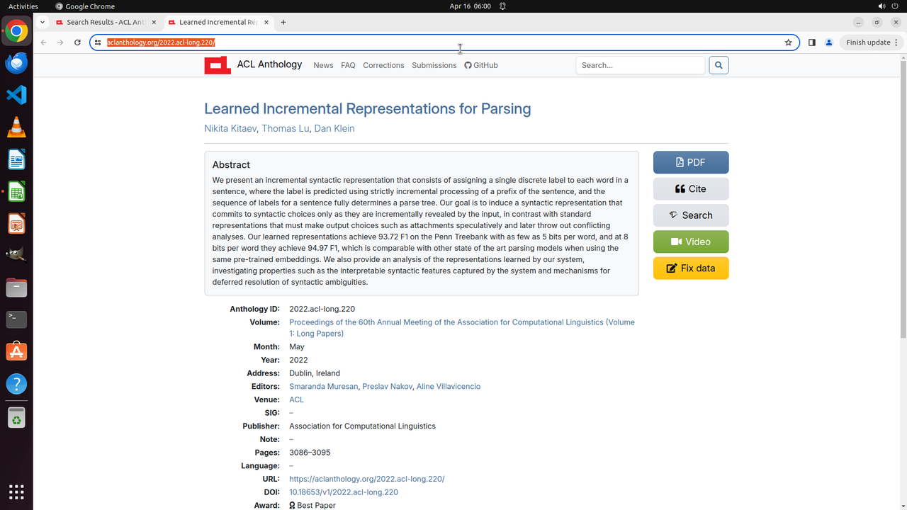

**Response:**
```
Now let me search for the ACL 2021 paper on ACL Anthology.
```

**Actions:** `import subprocess, shlex; subprocess.run(f'xdotool type --delay 12 -- ' + shlex.quote('https://aclanthology.org/search/?q=Vocabulary+Lear'), shell=True, check=True)
import time; time.sleep(0.05)
impor`

---

## Step 29

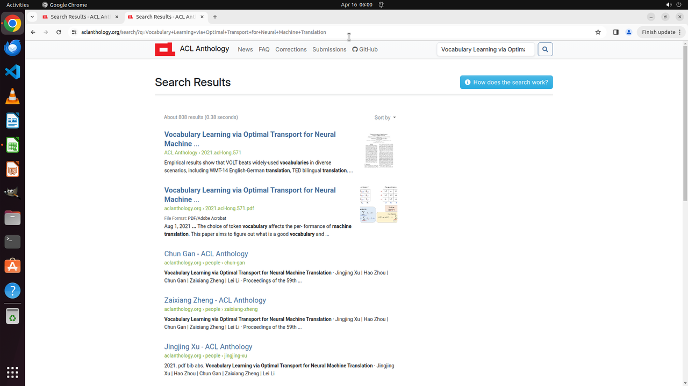

**Response:**
```
I found the ACL 2021 paper. Let me click on it to get the details.
```

**Actions:** `pyautogui.click(697, 387)`

---

## Step 30

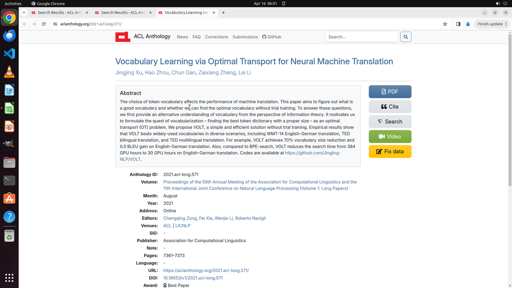

**Response:**
```
Excellent! I found the ACL 2021 paper details:

**ACL 2021:**
- Title: "Vocabulary Learning via Optimal Transport for Neural Machine Translation"
- Authors: Jingjing Xu, Hao Zhou, Chun Gan, Zaixiang Zheng, Lei Li
- PDF link: https://aclanthology.org/2021.acl-long.571.pdf
- Award: Best Paper (confirmed)

Now let me search for the ACL 2020 paper on ACL Anthology.
```

**Actions:** `pyautogui.click(960, 88)`

---

## Step 31

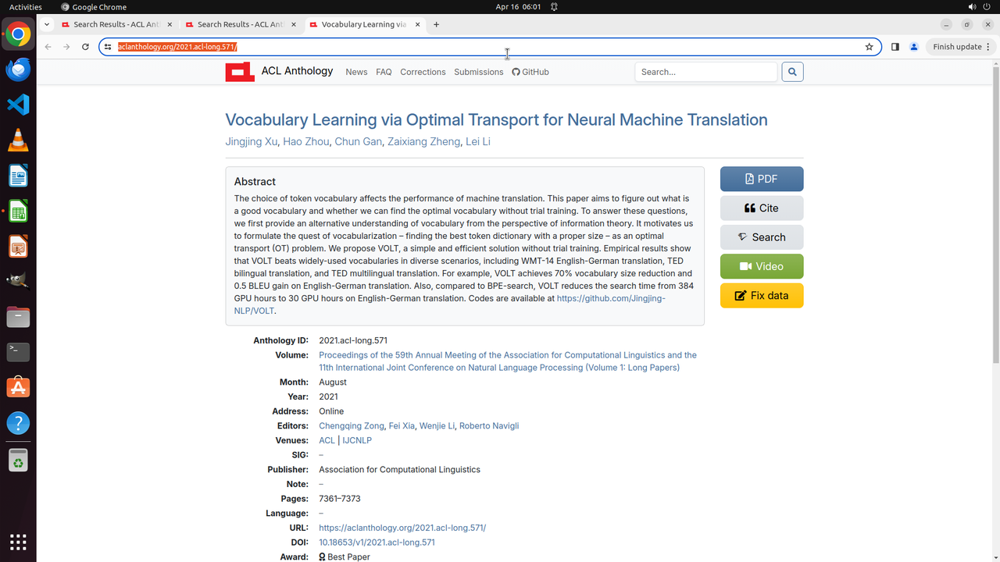

**Response:**
```
Let me search for the ACL 2020 paper on ACL Anthology.
```

**Actions:** `import subprocess, shlex; subprocess.run(f'xdotool type --delay 12 -- ' + shlex.quote('https://aclanthology.org/search/?q=Beyond+Accuracy'), shell=True, check=True)
import time; time.sleep(0.05)
impor`

---

## Step 32

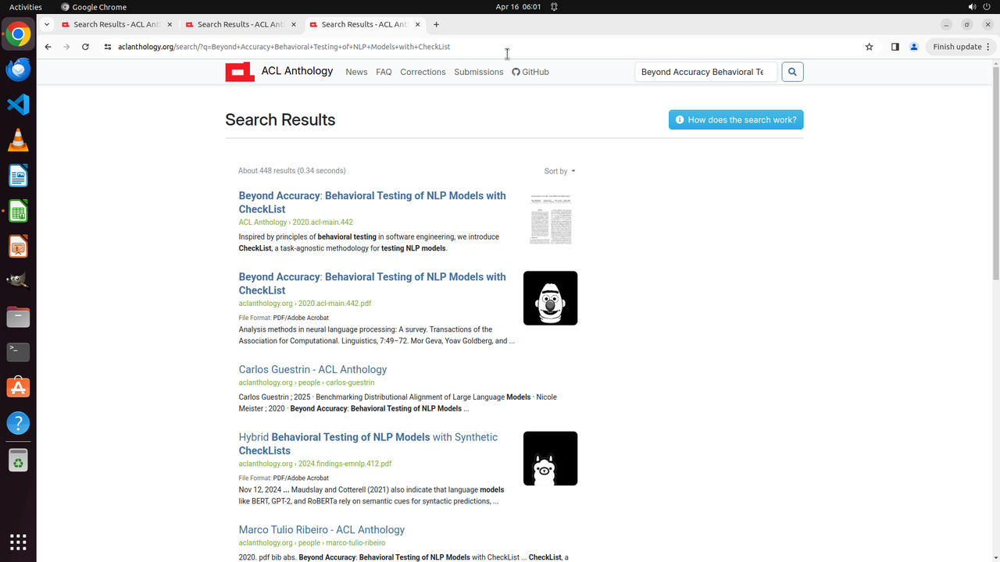

**Response:**
```
I found the ACL 2020 paper. Let me click on it to get the details.
```

**Actions:** `pyautogui.click(712, 387)`

---

## Step 33

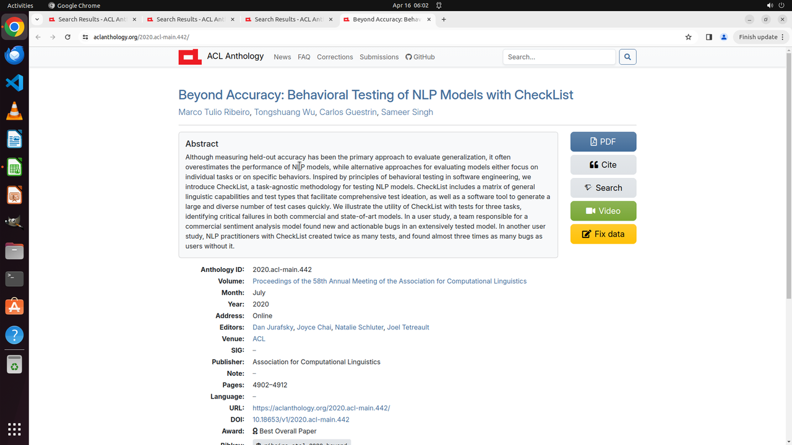

**Response:**
```
I found the ACL 2020 paper details:

**ACL 2020:**
- Title: "Beyond Accuracy: Behavioral Testing of NLP Models with CheckList"
- Authors: Marco Tulio Ribeiro, Tongshuang Wu, Carlos Guestrin, Sameer Singh
- PDF link: https://aclanthology.org/2020.acl-main.442.pdf
- Award: Best Overall Paper (confirmed)

Now let me search for the ACL 2019 paper on ACL Anthology.
```

**Actions:** `pyautogui.click(960, 88)`

---

## Step 34

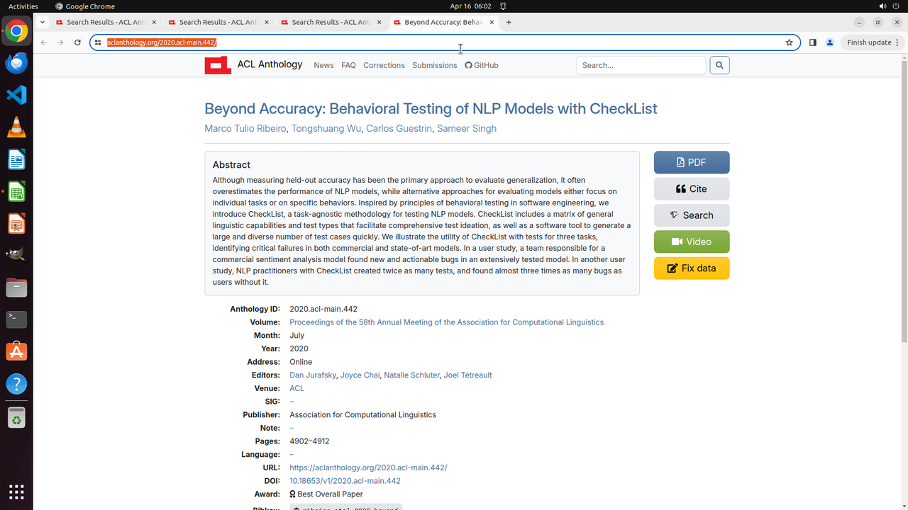

**Response:**
```
Now let me search for the ACL 2019 paper on ACL Anthology.
```

**Actions:** `import subprocess, shlex; subprocess.run(f'xdotool type --delay 12 -- ' + shlex.quote('https://aclanthology.org/search/?q=Bridging+the+Ga'), shell=True, check=True)
import time; time.sleep(0.05)
impor`

---

## Step 35

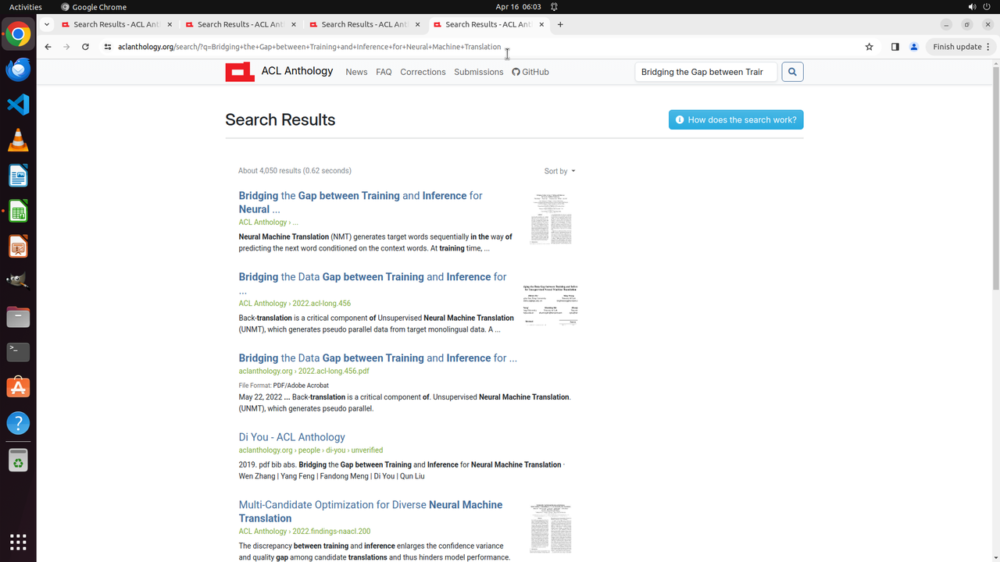

**Response:**
```
I can see the first result is the ACL 2019 paper. Let me click on it.
```

**Actions:** `pyautogui.click(691, 387)`

---

## Step 36

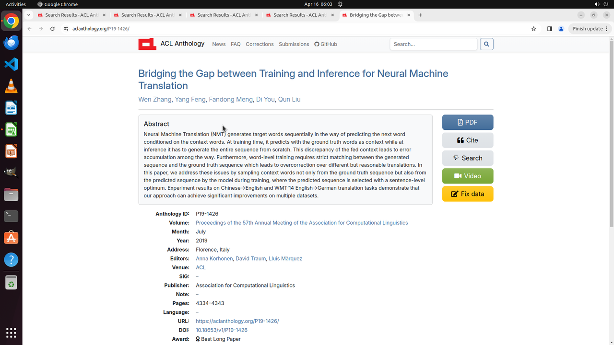

**Response:**
```
I now have all the information I need for all four years. Let me compile the data:

**ACL 2022:**
- Title: "Learned Incremental Representations for Parsing"
- Authors: Nikita Kitaev, Thomas Lu, Dan Klein
- PDF link: https://aclanthology.org/2022.acl-long.220.pdf

**ACL 2021:**
- Title: "Vocabulary Learning via Optimal Transport for Neural Machine Translation"
- Authors: Jingjing Xu, Hao Zhou, Chun Gan, Zaixiang Zheng, Lei Li
- PDF link: https://aclanthology.org/2021.acl-long.571.pdf

**ACL 2020:**
- Title: "Beyond Accuracy: Behavioral Testing of NLP Models with CheckList"
- Authors: Marco Tulio Ribeiro, Tongshuang Wu, Carlos Guestrin, Sameer Singh
- PDF link: https://aclanthology.org/2020.acl-main.442.pdf

**ACL 2019:**
- Title: "Bridging the Gap between Training and Inference for Neural Machine Translation"
- Authors: Wen Zhang, Yang Feng, Fandong Meng, Di You, Qun Liu
- PDF link: https://aclanthology.org/P19-1426.pdf
- Award: Best Long Paper (confirmed)

Now let me create the Excel file. Let me open a terminal to create the file using Python.
```

**Actions:** `pyautogui.keyDown('ctrl')
pyautogui.keyDown('alt')
pyautogui.keyDown('t')
pyautogui.keyUp('t')
pyautogui.keyUp('alt')
pyautogui.keyUp('ctrl')`

---

## Step 37

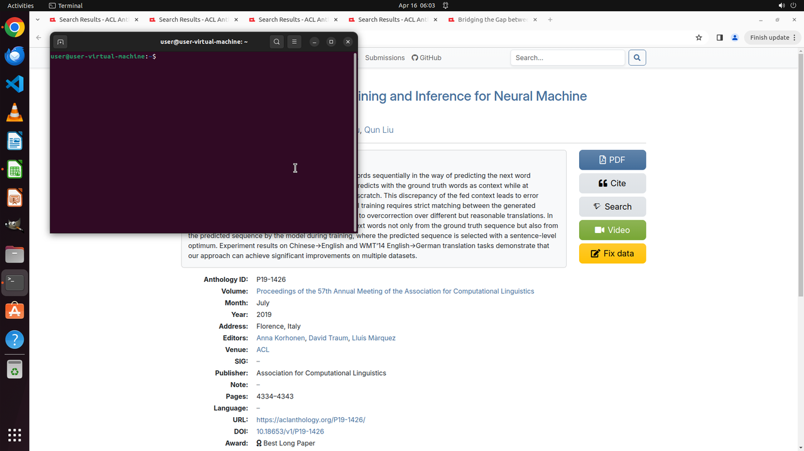

**Response:**
```
A terminal is open. Now let me create the Excel file using Python with openpyxl.
```

**Actions:** `import subprocess, shlex; subprocess.run(f'xdotool type --delay 12 -- ' + shlex.quote("python3 << 'EOF'\nimport openpyxl\n\nwb = openpyxl.Wo"), shell=True, check=True)
import time; time.sleep(0.05)
im`

---

## Step 38


**Response:**
```
I see that openpyxl is not installed. Let me install it first.
```

**Actions:** `import subprocess, shlex; subprocess.run(f'xdotool type --delay 12 -- ' + shlex.quote('pip3 install openpyxl\n'), shell=True, check=True)
import time; time.sleep(0.05)`

---

## Step 39

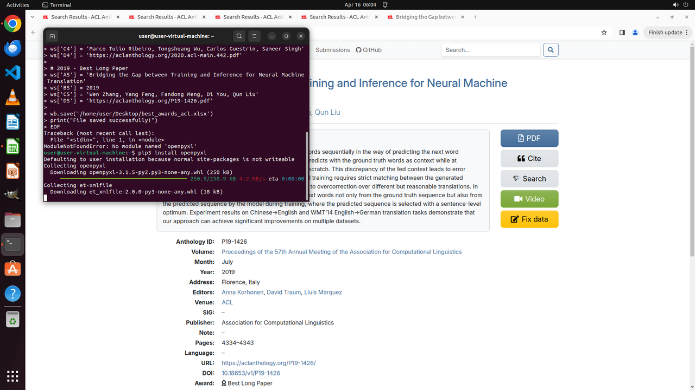

**Response:**
```
Good, openpyxl is being installed. Let me wait for it to finish.
```

**Actions:** `time.sleep(0.5)`

---

## Step 40

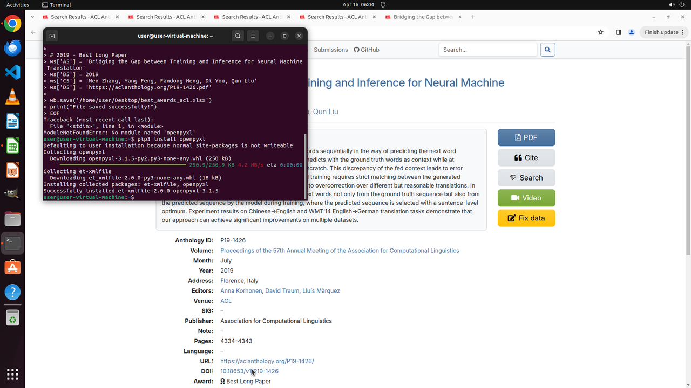

**Response:**
```
openpyxl is now installed. Let me run the Python script again to create the Excel file.
```

**Actions:** `import subprocess, shlex; subprocess.run(f'xdotool type --delay 12 -- ' + shlex.quote("python3 << 'EOF'\nimport openpyxl\n\nwb = openpyxl.Wo"), shell=True, check=True)
import time; time.sleep(0.05)
im`

---

## Step 41


**Response:**
```
The file has been saved successfully. The Excel file `best_awards_acl.xlsx` has been created on the desktop with all the required information. Let me verify the file was created correctly by checking its contents.
```

**Actions:** `import subprocess, shlex; subprocess.run(f'xdotool type --delay 12 -- ' + shlex.quote("python3 << 'EOF'\nimport openpyxl\nwb = openpyxl.loa"), shell=True, check=True)
import time; time.sleep(0.05)
imp`

---

## Step 42

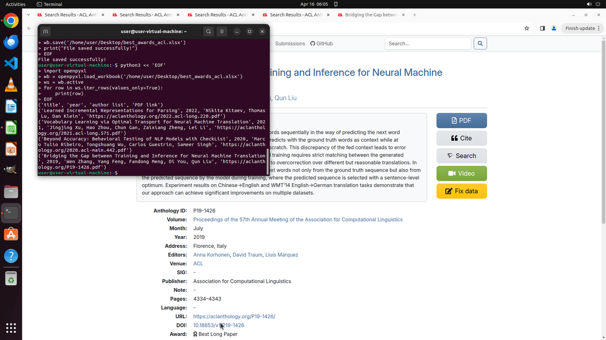

**Response:**
```
The file has been created and verified successfully. The Excel file `best_awards_acl.xlsx` is on the desktop with the following data, sorted by year in descending order:

1. **2022**: "Learned Incremental Representations for Parsing" - Nikita Kitaev, Thomas Lu, Dan Klein
2. **2021**: "Vocabulary Learning via Optimal Transport for Neural Machine Translation" - Jingjing Xu, Hao Zhou, Chun Gan, Zaixiang Zheng, Lei Li
3. **2020**: "Beyond Accuracy: Behavioral Testing of NLP Models with CheckList" - Marco Tulio Ribeiro, Tongshuang Wu, Carlos Guestrin, Sameer Singh
4. **2019**: "Bridging the Gap between Training and Inference for Neural Machine Translation" - Wen Zhang, Yang Feng, Fandong Meng, Di You, Qun Liu

All entries include titles, years, author lists (separated by commas), and official ACL Anthology PDF links. The rows are sorted by year in descending order (2022 → 2019).

DONE
```

**Actions:** `DONE`

---
