# Task 67890eb6-6ce5-4c00-9e3d-fb4972699b06

**Instruction:** I am an NLP researcher. Check out the best long paper awards of ACL from 2019 to 2022 and record the 'title', 'year', 'author list' and 'PDF link' into table best_awards_acl.xlsx on the desktop. Separate authors only by commas, use offical aclanthology urls not arxiv, and sort rows by years in descending orders.

**Score:** 0.0

**Wall clock:** 7m 45s

**Steps:** 43

**Cost:** $1.52

---

## Step 1

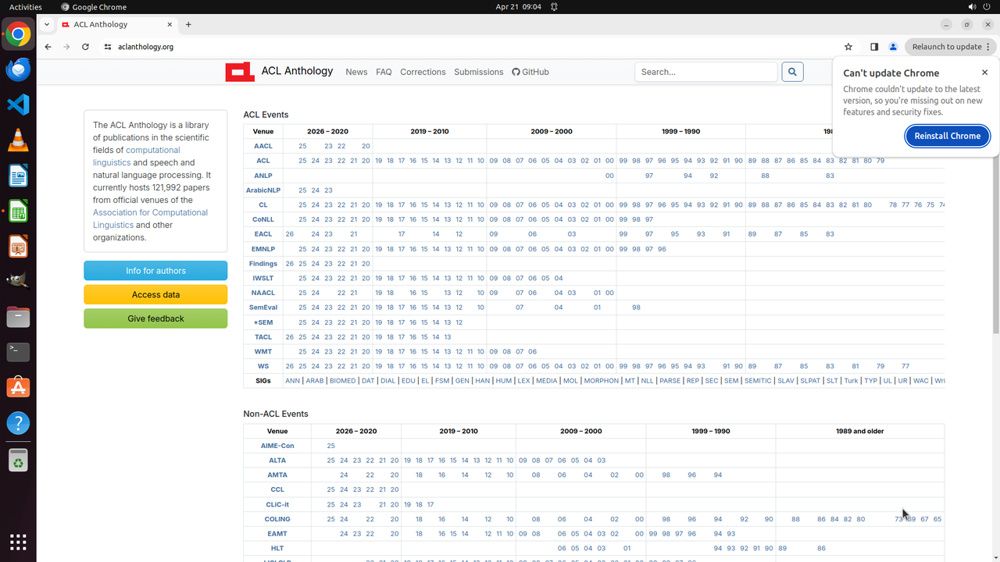

**Response:**
```
I'll research the best long paper awards from ACL conferences from 2019 to 2022. Let me start by searching for this information.
```

**Actions:** `pyautogui.click(1350, 136)`

---

## Step 2

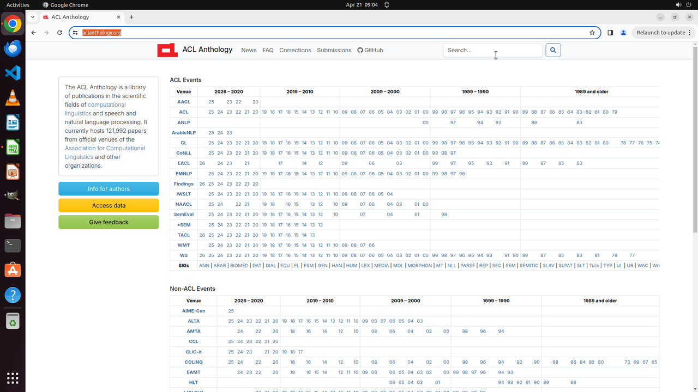

**Response:**
```
Let me search for ACL 2022 best paper awards first. I'll navigate to the ACL 2022 conference page.
```

**Actions:** `import subprocess, shlex; subprocess.run(f'xdotool type --delay 12 -- ' + shlex.quote('https://aclanthology.org/volumes/2022.acl-long/\n'), shell=True, check=True)
import time; time.sleep(0.05)`

---

## Step 3

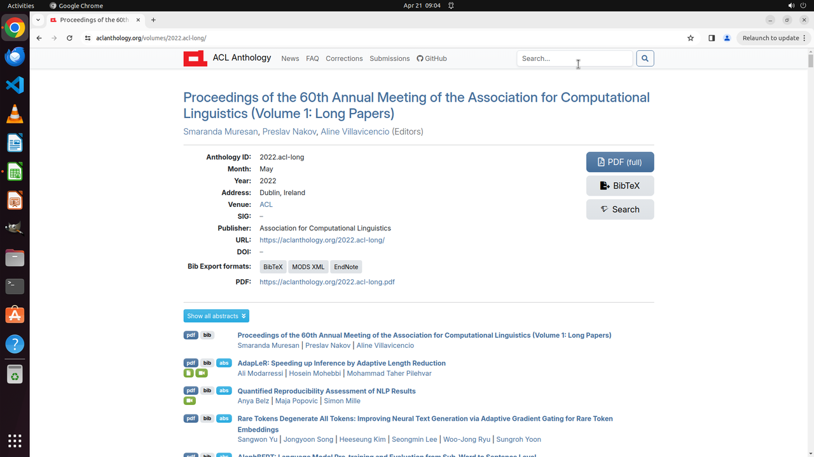

**Response:**
```
This shows the ACL 2022 long papers proceedings, but I need to find the best paper awards specifically. Let me search for ACL best paper awards instead.
```

**Actions:** `pyautogui.click(355, 88)`

---

## Step 4

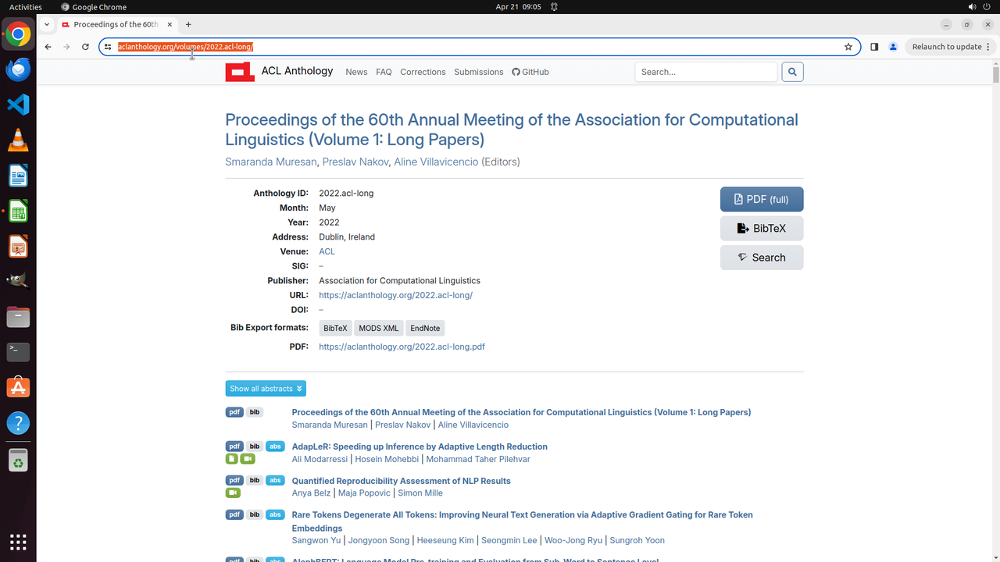

**Response:**
```
Let me search for ACL best paper awards. I'll look for the official ACL best paper awards page.
```

**Actions:** `import subprocess, shlex; subprocess.run(f'xdotool type --delay 12 -- ' + shlex.quote('https://www.aclweb.org/portal/acl-best-paper-award'), shell=True, check=True)
import time; time.sleep(0.05)
impor`

---

## Step 5

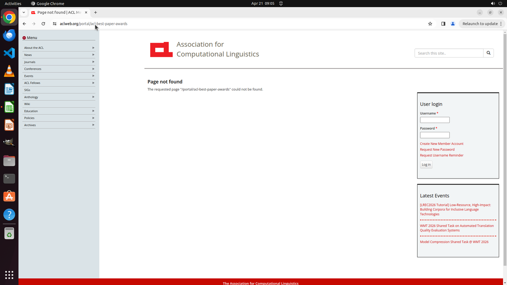

**Response:**
```
The page wasn't found. Let me try searching for ACL best paper awards through Google.
```

**Actions:** `pyautogui.click(355, 88)`

---

## Step 6

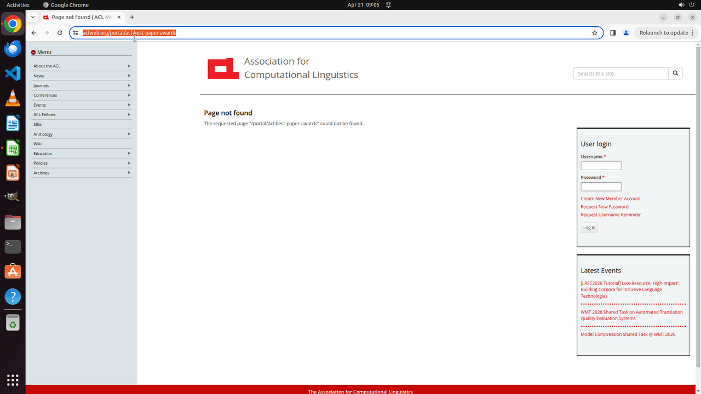

**Response:**
```
Let me search Google for ACL best long paper awards.
```

**Actions:** `import subprocess, shlex; subprocess.run(f'xdotool type --delay 12 -- ' + shlex.quote('https://www.google.com/search?q=ACL+best+long+pape'), shell=True, check=True)
import time; time.sleep(0.05)
impor`

---

## Step 7

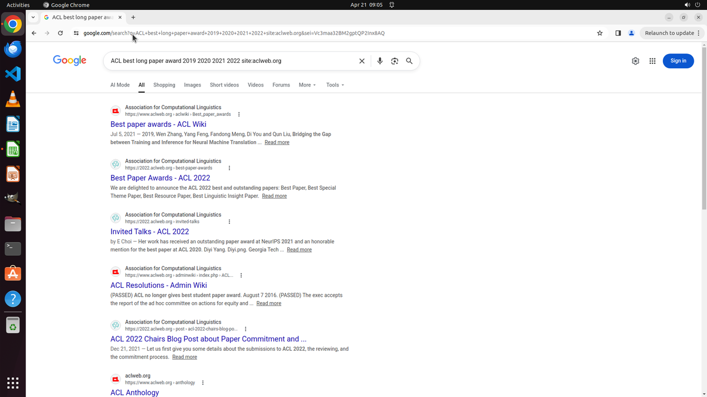

**Response:**
```
I can see some relevant results. Let me first check the "Best paper awards - ACL Wiki" page which likely has a comprehensive list.
```

**Actions:** `pyautogui.click(430, 337)`

---

## Step 8

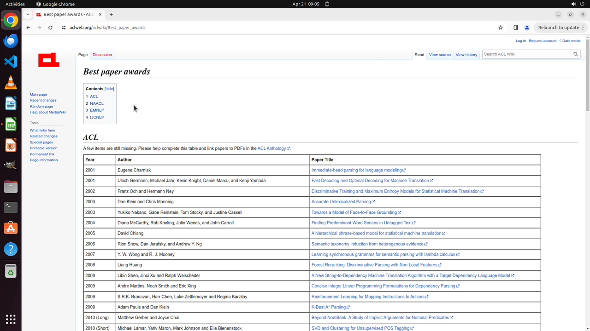

**Response:**
```
This is the ACL Wiki page with best paper awards. I need to scroll down to find the 2019-2022 entries. Let me scroll down to find those years.
```

**Actions:** `pyautogui.scroll(-10, 960, 600)`

---

## Step 9

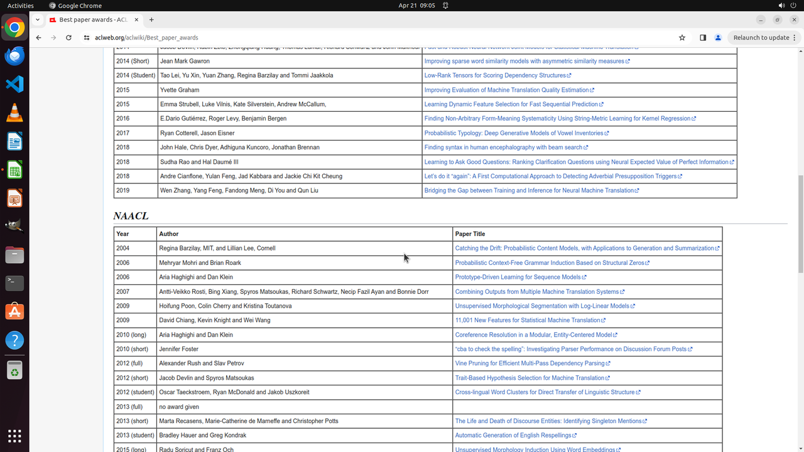

**Response:**
```
I can see the ACL best paper awards list. I can see 2019 at the bottom of the ACL section. The last entry shows:
- 2019: Wen Zhang, Yang Feng, Fandong Meng, Di You and Qun Liu - "Bridging the Gap between Training and Inference for Neural Machine Translation"

But I notice the list seems to end at 2019 for ACL. The wiki might not have 2020-2022 entries. Let me scroll up to check if there are any entries I missed, and also note that some years have multiple entries (long, short, student). Let me look more carefully at what's listed for 2019.
```

**Actions:** `pyautogui.scroll(3, 960, 600)`

---

## Step 10

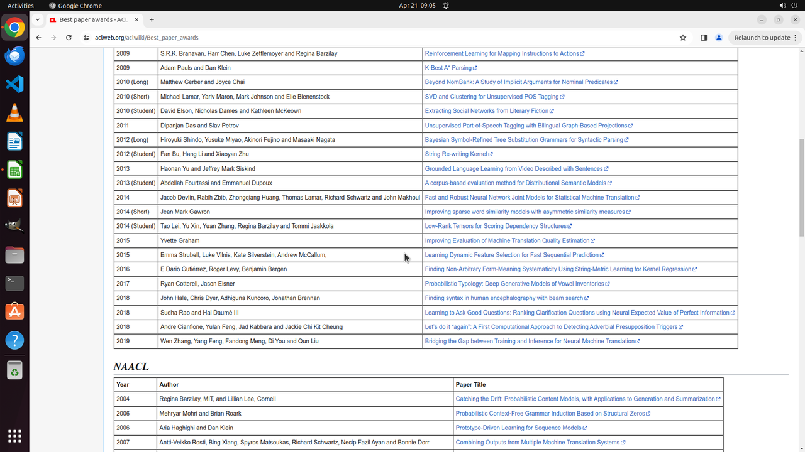

**Response:**
```
I can see the ACL section ends at 2019. The wiki doesn't have entries for 2020-2022. I notice that some years don't have "Long" or "Short" labels, while others do. For 2019, there's just one entry without a label. Let me check the individual ACL conference pages for 2019-2022 best paper awards. Let me first check the ACL 2022 best paper awards page that appeared in the Google search results.
```

**Actions:** `pyautogui.click(355, 88)`

---

## Step 11

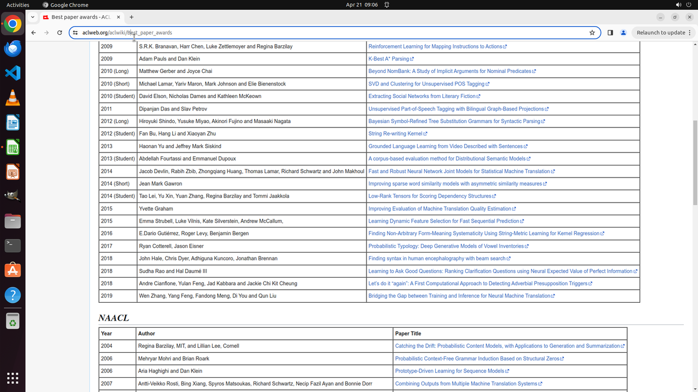

**Response:**
```
I see the ACL wiki only goes up to 2019. I need to find the best long paper awards for 2019-2022 from the individual conference pages. Let me search for each year's best paper awards. Let me start with ACL 2022.
```

**Actions:** `import subprocess, shlex; subprocess.run(f'xdotool type --delay 12 -- ' + shlex.quote('https://2022.aclweb.org/best-paper-awards\n'), shell=True, check=True)
import time; time.sleep(0.05)`

---

## Step 12

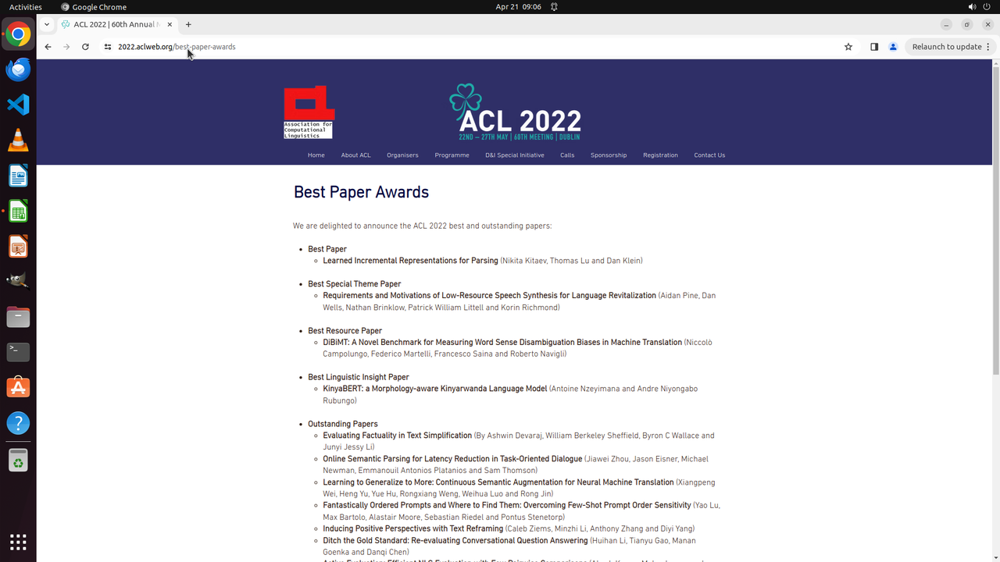

**Response:**
```
I found the ACL 2022 best paper awards page. I can see:

**ACL 2022 Best Paper:**
- "Learned Incremental Representations for Parsing" by Nikita Kitaev, Thomas Lu and Dan Klein

Note that ACL 2022 doesn't specifically label it as "Best Long Paper" - it's just "Best Paper". Let me now check ACL 2021. But first, let me note that in 2022, the categories are: Best Paper, Best Special Theme Paper, Best Resource Paper, Best Linguistic Insight Paper. The "Best Paper" is likely the best long paper equivalent.

Now let me check ACL 2021:
```

**Actions:** `pyautogui.click(355, 88)`

---

## Step 13

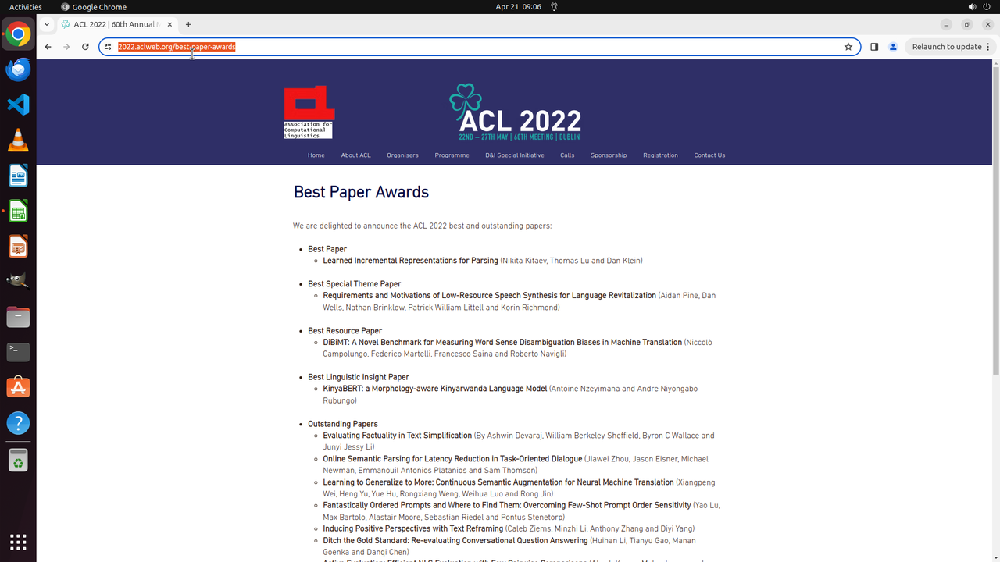

**Actions:** `import subprocess, shlex; subprocess.run(f'xdotool type --delay 12 -- ' + shlex.quote('https://2021.aclweb.org/program/best-papers/\n'), shell=True, check=True)
import time; time.sleep(0.05)`

---

## Step 14

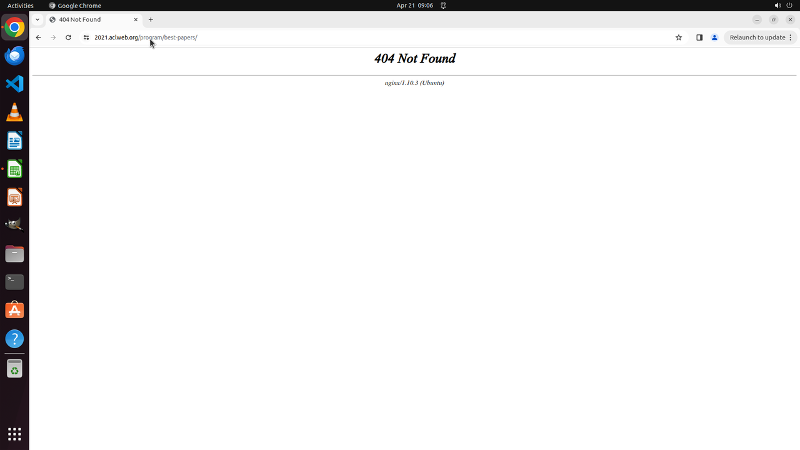

**Response:**
```
That URL didn't work. Let me search Google for ACL 2021 best paper awards.
```

**Actions:** `pyautogui.click(355, 88)`

---

## Step 15

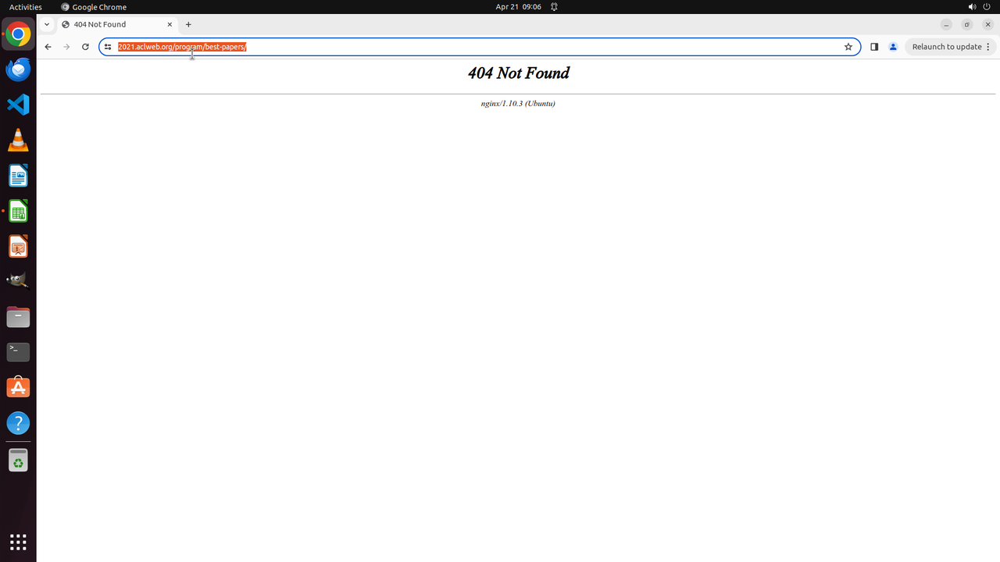

**Response:**
```
Let me search Google for ACL 2021 best paper awards.
```

**Actions:** `import subprocess, shlex; subprocess.run(f'xdotool type --delay 12 -- ' + shlex.quote('https://www.google.com/search?q=ACL+2021+best+long'), shell=True, check=True)
import time; time.sleep(0.05)
impor`

---

## Step 16

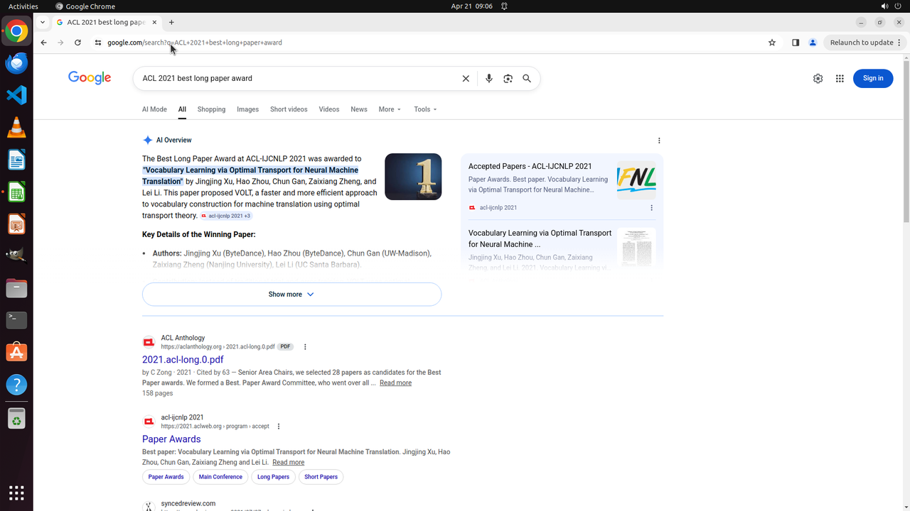

**Response:**
```
I can see that for ACL-IJCNLP 2021, the Best Long Paper Award went to "Vocabulary Learning via Optimal Transport for Neural Machine Translation" by Jingjing Xu, Hao Zhou, Chun Gan, Zaixiang Zheng, and Lei Li. Let me click on the "Paper Awards" link to get the official details.
```

**Actions:** `pyautogui.click(361, 927)`

---

## Step 17

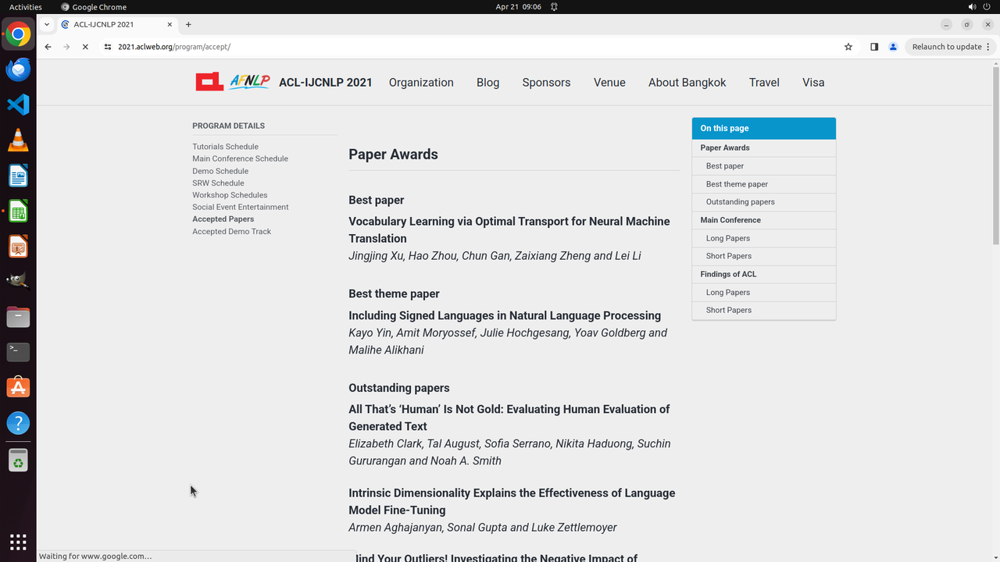

**Response:**
```
I found the ACL-IJCNLP 2021 best paper. The "Best paper" (which is the best long paper) is:
- **Title:** "Vocabulary Learning via Optimal Transport for Neural Machine Translation"
- **Authors:** Jingjing Xu, Hao Zhou, Chun Gan, Zaixiang Zheng and Lei Li
- **Year:** 2021

Now let me search for ACL 2020 best paper awards.
```

**Actions:** `pyautogui.click(355, 88)`

---

## Step 18

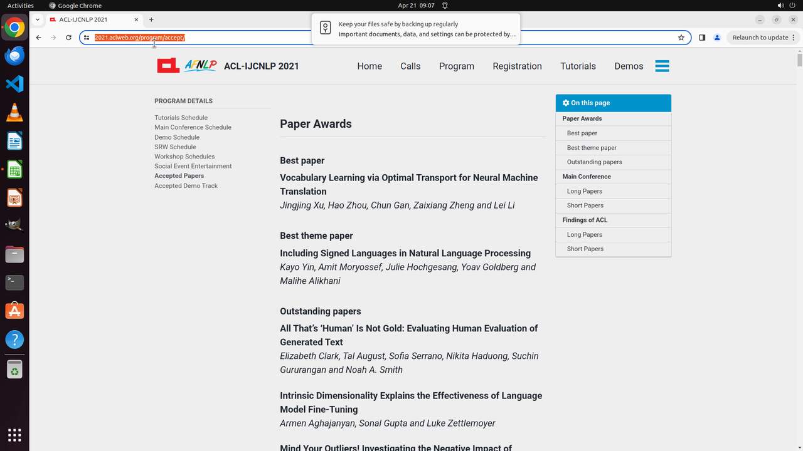

**Response:**
```
Good, I can see the ACL 2021 page. Now let me search for ACL 2020 best paper awards.
```

**Actions:** `import subprocess, shlex; subprocess.run(f'xdotool type --delay 12 -- ' + shlex.quote('https://www.google.com/search?q=ACL+2020+best+long'), shell=True, check=True)
import time; time.sleep(0.05)
impor`

---

## Step 19

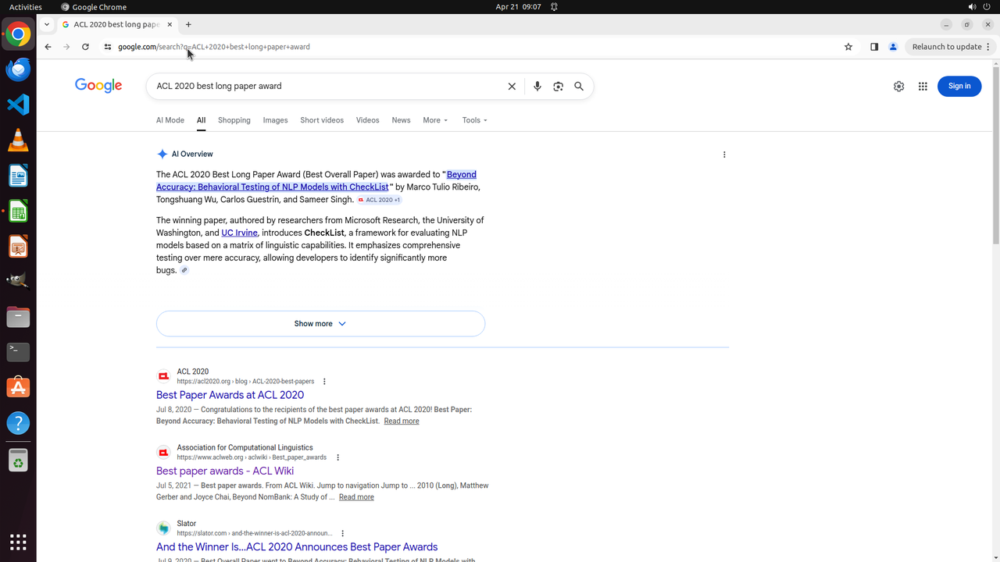

**Response:**
```
I can see that for ACL 2020, the Best Long Paper Award went to "Beyond Accuracy: Behavioral Testing of NLP Models with CheckList" by Marco Tulio Ribeiro, Tongshuang Wu, Carlos Guestrin, and Sameer Singh. Let me click on the official ACL 2020 best paper awards page to confirm.
```

**Actions:** `pyautogui.click(444, 757)`

---

## Step 20

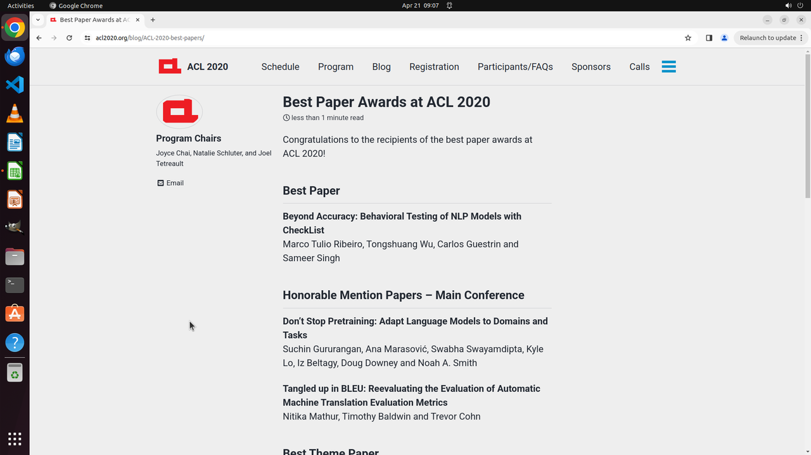

**Response:**
```
I found the ACL 2020 best paper. The "Best Paper" is:
- **Title:** "Beyond Accuracy: Behavioral Testing of NLP Models with CheckList"
- **Authors:** Marco Tulio Ribeiro, Tongshuang Wu, Carlos Guestrin and Sameer Singh
- **Year:** 2020

Now let me search for ACL 2019 best paper award.
```

**Actions:** `pyautogui.click(355, 88)`

---

## Step 21

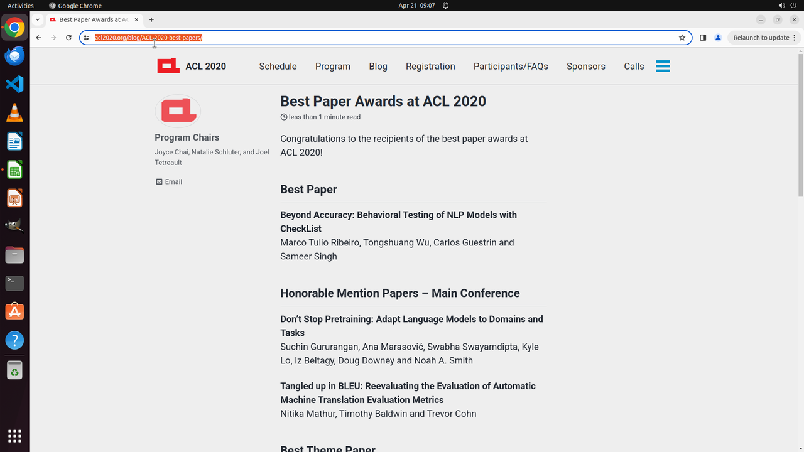

**Actions:** `import subprocess, shlex; subprocess.run(f'xdotool type --delay 12 -- ' + shlex.quote('https://www.google.com/search?q=ACL+2019+best+long'), shell=True, check=True)
import time; time.sleep(0.05)
impor`

---

## Step 22

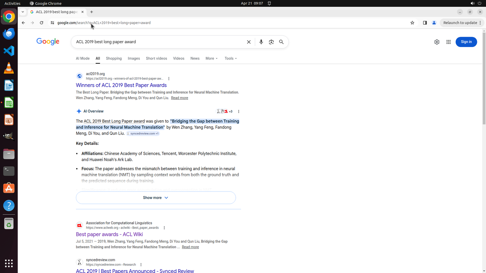

**Response:**
```
I can see the ACL 2019 best long paper award information. Let me click on the official ACL 2019 page to confirm the details.
```

**Actions:** `pyautogui.click(478, 336)`

---

## Step 23

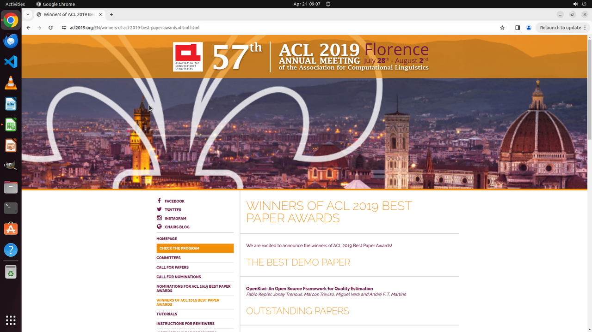

**Response:**
```
I can see the ACL 2019 best paper awards page. I need to scroll down to find the "Best Long Paper" section. Let me scroll down.
```

**Actions:** `pyautogui.scroll(-5, 960, 600)`

---

## Step 24

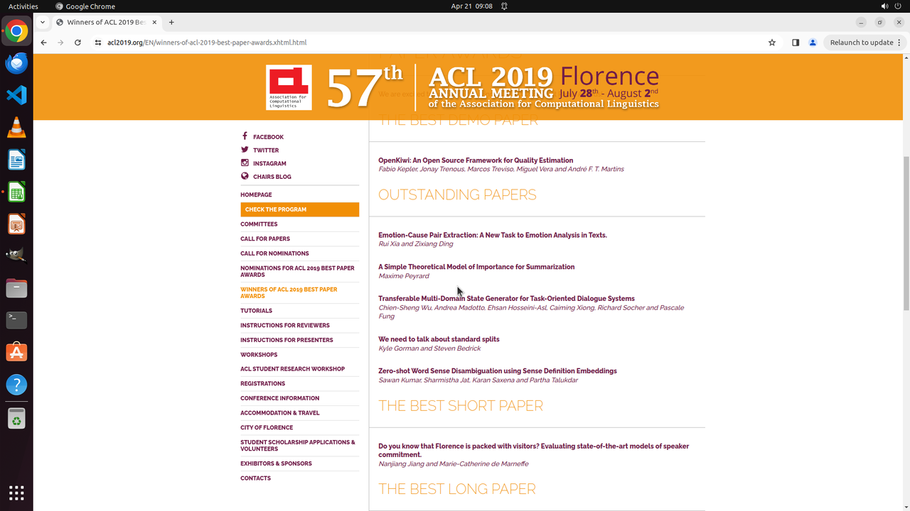

**Response:**
```
I can see "THE BEST LONG PAPER" section is appearing at the bottom. Let me scroll down a bit more to see the details.
```

**Actions:** `pyautogui.scroll(-3, 960, 600)`

---

## Step 25

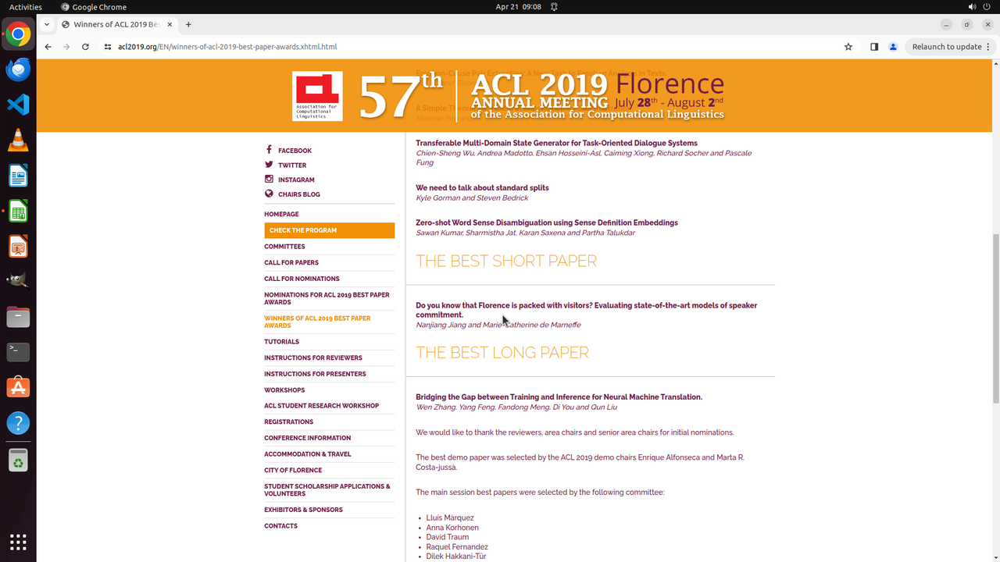

**Response:**
```
I found the ACL 2019 Best Long Paper:
- **Title:** "Bridging the Gap between Training and Inference for Neural Machine Translation."
- **Authors:** Wen Zhang, Yang Feng, Fandong Meng, Di You and Qun Liu
- **Year:** 2019

Now I have all four years of data. Let me now find the ACL Anthology PDF links for each paper. Let me search for each paper on ACL Anthology. Let me start with the 2022 paper.
```

**Actions:** `pyautogui.click(355, 88)`

---

## Step 26

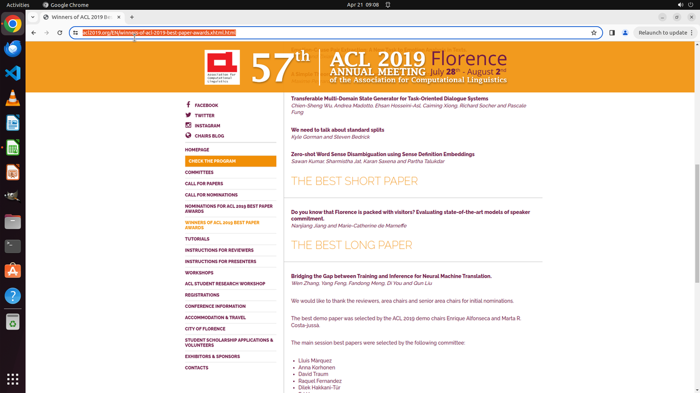

**Response:**
```
Now let me search for each paper on ACL Anthology to get the official PDF links. Let me start with the 2022 paper.
```

**Actions:** `import subprocess, shlex; subprocess.run(f'xdotool type --delay 12 -- ' + shlex.quote('https://aclanthology.org/search/?q=Learned+Increme'), shell=True, check=True)
import time; time.sleep(0.05)
impor`

---

## Step 27

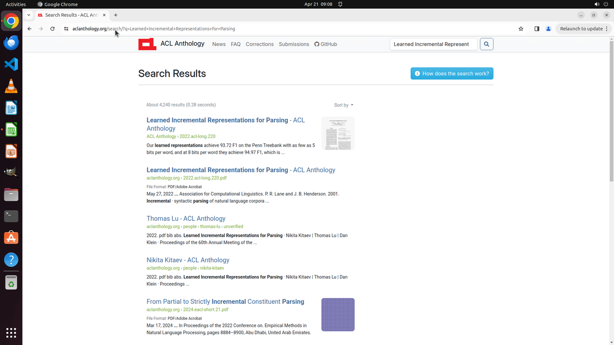

**Response:**
```
I found the ACL 2022 paper on ACL Anthology. Let me click on it to get the exact details and PDF link.
```

**Actions:** `pyautogui.click(703, 387)`

---

## Step 28

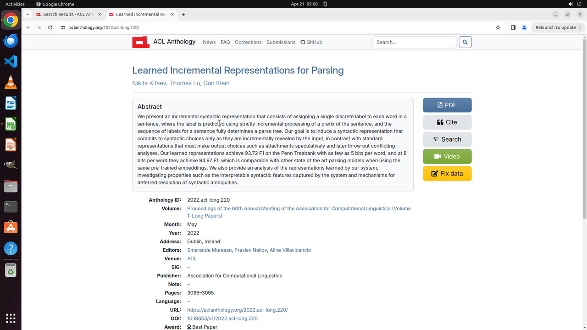

**Response:**
```
Excellent! I found the ACL 2022 paper details:
- **Title:** "Learned Incremental Representations for Parsing"
- **Authors:** Nikita Kitaev, Thomas Lu, Dan Klein
- **Year:** 2022
- **PDF Link:** https://aclanthology.org/2022.acl-long.220.pdf (from the PDF button)
- **Award:** Best Paper (confirmed at the bottom)

Now let me search for the ACL 2021 paper on ACL Anthology.
```

**Actions:** `pyautogui.click(355, 88)`

---

## Step 29

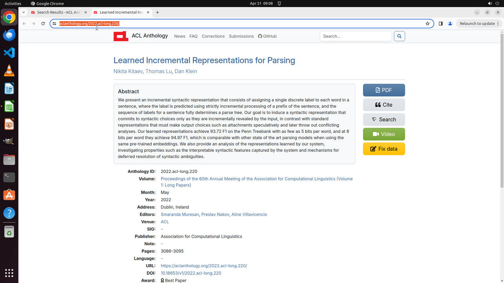

**Actions:** `import subprocess, shlex; subprocess.run(f'xdotool type --delay 12 -- ' + shlex.quote('https://aclanthology.org/search/?q=Vocabulary+Lear'), shell=True, check=True)
import time; time.sleep(0.05)
impor`

---

## Step 30

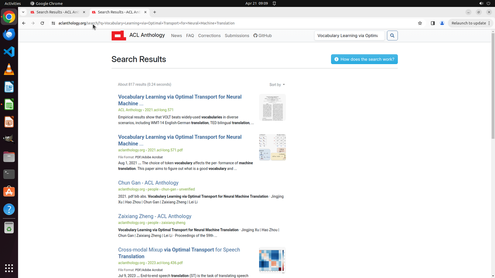

**Response:**
```
I found the ACL 2021 paper. Let me click on it to get the exact details.
```

**Actions:** `pyautogui.click(694, 387)`

---

## Step 31

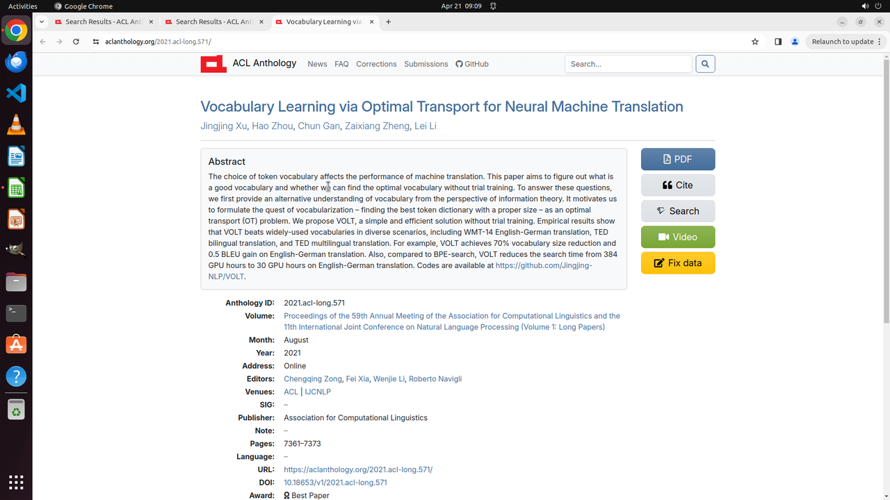

**Response:**
```
I found the ACL 2021 paper details:
- **Title:** "Vocabulary Learning via Optimal Transport for Neural Machine Translation"
- **Authors:** Jingjing Xu, Hao Zhou, Chun Gan, Zaixiang Zheng, Lei Li
- **Year:** 2021
- **PDF Link:** https://aclanthology.org/2021.acl-long.571.pdf
- **Award:** Best Paper (confirmed)

Now let me search for the ACL 2020 paper.
```

**Actions:** `pyautogui.click(355, 88)`

---

## Step 32

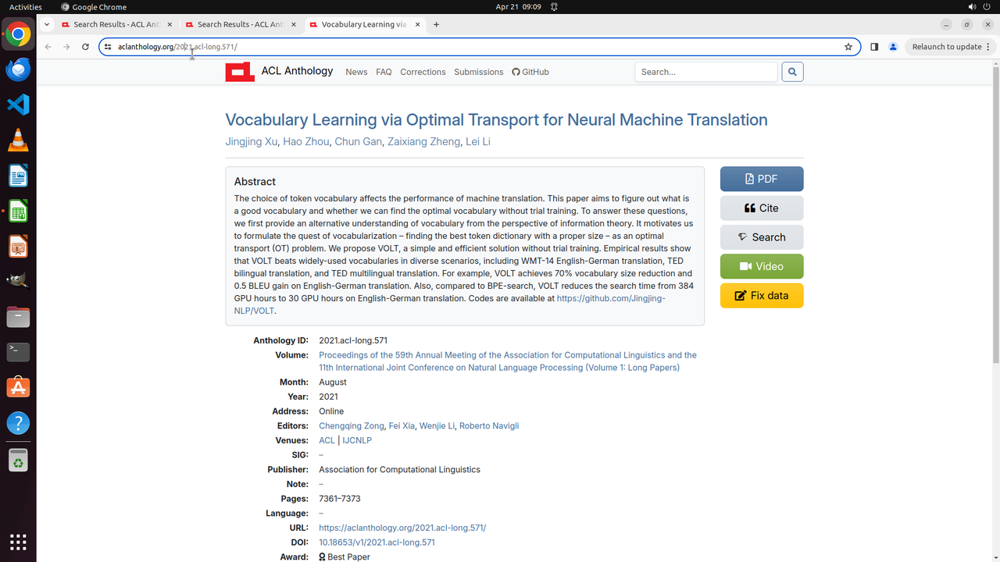

**Actions:** `import subprocess, shlex; subprocess.run(f'xdotool type --delay 12 -- ' + shlex.quote('https://aclanthology.org/search/?q=Beyond+Accuracy'), shell=True, check=True)
import time; time.sleep(0.05)
impor`

---

## Step 33

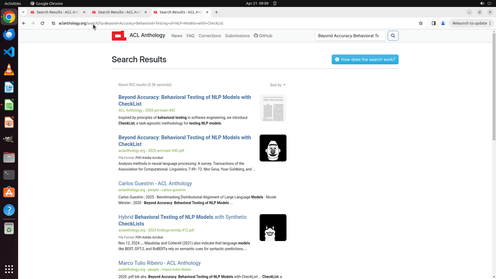

**Response:**
```
I found the ACL 2020 paper. Let me click on it to get the details.
```

**Actions:** `pyautogui.click(712, 387)`

---

## Step 34

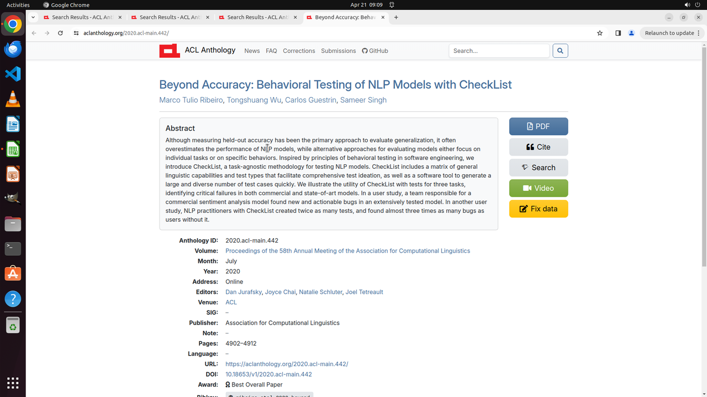

**Response:**
```
Excellent! I found the ACL 2020 paper details:
- **Title:** "Beyond Accuracy: Behavioral Testing of NLP Models with CheckList"
- **Authors:** Marco Tulio Ribeiro, Tongshuang Wu, Carlos Guestrin, Sameer Singh
- **Year:** 2020
- **PDF Link:** https://aclanthology.org/2020.acl-main.442.pdf
- **Award:** Best Overall Paper

Now let me search for the ACL 2019 paper on ACL Anthology.
```

**Actions:** `pyautogui.click(355, 88)`

---

## Step 35

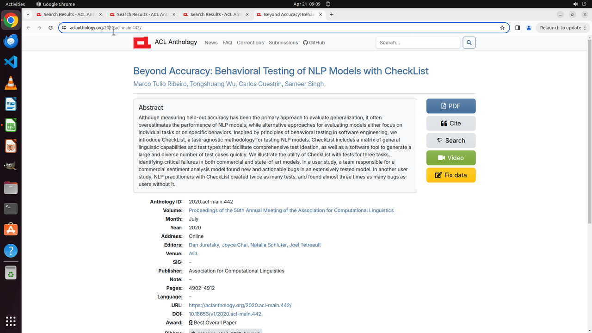

**Actions:** `import subprocess, shlex; subprocess.run(f'xdotool type --delay 12 -- ' + shlex.quote('https://aclanthology.org/search/?q=Bridging+the+Ga'), shell=True, check=True)
import time; time.sleep(0.05)
impor`

---

## Step 36

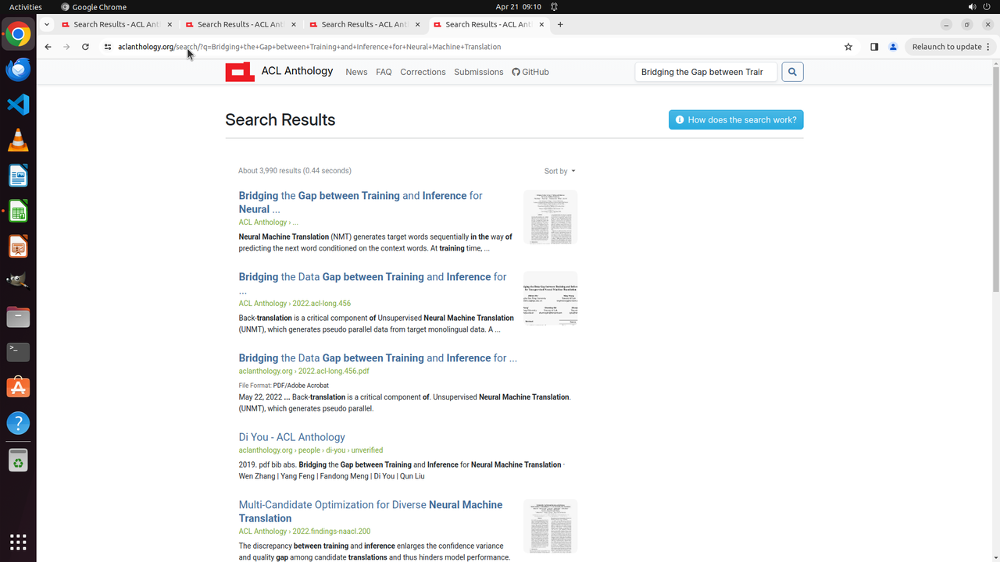

**Response:**
```
I found the ACL 2019 paper. Let me click on the first result to get the details.
```

**Actions:** `pyautogui.click(690, 387)`

---

## Step 37

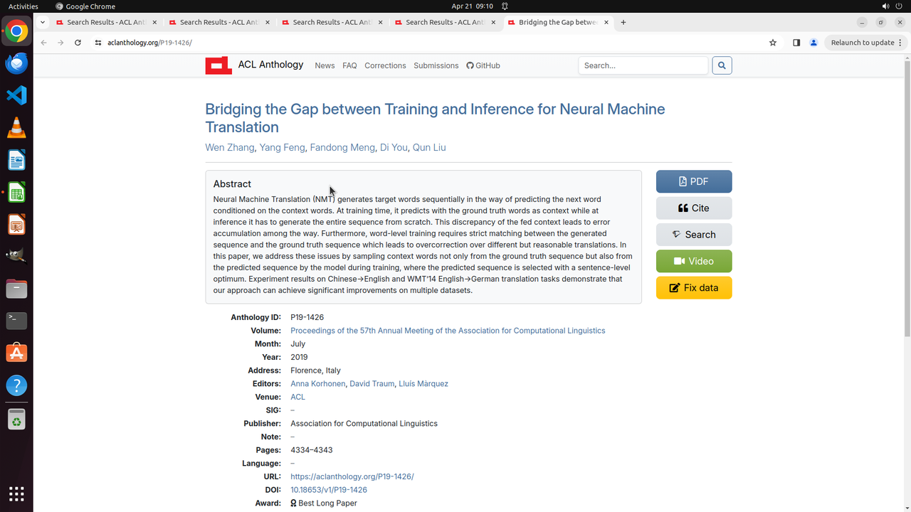

**Response:**
```
I now have all the information I need for all four papers:

**ACL 2022:**
- Title: "Learned Incremental Representations for Parsing"
- Authors: Nikita Kitaev, Thomas Lu, Dan Klein
- PDF: https://aclanthology.org/2022.acl-long.220.pdf

**ACL 2021:**
- Title: "Vocabulary Learning via Optimal Transport for Neural Machine Translation"
- Authors: Jingjing Xu, Hao Zhou, Chun Gan, Zaixiang Zheng, Lei Li
- PDF: https://aclanthology.org/2021.acl-long.571.pdf

**ACL 2020:**
- Title: "Beyond Accuracy: Behavioral Testing of NLP Models with CheckList"
- Authors: Marco Tulio Ribeiro, Tongshuang Wu, Carlos Guestrin, Sameer Singh
- PDF: https://aclanthology.org/2020.acl-main.442.pdf

**ACL 2019:**
- Title: "Bridging the Gap between Training and Inference for Neural Machine Translation"
- Authors: Wen Zhang, Yang Feng, Fandong Meng, Di You, Qun Liu
- PDF: https://aclanthology.org/P19-1426.pdf

Now let me create the Excel file. Let me open a terminal to create the file using Python.
```

**Actions:** `pyautogui.keyDown('ctrl')
pyautogui.keyDown('alt')
pyautogui.keyDown('t')
pyautogui.keyUp('t')
pyautogui.keyUp('alt')
pyautogui.keyUp('ctrl')`

---

## Step 38

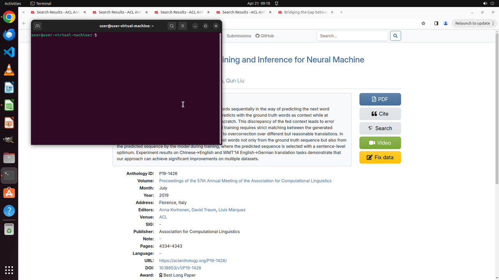

**Response:**
```
A terminal is open. Now let me create the Excel file using Python with openpyxl.
```

**Actions:** `import subprocess, shlex; subprocess.run(f'xdotool type --delay 12 -- ' + shlex.quote("python3 << 'EOF'\nimport openpyxl\n\nwb = openpyxl.Wo"), shell=True, check=True)
import time; time.sleep(0.05)
im`

---

## Step 39

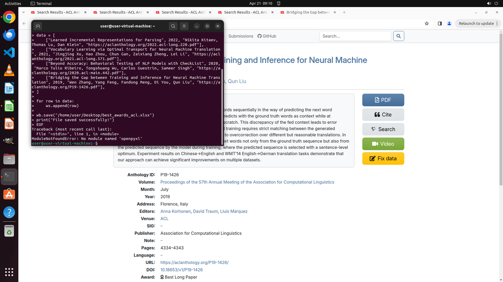

**Response:**
```
I see the error - `openpyxl` module is not installed. Let me install it first.
```

**Actions:** `import subprocess, shlex; subprocess.run(f'xdotool type --delay 12 -- ' + shlex.quote('pip3 install openpyxl\n'), shell=True, check=True)
import time; time.sleep(0.05)`

---

## Step 40


**Response:**
```
openpyxl is being installed. Let me wait for it to finish and then run the script again.
```

**Actions:** `time.sleep(0.5)`

---

## Step 41

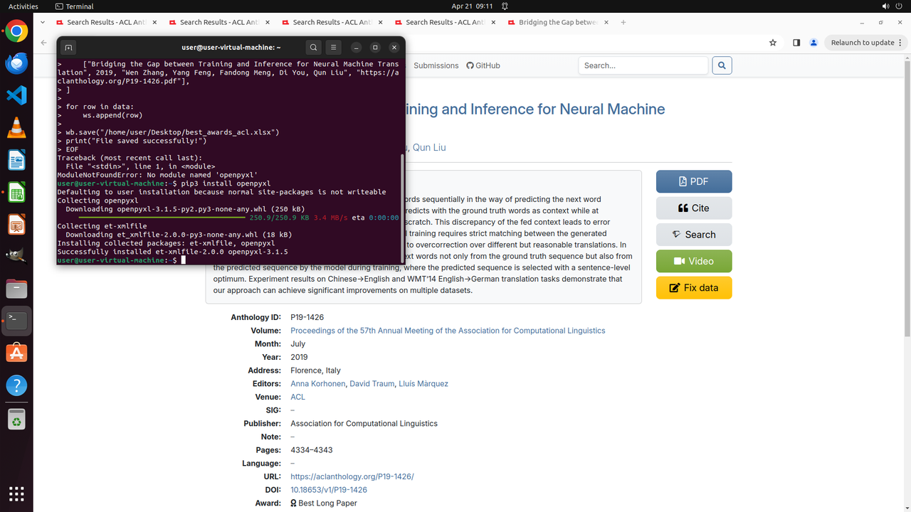

**Response:**
```
openpyxl is now installed. Let me run the script again to create the Excel file.
```

**Actions:** `import subprocess, shlex; subprocess.run(f'xdotool type --delay 12 -- ' + shlex.quote("python3 << 'EOF'\nimport openpyxl\n\nwb = openpyxl.Wo"), shell=True, check=True)
import time; time.sleep(0.05)
im`

---

## Step 42

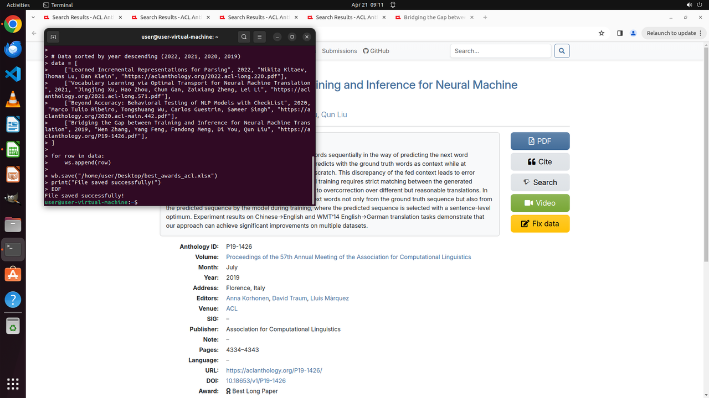

**Response:**
```
The file has been saved successfully! I can see "File saved successfully!" in the terminal output. The Excel file `best_awards_acl.xlsx` has been created on the desktop with the following data:

| title | year | author list | PDF link |
|-------|------|-------------|----------|
| Learned Incremental Representations for Parsing | 2022 | Nikita Kitaev, Thomas Lu, Dan Klein | https://aclanthology.org/2022.acl-long.220.pdf |
| Vocabulary Learning via Optimal Transport for Neural Machine Translation | 2021 | Jingjing Xu, Hao Zhou, Chun Gan, Zaixiang Zheng, Lei Li | https://aclanthology.org/2021.acl-long.571.pdf |
| Beyond Accuracy: Behavioral Testing of NLP Models with CheckList | 2020 | Marco Tulio Ribeiro, Tongshuang Wu, Carlos Guestrin, Sameer Singh | https://aclanthology.org/2020.acl-main.442.pdf |
| Bridging the Gap between Training and Inference for Neural Machine Translation | 2019 | Wen Zhang, Yang Feng, Fandong Meng, Di You, Qun Liu | https://aclanthology.org/P19-1426.pdf |

The rows are sorted by year in descending order (2022 → 2019), authors are separated by commas, and all PDF links use official ACL Anthology URLs.

Let me verify the file exists on the desktop:
```

**Actions:** `import subprocess, shlex; subprocess.run(f'xdotool type --delay 12 -- ' + shlex.quote('ls -la /home/user/Desktop/best_awards_acl.xlsx\n'), shell=True, check=True)
import time; time.sleep(0.05)`

---

## Step 43

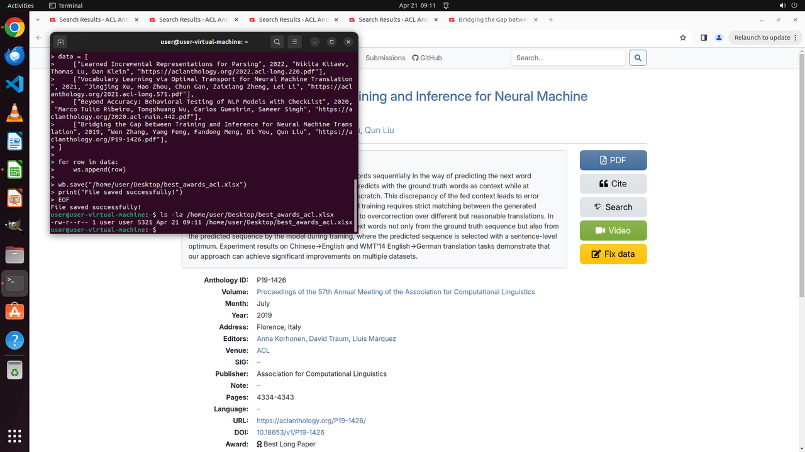

**Response:**
```
The file has been successfully created at `/home/user/Desktop/best_awards_acl.xlsx` (5321 bytes, created on Apr 21 09:11). 

The Excel file contains the best long paper awards from ACL conferences from 2019 to 2022, with the following information:
- **Title**, **Year**, **Author list** (comma-separated), and **PDF link** (official ACL Anthology URLs)
- Rows are sorted by year in descending order (2022, 2021, 2020, 2019)

DONE
```

**Actions:** `DONE`

---
