# Task 67890eb6-6ce5-4c00-9e3d-fb4972699b06

**Instruction:** I am an NLP researcher. Check out the best long paper awards of ACL from 2019 to 2022 and record the 'title', 'year', 'author list' and 'PDF link' into table best_awards_acl.xlsx on the desktop. Separate authors only by commas, use offical aclanthology urls not arxiv, and sort rows by years in descending orders.

**Score:** 0.0

**Wall clock:** 8m 8s

**Steps:** 44

**Cost:** $1.58

---

## Step 1

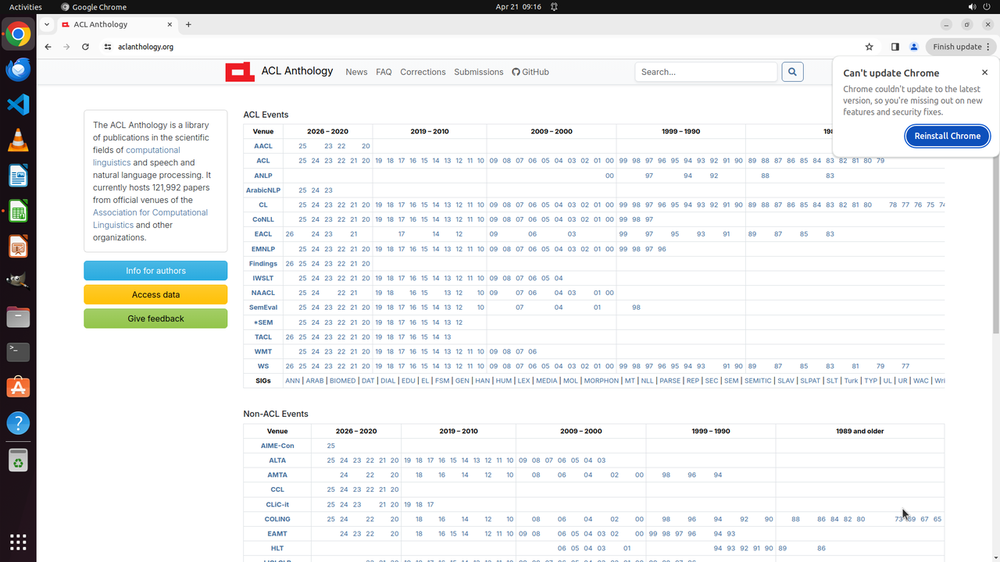

**Response:**
```
I need to find the best long paper awards from ACL conferences for 2019-2022. Let me search for each year's ACL best paper awards on the ACL Anthology website.

Let me start by searching for ACL 2022 best paper awards.
```

**Actions:** `pyautogui.click(1339, 136)`

---

## Step 2

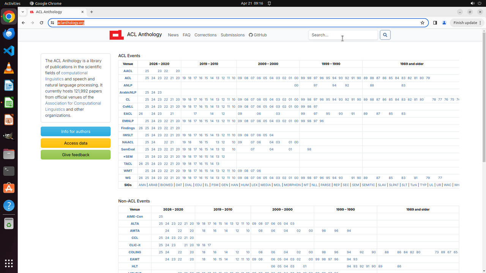

**Response:**
```
Let me navigate to the ACL 2022 conference page to find the best paper awards. I'll click on "22" next to ACL.
```

**Actions:** `pyautogui.click(633, 307)`

---

## Step 3

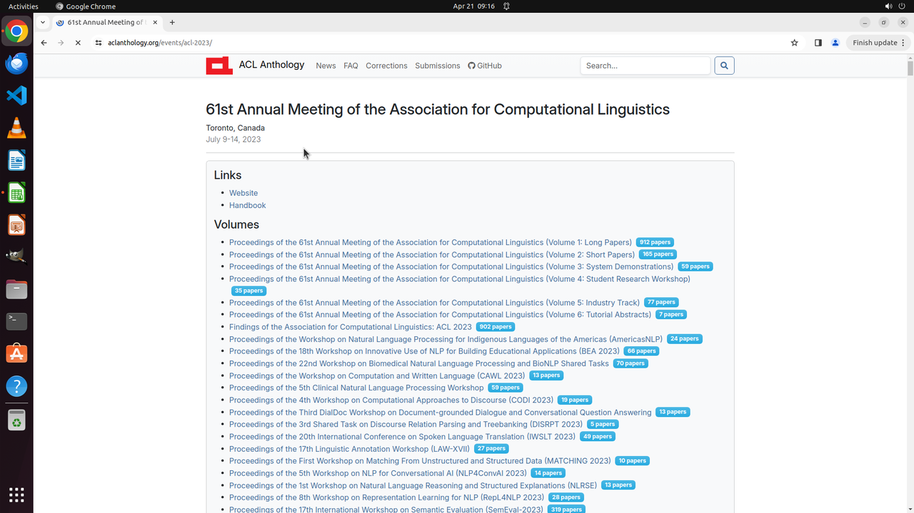

**Response:**
```
This is ACL 2023, but I need ACL 2022. Let me go back and click on the correct year. Let me navigate to the ACL 2022 page.
```

**Actions:** `pyautogui.click(88, 88)`

---

## Step 4

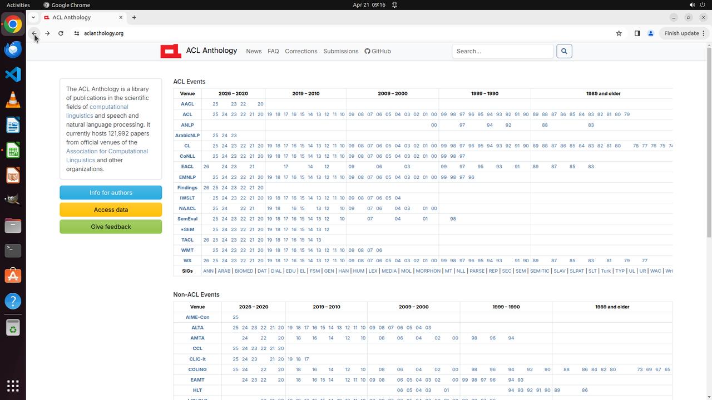

**Response:**
```
I see the ACL row. The numbers represent years. I need to click on "22" for ACL 2022. Let me look more carefully at the ACL row. The numbers after "25" are "24 23 22 21 20". Let me click on "22".
```

**Actions:** `pyautogui.click(655, 307)`

---

## Step 5

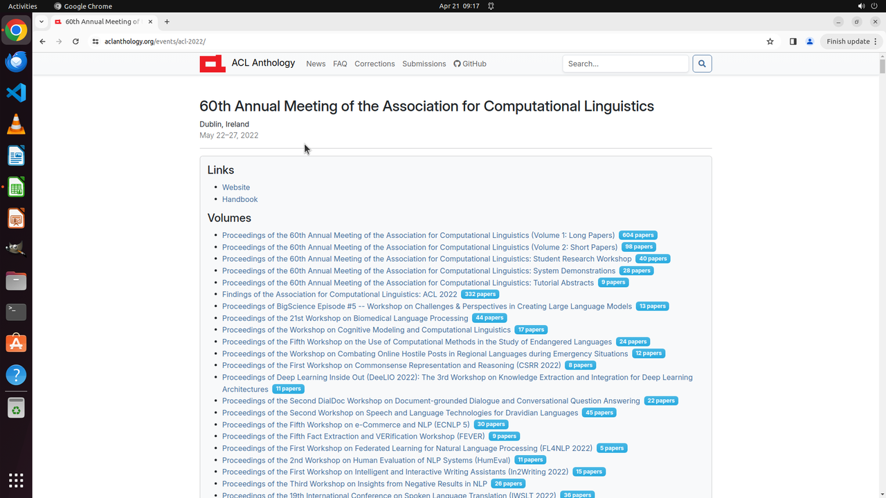

**Response:**
```
I'm on the ACL 2022 page. I need to find the best long paper award. The best paper awards are usually listed on the conference website or in the proceedings. Let me search for "ACL 2022 best paper" to find this information. Actually, let me first try searching on the ACL Anthology for best paper awards. Let me try a different approach - I'll search for ACL best paper awards directly.
```

**Actions:** `pyautogui.click(960, 88)`

---

## Step 6

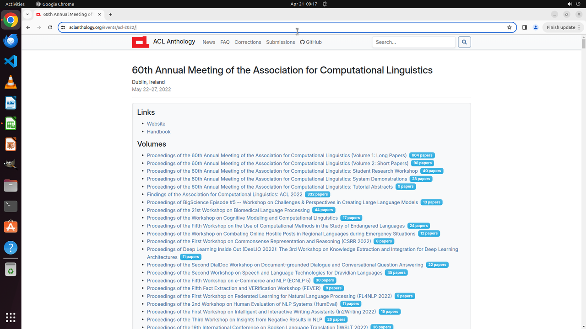

**Response:**
```
Let me search for ACL best paper awards. I'll use Google to find the best long paper awards for ACL 2019-2022.
```

**Actions:** `import subprocess, shlex; subprocess.run(f'xdotool type --delay 12 -- ' + shlex.quote('https://www.google.com/search?q=ACL+best+long+pape'), shell=True, check=True)
import time; time.sleep(0.05)
impor`

---

## Step 7

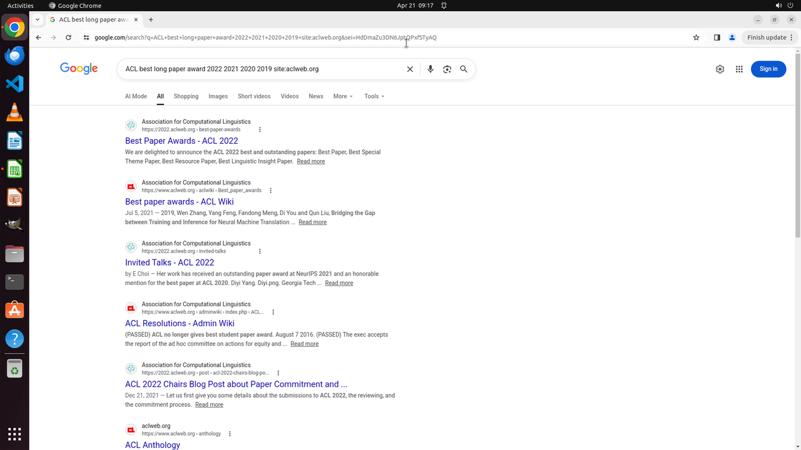

**Response:**
```
I can see some relevant results. Let me first check the "Best Paper Awards - ACL 2022" page, and also the "Best paper awards - ACL Wiki" page. Let me start with the ACL Wiki page which likely has a comprehensive list.
```

**Actions:** `pyautogui.click(430, 483)`

---

## Step 8

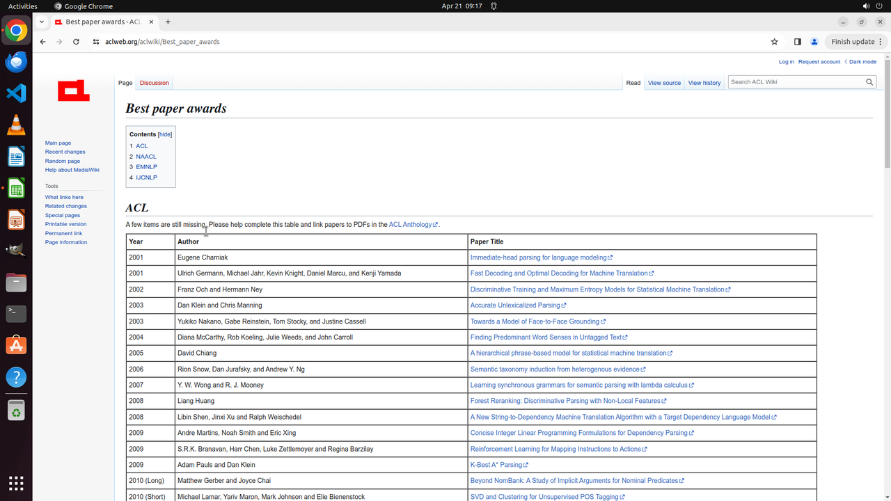

**Response:**
```
This is the ACL Wiki page with best paper awards. I can see a table with Year, Author, and Paper Title. I need to scroll down to find the awards from 2019-2022. Let me scroll down to find those years.
```

**Actions:** `pyautogui.scroll(-10, 960, 600)`

---

## Step 9

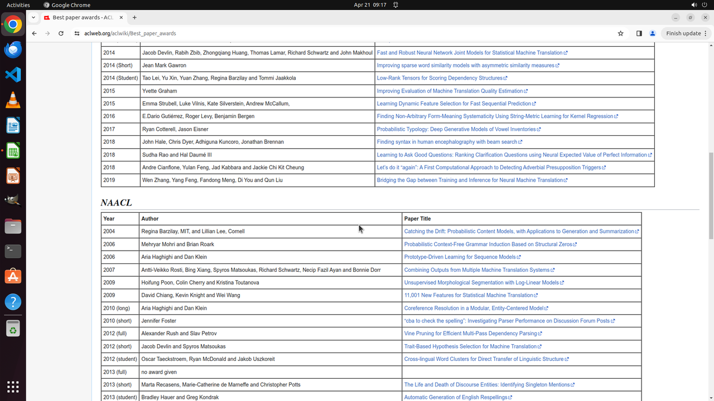

**Response:**
```
I can see the ACL best paper awards table. I can see 2019 entry at the bottom of the ACL section. But I notice the table only goes up to 2019, and doesn't include 2020, 2021, or 2022. The wiki page might not be fully updated. Let me note the 2019 entry and then search for the other years individually.

For 2019, I can see:
- Year: 2019
- Author: Wen Zhang, Yang Feng, Fandong Meng, Di You and Qun Liu
- Paper Title: Bridging the Gap between Training and Inference for Neural Machine Translation

Now let me go back and check the ACL 2022 best paper awards page that appeared in the search results. But first, let me also check if there are more entries I might have missed. Let me scroll up a bit to see if there are 2019 (Long) entries specifically.

Looking at the table, I see that from 2010 onwards, they started distinguishing between "Long" and "Short" papers. But for 2018 and 2019, the entries don't have "(Long)" specified. Let me check the 2018 entries - there are multiple entries for 2018, and none say "(Long)". 

Let me now search for the specific best long paper awards. Let me go to the ACL 2022 best paper awards page first.
```

**Actions:** `pyautogui.click(960, 88)`

---

## Step 10

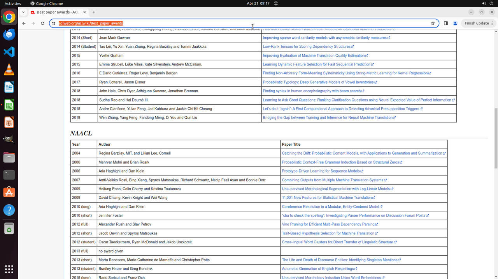

**Response:**
```
I can see the ACL wiki page ends at 2019 for the ACL section. The wiki seems outdated. Let me search for the best paper awards for each year individually. Let me start by searching for ACL 2022 best paper awards.
```

**Actions:** `import subprocess, shlex; subprocess.run(f'xdotool type --delay 12 -- ' + shlex.quote('https://2022.aclweb.org/best-paper-awards\n'), shell=True, check=True)
import time; time.sleep(0.05)`

---

## Step 11

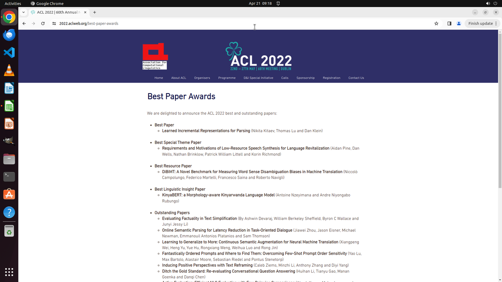

**Response:**
```
I found the ACL 2022 best paper awards page. I can see:

**ACL 2022 Best Paper:**
- Title: "Learned Incremental Representations for Parsing"
- Authors: Nikita Kitaev, Thomas Lu and Dan Klein

Note: ACL 2022 doesn't distinguish between "Best Long Paper" and just "Best Paper". The "Best Paper" here is the main award. Let me note this and check if this is indeed a long paper. Let me now search for ACL 2021, 2020, and 2019 best paper awards.
```

**Actions:** `pyautogui.click(960, 88)`

---

## Step 12

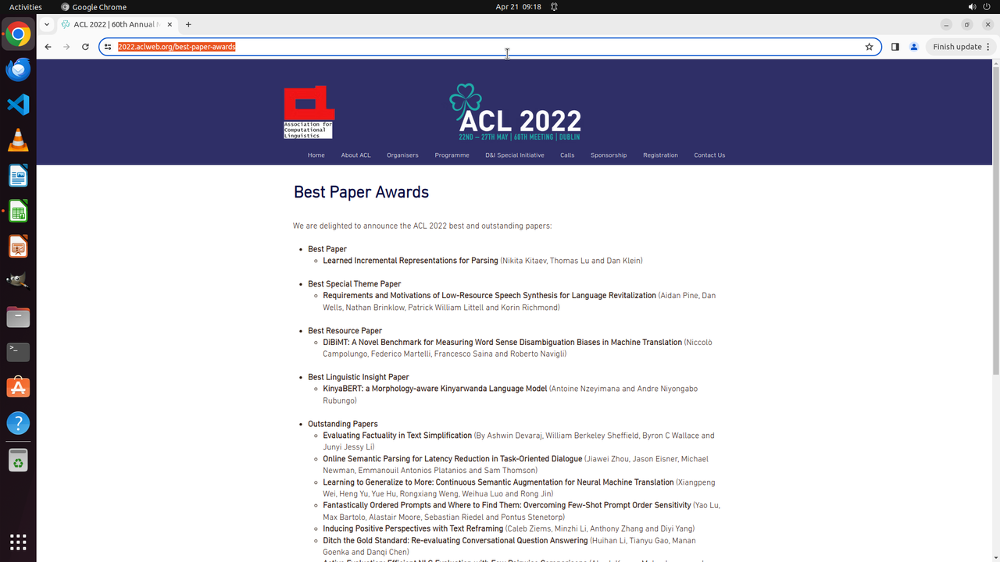

**Response:**
```
Now let me check ACL 2021 best paper awards.
```

**Actions:** `import subprocess, shlex; subprocess.run(f'xdotool type --delay 12 -- ' + shlex.quote('https://2021.aclweb.org/program/best-papers/\n'), shell=True, check=True)
import time; time.sleep(0.05)`

---

## Step 13

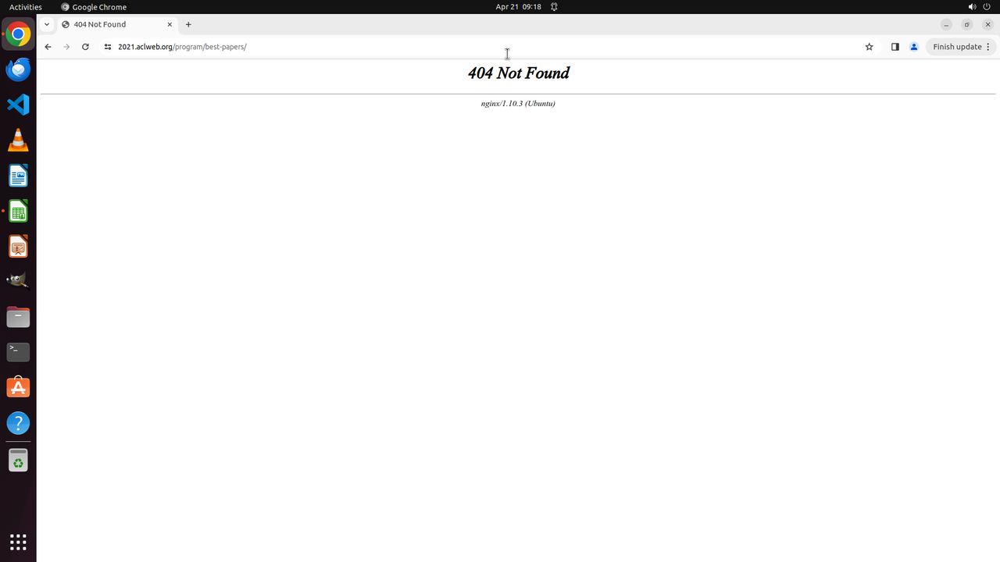

**Response:**
```
The page is not found. Let me try a Google search for ACL 2021 best paper awards.
```

**Actions:** `pyautogui.click(960, 88)`

---

## Step 14

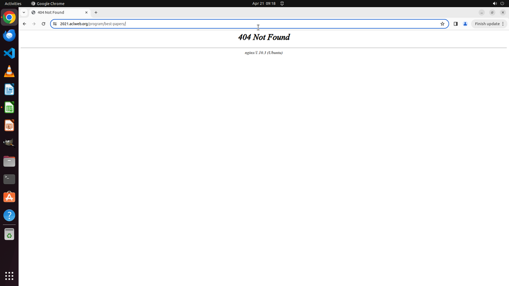

**Response:**
```
Let me search Google for the ACL best long paper awards for each year.
```

**Actions:** `import subprocess, shlex; subprocess.run(f'xdotool type --delay 12 -- ' + shlex.quote('https://www.google.com/search?q=ACL+2021+best+long'), shell=True, check=True)
import time; time.sleep(0.05)
impor`

---

## Step 15

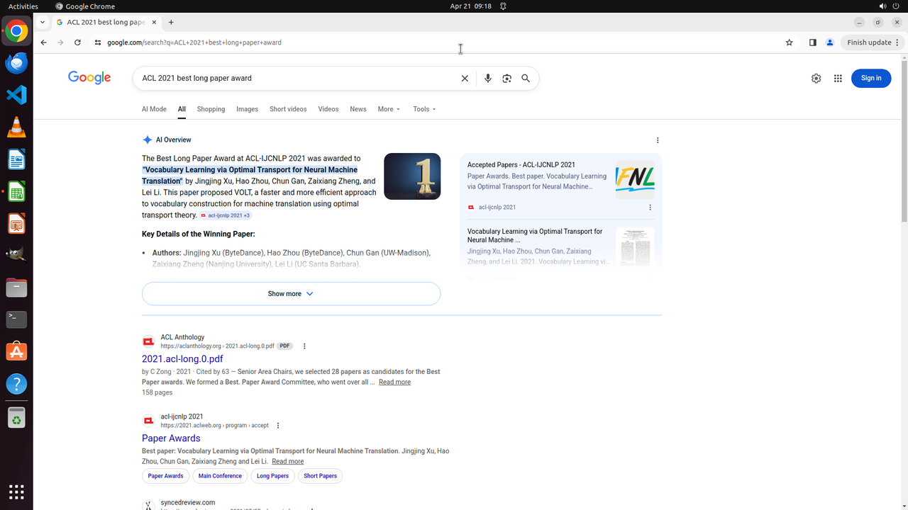

**Response:**
```
I can see that for ACL-IJCNLP 2021 (ACL 2021 was joint with IJCNLP), the Best Long Paper Award was:
- Title: "Vocabulary Learning via Optimal Transport for Neural Machine Translation"
- Authors: Jingjing Xu, Hao Zhou, Chun Gan, Zaixiang Zheng, and Lei Li

Let me click on the "Paper Awards" link from the ACL 2021 website to get the official information.
```

**Actions:** `pyautogui.click(363, 927)`

---

## Step 16

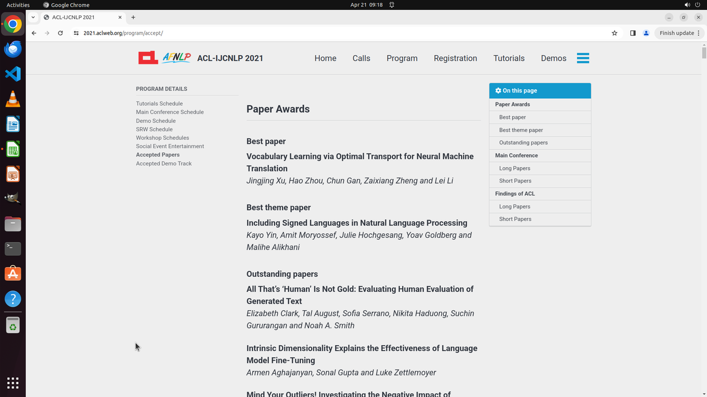

**Response:**
```
I can see the ACL-IJCNLP 2021 Paper Awards page. The "Best paper" is:
- Title: "Vocabulary Learning via Optimal Transport for Neural Machine Translation"
- Authors: Jingjing Xu, Hao Zhou, Chun Gan, Zaixiang Zheng and Lei Li

Note that ACL 2021 (ACL-IJCNLP 2021) uses "Best paper" rather than "Best Long Paper". This is the main best paper award. Now let me search for ACL 2020 best paper awards.
```

**Actions:** `pyautogui.click(960, 88)`

---

## Step 17

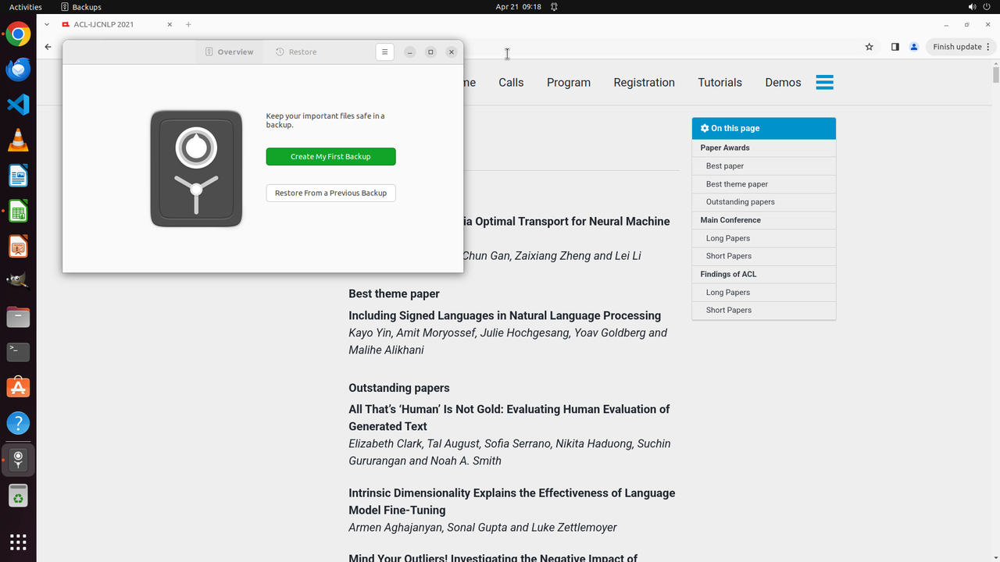

**Response:**
```
A backup dialog appeared. Let me close it first.
```

**Actions:** `pyautogui.click(864, 99)`

---

## Step 18

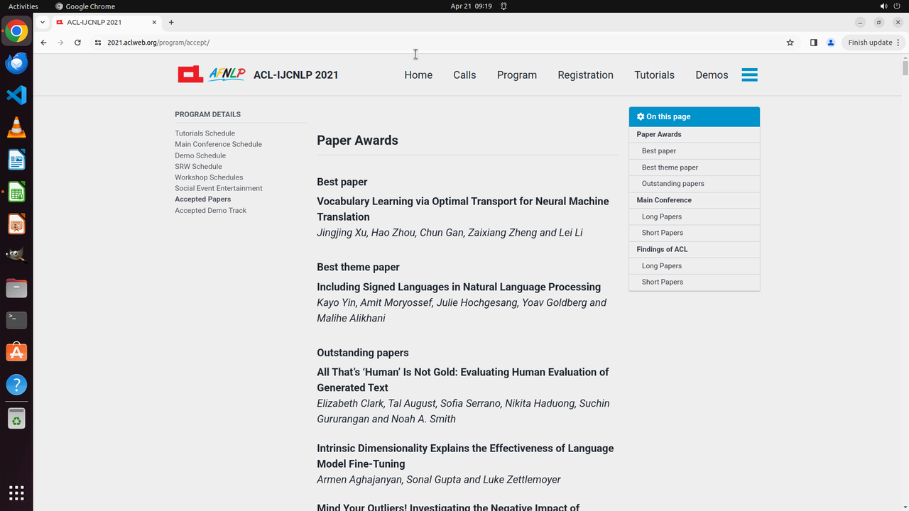

**Response:**
```
Good, now I can see the ACL-IJCNLP 2021 awards clearly. The "Best paper" (which serves as the best long paper) is:
- Title: "Vocabulary Learning via Optimal Transport for Neural Machine Translation"
- Authors: Jingjing Xu, Hao Zhou, Chun Gan, Zaixiang Zheng and Lei Li

Now let me search for ACL 2020 best paper awards.
```

**Actions:** `pyautogui.click(960, 88)`

---

## Step 19

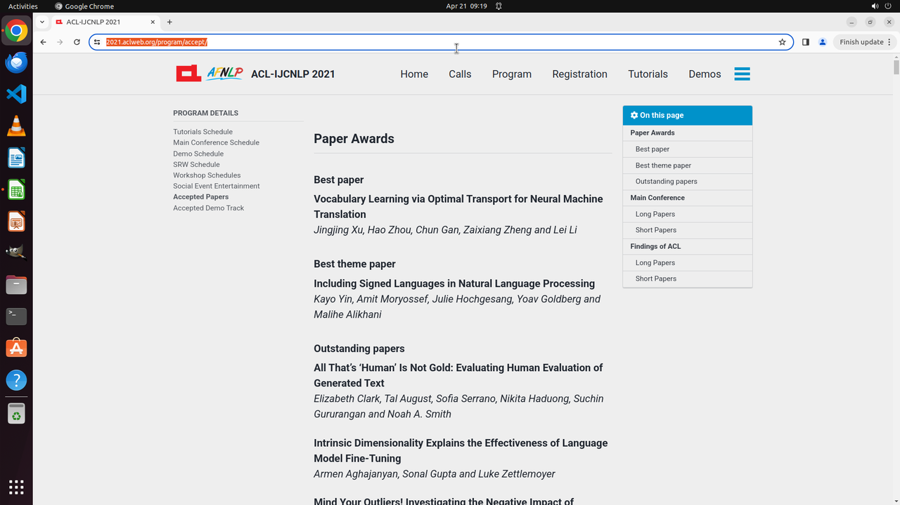

**Actions:** `import subprocess, shlex; subprocess.run(f'xdotool type --delay 12 -- ' + shlex.quote('https://www.google.com/search?q=ACL+2020+best+long'), shell=True, check=True)
import time; time.sleep(0.05)
impor`

---

## Step 20

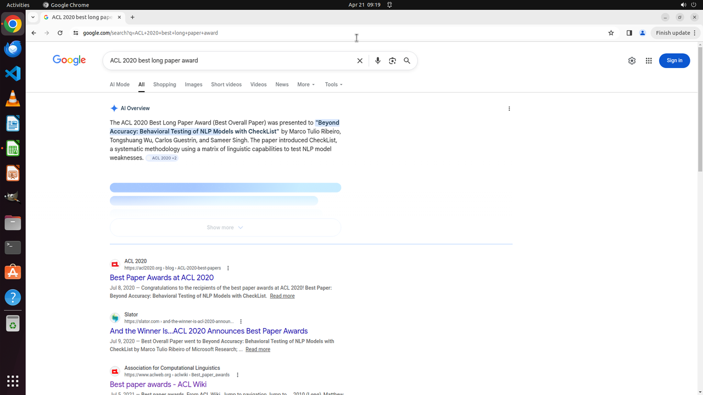

**Response:**
```
I can see that for ACL 2020, the Best Long Paper Award (Best Overall Paper) was:
- Title: "Beyond Accuracy: Behavioral Testing of NLP Models with CheckList"
- Authors: Marco Tulio Ribeiro, Tongshuang Wu, Carlos Guestrin, and Sameer Singh

Let me click on the "Best Paper Awards at ACL 2020" link to confirm the details.
```

**Actions:** `pyautogui.click(444, 757)`

---

## Step 21

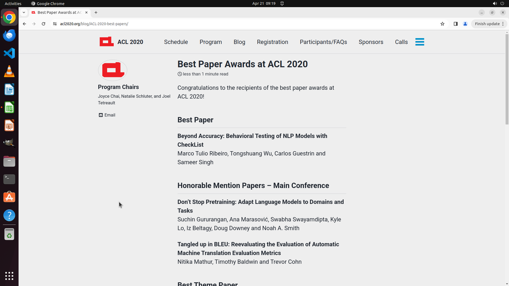

**Response:**
```
I can confirm the ACL 2020 Best Paper:
- Title: "Beyond Accuracy: Behavioral Testing of NLP Models with CheckList"
- Authors: Marco Tulio Ribeiro, Tongshuang Wu, Carlos Guestrin and Sameer Singh

Now let me search for ACL 2019 best paper awards.
```

**Actions:** `pyautogui.click(960, 88)`

---

## Step 22

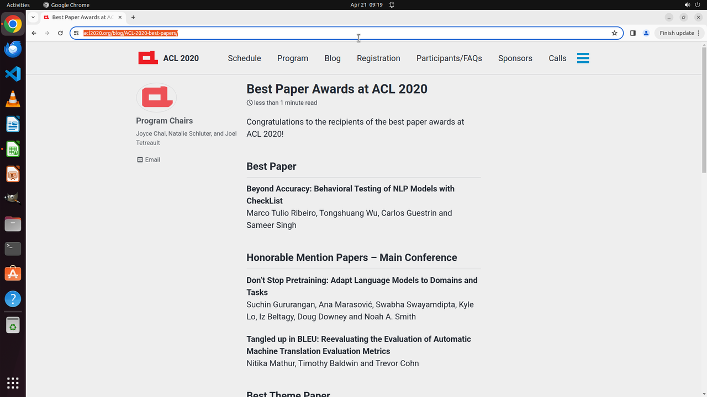

**Actions:** `import subprocess, shlex; subprocess.run(f'xdotool type --delay 12 -- ' + shlex.quote('https://www.google.com/search?q=ACL+2019+best+long'), shell=True, check=True)
import time; time.sleep(0.05)
impor`

---

## Step 23

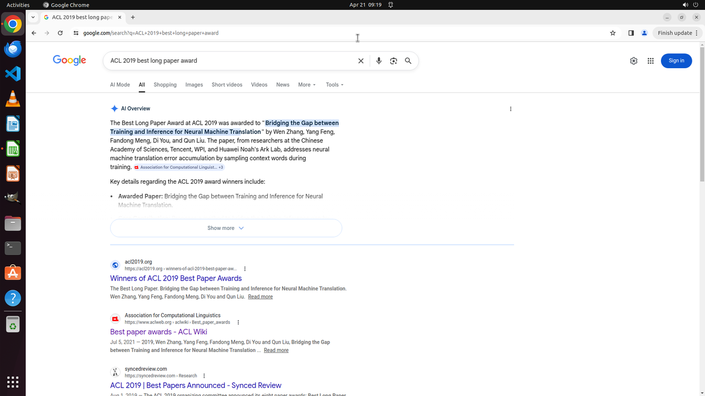

**Response:**
```
I can see the ACL 2019 Best Long Paper Award:
- Title: "Bridging the Gap between Training and Inference for Neural Machine Translation"
- Authors: Wen Zhang, Yang Feng, Fandong Meng, Di You and Qun Liu

Let me click on the official ACL 2019 page to confirm.
```

**Actions:** `pyautogui.click(478, 757)`

---

## Step 24

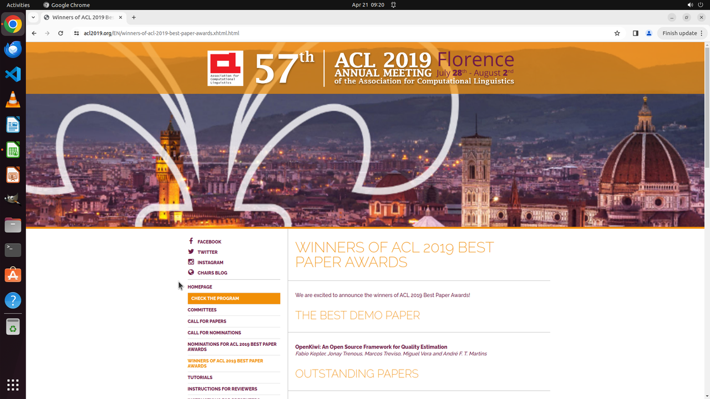

**Response:**
```
I can see the ACL 2019 Best Paper Awards page. I can see "The Best Demo Paper" section. I need to scroll down to find the "Best Long Paper" section.
```

**Actions:** `pyautogui.scroll(-5, 960, 600)`

---

## Step 25

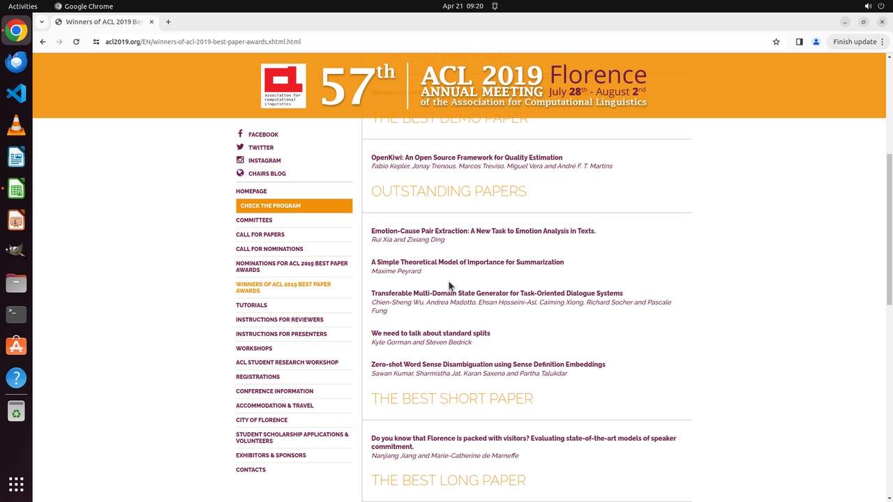

**Response:**
```
I can see "THE BEST LONG PAPER" section heading at the bottom. Let me scroll down a bit more to see the details.
```

**Actions:** `pyautogui.scroll(-3, 960, 600)`

---

## Step 26

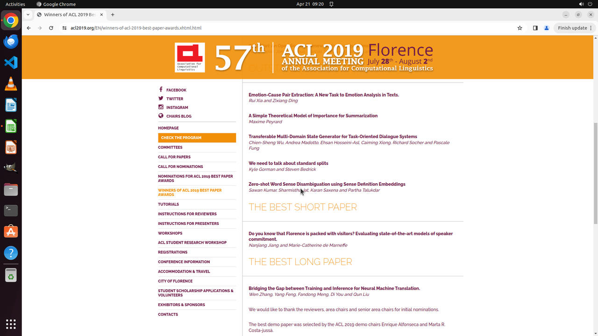

**Response:**
```
I can now confirm the ACL 2019 Best Long Paper:
- Title: "Bridging the Gap between Training and Inference for Neural Machine Translation."
- Authors: Wen Zhang, Yang Feng, Fandong Meng, Di You and Qun Liu

Now I have all four years of data. Let me now find the PDF links from ACL Anthology for each paper. Let me search for each paper on ACL Anthology. Let me start with the ACL Anthology website.
```

**Actions:** `pyautogui.click(960, 88)`

---

## Step 27

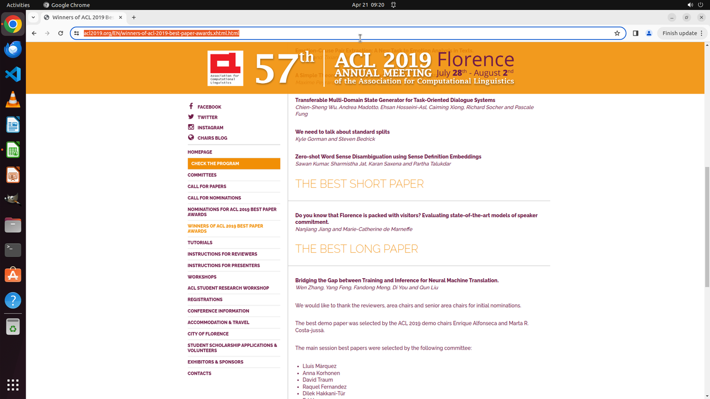

**Response:**
```
Now I can see all the ACL 2019 details clearly. Let me now search for the ACL Anthology PDF links for each paper. Let me search for each paper on ACL Anthology.
```

**Actions:** `import subprocess, shlex; subprocess.run(f'xdotool type --delay 12 -- ' + shlex.quote('https://aclanthology.org/search/?q=Bridging+the+Ga'), shell=True, check=True)
import time; time.sleep(0.05)
impor`

---

## Step 28

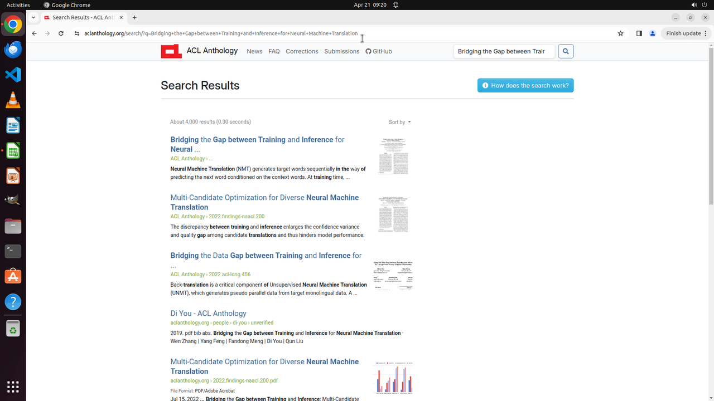

**Response:**
```
I can see the first result is the paper "Bridging the Gap between Training and Inference for Neural..." which is the ACL 2019 paper. Let me click on it to get the PDF link.
```

**Actions:** `pyautogui.click(690, 388)`

---

## Step 29

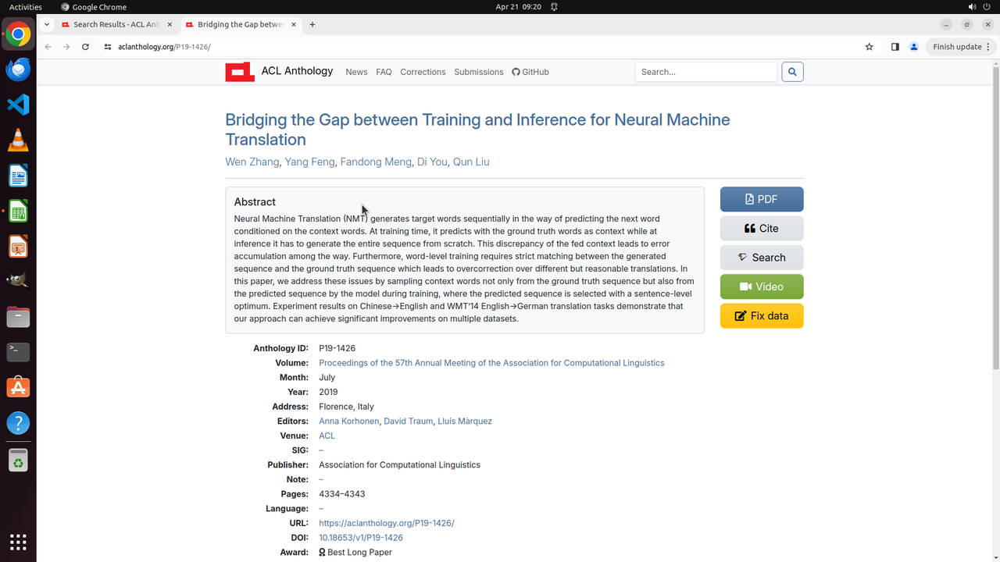

**Response:**
```
I found the ACL 2019 Best Long Paper on ACL Anthology. I can see:
- Title: "Bridging the Gap between Training and Inference for Neural Machine Translation"
- Authors: Wen Zhang, Yang Feng, Fandong Meng, Di You, Qun Liu
- URL: https://aclanthology.org/P19-1426/
- Award: Best Long Paper (confirmed at the bottom)

Now I need to get the PDF link. The PDF link would be https://aclanthology.org/P19-1426.pdf. Let me now search for the ACL 2020 paper.
```

**Actions:** `pyautogui.click(960, 88)`

---

## Step 30

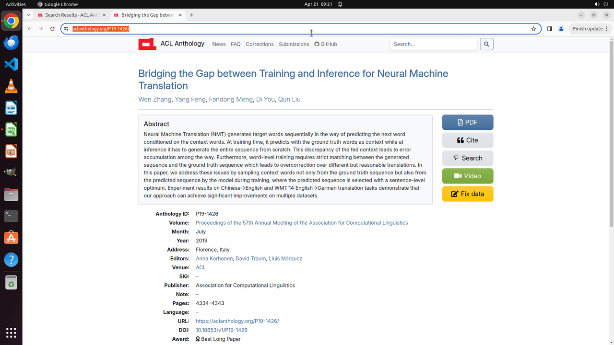

**Response:**
```
Now let me search for the ACL 2020 best paper on ACL Anthology.
```

**Actions:** `import subprocess, shlex; subprocess.run(f'xdotool type --delay 12 -- ' + shlex.quote('https://aclanthology.org/search/?q=Beyond+Accuracy'), shell=True, check=True)
import time; time.sleep(0.05)
impor`

---

## Step 31

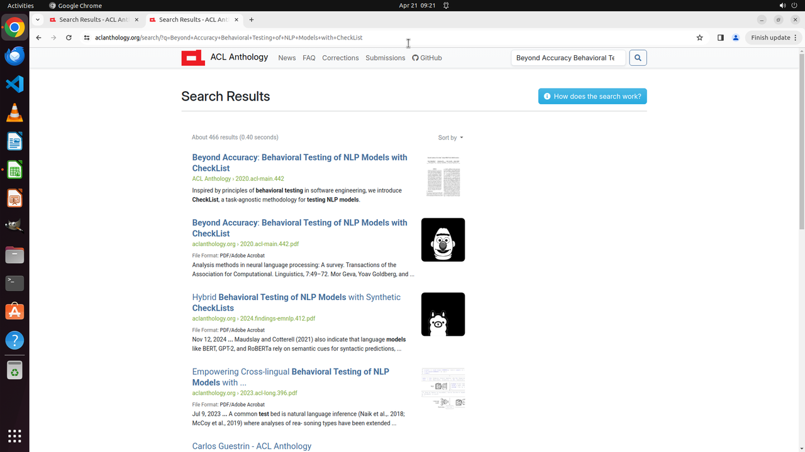

**Response:**
```
I found the ACL 2020 paper. Let me click on the first result to get the details.
```

**Actions:** `pyautogui.click(714, 388)`

---

## Step 32

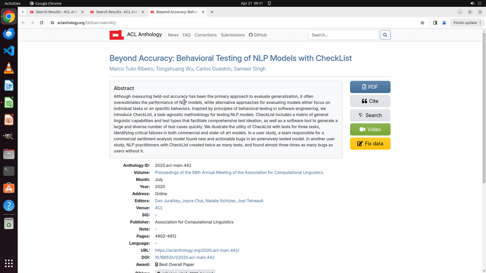

**Response:**
```
Excellent! I found the ACL 2020 paper on ACL Anthology:
- Title: "Beyond Accuracy: Behavioral Testing of NLP Models with CheckList"
- Authors: Marco Tulio Ribeiro, Tongshuang Wu, Carlos Guestrin, Sameer Singh
- URL: https://aclanthology.org/2020.acl-main.442/
- PDF link: https://aclanthology.org/2020.acl-main.442.pdf
- Award: Best Overall Paper (Year: 2020)

Now let me search for the ACL 2021 paper on ACL Anthology.
```

**Actions:** `pyautogui.click(960, 88)`

---

## Step 33

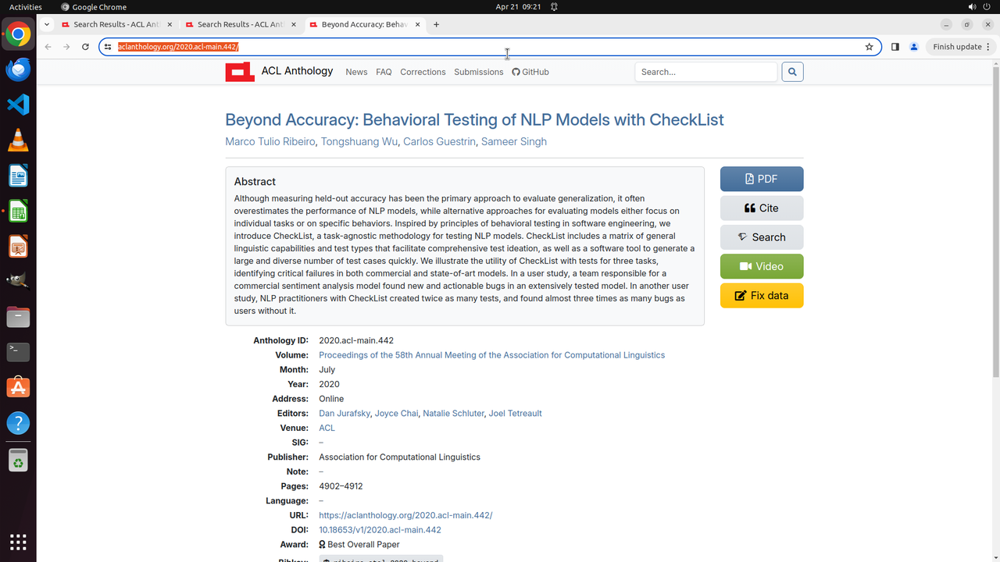

**Actions:** `import subprocess, shlex; subprocess.run(f'xdotool type --delay 12 -- ' + shlex.quote('https://aclanthology.org/search/?q=Vocabulary+Lear'), shell=True, check=True)
import time; time.sleep(0.05)
impor`

---

## Step 34

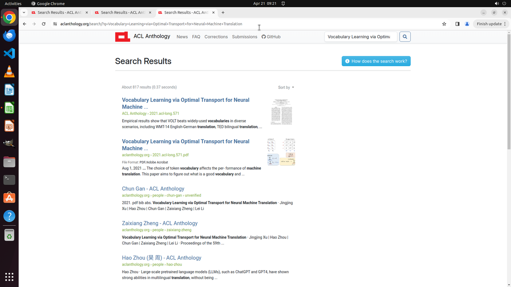

**Response:**
```
I found the ACL 2021 paper. Let me click on the first result to get the details.
```

**Actions:** `pyautogui.click(697, 388)`

---

## Step 35

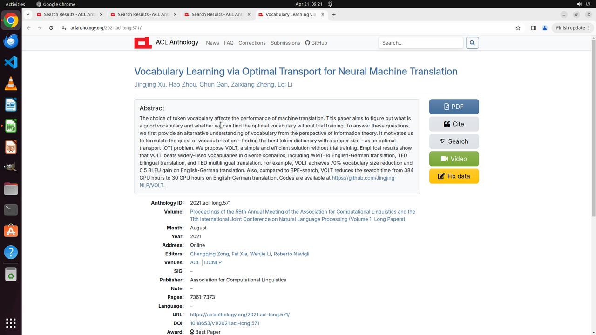

**Response:**
```
I found the ACL 2021 paper on ACL Anthology:
- Title: "Vocabulary Learning via Optimal Transport for Neural Machine Translation"
- Authors: Jingjing Xu, Hao Zhou, Chun Gan, Zaixiang Zheng, Lei Li
- URL: https://aclanthology.org/2021.acl-long.571/
- PDF link: https://aclanthology.org/2021.acl-long.571.pdf
- Award: Best Paper (Year: 2021)

Now let me search for the ACL 2022 paper on ACL Anthology.
```

**Actions:** `pyautogui.click(960, 88)`

---

## Step 36

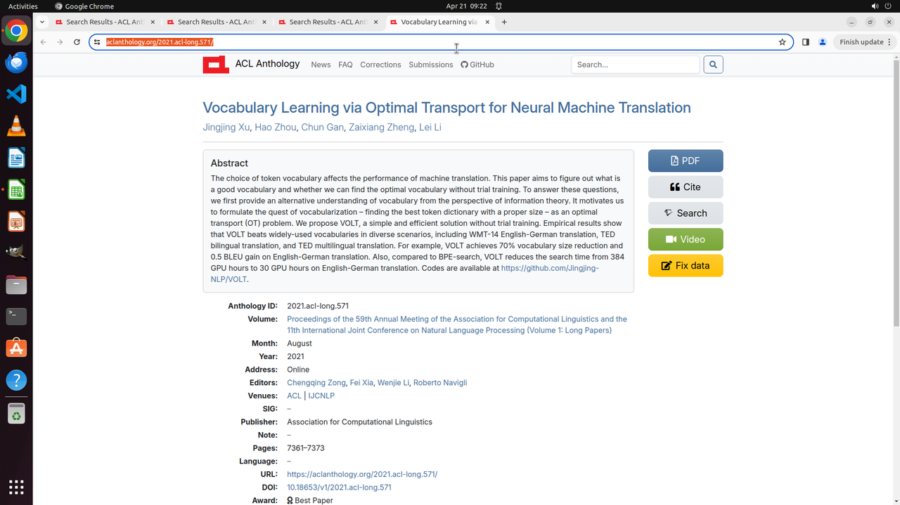

**Response:**
```
Now let me search for the ACL 2022 best paper "Learned Incremental Representations for Parsing" on ACL Anthology.
```

**Actions:** `import subprocess, shlex; subprocess.run(f'xdotool type --delay 12 -- ' + shlex.quote('https://aclanthology.org/search/?q=Learned+Increme'), shell=True, check=True)
import time; time.sleep(0.05)
impor`

---

## Step 37

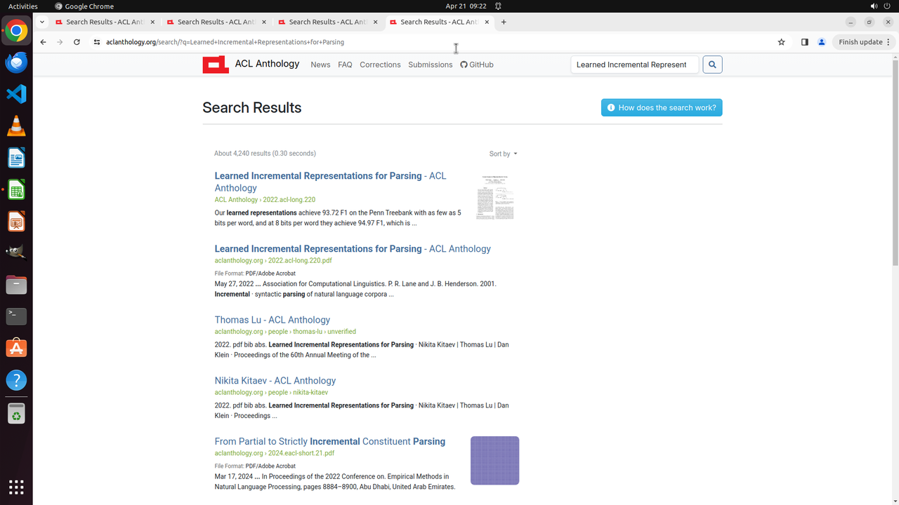

**Response:**
```
I found the ACL 2022 paper. Let me click on the first result to get the details.
```

**Actions:** `pyautogui.click(705, 388)`

---

## Step 38

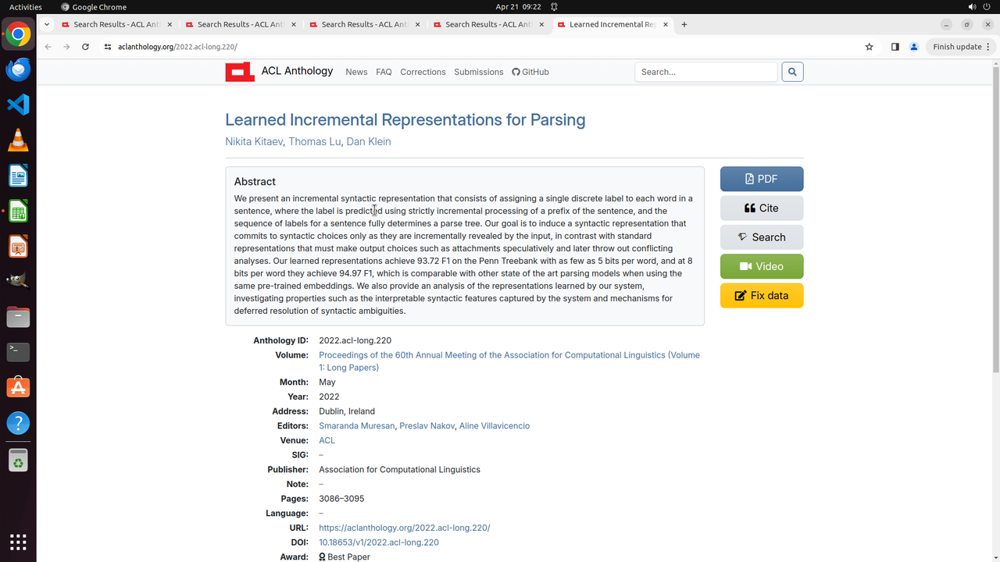

**Response:**
```
I now have all the information for the ACL 2022 paper:
- Title: "Learned Incremental Representations for Parsing"
- Authors: Nikita Kitaev, Thomas Lu, Dan Klein
- URL: https://aclanthology.org/2022.acl-long.220/
- PDF link: https://aclanthology.org/2022.acl-long.220.pdf
- Award: Best Paper (Year: 2022)

Now I need to verify the ACL 2022 best paper award. I notice it says "Best Paper" not "Best Long Paper". Let me go back and check the ACL 2022 best paper awards page to see if this is indeed the best long paper. Let me also check if there were separate "Best Long Paper" and "Best Short Paper" awards.

Wait - looking at the data I've collected, I see that for ACL 2022, 2021, and 2020, the award is just called "Best Paper" or "Best Overall Paper", while for ACL 2019, it's explicitly called "Best Long Paper". The naming convention changed over the years. Since the task asks for "best long paper awards", these "Best Paper" awards are essentially the equivalent (they are long papers that won the best paper award).

Now let me create the Excel file. I have all the data:

1. **2022**: "Learned Incremental Representations for Parsing", Nikita Kitaev, Thomas Lu, Dan Klein, https://aclanthology.org/2022.acl-long.220.pdf
2. **2021**: "Vocabulary Learning via Optimal Transport for Neural Machine Translation", Jingjing Xu, Hao Zhou, Chun Gan, Zaixiang Zheng, Lei Li, https://aclanthology.org/2021.acl-long.571.pdf
3. **2020**: "Beyond Accuracy: Behavioral Testing of NLP Models with CheckList", Marco Tulio Ribeiro, Tongshuang Wu, Carlos Guestrin, Sameer Singh, https://aclanthology.org/2020.acl-main.442.pdf
4. **2019**: "Bridging the Gap between Training and Inference for Neural Machine Translation", Wen Zhang, Yang Feng, Fandong Meng, Di You, Qun Liu, https://aclanthology.org/P19-1426.pdf

Let me open a terminal to create the Excel file using Python.
```

**Actions:** `pyautogui.keyDown('ctrl')
pyautogui.keyDown('alt')
pyautogui.keyDown('t')
pyautogui.keyUp('t')
pyautogui.keyUp('alt')
pyautogui.keyUp('ctrl')`

---

## Step 39

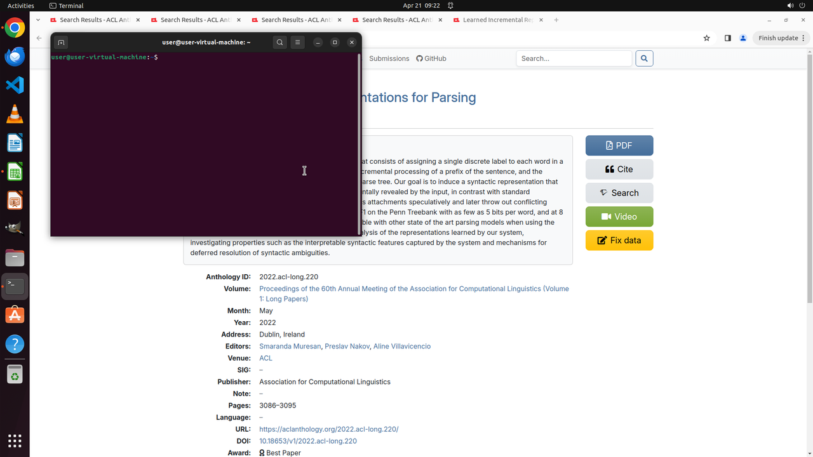

**Response:**
```
A terminal is open. Now let me create the Excel file using Python with openpyxl.
```

**Actions:** `import subprocess, shlex; subprocess.run(f'xdotool type --delay 12 -- ' + shlex.quote("python3 << 'EOF'\nimport openpyxl\n\nwb = openpyxl.Wo"), shell=True, check=True)
import time; time.sleep(0.05)
im`

---

## Step 40

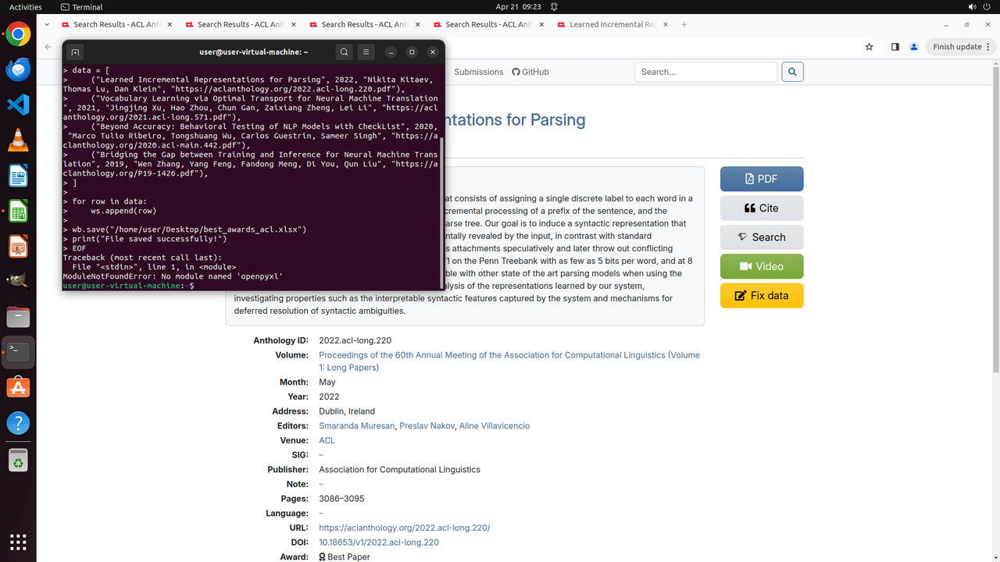

**Response:**
```
I see that `openpyxl` is not installed. Let me install it first.
```

**Actions:** `import subprocess, shlex; subprocess.run(f'xdotool type --delay 12 -- ' + shlex.quote('pip3 install openpyxl\n'), shell=True, check=True)
import time; time.sleep(0.05)`

---

## Step 41

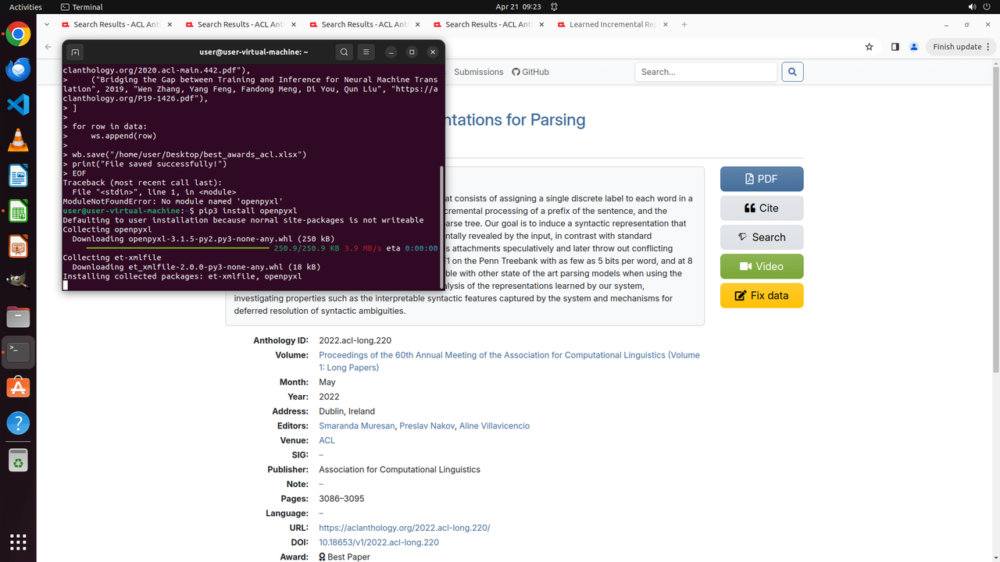

**Response:**
```
Good, openpyxl is being installed. Let me wait for it to finish.
```

**Actions:** `time.sleep(0.5)`

---

## Step 42

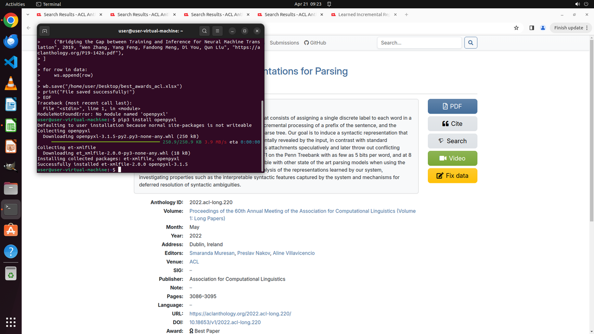

**Response:**
```
openpyxl is now installed. Let me run the Python script again to create the Excel file.
```

**Actions:** `import subprocess, shlex; subprocess.run(f'xdotool type --delay 12 -- ' + shlex.quote("python3 << 'EOF'\nimport openpyxl\n\nwb = openpyxl.Wo"), shell=True, check=True)
import time; time.sleep(0.05)
im`

---

## Step 43

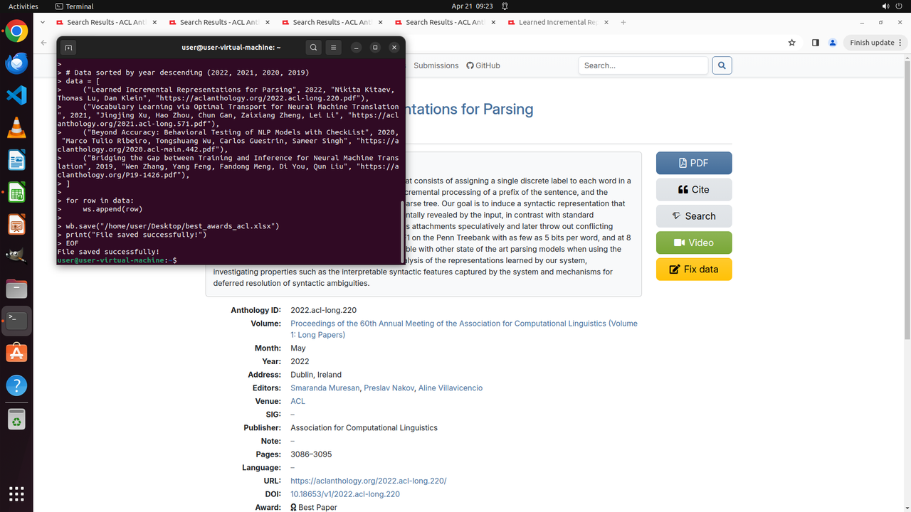

**Response:**
```
The file has been saved successfully. The Excel file `best_awards_acl.xlsx` has been created on the desktop. Let me verify the file by reading it back.
```

**Actions:** `import subprocess, shlex; subprocess.run(f'xdotool type --delay 12 -- ' + shlex.quote('python3 -c "\nimport openpyxl\nwb = openpyxl.load_wo'), shell=True, check=True)
import time; time.sleep(0.05)
imp`

---

## Step 44

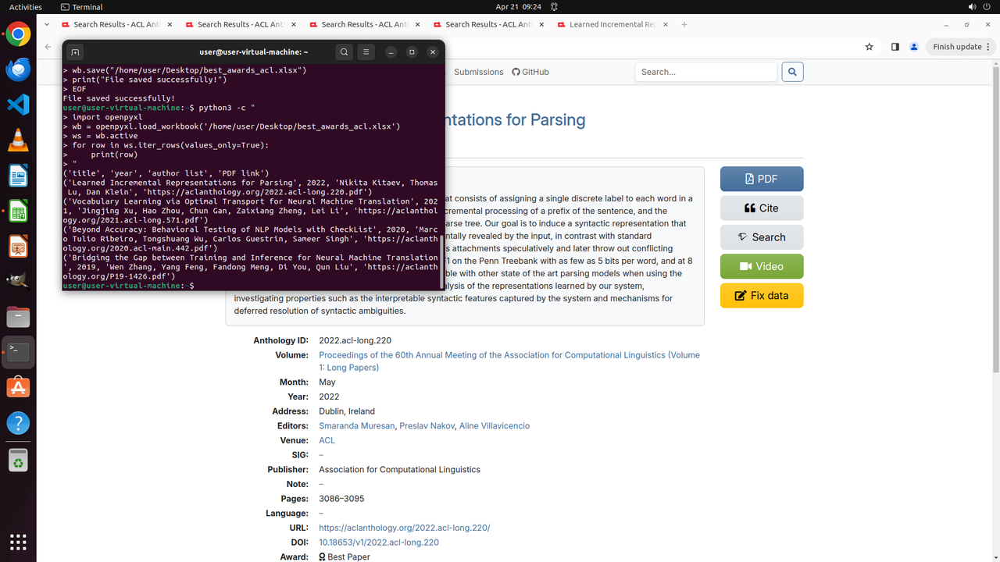

**Response:**
```
The file has been created and verified successfully. The data shows:

1. **Headers**: title, year, author list, PDF link
2. **2022**: "Learned Incremental Representations for Parsing", Nikita Kitaev, Thomas Lu, Dan Klein, https://aclanthology.org/2022.acl-long.220.pdf
3. **2021**: "Vocabulary Learning via Optimal Transport for Neural Machine Translation", Jingjing Xu, Hao Zhou, Chun Gan, Zaixiang Zheng, Lei Li, https://aclanthology.org/2021.acl-long.571.pdf
4. **2020**: "Beyond Accuracy: Behavioral Testing of NLP Models with CheckList", Marco Tulio Ribeiro, Tongshuang Wu, Carlos Guestrin, Sameer Singh, https://aclanthology.org/2020.acl-main.442.pdf
5. **2019**: "Bridging the Gap between Training and Inference for Neural Machine Translation", Wen Zhang, Yang Feng, Fandong Meng, Di You, Qun Liu, https://aclanthology.org/P19-1426.pdf

The rows are sorted by year in descending order (2022 → 2019), authors are separated by commas, and all PDF links use official ACL Anthology URLs.

DONE
```

**Actions:** `DONE`

---
