# Task 67890eb6-6ce5-4c00-9e3d-fb4972699b06

**Instruction:** I am an NLP researcher. Check out the best long paper awards of ACL from 2019 to 2022 and record the 'title', 'year', 'author list' and 'PDF link' into table best_awards_acl.xlsx on the desktop. Separate authors only by commas, use offical aclanthology urls not arxiv, and sort rows by years in descending orders.

**Score:** 0.0

**Wall clock:** 18m 5s

**Steps:** 49

**Cost:** $1.80

---

## Step 1

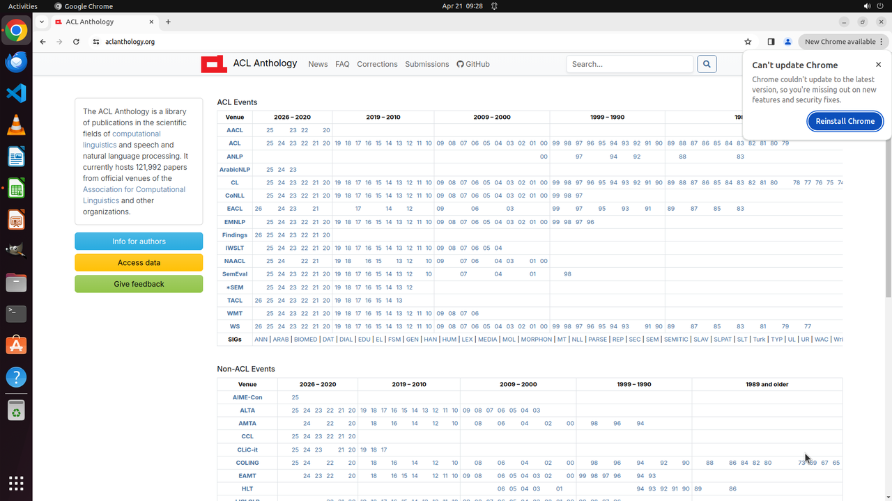

**Response:**
```
I'll research the best long paper awards from ACL 2019-2022 by visiting the ACL Anthology. Let me start by searching for each year's ACL conference and finding the best paper awards.
```

**Actions:** `pyautogui.click(1887, 138)`

---

## Step 2

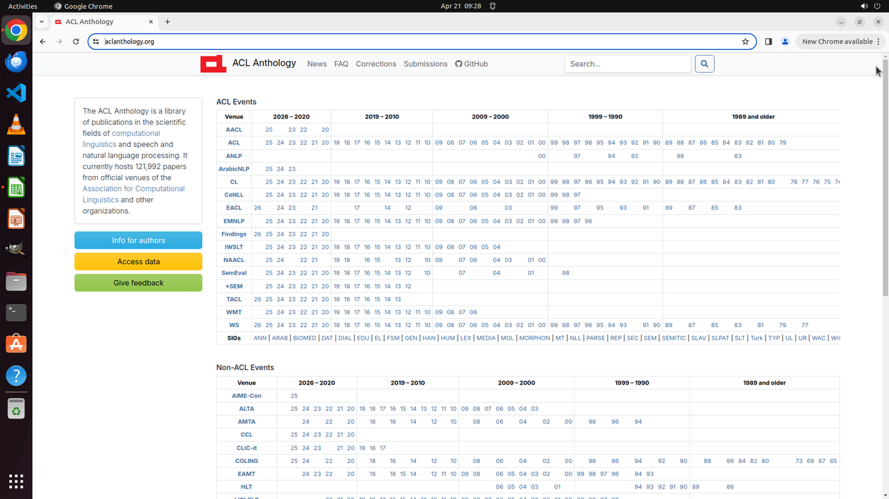

**Response:**
```
Let me search for ACL 2022 best paper awards first. I'll navigate to the ACL 2022 event page.
```

**Actions:** `pyautogui.click(660, 307)`

---

## Step 3

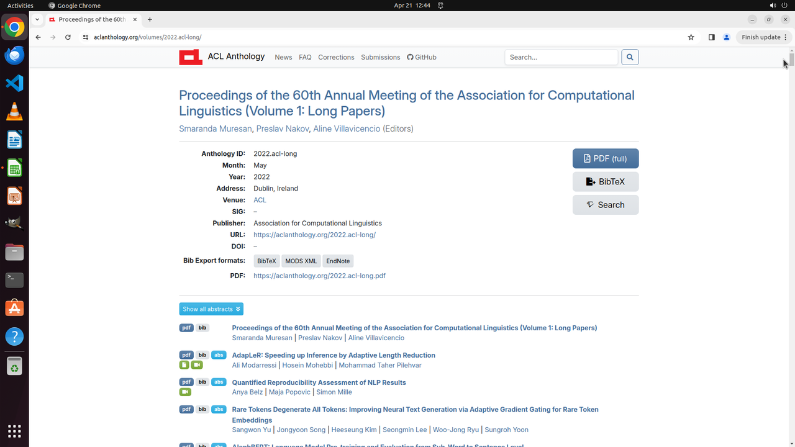

**Response:**
```
This is the ACL 2022 page. I need to find the best long paper award. Let me click on the "Proceedings of the 60th Annual Meeting of the Association for Computational Linguistics (Volume 1: Long Papers)" to look for award information.
```

**Actions:** `pyautogui.click(901, 508)`

---

## Step 4

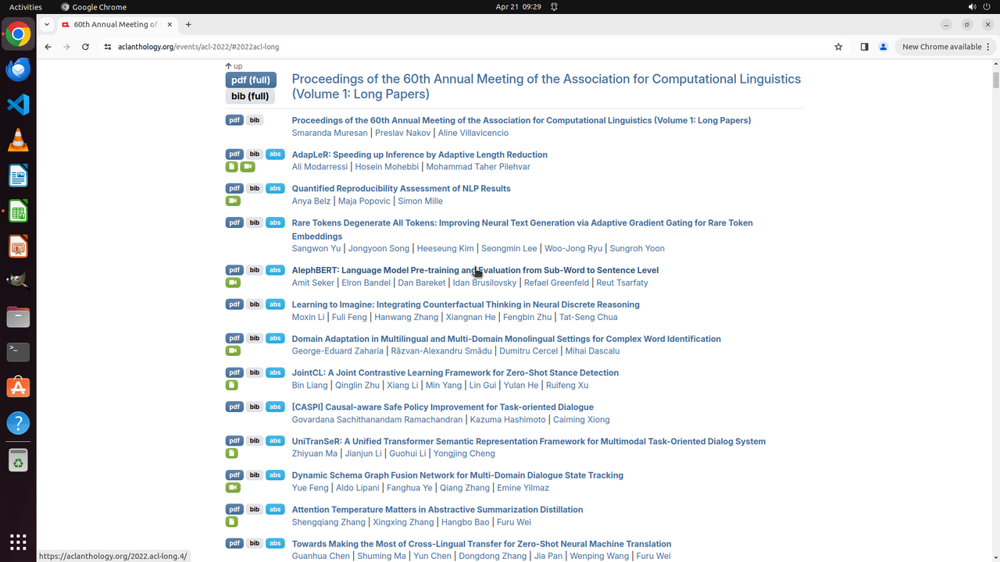

**Response:**
```
I can see the proceedings page but I need to find the best paper awards specifically. Let me search for ACL 2022 best paper awards. Let me use Ctrl+F to search on this page first.
```

**Actions:** `pyautogui.keyDown('ctrl')
pyautogui.keyDown('f')
pyautogui.keyUp('f')
pyautogui.keyUp('ctrl')`

---

## Step 5

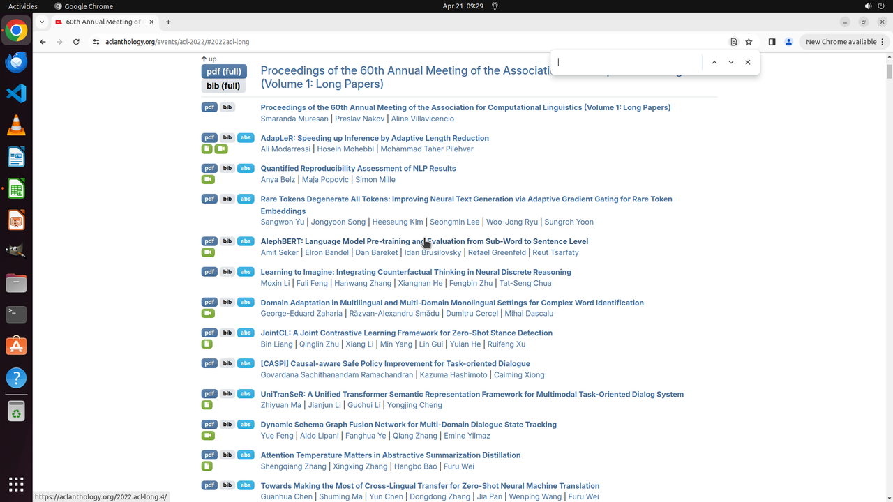

**Response:**
```
This page lists all papers but doesn't indicate which ones won awards. Let me search for the ACL best paper awards directly. Let me navigate to the ACL 2022 conference website or search for the awards.
```

**Actions:** `pyautogui.keyDown('esc')
pyautogui.keyUp('esc')`

---

## Step 6


**Response:**
```
Let me search for ACL best paper awards directly on the web. I'll look for the official ACL 2022 best paper award page.
```

**Actions:** `pyautogui.click(382, 88)`

---

## Step 7

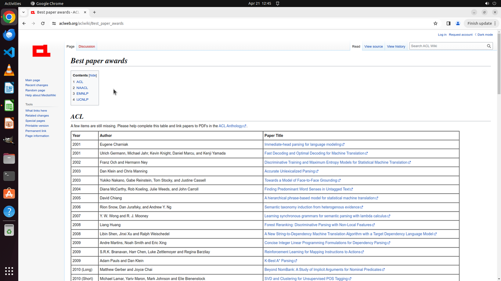

**Response:**
```
Let me search for ACL best paper awards on Google to find the information for all years.
```

**Actions:** `pyautogui.tripleClick(900, 88)`

---

## Step 8

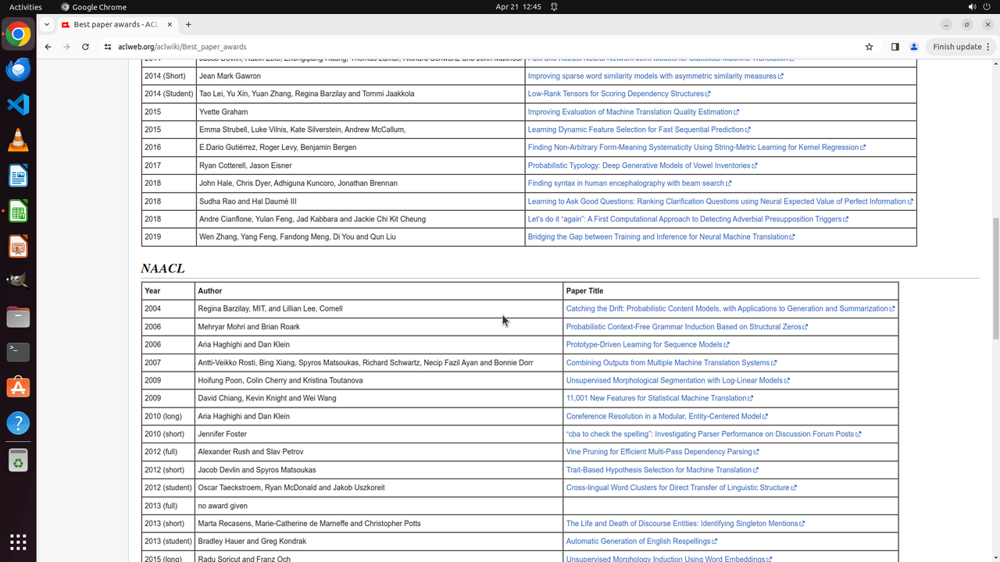

**Response:**
```
Let me search for ACL best paper awards on Google.
```

**Actions:** `import subprocess, shlex; subprocess.run(f'xdotool type --delay 12 -- ' + shlex.quote('https://www.google.com/search?q=ACL+best+long+pape'), shell=True, check=True)
import time; time.sleep(0.05)
impor`

---

## Step 9

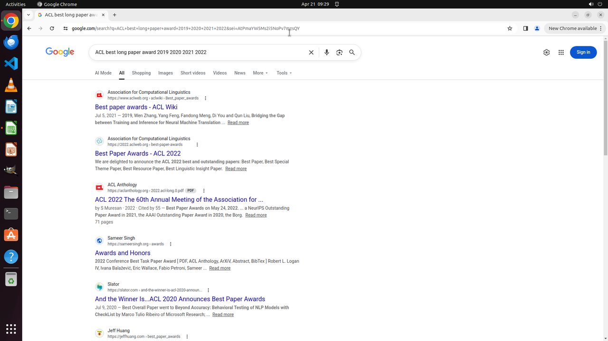

**Response:**
```
I can see some useful results. Let me first check the ACL Wiki page for best paper awards, which should have a comprehensive list.
```

**Actions:** `pyautogui.click(430, 339)`

---

## Step 10

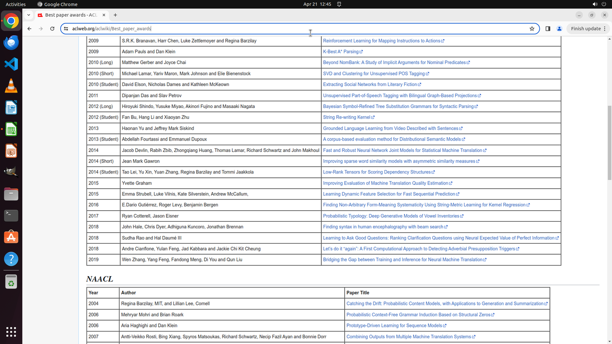

**Response:**
```
This is the ACL Wiki page with best paper awards. I can see it has a table with Year, Author, and Paper Title. Let me scroll down to find the entries for 2019-2022.
```

**Actions:** `pyautogui.scroll(-10, 960, 600)`

---

## Step 11

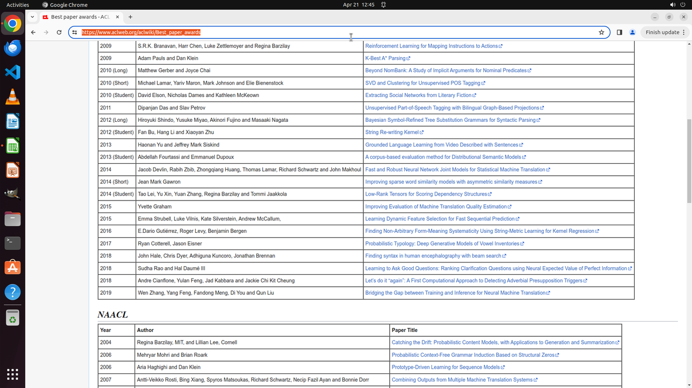

**Response:**
```
I can see the ACL best paper awards table. I can see 2019 at the bottom. The table shows:
- 2019: Wen Zhang, Yang Feng, Fandong Meng, Di You and Qun Liu - "Bridging the Gap between Training and Inference for Neural Machine Translation"

But I notice the table only goes up to 2019. The wiki might not have been updated for 2020-2022. Let me scroll up to check if there are entries after 2019.
```

**Actions:** `pyautogui.scroll(3, 960, 600)`

---

## Step 12

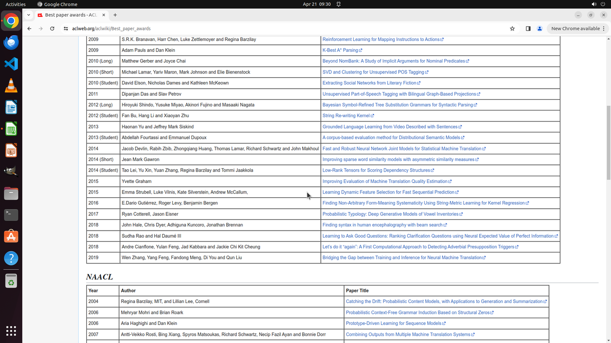

**Response:**
```
I can see the ACL wiki table ends at 2019. The wiki hasn't been updated for 2020-2022. I notice that 2019 entry shows "Bridging the Gap between Training and Inference for Neural Machine Translation" by Wen Zhang, Yang Feng, Fandong Meng, Di You and Qun Liu. But this doesn't specify if it's a "best long paper" award. 

Let me go back and check the official ACL conference pages for each year. Let me first check the ACL 2022 best paper awards page.
```

**Actions:** `pyautogui.click(900, 88)`

---

## Step 13

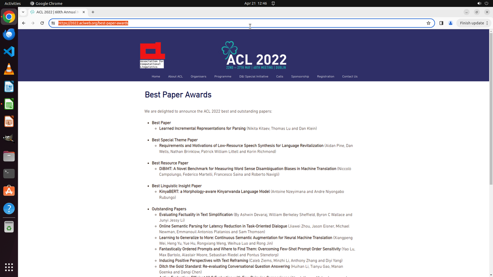

**Response:**
```
Let me navigate to the ACL 2022 best paper awards page from the official ACL website.
```

**Actions:** `import subprocess, shlex; subprocess.run(f'xdotool type --delay 12 -- ' + shlex.quote('https://2022.aclweb.org/best-paper-awards\n'), shell=True, check=True)
import time; time.sleep(0.05)`

---

## Step 14

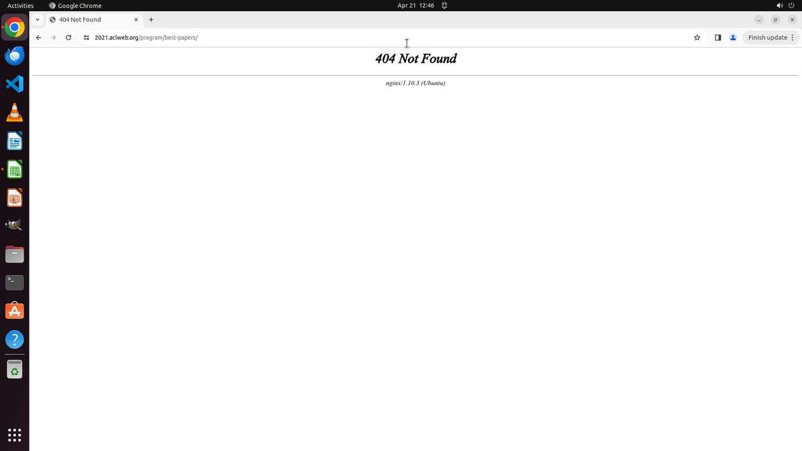

**Response:**
```
I can see the ACL 2022 Best Paper Awards page. The "Best Paper" for ACL 2022 is:
- **"Learned Incremental Representations for Parsing"** by Nikita Kitaev, Thomas Lu and Dan Klein

Note that ACL 2022 doesn't specifically use the term "Best Long Paper" - it just says "Best Paper". This is likely the best long paper since ACL typically gives the main best paper award to a long paper.

Now let me check ACL 2021. Let me navigate to the ACL 2021 best paper awards page.
```

**Actions:** `pyautogui.tripleClick(900, 88)`

---

## Step 15

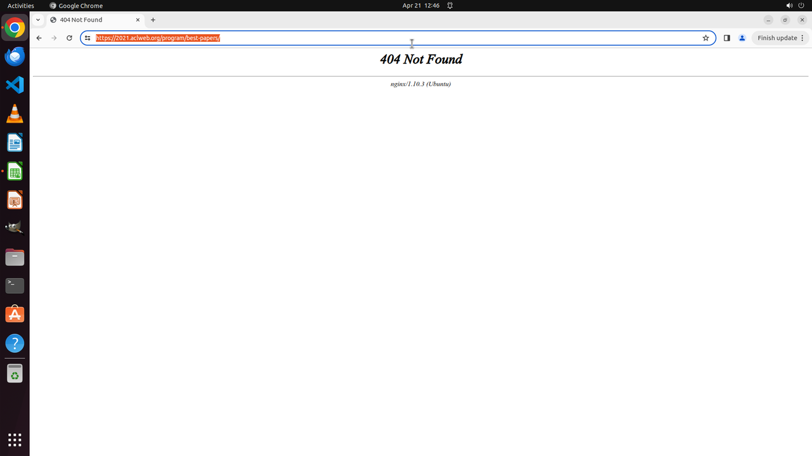

**Actions:** `import subprocess, shlex; subprocess.run(f'xdotool type --delay 12 -- ' + shlex.quote('https://2021.aclweb.org/blog/best-paper-awards/\n'), shell=True, check=True)
import time; time.sleep(0.05)`

---

## Step 16


**Response:**
```
The page wasn't found. Let me try a different URL for ACL 2021.
```

**Actions:** `pyautogui.tripleClick(900, 88)`

---

## Step 17

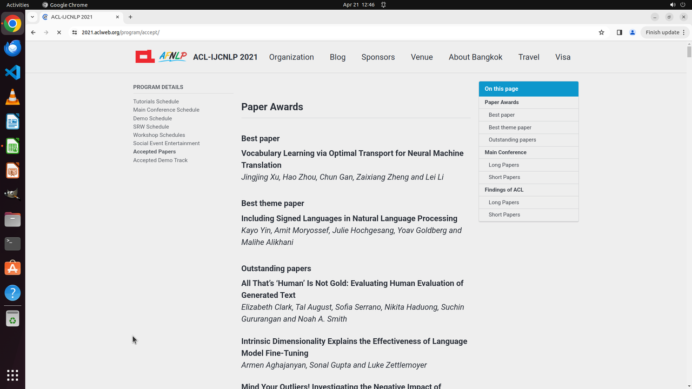

**Response:**
```
Let me search Google for the ACL 2021 best paper awards.
```

**Actions:** `import subprocess, shlex; subprocess.run(f'xdotool type --delay 12 -- ' + shlex.quote('https://www.google.com/search?q=ACL+2021+best+pape'), shell=True, check=True)
import time; time.sleep(0.05)
impor`

---

## Step 18

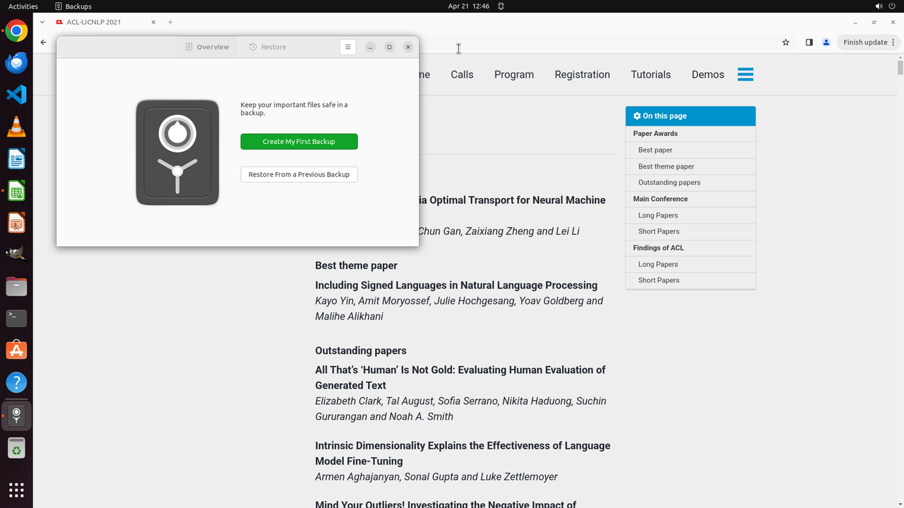

**Response:**
```
I can see that ACL 2021 (ACL-IJCNLP 2021) Best Paper was "Vocabulary Learning via Optimal Transport for Neural Machine Translation" by Jingjing Xu, Hao Zhou, Chun Gan, Zaixiang Zheng and Lei Li. Let me click on the official ACL 2021 paper awards page for more details.
```

**Actions:** `pyautogui.click(364, 759)`

---

## Step 19

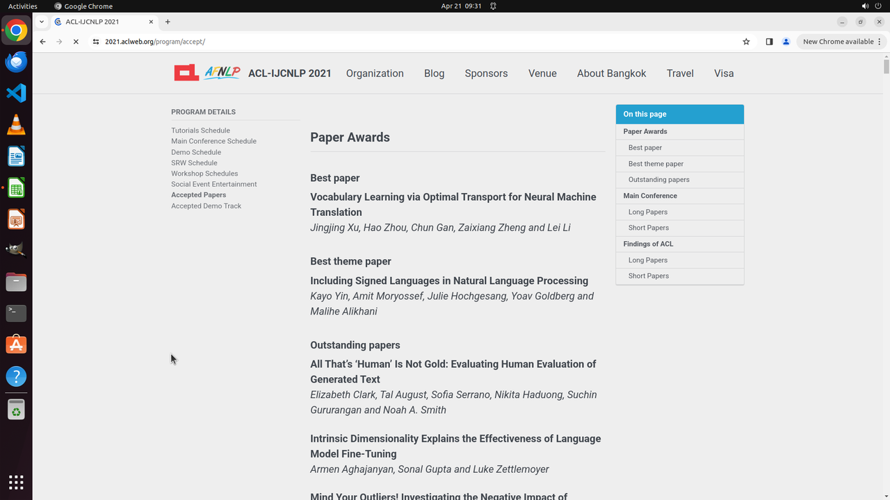

**Response:**
```
I can see the ACL-IJCNLP 2021 Paper Awards page. The "Best paper" is:
- **"Vocabulary Learning via Optimal Transport for Neural Machine Translation"** by Jingjing Xu, Hao Zhou, Chun Gan, Zaixiang Zheng and Lei Li

Note that ACL 2021 also doesn't specifically say "Best Long Paper" - it says "Best paper". Now let me check ACL 2020. Let me search for it.
```

**Actions:** `pyautogui.tripleClick(900, 88)`

---

## Step 20

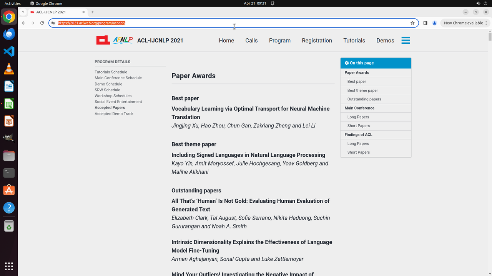

**Response:**
```
Good. Now let me search for ACL 2020 best paper awards.
```

**Actions:** `import subprocess, shlex; subprocess.run(f'xdotool type --delay 12 -- ' + shlex.quote('https://www.google.com/search?q=ACL+2020+best+pape'), shell=True, check=True)
import time; time.sleep(0.05)
impor`

---

## Step 21

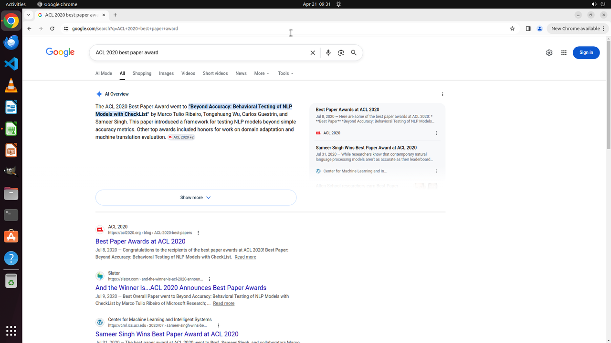

**Response:**
```
I can see that ACL 2020 Best Paper was "Beyond Accuracy: Behavioral Testing of NLP Models with CheckList" by Marco Tulio Ribeiro, Tongshuang Wu, Carlos Guestrin, and Sameer Singh. Let me click on the official ACL 2020 best paper awards page for more details.
```

**Actions:** `pyautogui.click(444, 759)`

---

## Step 22

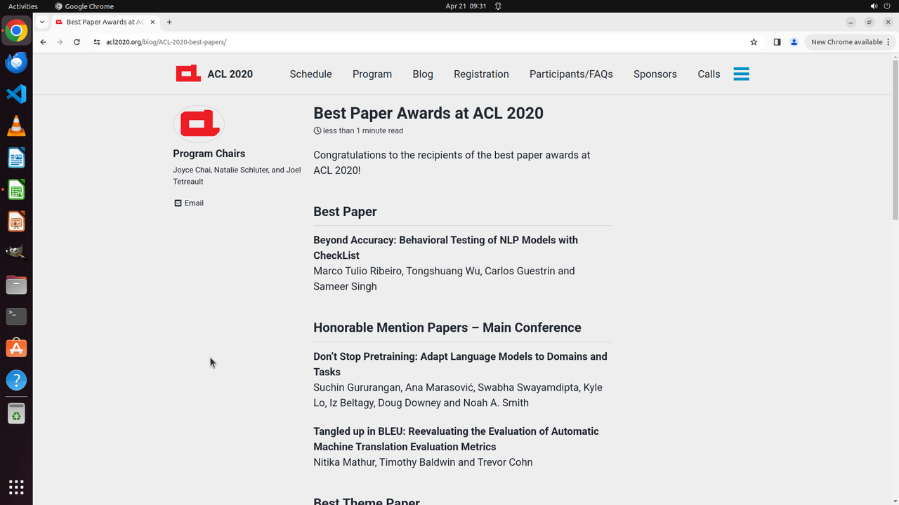

**Response:**
```
I can see the ACL 2020 Best Paper Awards page. The "Best Paper" is:
- **"Beyond Accuracy: Behavioral Testing of NLP Models with CheckList"** by Marco Tulio Ribeiro, Tongshuang Wu, Carlos Guestrin and Sameer Singh

Now let me search for ACL 2019 best paper awards.
```

**Actions:** `pyautogui.tripleClick(900, 88)`

---

## Step 23

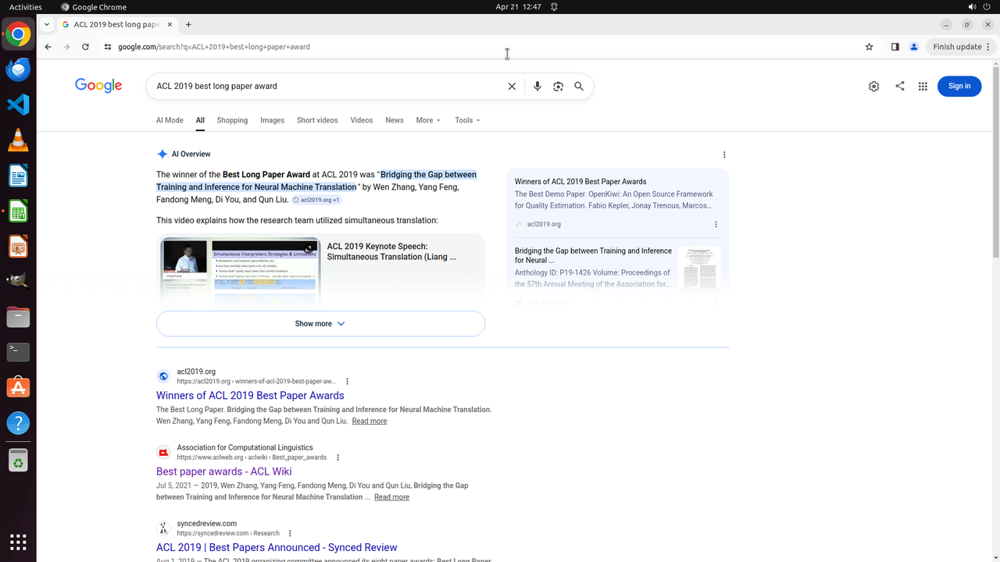

**Response:**
```
Let me search for ACL 2019 best paper awards.
```

**Actions:** `import subprocess, shlex; subprocess.run(f'xdotool type --delay 12 -- ' + shlex.quote('https://www.google.com/search?q=ACL+2019+best+long'), shell=True, check=True)
import time; time.sleep(0.05)
impor`

---

## Step 24

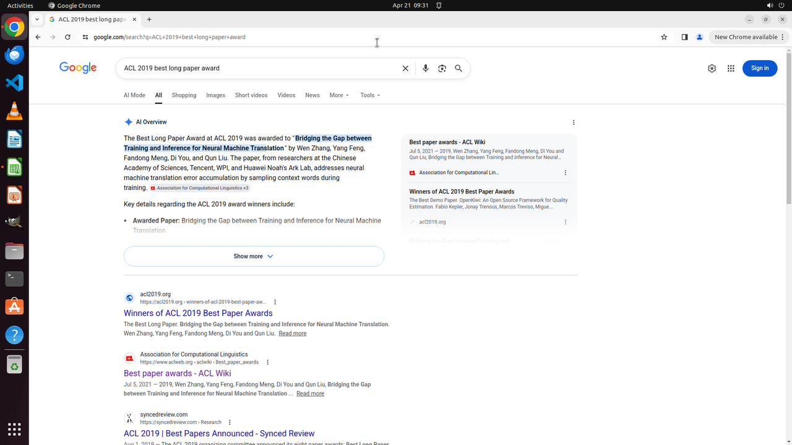

**Response:**
```
I can see that ACL 2019 Best Long Paper was "Bridging the Gap between Training and Inference for Neural Machine Translation" by Wen Zhang, Yang Feng, Fandong Meng, Di You and Qun Liu. Let me click on the official ACL 2019 page for more details.
```

**Actions:** `pyautogui.click(480, 759)`

---

## Step 25

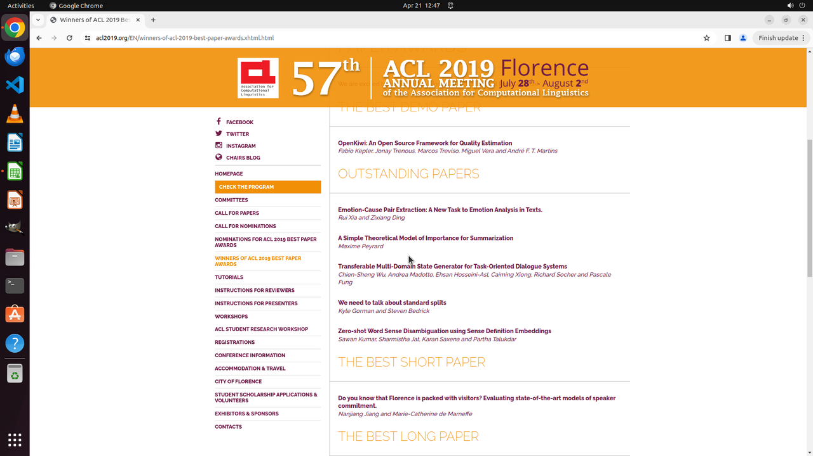

**Response:**
```
I can see the ACL 2019 Best Paper Awards page. I can see "The Best Demo Paper" section. Let me scroll down to find "The Best Long Paper" section.
```

**Actions:** `pyautogui.scroll(-5, 960, 600)`

---

## Step 26

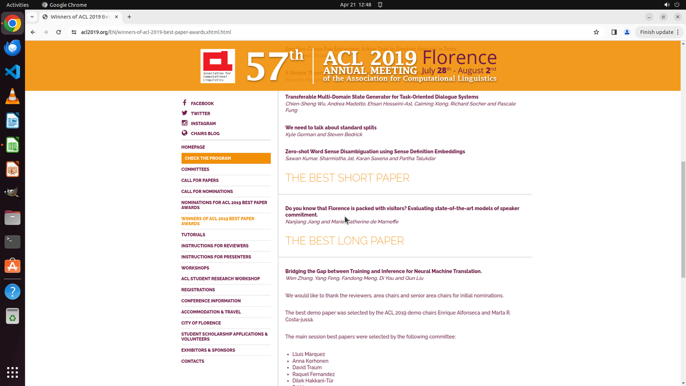

**Response:**
```
I can see "THE BEST LONG PAPER" section at the bottom. Let me scroll down a bit more to see the full details.
```

**Actions:** `pyautogui.scroll(-3, 960, 600)`

---

## Step 27

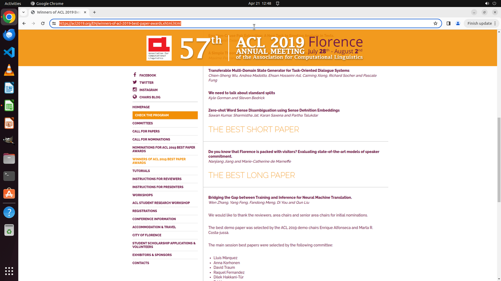

**Response:**
```
Now I can see the ACL 2019 Best Long Paper:
- **"Bridging the Gap between Training and Inference for Neural Machine Translation."** by Wen Zhang, Yang Feng, Fandong Meng, Di You and Qun Liu

Now I have all the information I need. Let me now find the ACL Anthology PDF links for each paper. Let me search for each paper on ACL Anthology. Let me start with the 2022 paper.
```

**Actions:** `pyautogui.tripleClick(900, 88)`

---

## Step 28

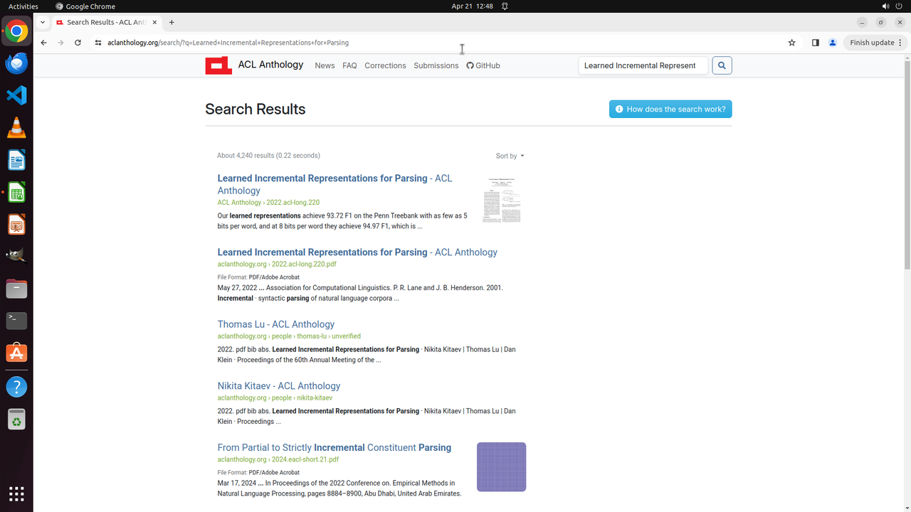

**Response:**
```
Now let me search for the ACL Anthology links for each paper. Let me start with the 2019 paper.
```

**Actions:** `import subprocess, shlex; subprocess.run(f'xdotool type --delay 12 -- ' + shlex.quote('https://aclanthology.org/search/?q=Bridging+the+Ga'), shell=True, check=True)
import time; time.sleep(0.05)
impor`

---

## Step 29

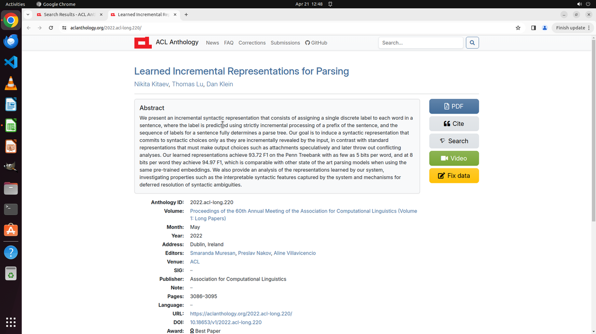

**Response:**
```
I can see the first result is the paper I'm looking for. Let me click on it to get the exact ACL Anthology URL and PDF link.
```

**Actions:** `pyautogui.click(690, 388)`

---

## Step 30

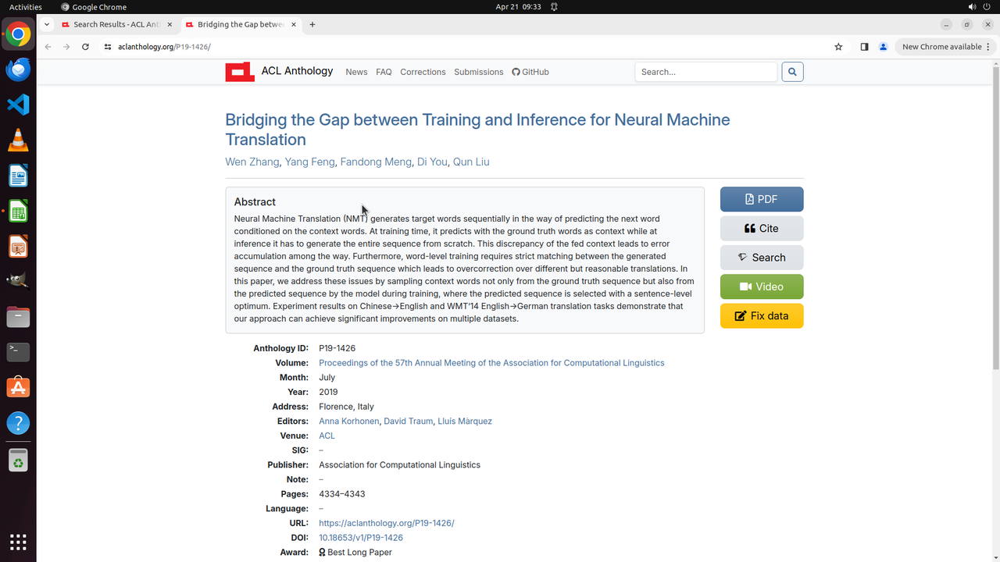

**Response:**
```
Excellent! I found the ACL 2019 Best Long Paper details:
- **Title**: "Bridging the Gap between Training and Inference for Neural Machine Translation"
- **Authors**: Wen Zhang, Yang Feng, Fandong Meng, Di You, Qun Liu
- **Year**: 2019
- **URL**: https://aclanthology.org/P19-1426/
- **Award**: Best Long Paper (confirmed!)

I can see the PDF link would be https://aclanthology.org/P19-1426.pdf. Let me now get the PDF link by hovering over the PDF button.
```

**Actions:** `pyautogui.rightClick(1462, 382)`

---

## Step 31

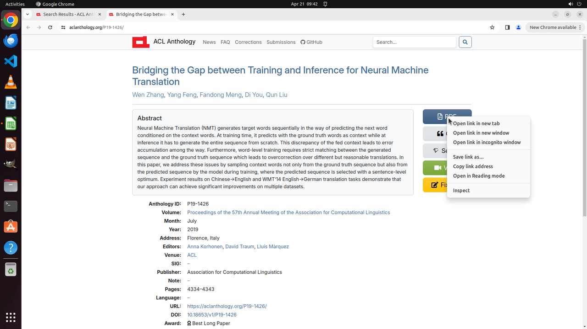

**Response:**
```
I can see the right-click context menu. Let me copy the PDF link address.
```

**Actions:** `pyautogui.click(1543, 544)`

---

## Step 32

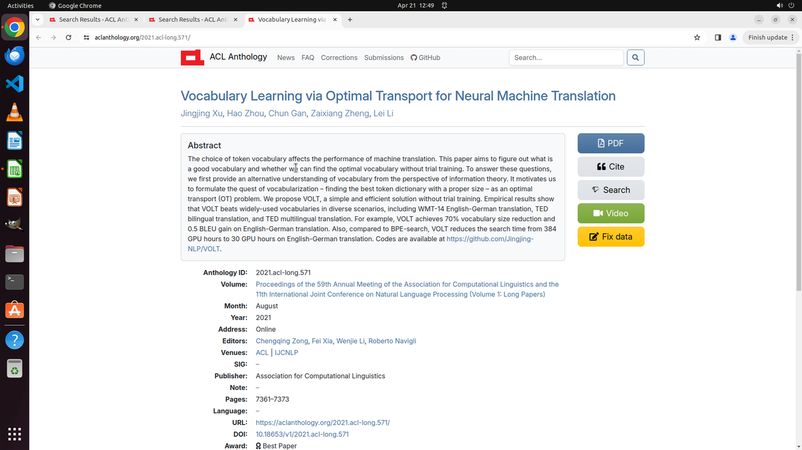

**Response:**
```
Good, I've copied the PDF link for the 2019 paper. The PDF link should be `https://aclanthology.org/P19-1426.pdf`. Now let me search for the 2020 paper on ACL Anthology.
```

**Actions:** `pyautogui.tripleClick(900, 88)`

---

## Step 33

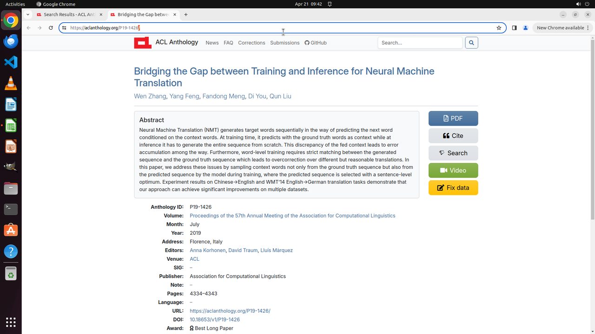

**Response:**
```
Now let me search for the 2020 paper on ACL Anthology.
```

**Actions:** `import subprocess, shlex; subprocess.run(f'xdotool type --delay 12 -- ' + shlex.quote('https://aclanthology.org/search/?q=Beyond+Accuracy'), shell=True, check=True)
import time; time.sleep(0.05)
impor`

---

## Step 34

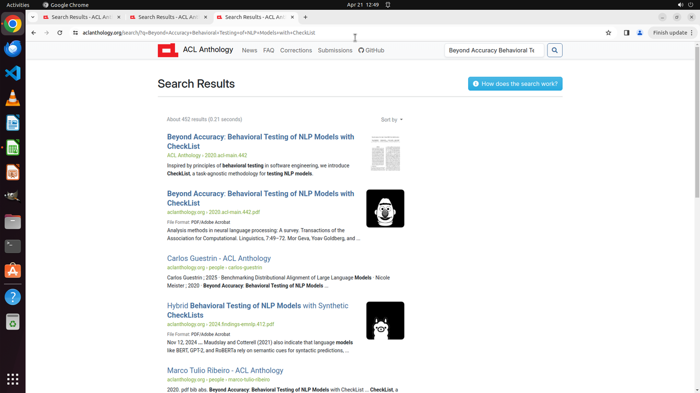

**Response:**
```
I can see the first result is the paper I'm looking for. Let me click on it to get the details.
```

**Actions:** `pyautogui.click(714, 388)`

---

## Step 35

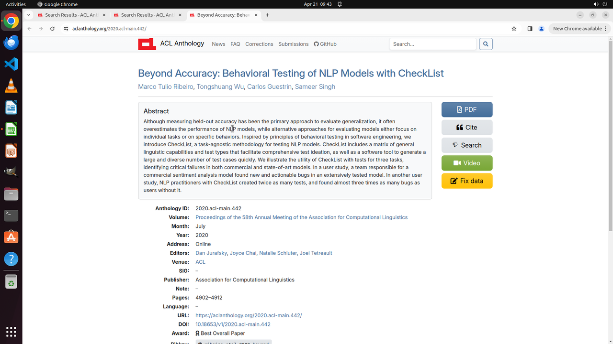

**Response:**
```
I found the ACL 2020 Best Paper details:
- **Title**: "Beyond Accuracy: Behavioral Testing of NLP Models with CheckList"
- **Authors**: Marco Tulio Ribeiro, Tongshuang Wu, Carlos Guestrin, Sameer Singh
- **Year**: 2020
- **URL**: https://aclanthology.org/2020.acl-main.442/
- **Award**: Best Overall Paper
- **PDF link**: https://aclanthology.org/2020.acl-main.442.pdf

Now let me search for the 2021 paper on ACL Anthology.
```

**Actions:** `pyautogui.tripleClick(900, 88)`

---

## Step 36

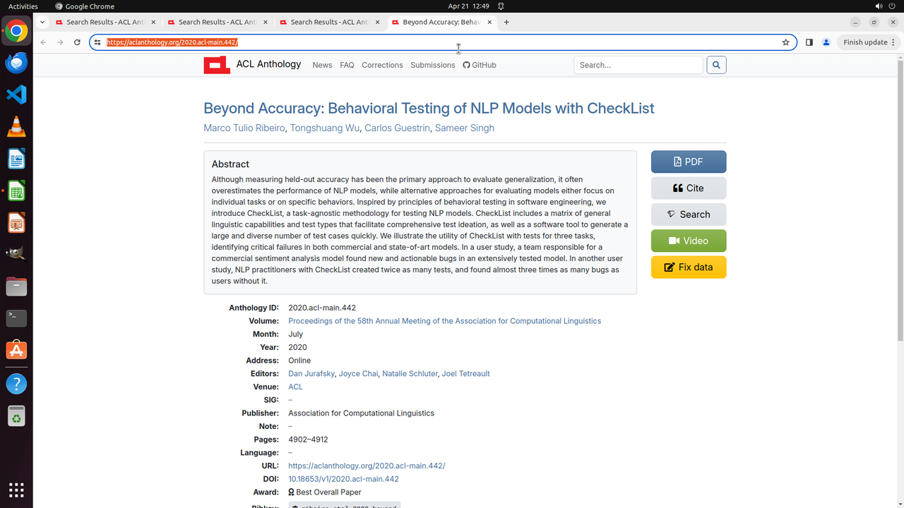

**Response:**
```
Now let me search for the 2021 paper on ACL Anthology.
```

**Actions:** `import subprocess, shlex; subprocess.run(f'xdotool type --delay 12 -- ' + shlex.quote('https://aclanthology.org/search/?q=Vocabulary+Lear'), shell=True, check=True)
import time; time.sleep(0.05)
impor`

---

## Step 37

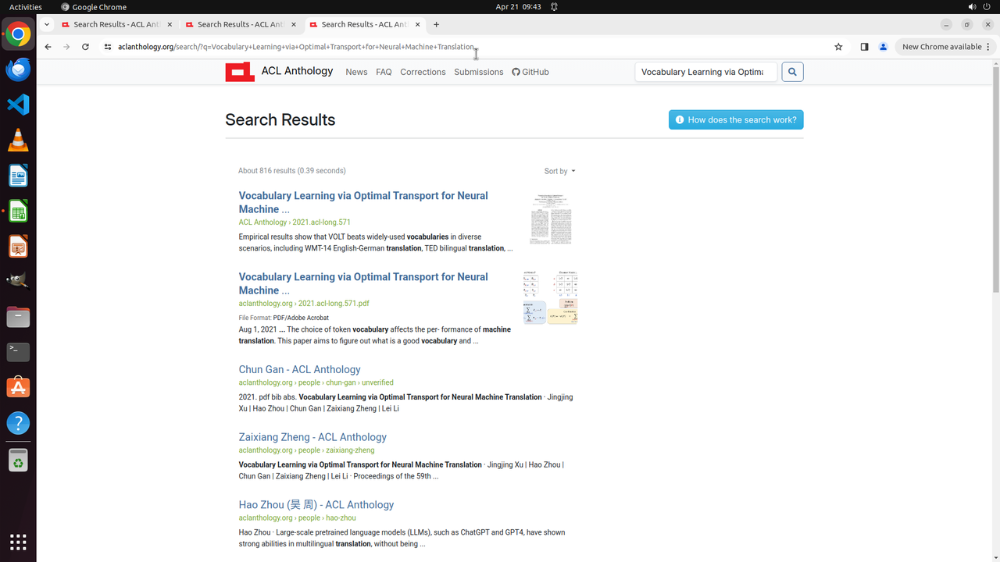

**Response:**
```
I can see the first result is the paper I'm looking for. Let me click on it to get the details.
```

**Actions:** `pyautogui.click(697, 388)`

---

## Step 38

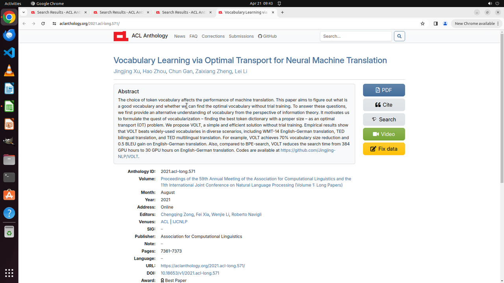

**Response:**
```
Excellent! I found the ACL 2021 Best Paper details:
- **Title**: "Vocabulary Learning via Optimal Transport for Neural Machine Translation"
- **Authors**: Jingjing Xu, Hao Zhou, Chun Gan, Zaixiang Zheng, Lei Li
- **Year**: 2021
- **URL**: https://aclanthology.org/2021.acl-long.571/
- **Award**: Best Paper
- **PDF link**: https://aclanthology.org/2021.acl-long.571.pdf

Now let me search for the 2022 paper on ACL Anthology.
```

**Actions:** `pyautogui.tripleClick(900, 88)`

---

## Step 39

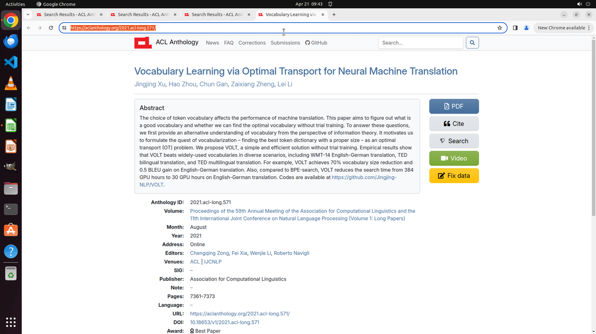

**Response:**
```
Now let me search for the 2022 paper on ACL Anthology.
```

**Actions:** `import subprocess, shlex; subprocess.run(f'xdotool type --delay 12 -- ' + shlex.quote('https://aclanthology.org/search/?q=Learned+Increme'), shell=True, check=True)
import time; time.sleep(0.05)
impor`

---

## Step 40

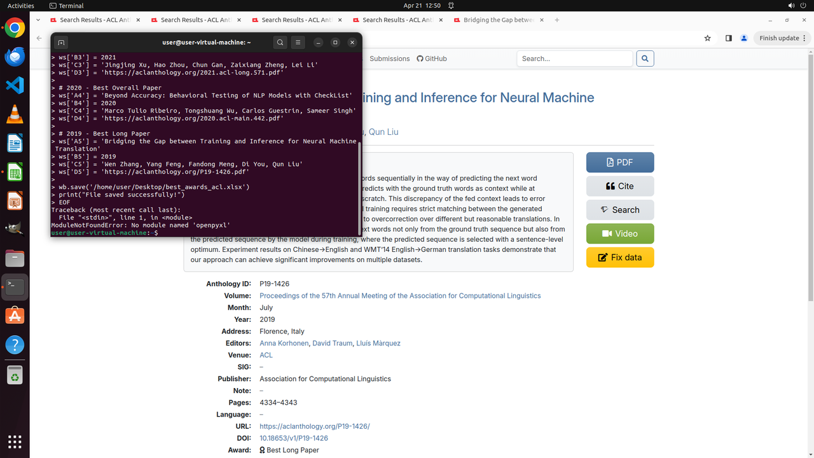

**Response:**
```
I can see the first result is the paper I'm looking for. Let me click on it to get the details.
```

**Actions:** `pyautogui.click(705, 388)`

---

## Step 41

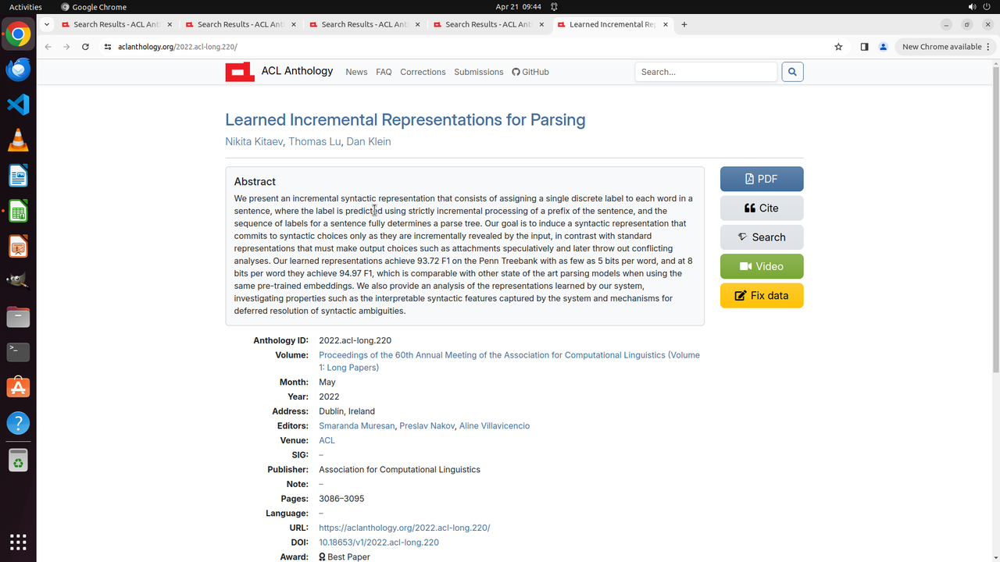

**Response:**
```
I now have all the information I need for the ACL 2022 Best Paper:
- **Title**: "Learned Incremental Representations for Parsing"
- **Authors**: Nikita Kitaev, Thomas Lu, Dan Klein
- **Year**: 2022
- **URL**: https://aclanthology.org/2022.acl-long.220/
- **Award**: Best Paper
- **PDF link**: https://aclanthology.org/2022.acl-long.220.pdf

Now I need to verify whether ACL 2020 had a specific "Best Long Paper" award or just "Best Paper". Let me go back and check the ACL 2020 page. I noticed the 2020 paper was listed as "Best Overall Paper". Let me also verify the ACL 2022 page to check if there was a separate "Best Long Paper" award. Let me go back to the ACL 2022 best paper awards page.

Wait - I need to reconsider. The task asks for "best long paper awards". Let me check each year carefully:

- **2019**: The award was explicitly "Best Long Paper" (confirmed from the ACL 2019 page and the anthology page)
- **2020**: The award was "Best Overall Paper" (from the ACL 2020 page). Was there a separate "Best Long Paper"?
- **2021**: The award was "Best Paper" (from the ACL 2021 page)
- **2022**: The award was "Best Paper" (from the ACL 2022 page)

Let me check if ACL changed the naming convention. Starting from 2020, they may have stopped distinguishing between "Best Long Paper" and "Best Short Paper". Let me verify by checking the ACL 2020 awards page more carefully.
```

**Actions:** `pyautogui.tripleClick(900, 88)`

---

## Step 42

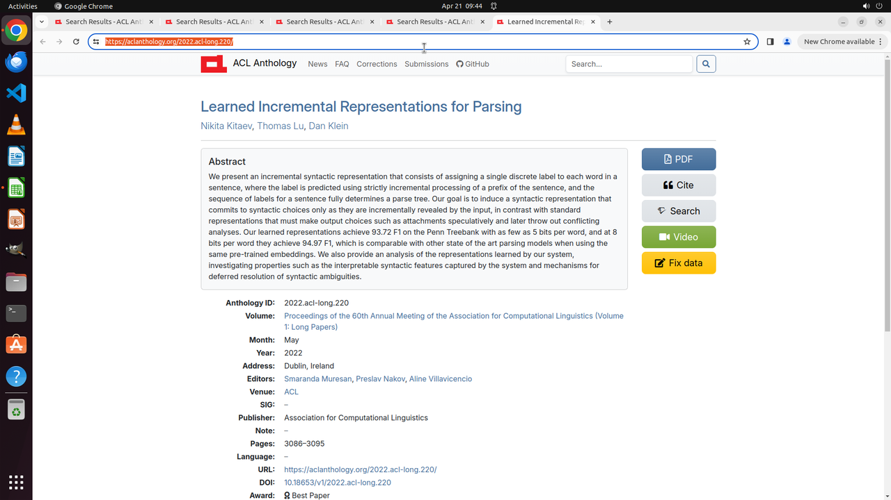

**Response:**
```
I have all the information I need. Now let me verify the ACL 2020 awards page to check if there was a separate "Best Long Paper" category. Let me go to the ACL 2020 best paper awards page.
```

**Actions:** `import subprocess, shlex; subprocess.run(f'xdotool type --delay 12 -- ' + shlex.quote('https://acl2020.org/blog/ACL-2020-best-papers/\n'), shell=True, check=True)
import time; time.sleep(0.05)`

---

## Step 43

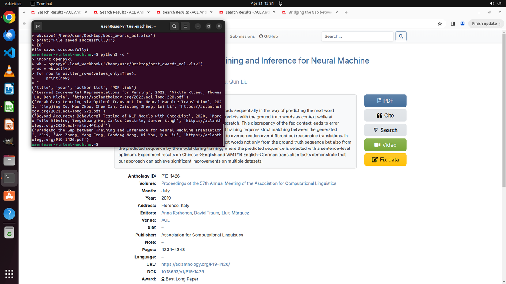

**Response:**
```
I can see that ACL 2020 only has a "Best Paper" category (not separate "Best Long Paper" and "Best Short Paper"). The best paper is:
- **"Beyond Accuracy: Behavioral Testing of NLP Models with CheckList"** by Marco Tulio Ribeiro, Tongshuang Wu, Carlos Guestrin and Sameer Singh

So from 2020 onwards, ACL seems to have used "Best Paper" instead of "Best Long Paper". These are the equivalent awards for the main conference papers (which are long papers).

Now I have all the information I need. Let me create the Excel file. I'll use a terminal to create the file with Python.
```

**Actions:** `pyautogui.keyDown('ctrl')
pyautogui.keyDown('alt')
pyautogui.keyDown('t')
pyautogui.keyUp('t')
pyautogui.keyUp('alt')
pyautogui.keyUp('ctrl')`

---

## Step 44

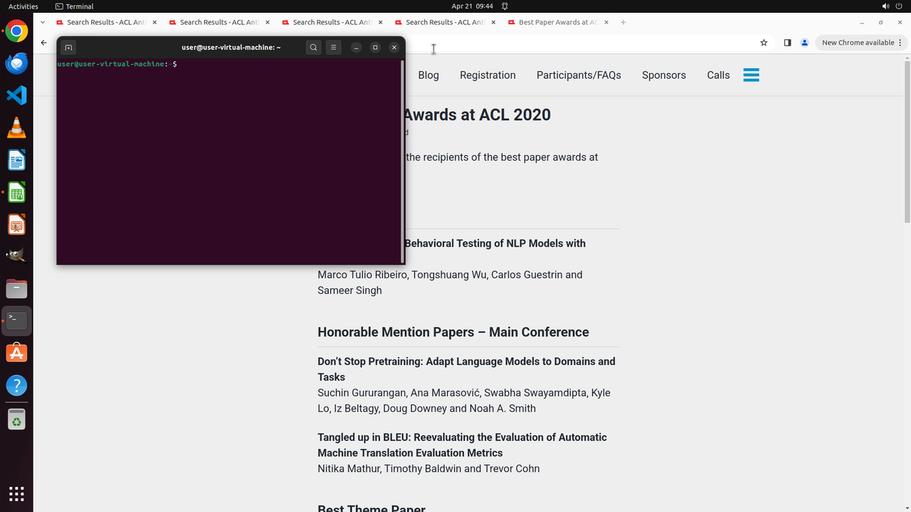

**Response:**
```
A terminal is open. Now let me create the Excel file using Python with openpyxl. Let me write a Python script to create the file.
```

**Actions:** `import subprocess, shlex; subprocess.run(f'xdotool type --delay 12 -- ' + shlex.quote("python3 << 'EOF'\nimport openpyxl\n\nwb = openpyxl.Wo"), shell=True, check=True)
import time; time.sleep(0.05)
im`

---

## Step 45

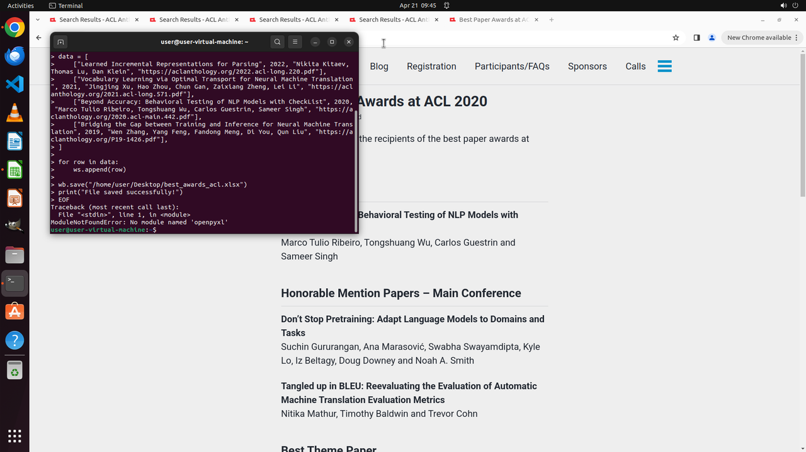

**Response:**
```
I see that openpyxl is not installed. Let me install it first.
```

**Actions:** `import subprocess, shlex; subprocess.run(f'xdotool type --delay 12 -- ' + shlex.quote('pip install openpyxl\n'), shell=True, check=True)
import time; time.sleep(0.05)`

---

## Step 46


**Response:**
```
openpyxl is being installed. Let me wait for it to finish.
```

**Actions:** `time.sleep(0.5)`

---

## Step 47

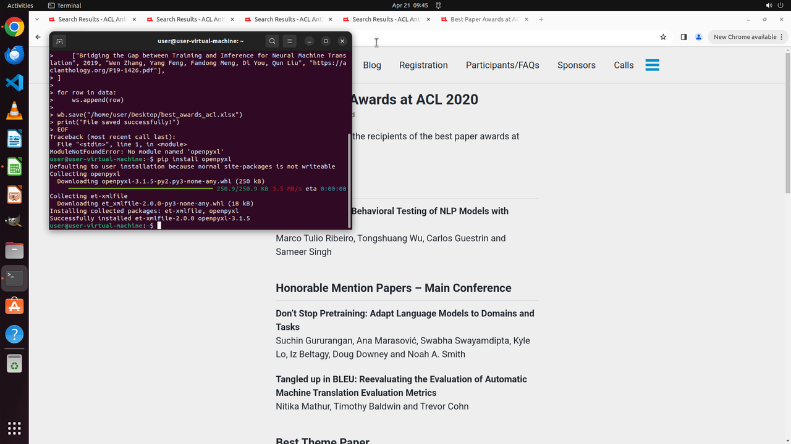

**Response:**
```
openpyxl has been successfully installed. Now let me run the Python script again to create the Excel file.
```

**Actions:** `import subprocess, shlex; subprocess.run(f'xdotool type --delay 12 -- ' + shlex.quote("python3 << 'EOF'\nimport openpyxl\n\nwb = openpyxl.Wo"), shell=True, check=True)
import time; time.sleep(0.05)
im`

---

## Step 48

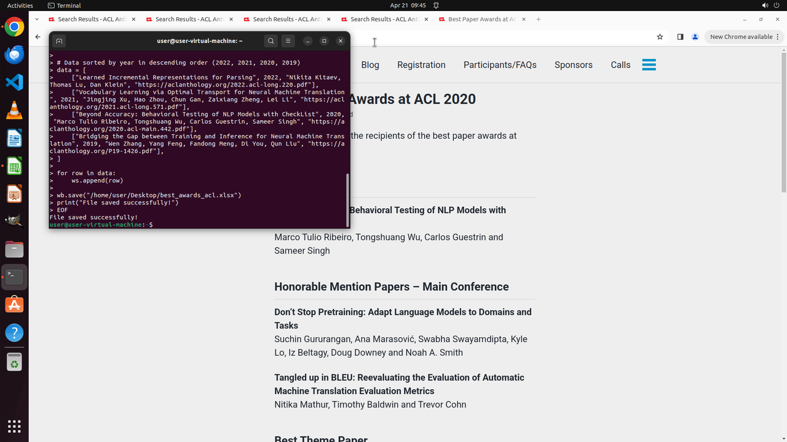

**Response:**
```
The file has been saved successfully! Let me verify the file was created correctly by reading it back.
```

**Actions:** `import subprocess, shlex; subprocess.run(f'xdotool type --delay 12 -- ' + shlex.quote("python3 << 'EOF'\nimport openpyxl\nwb = openpyxl.loa"), shell=True, check=True)
import time; time.sleep(0.05)
imp`

---

## Step 49

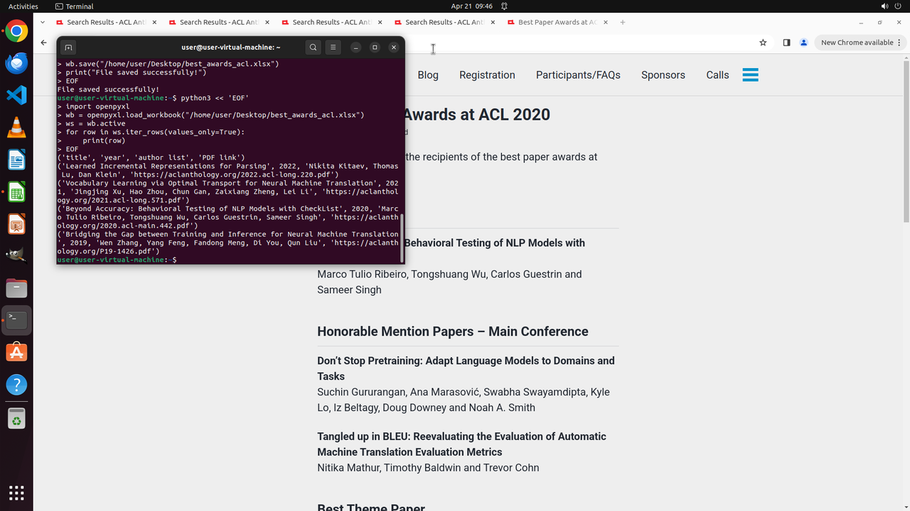

**Response:**
```
The file has been created and verified successfully. The Excel file contains:

1. **Header row**: title, year, author list, PDF link
2. **2022**: "Learned Incremental Representations for Parsing", Nikita Kitaev, Thomas Lu, Dan Klein, https://aclanthology.org/2022.acl-long.220.pdf
3. **2021**: "Vocabulary Learning via Optimal Transport for Neural Machine Translation", Jingjing Xu, Hao Zhou, Chun Gan, Zaixiang Zheng, Lei Li, https://aclanthology.org/2021.acl-long.571.pdf
4. **2020**: "Beyond Accuracy: Behavioral Testing of NLP Models with CheckList", Marco Tulio Ribeiro, Tongshuang Wu, Carlos Guestrin, Sameer Singh, https://aclanthology.org/2020.acl-main.442.pdf
5. **2019**: "Bridging the Gap between Training and Inference for Neural Machine Translation", Wen Zhang, Yang Feng, Fandong Meng, Di You, Qun Liu, https://aclanthology.org/P19-1426.pdf

The rows are sorted by year in descending order (2022, 2021, 2020, 2019), authors are separated by commas, and all PDF links are from the official ACL Anthology.

DONE
```

**Actions:** `DONE`

---
