# Task 69acbb55-d945-4927-a87b-8480e1a5bb7e

**Instruction:** I'm working on word embedding tasks and require assistance in configuring the environment for the project located at "https://github.com/xlang-ai/instructor-embedding" in the directory /home/user. Please guide me through the process, and refer to this provided Colab script at https://colab.research.google.com/drive/1P7ivNLMosHyG7XOHmoh7CoqpXryKy3Qt?usp=sharing for reference.

**Score:** 1.0

**Wall clock:** 9m 48s

**Steps:** 41

**Cost:** $1.38

---

## Step 1


**Response:**
```
I need to first check the Colab script to understand what setup steps are required, and also look at the GitHub repository. Let me start by visiting both URLs.
```

**Actions:** `pyautogui.click(990, 88)`

---

## Step 2


**Actions:** `import subprocess, shlex; subprocess.run(f'xdotool type --delay 12 -- ' + shlex.quote('https://colab.research.google.com/drive/1P7ivNLMos'), shell=True, check=True)
import time; time.sleep(0.05)
impor`

---

## Step 3

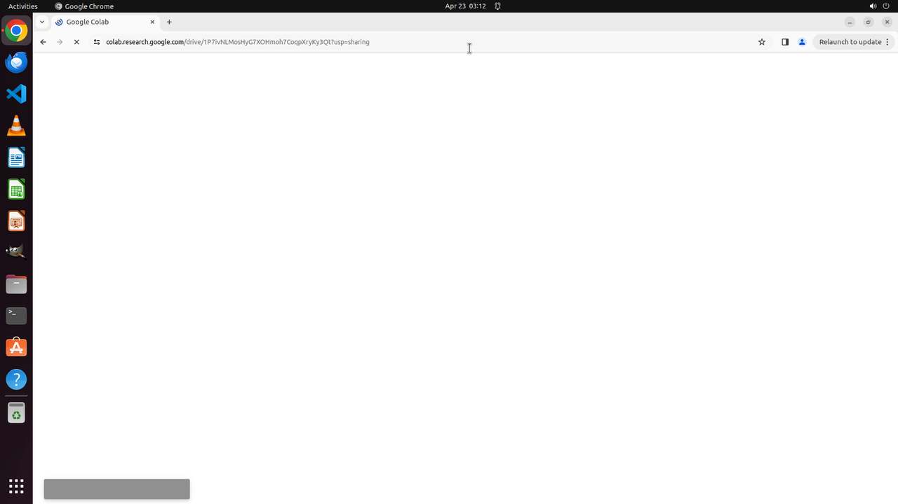

**Response:**
```
The Colab page is loading. Let me wait for it to fully load.
```

**Actions:** `time.sleep(0.5)`

---

## Step 4

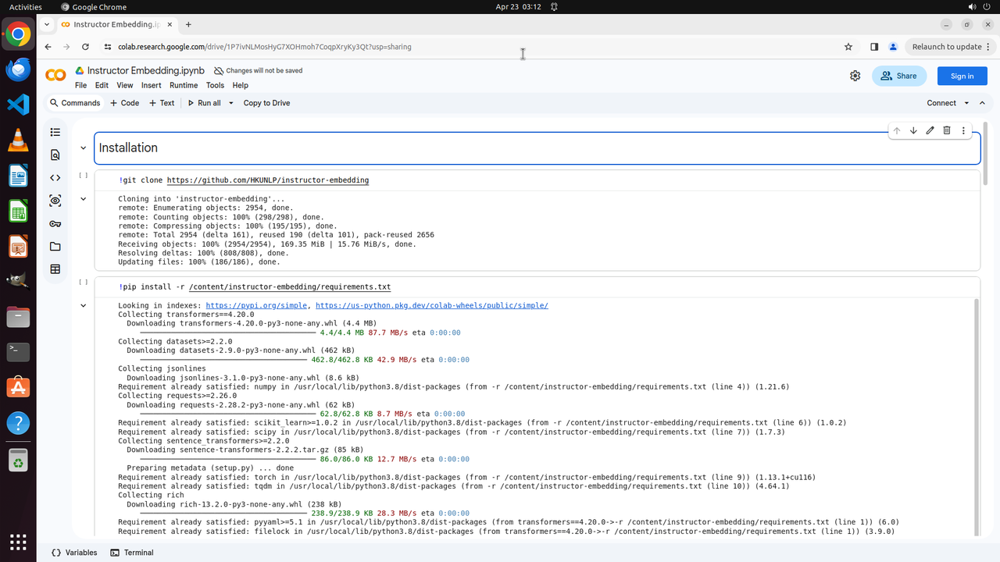

**Response:**
```
I can see the Colab notebook. It shows the installation steps:

1. `!git clone https://github.com/HKUNLP/instructor-embedding` 
2. `!pip install -r /content/instructor-embedding/requirements.txt`

Let me scroll down to see if there are more steps.
```

**Actions:** `pyautogui.scroll(-5, 960, 600)`

---

## Step 5

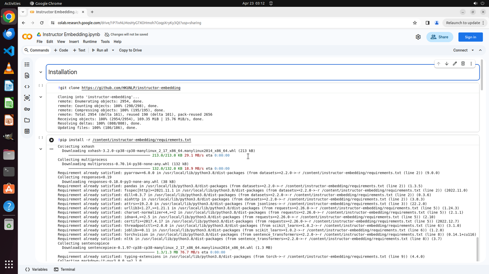

**Response:**
```
I can see the Colab notebook has two main installation steps:
1. `!git clone https://github.com/HKUNLP/instructor-embedding`
2. `!pip install -r /content/instructor-embedding/requirements.txt`

Let me scroll down more to see if there are additional steps after the pip install.
```

**Actions:** `pyautogui.scroll(-10, 960, 600)`

---

## Step 6

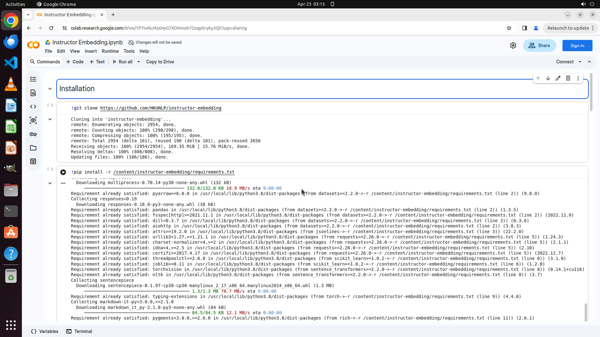

**Response:**
```
Let me continue scrolling down to see all the steps in the notebook.
```

**Actions:** `pyautogui.scroll(-15, 960, 600)`

---

## Step 7

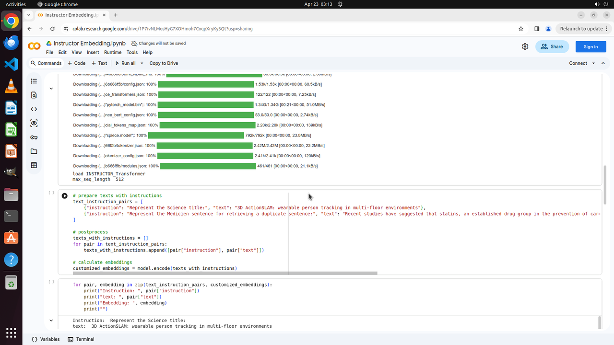

**Response:**
```
I can see there's more content. Let me scroll up a bit to see the code that loads the model, which appears to be between the pip install and the current view.
```

**Actions:** `pyautogui.scroll(5, 960, 600)`

---

## Step 8

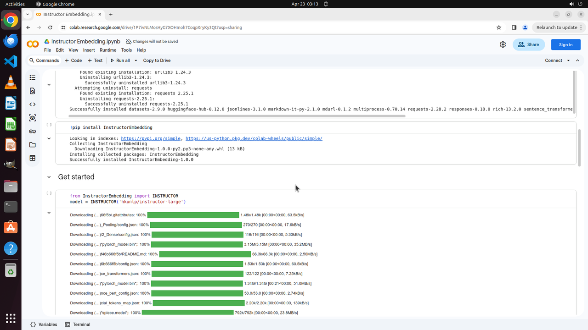

**Response:**
```
Now I can see the full picture. The Colab notebook has these steps:

1. **Installation section:**
   - `!git clone https://github.com/HKUNLP/instructor-embedding`
   - `!pip install -r /content/instructor-embedding/requirements.txt`
   - `!pip install InstructorEmbedding`

2. **Get started section:**
   - `from InstructorEmbedding import INSTRUCTOR`
   - `model = INSTRUCTOR('hkunlp/instructor-large')`

Now I need to note that the GitHub URL in the task is `https://github.com/xlang-ai/instructor-embedding` but the Colab uses `https://github.com/HKUNLP/instructor-embedding`. The task says the project is at `xlang-ai/instructor-embedding`. Let me now open a terminal and perform the setup steps. The directory should be `/home/user`.
```

**Actions:** `pyautogui.click(33, 673)`

---

## Step 9


**Response:**
```
A terminal is open. Now I'll follow the steps from the Colab notebook. First, let me clone the repository. The task mentions `https://github.com/xlang-ai/instructor-embedding` as the project URL, so I'll use that.
```

**Actions:** `import subprocess, shlex; subprocess.run(f'xdotool type --delay 12 -- ' + shlex.quote('cd /home/user && git clone https://github.com/xlan'), shell=True, check=True)
import time; time.sleep(0.05)
impor`

---

## Step 10

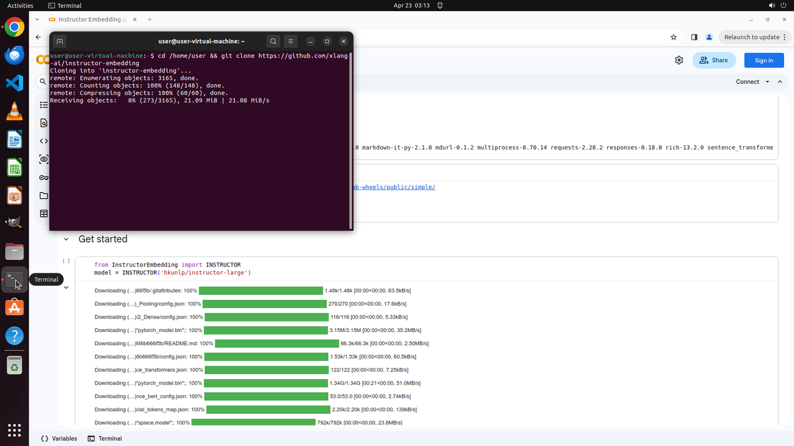

**Response:**
```
The repository is being cloned. Let me wait for it to complete.
```

**Actions:** `time.sleep(0.5)`

---

## Step 11


**Response:**
```
The git clone is complete. Now I need to install the requirements from the requirements.txt file. According to the Colab, the next step is `pip install -r /content/instructor-embedding/requirements.txt`. In our case, the path would be `/home/user/instructor-embedding/requirements.txt`.
```

**Actions:** `time.sleep(0.5)`

---

## Step 12

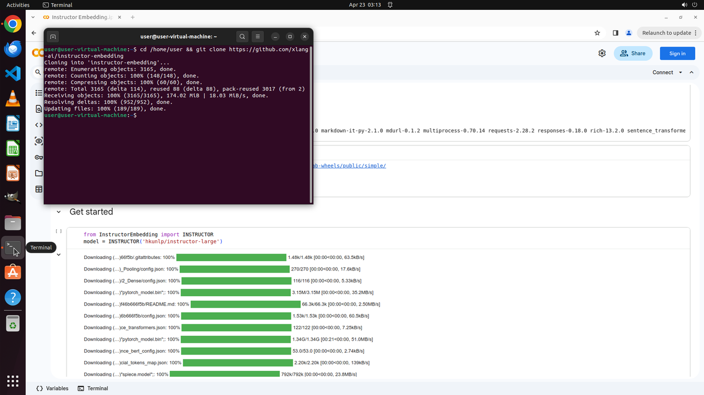

**Response:**
```
The clone is complete. Now let me install the requirements:
```

**Actions:** `import subprocess, shlex; subprocess.run(f'xdotool type --delay 12 -- ' + shlex.quote('pip install -r /home/user/instructor-embedding/req'), shell=True, check=True)
import time; time.sleep(0.05)
impor`

---

## Step 13


**Response:**
```
The pip install is running. It says "Defaulting to user installation because normal site-packages is not writeable". Let me wait for it to complete.
```

**Actions:** `time.sleep(0.5)`

---

## Step 14


**Response:**
```
The pip install is still in progress, downloading packages including torch (530 MB). Let me wait more for it to complete.
```

**Actions:** `time.sleep(0.5)`

---

## Step 15

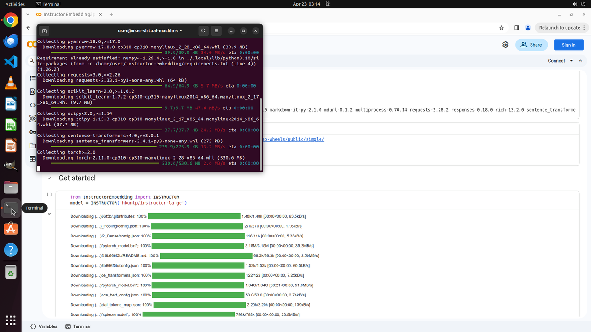

**Response:**
```
The installation is still in progress. It's downloading torch (530.6 MB). Let me wait more.
```

**Actions:** `time.sleep(0.5)`

---

## Step 16


**Response:**
```
The installation is still running, downloading more packages including nvidia-nccl-cu13. Let me wait more for it to complete.
```

**Actions:** `time.sleep(0.5)`

---

## Step 17

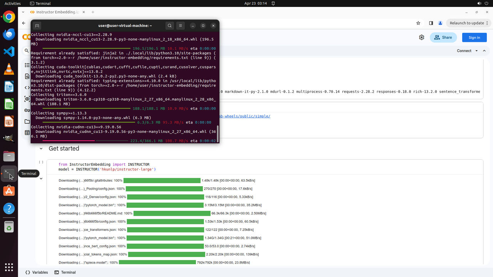

**Response:**
```
Still downloading packages (nvidia-cudnn-cu13, triton, sympy, etc.). Let me wait more.
```

**Actions:** `time.sleep(0.5)`

---

## Step 18

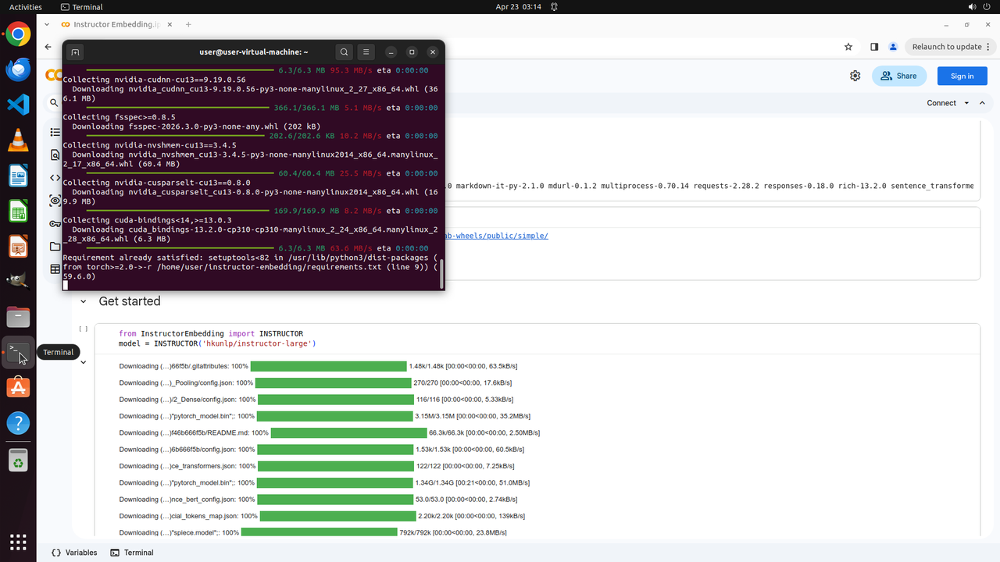

**Response:**
```
Still downloading CUDA-related packages. Let me wait more.
```

**Actions:** `time.sleep(0.5)`

---

## Step 19


**Response:**
```
Still downloading CUDA packages. Let me wait more for the installation to complete.
```

**Actions:** `time.sleep(0.5)`

---

## Step 20

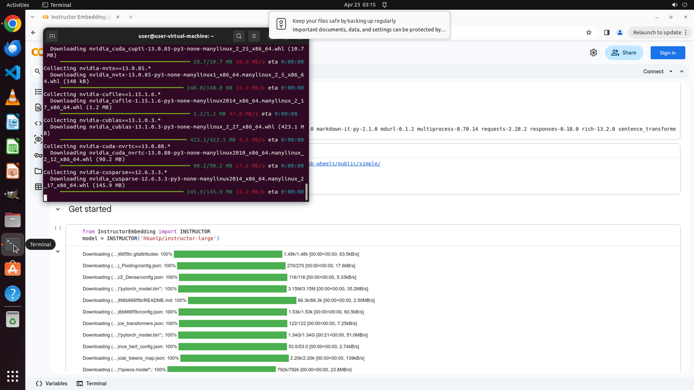

**Response:**
```
Still downloading CUDA packages. Let me wait more.
```

**Actions:** `time.sleep(0.5)`

---

## Step 21

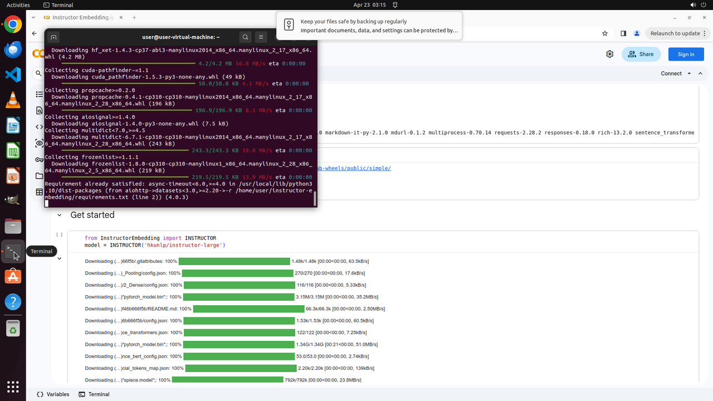

**Response:**
```
The installation is progressing well. It's now downloading additional dependencies. Let me wait more for it to finish.
```

**Actions:** `time.sleep(0.5)`

---

## Step 22


**Response:**
```
I can see it's now "Installing collected packages" which means the downloads are complete and it's installing everything. Let me wait for the installation to finish.
```

**Actions:** `time.sleep(0.5)`

---

## Step 23


**Response:**
```
The installation seems to still be in progress (installing collected packages). Let me wait more.
```

**Actions:** `time.sleep(0.5)`

---

## Step 24

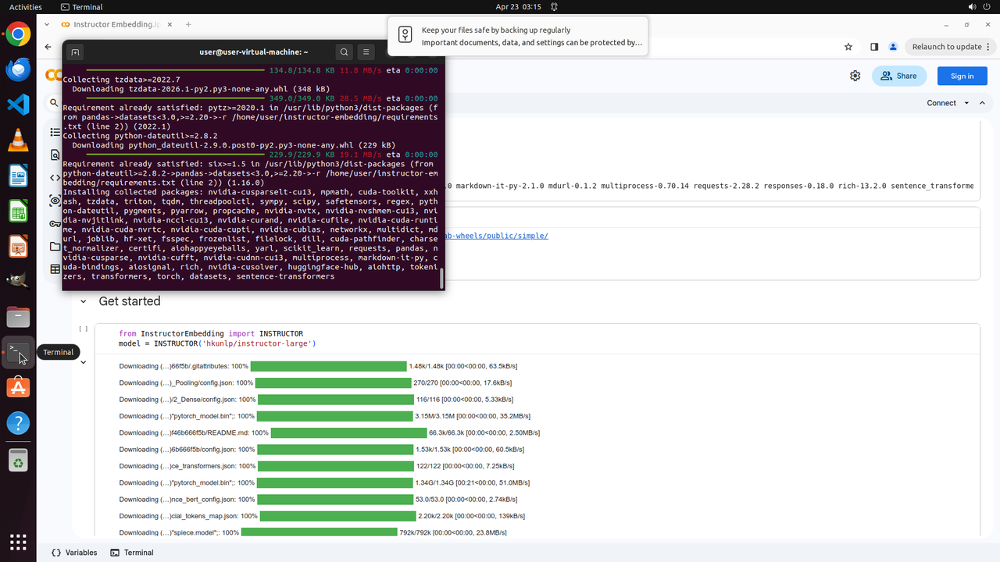

**Response:**
```
The installation is still running. It's installing many packages. Let me wait more.
```

**Actions:** `time.sleep(0.5)`

---

## Step 25


**Response:**
```
The installation is still running. It's installing the collected packages which includes many large packages like torch, transformers, etc. Let me wait more.
```

**Actions:** `time.sleep(0.5)`

---

## Step 26


**Response:**
```
The installation seems to be taking a while with the "Installing collected packages" step. This is normal for large packages like torch. Let me wait more.
```

**Actions:** `time.sleep(0.5)`

---

## Step 27


**Response:**
```
The installation is still in progress. The large packages like torch take a while to install. Let me wait more.
```

**Actions:** `time.sleep(0.5)`

---

## Step 28


**Response:**
```
The screen looks the same. The installation might be stuck or still processing. Let me click on the terminal and check if there's any progress by pressing Enter or scrolling.
```

**Actions:** `pyautogui.click(480, 525)`

---

## Step 29

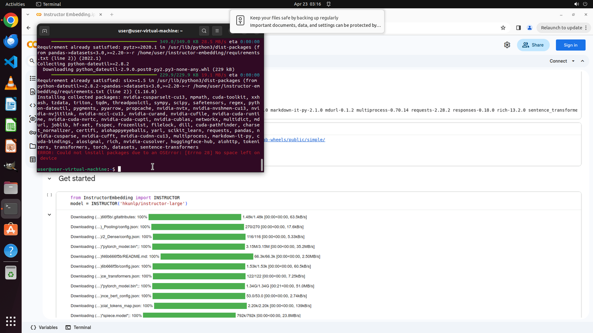

**Response:**
```
I can see the installation failed with an error: "ERROR: Could not install packages due to an OSError: [Errno 28] No space left on device". 

The disk is full. Let me check the available disk space and try to free up some space.
```

**Actions:** `import subprocess, shlex; subprocess.run(f'xdotool type --delay 12 -- ' + shlex.quote('df -h\n'), shell=True, check=True)
import time; time.sleep(0.05)`

---

## Step 30


**Response:**
```
I can see the disk space situation:
- `/dev/nvme0n1p3` (root `/`): 29G total, 25G used, 2.7G available (91% used)

Only 2.7G available, which is not enough for the large packages like torch (~2GB+) and all the NVIDIA CUDA packages. Let me try to clean up the pip cache and any partially installed packages to free space.
```

**Actions:** `import subprocess, shlex; subprocess.run(f'xdotool type --delay 12 -- ' + shlex.quote('pip cache purge\n'), shell=True, check=True)
import time; time.sleep(0.05)`

---

## Step 31

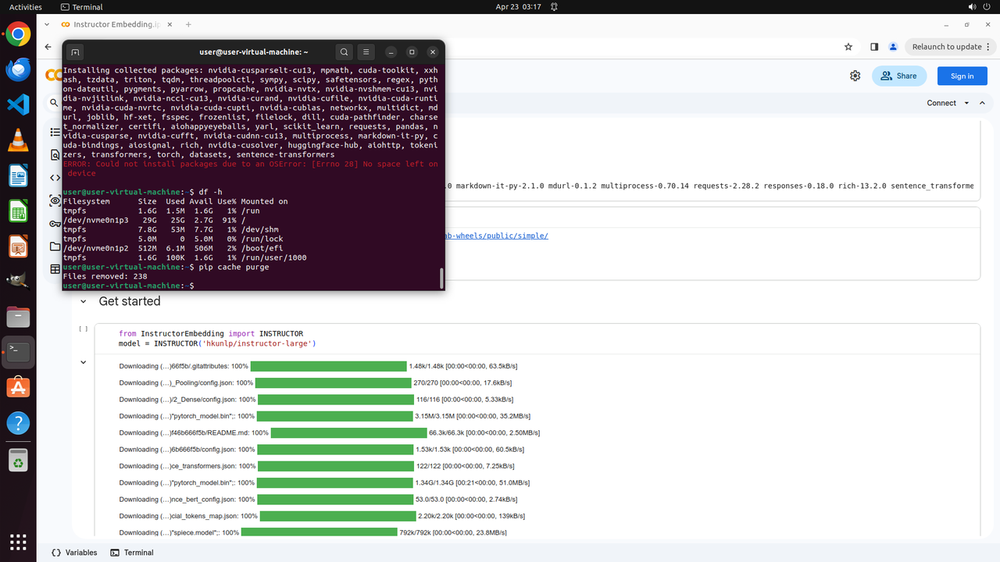

**Response:**
```
Good, pip cache purge removed 238 files. Let me check the disk space again and see if there's more space now. Let me also look for other things to clean up.
```

**Actions:** `import subprocess, shlex; subprocess.run(f'xdotool type --delay 12 -- ' + shlex.quote('df -h / && du -sh /home/user/.local/lib/python3*/s'), shell=True, check=True)
import time; time.sleep(0.05)
impor`

---

## Step 32

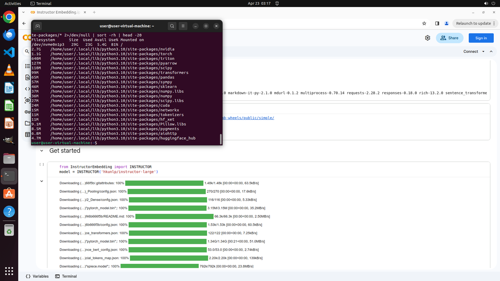

**Response:**
```
Now I can see the disk has 5.4G available (after cache purge) and the partially installed packages. The issue was that the installation ran out of space. Now with 5.4G free, I can see some packages were partially installed. The largest ones are nvidia (2.6G), torch (1.1G), triton (640M), etc.

It seems like many packages were already installed before the error. Let me try running the pip install again now that we have more space.
```

**Actions:** `import subprocess, shlex; subprocess.run(f'xdotool type --delay 12 -- ' + shlex.quote('pip install -r /home/user/instructor-embedding/req'), shell=True, check=True)
import time; time.sleep(0.05)
impor`

---

## Step 33

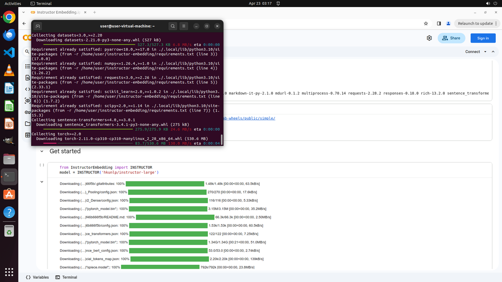

**Response:**
```
Good, the pip install is running again. It's downloading torch (530.6 MB) and sentence-transformers. Many packages are already satisfied. Let me wait for this to complete.
```

**Actions:** `time.sleep(0.5)`

---

## Step 34


**Response:**
```
Good progress! Many CUDA packages are showing as "Requirement already satisfied". Let me wait for the installation to complete.
```

**Actions:** `time.sleep(0.5)`

---

## Step 35


**Response:**
```
Now it's "Installing collected packages: torch, sentence-transformers, datasets" - only 3 packages left to install. This should be much faster now since most packages were already installed from the previous attempt. Let me wait for it to complete.
```

**Actions:** `time.sleep(0.5)`

---

## Step 36


**Response:**
```
The requirements installation completed successfully! I can see:
"Successfully installed datasets-2.21.0 sentence-transformers-3.4.1 torch-2.11.0"

Now I need to install the `InstructorEmbedding` package as shown in the Colab notebook (step 3: `pip install InstructorEmbedding`).
```

**Actions:** `import subprocess, shlex; subprocess.run(f'xdotool type --delay 12 -- ' + shlex.quote('pip install InstructorEmbedding\n'), shell=True, check=True)
import time; time.sleep(0.05)`

---

## Step 37

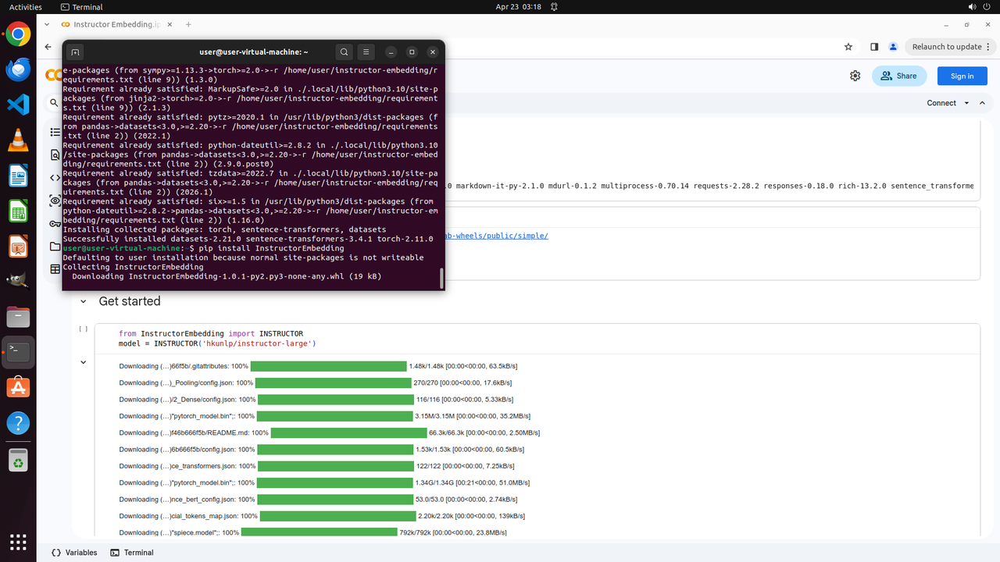

**Response:**
```
Good, it's downloading InstructorEmbedding-1.0.1. Let me wait for it to complete.
```

**Actions:** `time.sleep(0.5)`

---

## Step 38

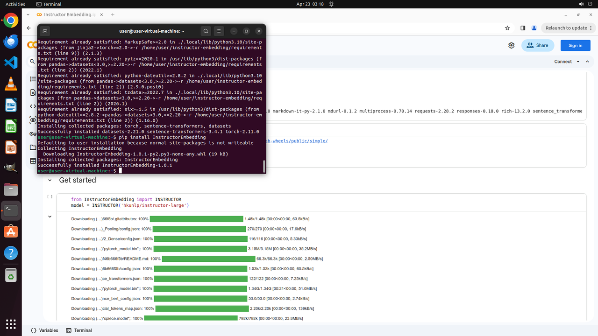

**Response:**
```
All installations are complete! I can see:
- "Successfully installed InstructorEmbedding-1.0.1"

Now let me clean the pip cache to free up space, and then verify the installation by running a quick Python test to make sure everything works:
```

**Actions:** `import subprocess, shlex; subprocess.run(f'xdotool type --delay 12 -- ' + shlex.quote('pip cache purge\n'), shell=True, check=True)
import time; time.sleep(0.05)`

---

## Step 39


**Response:**
```
Cache cleared (8 files removed). Now let me verify the installation by testing the import as shown in the Colab notebook:
```

**Actions:** `import subprocess, shlex; subprocess.run(f'xdotool type --delay 12 -- ' + shlex.quote('python3 -c "from InstructorEmbedding import INSTRU'), shell=True, check=True)
import time; time.sleep(0.05)
impor`

---

## Step 40


**Response:**
```
The Python command is running. Let me wait for it to complete.
```

**Actions:** `time.sleep(0.5)`

---

## Step 41

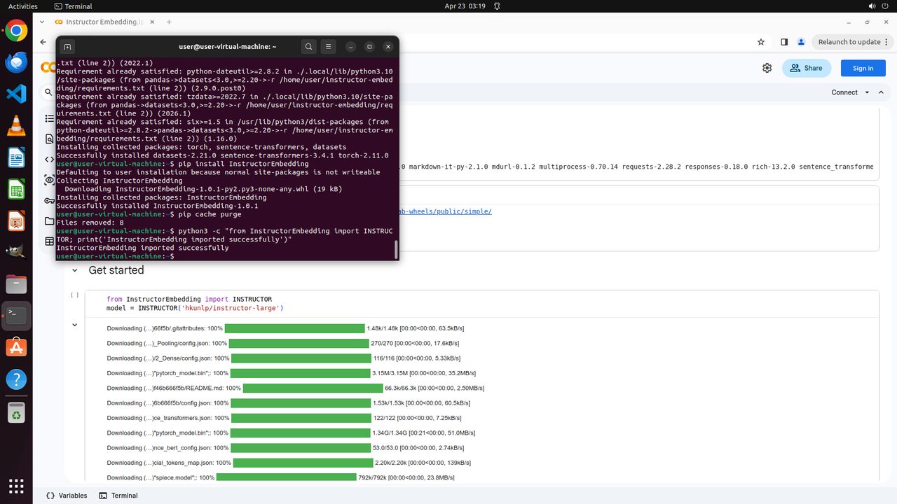

**Response:**
```
The environment has been successfully configured. I can see the output:
"InstructorEmbedding imported successfully"

All steps from the Colab notebook have been completed successfully:

1. ✅ **Cloned the repository**: `git clone https://github.com/xlang-ai/instructor-embedding` into `/home/user/`
2. ✅ **Installed requirements**: `pip install -r /home/user/instructor-embedding/requirements.txt` - Successfully installed datasets-2.21.0, sentence-transformers-3.4.1, torch-2.11.0 and all dependencies
3. ✅ **Installed InstructorEmbedding**: `pip install InstructorEmbedding` - Successfully installed InstructorEmbedding-1.0.1
4. ✅ **Verified the installation**: `from InstructorEmbedding import INSTRUCTOR` imports successfully

DONE
```

**Actions:** `DONE`

---
