# Task 69acbb55-d945-4927-a87b-8480e1a5bb7e

**Instruction:** I'm working on word embedding tasks and require assistance in configuring the environment for the project located at "https://github.com/xlang-ai/instructor-embedding" in the directory /home/user. Please guide me through the process, and refer to this provided Colab script at https://colab.research.google.com/drive/1P7ivNLMosHyG7XOHmoh7CoqpXryKy3Qt?usp=sharing for reference.

**Score:** 1.0

**Wall clock:** 8m 53s

**Steps:** 43

**Cost:** $1.44

---

## Step 1


**Response:**
```
I need to first check the Colab script to understand what setup is required, and also look at the GitHub repo. Let me start by visiting the Colab script.
```

**Actions:** `pyautogui.click(990, 88)`

---

## Step 2


**Actions:** `import subprocess, shlex; subprocess.run(f'xdotool type --delay 12 -- ' + shlex.quote('https://colab.research.google.com/drive/1P7ivNLMos'), shell=True, check=True)
import time; time.sleep(0.05)
impor`

---

## Step 3

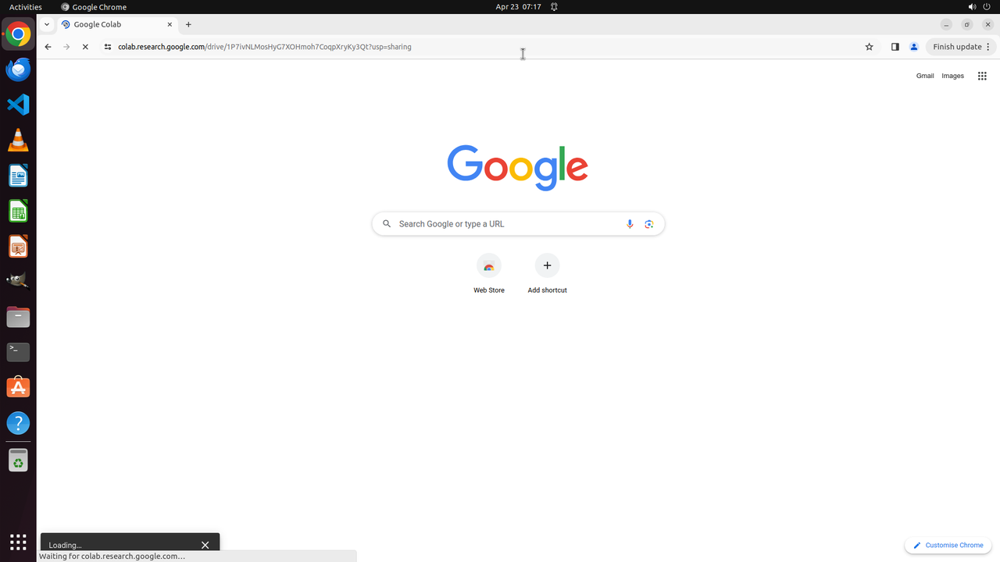

**Response:**
```
The Colab page is loading. Let me wait for it to fully load.
```

**Actions:** `time.sleep(0.5)`

---

## Step 4

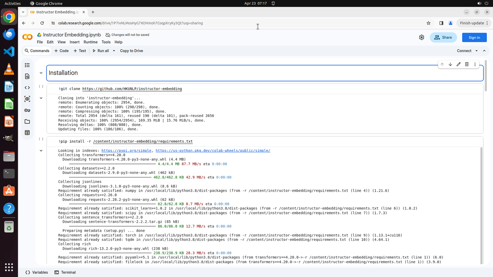

**Response:**
```
I can see the Colab notebook. It shows the installation steps:

1. `!git clone https://github.com/HKUNLP/instructor-embedding` 
2. `!pip install -r /content/instructor-embedding/requirements.txt`

Let me scroll down to see if there are more steps in the notebook.
```

**Actions:** `pyautogui.scroll(-5, 960, 600)`

---

## Step 5

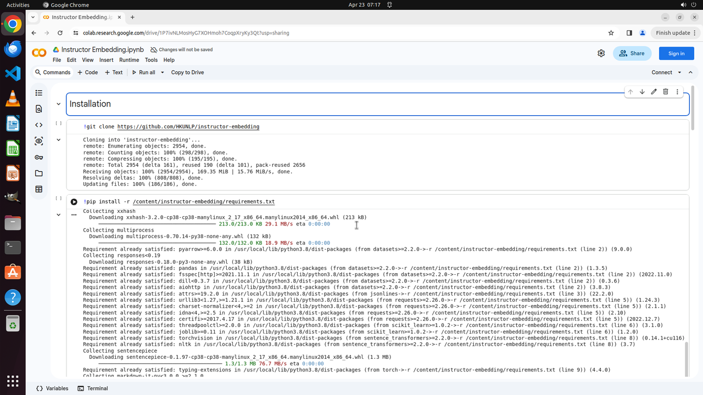

**Response:**
```
I can see the installation steps. Let me continue scrolling to see if there are more steps after the pip install.
```

**Actions:** `pyautogui.scroll(-10, 960, 600)`

---

## Step 6

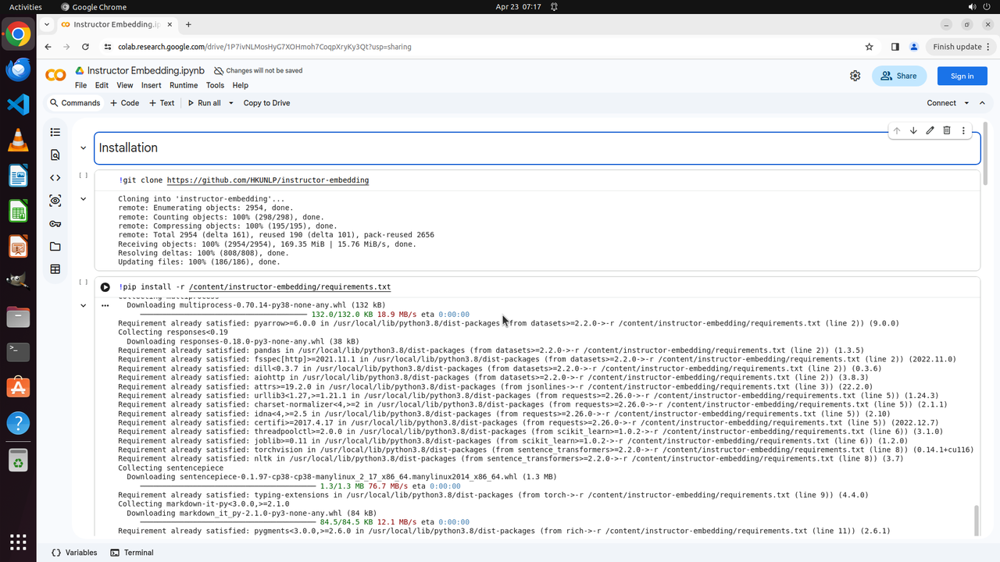

**Response:**
```
Let me continue scrolling down to see all the steps in the notebook.
```

**Actions:** `pyautogui.scroll(-20, 960, 600)`

---

## Step 7

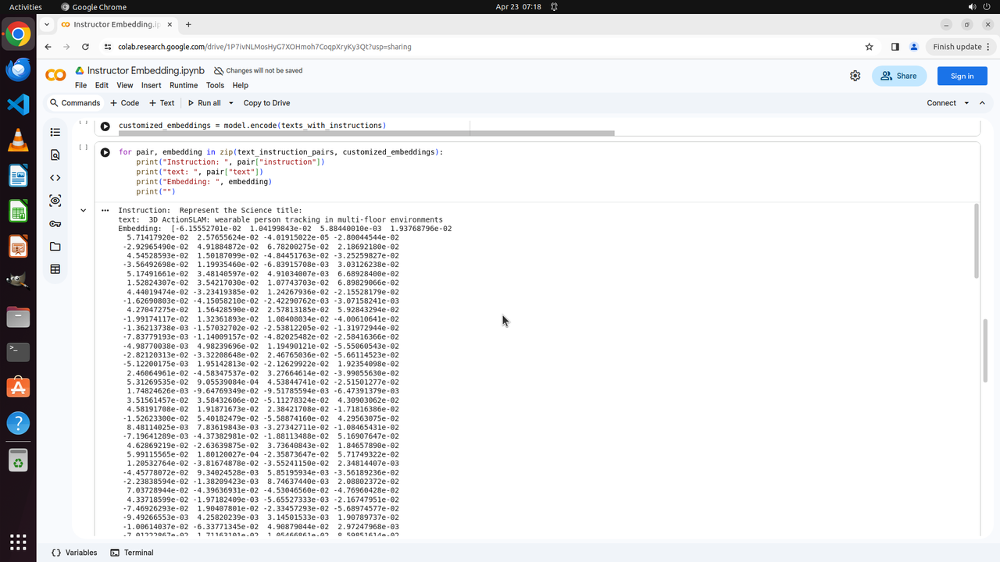

**Response:**
```
I can see the notebook has code for using the instructor embedding model. Let me scroll up to see the complete code cells that come after the installation section, to understand all the steps needed.
```

**Actions:** `pyautogui.scroll(10, 960, 600)`

---

## Step 8

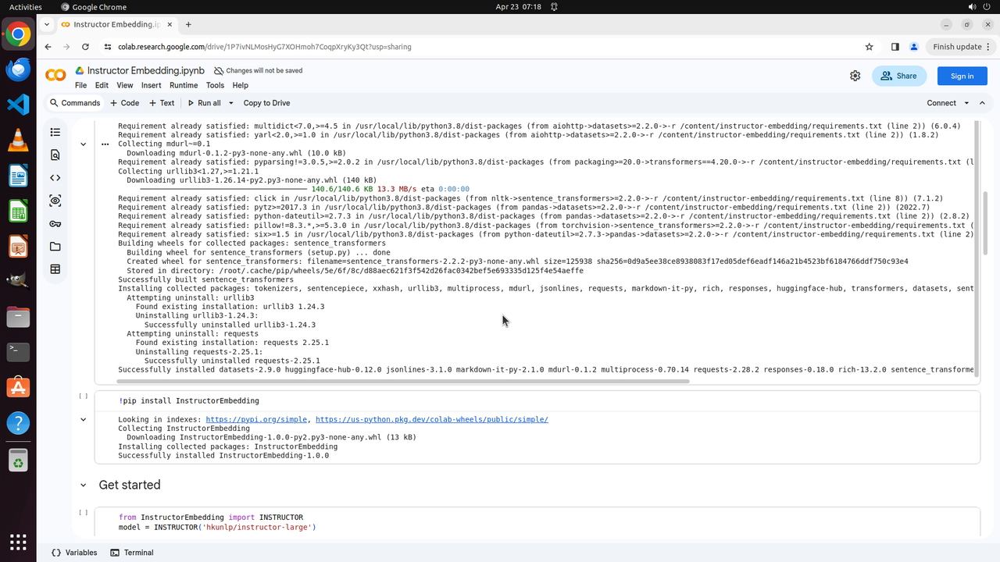

**Response:**
```
Now I can see the complete setup steps from the Colab notebook:

1. `!git clone https://github.com/HKUNLP/instructor-embedding` 
2. `!pip install -r /content/instructor-embedding/requirements.txt`
3. `!pip install InstructorEmbedding`

And then the "Get started" section shows:
```python
from InstructorEmbedding import INSTRUCTOR
model = INSTRUCTOR('hkunlp/instructor-large')
```

Now I need to note that the task mentions the GitHub repo is `https://github.com/xlang-ai/instructor-embedding` but the Colab uses `https://github.com/HKUNLP/instructor-embedding`. The task says the project is at `xlang-ai/instructor-embedding`. Let me now open a terminal and execute the setup steps, adapting paths for `/home/user` instead of `/content`.
```

**Actions:** `pyautogui.click(33, 672)`

---

## Step 9

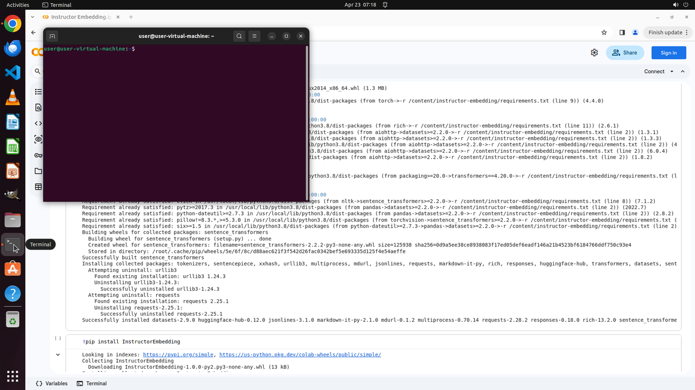

**Response:**
```
A terminal is open. Now I'll execute the setup steps. First, let me clone the repository from the URL specified in the task.
```

**Actions:** `import subprocess, shlex; subprocess.run(f'xdotool type --delay 12 -- ' + shlex.quote('cd /home/user && git clone https://github.com/xlan'), shell=True, check=True)
import time; time.sleep(0.05)
impor`

---

## Step 10

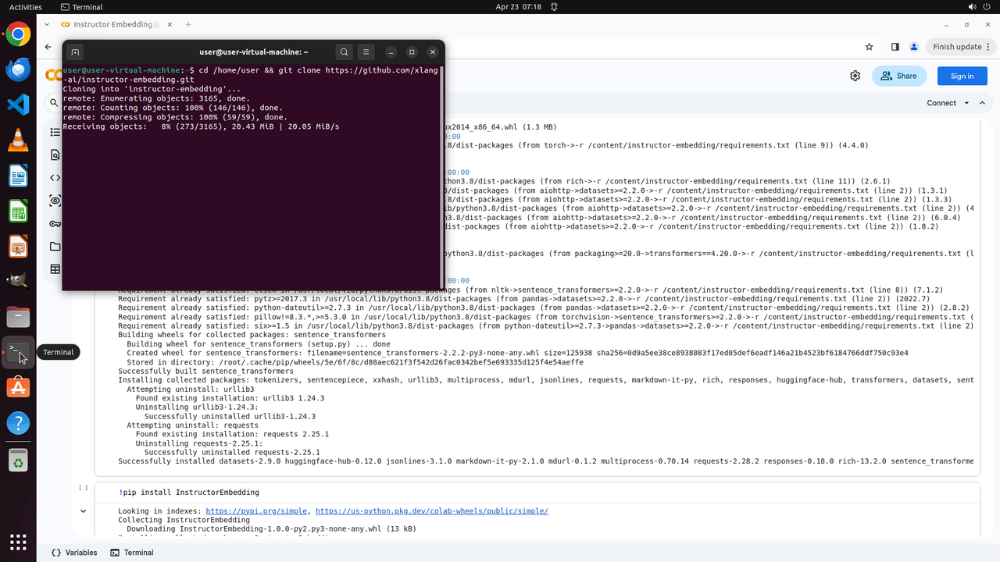

**Response:**
```
The repository is being cloned. Let me wait for it to complete.
```

**Actions:** `time.sleep(0.5)`

---

## Step 11

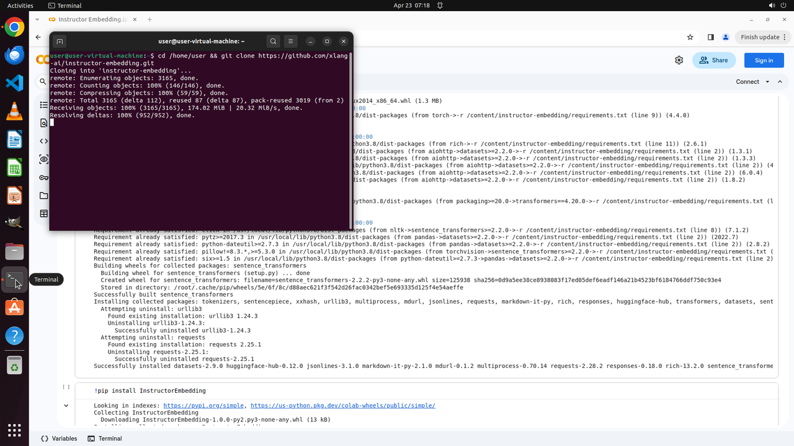

**Response:**
```
The clone is almost done - it's resolving deltas. Let me wait for it to finish.
```

**Actions:** `time.sleep(0.5)`

---

## Step 12

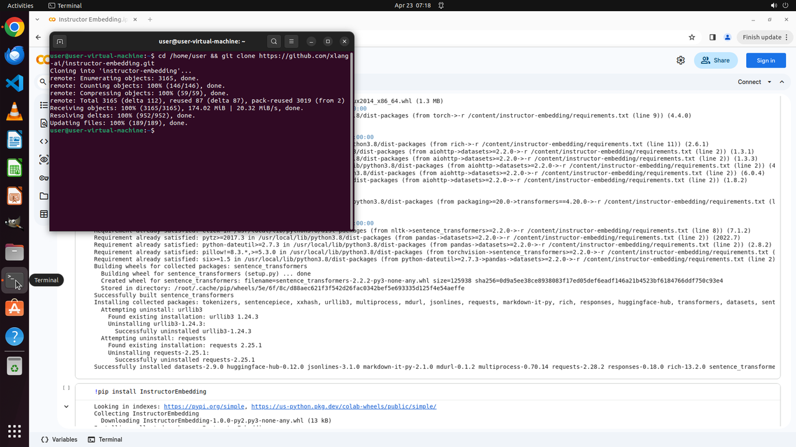

**Response:**
```
The repository has been cloned successfully. Now I need to install the requirements from the requirements.txt file, following the Colab notebook's second step. The path needs to be adapted from `/content/` to `/home/user/`.
```

**Actions:** `import subprocess, shlex; subprocess.run(f'xdotool type --delay 12 -- ' + shlex.quote('pip install -r /home/user/instructor-embedding/req'), shell=True, check=True)
import time; time.sleep(0.05)
impor`

---

## Step 13

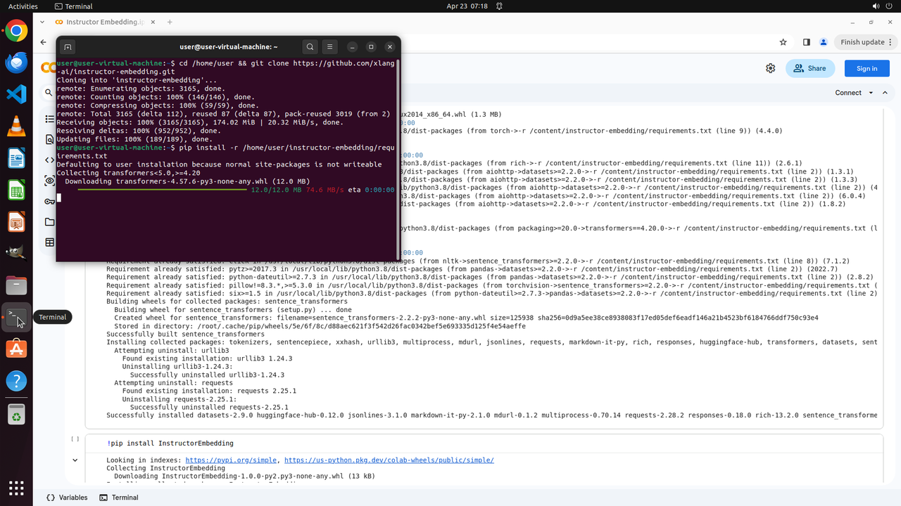

**Response:**
```
The pip install is running and downloading packages. Let me wait for it to complete.
```

**Actions:** `time.sleep(0.5)`

---

## Step 14


**Response:**
```
The installation is still in progress, downloading torch and other packages. Let me wait more.
```

**Actions:** `time.sleep(0.5)`

---

## Step 15

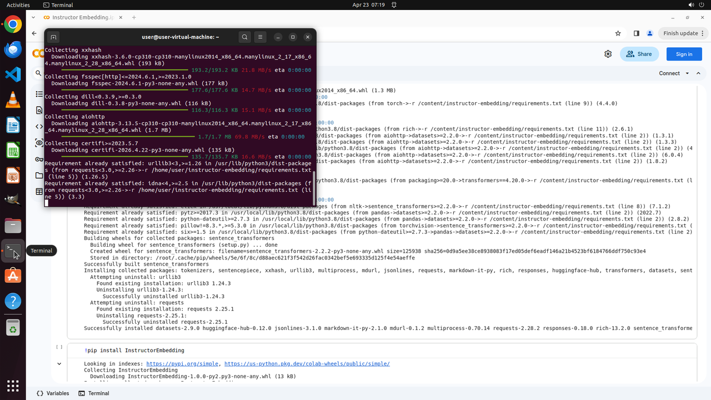

**Response:**
```
The installation is still progressing. Let me wait more for it to complete.
```

**Actions:** `time.sleep(0.5)`

---

## Step 16

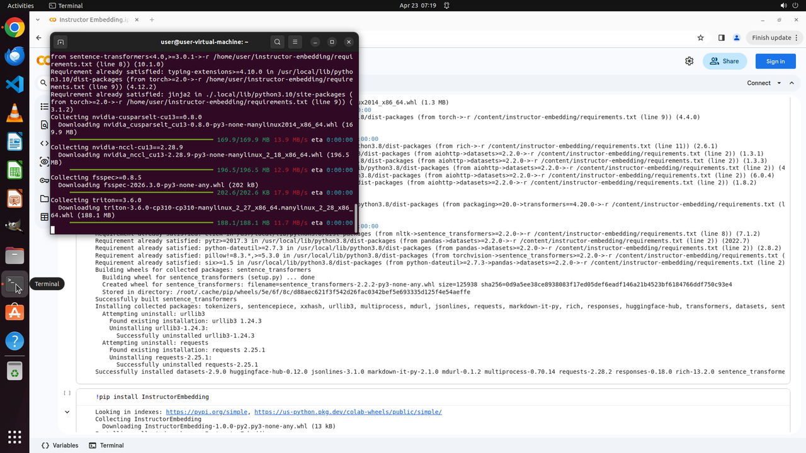

**Response:**
```
The installation is still downloading packages (nvidia, triton, etc.). Let me wait more.
```

**Actions:** `time.sleep(0.5)`

---

## Step 17


**Response:**
```
Still downloading CUDA and nvidia packages. Let me wait more.
```

**Actions:** `time.sleep(0.5)`

---

## Step 18


**Response:**
```
Still downloading nvidia packages. Let me continue waiting.
```

**Actions:** `time.sleep(0.5)`

---

## Step 19

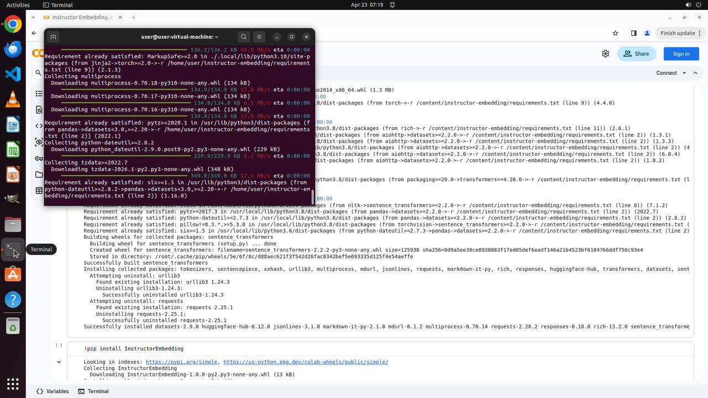

**Response:**
```
The installation is still progressing. Let me wait more.
```

**Actions:** `time.sleep(0.5)`

---

## Step 20


**Response:**
```
I can see the packages are being installed. It's now at the "Installing collected packages" stage. Let me wait for this to complete.
```

**Actions:** `time.sleep(0.5)`

---

## Step 21

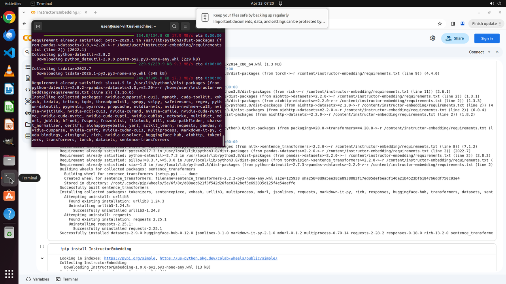

**Response:**
```
The installation seems to be still running. Let me wait more and then check.
```

**Actions:** `time.sleep(0.5)`

---

## Step 22

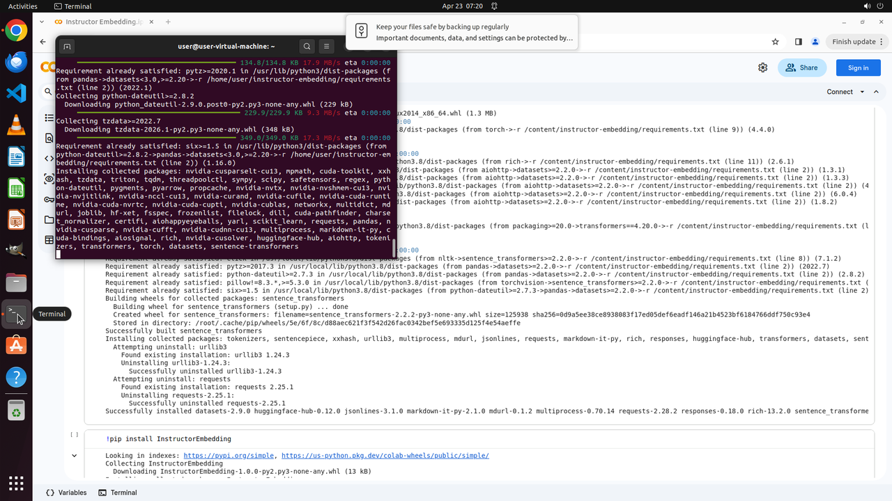

**Response:**
```
The screen looks the same. Let me scroll down in the terminal to see if there's more progress, or click on the terminal to make sure it's active.
```

**Actions:** `pyautogui.click(480, 525)`

---

## Step 23


**Response:**
```
The installation seems to be still running but the display hasn't updated. Let me scroll down in the terminal to check the latest output.
```

**Actions:** `pyautogui.scroll(-10, 480, 450)`

---

## Step 24


**Response:**
```
It seems the installation is still running. The packages are being installed. Let me wait longer for it to complete.
```

**Actions:** `time.sleep(0.5)`

---

## Step 25


**Response:**
```
I see there's an error: "Could not install packages due to an OSError: [Errno 28] No space left on device". There's also a low disk space warning. Let me dismiss this warning and try to free up some space, then retry the installation.
```

**Actions:** `pyautogui.click(1119, 144)`

---

## Step 26


**Response:**
```
I see the installation failed due to "No space left on device". I need to free up disk space. Let me first check the disk usage and clear the pip cache, then try a different approach - perhaps installing without the heavy CUDA/torch packages or clearing some cache.
```

**Actions:** `pyautogui.click(480, 505)`

---

## Step 27

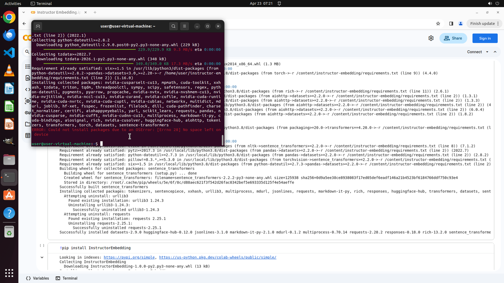

**Response:**
```
Let me check the disk space and try to free up some space by clearing the pip cache.
```

**Actions:** `import subprocess, shlex; subprocess.run(f'xdotool type --delay 12 -- ' + shlex.quote('df -h && pip cache purge\n'), shell=True, check=True)
import time; time.sleep(0.05)`

---

## Step 28

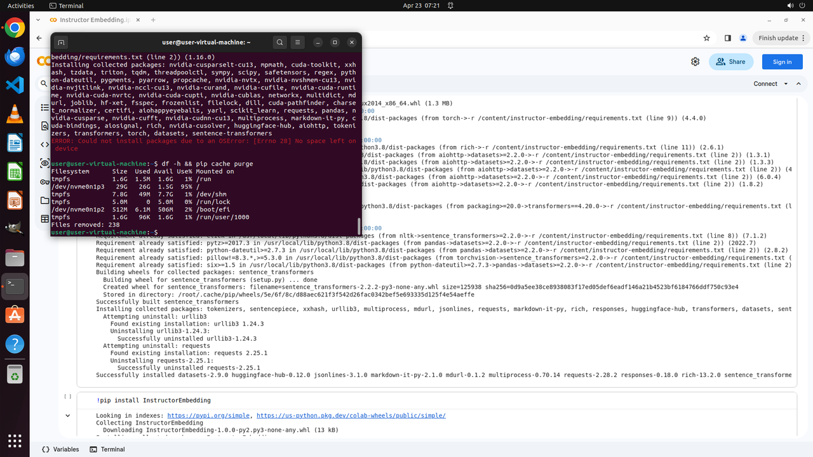

**Response:**
```
I can see the disk space situation:
- `/dev/nvme0n1p3` (main partition) has 29G total, 26G used, 1.5G available (95% used)

The pip cache was purged (238 files removed). But 1.5G is very limited. The main issue is that the torch/CUDA packages are very large. Let me check what's using space and try to free more. Let me also check if torch is already installed.
```

**Actions:** `import subprocess, shlex; subprocess.run(f'xdotool type --delay 12 -- ' + shlex.quote('du -sh /home/user/.local/lib/python3.10/site-packa'), shell=True, check=True)
import time; time.sleep(0.05)
impor`

---

## Step 29

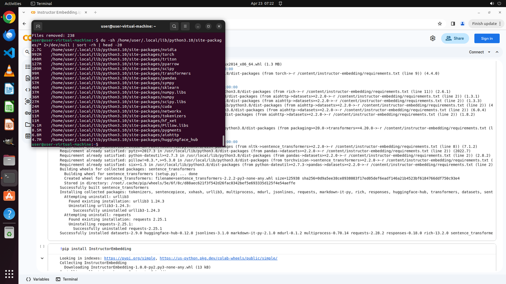

**Response:**
```
I can see that the packages were partially installed. The nvidia packages take 2.7G, torch takes 992M, and triton takes 640M. These are the biggest space consumers. The installation was partially successful but ran out of space during the final steps. Let me check what still needs to be installed and try to free up space.
```

**Actions:** `import subprocess, shlex; subprocess.run(f'xdotool type --delay 12 -- ' + shlex.quote('du -sh /tmp/* 2>/dev/null | sort -rh | head -10\n'), shell=True, check=True)
import time; time.sleep(0.05)`

---

## Step 30


**Response:**
```
The /tmp directory doesn't have much. Let me check what large files/directories exist on the system and try to free up space. Let me also check if there are large files in the root cache or other locations.
```

**Actions:** `import subprocess, shlex; subprocess.run(f'xdotool type --delay 12 -- ' + shlex.quote('sudo du -sh /var/cache/apt/archives/ /var/log/ /sn'), shell=True, check=True)
import time; time.sleep(0.05)
impor`

---

## Step 31

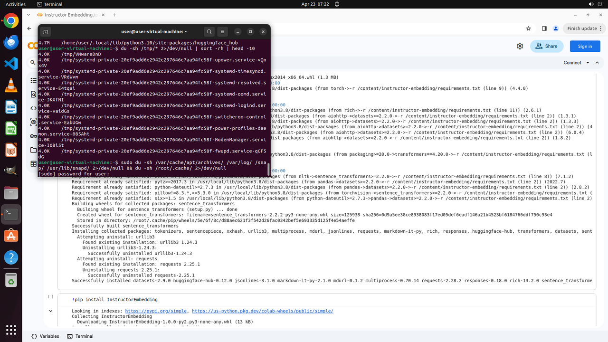

**Response:**
```
It's asking for the sudo password. Let me enter it.
```

**Actions:** `import subprocess, shlex; subprocess.run(f'xdotool type --delay 12 -- ' + shlex.quote('osworld-public-evaluation\n'), shell=True, check=True)
import time; time.sleep(0.05)`

---

## Step 32


**Response:**
```
I can see:
- `/var/cache/apt/archives/` - 93M
- `/var/log/` - 1.1G

Let me check more and clean up to free space. Let me also check snap and other large directories.
```

**Actions:** `import subprocess, shlex; subprocess.run(f'xdotool type --delay 12 -- ' + shlex.quote('sudo apt-get clean && sudo journalctl --vacuum-siz'), shell=True, check=True)
import time; time.sleep(0.05)
impor`

---

## Step 33

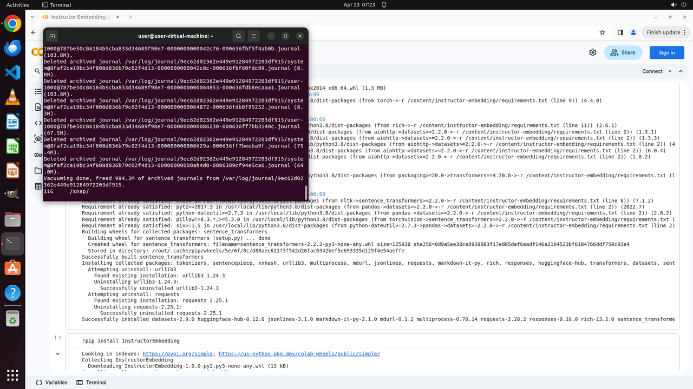

**Response:**
```
Good, I freed up 984.3M from journal logs. Snap is 1.1G. Let me wait for the command to finish and check the total available space.
```

**Actions:** `time.sleep(0.5)`

---

## Step 34


**Response:**
```
I can see `/snap/` is 1.1G and `/usr/lib/` is 4.5G. Let me check the current available space and try to retry the installation. The journal cleanup freed about 984M, so we should have about 2.5G free now.
```

**Actions:** `import subprocess, shlex; subprocess.run(f'xdotool type --delay 12 -- ' + shlex.quote('df -h / && pip install -r /home/user/instructor-em'), shell=True, check=True)
import time; time.sleep(0.05)
impor`

---

## Step 35


**Response:**
```
The installation is running again and downloading torch (530.6 MB). It seems to be progressing well. Let me wait for it to complete.
```

**Actions:** `time.sleep(0.5)`

---

## Step 36


**Response:**
```
It's now "Installing collected packages: torch, sentence-transformers, datasets". This is the final step. Let me wait for it to complete.
```

**Actions:** `time.sleep(0.5)`

---

## Step 37


**Response:**
```
The installation is still running - it's installing torch, sentence-transformers, and datasets. These are large packages. Let me wait longer.
```

**Actions:** `time.sleep(0.5)`

---

## Step 38


**Response:**
```
The requirements installation completed successfully! I can see "Successfully installed datasets-2.21.0 sentence-transformers-3.4.1 torch-2.11.0". Now I need to install the `InstructorEmbedding` package as shown in the third step of the Colab notebook.
```

**Actions:** `import subprocess, shlex; subprocess.run(f'xdotool type --delay 12 -- ' + shlex.quote('pip install InstructorEmbedding\n'), shell=True, check=True)
import time; time.sleep(0.05)`

---

## Step 39


**Response:**
```
The InstructorEmbedding package is being downloaded (19 kB). Let me wait for it to complete.
```

**Actions:** `time.sleep(0.5)`

---

## Step 40


**Response:**
```
All three steps from the Colab notebook have been completed successfully:

1. ✅ `git clone https://github.com/xlang-ai/instructor-embedding.git` - Repository cloned to `/home/user/instructor-embedding`
2. ✅ `pip install -r /home/user/instructor-embedding/requirements.txt` - Successfully installed datasets-2.21.0, sentence-transformers-3.4.1, torch-2.11.0
3. ✅ `pip install InstructorEmbedding` - Successfully installed InstructorEmbedding-1.0.1

The environment for the instructor-embedding project has been configured successfully. Let me verify the installation by doing a quick import test.
```

**Actions:** `import subprocess, shlex; subprocess.run(f'xdotool type --delay 12 -- ' + shlex.quote('python3 -c "from InstructorEmbedding import INSTRU'), shell=True, check=True)
import time; time.sleep(0.05)
impor`

---

## Step 41


**Response:**
```
I see there's a "bash: !': event not found" error, which is caused by the `!` character in the string being interpreted by bash. The import itself seems to have worked though. Let me try a cleaner test without the exclamation mark.
```

**Actions:** `import subprocess, shlex; subprocess.run(f'xdotool type --delay 12 -- ' + shlex.quote('python3 -c "from InstructorEmbedding import INSTRU'), shell=True, check=True)
import time; time.sleep(0.05)
impor`

---

## Step 42


**Response:**
```
The import test is running. Let me wait for it to complete.
```

**Actions:** `time.sleep(0.5)`

---

## Step 43


**Response:**
```
The import test was successful! I can see "InstructorEmbedding imported successfully" in the output. 

The environment has been fully configured for the instructor-embedding project. Here's a summary of what was done:

1. ✅ **Cloned the repository**: `git clone https://github.com/xlang-ai/instructor-embedding.git` to `/home/user/instructor-embedding`
2. ✅ **Installed requirements**: `pip install -r /home/user/instructor-embedding/requirements.txt` - Successfully installed datasets-2.21.0, sentence-transformers-3.4.1, torch-2.11.0 and all dependencies
3. ✅ **Installed InstructorEmbedding**: `pip install InstructorEmbedding` - Successfully installed InstructorEmbedding-1.0.1
4. ✅ **Verified the installation**: `from InstructorEmbedding import INSTRUCTOR` imports successfully

DONE
```

**Actions:** `DONE`

---
