# Task 69acbb55-d945-4927-a87b-8480e1a5bb7e

**Instruction:** I'm working on word embedding tasks and require assistance in configuring the environment for the project located at "https://github.com/xlang-ai/instructor-embedding" in the directory /home/user. Please guide me through the process, and refer to this provided Colab script at https://colab.research.google.com/drive/1P7ivNLMosHyG7XOHmoh7CoqpXryKy3Qt?usp=sharing for reference.

**Score:** 0.0

**Wall clock:** 7m 46s

**Steps:** 39

**Cost:** $1.22

---

## Step 1

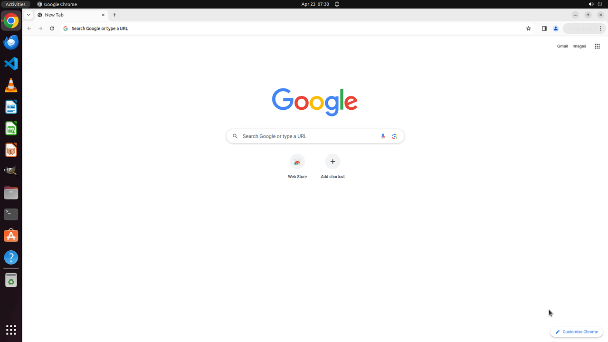

**Response:**
```
I'll start by navigating to the Colab script to understand what needs to be done, and then clone the repository and set up the environment.
```

**Actions:** `pyautogui.click(990, 88)`

---

## Step 2


**Actions:** `import subprocess, shlex; subprocess.run(f'xdotool type --delay 12 -- ' + shlex.quote('https://colab.research.google.com/drive/1P7ivNLMos'), shell=True, check=True)
import time; time.sleep(0.05)
impor`

---

## Step 3

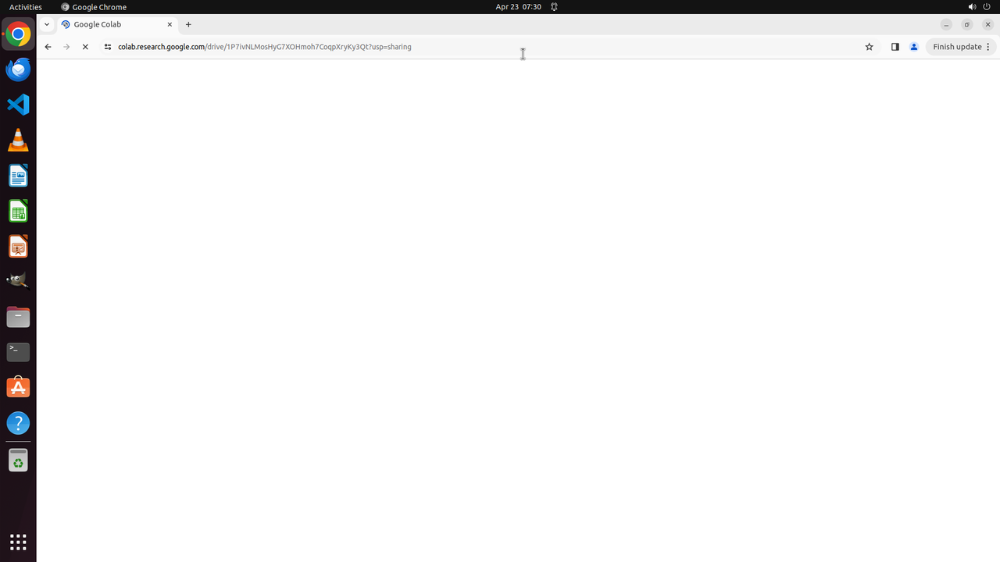

**Response:**
```
The Colab page is loading. Let me wait for it to fully load.
```

**Actions:** `time.sleep(0.5)`

---

## Step 4

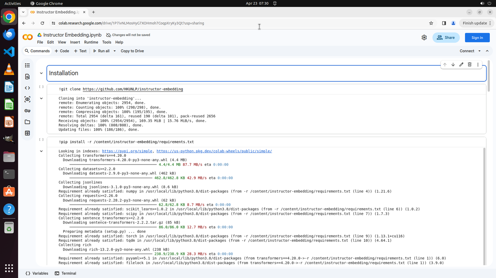

**Response:**
```
I can see the Colab notebook. It shows the installation steps:

1. `!git clone https://github.com/HKUNLP/instructor-embedding` 
2. `!pip install -r /content/instructor-embedding/requirements.txt`

Let me scroll down to see if there are more steps.
```

**Actions:** `pyautogui.scroll(-5, 960, 600)`

---

## Step 5

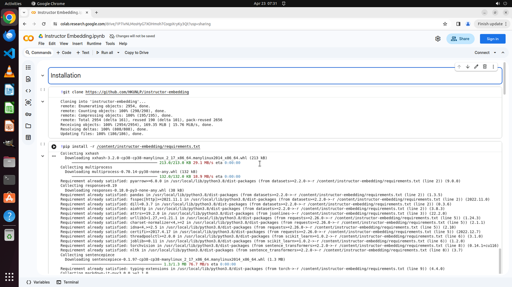

**Response:**
```
I can see the notebook has two main installation steps. Let me scroll down further to see if there are additional steps after the pip install.
```

**Actions:** `pyautogui.scroll(-10, 960, 600)`

---

## Step 6


**Response:**
```
Let me continue scrolling to see all the steps in the notebook.
```

**Actions:** `pyautogui.scroll(-15, 960, 600)`

---

## Step 7

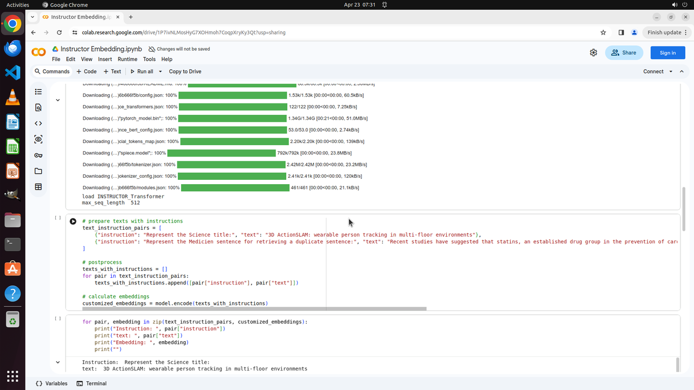

**Response:**
```
I can see more of the notebook now. Let me scroll up a bit to see the code cell that loads the model, which appears to be between the pip install and the current view.
```

**Actions:** `pyautogui.scroll(5, 960, 600)`

---

## Step 8

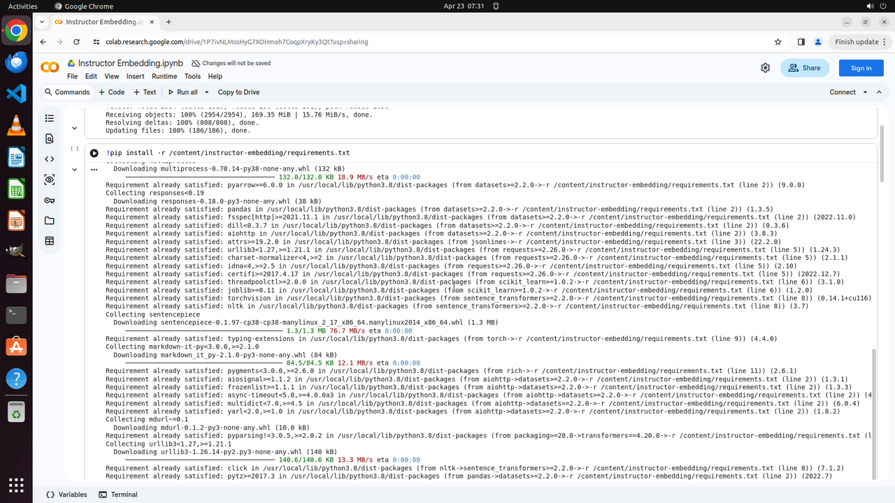

**Response:**
```
I can see the pip install command is running. Let me scroll down to see the model loading code and any other steps.
```

**Actions:** `pyautogui.scroll(-20, 960, 600)`

---

## Step 9


**Response:**
```
This is showing embedding output. Let me scroll down further to see if there are more code cells.
```

**Actions:** `pyautogui.scroll(-30, 960, 600)`

---

## Step 10


**Response:**
```
This is still showing embedding output. Let me scroll down more to see the end of the notebook.
```

**Actions:** `pyautogui.scroll(-50, 960, 600)`

---

## Step 11

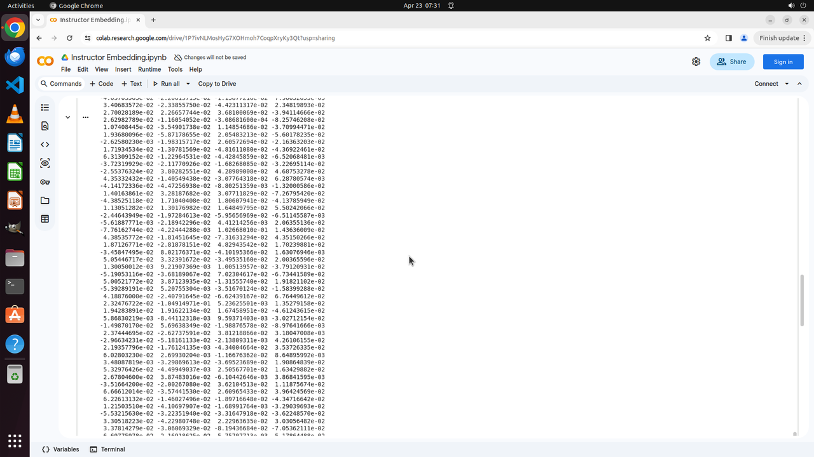

**Response:**
```
Still showing embedding output. Let me use the keyboard shortcut to go to the end of the notebook quickly.
```

**Actions:** `pyautogui.keyDown('ctrl')
pyautogui.keyDown('end')
pyautogui.keyUp('end')
pyautogui.keyUp('ctrl')`

---

## Step 12

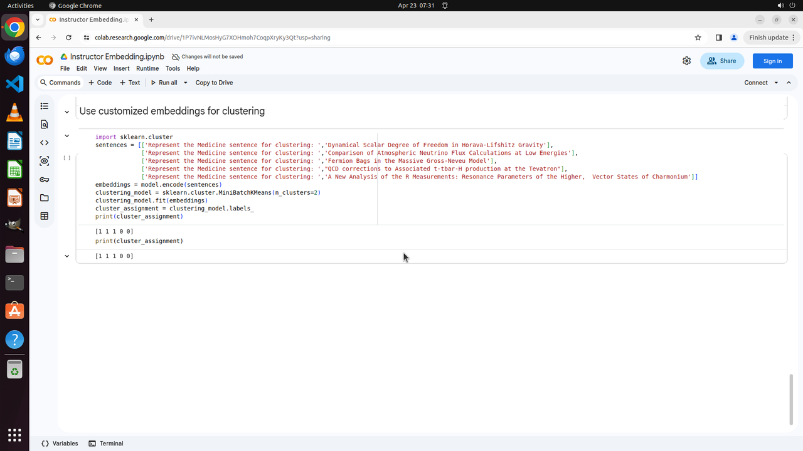

**Response:**
```
Now I can see the end of the notebook. Let me scroll up to see all the code cells to understand the full structure. Let me scroll to the top first.
```

**Actions:** `pyautogui.keyDown('ctrl')
pyautogui.keyDown('home')
pyautogui.keyUp('home')
pyautogui.keyUp('ctrl')`

---

## Step 13

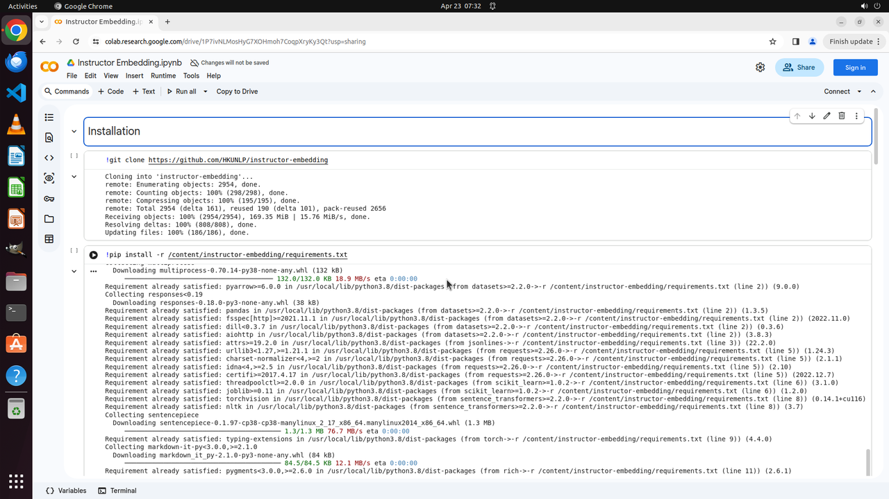

**Response:**
```
Now I have a good understanding of the Colab notebook. The key installation steps are:

1. `git clone https://github.com/HKUNLP/instructor-embedding` 
2. `pip install -r /content/instructor-embedding/requirements.txt`

However, the task mentions the GitHub repo is at `https://github.com/xlang-ai/instructor-embedding` and should be cloned to `/home/user`. Let me now open a terminal and perform the setup.
```

**Actions:** `pyautogui.click(33, 672)`

---

## Step 14

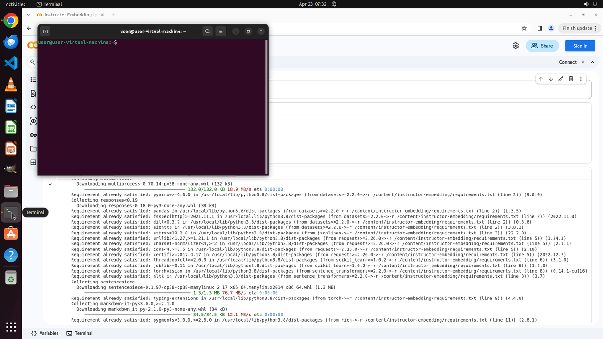

**Response:**
```
A terminal is open. Now let me clone the repository from the specified URL into /home/user directory.
```

**Actions:** `import subprocess, shlex; subprocess.run(f'xdotool type --delay 12 -- ' + shlex.quote('cd /home/user && git clone https://github.com/xlan'), shell=True, check=True)
import time; time.sleep(0.05)
impor`

---

## Step 15

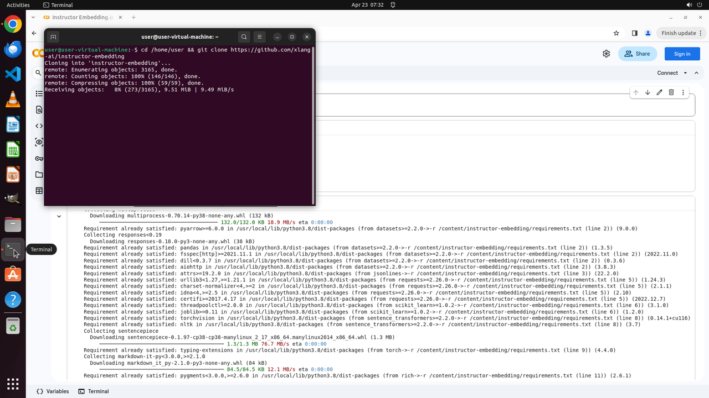

**Response:**
```
The repository is being cloned. Let me wait for it to complete.
```

**Actions:** `time.sleep(0.5)`

---

## Step 16


**Response:**
```
The clone is still in progress (30%). Let me wait more.
```

**Actions:** `time.sleep(0.5)`

---

## Step 17

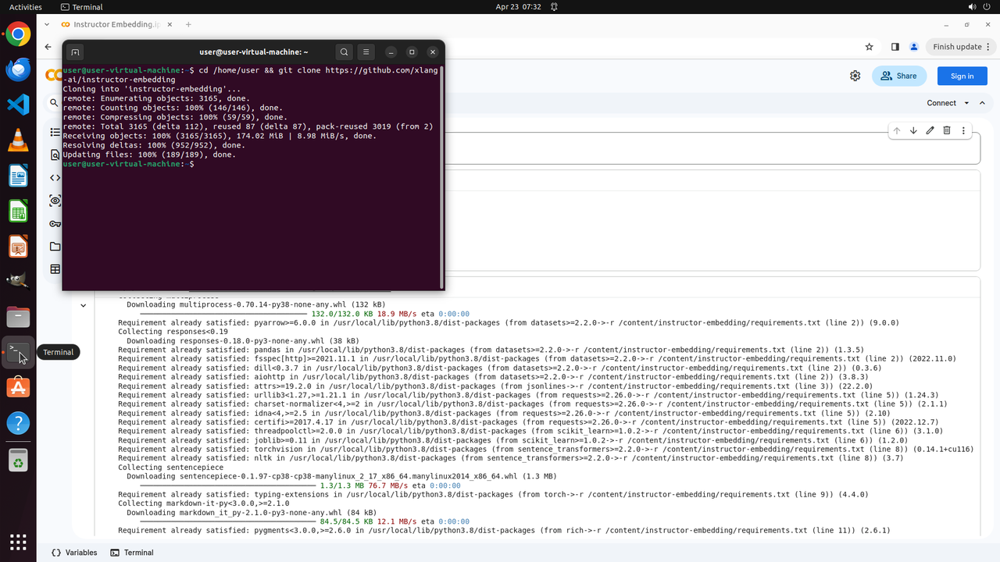

**Response:**
```
The repository has been cloned successfully. Now I need to install the requirements from the requirements.txt file, following the Colab notebook's second step. The path will be `/home/user/instructor-embedding/requirements.txt`.
```

**Actions:** `import subprocess, shlex; subprocess.run(f'xdotool type --delay 12 -- ' + shlex.quote('pip install -r /home/user/instructor-embedding/req'), shell=True, check=True)
import time; time.sleep(0.05)
impor`

---

## Step 18

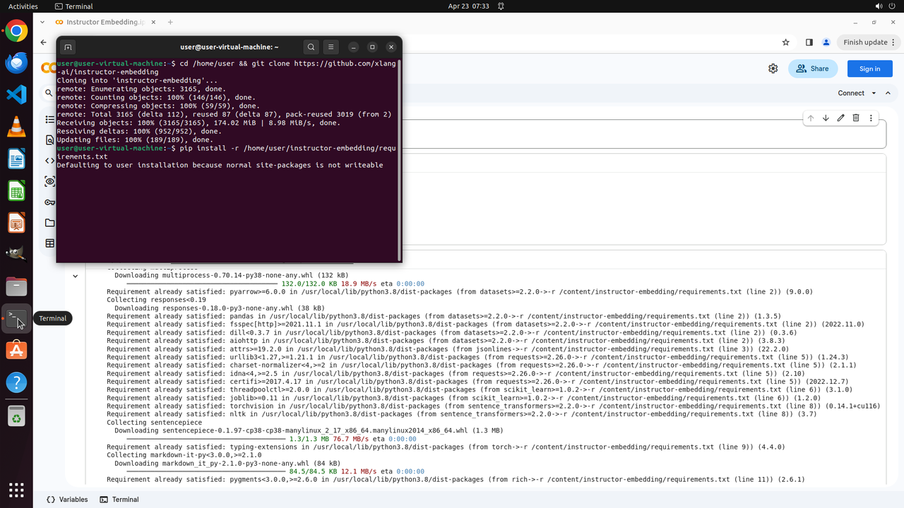

**Response:**
```
The pip install is running. It says "Defaulting to user installation because normal site-packages is not writeable". Let me wait for it to complete.
```

**Actions:** `time.sleep(0.5)`

---

## Step 19

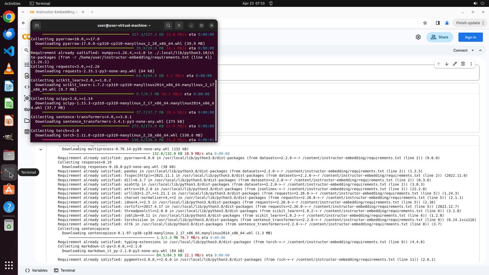

**Response:**
```
The installation is progressing. It's downloading torch (530.6 MB) which is a large package. Let me wait longer for it to complete.
```

**Actions:** `time.sleep(0.5)`

---

## Step 20

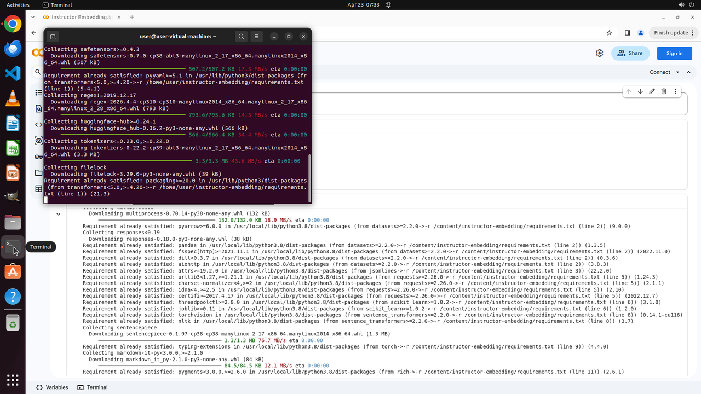

**Response:**
```
The installation is still in progress, downloading various packages like safetensors, regex, huggingface-hub, tokenizers, and filelock. Let me wait more for it to complete.
```

**Actions:** `time.sleep(0.5)`

---

## Step 21

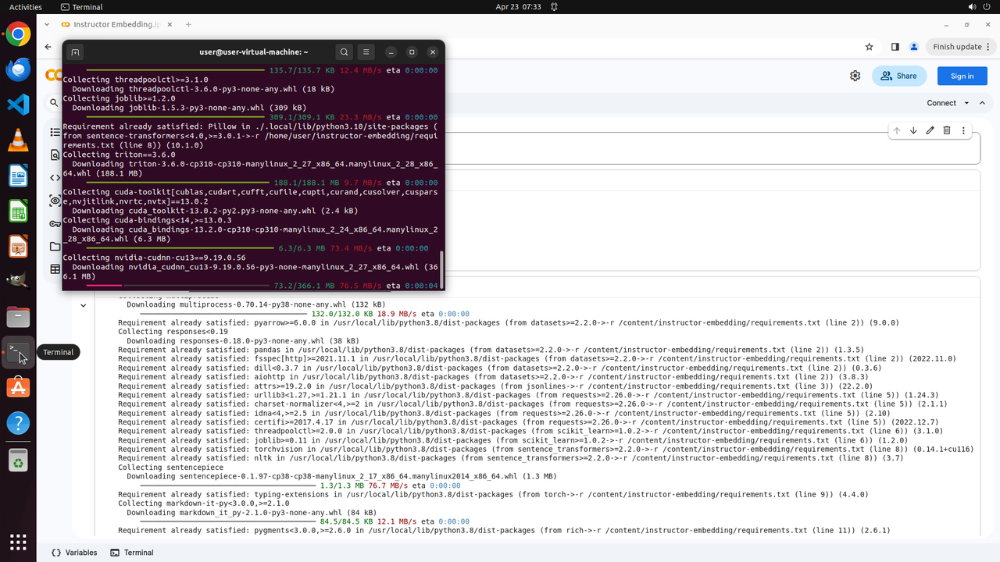

**Response:**
```
The installation is still ongoing, downloading CUDA-related packages (nvidia_cudnn_cu13, triton, etc.). These are large packages. Let me wait more.
```

**Actions:** `time.sleep(0.5)`

---

## Step 22

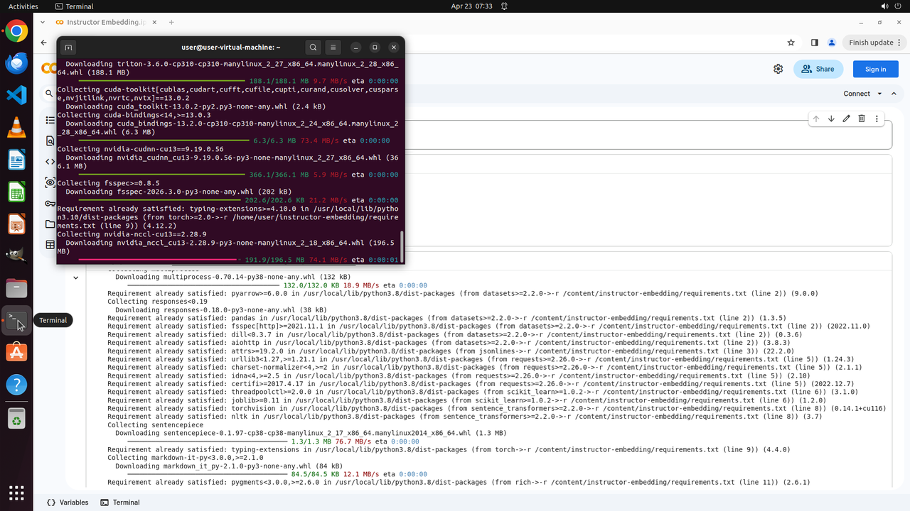

**Response:**
```
Still downloading packages. Let me wait more for the installation to complete.
```

**Actions:** `time.sleep(0.5)`

---

## Step 23


**Response:**
```
Still downloading NVIDIA CUDA packages. Let me continue waiting.
```

**Actions:** `time.sleep(0.5)`

---

## Step 24

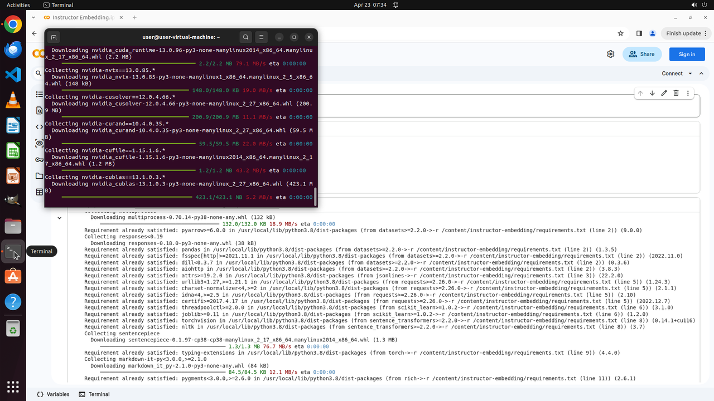

**Response:**
```
Still downloading NVIDIA CUDA packages (cublas 423.1 MB). Let me continue waiting.
```

**Actions:** `time.sleep(0.5)`

---

## Step 25

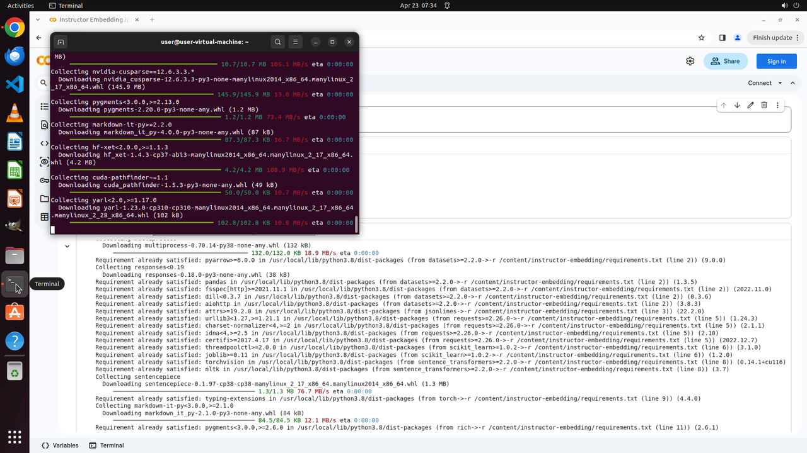

**Response:**
```
The installation is continuing with more packages being downloaded. Let me wait for it to finish.
```

**Actions:** `time.sleep(0.5)`

---

## Step 26


**Response:**
```
I can see "Installing collected packages:" which means the download phase is complete and it's now installing. Let me wait for the installation to finish.
```

**Actions:** `time.sleep(0.5)`

---

## Step 27

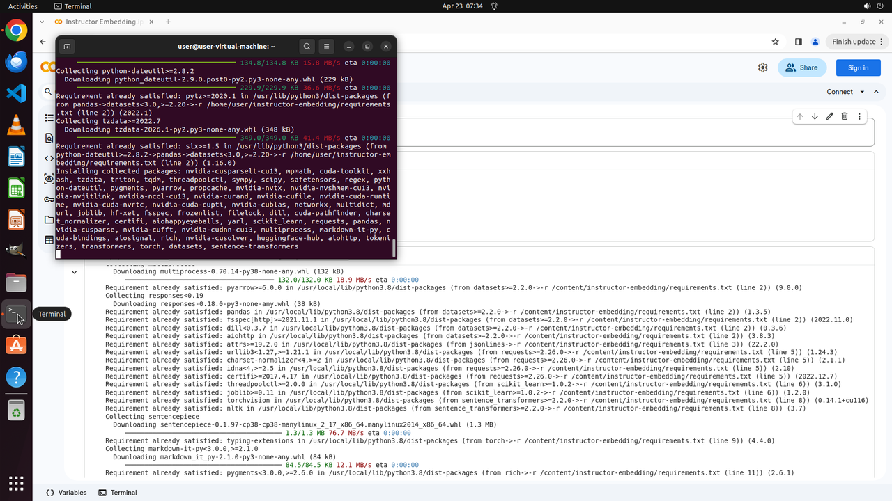

**Response:**
```
The installation seems to be taking a while as it's installing many packages. Let me wait more.
```

**Actions:** `time.sleep(0.5)`

---

## Step 28


**Response:**
```
The screen looks the same. The installation might be stuck or still processing. Let me scroll down in the terminal to check the latest output.
```

**Actions:** `pyautogui.scroll(-10, 480, 450)`

---

## Step 29

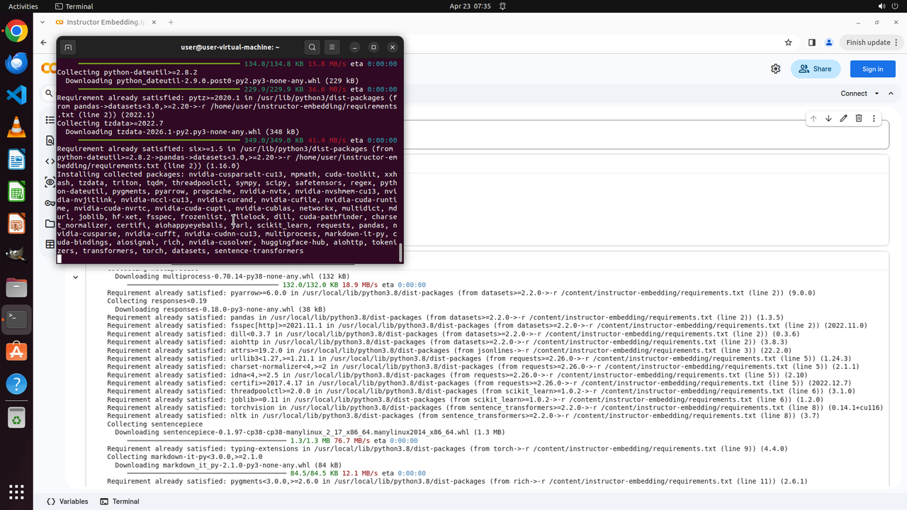

**Response:**
```
The installation is still running (installing the collected packages). This is a large installation with many CUDA and ML packages. Let me wait more.
```

**Actions:** `time.sleep(0.5)`

---

## Step 30


**Response:**
```
The screen still looks the same. The installation of large packages like torch can take a while. Let me check if the process is still running by pressing Enter to see if I get a prompt back.
```

**Actions:** `pyautogui.click(480, 525)`

---

## Step 31

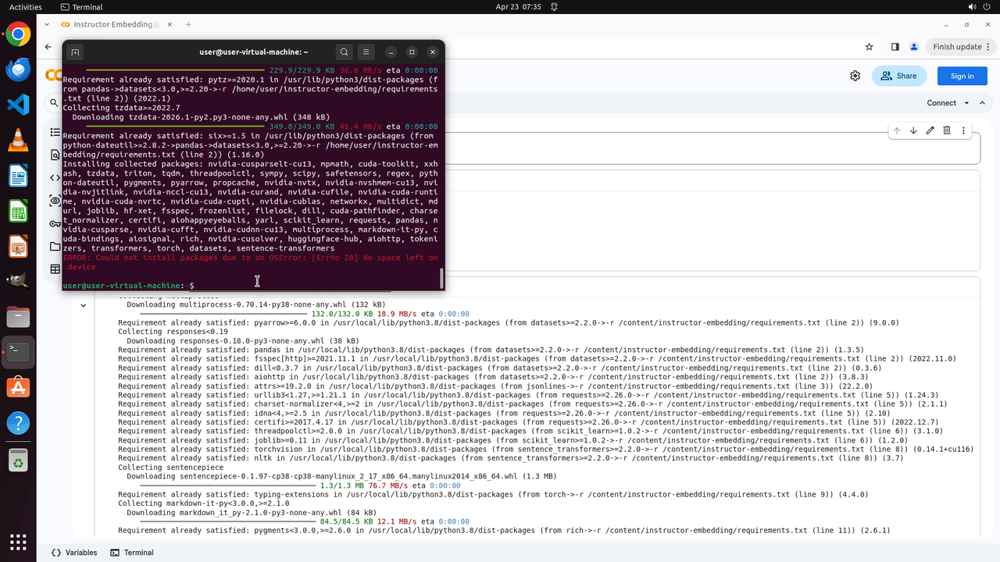

**Response:**
```
I can see the installation failed with an error: "ERROR: Could not install packages due to an OSError: [Errno 28] No space left on device". The disk is full. Let me check the available disk space and try to free some space.
```

**Actions:** `import subprocess, shlex; subprocess.run(f'xdotool type --delay 12 -- ' + shlex.quote('df -h\n'), shell=True, check=True)
import time; time.sleep(0.05)`

---

## Step 32

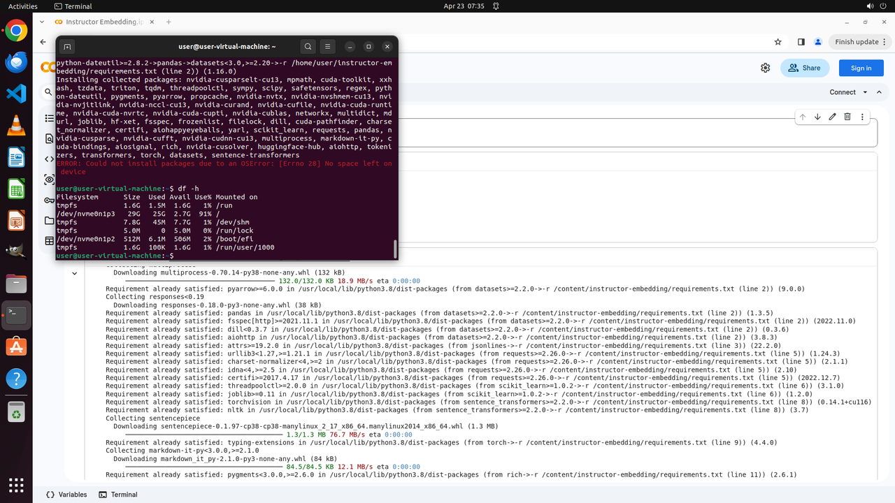

**Response:**
```
I can see the disk space situation:
- `/dev/nvme0n1p3` (root `/`): 29G total, 25G used, 2.7G available (91% used)

Only 2.7GB available, which is not enough for PyTorch and all the CUDA packages. Let me try to clean up the pip cache first, and then try installing with `--no-cache-dir` option. Let me also check if there are partially installed packages to clean up.
```

**Actions:** `import subprocess, shlex; subprocess.run(f'xdotool type --delay 12 -- ' + shlex.quote('pip cache purge\n'), shell=True, check=True)
import time; time.sleep(0.05)`

---

## Step 33

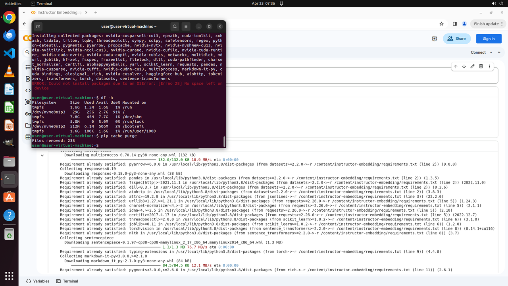

**Response:**
```
Good, 238 cache files were removed. Let me check the disk space again and also look at what's taking up space. The partial downloads might have left files in the user's local directory.
```

**Actions:** `import subprocess, shlex; subprocess.run(f'xdotool type --delay 12 -- ' + shlex.quote('df -h / && du -sh ~/.local/lib/python3.10/site-pac'), shell=True, check=True)
import time; time.sleep(0.05)
impor`

---

## Step 34

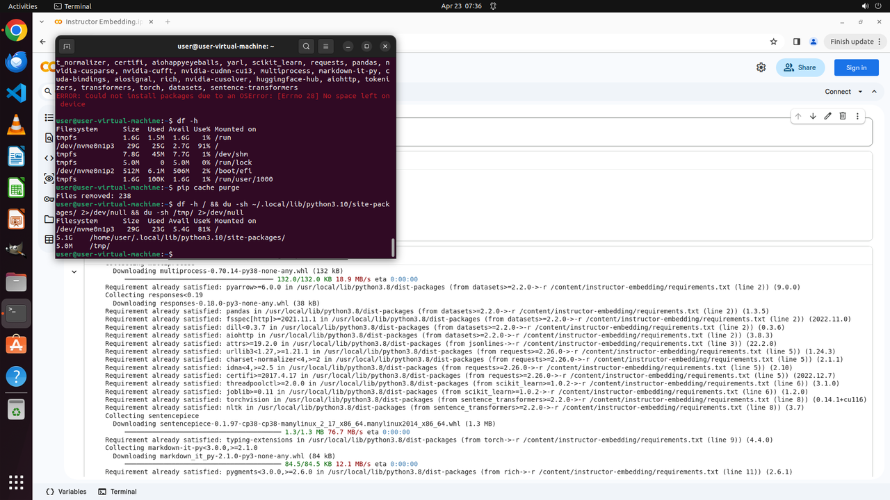

**Response:**
```
After purging the cache, I can see:
- Root filesystem: 29G total, 23G used, 5.4G available (81%)
- User's local site-packages: 5.1G
- /tmp: 5.0M

Good, the cache purge freed up about 2.7G of space (now 5.4G available). Now let me try the pip install again with `--no-cache-dir` to avoid filling up the cache again.
```

**Actions:** `import subprocess, shlex; subprocess.run(f'xdotool type --delay 12 -- ' + shlex.quote('pip install --no-cache-dir -r /home/user/instructo'), shell=True, check=True)
import time; time.sleep(0.05)
impor`

---

## Step 35

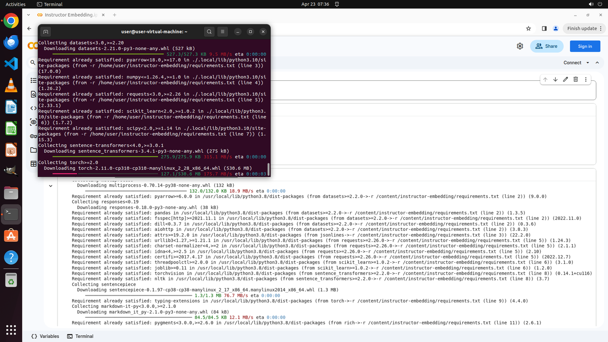

**Response:**
```
The installation is progressing again. It's downloading torch (530.6 MB) and other packages. Many requirements are already satisfied from the previous attempt. Let me wait for it to complete.
```

**Actions:** `time.sleep(0.5)`

---

## Step 36

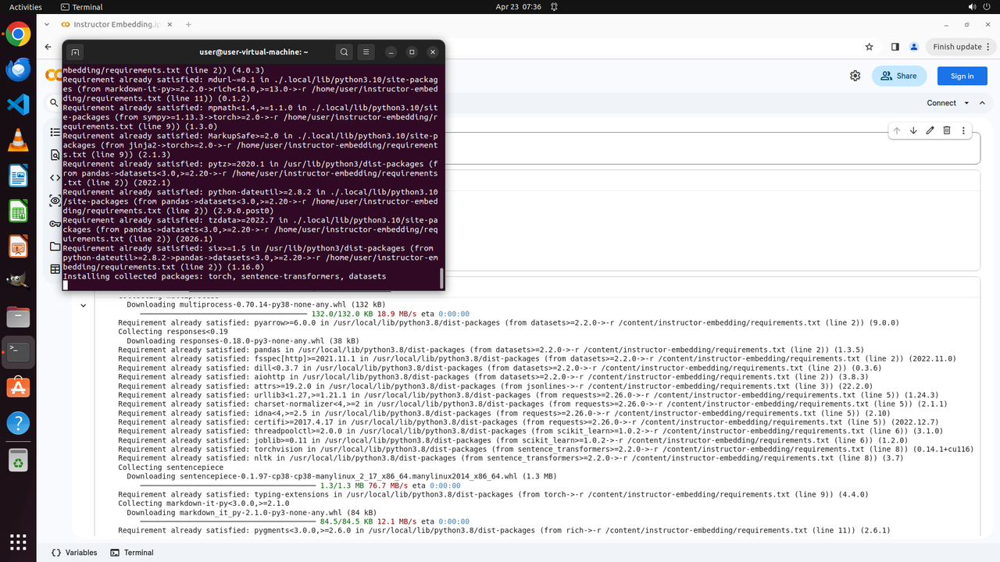

**Response:**
```
I can see "Installing collected packages: torch, sentence-transformers, datasets" - it's now installing only 3 packages this time (the rest were already satisfied from the previous partial install). Let me wait for this to complete.
```

**Actions:** `time.sleep(0.5)`

---

## Step 37


**Response:**
```
The installation completed successfully! I can see:
"Successfully installed datasets-2.21.0 sentence-transformers-3.4.1 torch-2.11.0"

The environment has been configured. Let me verify the setup by checking that the key packages are installed and the repository is in place.
```

**Actions:** `import subprocess, shlex; subprocess.run(f'xdotool type --delay 12 -- ' + shlex.quote('ls /home/user/instructor-embedding/ && python3 -c '), shell=True, check=True)
import time; time.sleep(0.05)
impor`

---

## Step 38

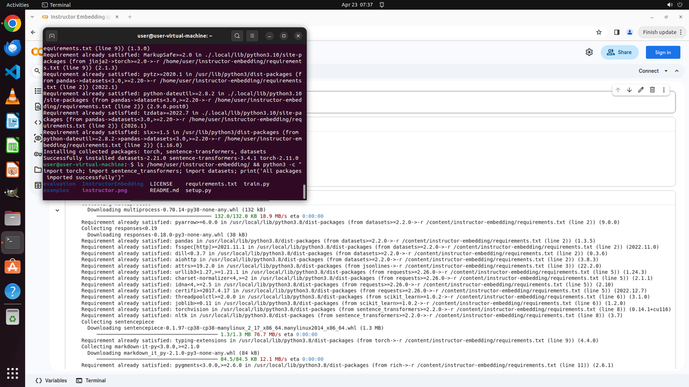

**Response:**
```
I can see the repository contents are listed:
- `evaluation`, `InstructorEmbedding`, `LICENSE`, `requirements.txt`, `train.py`
- `examples`, `instructor.png`, `README.md`, `setup.py`

The Python import is still running. Let me wait for it to complete.
```

**Actions:** `time.sleep(0.5)`

---

## Step 39

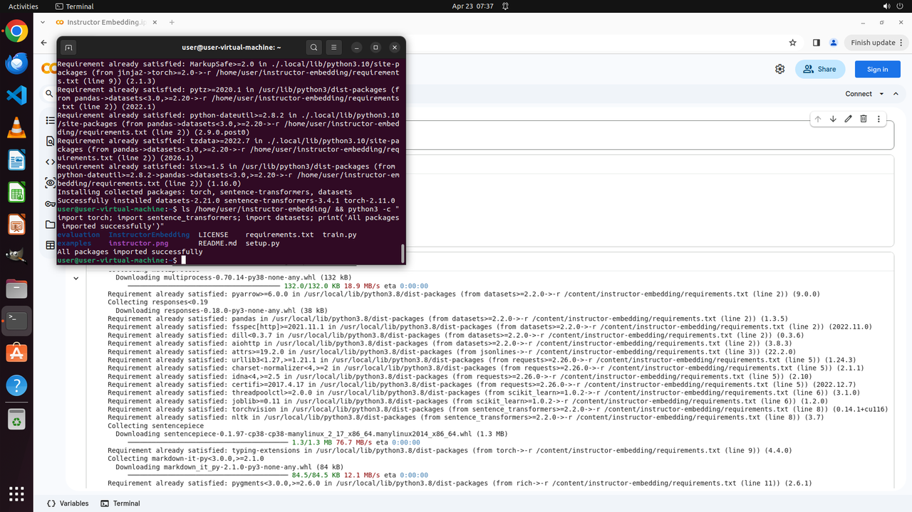

**Response:**
```
The environment has been successfully configured. I can see:

1. **Repository cloned**: The `instructor-embedding` repository is cloned at `/home/user/instructor-embedding/` with all its contents (InstructorEmbedding, evaluation, examples, train.py, setup.py, etc.)

2. **Requirements installed**: All packages from `requirements.txt` were installed successfully:
   - `datasets-2.21.0`
   - `sentence-transformers-3.4.1`
   - `torch-2.11.0`

3. **Verification passed**: "All packages imported successfully" - confirming that `torch`, `sentence_transformers`, and `datasets` can all be imported without errors.

The environment for the instructor-embedding word embedding project is now fully set up and ready to use!

DONE
```

**Actions:** `DONE`

---
