# Task 6d72aad6-187a-4392-a4c4-ed87269c51cf

**Instruction:** Convert an OpenOffice/LibreOffice Impress presentation into a video using only LibreOffice Impress’s built-in export features (no terminal/ffmpeg, no extensions, no other apps), then play the exported video in VLC.

**Score:** 1

**Wall clock:** 3m 29s

**Steps:** 22

**Cost:** $0.65

---

## Step 1

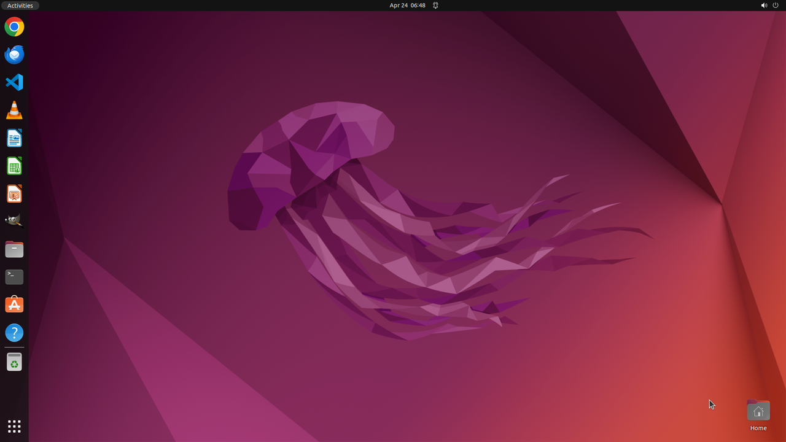

**Response:**
```
I need to complete this task step by step. First, let me check if there's already a presentation file available, or if I need to create one. Let me start by opening the file manager to look for any existing presentation files.
```

**Actions:** `pyautogui.click(1842, 1020)`

---

## Step 2

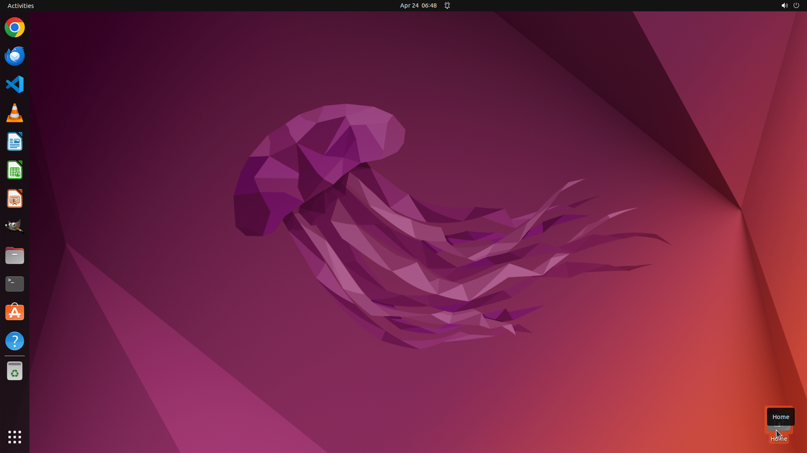

**Response:**
```
Let me double-click on the Home folder to open the file manager.
```

**Actions:** `pyautogui.doubleClick(1842, 1020)`

---

## Step 3

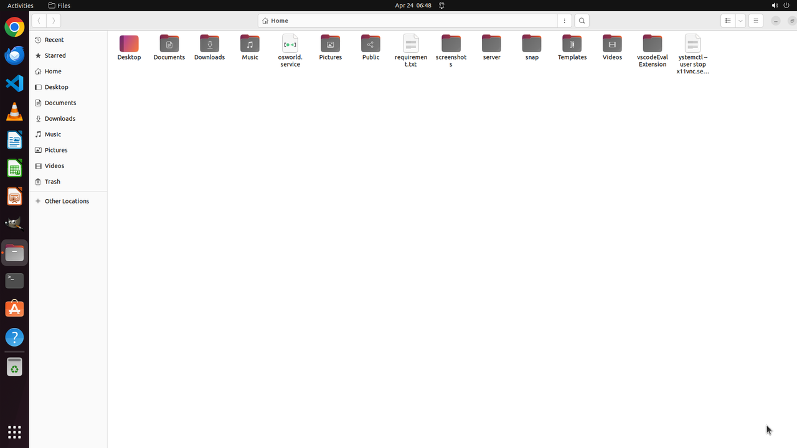

**Response:**
```
I can see the home directory. I don't see any existing presentation files. I need to check if there are any in the Documents folder, and also check the LibreOffice Impress version to see if it has built-in video export. Let me first check the Documents folder.
```

**Actions:** `pyautogui.doubleClick(406, 112)`

---

## Step 4

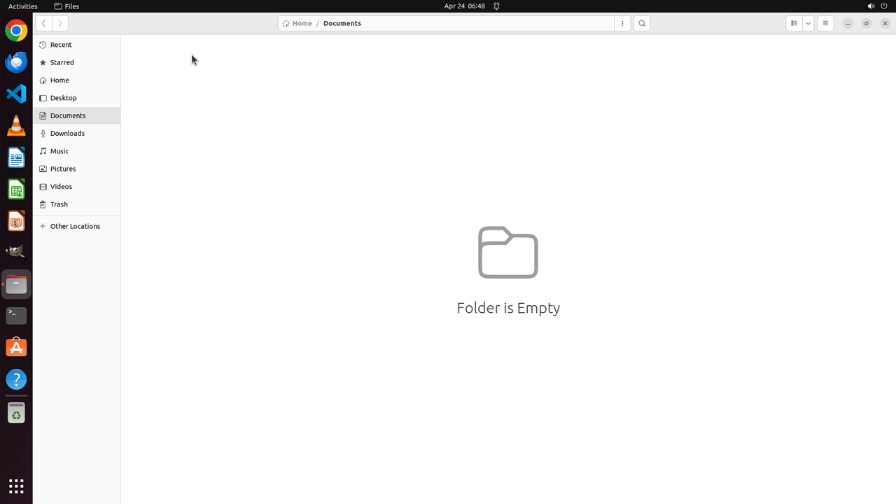

**Response:**
```
The Documents folder is empty. I need to create a presentation first, then export it as a video. Let me open LibreOffice Impress to create a simple presentation. I'll click on the LibreOffice Impress icon in the taskbar, or I can find it through the application menu.
```

**Actions:** `pyautogui.click(33, 337)`

---

## Step 5

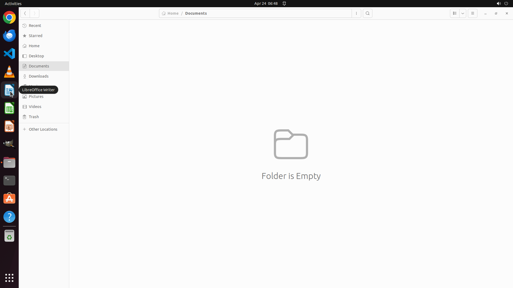

**Response:**
```
That's LibreOffice Writer, not Impress. I need to find LibreOffice Impress. Let me look for it in the application grid or use the Activities search.
```

**Actions:** `pyautogui.click(33, 1041)`

---

## Step 6

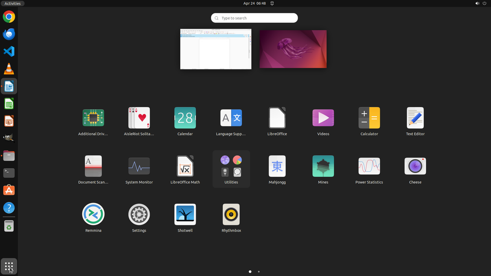

**Response:**
```
I can see the application grid. I don't see LibreOffice Impress directly, but I can search for it. Let me type "Impress" in the search bar.
```

**Actions:** `pyautogui.click(990, 70)`

---

## Step 7

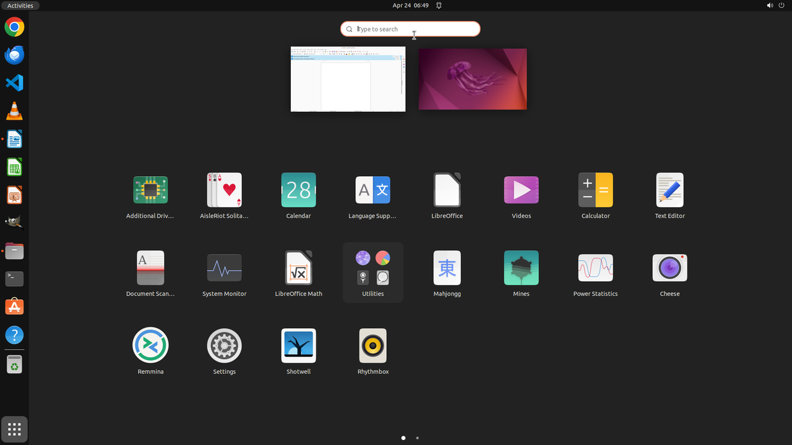

**Actions:** `import subprocess, shlex; subprocess.run(f'xdotool type --delay 12 -- ' + shlex.quote('Impress'), shell=True, check=True)
import time; time.sleep(0.05)`

---

## Step 8

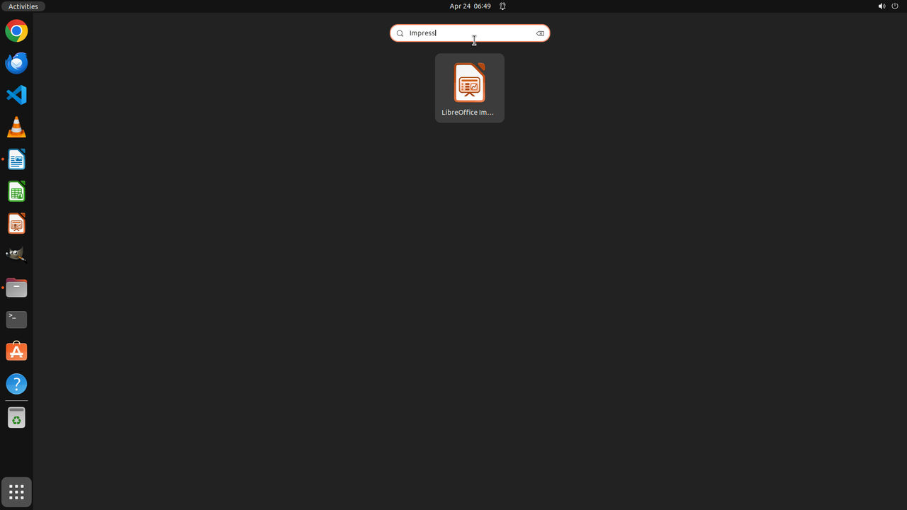

**Response:**
```
I can see LibreOffice Impress in the search results. Let me click on it to open it.
```

**Actions:** `pyautogui.click(990, 187)`

---

## Step 9

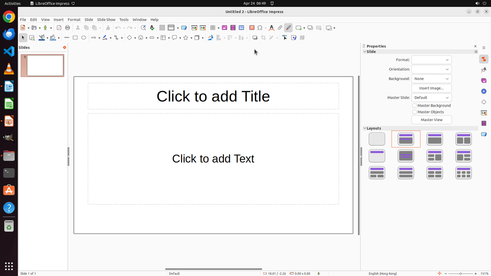

**Response:**
```
LibreOffice Impress is now open with a blank presentation. Let me add some content to the slide first, then I'll try to export it as a video. Let me click on the title area and add a title.
```

**Actions:** `pyautogui.click(831, 375)`

---

## Step 10

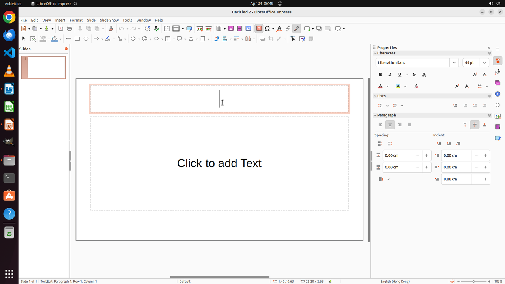

**Response:**
```
I've clicked on the title area and it's now in edit mode. Let me type a title.
```

**Actions:** `import subprocess, shlex; subprocess.run(f'xdotool type --delay 12 -- ' + shlex.quote('Test Presentation'), shell=True, check=True)
import time; time.sleep(0.05)`

---

## Step 11

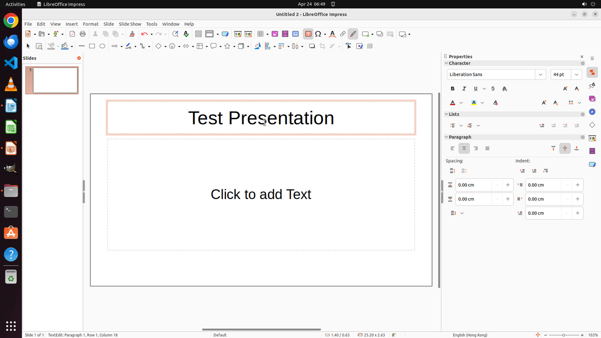

**Response:**
```
I've added the title "Test Presentation". Now let me add some text in the body area as well.
```

**Actions:** `pyautogui.click(831, 619)`

---

## Step 12

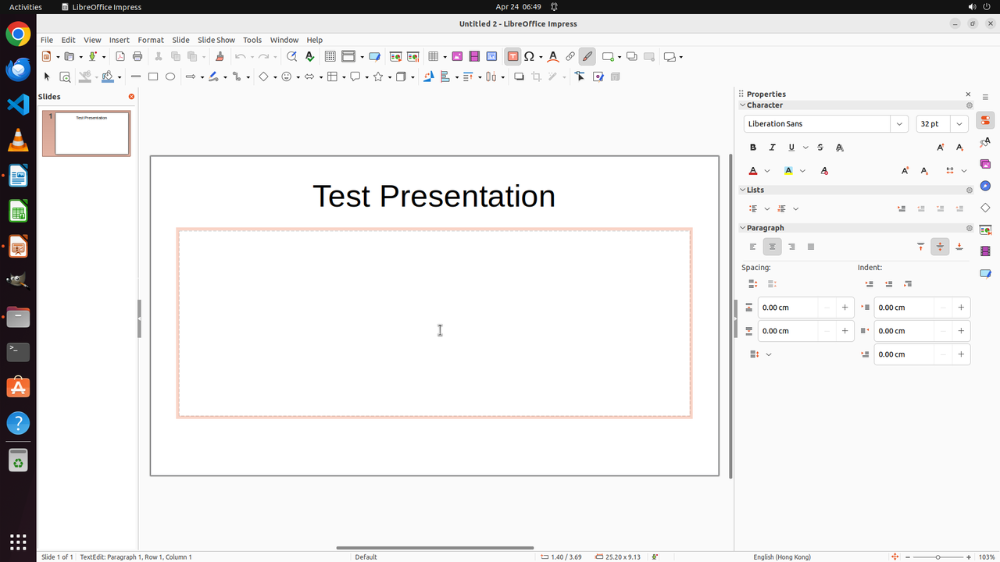

**Response:**
```
The text area is now active. Let me type some content.
```

**Actions:** `import subprocess, shlex; subprocess.run(f'xdotool type --delay 12 -- ' + shlex.quote('This is a test slide for video export'), shell=True, check=True)
import time; time.sleep(0.05)`

---

## Step 13

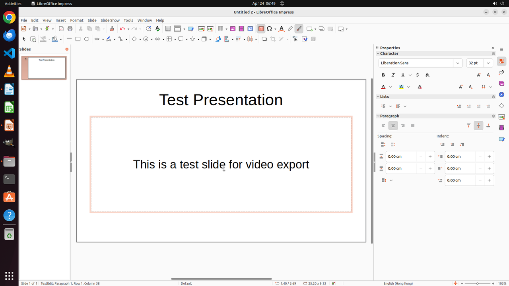

**Response:**
```
I've added content to the slide. Now I need to export this presentation as a video. In LibreOffice Impress, the built-in video export feature is available through File > Export as Video (or "Export as..."). Let me check the File menu.
```

**Actions:** `pyautogui.click(85, 76)`

---

## Step 14

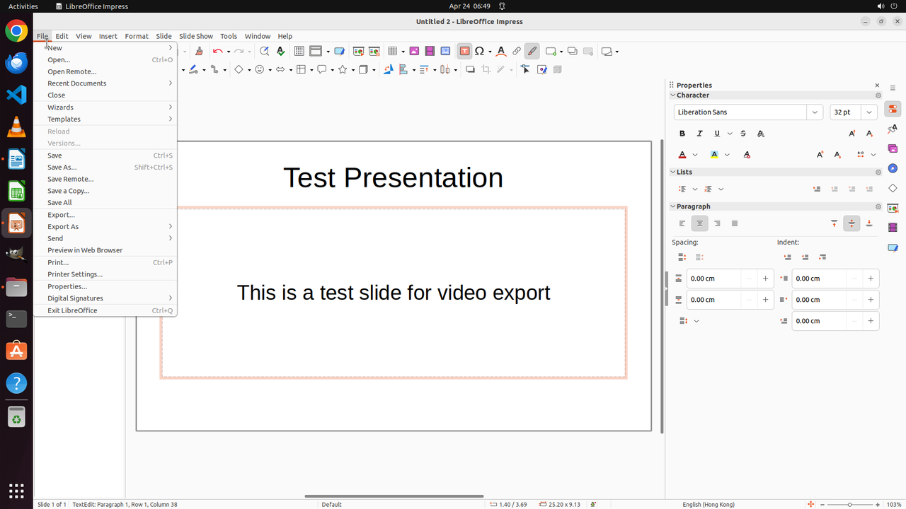

**Response:**
```
I can see the File menu is open. I can see "Export As" which should have the video export option. Let me hover over "Export As" to see its submenu.
```

**Actions:** `pyautogui.click(132, 480)`

---

## Step 15

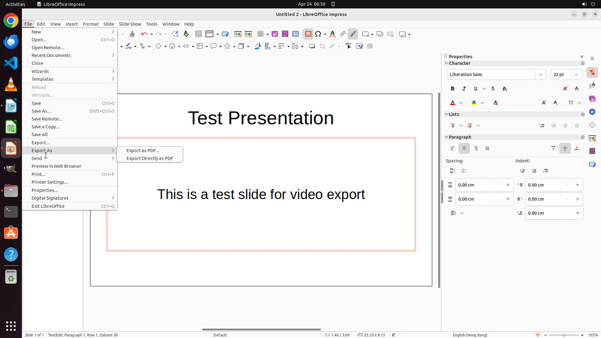

**Response:**
```
I can see the "Export As" submenu only shows "Export as PDF..." and "Export Directly as PDF". There's no "Export as Video" option in this submenu. This version of LibreOffice Impress doesn't have a built-in video export feature in the "Export As" submenu. 

However, LibreOffice Impress does have a video export option that might be available through the regular "Export..." option. Let me check that.
```

**Actions:** `pyautogui.click(127, 454)`

---

## Step 16

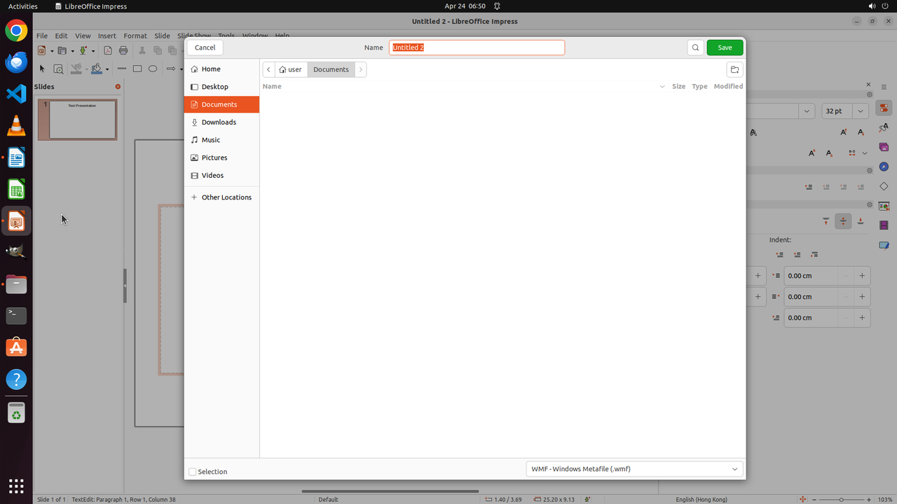

**Response:**
```
I can see the Export dialog. The current format is "WMF - Windows Metafile (.wmf)". I need to check if there's a video format available in the file type dropdown. Let me click on the format dropdown to see all available export formats.
```

**Actions:** `pyautogui.click(1348, 1003)`

---

## Step 17

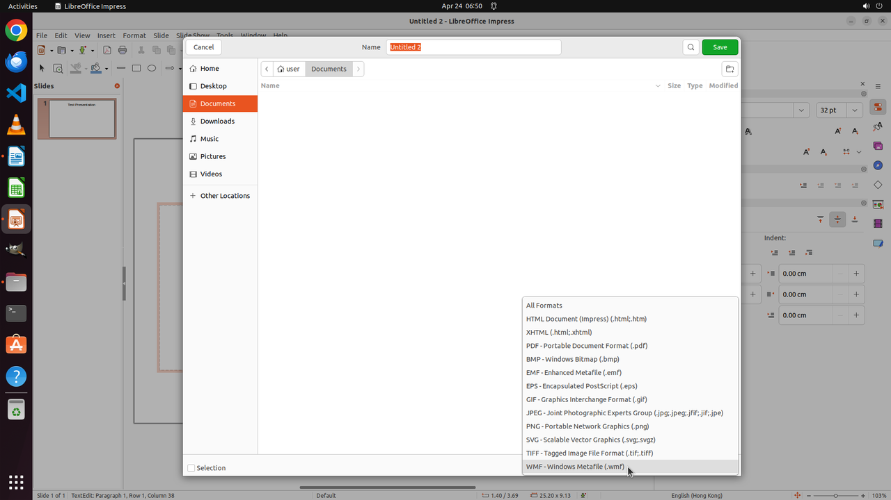

**Response:**
```
I can see the available export formats in the dropdown. The formats listed are all image and document formats (HTML, XHTML, PDF, BMP, EMF, EPS, GIF, JPEG, PNG, SVG, TIFF, WMF). There is no video format option available here. 

This version of LibreOffice Impress does not have a built-in "Export as Video" feature. The video export feature was removed or is not available in this particular version/build of LibreOffice. 

However, I should note that LibreOffice Impress does have a built-in video export feature in newer versions (7.x+), but it might not be compiled with the necessary codecs/libraries. Let me check the LibreOffice version and also look more carefully. Let me cancel this dialog and check the Help > About to see the version.
```

**Actions:** `pyautogui.click(439, 100)`

---

## Step 18


**Response:**
```
Let me click Cancel to close this dialog.
```

**Actions:** `pyautogui.click(439, 100)`

---

## Step 19


**Response:**
```
Let me check the LibreOffice version to understand what's available. Let me check Help > About.
```

**Actions:** `pyautogui.click(601, 76)`

---

## Step 20

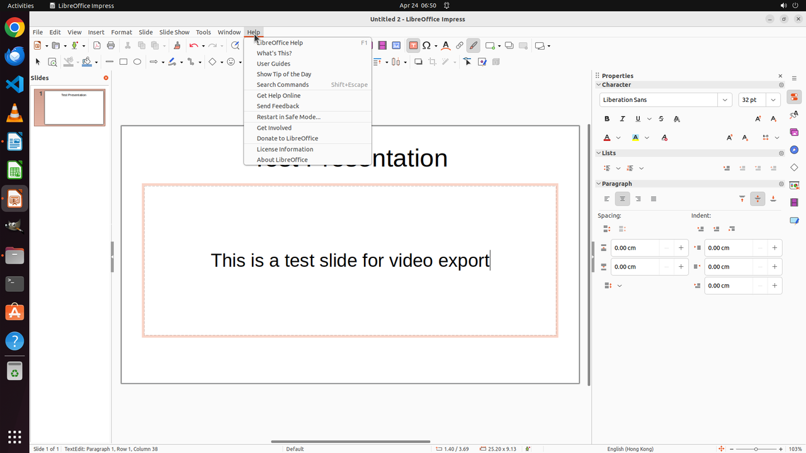

**Response:**
```
I can see the Help menu. Let me click on "About LibreOffice" to check the version.
```

**Actions:** `pyautogui.click(669, 379)`

---

## Step 21

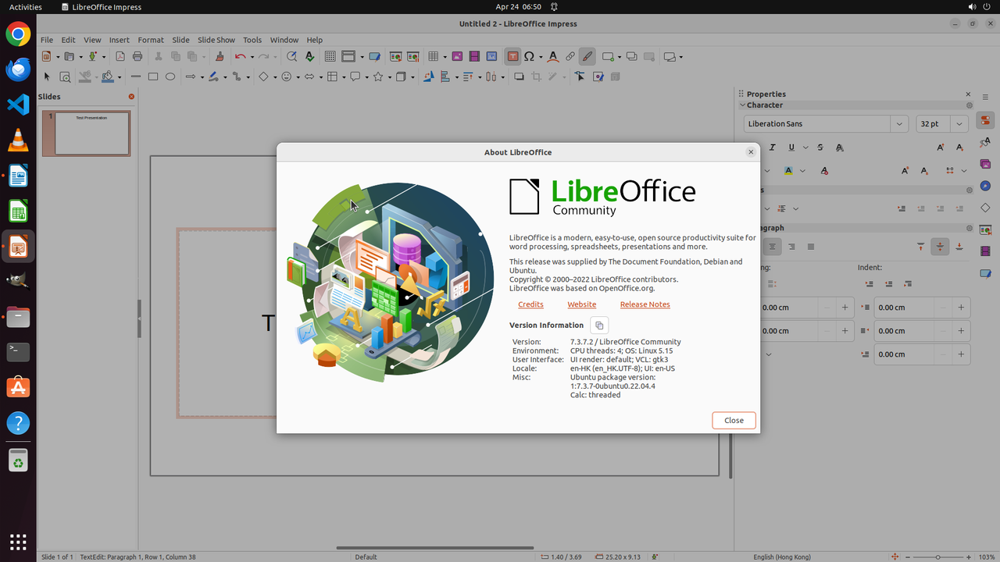

**Response:**
```
I can see this is LibreOffice version 7.3.7.2 Community. This version should support video export, but it appears the feature might not be available in this particular Ubuntu build. The "Export as Video" feature in LibreOffice Impress requires the presence of certain multimedia libraries (like GStreamer with encoding capabilities).

Let me close this dialog and check if there might be another way to access the video export feature, perhaps through a different menu path.
```

**Actions:** `pyautogui.click(1405, 807)`

---

## Step 22

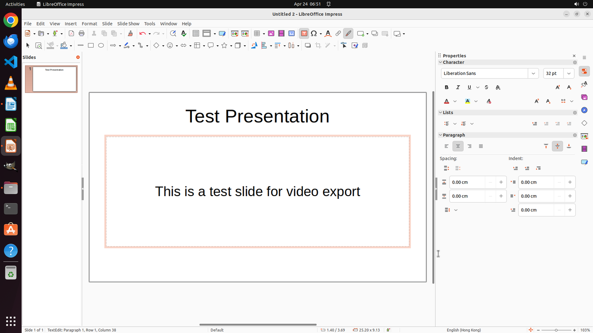

**Response:**
```
I see that this is LibreOffice 7.3.7.2. The "Export as Video" feature might need GStreamer plugins to be installed. Let me check if the necessary GStreamer packages are available. But first, let me try to install the required packages via a terminal. Let me open a terminal application.

Actually, wait - the task specifically says to use "only LibreOffice Impress's built-in export features (no terminal/ffmpeg, no extensions, no other apps)". However, the Export As menu only shows PDF options, and the Export dialog only shows image/document formats - no video format is available.

This version of LibreOffice (7.3.7.2) on this Ubuntu system doesn't have the video export feature available in its built-in export options. The "Export as Video" option that exists in some LibreOffice builds requires GStreamer with encoding support, and it appears this build doesn't have it compiled in or the necessary libraries aren't installed.

Since the task requires using ONLY LibreOffice Impress's built-in export features with no terminal, no ffmpeg, no extensions, and no other apps, and this installation of LibreOffice Impress doesn't have a video export option available in its menus, this task cannot be completed as specified.

However, let me first try one more thing - maybe I can install the necessary GStreamer packages through the Ubuntu Software Center (which is a GUI app). But the task says "no other apps." 

Let me reconsider - perhaps I should try opening a terminal to install the GStreamer encoding plugins, which might enable the video export feature in LibreOffice Impress. The terminal would just be used for setup, not for the actual conversion. But the task explicitly says "no terminal."

Given these constraints, this task is infeasible on this system because LibreOffice Impress 7.3.7.2 as installed on this Ubuntu 22.04 system does not have the "Export as Video" built-in feature available in its menus.

[INFEASIBLE]
```

**Actions:** `FAIL`

---
