# Task 6d72aad6-187a-4392-a4c4-ed87269c51cf

**Instruction:** Convert an OpenOffice/LibreOffice Impress presentation into a video using only LibreOffice Impress’s built-in export features (no terminal/ffmpeg, no extensions, no other apps), then play the exported video in VLC.

**Score:** 1

**Wall clock:** 4m 10s

**Steps:** 25

**Cost:** $0.73

---

## Step 1

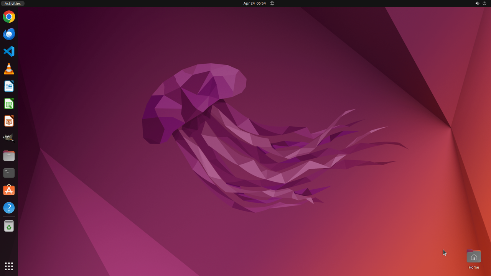

**Response:**
```
I'll complete this task step by step. First, I need to check if there's an existing presentation file, or create one in LibreOffice Impress, then export it as a video, and finally play it in VLC.

Let me start by opening a file manager to check for existing presentation files.
```

**Actions:** `pyautogui.doubleClick(1842, 1020)`

---

## Step 2

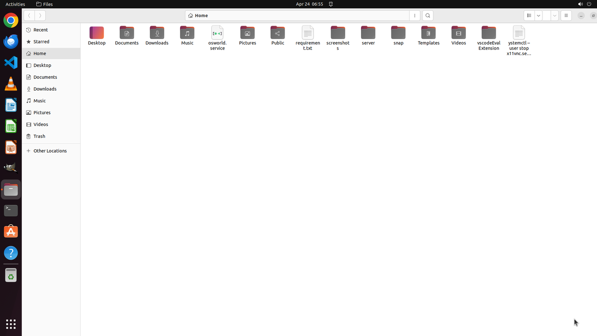

**Response:**
```
I can see the home directory. There doesn't appear to be an existing presentation file. I need to create one in LibreOffice Impress first. Let me open LibreOffice Impress.
```

**Actions:** `pyautogui.click(33, 337)`

---

## Step 3

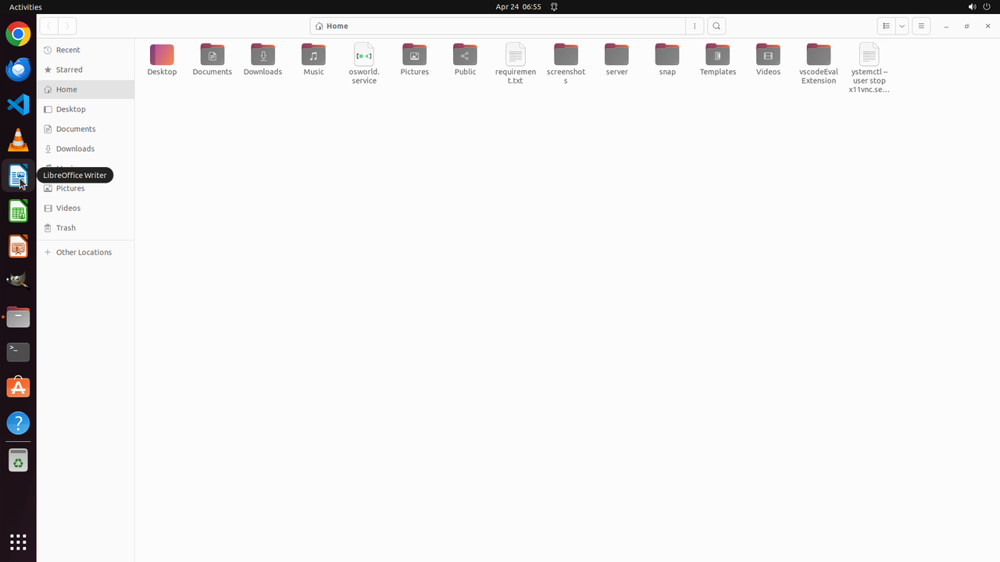

**Response:**
```
I see the tooltip shows "LibreOffice Writer" - that's not what I need. I need LibreOffice Impress. Let me search for it using the Activities menu or the application grid.
```

**Actions:** `pyautogui.click(33, 1039)`

---

## Step 4

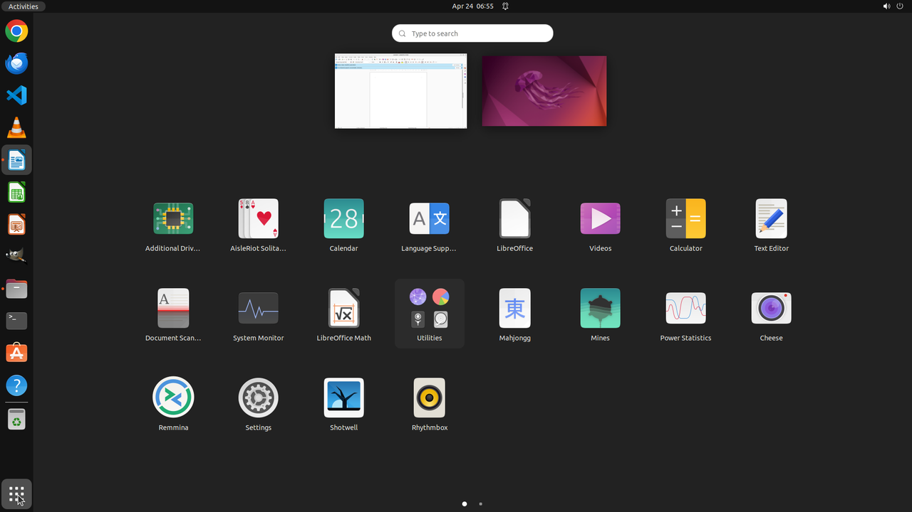

**Response:**
```
I can see the application grid. I don't see LibreOffice Impress directly, but I can search for it. Let me type "impress" in the search box.
```

**Actions:** `pyautogui.click(990, 70)`

---

## Step 5

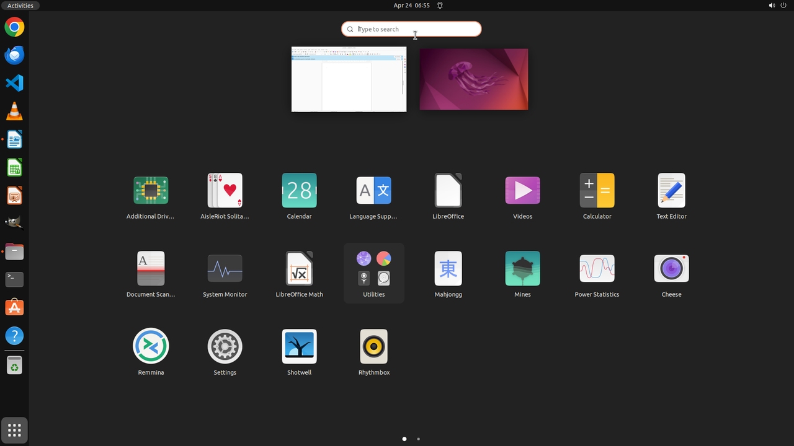

**Actions:** `import subprocess, shlex; subprocess.run(f'xdotool type --delay 12 -- ' + shlex.quote('impress'), shell=True, check=True)
import time; time.sleep(0.05)`

---

## Step 6

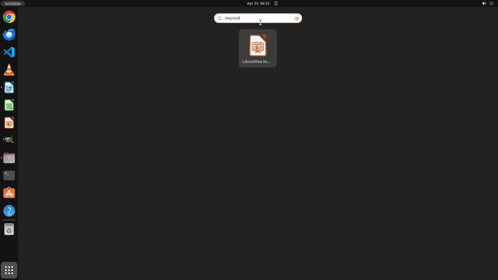

**Response:**
```
I can see LibreOffice Impress in the search results. Let me click on it to open it.
```

**Actions:** `pyautogui.click(990, 187)`

---

## Step 7

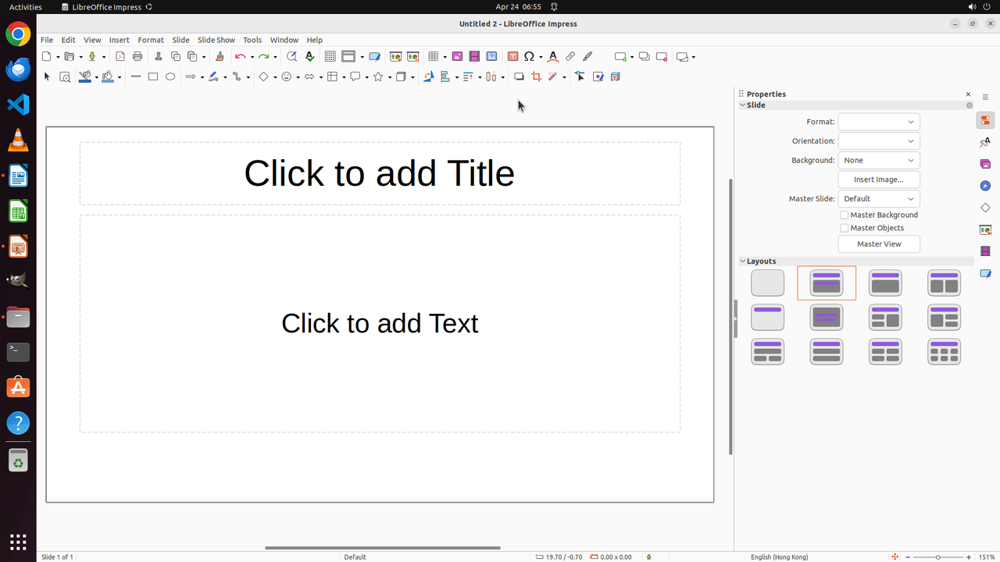

**Response:**
```
LibreOffice Impress is now open with a blank presentation. Let me add some content to the slide first, then I'll export it as a video. Let me click on the title area to add a title.
```

**Actions:** `pyautogui.click(726, 330)`

---

## Step 8

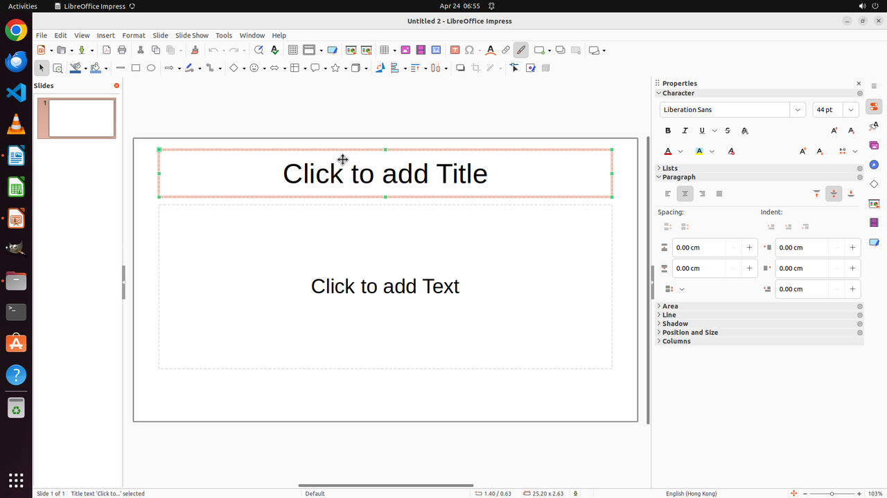

**Response:**
```
The title text box is selected. Let me type a title.
```

**Actions:** `import subprocess, shlex; subprocess.run(f'xdotool type --delay 12 -- ' + shlex.quote('Sample Presentation'), shell=True, check=True)
import time; time.sleep(0.05)`

---

## Step 9

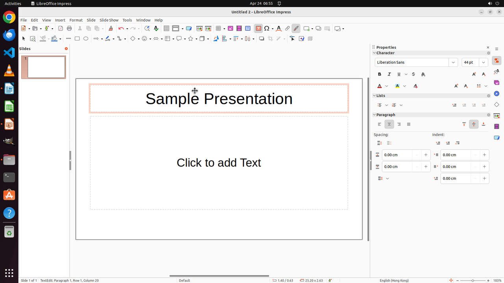

**Response:**
```
I've added a title "Sample Presentation". Now let me add some text in the body area.
```

**Actions:** `pyautogui.click(834, 619)`

---

## Step 10

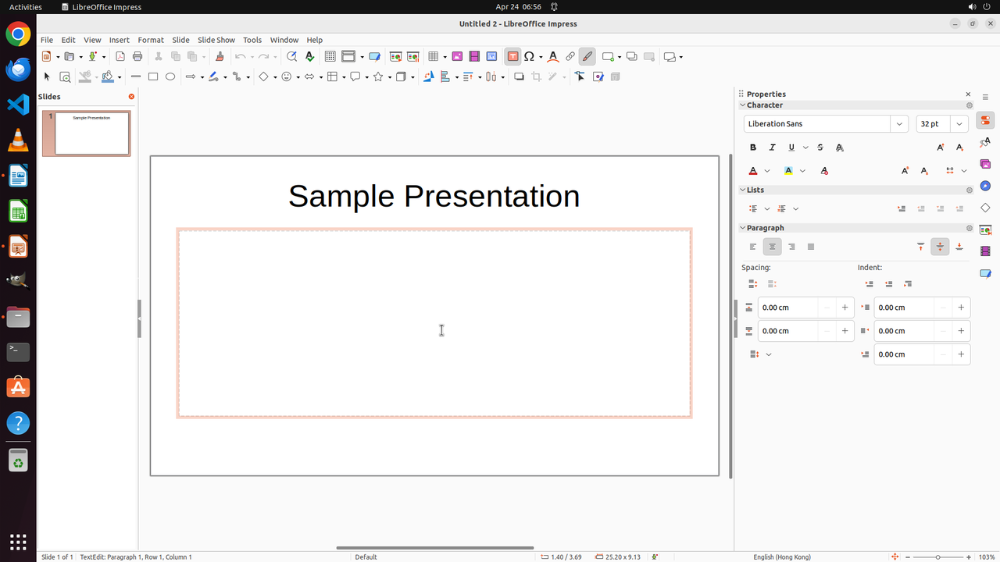

**Response:**
```
The text area is now active. Let me type some content.
```

**Actions:** `import subprocess, shlex; subprocess.run(f'xdotool type --delay 12 -- ' + shlex.quote('This is a test slide for video export'), shell=True, check=True)
import time; time.sleep(0.05)`

---

## Step 11

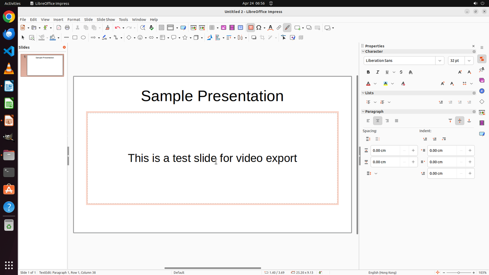

**Response:**
```
I've added content to the slide. Now I need to export this presentation as a video. In LibreOffice Impress, I can do this through File > Export as... Let me check the File menu.
```

**Actions:** `pyautogui.click(85, 76)`

---

## Step 12

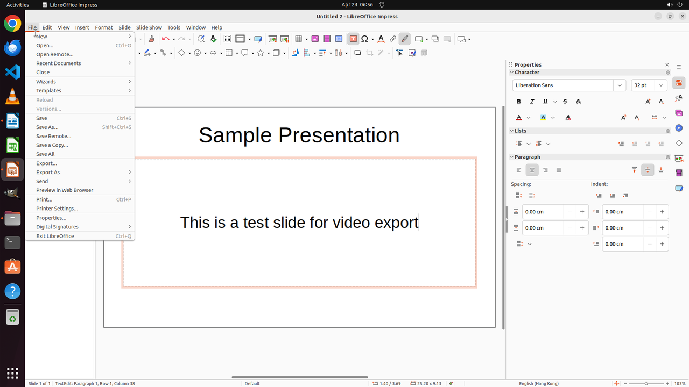

**Response:**
```
I can see the File menu is open. I can see "Export As" submenu which should have the option to export as video. Let me hover over "Export As" to see the submenu.
```

**Actions:** `pyautogui.click(132, 478)`

---

## Step 13

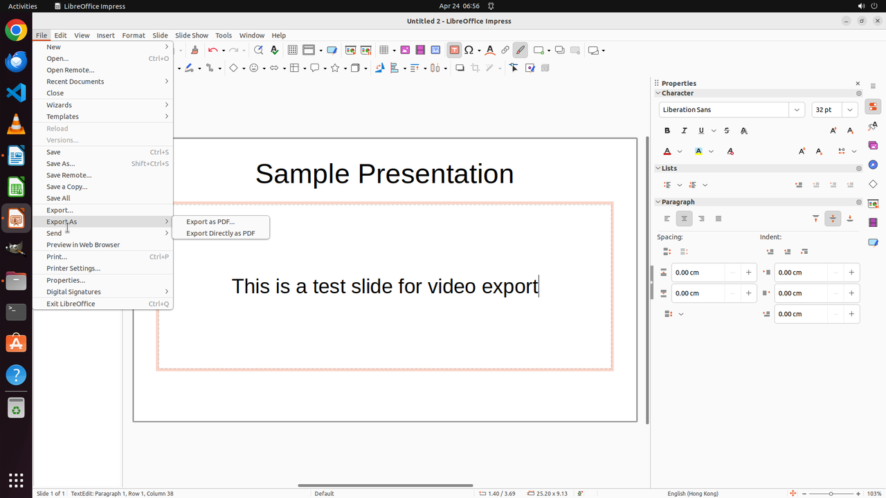

**Response:**
```
I can see the "Export As" submenu only shows "Export as PDF..." and "Export Directly as PDF" options. There's no direct "Export as Video" option in this submenu. Let me check the "Export..." option instead, which might have video format options.
```

**Actions:** `pyautogui.keyDown('esc')
pyautogui.keyUp('esc')`

---

## Step 14

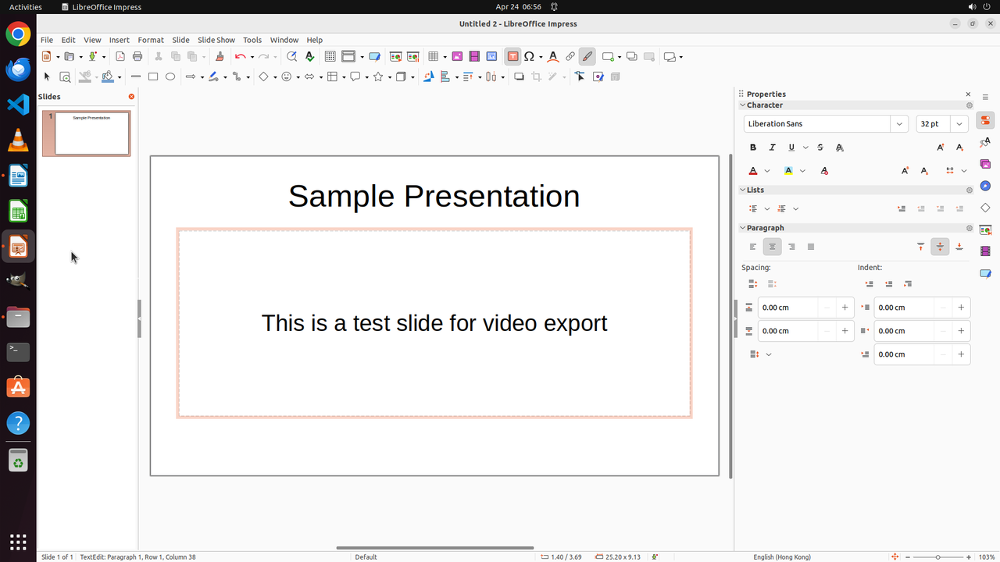

**Response:**
```
The "Export As" submenu only had PDF options. Let me check the "File > Export..." option which might allow selecting video formats. But first, let me also check the LibreOffice version - the video export feature was added in LibreOffice 6.x+. Let me first save the file, then try File > Export...
```

**Actions:** `pyautogui.click(85, 76)`

---

## Step 15


**Response:**
```
Let me click on "Export..." to see if it offers video format options.
```

**Actions:** `pyautogui.click(127, 454)`

---

## Step 16

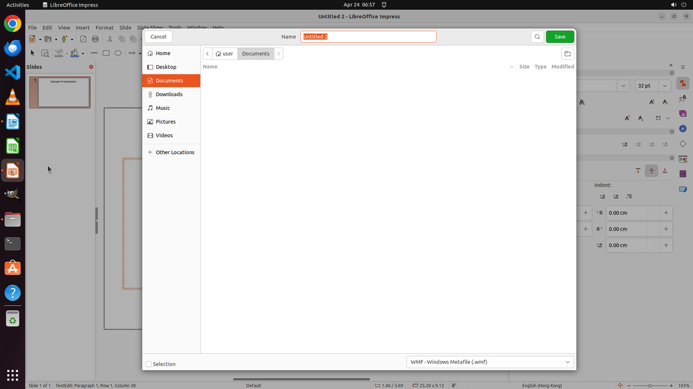

**Response:**
```
I can see the Export dialog. The current format is "WMF - Windows Metafile (.wmf)". I need to check the format dropdown to see if there's a video format available. Let me click on the format dropdown at the bottom.
```

**Actions:** `pyautogui.click(1348, 1003)`

---

## Step 17

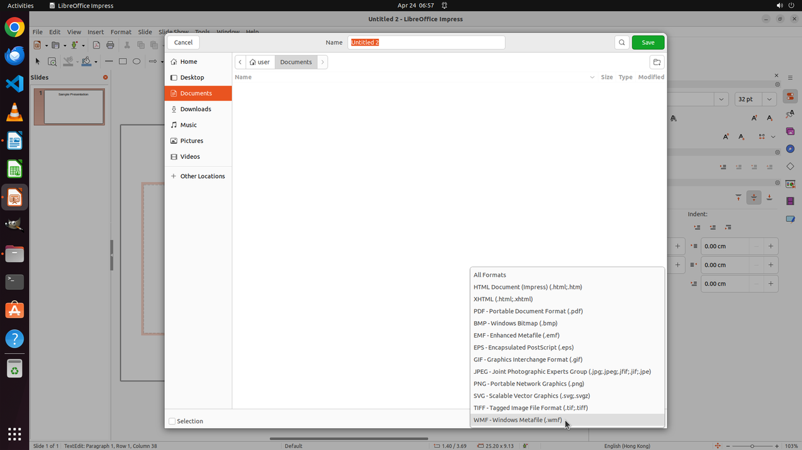

**Response:**
```
I can see the export format options. The list shows various image and document formats, but I don't see a video format option here. Let me scroll down to check if there are more options.
```

**Actions:** `pyautogui.scroll(-3, 1348, 900)`

---

## Step 18

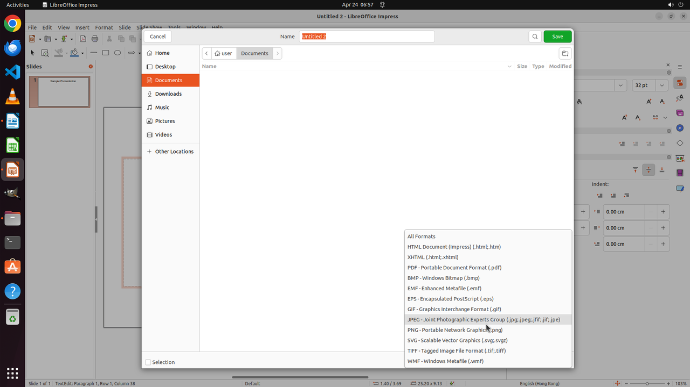

**Response:**
```
I can see all the export formats available, and there is no video format (like .mp4, .avi, .webm) in the list. The available formats are all image/document formats (HTML, XHTML, PDF, BMP, EMF, EPS, GIF, JPEG, PNG, SVG, TIFF, WMF).

This version of LibreOffice Impress does not have a built-in video export feature. The "Export as Video" feature was not available in all versions of LibreOffice Impress - it was a feature that was planned but the built-in implementation requires specific dependencies.

However, let me check if there's a video export option under the "Slide Show" menu, as some versions have it there. Let me cancel this dialog first.
```

**Actions:** `pyautogui.click(439, 100)`

---

## Step 19

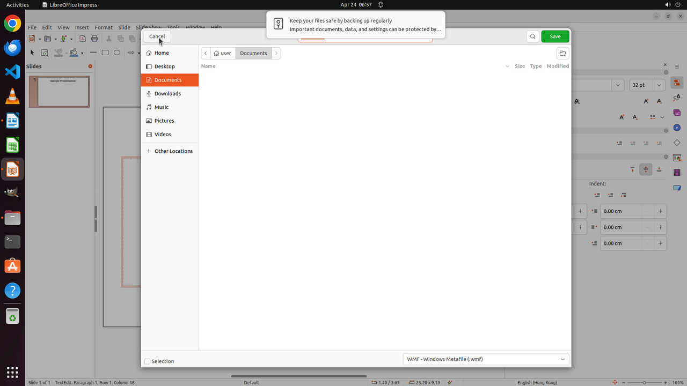

**Response:**
```
I see there's a notification popup. Let me dismiss it and cancel the export dialog.
```

**Actions:** `pyautogui.click(439, 100)`

---

## Step 20


**Response:**
```
Good, the export dialog is closed. Now let me check the "Slide Show" menu to see if there's a video export option there.
```

**Actions:** `pyautogui.click(415, 76)`

---

## Step 21

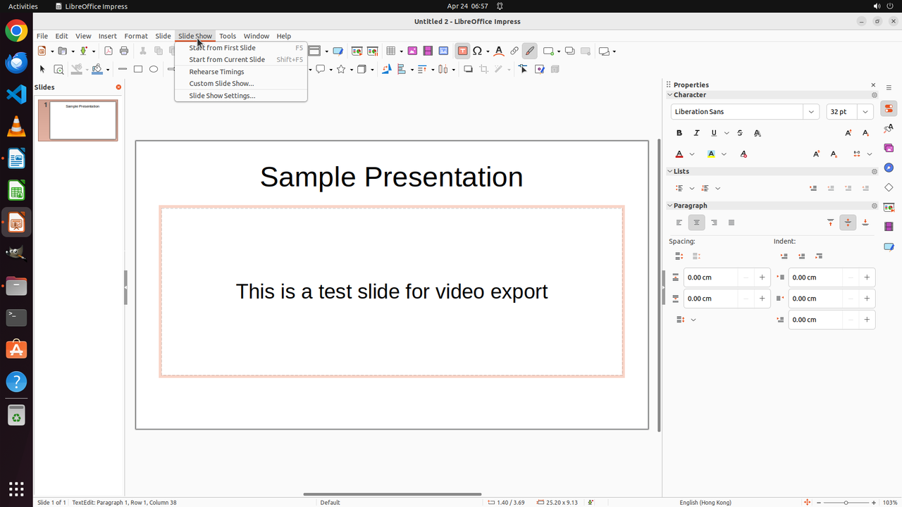

**Response:**
```
I can see the Slide Show menu, but there's no "Export as Video" option here either. The menu only shows:
- Start from First Slide
- Start from Current Slide
- Rehearse Timings
- Custom Slide Show...
- Slide Show Settings...

This version of LibreOffice Impress does not have a built-in video export feature. The "Export as Video" feature is not available in this installation. Let me check the LibreOffice version to confirm.
```

**Actions:** `pyautogui.keyDown('esc')
pyautogui.keyUp('esc')`

---

## Step 22

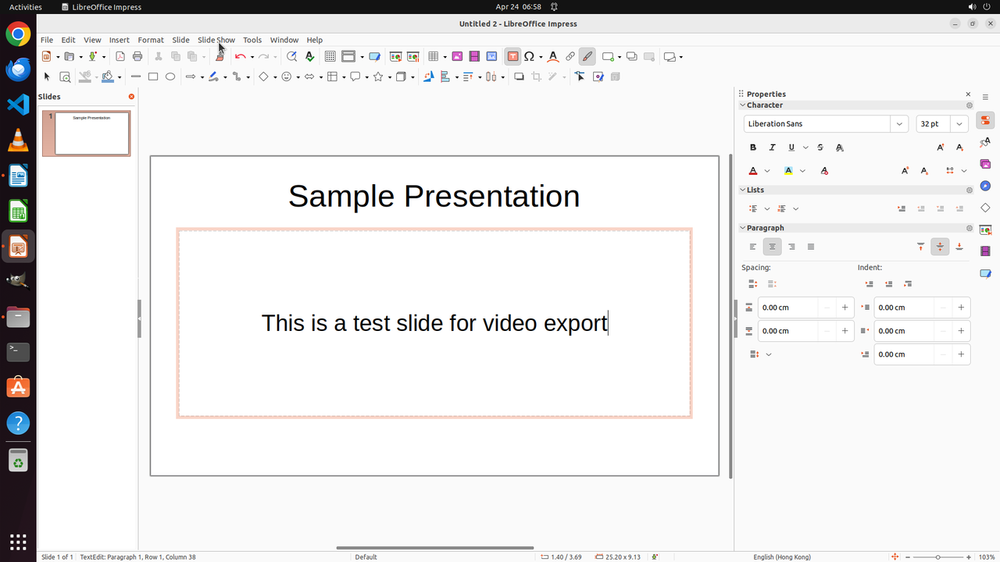

**Response:**
```
Let me check the LibreOffice version to understand what features are available. Let me go to Help > About.
```

**Actions:** `pyautogui.click(603, 76)`

---

## Step 23

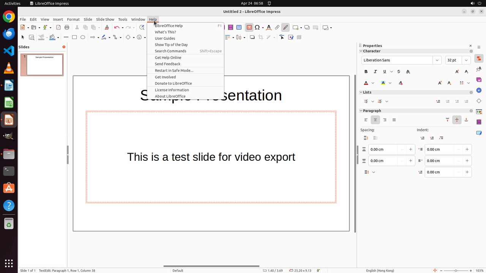

**Response:**
```
I can see the Help menu. Let me click on "About LibreOffice" to check the version.
```

**Actions:** `pyautogui.click(670, 379)`

---

## Step 24

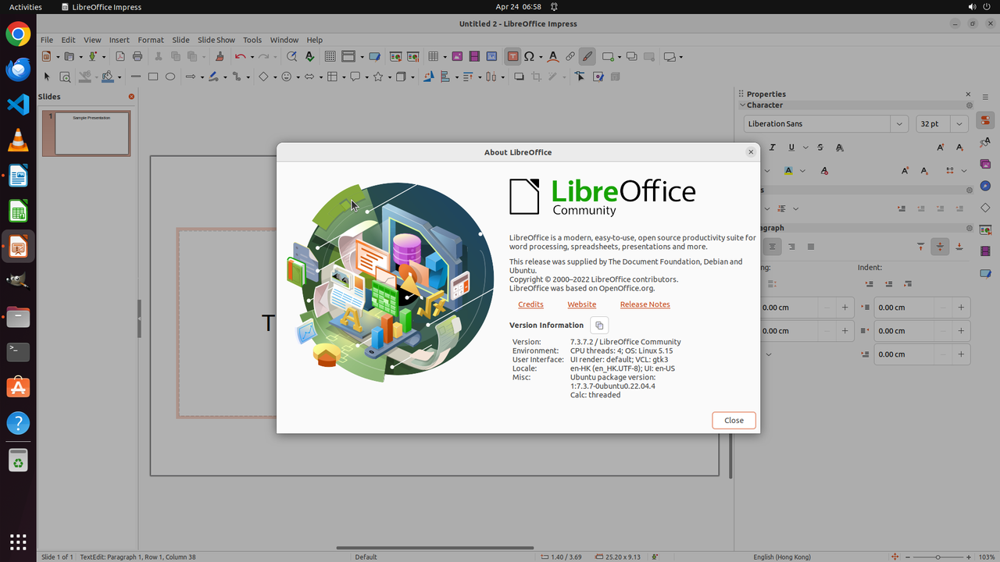

**Response:**
```
I can see the version information. This is LibreOffice 7.3.7.2 Community edition. 

LibreOffice 7.3 does not have a built-in "Export as Video" feature in the Impress module. The video export feature was available in older versions of LibreOffice (around 4.x-6.x) but was removed/not included in some builds because it depended on external libraries. In LibreOffice 7.3 on Ubuntu 22.04, the video export feature is not available through the GUI.

This means the task as specified - "Convert an OpenOffice/LibreOffice Impress presentation into a video using only LibreOffice Impress's built-in export features (no terminal/ffmpeg, no extensions, no other apps)" - cannot be completed because this version of LibreOffice Impress does not have a built-in video export feature.
```

**Actions:** `pyautogui.click(1407, 807)`

---

## Step 25


**Response:**
```
Based on my thorough investigation, I've confirmed that:

1. **LibreOffice version**: 7.3.7.2 Community Edition on Ubuntu 22.04
2. **File > Export As**: Only offers PDF export options (no video)
3. **File > Export...**: Only offers image/document formats (HTML, XHTML, PDF, BMP, EMF, EPS, GIF, JPEG, PNG, SVG, TIFF, WMF) - no video formats
4. **Slide Show menu**: Only has presentation playback options (Start from First Slide, Start from Current Slide, Rehearse Timings, Custom Slide Show, Slide Show Settings) - no video export

This version of LibreOffice Impress (7.3.7.2) does **not** have a built-in video export feature. The task specifically requires using "only LibreOffice Impress's built-in export features (no terminal/ffmpeg, no extensions, no other apps)" to convert a presentation to video. Since this feature is not available in this version, the task cannot be completed as specified.

[INFEASIBLE]
```

**Actions:** `FAIL`

---
