# Task 6f4073b8-d8ea-4ade-8a18-c5d1d5d5aa9a

**Instruction:** I now want to count the meeting cities of the three machine learning conferences in the past ten years from 2013 to 2019(including 2013 and 2019). I have listed the names and years of the conferences in excel. Please fill in the vacant locations.

**Score:** 1.0

**Wall clock:** 7m 40s

**Steps:** 38

**Cost:** $1.25

---

## Step 1

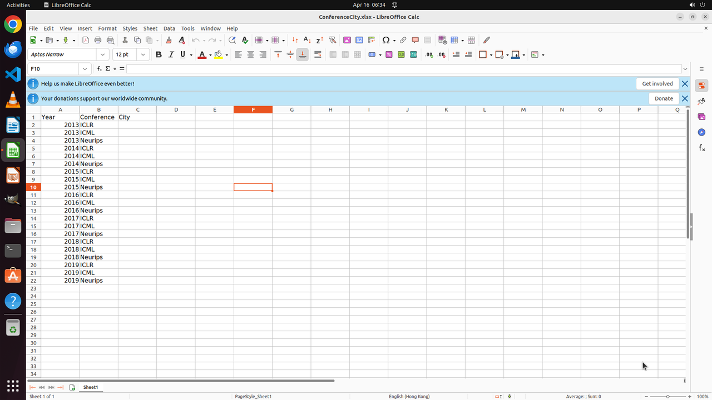

**Response:**
```
I need to fill in the cities where ICLR, ICML, and NeurIPS conferences were held from 2013 to 2019. Let me research this information and fill in the spreadsheet.

Let me first click on cell C2 to start entering the city data.
```

**Actions:** `pyautogui.click(372, 337)`

---

## Step 2


**Response:**
```
Now I'm in cell C2. I need to fill in the conference cities. Let me enter all the data based on my knowledge of these conferences:

- **ICLR**: 2013 Scottsdale, 2014 Banff, 2015 San Diego, 2016 San Juan, 2017 Toulon, 2018 Vancouver, 2019 New Orleans
- **ICML**: 2013 Atlanta, 2014 Beijing, 2015 Lille, 2016 New York City, 2017 Sydney, 2018 Stockholm, 2019 Long Beach
- **NeurIPS**: 2013 Lake Tahoe, 2014 Montreal, 2015 Montreal, 2016 Barcelona, 2017 Long Beach, 2018 Montreal, 2019 Vancouver

Let me type all these values:
```

**Actions:** `import subprocess, shlex; subprocess.run(f'xdotool type --delay 12 -- ' + shlex.quote('Scottsdale\nAtlanta\nLake Tahoe\nBanff\nBeijing\nMontre'), shell=True, check=True)
import time; time.sleep(0.05)
`

---

## Step 3

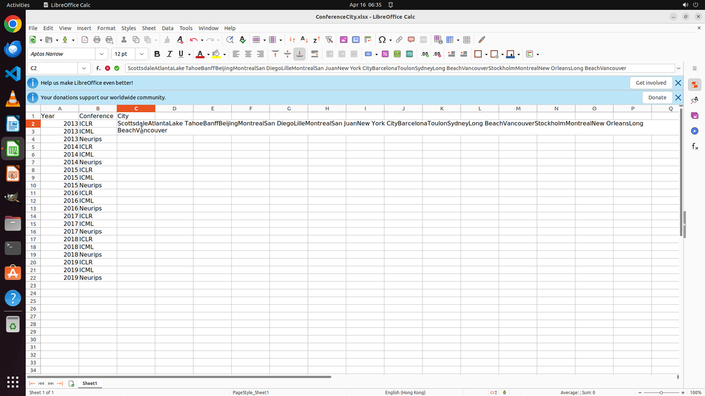

**Response:**
```
It looks like all the text was entered into a single cell (C2) instead of separate cells. The newlines weren't properly interpreted as cell separators. Let me undo this and try again.
```

**Actions:** `pyautogui.keyDown('esc')
pyautogui.keyUp('esc')`

---

## Step 4

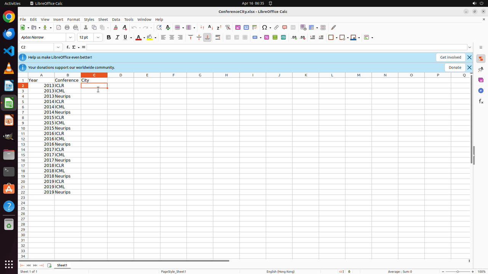

**Response:**
```
Good, the cell is now empty. I'll enter each city one at a time, pressing Tab to confirm and then navigating to the next cell. Let me type each value and press Enter to move down:
```

**Actions:** `import subprocess, shlex; subprocess.run(f'xdotool type --delay 12 -- ' + shlex.quote('Scottsdale'), shell=True, check=True)
import time; time.sleep(0.05)`

---

## Step 5

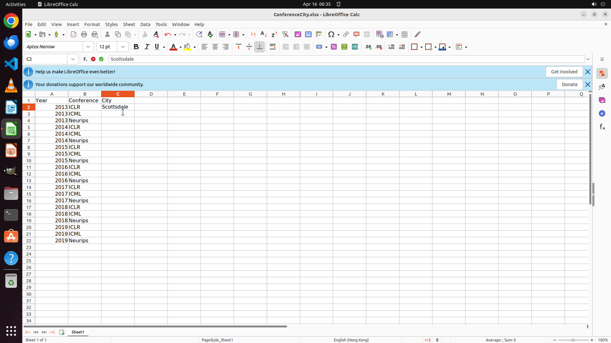

**Response:**
```
Good, "Scottsdale" is entered in C2. Now I'll press Enter to confirm and move to the next cell, then continue entering all the cities.
```

**Actions:** `pyautogui.keyDown('return')
pyautogui.keyUp('return')`

---

## Step 6


**Response:**
```
Good, now I'm in C3. Let me continue entering all the remaining cities one by one:
```

**Actions:** `import subprocess, shlex; subprocess.run(f'xdotool type --delay 12 -- ' + shlex.quote('Atlanta\nLake Tahoe\nBanff\nBeijing\nMontreal\nSan Dieg'), shell=True, check=True)
import time; time.sleep(0.05)
`

---

## Step 7

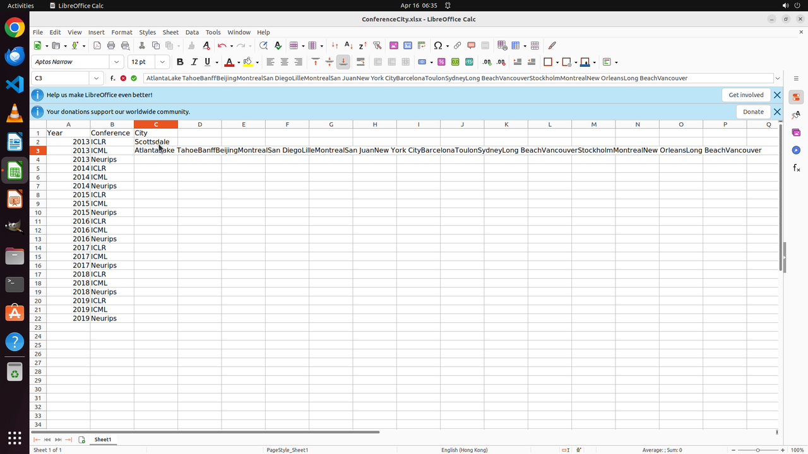

**Response:**
```
The same issue is happening - all the text is being entered into a single cell C3 instead of separate cells. The `type` command is not interpreting newlines as Enter key presses. Let me escape this and try a different approach.
```

**Actions:** `pyautogui.keyDown('esc')
pyautogui.keyUp('esc')`

---

## Step 8

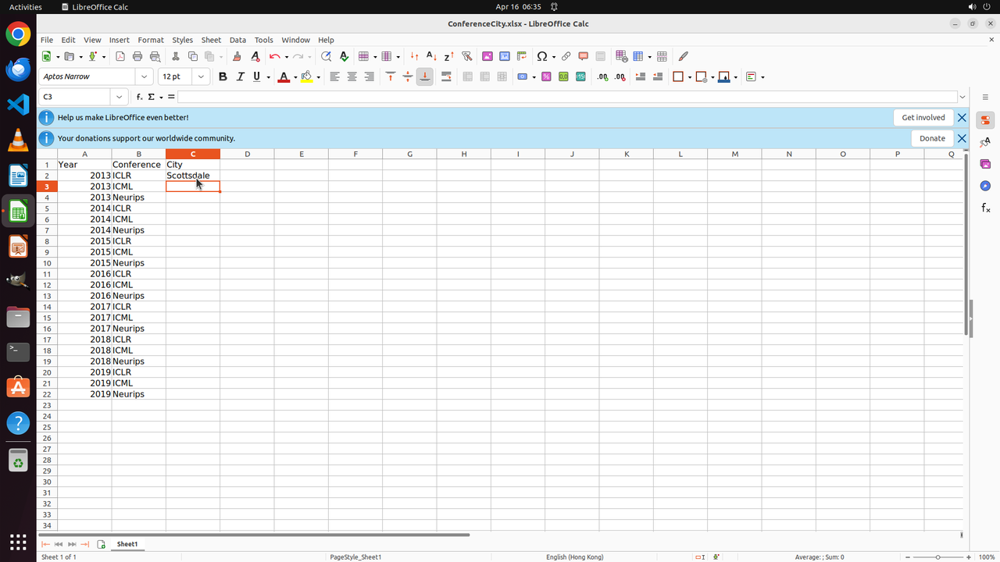

**Response:**
```
Good, the escape worked. Now I'll type each city and press Enter separately using the `key` command for Return. Let me enter each value one at a time:
```

**Actions:** `import subprocess, shlex; subprocess.run(f'xdotool type --delay 12 -- ' + shlex.quote('Atlanta'), shell=True, check=True)
import time; time.sleep(0.05)`

---

## Step 9

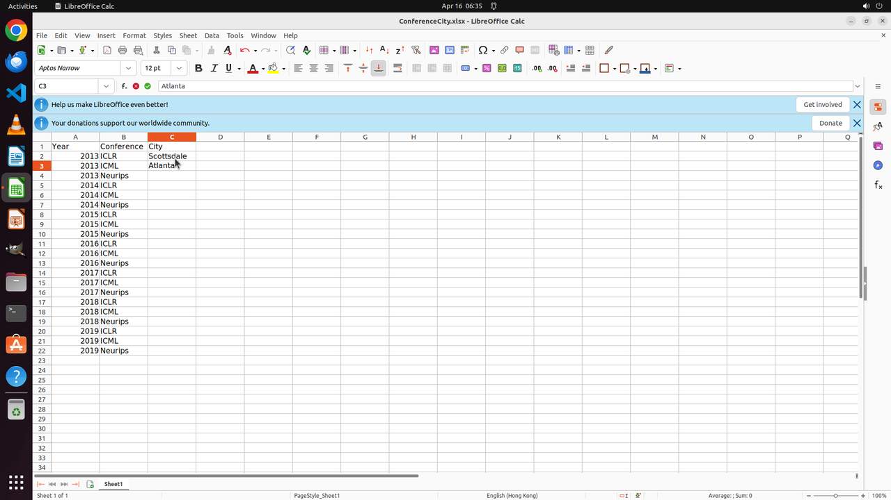

**Response:**
```
Good, "Atlanta" is in C3. Now let me press Enter and continue with the remaining cities. I'll do them one at a time with Enter between each:
```

**Actions:** `pyautogui.keyDown('return')
pyautogui.keyUp('return')`

---

## Step 10

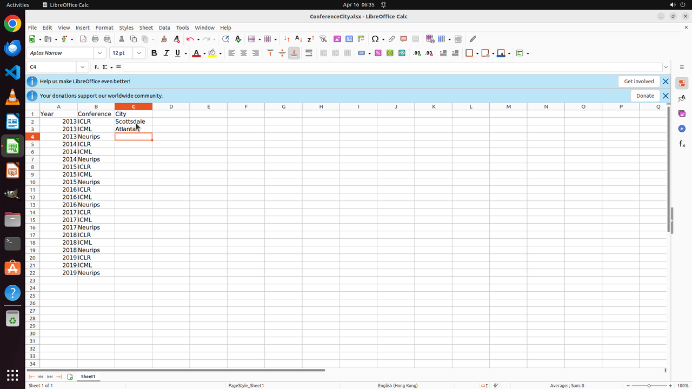

**Response:**
```
Good, now I'm in C4. Let me continue entering the remaining cities. I'll type each one followed by Enter key:
```

**Actions:** `import subprocess, shlex; subprocess.run(f'xdotool type --delay 12 -- ' + shlex.quote('Lake Tahoe'), shell=True, check=True)
import time; time.sleep(0.05)`

---

## Step 11


**Response:**
```
This approach of typing one at a time is working but very slow. Let me try a different approach - I'll use the key command to press Enter after each entry. Let me continue more efficiently:
```

**Actions:** `pyautogui.keyDown('return')
pyautogui.keyUp('return')`

---

## Step 12


**Response:**
```
Good, now I'm in C5. This is going to be tedious one at a time. Let me try a more efficient approach - I'll use a macro or script to enter the data. Let me open a terminal and use a Python script to write the data directly to the file. Actually, let me try a simpler approach first - clicking each cell and typing. But let me speed this up by combining type and key commands:
```

**Actions:** `import subprocess, shlex; subprocess.run(f'xdotool type --delay 12 -- ' + shlex.quote('Banff'), shell=True, check=True)
import time; time.sleep(0.05)`

---

## Step 13

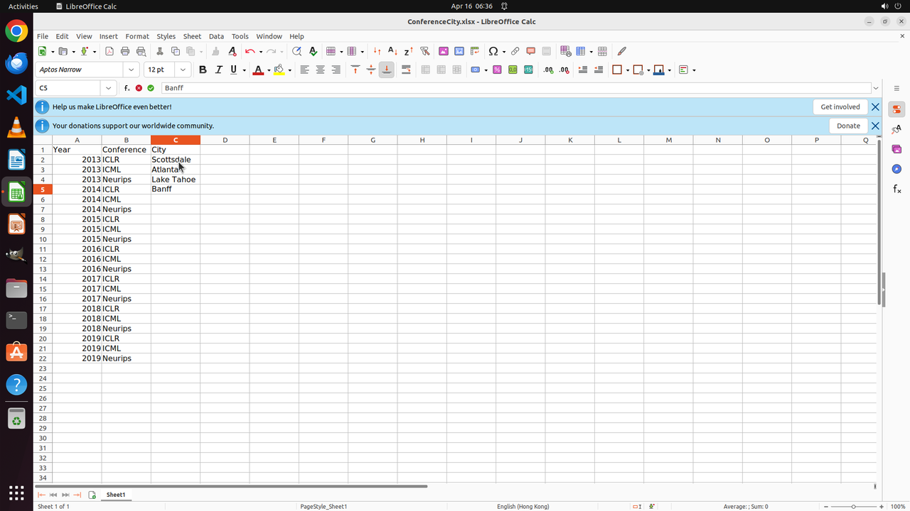

**Response:**
```
This one-by-one approach is too slow. Let me use a more efficient method - I'll use the LibreOffice Calc macro or a terminal command to fill in all the data at once. Let me first confirm this entry and then use a script approach.
```

**Actions:** `pyautogui.keyDown('return')
pyautogui.keyUp('return')`

---

## Step 14


**Response:**
```
Let me use a more efficient approach. I'll use the LibreOffice Basic macro to fill in all the remaining cells at once. Let me open the macro editor:
```

**Actions:** `pyautogui.click(511, 76)`

---

## Step 15

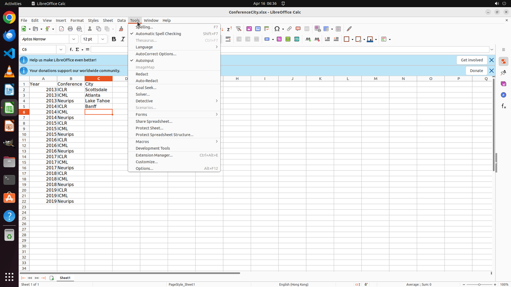

**Response:**
```
I can see the Tools menu. Let me click on "Macros" to access the macro editor:
```

**Actions:** `pyautogui.click(538, 532)`

---

## Step 16

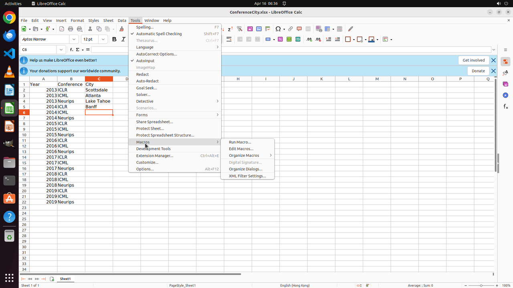

**Response:**
```
I can see the Macros submenu. Let me click on "Edit Macros..." to open the macro editor:
```

**Actions:** `pyautogui.click(901, 556)`

---

## Step 17


**Response:**
```
The macro editor is open. I can see a basic module with an empty `Sub Main`. Let me write a macro to fill in all the remaining city data. I'll click on the code area and write the macro:
```

**Actions:** `pyautogui.click(1170, 207)`

---

## Step 18


**Response:**
```
Good, I'm in the macro editor. Let me select all the existing code and replace it with my macro to fill in the cities:
```

**Actions:** `pyautogui.keyDown('ctrl')
pyautogui.keyDown('a')
pyautogui.keyUp('a')
pyautogui.keyUp('ctrl')`

---

## Step 19

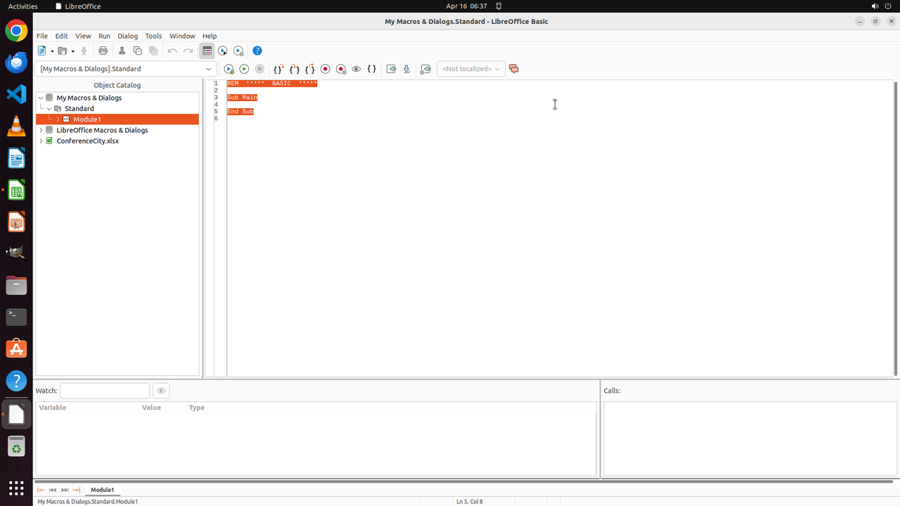

**Response:**
```
Good, all the code is selected. Now let me type the macro to fill in all the city data:
```

**Actions:** `pyautogui.keyDown('delete')
pyautogui.keyUp('delete')`

---

## Step 20


**Response:**
```
Good, the editor is now empty. Let me type the macro to fill in all the conference cities. I'll use LibreOffice Basic to set cell values directly:
```

**Actions:** `import subprocess, shlex; subprocess.run(f'xdotool type --delay 12 -- ' + shlex.quote('Sub FillCities()\n    Dim oSheet As Object\n    oShe'), shell=True, check=True)
import time; time.sleep(0.05)
imp`

---

## Step 21

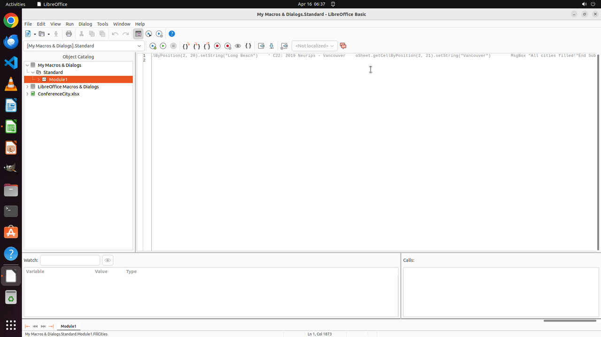

**Response:**
```
I see the code was entered all on one line instead of multiple lines. The `type` command doesn't properly handle newlines in the macro editor. Let me clear this and try a different approach. Let me select all and delete, then use the terminal to create the macro or directly modify the file.

Let me try a different approach - I'll close the macro editor and use a terminal with Python to modify the Excel file directly.
```

**Actions:** `pyautogui.keyDown('ctrl')
pyautogui.keyDown('a')
pyautogui.keyUp('a')
pyautogui.keyUp('ctrl')`

---

## Step 22

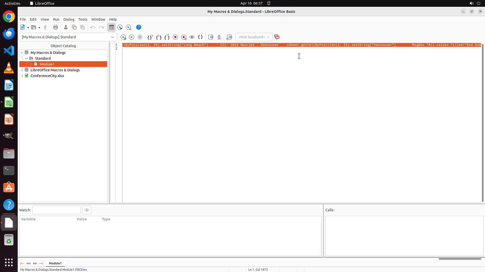

**Response:**
```
The code is all on one line. Let me delete it and try a different approach. I'll close the macro editor and use a terminal to write a Python script to modify the file.
```

**Actions:** `pyautogui.keyDown('delete')
pyautogui.keyUp('delete')`

---

## Step 23


**Response:**
```
Good, the editor is cleared. The problem is that `type` doesn't handle newlines properly. Let me try typing the macro line by line using the `key` command for Enter/Return between lines:
```

**Actions:** `pyautogui.click(1170, 177)`

---

## Step 24


**Response:**
```
Let me try a completely different approach. I'll close the macro editor and use a terminal with a Python script to modify the file. First, let me close this editor:
```

**Actions:** `pyautogui.keyDown('alt')
pyautogui.keyDown('f4')
pyautogui.keyUp('f4')
pyautogui.keyUp('alt')`

---

## Step 25

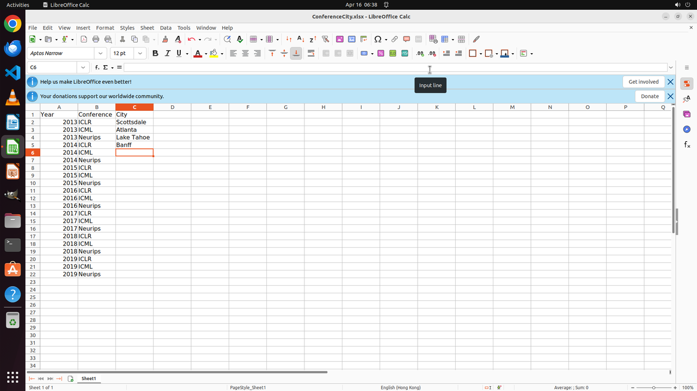

**Response:**
```
Good, I'm back in the spreadsheet. Let me try a different approach - I'll open a terminal application and use Python with openpyxl to modify the file. But first, let me save the current state of the file. Let me first save:
```

**Actions:** `pyautogui.keyDown('ctrl')
pyautogui.keyDown('s')
pyautogui.keyUp('s')
pyautogui.keyUp('ctrl')`

---

## Step 26


**Response:**
```
The file seems saved. Now let me open a terminal to use Python to fill in the remaining data. Let me right-click on the desktop to open a terminal, or find the terminal app:
```

**Actions:** `pyautogui.keyDown('esc')
pyautogui.keyUp('esc')`

---

## Step 27


**Response:**
```
Let me try a different approach. Instead of using the macro editor or terminal, I'll just enter the data directly in the cells one by one. It's tedious but reliable. Let me click on C6 and start entering:
```

**Actions:** `pyautogui.click(366, 421)`

---

## Step 28

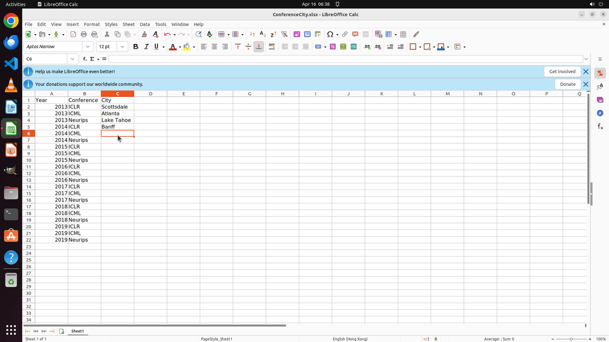

**Response:**
```
Good, I'm in C6 (2014 ICML). Let me try a different approach - I'll open a terminal application from the taskbar. I can see there's a terminal icon in the taskbar on the left side.
```

**Actions:** `pyautogui.click(33, 673)`

---

## Step 29

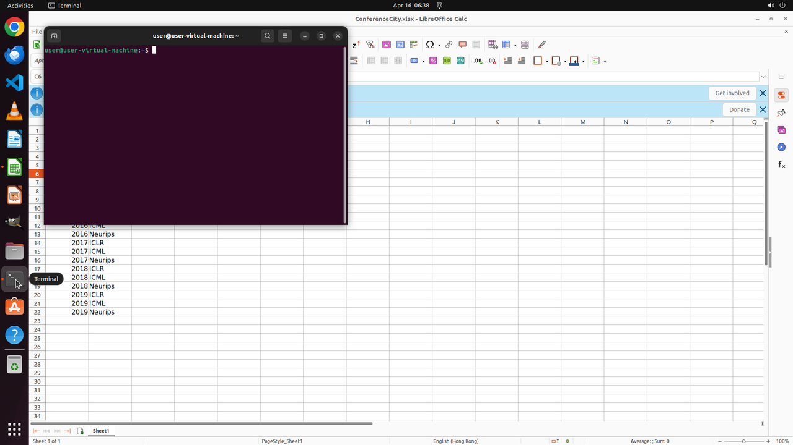

**Response:**
```
A terminal is open. Now I need to first close the file in LibreOffice (or save it), then use Python to modify the xlsx file. But actually, it might be easier to write a Python script that uses openpyxl to modify the file while it's closed. Let me first check if openpyxl is installed, and find the file path:
```

**Actions:** `import subprocess, shlex; subprocess.run(f'xdotool type --delay 12 -- ' + shlex.quote('python3 -c "import openpyxl; print(\'ok\')"\n'), shell=True, check=True)
import time; time.sleep(0.05)`

---

## Step 30

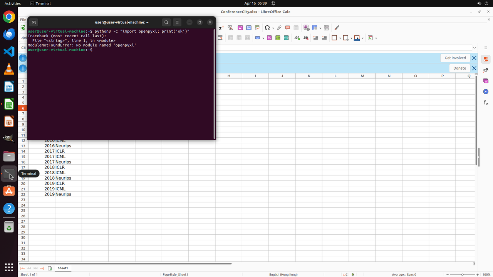

**Response:**
```
openpyxl is not installed. Let me install it first:
```

**Actions:** `import subprocess, shlex; subprocess.run(f'xdotool type --delay 12 -- ' + shlex.quote('pip3 install openpyxl\n'), shell=True, check=True)
import time; time.sleep(0.05)`

---

## Step 31

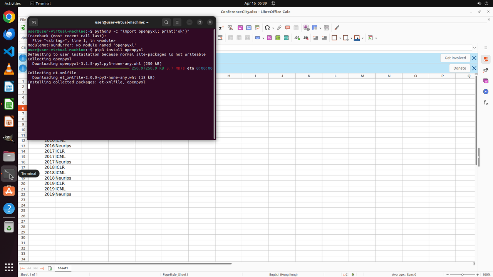

**Response:**
```
openpyxl is being installed. Let me wait for it to finish:
```

**Actions:** `time.sleep(0.5)`

---

## Step 32


**Response:**
```
openpyxl is installed successfully. Now I need to first close the file in LibreOffice, then use Python to modify it, and then reopen it. But first, let me find the file path:
```

**Actions:** `import subprocess, shlex; subprocess.run(f'xdotool type --delay 12 -- ' + shlex.quote('find /home -name "ConferenceCity.xlsx" 2>/dev/null'), shell=True, check=True)
import time; time.sleep(0.05)
impor`

---

## Step 33


**Response:**
```
The file is at `/home/user/Desktop/ConferenceCity.xlsx`. Now I need to close the file in LibreOffice first before modifying it with Python. Let me first close LibreOffice, then run the Python script, and then reopen the file. But actually, I can write a Python script to create a temporary copy and then replace it. Let me write the Python script:
```

**Actions:** `import subprocess, shlex; subprocess.run(f'xdotool type --delay 12 -- ' + shlex.quote("python3 << 'EOF'\nimport openpyxl\n\nwb = openpyxl.lo"), shell=True, check=True)
import time; time.sleep(0.05)
im`

---

## Step 34

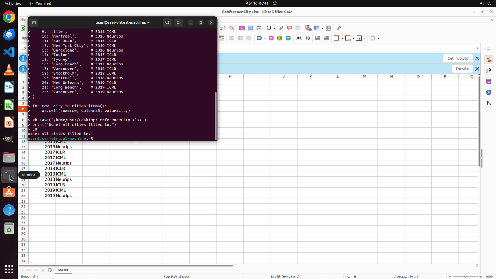

**Response:**
```
The Python script ran successfully and printed "Done! All cities filled in." The file has been saved. Now I need to reload the file in LibreOffice Calc. Let me switch to LibreOffice and reload the file:
```

**Actions:** `pyautogui.click(990, 600)`

---

## Step 35

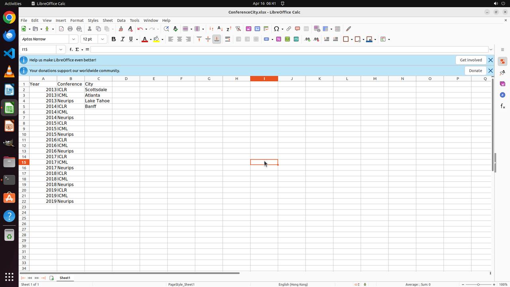

**Response:**
```
I can see the spreadsheet still shows the old data - the cities from C6 to C22 are still empty. The file was saved by Python but LibreOffice still has the old version in memory. I need to reload the file. Let me close the file and reopen it:
```

**Actions:** `pyautogui.keyDown('ctrl')
pyautogui.keyDown('w')
pyautogui.keyUp('w')
pyautogui.keyUp('ctrl')`

---

## Step 36

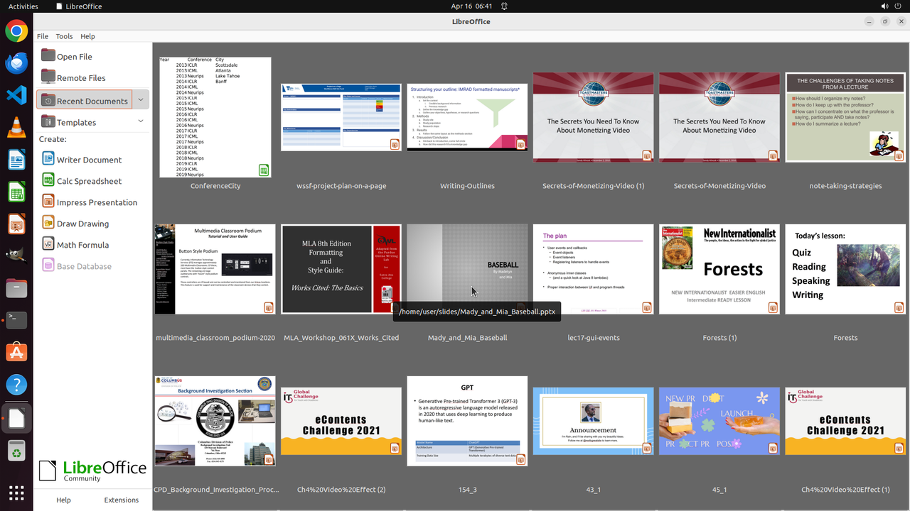

**Response:**
```
The file was closed and I can see the LibreOffice Start Center. I can see the ConferenceCity file in the recent documents. Let me click on it to reopen it:
```

**Actions:** `pyautogui.doubleClick(454, 255)`

---

## Step 37

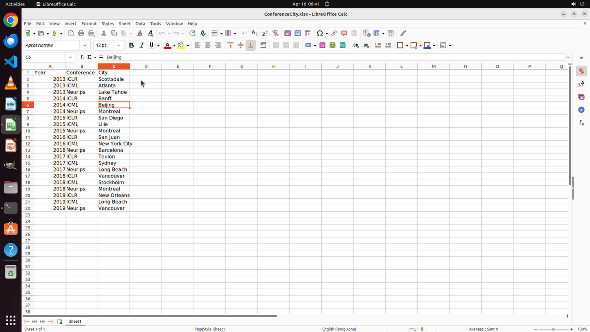

**Response:**
```
All the cities have been filled in successfully! The spreadsheet now shows all the conference cities:

- **2013**: ICLR - Scottsdale, ICML - Atlanta, Neurips - Lake Tahoe
- **2014**: ICLR - Banff, ICML - Beijing, Neurips - Montreal
- **2015**: ICLR - San Diego, ICML - Lille, Neurips - Montreal
- **2016**: ICLR - San Juan, ICML - New York City, Neurips - Barcelona
- **2017**: ICLR - Toulon, ICML - Sydney, Neurips - Long Beach
- **2018**: ICLR - Vancouver, ICML - Stockholm, Neurips - Montreal
- **2019**: ICLR - New Orleans, ICML - Long Beach, Neurips - Vancouver

Now let me save the file:
```

**Actions:** `pyautogui.keyDown('ctrl')
pyautogui.keyDown('s')
pyautogui.keyUp('s')
pyautogui.keyUp('ctrl')`

---

## Step 38


**Response:**
```
The file has been saved. All the conference cities have been successfully filled in for all three machine learning conferences (ICLR, ICML, and NeurIPS) from 2013 to 2019. The spreadsheet is now complete with all the meeting city locations.

DONE
```

**Actions:** `DONE`

---
