# Task 6f4073b8-d8ea-4ade-8a18-c5d1d5d5aa9a

**Instruction:** I now want to count the meeting cities of the three machine learning conferences in the past ten years from 2013 to 2019(including 2013 and 2019). I have listed the names and years of the conferences in excel. Please fill in the vacant locations.

**Score:** 1.0

**Wall clock:** 7m 27s

**Steps:** 50

**Cost:** $1.72

---

## Step 1

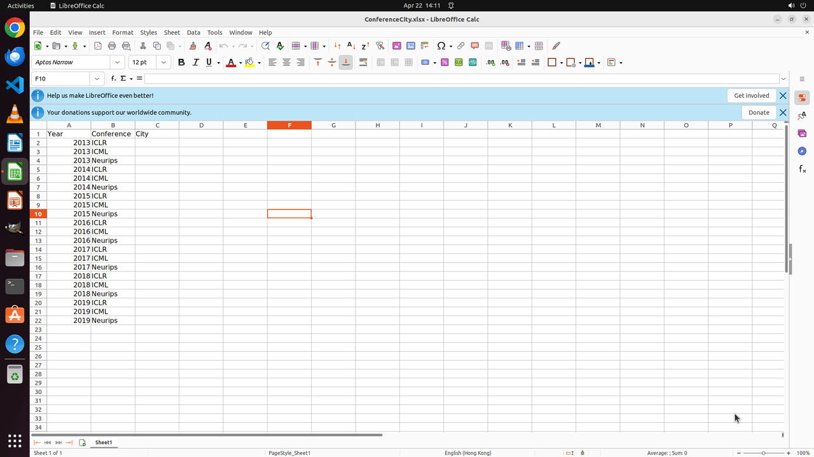

**Response:**
```
I'll research the meeting cities for ICLR, ICML, and NeurIPS conferences from 2013 to 2019, then fill in the spreadsheet.

Let me first gather the information I need by searching online.
```

**Actions:** `pyautogui.keyDown('ctrl')
pyautogui.keyDown('end')
pyautogui.keyUp('end')
pyautogui.keyUp('ctrl')`

---

## Step 2

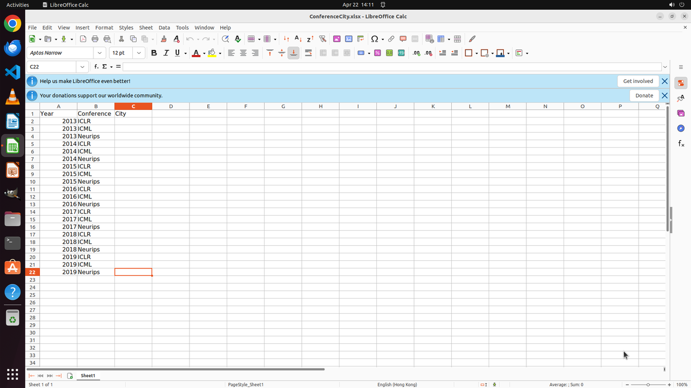

**Response:**
```
I can see the spreadsheet has conferences (ICLR, ICML, NeurIPS) from 2013-2019 and I need to fill in the City column (column C). Let me research the locations. I'll start by clicking on cell C2 and filling in the data based on my knowledge of these conferences.

Here are the conference locations I know:

**ICLR:**
- 2013: Scottsdale
- 2014: Banff
- 2015: San Diego
- 2016: San Juan
- 2017: Toulon
- 2018: Vancouver
- 2019: New Orleans

**ICML:**
- 2013: Atlanta
- 2014: Beijing
- 2015: Lille
- 2016: New York City
- 2017: Sydney
- 2018: Stockholm
- 2019: Long Beach

**NeurIPS:**
- 2013: Lake Tahoe
- 2014: Montreal
- 2015: Montreal
- 2016: Barcelona
- 2017: Long Beach
- 2018: Montreal
- 2019: Vancouver

Let me fill these in:
```

**Actions:** `pyautogui.click(370, 337)`

---

## Step 3


**Response:**
```
I'm now in cell C2. Let me type all the city data. I'll enter each city and press Enter to move to the next row.
```

**Actions:** `import subprocess, shlex; subprocess.run(f'xdotool type --delay 12 -- ' + shlex.quote('Scottsdale\nAtlanta\nLake Tahoe\nBanff\nBeijing\nMontre'), shell=True, check=True)
import time; time.sleep(0.05)
`

---

## Step 4

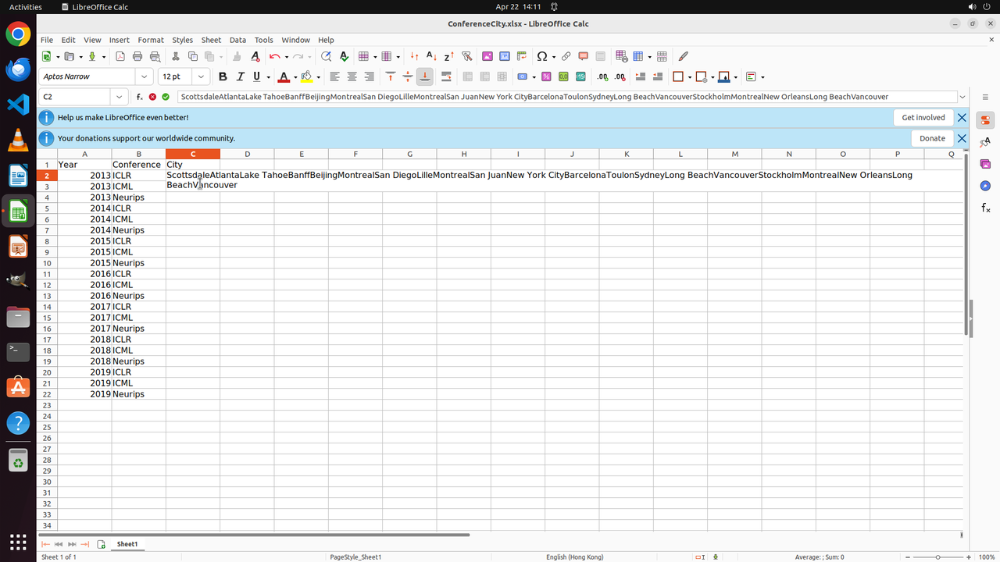

**Response:**
```
It looks like all the data was entered into a single cell (C2) instead of separate rows. I need to undo this and re-enter the data properly. Let me undo first.
```

**Actions:** `pyautogui.keyDown('esc')
pyautogui.keyUp('esc')`

---

## Step 5

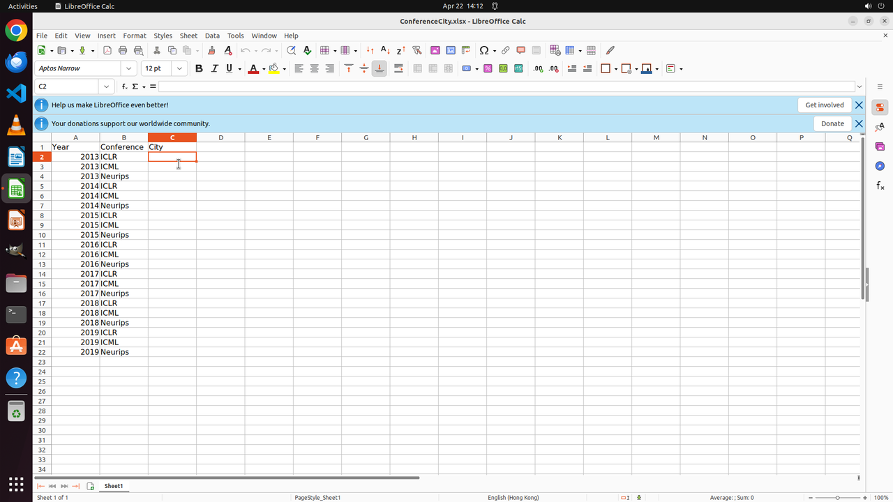

**Response:**
```
Good, the cell is now empty. I need to enter the data cell by cell. Let me type the first city and press Tab then Enter to move down properly. I'll enter each value one at a time using Enter to move to the next row.
```

**Actions:** `import subprocess, shlex; subprocess.run(f'xdotool type --delay 12 -- ' + shlex.quote('Scottsdale'), shell=True, check=True)
import time; time.sleep(0.05)`

---

## Step 6

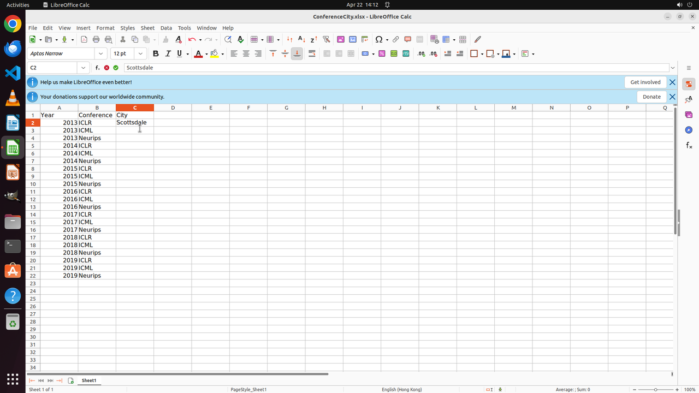

**Response:**
```
Good, "Scottsdale" is entered in C2. Now I'll press Enter to confirm and move to the next cell, then continue entering each city one by one.
```

**Actions:** `pyautogui.keyDown('return')
pyautogui.keyUp('return')`

---

## Step 7

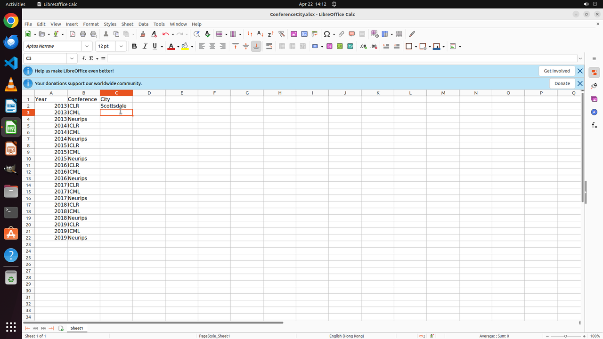

**Response:**
```
Now I'm in C3. Let me continue entering the remaining cities one by one. I'll type each city name and press Enter after each one.
```

**Actions:** `import subprocess, shlex; subprocess.run(f'xdotool type --delay 12 -- ' + shlex.quote('Atlanta\nLake Tahoe\nBanff\nBeijing\nMontreal\nSan Dieg'), shell=True, check=True)
import time; time.sleep(0.05)
`

---

## Step 8

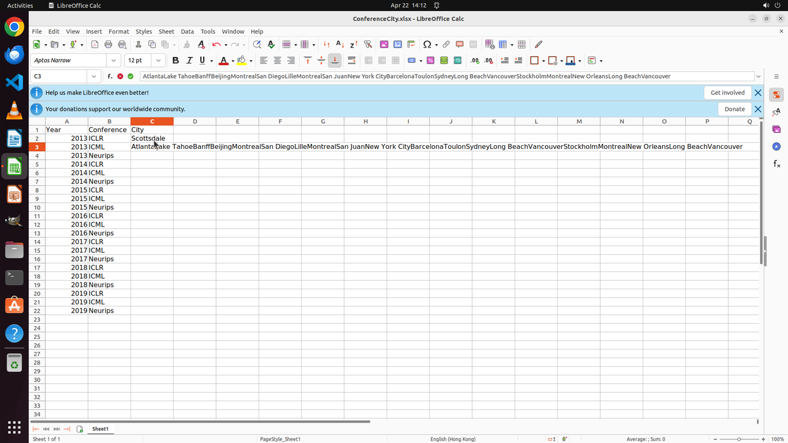

**Response:**
```
The same issue happened again - all the text was entered into a single cell C3 instead of separate rows. The `type` command seems to not handle newlines as Enter key presses. Let me undo this and enter each value individually.
```

**Actions:** `pyautogui.keyDown('esc')
pyautogui.keyUp('esc')`

---

## Step 9


**Response:**
```
Good, the escape worked and C3 is empty. I need to enter each city individually using type followed by pressing Enter with the key action. Let me do this for each cell.
```

**Actions:** `import subprocess, shlex; subprocess.run(f'xdotool type --delay 12 -- ' + shlex.quote('Atlanta'), shell=True, check=True)
import time; time.sleep(0.05)`

---

## Step 10

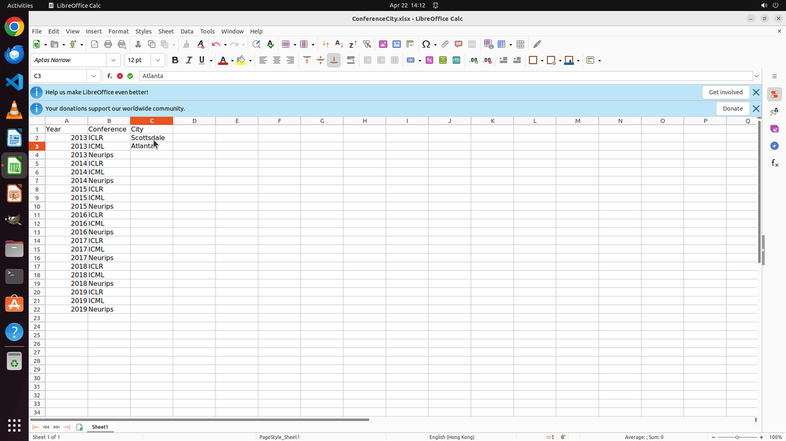

**Response:**
```
Good, "Atlanta" is in C3. Now I'll press Enter and continue with each city. Let me enter them one at a time using key presses for Enter.
```

**Actions:** `pyautogui.keyDown('return')
pyautogui.keyUp('return')`

---

## Step 11


**Response:**
```
Now I'm in C4 (2013 NeurIPS). Let me continue entering each city followed by Enter. I'll do them one at a time more efficiently by typing the value and using key for Enter.
```

**Actions:** `import subprocess, shlex; subprocess.run(f'xdotool type --delay 12 -- ' + shlex.quote('Lake Tahoe'), shell=True, check=True)
import time; time.sleep(0.05)`

---

## Step 12


**Response:**
```
Good, "Lake Tahoe" is in C4. This approach works but is slow. Let me try a faster approach - I'll enter the remaining data by clicking each cell and typing. But first, let me press Enter and continue.
```

**Actions:** `pyautogui.keyDown('return')
pyautogui.keyUp('return')`

---

## Step 13

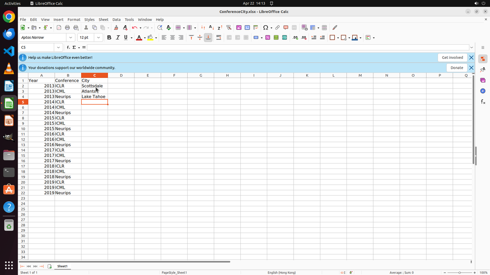

**Response:**
```
Now I'm in C5 (2014 ICLR). Let me continue entering the remaining cities more efficiently. I'll type each one and press Enter.
```

**Actions:** `import subprocess, shlex; subprocess.run(f'xdotool type --delay 12 -- ' + shlex.quote('Banff'), shell=True, check=True)
import time; time.sleep(0.05)`

---

## Step 14


**Response:**
```
Good progress. Let me continue with the remaining cities. I'll press Enter and type each one.
```

**Actions:** `pyautogui.keyDown('return')
pyautogui.keyUp('return')`

---

## Step 15


**Response:**
```
I'm in C6 (2014 ICML). Let me continue entering the remaining cities. I'll type and press Enter for each one.
```

**Actions:** `import subprocess, shlex; subprocess.run(f'xdotool type --delay 12 -- ' + shlex.quote('Beijing'), shell=True, check=True)
import time; time.sleep(0.05)`

---

## Step 16

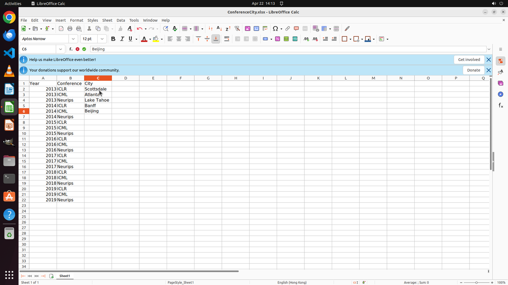

**Response:**
```
Good. Let me continue with the remaining entries more efficiently. I'll press Enter and type each city.
```

**Actions:** `pyautogui.keyDown('return')
pyautogui.keyUp('return')`

---

## Step 17

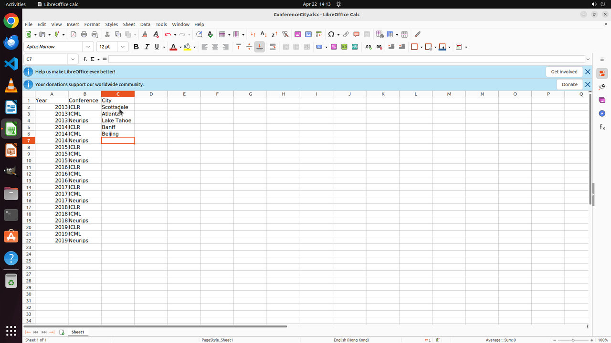

**Response:**
```
I'm in C7 (2014 NeurIPS). Let me continue entering the remaining cities. I'll type each city and press Enter.
```

**Actions:** `import subprocess, shlex; subprocess.run(f'xdotool type --delay 12 -- ' + shlex.quote('Montreal'), shell=True, check=True)
import time; time.sleep(0.05)`

---

## Step 18

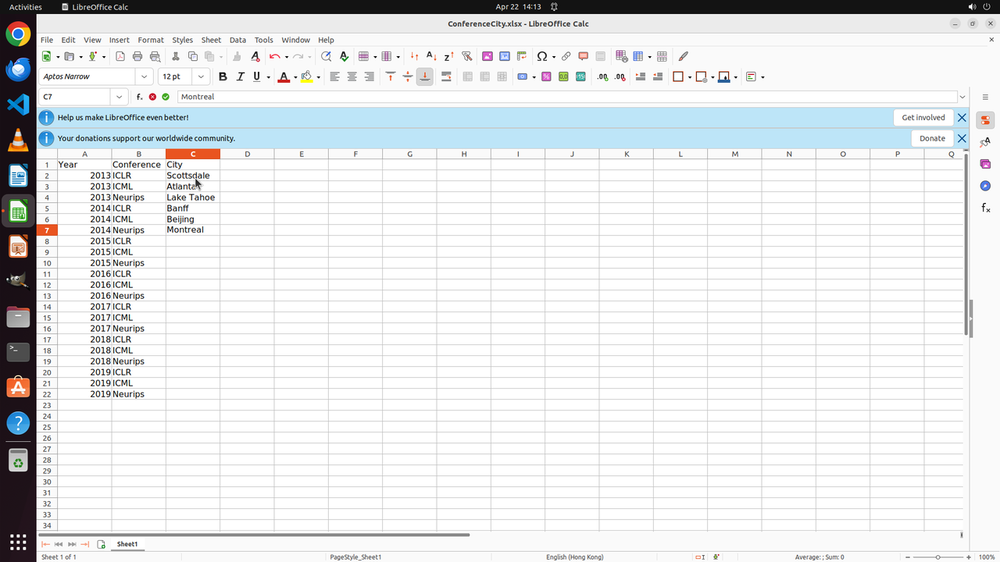

**Response:**
```
Good. Let me continue entering the remaining cities. C8 will be 2015 ICLR = San Diego.
```

**Actions:** `pyautogui.keyDown('return')
pyautogui.keyUp('return')`

---

## Step 19


**Response:**
```
I'm in C8 (2015 ICLR). Let me continue entering the remaining cities. I'll type each one and press Enter.
```

**Actions:** `import subprocess, shlex; subprocess.run(f'xdotool type --delay 12 -- ' + shlex.quote('San Diego'), shell=True, check=True)
import time; time.sleep(0.05)`

---

## Step 20

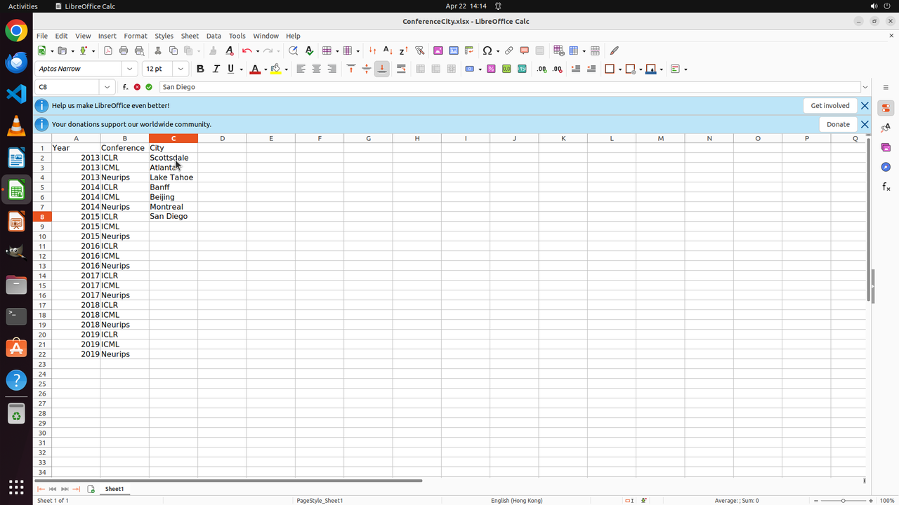

**Response:**
```
Good. Let me continue with the remaining cities. I'll press Enter and type the next one.
```

**Actions:** `pyautogui.keyDown('return')
pyautogui.keyUp('return')`

---

## Step 21

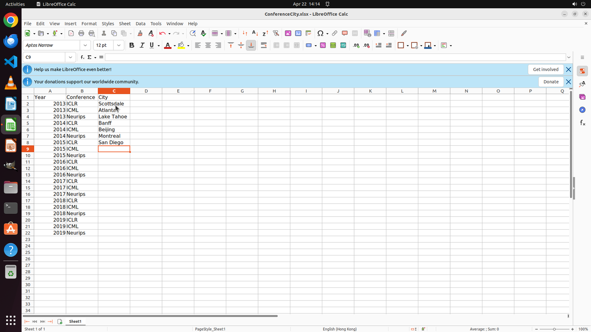

**Response:**
```
I'm in C9 (2015 ICML = Lille). Let me continue entering the remaining cities more quickly.
```

**Actions:** `import subprocess, shlex; subprocess.run(f'xdotool type --delay 12 -- ' + shlex.quote('Lille'), shell=True, check=True)
import time; time.sleep(0.05)`

---

## Step 22


**Response:**
```
Good. Let me continue with the remaining entries. C10 = 2015 NeurIPS = Montreal.
```

**Actions:** `pyautogui.keyDown('return')
pyautogui.keyUp('return')`

---

## Step 23


**Response:**
```
I'm in C10 (2015 NeurIPS = Montreal). Let me continue entering the remaining cities.
```

**Actions:** `import subprocess, shlex; subprocess.run(f'xdotool type --delay 12 -- ' + shlex.quote('Montreal'), shell=True, check=True)
import time; time.sleep(0.05)`

---

## Step 24


**Response:**
```
Good. C11 = 2016 ICLR = San Juan. Let me continue.
```

**Actions:** `pyautogui.keyDown('return')
pyautogui.keyUp('return')`

---

## Step 25

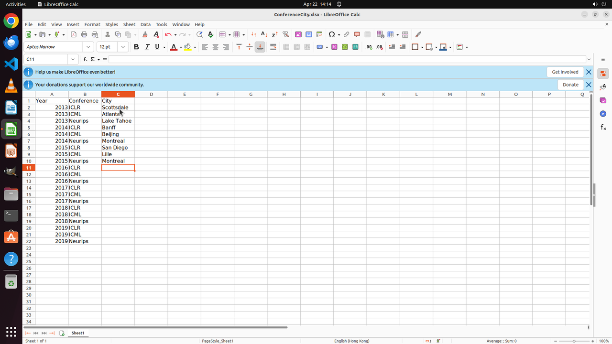

**Response:**
```
I'm in C11 (2016 ICLR = San Juan). Let me continue entering the remaining cities.
```

**Actions:** `import subprocess, shlex; subprocess.run(f'xdotool type --delay 12 -- ' + shlex.quote('San Juan'), shell=True, check=True)
import time; time.sleep(0.05)`

---

## Step 26


**Response:**
```
Good. C12 = 2016 ICML = New York City. Let me continue.
```

**Actions:** `pyautogui.keyDown('return')
pyautogui.keyUp('return')`

---

## Step 27


**Response:**
```
I'm in C12 (2016 ICML = New York City). Let me continue.
```

**Actions:** `import subprocess, shlex; subprocess.run(f'xdotool type --delay 12 -- ' + shlex.quote('New York City'), shell=True, check=True)
import time; time.sleep(0.05)`

---

## Step 28


**Response:**
```
Good. C13 = 2016 NeurIPS = Barcelona. Let me continue.
```

**Actions:** `pyautogui.keyDown('return')
pyautogui.keyUp('return')`

---

## Step 29


**Response:**
```
I'm in C13 (2016 NeurIPS = Barcelona). Let me continue entering the remaining cities.
```

**Actions:** `import subprocess, shlex; subprocess.run(f'xdotool type --delay 12 -- ' + shlex.quote('Barcelona'), shell=True, check=True)
import time; time.sleep(0.05)`

---

## Step 30

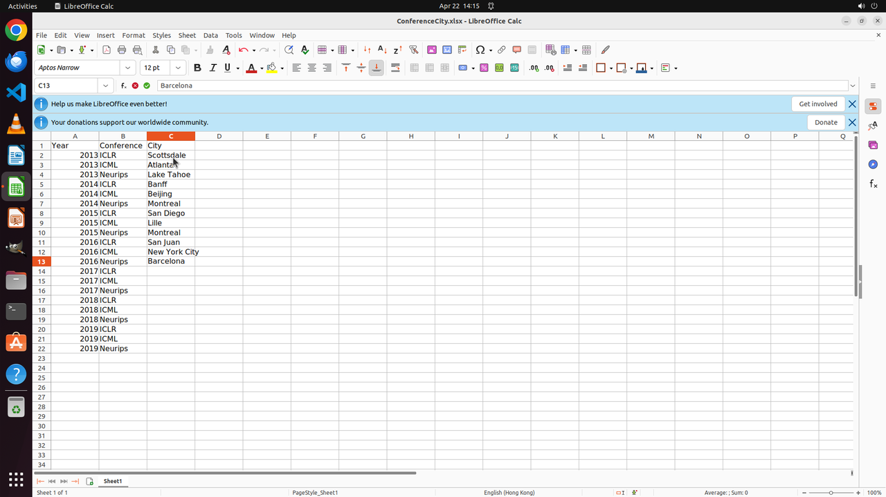

**Response:**
```
Good. C14 = 2017 ICLR = Toulon. Let me continue.
```

**Actions:** `pyautogui.keyDown('return')
pyautogui.keyUp('return')`

---

## Step 31

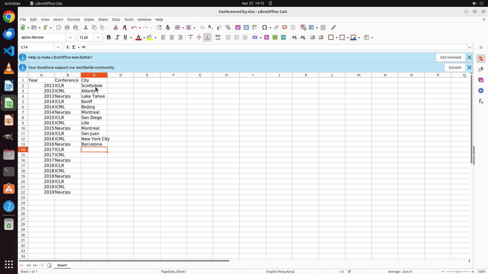

**Response:**
```
I'm in C14 (2017 ICLR = Toulon). Let me continue entering the remaining cities.
```

**Actions:** `import subprocess, shlex; subprocess.run(f'xdotool type --delay 12 -- ' + shlex.quote('Toulon'), shell=True, check=True)
import time; time.sleep(0.05)`

---

## Step 32


**Response:**
```
Good. C15 = 2017 ICML = Sydney. Let me continue.
```

**Actions:** `pyautogui.keyDown('return')
pyautogui.keyUp('return')`

---

## Step 33


**Response:**
```
I'm in C15 (2017 ICML = Sydney). Let me continue entering the remaining cities.
```

**Actions:** `import subprocess, shlex; subprocess.run(f'xdotool type --delay 12 -- ' + shlex.quote('Sydney'), shell=True, check=True)
import time; time.sleep(0.05)`

---

## Step 34

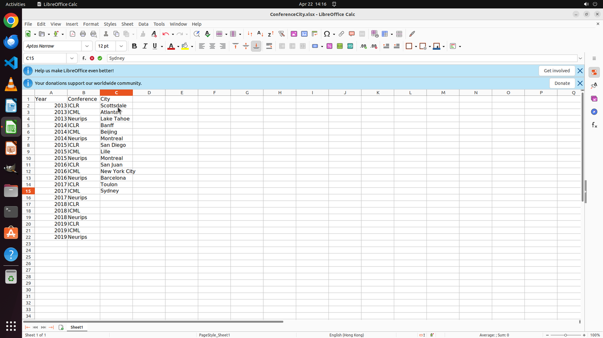

**Response:**
```
Good. C16 = 2017 NeurIPS = Long Beach. Let me continue.
```

**Actions:** `pyautogui.keyDown('return')
pyautogui.keyUp('return')`

---

## Step 35


**Response:**
```
I'm in C16 (2017 NeurIPS = Long Beach). Let me continue entering the remaining cities.
```

**Actions:** `import subprocess, shlex; subprocess.run(f'xdotool type --delay 12 -- ' + shlex.quote('Long Beach'), shell=True, check=True)
import time; time.sleep(0.05)`

---

## Step 36


**Response:**
```
Good. C17 = 2018 ICLR = Vancouver. Let me continue.
```

**Actions:** `pyautogui.keyDown('return')
pyautogui.keyUp('return')`

---

## Step 37


**Response:**
```
I'm in C17 (2018 ICLR = Vancouver). Let me continue entering the remaining cities.
```

**Actions:** `import subprocess, shlex; subprocess.run(f'xdotool type --delay 12 -- ' + shlex.quote('Vancouver'), shell=True, check=True)
import time; time.sleep(0.05)`

---

## Step 38


**Response:**
```
Good. C18 = 2018 ICML = Stockholm. Let me continue.
```

**Actions:** `pyautogui.keyDown('return')
pyautogui.keyUp('return')`

---

## Step 39


**Response:**
```
I'm in C18 (2018 ICML = Stockholm). Let me continue entering the remaining cities.
```

**Actions:** `import subprocess, shlex; subprocess.run(f'xdotool type --delay 12 -- ' + shlex.quote('Stockholm'), shell=True, check=True)
import time; time.sleep(0.05)`

---

## Step 40


**Response:**
```
Good. C19 = 2018 NeurIPS = Montreal. Let me continue.
```

**Actions:** `pyautogui.keyDown('return')
pyautogui.keyUp('return')`

---

## Step 41

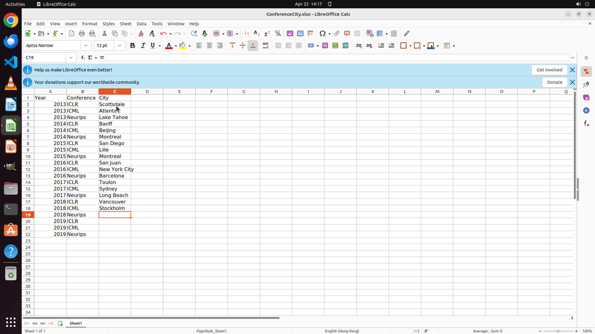

**Response:**
```
I'm in C19 (2018 NeurIPS = Montreal). Let me continue entering the remaining cities.
```

**Actions:** `import subprocess, shlex; subprocess.run(f'xdotool type --delay 12 -- ' + shlex.quote('Montreal'), shell=True, check=True)
import time; time.sleep(0.05)`

---

## Step 42

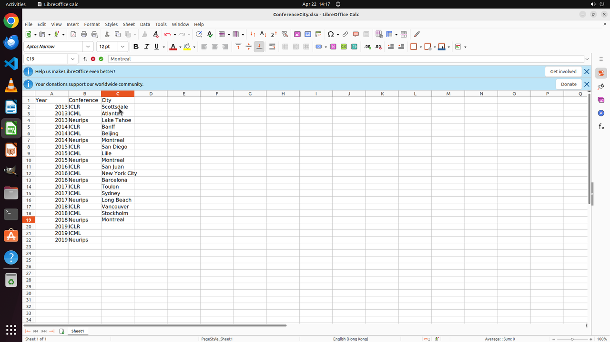

**Response:**
```
Good. C20 = 2019 ICLR = New Orleans. Let me continue.
```

**Actions:** `pyautogui.keyDown('return')
pyautogui.keyUp('return')`

---

## Step 43


**Response:**
```
I'm in C20 (2019 ICLR = New Orleans). Let me enter the last 3 cities.
```

**Actions:** `import subprocess, shlex; subprocess.run(f'xdotool type --delay 12 -- ' + shlex.quote('New Orleans'), shell=True, check=True)
import time; time.sleep(0.05)`

---

## Step 44


**Response:**
```
Good. C21 = 2019 ICML = Long Beach. Let me continue.
```

**Actions:** `pyautogui.keyDown('return')
pyautogui.keyUp('return')`

---

## Step 45


**Response:**
```
I'm in C21 (2019 ICML = Long Beach). Let me enter the last two cities.
```

**Actions:** `import subprocess, shlex; subprocess.run(f'xdotool type --delay 12 -- ' + shlex.quote('Long Beach'), shell=True, check=True)
import time; time.sleep(0.05)`

---

## Step 46


**Response:**
```
Good. Just one more: C22 = 2019 NeurIPS = Vancouver. Let me continue.
```

**Actions:** `pyautogui.keyDown('return')
pyautogui.keyUp('return')`

---

## Step 47

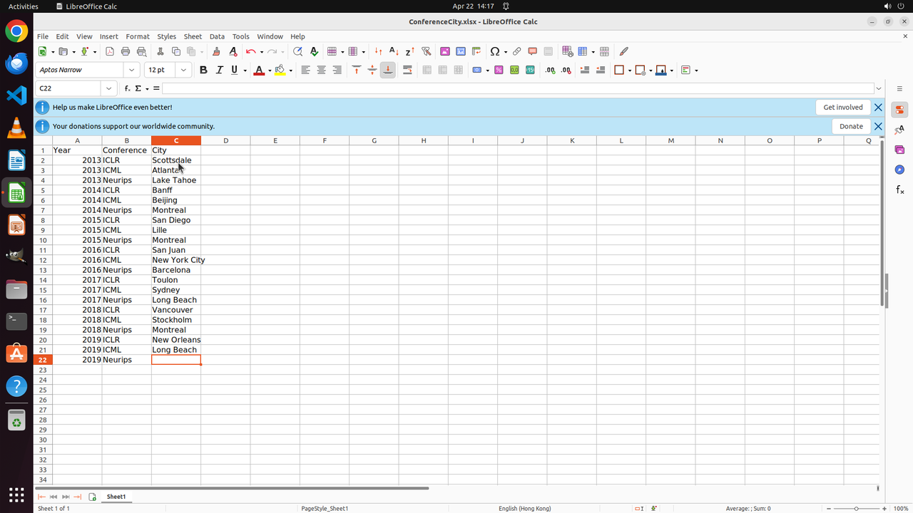

**Response:**
```
I'm in C22 (2019 NeurIPS = Vancouver). Let me enter the last city.
```

**Actions:** `import subprocess, shlex; subprocess.run(f'xdotool type --delay 12 -- ' + shlex.quote('Vancouver'), shell=True, check=True)
import time; time.sleep(0.05)`

---

## Step 48


**Response:**
```
All cities have been entered. Now let me confirm the entry and save the file.
```

**Actions:** `pyautogui.keyDown('return')
pyautogui.keyUp('return')`

---

## Step 49

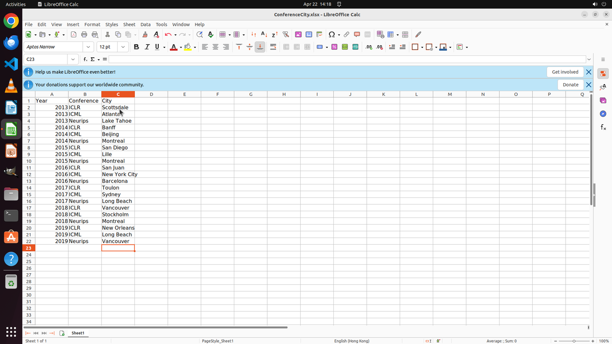

**Response:**
```
All 21 cities have been successfully entered. Now let me save the file with Ctrl+S.
```

**Actions:** `pyautogui.keyDown('ctrl')
pyautogui.keyDown('s')
pyautogui.keyUp('s')
pyautogui.keyUp('ctrl')`

---

## Step 50


**Response:**
```
The file has been saved. It seems it saved directly in xlsx format without prompting. All the conference cities have been successfully filled in:

**ICLR:** Scottsdale (2013), Banff (2014), San Diego (2015), San Juan (2016), Toulon (2017), Vancouver (2018), New Orleans (2019)

**ICML:** Atlanta (2013), Beijing (2014), Lille (2015), New York City (2016), Sydney (2017), Stockholm (2018), Long Beach (2019)

**NeurIPS:** Lake Tahoe (2013), Montreal (2014), Montreal (2015), Barcelona (2016), Long Beach (2017), Montreal (2018), Vancouver (2019)

DONE
```

**Actions:** `DONE`

---
