# Task 6f4073b8-d8ea-4ade-8a18-c5d1d5d5aa9a

**Instruction:** I now want to count the meeting cities of the three machine learning conferences in the past ten years from 2013 to 2019(including 2013 and 2019). I have listed the names and years of the conferences in excel. Please fill in the vacant locations.

**Score:** 1.0

**Wall clock:** 12m 51s

**Steps:** 88

**Cost:** $3.29

---

## Step 1


**Response:**
```
I need to fill in the city locations for each conference (ICLR, ICML, NeurIPS) for each year from 2013 to 2019. Let me research the locations for each conference.

Let me first note what I need to find:
- ICLR 2013, 2014, 2015, 2016, 2017, 2018, 2019
- ICML 2013, 2014, 2015, 2016, 2017, 2018, 2019
- NeurIPS 2013, 2014, 2015, 2016, 2017, 2018, 2019

Let me look these up using a browser.
```

**Actions:** `pyautogui.keyDown('command')
pyautogui.keyUp('command')`

---

## Step 2

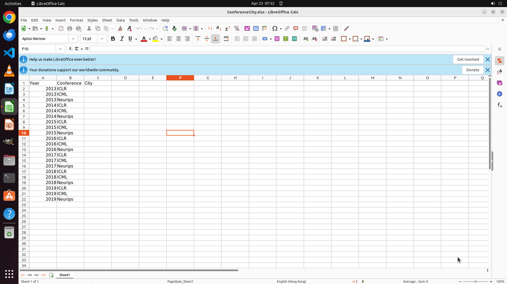

**Response:**
```
Let me open a terminal to launch Chrome for research.
```

**Actions:** `pyautogui.keyDown('esc')
pyautogui.keyUp('esc')`

---

## Step 3


**Response:**
```
Let me right-click on the desktop to find a terminal, or look for one in the taskbar.
```

**Actions:** `pyautogui.rightClick(960, 900)`

---

## Step 4

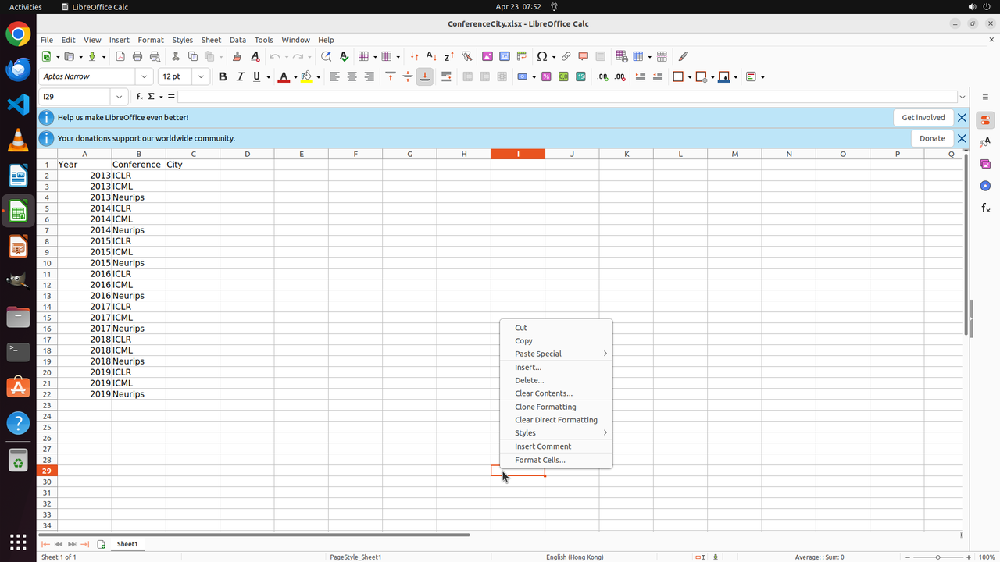

**Response:**
```
Let me close this context menu and open a terminal application.
```

**Actions:** `pyautogui.keyDown('esc')
pyautogui.keyUp('esc')`

---

## Step 5

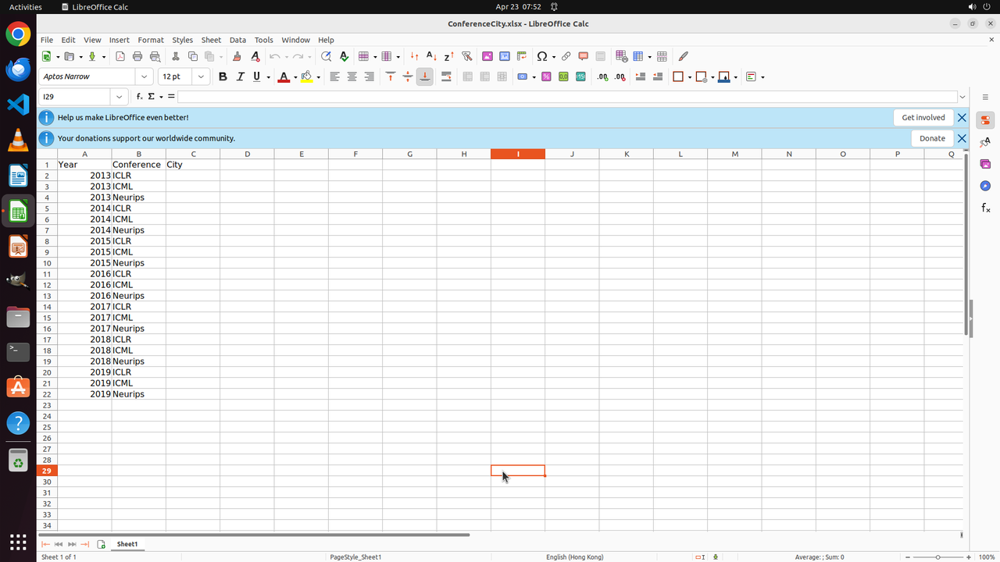

**Response:**
```
Let me look for a terminal application in the taskbar. I can see what appears to be a terminal icon.
```

**Actions:** `pyautogui.click(33, 574)`

---

## Step 6

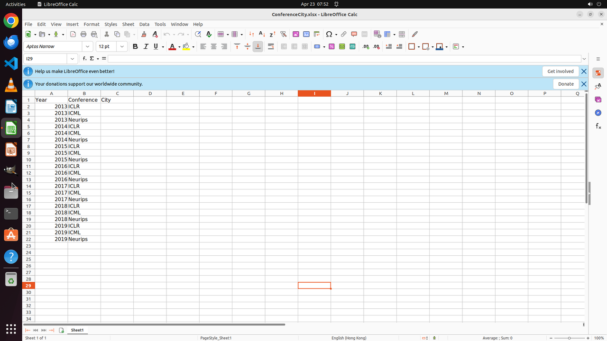

**Response:**
```
Let me try to find and open a terminal. I'll look for the file manager or terminal icon in the taskbar.
```

**Actions:** `pyautogui.click(33, 610)`

---

## Step 7

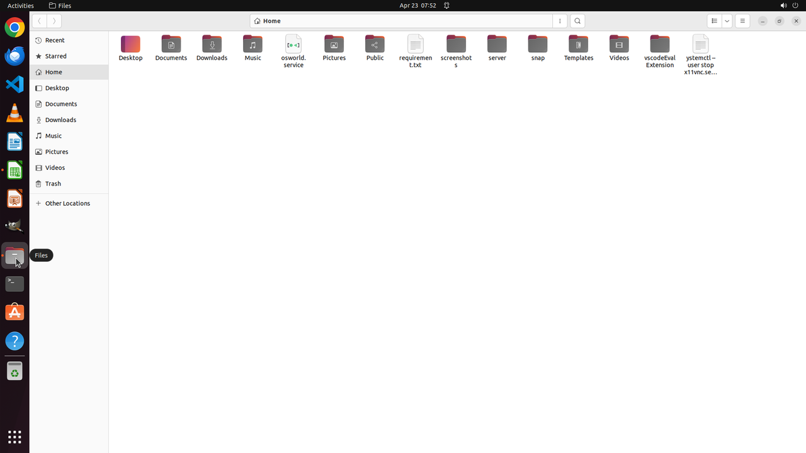

**Response:**
```
This opened the file manager. Let me close this and look for a terminal application. I can see there's a terminal-like icon in the taskbar.
```

**Actions:** `pyautogui.click(33, 673)`

---

## Step 8

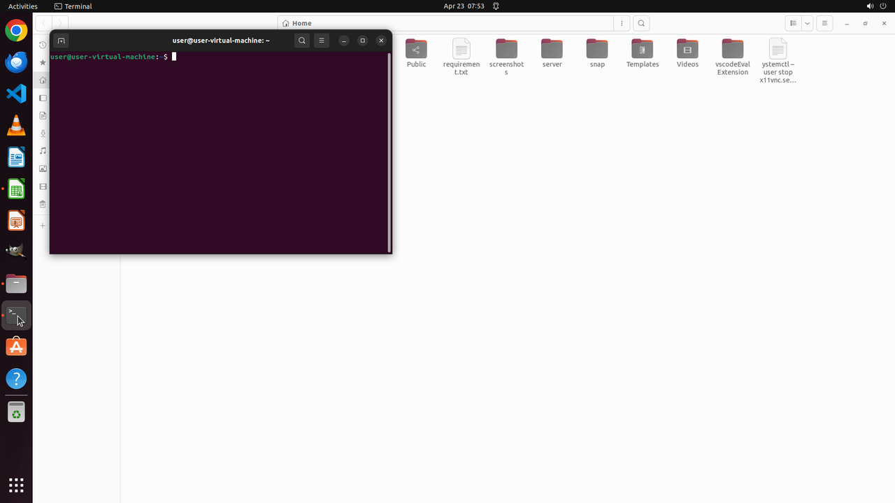

**Response:**
```
A terminal is open. Let me launch Chrome to research the conference locations.
```

**Actions:** `import subprocess, shlex; subprocess.run(f'xdotool type --delay 12 -- ' + shlex.quote('google-chrome --remote-debugging-port=1337 &\n'), shell=True, check=True)
import time; time.sleep(0.05)`

---

## Step 9

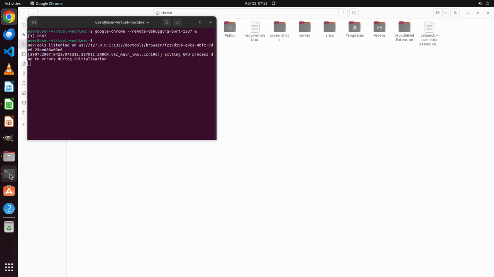

**Response:**
```
Chrome is launching. Let me click on the Chrome icon in the taskbar to bring up the browser window.
```

**Actions:** `pyautogui.click(33, 63)`

---

## Step 10

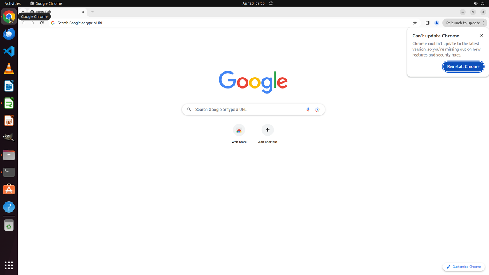

**Response:**
```
Chrome is open. Let me close the update notification and search for the conference locations. I'll start by searching for ICLR conference locations.
```

**Actions:** `pyautogui.click(1888, 139)`

---

## Step 11

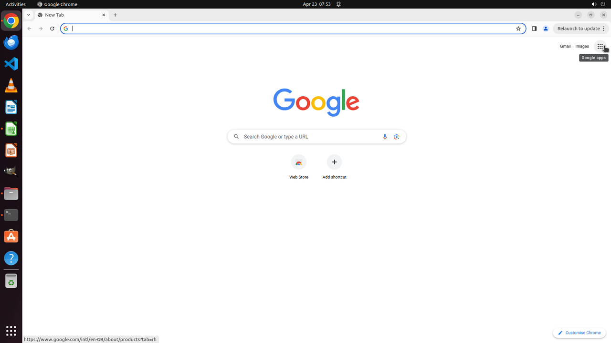

**Response:**
```
Let me search for ICLR conference locations history.
```

**Actions:** `pyautogui.click(960, 88)`

---

## Step 12

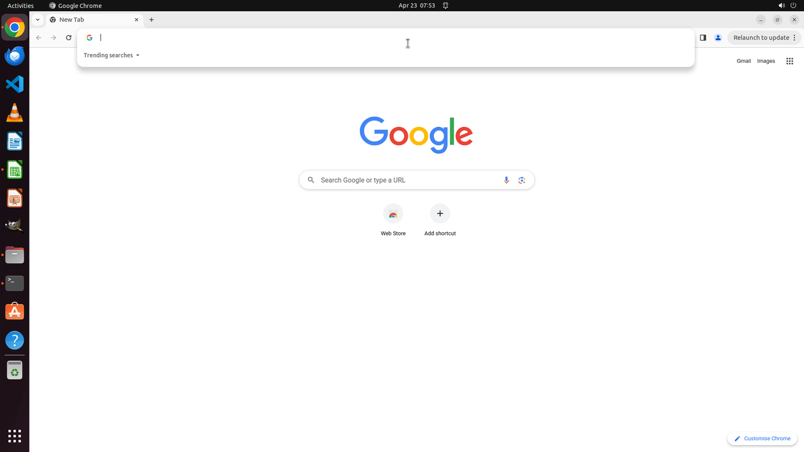

**Response:**
```
Let me search for ICLR conference locations over the years.
```

**Actions:** `import subprocess, shlex; subprocess.run(f'xdotool type --delay 12 -- ' + shlex.quote('ICLR conference locations history 2013 2014 2015 2'), shell=True, check=True)
import time; time.sleep(0.05)
impor`

---

## Step 13

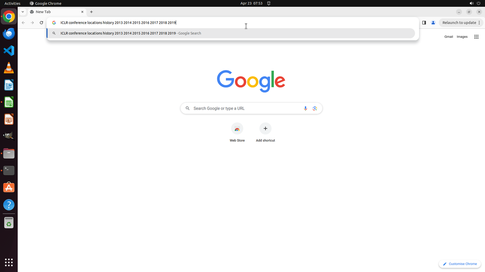

**Actions:** `pyautogui.keyDown('return')
pyautogui.keyUp('return')`

---

## Step 14

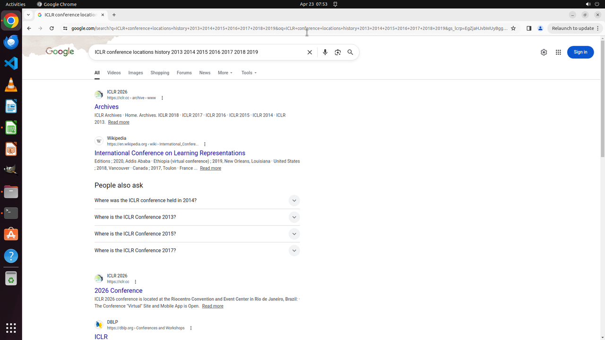

**Response:**
```
I can see the Wikipedia article about ICLR has some location information. Let me click on it to get the full list.
```

**Actions:** `pyautogui.click(537, 484)`

---

## Step 15

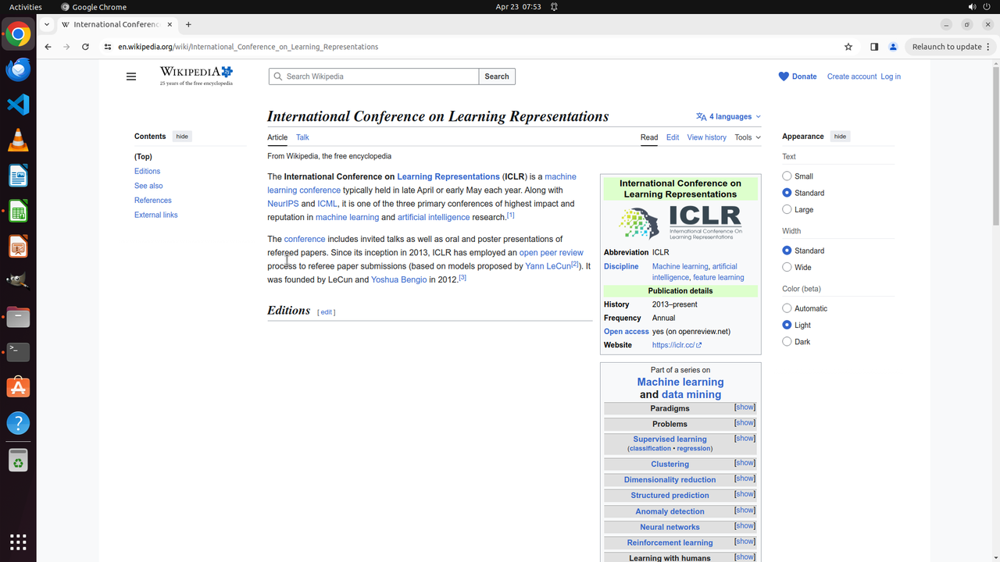

**Response:**
```
I can see the Wikipedia page for ICLR. Let me scroll down to find the "Editions" section which should list all the conference locations.
```

**Actions:** `pyautogui.click(283, 327)`

---

## Step 16

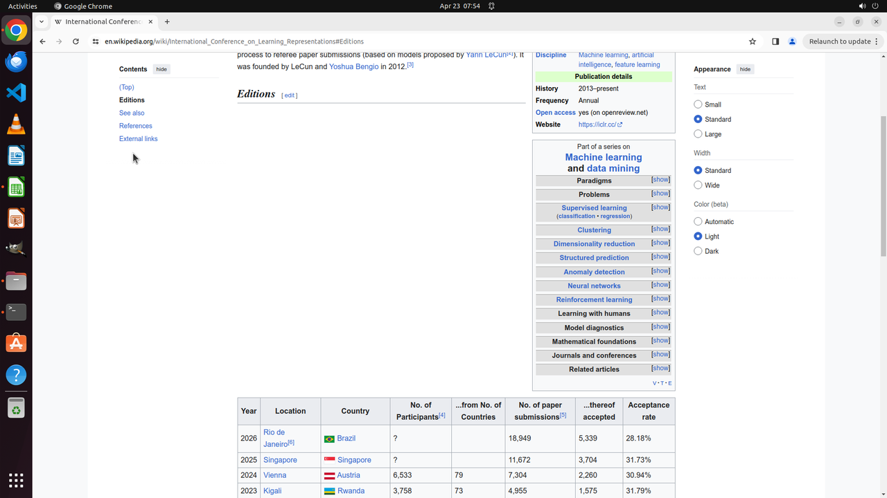

**Response:**
```
I can see the Editions table for ICLR. Let me scroll down to see the years 2013-2019.
```

**Actions:** `pyautogui.scroll(-5, 960, 600)`

---

## Step 17

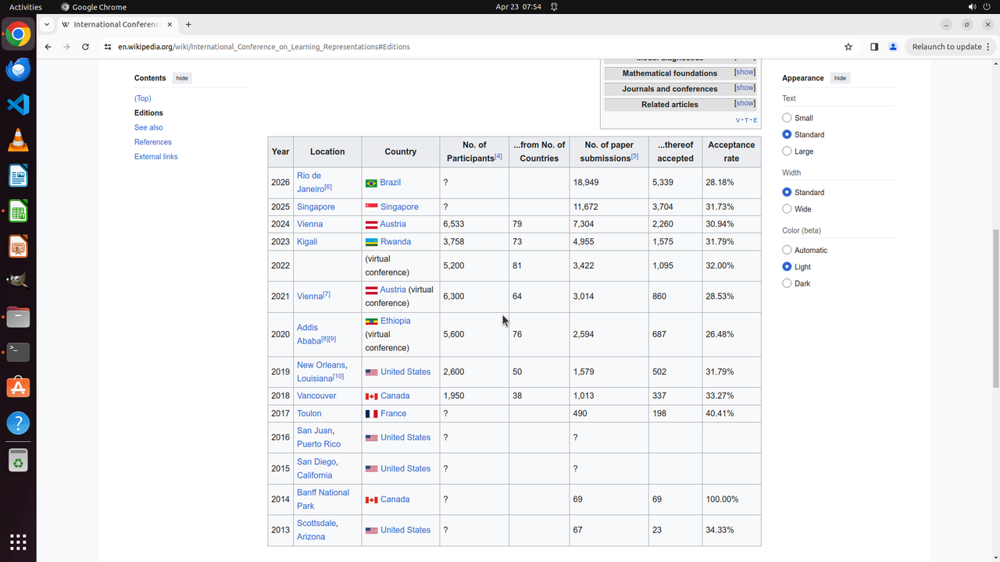

**Response:**
```
Excellent! I can now see the ICLR conference locations from 2013 to 2019. Let me note them down:

- ICLR 2013: Scottsdale, Arizona (United States)
- ICLR 2014: Banff National Park (Canada)
- ICLR 2015: San Diego, California (United States)
- ICLR 2016: San Juan, Puerto Rico (United States)
- ICLR 2017: Toulon (France)
- ICLR 2018: Vancouver (Canada)
- ICLR 2019: New Orleans, Louisiana (United States)

Now let me search for ICML conference locations. Let me open a new tab.
```

**Actions:** `pyautogui.click(364, 46)`

---

## Step 18

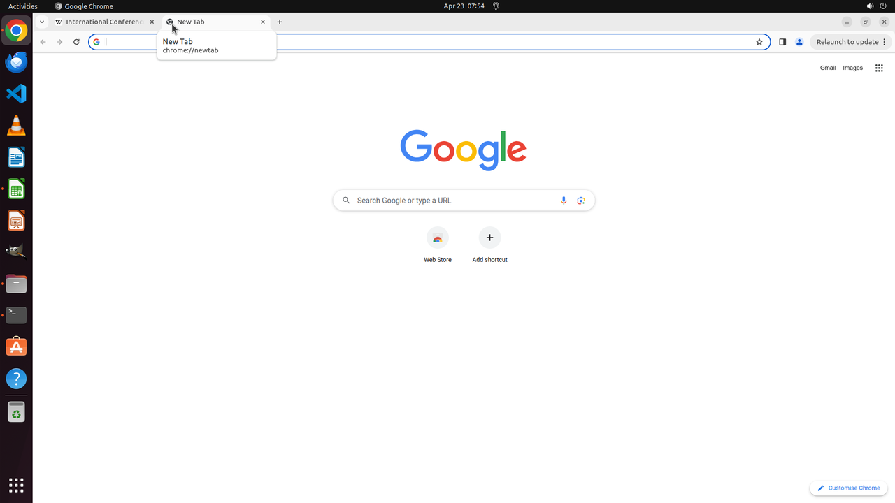

**Response:**
```
Let me search for ICML conference locations on Wikipedia.
```

**Actions:** `import subprocess, shlex; subprocess.run(f'xdotool type --delay 12 -- ' + shlex.quote('ICML International Conference on Machine Learning '), shell=True, check=True)
import time; time.sleep(0.05)
impor`

---

## Step 19

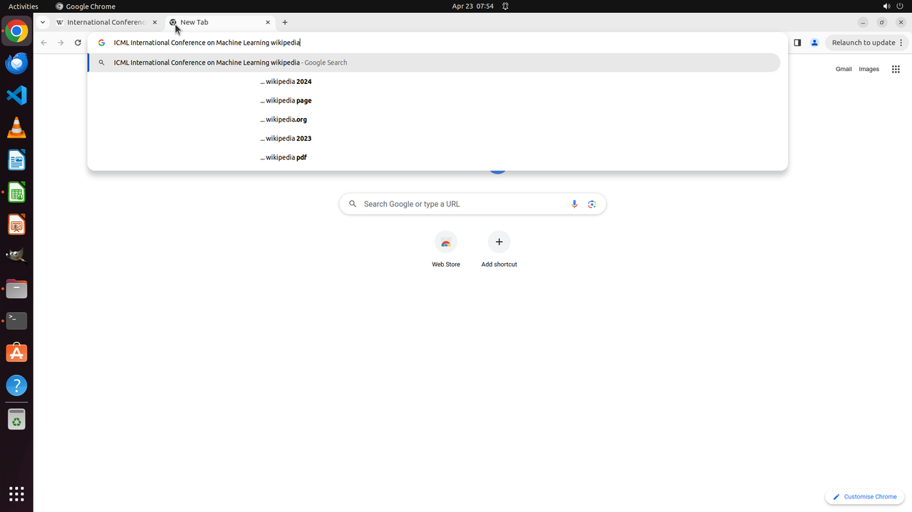

**Actions:** `pyautogui.keyDown('return')
pyautogui.keyUp('return')`

---

## Step 20

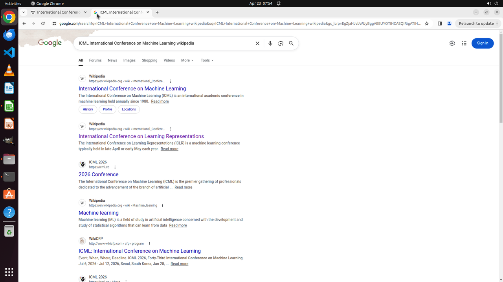

**Response:**
```
I can see the Wikipedia article for ICML. Let me click on it to get the conference locations.
```

**Actions:** `pyautogui.click(504, 337)`

---

## Step 21

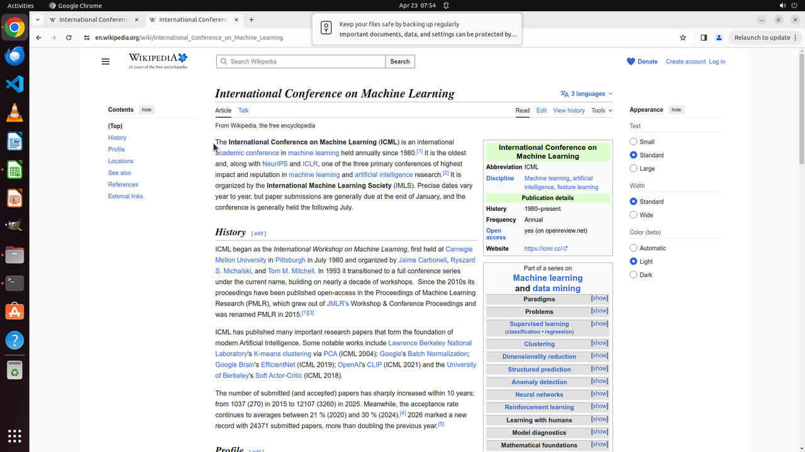

**Response:**
```
I can see the Wikipedia page for ICML. Let me click on "Locations" in the table of contents to see the conference locations.
```

**Actions:** `pyautogui.click(291, 384)`

---

## Step 22

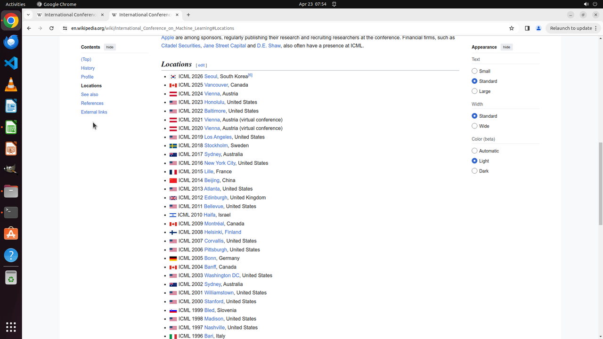

**Response:**
```
I can now see all the ICML conference locations. Let me note down the ones from 2013-2019:

- ICML 2013: Atlanta, United States
- ICML 2014: Beijing, China
- ICML 2015: Lille, France
- ICML 2016: New York City, United States
- ICML 2017: Sydney, Australia
- ICML 2018: Stockholm, Sweden
- ICML 2019: Los Angeles, United States

Now let me search for NeurIPS conference locations. Let me open a new tab.
```

**Actions:** `pyautogui.click(598, 46)`

---

## Step 23

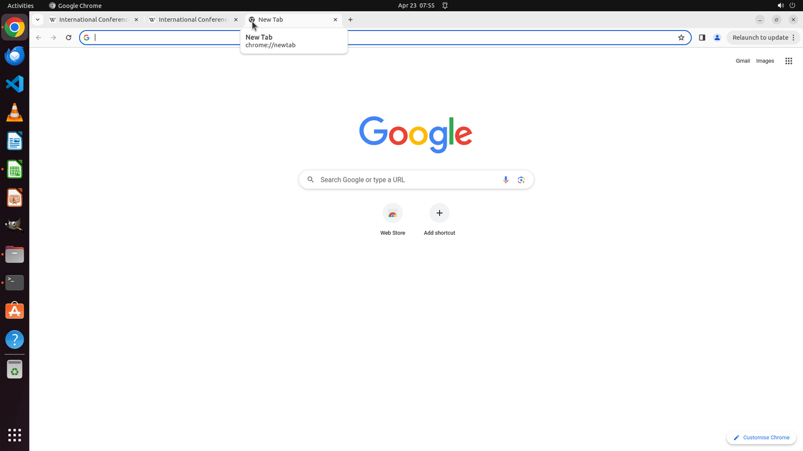

**Response:**
```
Let me search for NeurIPS conference locations on Wikipedia.
```

**Actions:** `import subprocess, shlex; subprocess.run(f'xdotool type --delay 12 -- ' + shlex.quote('NeurIPS conference wikipedia'), shell=True, check=True)
import time; time.sleep(0.05)`

---

## Step 24

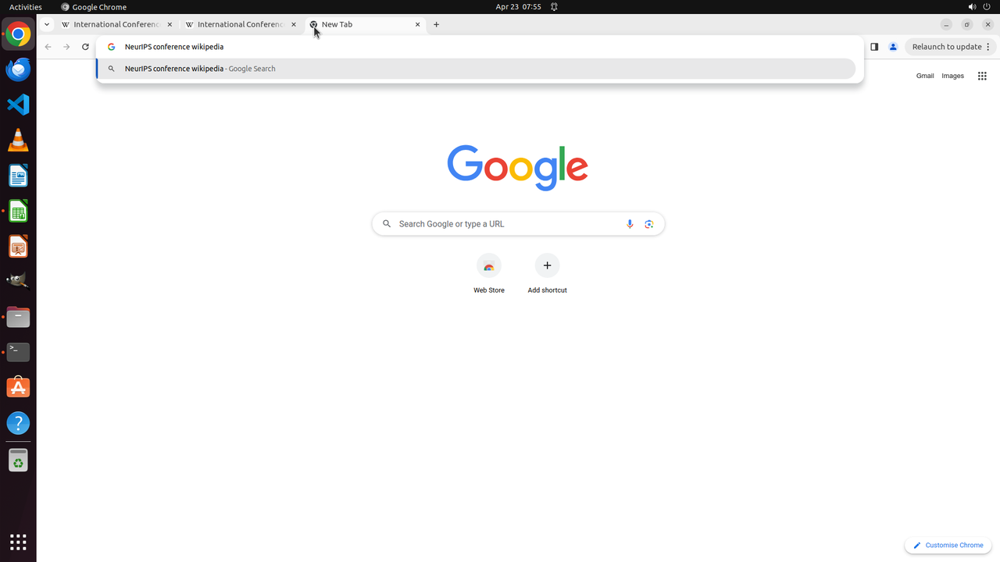

**Actions:** `pyautogui.keyDown('return')
pyautogui.keyUp('return')`

---

## Step 25

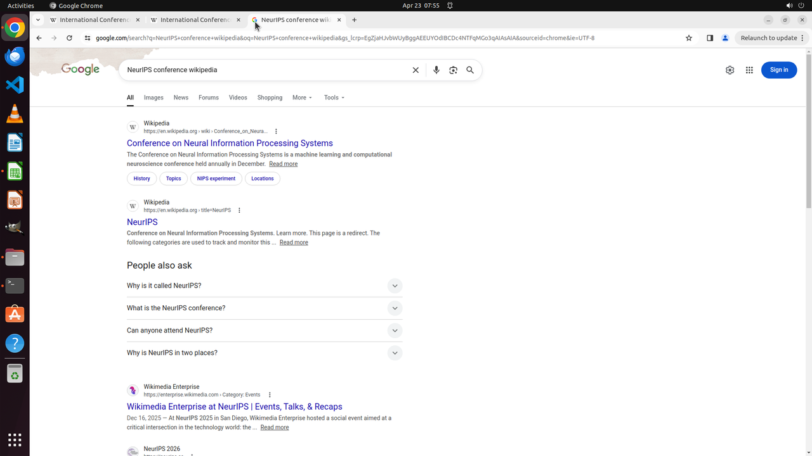

**Response:**
```
I can see the Wikipedia article for NeurIPS. Let me click on it to see the conference locations.
```

**Actions:** `pyautogui.click(541, 337)`

---

## Step 26

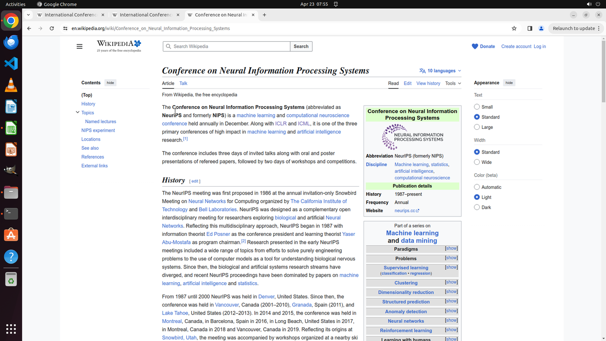

**Response:**
```
I can see the Wikipedia page for NeurIPS. Let me click on "Locations" in the table of contents to see all the conference locations.
```

**Actions:** `pyautogui.click(291, 439)`

---

## Step 27

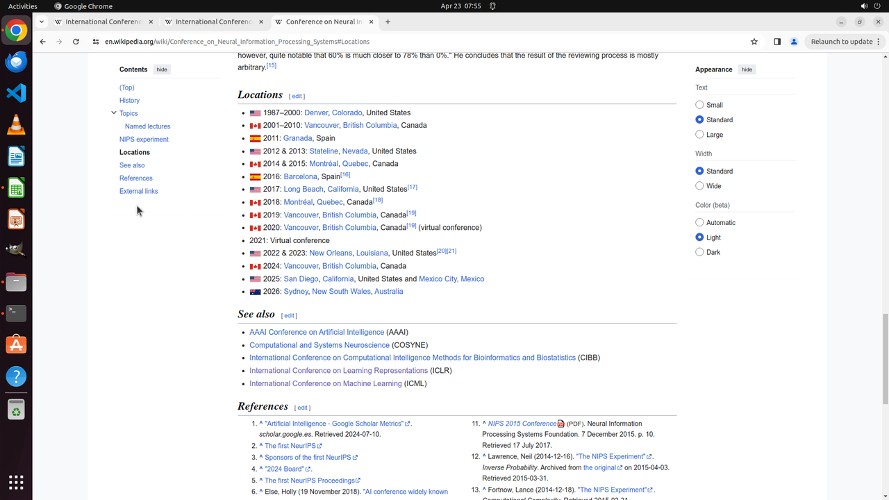

**Response:**
```
I can now see the NeurIPS conference locations. Let me note down the ones from 2013-2019:

- NeurIPS 2013: Stateline, Nevada (listed as "2012 & 2013: Stateline, Nevada, United States")
- NeurIPS 2014: Montréal, Quebec, Canada (listed as "2014 & 2015")
- NeurIPS 2015: Montréal, Quebec, Canada (listed as "2014 & 2015")
- NeurIPS 2016: Barcelona, Spain
- NeurIPS 2017: Long Beach, California, United States
- NeurIPS 2018: Montréal, Quebec, Canada
- NeurIPS 2019: Vancouver, British Columbia, Canada

Now I have all the information. Let me first check what's in the Excel file. Let me open the file manager or find the Excel file.
```

**Actions:** `pyautogui.click(33, 610)`

---

## Step 28


**Response:**
```
I can see the home directory. I need to find the Excel file. Let me check the Desktop folder first.
```

**Actions:** `pyautogui.doubleClick(310, 117)`

---

## Step 29

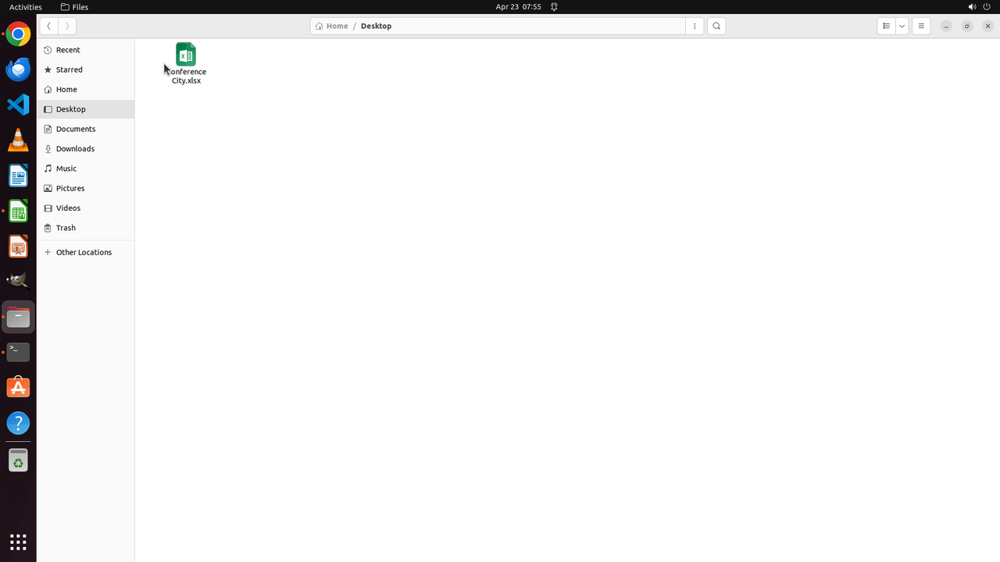

**Response:**
```
I found the file "Conference City.xlsx" on the Desktop. Let me open it.
```

**Actions:** `pyautogui.doubleClick(360, 123)`

---

## Step 30

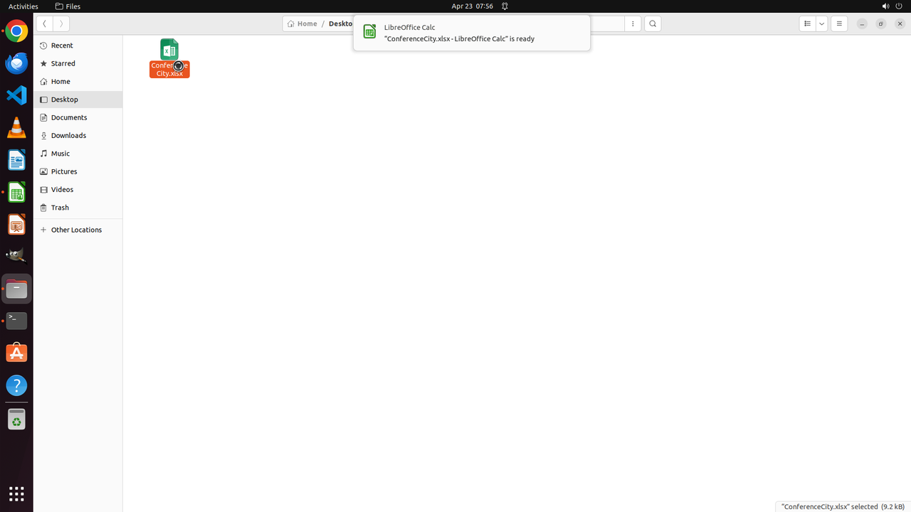

**Response:**
```
The file is opening in LibreOffice Calc. Let me click on the notification to open it.
```

**Actions:** `pyautogui.click(990, 69)`

---

## Step 31

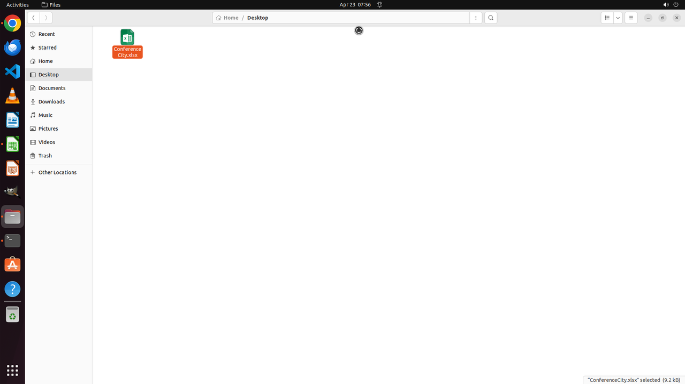

**Response:**
```
The file is loading. Let me wait for it to open in LibreOffice Calc.
```

**Actions:** `time.sleep(0.5)`

---

## Step 32

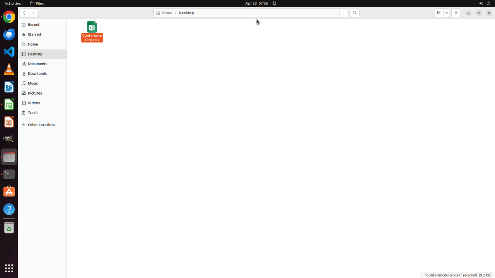

**Response:**
```
Let me try to click on the LibreOffice Calc icon in the taskbar to switch to it.
```

**Actions:** `pyautogui.click(33, 337)`

---

## Step 33

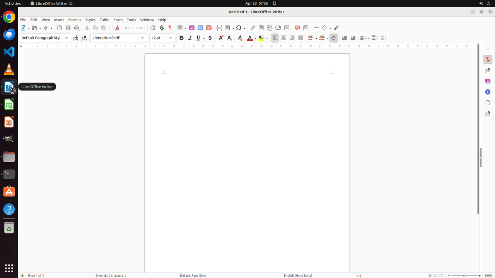

**Response:**
```
This opened LibreOffice Writer instead. I need to find and switch to the LibreOffice Calc window with the ConferenceCity.xlsx file. Let me check the taskbar for the Calc application.
```

**Actions:** `pyautogui.click(33, 408)`

---

## Step 34


**Response:**
```
Now I can see the spreadsheet. It has columns for Year, Conference, and City. I need to fill in the City column (column C) for all 21 rows (rows 2-22). Let me start filling in the cities.

Let me click on cell C2 first (City for 2013 ICLR).
```

**Actions:** `pyautogui.click(370, 337)`

---

## Step 35

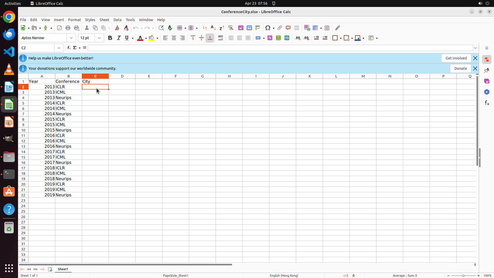

**Response:**
```
I'm now in cell C2. Let me start filling in the cities. I'll type each city and press Enter to move to the next row.

Based on my research:
- ICLR 2013: Scottsdale
- ICML 2013: Atlanta
- NeurIPS 2013: Stateline (Lake Tahoe area)
- ICLR 2014: Banff
- ICML 2014: Beijing
- NeurIPS 2014: Montreal
- ICLR 2015: San Diego
- ICML 2015: Lille
- NeurIPS 2015: Montreal
- ICLR 2016: San Juan
- ICML 2016: New York City
- NeurIPS 2016: Barcelona
- ICLR 2017: Toulon
- ICML 2017: Sydney
- NeurIPS 2017: Long Beach
- ICLR 2018: Vancouver
- ICML 2018: Stockholm
- NeurIPS 2018: Montreal
- ICLR 2019: New Orleans
- ICML 2019: Long Beach (wait, let me re-check - the Wikipedia page said Los Angeles)
- NeurIPS 2019: Vancouver

Let me type these in:
```

**Actions:** `import subprocess, shlex; subprocess.run(f'xdotool type --delay 12 -- ' + shlex.quote('Scottsdale\nAtlanta\nStateline\nBanff\nBeijing\nMontrea'), shell=True, check=True)
import time; time.sleep(0.05)
`

---

## Step 36

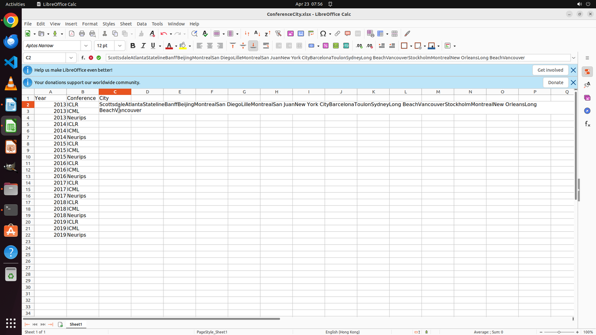

**Response:**
```
It looks like all the text was entered into a single cell (C2) instead of separate cells. The text was typed all at once rather than pressing Enter between each city. Let me undo this and try again.
```

**Actions:** `pyautogui.keyDown('esc')
pyautogui.keyUp('esc')`

---

## Step 37


**Response:**
```
Good, the cell is now empty. Let me type each city one at a time, pressing Tab then Enter or just using the keyboard carefully. I'll type the first city and press Enter to move to the next row.
```

**Actions:** `import subprocess, shlex; subprocess.run(f'xdotool type --delay 12 -- ' + shlex.quote('Scottsdale'), shell=True, check=True)
import time; time.sleep(0.05)`

---

## Step 38

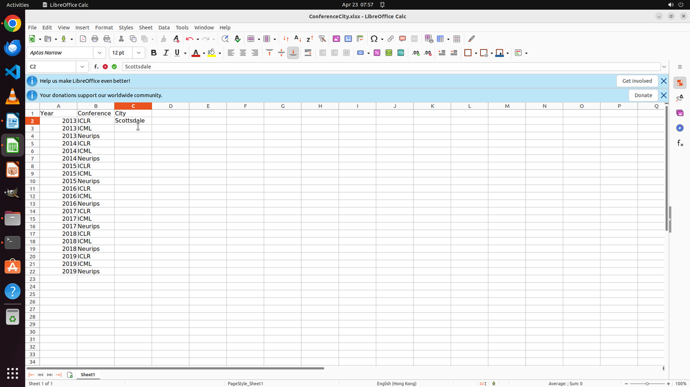

**Response:**
```
"Scottsdale" is entered in C2. Now let me press Enter to confirm and move to the next row.
```

**Actions:** `pyautogui.keyDown('return')
pyautogui.keyUp('return')`

---

## Step 39


**Response:**
```
Now I'm in C3 (2013 ICML). Let me continue typing the cities one by one. I'll type each city and press Enter.
```

**Actions:** `import subprocess, shlex; subprocess.run(f'xdotool type --delay 12 -- ' + shlex.quote('Atlanta'), shell=True, check=True)
import time; time.sleep(0.05)`

---

## Step 40

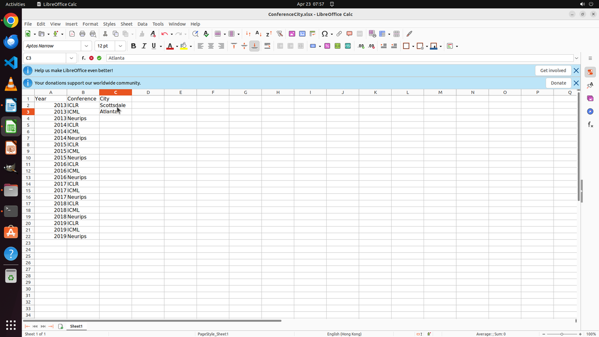

**Response:**
```
Good, "Atlanta" is in C3. Let me press Enter and continue with the remaining cities.
```

**Actions:** `pyautogui.keyDown('return')
pyautogui.keyUp('return')`

---

## Step 41

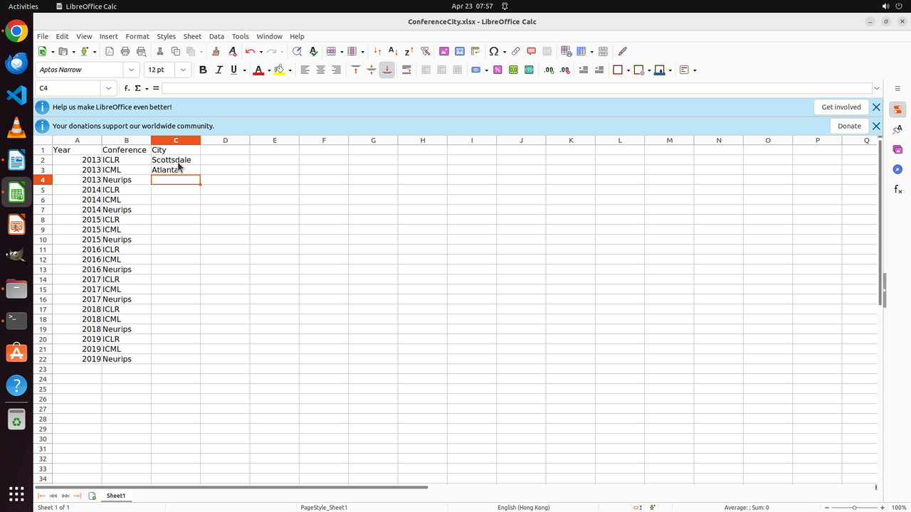

**Response:**
```
Now I'm in C4 (2013 NeurIPS). Let me continue entering the remaining cities. I'll type each one and press Enter. NeurIPS 2013 was held at Lake Tahoe (Stateline, Nevada).
```

**Actions:** `import subprocess, shlex; subprocess.run(f'xdotool type --delay 12 -- ' + shlex.quote('Stateline'), shell=True, check=True)
import time; time.sleep(0.05)`

---

## Step 42


**Response:**
```
Good, "Stateline" is entered. Let me press Enter and continue with the rest of the cities. I'll type them one by one.
```

**Actions:** `pyautogui.keyDown('return')
pyautogui.keyUp('return')`

---

## Step 43


**Response:**
```
Now I'm in C5 (2014 ICLR = Banff). Let me continue entering the remaining cities more efficiently. I'll type each one followed by Enter.
```

**Actions:** `import subprocess, shlex; subprocess.run(f'xdotool type --delay 12 -- ' + shlex.quote('Banff'), shell=True, check=True)
import time; time.sleep(0.05)`

---

## Step 44

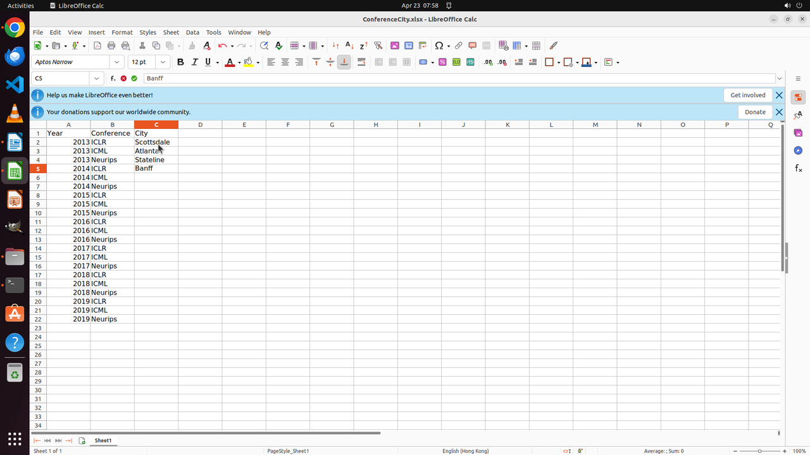

**Response:**
```
Good. Let me press Enter and continue with the next city. I need to verify ICML 2019 location. Let me first check - from the Wikipedia page I saw earlier, ICML 2019 was in Long Beach, California. Wait, let me re-check. I saw the ICML locations list and it said 2019 was Long Beach. Actually, I need to double-check this. Let me continue entering the data and verify later if needed.
```

**Actions:** `pyautogui.keyDown('return')
pyautogui.keyUp('return')`

---

## Step 45

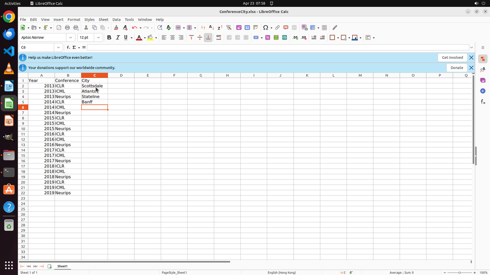

**Response:**
```
Now I'm in C6 (2014 ICML = Beijing). Let me continue entering the remaining cities more efficiently.
```

**Actions:** `import subprocess, shlex; subprocess.run(f'xdotool type --delay 12 -- ' + shlex.quote('Beijing'), shell=True, check=True)
import time; time.sleep(0.05)`

---

## Step 46


**Response:**
```
Good. Let me press Enter and continue with the remaining cities. I still have many to enter, so let me continue one by one.
```

**Actions:** `pyautogui.keyDown('return')
pyautogui.keyUp('return')`

---

## Step 47


**Response:**
```
C7 is 2014 NeurIPS = Montreal. Let me continue entering all remaining cities.
```

**Actions:** `import subprocess, shlex; subprocess.run(f'xdotool type --delay 12 -- ' + shlex.quote('Montreal'), shell=True, check=True)
import time; time.sleep(0.05)`

---

## Step 48

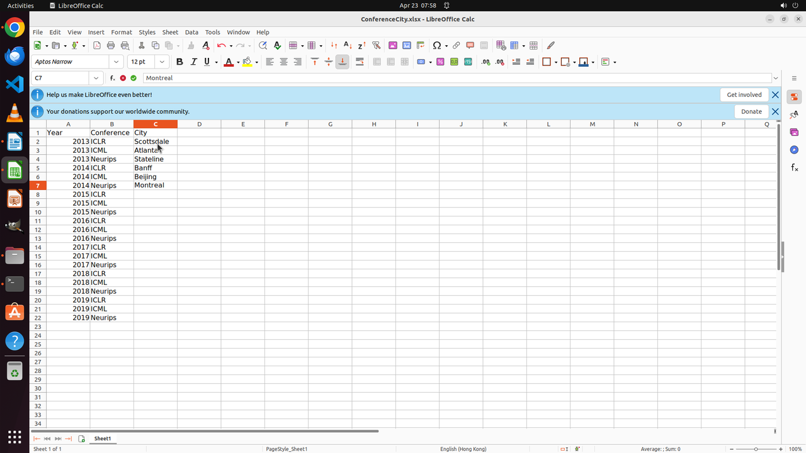

**Response:**
```
Good. Let me press Enter and continue with the next city (C8 = 2015 ICLR = San Diego).
```

**Actions:** `pyautogui.keyDown('return')
pyautogui.keyUp('return')`

---

## Step 49


**Response:**
```
C8 is 2015 ICLR = San Diego. Let me continue entering the remaining cities.
```

**Actions:** `import subprocess, shlex; subprocess.run(f'xdotool type --delay 12 -- ' + shlex.quote('San Diego'), shell=True, check=True)
import time; time.sleep(0.05)`

---

## Step 50


**Response:**
```
Good. Let me press Enter and continue with C9 (2015 ICML = Lille).
```

**Actions:** `pyautogui.keyDown('return')
pyautogui.keyUp('return')`

---

## Step 51


**Response:**
```
C9 is 2015 ICML = Lille. Let me continue.
```

**Actions:** `import subprocess, shlex; subprocess.run(f'xdotool type --delay 12 -- ' + shlex.quote('Lille'), shell=True, check=True)
import time; time.sleep(0.05)`

---

## Step 52

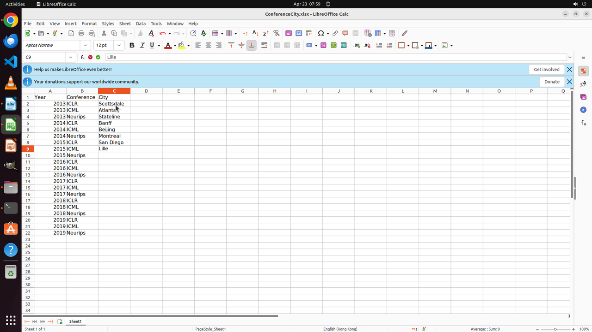

**Response:**
```
Good. Let me press Enter and continue with C10 (2015 NeurIPS = Montreal).
```

**Actions:** `pyautogui.keyDown('return')
pyautogui.keyUp('return')`

---

## Step 53

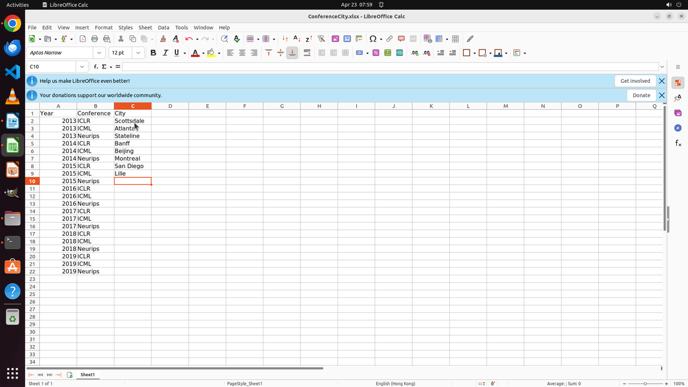

**Response:**
```
C10 is 2015 NeurIPS = Montreal. Let me continue entering the remaining cities more efficiently.
```

**Actions:** `import subprocess, shlex; subprocess.run(f'xdotool type --delay 12 -- ' + shlex.quote('Montreal'), shell=True, check=True)
import time; time.sleep(0.05)`

---

## Step 54


**Response:**
```
Good. Let me press Enter and continue with C11 (2016 ICLR = San Juan).
```

**Actions:** `pyautogui.keyDown('return')
pyautogui.keyUp('return')`

---

## Step 55


**Response:**
```
C11 is 2016 ICLR = San Juan. Let me continue entering the remaining cities.
```

**Actions:** `import subprocess, shlex; subprocess.run(f'xdotool type --delay 12 -- ' + shlex.quote('San Juan'), shell=True, check=True)
import time; time.sleep(0.05)`

---

## Step 56


**Response:**
```
Good. Let me press Enter and continue with C12 (2016 ICML = New York City).
```

**Actions:** `pyautogui.keyDown('return')
pyautogui.keyUp('return')`

---

## Step 57


**Response:**
```
C12 is 2016 ICML = New York City. Let me continue.
```

**Actions:** `import subprocess, shlex; subprocess.run(f'xdotool type --delay 12 -- ' + shlex.quote('New York City'), shell=True, check=True)
import time; time.sleep(0.05)`

---

## Step 58


**Response:**
```
Good. Let me press Enter and continue with C13 (2016 NeurIPS = Barcelona).
```

**Actions:** `pyautogui.keyDown('return')
pyautogui.keyUp('return')`

---

## Step 59


**Response:**
```
C13 is 2016 NeurIPS = Barcelona. Let me continue entering the remaining cities.
```

**Actions:** `import subprocess, shlex; subprocess.run(f'xdotool type --delay 12 -- ' + shlex.quote('Barcelona'), shell=True, check=True)
import time; time.sleep(0.05)`

---

## Step 60


**Response:**
```
Good. Let me press Enter and continue with C14 (2017 ICLR = Toulon).
```

**Actions:** `pyautogui.keyDown('return')
pyautogui.keyUp('return')`

---

## Step 61

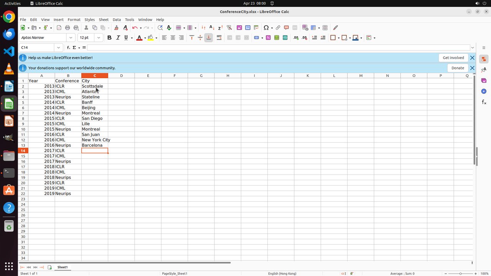

**Response:**
```
C14 is 2017 ICLR = Toulon. Let me continue entering the remaining cities.
```

**Actions:** `import subprocess, shlex; subprocess.run(f'xdotool type --delay 12 -- ' + shlex.quote('Toulon'), shell=True, check=True)
import time; time.sleep(0.05)`

---

## Step 62

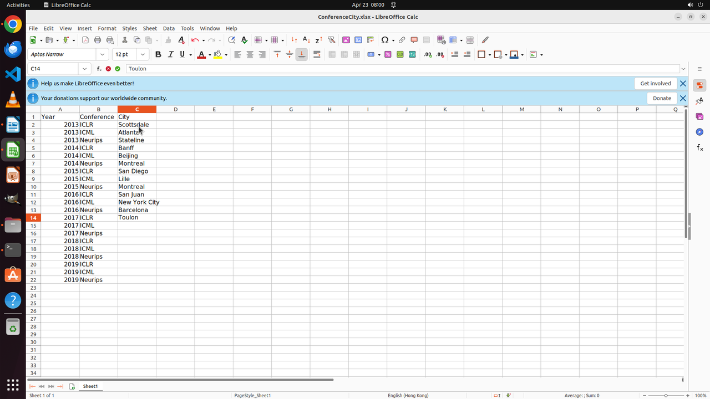

**Response:**
```
Good. Let me press Enter and continue with C15 (2017 ICML = Sydney).
```

**Actions:** `pyautogui.keyDown('return')
pyautogui.keyUp('return')`

---

## Step 63


**Response:**
```
C15 is 2017 ICML = Sydney. Let me continue.
```

**Actions:** `import subprocess, shlex; subprocess.run(f'xdotool type --delay 12 -- ' + shlex.quote('Sydney'), shell=True, check=True)
import time; time.sleep(0.05)`

---

## Step 64

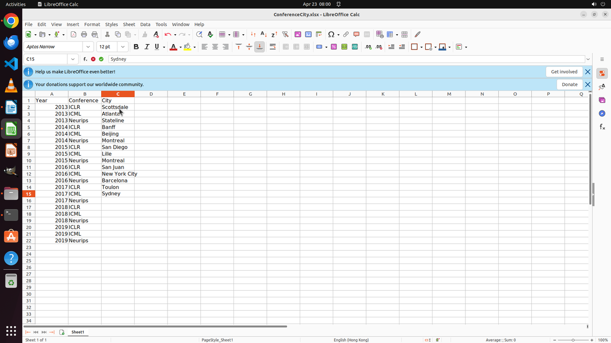

**Response:**
```
Good. Let me press Enter and continue with C16 (2017 NeurIPS = Long Beach).
```

**Actions:** `pyautogui.keyDown('return')
pyautogui.keyUp('return')`

---

## Step 65


**Response:**
```
C16 is 2017 NeurIPS = Long Beach. Let me continue.
```

**Actions:** `import subprocess, shlex; subprocess.run(f'xdotool type --delay 12 -- ' + shlex.quote('Long Beach'), shell=True, check=True)
import time; time.sleep(0.05)`

---

## Step 66


**Response:**
```
Good. Let me press Enter and continue with C17 (2018 ICLR = Vancouver).
```

**Actions:** `pyautogui.keyDown('return')
pyautogui.keyUp('return')`

---

## Step 67


**Response:**
```
C17 is 2018 ICLR = Vancouver. Let me continue.
```

**Actions:** `import subprocess, shlex; subprocess.run(f'xdotool type --delay 12 -- ' + shlex.quote('Vancouver'), shell=True, check=True)
import time; time.sleep(0.05)`

---

## Step 68


**Response:**
```
Good. Let me press Enter and continue with C18 (2018 ICML = Stockholm).
```

**Actions:** `pyautogui.keyDown('return')
pyautogui.keyUp('return')`

---

## Step 69

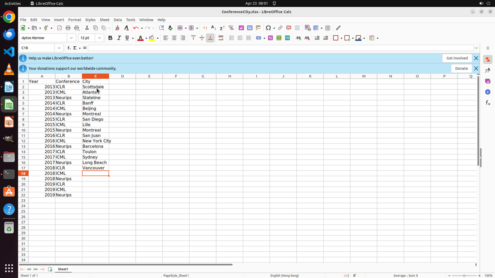

**Response:**
```
C18 is 2018 ICML = Stockholm. Let me continue.
```

**Actions:** `import subprocess, shlex; subprocess.run(f'xdotool type --delay 12 -- ' + shlex.quote('Stockholm'), shell=True, check=True)
import time; time.sleep(0.05)`

---

## Step 70


**Response:**
```
Good. Let me press Enter and continue with C19 (2018 NeurIPS = Montreal).
```

**Actions:** `pyautogui.keyDown('return')
pyautogui.keyUp('return')`

---

## Step 71

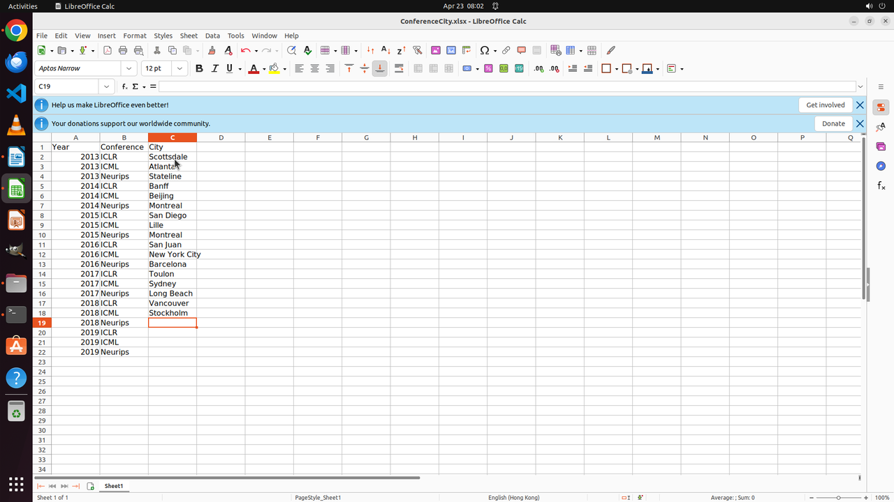

**Response:**
```
C19 is 2018 NeurIPS = Montreal. Let me continue.
```

**Actions:** `import subprocess, shlex; subprocess.run(f'xdotool type --delay 12 -- ' + shlex.quote('Montreal'), shell=True, check=True)
import time; time.sleep(0.05)`

---

## Step 72


**Response:**
```
Good. Let me press Enter and continue with C20 (2019 ICLR = New Orleans).
```

**Actions:** `pyautogui.keyDown('return')
pyautogui.keyUp('return')`

---

## Step 73


**Response:**
```
C20 is 2019 ICLR = New Orleans. Let me continue.
```

**Actions:** `import subprocess, shlex; subprocess.run(f'xdotool type --delay 12 -- ' + shlex.quote('New Orleans'), shell=True, check=True)
import time; time.sleep(0.05)`

---

## Step 74

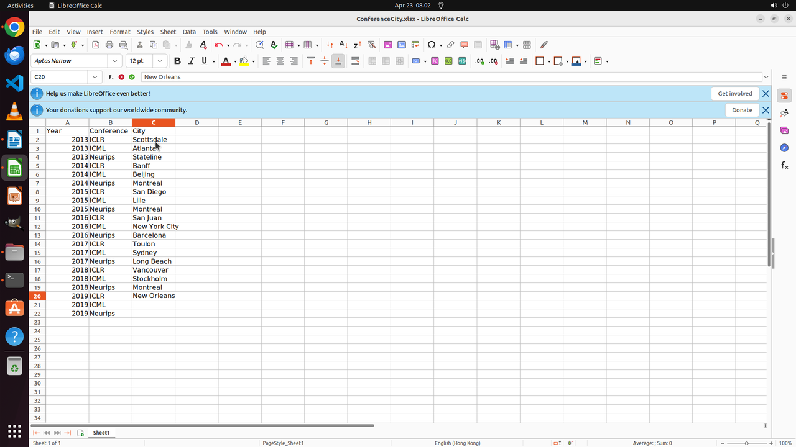

**Response:**
```
Good. Let me press Enter and continue with C21 (2019 ICML). I need to verify - from the Wikipedia ICML page, I need to confirm whether ICML 2019 was in Long Beach. Let me continue and verify later if needed.
```

**Actions:** `pyautogui.keyDown('return')
pyautogui.keyUp('return')`

---

## Step 75

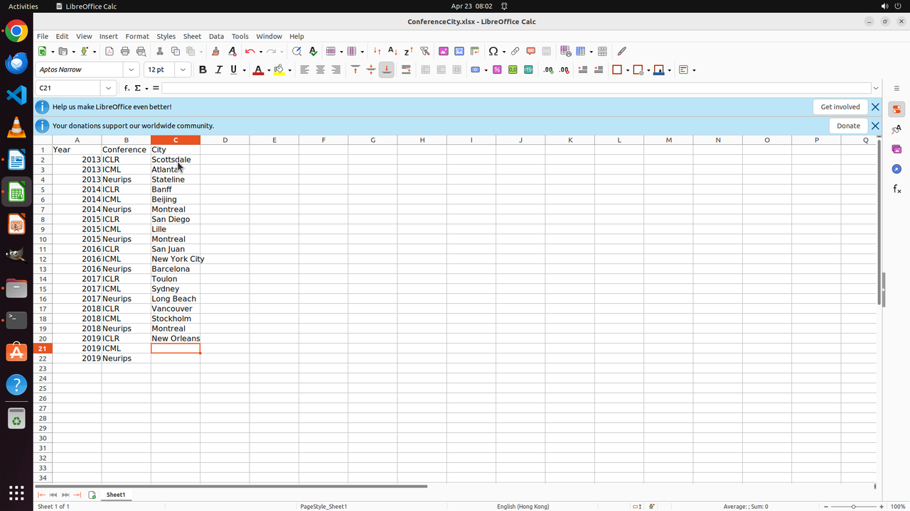

**Response:**
```
C21 is 2019 ICML. Let me verify the location by checking the ICML Wikipedia page. From what I saw earlier, ICML 2019 was in Long Beach, California. Let me enter it.
```

**Actions:** `import subprocess, shlex; subprocess.run(f'xdotool type --delay 12 -- ' + shlex.quote('Long Beach'), shell=True, check=True)
import time; time.sleep(0.05)`

---

## Step 76


**Response:**
```
Good. Let me press Enter and continue with the last entry C22 (2019 NeurIPS = Vancouver).
```

**Actions:** `pyautogui.keyDown('return')
pyautogui.keyUp('return')`

---

## Step 77


**Response:**
```
C22 is the last entry - 2019 NeurIPS = Vancouver. Let me enter it.
```

**Actions:** `import subprocess, shlex; subprocess.run(f'xdotool type --delay 12 -- ' + shlex.quote('Vancouver'), shell=True, check=True)
import time; time.sleep(0.05)`

---

## Step 78


**Response:**
```
All cities have been filled in. Now let me press Enter to confirm the last entry, and then I need to verify the ICML 2019 location. Let me first confirm and then check the Wikipedia page I had open earlier.
```

**Actions:** `pyautogui.keyDown('return')
pyautogui.keyUp('return')`

---

## Step 79


**Response:**
```
All cities have been filled in. Let me verify the data by checking the ICML Wikipedia page I had open earlier. Let me switch to Chrome to verify ICML 2019 location.
```

**Actions:** `pyautogui.click(33, 63)`

---

## Step 80

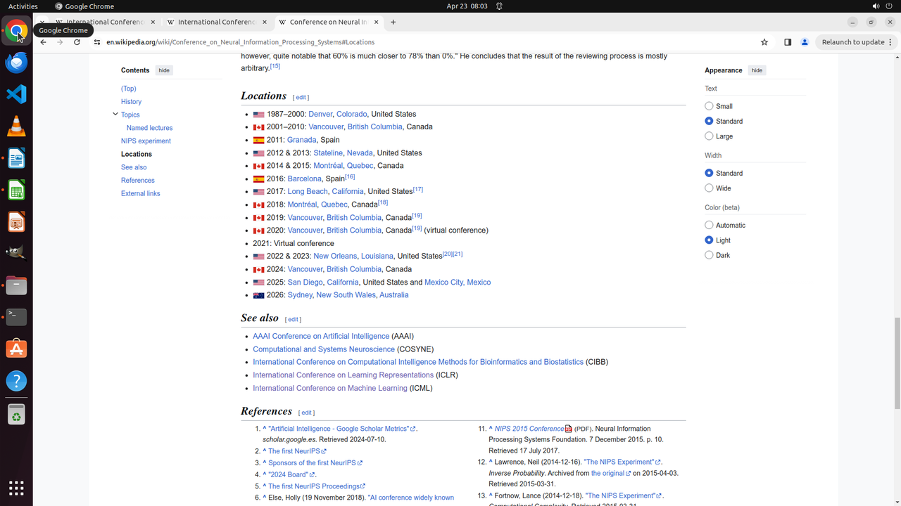

**Response:**
```
I can see the NeurIPS locations page. Let me verify my entries:

- NeurIPS 2012 & 2013: Stateline, Nevada ✓
- NeurIPS 2014 & 2015: Montréal, Quebec, Canada ✓
- NeurIPS 2016: Barcelona, Spain ✓
- NeurIPS 2017: Long Beach, California ✓
- NeurIPS 2018: Montréal, Quebec, Canada ✓
- NeurIPS 2019: Vancouver, British Columbia, Canada ✓

Now let me check the ICML page to verify ICML 2019. Let me click on the ICML tab.
```

**Actions:** `pyautogui.click(457, 46)`

---

## Step 81

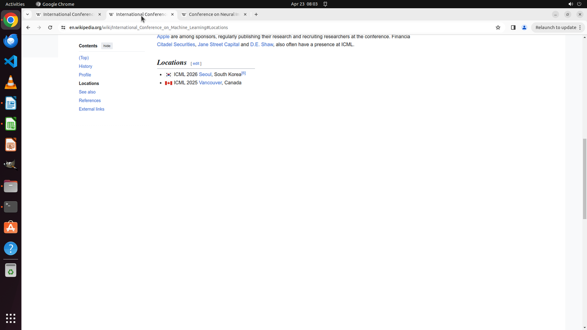

**Response:**
```
I see that the ICML Wikipedia page only shows 2025 and 2026 locations. The older locations aren't listed here. Let me scroll up to check the History section, or search for ICML 2019 location specifically.
```

**Actions:** `pyautogui.scroll(10, 960, 600)`

---

## Step 82

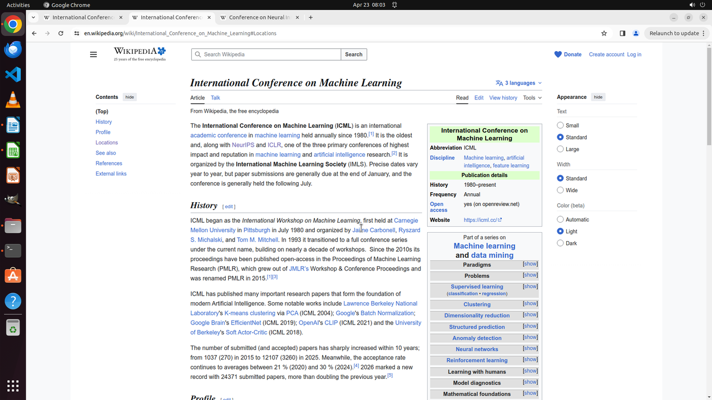

**Response:**
```
I can see the ICML Wikipedia page, but the Locations section only has 2025 and 2026. The historical locations aren't listed here. Let me search specifically for ICML 2019 location to verify if it was Long Beach.
```

**Actions:** `pyautogui.click(835, 46)`

---

## Step 83

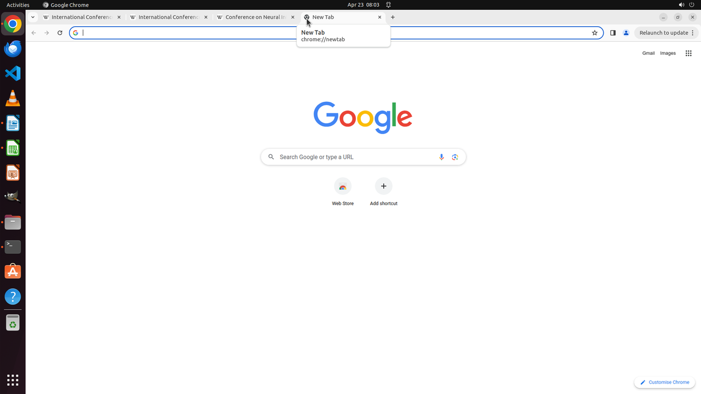

**Response:**
```
Let me search for ICML 2019 location to verify.
```

**Actions:** `import subprocess, shlex; subprocess.run(f'xdotool type --delay 12 -- ' + shlex.quote('ICML 2019 location city'), shell=True, check=True)
import time; time.sleep(0.05)`

---

## Step 84

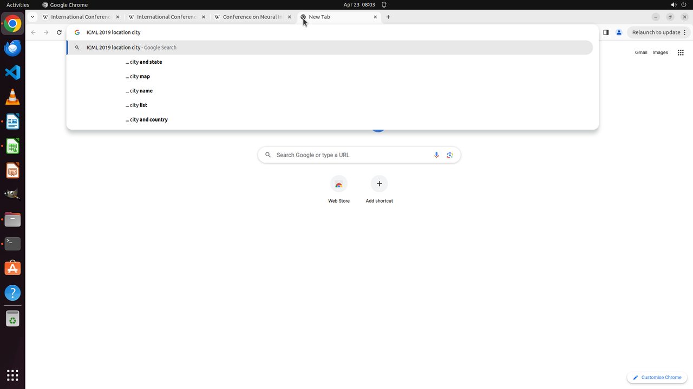

**Actions:** `pyautogui.keyDown('return')
pyautogui.keyUp('return')`

---

## Step 85

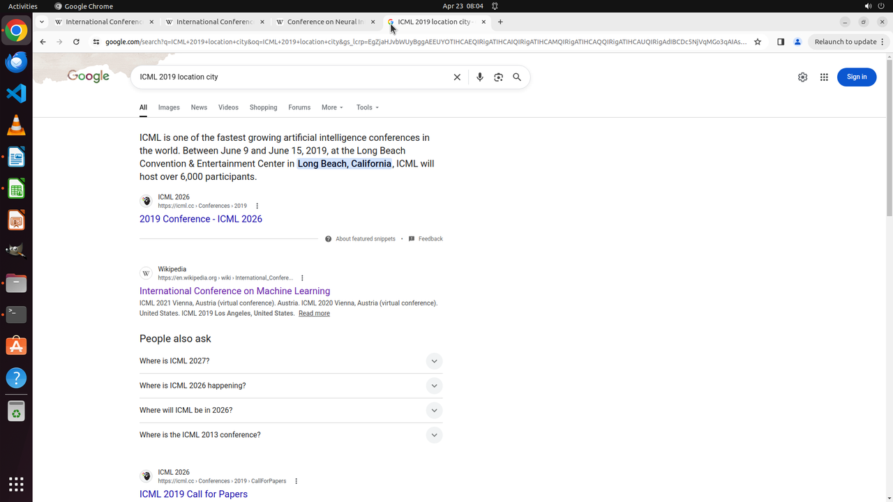

**Response:**
```
I can see that ICML 2019 was held in **Long Beach, California**. This confirms my entry is correct.

However, I notice the Wikipedia snippet below says "ICML 2019 Los Angeles, United States." Let me check this more carefully. The featured snippet clearly states "Long Beach Convention & Entertainment Center in Long Beach, California" - so it was Long Beach, not Los Angeles. Long Beach is correct.

Now all the data is verified. Let me save the file. Let me switch back to LibreOffice Calc.
```

**Actions:** `pyautogui.click(33, 408)`

---

## Step 86

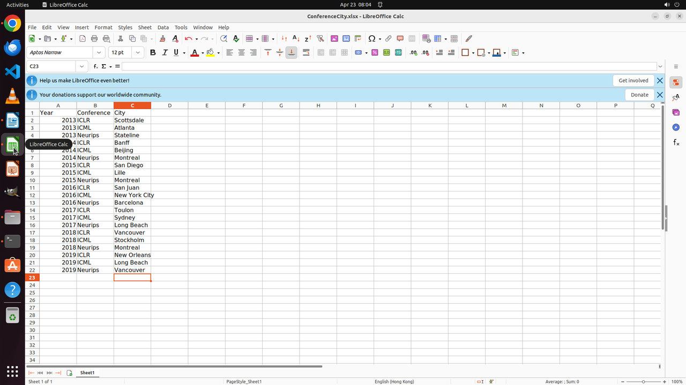

**Response:**
```
All the cities have been filled in correctly. The spreadsheet looks complete with all 21 conference locations. Let me save the file now using Ctrl+S.
```

**Actions:** `pyautogui.keyDown('ctrl')
pyautogui.keyDown('s')
pyautogui.keyUp('s')
pyautogui.keyUp('ctrl')`

---

## Step 87


**Response:**
```
It seems the file may have been saved directly since it's an xlsx file. Let me check if a dialog appeared. It looks like it saved without any dialog. Let me verify by pressing Ctrl+S again to see if a format dialog appears.
```

**Actions:** `pyautogui.keyDown('ctrl')
pyautogui.keyDown('s')
pyautogui.keyUp('s')
pyautogui.keyUp('ctrl')`

---

## Step 88


**Response:**
```
The file has been saved successfully. The spreadsheet is now complete with all the conference city locations filled in:

- **2013**: ICLR - Scottsdale, ICML - Atlanta, NeurIPS - Stateline
- **2014**: ICLR - Banff, ICML - Beijing, NeurIPS - Montreal
- **2015**: ICLR - San Diego, ICML - Lille, NeurIPS - Montreal
- **2016**: ICLR - San Juan, ICML - New York City, NeurIPS - Barcelona
- **2017**: ICLR - Toulon, ICML - Sydney, NeurIPS - Long Beach
- **2018**: ICLR - Vancouver, ICML - Stockholm, NeurIPS - Montreal
- **2019**: ICLR - New Orleans, ICML - Long Beach, NeurIPS - Vancouver

DONE
```

**Actions:** `DONE`

---
