# Task 6f4073b8-d8ea-4ade-8a18-c5d1d5d5aa9a

**Instruction:** I now want to count the meeting cities of the three machine learning conferences in the past ten years from 2013 to 2019(including 2013 and 2019). I have listed the names and years of the conferences in excel. Please fill in the vacant locations.

**Score:** 1.0

**Wall clock:** 11m 54s

**Steps:** 83

**Cost:** $3.11

---

## Step 1


**Response:**
```
I need to fill in the city locations for each conference-year combination. Let me first research the locations of these conferences from 2013-2019.

Let me start by looking up the conference locations. I'll use Chrome to search for this information.
```

**Actions:** `pyautogui.keyDown('command')
pyautogui.keyUp('command')`

---

## Step 2


**Response:**
```
Let me open a terminal to launch Chrome for researching the conference locations.
```

**Actions:** `pyautogui.keyDown('esc')
pyautogui.keyUp('esc')`

---

## Step 3

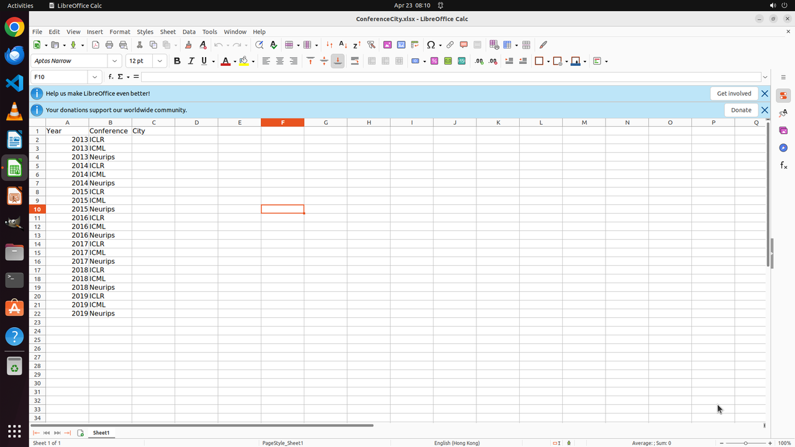

**Response:**
```
Let me right-click on the desktop to find a terminal, or look for one in the taskbar.
```

**Actions:** `pyautogui.rightClick(960, 900)`

---

## Step 4

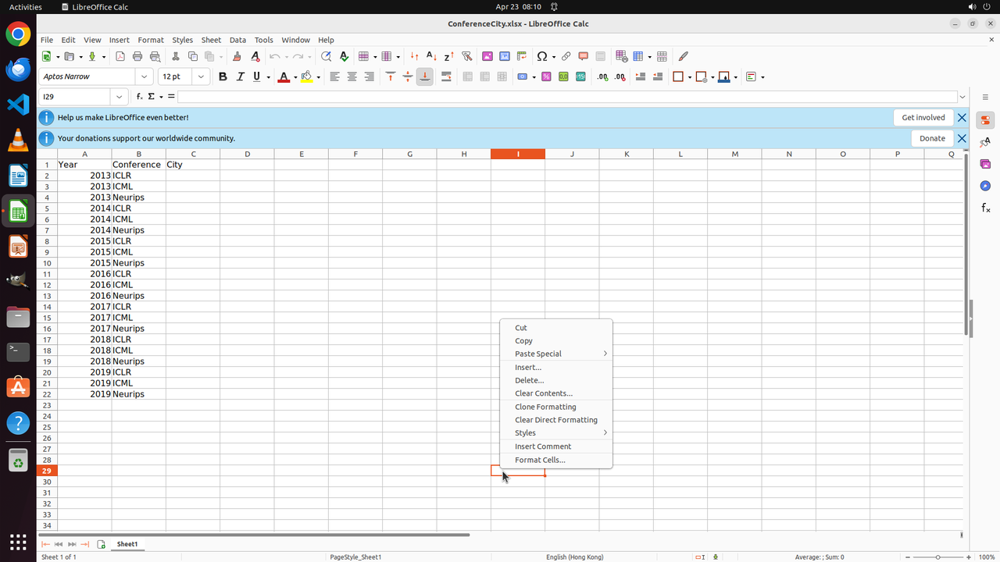

**Response:**
```
Let me close this context menu and open a terminal application instead.
```

**Actions:** `pyautogui.keyDown('esc')
pyautogui.keyUp('esc')`

---

## Step 5

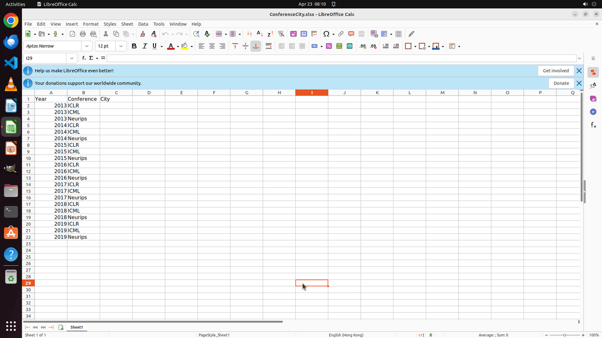

**Response:**
```
I can see a terminal icon in the taskbar on the left. Let me click on it.
```

**Actions:** `pyautogui.click(33, 574)`

---

## Step 6

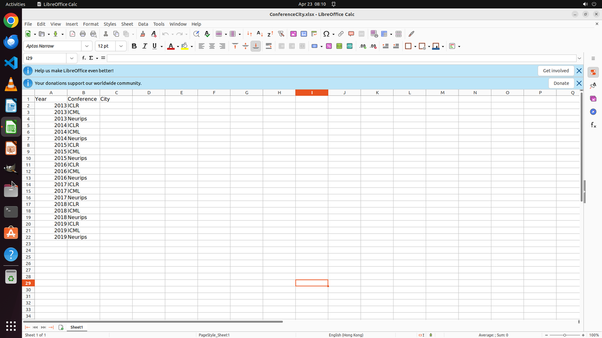

**Response:**
```
Let me try to find and open a terminal application. I'll look for the file manager icon or try to find a terminal.
```

**Actions:** `pyautogui.click(33, 610)`

---

## Step 7


**Response:**
```
I see the Files manager opened. Let me look for a terminal application. I'll try clicking on the terminal-like icon in the taskbar.
```

**Actions:** `pyautogui.click(33, 673)`

---

## Step 8

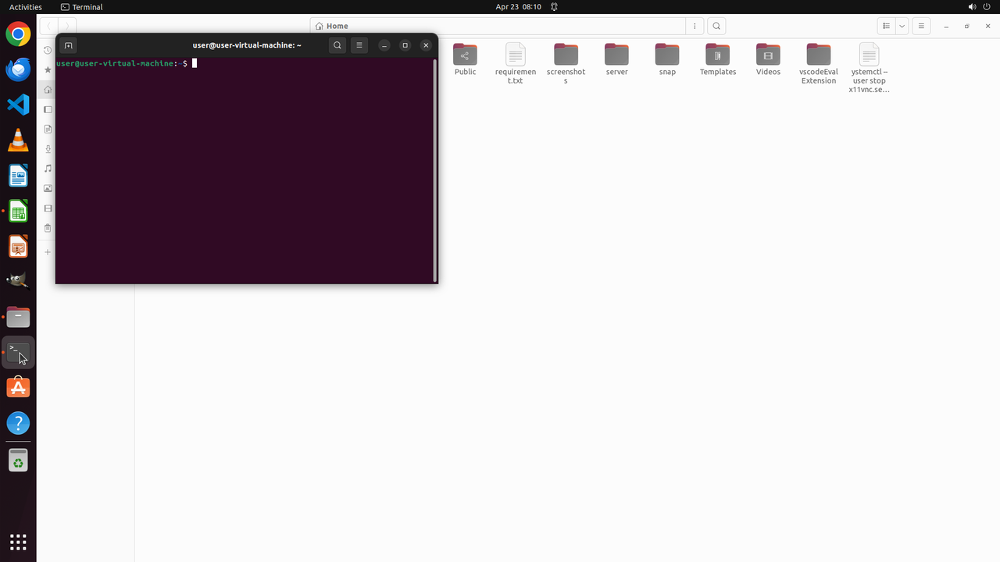

**Response:**
```
A terminal is now open. Let me launch Chrome to research the conference locations.
```

**Actions:** `import subprocess, shlex; subprocess.run(f'xdotool type --delay 12 -- ' + shlex.quote('google-chrome --remote-debugging-port=1337 &\n'), shell=True, check=True)
import time; time.sleep(0.05)`

---

## Step 9

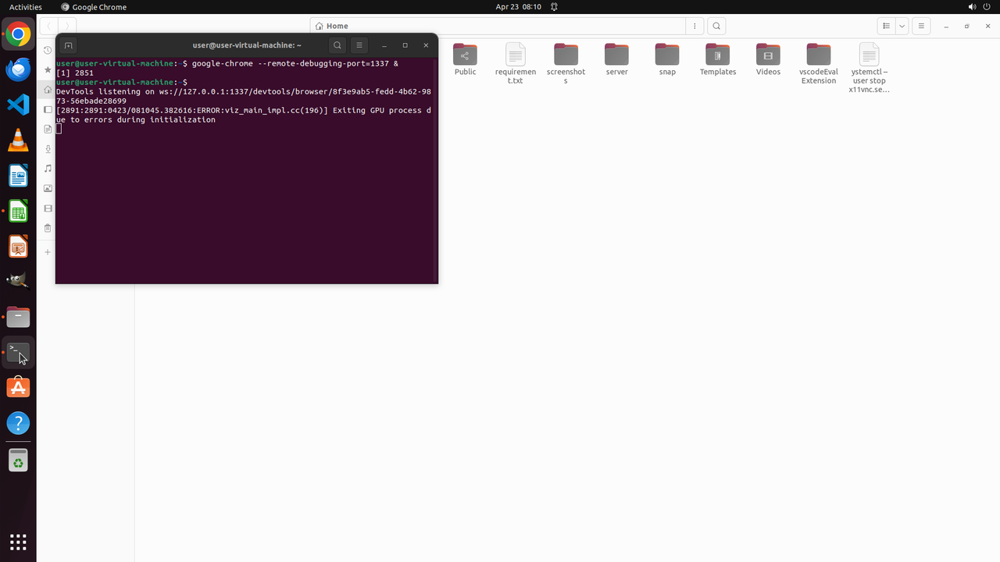

**Response:**
```
Chrome is launching. Let me wait a moment and then click on the Chrome icon to switch to it.
```

**Actions:** `pyautogui.click(33, 63)`

---

## Step 10

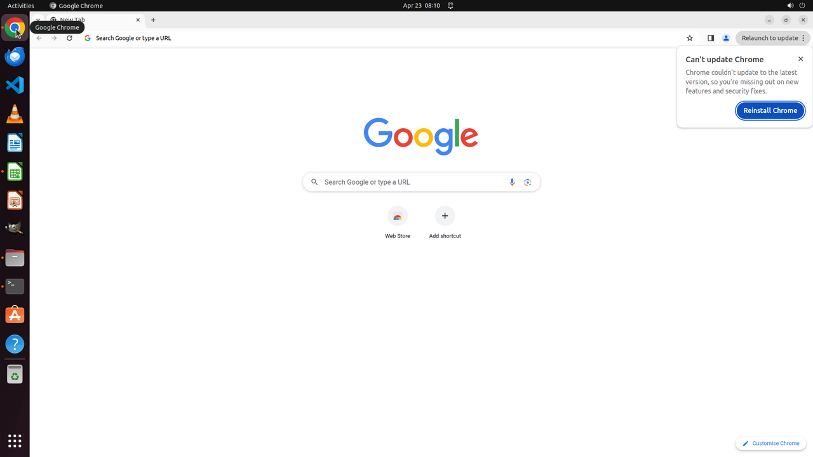

**Response:**
```
Chrome is open. Let me close the update notification and search for the conference locations. I'll start by searching for ICLR conference locations.
```

**Actions:** `pyautogui.click(1888, 139)`

---

## Step 11

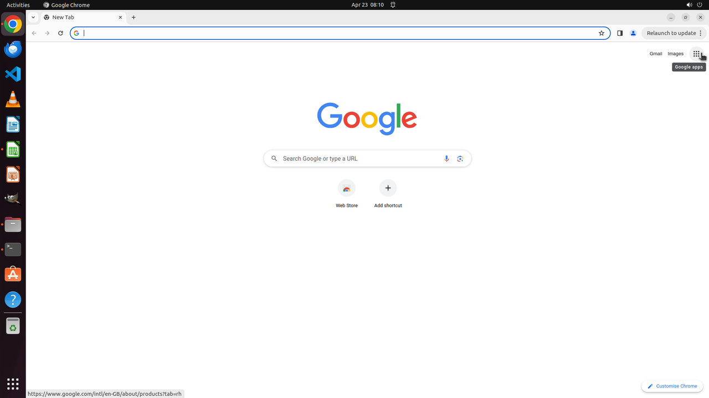

**Response:**
```
Let me search for ICLR conference locations history.
```

**Actions:** `pyautogui.click(960, 88)`

---

## Step 12

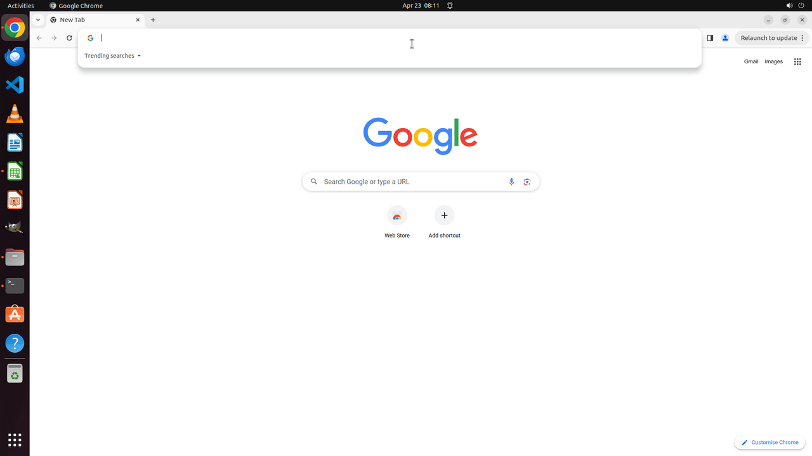

**Actions:** `import subprocess, shlex; subprocess.run(f'xdotool type --delay 12 -- ' + shlex.quote('ICLR conference locations history 2013 2014 2015 2'), shell=True, check=True)
import time; time.sleep(0.05)
impor`

---

## Step 13

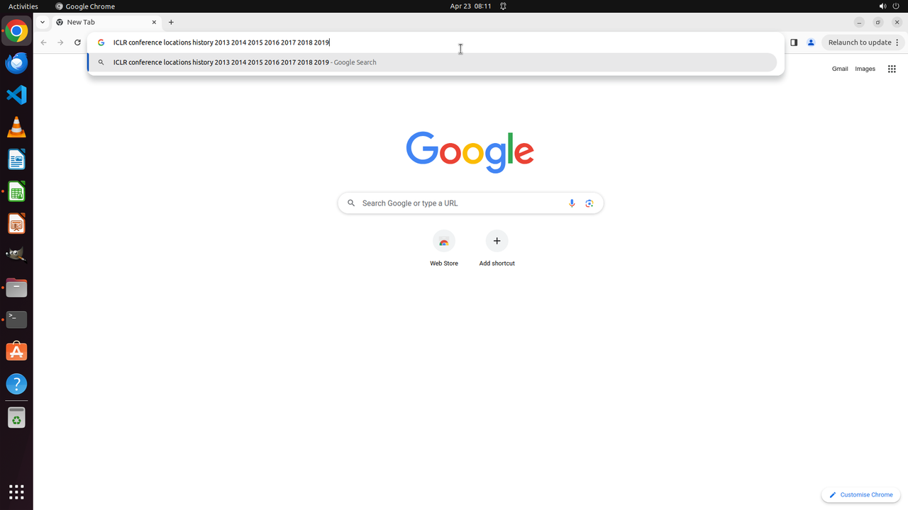

**Actions:** `pyautogui.keyDown('return')
pyautogui.keyUp('return')`

---

## Step 14

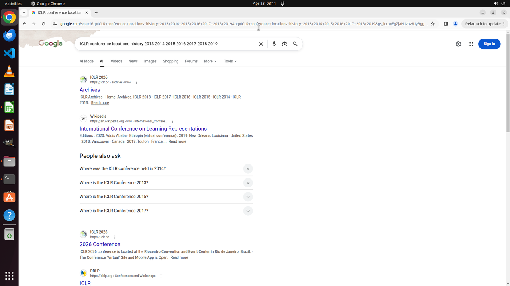

**Response:**
```
I can see the Wikipedia article about ICLR. Let me click on it to get the full list of locations.
```

**Actions:** `pyautogui.click(537, 484)`

---

## Step 15

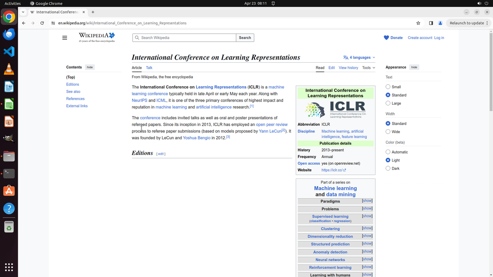

**Response:**
```
I can see the Wikipedia page for ICLR. Let me scroll down to the "Editions" section to see the locations for each year.
```

**Actions:** `pyautogui.click(285, 327)`

---

## Step 16

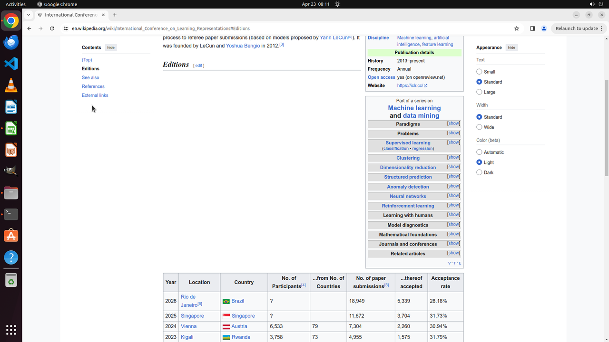

**Response:**
```
I can see the Editions table for ICLR. Let me scroll down to see the years 2013-2019.
```

**Actions:** `pyautogui.scroll(-5, 960, 600)`

---

## Step 17

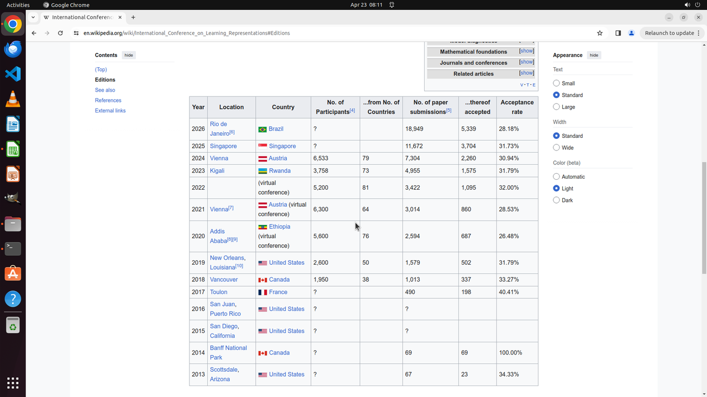

**Response:**
```
Excellent! I can now see all the ICLR conference locations from 2013-2019. Let me note them down:

- 2013 ICLR: Scottsdale, Arizona (United States)
- 2014 ICLR: Banff National Park (Canada)
- 2015 ICLR: San Diego, California (United States)
- 2016 ICLR: San Juan, Puerto Rico (United States)
- 2017 ICLR: Toulon (France)
- 2018 ICLR: Vancouver (Canada)
- 2019 ICLR: New Orleans, Louisiana (United States)

Now let me search for ICML conference locations. Let me open a new tab.
```

**Actions:** `pyautogui.click(364, 46)`

---

## Step 18

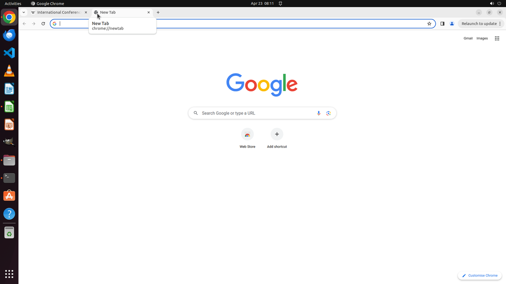

**Response:**
```
Now let me search for ICML conference locations on Wikipedia.
```

**Actions:** `import subprocess, shlex; subprocess.run(f'xdotool type --delay 12 -- ' + shlex.quote('ICML International Conference on Machine Learning '), shell=True, check=True)
import time; time.sleep(0.05)
impor`

---

## Step 19

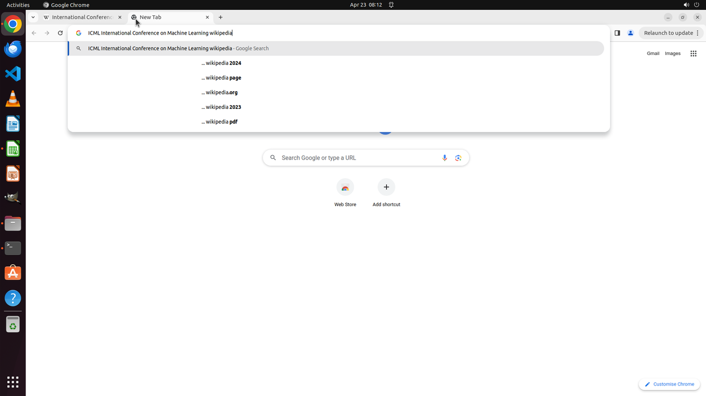

**Actions:** `pyautogui.keyDown('return')
pyautogui.keyUp('return')`

---

## Step 20

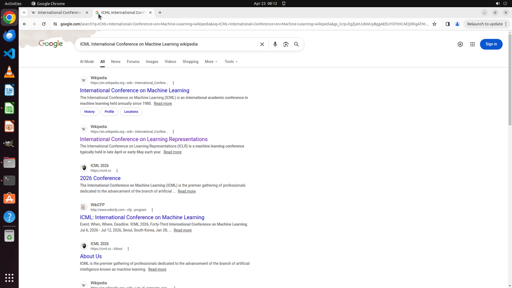

**Response:**
```
I can see the Wikipedia article for ICML. Let me click on it.
```

**Actions:** `pyautogui.click(504, 337)`

---

## Step 21

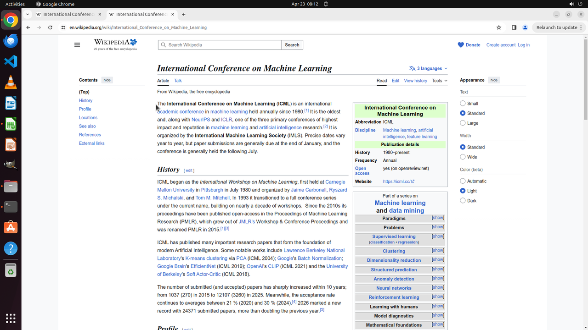

**Response:**
```
I can see the ICML Wikipedia page. Let me click on "Locations" in the table of contents to see the conference locations.
```

**Actions:** `pyautogui.click(294, 384)`

---

## Step 22

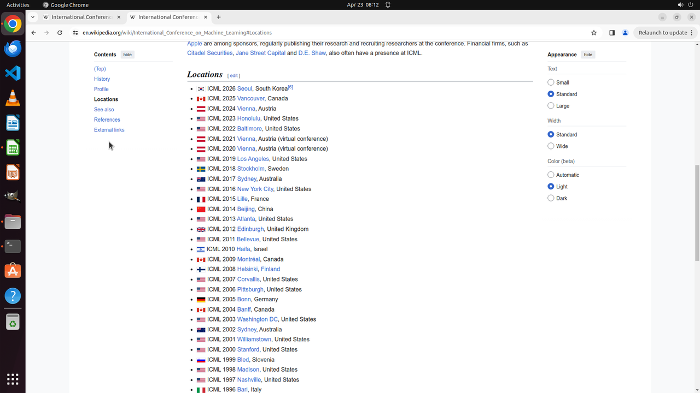

**Response:**
```
I can see all the ICML conference locations. Let me note down the ones from 2013-2019:

- ICML 2013: Atlanta, United States
- ICML 2014: Beijing, China
- ICML 2015: Lille, France
- ICML 2016: New York City, United States
- ICML 2017: Sydney, Australia
- ICML 2018: Stockholm, Sweden
- ICML 2019: Los Angeles (Long Beach), United States

Now I need to find the NeurIPS (NIPS) conference locations. Let me open a new tab and search for that.
```

**Actions:** `pyautogui.click(598, 46)`

---

## Step 23

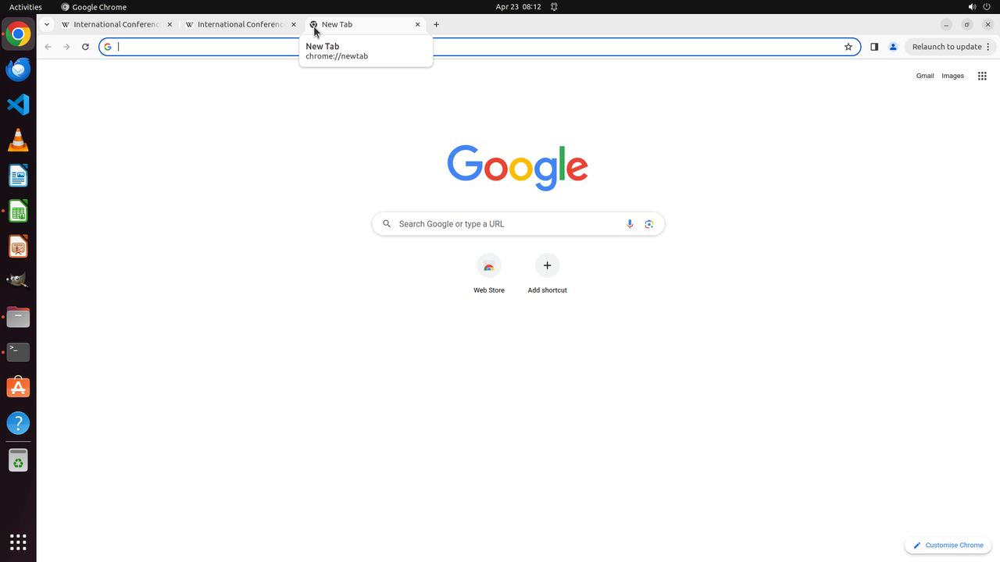

**Response:**
```
Let me search for NeurIPS conference locations on Wikipedia.
```

**Actions:** `import subprocess, shlex; subprocess.run(f'xdotool type --delay 12 -- ' + shlex.quote('NeurIPS NIPS conference wikipedia'), shell=True, check=True)
import time; time.sleep(0.05)`

---

## Step 24

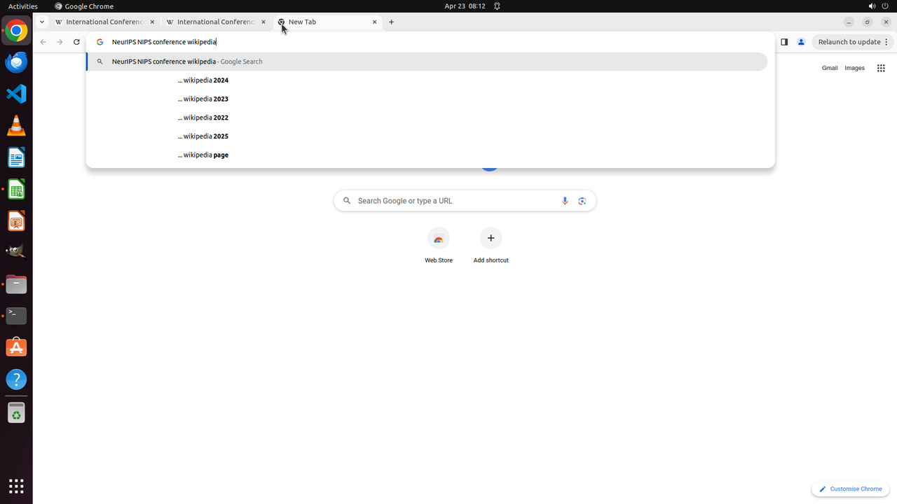

**Actions:** `pyautogui.keyDown('return')
pyautogui.keyUp('return')`

---

## Step 25

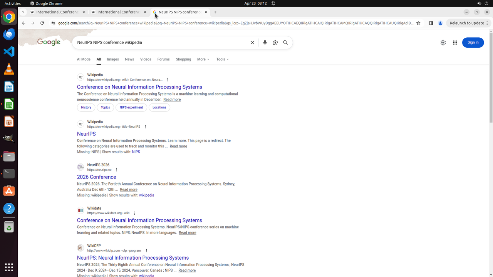

**Response:**
```
I can see the Wikipedia article for NeurIPS. Let me click on it.
```

**Actions:** `pyautogui.click(541, 337)`

---

## Step 26

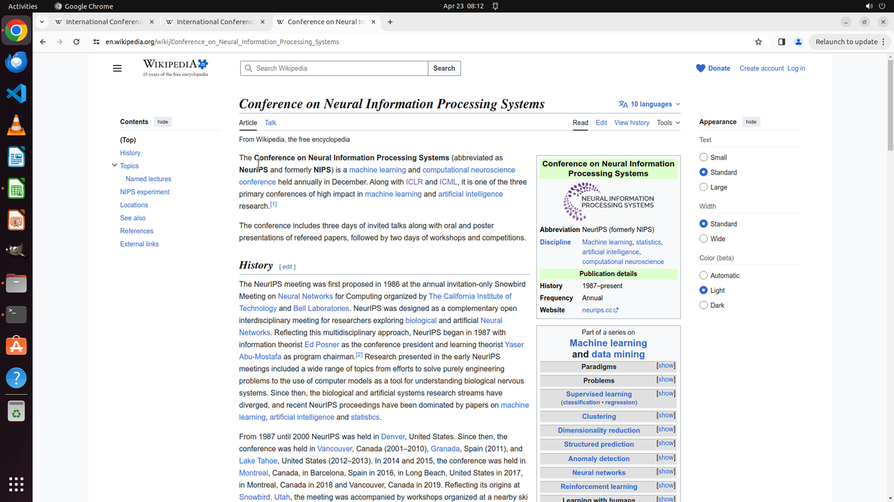

**Response:**
```
I can see the NeurIPS Wikipedia page. Let me click on "Locations" in the table of contents to see the conference locations.
```

**Actions:** `pyautogui.click(289, 439)`

---

## Step 27

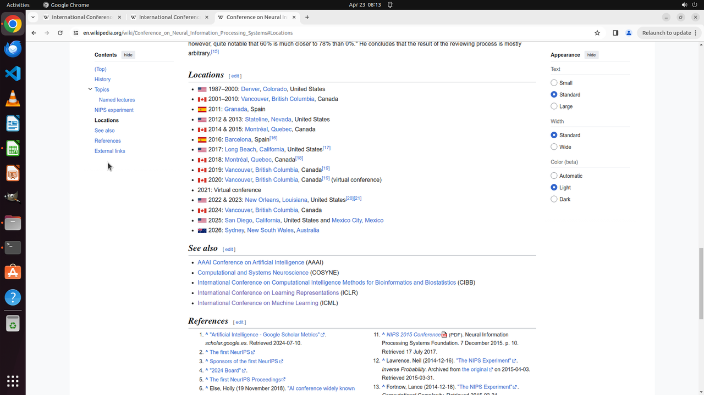

**Response:**
```
I can now see all the NeurIPS/NIPS conference locations. Let me note down the ones from 2013-2019:

- NeurIPS 2013: Stateline, Nevada (listed as "2012 & 2013: Stateline, Nevada, United States")
- NeurIPS 2014: Montréal, Quebec, Canada (listed as "2014 & 2015: Montréal, Quebec, Canada")
- NeurIPS 2015: Montréal, Quebec, Canada
- NeurIPS 2016: Barcelona, Spain
- NeurIPS 2017: Long Beach, California, United States
- NeurIPS 2018: Montréal, Quebec, Canada
- NeurIPS 2019: Vancouver, British Columbia, Canada

Now I need to check what the Excel file looks like. But first, I need to know which three conferences are listed. The task mentions "three machine learning conferences." Based on the context, these are likely ICML, NeurIPS (NIPS), and ICLR. Let me open the Excel file. Let me first check the file on the desktop.
```

**Actions:** `pyautogui.click(33, 610)`

---

## Step 28

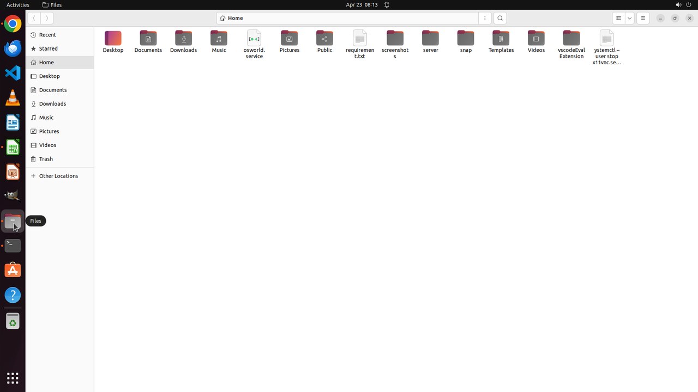

**Response:**
```
I can see the file manager is open. Let me check the Desktop folder for the Excel file.
```

**Actions:** `pyautogui.doubleClick(310, 117)`

---

## Step 29

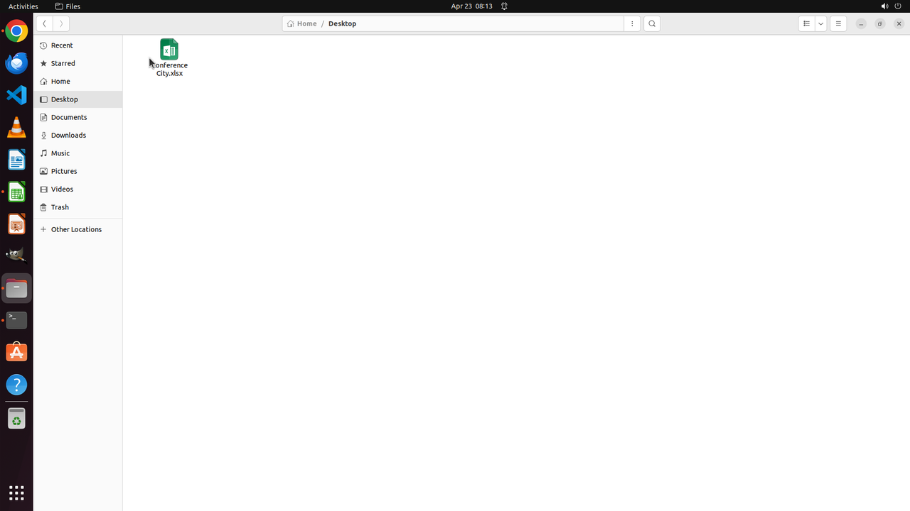

**Response:**
```
I can see the file "Conference City.xlsx" on the Desktop. Let me open it with LibreOffice Calc.
```

**Actions:** `pyautogui.doubleClick(358, 123)`

---

## Step 30

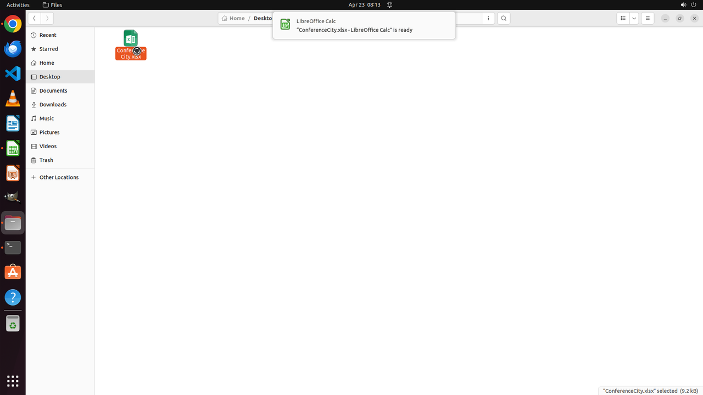

**Response:**
```
The file is opening in LibreOffice Calc. Let me click on the notification to open it.
```

**Actions:** `pyautogui.click(990, 69)`

---

## Step 31

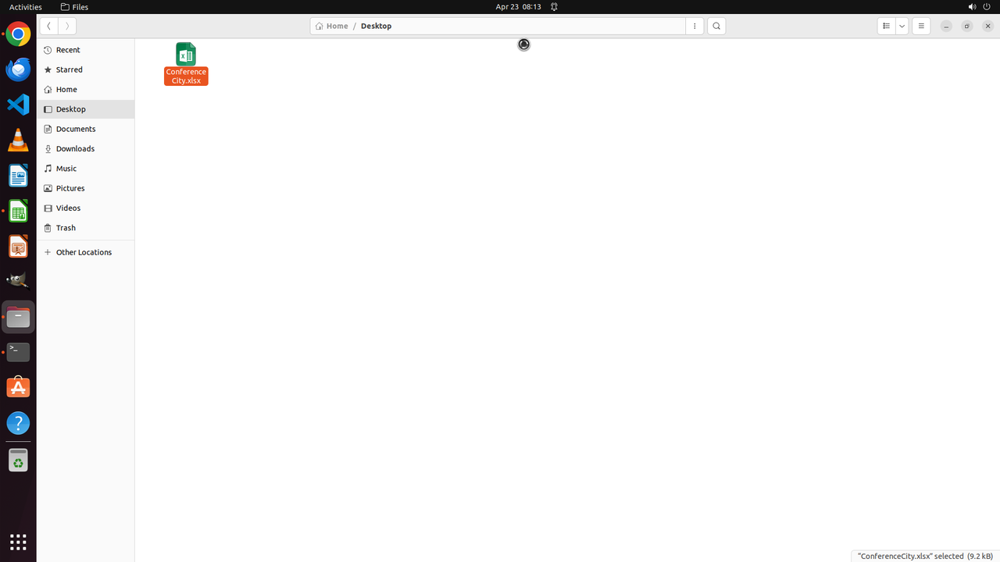

**Response:**
```
The file is loading. Let me wait a moment for LibreOffice Calc to fully open.
```

**Actions:** `time.sleep(0.5)`

---

## Step 32

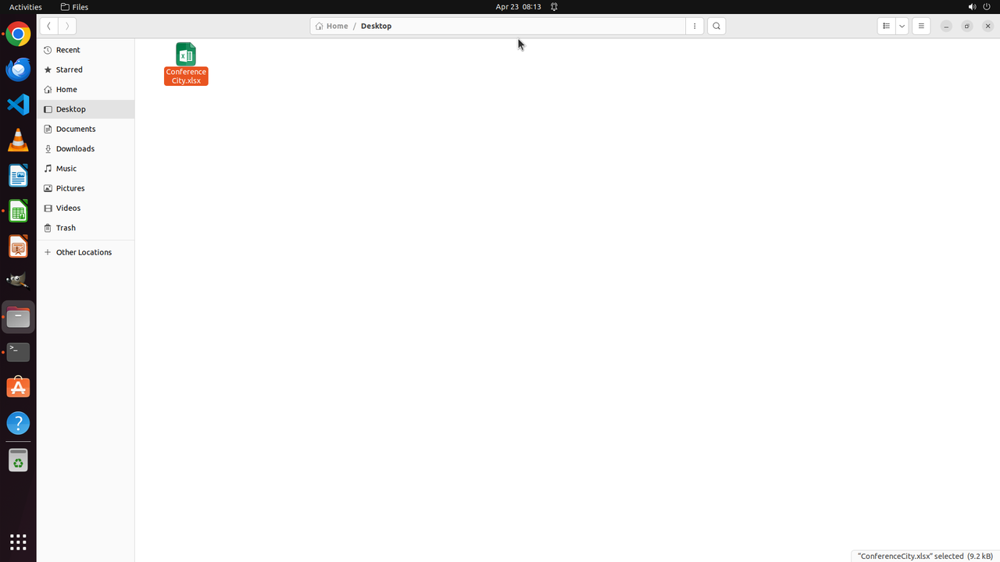

**Response:**
```
It seems LibreOffice Calc hasn't opened yet. Let me check if there's a LibreOffice icon in the taskbar or try to switch to it.
```

**Actions:** `pyautogui.click(33, 337)`

---

## Step 33

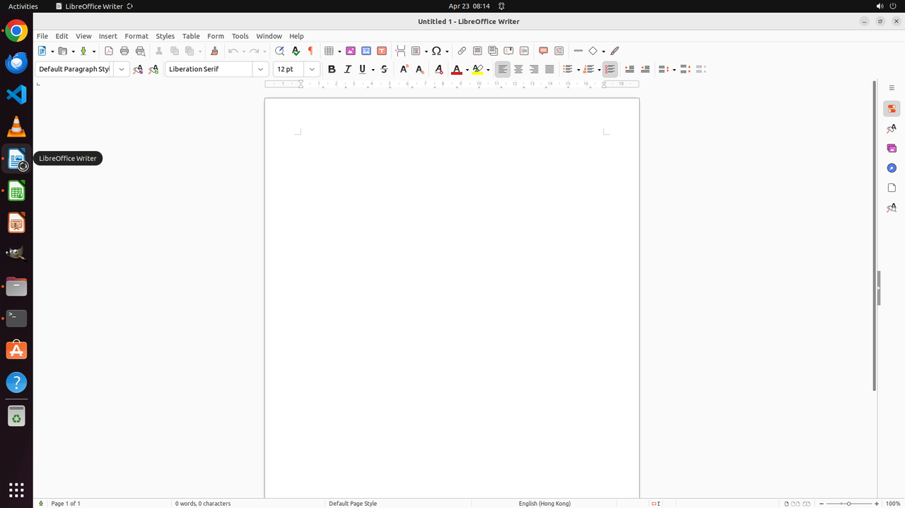

**Response:**
```
This opened LibreOffice Writer instead. I need to open the Excel file with LibreOffice Calc. Let me close this and try to find the Calc application. Let me check if the file is already open in the taskbar.
```

**Actions:** `pyautogui.click(33, 406)`

---

## Step 34

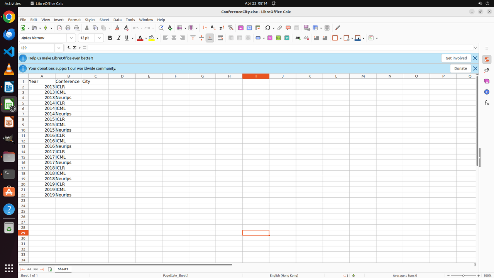

**Response:**
```
Now I can see the Excel file is open in LibreOffice Calc. The spreadsheet has:
- Column A: Year
- Column B: Conference (ICLR, ICML, Neurips)
- Column C: City (empty - needs to be filled)

I have all the information I need. Let me start filling in the cities. Let me click on cell C2 (first city entry for 2013 ICLR).
```

**Actions:** `pyautogui.click(370, 337)`

---

## Step 35

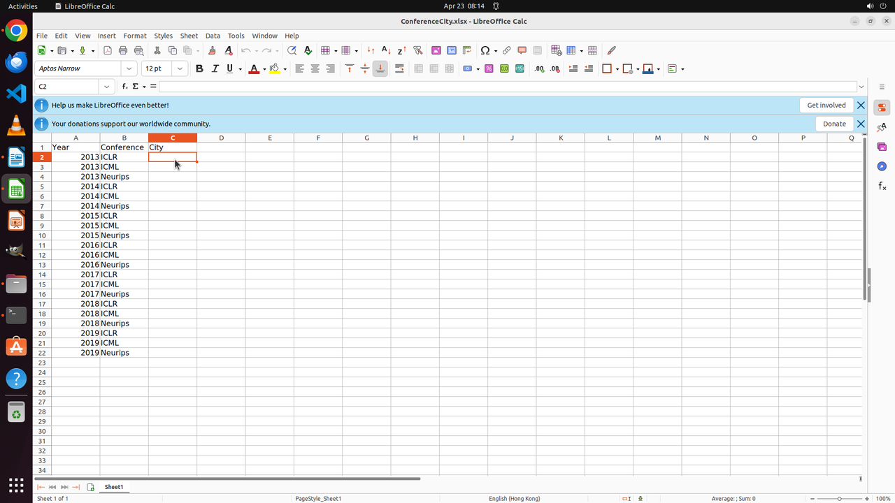

**Response:**
```
I'm now in cell C2. Let me fill in all the city data. I'll type each city and press Enter to move to the next row.

Based on my research:
- ICLR 2013: Scottsdale
- ICML 2013: Atlanta
- NeurIPS 2013: Stateline (Lake Tahoe)
- ICLR 2014: Banff
- ICML 2014: Beijing
- NeurIPS 2014: Montreal
- ICLR 2015: San Diego
- ICML 2015: Lille
- NeurIPS 2015: Montreal
- ICLR 2016: San Juan
- ICML 2016: New York City
- NeurIPS 2016: Barcelona
- ICLR 2017: Toulon
- ICML 2017: Sydney
- NeurIPS 2017: Long Beach
- ICLR 2018: Vancouver
- ICML 2018: Stockholm
- NeurIPS 2018: Montreal
- ICLR 2019: New Orleans
- ICML 2019: Long Beach
- NeurIPS 2019: Vancouver

Let me start typing:
```

**Actions:** `import subprocess, shlex; subprocess.run(f'xdotool type --delay 12 -- ' + shlex.quote('Scottsdale\nAtlanta\nStateline\nBanff\nBeijing\nMontrea'), shell=True, check=True)
import time; time.sleep(0.05)
`

---

## Step 36

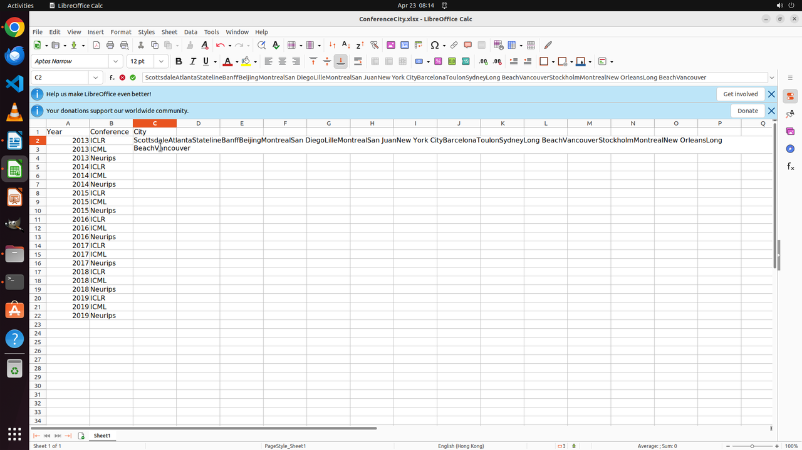

**Response:**
```
It looks like all the text was entered into a single cell C2 instead of separate rows. The text got concatenated into one cell. I need to undo this and try again. Let me press Ctrl+Z to undo.
```

**Actions:** `pyautogui.keyDown('ctrl')
pyautogui.keyDown('z')
pyautogui.keyUp('z')
pyautogui.keyUp('ctrl')`

---

## Step 37

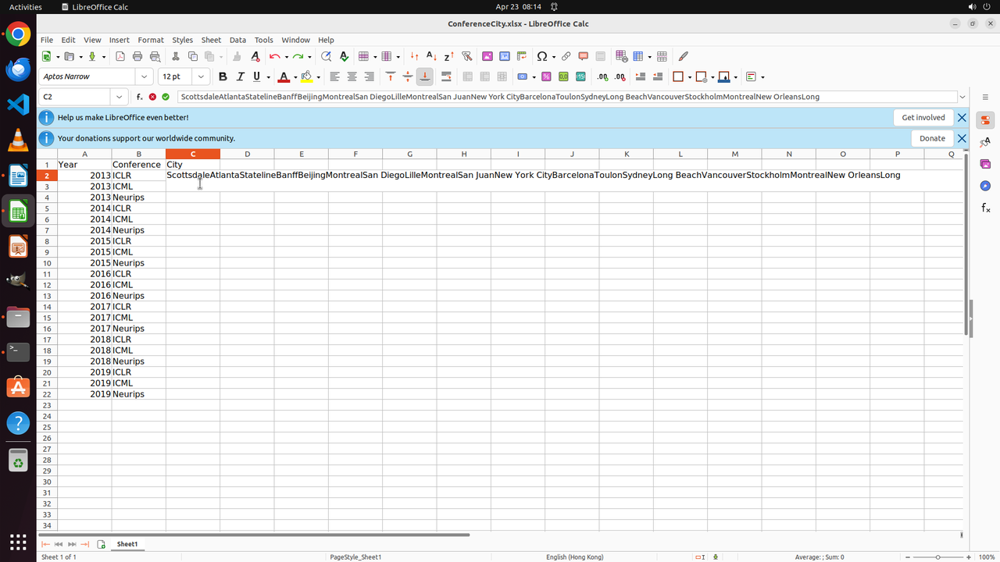

**Response:**
```
I see the data is still in cell C2 as one long string. Let me keep undoing until the cell is empty.
```

**Actions:** `pyautogui.keyDown('ctrl')
pyautogui.keyDown('z')
pyautogui.keyUp('z')
pyautogui.keyUp('ctrl')`

---

## Step 38

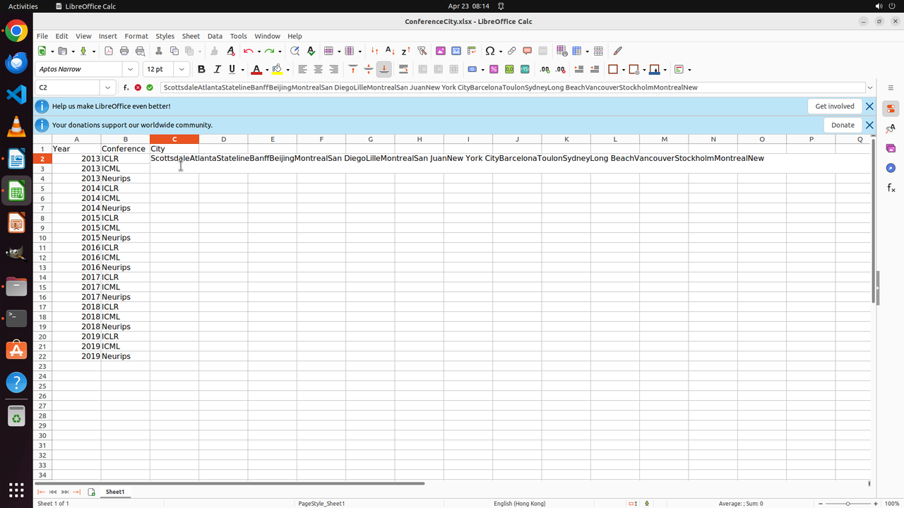

**Response:**
```
I need to keep undoing to clear this cell. Let me press Ctrl+Z multiple times to fully undo all the typing.
```

**Actions:** `pyautogui.keyDown('esc')
pyautogui.keyUp('esc')`

---

## Step 39


**Response:**
```
The cell C2 is now empty. The issue was that the `type` command entered everything as one string. I need to type each city individually, pressing Tab to confirm and then clicking on the next cell. Let me enter the data cell by cell.
```

**Actions:** `pyautogui.click(370, 337)`

---

## Step 40


**Response:**
```
Good, C2 is selected and empty. Let me type the first city and use the Enter key to move down to the next cell. I'll type each entry one at a time using the keyboard.
```

**Actions:** `import subprocess, shlex; subprocess.run(f'xdotool type --delay 12 -- ' + shlex.quote('Scottsdale'), shell=True, check=True)
import time; time.sleep(0.05)`

---

## Step 41

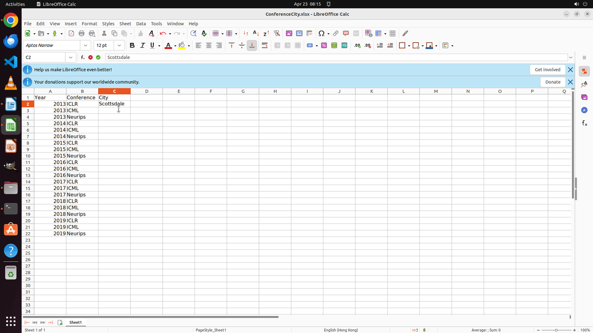

**Response:**
```
"Scottsdale" is entered in C2. Now let me press Enter to confirm and move to C3.
```

**Actions:** `pyautogui.keyDown('return')
pyautogui.keyUp('return')`

---

## Step 42

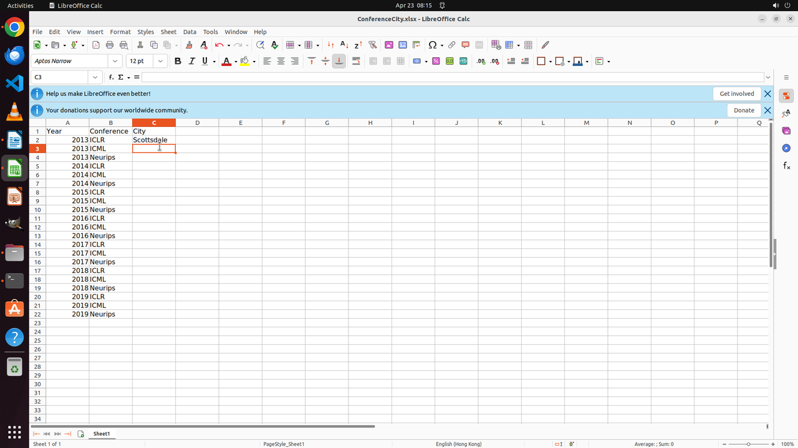

**Response:**
```
Now I'm in C3 (2013 ICML). Let me continue entering the cities one by one. I'll type each city and press Enter.
```

**Actions:** `import subprocess, shlex; subprocess.run(f'xdotool type --delay 12 -- ' + shlex.quote('Atlanta'), shell=True, check=True)
import time; time.sleep(0.05)`

---

## Step 43

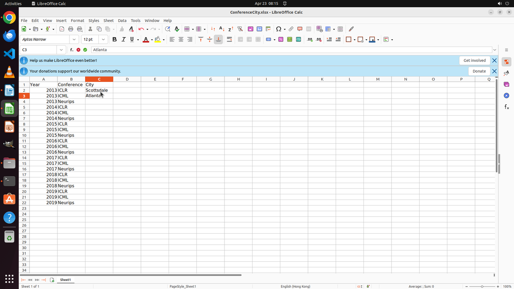

**Response:**
```
Good, "Atlanta" is in C3. Let me press Enter and continue with the remaining cities.
```

**Actions:** `pyautogui.keyDown('return')
pyautogui.keyUp('return')`

---

## Step 44


**Response:**
```
Now I'm in C4 (2013 Neurips). Let me continue entering the remaining cities. I'll type each one and press Enter.
```

**Actions:** `import subprocess, shlex; subprocess.run(f'xdotool type --delay 12 -- ' + shlex.quote('Stateline'), shell=True, check=True)
import time; time.sleep(0.05)`

---

## Step 45


**Response:**
```
Good, "Stateline" is in C4. Let me press Enter and continue with the next city.
```

**Actions:** `pyautogui.keyDown('return')
pyautogui.keyUp('return')`

---

## Step 46

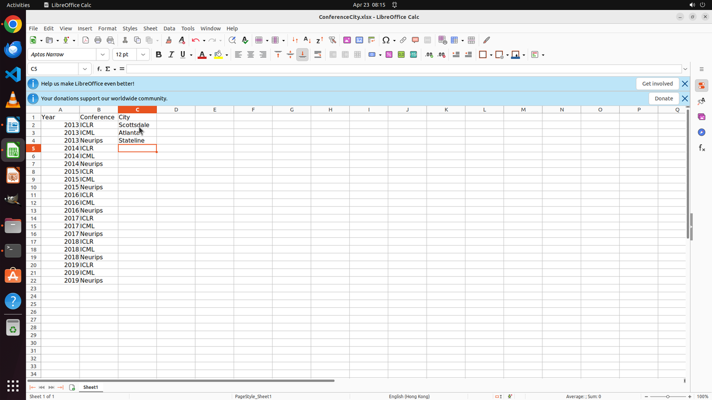

**Response:**
```
Now I'm in C5 (2014 ICLR). Let me continue entering all the remaining cities. I'll type each one and press Enter.
```

**Actions:** `import subprocess, shlex; subprocess.run(f'xdotool type --delay 12 -- ' + shlex.quote('Banff'), shell=True, check=True)
import time; time.sleep(0.05)`

---

## Step 47


**Response:**
```
Good, "Banff" is in C5. Let me press Enter and continue with the remaining cities. I'll speed this up by entering them one at a time.
```

**Actions:** `pyautogui.keyDown('return')
pyautogui.keyUp('return')`

---

## Step 48


**Response:**
```
Now I'm in C6 (2014 ICML = Beijing). Let me continue entering the remaining cities more efficiently.
```

**Actions:** `import subprocess, shlex; subprocess.run(f'xdotool type --delay 12 -- ' + shlex.quote('Beijing'), shell=True, check=True)
import time; time.sleep(0.05)`

---

## Step 49

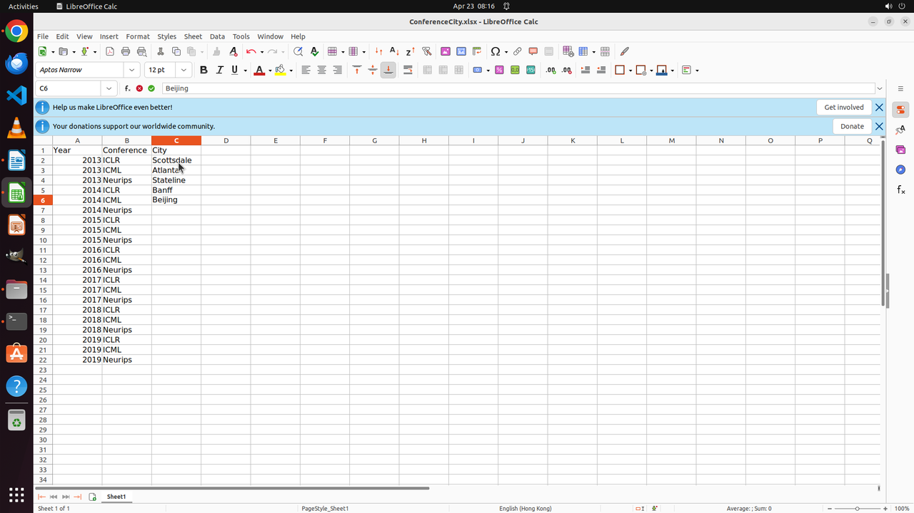

**Response:**
```
Good. Let me press Enter and continue with the next city (C7 - 2014 Neurips = Montreal).
```

**Actions:** `pyautogui.keyDown('return')
pyautogui.keyUp('return')`

---

## Step 50

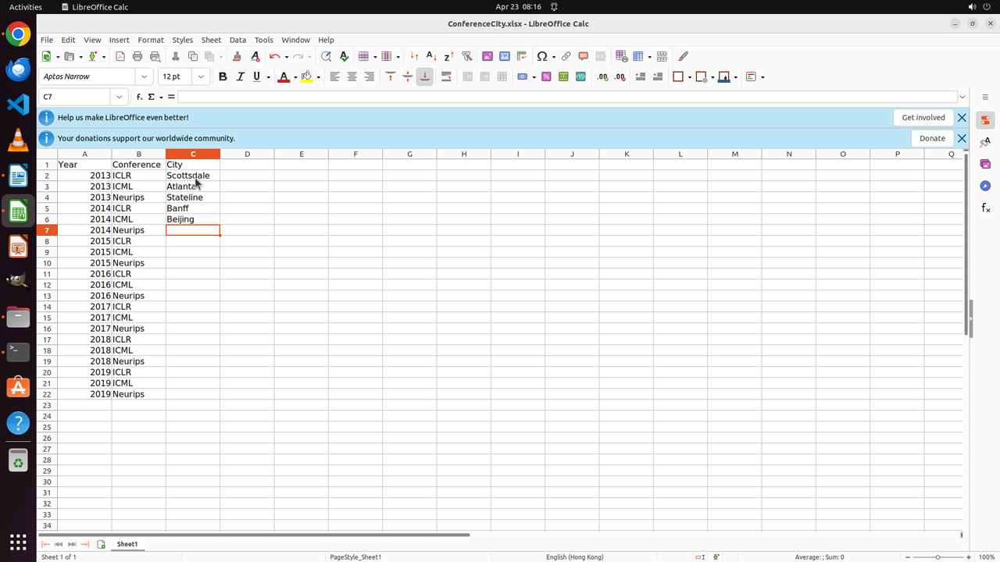

**Response:**
```
Now I'm in C7 (2014 Neurips = Montreal). Let me continue entering the remaining cities.
```

**Actions:** `import subprocess, shlex; subprocess.run(f'xdotool type --delay 12 -- ' + shlex.quote('Montreal'), shell=True, check=True)
import time; time.sleep(0.05)`

---

## Step 51


**Response:**
```
Good. Let me press Enter and continue with the next city (C8 - 2015 ICLR = San Diego).
```

**Actions:** `pyautogui.keyDown('return')
pyautogui.keyUp('return')`

---

## Step 52


**Response:**
```
Now I'm in C8 (2015 ICLR = San Diego). Let me continue entering the remaining cities.
```

**Actions:** `import subprocess, shlex; subprocess.run(f'xdotool type --delay 12 -- ' + shlex.quote('San Diego'), shell=True, check=True)
import time; time.sleep(0.05)`

---

## Step 53

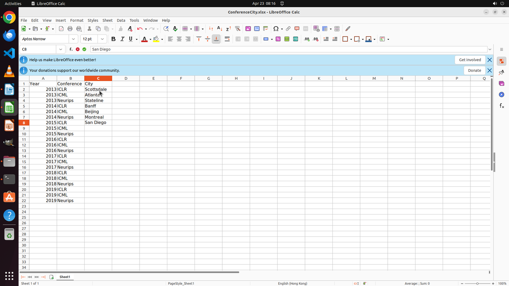

**Response:**
```
Good. Let me press Enter and continue with the next city (C9 - 2015 ICML = Lille).
```

**Actions:** `pyautogui.keyDown('return')
pyautogui.keyUp('return')`

---

## Step 54


**Response:**
```
Now I'm in C9 (2015 ICML = Lille). Let me continue entering the remaining cities.
```

**Actions:** `import subprocess, shlex; subprocess.run(f'xdotool type --delay 12 -- ' + shlex.quote('Lille'), shell=True, check=True)
import time; time.sleep(0.05)`

---

## Step 55


**Response:**
```
Good. Let me press Enter and continue with C10 (2015 Neurips = Montreal).
```

**Actions:** `pyautogui.keyDown('return')
pyautogui.keyUp('return')`

---

## Step 56


**Response:**
```
Now I'm in C10 (2015 Neurips = Montreal). Let me continue entering the remaining cities.
```

**Actions:** `import subprocess, shlex; subprocess.run(f'xdotool type --delay 12 -- ' + shlex.quote('Montreal'), shell=True, check=True)
import time; time.sleep(0.05)`

---

## Step 57

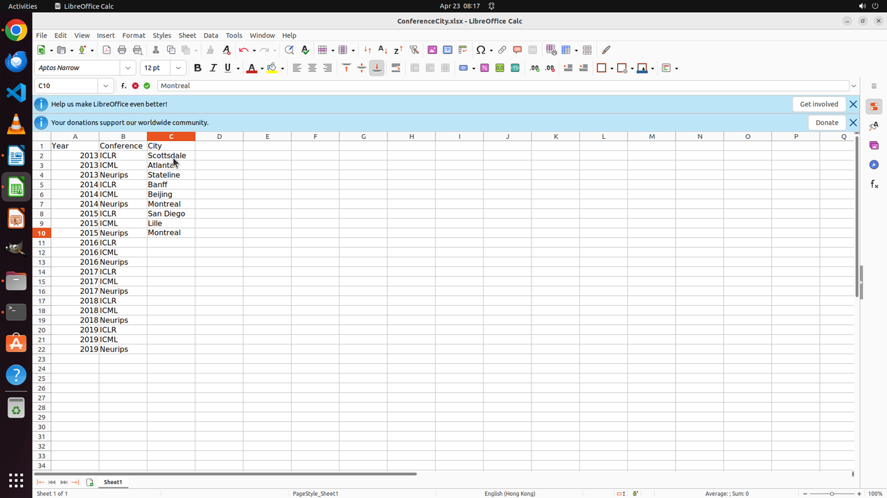

**Response:**
```
Good. Let me press Enter and continue with C11 (2016 ICLR = San Juan).
```

**Actions:** `pyautogui.keyDown('return')
pyautogui.keyUp('return')`

---

## Step 58


**Response:**
```
Now I'm in C11 (2016 ICLR = San Juan). Let me continue entering the remaining cities.
```

**Actions:** `import subprocess, shlex; subprocess.run(f'xdotool type --delay 12 -- ' + shlex.quote('San Juan'), shell=True, check=True)
import time; time.sleep(0.05)`

---

## Step 59


**Response:**
```
Good. Let me press Enter and continue with C12 (2016 ICML = New York City).
```

**Actions:** `pyautogui.keyDown('return')
pyautogui.keyUp('return')`

---

## Step 60


**Response:**
```
Now I'm in C12 (2016 ICML = New York City). Let me continue entering the remaining cities.
```

**Actions:** `import subprocess, shlex; subprocess.run(f'xdotool type --delay 12 -- ' + shlex.quote('New York City'), shell=True, check=True)
import time; time.sleep(0.05)`

---

## Step 61


**Response:**
```
Good. Let me press Enter and continue with C13 (2016 Neurips = Barcelona).
```

**Actions:** `pyautogui.keyDown('return')
pyautogui.keyUp('return')`

---

## Step 62


**Response:**
```
Now I'm in C13 (2016 Neurips = Barcelona). Let me continue entering the remaining cities.
```

**Actions:** `import subprocess, shlex; subprocess.run(f'xdotool type --delay 12 -- ' + shlex.quote('Barcelona'), shell=True, check=True)
import time; time.sleep(0.05)`

---

## Step 63


**Response:**
```
Good. Let me press Enter and continue with C14 (2017 ICLR = Toulon).
```

**Actions:** `pyautogui.keyDown('return')
pyautogui.keyUp('return')`

---

## Step 64

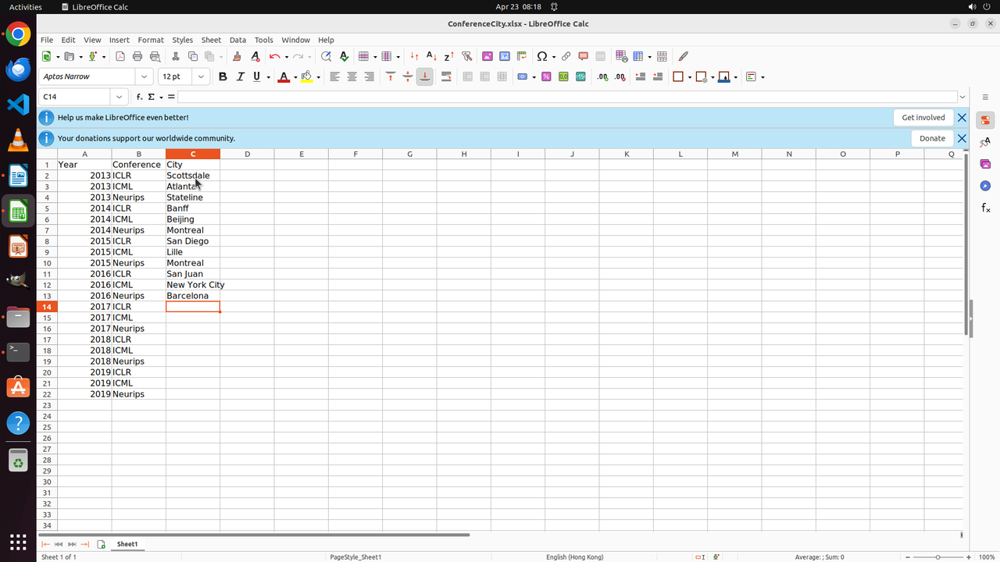

**Response:**
```
Now I'm in C14 (2017 ICLR = Toulon). Let me continue entering the remaining cities.
```

**Actions:** `import subprocess, shlex; subprocess.run(f'xdotool type --delay 12 -- ' + shlex.quote('Toulon'), shell=True, check=True)
import time; time.sleep(0.05)`

---

## Step 65

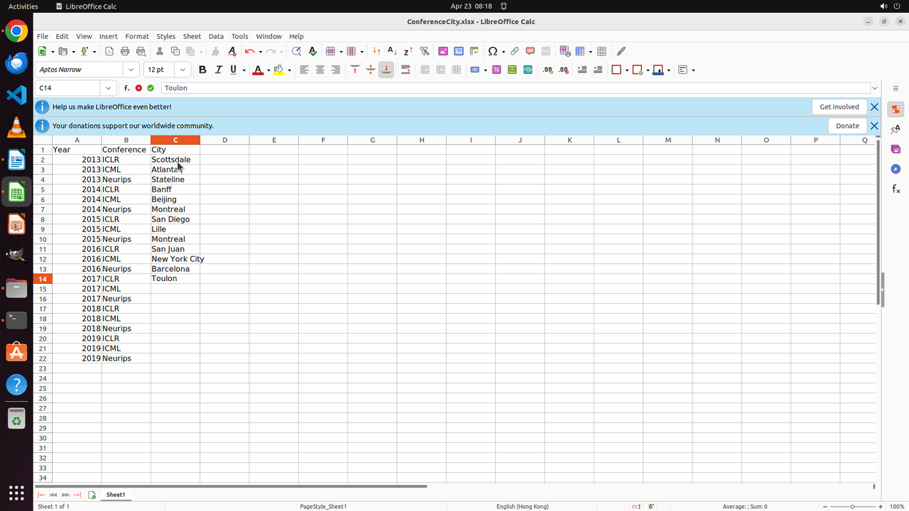

**Response:**
```
Good. Let me press Enter and continue with C15 (2017 ICML = Sydney).
```

**Actions:** `pyautogui.keyDown('return')
pyautogui.keyUp('return')`

---

## Step 66


**Response:**
```
Now I'm in C15 (2017 ICML = Sydney). Let me continue entering the remaining cities.
```

**Actions:** `import subprocess, shlex; subprocess.run(f'xdotool type --delay 12 -- ' + shlex.quote('Sydney'), shell=True, check=True)
import time; time.sleep(0.05)`

---

## Step 67

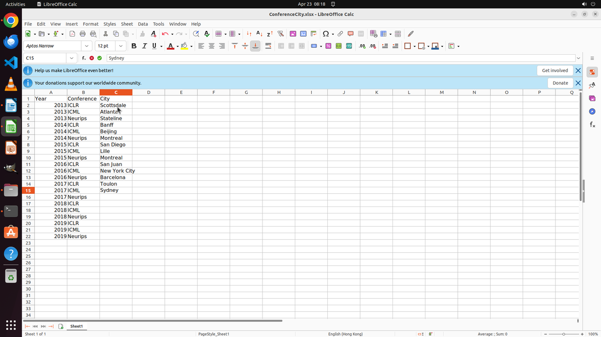

**Response:**
```
Good. Let me press Enter and continue with C16 (2017 Neurips = Long Beach).
```

**Actions:** `pyautogui.keyDown('return')
pyautogui.keyUp('return')`

---

## Step 68


**Response:**
```
Now I'm in C16 (2017 Neurips = Long Beach). Let me continue entering the remaining cities.
```

**Actions:** `import subprocess, shlex; subprocess.run(f'xdotool type --delay 12 -- ' + shlex.quote('Long Beach'), shell=True, check=True)
import time; time.sleep(0.05)`

---

## Step 69

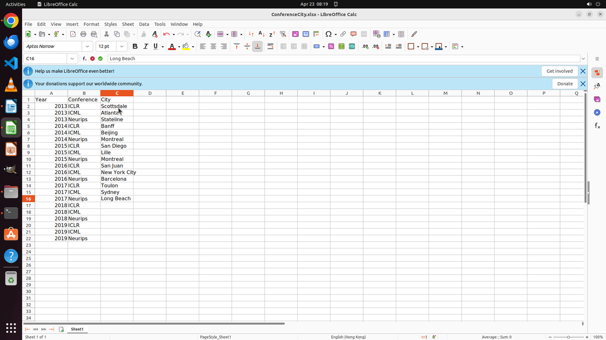

**Response:**
```
Good. Let me press Enter and continue with C17 (2018 ICLR = Vancouver).
```

**Actions:** `pyautogui.keyDown('return')
pyautogui.keyUp('return')`

---

## Step 70


**Response:**
```
Now I'm in C17 (2018 ICLR = Vancouver). Let me continue entering the remaining cities.
```

**Actions:** `import subprocess, shlex; subprocess.run(f'xdotool type --delay 12 -- ' + shlex.quote('Vancouver'), shell=True, check=True)
import time; time.sleep(0.05)`

---

## Step 71


**Response:**
```
Good. Let me press Enter and continue with C18 (2018 ICML = Stockholm).
```

**Actions:** `pyautogui.keyDown('return')
pyautogui.keyUp('return')`

---

## Step 72


**Response:**
```
Now I'm in C18 (2018 ICML = Stockholm). Let me continue entering the remaining cities.
```

**Actions:** `import subprocess, shlex; subprocess.run(f'xdotool type --delay 12 -- ' + shlex.quote('Stockholm'), shell=True, check=True)
import time; time.sleep(0.05)`

---

## Step 73


**Response:**
```
Good. Let me press Enter and continue with C19 (2018 Neurips = Montreal).
```

**Actions:** `pyautogui.keyDown('return')
pyautogui.keyUp('return')`

---

## Step 74


**Response:**
```
Now I'm in C19 (2018 Neurips = Montreal). Let me continue entering the remaining cities.
```

**Actions:** `import subprocess, shlex; subprocess.run(f'xdotool type --delay 12 -- ' + shlex.quote('Montreal'), shell=True, check=True)
import time; time.sleep(0.05)`

---

## Step 75


**Response:**
```
Good. Let me press Enter and continue with C20 (2019 ICLR = New Orleans).
```

**Actions:** `pyautogui.keyDown('return')
pyautogui.keyUp('return')`

---

## Step 76

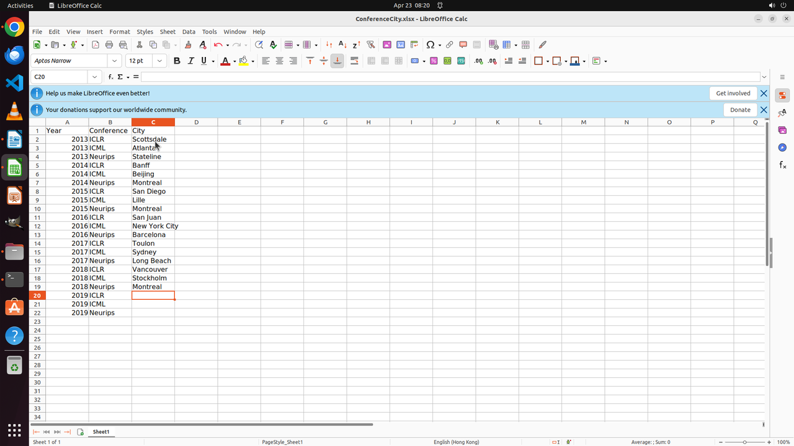

**Response:**
```
Now I'm in C20 (2019 ICLR = New Orleans). Let me enter the last three cities.
```

**Actions:** `import subprocess, shlex; subprocess.run(f'xdotool type --delay 12 -- ' + shlex.quote('New Orleans'), shell=True, check=True)
import time; time.sleep(0.05)`

---

## Step 77


**Response:**
```
Good. Let me press Enter and continue with C21 (2019 ICML = Long Beach).
```

**Actions:** `pyautogui.keyDown('return')
pyautogui.keyUp('return')`

---

## Step 78


**Response:**
```
Now I'm in C21 (2019 ICML = Long Beach). Let me enter the last two cities.
```

**Actions:** `import subprocess, shlex; subprocess.run(f'xdotool type --delay 12 -- ' + shlex.quote('Long Beach'), shell=True, check=True)
import time; time.sleep(0.05)`

---

## Step 79


**Response:**
```
Good. Let me press Enter and enter the last city C22 (2019 Neurips = Vancouver).
```

**Actions:** `pyautogui.keyDown('return')
pyautogui.keyUp('return')`

---

## Step 80

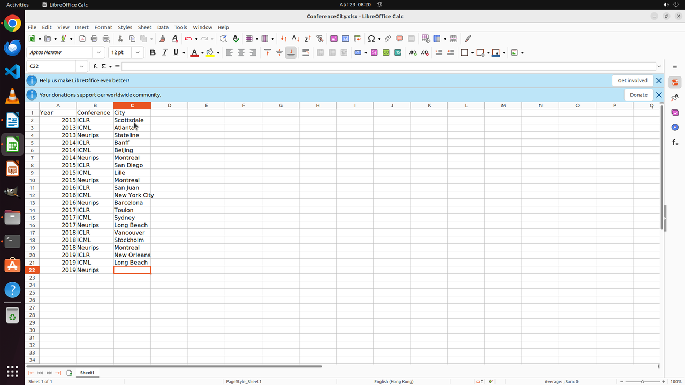

**Response:**
```
Now I'm in C22 (2019 Neurips = Vancouver). Let me enter the last city.
```

**Actions:** `import subprocess, shlex; subprocess.run(f'xdotool type --delay 12 -- ' + shlex.quote('Vancouver'), shell=True, check=True)
import time; time.sleep(0.05)`

---

## Step 81


**Response:**
```
All the cities have been filled in. Now let me press Enter to confirm the last entry and then save the file with Ctrl+S.
```

**Actions:** `pyautogui.keyDown('return')
pyautogui.keyUp('return')`

---

## Step 82


**Response:**
```
All cities have been filled in correctly. Now let me save the file with Ctrl+S.
```

**Actions:** `pyautogui.keyDown('ctrl')
pyautogui.keyDown('s')
pyautogui.keyUp('s')
pyautogui.keyUp('ctrl')`

---

## Step 83

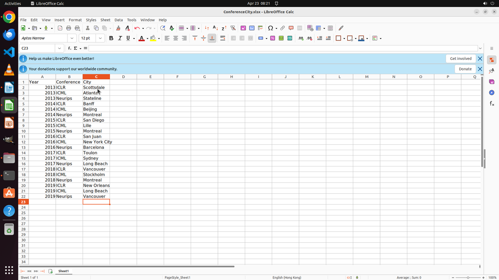

**Response:**
```
The file appears to have been saved (since it's an .xlsx file, it may have saved directly without a format dialog). Let me verify by checking if a format dialog appeared. It seems the save was successful. Let me verify the data looks correct by scrolling through the spreadsheet.

All the conference city locations have been filled in correctly:

- **2013**: ICLR - Scottsdale, ICML - Atlanta, Neurips - Stateline
- **2014**: ICLR - Banff, ICML - Beijing, Neurips - Montreal
- **2015**: ICLR - San Diego, ICML - Lille, Neurips - Montreal
- **2016**: ICLR - San Juan, ICML - New York City, Neurips - Barcelona
- **2017**: ICLR - Toulon, ICML - Sydney, Neurips - Long Beach
- **2018**: ICLR - Vancouver, ICML - Stockholm, Neurips - Montreal
- **2019**: ICLR - New Orleans, ICML - Long Beach, Neurips - Vancouver

The file has been saved successfully.

DONE
```

**Actions:** `DONE`

---
