# Task 778efd0a-153f-4842-9214-f05fc176b877

**Instruction:** I'm using libreoffice impress to write slideshows. I found that the video being played by VLC media player had a good soundtrack. Please extract the audio to planet.wav and use it as background music for this slideshow.

**Score:** 0.9961747823015619

**Wall clock:** 8m 43s

**Steps:** 40

**Cost:** $1.36

---

## Step 1

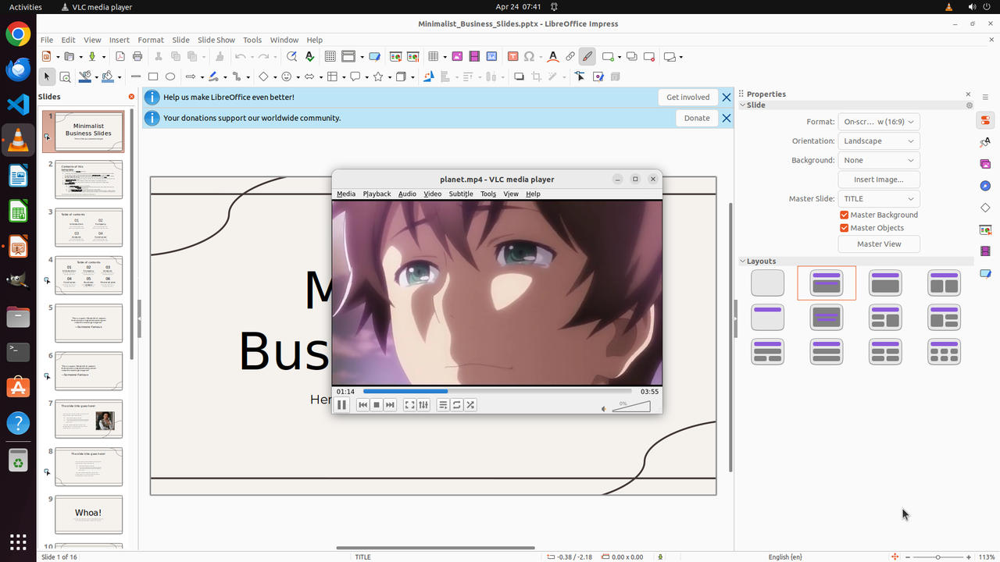

**Response:**
```
I need to:
1. Find the video file being played in VLC (planet.mp4)
2. Extract audio from it to planet.wav using ffmpeg
3. Insert the audio as background music in LibreOffice Impress

Let me start by finding the video file and extracting the audio.
```

**Actions:** `pyautogui.keyDown('ctrl')
pyautogui.keyDown('alt')
pyautogui.keyDown('t')
pyautogui.keyUp('t')
pyautogui.keyUp('alt')
pyautogui.keyUp('ctrl')`

---

## Step 2

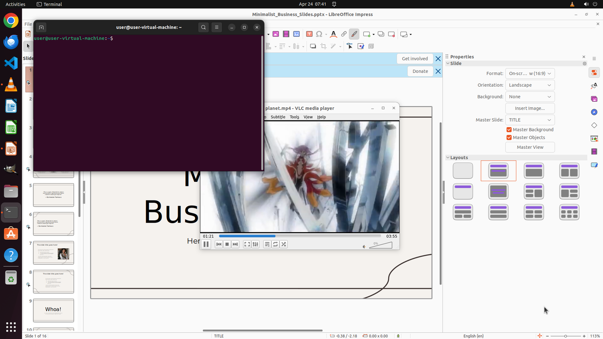

**Response:**
```
Good, the terminal is open. Let me first find the planet.mp4 file and then extract the audio.
```

**Actions:** `import subprocess, shlex; subprocess.run(f'xdotool type --delay 12 -- ' + shlex.quote('find / -name "planet.mp4" 2>/dev/null\n'), shell=True, check=True)
import time; time.sleep(0.05)`

---

## Step 3

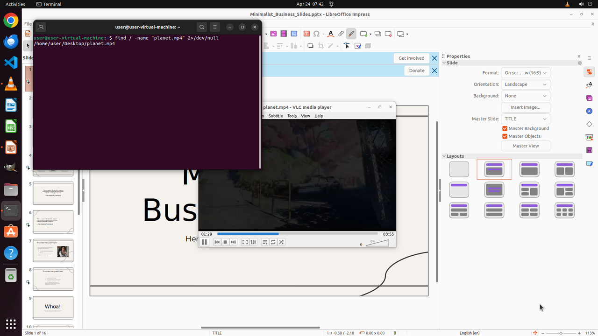

**Response:**
```
The video is at `/home/user/Desktop/planet.mp4`. Now let me extract the audio to `planet.wav` using ffmpeg.
```

**Actions:** `import subprocess, shlex; subprocess.run(f'xdotool type --delay 12 -- ' + shlex.quote('ffmpeg -i /home/user/Desktop/planet.mp4 -vn -acode'), shell=True, check=True)
import time; time.sleep(0.05)
impor`

---

## Step 4

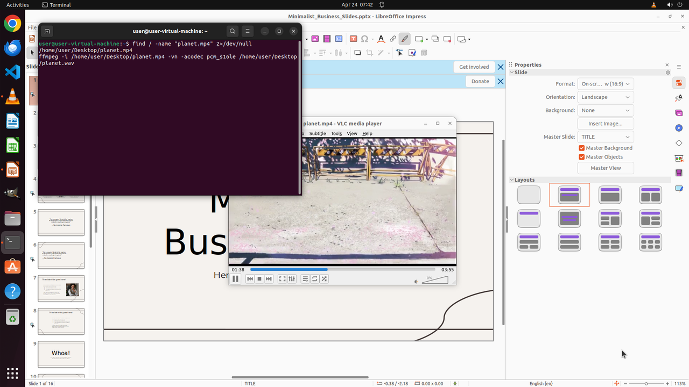

**Response:**
```
The ffmpeg command is running. Let me wait for it to complete.
```

**Actions:** `time.sleep(0.5)`

---

## Step 5

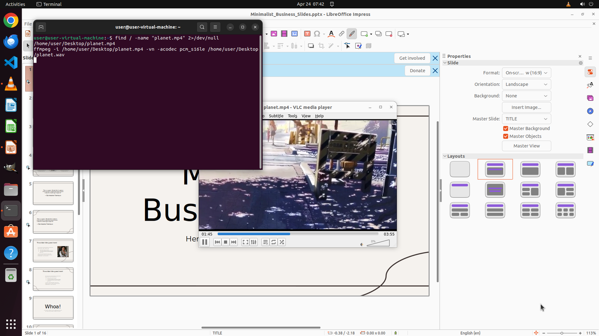

**Response:**
```
The ffmpeg command is still running. Let me wait a bit more for it to complete.
```

**Actions:** `time.sleep(0.5)`

---

## Step 6

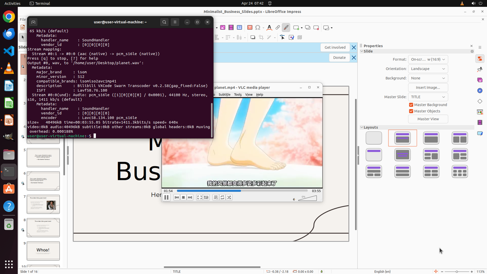

**Response:**
```
The audio has been successfully extracted to `/home/user/Desktop/planet.wav`. Now I need to add it as background music to the LibreOffice Impress presentation. Let me switch to LibreOffice Impress and add the audio.

First, let me click on the LibreOffice Impress window in the taskbar.
```

**Actions:** `pyautogui.click(990, 45)`

---

## Step 7

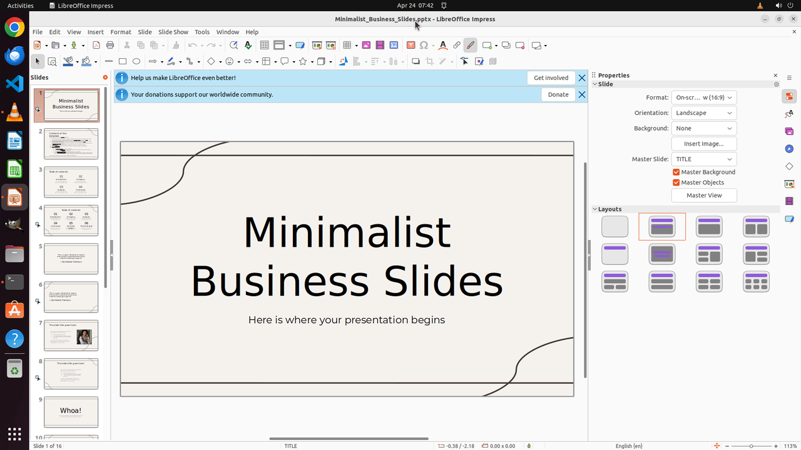

**Response:**
```
Now I'm in LibreOffice Impress. To add background music to the slideshow, I need to insert the audio on the first slide and set it to play across all slides. Let me use the Insert menu to add audio.
```

**Actions:** `pyautogui.click(229, 76)`

---

## Step 8

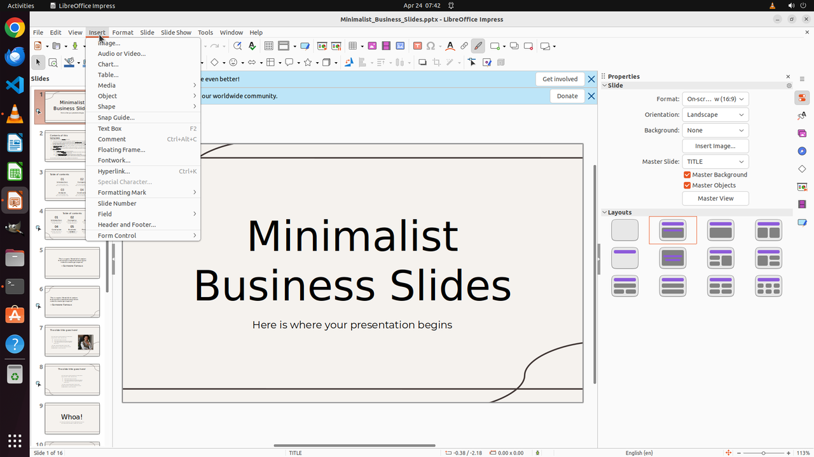

**Response:**
```
I can see "Audio or Video..." option in the Insert menu. Let me click on it.
```

**Actions:** `pyautogui.click(288, 126)`

---

## Step 9

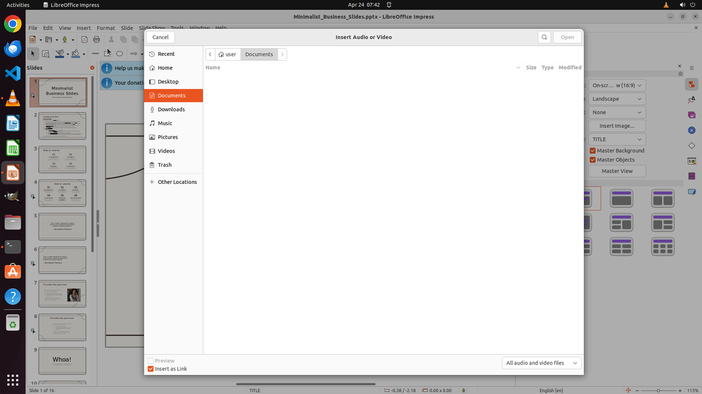

**Response:**
```
The file dialog is open. I need to navigate to the Desktop where the planet.wav file is located. Let me click on "Desktop".
```

**Actions:** `pyautogui.click(460, 222)`

---

## Step 10

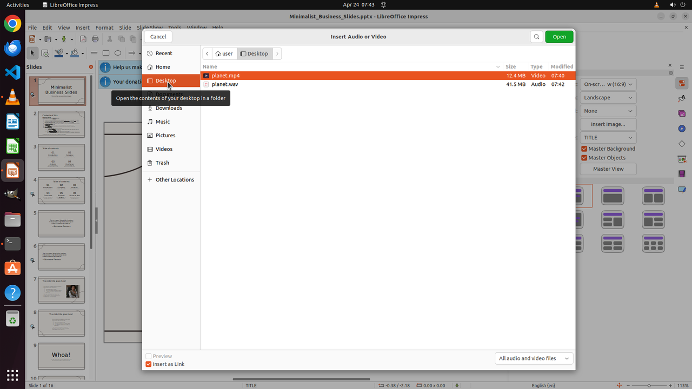

**Response:**
```
I can see both `planet.mp4` and `planet.wav` on the Desktop. I need to select `planet.wav` and then click Open.
```

**Actions:** `pyautogui.click(624, 232)`

---

## Step 11


**Response:**
```
`planet.wav` is selected. Now let me uncheck "Insert as Link" to embed the audio, and then click Open.
```

**Actions:** `pyautogui.click(412, 1009)`

---

## Step 12

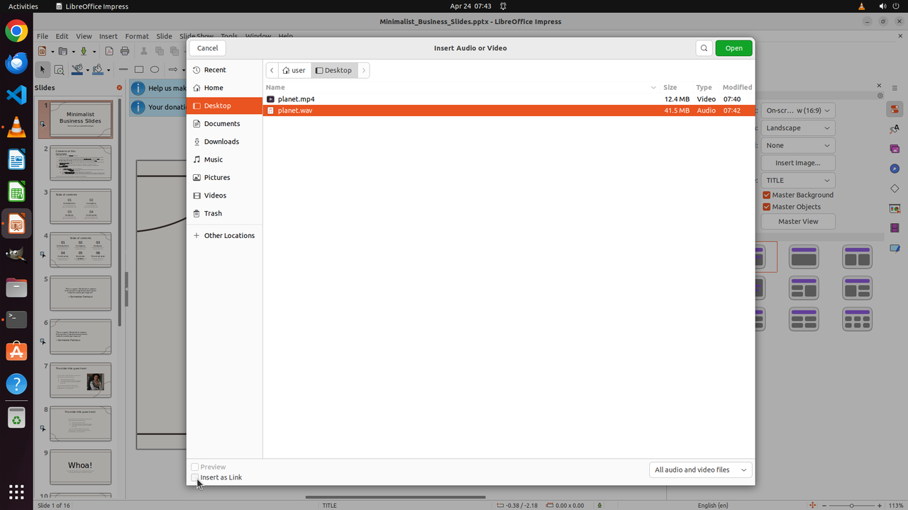

**Response:**
```
Good, "Insert as Link" is now unchecked. Now let me click "Open" to insert the audio file.
```

**Actions:** `pyautogui.click(1549, 100)`

---

## Step 13

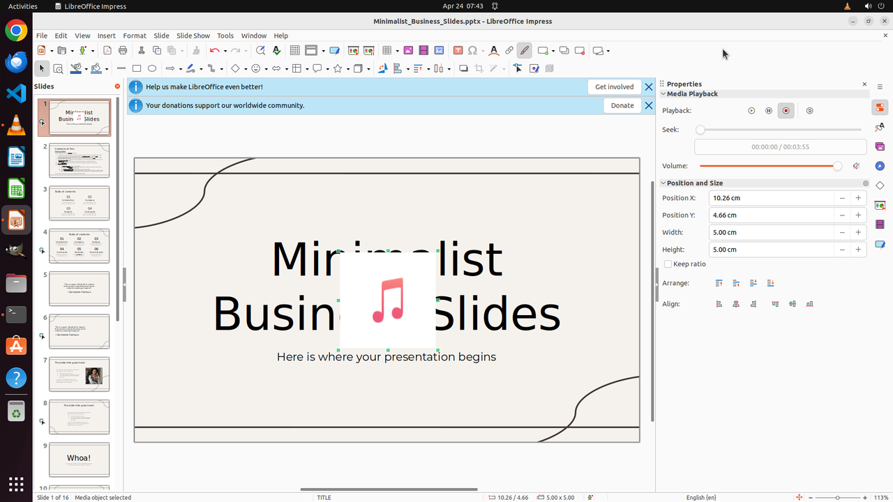

**Response:**
```
The audio file has been inserted into slide 1. I can see the music note icon on the slide. Now I need to configure it to play as background music across all slides. I need to set the animation properties so the audio plays automatically and continues across all slides.

Let me right-click on the audio object to access its animation/playback settings.
```

**Actions:** `pyautogui.rightClick(829, 630)`

---

## Step 14

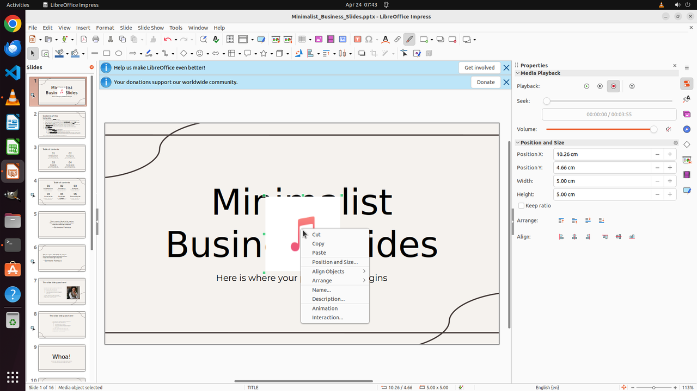

**Response:**
```
I can see the context menu. I need to click on "Animation" to set up the audio to play across all slides as background music.
```

**Actions:** `pyautogui.click(895, 850)`

---

## Step 15


**Response:**
```
The Animation panel is now open on the right side. I need to add an animation effect for the audio object. First, let me make sure the audio object is selected, and then add an animation for it. Let me click on the audio icon on the slide first to select it.
```

**Actions:** `pyautogui.click(829, 630)`

---

## Step 16

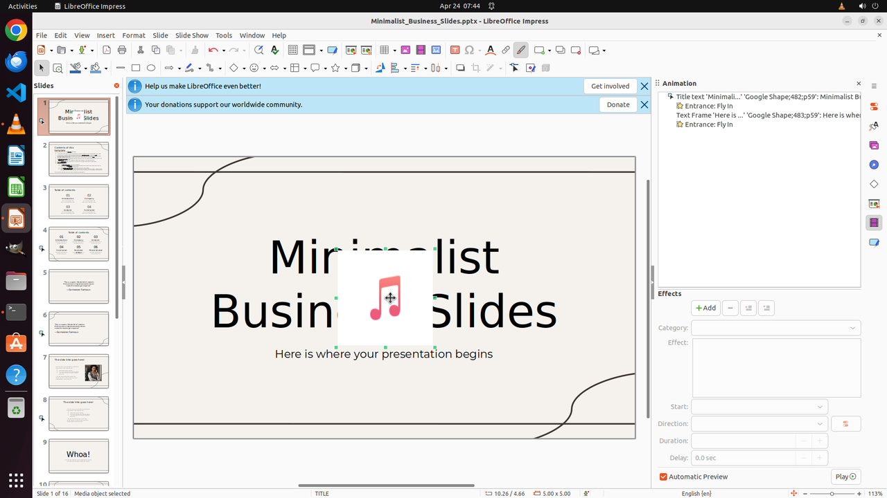

**Response:**
```
The audio object is selected. Now I need to add an animation effect for it. Let me click the "+ Add" button in the Animation panel to add an effect.
```

**Actions:** `pyautogui.click(1525, 666)`

---

## Step 17

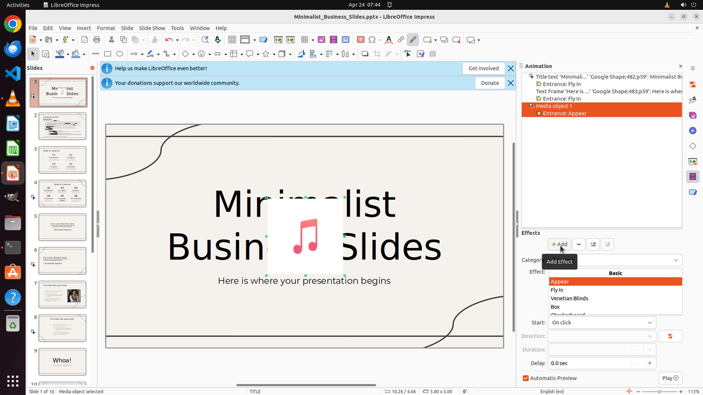

**Response:**
```
I can see that the "Media object 1" has been added to the animation list with an "Entrance: Appear" effect. Now I need to configure it properly to act as background music. I need to:

1. Set the Start to "With Previous" (so it starts automatically)
2. Set it to play across all slides

First, let me change the Start from "On click" to "With Previous". Let me click on the Start dropdown.
```

**Actions:** `pyautogui.click(1639, 880)`

---

## Step 18

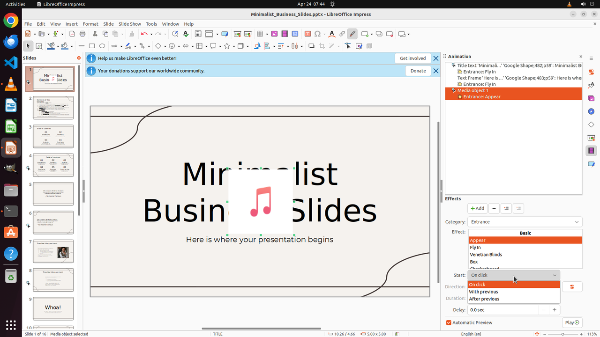

**Response:**
```
I can see the dropdown with options "On click", "With previous", and "After previous". I need to select "With previous" so the audio starts automatically when the slide is shown.
```

**Actions:** `pyautogui.click(1546, 933)`

---

## Step 19

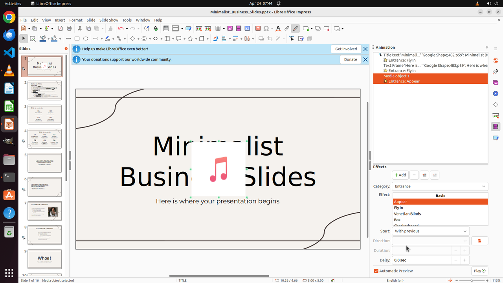

**Response:**
```
The Start is now set to "With previous". Now I need to configure the audio to play across all slides. I need to double-click on the "Media object 1" animation entry to open its effect options dialog, where I can set it to play across all slides.
```

**Actions:** `pyautogui.doubleClick(1639, 309)`

---

## Step 20

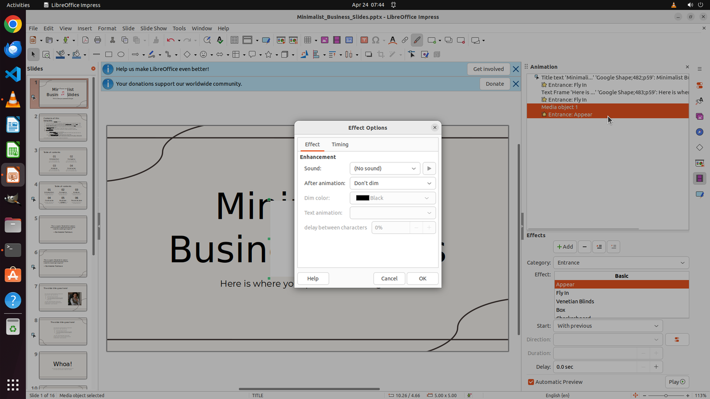

**Response:**
```
The Effect Options dialog is open. I can see the "Effect" and "Timing" tabs. I need to go to the "Timing" tab to set the audio to play across all slides (stop after all slides).
```

**Actions:** `pyautogui.click(916, 391)`

---

## Step 21


**Response:**
```
I can see the Timing tab. The Start is already set to "With previous". Now I need to set the Repeat to play across all slides. Let me click on the Repeat dropdown and look for an option like "Until end of slide" or similar. But first, I should also check the "Rewind when done playing" checkbox. 

Let me click on the Repeat dropdown to see the options.
```

**Actions:** `pyautogui.click(1033, 574)`

---

## Step 22


**Response:**
```
Let me click on the dropdown arrow for the Repeat field to see the available options.
```

**Actions:** `pyautogui.click(1153, 574)`

---

## Step 23

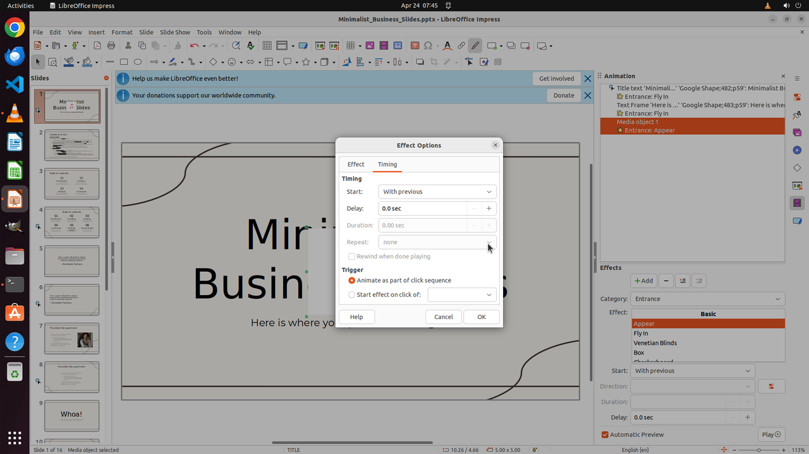

**Response:**
```
The dropdown didn't seem to open. Let me try clicking directly on the dropdown button for Repeat.
```

**Actions:** `pyautogui.click(1143, 574)`

---

## Step 24


**Response:**
```
The dropdown doesn't seem to be opening with my clicks. Let me try a different approach. Instead of using the animation panel, I'll close this dialog and use the Slide Transition approach to add background music. But first, let me try clicking directly on the Repeat combo box.
```

**Actions:** `pyautogui.tripleClick(1020, 574)`

---

## Step 25

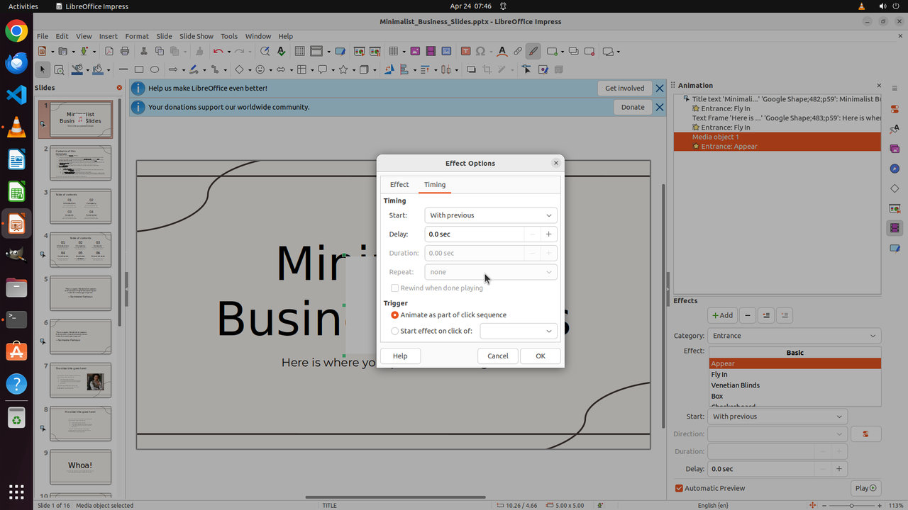

**Response:**
```
Let me try to click on the small dropdown arrow for the Repeat field more precisely.
```

**Actions:** `pyautogui.click(1153, 574)`

---

## Step 26


**Response:**
```
The Repeat dropdown isn't responding well. Let me try a different approach. I'll close this dialog and instead use the Slide Transition panel to set the audio as background music, which is a more standard way to add background music in LibreOffice Impress. But first, let me try clicking OK to accept the current settings (With previous start), and then I'll try another approach.

Actually, let me first try to type "Until end of slide" or similar value directly in the Repeat field. Let me click on the text "none" in the Repeat field.
```

**Actions:** `pyautogui.tripleClick(1024, 574)`

---

## Step 27


**Response:**
```
Let me click OK to save the current settings. The animation is already set to "With previous" which means it will start automatically. Then I'll try a different approach to make it play across slides - using the Slide Transition panel or modifying the presentation via another method.
```

**Actions:** `pyautogui.click(1138, 751)`

---

## Step 28

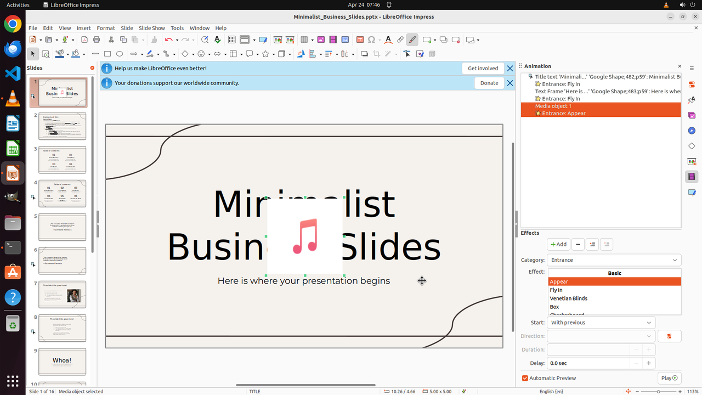

**Response:**
```
Good, the animation has been set. The audio object has "Entrance: Appear" animation with "With previous" start. Now I need to make sure the audio plays across all slides. Let me try a different approach - I'll use the Slide Transition panel to set the audio. But first, let me try to configure the audio to play across slides by modifying the presentation directly using python-pptx through the terminal. 

Actually, let me first try the approach through the Slide menu > Slide Transition, which allows setting sound for slide transitions. But the better approach for LibreOffice Impress is to use the "Cross-fade" or slide transition sound. Let me try the Slide Transition approach.

Let me click on "Slide" menu first.
```

**Actions:** `pyautogui.click(348, 76)`

---

## Step 29

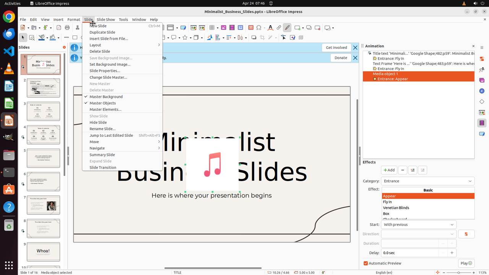

**Response:**
```
I can see "Slide Transition" at the bottom of the Slide menu. Let me click on it.
```

**Actions:** `pyautogui.click(405, 657)`

---

## Step 30

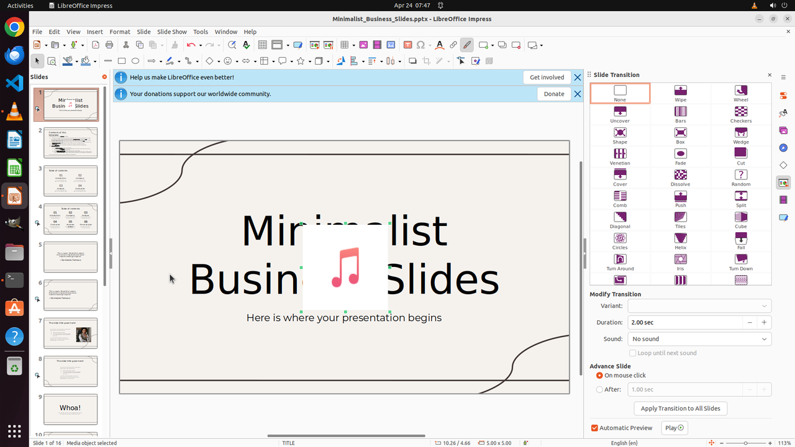

**Response:**
```
The Slide Transition panel is now open. I can see there's a "Sound" dropdown currently set to "No sound". I need to change this to use the planet.wav file. Let me click on the Sound dropdown.
```

**Actions:** `pyautogui.click(1687, 817)`

---

## Step 31

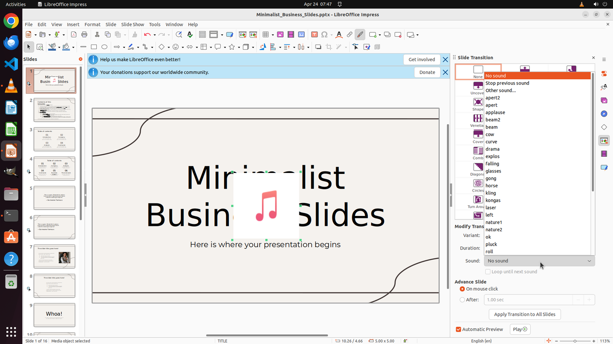

**Response:**
```
I can see the Sound dropdown is open with various preset sounds. I need to select "Other sound..." to browse for the planet.wav file.
```

**Actions:** `pyautogui.click(1570, 283)`

---

## Step 32

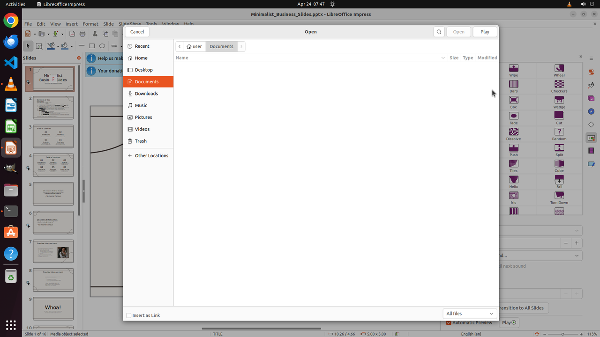

**Response:**
```
A file browser opened. I need to navigate to the Desktop where the planet.wav file is located. Let me click on "Desktop".
```

**Actions:** `pyautogui.click(460, 222)`

---

## Step 33

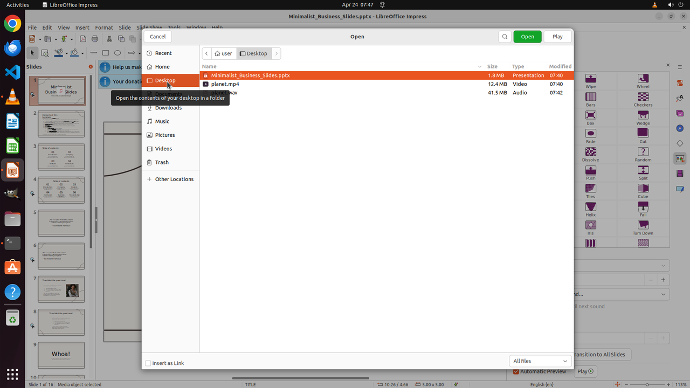

**Response:**
```
I can see the Desktop contents with `planet.wav` file. Let me click on `planet.wav` to select it.
```

**Actions:** `pyautogui.click(624, 256)`

---

## Step 34

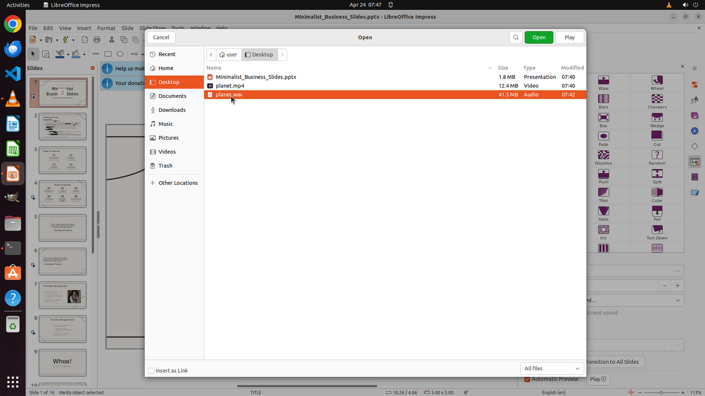

**Response:**
```
`planet.wav` is selected. Now let me click "Open" to add it as the transition sound.
```

**Actions:** `pyautogui.click(1464, 100)`

---

## Step 35

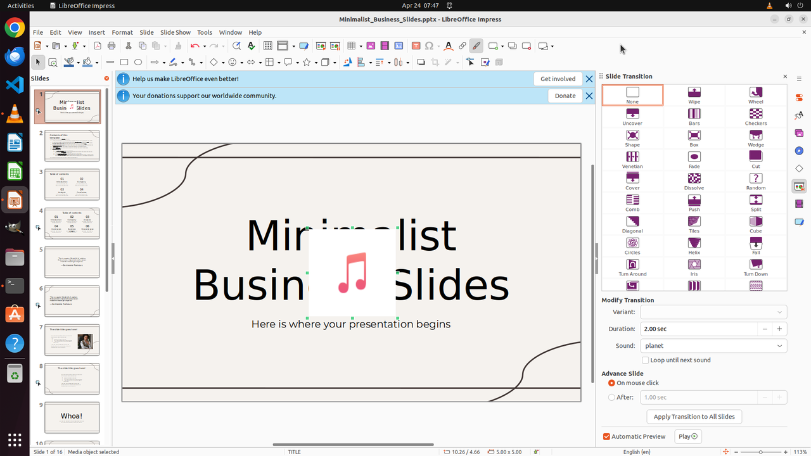

**Response:**
```
The sound "planet" has been added to the slide transition for slide 1. I can see the Sound dropdown now shows "planet". Now I need to check "Loop until next sound" to make it play continuously, and then click "Apply Transition to All Slides" to apply this sound to all slides so it plays as background music throughout the presentation.

First, let me check "Loop until next sound":
```

**Actions:** `pyautogui.click(1525, 852)`

---

## Step 36

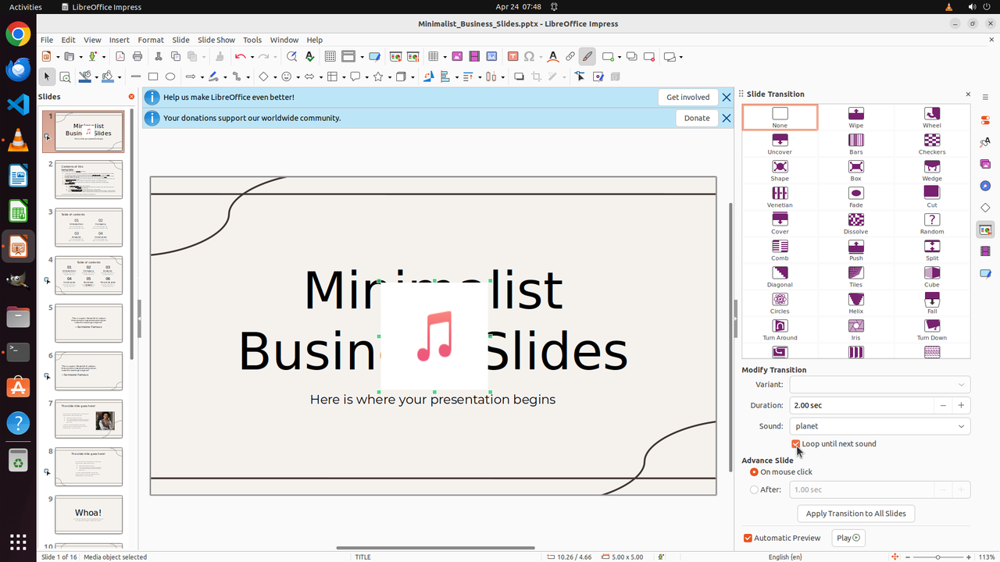

**Response:**
```
"Loop until next sound" is now checked. Now I need to click "Apply Transition to All Slides" to apply this sound to all slides in the presentation.
```

**Actions:** `pyautogui.click(1639, 985)`

---

## Step 37

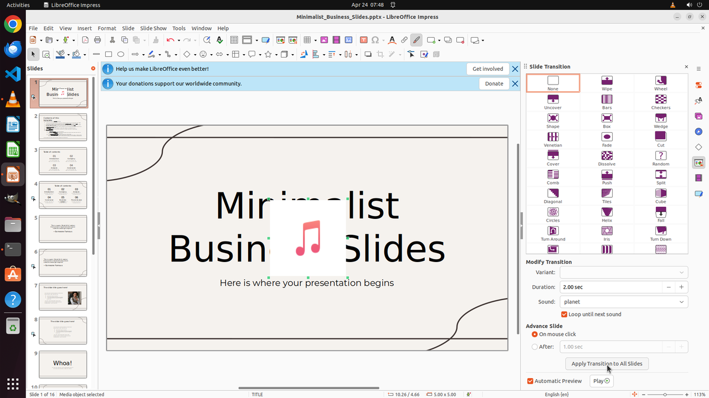

**Response:**
```
The transition with the planet.wav sound has been applied to all slides. The sound is set to "planet" with "Loop until next sound" checked, and it's been applied to all slides. Now I need to save the file. Let me press Ctrl+S to save.
```

**Actions:** `pyautogui.keyDown('ctrl')
pyautogui.keyDown('s')
pyautogui.keyUp('s')
pyautogui.keyUp('ctrl')`

---

## Step 38


**Response:**
```
It seems the file was saved without showing a dialog (since it's already a .pptx file). Let me verify by checking the title bar - it still shows "Minimalist_Business_Slides.pptx - LibreOffice Impress" which confirms it was saved. 

Wait, it's a .pptx file, so LibreOffice might prompt to save in a different format. Let me check if a dialog appeared by taking a screenshot.
```

**Actions:** `time.sleep(0.1)`

---

## Step 39


**Response:**
```
The file appears to have been saved. The presentation now has the planet.wav audio as background music through the slide transition settings, with "Loop until next sound" enabled and applied to all slides.

Let me save it again with Ctrl+S to make sure it's saved properly, as the format might need to be kept as .pptx.
```

**Actions:** `pyautogui.keyDown('ctrl')
pyautogui.keyDown('s')
pyautogui.keyUp('s')
pyautogui.keyUp('ctrl')`

---

## Step 40


**Response:**
```
The file has been saved successfully. Let me summarize what was accomplished:

1. **Extracted audio**: Used `ffmpeg` to extract audio from `/home/user/Desktop/planet.mp4` to `/home/user/Desktop/planet.wav`
2. **Added as background music**: 
   - Inserted the audio file into the LibreOffice Impress presentation via Insert > Audio or Video
   - Set up the Slide Transition sound to "planet" (planet.wav)
   - Checked "Loop until next sound" to ensure continuous playback
   - Applied the transition to all slides using "Apply Transition to All Slides"
3. **Saved the file**

The planet.wav audio is now set as background music for the slideshow.

DONE
```

**Actions:** `DONE`

---
