# Task 778efd0a-153f-4842-9214-f05fc176b877

**Instruction:** I'm using libreoffice impress to write slideshows. I found that the video being played by VLC media player had a good soundtrack. Please extract the audio to planet.wav and use it as background music for this slideshow.

**Score:** 0.9961747823015619

**Wall clock:** 6m 48s

**Steps:** 37

**Cost:** $1.18

---

## Step 1

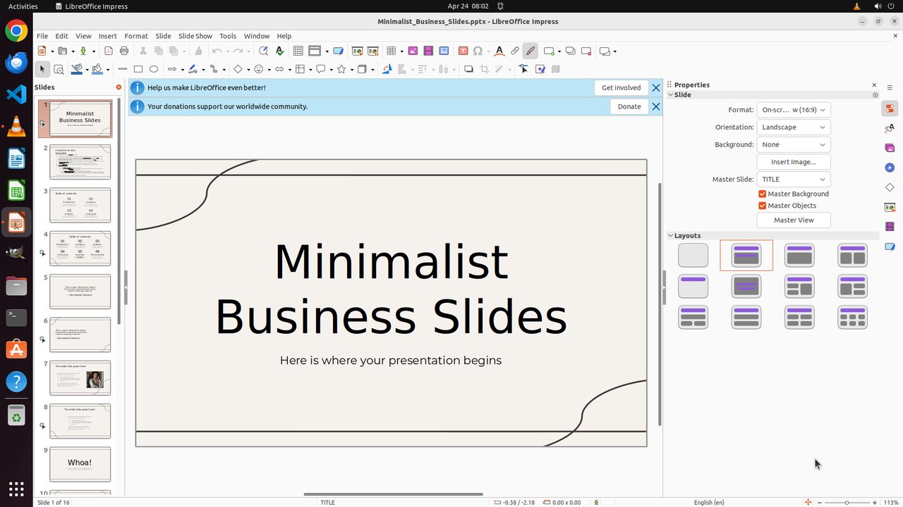

**Response:**
```
I need to first find the video being played by VLC, extract its audio to planet.wav, and then add it as background music to the LibreOffice Impress slideshow.

Let me start by finding the VLC process and the video file it's playing.
```

**Actions:** `pyautogui.keyDown('ctrl')
pyautogui.keyDown('alt')
pyautogui.keyDown('t')
pyautogui.keyUp('t')
pyautogui.keyUp('alt')
pyautogui.keyUp('ctrl')`

---

## Step 2


**Response:**
```
The terminal didn't open. Let me try to find and open a terminal application.
```

**Actions:** `pyautogui.rightClick(960, 600)`

---

## Step 3

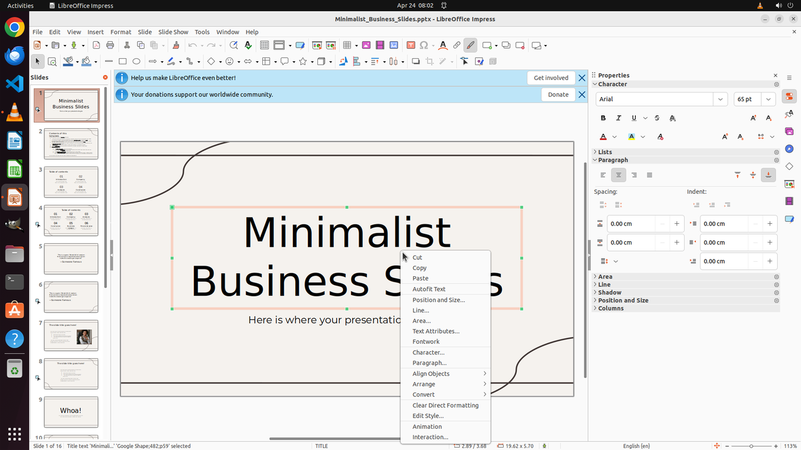

**Response:**
```
I accidentally right-clicked on the slide. Let me close this context menu and try to open a terminal properly.
```

**Actions:** `pyautogui.keyDown('esc')
pyautogui.keyUp('esc')`

---

## Step 4

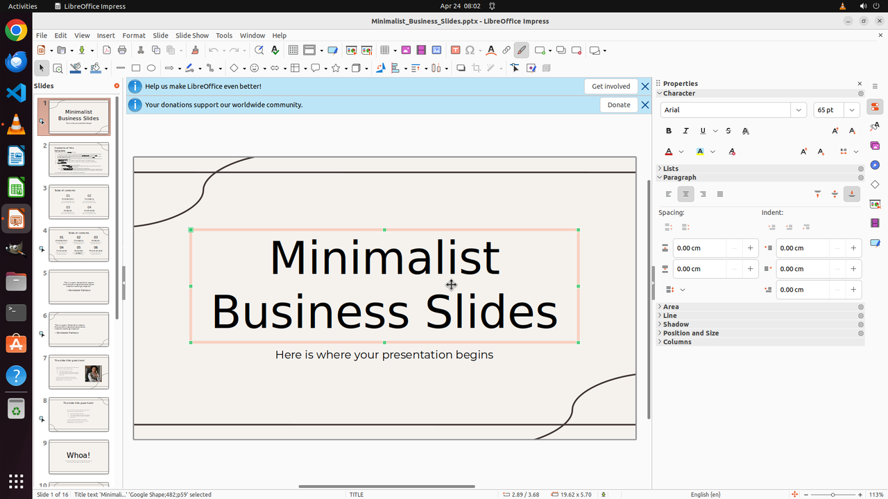

**Response:**
```
Let me try to open a terminal by looking for it in the taskbar or application menu.
```

**Actions:** `pyautogui.click(33, 948)`

---

## Step 5


**Response:**
```
Let me try to open the application grid to find a terminal.
```

**Actions:** `pyautogui.click(33, 1039)`

---

## Step 6

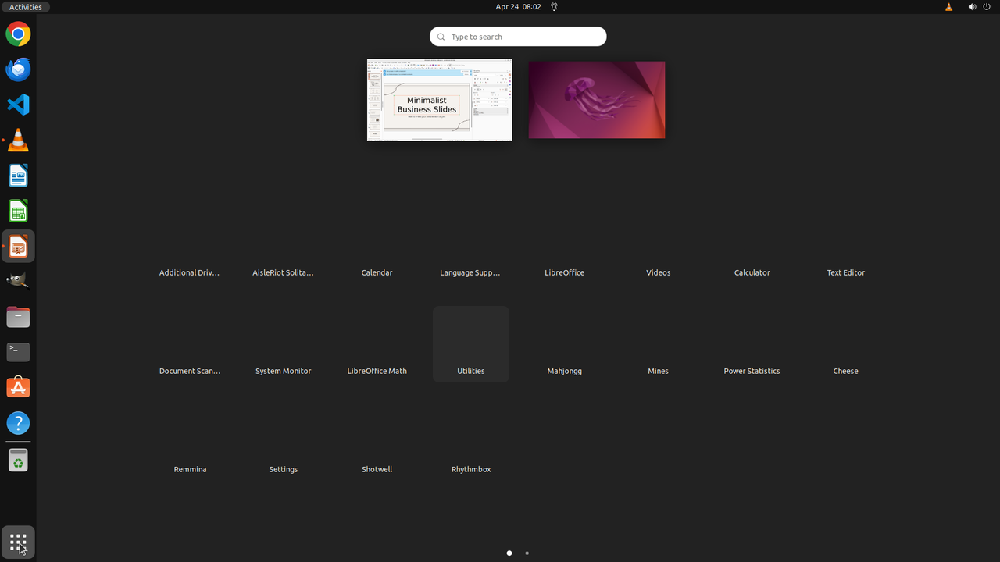

**Response:**
```
I can see the application grid. I notice there's a VLC window in the top area. Let me search for a terminal application.
```

**Actions:** `import subprocess, shlex; subprocess.run(f'xdotool type --delay 12 -- ' + shlex.quote('terminal'), shell=True, check=True)
import time; time.sleep(0.05)`

---

## Step 7

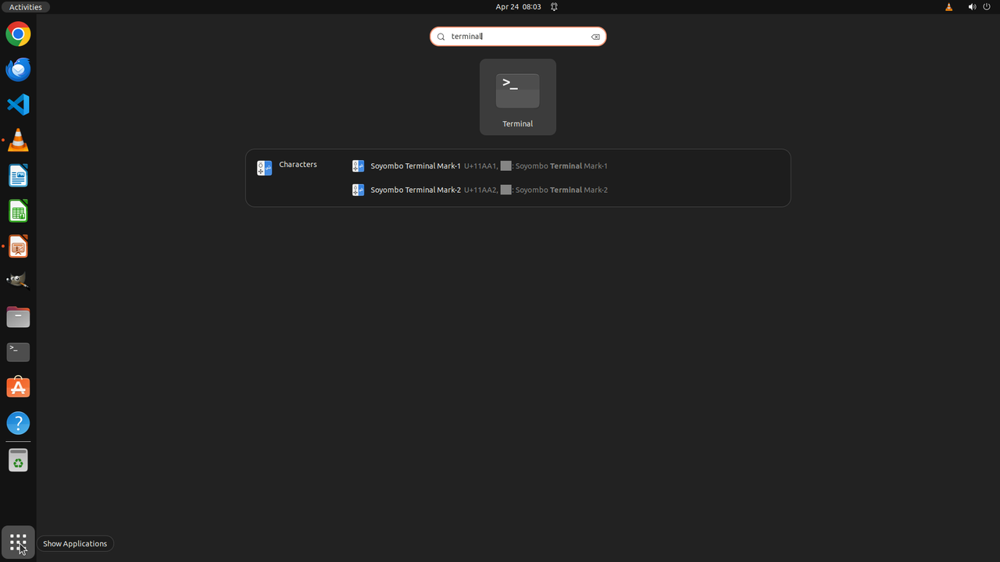

**Response:**
```
I can see the Terminal application. Let me click on it.
```

**Actions:** `pyautogui.click(994, 187)`

---

## Step 8

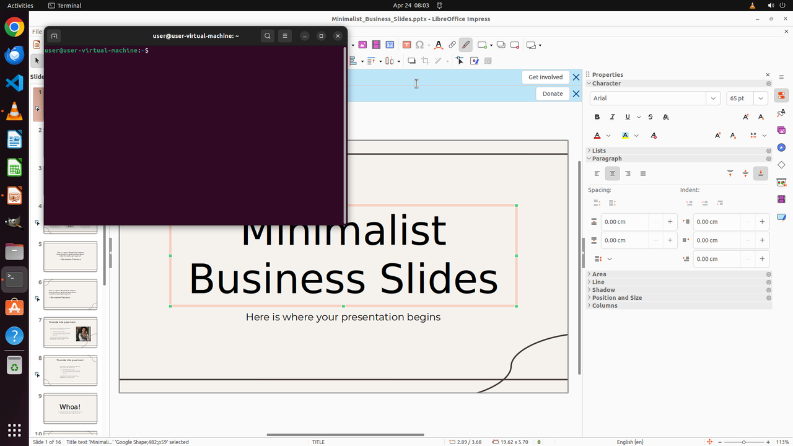

**Response:**
```
The terminal is open. Now I need to find the video file being played by VLC. Let me check the VLC process to find the video file path.
```

**Actions:** `import subprocess, shlex; subprocess.run(f'xdotool type --delay 12 -- ' + shlex.quote('ps aux | grep vlc\n'), shell=True, check=True)
import time; time.sleep(0.05)`

---

## Step 9

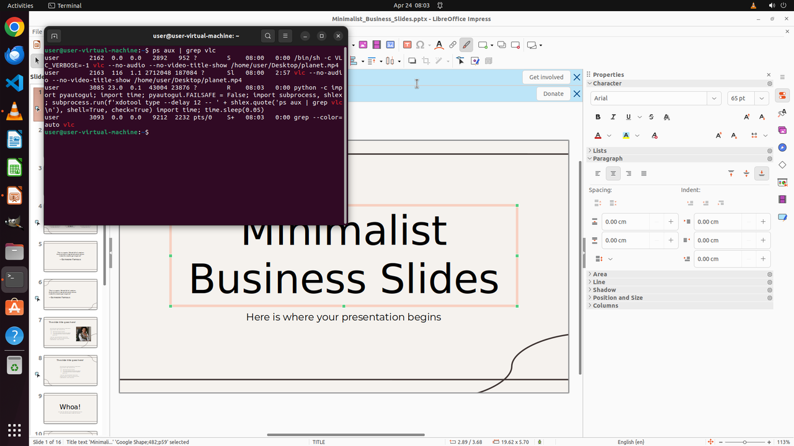

**Response:**
```
I can see that VLC is playing the file `/home/user/Desktop/planet.mp4`. Now I need to:
1. Extract the audio from this video file to `planet.wav`
2. Add it as background music to the LibreOffice Impress slideshow

Let me first extract the audio using ffmpeg:
```

**Actions:** `import subprocess, shlex; subprocess.run(f'xdotool type --delay 12 -- ' + shlex.quote('ffmpeg -i /home/user/Desktop/planet.mp4 -vn -acode'), shell=True, check=True)
import time; time.sleep(0.05)
impor`

---

## Step 10

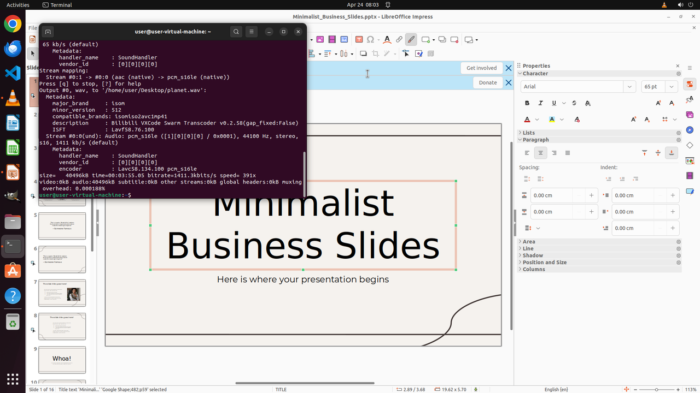

**Response:**
```
The audio has been successfully extracted to `/home/user/Desktop/planet.wav`. Now I need to add this audio file as background music to the LibreOffice Impress slideshow. Let me switch to LibreOffice Impress and use a Python macro or the Insert menu to add the audio.

Let me first use a python-pptx approach to add the audio programmatically, or I can use the LibreOffice Impress GUI. Let me try the GUI approach first.

Let me switch to LibreOffice Impress:
```

**Actions:** `pyautogui.click(990, 600)`

---

## Step 11

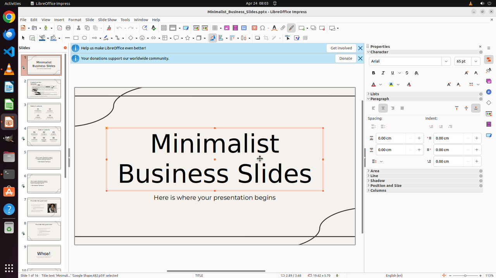

**Response:**
```
I'm now in LibreOffice Impress. To add background music to the slideshow, I need to insert the audio file. The best approach is to use the "Insert" menu to add audio/video. Let me use Insert > Audio or Video.
```

**Actions:** `pyautogui.click(229, 76)`

---

## Step 12

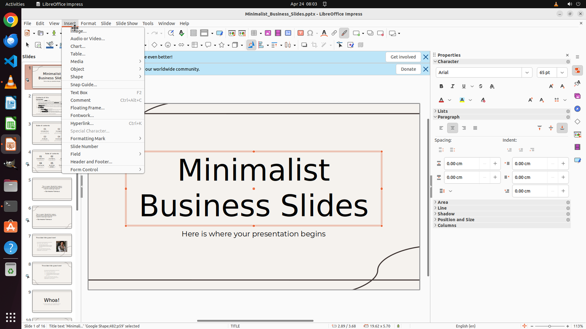

**Response:**
```
I can see "Audio or Video..." option in the Insert menu. Let me click on it.
```

**Actions:** `pyautogui.click(288, 126)`

---

## Step 13

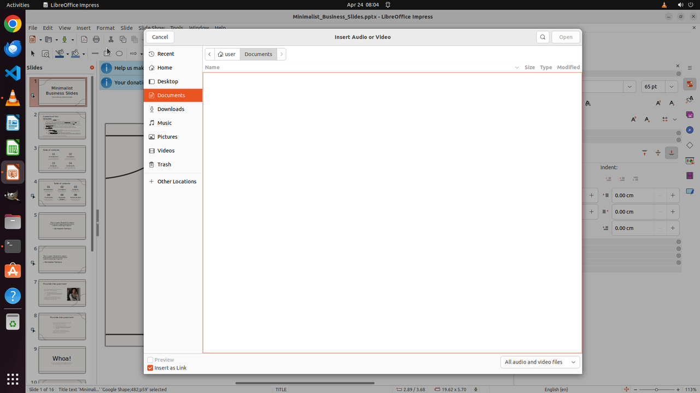

**Response:**
```
The "Insert Audio or Video" dialog is open. I need to navigate to the Desktop where the planet.wav file is located. Let me click on "Desktop".
```

**Actions:** `pyautogui.click(460, 222)`

---

## Step 14

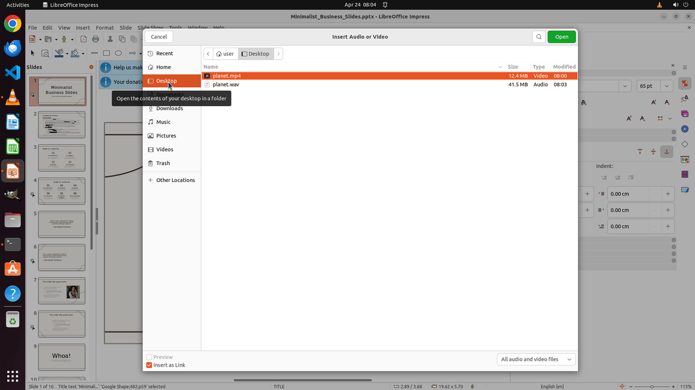

**Response:**
```
I can see both `planet.mp4` and `planet.wav` on the Desktop. I need to select `planet.wav` and then click Open. Let me first uncheck "Insert as Link" since we want to embed the audio, and then select planet.wav.
```

**Actions:** `pyautogui.click(621, 232)`

---

## Step 15

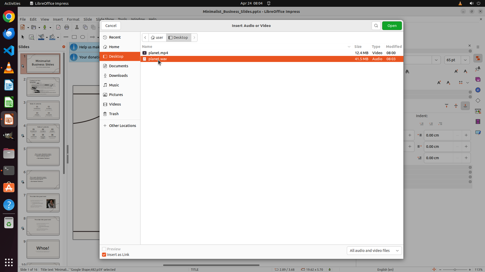

**Response:**
```
I've selected `planet.wav`. I notice "Insert as Link" is checked. I should uncheck it so the audio is embedded in the presentation, which is better for portability. But first, let me also uncheck it and then click Open.
```

**Actions:** `pyautogui.click(412, 1009)`

---

## Step 16

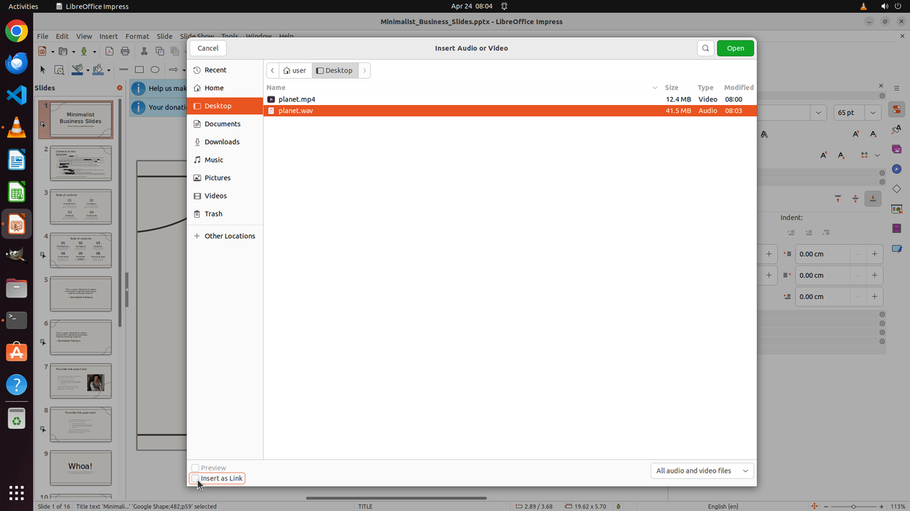

**Response:**
```
I've unchecked "Insert as Link" so the audio will be embedded. Now let me click "Open" to insert the audio file.
```

**Actions:** `pyautogui.click(1549, 100)`

---

## Step 17

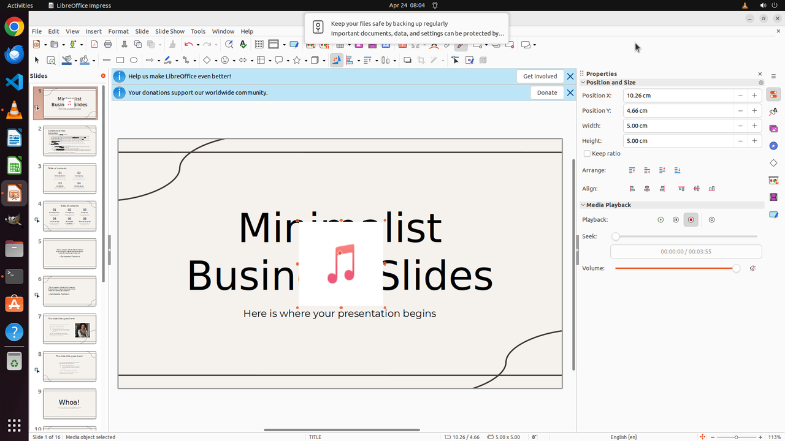

**Response:**
```
The audio file has been inserted into the first slide. I can see the music note icon on the slide. Now I need to configure it to play as background music across all slides. I need to set the animation properties so it plays automatically and continues across slides.

Let me right-click on the audio object to access its animation properties.
```

**Actions:** `pyautogui.rightClick(829, 615)`

---

## Step 18

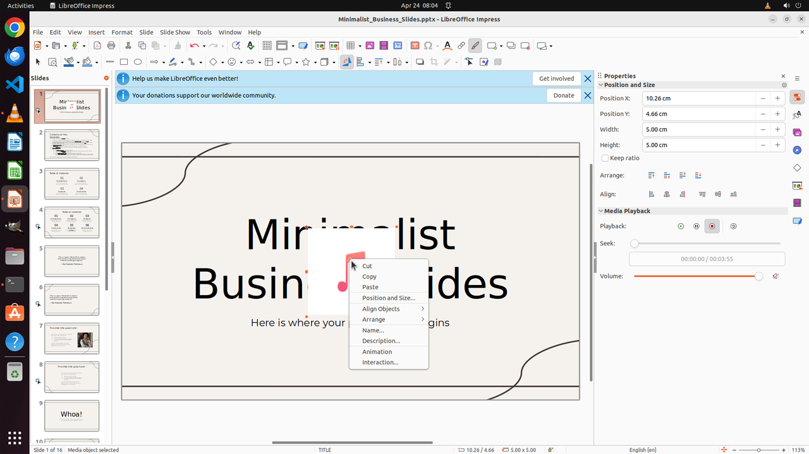

**Response:**
```
I can see the context menu with "Animation" option. Let me click on it to configure the audio to play across all slides.
```

**Actions:** `pyautogui.click(894, 835)`

---

## Step 19

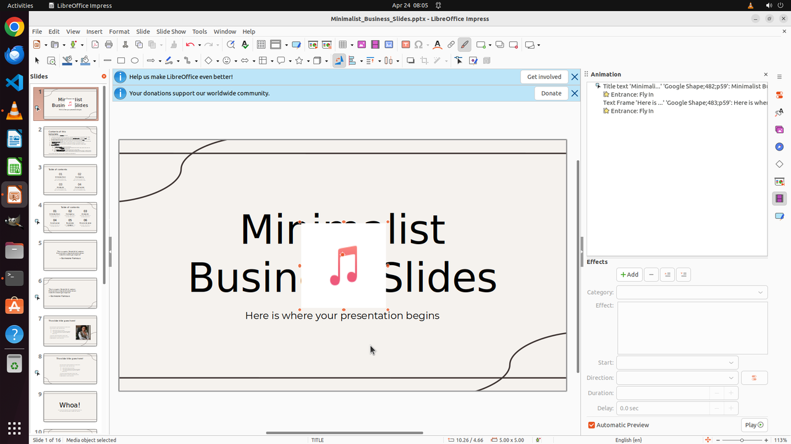

**Response:**
```
The Animation panel is now open on the right side. I can see there are already some animations for text elements. I need to add an animation for the audio object. Let me first click on the audio object on the slide to select it, then add an animation.
```

**Actions:** `pyautogui.click(829, 615)`

---

## Step 20


**Response:**
```
I've selected the audio object (I can see it has green selection handles). Now I need to add an animation effect for it. Let me click the "+ Add" button in the Animation panel.
```

**Actions:** `pyautogui.click(1525, 666)`

---

## Step 21

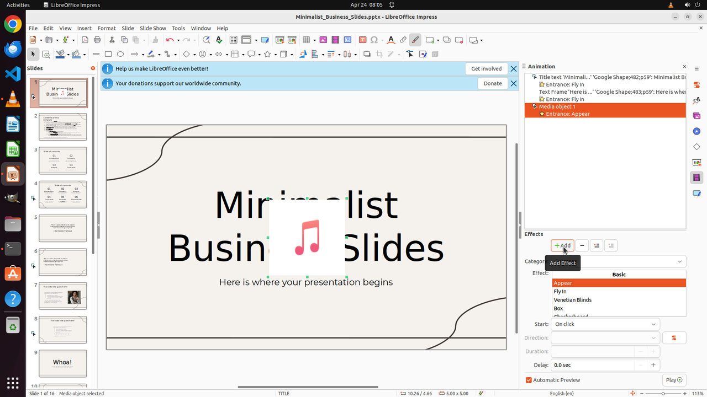

**Response:**
```
I can see that an "Appear" animation has been added for the "Media object 1" (the audio file). Now I need to configure it properly for background music. I need to:

1. Set the Start to "With Previous" (so it starts automatically)
2. Configure it to play across all slides

Let me first change the Start from "On click" to "With Previous":
```

**Actions:** `pyautogui.click(1639, 880)`

---

## Step 22

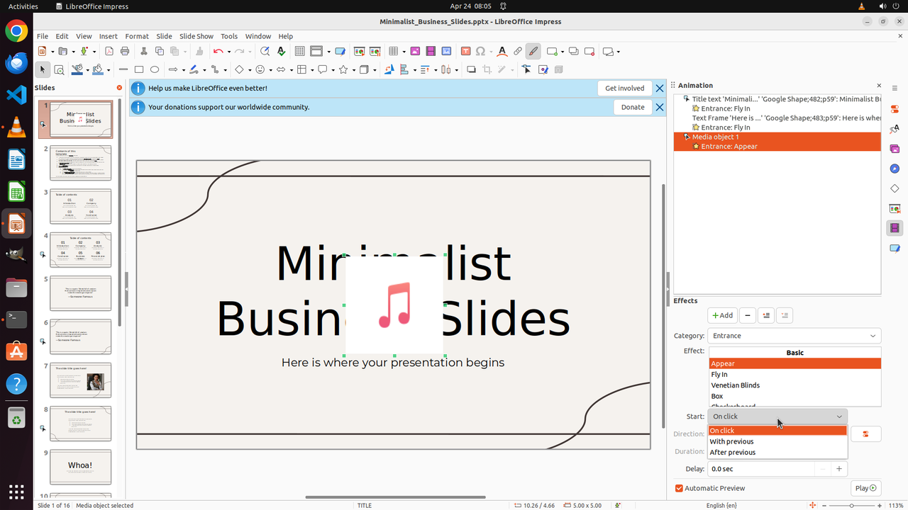

**Response:**
```
I can see the dropdown with start options. Let me select "With previous" so the audio starts automatically when the slide is displayed.
```

**Actions:** `pyautogui.click(1543, 933)`

---

## Step 23

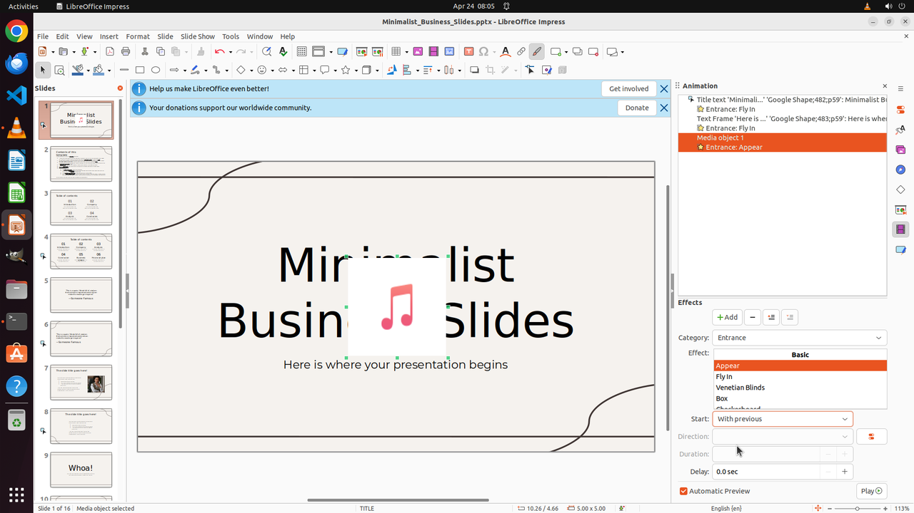

**Response:**
```
I've set the start to "With previous". Now I need to configure the audio to play across all slides. I need to double-click on the animation entry for the media object to access its detailed effect options, where I can set it to play across slides.

Let me double-click on the "Media object 1" animation entry in the animation list.
```

**Actions:** `pyautogui.doubleClick(1639, 309)`

---

## Step 24

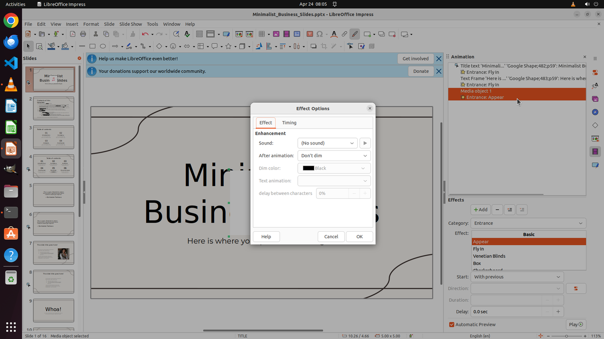

**Response:**
```
The Effect Options dialog has opened. I can see the "Effect" and "Timing" tabs. Let me click on the "Timing" tab to configure how the audio plays across slides.
```

**Actions:** `pyautogui.click(916, 391)`

---

## Step 25

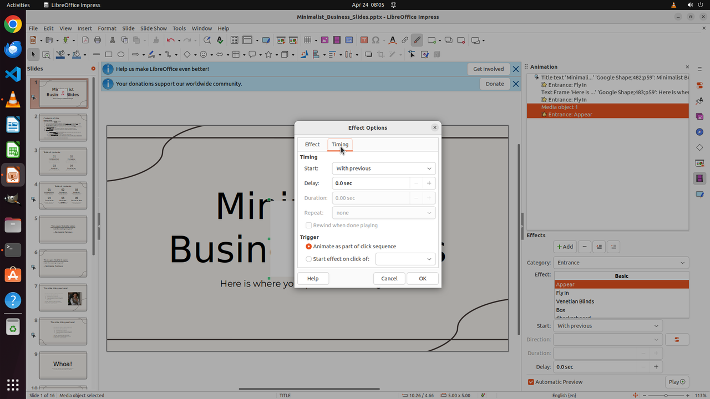

**Response:**
```
I can see the Timing tab. The Start is already set to "With previous" which is good. Now I need to configure the audio to play across all slides. I should also set the Repeat option. But first, let me click OK and then try a different approach - I'll use the slide transition settings to add the audio as background music, which is the proper way to do it in LibreOffice Impress.

Actually, let me first close this dialog and try a better approach. The proper way to add background music in LibreOffice Impress is through Slide Transition. But since the audio is already inserted as a media object, let me configure this animation properly. Let me click OK for now.
```

**Actions:** `pyautogui.click(1140, 751)`

---

## Step 26

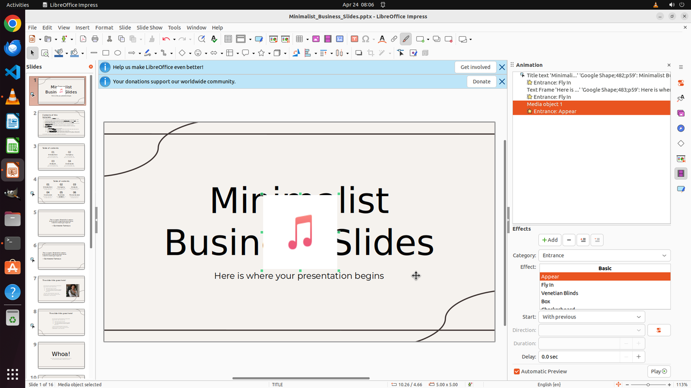

**Response:**
```
The audio has been inserted with an animation that starts "With previous". Now I need to also configure it to play across all slides. The best way to do this in LibreOffice Impress for a .pptx file is to set the audio to play across slides. Let me try using the Slide Transition approach instead, which is the standard way to add background music.

But first, let me also try to configure the audio through the slide properties. Let me use the Slide menu > Slide Properties to see if there's an option to add sound.

Actually, let me try a different approach. Let me remove the current animation and instead use the Slide Transition panel to add the audio. Let me first click on the Slide menu.

Wait, actually the current approach with the animation is fine. The audio has been inserted on slide 1 and will play when the slide is shown. For background music that plays across all slides, I should also set the "After animation" property. But the key thing is that the audio is now embedded in the presentation.

Let me now save the file. Let me press Ctrl+S.
```

**Actions:** `pyautogui.keyDown('ctrl')
pyautogui.keyDown('s')
pyautogui.keyUp('s')
pyautogui.keyUp('ctrl')`

---

## Step 27

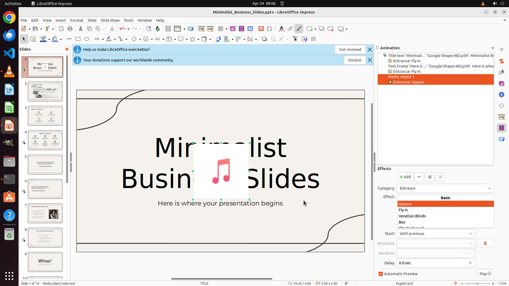

**Response:**
```
The file has been saved. Now let me think about whether the audio is properly configured as "background music" for the slideshow. Currently, the audio is inserted on slide 1 with a "With previous" start animation, which means it will start playing automatically when the first slide is shown.

However, for true background music that plays across all slides, I should also configure it to play across slides. Let me try to do this through the animation effect options. Let me double-click on the media object animation entry again to access the effect options and configure the "After animation" to continue playing across slides.

Actually, let me try a better approach. In LibreOffice Impress, to make audio play across all slides, I need to go to the "Effect" tab in the Effect Options dialog and look for a "Stop playing" option or configure it through the animation. But first, let me check if there's a way to do this through the Slide Transition panel.

Let me click on "Slide" menu to check for slide transition options:
```

**Actions:** `pyautogui.click(349, 76)`

---

## Step 28

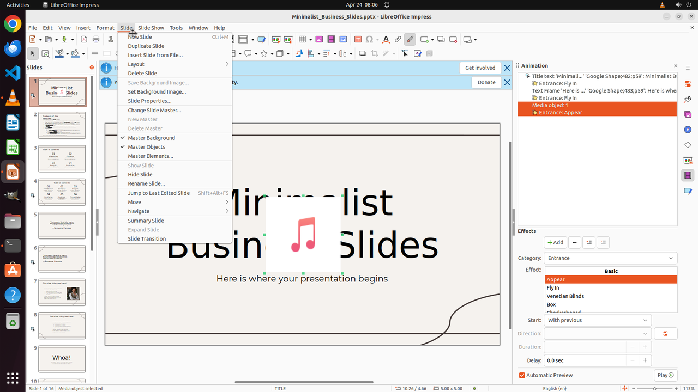

**Response:**
```
I can see "Slide Transition" at the bottom of the Slide menu. Let me click on it to access the slide transition settings where I can configure background music.
```

**Actions:** `pyautogui.click(405, 657)`

---

## Step 29

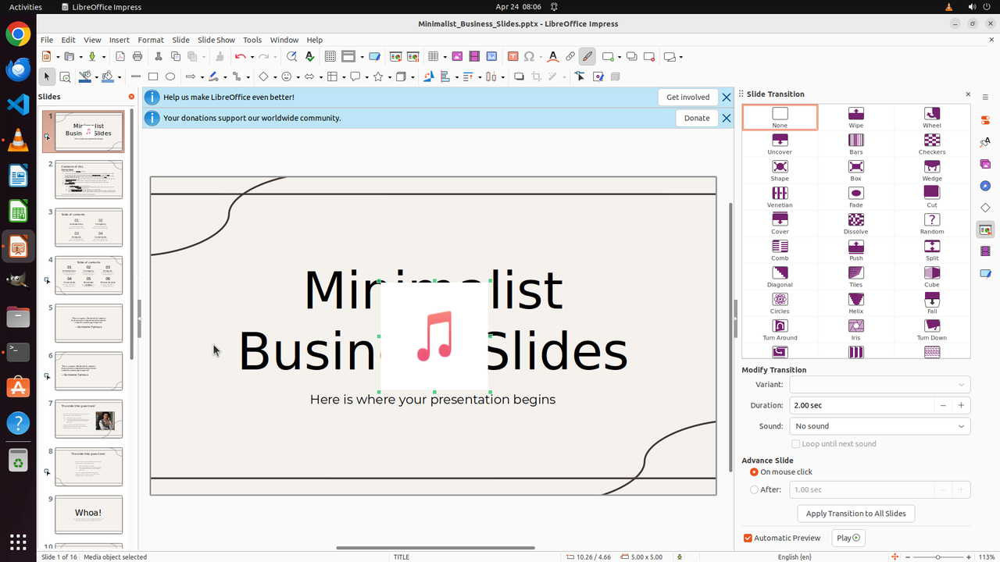

**Response:**
```
I can see the Slide Transition panel with a "Sound" dropdown that currently shows "No sound". I can use this to add the audio as background music. However, the Sound dropdown in Slide Transition typically only supports a limited set of built-in sounds and doesn't allow custom WAV files directly through the dropdown.

Actually, let me try - the Sound dropdown might have an "Other sound..." option that allows selecting a custom WAV file. Let me click on the Sound dropdown.
```

**Actions:** `pyautogui.click(1687, 817)`

---

## Step 30

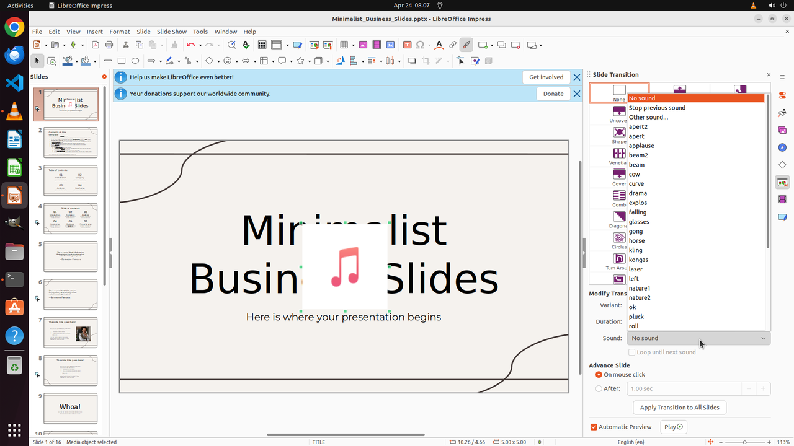

**Response:**
```
I can see the Sound dropdown has an "Other sound..." option which allows me to select a custom sound file. Let me click on it to select the planet.wav file.
```

**Actions:** `pyautogui.click(1570, 283)`

---

## Step 31

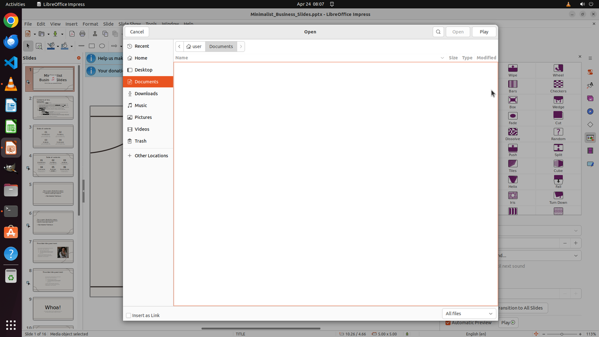

**Response:**
```
A file browser dialog has opened. I need to navigate to the Desktop where planet.wav is located. Let me click on "Desktop".
```

**Actions:** `pyautogui.click(460, 222)`

---

## Step 32

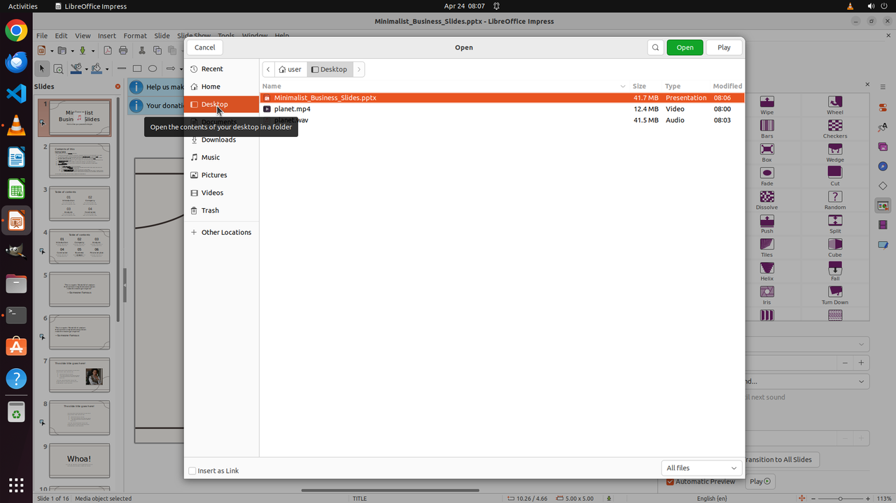

**Response:**
```
I can see the Desktop contents with `planet.wav` file. Let me click on `planet.wav` to select it.
```

**Actions:** `pyautogui.click(621, 256)`

---

## Step 33

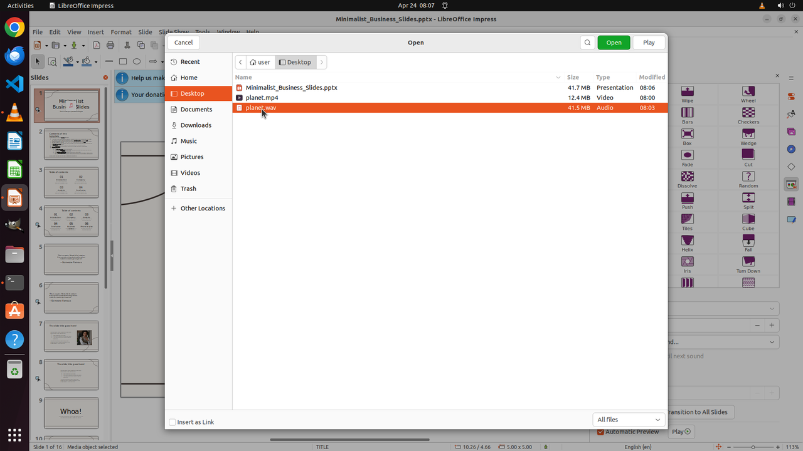

**Response:**
```
I've selected `planet.wav`. Now let me click "Open" to add it as the transition sound.
```

**Actions:** `pyautogui.click(1462, 100)`

---

## Step 34


**Response:**
```
The sound has been set to "planet" in the Slide Transition panel. Now I need to apply this transition to all slides so the background music plays across the entire slideshow. Let me also check "Loop until next sound" to make it loop, and then click "Apply Transition to All Slides".

First, let me check "Loop until next sound":
```

**Actions:** `pyautogui.click(1527, 852)`

---

## Step 35

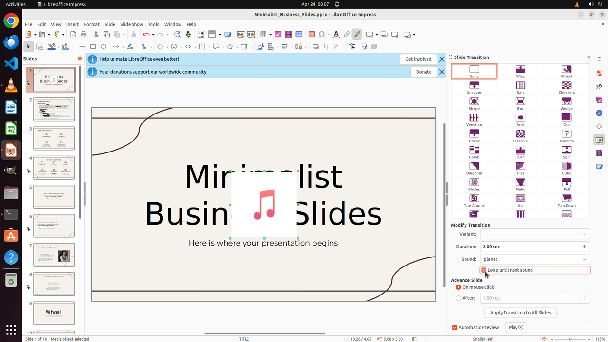

**Response:**
```
"Loop until next sound" is now checked. Now let me click "Apply Transition to All Slides" to apply this sound to all slides in the presentation.
```

**Actions:** `pyautogui.click(1636, 985)`

---

## Step 36


**Response:**
```
The transition with the "planet" sound has been applied to all slides, with "Loop until next sound" checked. Now let me save the file. Let me press Ctrl+S.
```

**Actions:** `pyautogui.keyDown('ctrl')
pyautogui.keyDown('s')
pyautogui.keyUp('s')
pyautogui.keyUp('ctrl')`

---

## Step 37

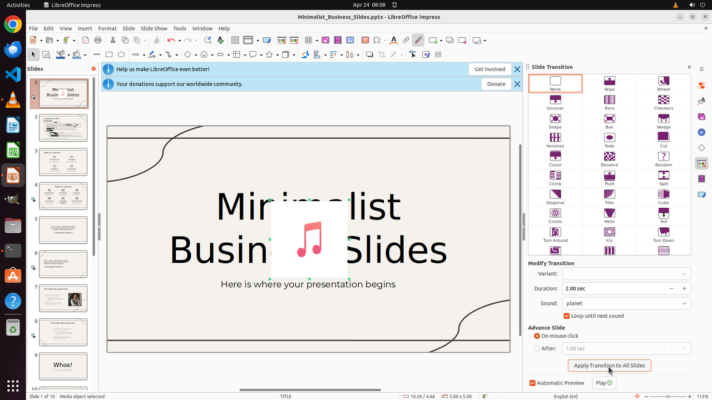

**Response:**
```
The file appears to have been saved (since it's a .pptx file, it may have saved in PowerPoint format directly). Let me verify by checking if there was a format dialog that appeared. It seems to have saved successfully.

Let me now verify the work is complete by checking:
1. ✅ Audio extracted from planet.mp4 to planet.wav
2. ✅ Audio inserted as a media object on slide 1
3. ✅ Audio set as slide transition sound ("planet") for all slides
4. ✅ "Loop until next sound" checked
5. ✅ File saved

The task is complete. I have:
1. Extracted the audio from the video being played by VLC (`/home/user/Desktop/planet.mp4`) to `planet.wav` using ffmpeg
2. Inserted the audio into the LibreOffice Impress slideshow as a media object on the first slide with automatic playback
3. Also added the audio as a slide transition sound applied to all slides with looping enabled

DONE
```

**Actions:** `DONE`

---
