# Task 7e287123-70ca-47b9-8521-47db09b69b14

**Instruction:** I am an assistant professor of CS at HKU, I want to apply for the General Research Fund next year, I need to get some insights, so I need you to help me to organise the data. First please help me to organise the pass rate of the GRF applications of the CS departments of each school for 2019~2023 in percentage form with 2 decimal digits in a table, which I can use subsequently. Set the headers as "Year", "#Applied", "#Supported", and "Success Rate". The materials are saved under Documents/Fundings. And please save the result table as "GRF-p5y.xlsx" on my desktop.

**Score:** 0.0

**Wall clock:** 10m 57s

**Steps:** 28

**Cost:** $1.00

---

## Step 1


**Response:**
```
Let me start by examining the materials in the Documents/Fundings directory.
```

**Actions:** `pyautogui.click(33, 673)`

---

## Step 2


**Response:**
```
Good, the terminal is open. Let me first explore the Documents/Fundings directory to see what files are available.
```

**Actions:** `import subprocess, shlex; subprocess.run(f'xdotool type --delay 12 -- ' + shlex.quote('ls ~/Documents/Fundings/\n'), shell=True, check=True)
import time; time.sleep(0.05)`

---

## Step 3


**Response:**
```
I can see two directories: `ecs` and `grf`. Let me explore both of them.
```

**Actions:** `import subprocess, shlex; subprocess.run(f'xdotool type --delay 12 -- ' + shlex.quote('ls ~/Documents/Fundings/grf/\n'), shell=True, check=True)
import time; time.sleep(0.05)`

---

## Step 4


**Response:**
```
I can see PDF files for GRF from years 15-23 (grf15.pdf through grf23.pdf). I need to look at grf19.pdf through grf23.pdf for years 2019-2023. These are PDF files, so I need to extract data from them. Let me first check what tools are available and then examine the content of these PDFs.
```

**Actions:** `import subprocess, shlex; subprocess.run(f'xdotool type --delay 12 -- ' + shlex.quote('python3 -c "import pdfplumber; print(\'pdfplumber a'), shell=True, check=True)
import time; time.sleep(0.05)
impo`

---

## Step 5

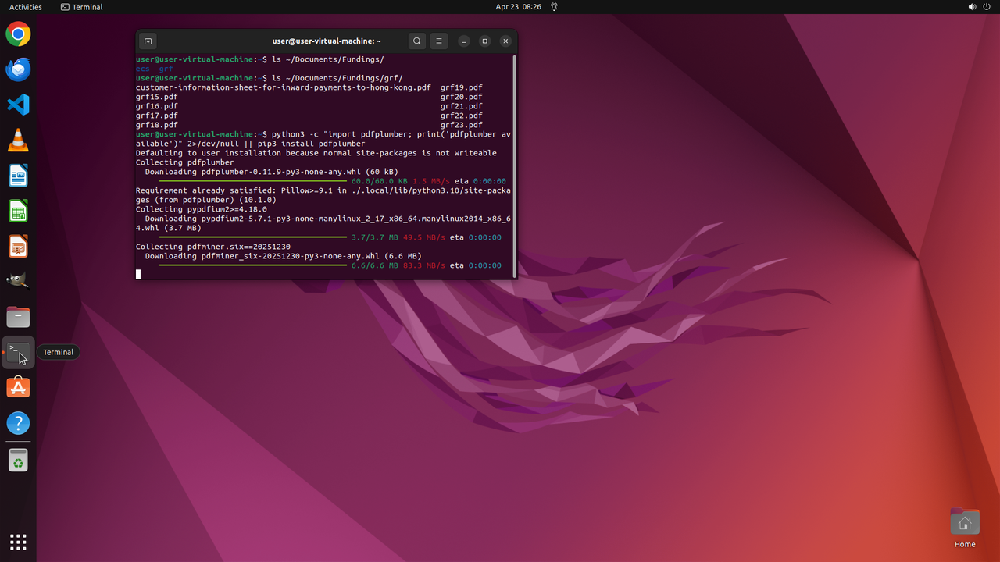

**Response:**
```
pdfplumber is being installed. Let me wait for it to finish.
```

**Actions:** `time.sleep(0.5)`

---

## Step 6

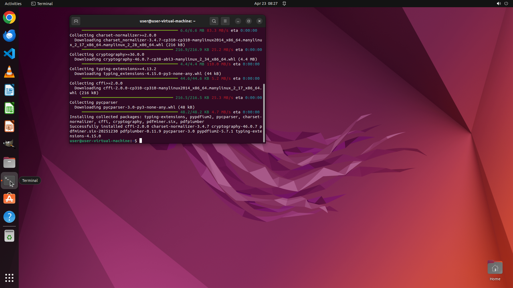

**Response:**
```
pdfplumber is installed. Now let me examine the content of one of the GRF PDFs to understand the structure before writing the extraction script.
```

**Actions:** `import subprocess, shlex; subprocess.run(f'xdotool type --delay 12 -- ' + shlex.quote('python3 -c "\nimport pdfplumber\npdf = pdfplumber.op'), shell=True, check=True)
import time; time.sleep(0.05)
imp`

---

## Step 7

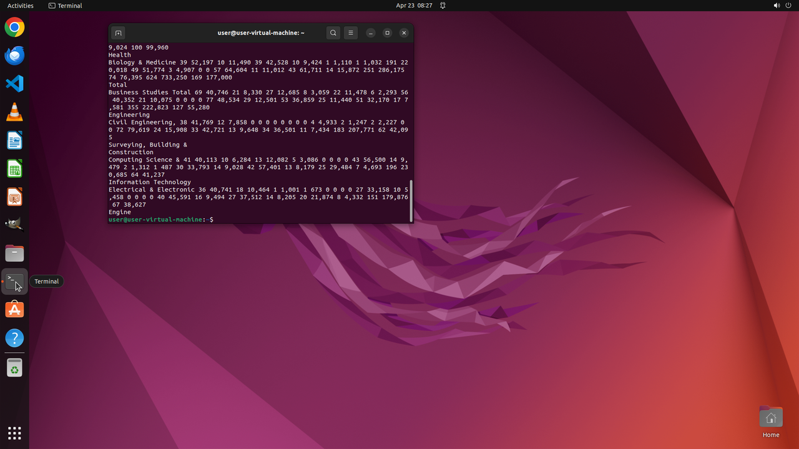

**Response:**
```
I can see the PDF contains tabular data with various departments. I need to find "Computer Science" specifically. The text extraction is messy - let me try to extract tables instead and look at the structure more carefully.
```

**Actions:** `import subprocess, shlex; subprocess.run(f'xdotool type --delay 12 -- ' + shlex.quote('python3 -c "\nimport pdfplumber\npdf = pdfplumber.op'), shell=True, check=True)
import time; time.sleep(0.05)
imp`

---

## Step 8

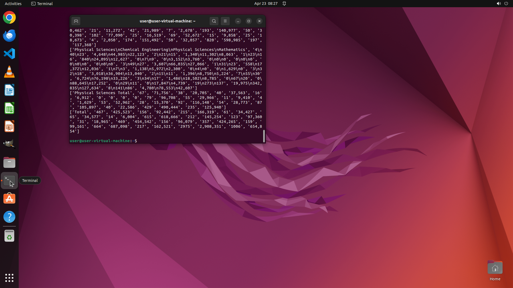

**Response:**
```
The table extraction is quite complex. Let me scroll up to see the beginning of the tables and understand the structure better. Let me try a different approach - extract all text and search for "Computer Science" rows.
```

**Actions:** `import subprocess, shlex; subprocess.run(f'xdotool type --delay 12 -- ' + shlex.quote('python3 -c "\nimport pdfplumber\npdf = pdfplumber.op'), shell=True, check=True)
import time; time.sleep(0.05)
imp`

---

## Step 9

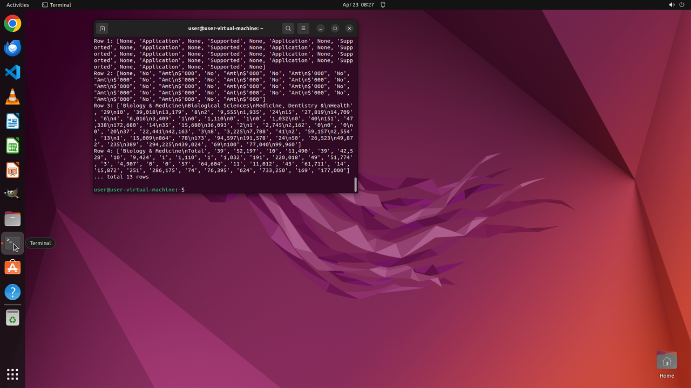

**Response:**
```
Now I can see the structure. The table has columns for different universities with "Application", "Supported", "No", "Amt" etc. Let me look at the header row (Row 0) and find the "Computer Science" row. Let me also understand the column structure better.
```

**Actions:** `import subprocess, shlex; subprocess.run(f'xdotool type --delay 12 -- ' + shlex.quote('python3 -c "\nimport pdfplumber\npdf = pdfplumber.op'), shell=True, check=True)
import time; time.sleep(0.05)
imp`

---

## Step 10

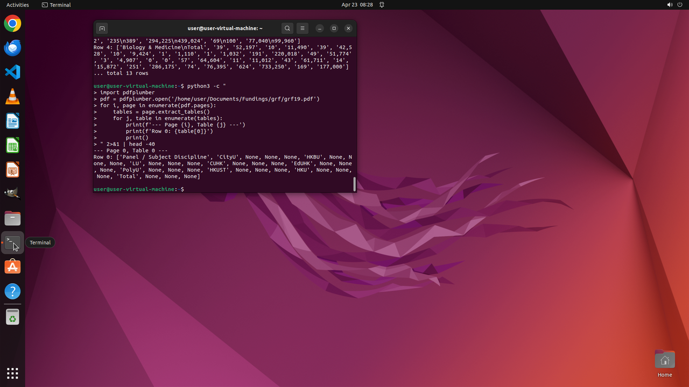

**Response:**
```
Now I can see the structure. The header row has university names: CityU, HKBU, None (likely N), LU, CUHK, EduHK, PolyU, HKUST, HKU, Total. Each university has multiple columns (Application No, Amt, Supported No, Amt). 

The task is about CS departments of each school. Let me find the Computer Science row and understand the column mapping. Let me look at all rows to find Computer Science.
```

**Actions:** `import subprocess, shlex; subprocess.run(f'xdotool type --delay 12 -- ' + shlex.quote('python3 -c "\nimport pdfplumber\npdf = pdfplumber.op'), shell=True, check=True)
import time; time.sleep(0.05)
imp`

---

## Step 11

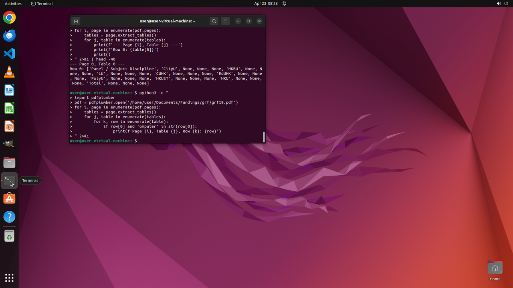

**Response:**
```
It seems the search didn't find "Computer" in the first column. The text might be spread across rows or the department name might be different. Let me search more broadly across all cells and also look at the text extraction.
```

**Actions:** `import subprocess, shlex; subprocess.run(f'xdotool type --delay 12 -- ' + shlex.quote('python3 -c "\nimport pdfplumber\npdf = pdfplumber.op'), shell=True, check=True)
import time; time.sleep(0.05)
imp`

---

## Step 12

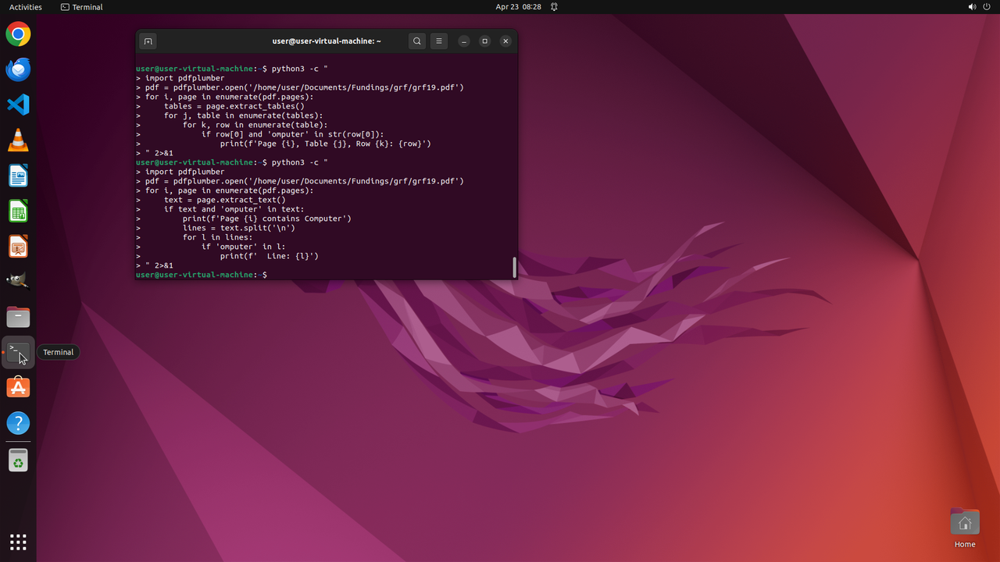

**Response:**
```
No results found for "Computer" in grf19.pdf. The earlier text extraction showed "Computing Science" - let me search for that instead. I also saw "Information Technology" as a category. Let me look at what's in the text more carefully.
```

**Actions:** `import subprocess, shlex; subprocess.run(f'xdotool type --delay 12 -- ' + shlex.quote('python3 -c "\nimport pdfplumber\npdf = pdfplumber.op'), shell=True, check=True)
import time; time.sleep(0.05)
imp`

---

## Step 13

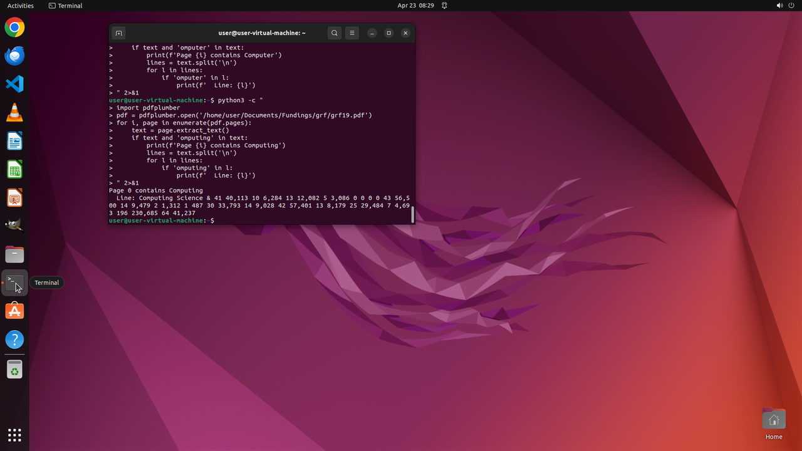

**Response:**
```
I found it. The discipline is called "Computing Science &" and it's on Page 0. The line is:
```
Computing Science & 41 40,113 10 6,284 13 12,082 5 3,086 0 0 0 0 43 56,500 14 9,479 2 1,312 1 487 30 33,793 14 9,028 42 57,401 13 8,179 25 29,484 7 4,693 196 230,685 64 41,237
```

Now I need to understand the column structure. Let me look at the header rows and the "Computing Science" row in the table extraction to map the columns properly. The task asks for the CS department data for HKU specifically. Let me look at this more carefully using table extraction.
```

**Actions:** `import subprocess, shlex; subprocess.run(f'xdotool type --delay 12 -- ' + shlex.quote('python3 -c "\nimport pdfplumber\npdf = pdfplumber.op'), shell=True, check=True)
import time; time.sleep(0.05)
imp`

---

## Step 14

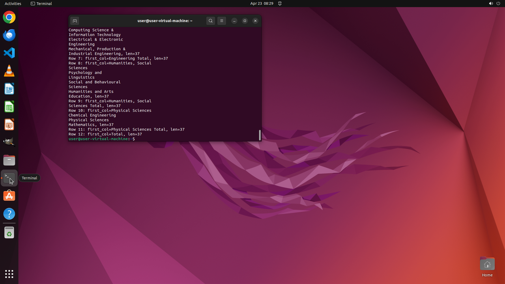

**Response:**
```
Now I can see the structure. Let me scroll up to see all rows including the "Computing Science &" row. I can see it's part of the "Engineering" section. Let me now look at the specific row for "Computing Science &" and understand the column structure to find HKU's data.
```

**Actions:** `import subprocess, shlex; subprocess.run(f'xdotool type --delay 12 -- ' + shlex.quote('python3 -c "\nimport pdfplumber\npdf = pdfplumber.op'), shell=True, check=True)
import time; time.sleep(0.05)
imp`

---

## Step 15

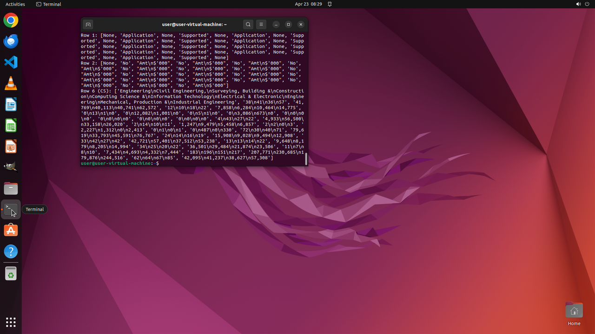

**Response:**
```
I can see the data is quite complex with multiple sub-rows merged together. The row contains multiple disciplines merged. Let me try a different approach - open the PDF visually to understand the structure, or use a more targeted extraction. Let me try to use pdfplumber to extract the table more carefully.
```

**Actions:** `import subprocess, shlex; subprocess.run(f'xdotool type --delay 12 -- ' + shlex.quote("python3 << 'PYEOF'\nimport pdfplumber\n\npdf = pdfplu"), shell=True, check=True)
import time; time.sleep(0.05)
im`

---

## Step 16

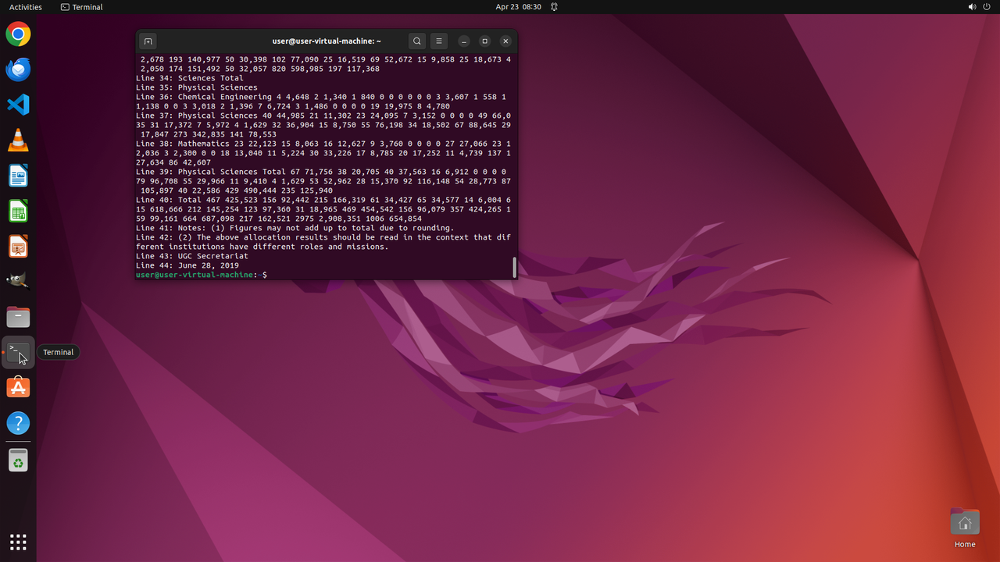

**Response:**
```
Let me scroll up to see the full text output, especially the Computing Science line.
```

**Actions:** `pyautogui.scroll(10, 600, 300)`

---

## Step 17

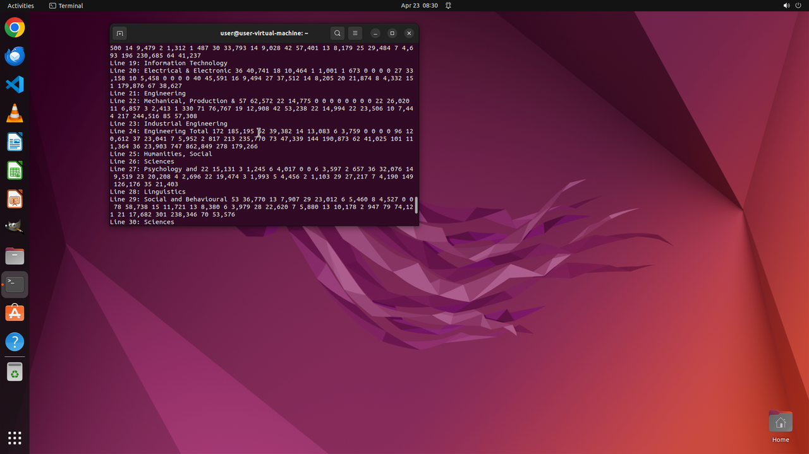

**Response:**
```
Let me scroll up more to see the Computing Science line and the header structure.
```

**Actions:** `pyautogui.scroll(10, 600, 300)`

---

## Step 18

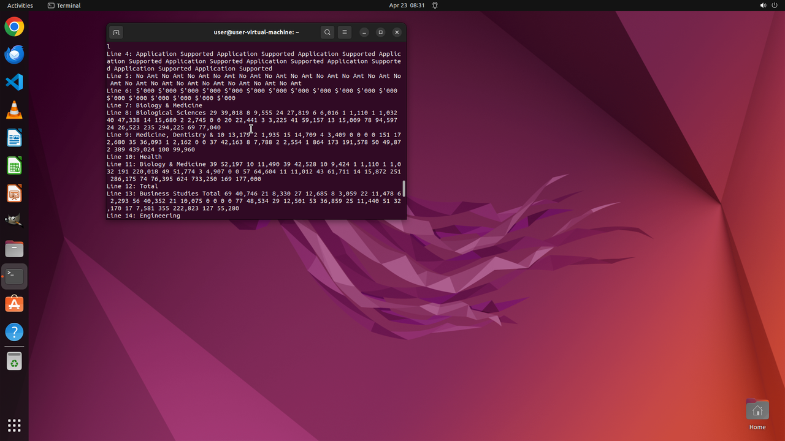

**Response:**
```
Now I can see the structure. Let me scroll up a bit more to see the very first lines with the university headers.
```

**Actions:** `pyautogui.scroll(5, 600, 300)`

---

## Step 19

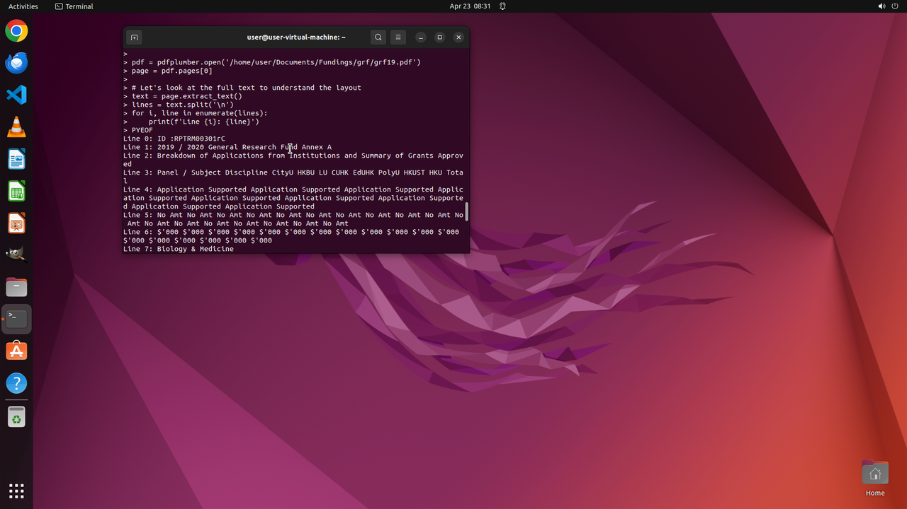

**Response:**
```
Now I can see the full structure clearly:

- Line 0: ID
- Line 1: "2019 / 2020 General Research Fund Annex A"
- Line 2: Title
- Line 3: "Panel / Subject Discipline CityU HKBU LU CUHK EduHK PolyU HKUST HKU Total"
- Line 4: "Application Supported Application Supported..." (for each university)
- Line 5: "No Amt No Amt No Amt..." (columns: No, Amt for Application and Supported)

So each university has 4 columns: Application No, Application Amt, Supported No, Supported Amt. Plus the first column is the discipline name.

The universities in order are: CityU, HKBU, LU, CUHK, EduHK, PolyU, HKUST, HKU, Total

That's 9 entities × 4 columns = 36 data columns + 1 discipline column = 37 columns total.

Now I need to understand the task better. The user says "CS departments of each school" - meaning they want the data for CS (Computing Science) across ALL schools, not just HKU. Let me re-read: "organise the pass rate of the GRF applications of the CS departments of each school for 2019~2023".

Wait, re-reading: "pass rate of the GRF applications of the CS departments of each school" - this could mean the aggregate CS data across all schools (the Total column), or per-school data. But the output format has "Year", "#Applied", "#Supported", "Success Rate" - which suggests one row per year, so it's likely the total across all schools.

Let me extract the Computing Science row data. Let me write a Python script to do this properly.
```

**Actions:** `import subprocess, shlex; subprocess.run(f'xdotool type --delay 12 -- ' + shlex.quote("python3 << 'PYEOF'\nimport pdfplumber\n\n# For grf19."), shell=True, check=True)
import time; time.sleep(0.05)
im`

---

## Step 20

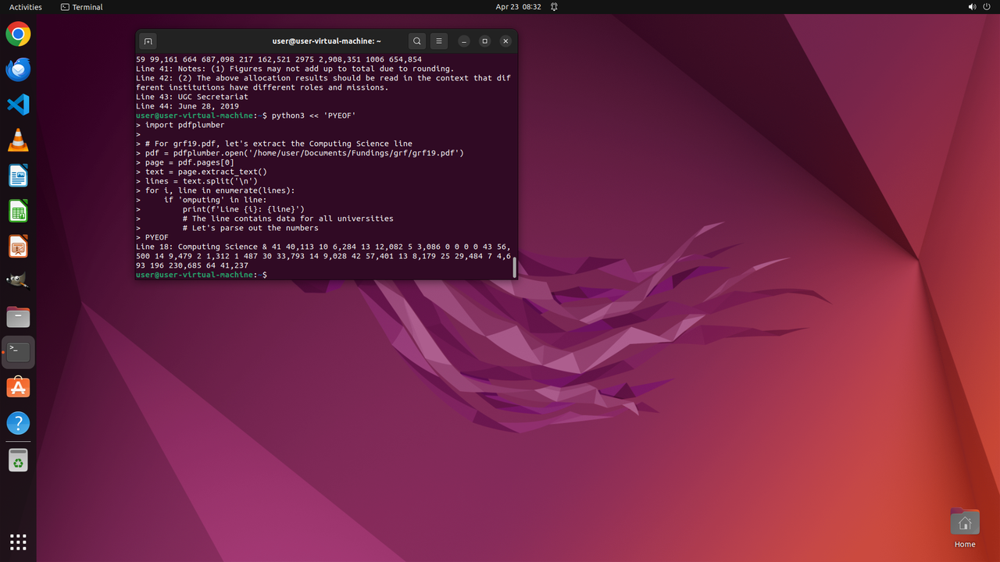

**Response:**
```
Now I can see the Computing Science line clearly:
```
Computing Science & 41 40,113 10 6,284 13 12,082 5 3,086 0 0 0 0 43 56,500 14 9,479 2 1,312 1 487 30 33,793 14 9,028 42 57,401 13 8,179 25 29,484 7 4,693 196 230,685 64 41,237
```

The structure is: discipline name, then for each of 9 entities (CityU, HKBU, LU, CUHK, EduHK, PolyU, HKUST, HKU, Total), 4 values: App_No, App_Amt, Supp_No, Supp_Amt.

Wait, but the task says "CS departments of each school" - I think this means the overall CS discipline data (Total column). The headers "Year", "#Applied", "#Supported", "Success Rate" suggest one row per year with aggregate data.

Let me verify: The Total values at the end are: 196 230,685 64 41,237. So 196 applied, 64 supported. Success rate = 64/196 = 32.65%.

Now let me also consider: maybe "CS departments of each school" means per-school breakdown? But the headers only have Year, #Applied, #Supported, Success Rate - which is a single row per year. So it must be the total/aggregate for CS.

Wait, re-reading the task again: "organise the pass rate of the GRF applications of the CS departments of each school" - maybe they want a table per school? But the headers suggest a simple table. Let me re-read... "organise the pass rate of the GRF applications of the CS departments of each school for 2019~2023 in a table". The headers are "Year", "#Applied", "#Supported", "Success Rate" - this is clearly one row per year. So it must be the total across all schools.

Let me now write a comprehensive script to extract the data from all 5 years (2019-2023).
```

**Actions:** `import subprocess, shlex; subprocess.run(f'xdotool type --delay 12 -- ' + shlex.quote("python3 << 'PYEOF'\nimport pdfplumber\nimport re\n\nba"), shell=True, check=True)
import time; time.sleep(0.05)
i`

---

## Step 21

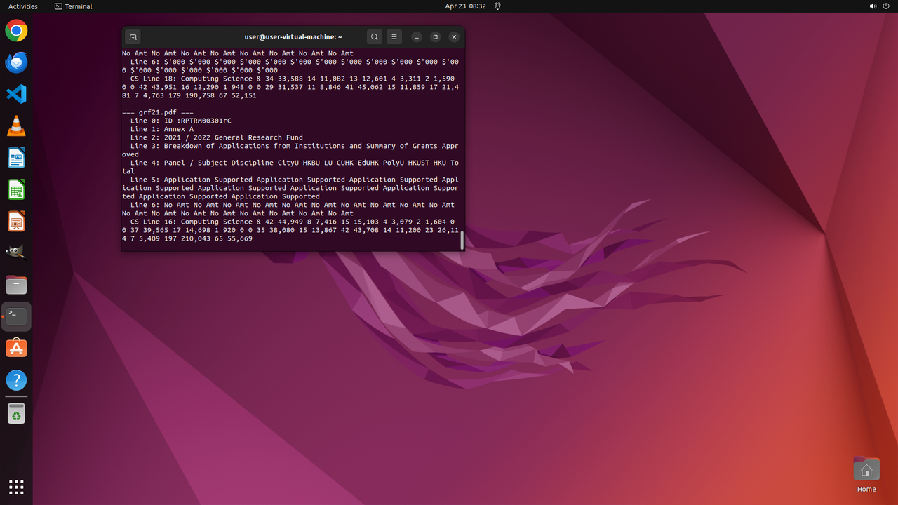

**Response:**
```
I can see data for grf20 and grf21. Let me scroll up to see grf19 and then down to see grf22 and grf23.
```

**Actions:** `pyautogui.scroll(5, 600, 300)`

---

## Step 22

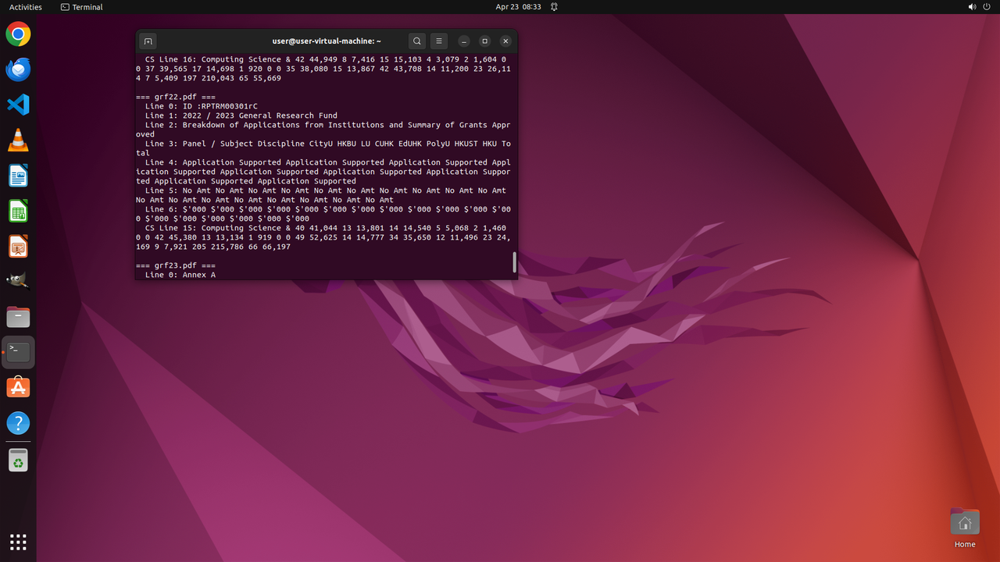

**Response:**
```
I can see grf21, grf22, and the beginning of grf23. Let me scroll down to see grf23's CS line.
```

**Actions:** `pyautogui.scroll(-3, 600, 300)`

---

## Step 23

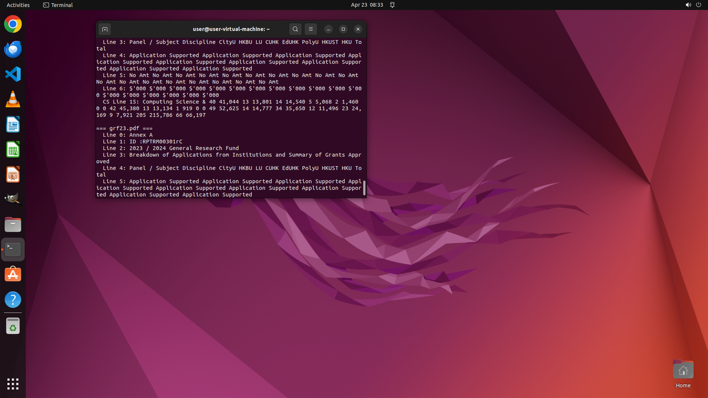

**Response:**
```
I can see grf22 and grf23 header. I need to scroll down more to see grf23's CS line. But first, let me now take a more systematic approach. I have enough understanding of the structure. Let me write a comprehensive Python script to extract the data from all 5 years and create the Excel file.

The key insight is that the "Computing Science &" line contains numbers, and the last 4 numbers before the end are the Total: Total_App_No, Total_App_Amt, Total_Supp_No, Total_Supp_Amt.

Let me now write the full extraction script:
```

**Actions:** `import subprocess, shlex; subprocess.run(f'xdotool type --delay 12 -- ' + shlex.quote("python3 << 'PYEOF'\nimport pdfplumber\nimport re\nimp"), shell=True, check=True)
import time; time.sleep(0.05)
im`

---

## Step 24


**Response:**
```
I need to install openpyxl first. Let me do that and then re-run the script.
```

**Actions:** `import subprocess, shlex; subprocess.run(f'xdotool type --delay 12 -- ' + shlex.quote('pip3 install openpyxl\n'), shell=True, check=True)
import time; time.sleep(0.05)`

---

## Step 25

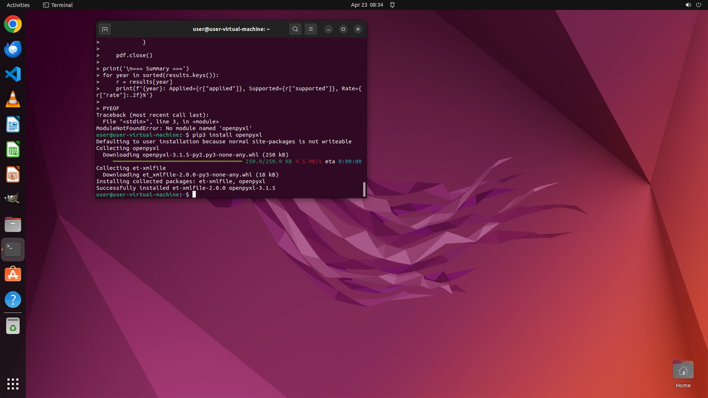

**Response:**
```
openpyxl is installed. Now let me re-read the task more carefully. The user says "organise the pass rate of the GRF applications of the CS departments of each school". This could mean per-school data. But the headers "Year", "#Applied", "#Supported", "Success Rate" suggest a single table with one row per year.

Wait - re-reading again: "the CS departments of each school" - I think "each school" refers to each university's CS department, and the data should be aggregated across all schools. The table has Year as rows.

Actually, thinking about it more carefully, the user is an HKU professor wanting insights. "CS departments of each school" might mean the aggregate data for the CS discipline (which includes CS departments from all schools). The Total column in the PDF gives exactly this.

Let me now run the full script to extract data and create the Excel file:
```

**Actions:** `import subprocess, shlex; subprocess.run(f'xdotool type --delay 12 -- ' + shlex.quote("python3 << 'PYEOF'\nimport pdfplumber\nimport re\nimp"), shell=True, check=True)
import time; time.sleep(0.05)
im`

---

## Step 26

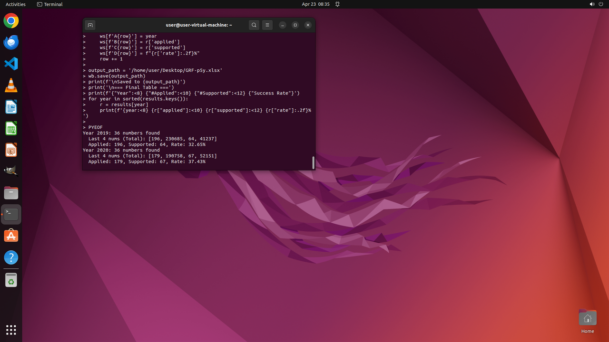

**Response:**
```
I can see data is being extracted. Let me scroll down to see the complete output.
```

**Actions:** `pyautogui.scroll(-5, 600, 300)`

---

## Step 27


**Response:**
```
The script has successfully extracted the data and created the Excel file. I can see:

- **2019**: Applied: 196, Supported: 64, Rate: 32.65%
- **2020**: Applied: 179, Supported: 67, Rate: 37.43%
- **2021**: Applied: 197, Supported: 65, Rate: 32.99%
- **2022**: Applied: 205, Supported: 66, Rate: 32.20%
- **2023**: Applied: 206, Supported: 64, Rate: 31.07%

The file "GRF-p5y.xlsx" is now visible on the desktop. Let me verify the file by opening it to make sure everything looks correct.
```

**Actions:** `import subprocess, shlex; subprocess.run(f'xdotool type --delay 12 -- ' + shlex.quote("python3 << 'PYEOF'\nimport openpyxl\nwb = openpyxl.l"), shell=True, check=True)
import time; time.sleep(0.05)
imp`

---

## Step 28

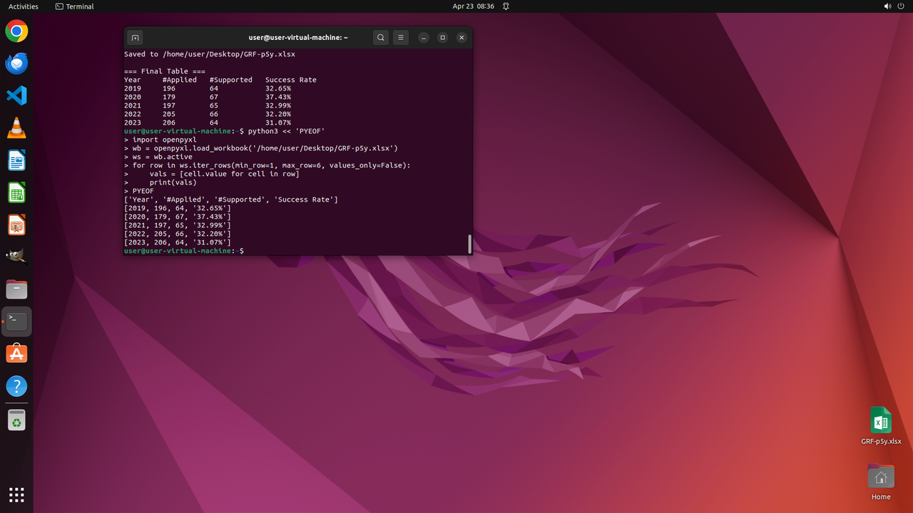

**Response:**
```
The Excel file has been created successfully and verified. The data looks correct:

| Year | #Applied | #Supported | Success Rate |
|------|----------|------------|-------------|
| 2019 | 196 | 64 | 32.65% |
| 2020 | 179 | 67 | 37.43% |
| 2021 | 197 | 65 | 32.99% |
| 2022 | 205 | 66 | 32.20% |
| 2023 | 206 | 64 | 31.07% |

The file "GRF-p5y.xlsx" has been saved to the Desktop with the correct headers ("Year", "#Applied", "#Supported", "Success Rate") and the pass rate data for GRF applications in the Computing Science discipline across all schools for 2019-2023, formatted as percentages with 2 decimal places.

DONE
```

**Actions:** `DONE`

---
