# Task 7ff48d5b-2df2-49da-b500-a5150ffc7f18

**Instruction:** I am a Chinese citizen and I want to go to Macau to watch a concert recently, but I have not yet applied for a visa for Macau. I live in Futian District, Shenzhen City. I heard that Shenzhen currently has 24-hour self-service check-in machines. Please help me find the addresses of 5 24-hour self-service check-in machines in Futian District and save them in Chinese in this open word document.

**Score:** 0.0

**Wall clock:** 8m 7s

**Steps:** 45

**Cost:** $1.59

---

## Step 1


**Response:**
```
I need to find 5 addresses of 24-hour self-service visa/permit machines (自助签注机) in Futian District, Shenzhen for applying for a Macau travel permit. Let me search for this information online.
```

**Actions:** `pyautogui.keyDown('ctrl')
pyautogui.keyDown('end')
pyautogui.keyUp('end')
pyautogui.keyUp('ctrl')`

---

## Step 2


**Response:**
```
Let me open Chrome to search for the 24-hour self-service visa machines in Futian District, Shenzhen.
```

**Actions:** `pyautogui.click(33, 64)`

---

## Step 3

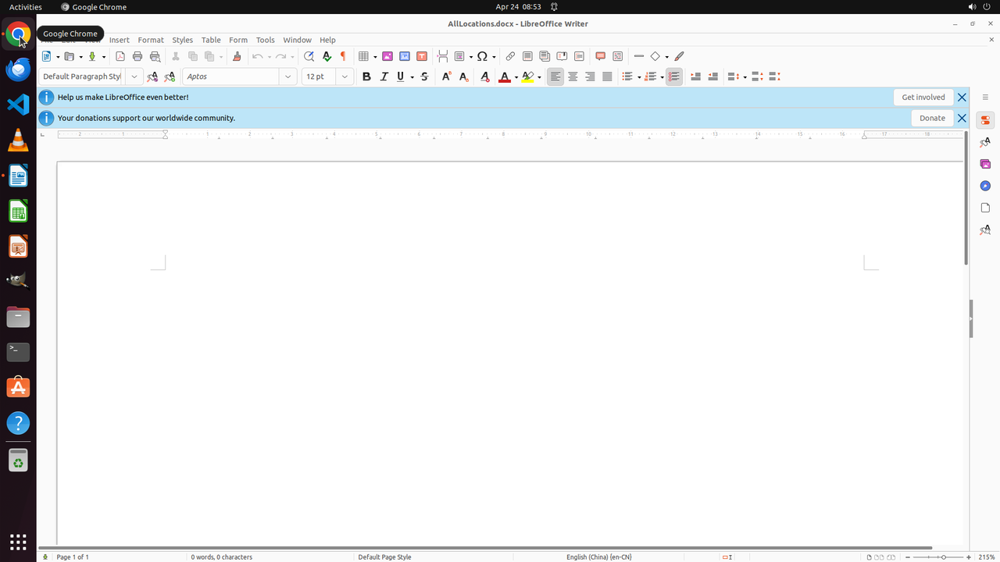

**Actions:** `pyautogui.click(132, 63)`

---

## Step 4

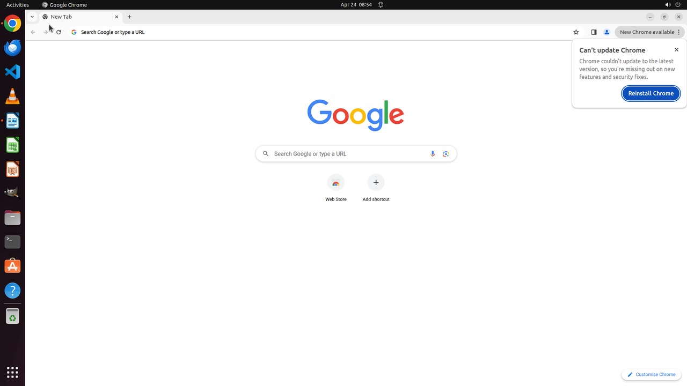

**Response:**
```
Chrome is open. Let me close the update notification and search for the 24-hour self-service visa machines in Futian District, Shenzhen.
```

**Actions:** `pyautogui.click(1888, 139)`

---

## Step 5

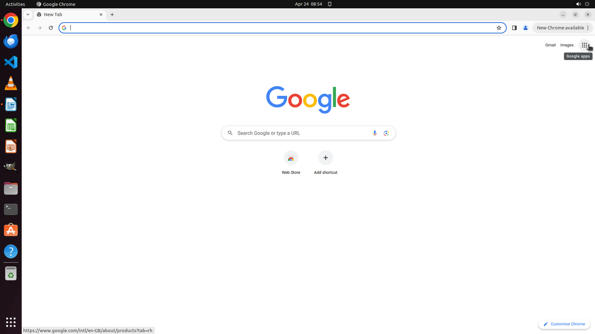

**Response:**
```
Now let me search for the 24-hour self-service visa machines in Futian District, Shenzhen.
```

**Actions:** `pyautogui.click(900, 88)`

---

## Step 6

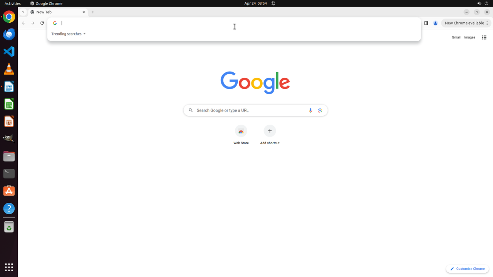

**Response:**
```
Let me search for the 24-hour self-service visa machines in Futian District, Shenzhen.
```

**Actions:** `import subprocess, shlex; subprocess.run(f'xdotool type --delay 12 -- ' + shlex.quote('深圳福田区24小时自助签注机地址'), shell=True, check=True)
import time; time.sleep(0.05)`

---

## Step 7


**Response:**
```
It seems the Chinese text didn't appear in the search bar. Let me try typing it again.
```

**Actions:** `pyautogui.click(900, 88)`

---

## Step 8

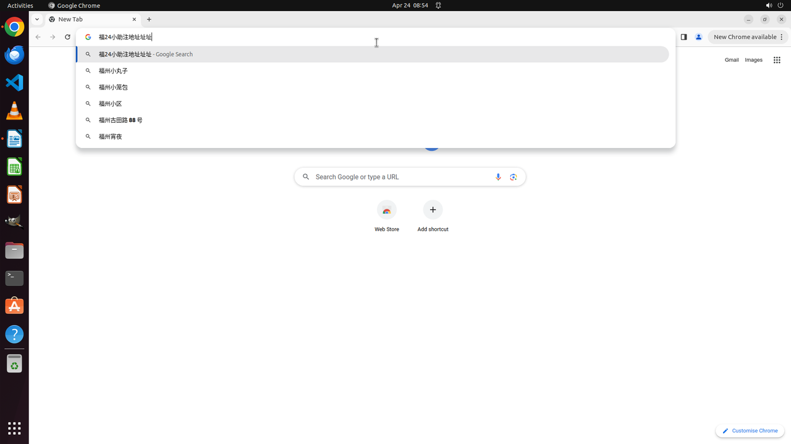

**Response:**
```
I can see the Chinese text was partially entered but it seems garbled. The text shows "福24小助注地址址址" which is not correct. Let me clear this and try a different approach. I'll use the URL bar to search in English first, or try to type the search query more carefully.
```

**Actions:** `pyautogui.tripleClick(900, 88)`

---

## Step 9

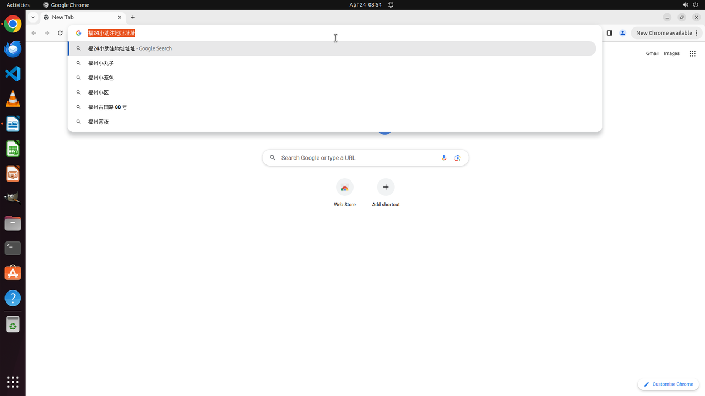

**Response:**
```
The text is selected but it's garbled. Let me clear it and try searching in English or use a direct URL approach.
```

**Actions:** `import subprocess, shlex; subprocess.run(f'xdotool type --delay 12 -- ' + shlex.quote('shenzhen futian 24 hour self-service visa machine '), shell=True, check=True)
import time; time.sleep(0.05)
impor`

---

## Step 10

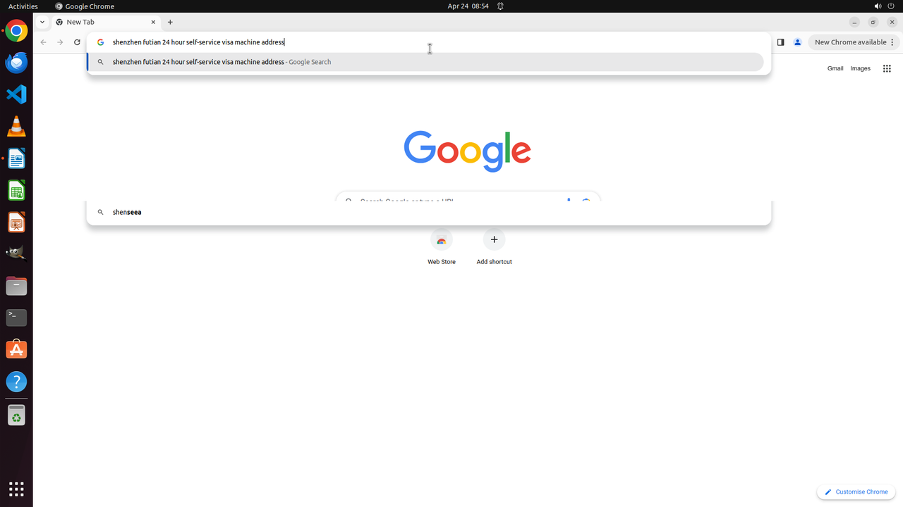

**Response:**
```
I can see the search query is typed correctly. Let me press Enter to search.
```

**Actions:** `pyautogui.keyDown('return')
pyautogui.keyUp('return')`

---

## Step 11

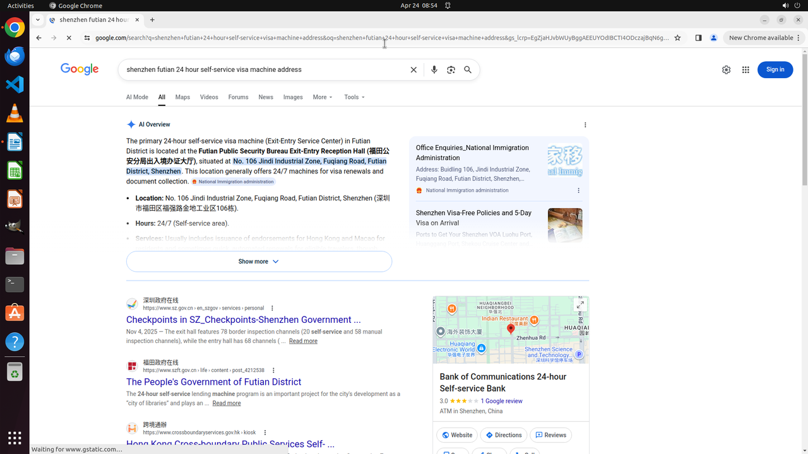

**Response:**
```
I can see some results. The AI overview mentions one location. Let me click "Show more" to see if there are more locations listed, and also scroll down to find more addresses.
```

**Actions:** `pyautogui.click(610, 621)`

---

## Step 12

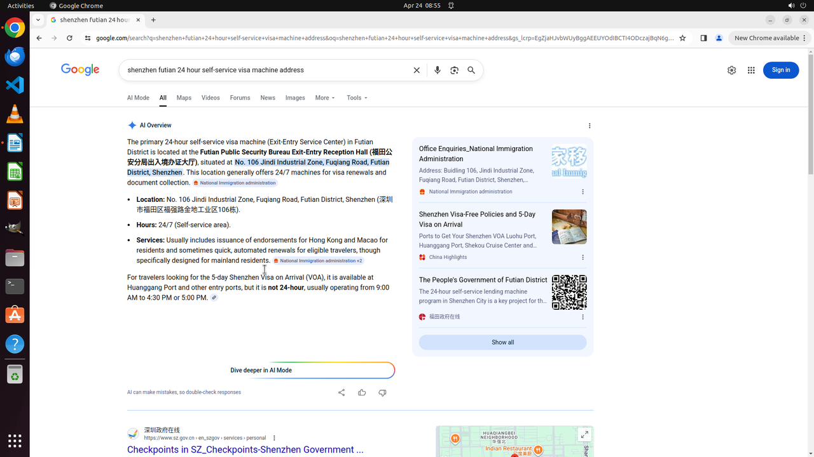

**Response:**
```
I can see the AI overview mentions one primary location: the Futian Public Security Bureau Exit-Entry Reception Hall at No. 106 Jindi Industrial Zone, Fuqiang Road, Futian District, Shenzhen. But I need 5 addresses. Let me search more specifically for multiple self-service machine locations in Futian District. Let me try a more specific search in Chinese.
```

**Actions:** `pyautogui.tripleClick(600, 165)`

---

## Step 13

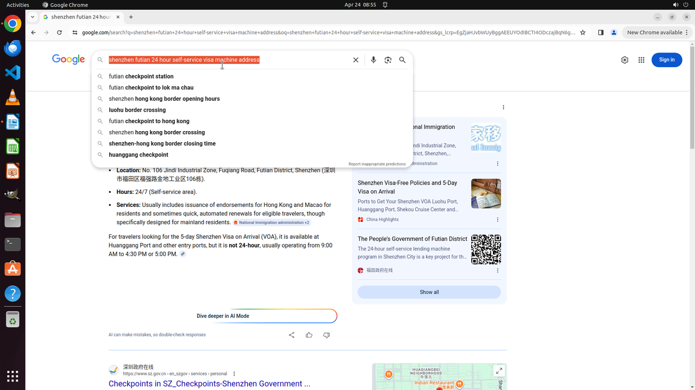

**Response:**
```
Let me search with a more specific Chinese query to find multiple 24-hour self-service visa machine locations in Futian District.
```

**Actions:** `import subprocess, shlex; subprocess.run(f'xdotool type --delay 12 -- ' + shlex.quote('https://www.google.com/search?q=%E6%B7%B1%E5%9C%B3'), shell=True, check=True)
import time; time.sleep(0.05)
impor`

---

## Step 14

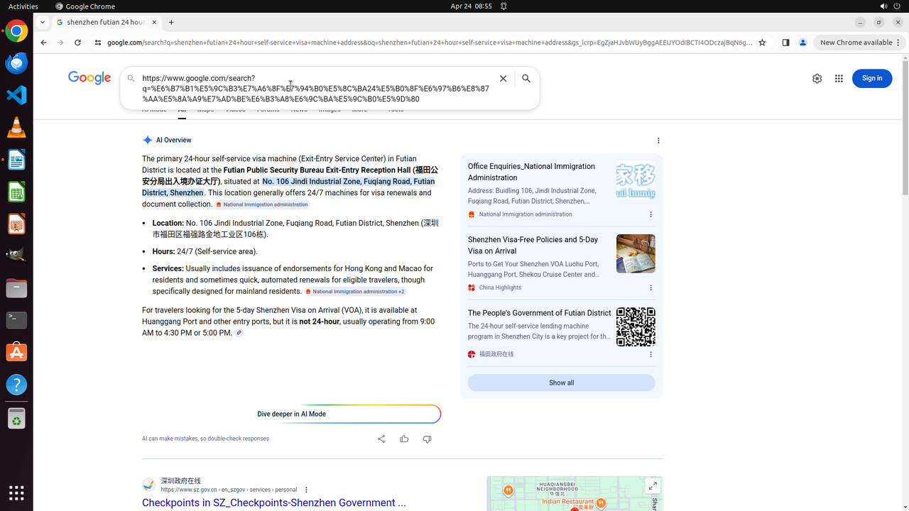

**Response:**
```
I can see the URL is in the search bar. Let me press Enter to navigate to this search.
```

**Actions:** `pyautogui.keyDown('return')
pyautogui.keyUp('return')`

---

## Step 15


**Response:**
```
The URL encoding approach didn't work well - it searched for the URL as text instead. Let me try a different approach by navigating directly to the URL.
```

**Actions:** `pyautogui.click(900, 88)`

---

## Step 16

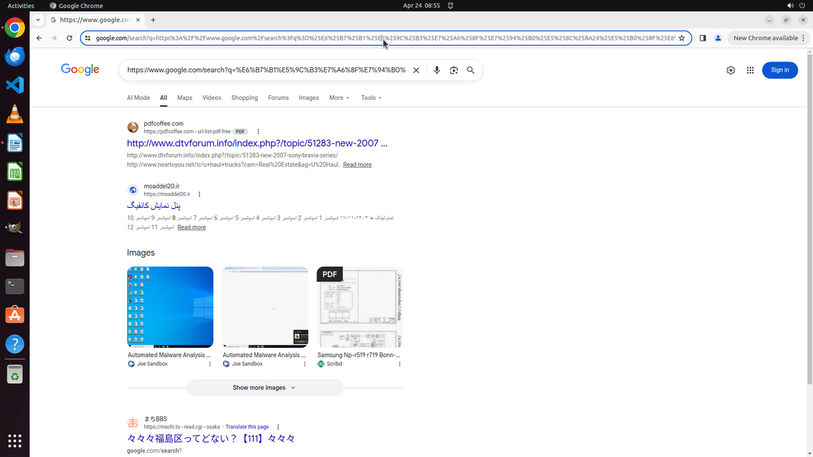

**Response:**
```
Let me try a different approach. I'll navigate directly to the Google search URL with the Chinese query properly encoded.
```

**Actions:** `pyautogui.tripleClick(900, 88)`

---

## Step 17

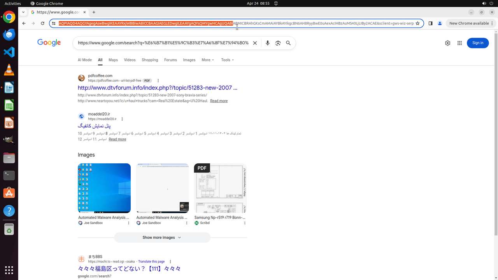

**Response:**
```
Let me try navigating directly to a Google search with the Chinese characters properly URL-encoded.
```

**Actions:** `pyautogui.keyDown('ctrl')
pyautogui.keyDown('a')
pyautogui.keyUp('a')
pyautogui.keyUp('ctrl')`

---

## Step 18


**Response:**
```
Let me try using the terminal to open the search with xdg-open or use a different approach. Let me first try using the terminal to generate the search.
```

**Actions:** `import subprocess, shlex; subprocess.run(f'xdotool type --delay 12 -- ' + shlex.quote('google.com/search?q=深圳福田区24小时自助签注机地址'), shell=True, check=True)
import time; time.sleep(0.05)`

---

## Step 19

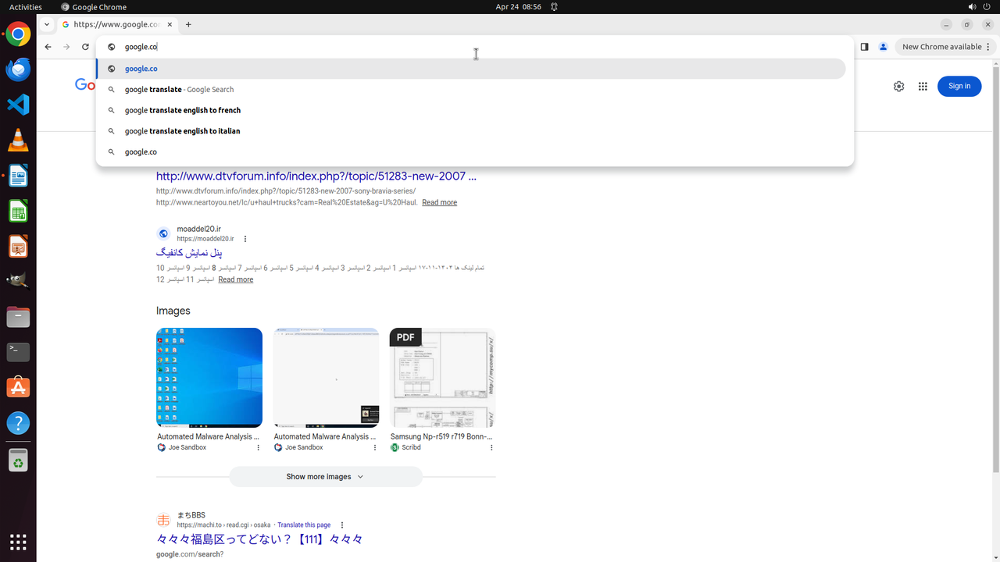

**Response:**
```
I see the Chinese characters didn't get typed properly again. The input method is not working well for Chinese. Let me try a different approach - I'll use the terminal to open the browser with the correct URL using xdg-open.
```

**Actions:** `pyautogui.keyDown('esc')
pyautogui.keyUp('esc')`

---

## Step 20


**Response:**
```
I can see the URL bar shows some Chinese characters but they're garbled. Let me try using the terminal to open the correct URL. Let me open a terminal first.
```

**Actions:** `pyautogui.keyDown('ctrl')
pyautogui.keyDown('l')
pyautogui.keyUp('l')
pyautogui.keyUp('ctrl')`

---

## Step 21


**Response:**
```
I can see the URL bar has some Chinese characters but they seem garbled. Let me try opening a terminal to use xdg-open with the properly encoded URL.
```

**Actions:** `pyautogui.keyDown('esc')
pyautogui.keyUp('esc')`

---

## Step 22


**Response:**
```
Let me try opening a terminal application to use xdg-open with the correct URL.
```

**Actions:** `pyautogui.keyDown('ctrl')
pyautogui.keyDown('alt')
pyautogui.keyDown('t')
pyautogui.keyUp('t')
pyautogui.keyUp('alt')
pyautogui.keyUp('ctrl')`

---

## Step 23

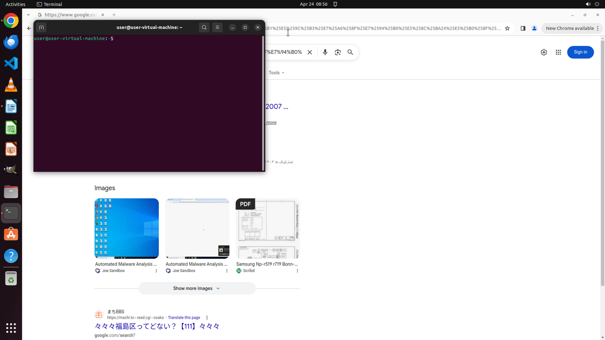

**Response:**
```
A terminal is open. Let me use it to open the Google search with the Chinese query properly encoded.
```

**Actions:** `import subprocess, shlex; subprocess.run(f'xdotool type --delay 12 -- ' + shlex.quote('xdg-open "https://www.google.com/search?q=%E6%B7%B'), shell=True, check=True)
import time; time.sleep(0.05)
impor`

---

## Step 24

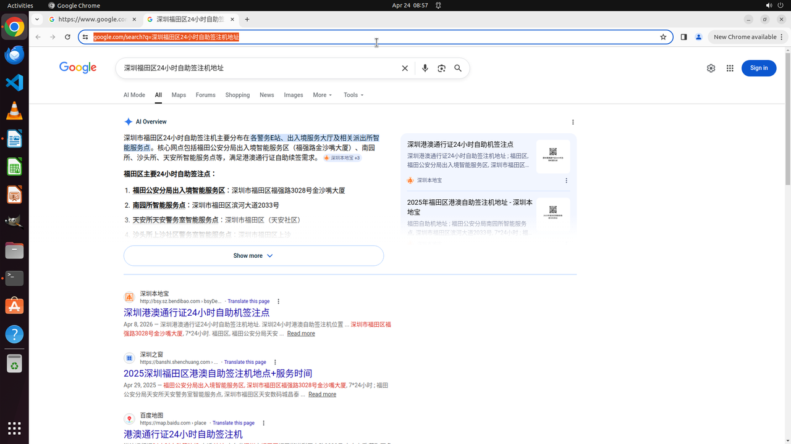

**Response:**
```
Excellent! Now I can see the search results in Chinese with relevant information about 24-hour self-service visa machines in Futian District. I can see the AI Overview already lists some locations:

1. 福田公安分局出入境智能服务区：深圳市福田区福强路3028号金沙嘴大厦
2. 南园所智能服务点：深圳市福田区滨河大道2033号
3. 天安所天安警务室智能服务点：深圳市福田区（天安社区）

Let me click "Show more" to see more addresses.
```

**Actions:** `pyautogui.click(610, 621)`

---

## Step 25

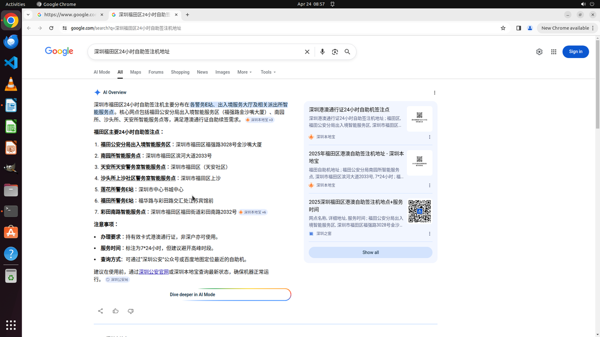

**Response:**
```
Now I can see 7 locations listed for 24-hour self-service visa machines in Futian District. I need to pick 5 of them. Let me note down the addresses:

1. 福田公安分局出入境智能服务区：深圳市福田区福强路3028号金沙嘴大厦
2. 南园所智能服务点：深圳市福田区滨河大道2033号
3. 天安所天安警务室智能服务点：深圳市福田区（天安社区）
4. 沙头所上沙社区警务室智能服务点：深圳市福田区上沙
5. 莲花所警务E站：深圳市中心书城中心
6. 福田所警务E站：福华路与彩田路交汇处xx宾馆前
7. 彩田南路智能服务点：深圳市福田区福田街道彩田南路2032号

Let me scroll down to verify these addresses and also check the linked pages for more detail. But first, let me also check the results below for more specific addresses. Some of the addresses above are incomplete (like #3 and #4). Let me click on one of the search results for more detailed information.
```

**Actions:** `pyautogui.scroll(-3, 600, 600)`

---

## Step 26

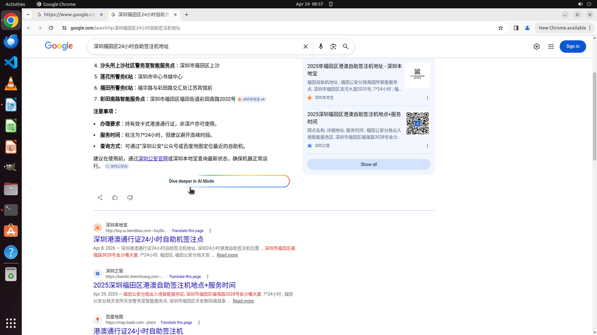

**Response:**
```
I can now see the full list. Let me click on the first search result "深圳港澳通行证24小时自助机签注点" to get more detailed addresses.
```

**Actions:** `pyautogui.click(478, 769)`

---

## Step 27

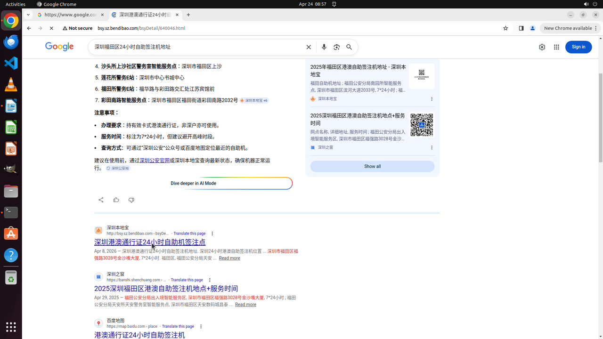

**Response:**
```
The page is loading. Let me wait for it to fully load.
```

**Actions:** `time.sleep(0.5)`

---

## Step 28

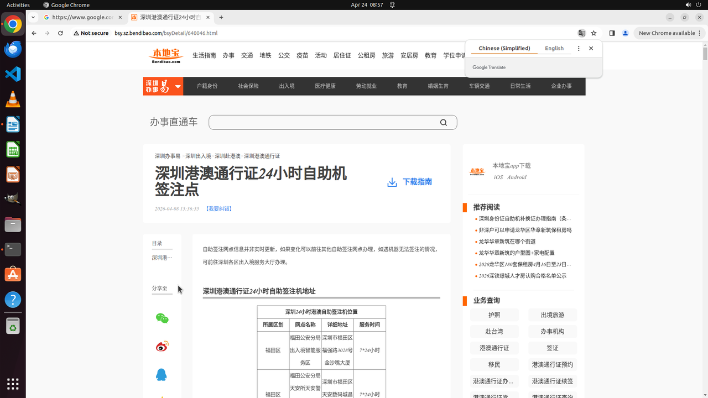

**Response:**
```
I found a detailed page with a table listing 24-hour self-service visa machine locations. I can see a table with addresses for Futian District. Let me close the translation popup and scroll down to see the full table.
```

**Actions:** `pyautogui.click(1603, 130)`

---

## Step 29

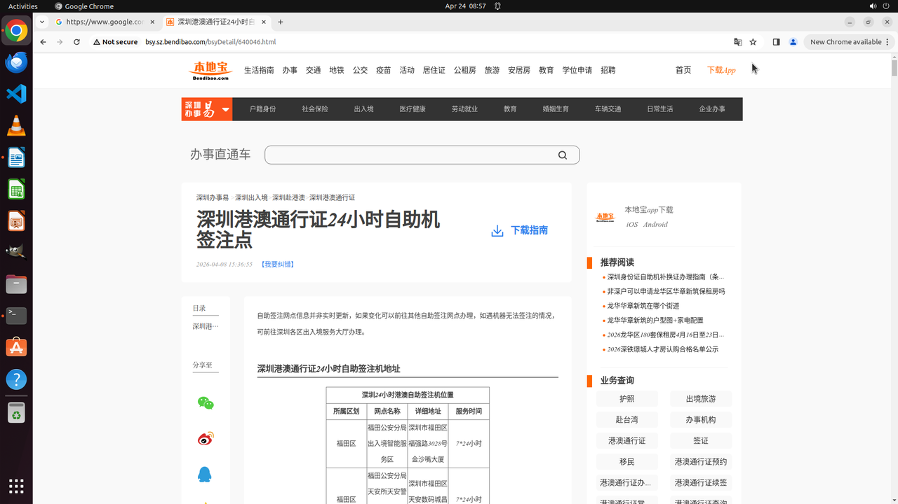

**Response:**
```
I can see a table with 24-hour self-service visa machine locations. Let me scroll down to see all the Futian District entries in the table.
```

**Actions:** `pyautogui.scroll(-5, 600, 600)`

---

## Step 30

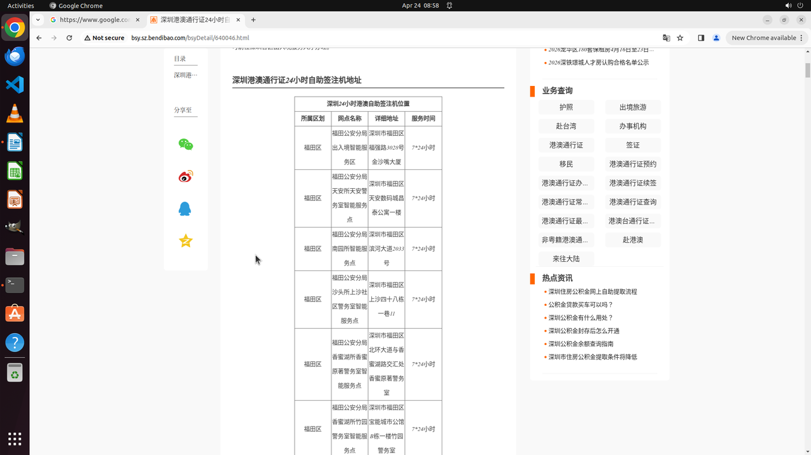

**Response:**
```
Excellent! Now I can see the table clearly with multiple Futian District locations. Let me read the addresses:

1. 福田区 - 福田公安分局出入境智能服务区 - 深圳市福田区福强路3028号金沙嘴大厦 - 7*24小时
2. 福田区 - 福田公安分局天安所天安警务室智能服务点 - 深圳市福田区天安数码城昌泰东公寓一楼 - 7*24小时
3. 福田区 - 福田公安分局南园所智能服务点 - 深圳市福田区滨河大道2033号 - 7*24小时
4. 福田区 - 福田公安分局沙头所上沙社区警务室智能服务点 - 深圳市福田区上沙四十八栋一巷11 - 7*24小时
5. 福田区 - 福田公安分局香蜜湖所香蜜原著警务室智能服务点 - 深圳市福田区北环大道与香蜜湖路交汇处香蜜原著警务室 - 7*24小时

Let me scroll down to see if there are more, and also verify the 6th entry.
```

**Actions:** `pyautogui.scroll(-3, 600, 600)`

---

## Step 31

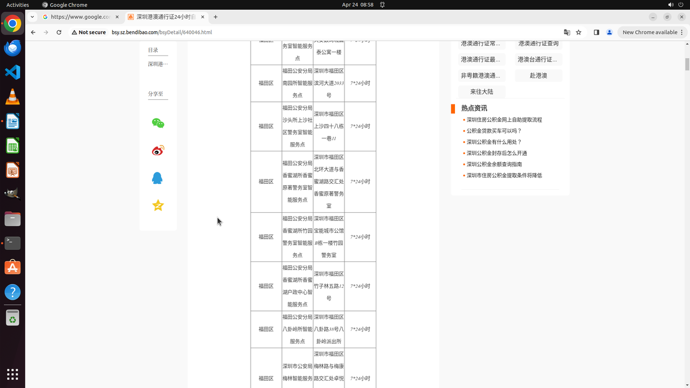

**Response:**
```
I can now see many Futian District locations. I have enough information to collect 5 addresses. Let me now compile the 5 addresses and enter them into the Word document. Let me scroll down a bit more to see all entries clearly.

Now I have 5 clear addresses for 24-hour self-service visa machines in Futian District:

1. 深圳市福田区福强路3028号金沙嘴大厦（福田公安分局出入境智能服务区）
2. 深圳市福田区天安数码城昌泰东公寓一楼（福田公安分局天安所天安警务室智能服务点）
3. 深圳市福田区滨河大道2033号（福田公安分局南园所智能服务点）
4. 深圳市福田区上沙四十八栋一巷11（福田公安分局沙头所上沙社区警务室智能服务点）
5. 深圳市福田区北环大道与香蜜湖路交汇处香蜜原著警务室（福田公安分局香蜜湖所香蜜原著警务室智能服务点）

Now let me switch to the LibreOffice Writer document and enter these addresses. Let me click on the LibreOffice Writer icon in the taskbar.
```

**Actions:** `pyautogui.click(33, 202)`

---

## Step 32

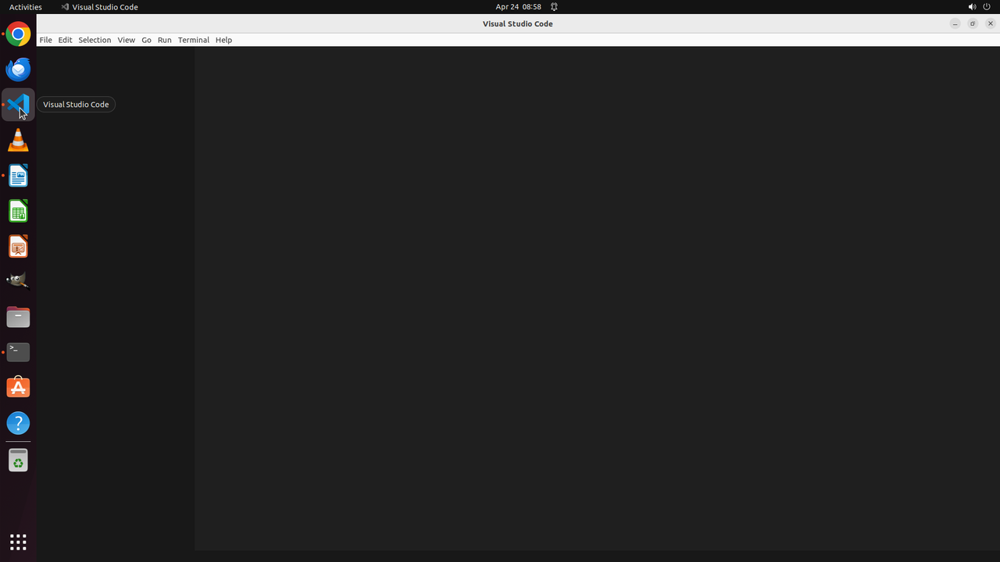

**Response:**
```
I accidentally opened Visual Studio Code. I need to find the open Word document. The task mentioned an "open word document." Let me check the taskbar for LibreOffice Writer or look for the document.
```

**Actions:** `pyautogui.click(33, 337)`

---

## Step 33


**Response:**
```
I found the open Word document "AllLocations.docx" in LibreOffice Writer. Now I need to type the 5 addresses in Chinese. Let me click on the document area and type the addresses. I'll use the terminal to help me input Chinese text since direct Chinese typing seems problematic.

Let me first try typing directly in the document. I'll click on the document area first.
```

**Actions:** `pyautogui.click(960, 600)`

---

## Step 34


**Response:**
```
Good, the cursor is now in the document. Since typing Chinese directly might not work well, let me use the terminal to write the Chinese text to the document using a Python script. Let me open the terminal.
```

**Actions:** `pyautogui.click(33, 673)`

---

## Step 35


**Response:**
```
Good, the terminal is open. Now I'll use a Python script to write the Chinese text directly to the docx file. Let me first write a Python script to add the 5 addresses to the document.
```

**Actions:** `pyautogui.click(450, 300)`

---

## Step 36

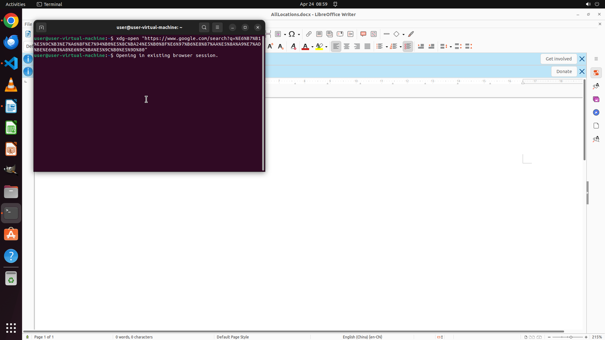

**Response:**
```
Let me first find the docx file location and then use Python to write the Chinese text to it.
```

**Actions:** `import subprocess, shlex; subprocess.run(f'xdotool type --delay 12 -- ' + shlex.quote('find /home/user -name "AllLocations.docx" 2>/dev/n'), shell=True, check=True)
import time; time.sleep(0.05)
impor`

---

## Step 37

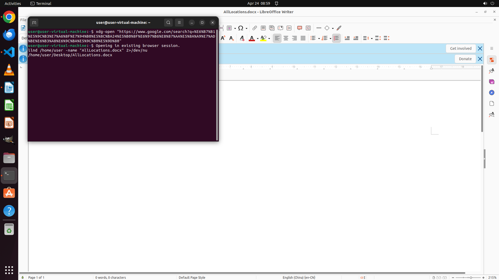

**Response:**
```
The file is at `/home/user/Desktop/AllLocations.docx`. Now I need to use Python to write the Chinese text to this file. But first, I need to close the file in LibreOffice Writer, modify it with Python, and then reopen it. Alternatively, I can use xdotool to type Chinese characters directly into the LibreOffice Writer. Let me try using Python with python-docx to write to the file. First, let me check if python-docx is installed.
```

**Actions:** `import subprocess, shlex; subprocess.run(f'xdotool type --delay 12 -- ' + shlex.quote('pip3 install python-docx 2>/dev/null | tail -1\n'), shell=True, check=True)
import time; time.sleep(0.05)`

---

## Step 38

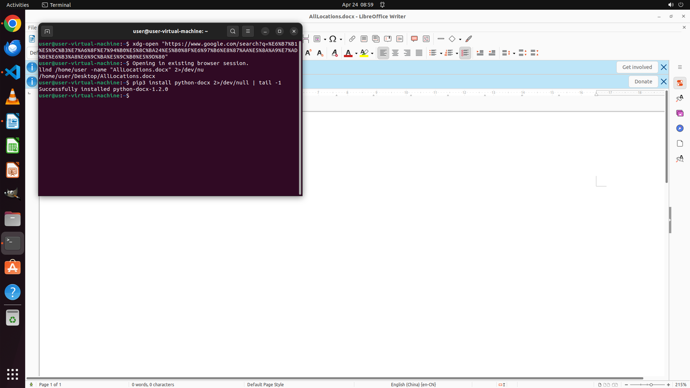

**Response:**
```
python-docx is installed. Now I need to write a Python script to add the 5 addresses to the document. But first, I should close the file in LibreOffice Writer before modifying it with Python. Let me use a different approach - I'll use xdotool to type Chinese text directly into the LibreOffice Writer using xdotool's type command which supports Unicode.
```

**Actions:** `import subprocess, shlex; subprocess.run(f'xdotool type --delay 12 -- ' + shlex.quote('python3 -c "\nfrom docx import Document\ndoc = Docum'), shell=True, check=True)
import time; time.sleep(0.05)
imp`

---

## Step 39

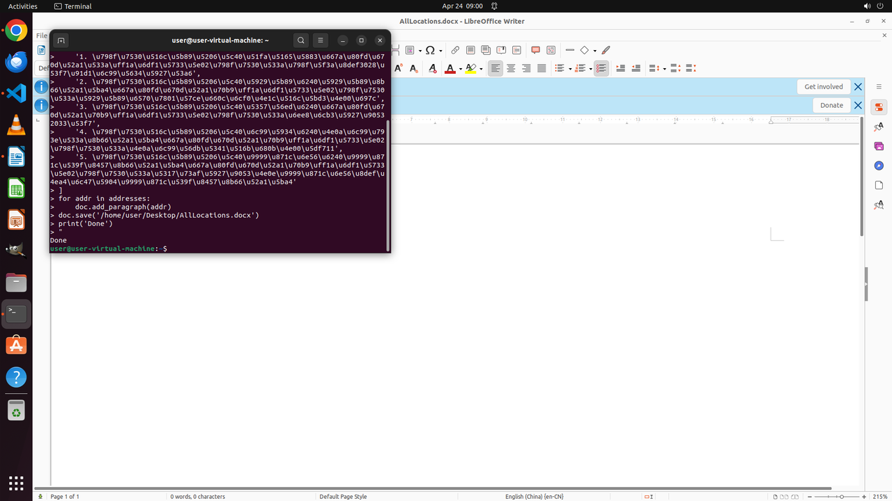

**Response:**
```
The Python script executed successfully and printed "Done". The file has been saved. However, the document is still open in LibreOffice Writer with the old version. I need to reload it. Let me switch to LibreOffice Writer and reload the document.
```

**Actions:** `pyautogui.click(33, 337)`

---

## Step 40

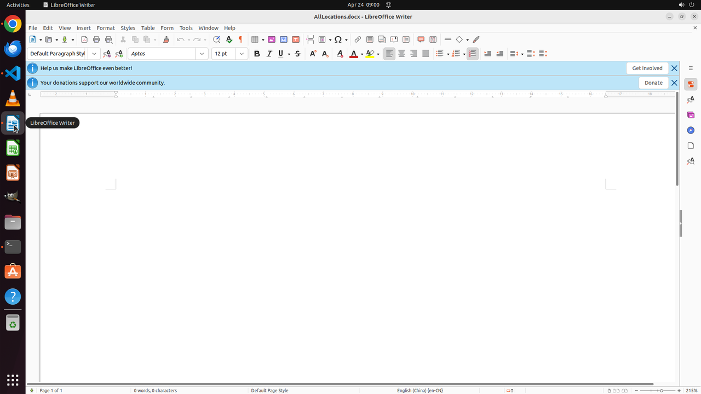

**Response:**
```
The document still shows as empty because it was open when we modified the file externally. I need to reload the document. Let me use Edit > Reload or close and reopen it.
```

**Actions:** `pyautogui.click(127, 76)`

---

## Step 41

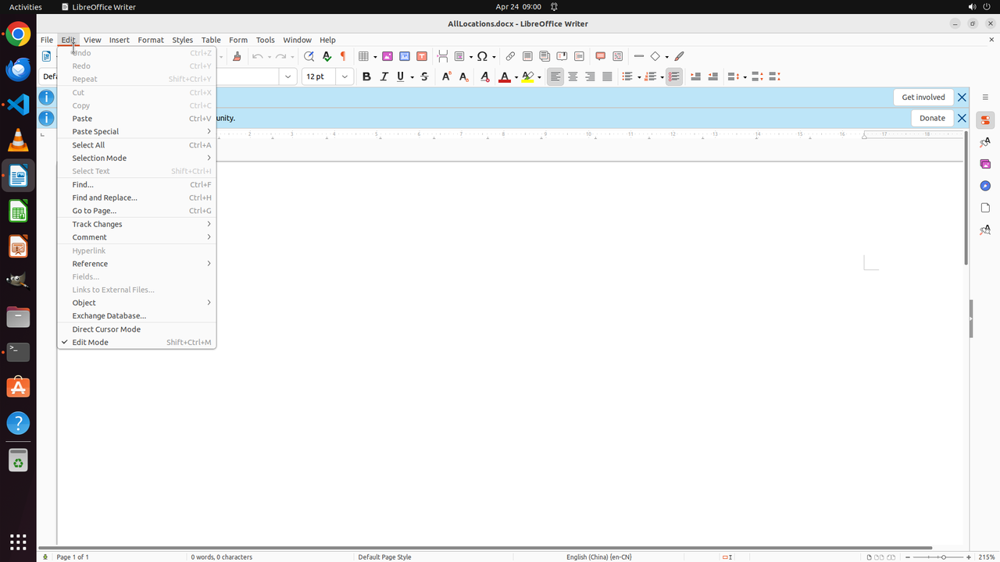

**Response:**
```
I don't see a "Reload" option in the Edit menu. Let me close this menu and try using File > Reload instead.
```

**Actions:** `pyautogui.keyDown('esc')
pyautogui.keyUp('esc')`

---

## Step 42

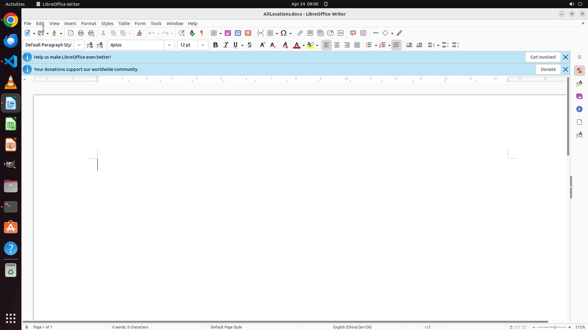

**Response:**
```
Let me try File > Reload to reload the document with the new content.
```

**Actions:** `pyautogui.click(85, 76)`

---

## Step 43

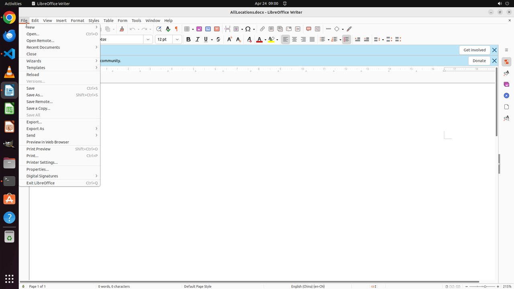

**Response:**
```
I can see the "Reload" option in the File menu. Let me click on it.
```

**Actions:** `pyautogui.click(120, 277)`

---

## Step 44


**Response:**
```
The document has been reloaded and I can see all 5 addresses in Chinese are now displayed correctly in the document:

1. 福田公安分局出入境智能服务区：深圳市福田区福强路 3028 号金沙嘴大厦
2. 福田公安分局天安所天安警务室智能服务点：深圳市福田区天安数码城昌泰东公寓一楼
3. 福田公安分局南园所智能服务点：深圳市福田区滨河大道 2033 号
4. 福田公安分局沙头所上沙社区警务室智能服务点：深圳市福田区上沙四十八栋一巷 11
5. 福田公安分局香蜜湖所香蜜原著警务室智能服务点：深圳市福田区北环大道与香蜜湖路交汇处香蜜原著警务室

Now I need to save the document. Let me press Ctrl+S to save it.
```

**Actions:** `pyautogui.keyDown('ctrl')
pyautogui.keyDown('s')
pyautogui.keyUp('s')
pyautogui.keyUp('ctrl')`

---

## Step 45

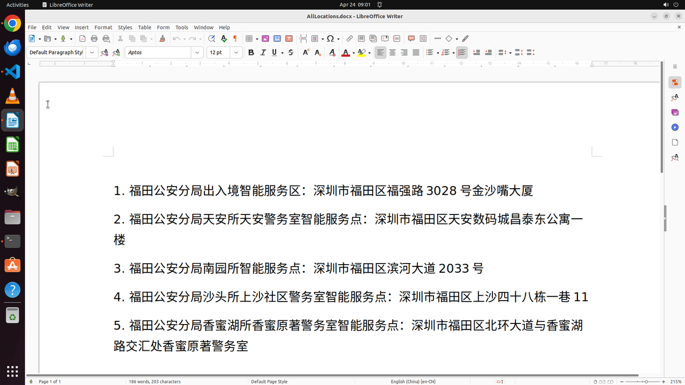

**Response:**
```
The document has been saved successfully. It might have saved in the docx format without showing a dialog since it was already a .docx file. Let me verify by checking if a format dialog appeared. It seems it saved directly. 

The document now contains the 5 addresses of 24-hour self-service visa/permit machines (24小时自助签注机) in Futian District, Shenzhen:

1. 福田公安分局出入境智能服务区：深圳市福田区福强路3028号金沙嘴大厦
2. 福田公安分局天安所天安警务室智能服务点：深圳市福田区天安数码城昌泰东公寓一楼
3. 福田公安分局南园所智能服务点：深圳市福田区滨河大道2033号
4. 福田公安分局沙头所上沙社区警务室智能服务点：深圳市福田区上沙四十八栋一巷11
5. 福田公安分局香蜜湖所香蜜原著警务室智能服务点：深圳市福田区北环大道与香蜜湖路交汇处香蜜原著警务室

DONE
```

**Actions:** `DONE`

---
