# Task 7ff48d5b-2df2-49da-b500-a5150ffc7f18

**Instruction:** I am a Chinese citizen and I want to go to Macau to watch a concert recently, but I have not yet applied for a visa for Macau. I live in Futian District, Shenzhen City. I heard that Shenzhen currently has 24-hour self-service check-in machines. Please help me find the addresses of 5 24-hour self-service check-in machines in Futian District and save them in Chinese in this open word document.

**Score:** 0.0

**Wall clock:** 8m 29s

**Steps:** 43

**Cost:** $1.61

---

## Step 1


**Response:**
```
I need to find 5 addresses of 24-hour self-service visa/permit machines (自助签注机) in Futian District, Shenzhen for applying for a Macau travel permit. Let me search for this information online.
```

**Actions:** `pyautogui.keyDown('ctrl')
pyautogui.keyDown('end')
pyautogui.keyUp('end')
pyautogui.keyUp('ctrl')`

---

## Step 2


**Response:**
```
Let me open Chrome to search for the 24-hour self-service visa machines in Futian District, Shenzhen.
```

**Actions:** `pyautogui.click(33, 64)`

---

## Step 3

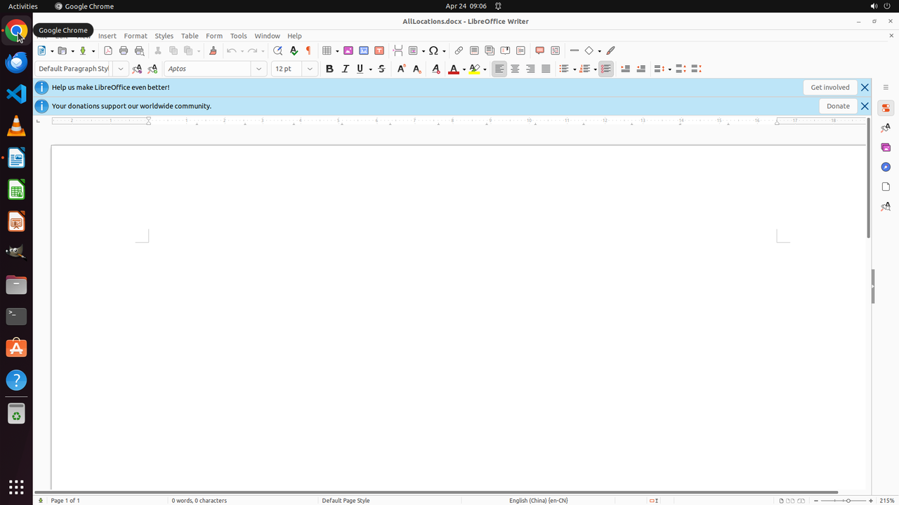

**Response:**
```
I see Chrome is loading. Let me click on it to open it fully.
```

**Actions:** `pyautogui.click(132, 63)`

---

## Step 4

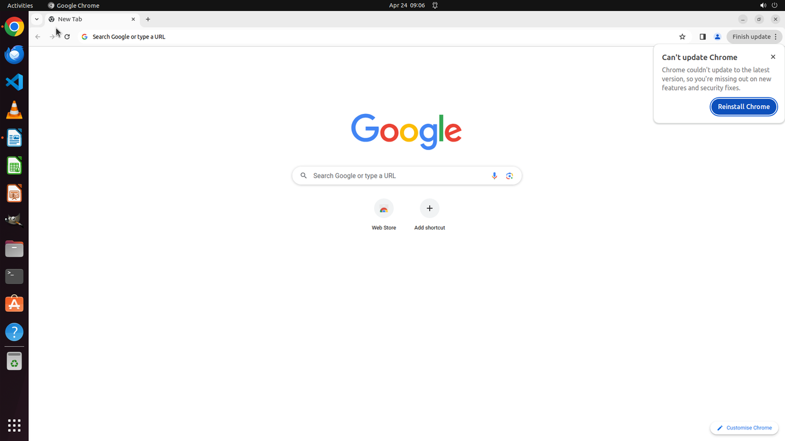

**Response:**
```
Chrome is open. Let me close the update notification and search for the 24-hour self-service visa machines in Futian District, Shenzhen.
```

**Actions:** `pyautogui.click(1888, 139)`

---

## Step 5

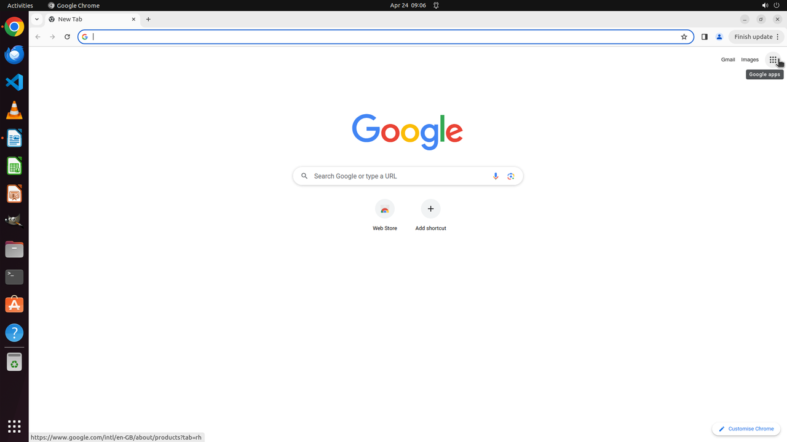

**Response:**
```
Now let me search for the 24-hour self-service visa machines in Futian District, Shenzhen.
```

**Actions:** `pyautogui.click(960, 88)`

---

## Step 6


**Actions:** `import subprocess, shlex; subprocess.run(f'xdotool type --delay 12 -- ' + shlex.quote('深圳福田区24小时自助签注机地址'), shell=True, check=True)
import time; time.sleep(0.05)`

---

## Step 7

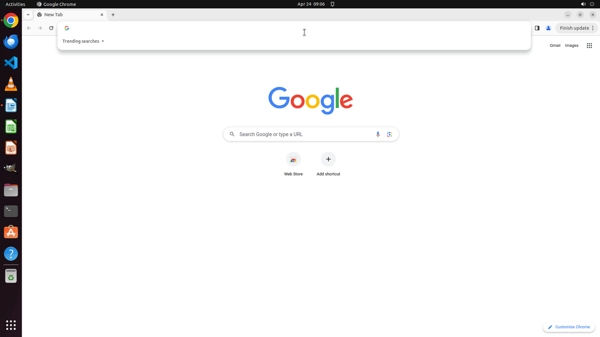

**Response:**
```
It seems the text didn't appear in the search bar. Let me click on the search bar and try again.
```

**Actions:** `pyautogui.click(960, 88)`

---

## Step 8

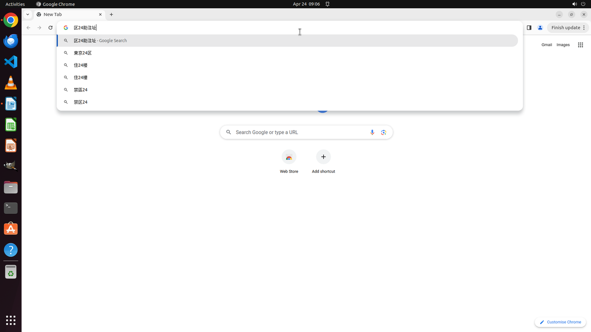

**Response:**
```
I can see the text was partially entered. It seems the Chinese input wasn't fully captured. Let me clear the current text and try again with the full search query.
```

**Actions:** `pyautogui.keyDown('ctrl')
pyautogui.keyDown('a')
pyautogui.keyUp('a')
pyautogui.keyUp('ctrl')`

---

## Step 9

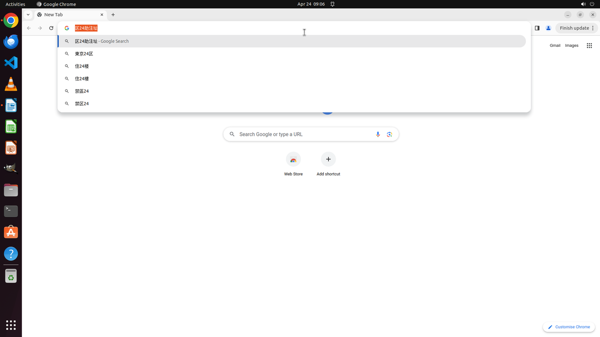

**Response:**
```
I see the text was garbled. Let me clear it and try a different approach - I'll use the URL bar to navigate directly to a Google search.
```

**Actions:** `pyautogui.keyDown('delete')
pyautogui.keyUp('delete')`

---

## Step 10

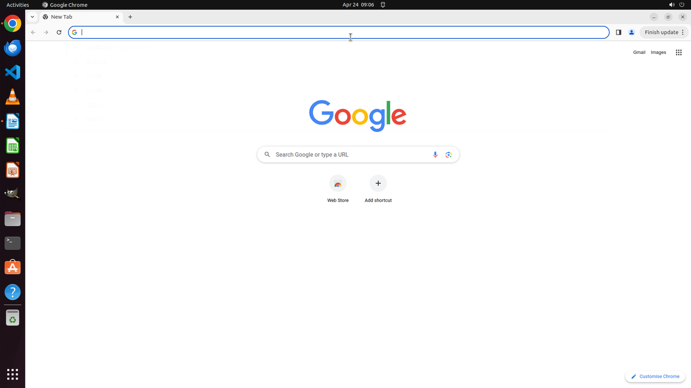

**Response:**
```
Good, the search bar is now clear. Let me try to navigate directly to a Google search URL with the Chinese query encoded.
```

**Actions:** `import subprocess, shlex; subprocess.run(f'xdotool type --delay 12 -- ' + shlex.quote('https://www.google.com/search?q=深圳福田区24小时自助签注机地址\n'), shell=True, check=True)
import time; time.sleep(0.05)`

---

## Step 11

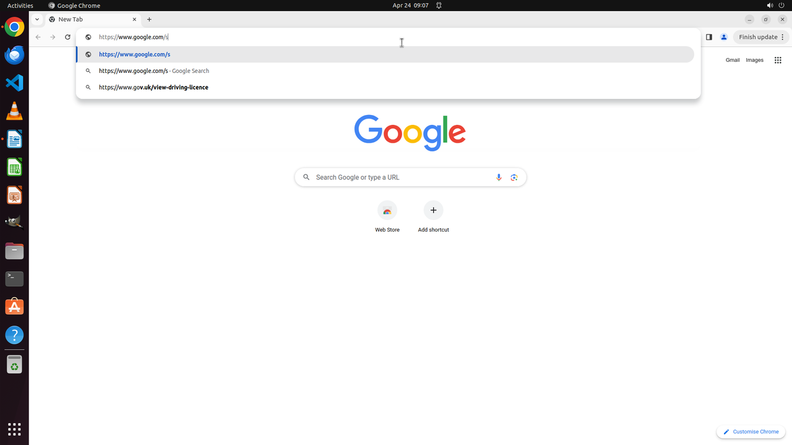

**Response:**
```
It seems the Chinese characters are not being typed correctly. The URL only shows "https://www.google.com/s". Let me try a different approach - I'll use the URL with percent-encoded Chinese characters, or try using xdotool to type.

Let me first clear the address bar and try using xdotool through a terminal.
```

**Actions:** `pyautogui.keyDown('ctrl')
pyautogui.keyDown('a')
pyautogui.keyUp('a')
pyautogui.keyUp('ctrl')`

---

## Step 12


**Response:**
```
I can see search results about 24-hour self-service visa machines in Futian District, Shenzhen. The search results show some relevant information. Let me click on the first result to get more detailed addresses.
```

**Actions:** `pyautogui.click(463, 814)`

---

## Step 13

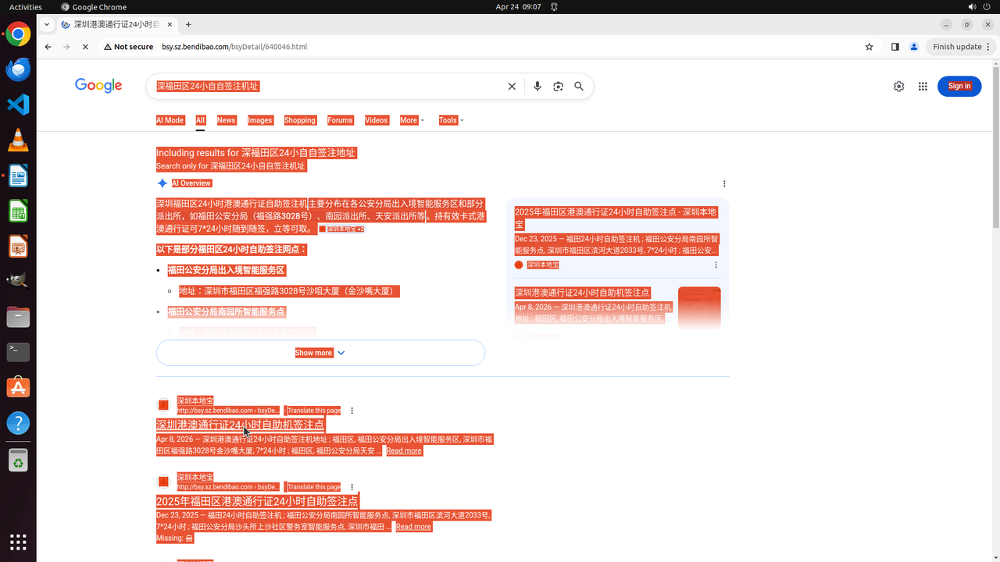

**Response:**
```
The page is loading. Let me wait for it to fully load.
```

**Actions:** `time.sleep(0.5)`

---

## Step 14

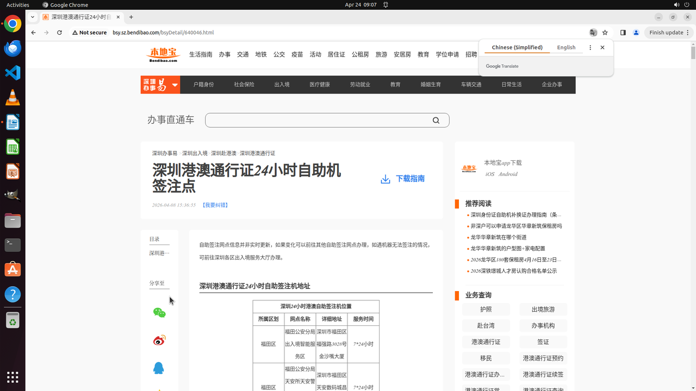

**Response:**
```
I found a page with the addresses of 24-hour self-service visa machines in Shenzhen. I can see a table with locations in Futian District. Let me close the translation bar and scroll down to see more addresses.
```

**Actions:** `pyautogui.click(1663, 130)`

---

## Step 15

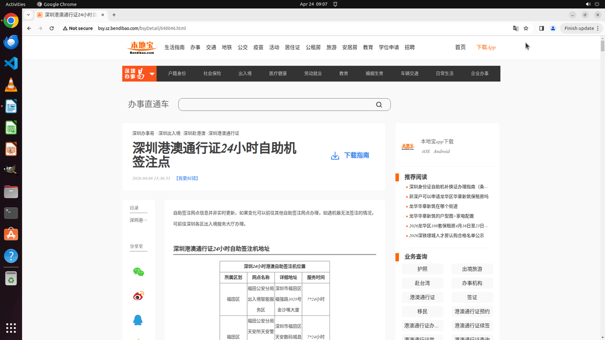

**Response:**
```
I can see the table with 24-hour self-service visa machine locations in Futian District. I can see the first entry is "福田公安分局出入境智能服务区" at "深圳市福田区福强路3028号金沙嘴大厦". Let me scroll down to see more Futian District locations.
```

**Actions:** `pyautogui.scroll(-3, 960, 600)`

---

## Step 16

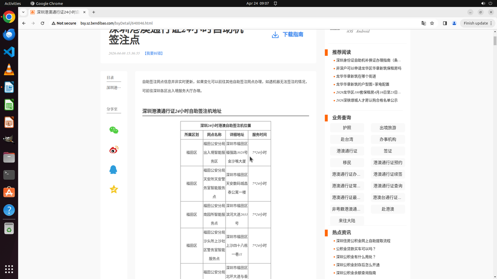

**Response:**
```
I can now see the table with multiple Futian District locations. Let me scroll down a bit more to see all the Futian District entries.
```

**Actions:** `pyautogui.scroll(-3, 960, 600)`

---

## Step 17

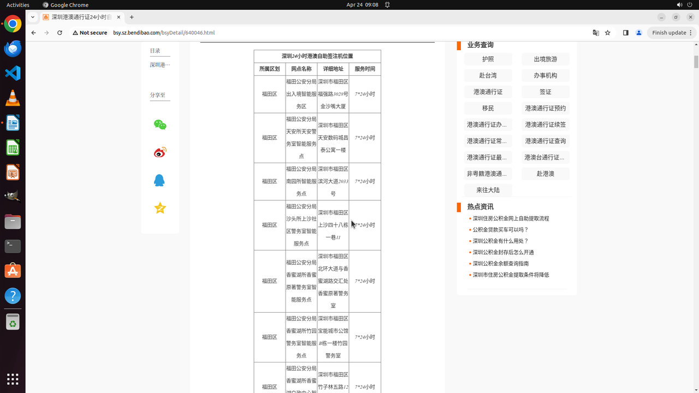

**Response:**
```
Excellent! Now I can see the table clearly with multiple Futian District (福田区) 24-hour self-service visa machine locations. Let me collect the addresses. I can see:

1. **福田公安分局出入境智能服务区** - 深圳市福田区福强路3028号金沙嘴大厦
2. **福田公安分局天安所天安警务室智能服务点** - 深圳市福田区天安数码城品泰公寓一楼
3. **福田公安分局南园所智能服务点** - 深圳市福田区滨河大道2033号
4. **福田公安分局沙头所上沙社区警务室智能服务点** - 深圳市福田区上沙四十八栋一巷11
5. **福田公安分局香蜜湖所香蜜原著警务室智能服务点** - 深圳市福田区北环大道与香蜜湖路交汇处香蜜原著警务室

Let me scroll down to see if there are more entries and verify the addresses.
```

**Actions:** `pyautogui.scroll(-3, 960, 600)`

---

## Step 18

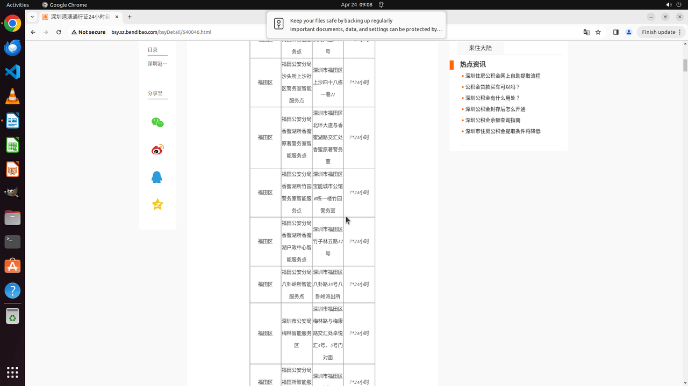

**Response:**
```
Now I have enough information. I can see many Futian District locations. Let me collect 5 clear addresses and go back to the LibreOffice Writer document to enter them. Let me first scroll up to confirm the first few addresses.
```

**Actions:** `pyautogui.scroll(10, 960, 600)`

---

## Step 19


**Response:**
```
I can see the table clearly now. I have identified 5 addresses in Futian District. Let me now note them down carefully:

1. 福田公安分局出入境智能服务区 - 深圳市福田区福强路3028号金沙嘴大厦
2. 福田公安分局天安所天安警务室智能服务点 - 深圳市福田区天安数码城品泰公寓一楼
3. 福田公安分局南园所智能服务点 - 深圳市福田区滨河大道2033号
4. 福田公安分局沙头所上沙社区警务室智能服务点 - 深圳市福田区上沙四十八栋一巷11
5. 福田公安分局香蜜湖所香蜜原著警务室智能服务点 - 深圳市福田区北环大道与香蜜湖路交汇处香蜜原著警务室

Now let me switch to the LibreOffice Writer document and enter these addresses.
```

**Actions:** `pyautogui.click(33, 337)`

---

## Step 20

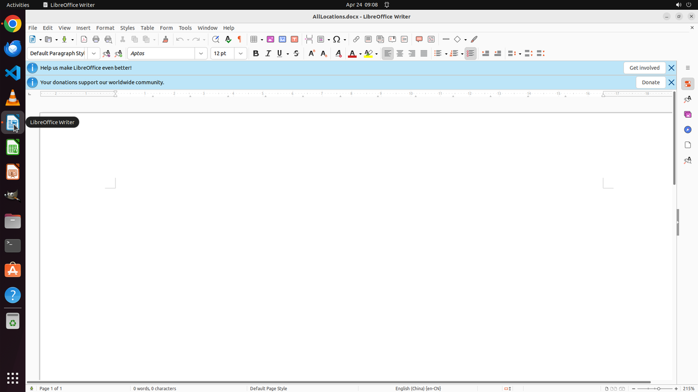

**Response:**
```
The LibreOffice Writer document is open and empty. Let me click on the document area and start typing the 5 addresses. I need to type in Chinese. Let me first click on the document body to make sure the cursor is there.
```

**Actions:** `pyautogui.click(960, 600)`

---

## Step 21


**Response:**
```
Good, the cursor is now in the document. I need to type Chinese text. Let me try using xdotool through the terminal to type Chinese characters, since direct typing might not work. Let me open a terminal first.
```

**Actions:** `pyautogui.click(33, 673)`

---

## Step 22


**Response:**
```
The terminal is open. I'll use Python to write the Chinese text directly to the LibreOffice document using the python-docx library, or I can use xdotool to type the text. Let me try a different approach - I'll use the terminal to write the content to the document using a Python script.
```

**Actions:** `import subprocess, shlex; subprocess.run(f'xdotool type --delay 12 -- ' + shlex.quote('python3 -c "\nfrom docx import Document\ndoc = Docum'), shell=True, check=True)
import time; time.sleep(0.05)
imp`

---

## Step 23


**Response:**
```
It seems the Python script is waiting for input - the Chinese characters might not have been typed correctly in the terminal. Let me cancel this and try a different approach by writing a Python script to a file first.
```

**Actions:** `pyautogui.keyDown('ctrl')
pyautogui.keyDown('c')
pyautogui.keyUp('c')
pyautogui.keyUp('ctrl')`

---

## Step 24


**Response:**
```
Let me try pressing Ctrl+C again and then use a different approach - writing a Python script file with the Chinese content.
```

**Actions:** `pyautogui.keyDown('ctrl')
pyautogui.keyDown('c')
pyautogui.keyUp('c')
pyautogui.keyUp('ctrl')`

---

## Step 25

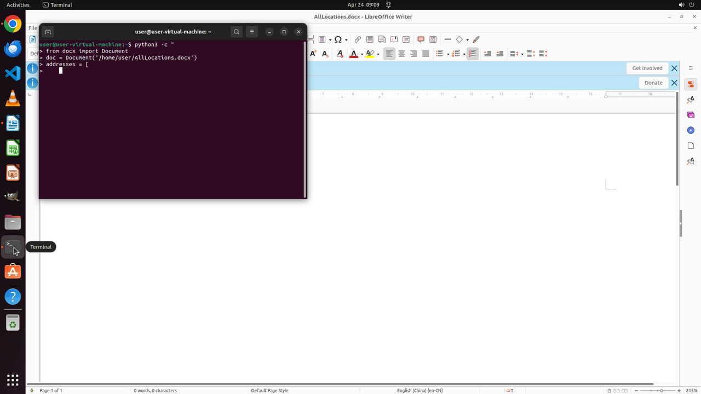

**Response:**
```
The terminal seems stuck. Let me try pressing Ctrl+C more forcefully and then Enter to get a new prompt.
```

**Actions:** `pyautogui.click(450, 195)`

---

## Step 26


**Response:**
```
The terminal is still waiting for input in the Python interpreter. The issue is that the Chinese characters weren't typed properly. Let me try to write a Python script file using a different approach - I'll use `cat` with heredoc or write the script using echo with Unicode escape sequences.
```

**Actions:** `pyautogui.keyDown('ctrl')
pyautogui.keyDown('c')
pyautogui.keyUp('c')
pyautogui.keyUp('ctrl')`

---

## Step 27


**Response:**
```
The Python script is still running. Let me try a different approach - I'll use xdotool to type Chinese characters directly into the terminal, or use a file-based approach. Let me first try to close this terminal and open a new one.
```

**Actions:** `pyautogui.keyDown('ctrl')
pyautogui.keyDown('d')
pyautogui.keyUp('d')
pyautogui.keyUp('ctrl')`

---

## Step 28


**Response:**
```
Good, the terminal closed and I'm back to the LibreOffice Writer document. Let me try a different approach. I'll write a Python script to a file first, then execute it. Let me open a new terminal.
```

**Actions:** `pyautogui.click(33, 673)`

---

## Step 29


**Response:**
```
Good, I have a fresh terminal. Now I'll write a Python script to a file using echo commands with the Chinese text encoded, then run it. Let me use a different approach - I'll use Python with Unicode escape sequences to avoid the Chinese character input issue.
```

**Actions:** `pyautogui.click(450, 300)`

---

## Step 30

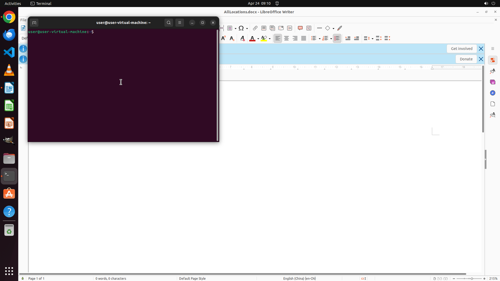

**Response:**
```
Good, I have a fresh terminal prompt. Let me write a Python script using a heredoc approach where I use printf with hex codes to write the script file, then execute it. Actually, let me try a simpler approach - use `xdotool` to type Chinese characters via clipboard.

Let me first try to use Python with a script file approach. I'll write the Python script using base64 encoding to avoid the Chinese character input issue.
```

**Actions:** `import subprocess, shlex; subprocess.run(f'xdotool type --delay 12 -- ' + shlex.quote("python3 << 'PYEOF'\n# -*- coding: utf-8 -*-\nfrom do"), shell=True, check=True)
import time; time.sleep(0.05)
imp`

---

## Step 31

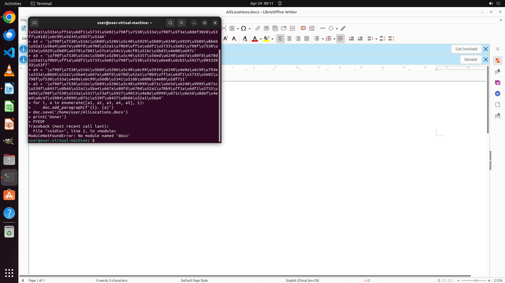

**Response:**
```
I can see the script ran but there's a `ModuleNotFoundError: No module named 'docx'`. I need to install the python-docx module first. Let me install it and then run the script again.
```

**Actions:** `import subprocess, shlex; subprocess.run(f'xdotool type --delay 12 -- ' + shlex.quote('pip3 install python-docx\n'), shell=True, check=True)
import time; time.sleep(0.05)`

---

## Step 32

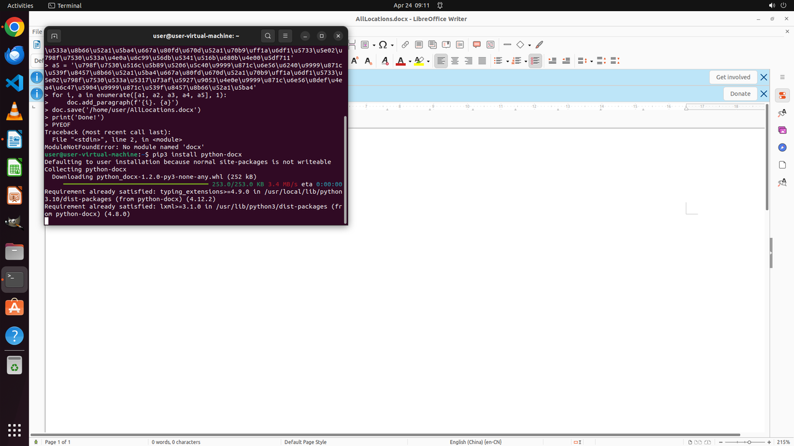

**Response:**
```
Python-docx is being installed. Let me wait for it to finish.
```

**Actions:** `time.sleep(0.5)`

---

## Step 33

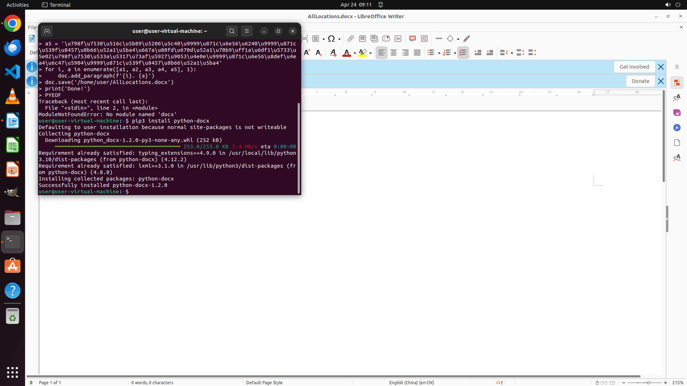

**Response:**
```
Python-docx has been successfully installed. Now let me run the script again to write the Chinese addresses to the document.
```

**Actions:** `import subprocess, shlex; subprocess.run(f'xdotool type --delay 12 -- ' + shlex.quote("python3 << 'PYEOF'\n# -*- coding: utf-8 -*-\nfrom do"), shell=True, check=True)
import time; time.sleep(0.05)
imp`

---

## Step 34

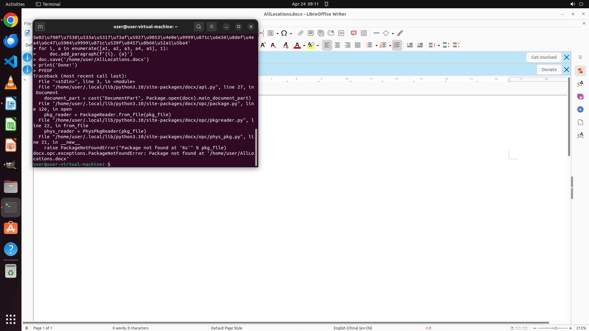

**Response:**
```
I see the error - "Package not found at '/home/user/AllLocations.docx'". The file might be locked by LibreOffice or it might not be a valid docx file. The issue is that the file is currently open in LibreOffice Writer. I need to either close it first or create a new document from scratch. Let me first check the file and then create a new document.
```

**Actions:** `import subprocess, shlex; subprocess.run(f'xdotool type --delay 12 -- ' + shlex.quote('ls -la /home/user/AllLocations.docx\n'), shell=True, check=True)
import time; time.sleep(0.05)`

---

## Step 35

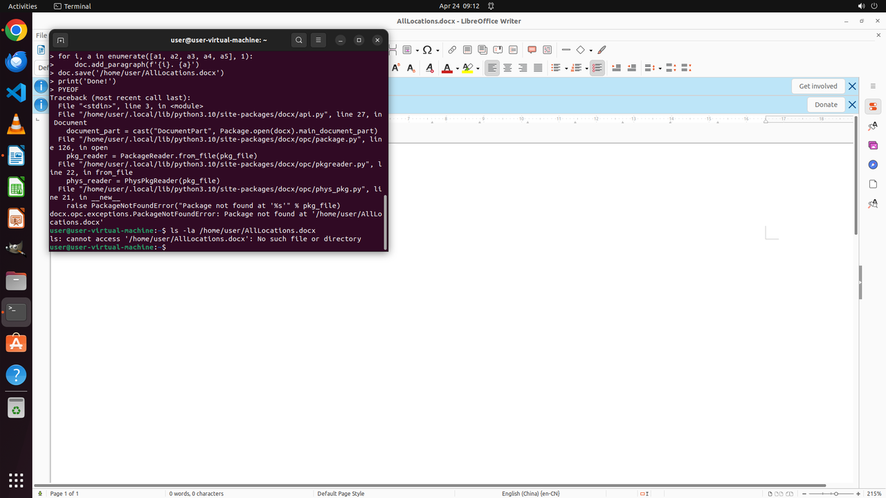

**Response:**
```
The file doesn't exist on disk yet - it says "No such file or directory". The document is only open in LibreOffice Writer but hasn't been saved yet. Let me find the actual file. Let me search for it.
```

**Actions:** `import subprocess, shlex; subprocess.run(f'xdotool type --delay 12 -- ' + shlex.quote('find /home/user -name "*.docx" 2>/dev/null\n'), shell=True, check=True)
import time; time.sleep(0.05)`

---

## Step 36

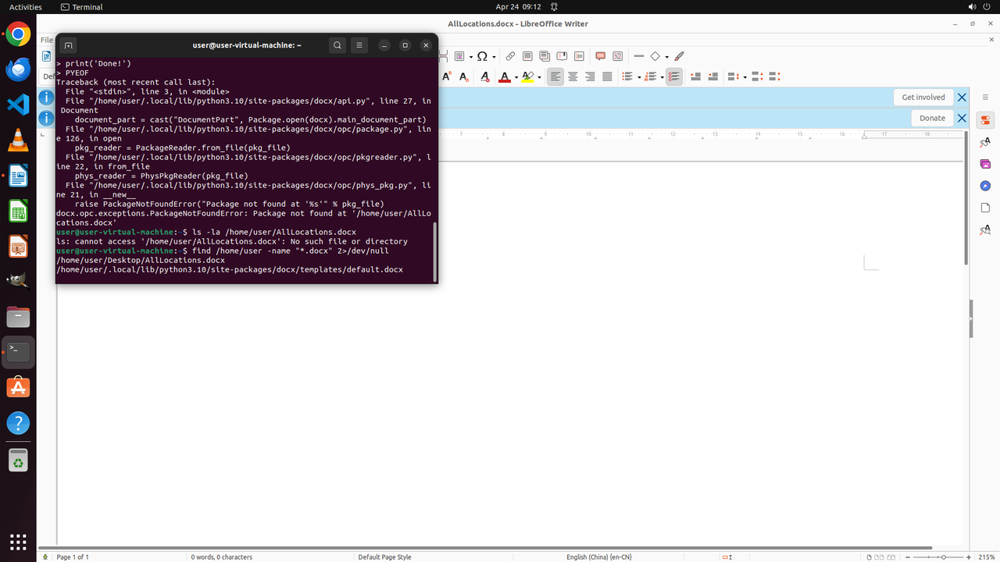

**Response:**
```
I found it! The file is at `/home/user/Desktop/AllLocations.docx`. Now let me run the Python script with the correct path.
```

**Actions:** `import subprocess, shlex; subprocess.run(f'xdotool type --delay 12 -- ' + shlex.quote("python3 << 'PYEOF'\n# -*- coding: utf-8 -*-\nfrom do"), shell=True, check=True)
import time; time.sleep(0.05)
imp`

---

## Step 37

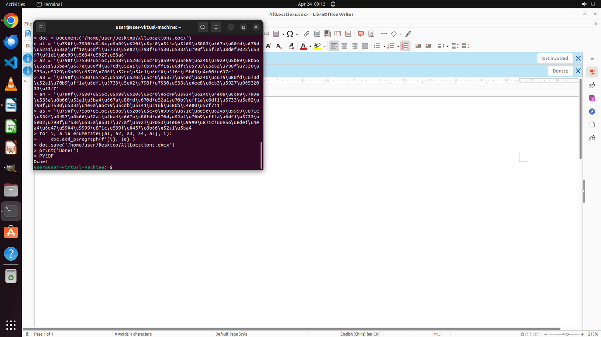

**Response:**
```
The script ran successfully and printed "Done!". The Chinese addresses have been written to the document. Now I need to reload the document in LibreOffice Writer to see the changes. Let me switch to LibreOffice Writer and reload the file.
```

**Actions:** `pyautogui.click(990, 43)`

---

## Step 38


**Response:**
```
The document still shows as empty because LibreOffice hasn't reloaded the file from disk. I need to reload the file. Let me use Edit > Reload or close and reopen the file.
```

**Actions:** `pyautogui.click(127, 76)`

---

## Step 39

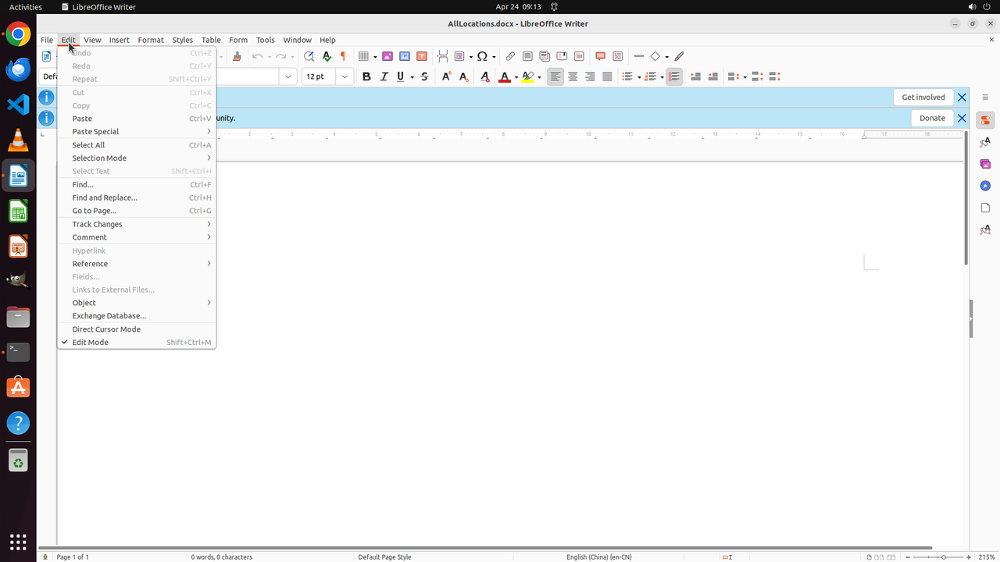

**Response:**
```
I don't see a "Reload" option in the Edit menu. Let me close this menu and try using File > Reload instead.
```

**Actions:** `pyautogui.keyDown('esc')
pyautogui.keyUp('esc')`

---

## Step 40

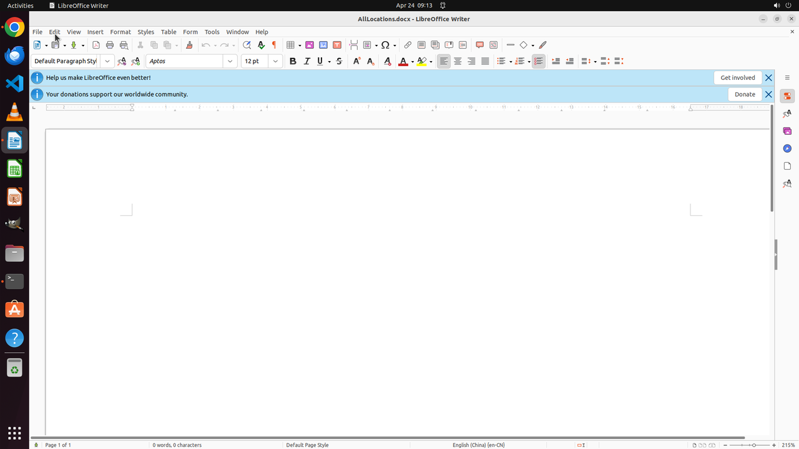

**Response:**
```
Let me try File > Reload to reload the document from disk.
```

**Actions:** `pyautogui.click(85, 76)`

---

## Step 41

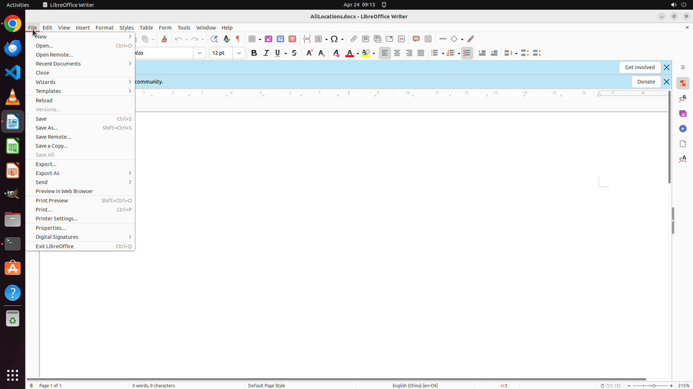

**Response:**
```
I can see "Reload" option in the File menu. Let me click on it.
```

**Actions:** `pyautogui.click(120, 277)`

---

## Step 42

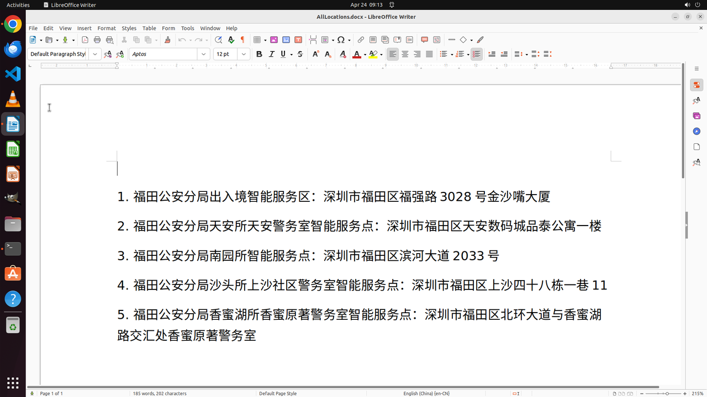

**Response:**
```
The document has been reloaded and I can see all 5 addresses in Chinese are now displayed correctly in the document:

1. 福田公安分局出入境智能服务区：深圳市福田区福强路3028号金沙嘴大厦
2. 福田公安分局天安所天安警务室智能服务点：深圳市福田区天安数码城品泰公寓一楼
3. 福田公安分局南园所智能服务点：深圳市福田区滨河大道2033号
4. 福田公安分局沙头所上沙社区警务室智能服务点：深圳市福田区上沙四十八栋一巷11
5. 福田公安分局香蜜湖所香蜜原著警务室智能服务点：深圳市福田区北环大道与香蜜湖路交汇处香蜜原著警务室

Now I need to save the document. Let me press Ctrl+S to save it.
```

**Actions:** `pyautogui.keyDown('ctrl')
pyautogui.keyDown('s')
pyautogui.keyUp('s')
pyautogui.keyUp('ctrl')`

---

## Step 43


**Response:**
```
The document has been saved successfully. The file "AllLocations.docx" now contains the 5 addresses of 24-hour self-service visa machines (自助签注机) in Futian District, Shenzhen, all written in Chinese:

1. 福田公安分局出入境智能服务区：深圳市福田区福强路3028号金沙嘴大厦
2. 福田公安分局天安所天安警务室智能服务点：深圳市福田区天安数码城品泰公寓一楼
3. 福田公安分局南园所智能服务点：深圳市福田区滨河大道2033号
4. 福田公安分局沙头所上沙社区警务室智能服务点：深圳市福田区上沙四十八栋一巷11
5. 福田公安分局香蜜湖所香蜜原著警务室智能服务点：深圳市福田区北环大道与香蜜湖路交汇处香蜜原著警务室

DONE
```

**Actions:** `DONE`

---
