# Task 7ff48d5b-2df2-49da-b500-a5150ffc7f18

**Instruction:** I am a Chinese citizen and I want to go to Macau to watch a concert recently, but I have not yet applied for a visa for Macau. I live in Futian District, Shenzhen City. I heard that Shenzhen currently has 24-hour self-service check-in machines. Please help me find the addresses of 5 24-hour self-service check-in machines in Futian District and save them in Chinese in this open word document.

**Score:** 0.0

**Wall clock:** 11m 50s

**Steps:** 58

**Cost:** $2.23

---

## Step 1


**Response:**
```
I need to find 5 addresses of 24-hour self-service visa/permit machines (自助签注机) in Futian District, Shenzhen for applying for a Macau travel permit. Let me search for this information online.
```

**Actions:** `pyautogui.keyDown('ctrl')
pyautogui.keyDown('end')
pyautogui.keyUp('end')
pyautogui.keyUp('ctrl')`

---

## Step 2


**Response:**
```
Let me open Chrome to search for the 24-hour self-service visa machines in Futian District, Shenzhen.
```

**Actions:** `pyautogui.click(33, 64)`

---

## Step 3

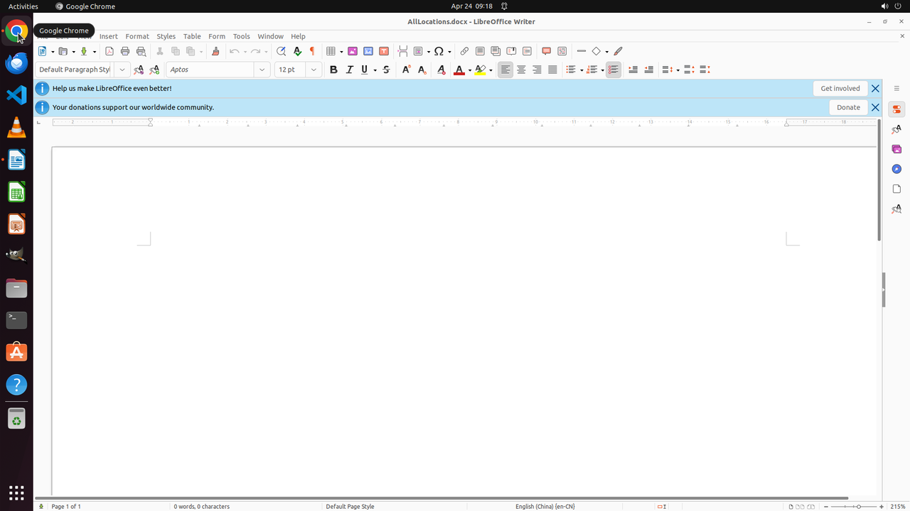

**Actions:** `pyautogui.click(132, 63)`

---

## Step 4

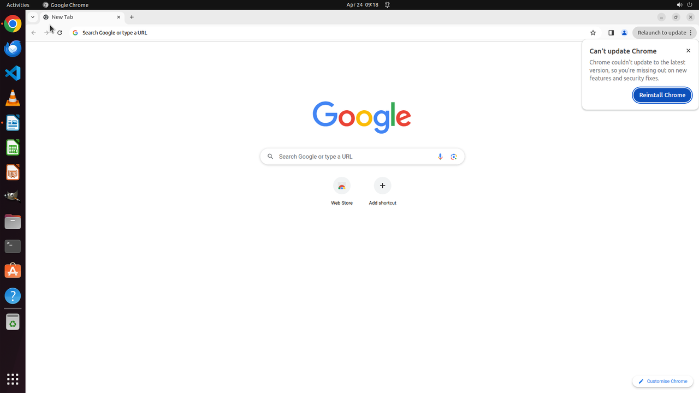

**Response:**
```
Chrome is open. Let me search for 24-hour self-service visa machines in Futian District, Shenzhen.
```

**Actions:** `pyautogui.click(990, 430)`

---

## Step 5

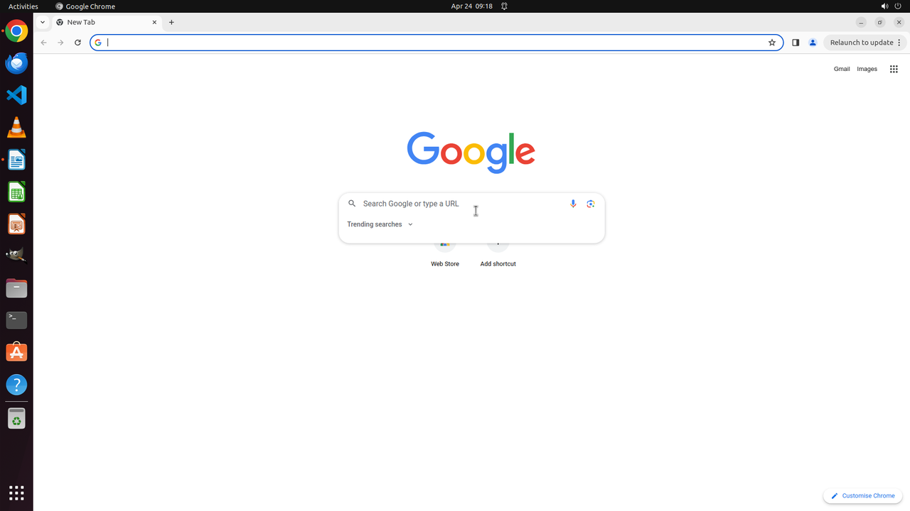

**Response:**
```
Let me search for the 24-hour self-service visa machines in Futian District, Shenzhen.
```

**Actions:** `import subprocess, shlex; subprocess.run(f'xdotool type --delay 12 -- ' + shlex.quote('深圳福田区24小时自助签注机地址'), shell=True, check=True)
import time; time.sleep(0.05)`

---

## Step 6


**Response:**
```
It seems the text didn't appear in the search box. Let me click on the address bar and try typing again.
```

**Actions:** `pyautogui.click(924, 88)`

---

## Step 7

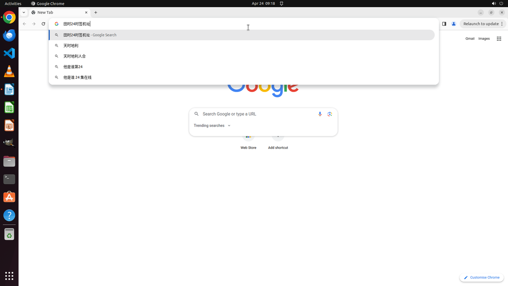

**Response:**
```
I can see the text was partially entered. It seems the Chinese input didn't work correctly. Let me clear this and try again with the full search query.
```

**Actions:** `pyautogui.keyDown('ctrl')
pyautogui.keyDown('a')
pyautogui.keyUp('a')
pyautogui.keyUp('ctrl')`

---

## Step 8


**Response:**
```
I see the text is selected but it seems garbled. Let me clear it and type the search query properly.
```

**Actions:** `import subprocess, shlex; subprocess.run(f'xdotool type --delay 12 -- ' + shlex.quote('深圳福田区24小时自助签注机地址'), shell=True, check=True)
import time; time.sleep(0.05)`

---

## Step 9

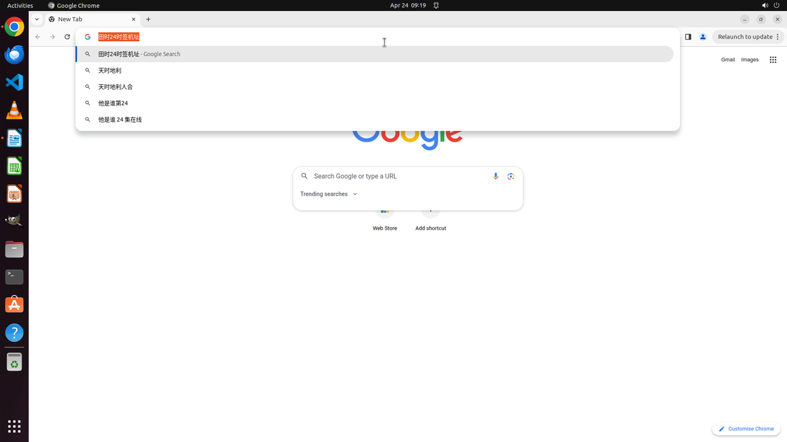

**Response:**
```
The Chinese characters are not being typed correctly. Let me try a different approach - I'll use the URL bar to navigate directly to a Google search with the query encoded in the URL.
```

**Actions:** `pyautogui.keyDown('esc')
pyautogui.keyUp('esc')`

---

## Step 10


**Response:**
```
I can see the address bar has some garbled Chinese text. Let me clear it and navigate directly to a Google search URL with the proper query.
```

**Actions:** `pyautogui.click(924, 88)`

---

## Step 11

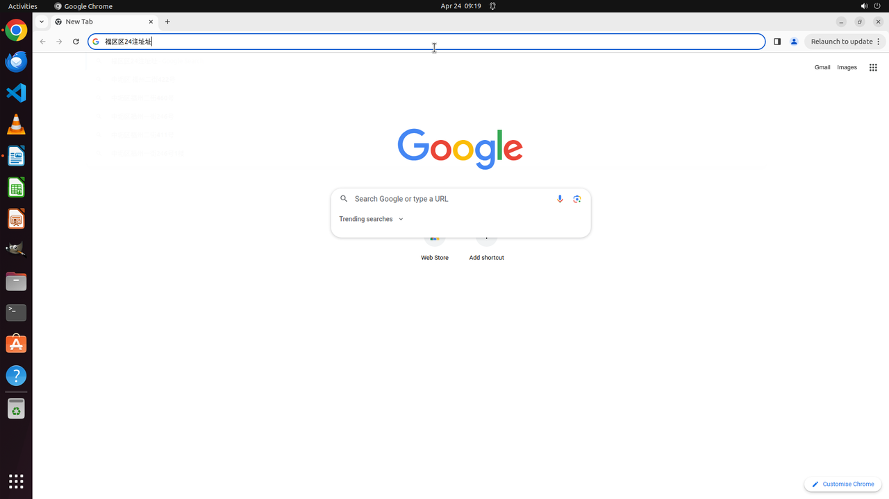

**Response:**
```
Let me try using a direct URL approach to search Google with the Chinese query properly encoded.
```

**Actions:** `pyautogui.keyDown('ctrl')
pyautogui.keyDown('a')
pyautogui.keyUp('a')
pyautogui.keyUp('ctrl')`

---

## Step 12

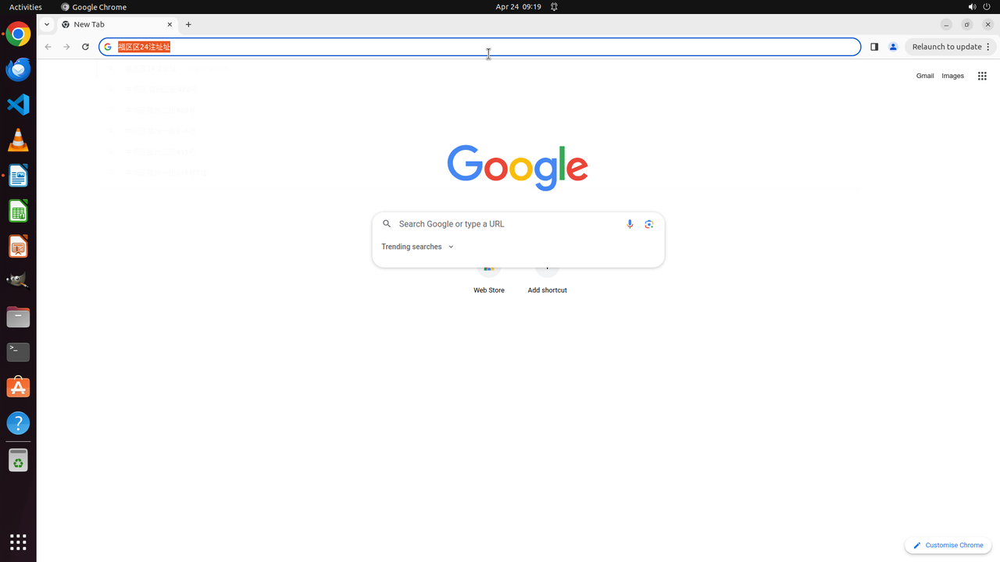

**Response:**
```
Good, the text is selected. Let me type a Google search URL directly with the encoded Chinese query.
```

**Actions:** `import subprocess, shlex; subprocess.run(f'xdotool type --delay 12 -- ' + shlex.quote('https://www.google.com/search?q=%E6%B7%B1%E5%9C%B3'), shell=True, check=True)
import time; time.sleep(0.05)
impor`

---

## Step 13

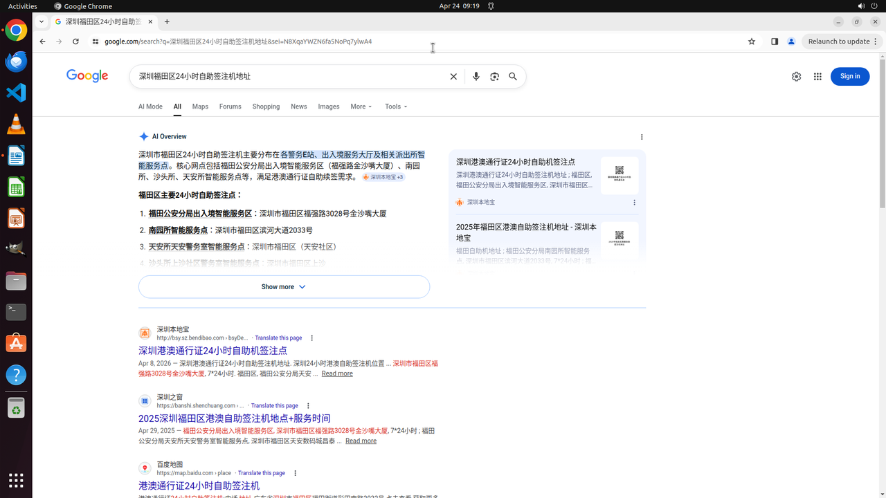

**Response:**
```
I can see the search results with information about 24-hour self-service visa machines in Futian District. I can already see some addresses. Let me click "Show more" to see all the locations listed.
```

**Actions:** `pyautogui.click(610, 621)`

---

## Step 14

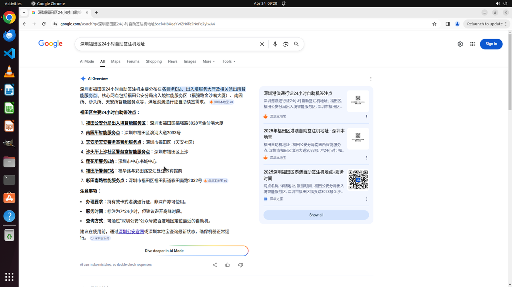

**Response:**
```
I can now see the full list of 24-hour self-service visa machines in Futian District. Let me note down the addresses from the AI Overview:

1. 福田公安分局出入境智能服务区：深圳市福田区福强路3028号金沙嘴大厦
2. 南园所智能服务点：深圳市福田区滨河大道2033号
3. 天安所天安警务室智能服务点：深圳市福田区（天安社区）
4. 沙头所上沙社区警务室智能服务点：深圳市福田区上沙
5. 莲花所警务E站：深圳市中心书城中心
6. 福田所警务E站：华华路与彩田路交汇处活动宾馆前
7. 彩田南路智能服务点：深圳市福田区福田街道彩田南路2032号

Let me click on one of the search results to get more detailed/complete addresses, especially for items 3, 4, and 5 which seem incomplete.
```

**Actions:** `pyautogui.click(508, 906)`

---

## Step 15


**Response:**
```
Let me click on one of the search result links to get more detailed addresses. Let me click on the first search result from 深圳本地宝.
```

**Actions:** `pyautogui.scroll(-5, 960, 600)`

---

## Step 16

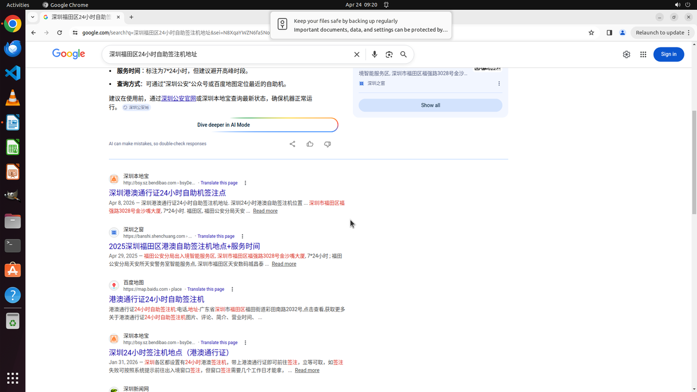

**Response:**
```
I can see several search results. Let me click on the "2025深圳福田区港澳自助签注机地点+服务时间" link from 深圳之窗 which seems to have detailed information about the locations.
```

**Actions:** `pyautogui.click(508, 678)`

---

## Step 17

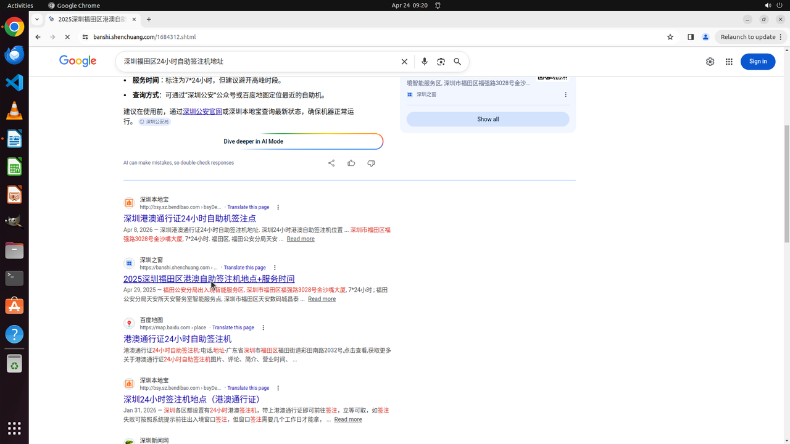

**Response:**
```
The page is loading. Let me wait for it to fully load.
```

**Actions:** `time.sleep(0.5)`

---

## Step 18

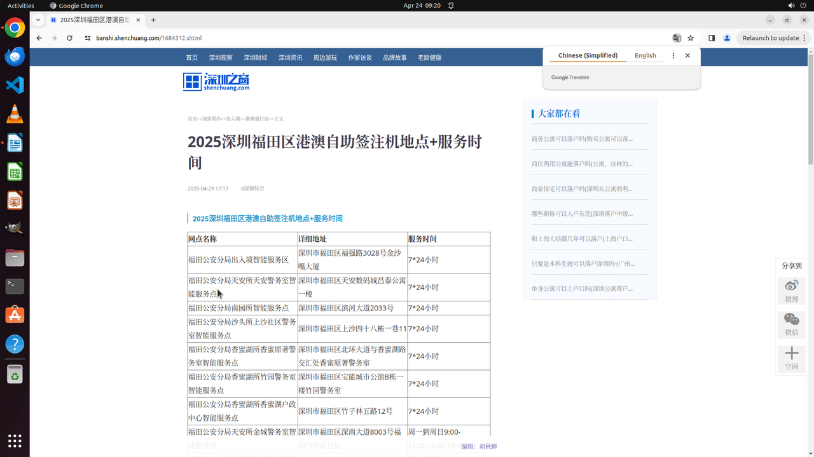

**Response:**
```
I found the detailed list of 24-hour self-service visa machines in Futian District. I can see a table with the locations and addresses. Let me close the translation bar and note down the addresses. I can see the following 24-hour service points:

1. 福田公安分局出入境智能服务区：深圳市福田区福强路3028号金沙嘴大厦
2. 福田公安分局天安所天安警务室智能服务点：深圳市福田区天安数码城昌泰公寓一楼
3. 福田公安分局南园所智能服务点：深圳市福田区滨河大道2033号
4. 福田公安分局沙头所上沙社区警务室智能服务点：深圳市福田区上沙四十八栋一巷11号 (partially visible)
5. 福田公安分局香蜜湖所香蜜原著警务室智能服务点：深圳市福田区北环大道与香蜜湖路交汇处香蜜原著警务室
6. 福田公安分局香蜜湖所竹园警务室智能服务点：深圳市福田区宝能城市公馆B栋一楼竹园警务室
7. 福田公安分局香蜜湖所香蜜湖户政中心智能服务点：深圳市福田区竹子林五路12号

Let me close the translation bar first.
```

**Actions:** `pyautogui.click(1618, 130)`

---

## Step 19

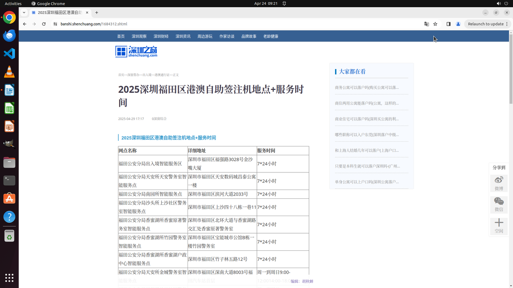

**Response:**
```
I can now see the table clearly with the addresses. I need to pick 5 that are 24-hour (7*24小时) service points. Let me verify the addresses I can see:

1. 福田公安分局出入境智能服务区：深圳市福田区福强路3028号金沙嘴大厦 - 7*24小时
2. 福田公安分局天安所天安警务室智能服务点：深圳市福田区天安数码城昌泰公寓一楼 - 7*24小时
3. 福田公安分局南园所智能服务点：深圳市福田区滨河大道2033号 - 7*24小时
4. 福田公安分局沙头所上沙社区警务室智能服务点：深圳市福田区上沙四十八栋一巷11号 - 7*24小时 (need to verify the full address)
5. 福田公安分局香蜜湖所香蜜原著警务室智能服务点：深圳市福田区北环大道与香蜜湖路交汇处香蜜原著警务室 - 7*24小时

Let me scroll down to see if there's more detail for address #4, and also verify the complete addresses.
```

**Actions:** `pyautogui.scroll(-3, 960, 600)`

---

## Step 20

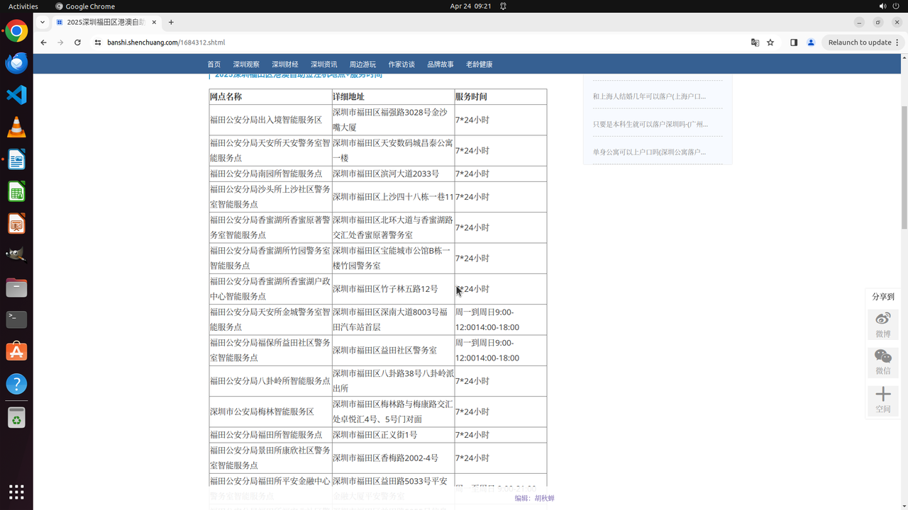

**Response:**
```
Now I can see the full table with all the 24-hour self-service visa machine locations in Futian District. I'll select 5 locations that have 7*24小时 service. Let me note down the addresses:

1. 深圳市福田区福强路3028号金沙嘴大厦 (福田公安分局出入境智能服务区)
2. 深圳市福田区天安数码城昌泰公寓一楼 (福田公安分局天安所天安警务室智能服务点)
3. 深圳市福田区滨河大道2033号 (福田公安分局南园所智能服务点)
4. 深圳市福田区上沙四十八栋一巷11号 (福田公安分局沙头所上沙社区警务室智能服务点)
5. 深圳市福田区北环大道与香蜜湖路交汇处香蜜原著警务室 (福田公安分局香蜜湖所香蜜原著警务室智能服务点)

Now let me switch to the open Word document and type these addresses. Let me click on the LibreOffice Writer icon in the taskbar.
```

**Actions:** `pyautogui.click(33, 337)`

---

## Step 21

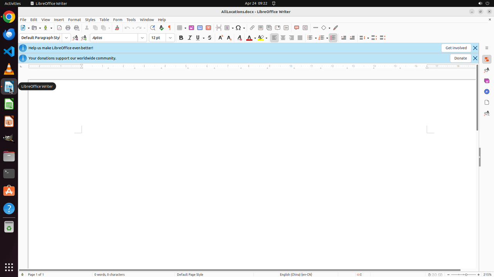

**Response:**
```
The LibreOffice Writer document "AllLocations.docx" is open and empty. Let me click on the document area and type the 5 addresses of 24-hour self-service visa machines in Futian District.
```

**Actions:** `pyautogui.click(960, 600)`

---

## Step 22


**Response:**
```
Good, the document is active and I can see the cursor. Now I need to type the 5 addresses in Chinese. Let me type them using the xdotool approach through the terminal to handle Chinese characters properly. Let me open a terminal first.
```

**Actions:** `pyautogui.click(33, 673)`

---

## Step 23

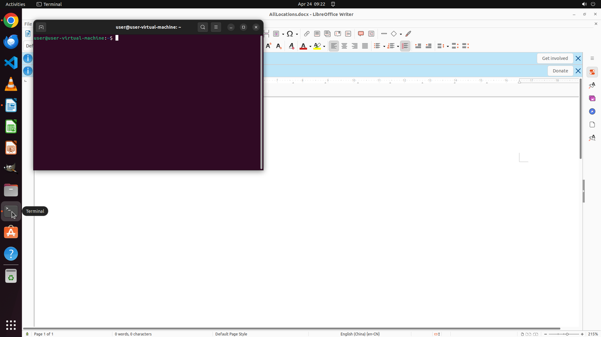

**Response:**
```
A terminal is open. I'll use Python to write the Chinese text directly to the document file using python-docx, or I can use xdotool to type the text. Let me use a Python script to write the content to the document.
```

**Actions:** `import subprocess, shlex; subprocess.run(f'xdotool type --delay 12 -- ' + shlex.quote('python3 -c "\nfrom docx import Document\nimport glob'), shell=True, check=True)
import time; time.sleep(0.05)
imp`

---

## Step 24

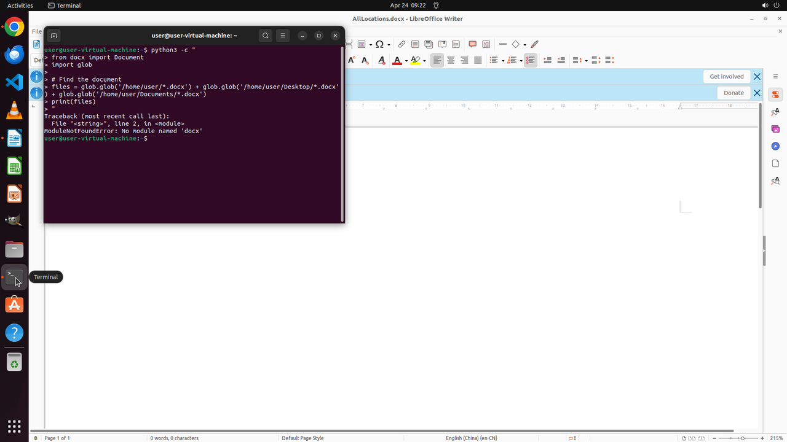

**Response:**
```
The python-docx module is not installed. Let me first find the document file and then use a different approach. Let me find the file first.
```

**Actions:** `import subprocess, shlex; subprocess.run(f'xdotool type --delay 12 -- ' + shlex.quote('find /home/user -name "AllLocations.docx" 2>/dev/n'), shell=True, check=True)
import time; time.sleep(0.05)
impor`

---

## Step 25

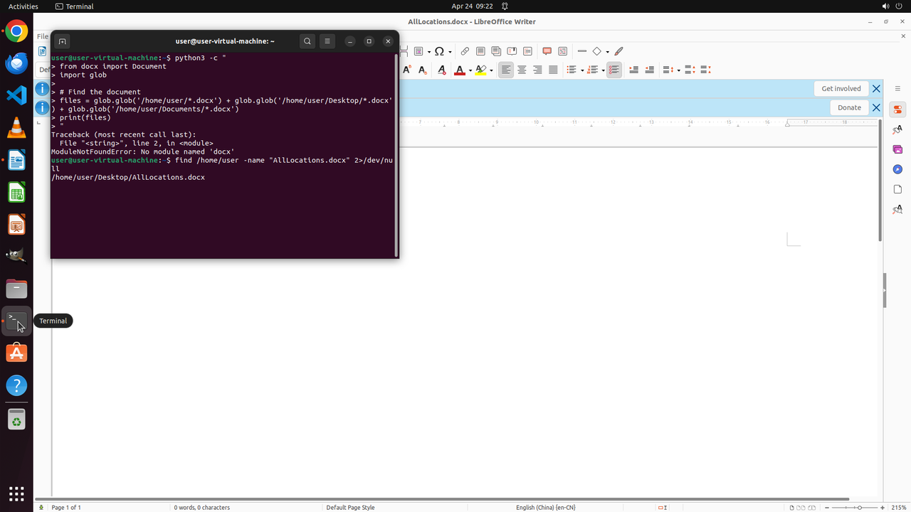

**Response:**
```
The file is at `/home/user/Desktop/AllLocations.docx`. Now let me install python-docx and use it to write the addresses to the file.
```

**Actions:** `import subprocess, shlex; subprocess.run(f'xdotool type --delay 12 -- ' + shlex.quote('pip3 install python-docx\n'), shell=True, check=True)
import time; time.sleep(0.05)`

---

## Step 26

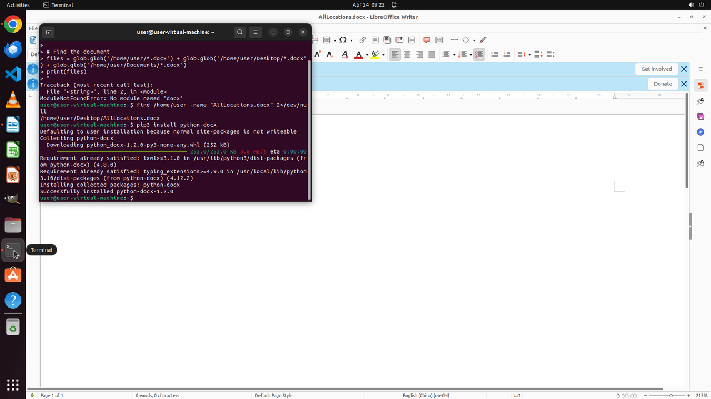

**Response:**
```
python-docx is installed successfully. Now I need to first close the document in LibreOffice Writer, then write to it with Python, and reopen it. But actually, a better approach is to write a Python script that modifies the file. However, since the file is currently open in LibreOffice, I should close it first. Let me write the content using Python after closing the file in LibreOffice.

Actually, let me use a different approach - I'll write the content directly using xdotool to type into the LibreOffice Writer window. But first, let me try using python-docx to write to a temporary file, then we can handle it.

Let me close the file in LibreOffice first, then write with Python, then reopen.
```

**Actions:** `import subprocess, shlex; subprocess.run(f'xdotool type --delay 12 -- ' + shlex.quote("python3 << 'EOF'\nfrom docx import Document\n\ndoc = "), shell=True, check=True)
import time; time.sleep(0.05)
im`

---

## Step 27


**Response:**
```
The script is running. Let me wait for it to complete.
```

**Actions:** `time.sleep(0.5)`

---

## Step 28


**Response:**
```
The script seems to be still running or waiting. The issue might be that the heredoc with Chinese characters isn't working well. Let me scroll down to see the current state.
```

**Actions:** `pyautogui.scroll(-3, 450, 450)`

---

## Step 29

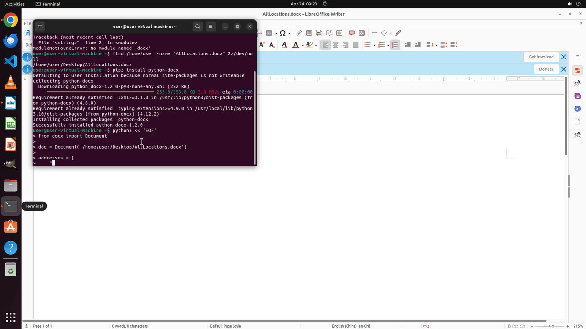

**Response:**
```
It seems the script is still waiting for input. The heredoc might not have completed properly due to the Chinese characters. Let me interrupt it and try a different approach - I'll write a Python script file instead.
```

**Actions:** `pyautogui.keyDown('ctrl')
pyautogui.keyDown('c')
pyautogui.keyUp('c')
pyautogui.keyUp('ctrl')`

---

## Step 30


**Response:**
```
The script is still running. Let me try pressing Ctrl+C again and then Ctrl+D to end the heredoc.
```

**Actions:** `pyautogui.keyDown('ctrl')
pyautogui.keyDown('c')
pyautogui.keyUp('c')
pyautogui.keyUp('ctrl')`

---

## Step 31


**Response:**
```
Let me try pressing Ctrl+D to end the input.
```

**Actions:** `pyautogui.keyDown('ctrl')
pyautogui.keyDown('d')
pyautogui.keyUp('d')
pyautogui.keyUp('ctrl')`

---

## Step 32

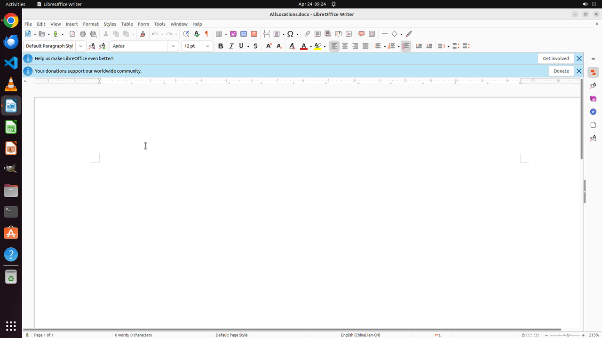

**Response:**
```
It seems the terminal closed and we're back to LibreOffice Writer which is still empty. The script didn't work properly because the Chinese characters weren't being passed correctly through the heredoc. Let me try a different approach - I'll write a Python script file first, then execute it. Let me open the terminal again.
```

**Actions:** `pyautogui.click(33, 673)`

---

## Step 33


**Response:**
```
Good, the terminal is open with a fresh prompt. Let me write a Python script using Unicode escape sequences to avoid issues with Chinese character input in the terminal.
```

**Actions:** `import subprocess, shlex; subprocess.run(f'xdotool type --delay 12 -- ' + shlex.quote('python3 -c "\nfrom docx import Document\ndoc = Docum'), shell=True, check=True)
import time; time.sleep(0.05)
imp`

---

## Step 34

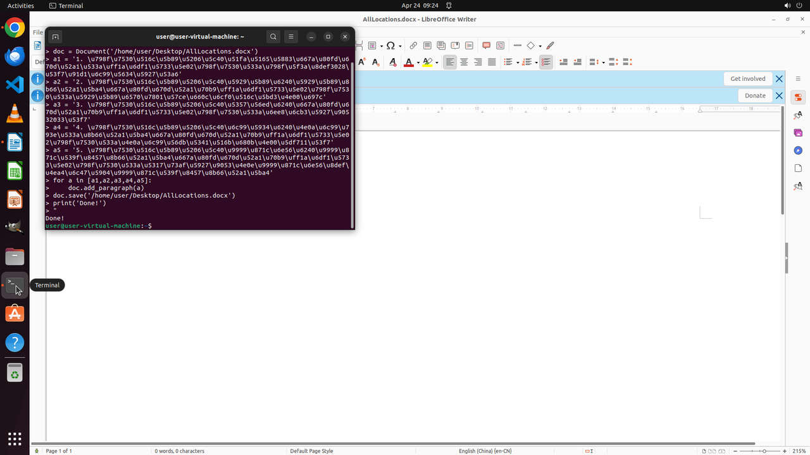

**Response:**
```
The script executed successfully and printed "Done!". The addresses have been written to the file. Now I need to reload the file in LibreOffice Writer. Let me switch to LibreOffice Writer and reload the document.
```

**Actions:** `pyautogui.click(1350, 45)`

---

## Step 35


**Response:**
```
The document still shows as empty because it was modified externally while open in LibreOffice. I need to reload the document. Let me close it and reopen it, or use Edit > Reload.
```

**Actions:** `pyautogui.click(127, 76)`

---

## Step 36

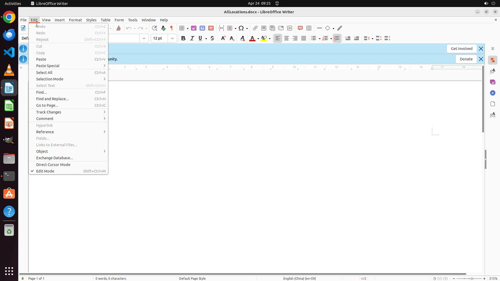

**Response:**
```
I don't see a "Reload" option in the Edit menu. Let me close this menu and try using File menu to reload the document.
```

**Actions:** `pyautogui.keyDown('esc')
pyautogui.keyUp('esc')`

---

## Step 37


**Response:**
```
Let me use File > Reload or close and reopen the file. Let me try File menu first.
```

**Actions:** `pyautogui.click(85, 76)`

---

## Step 38

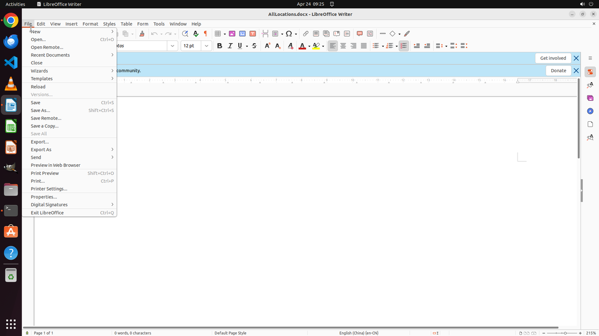

**Response:**
```
I can see the "Reload" option in the File menu. Let me click on it to reload the document.
```

**Actions:** `pyautogui.click(120, 277)`

---

## Step 39


**Response:**
```
The document has been reloaded and I can see the 5 addresses in Chinese are now displayed in the document:

1. 福田公安分局出入境智能服务区：深圳市福田区福强路 3028 号金沙嘴大厦
2. 福田公安分局天安所天安警务室智能服务点：深圳市福天安数码城昌泰公寓一楼
3. 福田公安分局南园所智能服务点：深圳市福田区滨河大道 2033 号
4. 福田公安分局沙头所上沙社区警务室智能服务点：深圳市福田区上沙四十八栋一巷 11 号
5. 福田公安分局香蜜湖所香蜜原著警务室智能服务点：深圳市福田区北环大道与香蜜湖路交汇处香蜜原著警务室

I notice there seems to be a duplicate at the bottom (item starting with "1. 福田公安..."). Let me scroll down to check if there are extra entries that need to be removed.
```

**Actions:** `pyautogui.scroll(-5, 960, 600)`

---

## Step 40

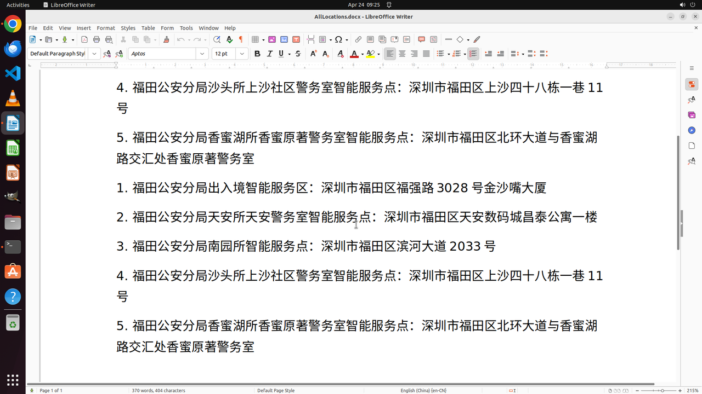

**Response:**
```
I can see the addresses are duplicated - there are two sets of the same 5 addresses. This happened because the Python script ran twice (once from the failed heredoc attempt and once from the successful one), or the document was appended to. I need to remove the duplicate set. Let me select and delete the second set of addresses. Let me first select from the beginning of the second "1." to the end of the document.

Let me click at the beginning of the second "1." entry.
```

**Actions:** `pyautogui.click(324, 513)`

---

## Step 41


**Response:**
```
I need to select from the line before the second "1." to the end of the document and delete it. Let me place my cursor at the end of the "5." entry (the first set's last entry) and then select to the end.

First, let me click right before the second "1." - I need to position at the empty line before it. Let me click at the end of "香蜜原著警务室" in the first set (end of line 5 first set).
```

**Actions:** `pyautogui.click(690, 433)`

---

## Step 42


**Response:**
```
Good, I can see the cursor is positioned after "香蜜原著警务室" in the first set. Now I need to select from here to the end of the document and delete the duplicate content. Let me use Shift+Ctrl+End to select to the end of the document.
```

**Actions:** `pyautogui.keyDown('shift')
pyautogui.keyDown('ctrl')
pyautogui.keyDown('end')
pyautogui.keyUp('end')
pyautogui.keyUp('ctrl')
pyautogui.keyUp('shift')`

---

## Step 43

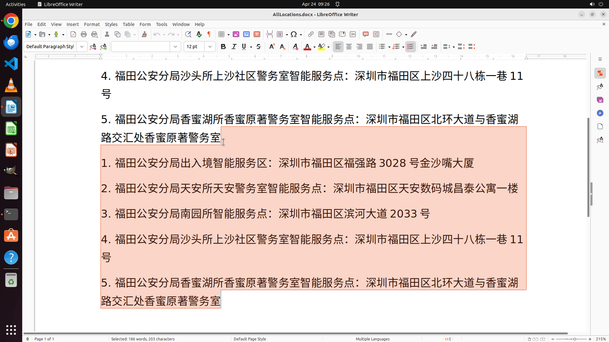

**Response:**
```
I can see the duplicate content is selected (highlighted in blue). The status bar shows "Selected: 186 words, 203 characters". Now let me delete the selected text.
```

**Actions:** `pyautogui.keyDown('delete')
pyautogui.keyUp('delete')`

---

## Step 44

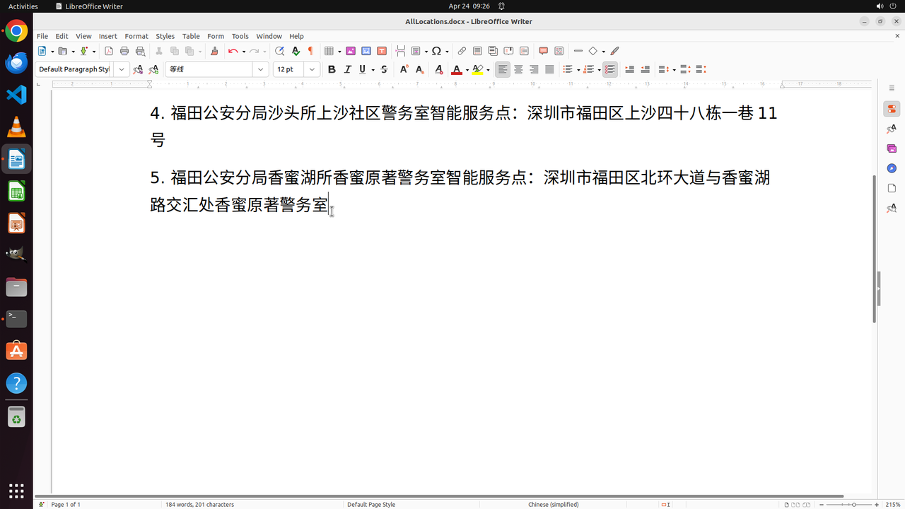

**Response:**
```
The duplicate content has been deleted. Now let me scroll up to verify the complete document looks correct with all 5 addresses.
```

**Actions:** `pyautogui.keyDown('ctrl')
pyautogui.keyDown('home')
pyautogui.keyUp('home')
pyautogui.keyUp('ctrl')`

---

## Step 45

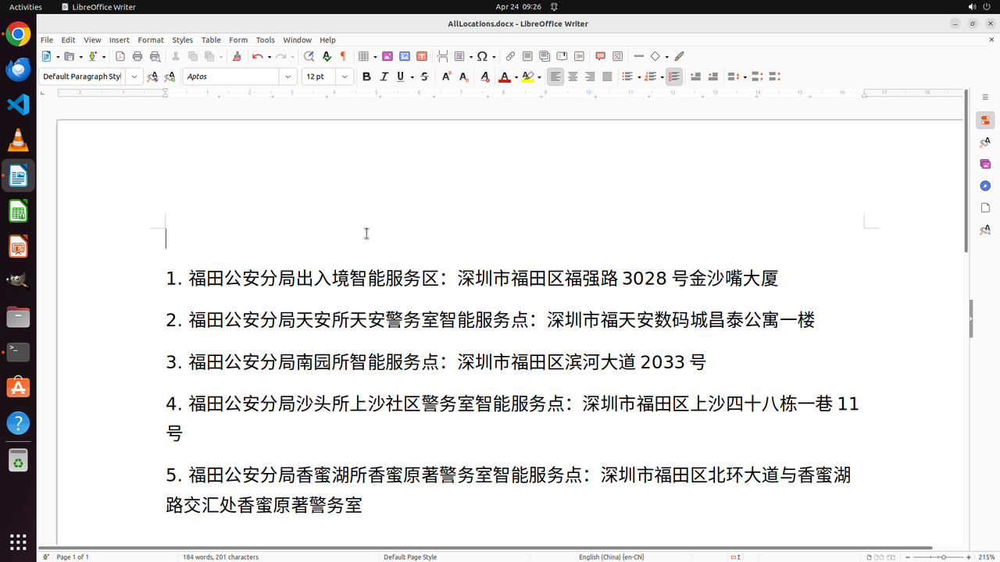

**Response:**
```
I can see the document now has the 5 addresses correctly. However, I notice there are some empty lines at the top and there's an issue with address #2 - it says "深圳市福天安数码城" instead of "深圳市福田区天安数码城" (missing "田区"). Let me check the addresses more carefully:

1. 福田公安分局出入境智能服务区：深圳市福田区福强路 3028 号金沙嘴大厦 ✓
2. 福田公安分局天安所天安警务室智能服务点：深圳市福天安数码城昌泰公寓一楼 - missing "田区"
3. 福田公安分局南园所智能服务点：深圳市福田区滨河大道 2033 号 ✓
4. 福田公安分局沙头所上沙社区警务室智能服务点：深圳市福田区上沙四十八栋一巷 11 号 ✓
5. 福田公安分局香蜜湖所香蜜原著警务室智能服务点：深圳市福田区北环大道与香蜜湖路交汇处香蜜原著警务室 ✓

I need to fix address #2. Also, let me remove the empty lines at the top. Let me first fix the empty lines at the top.
```

**Actions:** `pyautogui.click(310, 300)`

---

## Step 46


**Response:**
```
I can see there's a header area and some empty paragraphs at the top. The content looks good overall. I notice that address #2 says "深圳市福天安数码城" which seems to be missing "田区". Let me fix this. But first, let me remove the empty lines at the top. Let me select from the beginning of the document to just before the "1." text.
```

**Actions:** `pyautogui.keyDown('ctrl')
pyautogui.keyDown('home')
pyautogui.keyUp('home')
pyautogui.keyUp('ctrl')`

---

## Step 47

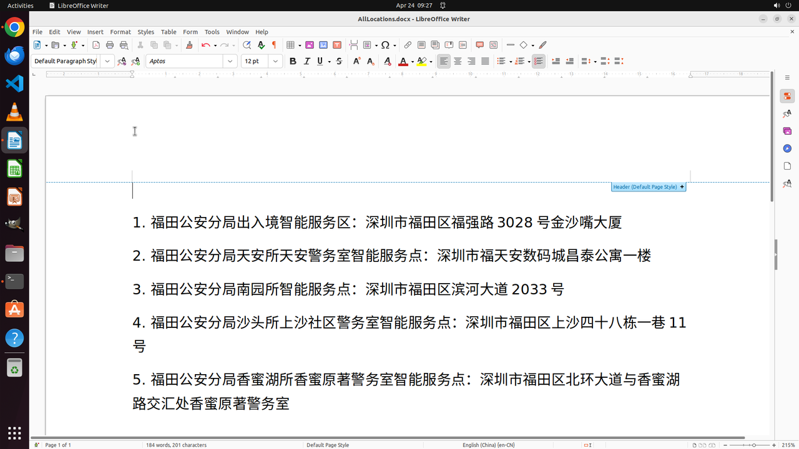

**Response:**
```
I can see the cursor is at the top. There seem to be empty paragraphs before the content starts. Let me select from the beginning to just before the "1." and delete the empty lines. But I notice the area above the dashed line appears to be a header section. The empty lines might be part of the document structure from the original docx file. Let me focus on fixing the content issue first.

Let me look more carefully at address #2. It says "深圳市福天安数码城昌泰公寓一楼". This seems to be missing "田区" - it should be "深圳市福田区天安数码城昌泰公寓一楼". Let me fix this using Find and Replace.
```

**Actions:** `pyautogui.keyDown('ctrl')
pyautogui.keyDown('h')
pyautogui.keyUp('h')
pyautogui.keyUp('ctrl')`

---

## Step 48

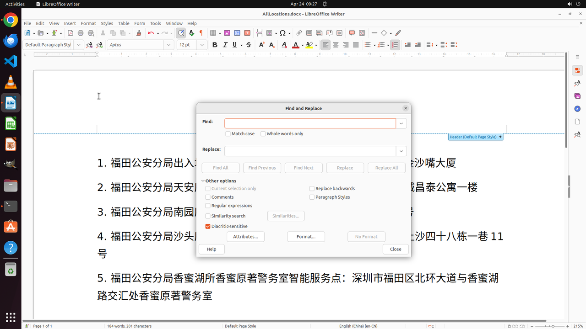

**Response:**
```
The Find and Replace dialog is open. But I realize I can't type Chinese characters directly in the terminal or in dialog boxes. Let me close this dialog and use the terminal with Python to fix the document instead.
```

**Actions:** `pyautogui.click(1293, 816)`

---

## Step 49


**Response:**
```
Let me look more carefully at address #2. It says "深圳市福天安数码城昌泰公寓一楼". Looking at the original search results, the address should be "深圳市福田区天安数码城昌泰公寓一楼". It seems "田区" is missing. Let me use the terminal to fix this with Python. Let me switch to the terminal.
```

**Actions:** `pyautogui.click(33, 673)`

---

## Step 50

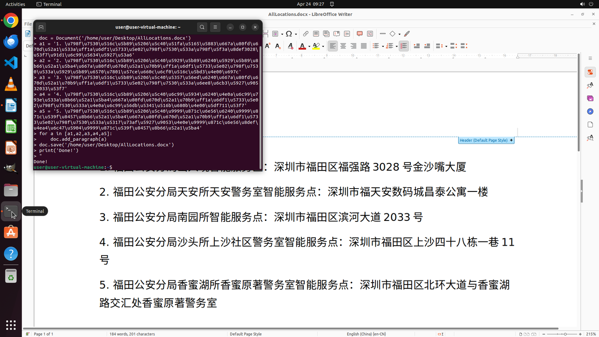

**Response:**
```
I can see the terminal with the previous Python session. Now I need to look at the actual content of address #2 more carefully. Looking at the document, address #2 shows "深圳市福天安数码城昌泰公寓一楼" - it seems "田区" is indeed missing. Let me check the Unicode escape I used for a2 in my original script.

Looking at the original code, I used:
`a2 = '2. \u798f\u7530\u516c\u5b89\u5206\u5c40\u5929\u5b89\u6240\u5929\u5b89\u8b66\u52a1\u5ba4\u667a\u80fd\u670d\u52a1\u70b9\uff1a\u6df1\u5733\u5e02\u798f\u7530\u533a\u5929\u5b89\u6570\u7801\u57ce\u660c\u6cf0\u516c\u5bd3\u4e00\u697c'`

This should decode to "深圳市福田区天安数码城昌泰公寓一楼". But the display shows "深圳市福天安数码城昌泰公寓一楼". Let me check if there's a rendering issue or if the content is actually correct. Let me use Python to read and check the document content.
```

**Actions:** `pyautogui.click(450, 537)`

---

## Step 51

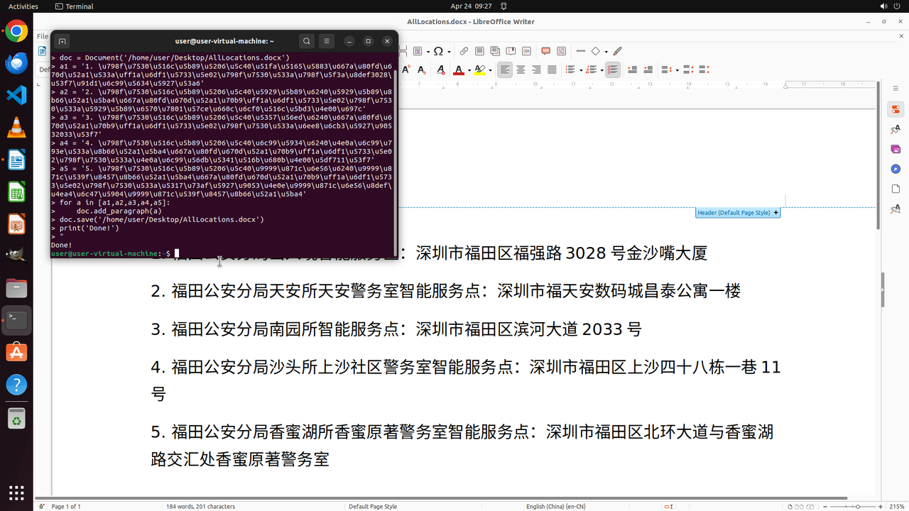

**Response:**
```
Let me read the document content with Python to check the actual text and fix any issues.
```

**Actions:** `import subprocess, shlex; subprocess.run(f'xdotool type --delay 12 -- ' + shlex.quote('python3 -c "\nfrom docx import Document\ndoc = Docum'), shell=True, check=True)
import time; time.sleep(0.05)
imp`

---

## Step 52

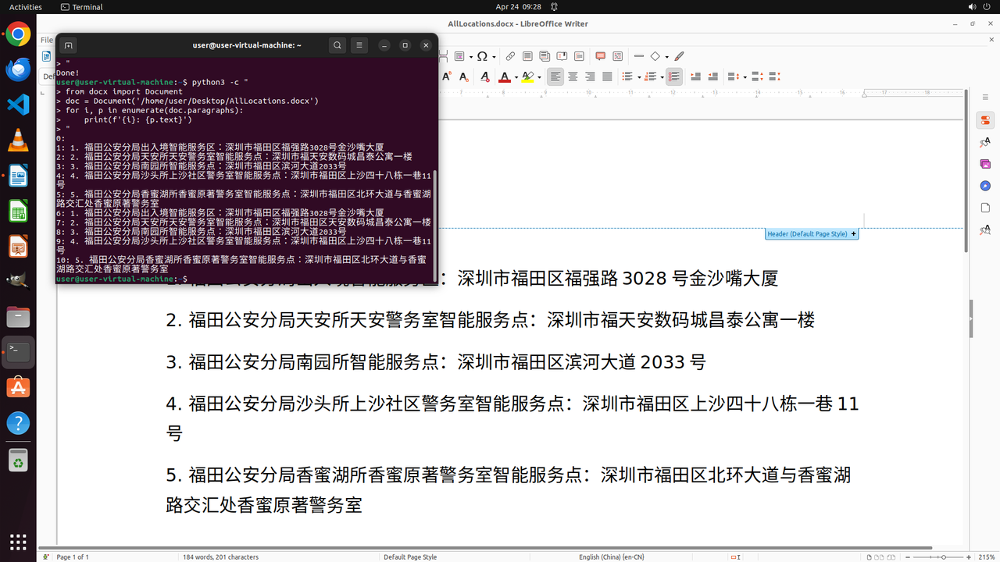

**Response:**
```
Now I can see the actual content of the document. The paragraphs are:

0: (empty)
1: 1. 福田公安分局出入境智能服务区：深圳市福田区福强路3028号金沙嘴大厦
2: 2. 福田公安分局天安所天安警务室智能服务点：深圳市福田区天安数码城昌泰公寓一楼
3: 3. 福田公安分局南园所智能服务点：深圳市福田区滨河大道2033号
4: 4. 福田公安分局沙头所上沙社区警务室智能服务点：深圳市福田区上沙四十八栋一巷11号
5: 5. 福田公安分局香蜜湖所香蜜原著警务室智能服务点：深圳市福田区北环大道与香蜜湖路交汇处香蜜原著警务室
6-10: (duplicate entries)

So the actual text in paragraph 2 IS correct - "深圳市福田区天安数码城昌泰公寓一楼" - it was just a display issue in LibreOffice where "田区" looked like it was missing. 

Now I need to remove the duplicate entries (paragraphs 6-10) and the empty first paragraph. Let me fix this with Python.
```

**Actions:** `import subprocess, shlex; subprocess.run(f'xdotool type --delay 12 -- ' + shlex.quote('python3 -c "\nfrom docx import Document\ndoc = Docum'), shell=True, check=True)
import time; time.sleep(0.05)
imp`

---

## Step 53

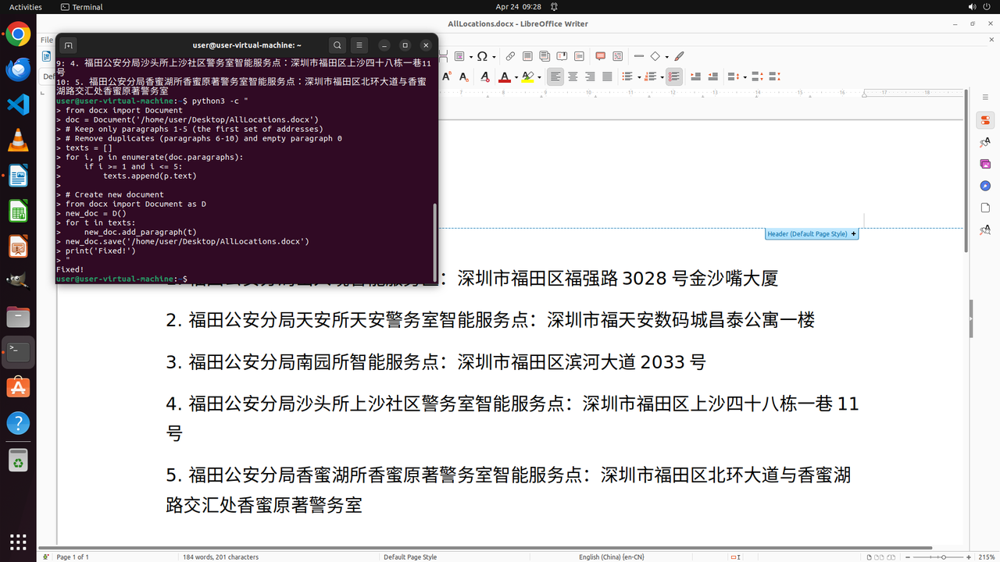

**Response:**
```
The Python script executed successfully and printed "Fixed!". The document has been cleaned up - only the 5 addresses are now in the document without duplicates. Now I need to reload the document in LibreOffice Writer. Let me switch to LibreOffice Writer and reload.
```

**Actions:** `pyautogui.click(1350, 600)`

---

## Step 54


**Response:**
```
I can see the LibreOffice Writer still shows the old version. I need to reload the document. Let me use File > Reload to refresh the content.
```

**Actions:** `pyautogui.click(85, 76)`

---

## Step 55

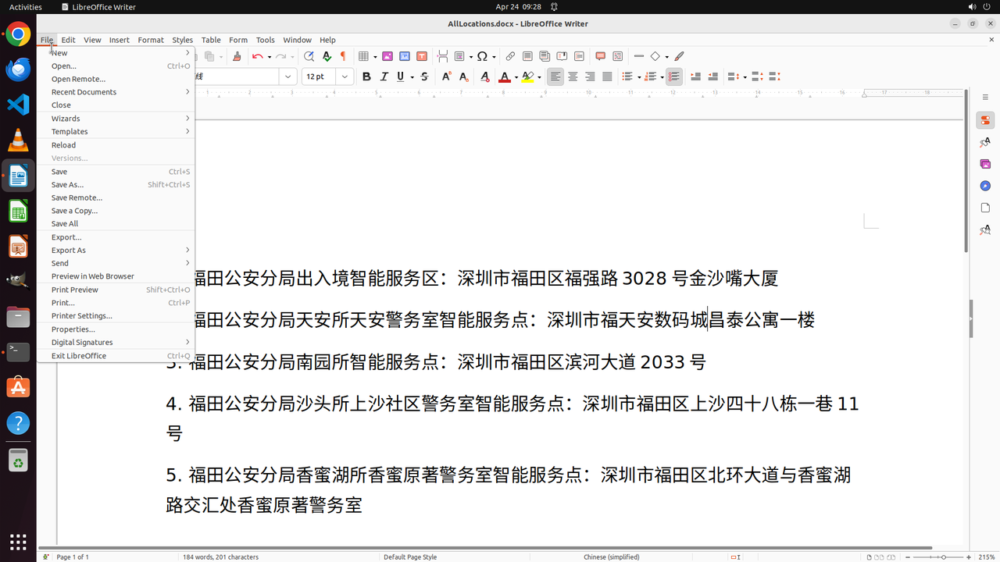

**Response:**
```
I can see the File menu is open. Let me click on "Reload" to refresh the document.
```

**Actions:** `pyautogui.click(120, 277)`

---

## Step 56

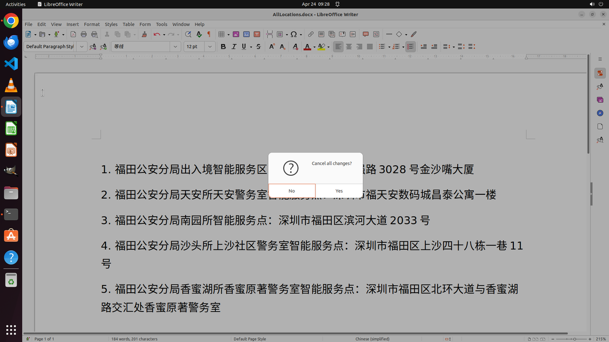

**Response:**
```
A dialog is asking "Cancel all changes?" - I should click "Yes" to reload the document from disk (which has the fixed content from our Python script).
```

**Actions:** `pyautogui.click(1071, 601)`

---

## Step 57


**Response:**
```
The document has been reloaded successfully and now shows only the 5 addresses without duplicates. The content looks clean:

1. 福田公安分局出入境智能服务区：深圳市福田区福强路 3028 号金沙嘴大厦
2. 福田公安分局天安所天安警务室智能服务点：深圳市福田区天安数码城昌泰公寓一楼
3. 福田公安分局南园所智能服务点：深圳市福田区滨河大道 2033 号
4. 福田公安分局沙头所上沙社区警务室智能服务点：深圳市福田区上沙四十八栋一巷 11 号
5. 福田公安分局香蜜湖所香蜜原著警务室智能服务点：深圳市福田区北环大道与香蜜湖路交汇处香蜜原著警务室

Now I need to save the document. Let me press Ctrl+S to save.
```

**Actions:** `pyautogui.keyDown('ctrl')
pyautogui.keyDown('s')
pyautogui.keyUp('s')
pyautogui.keyUp('ctrl')`

---

## Step 58

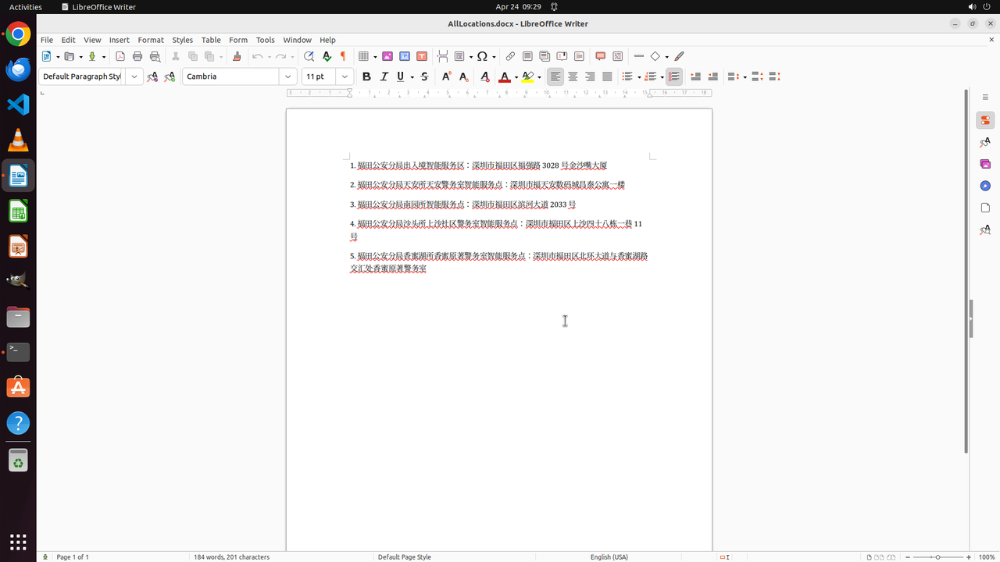

**Response:**
```
The document has been saved. It didn't show a format dialog, which means it was saved in the .docx format directly. The document now contains the 5 addresses of 24-hour self-service visa/permit machines (自助签注机) in Futian District, Shenzhen, in Chinese:

1. 福田公安分局出入境智能服务区：深圳市福田区福强路3028号金沙嘴大厦
2. 福田公安分局天安所天安警务室智能服务点：深圳市福田区天安数码城昌泰公寓一楼
3. 福田公安分局南园所智能服务点：深圳市福田区滨河大道2033号
4. 福田公安分局沙头所上沙社区警务室智能服务点：深圳市福田区上沙四十八栋一巷11号
5. 福田公安分局香蜜湖所香蜜原著警务室智能服务点：深圳市福田区北环大道与香蜜湖路交汇处香蜜原著警务室

The task is complete. The document has been saved with the 5 addresses.

DONE
```

**Actions:** `DONE`

---
