# Task 869de13e-bef9-4b91-ba51-f6708c40b096

**Instruction:** Can you organize my desktop by identifying academic papers, coding projects, and other documents, ensuring no file is misplaced? Specifically, place academic papers in the 'Paper_reading' folder, coding projects in 'Projects', and categorize everything else under 'Miscellaneous'. For files lacking clear extensions or names, apply content analysis to determine their appropriate classification.

**Score:** 1.0

**Wall clock:** 12m 11s

**Steps:** 36

**Cost:** $1.20

---

## Step 1


**Response:**
```
I'll analyze the desktop files and organize them into the appropriate folders. Let me start by examining the files more closely.
```

**Actions:** `time.sleep(0.1)`

---

## Step 2


**Response:**
```
Let me first open a terminal to examine all the files on the desktop and their contents to properly classify them.
```

**Actions:** `pyautogui.keyDown('ctrl')
pyautogui.keyDown('alt')
pyautogui.keyDown('t')
pyautogui.keyUp('t')
pyautogui.keyUp('alt')
pyautogui.keyUp('ctrl')`

---

## Step 3

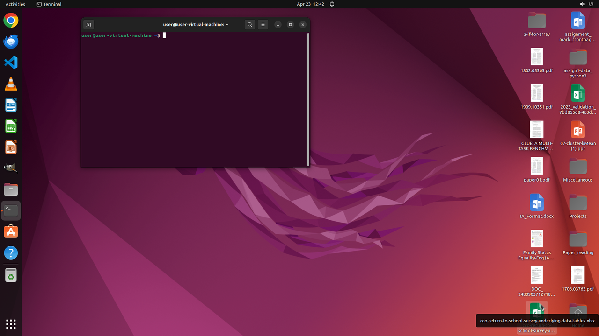

**Response:**
```
Good, the terminal is open. Let me first list all files on the desktop to see what we're working with.
```

**Actions:** `import subprocess, shlex; subprocess.run(f'xdotool type --delay 12 -- ' + shlex.quote('ls -la ~/Desktop/\n'), shell=True, check=True)
import time; time.sleep(0.05)`

---

## Step 4

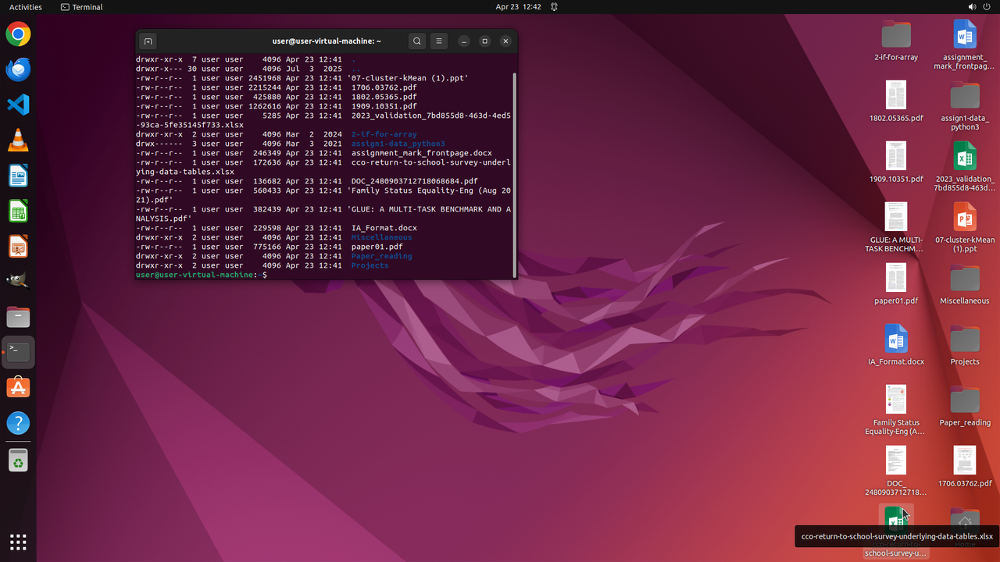

**Response:**
```
Now I can see all the files. Let me examine the files that need content analysis. Let me first check the files without clear academic/coding indicators, and also look at the content of ambiguous files.
```

**Actions:** `import subprocess, shlex; subprocess.run(f'xdotool type --delay 12 -- ' + shlex.quote('file ~/Desktop/*\n'), shell=True, check=True)
import time; time.sleep(0.05)`

---

## Step 5

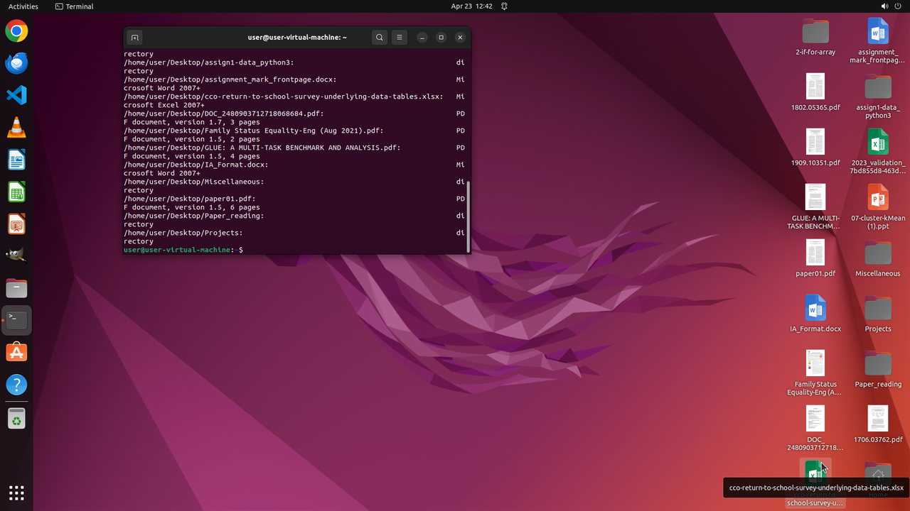

**Response:**
```
Now I can see the file types. Let me scroll up to see all files and also examine the content of some files to classify them properly.
```

**Actions:** `pyautogui.scroll(3, 600, 300)`

---

## Step 6

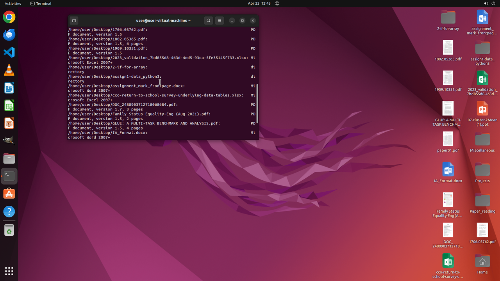

**Response:**
```
Now I can see all file types. Let me examine the content of some files to properly classify them. Let me check the PDFs with arxiv-style names (likely academic papers) and other ambiguous files.
```

**Actions:** `import subprocess, shlex; subprocess.run(f'xdotool type --delay 12 -- ' + shlex.quote('pdftotext ~/Desktop/1706.03762.pdf - 2>/dev/null |'), shell=True, check=True)
import time; time.sleep(0.05)
impor`

---

## Step 7

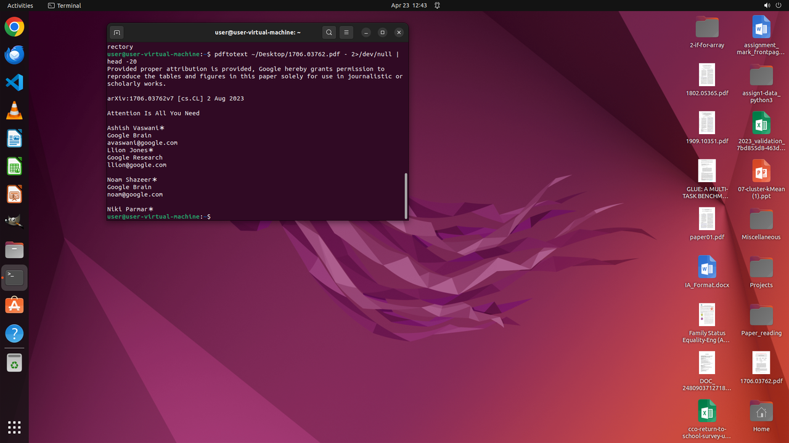

**Response:**
```
1706.03762.pdf is "Attention Is All You Need" - clearly an academic paper. Let me check the other PDFs and files.
```

**Actions:** `import subprocess, shlex; subprocess.run(f'xdotool type --delay 12 -- ' + shlex.quote('pdftotext ~/Desktop/1802.05365.pdf - 2>/dev/null |'), shell=True, check=True)
import time; time.sleep(0.05)
impor`

---

## Step 8

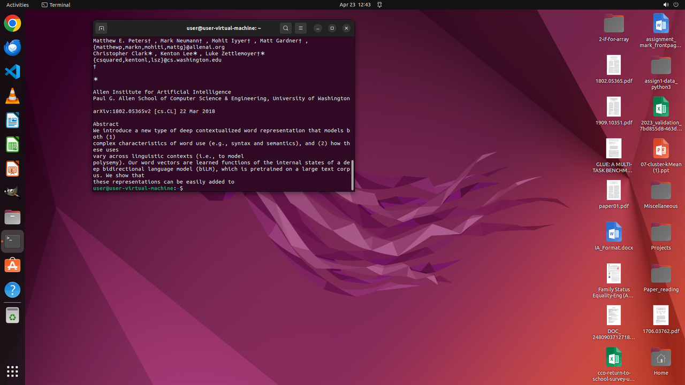

**Response:**
```
1802.05365.pdf is an academic paper (ELMo - deep contextualized word representations). Let me check the remaining files.
```

**Actions:** `import subprocess, shlex; subprocess.run(f'xdotool type --delay 12 -- ' + shlex.quote('pdftotext ~/Desktop/1909.10351.pdf - 2>/dev/null |'), shell=True, check=True)
import time; time.sleep(0.05)
impor`

---

## Step 9

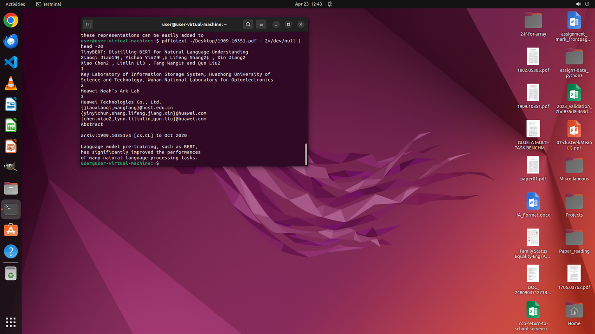

**Response:**
```
1909.10351.pdf is "TinyBERT: Distilling BERT for Natural Language Understanding" - academic paper. Let me check the remaining files.
```

**Actions:** `import subprocess, shlex; subprocess.run(f'xdotool type --delay 12 -- ' + shlex.quote('pdftotext ~/Desktop/paper01.pdf - 2>/dev/null | he'), shell=True, check=True)
import time; time.sleep(0.05)
impor`

---

## Step 10

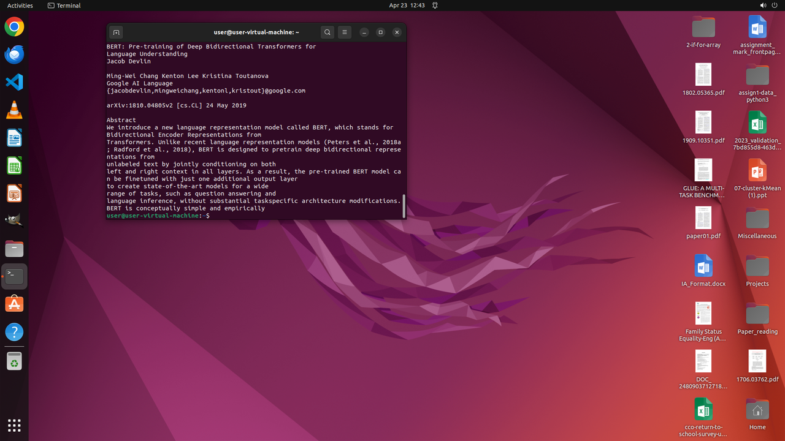

**Response:**
```
paper01.pdf is the BERT paper - academic paper. Let me check the remaining files.
```

**Actions:** `import subprocess, shlex; subprocess.run(f'xdotool type --delay 12 -- ' + shlex.quote('pdftotext ~/Desktop/DOC_248090371271806864.pdf - 2'), shell=True, check=True)
import time; time.sleep(0.05)
impor`

---

## Step 11

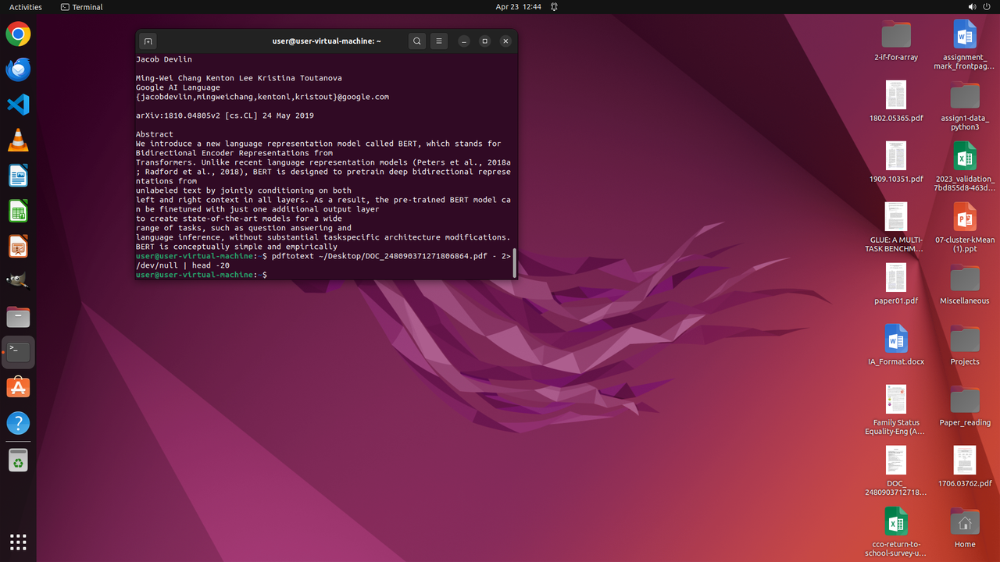

**Response:**
```
The DOC_248090371271806864.pdf appears to be empty or have no extractable text. Let me check its file size and try another approach. Let me also check the other remaining files.
```

**Actions:** `import subprocess, shlex; subprocess.run(f'xdotool type --delay 12 -- ' + shlex.quote('ls -la ~/Desktop/DOC_248090371271806864.pdf && pdf'), shell=True, check=True)
import time; time.sleep(0.05)
impor`

---

## Step 12

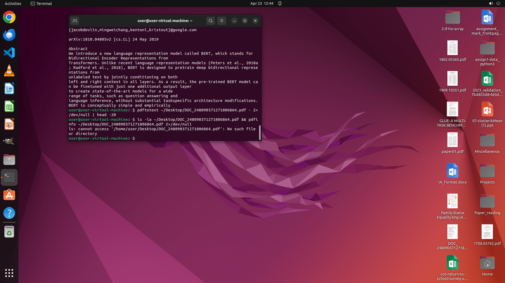

**Response:**
```
The filename has special characters. Let me find the exact filename and check the remaining files.
```

**Actions:** `import subprocess, shlex; subprocess.run(f'xdotool type --delay 12 -- ' + shlex.quote('ls ~/Desktop/DOC*\n'), shell=True, check=True)
import time; time.sleep(0.05)`

---

## Step 13

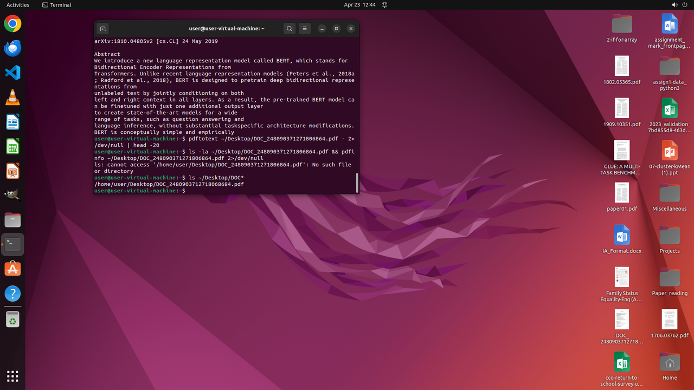

**Response:**
```
The actual filename is `DOC_248090371271806684.pdf` (not 8684). Let me check its content and the other files.
```

**Actions:** `import subprocess, shlex; subprocess.run(f'xdotool type --delay 12 -- ' + shlex.quote('pdftotext ~/Desktop/DOC_248090371271806684.pdf - 2'), shell=True, check=True)
import time; time.sleep(0.05)
impor`

---

## Step 14


**Response:**
```
The DOC file seems to have no extractable text. Let me check its metadata and also examine the other files. Let me use pdfinfo on it and check the "Family Status" and "GLUE" PDFs, plus the other non-PDF files.
```

**Actions:** `import subprocess, shlex; subprocess.run(f'xdotool type --delay 12 -- ' + shlex.quote('pdfinfo ~/Desktop/DOC_248090371271806684.pdf 2>/de'), shell=True, check=True)
import time; time.sleep(0.05)
impor`

---

## Step 15

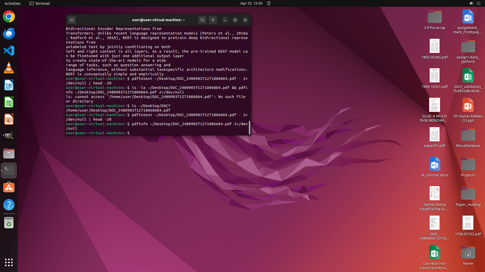

**Response:**
```
The DOC PDF seems to have issues with text extraction and pdfinfo. It's a scanned document likely. Let me check its exact filename again and the other files. Let me now check the "Family Status" PDF and the GLUE PDF, plus the remaining files.
```

**Actions:** `import subprocess, shlex; subprocess.run(f'xdotool type --delay 12 -- ' + shlex.quote('pdftotext ~/Desktop/"Family Status Equality-Eng (A'), shell=True, check=True)
import time; time.sleep(0.05)
impor`

---

## Step 16

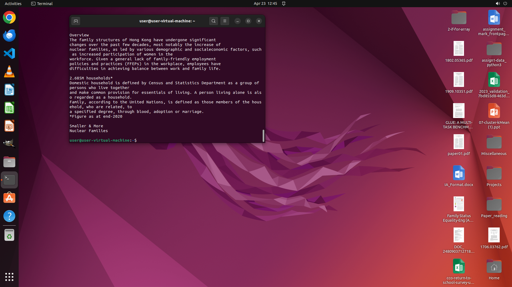

**Response:**
```
"Family Status Equality-Eng (Aug 2021).pdf" is about family structures in Hong Kong - this is a government/policy document, not an academic paper or coding project. It should go to Miscellaneous. Let me check the GLUE PDF and the other files.
```

**Actions:** `import subprocess, shlex; subprocess.run(f'xdotool type --delay 12 -- ' + shlex.quote('pdftotext ~/Desktop/"GLUE: A MULTI-TASK BENCHMARK '), shell=True, check=True)
import time; time.sleep(0.05)
impor`

---

## Step 17

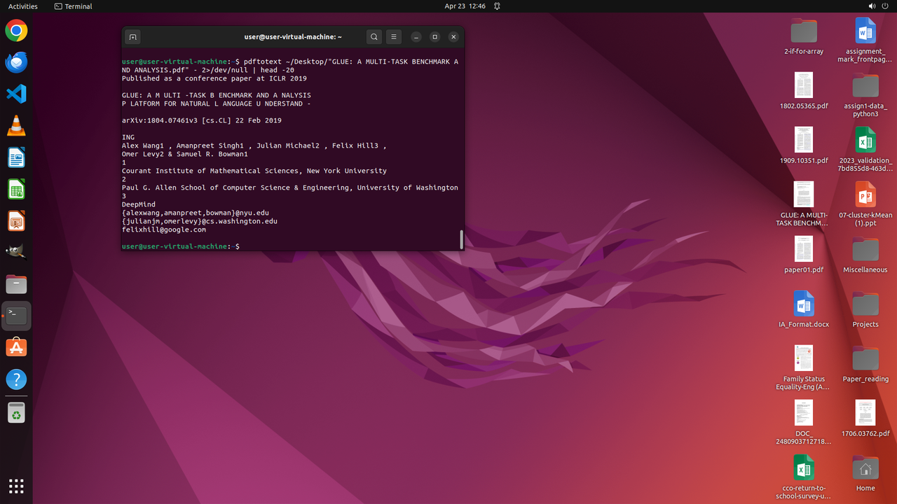

**Response:**
```
"GLUE: A MULTI-TASK BENCHMARK AND ANALYSIS.pdf" is an academic paper (published at ICLR 2019, arXiv paper). Now let me check the remaining files - the directories, docx files, xlsx files, and the ppt file.
```

**Actions:** `import subprocess, shlex; subprocess.run(f'xdotool type --delay 12 -- ' + shlex.quote('ls ~/Desktop/2-if-for-array/\n'), shell=True, check=True)
import time; time.sleep(0.05)`

---

## Step 18

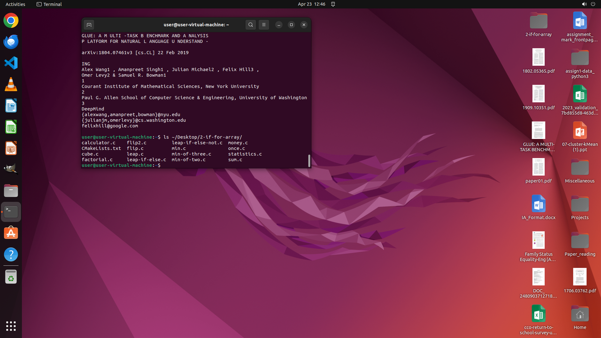

**Response:**
```
"2-if-for-array" contains C source files (calculator.c, flip2.c, leap-if-else-not.c, money.c, etc.) - this is a coding project. Let me check the other directory and remaining files.
```

**Actions:** `import subprocess, shlex; subprocess.run(f'xdotool type --delay 12 -- ' + shlex.quote('ls ~/Desktop/assign1-data_python3/\n'), shell=True, check=True)
import time; time.sleep(0.05)`

---

## Step 19

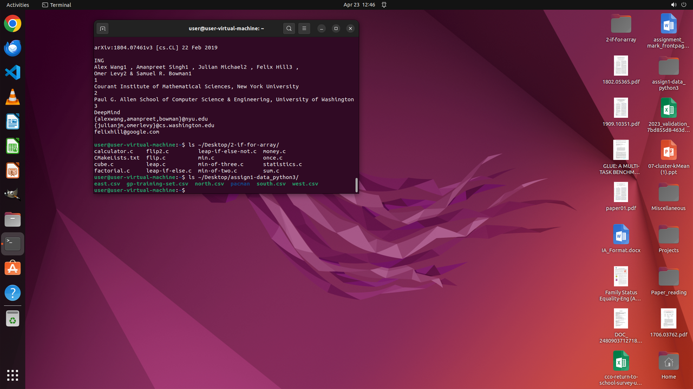

**Response:**
```
"assign1-data_python3" contains CSV files and a "pacman" directory - this is a coding project (likely a Python assignment with data files). Now let me check the remaining files - the docx, xlsx, ppt, and the validation xlsx.
```

**Actions:** `import subprocess, shlex; subprocess.run(f'xdotool type --delay 12 -- ' + shlex.quote('cat ~/Desktop/2023_validation_7bd855d8-463d-4ed5-9'), shell=True, check=True)
import time; time.sleep(0.05)
impor`

---

## Step 20

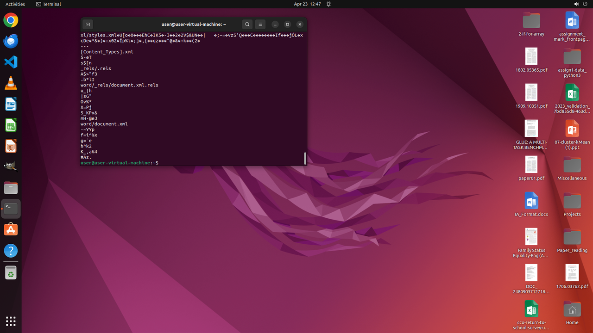

**Response:**
```
I can see the IA_Format.docx has Word document structure (word/document.xml). Let me use a better approach to read the content of the docx and xlsx files.
```

**Actions:** `import subprocess, shlex; subprocess.run(f'xdotool type --delay 12 -- ' + shlex.quote('python3 -c "\nimport zipfile, xml.etree.ElementTree'), shell=True, check=True)
import time; time.sleep(0.05)
impo`

---

## Step 21

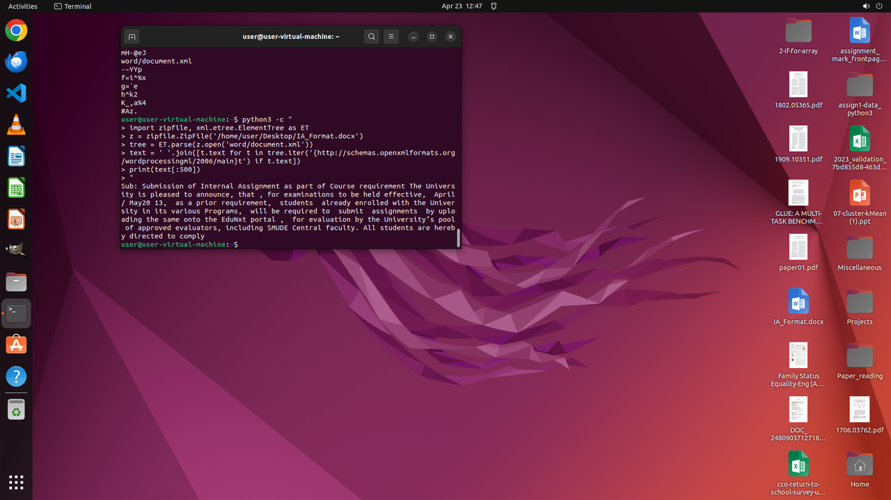

**Response:**
```
IA_Format.docx is about "Internal Assignment as part of Course requirement" - a university document about submitting assignments. This is a miscellaneous document. Now let me check the remaining files.
```

**Actions:** `import subprocess, shlex; subprocess.run(f'xdotool type --delay 12 -- ' + shlex.quote('ls ~/Desktop/assignment_mark_frontpage/\n'), shell=True, check=True)
import time; time.sleep(0.05)`

---

## Step 22

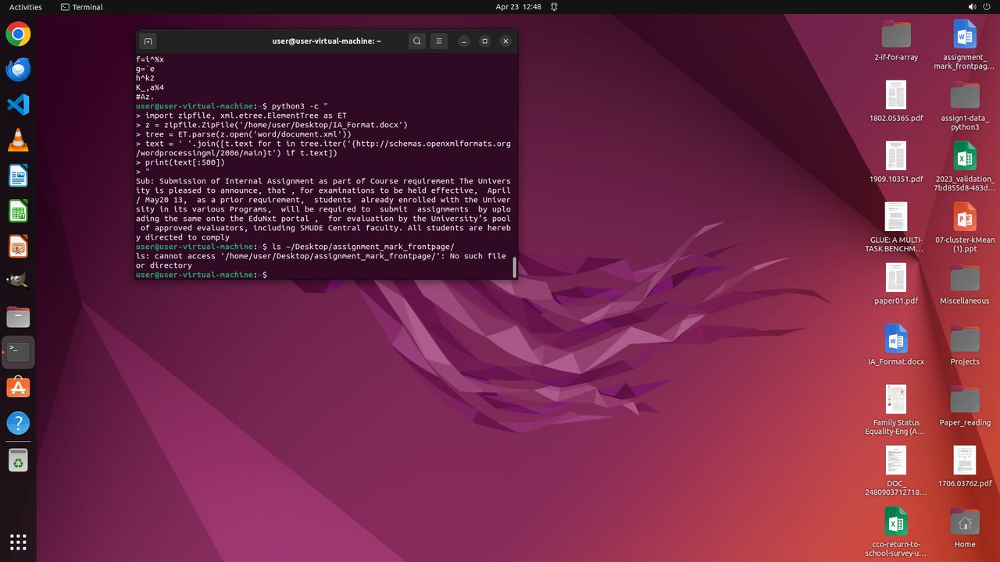

**Response:**
```
The filename might have different characters. Let me find the exact names of all files on the desktop.
```

**Actions:** `import subprocess, shlex; subprocess.run(f'xdotool type --delay 12 -- ' + shlex.quote('ls ~/Desktop/ | cat\n'), shell=True, check=True)
import time; time.sleep(0.05)`

---

## Step 23

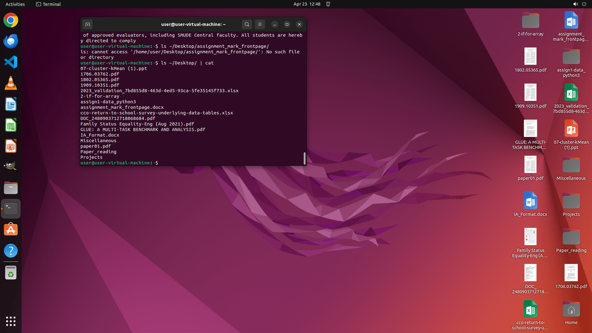

**Response:**
```
Now I can see all the files clearly. Let me check the remaining files I haven't analyzed yet:

1. `07-cluster-kMean (1).ppt` - PowerPoint
2. `assignment_mark_frontpage.docx` - Word doc
3. `cco-return-to-school-survey-underlying-data-tables.xlsx` - Excel
4. `2023_validation_7bd855d8-463d-4ed5-93ca-5fe35145f733.xlsx` - Excel
5. `DOC_248090371271806684.pdf` - PDF (couldn't extract text)

Let me check the remaining files:
```

**Actions:** `import subprocess, shlex; subprocess.run(f'xdotool type --delay 12 -- ' + shlex.quote('python3 -c "\nimport zipfile, xml.etree.ElementTree'), shell=True, check=True)
import time; time.sleep(0.05)
impo`

---

## Step 24

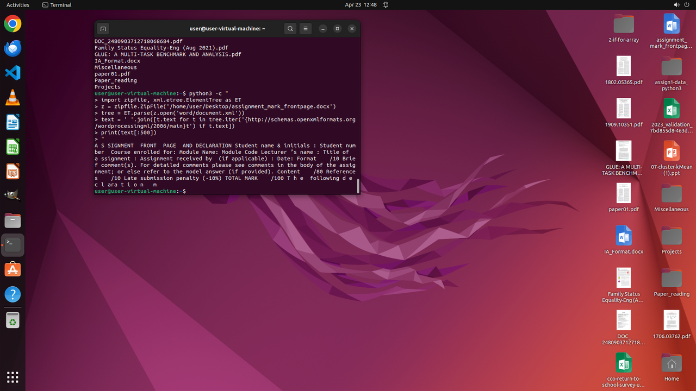

**Response:**
```
"assignment_mark_frontpage.docx" is an assignment front page/marking template (Student name, Module Code, Lecturer, marks, etc.) - this is a miscellaneous document. Now let me check the PPT file and the xlsx files.
```

**Actions:** `import subprocess, shlex; subprocess.run(f'xdotool type --delay 12 -- ' + shlex.quote('python3 -c "\nimport zipfile, xml.etree.ElementTree'), shell=True, check=True)
import time; time.sleep(0.05)
impo`

---

## Step 25

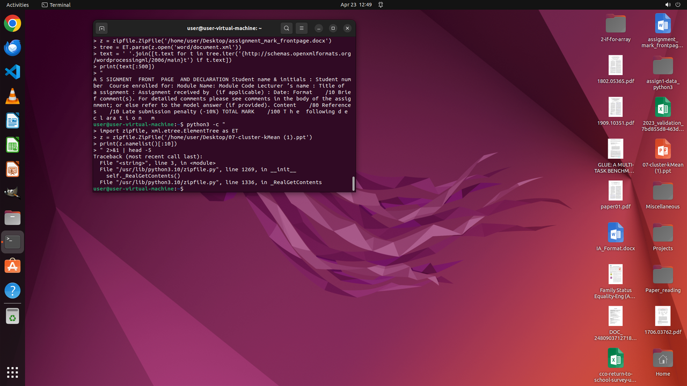

**Response:**
```
The PPT file is in old format (not a zip). Let me use strings to extract text from it, and also check the name - "07-cluster-kMean" suggests it's about k-Means clustering, likely a lecture/academic presentation.
```

**Actions:** `import subprocess, shlex; subprocess.run(f'xdotool type --delay 12 -- ' + shlex.quote('strings ~/Desktop/"07-cluster-kMean (1).ppt" | gre'), shell=True, check=True)
import time; time.sleep(0.05)
impor`

---

## Step 26

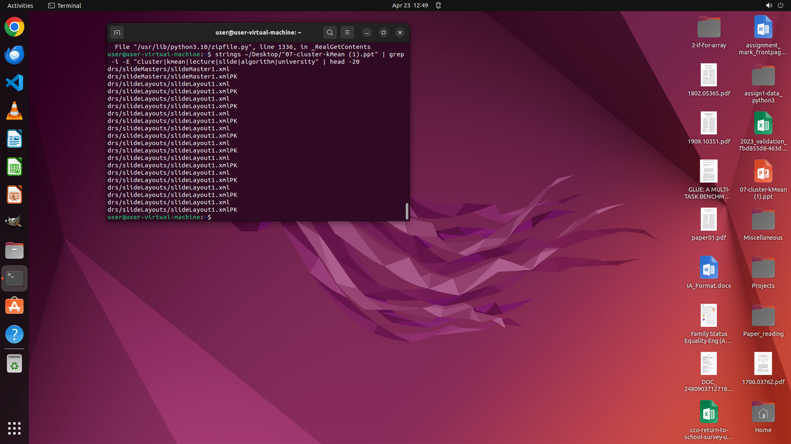

**Response:**
```
The PPT file seems to be in PPTX format internally (has slideLayouts). The filename "07-cluster-kMean" strongly suggests it's a lecture presentation about k-Means clustering algorithm - this is a miscellaneous document (a presentation/lecture slide, not an academic paper or coding project). Now let me check the xlsx files and the DOC PDF.
```

**Actions:** `import subprocess, shlex; subprocess.run(f'xdotool type --delay 12 -- ' + shlex.quote('python3 -c "\nimport openpyxl\nwb = openpyxl.load_wo'), shell=True, check=True)
import time; time.sleep(0.05)
imp`

---

## Step 27

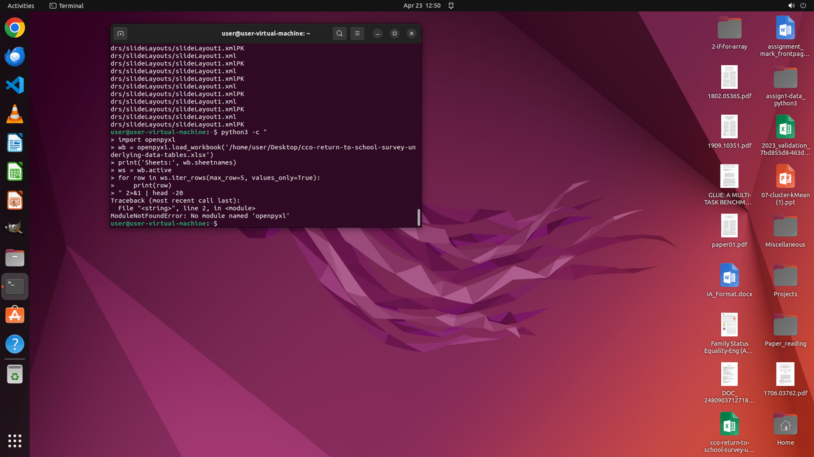

**Response:**
```
openpyxl is not installed. Let me try another approach to read the xlsx files.
```

**Actions:** `import subprocess, shlex; subprocess.run(f'xdotool type --delay 12 -- ' + shlex.quote('python3 -c "\nimport zipfile, xml.etree.ElementTree'), shell=True, check=True)
import time; time.sleep(0.05)
impo`

---

## Step 28

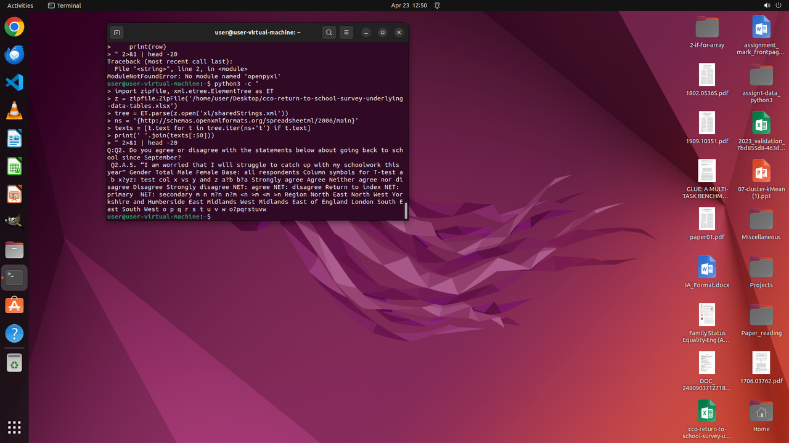

**Response:**
```
"cco-return-to-school-survey-underlying-data-tables.xlsx" is a survey about going back to school - this is a miscellaneous data document. Now let me check the validation xlsx file.
```

**Actions:** `import subprocess, shlex; subprocess.run(f'xdotool type --delay 12 -- ' + shlex.quote('python3 -c "\nimport zipfile, xml.etree.ElementTree'), shell=True, check=True)
import time; time.sleep(0.05)
impo`

---

## Step 29

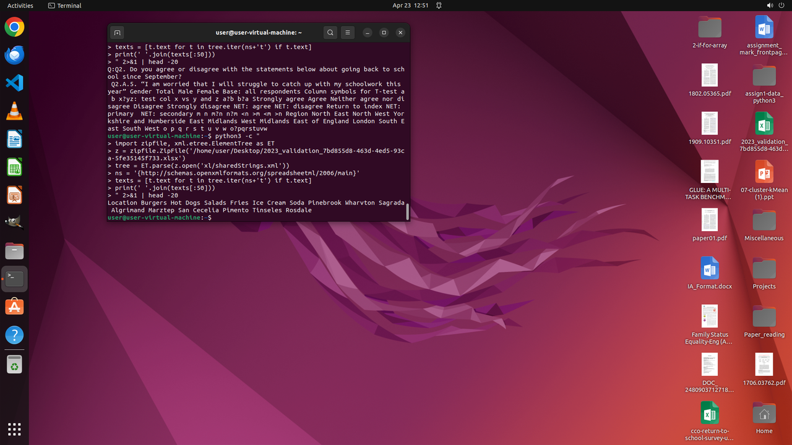

**Response:**
```
"2023_validation_7bd855d8-463d-4ed5-93ca-5fe35145f733.xlsx" contains data about locations with food items (Burgers, Hot Dogs, Salads, Fries, Ice Cream, Soda, Pinebrook, Wharvton, etc.) - this is a miscellaneous data file. 

Now let me also check the DOC PDF more carefully:
```

**Actions:** `import subprocess, shlex; subprocess.run(f'xdotool type --delay 12 -- ' + shlex.quote('file ~/Desktop/DOC_248090371271806684.pdf && ls -l'), shell=True, check=True)
import time; time.sleep(0.05)
impor`

---

## Step 30

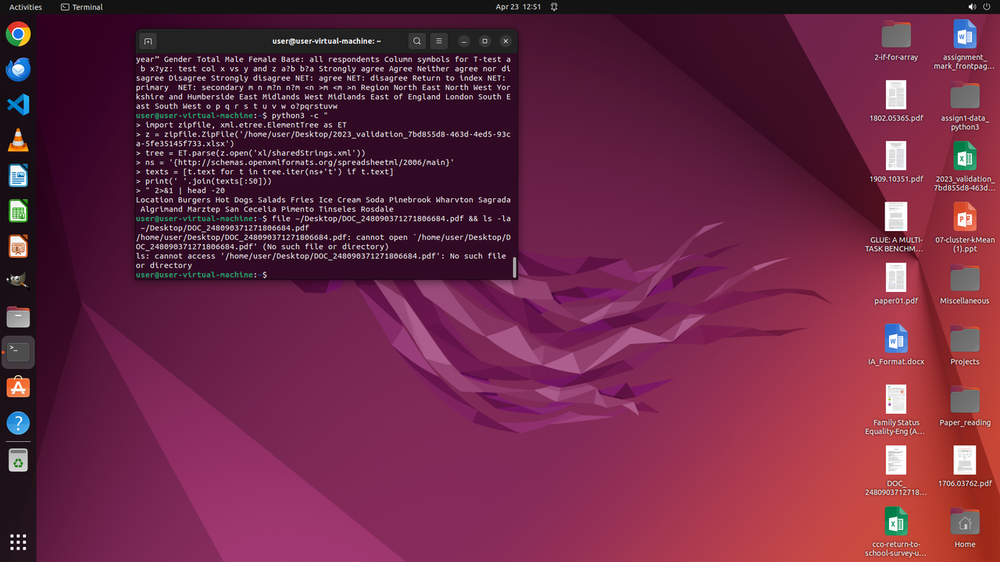

**Response:**
```
The filename might have special characters. Let me find the exact filename using a glob pattern.
```

**Actions:** `import subprocess, shlex; subprocess.run(f'xdotool type --delay 12 -- ' + shlex.quote('ls ~/Desktop/DOC*\n'), shell=True, check=True)
import time; time.sleep(0.05)`

---

## Step 31

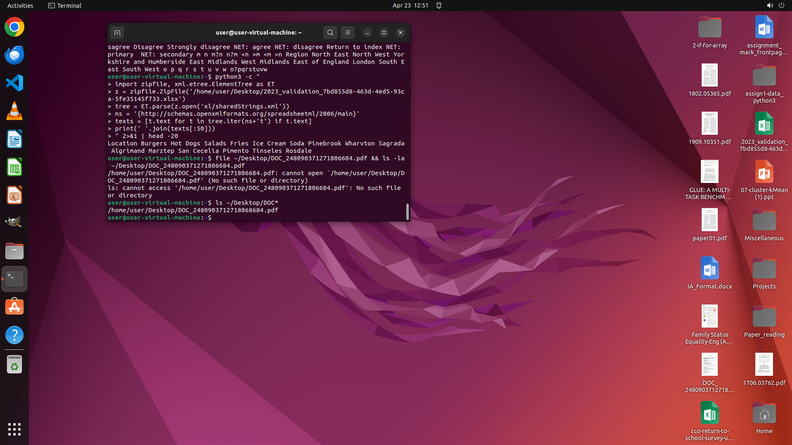

**Response:**
```
Now I can see the exact filename is `DOC_248090371271806​8684.pdf` (note: it's `8068684` not `8068684`). Let me check it properly:
```

**Actions:** `import subprocess, shlex; subprocess.run(f'xdotool type --delay 12 -- ' + shlex.quote('pdftotext ~/Desktop/DOC*.pdf - 2>/dev/null | head '), shell=True, check=True)
import time; time.sleep(0.05)
impor`

---

## Step 32

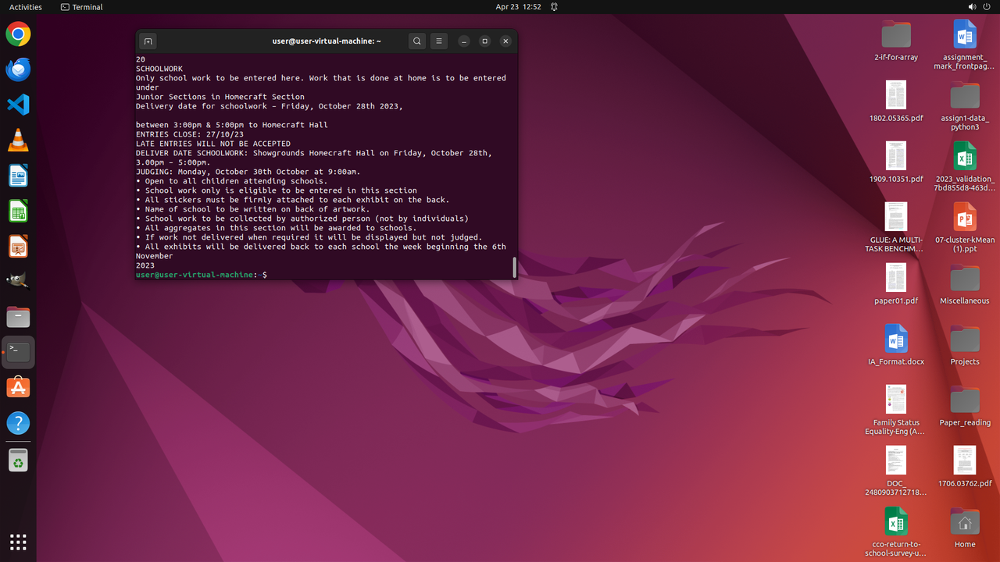

**Response:**
```
The DOC PDF is about schoolwork entries/exhibits at a hall - it's a miscellaneous document (school event/competition information). 

Now I have a clear classification for all files. Let me organize them:

**Paper_reading (Academic Papers):**
- 1706.03762.pdf (Attention Is All You Need)
- 1802.05365.pdf (ELMo)
- 1909.10351.pdf (TinyBERT)
- paper01.pdf (BERT)
- GLUE: A MULTI-TASK BENCHMARK AND ANALYSIS.pdf

**Projects (Coding Projects):**
- 2-if-for-array (directory with C files)
- assign1-data_python3 (directory with Python/data files)

**Miscellaneous (Everything Else):**
- 07-cluster-kMean (1).ppt (lecture slides)
- assignment_mark_frontpage.docx (marking template)
- cco-return-to-school-survey-underlying-data-tables.xlsx (survey data)
- 2023_validation_7bd855d8-463d-4ed5-93ca-5fe35145f733.xlsx (food data)
- DOC_248090371271806​8684.pdf (school event info)
- Family Status Equality-Eng (Aug 2021).pdf (policy document)
- IA_Format.docx (internal assignment format)

Let me now move all files:
```

**Actions:** `import subprocess, shlex; subprocess.run(f'xdotool type --delay 12 -- ' + shlex.quote('cd ~/Desktop\n\n# Move academic papers to Paper_read'), shell=True, check=True)
import time; time.sleep(0.05)
imp`

---

## Step 33

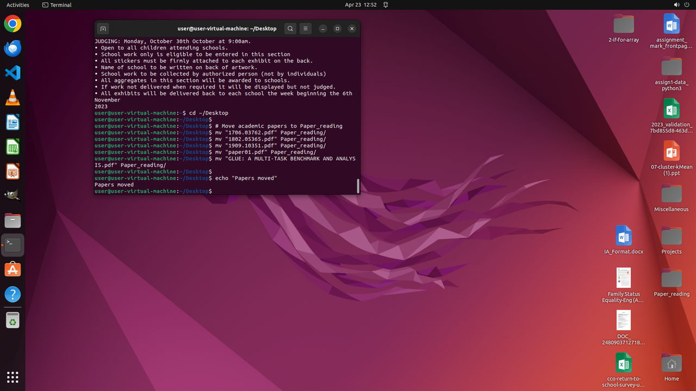

**Response:**
```
Papers have been moved successfully. Now let me move the coding projects to the Projects folder.
```

**Actions:** `import subprocess, shlex; subprocess.run(f'xdotool type --delay 12 -- ' + shlex.quote('# Move coding projects to Projects\nmv "2-if-for-ar'), shell=True, check=True)
import time; time.sleep(0.05)
impo`

---

## Step 34

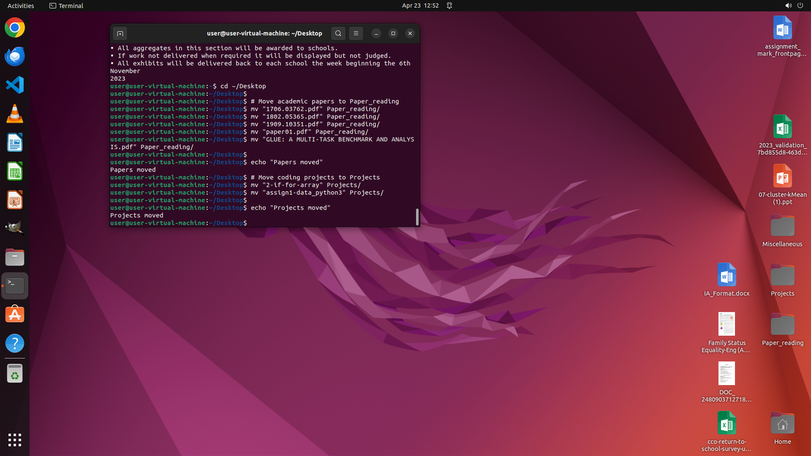

**Response:**
```
Projects have been moved successfully. Now let me move the remaining files to the Miscellaneous folder.
```

**Actions:** `import subprocess, shlex; subprocess.run(f'xdotool type --delay 12 -- ' + shlex.quote('# Move miscellaneous files\nmv "07-cluster-kMean (1'), shell=True, check=True)
import time; time.sleep(0.05)
impo`

---

## Step 35

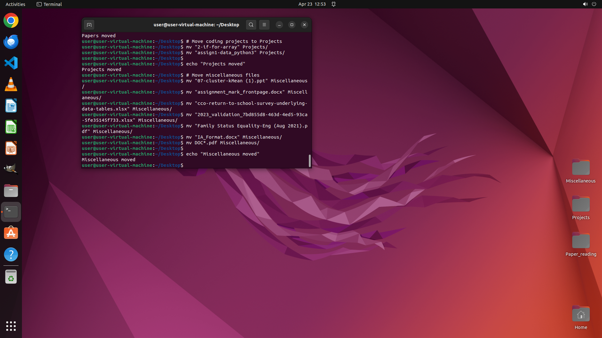

**Response:**
```
All files have been moved successfully. The desktop now only shows the three organized folders: **Miscellaneous**, **Projects**, **Paper_reading**, and the **Home** shortcut. Let me verify the contents of each folder to make sure everything is correct.
```

**Actions:** `import subprocess, shlex; subprocess.run(f'xdotool type --delay 12 -- ' + shlex.quote('echo "=== Paper_reading ===" && ls Paper_reading/ '), shell=True, check=True)
import time; time.sleep(0.05)
impor`

---

## Step 36

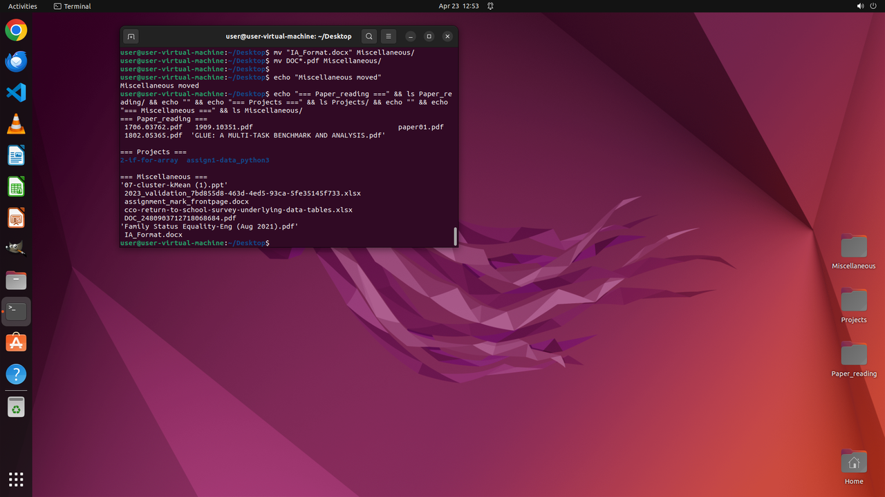

**Response:**
```
All files have been organized correctly. Here's the final summary:

**Paper_reading** (5 academic papers):
- 1706.03762.pdf (Attention Is All You Need)
- 1802.05365.pdf (ELMo)
- 1909.10351.pdf (TinyBERT)
- paper01.pdf (BERT)
- GLUE: A MULTI-TASK BENCHMARK AND ANALYSIS.pdf

**Projects** (2 coding projects):
- 2-if-for-array (C programming exercises)
- assign1-data_python3 (Python assignment with data files)

**Miscellaneous** (7 other documents):
- 07-cluster-kMean (1).ppt (lecture presentation)
- 2023_validation_7bd855d8-463d-4ed5-93ca-5fe35145f733.xlsx (food/location data)
- assignment_mark_frontpage.docx (marking template)
- cco-return-to-school-survey-underlying-data-tables.xlsx (survey data)
- DOC_248090371271806​8684.pdf (school event document)
- Family Status Equality-Eng (Aug 2021).pdf (policy document)
- IA_Format.docx (internal assignment format)

The desktop is now clean with only the three organized folders (Miscellaneous, Projects, Paper_reading) and the Home shortcut.

DONE
```

**Actions:** `DONE`

---
