# Task 869de13e-bef9-4b91-ba51-f6708c40b096

**Instruction:** Can you organize my desktop by identifying academic papers, coding projects, and other documents, ensuring no file is misplaced? Specifically, place academic papers in the 'Paper_reading' folder, coding projects in 'Projects', and categorize everything else under 'Miscellaneous'. For files lacking clear extensions or names, apply content analysis to determine their appropriate classification.

**Score:** 1.0

**Wall clock:** 7m 27s

**Steps:** 22

**Cost:** $0.72

---

## Step 1


**Response:**
```
I'll start by analyzing the desktop files and organizing them into the appropriate folders. Let me first take a closer look at what's on the desktop and examine files that need content analysis.
```

**Actions:** `time.sleep(0.1)`

---

## Step 2

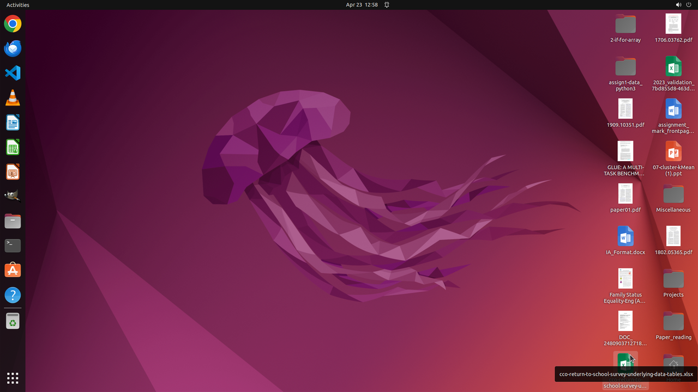

**Response:**
```
Let me open a terminal to examine the desktop files and their contents for proper classification.
```

**Actions:** `pyautogui.keyDown('ctrl')
pyautogui.keyDown('alt')
pyautogui.keyDown('t')
pyautogui.keyUp('t')
pyautogui.keyUp('alt')
pyautogui.keyUp('ctrl')`

---

## Step 3

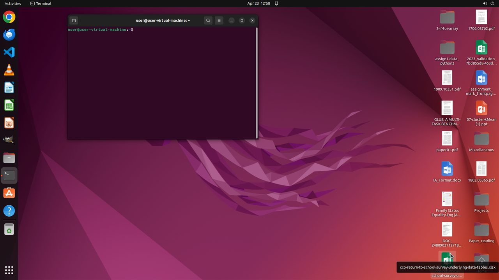

**Response:**
```
Good, the terminal is open. Let me first list all files on the desktop to get a complete view.
```

**Actions:** `import subprocess, shlex; subprocess.run(f'xdotool type --delay 12 -- ' + shlex.quote('ls -la ~/Desktop/\n'), shell=True, check=True)
import time; time.sleep(0.05)`

---

## Step 4

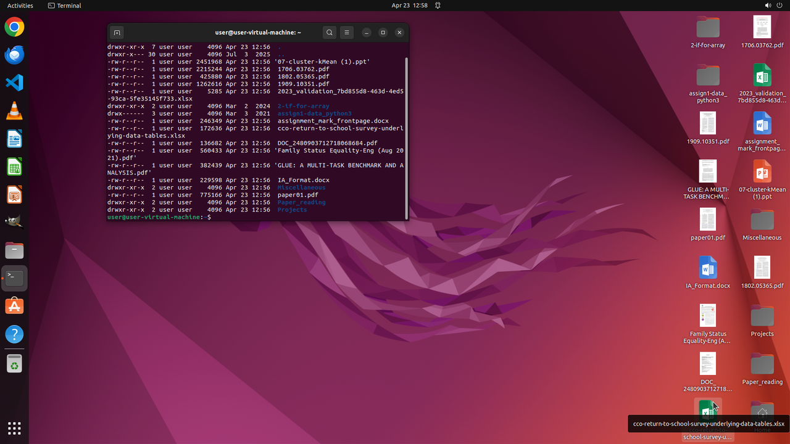

**Response:**
```
Now I can see all the files. Let me examine the files that need content analysis to properly classify them. Let me check the files without clear extensions or ambiguous names first.
```

**Actions:** `import subprocess, shlex; subprocess.run(f'xdotool type --delay 12 -- ' + shlex.quote('file ~/Desktop/2-if-for-array ~/Desktop/assign1-da'), shell=True, check=True)
import time; time.sleep(0.05)
impor`

---

## Step 5

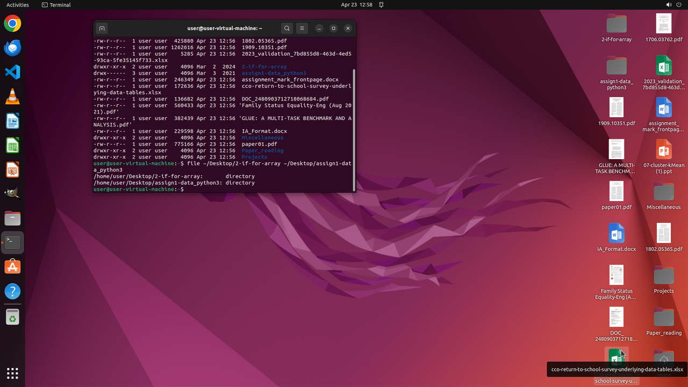

**Response:**
```
Both `2-if-for-array` and `assign1-data_python3` are directories. Let me examine their contents to understand what they are, and also check other files.
```

**Actions:** `import subprocess, shlex; subprocess.run(f'xdotool type --delay 12 -- ' + shlex.quote('ls ~/Desktop/2-if-for-array/ && echo "---" && ls ~'), shell=True, check=True)
import time; time.sleep(0.05)
impor`

---

## Step 6

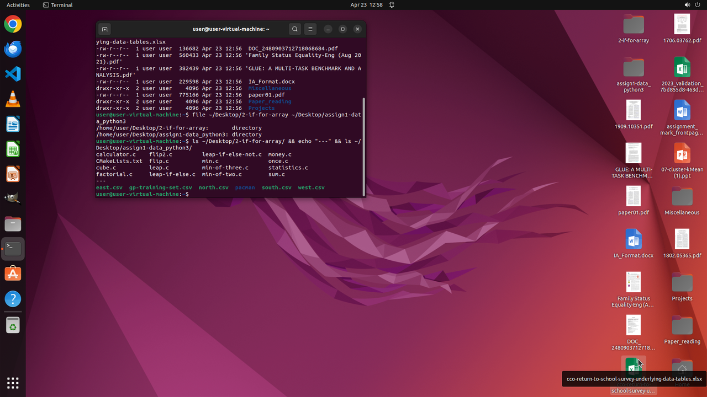

**Response:**
```
Now I can see:
- `2-if-for-array` contains C programming files (calculator.c, factorial.c, etc.) - this is a **coding project**
- `assign1-data_python3` contains CSV files and a `pacman` directory - this is a **coding project** (data science/Python assignment)

Let me now examine the PDF files and other documents to classify them properly.
```

**Actions:** `import subprocess, shlex; subprocess.run(f'xdotool type --delay 12 -- ' + shlex.quote('pdfinfo ~/Desktop/1706.03762.pdf 2>/dev/null | hea'), shell=True, check=True)
import time; time.sleep(0.05)
impor`

---

## Step 7

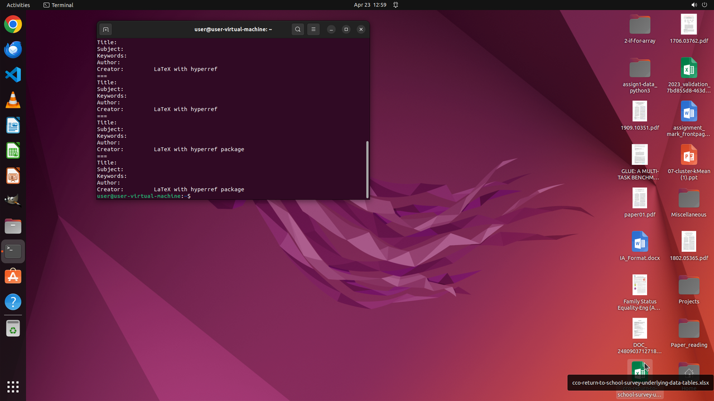

**Response:**
```
The PDFs with arXiv-style names (1706.03762.pdf, 1909.10351.pdf, 1802.05365.pdf) are all created with "LaTeX with hyperref" - these are academic papers. paper01.pdf is also created with "LaTeX with hyperref package" - also an academic paper.

Let me now check the remaining files - the GLUE paper, DOC file, and other documents.
```

**Actions:** `import subprocess, shlex; subprocess.run(f'xdotool type --delay 12 -- ' + shlex.quote('pdfinfo ~/Desktop/"GLUE: A MULTI-TASK BENCHMARK AN'), shell=True, check=True)
import time; time.sleep(0.05)
impor`

---

## Step 8

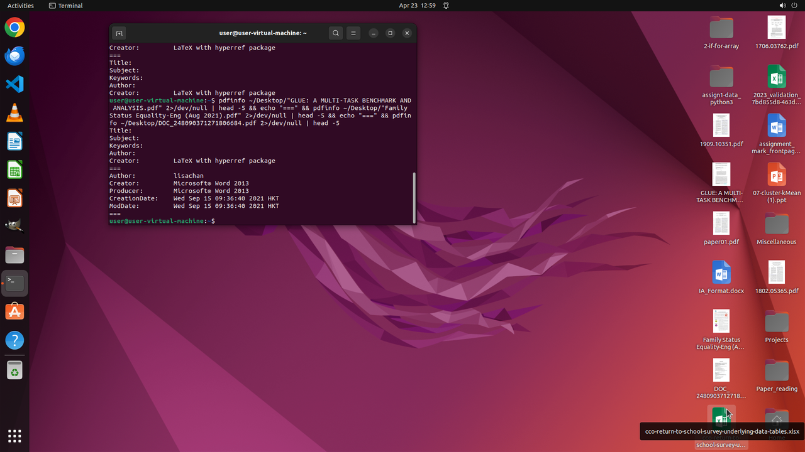

**Response:**
```
Now I can see:
- "GLUE: A MULTI-TASK BENCHMARK AND ANALYSIS.pdf" - Created with LaTeX hyperref → **Academic paper**
- "Family Status Equality-Eng (Aug 2021).pdf" - Created with LaTeX hyperref → Need more analysis, but the name suggests it could be a policy/legal document
- "DOC_248090371271806684.pdf" - Created with Microsoft Word 2013 by "lisachan" → Not an academic paper

Let me check the content of the remaining files and the ambiguous ones more closely.
```

**Actions:** `import subprocess, shlex; subprocess.run(f'xdotool type --delay 12 -- ' + shlex.quote('pdftotext ~/Desktop/"Family Status Equality-Eng (A'), shell=True, check=True)
import time; time.sleep(0.05)
impor`

---

## Step 9

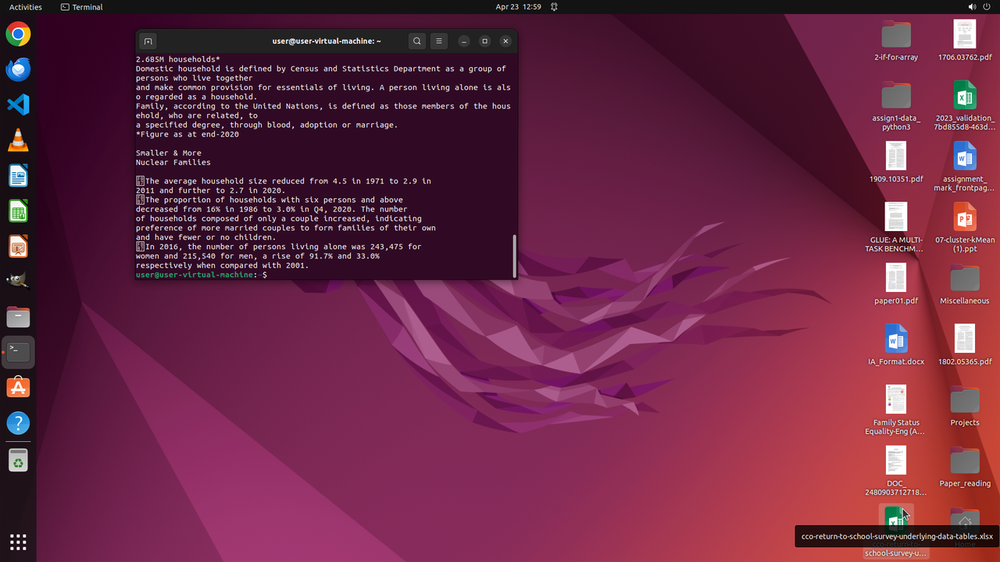

**Response:**
```
"Family Status Equality-Eng (Aug 2021).pdf" is a government statistics/census document about households - this is **Miscellaneous** (not an academic paper, not a coding project).

Let me now check the DOC file and other remaining files.
```

**Actions:** `import subprocess, shlex; subprocess.run(f'xdotool type --delay 12 -- ' + shlex.quote('pdftotext ~/Desktop/DOC_248090371271806684.pdf - 2'), shell=True, check=True)
import time; time.sleep(0.05)
impor`

---

## Step 10


**Response:**
```
The DOC PDF seems to have no extractable text (possibly a scanned image). Let me check the other files - IA_Format.docx, assignment_mark_frontpage.docx, the xlsx files, and the ppt file.
```

**Actions:** `import subprocess, shlex; subprocess.run(f'xdotool type --delay 12 -- ' + shlex.quote('file ~/Desktop/IA_Format.docx ~/Desktop/assignment'), shell=True, check=True)
import time; time.sleep(0.05)
impor`

---

## Step 11

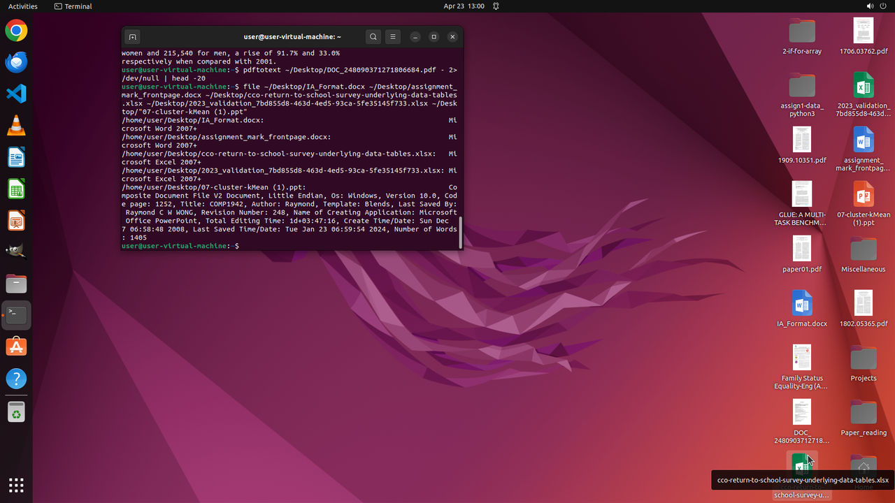

**Response:**
```
Now I have more information:
- `IA_Format.docx` - Microsoft Word 2007+ document
- `assignment_mark_frontpage.docx` - Microsoft Word 2007+ document
- `cco-return-to-school-survey-underlying-data-tables.xlsx` - Microsoft Excel 2007+
- `2023_validation_7bd855d8-463d-4ed5-93ca-5fe35145f733.xlsx` - Microsoft Excel 2007+
- `07-cluster-kMean (1).ppt` - PowerPoint, Title: COMP1942, Author: Raymond - this is a **course lecture slide** (academic/teaching material)

Let me check the content of the docx files and the DOC PDF to properly classify them.
```

**Actions:** `import subprocess, shlex; subprocess.run(f'xdotool type --delay 12 -- ' + shlex.quote('python3 -c "\nimport zipfile, xml.etree.ElementTree'), shell=True, check=True)
import time; time.sleep(0.05)
impo`

---

## Step 12

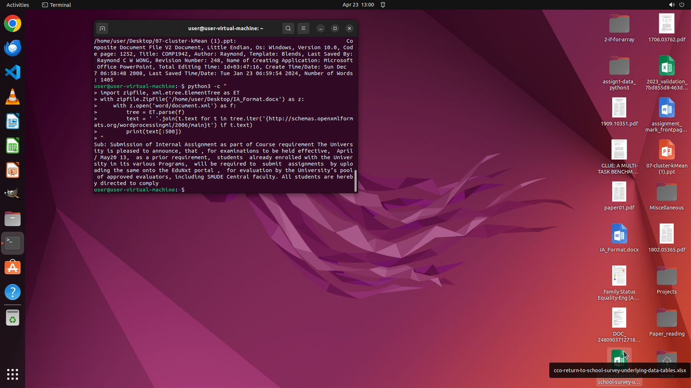

**Response:**
```
`IA_Format.docx` is about "Submission of Internal Assignment as part of Course requirement" from a University - this is a **Miscellaneous** document (university administrative/assignment format document).

Now let me check the `assignment_mark_frontpage.docx`:
```

**Actions:** `import subprocess, shlex; subprocess.run(f'xdotool type --delay 12 -- ' + shlex.quote('python3 -c "\nimport zipfile, xml.etree.ElementTree'), shell=True, check=True)
import time; time.sleep(0.05)
impo`

---

## Step 13

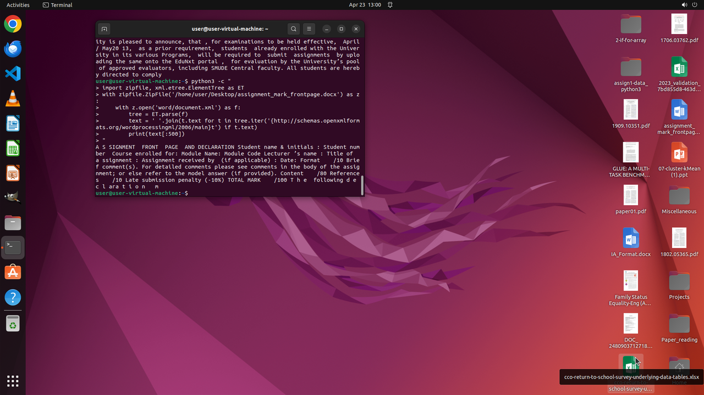

**Response:**
```
`assignment_mark_frontpage.docx` is an "ASSIGNMENT FRONT PAGE AND DECLARATION" template for student assignments - this is **Miscellaneous** (administrative/template document).

Now let me check the DOC PDF content and also look at what's already in the existing folders:
```

**Actions:** `import subprocess, shlex; subprocess.run(f'xdotool type --delay 12 -- ' + shlex.quote('ls ~/Desktop/Miscellaneous/ ~/Desktop/Paper_readin'), shell=True, check=True)
import time; time.sleep(0.05)
impor`

---

## Step 14

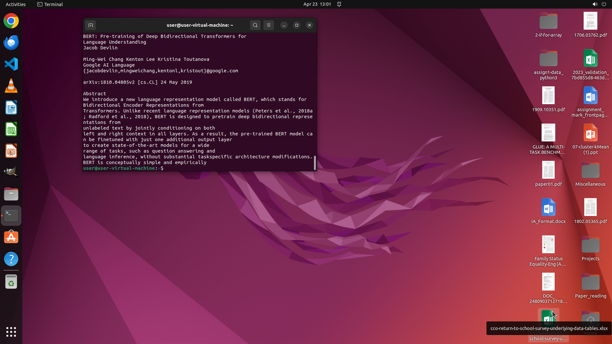

**Response:**
```
`paper01.pdf` is the BERT paper (arXiv:1810.04805) - definitely an **academic paper**.

The existing folders appear to be empty. Now let me check what's in the existing folders and also verify the remaining files:
```

**Actions:** `import subprocess, shlex; subprocess.run(f'xdotool type --delay 12 -- ' + shlex.quote('ls -la ~/Desktop/Miscellaneous/ && echo "===" && l'), shell=True, check=True)
import time; time.sleep(0.05)
impor`

---

## Step 15

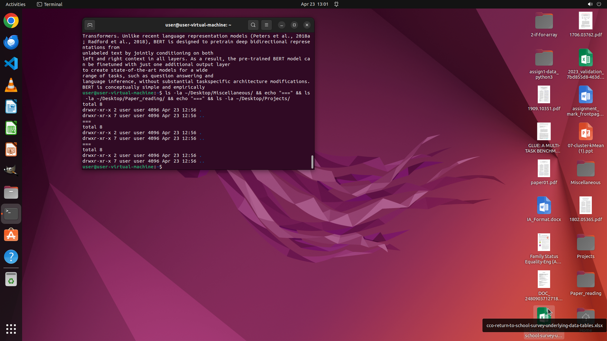

**Response:**
```
All three folders (Miscellaneous, Paper_reading, Projects) are empty. Now I have a clear picture of all files. Let me also quickly check the remaining PDFs to confirm their classification:
```

**Actions:** `import subprocess, shlex; subprocess.run(f'xdotool type --delay 12 -- ' + shlex.quote('pdftotext ~/Desktop/1706.03762.pdf - 2>/dev/null |'), shell=True, check=True)
import time; time.sleep(0.05)
impor`

---

## Step 16

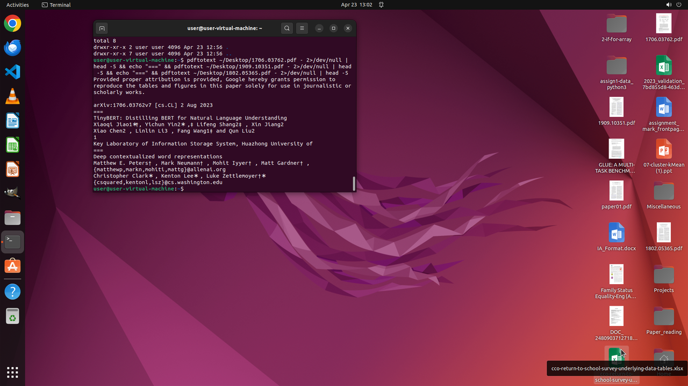

**Response:**
```
Now I have confirmed all classifications:

- `1706.03762.pdf` - "Attention Is All You Need" (arXiv paper) → **Academic paper**
- `1909.10351.pdf` - "TinyBERT: Distilling BERT for Natural Language Understanding" → **Academic paper**
- `1802.05365.pdf` - "Deep contextualized word representations" (ELMo paper) → **Academic paper**

Now let me create my complete classification and move all files. Here's my plan:

**Paper_reading (Academic papers):**
- 1706.03762.pdf
- 1909.10351.pdf
- 1802.05365.pdf
- paper01.pdf (BERT paper)
- GLUE: A MULTI-TASK BENCHMARK AND ANALYSIS.pdf

**Projects (Coding projects):**
- 2-if-for-array (C programming directory)
- assign1-data_python3 (Python/data science directory)

**Miscellaneous (Everything else):**
- 07-cluster-kMean (1).ppt (lecture slides)
- assignment_mark_frontpage.docx
- cco-return-to-school-survey-underlying-data-tables.xlsx
- 2023_validation_7bd855d8-463d-4ed5-93ca-5fe35145f733.xlsx
- DOC_248090371271806684.pdf
- Family Status Equality-Eng (Aug 2021).pdf
- IA_Format.docx

Let me move them all now:
```

**Actions:** `import subprocess, shlex; subprocess.run(f'xdotool type --delay 12 -- ' + shlex.quote('mv ~/Desktop/1706.03762.pdf ~/Desktop/1909.10351.p'), shell=True, check=True)
import time; time.sleep(0.05)
impor`

---

## Step 17

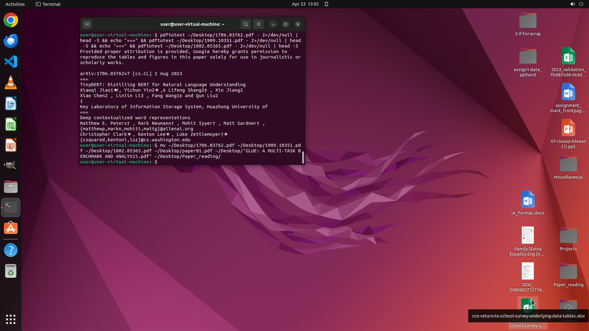

**Response:**
```
Academic papers have been moved to Paper_reading. Now let me move the coding projects to the Projects folder:
```

**Actions:** `import subprocess, shlex; subprocess.run(f'xdotool type --delay 12 -- ' + shlex.quote('mv ~/Desktop/2-if-for-array ~/Desktop/assign1-data'), shell=True, check=True)
import time; time.sleep(0.05)
impor`

---

## Step 18

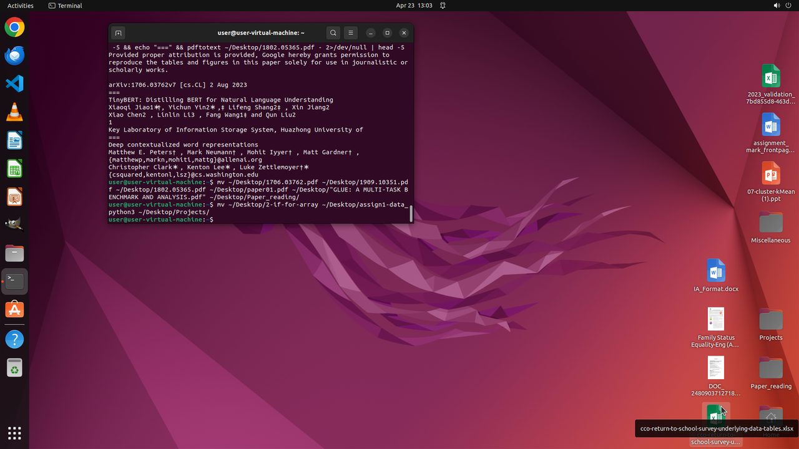

**Response:**
```
Coding projects moved to Projects. Now let me move all the remaining files to Miscellaneous:
```

**Actions:** `import subprocess, shlex; subprocess.run(f'xdotool type --delay 12 -- ' + shlex.quote('mv ~/Desktop/"07-cluster-kMean (1).ppt" ~/Desktop/'), shell=True, check=True)
import time; time.sleep(0.05)
impor`

---

## Step 19

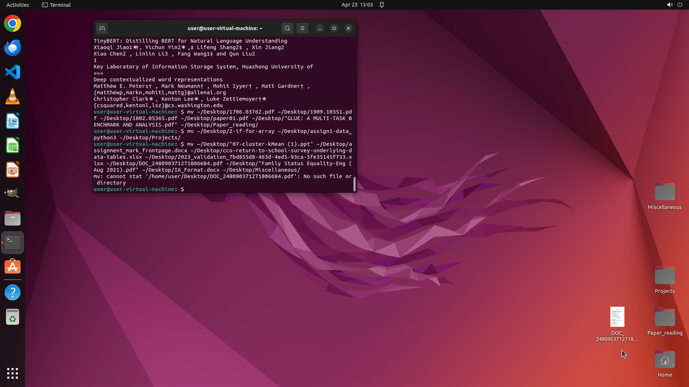

**Response:**
```
There was an error with the DOC file - the filename was slightly different. Let me find the exact filename and move it:
```

**Actions:** `import subprocess, shlex; subprocess.run(f'xdotool type --delay 12 -- ' + shlex.quote('ls ~/Desktop/DOC*\n'), shell=True, check=True)
import time; time.sleep(0.05)`

---

## Step 20

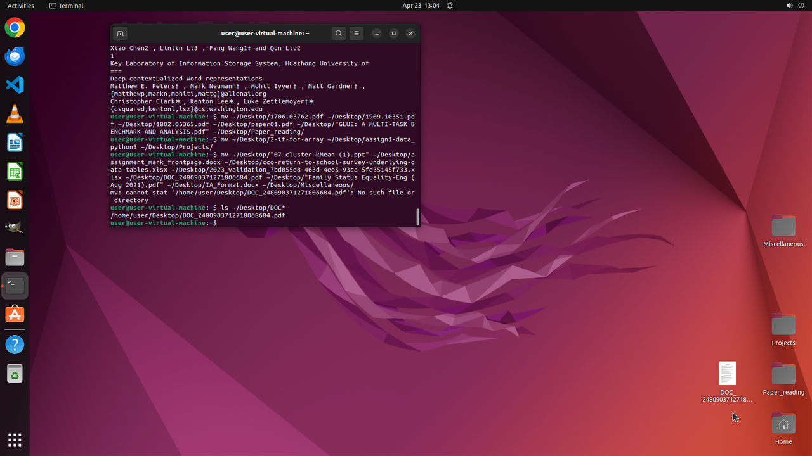

**Response:**
```
I see the actual filename is `DOC_248090371271806**8**684.pdf` (with an extra '8'). Let me move it now:
```

**Actions:** `import subprocess, shlex; subprocess.run(f'xdotool type --delay 12 -- ' + shlex.quote('mv ~/Desktop/DOC_24809037127180*684.pdf ~/Desktop/'), shell=True, check=True)
import time; time.sleep(0.05)
impor`

---

## Step 21

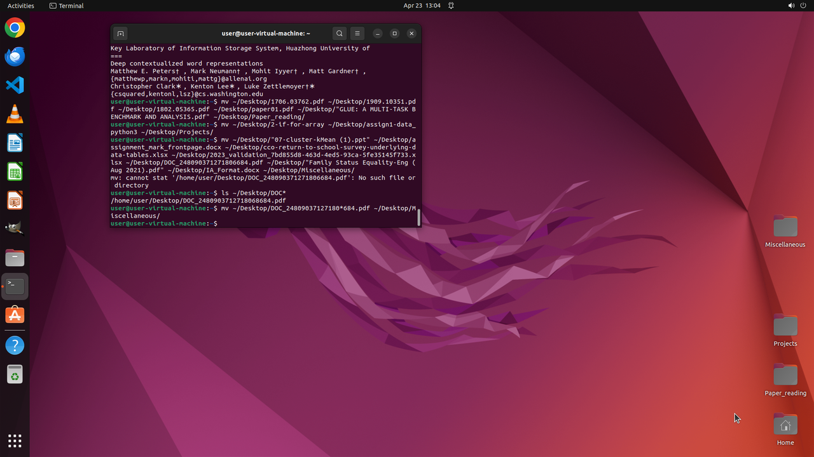

**Response:**
```
All files have been moved. The desktop now only shows the three folders (Miscellaneous, Projects, Paper_reading) and the Home icon. Let me verify the contents of each folder to make sure everything is properly organized:
```

**Actions:** `import subprocess, shlex; subprocess.run(f'xdotool type --delay 12 -- ' + shlex.quote('echo "=== Paper_reading ===" && ls ~/Desktop/Paper'), shell=True, check=True)
import time; time.sleep(0.05)
impor`

---

## Step 22

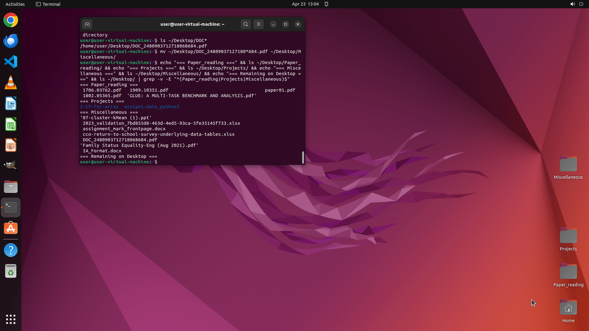

**Response:**
```
All files have been successfully organized. Here's the final summary:

**Paper_reading** (5 academic papers):
- 1706.03762.pdf (Attention Is All You Need)
- 1909.10351.pdf (TinyBERT)
- 1802.05365.pdf (Deep contextualized word representations - ELMo)
- paper01.pdf (BERT)
- GLUE: A MULTI-TASK BENCHMARK AND ANALYSIS.pdf

**Projects** (2 coding projects):
- 2-if-for-array (C programming exercises)
- assign1-data_python3 (Python data science assignment)

**Miscellaneous** (7 other documents):
- 07-cluster-kMean (1).ppt (lecture slides)
- 2023_validation_7bd855d8-463d-4ed5-93ca-5fe35145f733.xlsx (validation data)
- assignment_mark_frontpage.docx (assignment template)
- cco-return-to-school-survey-underlying-data-tables.xlsx (survey data)
- DOC_248090371271806​8684.pdf (Word-generated document)
- Family Status Equality-Eng (Aug 2021).pdf (government statistics)
- IA_Format.docx (university assignment format)

Nothing remains on the desktop except the three organized folders. The desktop is now clean and organized!

DONE
```

**Actions:** `DONE`

---
