# Task 873cafdd-a581-47f6-8b33-b9696ddb7b05

**Instruction:** My friend is a "plugin guru" and he recommended some good plug-ins to me. Please go to the Chrome plug-in store and install all the listed plug-ins.

**Score:** 1.0

**Wall clock:** 5m 28s

**Steps:** 33

**Cost:** $1.01

---

## Step 1

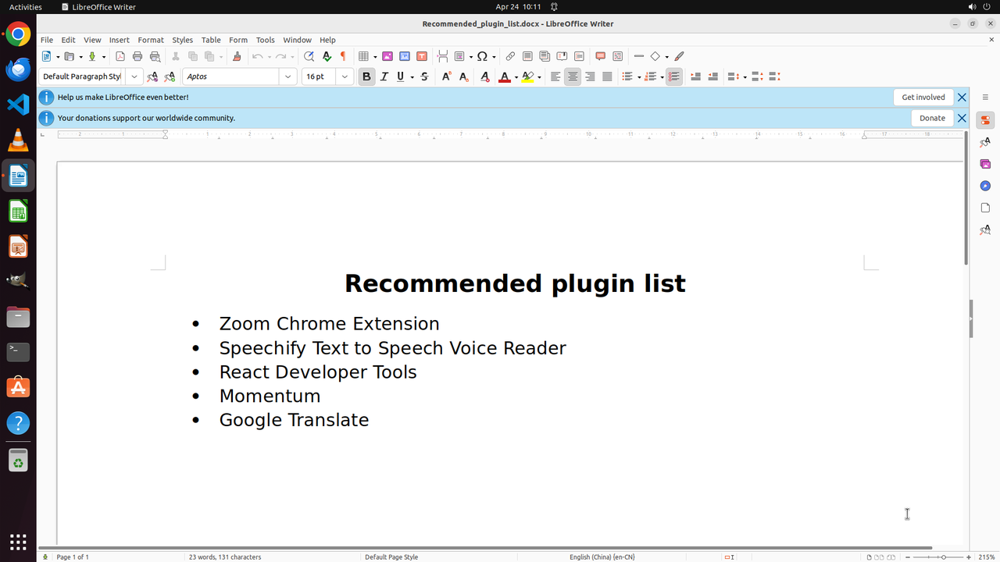

**Response:**
```
I can see the recommended plugin list in LibreOffice Writer. The plugins to install are:

1. Zoom Chrome Extension
2. Speechify Text to Speech Voice Reader
3. React Developer Tools
4. Momentum
5. Google Translate

Let me open Chrome and install each of these from the Chrome Web Store.
```

**Actions:** `pyautogui.click(33, 64)`

---

## Step 2

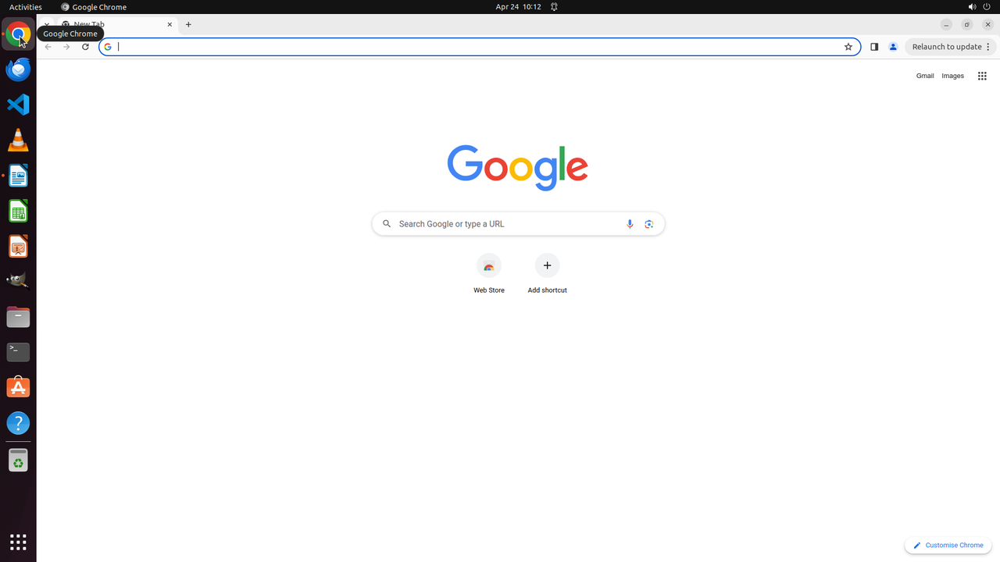

**Response:**
```
Chrome is open. Let me navigate to the Chrome Web Store to search for the first plugin - "Zoom Chrome Extension".
```

**Actions:** `pyautogui.click(960, 88)`

---

## Step 3

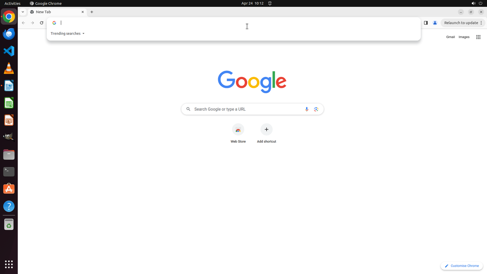

**Response:**
```
Let me navigate to the Chrome Web Store and search for the first plugin.
```

**Actions:** `import subprocess, shlex; subprocess.run(f'xdotool type --delay 12 -- ' + shlex.quote('https://chromewebstore.google.com/search/Zoom%20Ch'), shell=True, check=True)
import time; time.sleep(0.05)
impor`

---

## Step 4

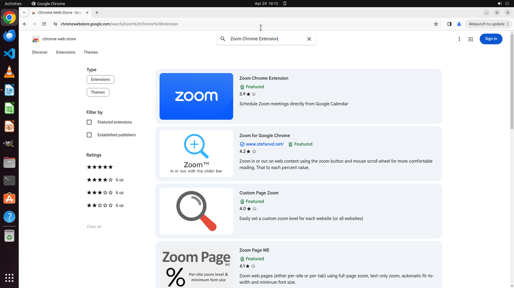

**Response:**
```
I can see "Zoom Chrome Extension" in the search results. Let me click on it to install it.
```

**Actions:** `pyautogui.click(984, 292)`

---

## Step 5

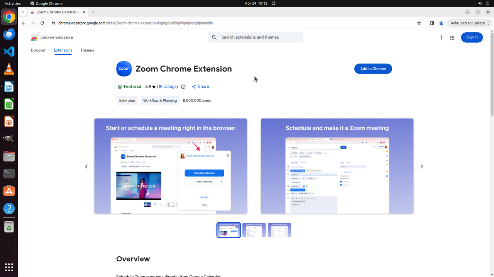

**Response:**
```
I'm on the Zoom Chrome Extension page. Let me click "Add to Chrome" to install it.
```

**Actions:** `pyautogui.click(1446, 267)`

---

## Step 6

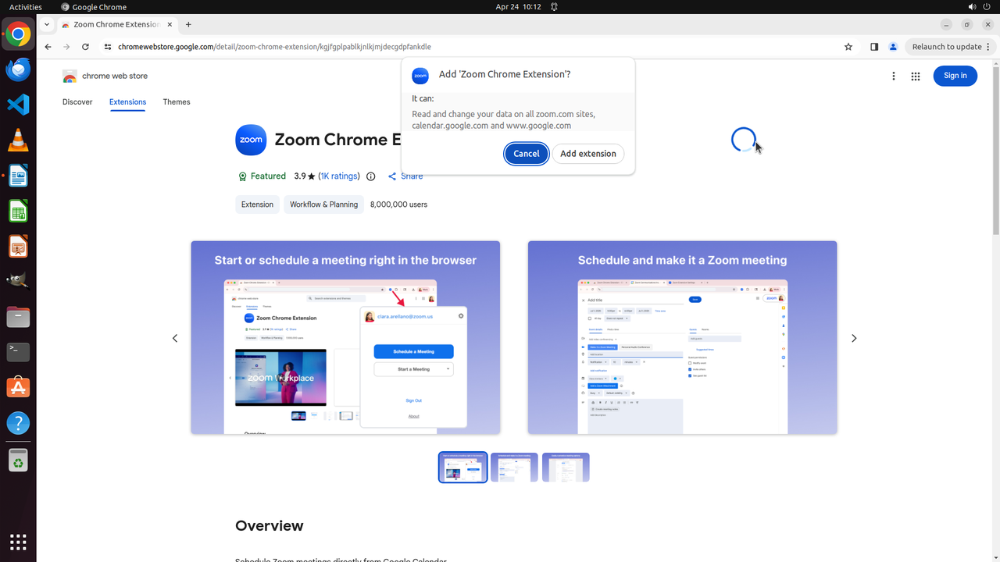

**Response:**
```
A confirmation dialog appeared. Let me click "Add extension" to confirm the installation.
```

**Actions:** `pyautogui.click(1128, 294)`

---

## Step 7

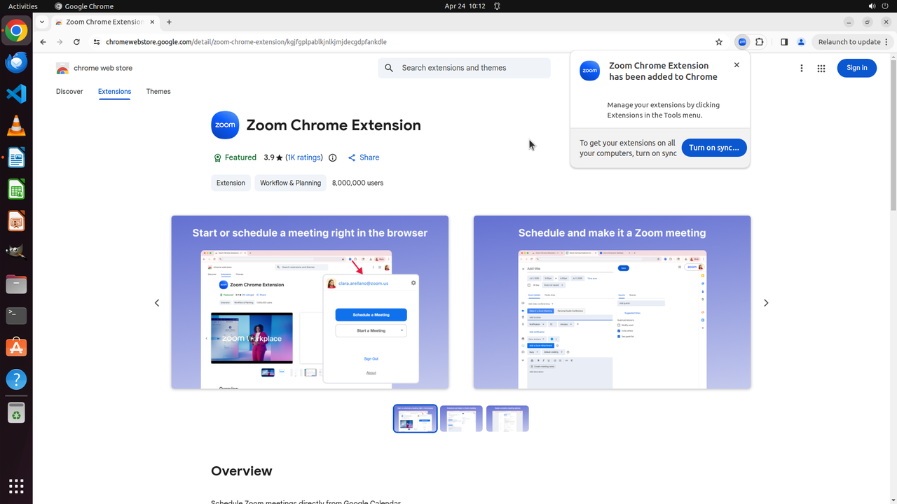

**Response:**
```
Zoom Chrome Extension has been successfully installed. Now let me close this notification and search for the next plugin - "Speechify Text to Speech Voice Reader".
```

**Actions:** `pyautogui.click(1573, 138)`

---

## Step 8


**Response:**
```
Zoom Chrome Extension is installed (showing "Remove from Chrome"). Now let me search for the second plugin - "Speechify Text to Speech Voice Reader".
```

**Actions:** `pyautogui.click(960, 88)`

---

## Step 9

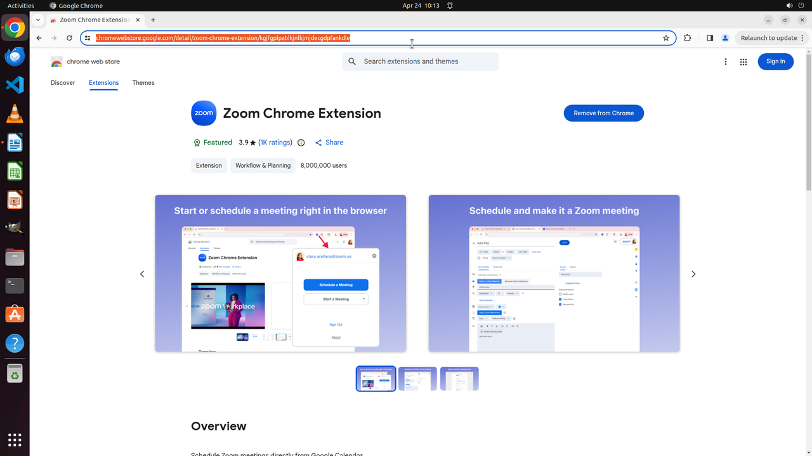

**Actions:** `import subprocess, shlex; subprocess.run(f'xdotool type --delay 12 -- ' + shlex.quote('https://chromewebstore.google.com/search/Speechify'), shell=True, check=True)
import time; time.sleep(0.05)
impor`

---

## Step 10

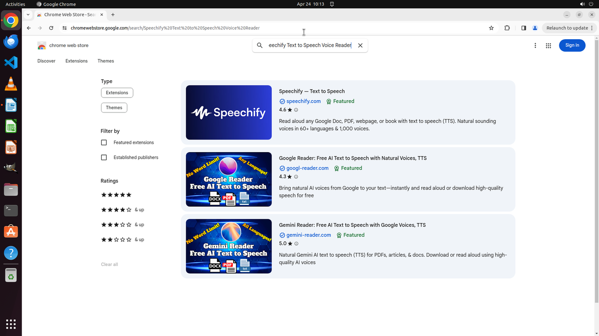

**Response:**
```
I can see "Speechify — Text to Speech" which matches "Speechify Text to Speech Voice Reader" from the list. Let me click on it.
```

**Actions:** `pyautogui.click(997, 292)`

---

## Step 11

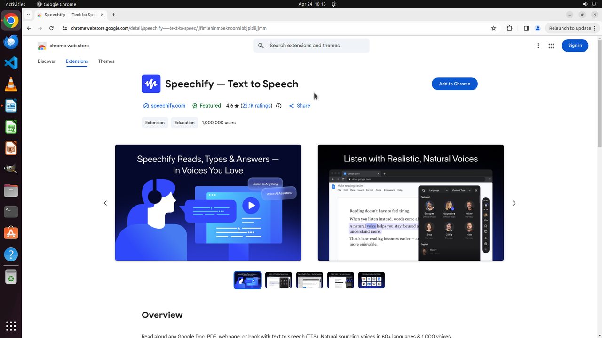

**Response:**
```
I'm on the Speechify — Text to Speech page. Let me click "Add to Chrome" to install it.
```

**Actions:** `pyautogui.click(1446, 267)`

---

## Step 12

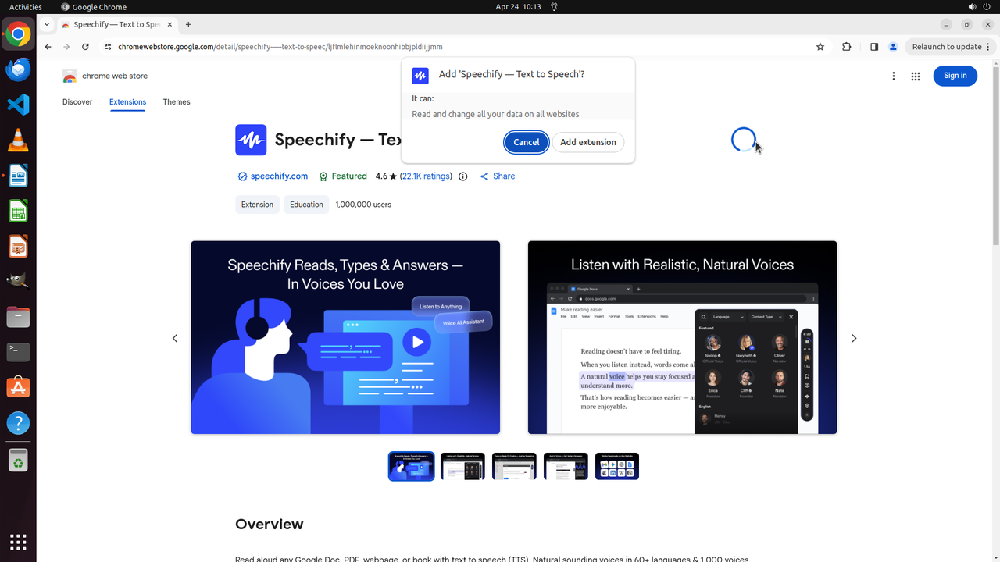

**Response:**
```
The confirmation dialog appeared. Let me click "Add extension" to confirm.
```

**Actions:** `pyautogui.click(1128, 271)`

---

## Step 13

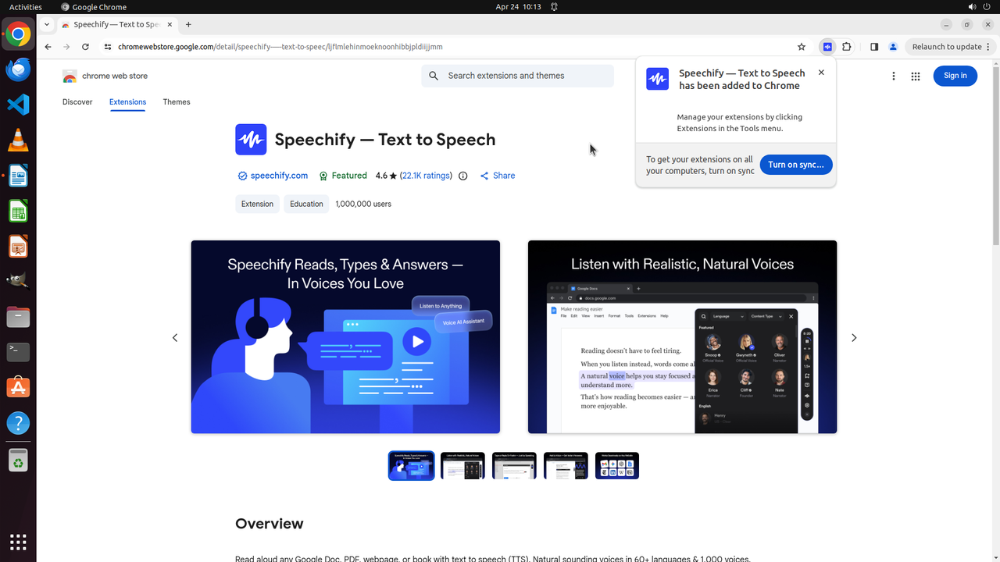

**Response:**
```
Speechify has been successfully installed. Now let me close this notification and search for the third plugin - "React Developer Tools".
```

**Actions:** `pyautogui.click(1573, 138)`

---

## Step 14

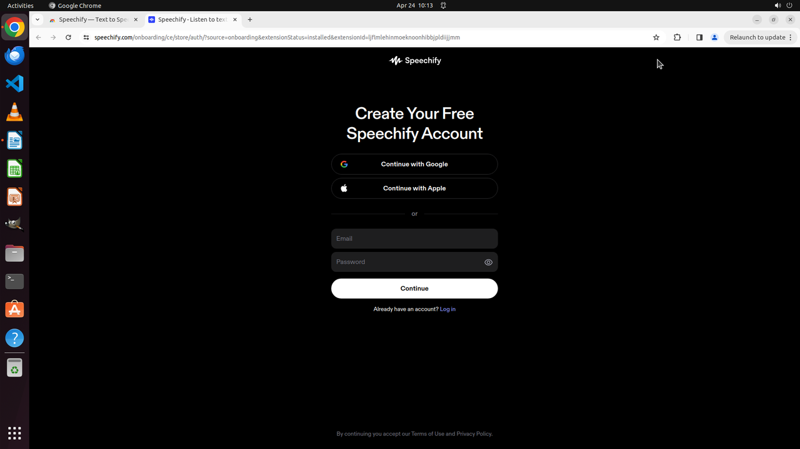

**Response:**
```
Speechify opened a new tab for account creation. I don't need to create an account - the extension is already installed. Let me close this tab and go back to the Chrome Web Store to search for the next plugin.
```

**Actions:** `pyautogui.click(564, 46)`

---

## Step 15


**Response:**
```
Speechify is installed (showing "Remove from Chrome"). Now let me search for the third plugin - "React Developer Tools".
```

**Actions:** `pyautogui.click(960, 88)`

---

## Step 16

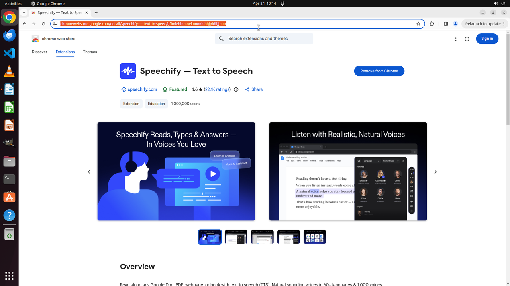

**Actions:** `import subprocess, shlex; subprocess.run(f'xdotool type --delay 12 -- ' + shlex.quote('https://chromewebstore.google.com/search/React%20D'), shell=True, check=True)
import time; time.sleep(0.05)
impor`

---

## Step 17

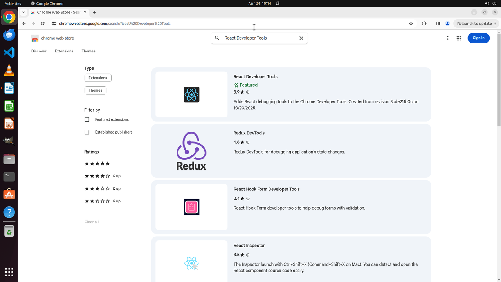

**Response:**
```
I can see "React Developer Tools" at the top of the search results. Let me click on it.
```

**Actions:** `pyautogui.click(976, 292)`

---

## Step 18

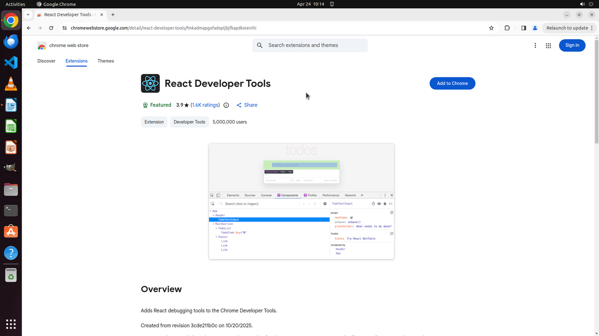

**Response:**
```
I'm on the React Developer Tools page. Let me click "Add to Chrome" to install it.
```

**Actions:** `pyautogui.click(1446, 267)`

---

## Step 19

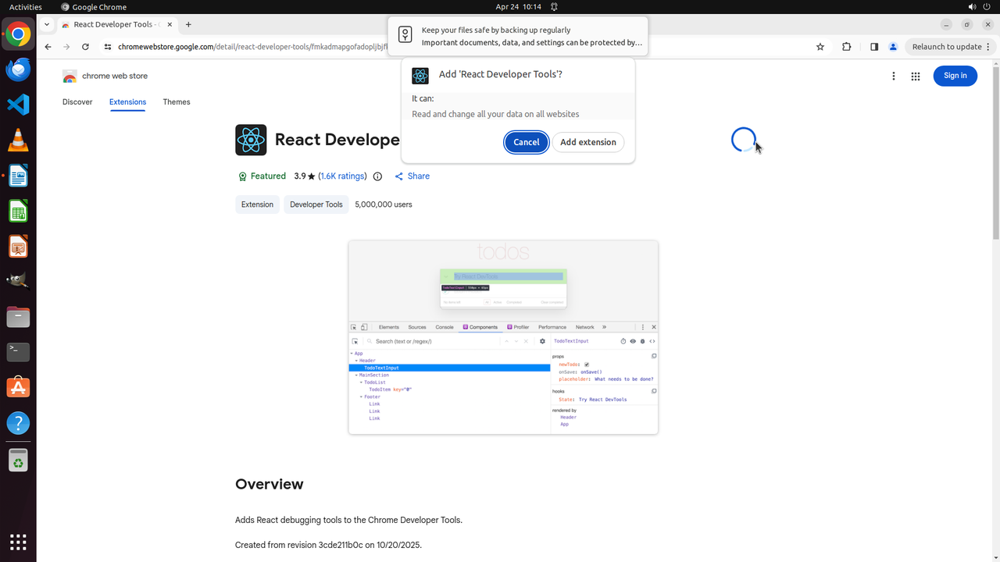

**Response:**
```
The confirmation dialog appeared. Let me click "Add extension" to confirm the installation.
```

**Actions:** `pyautogui.click(1128, 271)`

---

## Step 20

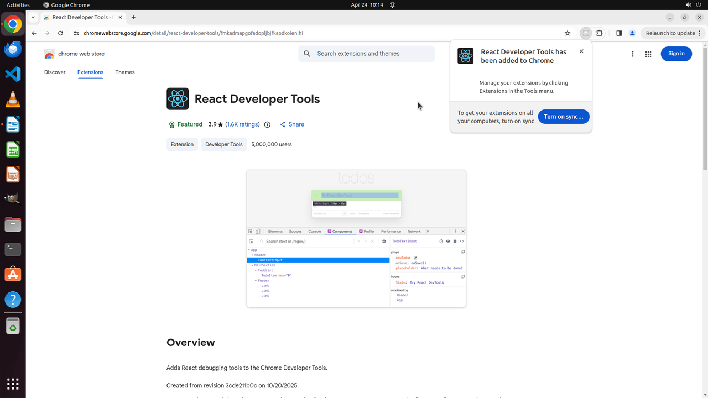

**Response:**
```
React Developer Tools has been successfully installed. Now let me close this notification and search for the fourth plugin - "Momentum".
```

**Actions:** `pyautogui.click(1573, 138)`

---

## Step 21

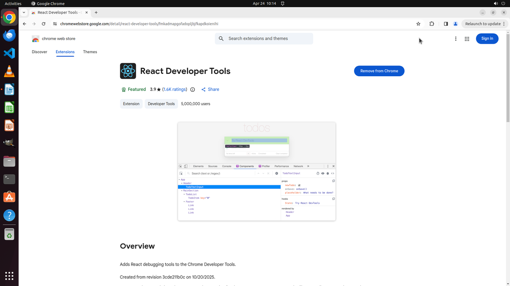

**Response:**
```
React Developer Tools is installed (showing "Remove from Chrome"). Now let me search for the fourth plugin - "Momentum".
```

**Actions:** `pyautogui.click(960, 88)`

---

## Step 22

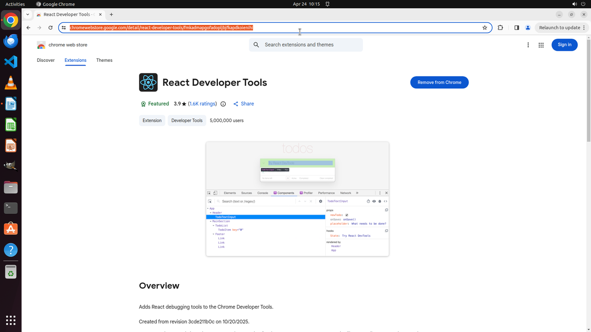

**Actions:** `import subprocess, shlex; subprocess.run(f'xdotool type --delay 12 -- ' + shlex.quote('https://chromewebstore.google.com/search/Momentum\n'), shell=True, check=True)
import time; time.sleep(0.05)`

---

## Step 23

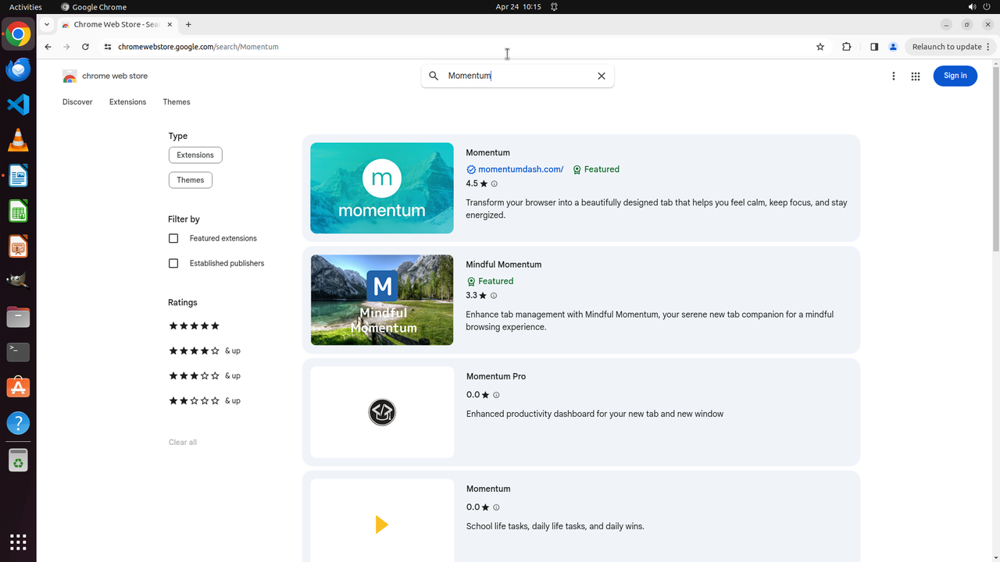

**Response:**
```
I can see "Momentum" at the top of the search results. Let me click on it.
```

**Actions:** `pyautogui.click(936, 292)`

---

## Step 24

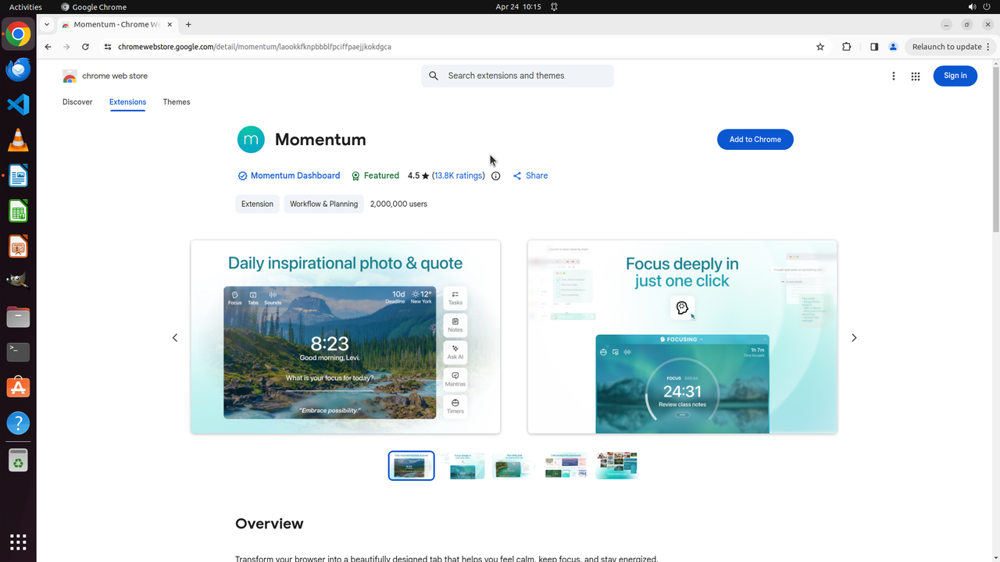

**Response:**
```
I'm on the Momentum page. Let me click "Add to Chrome" to install it.
```

**Actions:** `pyautogui.click(1446, 267)`

---

## Step 25

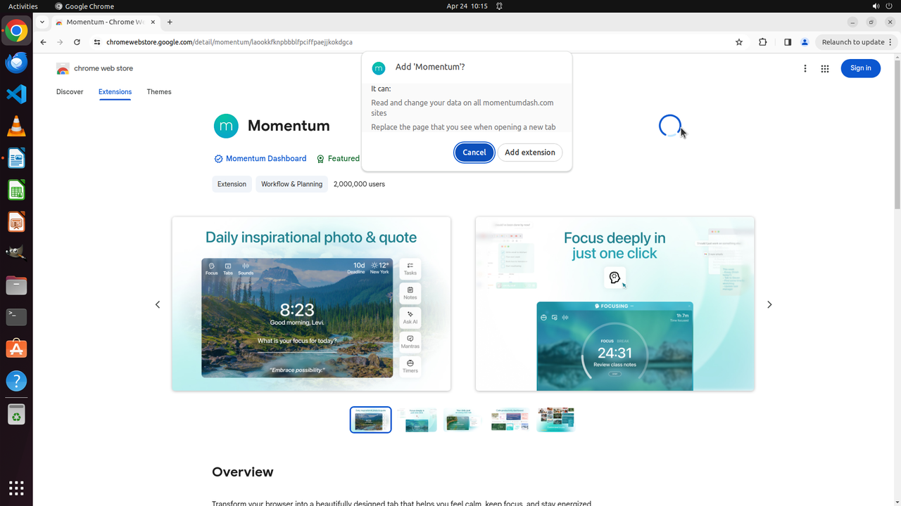

**Response:**
```
The confirmation dialog appeared. Let me click "Add extension" to confirm.
```

**Actions:** `pyautogui.click(1128, 325)`

---

## Step 26

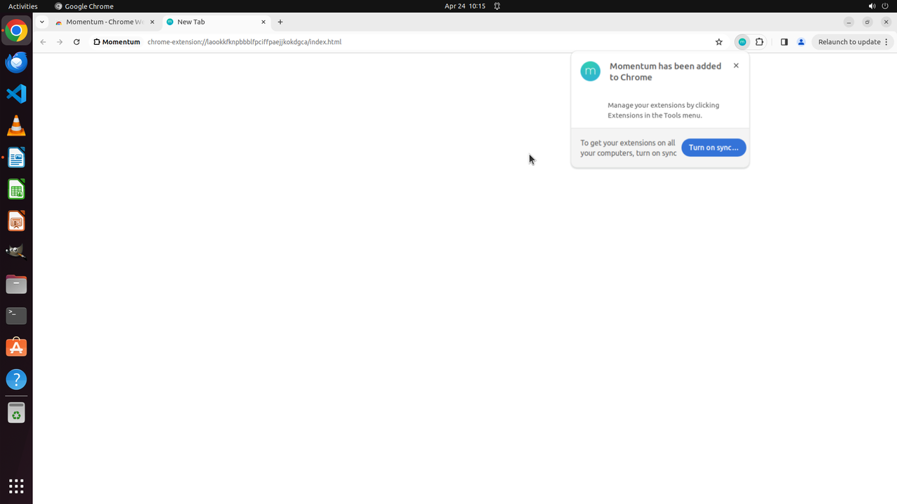

**Response:**
```
Momentum has been successfully installed. It opened a new tab. Let me close the notification and the Momentum tab, then search for the last plugin - "Google Translate".
```

**Actions:** `pyautogui.click(1573, 138)`

---

## Step 27

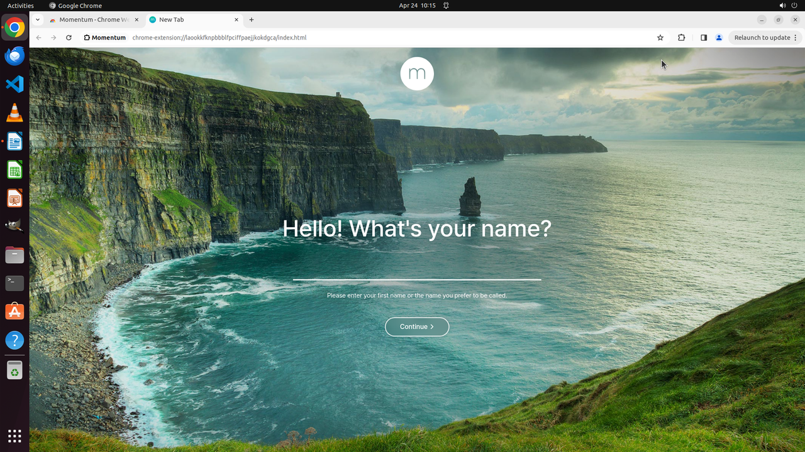

**Response:**
```
Momentum is installed and showing its welcome page. I don't need to set it up. Let me close this tab and go back to the Chrome Web Store tab to search for the last plugin - "Google Translate".
```

**Actions:** `pyautogui.click(564, 46)`

---

## Step 28

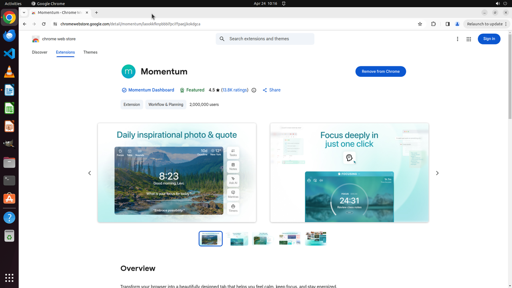

**Response:**
```
Momentum is installed (showing "Remove from Chrome"). Now let me search for the last plugin - "Google Translate".
```

**Actions:** `pyautogui.click(960, 88)`

---

## Step 29

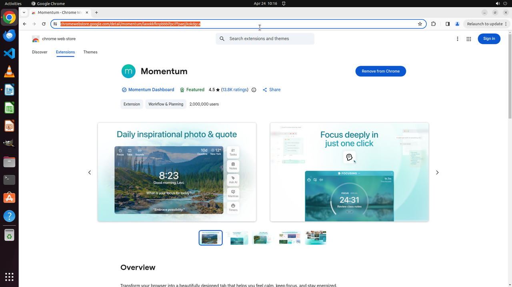

**Actions:** `import subprocess, shlex; subprocess.run(f'xdotool type --delay 12 -- ' + shlex.quote('https://chromewebstore.google.com/search/Google%20'), shell=True, check=True)
import time; time.sleep(0.05)
impor`

---

## Step 30

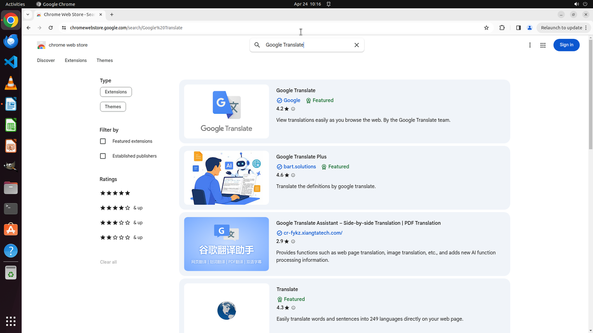

**Response:**
```
I can see "Google Translate" at the top of the search results. Let me click on it.
```

**Actions:** `pyautogui.click(957, 292)`

---

## Step 31

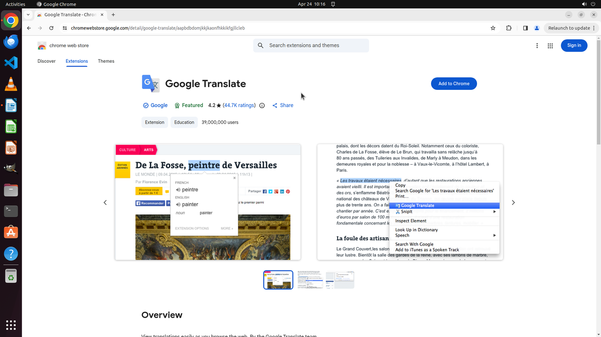

**Response:**
```
I'm on the Google Translate page. There's a context menu open - let me close it first by clicking elsewhere, then click "Add to Chrome".
```

**Actions:** `pyautogui.click(1446, 267)`

---

## Step 32

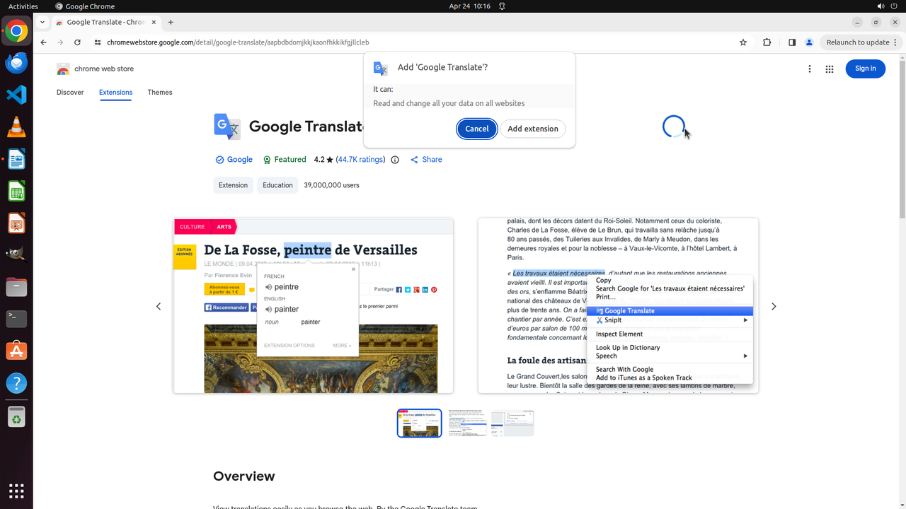

**Response:**
```
The confirmation dialog appeared for Google Translate. Let me click "Add extension" to confirm the installation.
```

**Actions:** `pyautogui.click(1128, 273)`

---

## Step 33

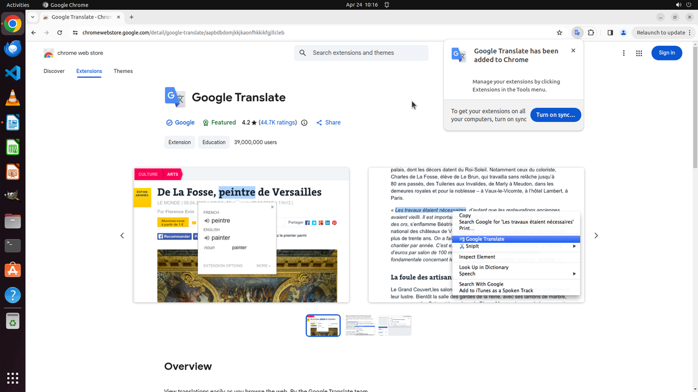

**Response:**
```
Google Translate has been successfully installed! All 5 plugins from the list have been installed:

1. ✅ Zoom Chrome Extension
2. ✅ Speechify Text to Speech Voice Reader
3. ✅ React Developer Tools
4. ✅ Momentum
5. ✅ Google Translate

DONE
```

**Actions:** `DONE`

---
