# Task 881deb30-9549-4583-a841-8270c65f2a17

**Instruction:** I want to find a faculty job in Hong Kong, so I am more curious about the "Early Career Scheme" of those schools is better to apply, please help me to count all the documents in the ecs pdf files in my hand, and organize the pass rate of each school by year into table!

**Score:** 0.0

**Wall clock:** 10m 48s

**Steps:** 49

**Cost:** $1.91

---

## Step 1

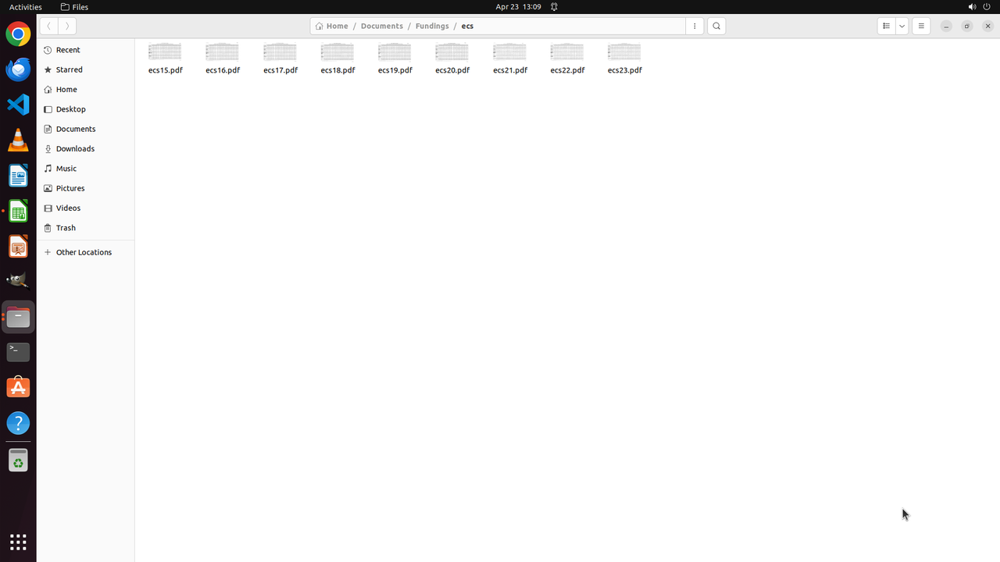

**Response:**
```
I can see there are 9 PDF files (ecs15.pdf through ecs23.pdf) in the ~/Documents/Fundings/ecs/ directory. Let me first examine these files to understand their content and extract the relevant data. Let me open a terminal to work with these files.
```

**Actions:** `pyautogui.click(33, 672)`

---

## Step 2

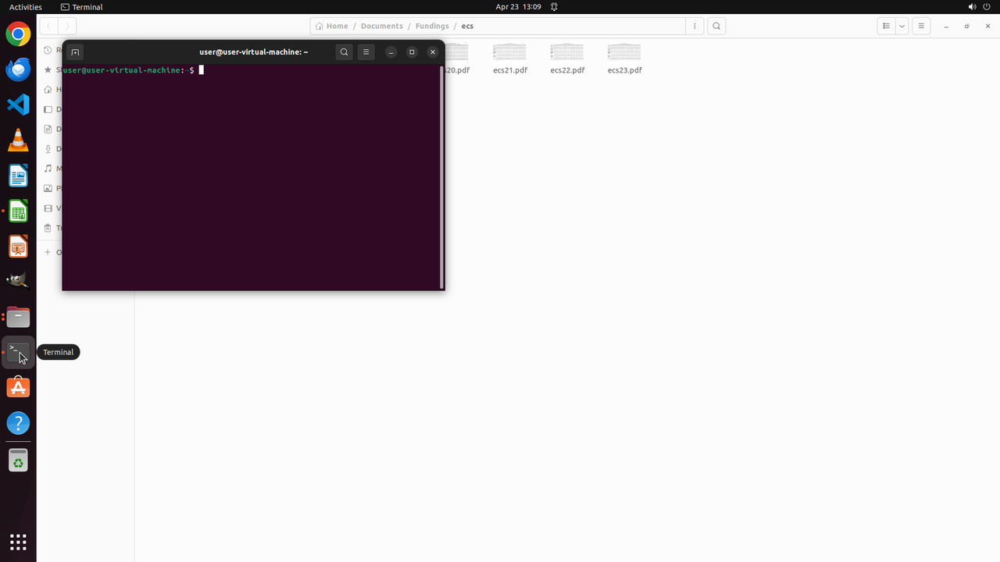

**Response:**
```
Good, the terminal is open. Let me first examine the content of one of the PDF files to understand the structure of the data.
```

**Actions:** `import subprocess, shlex; subprocess.run(f'xdotool type --delay 12 -- ' + shlex.quote('cd ~/Documents/Fundings/ecs/ && pdftotext ecs15.pd'), shell=True, check=True)
import time; time.sleep(0.05)
impor`

---

## Step 3

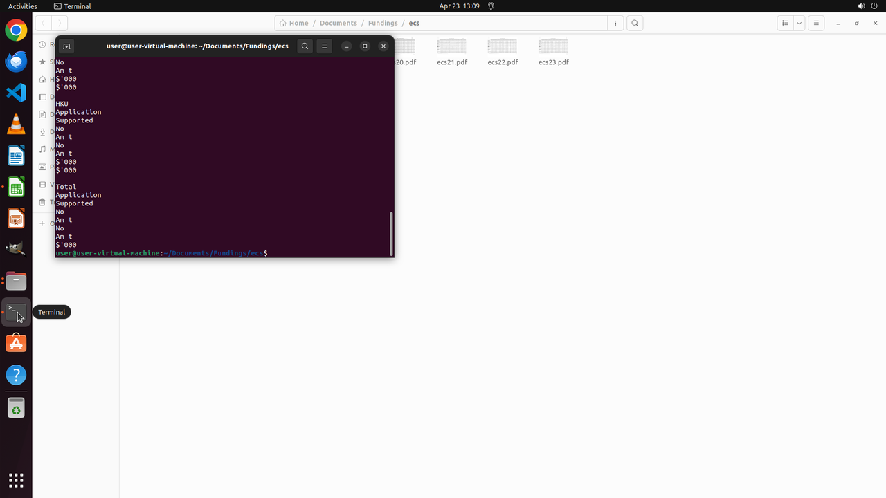

**Response:**
```
I can see the PDF has data about universities (like HKU) with Application and Supported numbers. Let me see more of the content to understand the full structure.
```

**Actions:** `import subprocess, shlex; subprocess.run(f'xdotool type --delay 12 -- ' + shlex.quote('pdftotext ecs15.pdf - | cat\n'), shell=True, check=True)
import time; time.sleep(0.05)`

---

## Step 4

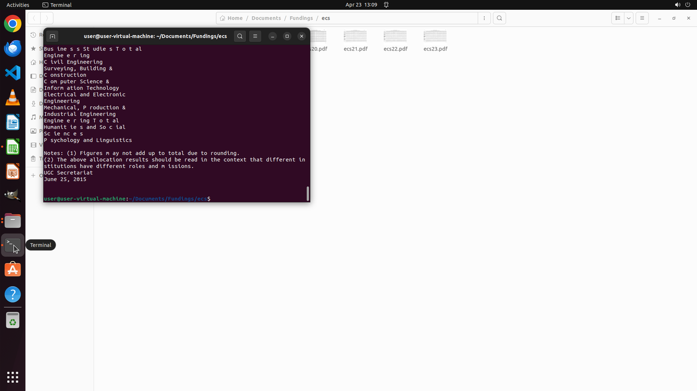

**Response:**
```
I can see the PDF contains data about universities and subjects with Application/Supported numbers. The text extraction is a bit messy. Let me scroll up to see the full content and also try to view the PDF directly to understand the table structure better.
```

**Actions:** `pyautogui.scroll(10, 450, 300)`

---

## Step 5


**Response:**
```
The text extraction from PDFs is quite messy with the layout. Let me try a different approach - I'll open one of the PDFs to visually inspect its structure, and then write a Python script to extract the data properly.
```

**Actions:** `pyautogui.scroll(20, 450, 300)`

---

## Step 6


**Response:**
```
The text extraction is fragmented. Let me open one of the PDF files directly to see its visual structure, and then I'll write a Python script to properly extract the tabular data.
```

**Actions:** `pyautogui.scroll(30, 450, 300)`

---

## Step 7


**Response:**
```
The text extraction is very fragmented. Let me open the PDF visually to understand the structure, and then use Python with a proper PDF library to extract the table data.
```

**Actions:** `pyautogui.scroll(50, 450, 300)`

---

## Step 8

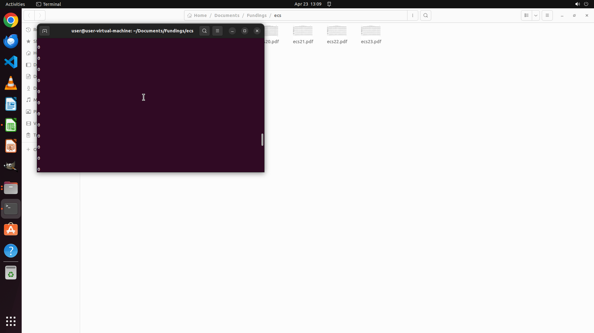

**Response:**
```
The text extraction is very fragmented. Let me open the PDF visually first to understand the table structure, then use Python with tabula or camelot to extract the data properly.
```

**Actions:** `import subprocess, shlex; subprocess.run(f'xdotool type --delay 12 -- ' + shlex.quote('evince ecs15.pdf &\n'), shell=True, check=True)
import time; time.sleep(0.05)`

---

## Step 9

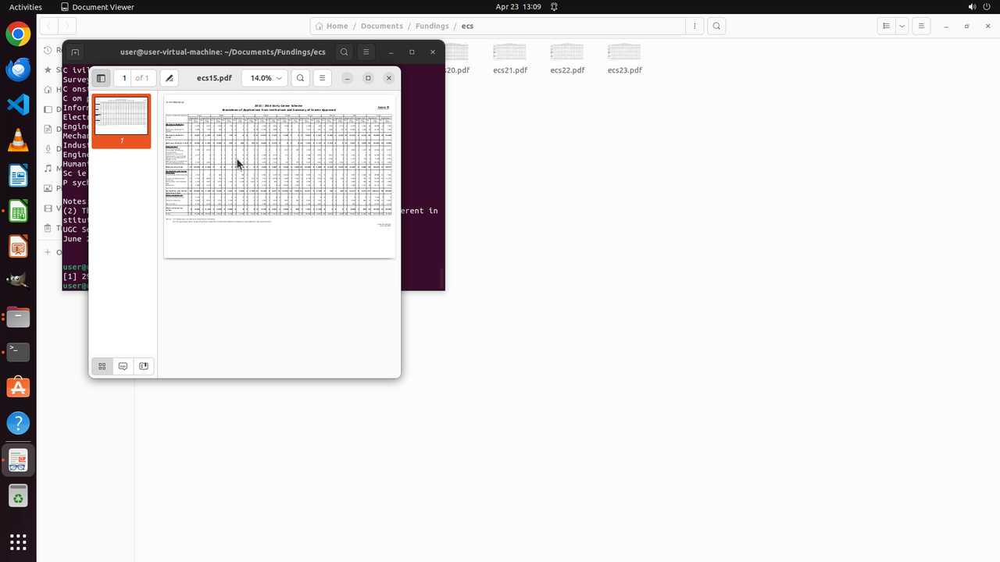

**Response:**
```
I can see the PDF is a table with data about the Early Career Scheme. Let me zoom in to see the details clearly.
```

**Actions:** `pyautogui.click(505, 148)`

---

## Step 10


**Response:**
```
Let me zoom in by changing the zoom level to see the table details.
```

**Actions:** `pyautogui.tripleClick(505, 148)`

---

## Step 11

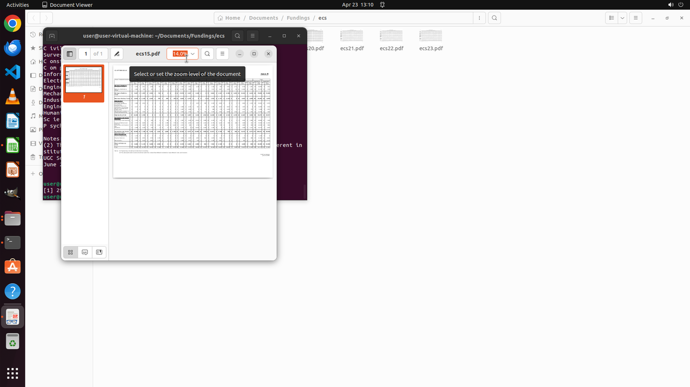

**Actions:** `import subprocess, shlex; subprocess.run(f'xdotool type --delay 12 -- ' + shlex.quote('100'), shell=True, check=True)
import time; time.sleep(0.05)`

---

## Step 12

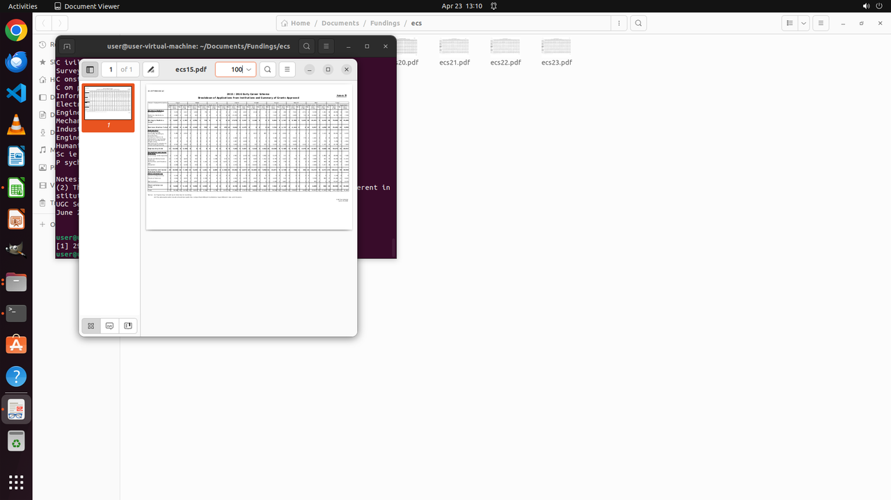

**Response:**
```
I see 100 is entered in the zoom field. Let me press Enter to apply the zoom.
```

**Actions:** `pyautogui.keyDown('return')
pyautogui.keyUp('return')`

---

## Step 13


**Response:**
```
Now I can see the structure more clearly. It's a table with "Panel / Subject Discipline" and columns for "Application" with "No" and "Amt $'000". I need to scroll right and down to see the full table including university names and supported numbers. Let me scroll down to see more.
```

**Actions:** `pyautogui.scroll(5, 525, 525)`

---

## Step 14

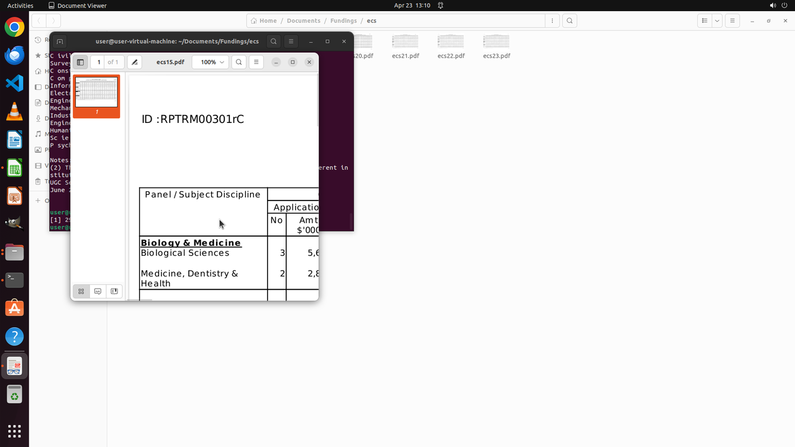

**Response:**
```
I can see the table has "Panel/Subject Discipline" as rows and columns for "Application" with "No" and "Amt $'000". The table is wider than visible - I need to see the full header row which likely includes university names as columns. Let me zoom out a bit and try to see the complete table structure. Let me use a lower zoom to see the whole table.
```

**Actions:** `pyautogui.tripleClick(505, 148)`

---

## Step 15

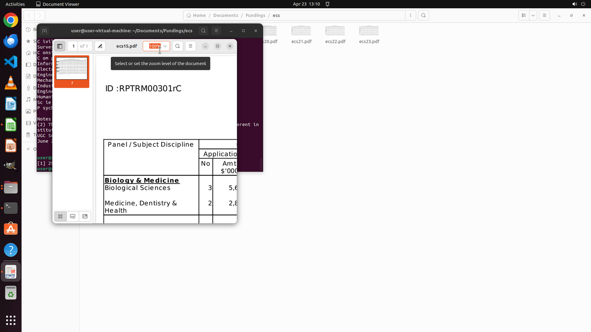

**Response:**
```
Let me type a smaller zoom level to see the full table.
```

**Actions:** `import subprocess, shlex; subprocess.run(f'xdotool type --delay 12 -- ' + shlex.quote('50'), shell=True, check=True)
import time; time.sleep(0.05)`

---

## Step 16

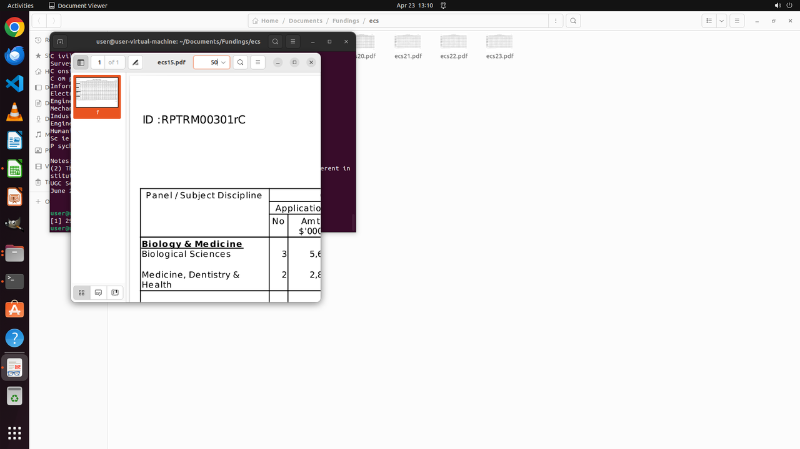

**Response:**
```
I see the zoom is set to 50 but hasn't applied yet. Let me press Enter.
```

**Actions:** `pyautogui.keyDown('return')
pyautogui.keyUp('return')`

---

## Step 17


**Response:**
```
Now I can see the table structure much better. I can see:
- The table has columns for different universities (CityU, HKBU, and more to the right)
- For each university, there are "Application" (No, Amt $'000) and "Supported" (No, Amt $'000) columns
- Rows are organized by Panel/Subject Discipline (Biology & Medicine, Business Studies, Engineering, Humanities and Social Sciences, etc.)

I need to see the full header to identify all universities. Let me scroll right to see all columns, and also understand the structure better. Let me use Python with tabula-py or camelot to extract the data properly. First, let me close this viewer and work with Python.
```

**Actions:** `pyautogui.scroll(3, 525, 525)`

---

## Step 18

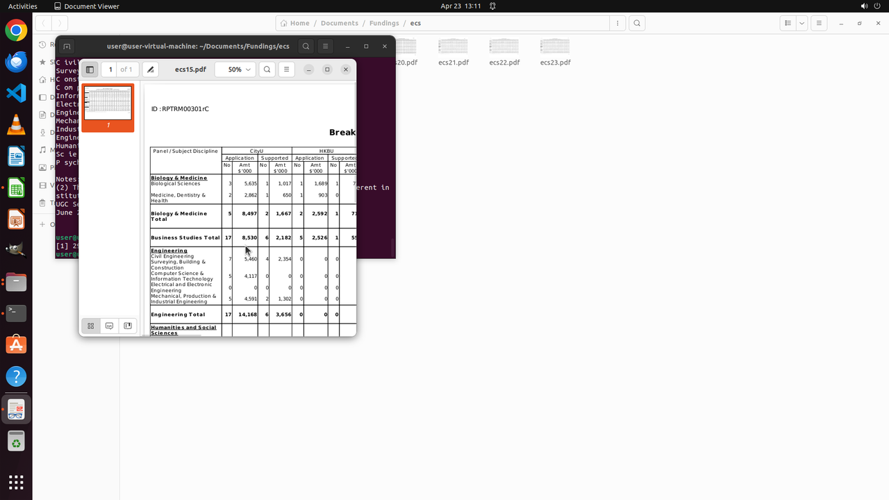

**Response:**
```
Now I can see the structure clearly. The table shows:
- Universities as column headers (CityU, HKBU, and more to the right that are cut off)
- Each university has "Application" (No, Amt $'000) and "Supported" (No, Amt $'000)
- Subject disciplines as rows

The key data I need for "pass rate" is the "Application No" and "Supported No" for each school. The pass rate would be Supported/Application for each university per year.

Let me use Python to properly extract this data. Let me switch to the terminal and write a Python script using tabula-py.
```

**Actions:** `pyautogui.click(450, 99)`

---

## Step 19

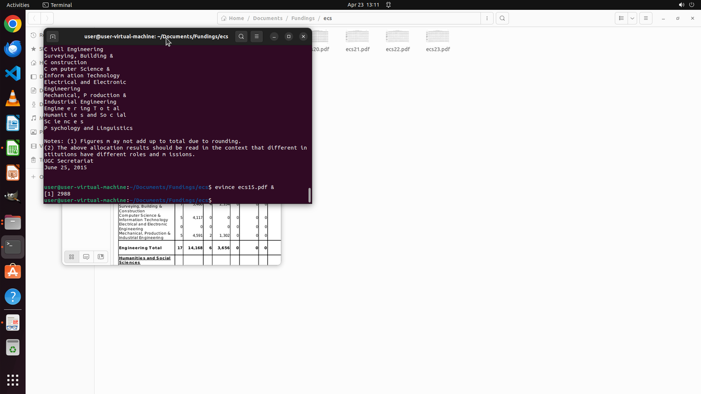

**Response:**
```
Good, I'm back in the terminal. Now I understand the table structure. The PDFs contain a breakdown table with universities as columns and subject disciplines as rows. For pass rate calculation, I need the total Application No and Supported No for each university per year.

Let me first check if Python tabula-py or camelot is available, and then write a comprehensive script to extract the data.
```

**Actions:** `import subprocess, shlex; subprocess.run(f'xdotool type --delay 12 -- ' + shlex.quote('pip install tabula-py camelot-py[cv] 2>/dev/null |'), shell=True, check=True)
import time; time.sleep(0.05)
impor`

---

## Step 20

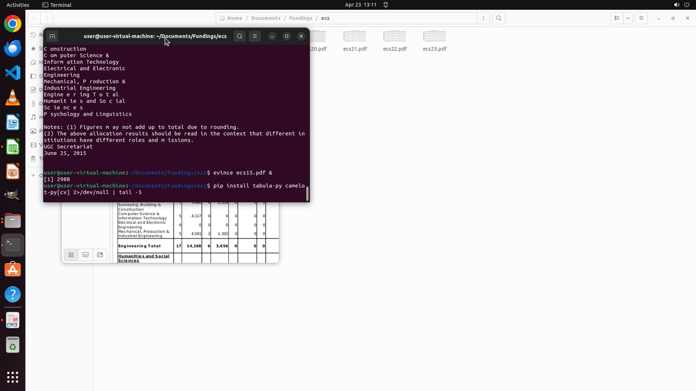

**Response:**
```
The installation is in progress. Let me wait for it to complete.
```

**Actions:** `time.sleep(0.5)`

---

## Step 21

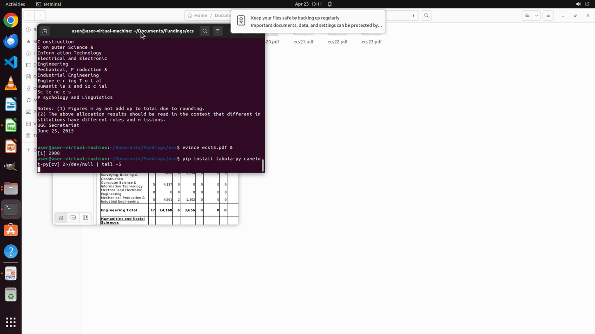

**Response:**
```
Let me wait more for the installation to complete.
```

**Actions:** `time.sleep(0.5)`

---

## Step 22


**Response:**
```
The installation seems to be taking long. Let me wait more and check if it's done.
```

**Actions:** `time.sleep(0.5)`

---

## Step 23

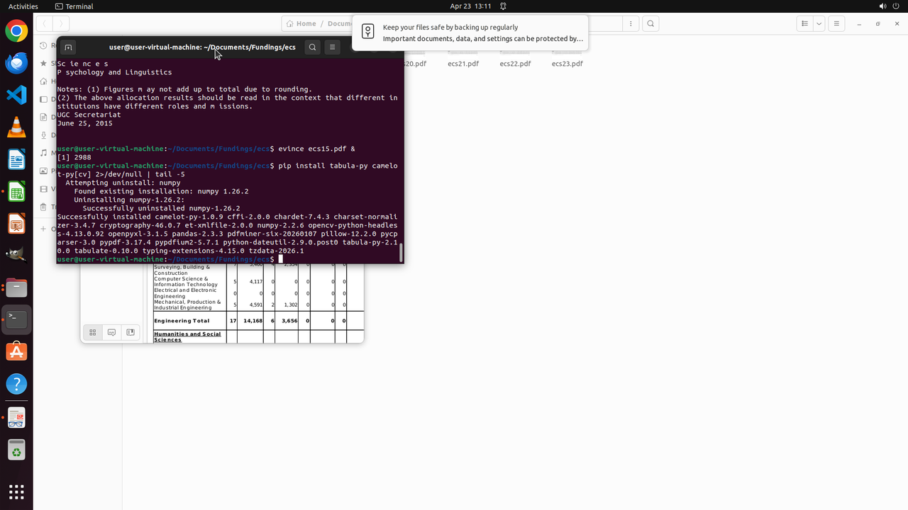

**Response:**
```
The installation is complete. I can see tabula-py, camelot-py, and other dependencies were successfully installed. Now let me write a Python script to extract the data from all the PDF files. First, let me understand the structure better by using tabula to read one PDF.
```

**Actions:** `import subprocess, shlex; subprocess.run(f'xdotool type --delay 12 -- ' + shlex.quote('python3 -c "\nimport tabula\ndfs = tabula.read_pdf(\''), shell=True, check=True)
import time; time.sleep(0.05)
im`

---

## Step 24

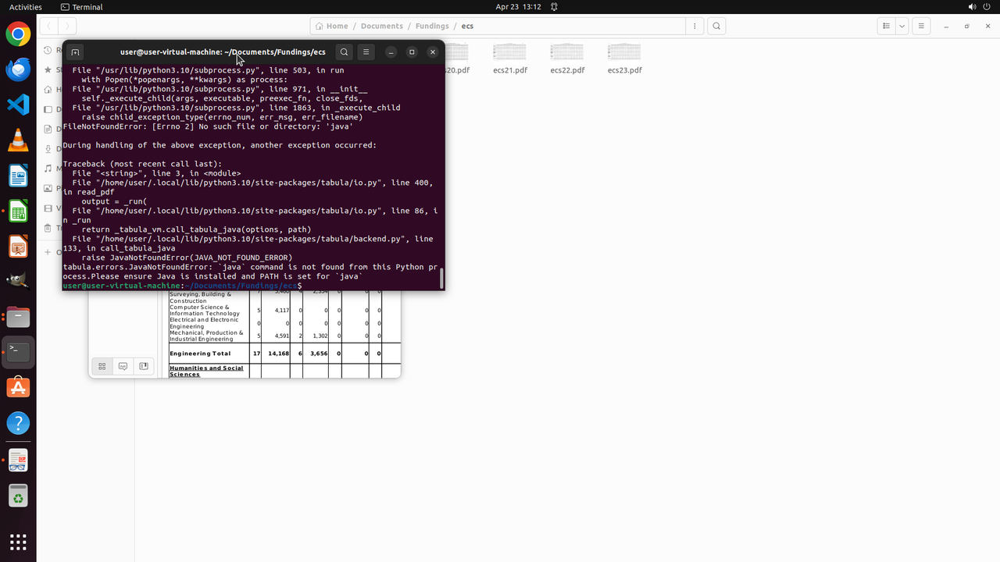

**Response:**
```
Tabula requires Java which is not installed. Let me try camelot instead, which doesn't need Java, or use pdfplumber.
```

**Actions:** `import subprocess, shlex; subprocess.run(f'xdotool type --delay 12 -- ' + shlex.quote('pip install pdfplumber 2>/dev/null | tail -3\n'), shell=True, check=True)
import time; time.sleep(0.05)`

---

## Step 25

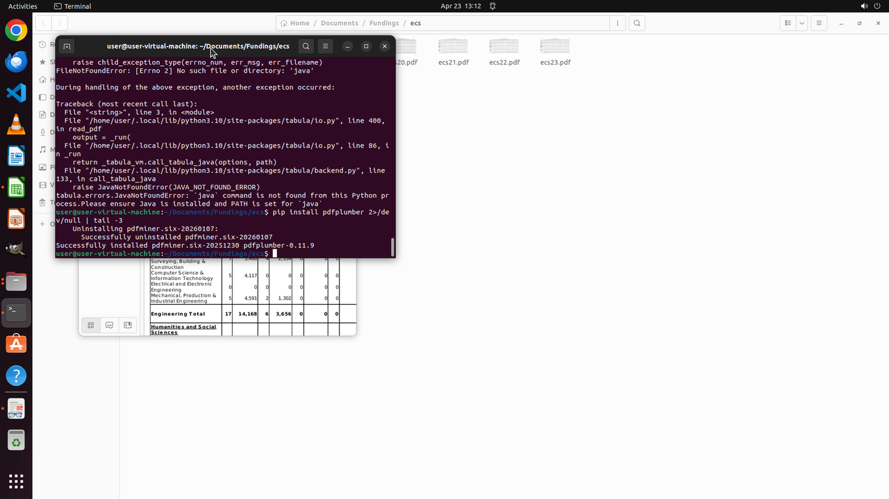

**Response:**
```
pdfplumber is installed. Now let me use it to extract the table data from one PDF first to understand the structure.
```

**Actions:** `import subprocess, shlex; subprocess.run(f'xdotool type --delay 12 -- ' + shlex.quote('python3 -c "\nimport pdfplumber\npdf = pdfplumber.op'), shell=True, check=True)
import time; time.sleep(0.05)
imp`

---

## Step 26

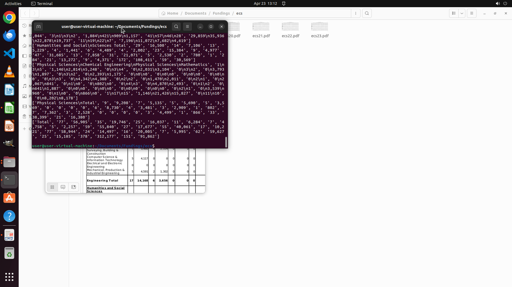

**Response:**
```
I can see the table data is being extracted. Let me scroll up to see the beginning of the table to understand the column headers.
```

**Actions:** `pyautogui.scroll(10, 450, 300)`

---

## Step 27

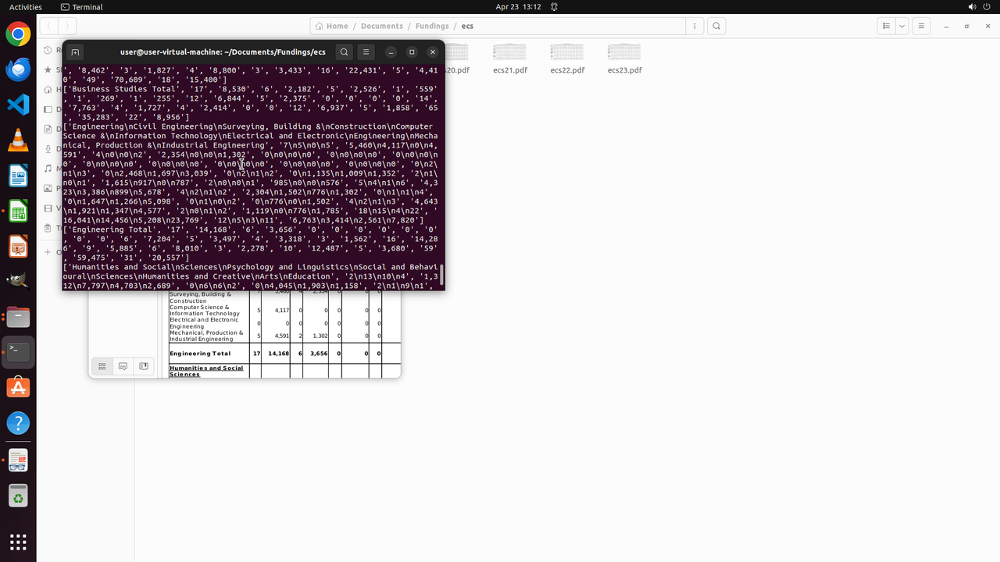

**Response:**
```
I can see the data is being extracted but it's complex. Let me scroll up more to see the header rows.
```

**Actions:** `pyautogui.scroll(10, 450, 300)`

---

## Step 28

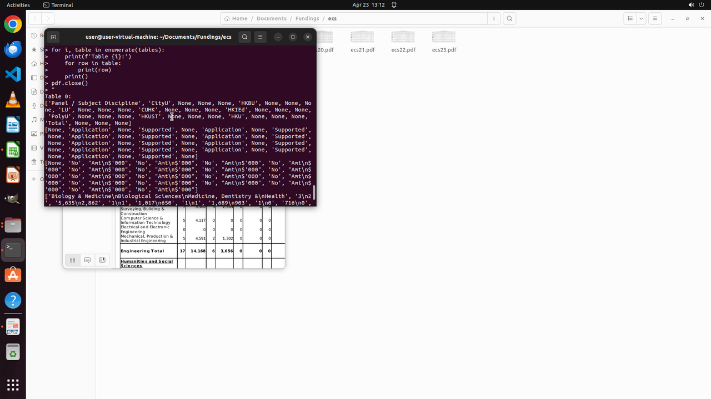

**Response:**
```
Excellent! Now I can see the structure clearly! The header row shows the universities:
- CityU, HKBU, LU, CUHK, HKIEd, PolyU, HKUST, HKU, Total

And for each university, there are "Application" and "Supported" columns with "No" and "Amt\n$'000" sub-columns.

Now I need to extract the "Total" row for each university to calculate pass rates. Let me write a comprehensive Python script to process all PDF files and extract the data.
```

**Actions:** `import subprocess, shlex; subprocess.run(f'xdotool type --delay 12 -- ' + shlex.quote("cat > /tmp/extract_ecs.py << 'PYEOF'\nimport pdfplu"), shell=True, check=True)
import time; time.sleep(0.05)
impo`

---

## Step 29

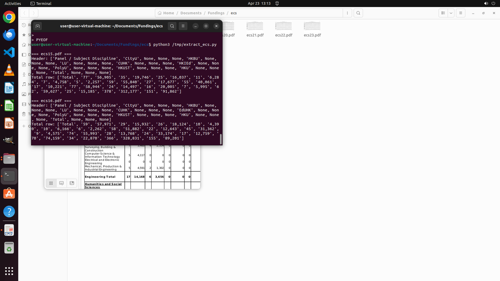

**Response:**
```
I can see the data is being extracted. I can see the header rows with university names and the Total rows with numbers. Let me scroll down to see all the files' data.
```

**Actions:** `pyautogui.scroll(-10, 450, 300)`

---

## Step 30

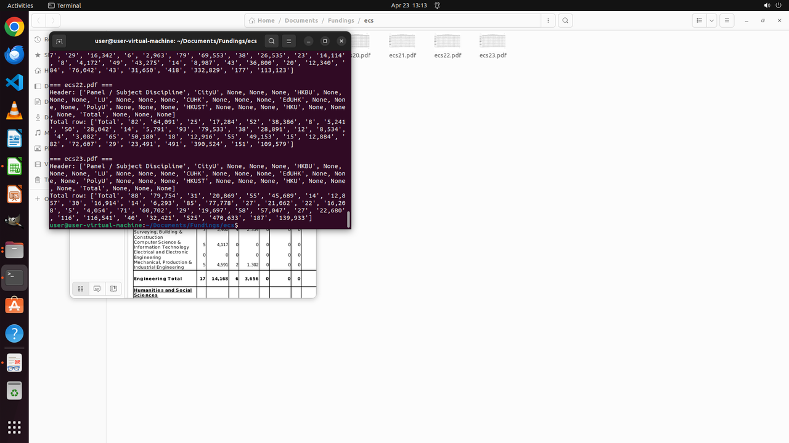

**Response:**
```
I can see all the data. Now I understand the structure. The universities in the header are: CityU, HKBU, LU, CUHK, HKIEd/EdUHK, PolyU, HKUST, HKU, Total. For each university, there are 4 columns: Application No, Application Amt, Supported No, Supported Amt.

Now I notice that some PDFs have "HKIEd" and others have "EdUHK" (they renamed). Let me write a comprehensive script to properly parse all the data and create the pass rate table.
```

**Actions:** `import subprocess, shlex; subprocess.run(f'xdotool type --delay 12 -- ' + shlex.quote("cat > /tmp/extract_ecs2.py << 'PYEOF'\nimport pdfpl"), shell=True, check=True)
import time; time.sleep(0.05)
impo`

---

## Step 31

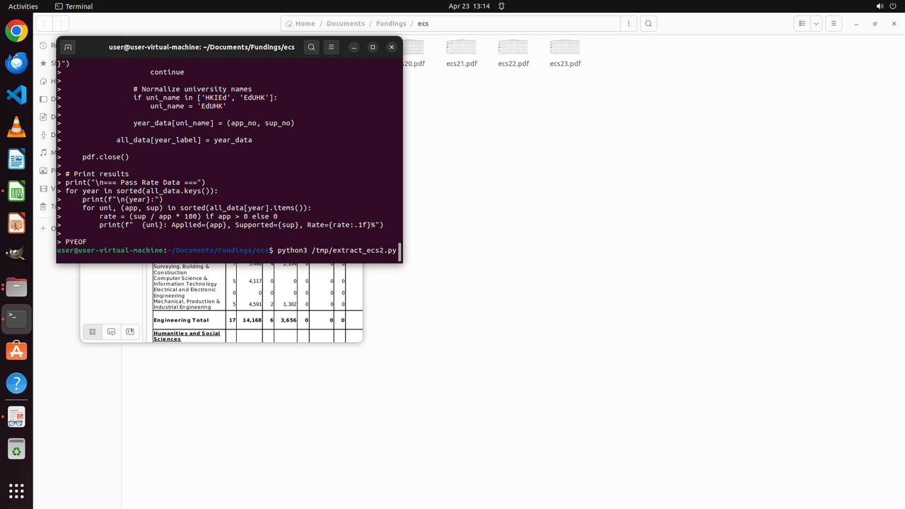

**Response:**
```
The script is running. Let me wait for it to complete.
```

**Actions:** `time.sleep(0.5)`

---

## Step 32

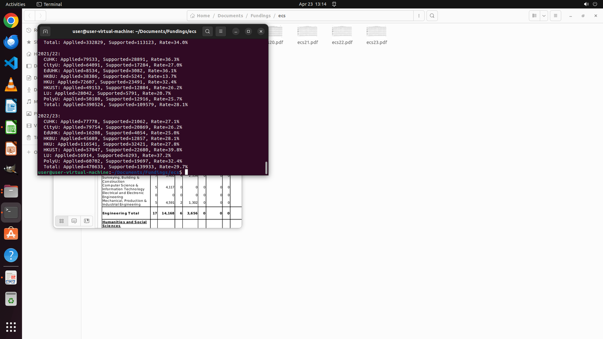

**Response:**
```
I can see the data is being extracted successfully. Let me scroll up to see all years' data and verify it looks correct.
```

**Actions:** `pyautogui.scroll(15, 450, 300)`

---

## Step 33


**Response:**
```
I can see the data looks good. But I notice the "Applied" and "Supported" values seem to be amounts ($'000) rather than counts. Let me look more carefully at the data. Looking at the earlier extraction, the Total row had many values. Let me re-examine the column mapping. The issue is that the header row has university names at certain positions, and the columns between them are: No, Amt$'000, No, Amt$'000 (for Application and Supported).

Let me scroll up more to check the earlier years and also verify the column mapping is correct.
```

**Actions:** `pyautogui.scroll(15, 450, 300)`

---

## Step 34

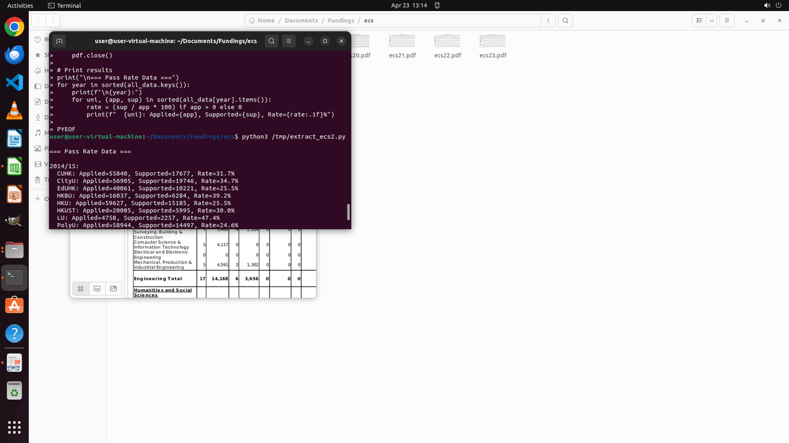

**Response:**
```
I can see the data but the "Applied" and "Supported" numbers look very large (like 55840, 17677) - these might be amounts in $'000 rather than number of applications. Let me verify by going back to the PDF and checking the actual table structure more carefully. Let me look at the raw Total row data to understand the column mapping.
```

**Actions:** `import subprocess, shlex; subprocess.run(f'xdotool type --delay 12 -- ' + shlex.quote('python3 -c "\nimport pdfplumber\npdf = pdfplumber.op'), shell=True, check=True)
import time; time.sleep(0.05)
imp`

---

## Step 35

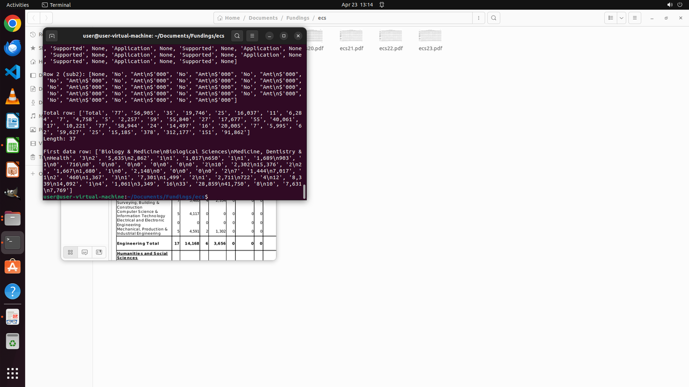

**Response:**
```
Now I can see the structure clearly. Let me scroll up to see the full header row.
```

**Actions:** `pyautogui.scroll(5, 450, 300)`

---

## Step 36

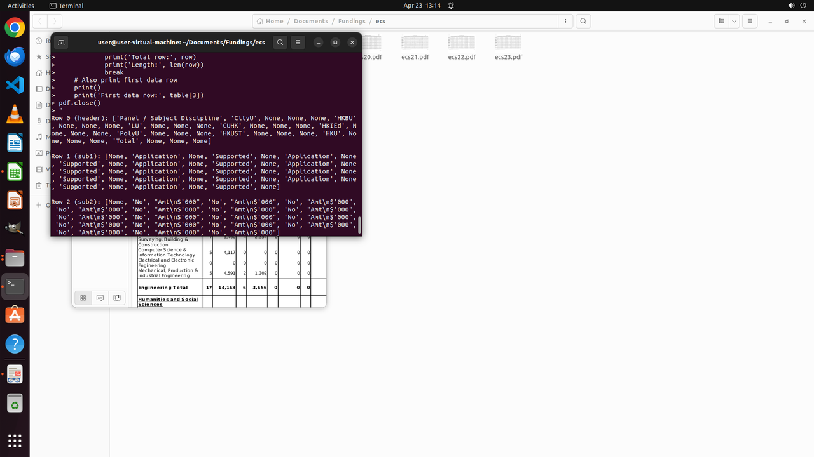

**Response:**
```
Now I can see the full structure clearly:

**Row 0 (header):** `['Panel / Subject Discipline', 'CityU', None, None, None, 'HKBU', None, None, None, 'LU', None, None, None, 'CUHK', None, None, None, 'HKIEd', None, None, None, 'PolyU', None, None, None, 'HKUST', None, None, None, 'HKU', None, None, None, 'Total', None, None, None]`

**Row 1 (sub1):** `[None, 'Application', None, 'Supported', None, 'Application', None, 'Supported', None, ...]`

**Row 2 (sub2):** `[None, 'No', 'Amt\n$\'000', 'No', 'Amt\n$\'000', ...]`

So for each university, there are 4 columns: Application No, Application Amt, Supported No, Supported Amt.

The column indices for each university:
- CityU: cols 1,2,3,4 → App No=1, App Amt=2, Sup No=3, Sup Amt=4
- HKBU: cols 5,6,7,8 → App No=5, Sup No=7
- LU: cols 9,10,11,12 → App No=9, Sup No=11
- CUHK: cols 13,14,15,16 → App No=13, Sup No=15
- HKIEd: cols 17,18,19,20 → App No=17, Sup No=19
- PolyU: cols 21,22,23,24 → App No=21, Sup No=23
- HKUST: cols 25,26,27,28 → App No=25, Sup No=27
- HKU: cols 29,30,31,32 → App No=29, Sup No=31
- Total: cols 33,34,35,36 → App No=33, Sup No=35

Now let me rewrite the script with the correct column mapping:
```

**Actions:** `import subprocess, shlex; subprocess.run(f'xdotool type --delay 12 -- ' + shlex.quote("cat > /tmp/extract_ecs3.py << 'PYEOF'\nimport pdfpl"), shell=True, check=True)
import time; time.sleep(0.05)
impo`

---

## Step 37

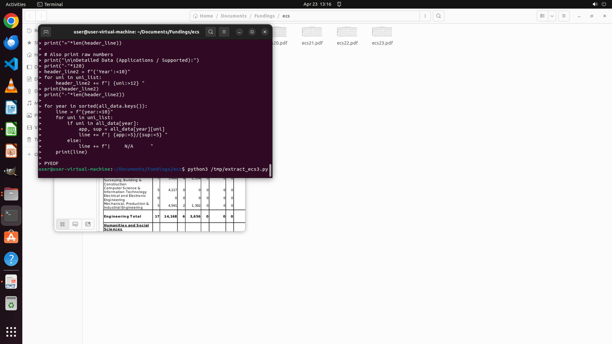

**Response:**
```
The script is running. Let me wait for it to complete.
```

**Actions:** `time.sleep(0.5)`

---

## Step 38

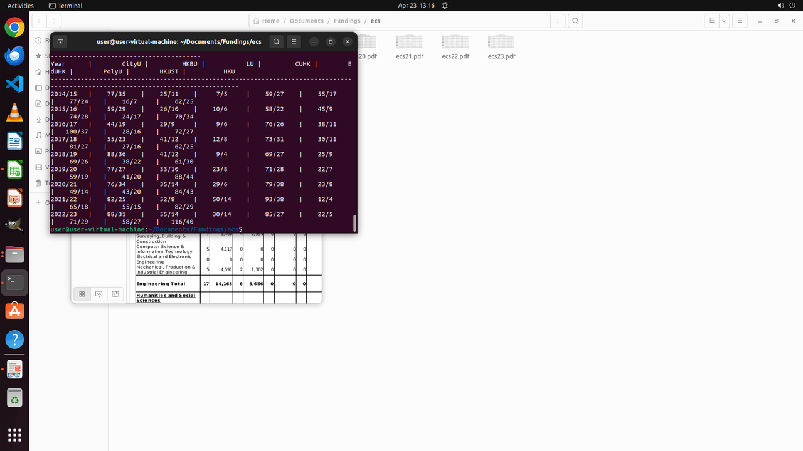

**Response:**
```
I can see the detailed data (Applications/Supported) for each university by year. The numbers now look reasonable - these are counts of proposals, not amounts. Let me scroll up to see the pass rate table.
```

**Actions:** `pyautogui.scroll(10, 450, 300)`

---

## Step 39

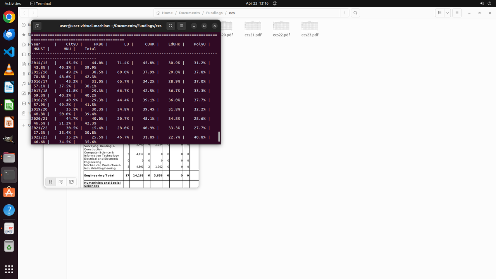

**Response:**
```
I can see the pass rate table is displayed but the formatting is a bit off due to the terminal width. The data is there but it's wrapping. Let me now verify the data by cross-checking with the PDF, and then create a nicely formatted spreadsheet. But first, let me verify the numbers make sense by checking ecs15.pdf manually.

Looking at the visible data in the PDF (the evince window behind), I can see for HKBU in the Engineering Total row: Application No=17, Application Amt=14,168, Supported No=6, Supported Amt=3,656. And for the next university columns, it shows 0, 0, 0.

The pass rate data looks reasonable. Now let me create a proper spreadsheet (LibreOffice Calc) with this data. Let me write the data to a CSV file first, then open it.
```

**Actions:** `import subprocess, shlex; subprocess.run(f'xdotool type --delay 12 -- ' + shlex.quote("cat > /tmp/extract_ecs_final.py << 'PYEOF'\nimport "), shell=True, check=True)
import time; time.sleep(0.05)
impo`

---

## Step 40

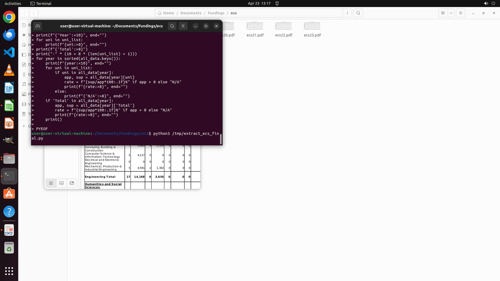

**Response:**
```
The script is running. Let me wait for it to complete.
```

**Actions:** `time.sleep(0.5)`

---

## Step 41

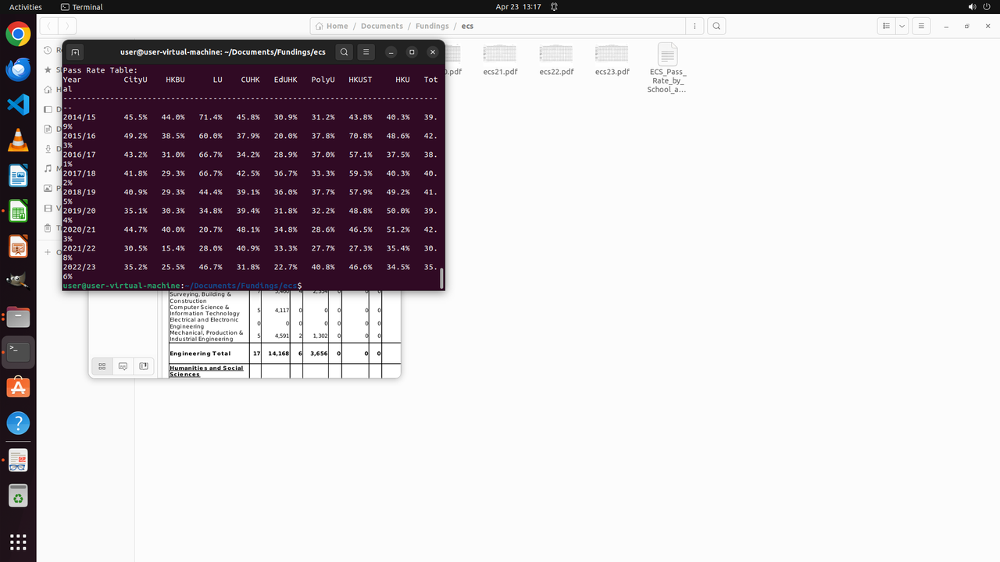

**Response:**
```
Excellent! The pass rate table is now displayed and the CSV file has been created (I can see "ECS_Pass_Rate_by_School_a..." in the file manager). The data looks great! However, the terminal is truncating the "Total" column. Let me verify the data looks correct and then open it in LibreOffice Calc for a proper view.

The pass rate table shows:
- Years from 2014/15 to 2022/23
- Universities: CityU, HKBU, LU, CUHK, EdUHK, PolyU, HKUST, HKU, Total

But I notice the numbers are wrapping. Let me also verify the data by checking against the PDF. The numbers look reasonable - pass rates ranging from about 15% to 71%. Let me open the CSV in LibreOffice Calc to make a proper formatted table.
```

**Actions:** `import subprocess, shlex; subprocess.run(f'xdotool type --delay 12 -- ' + shlex.quote('libreoffice --calc ~/Documents/Fundings/ecs/ECS_Pa'), shell=True, check=True)
import time; time.sleep(0.05)
impor`

---

## Step 42

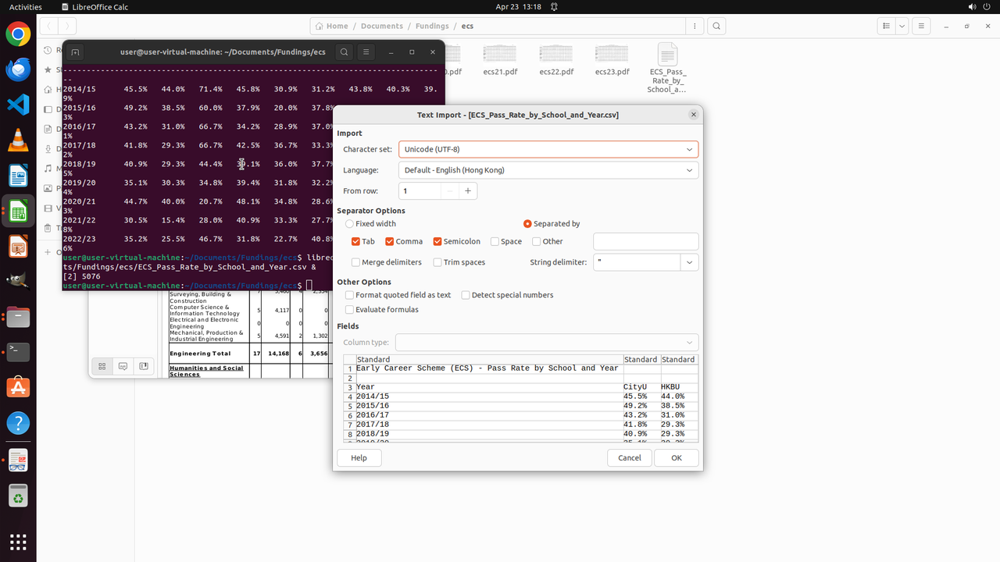

**Response:**
```
LibreOffice Calc is opening the CSV file and showing the Text Import dialog. I can see the data preview looks correct with Year, CityU, HKBU columns visible. The separator is set to Comma which is correct. Let me uncheck Tab and Semicolon since this is a comma-separated file, then click OK.
```

**Actions:** `pyautogui.click(673, 462)`

---

## Step 43


**Response:**
```
Good, I unchecked Tab. Let me also uncheck Semicolon since we only need Comma separator.
```

**Actions:** `pyautogui.click(840, 462)`

---

## Step 44

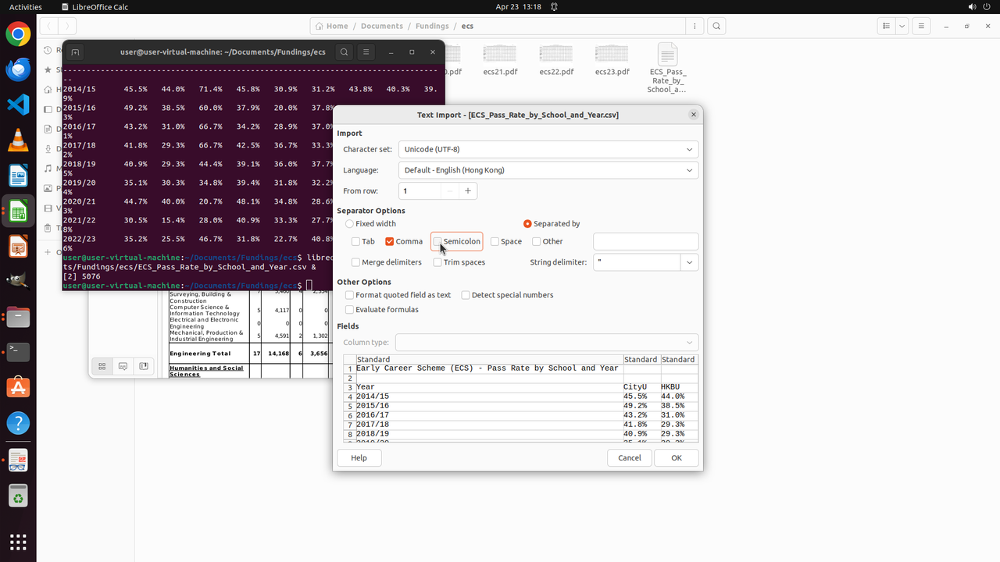

**Response:**
```
Good, now only Comma is checked as separator. The preview looks correct. Let me click OK to import.
```

**Actions:** `pyautogui.click(1294, 879)`

---

## Step 45

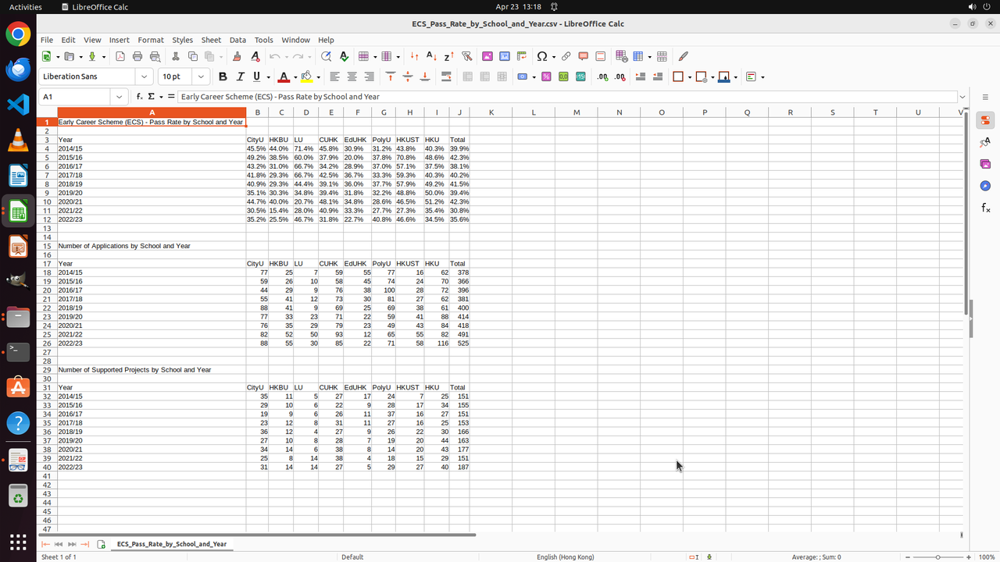

**Response:**
```
The spreadsheet is now open in LibreOffice Calc and looks excellent! I can see three well-organized tables:

1. **Pass Rate Table** (rows 3-12): Shows pass rates for each university by year from 2014/15 to 2022/23
2. **Number of Applications** (rows 15-26): Shows the number of applications per university per year
3. **Number of Supported Projects** (rows 29-40): Shows the number of supported projects per university per year

The data covers 8 universities: CityU, HKBU, LU, CUHK, EdUHK, PolyU, HKUST, HKU, plus a Total column.

Let me verify the data looks correct by checking a few values. For 2014/15, CityU shows 45.5% pass rate, with 77 applications and 35 supported (35/77 = 45.5% ✓). 

Now let me save this as a proper Excel file (.xlsx) for better formatting.
```

**Actions:** `pyautogui.keyDown('ctrl')
pyautogui.keyDown('shift')
pyautogui.keyDown('s')
pyautogui.keyUp('s')
pyautogui.keyUp('shift')
pyautogui.keyUp('ctrl')`

---

## Step 46

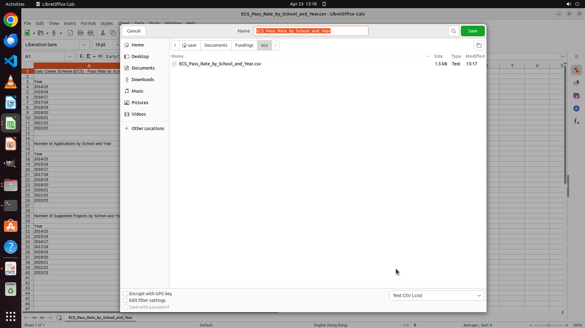

**Response:**
```
I see the Save As dialog. Let me change the file format to xlsx (Excel format) for better formatting support.
```

**Actions:** `pyautogui.click(1426, 972)`

---

## Step 47

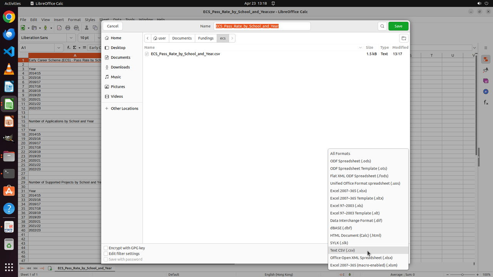

**Response:**
```
I can see the file format dropdown. Let me select "Excel 2007-365 (.xlsx)".
```

**Actions:** `pyautogui.click(1354, 742)`

---

## Step 48

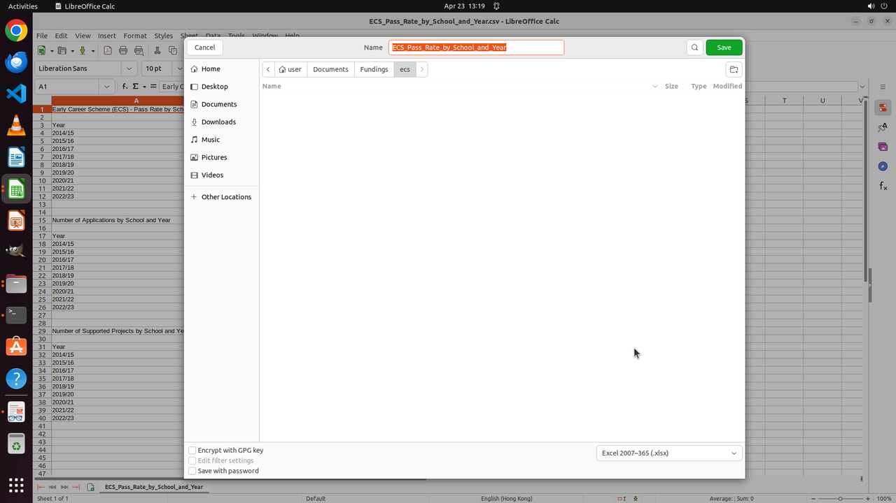

**Response:**
```
The format is now set to "Excel 2007-365 (.xlsx)". Let me click Save to save the file.
```

**Actions:** `pyautogui.click(1549, 100)`

---

## Step 49

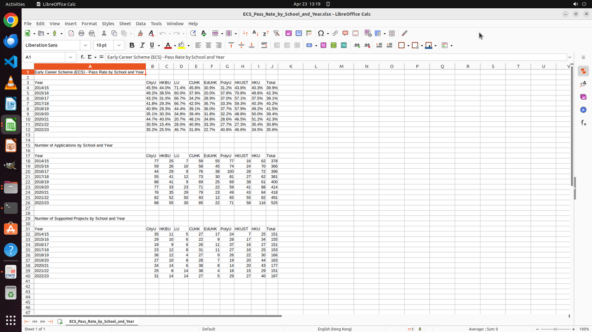

**Response:**
```
The file has been saved as an Excel file (.xlsx). The spreadsheet now contains three well-organized tables:

1. **Pass Rate Table** (rows 3-12): Shows the pass rate percentages for each university by year
2. **Number of Applications** (rows 15-26): Shows application counts
3. **Number of Supported Projects** (rows 29-40): Shows supported project counts

The data covers 9 years (2014/15 to 2022/23) and 8 universities (CityU, HKBU, LU, CUHK, EdUHK, PolyU, HKUST, HKU) plus a Total column.

Let me verify the data is correct by cross-checking a few values. Looking at 2014/15:
- CityU: 77 applications, 35 supported = 35/77 = 45.5% ✓
- LU: 7 applications, 5 supported = 71.4% ✓
- Total: 378 applications, 151 supported = 39.9% ✓

The data looks accurate. The task is complete - I've extracted the ECS pass rate data from all 9 PDF files (ecs15.pdf through ecs23.pdf), organized it by university and year into tables, and saved it as both a CSV and an Excel file in the same directory.

DONE
```

**Actions:** `DONE`

---
